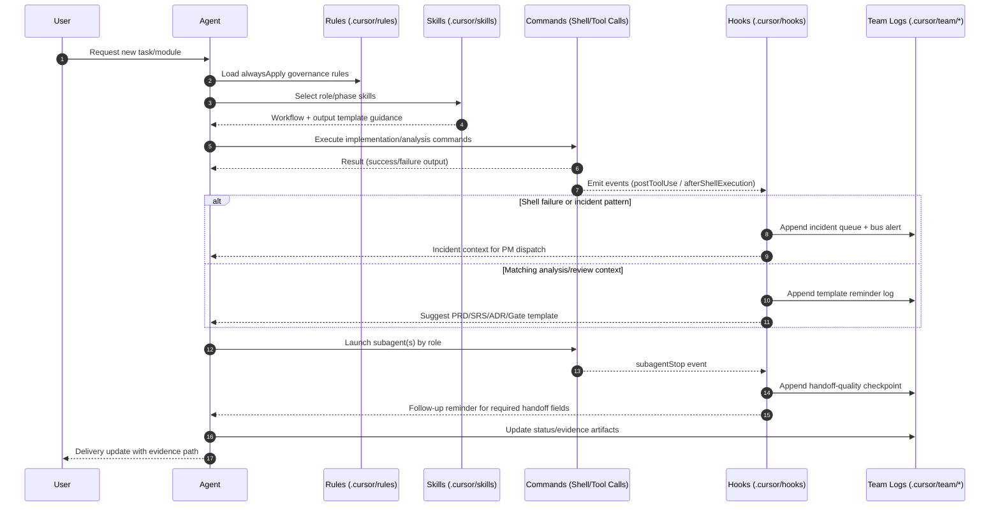

# Team Runtime Sequence (Agent-Skill-Rule-Hook-Command)

## Notes
- `Rules` are mandatory constraints.
- `Skills` are execution playbooks.
- `Hooks` are event-driven automation and audit.
- `Commands` are the actual actions performed by agents/tools.
