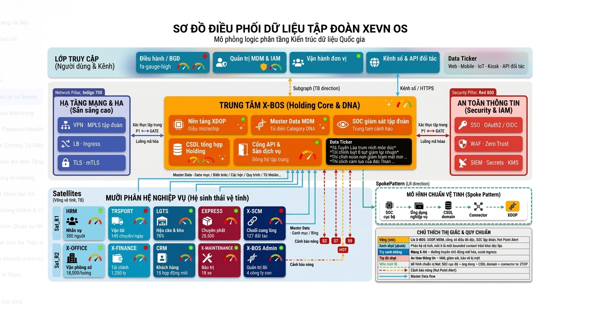
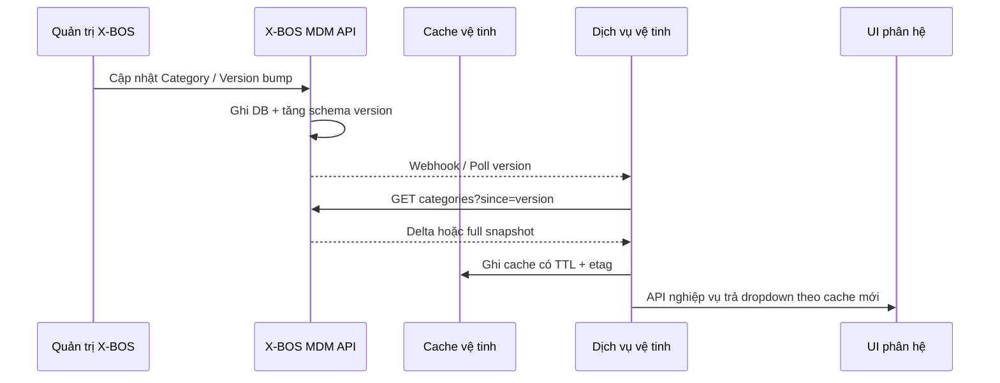
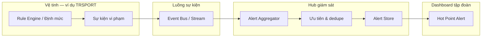

# Tài liệu Yêu cầu Nghiệp vụ & Thiết kế Mức cao
## Hệ sinh thái XeVN OS

| Thuộc tính | Giá trị |
|------------|---------|
| Phiên bản tài liệu | 1.1 |
| Ngày hiệu lực | 2026-03-25 |
| Phạm vi | Toàn bộ nền tảng XeVN OS |

---

## 1. Tóm tắt điều hành

XeVN OS giúp tập đoàn vận hành theo mô hình **quản trị tập trung — vận hành phân tán**. X-BOS là nơi quản lý dữ liệu và cấu hình chung. Các phân hệ làm nghiệp vụ theo domain của mình, nhưng luôn lấy đúng dữ liệu chuẩn từ X-BOS và gửi sự kiện vận hành về trung tâm để theo dõi, cảnh báo và tổng hợp báo cáo.

Tài liệu này mô tả rõ nhu cầu nghiệp vụ và chốt **thiết kế mức cao** để các đội sản phẩm, kỹ thuật và tích hợp cùng đi theo một hướng.

---

## 2. Bối cảnh nghiệp vụ & Phạm vi

### 2.1 Stakeholder chính

- **Ban Tổng Giám đốc / Điều hành tập đoàn**: cần tầm nhìn đa công ty, KPI và cảnh báo nóng.
- **Khối quản trị**: sở hữu master data, phân quyền, menu hệ thống, chuẩn danh mục.
- **Các đơn vị vận hành**: HRM, TRSPORT, LGTS, EXPRESS, X-SCM, X-OFFICE, X-FINANCE, CRM, X-MAINTENANCE — vận hành giao dịch theo domain.
- **Công nghệ thông tin & An ninh**: đảm bảo SSO, phân tách tenant, giám sát và tuân thủ.

### 2.2 Phạm vi chức năng

| Nhóm | Mô tả |
|------|--------|
| Định danh & đa công ty | Mô hình holding: nhiều pháp nhân/đơn vị thành viên dưới một tập đoàn; lọc và phân quyền theo phạm vi. |
| Master Data Management | Danh mục động, định mức tham chiếu, metadata gán cho từng phân hệ. |
| Chính sách KPI & giám sát | Định nghĩa chỉ số, tần suất, người sở hữu; dashboard điều hành và tuân thủ. |
| Tích hợp phân hệ | API ổn định, phiên bản hóa, hợp đồng dữ liệu rõ ràng giữa lõi và vệ tinh. |
| Cảnh báo & phản hồi vận hành | Tập trung cảnh báo từ vi phạm ngưỡng/định mức tại vệ tinh về dashboard tập đoàn. |

### 2.3 Ngoài phạm vi

Chi tiết triển khai từng màn hình UI, ma trận quyền chi tiết đến từng nút, và lược đồ vật lý từng bảng — được giao cho tài liệu chi tiết.

---

## 3. Kiến trúc tổng thể — System Landscape

### 3.1 Mô hình Hub-and-Spoke

**X-BOS** là trung tâm điều phối. X-BOS giữ dữ liệu dùng chung và các chuẩn KPI để các nơi khác dùng chung.

Các **phân hệ vệ tinh** làm nghiệp vụ theo domain của mình, nhưng không tự tạo bản “nguồn chính” cho dữ liệu danh mục. Phân hệ chỉ đồng bộ hoặc lấy theo hợp đồng từ X-BOS.

#### 3.1.1 Sơ đồ tổng quát khung kiến trúc XeVN OS

**Luồng nổi bật**

- **Hai chiều:** mọi vệ tinh trao đổi **danh mục / định mức / phiên bản** với XDOP; không nhân bản master tại spoke làm nguồn chính.
- **Một chiều cảnh báo:** vi phạm ngưỡng tại TRSPORT **hội tụ** về **Hot Point Alert** trên dashboard điều hành.

Dưới đây là **minh họa tổng thể** giúp trình chiếu in hoặc xem nhanh khi renderer Mermaid bị giới hạn kích thước:

#### 3.1.2 Sơ đồ Hub–Spoke rút gọn

**Nguyên tắc quản trị dữ liệu**

- **Ghi danh mục chuẩn**: ưu tiên tại X-BOS **cam kết** tại hub.
- **Đọc tại vệ tinh**: qua API phiên bản hóa; cache có thời hạn được phép nhưng phải **invalidate** khi hub phát hành phiên bản mới.
- **Giao dịch nghiệp vụ** do từng phân hệ quản lý. Khi cần danh mục/định danh, phân hệ dùng đúng mã do X-BOS cấp.

### 3.2 Core & Satellite — Bảng ánh xạ phân hệ

| Mã phân hệ | Tên gọi | Vai trò vệ tinh |
|------------|---------|---------------------------|
| HRM | Nhân sự | Tổ chức, nhân sự, hợp đồng — tham chiếu cấp bậc, phòng ban, chức vụ từ hub. |
| TRSPORT | Vận tải | Điều độ, tuyến, phương tiện — tham chiếu loại xe, tuyến, đối tượng vận chuyển. |
| LGTS | Hậu cần & Kho | Tồn kho, vị trí — tham chiếu loại kho, ĐVT, vị trí. |
| EXPRESS | Chuyển phát | SLA khu vực, dịch vụ — tham chiếu danh mục dịch vụ/vùng. |
| X-SCM | Chuỗi cung ứng | Nhà cung cấp, nguyên vật liệu — tham chiếu phân loại NCC/nguyên vật. |
| X-OFFICE | Văn phòng — Trình ký | Quy trình văn bản — tham chiếu loại văn bản, mức khẩn. |
| X-FINANCE | Tài chính | Giao dịch, tài khoản — tham chiếu loại giao dịch, kế hoạch. |
| CRM | Khách hàng | Phân khúc, nguồn khách — tham chiếu từ hub. |
| X-MAINTENANCE | Bảo trì | Loại bảo trì, tần suất — tham chiếu từ hub. |
| X-BOS | Quản trị lõi | Trung tâm MDM, IAM, cấu hình menu, tiêu chí giám sát toàn nhóm. |

### 3.3 Công cụ và thành phần dùng chung — Lý do kiến trúc

Các ứng dụng frontend và các phần dùng chung được phát triển theo cùng một chuẩn để:

| Tiêu chí | Giải thích |
|----------|------------|
| Cập nhật đồng bộ khi có thay đổi giao diện | Ví dụ thay đổi màn hình và component dùng chung đi cùng nhau. |
| Dùng chung design system và kiểu dữ liệu tham chiếu | Giảm việc mỗi app tự làm một phiên bản khác nhau. |
| Giảm rủi ro sai lệch giữa các app | Các đội cùng làm theo một chuẩn thống nhất. |
| Tăng tốc vòng phát hành trong nội bộ | Chỉ thay những phần có liên quan, tránh ảnh hưởng lan rộng không cần thiết. |

---

## 4. Thiết kế mức cao — Bốn lớp kiến trúc

### 4.1 Sơ đồ tổng thể bốn lớp

### 4.2 Presentation Layer

**Mục tiêu:** giao diện **thống nhất** trên web và mobile. Ưu tiên kiểu thiết kế tối giản: chữ rõ ràng, khoảng cách đều, phản hồi nhanh khi người dùng thao tác.

| Thành phần | Mô tả |
|------------|--------|
| Web Portal | Ứng dụng điều hành, MDM “đọc/cấu hình” theo quyền, dashboard tập đoàn. |
| Mobile App | Tác vụ hiện trường, duyệt nhanh, nhận cảnh báo; dùng chung design token và pattern component. |
| Design System | Thư viện component dùng chung, màu sắc/spacing/typography theo token; cấm phá vỡ token ở tầng ứng dụng. |

### 4.3 Integration & Gateway Layer

| Thành phần | Chức năng |
|------------|-----------|
| **API Gateway** | Điểm vào duy nhất cho client; routing tới dịch vụ X-BOS hoặc phân hệ; rate limit, WAF, logging tương quan request-id. |
| **SSO** | Đăng nhập tập trung; phiên làm việc không lưu mật khẩu trên client dài hạn dạng thô. |
| **JWT** | Chứa tenant/company, roles, scopes API; thời gian sống ngắn, làm mới có kiểm soát; truyền qua header chuẩn. |

### 4.4 Service Layer

Các **dịch vụ nghiệp vụ** tách theo từng phần nghiệp vụ riêng, nhưng **liên kết** với nhau thông qua:

 - **Hợp đồng API** phiên bản hóa.
- **Shared DNA Packages**: thư viện dùng chung cho quy tắc định mức, cách tính KPI, và kiểm tra mã danh mục — để tránh mỗi repo tự làm một kiểu.

**X-BOS Services** tập trung: registry phân hệ, category, giá trị danh mục, gán danh mục cho phân hệ, IAM, audit.

**Satellite Services** tập trung: xử lý giao dịch theo domain và **gửi** sự kiện khi có vi phạm ngưỡng hoặc trạng thái cần cảnh báo tập đoàn.

### 4.5 Data Layer

| Thành phần | Mô tả |
|------------|--------|
| **PostgreSQL** | Một cụm với **phân tách schema theo module** để quy định rõ module nào quản lý dữ liệu; vẫn dễ join cho báo cáo. |
| **Data Warehouse / Analytics** | Đồng bộ định kỳ hoặc gần real-time từ OLTP và event; lớp **hợp nhất** để lên dashboard và báo cáo đa công ty. |
| **Event log / stream** | Phục vụ cảnh báo real-time và phân tích hành vi; tách tải đọc nặng khỏi OLTP. |

---

## 5. Luồng dữ liệu nghiệp vụ trọng yếu

### 5.1 Master Data Injection

**Mục tiêu:** khi X-BOS cập nhật danh mục, vệ tinh **không cần phát hành lại code** chỉ để “viết cố định” danh mục.

**Cơ chế then chốt**

- **Phiên bản hóa** danh mục trên mỗi nhóm category.
- Vệ tinh chỉ lưu **bản đệm**; nguồn định tính vẫn là hub.
- Form động có thể dựa trên **metadata** do hub phát hành — UI render theo contract, không nhúng business list cố định.

### 5.2 Real-time Alerting Flow

**Mục tiêu:** vi phạm định mức tại TRSPORT **hội tụ** về kênh cảnh báo tập đoàn trên dashboard điều hành.

**Nguyên tắc**

- Sự kiện mang **tenant**, **mã phân hệ**, **mã vi phạm**, **mức nghiêm trọng**, **thời gian**, **tham chiếu KPI/định mức** từ hub.
- **Aggregator** gom trùng, giảm nhiễu và sắp xếp theo SLA phản hồi.
- Dashboard chỉ đọc từ **store cảnh báo đã chuẩn hóa**, không truy vấn trực tiếp OLTP vệ tinh cho mục đích hiển thị real-time quy mô lớn.

---

## 6. Yêu cầu phi chức năng

### 6.1 Tính sẵn sàng cao

- API Gateway và dịch vụ lõi **triển khai đa instance**; health check và graceful shutdown.
- Cơ sở dữ liệu: replica đọc cho báo cáo; backup theo RPO/RTO thỏa thuận với tập đoàn.
- Chiến lược **degrade**: khi hub MDM chậm, vệ tinh vẫn vận hành với cache đã biết + cờ “dữ liệu danh mục có thể cũ”.

### 6.2 Khả năng mở rộng

- Scale ngang **stateless** cho tầng gateway và microservice theo tải.
- Tách workload **đọc nặng** khỏi **ghi OLTP**.
- Phân hệ vệ tinh có thể scale độc lập theo mùa vụ nghiệp vụ.

### 6.3 Bảo mật đa lớp

| Lớp | Biện pháp |
|-----|-----------|
| Biên mạng | WAF, TLS end-to-end, phân vùng DMZ cho gateway. |
| Định danh | SSO tập trung, MFA theo nhóm quyền nhạy cảm. |
| Ứng dụng | RBAC/ABAC, kiểm tra tenant trên mọi API ghi. |
| Dữ liệu | Mã hóa at-rest trên storage nhạy cảm; mask log; audit trail thay đổi master data. |

### 6.4 UI/UX thống nhất

- Một hệ token và thư viện component dùng chung; mọi app mới **bắt buộc** kế thừa.
- Trạng thái tải, trống dữ liệu, lỗi — cùng ngôn ngữ hình ảnh.
- Accessibility: tương phản, focus, nhãn cho trình đọc màn hình trên các luồng chính.

---

## 7. Ma trận truy vết BRD → HLD

| Yêu cầu nghiệp vụ | Thành phần HLD đáp ứng |
|-------------------------|-------------------------|
| Nguồn dữ liệu dùng chung cho danh mục | X-BOS MDM + schema `xbos_*` + API phiên bản |
| Phân hệ độc lập triển khai | Satellite services + schema riêng + gateway routing |
| Dashboard điều hành & cảnh báo nóng | Warehouse + Alert Aggregator + Presentation |
| Đồng bộ trải nghiệm đa kênh | Design System + code/công cụ dùng chung |
| Bảo mật tập đoàn | Gateway + SSO/OAuth2 + JWT + RBAC theo tenant |

---

## 8. Điều kiện thành công & chỉ số đo lường

| Chỉ số | Mục tiêu định hướng |
|--------|---------------------|
| Thời gian đồng bộ danh mục sau khi hub cập nhật | Theo SLA |
| Tỷ lệ lệnh gọi API từ client có tenant hợp lệ | 100% tại production |
| Thời gian hiển thị cảnh báo nóng trên dashboard | Gần thời gian thực |
| Mức độ tái sử dụng component design system | ≥ 90% màn hình mới không tự phát triển component trùng chức năng |

---

## 9. Phụ lục — Thuật ngữ

| Thuật ngữ | Định nghĩa ngắn |
|-----------|-----------------|
| Hub | X-BOS — lõi điều phối và MDM. |
| Spoke | Phân hệ vệ tinh nghiệp vụ. |
| MDM | Master Data Management — quản trị dữ liệu chủ. |
| Shared DNA | Gói logic/kiểu dùng chung giữa dịch vụ và client. |
| Tenant | Đơn vị tách dữ liệu. |

---

*Tài liệu này là baseline kiến trúc; mọi thay đổi breaking API hoặc mô hình tenant phải được ghi nhận phiên bản và kế hoạch tương thích ngược.*
