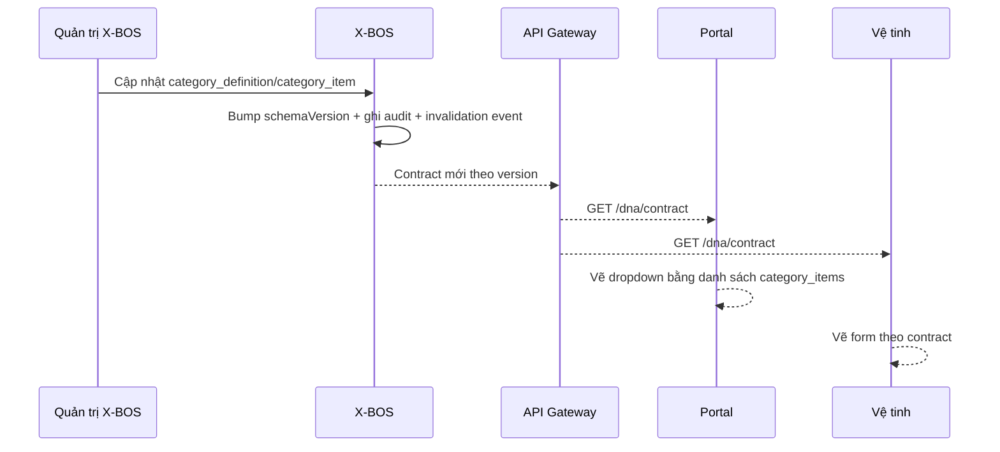
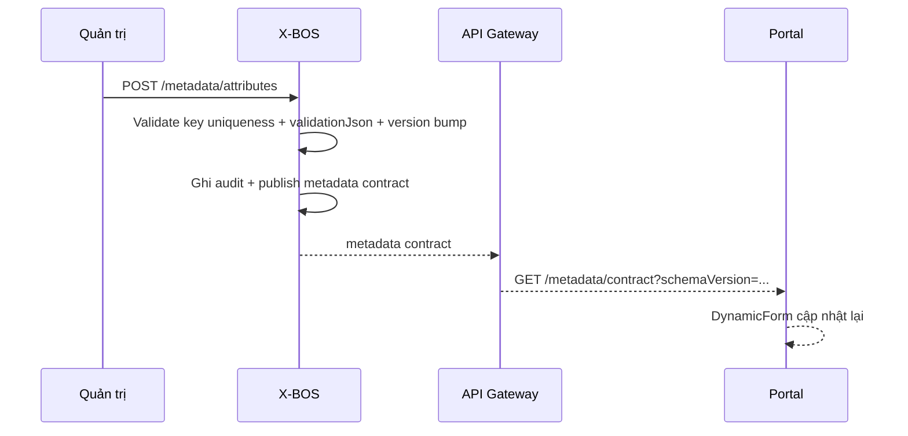
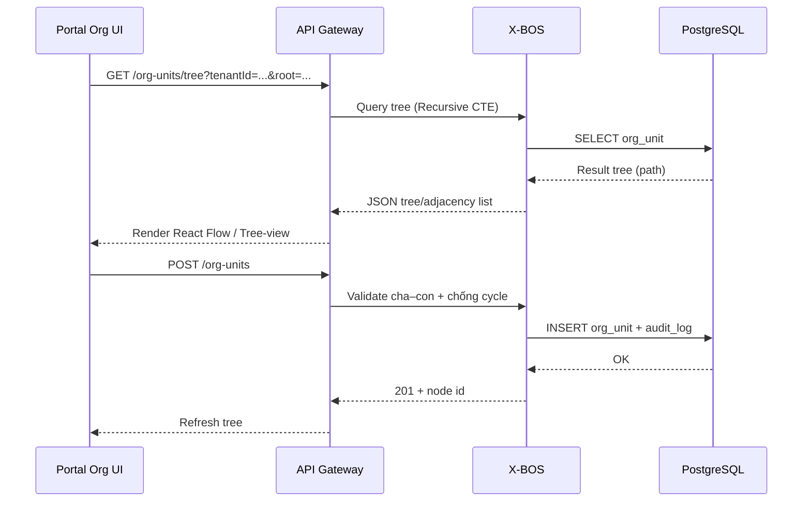
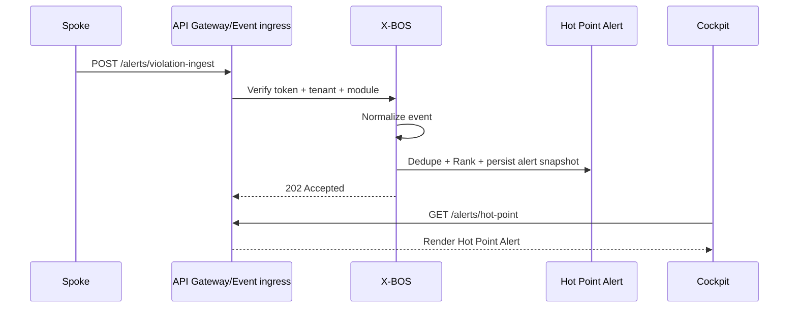
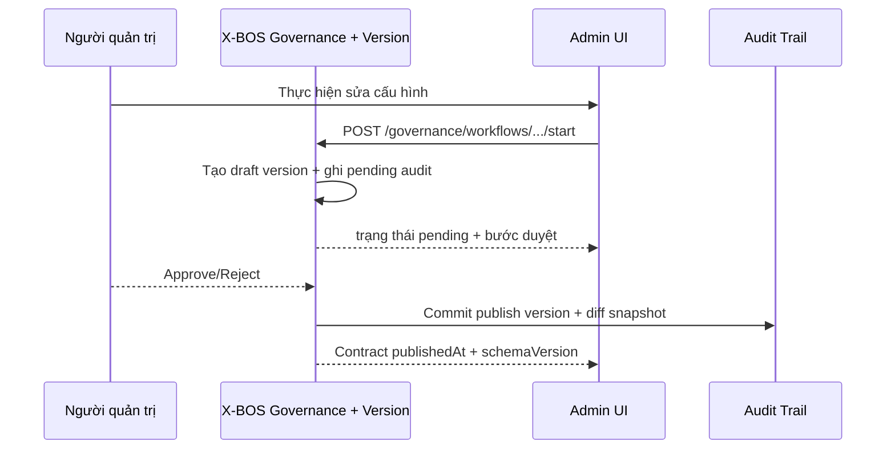
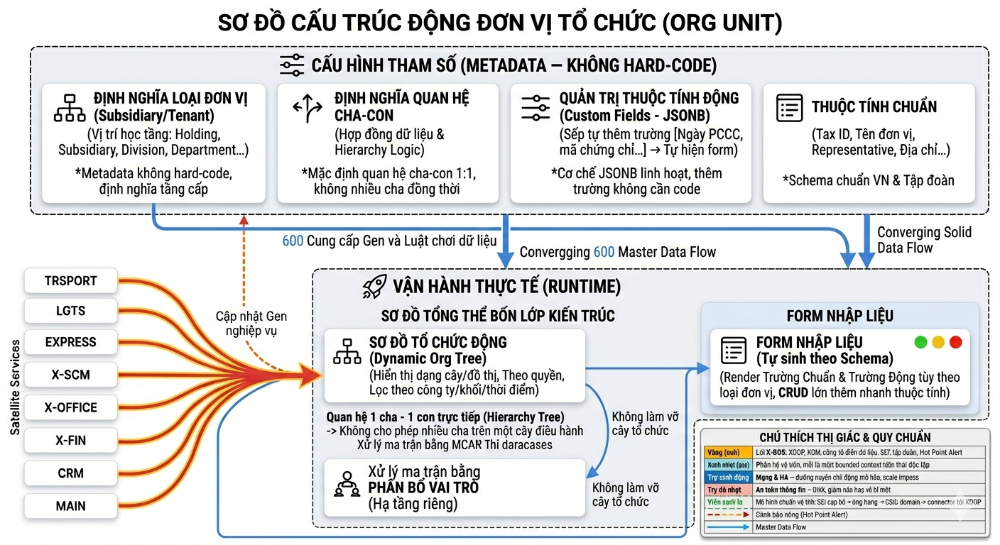
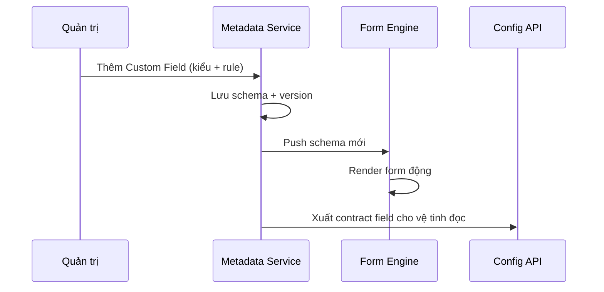
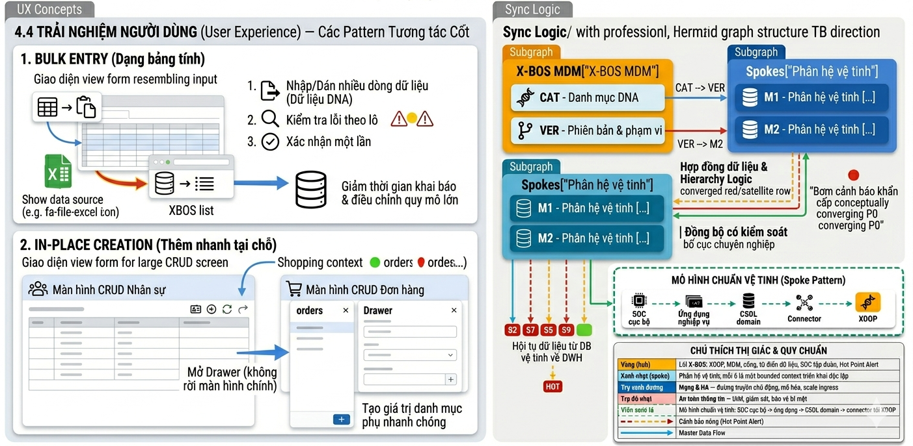

# Tài liệu Yêu cầu Nghiệp vụ (BRD)
## Phân hệ X-BOS: lõi quản trị tập đoàn

| Thuộc tính | Giá trị |
|------------|---------|
| Sản phẩm | X-BOS |
| Hệ sinh thái | XeVN OS |
| Phiên bản tài liệu | 1.0 |
| Ngày | 2026-03-25 |

---

## 1. Tóm tắt điều hành

X-BOS là trung tâm để điều phối dữ liệu trong mô hình holding. Thay vì phải sửa code mỗi lần thay đổi cấu trúc dữ liệu nghiệp vụ, X-BOS cho phép khai báo và cập nhật ngay trên hệ thống. Khi cấu hình thay đổi, các màn hình nhập liệu và xử lý theo cấu hình cũng thay đổi theo.

Phần kỹ thuật dùng **EAV**: mô tả các trường nằm trong cấu hình. Hệ thống đọc cấu hình này để tự tạo giao diện nhập liệu và kiểm tra dữ liệu.

---

## 2. Phạm vi và ranh giới

| Trong phạm vi X-BOS | Ngoài phạm vi |
|---------------------|-------------------------|
| Định nghĩa DNA tổ chức & danh mục dùng chung | Giao dịch vận hành theo domain |
| IAM tập trung, chính sách, KPI & ngưỡng tham chiếu | Tính toán KPI thực tế tại từng phân hệ |
| Workflow phê duyệt cấp tập đoàn | Quy trình nghiệp vụ thuần túy tại từng vệ tinh |
| Nhật ký kiểm toán cấu hình & phát hành phiên bản | Nhật ký giao dịch chi tiết tại OLTP từng phân hệ |

---

## 2.1 Kiến trúc tổng thể X-BOS Core & luồng chính

### 2.1.1 X-BOS hoạt động theo Hub-and-Spoke

X-BOS Core được tổ chức theo mô hình **Hub-and-Spoke**:

- **Hub:** nơi quản lý và phát hành cấu hình dùng chung của tập đoàn.
- **Spoke:** HRM, TRSPORT, LGTS, EXPRESS, X-SCM, X-OFFICE, X-FINANCE, CRM, X-MAINTENANCE… làm nghiệp vụ theo domain riêng. Các vệ tinh **lấy** cấu hình/danh mục từ X-BOS, không tự tạo bản master “nguồn chính”.
- **Phần hiển thị phía trên:** Web Portal gọi X-BOS để lấy contract/schema theo đúng phiên bản, rồi hiển thị màn hình theo cấu hình đó.

Nói ngắn: Portal và các vệ tinh luôn dùng chung cùng một “bản cấu hình” vì X-BOS phát hành theo version.

### 2.1.2 System Landscape


### 2.1.3 Bản đồ API Contract

X-BOS cung cấp **hợp đồng dữ liệu** và các API. Portal và các vệ tinh gọi theo đúng **version**:

- **Org schema & org chart:**
  - `GET /org-units/tree`
  - `GET /org-units/{id}`
  - `POST /org-units`
  - `PATCH /org-units/{id}`
- **Metadata:**
  - `GET /metadata/attributes?entityType=org_unit`
  - `POST /metadata/attributes`
  - `PATCH /metadata/attributes/{id}`
  - `GET /metadata/contract?schemaVersion=...`
- **MDM DNA contract:**
  - `GET /dna/contract?tenantId=...`
  - `POST /category-items/bulk-upsert`
  - `POST /category-items` / `DELETE /category-items/{id}`
- **Governance & Audit:**
  - `POST /governance/workflows/{workflowId}/start`
  - `GET /audit?entityType=...&entityId=...`
  - `POST /version/publish`
- **Hot Point Alert:**
  - `POST /alerts/violation-ingest`
  - `GET /alerts/hot-point`

### 2.1.4 Luồng chính

#### A) Cập nhật danh mục DNA

Khi X-BOS publish phiên bản categories mới, Portal và các vệ tinh sẽ tự cập nhật dropdown/select theo version đó.



**Luật sản phẩm:** mỗi contract trả về `schemaVersion` và `publishedAt`; client cache theo version và chỉ invalid khi version thay đổi.

#### B) Metadata Publishing

Khi quản trị thêm trường động cho `org_unit`, Portal/Org form cập nhật ngay theo schema version mới.



**Chi tiết kiểm soát dữ liệu:** trường `dataType=select` phải có “nguồn lựa chọn”. `dataType=boolean` không cần options list; chỉ cần nhãn bật/tắt và ràng buộc required.

#### C) Dynamic Org Engine

Portal hiển thị org chart và kiểm tra quan hệ cha–con để đảm bảo dữ liệu tổ chức hợp lệ.



#### D) Real-time Alerting Flow

**Mục tiêu:** các vi phạm/threshold breach tại vệ tinh hội tụ về **một điểm điều hành duy nhất**, giúp Cockpit ra quyết định nhanh.



**Payload chuẩn hóa:** `tenantId`, `moduleCode`, `entityRef`, `ruleId`, `severity`, `metricSnapshot`, `occurredAt`, `correlationId`.

#### E) Governance & Audit

**Mục tiêu:** mọi thay đổi cấu hình quan trọng có vết kiểm tra và có thể quay về bản cũ theo version.



### 2.1.5 Liên kết với Portal

Portal không tự tạo schema tĩnh. Portal chỉ:

- **Lấy schema/contract từ X-BOS** trước khi vẽ form/bảng dropdown.
- **Hiển thị org chart** bằng dữ liệu cây lấy từ X-BOS.
- **Đọc Hot Point Alert** theo thời gian thực hoặc gần thời gian thực để hỗ trợ quyết định.

Để các màn hình chạy đúng, Portal cần tuân thủ:

1. Tất cả màn hình có dropdown/select từ DNA phải gọi contract theo version của X-BOS, không dùng danh sách cố định.
2. Các màn hình “tạo/sửa đơn vị” phải dùng Dynamic Form theo contract metadata.
3. Mỗi thay đổi cấu hình có publish version; client cache chỉ sống tới `publishedAt` tương ứng.

### 2.1.6 Liên kết với các kênh/ứng dụng khác

Ngoài Web Portal, X-BOS Core tiếp tục đóng vai trò hub contract cho các kênh và hệ thống sau:

- **Mobile App / Kiosk / App hiện trường:** lấy `metadata/contract` và `dna/contract` theo `schemaVersion` để form & dropdown giống nhau; không tự tạo field/danh mục riêng.
- **Satellite Services:** dùng contract để chuẩn hóa biểu mẫu tham chiếu và phát sự kiện vi phạm/threshold breach về `POST /alerts/violation-ingest` để hội tụ Hot Point Alert.
- **ETL / Analytics / Data Warehouse:** lấy event để làm báo cáo theo từng version; hỗ trợ truy vết khi đối chiếu số liệu.
- **B2B/đối tác tích hợp:** truy cập qua API Gateway với contract chỉ đọc theo đúng phạm vi.

Nguyên tắc ràng buộc: mọi kênh chỉ cache tới `publishedAt/schemaVersion` do X-BOS công bố; khi X-BOS publish version mới thì invalidate theo version đó.

### 2.1.7 Contract cho event/payload

Trong dự án, nhóm dev hay vướng câu hỏi: “event/payload cần những trường nào để hệ thống xử lý và báo cáo hiển thị đúng?”. Vì vậy X-BOS Core cần cố định **contract** cho các luồng dữ liệu quan trọng dưới dạng JSON contract và ví dụ payload.

#### A) Violation Event

**Endpoint tham chiếu:** `POST /alerts/violation-ingest`

**Contract tối thiểu:**

- `tenantId`: phạm vi holding
- `moduleCode`: mã phân hệ phát sự kiện
- `occurredAt`: thời điểm xảy ra tại hệ vệ tinh
- `entityRef`: tham chiếu thực thể liên quan
- `ruleId`: định danh rule/định mức/phép tính tạo vi phạm
- `severity`
- `metricSnapshot`: dữ liệu đo tại thời điểm vi phạm
- `correlationId`: id tương quan trace xuyên suốt

**Ví dụ payload:**

```json
{
  "tenantId": "tenant-xevn-holding",
  "moduleCode": "TRSPORT",
  "occurredAt": "2026-03-25T09:15:00Z",
  "entityRef": {
    "orgUnitId": "org-logistics",
    "routeId": "route-12"
  },
  "ruleId": "TRSPORT_FILL_RATE_MIN",
  "severity": "high",
  "metricSnapshot": {
    "metricCode": "fill_rate",
    "value": 0.62,
    "unit": "%",
    "threshold": 0.7
  },
  "correlationId": "trsport-2026-03-25T09:15:00Z-8f1c"
}
```

**Quy tắc chuẩn hóa server:**

- `occurredAt` luôn được parse về UTC trước khi lưu snapshot
- `ruleId` phải map được tới định danh rule trong KPI/Policy catalog của X-BOS
- `severity` do rule quyết định

#### B) Hot Point Alert Snapshot

**Endpoint tham chiếu:** `GET /alerts/hot-point`

**Contract snapshot tối thiểu:**

- `hotPointId`
- `tenantId`
- `moduleCodes`
- `createdAt`
- `summary`: tóm tắt dạng câu ngắn cho người dùng
- `ranking`: điểm ưu tiên
- `items`: danh sách violation/event thành phần

**Ví dụ snapshot:**

```json
{
  "hotPointId": "hp-2026-03-25-TRSPORT-1",
  "tenantId": "tenant-xevn-holding",
  "moduleCodes": ["TRSPORT", "LGTS"],
  "createdAt": "2026-03-25T09:18:42Z",
  "summary": "Tỷ lệ lấp đầy tuyến HU-01 giảm dưới ngưỡng 0.7",
  "ranking": 98.4,
  "items": [
    {
      "correlationId": "trsport-2026-03-25T09:15:00Z-8f1c",
      "entityRef": { "orgUnitId": "org-logistics", "routeId": "route-12" },
      "severity": "high",
      "occurredAt": "2026-03-25T09:15:00Z"
    }
  ]
}
```

#### C) Version Publish Contract & Audit Event

**Mục tiêu:** mọi thay đổi cấu hình quan trọng phải có lịch sử rõ ràng và có thể quay về version trước.

**Contract “publish” tối thiểu:**

```json
{
  "tenantId": "tenant-xevn-holding",
  "artifactType": "metadata|category|policy|org-schema",
  "artifactKey": "org_unit",
  "previousVersion": 16,
  "newVersion": 17,
  "publishedAt": "2026-03-25T10:00:00Z",
  "publisher": { "actorType": "user|service", "actorId": "admin-001" },
  "correlationId": "publish-org_unit-17-20260325T1000Z"
}
```

**Ràng buộc audit:**

- Trước publish: tạo draft version + diff snapshot
- Khi approve: commit publish + ghi diff vào `audit_log`
- Khi reject: không publish

#### D) Contract cache keys

- `dna:contract:{tenantId}:{artifactKey}:{schemaVersion}`
- `metadata:contract:{tenantId}:{entityType}:{schemaVersion}`
- `alerts:hotpoint-snapshot:{tenantId}:{dayBucket}`

Invalidation duy nhất theo: **publish version mới** → invalidate theo `schemaVersion` cũ.

---

## 3. Trình quản trị thực thể tổ chức động

### 3.1 Mục tiêu nghiệp vụ

Cho phép khai báo và duy trì **cây tổ chức đa tầng** phản ánh đúng pháp lý và vận hành holding: **Công ty mẹ** → **Công ty con** → **Khối / Phân hệ nội bộ** → **Phòng ban**, với khả năng **mở rộng thuộc tính** mà không sửa mã.

### 3.2 Cấu trúc đa tầng & logic quan hệ

- **Thực thể gốc:** *Đơn vị tổ chức* là nút trong sơ đồ; mỗi nút thuộc một **loại tầng** được định nghĩa trong metadata — không cố định cứng trong code.
- **Quan hệ cha–con:** Mặc định **1 cha – 1 con trực tiếp** trên một nhánh; không cho phép một nút có nhiều cha đồng thời trong cùng một cây điều hành. Trường hợp ma trận xử lý ở lớp **phân bổ vai trò**, không làm “vỡ” cây tổ chức.
- **Org Chart:** Hiển thị dạng **cây** và **sơ đồ** theo quyền; hỗ trợ lọc theo công ty / khối / thời điểm hiệu lực.



### 3.3 Trường dữ liệu chuẩn

Áp dụng cho mỗi đơn vị, tối thiểu các nhóm:

| Nhóm | Ví dụ trường |
|------|----------------|
| Định danh | Mã đơn vị, tên đầy đủ, tên viết tắt |
| Pháp lý | Mã số thuế, người đại diện pháp luật, giấy phép kinh doanh |
| Địa lý | Địa chỉ trụ sở, mã bưu chính, quốc gia / tỉnh |
| Tài chính | Vốn điều lệ, tỷ lệ sở hữu, niên độ tài chính |
| Hiệu lực | Ngày hiệu lực / ngày kết thúc, trạng thái |

Các trường chuẩn được định nghĩa trong **schema phiên bản hóa**; thay đổi nhãn / bắt buộc / validation do quản trị cấu hình trong phạm vi quyền.

### 3.4 Custom Fields & form động

- Người dùng được phép **thêm trường** gắn với loại thực thể: **Text, Number, Date, Boolean**, và mở rộng **Select**.
- **Không** cần phát hành bản mới khi thêm trường: hệ thống đọc cấu hình và tự vẽ lại form, bảng danh sách và cập nhật API theo đúng version.
- Ràng buộc: giới hạn độ dài, định dạng, bắt buộc / tùy chọn, điều kiện hiển thị theo rule khai báo.



---

## 4. Danh mục DNA

### 4.1 Vai trò

X-BOS là **nguồn phát hành** danh mục dùng chung: loại xe, tuyến, cấp bậc, chức vụ, loại chi phí… — được **định danh**, **phiên bản hóa** và **phân vùng phạm vi** sử dụng.

### 4.2 Cơ chế “bơm” dữ liệu xuống vệ tinh

- Mỗi danh mục có **mã**, **kiểu giá trị**, **trạng thái**, **phiên bản schema** và **danh sách giá trị**.
- Vệ tinh **không** tự tạo nguồn master trùng nghĩa; chúng đồng bộ qua API / sự kiện theo **hợp đồng**.

### 4.3 Phạm vi áp dụng

| Phạm vi | Mô tả |
|---------|--------|
| Toàn tập đoàn | Danh mục áp dụng đồng nhất cho mọi pháp nhân trong holding |
| Theo công ty con | Chỉ hiệu lực trong phạm vi một hoặc nhiều đơn vị được chọn |
| Kết hợp | Danh mục “khung” toàn nhóm + giá trị “lá” theo công ty |

### 4.4 Trải nghiệm người dùng

- **Bulk Entry:** Nhập / dán nhiều dòng danh mục cùng lúc, kiểm tra lỗi theo lô, xác nhận một lần — giảm thời gian khai báo đầu kỳ và đợt chỉnh quy mô lớn.
- **In-place Creation:** Tại màn hình CRUD lớn, mở **Drawer** để tạo nhanh giá trị danh mục phụ mà **không rời** luồng chính; sau khi lưu, giá trị mới **xuất hiện ngay** trong dropdown / lookup.



---

## 5. X-BOS Global KPI Waterfall Engine

### 5.1 Tầm nhìn
`X-BOS Global KPI Waterfall Engine` là phân hệ quản trị KPI theo mô hình thác nước toàn tập đoàn, giúp giao chỉ tiêu từ cấp cao nhất xuống đa tầng tổ chức và hội tụ kết quả thực tế theo chiều ngược lại, bảo đảm dữ liệu nhất quán, truy vết được, và chốt số đúng kỳ.

Mục tiêu là tạo một “xương sống KPI” dùng chung cho toàn hệ sinh thái quản trị, nơi mọi cấp đều làm việc trên cùng một bộ định nghĩa KPI, cùng chu kỳ, và cùng quy tắc khóa dữ liệu.

---

### 5.2 Business Value

#### 5.2.1 Giải quyết bài toán cốt lõi
- Phân bổ KPI từ Tập đoàn xuống nhiều tầng (`Subsidiary -> Block -> Dept -> Unit`) mà không làm lệch dữ liệu giữa các cấp.
- Loại bỏ tình trạng mỗi đơn vị tự tính một kiểu, gây sai lệch số tổng hợp và tranh chấp khi đánh giá.
- Chuẩn hóa “chuỗi trách nhiệm KPI”: ai giao, ai nhận, ai phân rã tiếp, ai chịu trách nhiệm cuối.

#### 5.2.2 Giá trị kinh doanh trực tiếp
- **Minh bạch điều hành:** Ban lãnh đạo theo dõi được trạng thái giao KPI theo từng tầng trong thời gian thực.
- **Tăng tốc chu kỳ quản trị:** Rút ngắn thời gian giao KPI đầu kỳ và chốt số cuối kỳ.
- **Giảm rủi ro quyết định sai:** Dữ liệu hội tụ một nguồn chuẩn, giảm sai khác giữa báo cáo quản trị và vận hành.
- **Nâng hiệu suất tổ chức:** KPI đi đến đúng đơn vị/cá nhân thực thi, có đại diện theo dõi rõ ràng.

#### 5.2.3 KPI thành công của phân hệ
- Tỷ lệ phân bổ KPI đúng hạn theo kỳ.
- Tỷ lệ sai lệch giữa số hợp nhất và số cấp dưới báo cáo.
- Thời gian từ “mở kỳ” đến “khóa kỳ”.
- Tỷ lệ KPI có đầy đủ chuỗi giao việc (có người giao và người nhận ở mọi tầng liên quan).

---

### 5.3 Stakeholders
| Vai trò | Mục tiêu chính | Trách nhiệm trong hệ thống |
|---|---|---|
| Chủ tịch | Giao KPI chiến lược toàn tập đoàn | Khởi tạo/chốt KPI cấp tập đoàn, phê duyệt nguyên tắc phân bổ |
| CEO Công ty con | Phân bổ KPI về phạm vi công ty con | Nhận KPI từ tập đoàn, phân rã xuống Block/Dept theo năng lực thực thi |
| Trưởng bộ phận | Nhận KPI và giao tiếp xuống đội/đơn vị | Điều phối thực thi, cân bằng giữa chỉ tiêu và năng lực đơn vị |
| Nhân viên | Thực hiện KPI đã nhận | Cập nhật thực tế, phản hồi vướng mắc, chịu đánh giá theo KPI |

---

### 5.4 Quy trình nghiệp vụ tổng thể (Business Process)

#### 5.4.1 Khởi tạo Gen KPI (DNA)
Mục tiêu: tạo bộ gene KPI chuẩn để toàn hệ thống dùng cùng định nghĩa.

Đầu vào chính:
- Danh mục KPI chiến lược.
- Công thức tham chiếu, đơn vị đo, chu kỳ áp dụng.
- Quy tắc phân rã và nguyên tắc hội tụ.

Kết quả:
- Bộ Gen KPI có phiên bản, có hiệu lực theo thời gian, sẵn sàng phân bổ.

#### 5.4.2 Phân bổ thác nước (Top-Down Allocation)
Mục tiêu: giao KPI từ cấp tập đoàn xuống các tầng tổ chức mà vẫn giữ tính nhất quán.

Nguyên tắc:
- KPI ở cấp cha là “trần/khung” để cấp con phân rã.
- Cấp con chỉ được điều chỉnh trong ngưỡng được phép.
- Mọi lần giao/điều chỉnh phải có người giao, người nhận, thời điểm và lý do.

Kết quả:
- Mỗi node tổ chức nhận KPI rõ ràng, có đại diện chịu trách nhiệm.

#### 5.4.3 Hội tụ thực tế (Bottom-Up Aggregation)
Mục tiêu: tổng hợp số thực hiện từ `Unit -> Dept -> Block -> Subsidiary -> Tập đoàn`.

Nguyên tắc:
- Hội tụ theo đúng công thức trong Gen KPI.
- Có kiểm tra lệch dữ liệu giữa các tầng và cảnh báo sai số.
- Có cơ chế truy ngược từ số hợp nhất về từng điểm dữ liệu nguồn.

Kết quả:
- Dashboard hợp nhất tin cậy cho điều hành theo kỳ.

#### 5.4.4 Chốt số & Khóa dữ liệu (Freezing)
Mục tiêu: đảm bảo số liệu đánh giá không bị thay đổi sau thời điểm chốt.

Nguyên tắc:
- Chốt theo kỳ và phạm vi tổ chức.
- Sau khi khóa, mọi thay đổi phải qua luồng mở khóa có thẩm quyền.
- Lưu dấu vết kiểm toán đầy đủ (ai, khi nào, thay đổi gì, lý do).

Kết quả:
- Kỳ KPI được đóng sổ, ổn định cho báo cáo quản trị và đánh giá hiệu suất.

---

### 5.5 Ma trận phân quyền mức cao
| Vai trò | Giao KPI | Xem KPI | Điều chỉnh KPI | Khóa dữ liệu | Mở khóa dữ liệu |
|---|---|---|---|---|---|
| Chủ tịch | Toàn tập đoàn | Toàn tập đoàn | Toàn tập đoàn | Có | Có |
| CEO Công ty con | Trong phạm vi công ty con | Trong phạm vi công ty con | Trong phạm vi công ty con | Có (phạm vi công ty con) | Đề nghị, hoặc được cấp quyền |
| Trưởng bộ phận | Trong phạm vi bộ phận/đội được giao | Trong phạm vi bộ phận/đội | Có giới hạn theo ngưỡng | Không mặc định | Không mặc định |
| Nhân viên | Không | KPI cá nhân/đơn vị liên quan | Không (chỉ cập nhật thực hiện) | Không | Không |

Nguyên tắc áp quyền:
- Quyền luôn gắn với vai trò và phạm vi tổ chức.
- Không được giao KPI vượt ra ngoài phạm vi được ủy quyền.
- Điều chỉnh KPI phải có log và lý do bắt buộc.

---

### 5.6 Roadmap triển khai

#### 5.6.1 Giai đoạn 1 — Core Setup
Mục tiêu:
- Chuẩn hóa mô hình tổ chức đa tầng.
- Xây bộ Gen KPI (DNA), phiên bản hóa, hiệu lực.
- Thiết lập quyền truy cập nền tảng theo vai trò.

Kết quả bàn giao:
- Khung dữ liệu KPI và tổ chức sẵn sàng cho phân bổ.

#### 5.6.2 Giai đoạn 2 — Waterfall Logic
Mục tiêu:
- Hoàn thiện logic phân bổ Top-Down.
- Hoàn thiện logic hội tụ Bottom-Up.
- Cảnh báo sai lệch và hỗ trợ xử lý điều chỉnh có kiểm soát.

Kết quả bàn giao:
- Vận hành đầy đủ chu trình giao KPI và hội tụ số theo kỳ.

#### 5.6.3 Giai đoạn 3 — Real-time Integration
Mục tiêu:
- Kết nối dữ liệu thực tế từ các hệ thống vận hành.
- Cập nhật tiến độ KPI gần thời gian thực.
- Tự động hóa chốt kỳ, khóa dữ liệu, và phát hành báo cáo điều hành.

Kết quả bàn giao:
- Hệ thống KPI hợp nhất theo thời gian thực, phục vụ điều hành chủ động.

---

### 5.7 Rủi ro & nguyên tắc kiểm soát
- **Rủi ro lệch dữ liệu liên tầng:** kiểm soát bằng quy tắc hội tụ chuẩn và cảnh báo sai lệch.
- **Rủi ro phân quyền chồng chéo:** kiểm soát bằng mô hình role + scope rõ ràng, deny-by-default.
- **Rủi ro điều chỉnh KPI thiếu kiểm soát:** bắt buộc audit log và quy trình phê duyệt theo cấp.
- **Rủi ro chậm chốt kỳ:** thiết lập lịch freeze chuẩn, nhắc hạn, escalation theo vai trò.

---

### 5.8 Kết luận
`X-BOS Global KPI Waterfall Engine` tạo nền tảng quản trị KPI xuyên suốt từ chiến lược đến thực thi, bảo đảm KPI được giao đúng người, hội tụ đúng số, và khóa đúng kỳ. Đây là phân hệ trọng yếu để nâng chất lượng điều hành dữ liệu và hiệu suất tổ chức ở quy mô tập đoàn đa tầng.

---

## 6. Quản trị, audit và quyền truy cập

### 6.1 Workflow Designer

- Trình thiết kế quy trình **ký duyệt tập trung** cho các thay đổi cấu hình nhạy cảm: danh mục DNA, ngưỡng KPI, phân quyền, cấu trúc tổ chức.
- Hỗ trợ bước duyệt, phân nhánh, ủy quyền, SLA bước; tích hợp với nhật ký và phiên bản.

### 6.2 Audit Trail

Ghi nhận tối thiểu:

| Thành phần | Nội dung ghi |
|------------|----------------|
| Ai | Định danh người / dịch vụ / API key |
| Làm gì | Loại thao tác |
| Trên đâu | Thực thể, khóa logic, phiên bản |
| Khi nào | Timestamp chuẩn, timezone tập đoàn |
| Giá trị | Trước / sau |

Mục tiêu: truy vết **thay đổi cấu hình** — mọi thay đổi “DNA” đều có vết.

### 6.3 Central IAM & SSO

- **Một đăng nhập** cho toàn hệ sinh thái; JWT / session có **tenant**, **role**, **scope API**.
- **Ma trận quyền** tập trung cho người dùng và nhóm, map tới **10 phân hệ vệ tinh** + X-BOS: menu, thao tác, dữ liệu theo phạm vi tổ chức.
- Chính sách mật khẩu, MFA, khóa phiên — thống nhất tại lõi.

---

## 7. Tiêu chuẩn UI/UX

| Nguyên tắc | Thể hiện |
|------------|-----------|
| Tối giản | Chữ rõ ràng theo cấp bậc, ít trang trí; mỗi màn chỉ có một hành động chính |
| Layering | Shadow mềm, tách lớp card / drawer / modal; backdrop blur cho ngữ cảnh phụ |
| Mật độ thông tin | Bảng sâu có sticky header, cột cố định, tóm tắt dòng; tree-view cho org và danh mục phân cấp |
| Nhất quán | Design system dùng chung token; form động vẫn tuân layout grid và trạng thái lỗi thống nhất |
| Hiệu năng cảm nhận | Skeleton, progressive disclosure, tách bước khai báo phức tạp |

---

## 8. Ma trận truy vết yêu cầu

| Nhóm BRD | Thành phần cốt lõi | Ghi chú |
|----------|-------------------|---------|
| Org động | EAV, cây cha-con, form sinh tự động | Không hard-code tầng tổ chức |
| MDM DNA | Phạm vi toàn nhóm / theo công ty, bulk, in-place | Đồng bộ xuống vệ tinh có contract |
| KPI & Policy | Công thức, ngưỡng, versioning | Hot Point là đích hội tụ cảnh báo |
| Governance | Workflow, audit, IAM | Kiểm soát thay đổi gen |

---

## 9. Điều kiện chấp nhận

- Quản trị có thể **thêm trường tùy chỉnh** và **thấy form cập nhật** mà không cần build mới từ đội phát triển ứng dụng cho từng trường đơn lẻ.
- Danh mục DNA có **phạm vi** và **phiên bản**; vệ tinh nhận đồng bộ theo số hiệu phiên bản đã thỏa thuận.
- Thay đổi chính sách / KPI tạo **version mới** và **lịch sử hiệu lực**; có thể gắn workflow phê duyệt.
- Mọi thao tác cấu hình trọng yếu ghi **audit trail** đủ mức điều tra.
- IAM & SSO phục vụ **toàn bộ** phân hệ trong lộ trình XeVN OS.

---

*Tài liệu này là baseline BRD cho X-BOS Dynamic Core; chi tiết màn hình, API contract và lược đồ vật lý nằm ở PRD/LLD và tài liệu tích hợp từng vệ tinh.*
