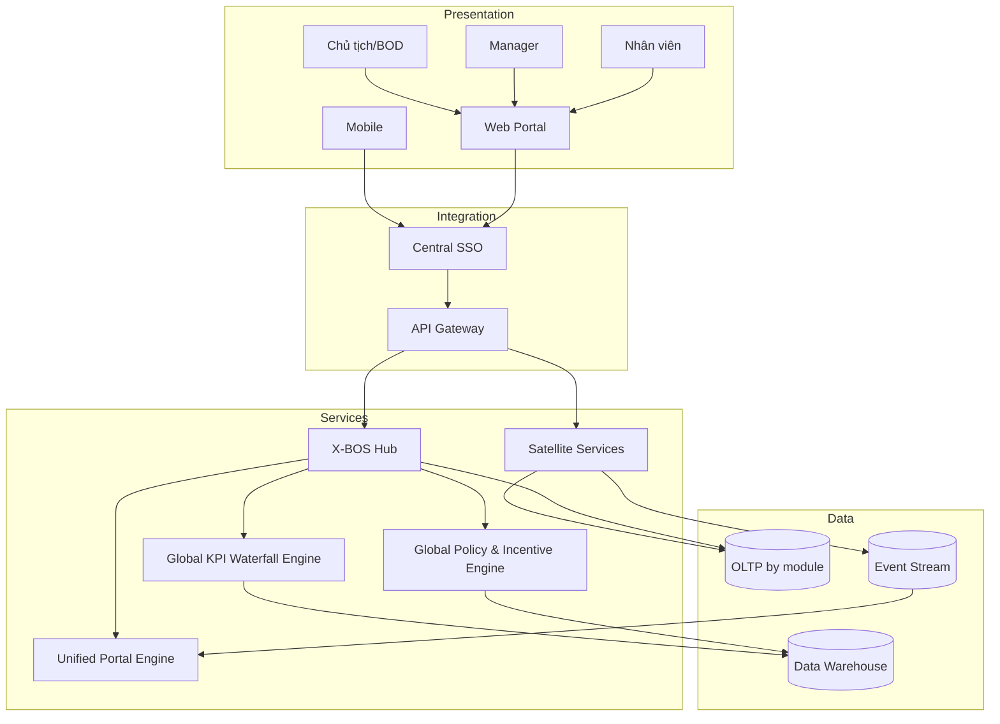
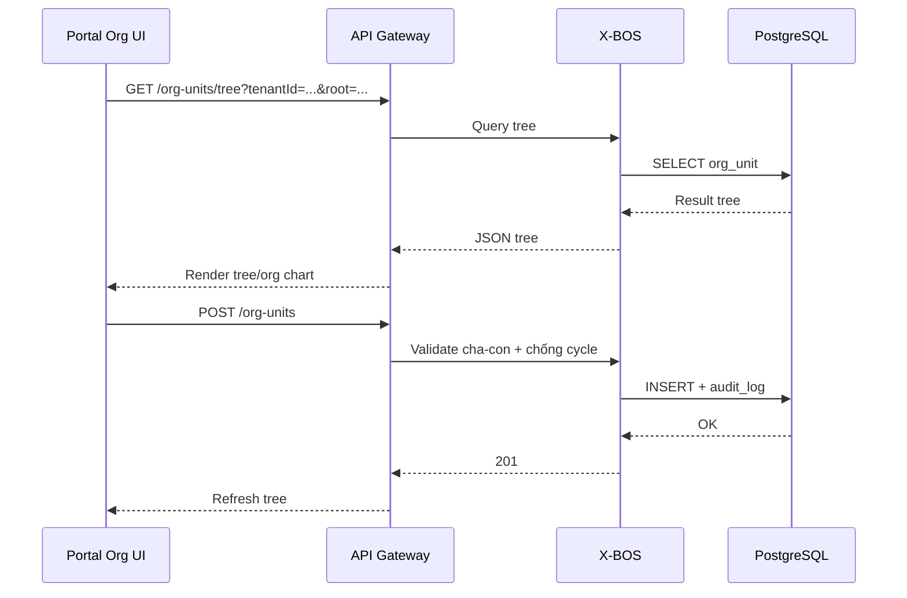
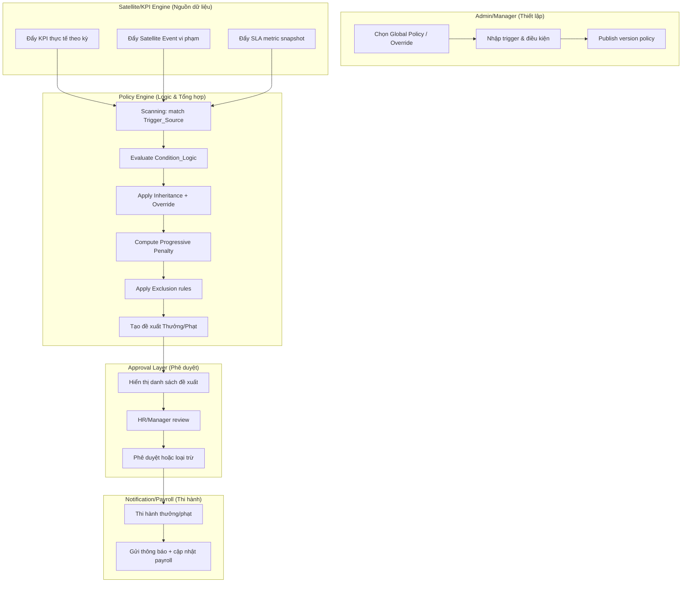
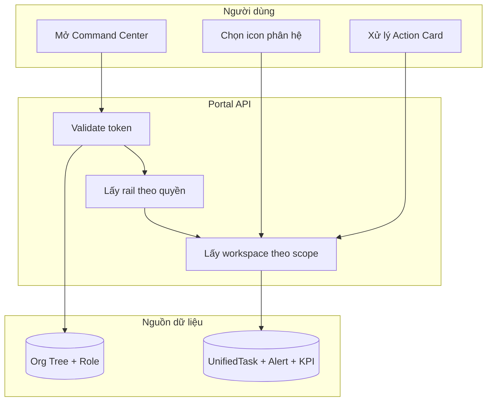
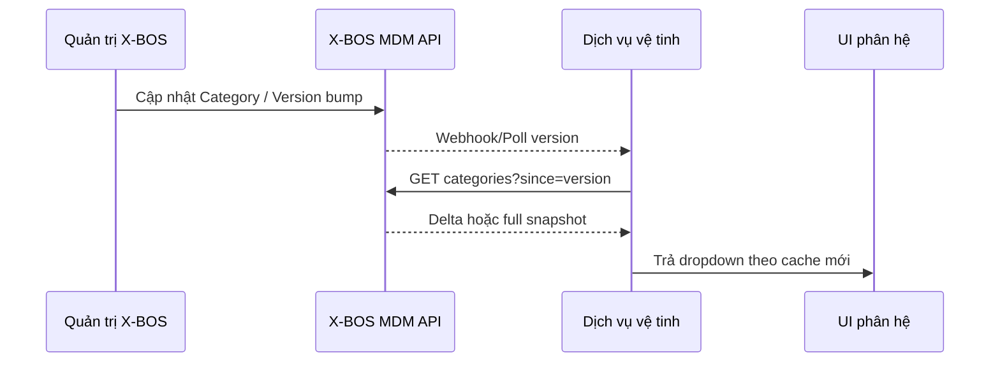
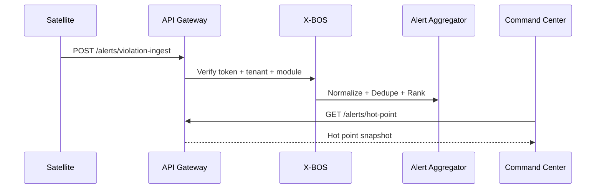

# TÀI LIỆU TỔNG THỂ HỆ SINH THÁI XEVN OS (MASTER BRD/HLD)

| Thuộc tính | Giá trị |
|------------|---------|
| Loại tài liệu | Master BRD/HLD |
| Phạm vi | Toàn bộ hệ sinh thái XeVN OS |
| Trục tài liệu nền | `BRD_X_BOS_UNIFIED_PORTAL_COMMAND_CENTER.md` |
| Tài liệu hợp nhất chính | `BRD_HLD_XEVN_OS.md`, `BRD_X_BOS_CORE_DYNAMIC.md`, `BRD_X_BOS_GLOBAL_KPI_WATERFALL_ENGINE.md`, `SRS_X_BOS_GLOBAL_POLICY_INCENTIVE_ENGINE.md` |
| Phiên bản | 1.0 |
| Ngày cập nhật | 2026-03-27 |

---

## 1. Tóm tắt điều hành & Tầm nhìn XeVN OS

XeVN OS được xây theo tư duy đơn giản: **mọi người trong tập đoàn vào một cửa, nhìn đúng dữ liệu của mình, xử lý đúng việc của mình**.

`X-BOS Unified Portal (Command Center)` là điểm vào trung tâm.  
`X-BOS Core` là lõi dữ liệu dùng chung.  
`Global KPI Waterfall Engine` là lõi giao mục tiêu từ trên xuống.  
`Global Policy & Incentive Engine` là lõi bảo đảm công bằng thưởng/phạt theo dữ liệu.

Mục tiêu cuối cùng:

- Điều hành nhanh hơn.
- Dữ liệu nhất quán hơn.
- Quyết định minh bạch hơn.
- Tập đoàn vận hành theo một “luật chơi” chung.

---

## 2. Kiến trúc tổng thể hệ sinh thái (HLD 4 lớp, Hub-Spoke)

### 2.1 Mô hình Hub-and-Spoke

- **Hub**: X-BOS là trung tâm phát hành dữ liệu chuẩn (DNA, metadata, policy, KPI).
- **Spoke**: Các phân hệ vệ tinh (HRM, TRSPORT, LGTS, EXPRESS, X-SCM, X-OFFICE, X-FINANCE, CRM, X-MAINTENANCE) làm nghiệp vụ chuyên sâu theo domain.
- **Quy tắc vàng**: vệ tinh không tự tạo “nguồn chuẩn” riêng cho dữ liệu dùng chung.

### 2.2 Bốn lớp kiến trúc

| Lớp | Vai trò |
|-----|---------|
| Presentation Layer | Web/Mobile/Kiosk/B2B hiển thị theo vai trò |
| Integration Layer | SSO + API Gateway, kiểm soát truy cập và routing |
| Service Layer | X-BOS Services + Satellite Services xử lý nghiệp vụ |
| Data Layer | OLTP + DW + Event Store phục vụ giao dịch và phân tích |

### 2.3 Luồng kiến trúc tổng thể (Mermaid)



### 2.4 Bảng ánh xạ Hub/Spoke

| Mã | Tên phân hệ | Vai trò |
|---|---|---|
| X-BOS | Lõi quản trị tập đoàn | Hub: dữ liệu chuẩn, điều phối, policy, KPI |
| HRM | Nhân sự | Spoke: nhân sự, hợp đồng, tổ chức |
| TRSPORT | Vận tải | Spoke: điều độ, chuyến, vi phạm vận hành |
| LGTS | Kho vận | Spoke: kho, tồn, luân chuyển |
| EXPRESS | Chuyển phát | Spoke: SLA giao nhận |
| X-SCM | Chuỗi cung ứng | Spoke: nhà cung cấp, nguyên vật liệu |
| X-OFFICE | Văn phòng | Spoke: văn bản, quy trình ký duyệt |
| X-FINANCE | Tài chính | Spoke: giao dịch, kế hoạch tài chính |
| CRM | Khách hàng | Spoke: khách hàng, phân khúc |
| X-MAINTENANCE | Bảo trì | Spoke: kế hoạch bảo trì, sự cố kỹ thuật |

---

## 3. Phân hệ X-BOS Core: Lõi quản trị động (Org Engine, Metadata, MDM DNA)

### 3.1 Định hướng Dynamic by Default

X-BOS Core giải quyết một bài toán lớn: thay vì sửa code mỗi khi đổi biểu mẫu/thuộc tính nghiệp vụ, hệ thống cho phép cấu hình động.

- Form và dữ liệu hiển thị thay đổi theo cấu hình.
- Không cần phát hành bản mới chỉ vì thêm một trường thông tin.

### 3.2 EAV & Metadata

Mô hình EAV cho phép định nghĩa dữ liệu mở rộng theo metadata:

- Thêm/sửa trường động theo loại thực thể.
- Ràng buộc dữ liệu theo rule khai báo.
- Version hóa để truy vết thay đổi.

### 3.3 Dynamic Org Engine

Tổ chức được quản trị theo cây đa tầng:

- Công ty mẹ → Công ty con → Khối → Phòng → Nhóm.
- Mỗi nút có metadata mở rộng.
- Có kiểm tra quan hệ cha-con, chống vòng lặp.



### 3.4 MDM DNA

DNA là bộ dữ liệu chuẩn dùng chung toàn tập đoàn:

- Danh mục chuẩn.
- Giá trị chuẩn.
- Phạm vi áp dụng (toàn tập đoàn / công ty con / kết hợp).
- Phiên bản phát hành.

### 3.5 API Contract cốt lõi

| Nhóm | API chính |
|---|---|
| Org | `GET /org-units/tree`, `POST /org-units`, `PATCH /org-units/{id}` |
| Metadata | `GET /metadata/contract`, `POST /metadata/attributes` |
| DNA | `GET /dna/contract`, `POST /category-items/bulk-upsert` |
| Governance | `POST /governance/workflows/{workflowId}/start`, `POST /version/publish` |
| Alert | `POST /alerts/violation-ingest`, `GET /alerts/hot-point` |

### 3.6 Payload JSON mẫu (giữ khối chi tiết)

#### Violation Event

```json
{
  "tenantId": "tenant-xevn-holding",
  "moduleCode": "TRSPORT",
  "occurredAt": "2026-03-25T09:15:00Z",
  "entityRef": {
    "orgUnitId": "org-logistics",
    "routeId": "route-12"
  },
  "ruleId": "TRSPORT_FILL_RATE_MIN",
  "severity": "high",
  "metricSnapshot": {
    "metricCode": "fill_rate",
    "value": 0.62,
    "unit": "%",
    "threshold": 0.7
  },
  "correlationId": "trsport-2026-03-25T09:15:00Z-8f1c"
}
```

#### Hot Point Snapshot

```json
{
  "hotPointId": "hp-2026-03-25-TRSPORT-1",
  "tenantId": "tenant-xevn-holding",
  "moduleCodes": ["TRSPORT", "LGTS"],
  "createdAt": "2026-03-25T09:18:42Z",
  "summary": "Tỷ lệ lấp đầy tuyến HU-01 giảm dưới ngưỡng 0.7",
  "ranking": 98.4,
  "items": [
    {
      "correlationId": "trsport-2026-03-25T09:15:00Z-8f1c",
      "entityRef": { "orgUnitId": "org-logistics", "routeId": "route-12" },
      "severity": "high",
      "occurredAt": "2026-03-25T09:15:00Z"
    }
  ]
}
```

#### Publish Version Contract

```json
{
  "tenantId": "tenant-xevn-holding",
  "artifactType": "metadata|category|policy|org-schema",
  "artifactKey": "org_unit",
  "previousVersion": 16,
  "newVersion": 17,
  "publishedAt": "2026-03-25T10:00:00Z",
  "publisher": { "actorType": "user|service", "actorId": "admin-001" },
  "correlationId": "publish-org_unit-17-20260325T1000Z"
}
```

---

## 4. Phân hệ Global KPI Waterfall Engine (Thác nước đa tầng)

### 4.1 Vai trò trong hệ sinh thái

Đây là bộ máy giao mục tiêu của tập đoàn theo mô hình thác nước:

- Giao từ trên xuống, hội tụ từ dưới lên.
- Đảm bảo cùng một định nghĩa KPI trên mọi tầng.
- Khóa số liệu đúng kỳ để dùng cho đánh giá.

### 4.2 Logic Waterfall 5 cấp

Luồng chuẩn:

1. **Tập đoàn (Holding)** đặt KPI khung.
2. **Công ty con (Subsidiary)** nhận và phân rã.
3. **Khối (Block)** phân bổ theo chức năng.
4. **Phòng/Ban (Department)** giao tới đơn vị thực thi.
5. **Đơn vị/Nhóm/Cá nhân (Unit/Team/Individual)** nhận KPI cuối cùng để thực hiện.

Luồng hội tụ:

`Unit -> Dept -> Block -> Subsidiary -> Holding`

### 4.3 Quy trình nghiệp vụ chính

- Khởi tạo Gen KPI.
- Phân bổ top-down.
- Hội tụ bottom-up.
- Chốt số và khóa dữ liệu.

### 4.4 Ma trận quyền KPI

| Vai trò | Giao KPI | Xem KPI | Điều chỉnh KPI | Khóa dữ liệu |
|---|---|---|---|---|
| Chủ tịch | Toàn tập đoàn | Toàn tập đoàn | Toàn tập đoàn | Có |
| CEO công ty con | Trong phạm vi công ty con | Trong phạm vi công ty con | Có giới hạn | Có theo phạm vi |
| Trưởng bộ phận | Trong phạm vi bộ phận | Trong phạm vi bộ phận | Có giới hạn | Không mặc định |
| Nhân viên | Không | KPI liên quan | Không | Không |

### 4.5 Giá trị mang lại

- Không lệch số giữa các tầng.
- Trách nhiệm rõ ai giao/ai nhận.
- Dễ truy vết khi kiểm tra.

---

## 5. Phân hệ Global Policy & Incentive Engine (Luật chơi tập đoàn)

### 5.1 Vai trò trong hệ sinh thái

Đây là “luật chơi” thưởng/phạt dùng chung toàn tập đoàn, chạy dựa trên dữ liệu thật.

- Dựa vào KPI thực tế.
- Dựa vào event vi phạm từ vệ tinh.
- Dựa vào dữ liệu SLA vận hành.

### 5.2 Chu trình nghiệp vụ

1. Tạo chính sách khung tập đoàn.
2. Đơn vị con override trong phạm vi cho phép.
3. Engine quét dữ liệu để tạo đề xuất.
4. HR/Manager duyệt hoặc loại trừ.
5. Thi hành sang notification/payroll.

### 5.3 Mermaid luồng Policy (giữ chi tiết)



### 5.4 Bảng validation và trường dữ liệu (giữ chi tiết)

| Field | Validation Rules |
|---|---|
| `Policy_Name` | 3–150 ký tự |
| `Trigger_Source` | `KPI`, `SATELLITE_EVENT`, `SLA` |
| `Condition_Logic` | JSON hợp lệ, toán tử được phép |
| `Incentive_Value` / `Penalty_Value` | `>= 0` |
| `Effective_Date_Range` | `from <= to`, không chồng hiệu lực active |
| `Evidence_Required` | Bắt buộc evidence nếu policy yêu cầu |
| `Limit_Zone` | Override không vượt giới hạn |
| `Progressive_Config` | Có rule step/cap khi bật progressive |
| `Exclusion_Rule` | Có phạm vi và lý do miễn trừ rõ ràng |

### 5.5 Error code chuẩn

| Error Code | Ý nghĩa |
|---|---|
| `GP-VAL-001` | Tên chính sách không hợp lệ |
| `GP-VAL-002` | Trigger_Source không hợp lệ |
| `GP-VAL-003` | Condition_Logic không hợp lệ |
| `GP-VAL-004` | Giá trị thưởng/phạt < 0 |
| `GP-VAL-005` | Trùng hiệu lực policy active |
| `GP-VAL-006` | Override vượt Limit_Zone |
| `GP-VAL-007` | Thiếu evidence bắt buộc |
| `GP-VAL-008` | Không đủ dữ liệu cho progressive |

---

## 6. X-BOS Unified Portal: Command Center (Trung tâm chỉ huy)

### 6.1 Mục tiêu

Command Center là màn hình điều hành tập trung:

- Một điểm vào duy nhất.
- Một giao diện chung.
- Một cách nhìn thống nhất theo vai trò.

### 6.2 Trải nghiệm theo vai trò

| Vai trò | Cách nhìn |
|---|---|
| Chủ tịch/BOD | Full Visibility |
| Manager | Team Scope |
| Nhân viên | Self-Focus |

### 6.3 Cấu trúc màn hình

- Rail bên trái: menu phân hệ.
- Vùng phải: Action Cards + Task_Counter + KPI_Sparkline + Alert_List.
- Trước khi render: kiểm tra token + quyền + data scope.

### 6.4 Luồng dữ liệu Command Center (Mermaid)



---

## 7. Tiêu chuẩn tích hợp & vệ tinh (API Contract, Violation Ingest)

### 7.1 Nguyên tắc tích hợp

- API version rõ ràng.
- Payload chuẩn hóa.
- Có correlation id để truy vết.
- Có quy tắc dedupe khi hội tụ cảnh báo.

### 7.2 Luồng Master Data Injection (Mermaid)



### 7.3 Luồng Violation Ingest -> Hot Point (Mermaid)



### 7.4 Contract cache keys

- `dna:contract:{tenantId}:{artifactKey}:{schemaVersion}`
- `metadata:contract:{tenantId}:{entityType}:{schemaVersion}`
- `alerts:hotpoint-snapshot:{tenantId}:{dayBucket}`

---

## 8. Yêu cầu phi chức năng (Security, UI/UX Standard, Availability)

### 8.1 Security

- SSO tập trung.
- RBAC/ABAC theo tenant + org scope.
- Deny-by-default.
- Audit trail cho thay đổi nhạy cảm.

### 8.2 Availability & Performance

- Gateway và dịch vụ lõi triển khai đa instance.
- Có cơ chế degrade khi hub chậm.
- Scale ngang cho dịch vụ stateless.
- Tách đọc nặng và ghi giao dịch.

### 8.3 UI/UX Standard

- Theo token chuẩn.
- `radius-card: 12px`, `shadow-soft`, `shadow-overlay`.
- Lucide icon stroke 1.5.
- 8px spacing system.
- Skeleton khi tải dữ liệu.

---

## 9. Thuật ngữ chuẩn dùng chung

| Thuật ngữ | Nghĩa chuẩn trong tài liệu |
|---|---|
| Hub | X-BOS, lõi điều phối và dữ liệu chuẩn |
| Spoke | Phân hệ vệ tinh nghiệp vụ |
| DNA | Danh mục/chuẩn dùng chung toàn tập đoàn |
| Metadata | Cấu hình trường dữ liệu động |
| Org Engine | Bộ máy phân quyền theo cây tổ chức |
| Hot Point | Điểm cảnh báo nóng đã được hội tụ |
| Command Center | Màn hình điều hành trung tâm |
| Waterfall | Cơ chế giao KPI nhiều tầng từ trên xuống |
| Inheritance/Override | Kế thừa/ghi đè chính sách theo phạm vi |

---

## 10. Roadmap & Chỉ số thành công

### 10.1 Roadmap

| Giai đoạn | Trọng tâm | Kết quả |
|---|---|---|
| GĐ1 | Portal menu + widget cơ bản + scope | Có Command Center dùng được toàn hệ |
| GĐ2 | KPI Waterfall + Policy Scanning | Có chu trình mục tiêu & chính sách khép kín |
| GĐ3 | Real-time integration | Điều hành gần thời gian thực |

### 10.2 Chỉ số thành công

| Chỉ số | Mục tiêu |
|---|---|
| Tỷ lệ người dùng vào từ Command Center | Tăng đều theo quý |
| Tỷ lệ KPI phân bổ đúng hạn | Theo SLA nội bộ |
| Tỷ lệ lệch số liên tầng | Giảm dần theo kỳ |
| Tỷ lệ đề xuất thưởng/phạt duyệt đúng hạn | Theo SLA chính sách |
| Thời gian đưa cảnh báo lên Hot Point | Gần thời gian thực |

---

## 11. Kết luận

Master BRD/HLD này hợp nhất toàn bộ trục điều hành, trục KPI, trục Policy, trục dữ liệu động và trục tích hợp vệ tinh của XeVN OS vào một tài liệu duy nhất.

Định hướng vận hành được chốt rõ:

**Một cửa điều hành - Một chuẩn dữ liệu - Một luật chơi - Nhiều phân hệ chuyên sâu phối hợp cùng nhau.**

