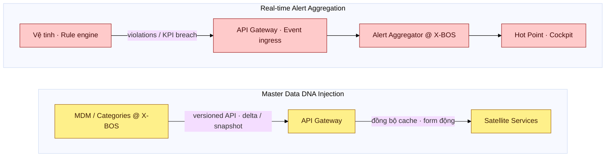

# Sơ đồ Kiến trúc Tổng thể & Thiết kế Mức cao — XeVN OS

| Thuộc tính | Giá trị |
|------------|---------|
| Loại tài liệu | Landscape & High-Level Design |
| Phiên bản | 1.0 |
| Ngày | 2026-03-25 |
| Phạm vi | Hệ sinh thái XeVN OS — Holding Management |

---

## Mục lục

1. [Tóm tắt điều hành](#1-tóm-tắt-điều-hành)
2. [Sơ đồ kiến trúc tổng thể (Mermaid)](#2-sơ-đồ-kiến-trúc-tổng-thể-mermaid)
3. [Chú giải màu trạng thái “Đèn LED”](#3-chú-giải-màu-trạng-thái-đèn-led)
4. [Chú giải biểu tượng & lớp kiến trúc](#4-chú-giải-biểu-tượng--lớp-kiến-trúc)
5. [Luồng dữ liệu trọng yếu](#5-luồng-dữ-liệu-trọng-yếu)
6. [Ghi chú triển khai Mermaid](#6-ghi-chú-triển-khai-mermaid)

---

## 1. Tóm tắt điều hành

XeVN OS được tổ chức theo **Hub-and-Spoke**: **X-BOS (Holding Core)** là trung tâm điều phối dữ liệu chủ và chính sách; các **dịch vụ vệ tinh** (theo domain) triển khai độc lập nhưng truy cập master data và phát sự kiện cảnh báo thông qua **một cổng API tập trung** và **SSO tập trung**. Tài liệu này cố định **một sơ đồ landscape duy nhất** đủ chi tiết cho đối thoại kiến trúc, đồng thời tách luồng *Master Data DNA Injection* và *Real-time Alert Aggregation* để truy vết từ BRD xuống triển khai.

**Đăng ký phân hệ (10 module trong hệ sinh thái):** HRM, TRSPORT, LGTS, EXPRESS, X-SCM, X-OFFICE, X-FINANCE, CRM, X-MAINTENANCE, **X-BOS** — trong đó **X-BOS** đóng vai trò **lõi hub**; chín phân hệ còn lại là **vệ tinh** nhóm theo ba cụm chức năng.

---

## 2. Sơ đồ kiến trúc tổng thể (Mermaid)

Sơ đồ dưới đây dùng **subgraph** để phân tầng; **classDef** mô phỏng trạng thái dashboard kiểu **đèn LED**; nhãn nút kết hợp **Font Awesome** (`fa:fa-*`) theo cú pháp Mermaid. Trục dọc: *truy cập → xác thực → cổng → vệ tinh / lõi → phản hồi cảnh báo lên Cockpit*.

```mermaid
%%{init: {
  "theme": "base",
  "themeVariables": {
    "fontSize": "13px",
    "primaryColor": "#f8fafc",
    "primaryTextColor": "#0f172a",
    "lineColor": "#64748b"
  },
  "flowchart": { "htmlLabels": true, "curve": "basis", "padding": 12 }
}}%%
flowchart TB
  subgraph L_Access["① Lớp truy cập — Presentation & Kênh"]
    direction LR
    subgraph L_Access_Users["Người dùng & vai trò"]
      direction TB
      U_CEO["fa:fa-gauge-high Cockpit Chủ tịch / BGĐ"]
      U_ADM["fa:fa-user-shield Quản trị tập đoàn & MDM"]
      U_OPS["fa:fa-users Vận hành đơn vị"]
    end
    subgraph L_Access_Channels["Ứng dụng chuyên vùng"]
      direction TB
      CH_WEB["fa:fa-globe Web Portal · Dashboard đơn vị"]
      CH_MOB["fa:fa-mobile-screen-button Mobile · Hiện trường"]
      CH_B2B["fa:fa-plug API B2B · Đối tác"]
    end
  end

  subgraph L_SSO["② Định danh tập trung — Central SSO"]
    SSO["fa:fa-shield-halved Central SSO Service — OIDC / OAuth2 · MFA"]
  end

  subgraph L_GW["③ Lớp tích hợp — API Gateway tập trung"]
    GW["fa:fa-network-wired API Gateway — Kong / NestJS Gateway"]
    GW_CAP["Routing · Rate limit · mTLS · Request correlation · Audit ID"]
  end

  subgraph L_Core["④ Lõi Holding — X-BOS Hub (Single Source of Truth)"]
    direction TB
    XDOP["fa:fa-sitemap XDOP — Điều phối & chia sẻ dữ liệu XeVN"]
    MDM["fa:fa-database MDM · Category DNA · Từ điển dữ liệu"]
    IAM["fa:fa-id-badge IAM · Policy · Menu · Tenant"]
    KPI["fa:fa-chart-line KPI Catalog · Ngưỡng · Định mức"]
    HOT["fa:fa-bell Hot Point Alert — Tổng hợp cảnh báo tập đoàn"]
    CDB[("fa:fa-server CSDL tổng hợp Holding — PostgreSQL schema `xbos_*`")]
    XDOP --> MDM
    XDOP --> IAM
    XDOP --> KPI
    XDOP --> HOT
    MDM --> CDB
  end

  subgraph L_Sat["⑤ Lớp vệ tinh — Satellite Services (nhóm chức năng)"]
    direction TB
    subgraph C1["Cụm Vận tải & Chuỗi cung ứng"]
      direction LR
      S_TRS["fa:fa-truck TRSPORT"]
      S_LGTS["fa:fa-warehouse LGTS"]
      S_EXP["fa:fa-box EXPRESS"]
      S_SCM["fa:fa-link X-SCM"]
    end
    subgraph C2["Cụm Hành chính & Tài chính · Nhân sự & Khách hàng"]
      direction LR
      S_OFF["fa:fa-building X-OFFICE"]
      S_FIN["fa:fa-coins X-FINANCE"]
      S_HRM["fa:fa-users HRM"]
      S_CRM["fa:fa-address-book CRM"]
    end
    subgraph C3["Cụm Bảo trì"]
      S_MAIN["fa:fa-wrench X-MAINTENANCE"]
    end
  end

  subgraph L_NFR["Hạ tầng bao phủ — NFR"]
    direction LR
    N_HA["fa:fa-server HA · Replica · LB"]
    N_SEC["fa:fa-lock WAF · SIEM · KMS"]
    N_OBS["fa:fa-eye Observability · Trace"]
  end

  N_HA -.-> GW
  N_SEC -.-> SSO
  N_OBS -.-> GW_CAP

  U_CEO --> SSO
  U_ADM --> SSO
  U_OPS --> SSO
  CH_WEB --> SSO
  CH_MOB --> SSO
  CH_B2B --> SSO

  SSO --> GW
  GW --> GW_CAP

  GW_CAP --> XDOP

  GW_CAP --> S_TRS
  GW_CAP --> S_LGTS
  GW_CAP --> S_EXP
  GW_CAP --> S_SCM
  GW_CAP --> S_OFF
  GW_CAP --> S_FIN
  GW_CAP --> S_HRM
  GW_CAP --> S_CRM
  GW_CAP --> S_MAIN

  GW_CAP <-->|"Master Data DNA Injection · Categories / version"| MDM

  S_TRS -->|"Sự kiện vi phạm · streaming"| GW_CAP
  S_LGTS -->|"Sự kiện vi phạm"| GW_CAP
  GW_CAP -->|"Real-time Alert Aggregation"| HOT

  HOT -.->|"Dashboard tổng · Cockpit"| U_CEO

  classDef ledGreen fill:#16a34a,stroke:#14532d,stroke-width:2px,color:#f0fdf4
  classDef ledYellow fill:#ca8a04,stroke:#713f12,stroke-width:2px,color:#fffbeb
  classDef ledRed fill:#dc2626,stroke:#7f1d1d,stroke-width:2px,color:#fef2f2
  classDef coreGold fill:#facc15,stroke:#a16207,stroke-width:3px,color:#1c1917
  classDef gwBlue fill:#38bdf8,stroke:#0369a1,stroke-width:2px,color:#0c4a6e
  classDef ssoPurple fill:#a78bfa,stroke:#5b21b6,stroke-width:2px,color:#1e1b4b
  classDef access fill:#e2e8f0,stroke:#475569,stroke-width:1px,color:#0f172a
  classDef nfr fill:#f1f5f9,stroke:#94a3b8,stroke-width:1px,color:#334155

  class U_CEO,U_ADM,U_OPS,CH_WEB,CH_MOB,CH_B2B access
  class SSO ssoPurple
  class GW,GW_CAP gwBlue
  class S_TRS,S_LGTS,S_EXP,S_SCM,S_OFF,S_FIN,S_HRM,S_CRM,S_MAIN ledGreen
  class XDOP,MDM,IAM,KPI,CDB coreGold
  class HOT ledRed
  class N_HA,N_SEC,N_OBS nfr
```

### 2.1 Sơ đồ luồng dữ liệu — Master Data DNA & Cảnh báo (chi tiết)

---

## 3. Chú giải màu trạng thái “Đèn LED”

| classDef | Màu | Ý nghĩa vận hành |
|----------|-----|------------------|
| **ledGreen** | Xanh bão hòa | Dịch vụ khỏe, SLA đạt, không vượt ngưỡng (có thể gán cho nút gateway hoặc service khi drill-down). |
| **ledYellow** | Vàng bão hòa | Cảnh báo mức độ vừa — theo dõi, có thể có biến động capacity hoặc tenant mở rộng. |
| **ledRed** | Đỏ bão hòa | Khẩn cấp / Hot Point — tổng hợp cảnh báo cần chỉ đạo trên Cockpit. |
| **coreGold** | Vàng lõi | Lõi X-BOS — XDOP, MDM, IAM, KPI, CSDL chủ. |
| **gwBlue** | Xanh cổng | API Gateway — điểm vào duy nhất cho routing & chính sách. |
| **ssoPurple** | Tím | SSO — ranh giới tin cậy trước gateway. |

---

## 4. Chú giải biểu tượng & lớp kiến trúc

| Lớp | Nội dung chính |
|-----|----------------|
| **① Presentation** | Cockpit điều hành; ứng dụng Web/Mobile/B2B theo vùng nghiệp vụ. |
| **② SSO** | Một phiên đăng nhập tập trung (OIDC/OAuth2), nền tảng cho JWT/scope tới gateway. |
| **③ API Gateway** | Kong hoặc NestJS Gateway: routing tới từng satellite service, hạn mức, correlation, mTLS. |
| **④ X-BOS Hub** | XDOP + MDM (DNA Category) + IAM + KPI + Hot Point + CSDL chủ; **một đường vào** từ `GW_CAP` → `XDOP`. |
| **⑤ Satellite** | Chín phân hệ vệ tinh theo ba cụm (4 + 4 + 1); **mười module** trong đăng ký sản phẩm gồm cả **X-BOS** ở lõi — không lặp X-BOS trong lớp vệ tinh. |

**Biểu tượng Font Awesome (theo nhãn nút):** `fa-gauge-high` (Cockpit), `fa-shield-halved` (SSO), `fa-network-wired` (Gateway), `fa-truck`, `fa-warehouse`, `fa-box`, `fa-link`, `fa-building`, `fa-coins`, `fa-users`, `fa-address-book`, `fa-wrench`, `fa-sitemap` (XDOP), `fa-database`, `fa-bell` (Hot Point).

---

## 5. Luồng dữ liệu trọng yếu

### 5.1 Master Data DNA Injection

X-BOS duy trì **phiên bản danh mục** (categories, định mức tham chiếu). Satellite services **không** là nguồn ghi master; chúng nhận **bơm DNA** qua API Gateway: payload delta/snapshot, kèm `schemaVersion` hoặc etag. UI vệ tinh có thể **render form động** từ metadata do hub phát hành.

### 5.2 Real-time Alert Aggregation

Vi phạm ngưỡng tại vệ tinh (ví dụ TRSPORT) được đưa vào luồng sự kiện đã chuẩn hóa, qua **ingress tại Gateway** (hoặc bus sau gateway), tới **Alert Aggregator** trong X-BOS để gom trùng, xếp hạng, rồi hiển thị trên **Hot Point** mà Cockpit Chủ tịch đọc — đảm bảo **một màn hình chỉ đạo** thay vì nhiều console rời.

---

## 6. Ghi chú triển khai Mermaid

- **Font Awesome:** Cú pháp `fa:fa-icon-name` trong nhãn nút phụ thuộc **phiên bản Mermaid** và **renderer** (VS Code, GitHub, MkDocs). Nếu icon không hiển thị, vẫn giữ nhãn chữ để sơ đồ không mất ngữ nghĩa.
- **Độ phức tạp:** Sơ đồ tổng thể cố tình **vừa đủ** để in một trang A3 ngang; chi tiết luồng tách ở mục 2.1.
- **Đồng bộ BRD:** Mô hình Hub-and-Spoke, Gateway tập trung, XDOP/MDM và Hot Point thống nhất với `docs/BRD_HLD_XEVN_OS.md`.

---

*Tài liệu này là baseline landscape; thay đổi tên sản phẩm gateway hoặc công nghệ stream chỉ cần cập nhật nhãn và footnote — không đổi logic phân tầng.*
