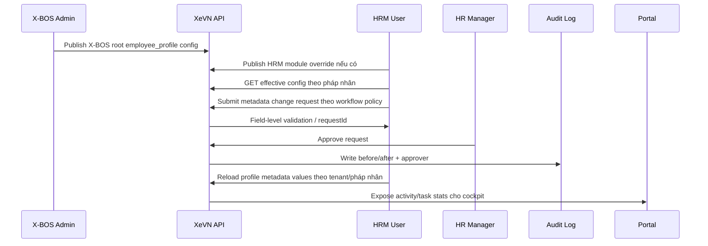

# Product Backlog — Golden Flow XeVN OS

## Nguyên tắc hệ sinh thái đã chốt
- X-BOS là **phân hệ cấu hình/định nghĩa gốc** cho toàn hệ sinh thái: HRM, vận hành đơn vận, tài chính kế toán và các phân hệ sau sẽ kế thừa cấu hình gốc này.
- Mỗi phân hệ vẫn có quyền cấu hình cục bộ của mình. Cấu hình cục bộ chỉ được xem là module override/module extension; cấu hình khai báo từ X-BOS là lớp gốc để merge effective config.
- HRM áp dụng cho toàn tập đoàn XeVN theo mô hình multi-tenant: mỗi tenant/pháp nhân có dữ liệu HRM riêng, có thể có variant cấu hình riêng theo pháp nhân.
- Portal là lớp điều hành/cockpit: không chỉ aggregate dữ liệu mà còn thống kê hoạt động, hàng đợi xử lý, SLA, cảnh báo và action từ các phân hệ.
- Thay đổi dữ liệu có cần duyệt hay không phải bám cấu hình workflow trong X-BOS, không hard-code theo màn HRM.

## Mục tiêu MVP
Golden Flow v1 tập trung vào một luồng vận hành có thể kiểm chứng, nhưng vẫn bám nguyên tắc module tự cấu hình + X-BOS root config:

## 19 việc còn lại và acceptance

| # | Nhóm việc | Acceptance tối thiểu |
|---|---|---|
| 1 | Sản phẩm lõi/MVP | Golden Flow v1 được ưu tiên hơn việc mở thêm module mới. |
| 2 | User journey | Có journey BOD/Admin/HR/Manager/Employee với điểm vào, dữ liệu, kết quả. |
| 3 | Domain ownership | X-BOS sở hữu root config; phân hệ sở hữu module override và runtime data; Portal sở hữu cockpit/activity projection. |
| 4 | Authorization | Có policy field-level; portal-mode không bypass dữ liệu nhạy cảm; approval dựa vào workflow config X-BOS. |
| 5 | Lifecycle | Config/change request/workflow có Draft/Pending/Approved/Published/Archived. |
| 6 | Versioning | Có rule fieldCode immutable, type change cần migration, old values giữ configVersion. |
| 7 | Cockpit | Portal hiển thị task queue/activity stats thật cho metadata change request, SLA, action approve/reject. |
| 8 | Product KPI | Có KPI đo: time-to-config, validation error rate, approval SLA, audit completeness. |
| 9 | Onboarding | Wizard tenant → pháp nhân → org → import nhân sự → chọn template → publish config. |
| 10 | Import/export | Có import nhân sự theo dynamic field mapping và export config/audit snapshot. |
| 11 | Audit UX | Có before/after, reason, approver, config version, export audit. |
| 12 | Notification | Có notification in-app/email/SLA reminder/escalation mapping. |
| 13 | Exception rules | Có fallback khi API/config lỗi, publish race, validation drift. |
| 14 | Mobile/self-service | Có scope nhân viên/tài xế tự cập nhật hồ sơ và manager duyệt. |
| 15 | Reporting model | Có dimensions: org, legal entity, employee, time, config version, workflow status. |
| 16 | Packaging | Có package/feature flag: Core Portal, X-BOS Config, HRM Basic, Workflow, KPI, AI. |
| 17 | Security/privacy | Có PII masking, retention, export control, RLS, field-level permission. |
| 18 | UAT matrix | Có test case cho admin thêm field, HR nhập, manager duyệt, audit/report cập nhật. |
| 19 | Release strategy | Có tiêu chí Prototype → Alpha → Pilot → Production. |

## Trạng thái triển khai hiện tại
- API contract, Prisma schema và HRM dynamic metadata runtime đã có lát cắt đầu.
- Metadata values đang được nâng từ lưu trực tiếp sang change request + approval + audit.
- Các module HRM còn nhiều Supabase direct-call cần migrate dần sang API.
