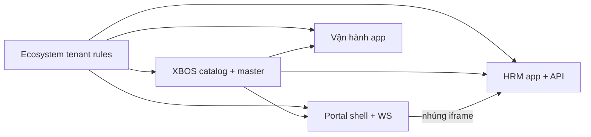

# PROJECT PLAN — HỆ SINH THÁI XeVN OS

| Mục | Nội dung |
|-----|----------|
| **Tên tài liệu** | Kế hoạch dự án tổng thể hệ sinh thái XeVN |
| **Phiên bản** | 1.0 |
| **Ngày hiệu lực** | 2026-05-15 |
| **Trạng thái** | Bản làm việc (working draft) |
| **Nguồn tham chiếu** | `docs/ecosystem/*`, `docs/xbos/*`, `docs/hrm/*`, `docs/wbs phân hệ *.html`, `docs/program/FE_BE_DB_COVERAGE_AUDIT_2026-05-05.md` |

## 1. Tóm tắt điều hành

XeVN OS là hệ sinh thái phần mềm **đa tenant** cho doanh nghiệp vận tải — logistics đa công ty, gồm:

- **Portal (Trung tâm):** lớp vào thống nhất, Cockpit, Command Center, workspace tập đoàn.
- **XBOS:** lõi dữ liệu dùng chung, phát hành phiên bản, kiểm toán.
- **HRM:** quản trị nhân sự (Web + Mobile + API).
- **Vận hành xe:** điều hành xe, tuyến, lệnh, BDSC (khung đợt 1 — chờ BRD chi tiết bổ sung).

**Nguyên tắc giao hàng:** BRD → SRS → TechSpec **trước hoặc đồng thời** với code; mọi phân hệ tuân quy tắc phạm vi `BR-ECO-SCOPE-*` tại `docs/ecosystem/BRD.md`.

---

## 2. Lộ trình triển khai (Wave)

| Wave | Phạm vi | Mục tiêu |
|------|---------|----------|
| **W0 — Nền** | Ecosystem + XBOS API + tenancy | Phạm vi tenant, catalog sync, health, audit |
| **W1 — Cổng** | Portal Shell, Cockpit, Command Center | Một lớp vào; nhúng HRM; master-data Portal |
| **W2 — HRM** | HRM Web + `hrm-api` + Mobile P0 | Nghiệp vụ NS đầy đủ; đơn + thông báo |
| **W3 — Vận hành** | App Vận hành đợt 1 (theo WBS) | Bảng tải → lệnh điều xe → BDSC → giá nhiên liệu |
| **W4 — Mở rộng** | KPI engine, Tài chính, Mobile P1/P2 | Tích hợp chéo; tối ưu vận hành |

---

## 3. Phần 0 — Nền toàn hệ (`docs/ecosystem/`)

### 3.1 Quy tắc phạm vi dữ liệu (Tenant & System Admin)

| Mã use case | Mô tả | Tác nhân |
|-------------|--------|----------|
| **UC-ECO-SCOPE-01** | Làm nghiệp vụ khi chưa đăng nhập (môi trường cho phép) → coi system admin, thấy toàn tenant | Mọi phân hệ |
| **UC-ECO-SCOPE-02** | Đã đăng nhập → chỉ dữ liệu tenant/company được gán | Mọi phân hệ |
| **UC-ECO-MASTER-01** | CRUD master-data theo `(tenant_id, company_id)` qua API thật | Admin / Portal |
| **UC-ECO-MASTER-02** | Bootstrap tenant mới không ảnh hưởng tenant hiện có | Platform admin |

**Quy tắc nghiệp vụ:** `BR-ECO-SCOPE-01`..`04`, `BR-ECO-UX-01`, `BR-ECO-CAT-01`..`02` — xem `docs/ecosystem/BRD.md`.

### 3.2 Trải nghiệm nhúng phân hệ

| Mã use case | Mô tả |
|-------------|--------|
| **UC-ECO-UX-01** | Modal/drawer/select overlay phủ **toàn viewport Portal** khi nhúng iframe |
| **UC-ECO-CAT-01** | Công ty mở rộng trường danh mục sau khi đọc catalog đã gán |
| **UC-ECO-CAT-02** | Xóa trường danh mục → yêu cầu phê duyệt qua XBOS |

---

## 4. Phần 1 — XBOS — Lõi dữ liệu dùng chung (`docs/xbos/`)

**Vai trò:** Nguồn chuẩn duy nhất cho danh mục dùng chung; không thay thế nghiệp vụ chuyên sâu của HRM / Vận hành / Tài chính.

### 4.1 Vận hành & sức khỏe dịch vụ

| Chức năng | Mã use case | Mô tả |
|-----------|-------------|--------|
| Health check | **UC-XBOS-01** | `GET /api/xbos` — trạng thái dịch vụ |

### 4.2 Danh mục dùng chung (Config Sync)

| Chức năng | Mã use case | Mô tả |
|-----------|-------------|--------|
| Bootstrap / cập nhật catalog | **UC-XBOS-02** | `POST /api/xbos/config-sync/bootstrap-xevn` |
| Lấy catalog theo khóa | **UC-XBOS-03** | `GET /api/xbos/config-sync/catalog/:catalogKey?target=...` |
| Liệt kê catalog theo phân hệ | **UC-XBOS-04** | `GET /api/xbos/config-sync/catalogs?target=...` |
| Gán catalog cho phân hệ đích | *(BR-XBOS-03)* | Chưa gán → không cấp phát |

### 4.3 Phát hành & kiểm soát thay đổi

| Chức năng | Mã use case | Mô tả |
|-----------|-------------|--------|
| Publish phiên bản hợp đồng dữ liệu | **UC-XBOS-05** | `POST /api/xbos/version/publish` |
| Truy vấn nhật ký kiểm toán | **UC-XBOS-06** | `GET /api/xbos/audit?...` |
| Tiếp nhận cảnh báo từ phân hệ | **UC-XBOS-07** | `POST /api/xbos/alerts/violation-ingest` |

### 4.4 Business Master & KPI (Wave Full Ecosystem)

| Chức năng | Mã use case | Mô tả |
|-----------|-------------|--------|
| CRUD master theo domain | **UC-XBOS-08** | `GET/PUT/DELETE /api/xbos/business-master/:domain/items...` |
| Tính KPI server-side | **UC-XBOS-09** | `POST /api/xbos/kpi-engine/evaluate`, `evaluate-batch` |

**Quy tắc nghiệp vụ then chốt:** `BR-XBOS-01`..`05` — một nguồn chuẩn; duyệt thay đổi nhạy cảm; đồng bộ version.

---

## 5. Phần 2 — Portal / Trung tâm (`docs/wbs phân hệ định nghĩa.html`)

### 5.1 Lớp vào & điều hành

| STT | Chức năng | Mã use case |
|-----|-----------|-------------|
| 1 | Unified Shell | **UC-PORTAL-01** — Chọn Cockpit hoặc Command Center |
| 2 | Executive Cockpit | **UC-PORTAL-02** — KPI tổng, điều hướng workspace |
| 3 | Command Center (khung) | **UC-PORTAL-03** — Rail module, chuyển ngữ cảnh phân hệ |

### 5.2 Nhúng HRM trong Command Center

| STT | Chức năng | Mã use case |
|-----|-----------|-------------|
| 4 | HRM — Tổng quan | **UC-PORTAL-HRM-01** |
| 5 | HRM — Nhân viên | **UC-PORTAL-HRM-02** — CRUD, import/export, khôi phục |
| 6 | HRM — Tuyển dụng | **UC-PORTAL-HRM-03** |
| 7 | HRM — Chấm công | **UC-PORTAL-HRM-04** |
| 8 | HRM — Lương | **UC-PORTAL-HRM-05** |
| 9 | HRM — Công ty | **UC-PORTAL-HRM-06** |
| 10 | HRM — Báo cáo | **UC-PORTAL-HRM-07** |
| 11 | HRM — Hợp đồng / BH / Quyết định | **UC-PORTAL-HRM-08** |
| 12 | HRM — UniAI | **UC-PORTAL-HRM-09** |
| 13 | HRM — Tasks / Quy trình / Dịch vụ / Công cụ | **UC-PORTAL-HRM-10**..**13** |

### 5.3 Workspace tập đoàn (master-data Portal)

| STT | Chức năng | Mã use case | Ưu tiên triển khai |
|-----|-----------|-------------|-------------------|
| 14 | Tổ chức | **UC-PORTAL-WS-01** | P0 — chuyển mock → API/DB |
| 15 | Nhân sự (góc Portal) | **UC-PORTAL-WS-02** | P1 |
| 16 | Khách hàng (CRM) | **UC-PORTAL-WS-03** | P0 — `UC-ECO-MASTER-01` / `UC-XBOS-08` |
| 17 | Đối tác | **UC-PORTAL-WS-04** | P0 |
| 18 | KPI Dashboard | **UC-PORTAL-WS-05** | P0 — `UC-XBOS-09` |
| 19 | Cài đặt — Chức danh | **UC-PORTAL-SET-01** | P0 |
| 20 | Cài đặt — NCC / Vendor | **UC-PORTAL-SET-02** | P0 |
| 21 | Cài đặt — Loại chi phí | **UC-PORTAL-SET-03** | P0 |
| 22 | Cài đặt — KPI & Metric | **UC-PORTAL-SET-04** | P0 |
| 23 | Cài đặt — Công thức KPI | **UC-PORTAL-SET-05** | P1 (placeholder) |

### 5.4 Điều hướng, phân quyền & workflow

| Chức năng | Mã use case |
|-----------|-------------|
| Điều hướng liên module (X-BOS, Vận hành, …) | **UC-PORTAL-NAV-01** |
| Phân quyền & UX thống nhất XeVN | **UC-PORTAL-AUTH-01** |
| Định nghĩa quy trình Command Center | **UC-PORTAL-WF-01** — Step builder + `moduleId` |
| Workflow Canvas zoom/pan | **UC-PORTAL-WF-02** — Không ảnh hưởng sticky header |

---

## 6. Phần 3 — App HRM (`docs/hrm/`, `docs/wbs phân hệ hrm.html`)

### 6.1 HRM API / Nền tảng (`docs/hrm/SRS.md`)

| STT | Chức năng | Mã use case | Điểm vào API |
|-----|-----------|-------------|--------------|
| A1 | Health | **UC-HRM-01** | `GET /api/hrm` |
| A2 | Quản trị nền tảng | **UC-HRM-02** | `POST /api/hrm/admin/platform-admin` |
| A3 | Quản trị doanh nghiệp | **UC-HRM-03** | `POST\|PATCH /api/hrm/admin/company-admin` |
| A4 | Mời nhân viên hàng loạt | **UC-HRM-04** | `POST /api/hrm/admin/invite-employees` |
| A5 | Tài khoản nhạy cảm | **UC-HRM-05** | `POST /api/hrm/admin/reset-user-password` |
| A6 | Đồng bộ catalog từ XBOS | **UC-HRM-06** | `POST /api/hrm/catalog-sync/pull` |
| A7 | Đọc catalog theo khóa | **UC-HRM-07** | `GET /api/hrm/catalog-sync/catalog/:catalogKey` |
| A8 | Liệt kê catalog | **UC-HRM-08** | `GET /api/hrm/catalog-sync/catalogs` |
| A9 | Đơn chỉnh sửa chấm công | **UC-HRM-09** | `.../attendance/update-requests` + fanout notify |
| A10 | Đơn nghỉ phép | **UC-HRM-10** | `.../attendance/leave-requests` + approve/reject |
| A11 | Yêu cầu dịch vụ nội bộ | **UC-HRM-11** | `.../operations/service-requests` + notify |
| A12 | Hộp thư thông báo | **UC-HRM-12** | `GET/PATCH .../notifications/inbox` |

**Quy tắc:** `BR-HRM-01`..`08`; pipeline thông báo thống nhất cho mọi đơn (Socket.IO + inbox + webhook/push).

### 6.2 HRM Web — 20 nhóm năng lực (WBS)

| STT | Chức năng | Mã use case gợi ý |
|-----|-----------|-------------------|
| B1 | Cổng công khai & xác thực | **UC-HRM-WEB-01**..**05** — Landing, đăng nhập/đăng ký, onboarding, quên MK |
| B2 | Quản trị nền tảng XeVN | **UC-HRM-WEB-06** |
| B3 | Hỗ trợ tài khoản | **UC-HRM-WEB-07** |
| B4 | Dashboard HR | **UC-HRM-WEB-08** |
| B5 | Nhân viên | **UC-HRM-WEB-09** |
| B6 | Hợp đồng / BH / Quyết định | **UC-HRM-WEB-10**..**12** |
| B7 | Tuyển dụng | **UC-HRM-WEB-13** |
| B8 | Chấm công | **UC-HRM-WEB-14** → liên kết **UC-HRM-09** |
| B9 | Lương & phúc lợi | **UC-HRM-WEB-15** |
| B10 | Công ty & thành viên | **UC-HRM-WEB-16** → **UC-HRM-04** |
| B11 | Báo cáo HRM | **UC-HRM-WEB-17** |
| B12 | Cài đặt HRM | **UC-HRM-WEB-18** |
| B13 | UniAI (nội bộ) | **UC-HRM-WEB-19** |
| B14 | UniAI (landing) | **UC-HRM-WEB-20** |
| B15 | TTS / đa phương tiện | **UC-HRM-WEB-21** |
| B16 | Tasks | **UC-HRM-WEB-22** |
| B17 | Quy trình & chính sách | **UC-HRM-WEB-23** |
| B18 | Dịch vụ nội bộ | **UC-HRM-WEB-24** → **UC-HRM-11** |
| B19 | Công cụ & thiết bị | **UC-HRM-WEB-25** |
| B20 | Phân quyền menu | **UC-HRM-WEB-26** |

**Kịch bản màn hình (UAT):** 26 kịch bản — `docs/wbs phân hệ hrm.html` Phần B.

### 6.3 HRM Mobile (`docs/hrm/BRD_MOBILE.md`, `SRS_MOBILE.md`)

| Ưu tiên | Chức năng | Mã use case |
|---------|-----------|-------------|
| P0 | Đăng nhập & phiên | **UC-HRM-MOB-01** |
| P0 | Chọn phạm vi công ty | **UC-HRM-MOB-02** |
| P0 | Dashboard cá nhân | **UC-HRM-MOB-03** |
| P0 | Chấm công | **UC-HRM-MOB-04** |
| P0 | Lịch sử chấm công | **UC-HRM-MOB-05** |
| P0 | Tạo đơn (chấm công / nghỉ) | **UC-HRM-MOB-06** |
| P0 | Danh sách đơn | **UC-HRM-MOB-07** |
| P0/P1 | Phê duyệt đơn | **UC-HRM-MOB-08** |
| P0 | Thông báo in-app | **UC-HRM-MOB-13** |
| P0 | Đăng xuất | **UC-HRM-MOB-15** |
| P1 | Tóm tắt lương | **UC-HRM-MOB-09** |
| P1 | Hợp đồng / BH (read) | **UC-HRM-MOB-10** |
| P1 | Tasks / dịch vụ | **UC-HRM-MOB-11** |
| P1 | Hồ sơ cá nhân | **UC-HRM-MOB-12** |
| P2 | Offline có kiểm soát | **UC-HRM-MOB-14** |

---

## 7. Phần 4 — App Vận hành xe (khung đợt 1)

> **Trạng thái:** Khung từ `docs/wbs phân hệ điều hành.html` — **chờ BRD chi tiết** bổ sung từ product owner. Mã use case tạm: **`UC-OPS-*`**.

### 7.1 Thiết lập & danh mục vận hành

| STT | Chức năng | Mã use case | Kịch bản màn hình (WBS) |
|-----|-----------|-------------|-------------------------|
| 1 | Bảng tải | **UC-OPS-01** | Xem xe/lái theo tab trạng thái; lọc tuyến/ngày |
| 2 | Thiết lập bảng tải | **UC-OPS-02** | Cấu hình khung giờ/chuyến |
| 3 | Lịch sử băng tải | **UC-OPS-03** | Xem lịch sử; hủy áp dụng |
| 4 | Thiết lập tuyến | **UC-OPS-04** | CRUD tuyến, lộ trình, điểm dừng |
| 5 | Điểm đón trả — biểu mẫu | **UC-OPS-05** | Tạo/cập nhật điểm |
| 6 | Điểm đón trả — danh sách | **UC-OPS-06** | Tra cứu, lọc, phân trang |
| 7 | Điểm đón trả — chi tiết | **UC-OPS-07** | Xem/sửa/xóa/in |
| 8 | Tài khoản NV vận hành | **UC-OPS-08** | Liên kết hồ sơ ↔ tài khoản |
| 9 | Phân quyền phần mềm | **UC-OPS-09** | Gán quyền theo vai trò |
| 10 | Nhật ký thiết lập | **UC-OPS-10** | Audit cấu hình |

### 7.2 Điều hành & lệnh xe

| STT | Chức năng | Mã use case |
|-----|-----------|-------------|
| 11 | Lệnh xe tăng cường | **UC-OPS-11** |
| 12 | Lệnh xe đi tour | **UC-OPS-12** |
| 13 | Tổng hợp lịch lái theo tuyến | **UC-OPS-13** |
| 14 | Bảng công lái xe | **UC-OPS-14** |

### 7.3 BDSC & nhiên liệu

| STT | Chức năng | Mã use case |
|-----|-----------|-------------|
| 15 | Lịch BDSC & phiếu chờ | **UC-OPS-15** |
| 16 | Chi tiết / cập nhật phiếu BDSC | **UC-OPS-16** |
| 17 | Vệ sinh nội thất chuyên sâu (VSNT) | **UC-OPS-17** |
| 18 | Giá nhiên liệu theo vùng | **UC-OPS-18** |

### 7.4 Liên kết hệ sinh thái (đã chốt trong WBS)

- Portal **gán** catalog (tuyến, điểm, loại xe, vùng, nhiên liệu…) cho `target=operations`.
- App Vận hành **tải catalog đã gán** + catalog nội bộ (bảng tải, ca, phiếu BDSC…).
- Cảnh báo vi phạm có thể ingest về XBOS (**UC-XBOS-07**).

**UAT đợt 1:** 18 kịch bản — `docs/wbs phân hệ điều hành.html` Phần B.

---

## 8. Phần 5 — Phân hệ chưa mở rộng trong plan

| Phân hệ | Chức năng dự kiến (mức BRD XBOS) | Wave gợi ý |
|---------|----------------------------------|-------------|
| **Tài chính** | Thu chi, công nợ, đối soát, ngân sách | W4+ |
| **Cài đặt** | Tham số hệ thống, mẫu, chính sách hiệu lực | Gắn Portal settings |
| **X-BOS UI (app)** | Metadata động, org chart, KPI policy | W1/W4 — nhiều màn đang mock |

---

## 9. Ma trận phụ thuộc

---

## 10. Deliverable & tiêu chí nghiệm thu

| Deliverable | Wave | Tiêu chí |
|-------------|------|----------|
| Tenant 2 chế độ có test regression | W0 | **UC-ECO-SCOPE-01/02** pass |
| XBOS catalog + publish + audit | W0–W1 | **UC-XBOS-01**..**07** |
| Portal Shell + workspace P0 | W1 | Org, customers, partners, KPI settings — API/DB thật |
| HRM API đầy đủ pilot | W2 | **UC-HRM-01**..**12** |
| HRM Web UAT | W2 | 26 kịch bản WBS HRM |
| HRM Mobile P0 | W2 | **UC-HRM-MOB-01**..**08**, **13**, **15** |
| Vận hành đợt 1 UAT | W3 | 18 kịch bản WBS điều hành |
| KPI engine + Portal KPI | W4 | **UC-XBOS-09** + **UC-PORTAL-WS-05** |

---

## 11. Hiện trạng triển khai (tham chiếu audit 2026-05-05)

Theo `docs/program/FE_BE_DB_COVERAGE_AUDIT_2026-05-05.md`:

- Nhiều màn Portal / X-BOS UI vẫn **mock/local-state**.
- HRM: **`hrm-api`** (NestJS) + Postgres **`xevn_hrm`** (`migrations/hrm/*`); FE qua `hrmApi`, không Supabase DB.
- Ưu tiên P0: chuyển các trang settings, organization, customers, partners, KPI sang FE+BE+DB thật.

---

## 12. Việc cần bổ sung (Vận hành)

Khi có BRD phân hệ Vận hành, cập nhật mục 7 với:

1. Phạm vi đợt 2+ (ngoài 12 nhóm đợt 1).
2. Mobile hiện trường (có/không).
3. Kiến trúc API (`operations-api` hay pattern khác).
4. Map **UC-OPS-xx** → endpoint và schema DB.

---

## 13. Yêu cầu Chủ tịch Nam (họp HRM–XEVN 2026-05)

**Nguồn:** `docs/meetings/BIEN_BAN_HOP_HRM_XEVN_NGUYENVAN.md`, `docs/xbos/BRD_GAP_ANALYSIS_MEETING_2026-05.md`.

**Thứ tự bắt buộc:** (1) Công ty/pháp nhân → (2) Sơ đồ org → (3) Chức danh/JD/PQ → (4) QT động → (5) Dữ liệu NS/TS/xe.

| Wave plan | Trạng thái implement |
|-----------|---------------------|
| A — Docs v2.3 | BRD/SRS/TechSpec + gap analysis |
| B — Org API + Portal registry | `org-foundation`, GlobalFilter, Organization |
| C — Position/RBAC + HRM import spec | `position-rbac`, PositionsSettings |
| D — Workflow runtime + Command Center persist | `workflow-engine`, multi-hat |
| E — Asset request + Executive rollup | `asset-requests`, dashboard hook |

## 14. Lịch sử thay đổi

| Phiên bản | Ngày | Mô tả |
|-----------|------|--------|
| 1.0 | 2026-05-15 | Khởi tạo — tổng hợp từ bộ tài liệu `docs/` hiện hành |
| 1.1 | 2026-05-15 | Bổ sung wave họp Chủ tịch + traceability gap analysis |
