# Đặc tả Yêu cầu Phần mềm (SRS)
## Phân hệ Vận hành XeVN (Operations Module)

| Thuộc tính | Giá trị |
|---|---|
| Sản phẩm | XeVN Operations Module |
| Phiên bản tài liệu | 1.6 |
| Căn cứ | Tài liệu BRD phân hệ Vận hành; quy chế giao diện XeVN OS |
| Đối tượng dùng | BA, SA, Tech Lead, Dev, QA, UAT |

---

## 1. Phạm vi và nguyên tắc đặc tả

Tài liệu mô tả yêu cầu có thể kiểm chứng cho **phân hệ Quản lý vận hành** trên web, tích hợp **cổng điều hành (Command Center)** của nền tảng XeVN.

### 1.1 Phạm vi baseline giao diện (đợt triển khai 1)

**Trong phạm vi giai đoạn này (đến hết tab “Thiết lập giá nhiên liệu”):**

| Nhóm menu (Quản lý vận hành) | Gồm các chức năng chính |
|---|---|
| Bảng tải | Theo dõi realtime xe/lái theo **trạng thái vận hành** (đang hoạt động, tạm nghỉ, đi tour, ngừng hoạt động; lái xe: đang HĐ, dự phòng, nghỉ, đình tài…), lọc tuyến/ngày/tìm kiếm |
| Thiết lập bảng tải | **Bảng tải / Băng tải**: chế độ mặc định vs thủ công; sinh **lưới khung giờ/chuyến** theo tuyến + thứ + tần suất; lịch sử thiết lập thủ công, hủy áp dụng |
| Thiết lập vận hành | **Thiết lập tuyến** (lộ trình, điểm dừng động, điểm cuối); **Thiết lập điểm đón/trả** (đủ biến thể VP/CN vs điểm khác, địa bàn, liên hệ); danh sách/xem tất cả/lọc/chi tiết/sửa/xoá/in; **Thiết lập tài khoản NV** (form + danh sách + hiển thị thông tin đăng nhập — ưu tiên **delegate IAM**); **Phân quyền phần mềm**; **Nhật ký thiết lập** |
| Lệnh điều xe | **Xe tăng cường**; **Xe đi tour** (KH, lịch trình, điểm đón động, thanh toán); tab **Khác** (mở rộng theo lộ trình) + bảng **xe đang hoạt động** để chọn nhanh |
| Lịch làm việc lái xe tuyến | Tổng hợp theo **tuyến/ngày** (số lái/xe theo loại); **bảng công** theo tháng + mã ngày (X, NN, XN, LP…); popup **chi tiết chấm công** theo lịch |
| Lịch bảo dưỡng sửa chữa | Lịch tháng theo xe (mốc màu theo thời lượng); danh sách chờ BD; chi tiết phiếu (ưu tiên, km, cơ sở, hạng mục, việc làm); tab **Vệ sinh nội thất chuyên sâu** tương tự |
| Thiết lập giá nhiên liệu | Nhập **ma trận giá** theo **vùng × loại nhiên liệu**, có **giờ/ngày hiệu lực**; **lịch sử** điều chỉnh, sửa/xem chi tiết |

**Ngoài phạm vi đợt triển khai 1:**

- Toàn bộ module **Quản lý khách hàng** (đặt vé/hợp đồng, thanh toán, VIP, đại lý, CTV, điều kiện hoàn hủy vé, v.v.) — **không** thuộc phân hệ vận hành trong đợt này.
- **Thiết lập định mức** nhiên liệu theo xe (bảng mức theo thời gian/ODO/mùa) nếu thuộc luồng khác hoặc nằm sau “Thiết lập giá nhiên liệu” — **không** thuộc đợt 1.

### 1.2 Liên hệ với BRD luồng vận chuyển tổng quát

BRD phân hệ Vận hành mô tả luồng **đơn — lệnh — chuyến — kho — POD — vendor — SLA — báo cáo**. **Baseline đợt 1** tập trung **điều hành xe khách / tuyến cố định**: bảng tải, lệnh (tăng cường/tour), lịch lái, BDSC, giá nhiên liệu.

Ánh xạ khái niệm:

- **Lệnh điều xe / xe tăng cường** ≈ phân bổ tạm thời nguồn lực (`ops_resource_assignment` / tương đương `ops_transport_job` dạng đặc biệt).
- **Xe đi tour** ≈ **hợp đồng chuyến / đơn dịch vụ** có thông tin KH + lịch trình + điểm đón động + thanh toán (`ops_tour_order` hoặc mở rộng `ops_order`).
- **Thiết lập tuyến / điểm đón trả** ≈ dữ liệu tham chiếu phục vụ điều phối: **ưu tiên** lấy từ danh mục **được Web Portal gán** cho phân hệ Vận hành và đối tượng tương ứng; **bổ sung** danh mục / tham số **riêng của Vận hành** khi nằm trong phạm vi module và không trùng vai trò “nguồn chuẩn” của Portal.
- **Bảng tải** ≈ view tổng hợp trạng thái thực thi + availability từ telematics/lịch (tích hợp dần).

### 1.2.1 Nguyên tắc danh mục (bắt buộc khớp BRD §3.1.1)

- **Web Portal** quyết định **gán** danh mục dùng chung nào cho **phân hệ Vận hành** và cho từng **loại đối tượng** (theo cấu hình tập đoàn).
- UI và API baseline **phải** cho phép Vận hành **tiêu thụ** đúng các danh mục đã gán (tra cứu, lọc, validate tham chiếu).
- Dữ liệu **chỉ thuộc nghiệp vụ vận hành** (ví dụ cấu hình bảng tải, ca, phiếu BDSC) vẫn thuộc phân hệ, nhưng **không** được mâu thuẫn với danh mục đã gán (ví dụ tuyến / điểm / vùng / loại NL nếu Portal đã quản trị).

### 1.3 Nguyên tắc giao diện và trải nghiệm

- Giao diện **thống nhất** với cổng điều hành XeVN; bố cục theo **tab, bảng, biểu mẫu, hộp thoại** phù hợp từng chức năng.
- Tuân thủ **quy chế giao diện** nền tảng (màu, khoảng cách, thang chữ).
- Dùng **bộ điều khiển giao diện chuẩn** của hệ sinh thái (tiêu đề trang, thẻ nội dung, bảng dữ liệu, nút, nhãn trạng thái, thông báo, trạng thái chờ, hộp thoại).
- **Điều hướng** trong workspace điều hành hiện có (menu / thanh điều hướng thống nhất).
- **Trạng thái nghiệp vụ** thể hiện rõ bằng màu nhãn; thao tác **huỷ / xoá** có phân biệt trực quan theo mức độ rủi ro.
- **Danh sách lớn**: có bộ lọc, tiêu đề cột cố định khi cuộn, phân trang phía máy chủ; **xuất dữ liệu** theo lộ trình sản phẩm.

---

## 2. Information Architecture (IA)

### 2.1 Cây chức năng cấp 1

```
Quản lý vận hành
├── Bảng tải
├── Thiết lập bảng tải
│   ├── Bảng tải | Thiết lập bảng tải
│   └── Băng tải | Thiết lập băng tải
├── Thiết lập vận hành
│   ├── Thiết lập tuyến | Thiết lập điểm đón trả
│   └── Thiết lập tài khoản | Phân quyền | Nhật ký thiết lập
├── Lệnh điều xe
│   └── Xe tăng cường | Xe đi tour | Khác
├── Lịch làm việc lái xe tuyến
├── Lịch bảo dưỡng sửa chữa
│   └── BDSC | Vệ sinh nội thất chuyên sâu
└── Thiết lập giá nhiên liệu
```

### 2.2 Đường dẫn chức năng (URL)

| Đường dẫn | Màn hình |
|---|---|
| `/ops/board` | Bảng tải |
| `/ops/load-table` | Thiết lập bảng tải (tab con) |
| `/ops/conveyor` | Băng tải / thiết lập băng tải |
| `/ops/settings/routes` | Thiết lập tuyến |
| `/ops/settings/stops` | Thiết lập điểm đón trả |
| `/ops/settings/accounts` | Thiết lập tài khoản NV |
| `/ops/settings/permissions` | Phân quyền phần mềm |
| `/ops/settings/audit-log` | Nhật ký thiết lập |
| `/ops/dispatch` | Lệnh điều xe (nhiều tab) |
| `/ops/driver-schedule` | Lịch làm việc lái xe tuyến |
| `/ops/maintenance` | Lịch BDSC (+ sub VSNT) |
| `/ops/fuel-prices` | Thiết lập giá nhiên liệu |

---

## 3. Danh mục màn hình (Screen Inventory)

**Quy ước:** Mỗi dòng dưới đây có **đúng một** use case tương ứng ở §5 (tổng **18** màn = **18** UC).

| Mã màn | Mã UC | Tên | Vai trò chính | Ghi chú giao diện |
|---|---|---|---|---|
| SCR-OPS-001 | UC-OPS-BRD-01 | Bảng tải — danh sách theo tab trạng thái | Điều hành | Tab và bảng; lọc tuyến, ngày, tìm kiếm |
| SCR-OPS-002 | UC-OPS-LOD-01 | Thiết lập bảng tải — form + lưới khung giờ | Điều hành / Admin | Chế độ mặc định / thủ công; lưới khung giờ; Lưu / Hủy |
| SCR-OPS-003 | UC-OPS-CNV-01 | Thiết lập băng tải — lịch sử thủ công | Điều hành | Bảng có phân trang; hủy áp dụng |
| SCR-OPS-010 | UC-OPS-RTE-01 | Thiết lập tuyến — form + danh sách | Admin vận hành | Điểm dừng động; chi tiết / sửa / xoá trong hộp thoại |
| SCR-OPS-011 | UC-OPS-STP-011 | Thiết lập điểm đón trả — biểu mẫu | Admin vận hành | Gắn với tuyến; biến thể VP/CN và loại khác |
| SCR-OPS-012 | UC-OPS-STP-012 | Xem tất cả điểm đón trả | Điều hành | Lọc, bảng, điều hướng tới chi tiết |
| SCR-OPS-013 | UC-OPS-STP-013 | Chi tiết điểm đón trả | Điều hành | Xem; sửa / xoá / in |
| SCR-OPS-020 | UC-OPS-ACC-01 | Thiết lập tài khoản NV | Admin | Biểu mẫu; khối thông tin đăng nhập; bảng danh sách; hiển thị thông tin xác thực theo quyền |
| SCR-OPS-021 | UC-OPS-RBAC-01 | Phân quyền phần mềm | Admin | Ma trận quyền theo vai trò / phạm vi |
| SCR-OPS-022 | UC-OPS-AUD-01 | Nhật ký thiết lập | Admin / Kiểm toán | Dạng dòng thời gian hoặc bảng |
| SCR-OPS-030 | UC-OPS-DSP-01 | Lệnh — Xe tăng cường | Điều hành | Biểu mẫu và bảng chọn xe đang hoạt động |
| SCR-OPS-031 | UC-OPS-DSP-02 | Lệnh — Xe đi tour | Điều hành | Nhiều khối thông tin; điểm đón động; chọn xe |
| SCR-OPS-040 | UC-OPS-ATT-040 | Lịch lái xe tuyến — tổng hợp | Điều hành / HR vận hành | Bảng tổng theo ngày |
| SCR-OPS-041 | UC-OPS-ATT-041 | Bảng công lái xe | Điều hành | Lưới theo tháng; chi tiết trong hộp thoại |
| SCR-OPS-050 | UC-OPS-MNT-050 | Lịch BDSC — lịch + danh sách chờ | Điều hành / Kỹ thuật | Chú thích màu; hai vùng bảng |
| SCR-OPS-051 | UC-OPS-MNT-051 | Chi tiết phiếu BDSC | Điều hành | Hộp thoại đầy đủ; in |
| SCR-OPS-052 | UC-OPS-CLN-01 | Lịch VSNT chuyên sâu | Điều hành | Cùng kiểu bố cục với BDSC |
| SCR-OPS-060 | UC-OPS-FUL-01 | Thiết lập giá NL — nhập + lịch sử | Admin | Ma trận vùng và loại nhiên liệu; lọc lịch sử |

---

## 4. Danh mục chức năng (Functional Catalog)

| Mã | Mô tả |
|---|---|
| F-OPS-BOARD | Bảng tải đa trạng thái, lọc, drill-down tối thiểu |
| F-OPS-LOAD | Thiết lập bảng tải & băng tải (slot thời gian, lịch sử) |
| F-OPS-ROUTE | Master lộ trình / điểm dừng / tuyến |
| F-OPS-STOP | Master điểm đón trả (địa lý, loại, hình thức, liên hệ) |
| F-OPS-IDM | Tài khoản NV vận hành (tích hợp hệ thống định danh; danh sách) |
| F-OPS-RBAC | Phân quyền phần mềm trong phạm vi module |
| F-OPS-AUDIT | Nhật ký thiết lập / thay đổi cấu hình |
| F-OPS-DISPATCH | Lệnh điều xe (tăng cường, tour, khác) |
| F-OPS-ATT | Lịch & bảng công lái xe theo tuyến |
| F-OPS-MAINT | Lịch BDSC + phiếu chi tiết |
| F-OPS-CLEAN | Lịch VSNT chuyên sâu |
| F-OPS-FUEL | Thiết lập giá nhiên liệu theo vùng & thời điểm hiệu lực |

---

## 5. Danh mục Use Case

**Quy ước:** **Một UC gắn đúng một màn hình** (1:1 với §3). Tổng **18** use case.

| ID | Màn hình | Mục tiêu |
|---|---|---|
| UC-OPS-BRD-01 | SCR-OPS-001 | Xem bảng tải theo từng tab trạng thái |
| UC-OPS-LOD-01 | SCR-OPS-002 | Cấu hình và lưu bảng tải (mặc định / thủ công, sinh khung giờ) |
| UC-OPS-CNV-01 | SCR-OPS-003 | Quản lý lịch sử thiết lập băng tải thủ công |
| UC-OPS-RTE-01 | SCR-OPS-010 | Thiết lập tuyến và điểm dừng động (thêm / sửa / xoá) |
| UC-OPS-STP-011 | SCR-OPS-011 | Tạo hoặc cập nhật điểm đón trả bằng biểu mẫu |
| UC-OPS-STP-012 | SCR-OPS-012 | Tra cứu danh sách điểm đón trả (lọc, phân trang) |
| UC-OPS-STP-013 | SCR-OPS-013 | Xem chi tiết điểm đón trả; sửa / xoá / in |
| UC-OPS-ACC-01 | SCR-OPS-020 | Tạo và cập nhật tài khoản nhân viên vận hành |
| UC-OPS-RBAC-01 | SCR-OPS-021 | Gán hoặc thu hồi quyền module vận hành |
| UC-OPS-AUD-01 | SCR-OPS-022 | Tra cứu nhật ký thiết lập và thay đổi cấu hình |
| UC-OPS-DSP-01 | SCR-OPS-030 | Lập lệnh xe tăng cường |
| UC-OPS-DSP-02 | SCR-OPS-031 | Lập lệnh xe đi tour |
| UC-OPS-ATT-040 | SCR-OPS-040 | Xem tổng hợp lịch lái theo tuyến và ngày |
| UC-OPS-ATT-041 | SCR-OPS-041 | Xem bảng công lái xe theo tháng và chi tiết chấm công |
| UC-OPS-MNT-050 | SCR-OPS-050 | Xem lịch BDSC và danh sách phiếu chờ |
| UC-OPS-MNT-051 | SCR-OPS-051 | Xem / cập nhật chi tiết phiếu BDSC; in phiếu |
| UC-OPS-CLN-01 | SCR-OPS-052 | Quản lý lịch vệ sinh nội thất chuyên sâu |
| UC-OPS-FUL-01 | SCR-OPS-060 | Thiết lập giá nhiên liệu và tra cứu lịch sử phiên bản |

---

## 6. Mô hình dữ liệu gợi ý

| Bảng | Mục đích |
|---|---|
| `ops_route` | Tuyến (master) |
| `ops_route_leg` | Lộ trình cụ thể thuộc tuyến |
| `ops_route_stop` | Điểm dừng / điểm cuối + thời gian/khoảng cách |
| `ops_pickup_point` | Điểm đón trả + địa bàn + loại + liên hệ |
| `ops_load_table_config` | Cấu hình bảng tải (tuyến, thứ, tần suất, min/max chuyến, khung giờ) |
| `ops_load_table_slot` | Slot sinh ra (hoặc tính virtual từ config) |
| `ops_conveyor_manual_history` | Lịch sử thiết lập băng tải thủ công |
| `ops_vehicle_snapshot` / `ops_driver_snapshot` | Cache trạng thái cho bảng tải (hoặc đọc trực tiếp từ fleet + schedule) |
| `ops_dispatch_reinforcement` | Lệnh tăng cường |
| `ops_tour_order` | Lệnh tour (KH, lịch, điểm đón, thanh toán) |
| `ops_tour_pickup` | Điểm đón động của tour |
| `ops_driver_timesheet` | Bảng công theo ngày |
| `ops_driver_timesheet_day` | Mã công từng ngày |
| `ops_maintenance_schedule` | Lịch BDSC theo xe/ngày |
| `ops_maintenance_job` | Phiếu chờ / chi tiết BD |
| `ops_deep_clean_schedule` | Lịch VSNT |
| `ops_fuel_price_revision` | Phiên bản giá NL (effective_from) |
| `ops_fuel_price_cell` | Giá theo (revision_id, region_id, fuel_type) |
| `sys_audit_log` | Audit |
| `ops_staff_profile` | Liên kết tài khoản định danh với hồ sơ NV vận hành (không lưu mật khẩu) |

Các thực thể đơn hàng / lệnh vận tải hàng hóa trong BRD tổng thể có thể **thống nhất** với `ops_tour_order` khi mở rộng phạm vi sau này.

---

## 7. Đặc tả chi tiết từng Use Case

Tổng **18** mục, **khớp 1:1** với danh mục §5 và cột **Mã UC** ở §3. Mỗi use case gồm: **sơ đồ luồng xử lý**; **bảng mô tả bước**; **bảng dữ liệu**; **mã lỗi nghiệp vụ** (khi có).

---

### UC-OPS-BRD-01 — Xem bảng tải theo trạng thái

**Màn hình:** SCR-OPS-001  
**Tiền điều kiện:** Người dùng đã đăng nhập, được phép xem bảng tải trong phạm vi tổ chức được gán.

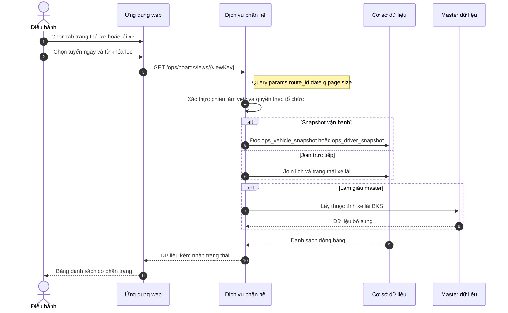

#### Bảng luồng bước

| # | Actor | Hành động | Đầu vào | Đầu ra |
|---|-----|-----|-----|-----|
| 1 | Điều hành | Mở màn Bảng tải | — | Tab mặc định |
| 2 | Điều hành | Chuyển tab trạng thái | `view_key` | Đổi context hiển thị |
| 3 | Điều hành | Đặt bộ lọc | `route_id`, `date`, `q` | Query string |
| 4 | Ứng dụng web | Gọi dịch vụ danh sách | Tham số lọc và phân trang | Yêu cầu |
| 5 | Dịch vụ phân hệ | Kiểm tra quyền và phạm vi tổ chức | Phiên làm việc, mã tổ chức | Cho phép hoặc từ chối |
| 6 | Dịch vụ phân hệ | Truy vấn dữ liệu | Bộ lọc | Tập bản ghi |
| 7 | Ứng dụng web | Hiển thị bảng | Dữ liệu trả về | Giao diện có nhãn trạng thái |

#### Bảng dữ liệu (query / hiển thị)

| Field / tham số | Kiểu | Bắt buộc | Validation / Rule | DB / nguồn |
|-----|-----|-----|-----|-----|
| `view_key` | string enum | Có | Thuộc tập cho phép theo role | — |
| `route_id` | uuid | Không | Phải thuộc org | `ops_route` |
| `date` | date | Không | Trong cửa sổ cho phép ví dụ T-30 đến T+30 | — |
| `q` | string | Không | Max length 200 trim | — |
| `page`, `page_size` | int | Có | page_size cap 100 | — |
| `vehicle_plate` | string | — | Hiển thị | snapshot / fleet |
| `driver_name` | string | — | Hiển thị | snapshot / HR |
| `operational_status` | enum | — | Map màu Badge | snapshot |
| `route_name` | string | — | Hiển thị | join `ops_route` |

#### Mã lỗi

| Mã | Điều kiện |
|-----|-----|
| `OPS_BOARD_FORBIDDEN_VIEW` | `view_key` không cho role |
| `OPS_BOARD_INVALID_DATE` | `date` ngoài range |

---

### UC-OPS-LOD-01 — Thiết lập bảng tải

**Màn hình:** SCR-OPS-002  

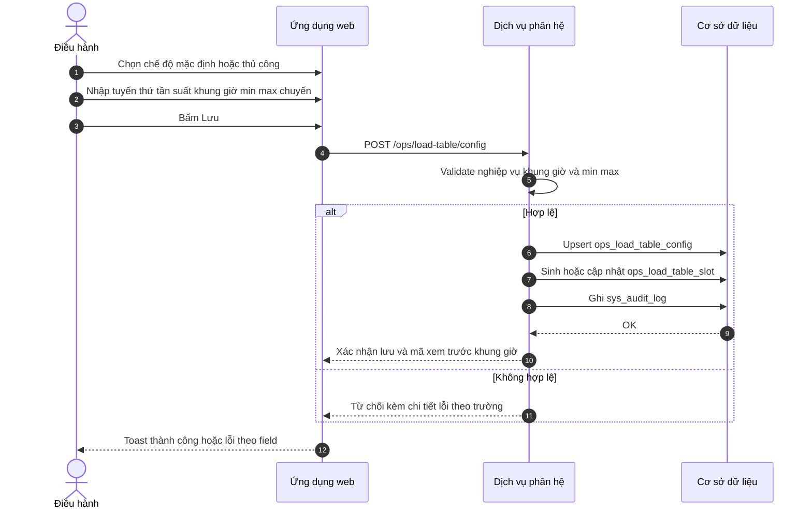

#### Bảng luồng bước

| # | Actor | Hành động | Đầu vào | Đầu ra |
|---|-----|-----|-----|-----|
| 1 | Điều hành | Mở thiết lập bảng tải | — | Form trống hoặc bản ghi hiện có |
| 2 | Điều hành | Chọn `mode` DEFAULT hoặc MANUAL | enum | Toggle UI |
| 3 | Điều hành | Điền tham số tuyến và khung giờ | Form | State client |
| 4 | Điều hành | Lưu | — | Submit |
| 5 | Dịch vụ phân hệ | Kiểm tra và giao dịch lưu | Dữ liệu gửi lên | Ghi thành công hoặc huỷ |
| 6 | Ứng dụng web | Hiển thị lưới khung giờ hoặc thông báo | Phản hồi | Cập nhật giao diện |

#### Bảng dữ liệu

| Field | Kiểu | Bắt buộc | Validation | DB |
|-----|-----|-----|-----|-----|
| `org_id` | uuid | Có | Từ token | mọi bảng |
| `route_id` | uuid | Có | Thuộc org | `ops_load_table_config.route_id` |
| `dow` | int 0-6 hoặc bitset | Có | Theo rule sản phẩm | `dow` |
| `mode` | enum | Có | DEFAULT, MANUAL | `mode` |
| `frequency_minutes` | int | Theo mode | > 0 nếu dùng | `frequency_minutes` |
| `trip_min` | int | Có | >= 0 | `trip_min` |
| `trip_max` | int | Có | >= trip_min | `trip_max` |
| `time_start` | time | Có | < time_end cùng ngày quy ước | `time_start` |
| `time_end` | time | Có | > time_start | `time_end` |
| `effective_from` | date | Không | Không trùng xung đột policy | `effective_from` |
| `slot_id` | uuid | — | Output sinh slot | `ops_load_table_slot.id` |
| `slot_start` | timestamptz | — | Nằm trong khung | `ops_load_table_slot.slot_start` |

#### Mã lỗi

| Mã | Điều kiện |
|-----|-----|
| `LOAD_TABLE_INVALID_WINDOW` | time_start hoặc time_end không hợp lệ |
| `LOAD_TABLE_TRIP_RANGE` | trip_min > trip_max |
| `LOAD_TABLE_ROUTE_NOT_FOUND` | route_id không thuộc org |

---

### UC-OPS-CNV-01 — Lịch sử thiết lập băng tải thủ công

**Màn hình:** SCR-OPS-003  

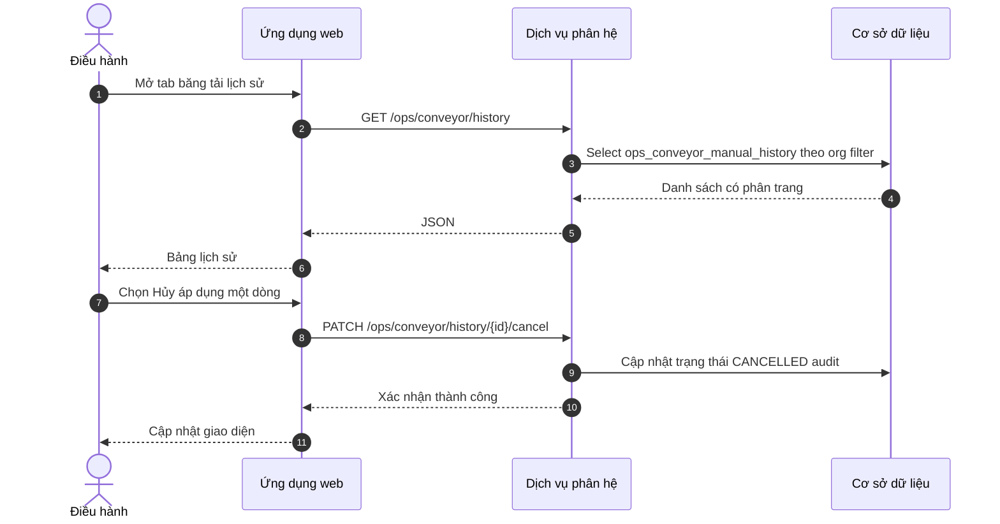

#### Bảng luồng bước

| # | Actor | Hành động | Đầu vào | Đầu ra |
|---|-----|-----|-----|-----|
| 1 | Điều hành | Xem danh sách lịch sử | Filter ngày trạng thái | Bảng |
| 2 | Điều hành | Hủy áp dụng bản ghi | `history_id` | Xác nhận dialog |
| 3 | Dịch vụ phân hệ | Kiểm tra trạng thái cho phép hủy | — | Từ chối nếu đã khóa |

#### Bảng dữ liệu

| Field | Kiểu | Bắt buộc | Validation | DB |
|-----|-----|-----|-----|-----|
| `id` | uuid | Có khi PATCH | Tồn tại | `ops_conveyor_manual_history.id` |
| `applied_at` | timestamptz | — | Hiển thị | `applied_at` |
| `applied_by` | uuid | — | Hiển thị | `applied_by` |
| `config_snapshot` | jsonb | — | Chi tiết mở rộng | `config_snapshot` |
| `status` | enum | Có | ACTIVE, CANCELLED, EXPIRED | `status` |
| `cancel_reason` | string | Khi hủy | Max 500 | `cancel_reason` |

#### Mã lỗi

| Mã | Điều kiện |
|-----|-----|
| `CNV_HISTORY_NOT_CANCELLABLE` | Trạng thái không cho hủy |

---

### UC-OPS-RTE-01 — Thiết lập tuyến và điểm dừng động

**Màn hình:** SCR-OPS-010  

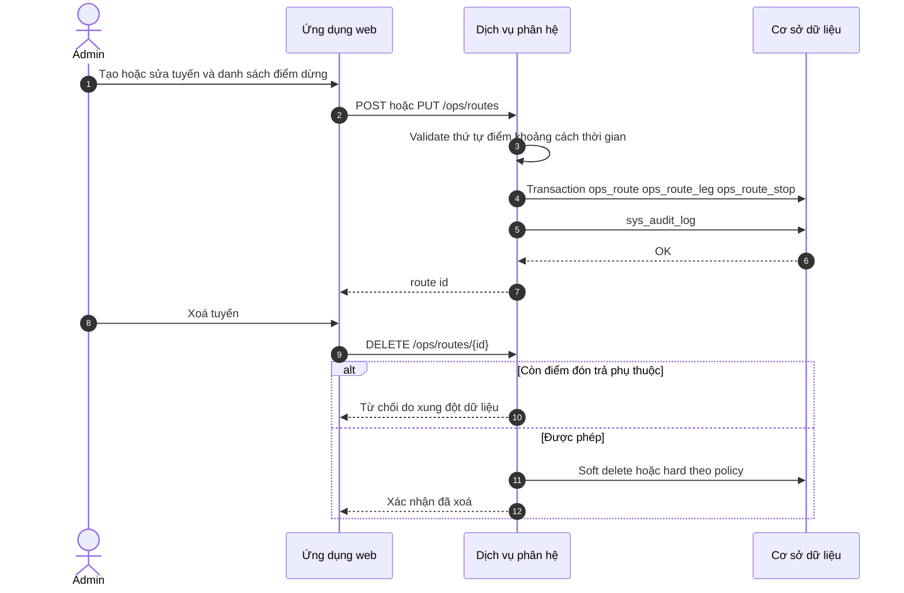

#### Bảng luồng bước

| # | Actor | Hành động | Đầu vào | Đầu ra |
|---|-----|-----|-----|-----|
| 1 | Admin | Liệt kê tuyến | Filter | Danh sách |
| 2 | Admin | Mở form chi tiết | `route_id` hoặc tạo mới | Form |
| 3 | Admin | Thêm sửa xóa dòng điểm dừng | seq address geo | Grid động |
| 4 | Admin | Lưu | — | Validation client server |
| 5 | Admin | Xoá tuyến | Confirm | Cascade hoặc chặn |

#### Bảng dữ liệu

| Field | Kiểu | Bắt buộc | Validation | DB |
|-----|-----|-----|-----|-----|
| `code` | string | Có | unique per org format | `ops_route.code` |
| `name` | string | Có | max 255 | `ops_route.name` |
| `status` | enum | Có | ACTIVE, INACTIVE | `ops_route.status` |
| `leg_name` | string | Không | — | `ops_route_leg.name` |
| `stop_seq` | int | Có | >=1 tăng dần không trùng | `ops_route_stop.seq_no` |
| `stop_name` | string | Có | — | `ops_route_stop.name` |
| `lat`, `lng` | decimal | Không | Hợp lệ tọa độ | `ops_route_stop` |
| `dwell_minutes` | int | Không | >=0 | `ops_route_stop.dwell_minutes` |
| `distance_km_next` | numeric | Không | >=0 | `ops_route_stop.distance_km_next` |

#### Mã lỗi

| Mã | Điều kiện |
|-----|-----|
| `ROUTE_CODE_DUPLICATE` | Trùng code trong org |
| `ROUTE_STOP_INVALID_SEQ` | Thứ tự điểm không hợp lệ |
| `ROUTE_DELETE_BLOCKED` | Còn `ops_pickup_point` hoặc lệnh tham chiếu |

---

### UC-OPS-STP-011 — Thiết lập điểm đón trả (biểu mẫu)

**Màn hình:** SCR-OPS-011  

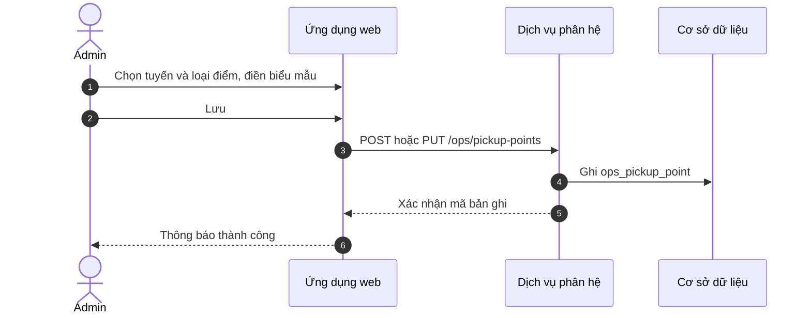

#### Bảng luồng bước

| # | Actor | Hành động | Đầu vào | Đầu ra |
|---|-----|-----|-----|-----|
| 1 | Admin | Chọn tuyến liên kết | `route_id` | Khung biểu mẫu |
| 2 | Admin | Chọn loại điểm (VP/CN hoặc khác) | `point_type` | Hiện trường phù hợp |
| 3 | Admin | Nhập địa chỉ, liên hệ, ghi chú | Form | Dữ liệu nháp |
| 4 | Admin | Gửi lưu | — | Bản ghi tạo mới hoặc cập nhật |

#### Bảng dữ liệu (thực thể `ops_pickup_point`)

| Field | Kiểu | Bắt buộc | Validation | DB |
|-----|-----|-----|-----|-----|
| `route_id` | uuid | Có | FK `ops_route` | `ops_pickup_point.route_id` |
| `point_type` | enum | Có | VP_CN, FIXED, AIRPORT, OTHER | `point_type` |
| `pickup_mode` | enum | Có | AT_OFFICE, DOOR, AT_POINT | `pickup_mode` |
| `name` | string | Có | max 255 | `name` |
| `province_code` | string | Theo loại | Master địa bàn | `province_code` |
| `district_code` | string | Không | — | `district_code` |
| `address_line` | string | Có | max 500 | `address_line` |
| `contact_name` | string | Không | — | `contact_name` |
| `contact_phone` | string | Không | Định dạng số điện thoại | `contact_phone` |
| `note` | string | Không | max 2000 | `note` |
| `is_active` | bool | Có | Mặc định true | `is_active` |

#### Mã lỗi

| Mã | Điều kiện |
|-----|-----|
| `PICKUP_ROUTE_MISMATCH` | `route_id` không tồn tại hoặc không thuộc phạm vi |

---

### UC-OPS-STP-012 — Danh sách điểm đón trả

**Màn hình:** SCR-OPS-012  

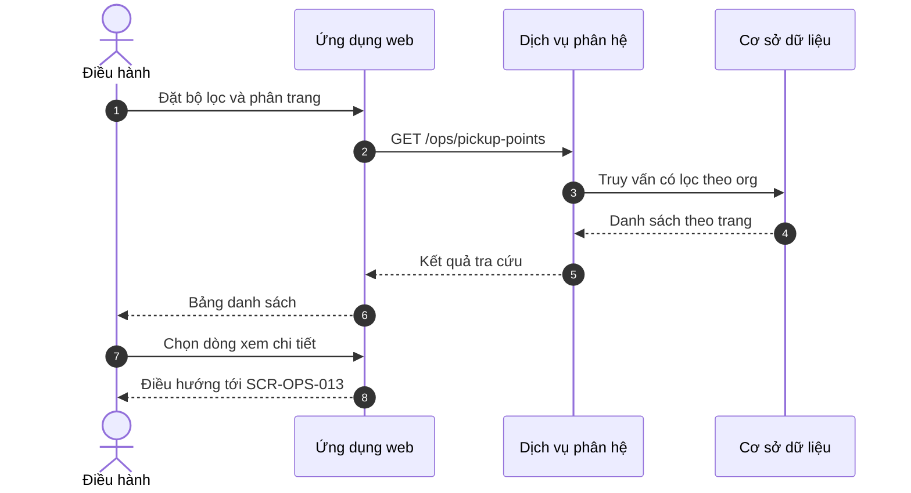

#### Bảng luồng bước

| # | Actor | Hành động | Đầu vào | Đầu ra |
|---|-----|-----|-----|-----|
| 1 | Điều hành | Mở màn danh sách | — | Bảng trống hoặc có dữ liệu |
| 2 | Điều hành | Lọc theo tuyến, loại điểm, từ khóa | Tham số lọc | Danh sách thu hẹp |
| 3 | Điều hành | Chuyển trang | `page`, `page_size` | Trang kế |
| 4 | Điều hành | Mở chi tiết một điểm | `id` | Chuyển sang UC-OPS-STP-013 |

#### Bảng dữ liệu (tra cứu)

| Field / tham số | Kiểu | Bắt buộc | Validation | Ghi chú |
|-----|-----|-----|-----|-----|
| `route_id` | uuid | Không | Thuộc org | Lọc |
| `point_type` | enum | Không | — | Lọc |
| `q` | string | Không | Độ dài tối đa | Tìm theo tên / địa chỉ |
| `page`, `page_size` | int | Có | Giới hạn `page_size` | Phân trang |

---

### UC-OPS-STP-013 — Chi tiết điểm đón trả

**Màn hình:** SCR-OPS-013  

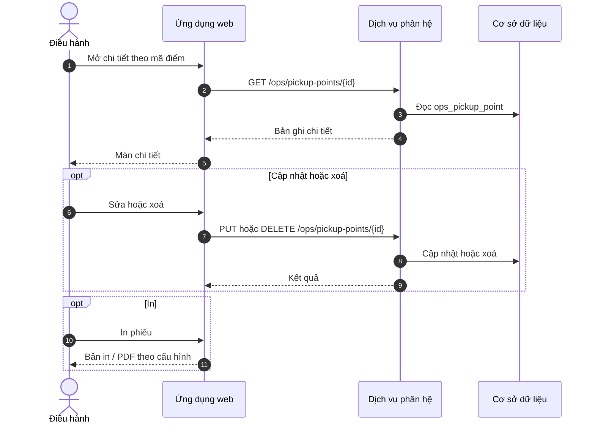

#### Bảng luồng bước

| # | Actor | Hành động | Đầu vào | Đầu ra |
|---|-----|-----|-----|-----|
| 1 | Điều hành | Xem thông tin đầy đủ | `id` | Hiển thị chỉ đọc hoặc sửa |
| 2 | Điều hành | Cập nhật (nếu được phép) | Form | Đồng bộ với UC-OPS-STP-011 |
| 3 | Điều hành | Xoá (nếu được phép) | Xác nhận | Xoá mềm hoặc cứng theo policy |
| 4 | Điều hành | In | — | Bản in |

#### Bảng dữ liệu

Cấu trúc bản ghi **cùng thực thể** `ops_pickup_point` như **UC-OPS-STP-011**; thêm:

| Field | Kiểu | Bắt buộc | Validation | DB |
|-----|-----|-----|-----|-----|
| `id` | uuid | Có khi GET/PUT/DELETE | Tồn tại, thuộc org | `ops_pickup_point.id` |

#### Mã lỗi

| Mã | Điều kiện |
|-----|-----|
| `PICKUP_NOT_FOUND` | Không tìm thấy bản ghi |
| `PICKUP_DELETE_IN_USE` | Điểm đang được lệnh tour hoặc lịch tham chiếu |

---

### UC-OPS-ACC-01 — Tài khoản nhân viên vận hành

**Màn hình:** SCR-OPS-020  

```mermaid
sequenceDiagram
  autonumber
  actor U as Admin
  participant Web as Ứng dụng web
  participant IAM as Hệ thống định danh
  participant S as Dịch vụ phân hệ
  participant DB as Cơ sở dữ liệu

  U->>Web: Điền họ tên email sđt vai trò
  Web->>IAM: Tạo hoặc mời người dùng
  IAM-->>Web: Mã người dùng và trạng thái
  Web->>S: PUT /ops/staff-links/{userId}
  S->>DB: Lưu mapping ops_staff_profile
  S->>DB: Ghi nhật ký; không lưu mật khẩu dạng rõ
  opt Hiển thị credential
    U->>Web: Bấm xem mật khẩu tạm
    Web->>IAM: Yêu cầu hiển thị thông tin xác thực (theo quyền quản trị)
    IAM-->>Web: Một lần hiển thị
  end
```

#### Bảng luồng bước

| # | Actor | Hành động | Đầu vào | Đầu ra |
|---|-----|-----|-----|-----|
| 1 | Admin | Tạo mới nhân viên | Biểu mẫu | Gửi yêu cầu tới hệ thống định danh |
| 2 | Hệ thống định danh | Tạo tài khoản | Email không trùng | Mã người dùng |
| 3 | Dịch vụ phân hệ | Gắn hồ sơ vận hành | Mã NV, chức danh | Bản ghi liên kết |
| 4 | Admin | Xem danh sách | Filter | Bảng |
| 5 | Admin | Cập nhật thông tin | Mã người dùng | Đồng bộ định danh hoặc chỉ hồ sơ vận hành |

#### Bảng dữ liệu

| Field | Kiểu | Bắt buộc | Validation | DB / hệ thống |
|-----|-----|-----|-----|-----|
| `external_user_id` | uuid | Có | Từ IAM | IAM |
| `staff_code` | string | Không | unique org | `ops_staff_profile.staff_code` |
| `full_name` | string | Có | — | IAM hoặc mirror |
| `email` | string | Có | RFC email | IAM |
| `phone` | string | Không | — | IAM / profile |
| `job_title` | string | Không | — | `ops_staff_profile` |
| `ops_role_hint` | string | Không | Gợi ý RBAC | UI only |
| `password` | — | — | Không lưu plain trong ops | IAM |

#### Mã lỗi

| Mã | Điều kiện |
|-----|-----|
| `IAM_EMAIL_DUPLICATE` | Email đã tồn tại |
| `OPS_STAFF_REVEAL_FORBIDDEN` | Thiếu permission |

---

### UC-OPS-RBAC-01 — Phân quyền phần mềm (module vận hành)

**Màn hình:** SCR-OPS-021  

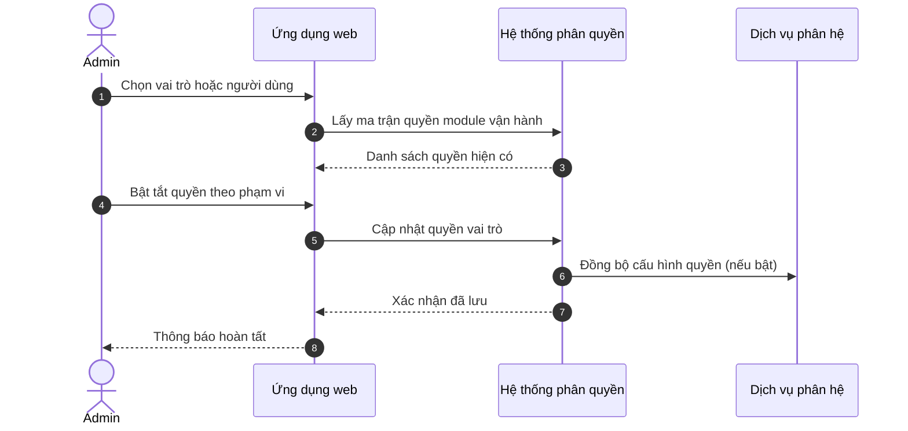

#### Bảng luồng bước

| # | Actor | Hành động | Đầu vào | Đầu ra |
|---|-----|-----|-----|-----|
| 1 | Admin | Chọn đối tượng gán | role_id hoặc user_id | Ma trận |
| 2 | Admin | Gán permission | Danh sách key | Payload |
| 3 | Hệ thống phân quyền | Kiểm tra không tự tước quyền quản trị cuối cùng | Quy tắc | Từ chối nếu vi phạm |

#### Bảng dữ liệu

| Field | Kiểu | Bắt buộc | Validation | DB |
|-----|-----|-----|-----|-----|
| `role_id` | uuid | Theo mode | FK | RBAC store |
| `permission_key` | string | Có | Prefix ops. | binding |
| `scope_type` | enum | Có | ORG, ROUTE, ALL | scope |
| `scope_id` | uuid | Theo scope | Thuộc org | scope |

#### Mã lỗi

| Mã | Điều kiện |
|-----|-----|
| `RBAC_LAST_ADMIN` | Không cho xóa quyền admin cuối |

---

### UC-OPS-AUD-01 — Nhật ký thiết lập

**Màn hình:** SCR-OPS-022  

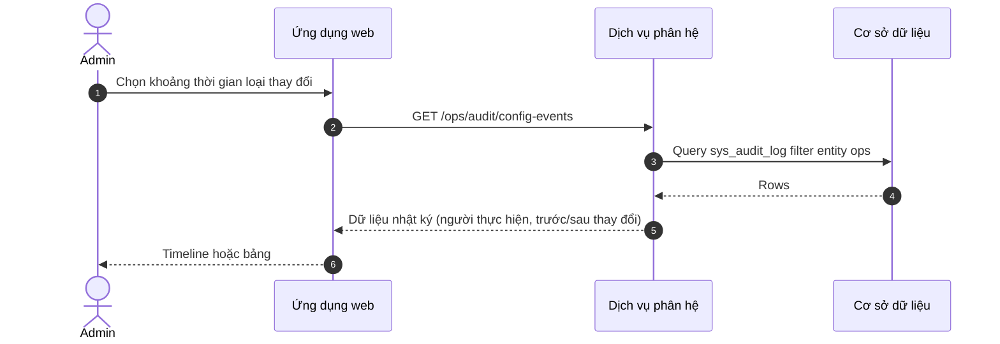

#### Bảng luồng bước

| # | Actor | Hành động | Đầu vào | Đầu ra |
|---|-----|-----|-----|-----|
| 1 | Admin / Audit | Lọc theo ngày entity action | Query | Danh sách |
| 2 | Người dùng | Xem chi tiết diff | `audit_id` | Modal json diff |

#### Bảng dữ liệu (tra cứu)

| Field | Kiểu | Bắt buộc | Validation | DB |
|-----|-----|-----|-----|-----|
| `from_at`, `to_at` | timestamptz | Có | from <= to max range 90d | query |
| `entity_type` | string | Không | ops_route, ops_pickup_point, ... | `sys_audit_log.entity_type` |
| `actor_id` | uuid | Không | — | `actor_id` |
| `action` | string | Không | CREATE UPDATE DELETE | `action` |
| `payload_before` | jsonb | — | Read only | `payload_before` |
| `payload_after` | jsonb | — | Read only | `payload_after` |

---

### UC-OPS-DSP-01 — Lệnh xe tăng cường

**Màn hình:** SCR-OPS-030  

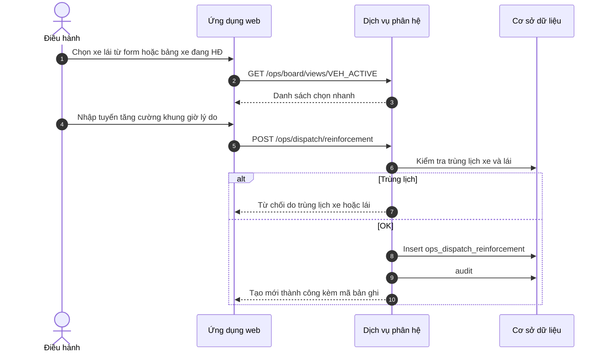

#### Bảng luồng bước

| # | Actor | Hành động | Đầu vào | Đầu ra |
|---|-----|-----|-----|-----|
| 1 | Điều hành | Chọn nguồn xe lái | BKS hoặc chọn dòng | Form điền sẵn |
| 2 | Điều hành | Xác nhận lệnh | Payload | Lệnh tạo |
| 3 | Dịch vụ phân hệ | Kiểm tra xung đột lịch | — | Cho phép hoặc từ chối |

#### Bảng dữ liệu

| Field | Kiểu | Bắt buộc | Validation | DB |
|-----|-----|-----|-----|-----|
| `vehicle_id` | uuid | Có | Xe active org | `ops_dispatch_reinforcement.vehicle_id` |
| `driver_id` | uuid | Có | Lái active | `driver_id` |
| `target_route_id` | uuid | Có | FK route | `target_route_id` |
| `from_at` | timestamptz | Có | < to_at | `from_at` |
| `to_at` | timestamptz | Có | > from_at | `to_at` |
| `reason` | string | Có | max 500 không rỗng | `reason` |
| `status` | enum | Có | PLANNED ACTIVE CANCELLED | `status` |

#### Mã lỗi

| Mã | Điều kiện |
|-----|-----|
| `DISPATCH_SCHEDULE_CONFLICT` | Trùng lịch xe hoặc lái |
| `DISPATCH_VEHICLE_INACTIVE` | Xe không đủ điều kiện |

---

### UC-OPS-DSP-02 — Lệnh xe đi tour

**Màn hình:** SCR-OPS-031  

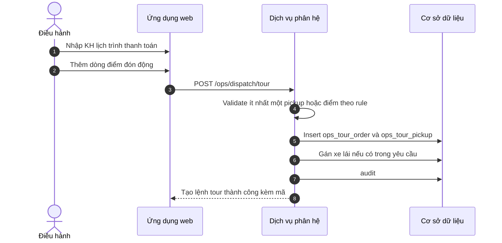

#### Bảng luồng bước

| # | Actor | Hành động | Đầu vào | Đầu ra |
|---|-----|-----|-----|-----|
| 1 | Điều hành | Nhập thông tin khách hàng tour | — | — |
| 2 | Điều hành | Nhập lịch trình và hình thức thanh toán | — | — |
| 3 | Điều hành | Thêm sửa danh sách điểm đón động | Mảng địa chỉ giờ | — |
| 4 | Điều hành | Chọn xe đề xuất từ danh sách đang HĐ | optional | — |
| 5 | Dịch vụ phân hệ | Lưu giao dịch | — | Mã lệnh tour |

#### Bảng dữ liệu

| Field | Kiểu | Bắt buộc | Validation | DB |
|-----|-----|-----|-----|-----|
| `customer_name` | string | Có | max 255 | `ops_tour_order.customer_name` |
| `customer_phone` | string | Có | — | `customer_phone` |
| `itinerary_note` | string | Không | max 4000 | `itinerary_note` |
| `payment_method` | enum | Có | CASH, TRANSFER, CONTRACT, ... | `payment_method` |
| `payment_status` | enum | Có | UNPAID PARTIAL PAID | `payment_status` |
| `scheduled_start` | timestamptz | Có | — | `scheduled_start` |
| `scheduled_end` | timestamptz | Không | >= start nếu có | `scheduled_end` |
| `vehicle_id` | uuid | Không | — | `vehicle_id` |
| `driver_id` | uuid | Không | — | `driver_id` |
| `pickups[].address` | string | Có mỗi dòng | — | `ops_tour_pickup.address_line` |
| `pickups[].planned_at` | timestamptz | Không | — | `ops_tour_pickup.planned_at` |
| `pickups[].seq` | int | Có | Tăng dần | `seq_no` |

#### Mã lỗi

| Mã | Điều kiện |
|-----|-----|
| `TOUR_ORDER_INVALID` | Thiếu KH hoặc khung giờ bắt buộc |
| `TOUR_PICKUP_INVALID` | Danh sách điểm đón rỗng khi policy yêu cầu |

---

### UC-OPS-ATT-040 — Tổng hợp lịch lái xe theo tuyến / ngày

**Màn hình:** SCR-OPS-040  

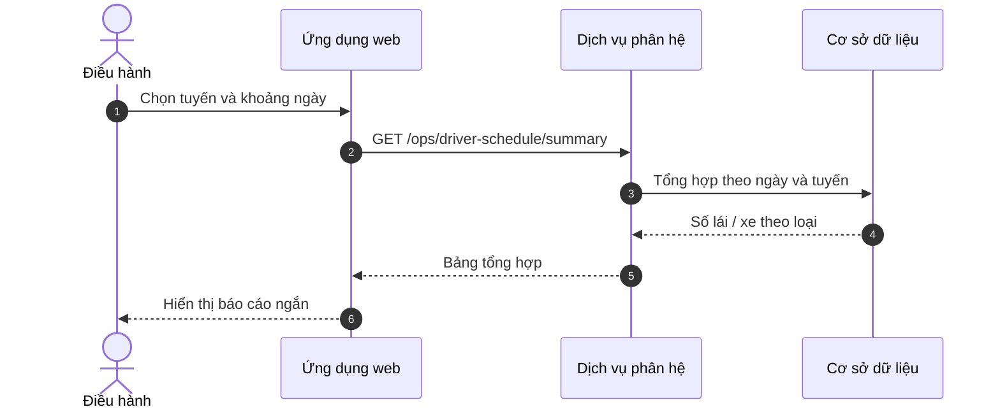

#### Bảng luồng bước

| # | Actor | Hành động | Đầu vào | Đầu ra |
|---|-----|-----|-----|-----|
| 1 | Điều hành | Mở màn tổng hợp | — | Khung lọc |
| 2 | Điều hành | Chọn tuyến, từ ngày đến ngày | `route_id`, khoảng thời gian | Truy vấn |
| 3 | Điều hành | Đọc bảng tổng theo ngày | — | Số liệu lái / xe |

#### Bảng dữ liệu (tham số & cột hiển thị)

| Field / cột | Kiểu | Bắt buộc | Validation | Nguồn |
|-----|-----|-----|-----|-----|
| `route_id` | uuid | Không | Thuộc org | Lọc |
| `from_date`, `to_date` | date | Có | `from_date` ≤ `to_date` | Lọc |
| `work_date` | date | — | — | Cột bảng |
| `driver_count_by_type` | số | — | — | Tổng hợp |
| `vehicle_count_by_type` | số | — | — | Tổng hợp |

---

### UC-OPS-ATT-041 — Bảng công lái xe theo tháng

**Màn hình:** SCR-OPS-041  

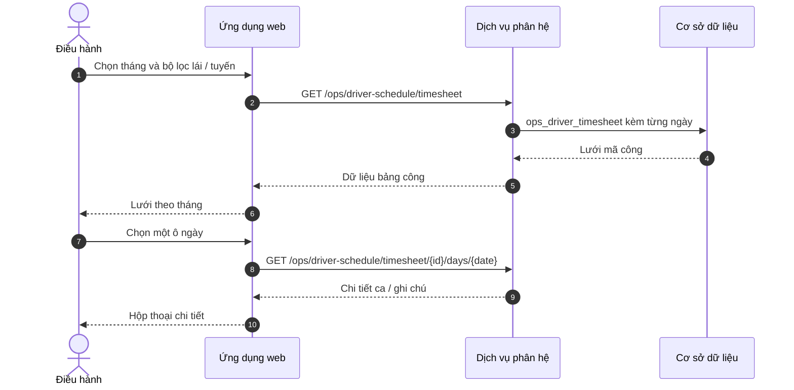

#### Bảng luồng bước

| # | Actor | Hành động | Đầu vào | Đầu ra |
|---|-----|-----|-----|-----|
| 1 | Điều hành | Chọn tháng (`year_month`) | — | Khung lưới |
| 2 | Điều hành | Lọc theo lái xe hoặc tuyến | `driver_id`, `route_id` | Thu hẹp dòng |
| 3 | Điều hành | Mở chi tiết một ngày | `timesheet_id`, `date` | Hộp thoại chấm công |

#### Bảng dữ liệu

| Field | Kiểu | Bắt buộc | Validation | DB |
|-----|-----|-----|-----|-----|
| `driver_id` | uuid | Có | — | `ops_driver_timesheet.driver_id` |
| `year_month` | string | Có | Định dạng yyyy-MM | Kỳ bảng công |
| `route_id` | uuid | Không | — | Lọc / hiển thị |
| `attendance_code` | enum | Có mỗi ô ngày | Từ từ điển (X, NN, XN, LP, …) | `ops_driver_timesheet_day.code` |
| `shift_count` | numeric | Không | — | Chi tiết ngày |
| `note` | string | Không | — | `ops_driver_timesheet_day.note` |

#### Mã lỗi

| Mã | Điều kiện |
|-----|-----|
| `ATT_TIMESHEET_NOT_FOUND` | Không có bảng công cho kỳ / lái được chọn |

---

### UC-OPS-MNT-050 — Lịch BDSC và danh sách phiếu chờ

**Màn hình:** SCR-OPS-050  

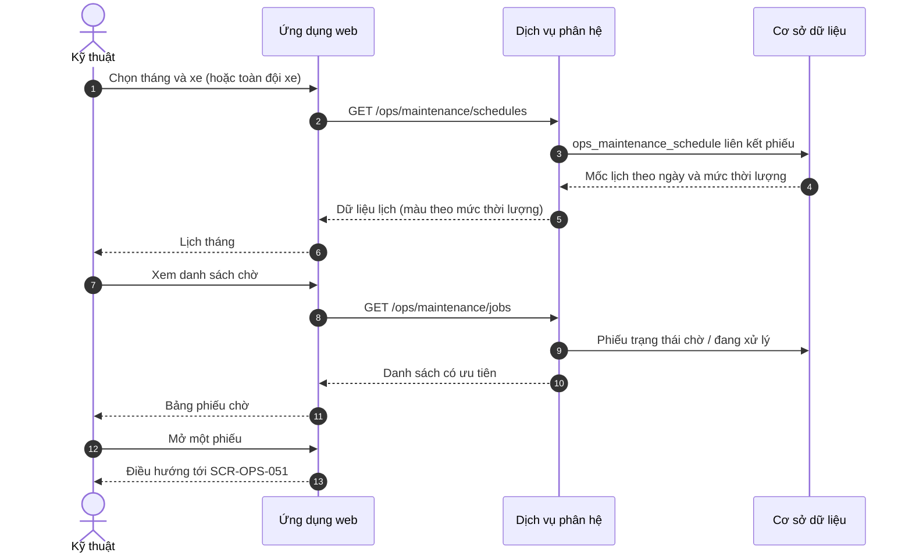

#### Bảng luồng bước

| # | Actor | Hành động | Đầu vào | Đầu ra |
|---|-----|-----|-----|-----|
| 1 | Kỹ thuật | Xem lịch BDSC theo tháng | `month`, `vehicle_id` | Lịch có chú thích màu |
| 2 | Kỹ thuật | Theo dõi danh sách chờ | Sắp xếp theo ưu tiên | Bảng phiếu |
| 3 | Kỹ thuật | Chọn phiếu để xử lý chi tiết | `job_id` | Chuyển sang UC-OPS-MNT-051 |

#### Bảng dữ liệu (lịch & hàng chờ)

| Field | Kiểu | Bắt buộc | Validation | DB |
|-----|-----|-----|-----|-----|
| `vehicle_id` | uuid | Lọc lịch | Thuộc org | `ops_maintenance_schedule.vehicle_id` |
| `service_date` | date | Có | — | `service_date` |
| `duration_band` | enum | Có | FULL_DAY, H6_12, LT6 | `duration_band` |
| `job_id` | uuid | Có trên hàng chờ | — | `ops_maintenance_job.id` |
| `priority` | enum | Có | LOW, NORMAL, HIGH | `priority` |
| `status` | enum | Có | PENDING, IN_PROGRESS, … | `status` |

---

### UC-OPS-MNT-051 — Chi tiết phiếu BDSC

**Màn hình:** SCR-OPS-051  

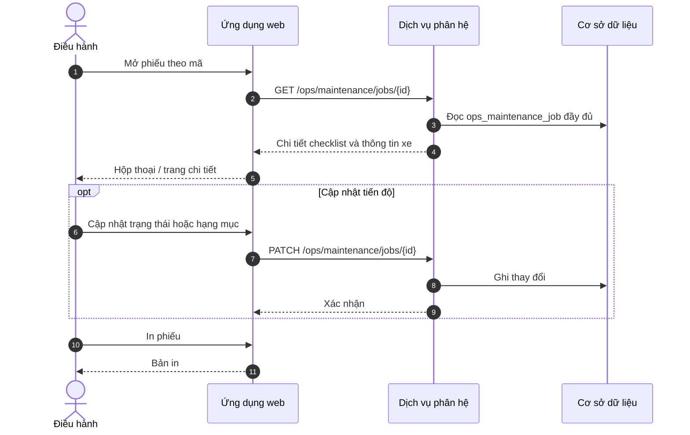

#### Bảng luồng bước

| # | Actor | Hành động | Đầu vào | Đầu ra |
|---|-----|-----|-----|-----|
| 1 | Điều hành / Kỹ thuật | Xem đầy đủ phiếu | `job_id` | Hiển thị chi tiết |
| 2 | Điều hành | Cập nhật km, cơ sở, hạng mục, việc làm | Form | Lưu phiếu |
| 3 | Điều hành | In phiếu bàn giao | — | Bản in |

#### Bảng dữ liệu (phiếu BDSC)

| Field | Kiểu | Bắt buộc | Validation | DB |
|-----|-----|-----|-----|-----|
| `job_id` | uuid | Có | Tồn tại | `ops_maintenance_job.id` |
| `vehicle_id` | uuid | Có | — | Liên kết xe |
| `priority` | enum | Có | LOW, NORMAL, HIGH | `priority` |
| `odometer_km` | int | Không | ≥ 0 | `odometer_km` |
| `workshop_name` | string | Không | — | `workshop_name` |
| `work_items` | jsonb | Không | Checklist | `work_items` |
| `status` | enum | Có | PENDING, IN_PROGRESS, DONE | `status` |

---

### UC-OPS-CLN-01 — Vệ sinh nội thất chuyên sâu (VSNT)

**Màn hình:** SCR-OPS-052  

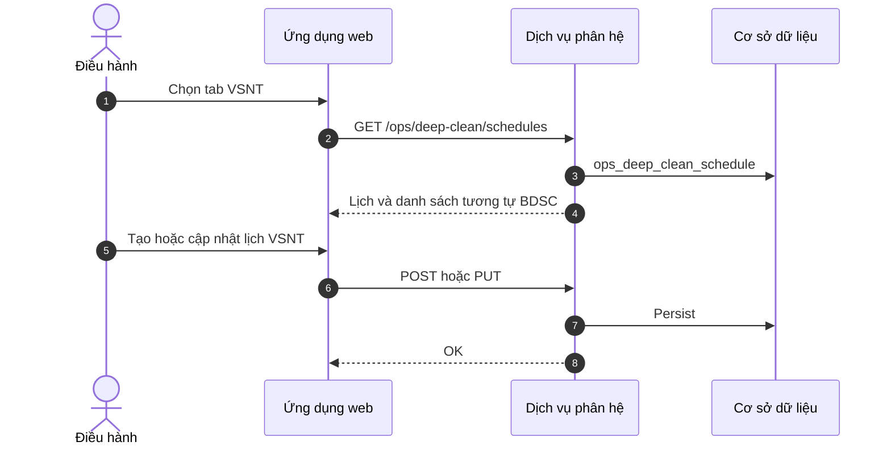

#### Bảng luồng bước

| # | Actor | Hành động | Đầu vào | Đầu ra |
|---|-----|-----|-----|-----|
| 1 | Điều hành | Thao tác trên lịch và danh sách VSNT | — | Bố cục tương tự màn BDSC |
| 2 | Dịch vụ phân hệ | Lưu theo bảng riêng (`ops_deep_clean_schedule`) | — | Phục vụ báo cáo tách biệt BDSC |

#### Bảng dữ liệu

| Field | Kiểu | Bắt buộc | Validation | DB |
|-----|-----|-----|-----|-----|
| `vehicle_id` | uuid | Có | — | `ops_deep_clean_schedule.vehicle_id` |
| `planned_date` | date | Có | — | `planned_date` |
| `duration_band` | enum | Có | Giống BDSC | `duration_band` |
| `status` | enum | Có | — | `status` |
| `note` | string | Không | — | `note` |

---

### UC-OPS-FUL-01 — Thiết lập giá nhiên liệu

**Màn hình:** SCR-OPS-060  

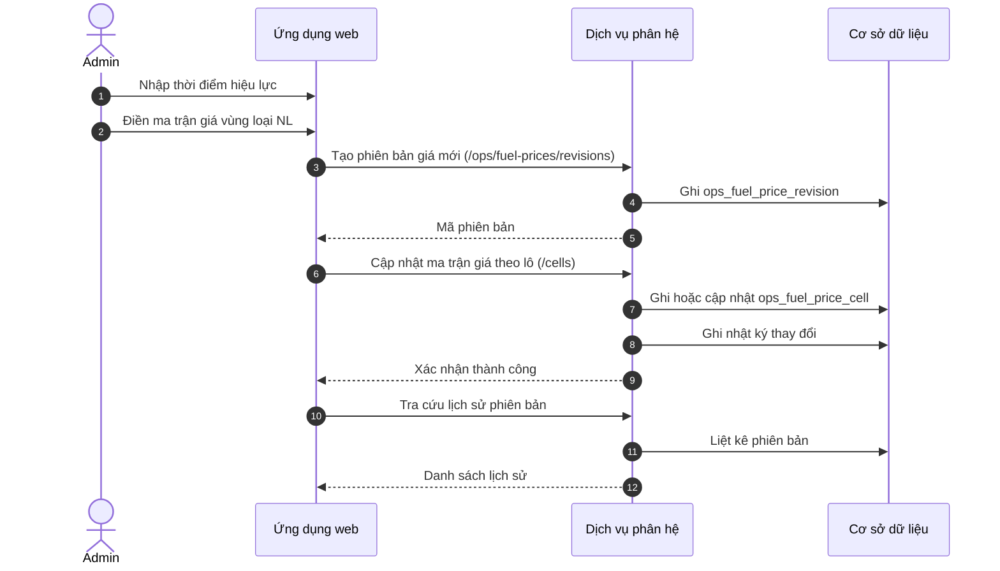

#### Bảng luồng bước

| # | Actor | Hành động | Đầu vào | Đầu ra |
|---|-----|-----|-----|-----|
| 1 | Admin | Tạo phiên bản giá mới | effective_at | revision |
| 2 | Admin | Nhập từng ô giá | region fuel_type price | Cells |
| 3 | Admin | Xem sửa phiên bản cũ theo policy | revision_id | Chi tiết read only hoặc edit nếu cho phép |

#### Bảng dữ liệu

| Field | Kiểu | Bắt buộc | Validation | DB |
|-----|-----|-----|-----|-----|
| `effective_at` | timestamptz | Có | Không chồng policy org | `ops_fuel_price_revision.effective_at` |
| `note` | string | Không | max 500 | `note` |
| `region_id` | uuid | Có mỗi cell | Master vùng | `ops_fuel_price_cell.region_id` |
| `fuel_type` | enum | Có | DIESEL E5 RON95 ... | `fuel_type` |
| `price` | numeric(18,3) | Có | > 0 | `price` |
| `currency` | string | Có | default VND | `currency` |

#### Mã lỗi

| Mã | Điều kiện |
|-----|-----|
| `FUEL_REVISION_OVERLAP` | Trùng hiệu lực theo rule |
| `FUEL_PRICE_INVALID` | price <= 0 |

---

## 8. Data Dictionary (bổ sung trọng yếu)

| Field | Kiểu | Bắt buộc | Ghi chú |
|---|---|---|---|
| `effective_at` | timestamptz | Yes | Giá NL / một số cấu hình versioned |
| `duration_band` | enum | Yes | BD: FULL_DAY, H6_12, LT6 |
| `attendance_code` | enum | Yes | X, NN, XN, LP, HĐ, CT, ĐC, … |
| `point_type` | enum | Yes | VP_CN, FIXED, AIRPORT, … |
| `pickup_mode` | enum | Yes | AT_OFFICE, DOOR, AT_POINT |

---

## 9. Ma trận quyền (rút gọn)

| Khu vực | OPS_DISPATCHER | OPS_ADMIN | OPS_VIEWER |
|---|---|---|---|
| Bảng tải | R | R | R |
| Thiết lập bảng tải / băng tải | R/W | R/W | R |
| Thiết lập tuyến / điểm | R/W | R/W | R |
| Lệnh điều xe | R/W | R/W | R |
| Lịch lái / công | R/W | R/W | R |
| BDSC / VSNT | R/W | R/W | R |
| Giá NL | R | R/W | R |
| Tài khoản / phân quyền | — | R/W | — |

---

## 10. API Contract Summary (baseline)

| API | Mục đích |
|---|---|
| `GET /ops/board/views/{viewKey}` | Dữ liệu bảng tải |
| `GET/POST /ops/load-table/config` | Cấu hình bảng tải |
| `GET/POST /ops/conveyor/history` | Lịch sử băng tải |
| `CRUD /ops/routes`, `/ops/routes/{id}/stops` | Tuyến & điểm dừng |
| `CRUD /ops/pickup-points` | Điểm đón trả |
| `POST /ops/dispatch/reinforcement` | Xe tăng cường |
| `POST /ops/dispatch/tour` | Xe đi tour |
| `GET /ops/driver-schedule/summary` | Tổng hợp |
| `GET /ops/driver-schedule/timesheet` | Bảng công |
| `CRUD /ops/maintenance/*` | BDSC |
| `CRUD /ops/deep-clean/*` | VSNT |
| `GET/POST /ops/fuel-prices` | Giá NL + lịch sử |

---

## 11. Tiêu chí chấp nhận (UAT) baseline

- Đủ 12 nhóm route IA; **18 use case** (§5) đều có đặc tả §7, khớp 1:1 với **18 màn hình** (§3); người dùng có quyền chỉ thấy menu tương ứng.
- Mọi thao tác ghi cấu hình / lệnh / giá đều có audit.
- Validation hiển thị lỗi theo field; không mất dữ liệu khi chuyển tab trong cùng màn có unsaved guard (nếu áp dụng).
- Bảng lớn: phân trang và lọc đáp ứng thời gian phản hồi theo thỏa thuận hiệu năng dự án.

---

## 12. Truy vết

| Nguồn | SRS mục |
|---|---|
| Yêu cầu nghiệp vụ baseline | §1.1, §3, §5, §7 |
| BRD phân hệ Vận hành | §1.2, §6, Phụ lục |
| Quy chế giao diện XeVN OS | §1.3, §2 |

---

## Phụ lục A — Phạm vi mở rộng theo BRD tổng thể

Các luồng **đơn hàng hóa — kho — ứng dụng lái xe (POD) — vendor — SLA — chốt ca** trong BRD phân hệ Vận hành là **định hướng dài hạn**; chi tiết màn hình và tích hợp được chốt ở các đợt triển khai sau, khi phạm vi đặt chỗ / kho được tách bạch hoặc khi thống nhất mô hình dữ liệu đơn hàng.
