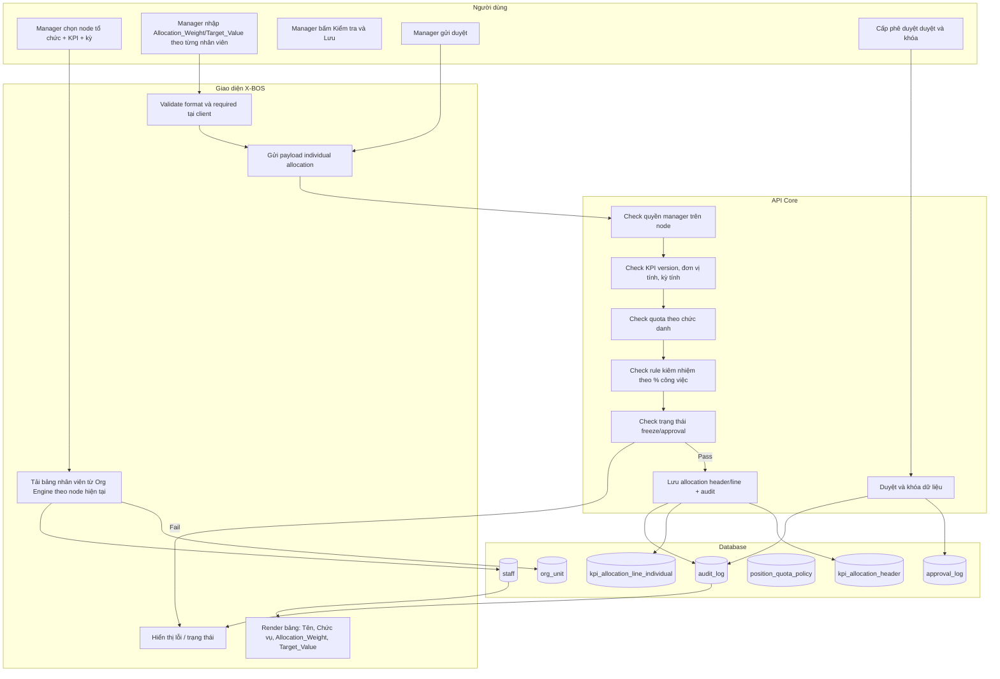

# SRS — KPI Waterfall Engine Đa tầng tới Cá nhân (Individual KPI)

## 1. Purpose

Chức năng mở rộng **KPI Waterfall Engine** cho phép luồng thác nước đi xuyên suốt từ cấp tổ chức cao nhất đến cấp đáy là **nhân sự cụ thể**:

- Tập đoàn -> Công ty con -> Khối -> Phòng/Ban -> Tổ/Đội -> Cá nhân.
- KPI của cấp tổ chức được kế thừa thành KPI đóng góp ở cấp dưới.
- Tầng cuối không còn “đơn vị con” mà là danh sách **nhân viên** thuộc node tổ chức hiện tại.

Mục tiêu nghiệp vụ:
- Bảo toàn ngữ nghĩa KPI theo toàn cây (cùng đơn vị tính, cùng kỳ tính, cùng version KPI).
- Đảm bảo mỗi cá nhân có mục tiêu rõ ràng, truy vết được nguồn giao từ cấp nào.
- Hỗ trợ vận hành linh hoạt theo nguyên tắc **Dynamic by Default**, không giới hạn số tầng (**N-level**) và có thể cấu hình quy tắc cho từng tầng.

Lưu ý quan trọng cho tầng đáy (Individual):
- `Parent_Value` được hiểu là **mục tiêu tổ chức** (ví dụ phòng KD 10 tỷ), không bắt buộc tổng target cá nhân phải bằng đúng giá trị này.
- `SUM(Allocation_Weight_Cá_nhân)` có thể > 100% để tạo động lực vượt mục tiêu.
- Kiểm soát chính ở tầng cá nhân là **quota theo chức danh** và tính hợp lệ đơn vị/kỳ.

---

## 2. Use Cases

### 2.1 Tác nhân
- **Người giao KPI**: Quản lý trực tiếp tại node tổ chức (Manager).
- **Người nhận KPI**: Nhân viên thuộc node tổ chức hiện tại.
- **Cấp phê duyệt**: Vai trò có quyền duyệt và khóa dữ liệu.

### 2.2 Use case tổng quan
| ID | Use Case | Tác nhân chính | Mục tiêu |
|---|---|---|---|
| UC-IKPI-01 | Mở màn hình phân bổ cá nhân | Manager | Xem danh sách nhân sự thuộc node tổ chức hiện tại |
| UC-IKPI-02 | Giao KPI cá nhân | Manager | Nhập `Allocation_Weight/Impact_Weight`, `Target_Value` cho từng nhân viên |
| UC-IKPI-03 | Điều chỉnh KPI cá nhân giữa kỳ | Manager | Chỉnh chỉ tiêu cá nhân có kiểm soát và có log |
| UC-IKPI-04 | Nhân viên xác nhận KPI | Nhân viên | Xác nhận đã nhận KPI và cam kết thực hiện |
| UC-IKPI-05 | Duyệt và khóa phân bổ cá nhân | Cấp phê duyệt | Chốt dữ liệu đánh giá |

### 2.3 Hành động chính của Manager (Individual KPI)
1. Chọn KPI cha, kỳ tính, node tổ chức.
2. Hệ thống tự động nạp danh sách nhân sự từ Org Engine theo node hiện tại.
3. Nhập tỷ trọng đóng góp (`Allocation_Weight` hoặc `Impact_Weight`) và/hoặc `Target_Value` theo từng nhân viên.
4. Bấm kiểm tra để hệ thống chạy validation tầng cá nhân (đơn vị tính, kỳ tính, quota chức danh, trạng thái khóa).
5. Lưu bản nháp, gửi duyệt, hoặc khóa khi đủ điều kiện.

---

## 3. Activity Diagram (Mermaid)

---

## 4. Business Logic

### 4.1 Quy tắc thác nước đa tầng (Group -> Individual)
1. Mỗi line phân bổ phải có `source_parent_line_id` để truy ngược nguồn giao.
2. Cùng một KPI có thể đi qua nhiều tầng, nhưng vẫn giữ thống nhất:
   - `kpiCode`
   - `periodCode` / `periodType`
   - `unit`
3. Tầng cuối (individual) là tầng thực thi; không phân bổ tiếp.

### 4.2 Quy tắc kế thừa version theo kỳ
- Hỗ trợ `Q1`, `Q2`, `YEAR`.
- Bản cá nhân kế thừa version từ bản tổ chức đang active.
- Khi chuyển quý hoặc tạo revision:
  - Cho phép copy cấu trúc nhân sự kỳ trước.
  - Giá trị KPI cá nhân phải re-validate theo quota kỳ mới.

### 4.3 Logic điều chỉnh KPI giữa kỳ (Individual)
Điều chỉnh hợp lệ khi:
- Bản chưa `Frozen`.
- Manager có quyền trên node tổ chức chứa nhân viên đó.
- Thỏa quota theo chức danh sau điều chỉnh.
- Có `adjustment_reason` bắt buộc.

Tác động:
- Ghi audit before/after từng nhân viên.
- Nếu đã `Pending_Approval` thì chuyển về `Draft` hoặc yêu cầu duyệt lại theo policy.

### 4.4 Cơ chế khóa số liệu sau Approved
- Trạng thái chuẩn: `Draft -> Pending_Approval -> Approved -> Frozen`.
- Khi `Frozen`:
  - Không cho add/edit/delete line cá nhân.
  - Chỉ vai trò có quyền mở khóa mới thao tác `Unfreeze`.
  - Bắt buộc ghi lý do mở khóa và log phê duyệt.

### 4.5 Rule nhân viên kiêm nhiệm (Individual Matrix Org)
- Một nhân viên có thể có nhiều dòng KPI theo các chức danh/phạm vi công việc khác nhau.
- Mỗi dòng gắn `job_role_code` và `workload_percent`.
- Tổng `% workload` trên các vai trò active của cùng kỳ phải = 100% (theo policy mặc định).
- `Target_Value` theo từng dòng được phân rã theo `% workload` hoặc do manager nhập trực tiếp (tùy mode cấu hình).

---

## 5. Data Interaction & Validation Table

### 5.1 Bảng luồng thao tác chi tiết (tầng đáy Individual)
| Step | Actor | Input chính | Xử lý hệ thống | Output |
|---|---|---|---|---|
| 1 | Manager | Chọn node tổ chức hiện tại | Kiểm tra quyền + lấy node context | Context hợp lệ |
| 2 | FE X-BOS | `orgUnitId` | Query Org Engine lấy danh sách nhân sự thuộc node | Danh sách nhân viên |
| 3 | Manager | Nhập `Allocation_Weight/Impact_Weight`, `Target_Value` | Validate format số, required | Payload tạm hợp lệ |
| 4 | API Core | Payload line cá nhân | Check KPI unit + kỳ tính phải khớp KPI cha | Pass/Fail |
| 5 | API Core | Payload line cá nhân + policy quota | Check quota theo chức danh | Pass/Fail |
| 6 | API Core | Payload nhân viên kiêm nhiệm | Check `% workload` theo vai trò | Pass/Fail |
| 7 | API Core | Lưu allocation | Ghi header/line + audit | Bản ghi `Draft` |
| 8 | Manager/Cấp duyệt | Gửi duyệt / duyệt / khóa | Check trạng thái + khóa dữ liệu | `Pending/Approved/Frozen` |

### 5.2 Đặc tả trường dữ liệu trọng yếu (Individual)
| Field | Mô tả | Kiểu dữ liệu | Bắt buộc | Validation |
|---|---|---|---|---|
| `Parent_KPI_Value` | Mục tiêu của tổ chức tại node hiện tại | decimal(18,4) | Có | `> 0`; dùng làm tham chiếu, không bắt buộc bằng tổng cá nhân |
| `Allocation_Weight` / `Impact_Weight` | Tỷ trọng đóng góp của cá nhân | decimal(9,4) | Có (nếu mode weight) | `> 0`; tổng weight có thể > 100% theo policy |
| `Target_Value` | Chỉ tiêu KPI giao cho cá nhân | decimal(18,4) | Có | `> 0`; không bắt buộc tổng bằng parent |
| `Effective_Date` | Ngày hiệu lực phân bổ cá nhân | date | Có | Nằm trong hiệu lực KPI cha và kỳ tính |
| `kpiUnit` | Đơn vị KPI cá nhân | string | Có | Phải trùng `unit` của KPI cha |
| `periodCode` | Kỳ áp dụng KPI cá nhân | string | Có | Phải trùng kỳ của KPI cha |
| `job_role_code` | Chức danh áp KPI (trường hợp kiêm nhiệm) | string | Có khi kiêm nhiệm | Phải thuộc danh mục chức danh hợp lệ |
| `workload_percent` | % công việc theo chức danh | decimal(5,2) | Có khi kiêm nhiệm | `> 0`; tổng workload theo nhân viên = 100% (default policy) |

### 5.3 Validation Rules (tầng Individual — khác tầng tập thể)
1. **Không ép tổng cá nhân bằng mục tiêu tổ chức**
   - `SUM(Target_Value_Cá_nhân)` có thể `<`, `=`, hoặc `>` `Parent_KPI_Value` theo chính sách động lực.

2. **Check đơn vị tính và kỳ tính kế thừa**
   - KPI cá nhân bắt buộc cùng `unit` và `periodCode/periodType` với KPI cha.

3. **Check quota theo chức danh**
   - Tổng `Target_Value` giao cho các nhân viên cùng chức danh trong node không vượt `quota_ceiling` của chức danh.
   - Quota cấu hình động theo `position_quota_policy`.

4. **Check trọng số đóng góp**
   - Mỗi dòng `Allocation_Weight > 0`.
   - `SUM(Allocation_Weight)` có thể > 100% nếu policy cho phép chế độ stretch target.

5. **Check kiêm nhiệm**
   - Với nhân viên kiêm nhiệm, tổng `workload_percent` trên các dòng active = 100% (mặc định).
   - Nếu lệch, bắt buộc manager điều chỉnh trước khi gửi duyệt.

6. **Check trạng thái**
   - Không cho chỉnh sửa khi `Frozen`.
   - Không cho `Approved` nếu còn lỗi quota/unit/period/workload.

### 5.4 Error Messages (kỹ thuật chặt chẽ)
| Error Code | Điều kiện phát sinh | Thông báo lỗi |
|---|---|---|
| `IKPI-AUTH-001` | Manager không có quyền trên node | Không đủ quyền phân bổ KPI tại đơn vị tổ chức hiện tại. |
| `IKPI-DATA-001` | Không tải được danh sách nhân sự theo node | Không thể đồng bộ danh sách nhân sự từ Org Engine. Vui lòng kiểm tra cấu hình tổ chức. |
| `IKPI-VAL-001` | `Target_Value <= 0` | Target_Value của KPI cá nhân phải lớn hơn 0. |
| `IKPI-VAL-002` | `Allocation_Weight <= 0` | Allocation_Weight phải là số dương hợp lệ. |
| `IKPI-VAL-003` | `kpiUnit` không khớp KPI cha | Đơn vị KPI cá nhân không khớp với KPI cha. Không thể lưu phân bổ. |
| `IKPI-VAL-004` | `periodCode` hoặc `periodType` không khớp KPI cha | Kỳ tính KPI cá nhân không đồng bộ với KPI cha. |
| `IKPI-VAL-005` | `Effective_Date` ngoài hiệu lực KPI cha | Effective_Date nằm ngoài khoảng hiệu lực của KPI cha. |
| `IKPI-QUOTA-001` | Vượt trần quota chức danh | Tổng Target_Value theo chức danh đã vượt mức trần quota cho phép. |
| `IKPI-MATRIX-001` | Nhân sự kiêm nhiệm có tổng workload khác 100% | Tổng % công việc theo chức danh của nhân sự kiêm nhiệm phải bằng 100%. |
| `IKPI-STATE-001` | Cố chỉnh sửa bản đã frozen | Bản phân bổ đã khóa, không thể chỉnh sửa. Vui lòng thực hiện quy trình mở khóa. |
| `IKPI-STATE-002` | Gửi duyệt khi còn lỗi validation | Không thể gửi duyệt vì dữ liệu phân bổ cá nhân chưa đạt điều kiện nghiệp vụ. |

---

## 6. Phi chức năng
- **Dynamic by Default:** hỗ trợ N-level không giới hạn, tầng cuối là cá nhân.
- **Auditability:** truy vết đầy đủ từ KPI cá nhân ngược lên tất cả tầng cha.
- **Performance:** tải nhanh danh sách nhân sự theo node lớn và validate quota theo batch.
- **Consistency:** transaction-safe khi lưu đồng thời nhiều dòng cá nhân.
- **Security:** phân quyền theo vai trò + phạm vi tổ chức + quyền duyệt.

---

## 7. Kết luận
Phiên bản SRS này mở rộng KPI Waterfall Engine từ phân bổ cấp tổ chức sang phân bổ đến **Individual KPI**, bảo đảm xuyên suốt từ chiến lược đến thực thi cá nhân. Hệ thống vẫn giữ nguyên nguyên tắc động, linh hoạt theo chính sách từng doanh nghiệp, đồng thời tăng độ chặt về kiểm soát quota, kiêm nhiệm và khóa số liệu đánh giá.

