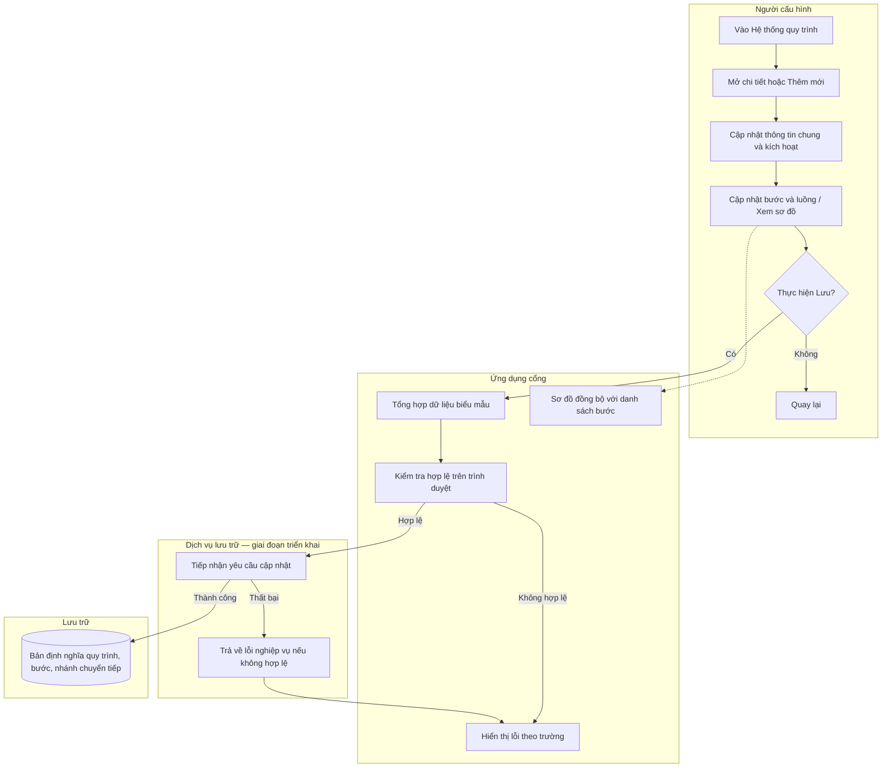
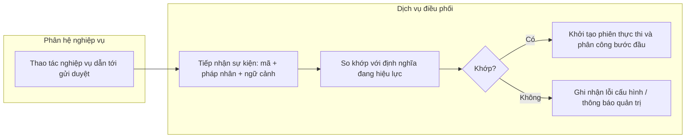

# SRS — Trung tâm điều hành: Định nghĩa và cấu hình quy trình

| Mục | Nội dung |
|-----|-----------|
| Sản phẩm | Cổng X-BOS — mục Cài đặt hệ thống |
| Phần chức năng | Hệ thống quy trình |
| Phiên bản tài liệu | 1.4 |
| Ngày cập nhật | 2026-03-29 |
| Ghi chú | Bản nháp — đối chiếu màn hình cấu hình quy trình hiện có trên cổng |

---

## 1. Mục đích

Chức năng cho phép các vai trò được ủy quyền **định nghĩa quy trình nghiệp vụ nhiều bước**: mỗi bước gắn **vai trò xử lý**, **thời hạn xử lý**, và **các nhánh chuyển tiếp** tương ứng **Đồng ý**, **Chuyển cấp BOD xử lý**, cùng **Từ chối** khi vai trò có thẩm quyền (vai trò không có thẩm quyền từ chối thì nhánh này không được cấu hình và không hiển thị trên sơ đồ).

Giao diện **sơ đồ luồng** phục vụ **đối soát trực quan** giữa các nhánh, giảm sai lệch so với cấu hình dạng bảng.

**Giá trị nghiệp vụ:** Thống nhất mô hình phê duyệt (tuyển dụng, đầu tư, hợp đồng, mua hàng…) trên phạm vi tập đoàn; hạn chế phụ thuộc vào **quy ước ngoài hệ thống**; tạo nền để **khởi tạo phiên thực thi quy trình**, **phân công theo vai trò** và **giám sát thời hạn** theo bản định nghĩa đã lưu.

---

## 2. Đối tượng áp dụng

Mục này xác định **ai thuộc phạm vi chức năng**, **thẩm quyền tương đối** và **hành vi chính** — không mô tả chi tiết ma trận phân quyền (xem tài liệu quản trị quyền của tổ chức).

### 2.1 Phân loại đối tượng và trách nhiệm

| Đối tượng | Phạm vi tham gia và hành vi chính |
|-----------|-------------------------------------|
| **Quản trị viên cấu hình / Chủ sở hữu quy trình** | Truy cập Cài đặt → Hệ thống quy trình; tra cứu danh sách; tạo mới hoặc mở chi tiết; chỉnh sửa thông tin chung, khối kích hoạt, từng bước và nhánh chuyển tiếp; xem sơ đồ; thực hiện **Lưu** hoặc **Quay lại**. |
| **Người phê duyệt / Người thực hiện bước** | Không sử dụng màn hình định nghĩa quy trình. Sau khi quy trình được áp dụng trong vận hành, họ nhận công việc theo **bước** và **vai trò** đã cấu hình. |
| **Tầng vận hành** — giai đoạn triển khai đầy đủ | Đọc bản định nghĩa đã lưu; khi **sự kiện kích hoạt** xảy ra thì **khởi tạo phiên thực thi**; duy trì trạng thái bước hiện tại; khi ghi nhận kết quả Đồng ý / Từ chối / Chuyển BOD thì **chuyển trạng thái** theo đúng nhánh; áp dụng **thời hạn** đã khai báo. |

### 2.2 Kịch bản sử dụng (tóm tắt)

1. Xem danh sách định nghĩa quy trình (mã, tên, phạm vi áp dụng; trạng thái hiệu lực — nếu đã triển khai).
2. Mở chi tiết: xem thông tin chung, khối kích hoạt, danh sách bước và sơ đồ.
3. Cập nhật **thông tin chung**: mã, tên, đơn vị áp dụng.
4. Cập nhật **khối kích hoạt**: sự kiện kích hoạt, thời hạn toàn quy trình; đọc **số bước** (giá trị đếm từ cấu hình bước).
5. Trên tab **Cấu hình bước và luồng**: thêm, xóa hoặc sắp xếp bước; chỉnh từng trường; xác định **đích chuyển tiếp** cho từng nhánh Đồng ý, Từ chối, BOD.
6. Trên tab **Sơ đồ luồng**: xem biểu diễn đồ họa; có thể chọn bước để xem chi tiết bổ sung (nếu được triển khai).
7. **Lưu quy trình** — gửi bản định nghĩa đã hợp lệ tới tầng lưu trữ (kèm nhật ký thao tác theo chính sách tổ chức).
8. **Quay lại** — rời màn chi tiết; nếu tồn tại thay đổi chưa lưu thì áp dụng cơ chế xác nhận thoát (theo thiết kế sản phẩm).

---

## 3. Sơ đồ hoạt động (cấu hình và lưu)

---

## 4. Quy tắc nghiệp vụ

### 4.1 Luồng chính

1. Mỗi **định nghĩa quy trình** có **mã định danh** (ổn định, phục vụ tham chiếu hệ thống), **tên hiển thị**, và **phạm vi áp dụng** — toàn tập đoàn hoặc một pháp nhân.
2. **Sự kiện kích hoạt** xác định **điều kiện nghiệp vụ** để **khởi tạo một phiên thực thi** của quy trình đó (ví dụ: hồ sơ tuyển dụng chuyển trạng thái “đã gửi duyệt”). Chi tiết **nguồn danh mục sự kiện**, **dữ liệu lưu** và **cơ chế khớp khi vận hành** nằm ở **mục 4.4**.
3. **Thời hạn hoàn thành toàn quy trình (giờ)** là giới hạn thời gian **cho trọn phiên thực thi**; **thời hạn từng bước (giờ)** áp dụng **riêng từng bước** trong phiên đó.
4. Mỗi **bước** gồm: thứ tự, mô tả đầu việc, vai trò xử lý, loại hành động (phê duyệt / ký / nhập liệu), thời hạn bước, và **phân hệ nghiệp vụ** liên quan.
5. Mỗi bước có **ba nhánh chuyển tiếp** trong mô hình dữ liệu (Đồng ý, Từ chối, Chuyển BOD). **Đồng ý** và **Chuyển BOD** luôn do người cấu hình chọn đích hợp lệ (**bước khác** hoặc **điểm đặc thù**: Bắt đầu, Kết thúc thành công, Kết thúc từ chối, BOD). **Từ chối** chỉ được **cấu hình đích tùy chọn** khi **vai trò xử lý** thuộc nhóm có thẩm quyền phê duyệt/từ chối (theo danh mục vai trò trên cổng). Với vai trò **không có thẩm quyền từ chối** (ví dụ nhân viên / người đệ trình), giao diện **không cho chọn đích Từ chối**; nhánh Từ chối được giữ **nội bộ** (đích cố định, không hiển thị trên sơ đồ) để đồng bộ engine — **khi vận hành** người thực hiện bước đó **không có hành động Từ chối**.
6. Dữ liệu hiển thị ở tab **Sơ đồ luồng** và tab **Cấu hình bước** phải **thống nhất một nguồn**; sơ đồ không thay thế bảng chi tiết mà hỗ trợ **đối soát và đào tạo**.

### 4.2 Ngoại lệ và xử lý lỗi cấu hình

- Thiếu đích hoặc đích không hợp lệ trên một trong ba nhánh: **không cho phép lưu**; thông báo theo trường.
- **Chu trình** (các bước trỏ qua lại tạo vòng): giao diện hiện cho phép nối linh hoạt; cần bổ sung **quy tắc kiểm tra** hoặc cảnh báo theo chính sách tổ chức — ghi nhận là rủi ro vận hành.
- Xóa bước đang được bước khác tham chiếu: áp dụng **cập nhật liên kết tự động** hoặc **từ chối lưu** — chi tiết triển khai thuộc tài liệu kỹ thuật.

### 4.3 Khuyến nghị cấu hình (không ràng buộc giai đoạn đầu)

- Mã quy trình **duy nhất** trong cùng phạm vi áp dụng.
- Trước khi đưa vào vận hành thực tế nên có **ít nhất một bước** (trừ trường hợp cho phép bản nháp).
- Khuyến nghị: nhánh Đồng ý cuối cùng dẫn tới **kết thúc thành công**; nhánh Từ chối dẫn tới **kết thúc từ chối** hoặc bước chỉnh sửa — có thể cấu hình mềm trên giao diện ban đầu.

### 4.4 Danh mục sự kiện kích hoạt: cấu hình trên cổng và khớp với vận hành

Nội dung trả lời: **Danh mục chọn trên giao diện lấy từ đâu**; **trường nào được lưu**; **làm thế nào tầng vận hành khớp đúng định nghĩa quy trình** khi phân hệ phát sinh sự kiện.

#### 4.4.1 Hiện trạng trên cổng web

- Danh sách **Sự kiện kích hoạt** hiện **được định nghĩa tĩnh trong mã nguồn** cổng (cặp **mã định danh** + **nhãn hiển thị**).
- Người cấu hình **chọn một mục** trong danh sách thả xuống; **không nhập tự do** tên sự kiện — nhằm đảm bảo **tập mã thống nhất** giữa cổng và các phân hệ tích hợp.
- Khi **Lưu quy trình**, hệ thống lưu **mã sự kiện** (không lưu nhãn hiển thị), cùng các trường khác của định nghĩa quy trình, tới **tầng lưu trữ** (hoặc tạm thời chỉ trên trình duyệt nếu chưa triển khai lưu qua máy chủ).

**Bảng đối chiếu nhãn — mã (chuẩn hiện dùng trên cổng):**

| Nhãn hiển thị | Mã sự kiện (lưu trong định nghĩa quy trình) |
|---------------|-----------------------------------------------|
| Hồ sơ tuyển dụng được gửi duyệt | `hr.recruitment.request_submitted` |
| Đề xuất đầu tư / CAPEX khởi tạo | `finance.capex.workflow_started` |
| Yêu cầu ký hợp đồng | `contract.sign_requested` |
| Phê duyệt đơn đặt hàng | `procurement.po_approval` |

*Mở rộng danh mục: bổ sung mục mới vào cùng chuẩn mã; về lâu dài nên chuyển danh mục lên **dịch vụ cấu hình phía máy chủ** để tránh phát hành lại cổng khi thêm sự kiện.*

#### 4.4.2 Hướng triển khai: danh mục tập trung và trạng thái định nghĩa

- Danh mục sự kiện có thể quản lý tại **bảng master** trên máy chủ (mã, nhãn, mô tả, phân hệ sở hữu); cổng **đồng bộ danh sách** để hiển thị.
- Định nghĩa quy trình có thể có trạng thái **nháp / hiệu lực / ngừng**. Chỉ bản **hiệu lực** (và phiên bản áp dụng) tham gia **khớp khi khởi tạo phiên thực thi**.

#### 4.4.3 Luồng khớp định nghĩa khi có sự kiện thật (mục tiêu kiến trúc)

1. **Phân hệ nghiệp vụ** khi thực hiện thao tác dẫn tới mở phê duyệt (ví dụ: gửi hồ sơ đi duyệt) **phát sự kiện** tới **dịch vụ điều phối quy trình** (hoặc kênh tích hợp nội bộ). **Nội dung sự kiện** bắt buộc có **mã sự kiện** trùng chuẩn danh mục, kèm **ngữ cảnh**: pháp nhân, tham chiếu hồ sơ, người khởi tạo, v.v.

2. **Dịch vụ điều phối** tra cứu định nghĩa quy trình theo các **điều kiện khớp**, ví dụ: mã sự kiện trùng trường kích hoạt đã lưu; phạm vi áp dụng khớp pháp nhân hoặc toàn tập đoàn; định nghĩa đang hiệu lực; áp dụng **quy tắc ưu tiên** khi tồn tại nhiều bản (ví dụ ưu tiên quy trình pháp nhân so với quy trình tập đoàn — do tổ chức quy định).

3. **Khớp thành công:** khởi tạo **phiên thực thi**, liên kết hồ sơ nguồn, đặt bước đầu, áp dụng thời hạn toàn quy trình và từng bước, tạo **công việc** cho vai trò của bước đầu.

4. **Không khớp:** không khởi tạo phiên rỗng; ghi **nhật ký lỗi cấu hình** và/hoặc thông báo tới **đầu mối quản trị** theo chính sách.

5. Khi người xử lý bước ghi nhận **Đồng ý / Từ chối / Chuyển BOD**, tầng vận hành **áp dụng đúng ba nhánh** đã cấu hình — **không** để phân hệ nguồn tự suy luận lại đường đi.

#### 4.4.4 Ràng buộc đồng bộ mã giữa các thành phần

- Mã sự kiện do phân hệ phát **phải khớp ký tự** với mã đã chọn trong định nghĩa quy trình (hoặc thuộc danh mục đã đăng ký). Đây là **điểm tích hợp** giữa cấu hình và vận hành.
- Đổi **nhãn hiển thị** mà **giữ mã** không ảnh hưởng phiên đang chạy; **đổi mã** bắt buộc **đồng bộ** phân hệ phát sự kiện và các định nghĩa đang tham chiếu, hoặc có **kỳ chuyển đổi** rõ ràng.

---

## 5. Mô tả giao diện và ý nghĩa trường dữ liệu

### 5.1 Vùng tiêu đề

- **Tiêu đề màn hình:** “Thêm quy trình” hoặc “Chi tiết quy trình”.
- **Phụ đề:** Nêu rõ mỗi bước có **ba nhánh chuyển tiếp** và sơ đồ **phản ánh cùng dữ liệu** với bảng cấu hình.

### 5.2 Thông tin chung quy trình

| Trường | Ý nghĩa | Mục đích sử dụng |
|--------|---------|-------------------|
| **Mã quy trình** | Định danh ngắn, ổn định (ví dụ WF-TD-01) | Tham chiếu hệ thống, báo cáo, thông báo |
| **Tên quy trình** | Tên hiển thị cho người dùng nghiệp vụ | Danh sách lựa chọn, hiển thị công khai |
| **Đơn vị áp dụng** | Phạm vi: toàn tập đoàn hoặc một pháp nhân | Phân tách định nghĩa theo tổ chức |

### 5.3 Khối kích hoạt

| Trường | Ý nghĩa | Mục đích sử dụng |
|--------|---------|-------------------|
| **Sự kiện kích hoạt** | Điều kiện nghiệp vụ để **khởi tạo phiên thực thi** | Định tuyến từ sự kiện thật tới đúng định nghĩa quy trình |
| **Thời hạn hoàn thành cả quy trình (giờ)** | Giới hạn thời gian cho **toàn phiên** | Giám sát vi phạm SLA cấp quy trình |
| **Số bước xử lý** | Giá trị đếm số bước đã khai báo | Đánh giá nhanh độ phức tạp cấu hình |

Chi tiết danh mục sự kiện, lưu trữ mã và cơ chế khớp: **mục 4.4**.

### 5.4 Tab cấu hình bước và luồng

| Trường | Ý nghĩa | Mục đích sử dụng |
|--------|---------|-------------------|
| **Stt** | Thứ tự bước | Hiển thị và sơ đồ hóa |
| **Tên đầu việc** | Mô tả công việc tại bước | Hướng dẫn người được phân công |
| **Vai trò** | Vai trò xử lý (trưởng phòng, giám đốc khối, BOD…) | Phân công và lọc hàng đợi công việc |
| **Hành động** | Loại thao tác: phê duyệt / ký / nhập liệu | Định hình giao diện và yêu cầu chứng từ khi vận hành |
| **Hạn xử lý bước (giờ)** | Giới hạn thời gian **theo bước** | Nhắc việc, cảnh báo quá hạn từng bước |
| **→ Đồng ý** | Đích khi kết quả Đồng ý | Định tuyến nhánh chính |
| **→ Từ chối** | Đích khi kết quả Từ chối | Định tuyến nhánh từ chối |
| **→ Chuyển cấp BOD xử lý** | Đích khi leo thang BOD | Định tuyến ngoại lệ cấp cao |
| **Dữ liệu liên quan** (layout rộng) | Phân hệ chủ của dữ liệu bước | Định hướng tích hợp và màn hình nguồn |

**Thêm nút bước:** chèn bước mới; hệ thống có thể khởi tạo sẵn ba nhánh — người cấu hình điều chỉnh đích cho đúng.

### 5.5 Tab sơ đồ luồng

- Biểu diễn điểm bắt đầu, các bước, điểm kết thúc (thành công / từ chối), nhánh BOD, liên kết có màu và **hướng tuyến** (mũi tên).
- Mục đích: **đối soát nhanh**, **đào tạo**, **kiểm tra nhất quán** với bảng.

### 5.6 Thao tác cuối trang

| Thao tác | Ý nghĩa |
|----------|---------|
| **Quay lại** | Thoát màn chi tiết. |
| **Lưu quy trình** | Ghi nhận định nghĩa đã vượt kiểm tra hợp lệ để phục vụ vận hành và báo cáo. |

---

## 6. Kiểm tra dữ liệu đầu vào và thông báo lỗi

| TT | Trường / nhóm | Ràng buộc | Nguồn nhập | Kết quả mong đợi | Lỗi thường gặp |
|----|----------------|-----------|-------------|------------------|----------------|
| 1 | Mã quy trình | Bắt buộc, duy nhất trong phạm vi | Nhập tay | Lưu thành công | Trùng mã, để trống |
| 2 | Tên quy trình | Bắt buộc | Nhập tay | Lưu thành công | Để trống |
| 3 | Đơn vị áp dụng | Chọn hoặc mặc định toàn tập đoàn | Chọn danh mục pháp nhân | Lưu thành công | Tham chiếu pháp nhân không tồn tại |
| 4 | Sự kiện kích hoạt | Chọn một mã trong danh mục | Chọn từ danh sách | Lưu thành công | Giá trị không còn hợp lệ |
| 5 | Thời hạn cả quy trình (giờ) | Số ≥ 0 | Nhập số | Lưu thành công | Âm, không phải số |
| 6 | Thứ tự bước | Số nguyên ≥ 1 | Hệ thống / người dùng | Lưu thành công | Trùng thứ tự — nên cảnh báo |
| 7 | Tên đầu việc | Bắt buộc | Nhập tay | Lưu thành công | Để trống |
| 8 | Vai trò | Thuộc danh mục vai trò | Chọn | Lưu thành công | Vai trò không tồn tại |
| 9 | Hành động bước | Một trong: phê duyệt / ký / nhập liệu | Chọn | Lưu thành công | — |
| 10 | Thời hạn bước (giờ) | Số ≥ 0 | Nhập số | Lưu thành công | Âm |
| 11 | Phân hệ liên quan | Thuộc danh mục phân hệ | Chọn | Lưu thành công | — |
| 12 | Ba nhánh chuyển tiếp | Mỗi nhánh có đích hợp lệ | Chọn đích | Lưu thành công | Thiếu đích, đích không tồn tại |
| 13 | Lưu toàn bộ | Toàn bộ dòng trên hợp lệ | Lệnh Lưu | Lưu thành công | Lỗi kiểm tra, lỗi máy chủ, xung đột phiên bản khi đồng thời sửa |

**Điểm đặc thù trên sơ đồ (định danh nội bộ):** Bắt đầu — Kết thúc thành công — Kết thúc từ chối — BOD.

---

## 7. Phân quyền, nhật ký thay đổi và giả định quy mô

- **Phân quyền:** Chỉ nhóm vai trò được ủy quyền (ví dụ quản trị hệ thống, chủ sở hữu quy trình) được **sửa** định nghĩa; quyền **xem** có thể rộng hơn — theo ma trận nội bộ.
- **Nhật ký:** Mỗi lần lưu nên ghi **tác nhân**, **thời điểm**, **phạm vi thay đổi** (mức tóm tắt) phục vụ kiểm toán.
- **Quy mô:** Giả định số bước trên một định nghĩa dưới khoảng 50; sơ đồ hiển thị trên trình duyệt để giảm tải máy chủ khi chỉ xem.

---

*Chi tiết giao tiếp với máy chủ và mô hình lưu trữ bổ sung trong tài liệu kỹ thuật khi khóa thiết kế với đội phát triển.*
