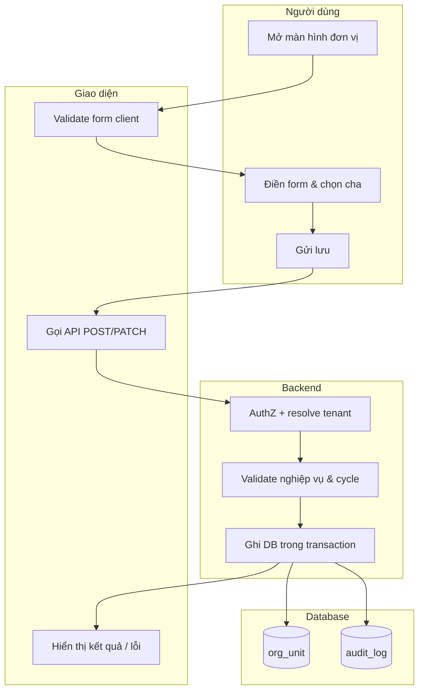
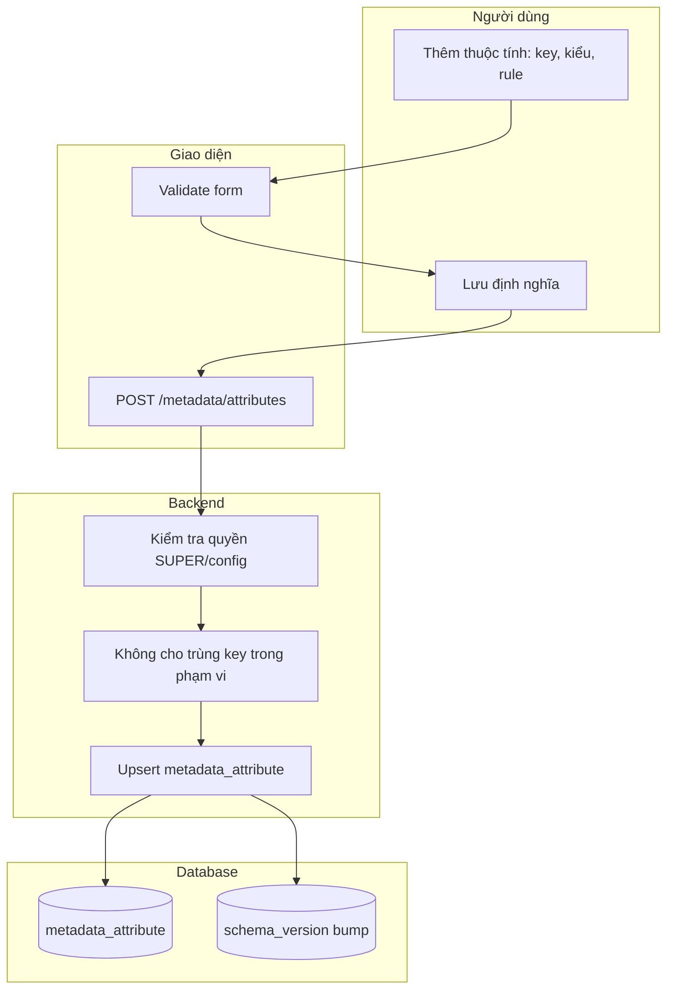
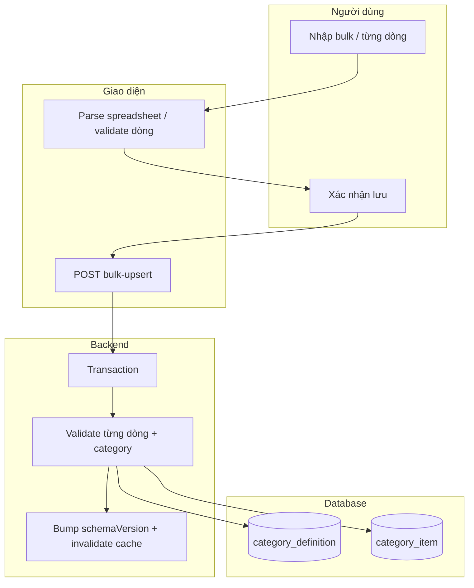
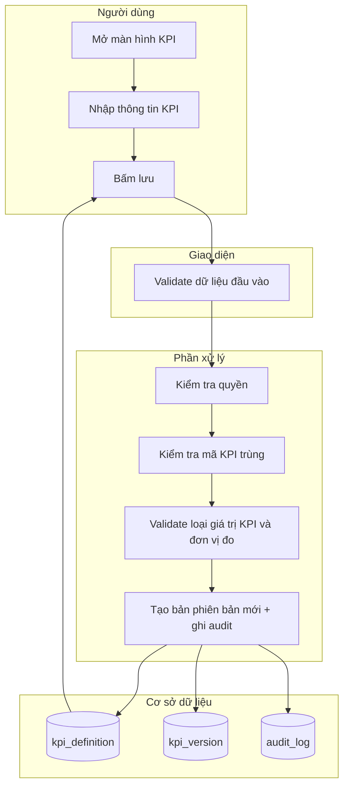
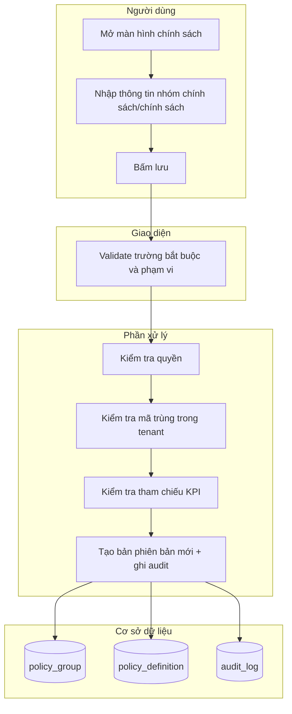
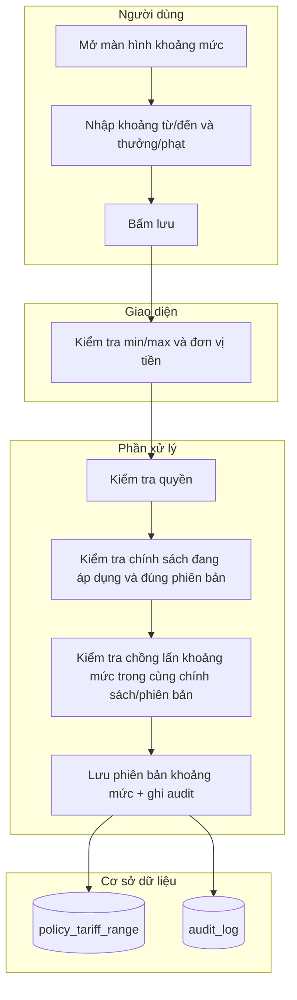
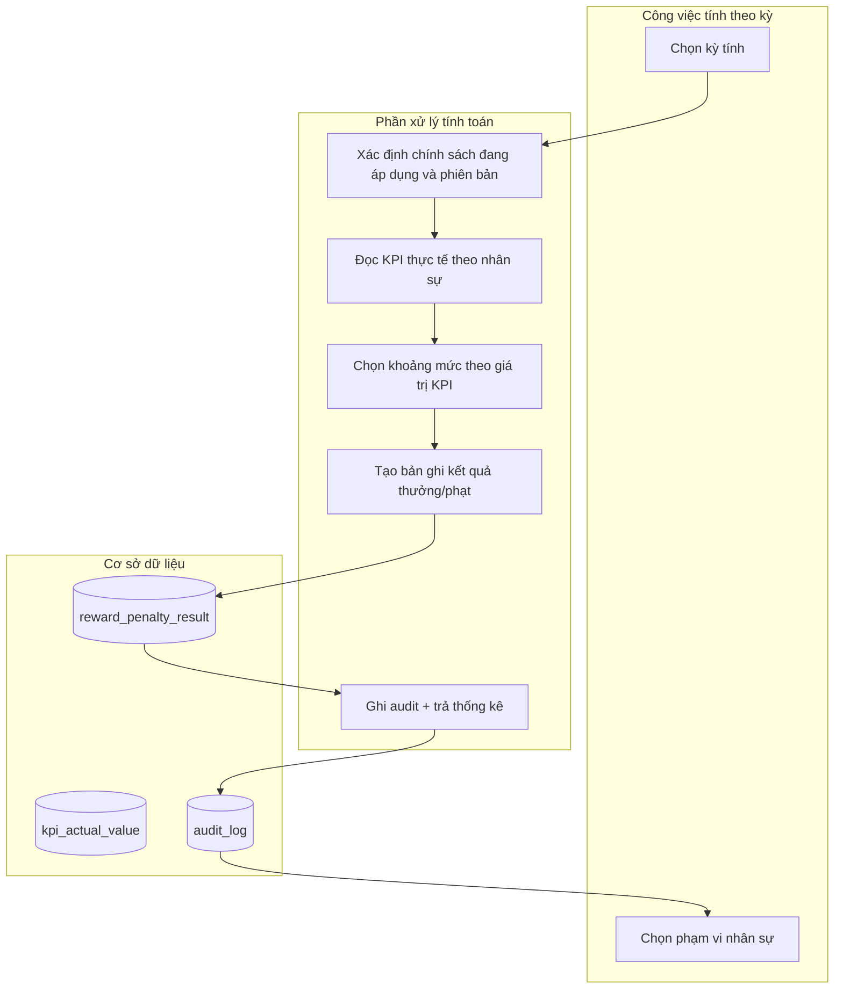

# Đặc tả Yêu cầu Phần mềm (SRS)
## Phân hệ X-BOS Core — Dynamic DNA Engine

| Thuộc tính | Giá trị |
|------------|---------|
| Sản phẩm | X-BOS Core |
| Phiên bản tài liệu | 1.0 |
| Căn cứ | BRD `docs/BRD_X_BOS_CORE_DYNAMIC.md`, TechSpec `docs/TechSpec_X_BOS_CORE.md` |

---

## 1. Phạm vi & định nghĩa chung

Tài liệu này mô tả **yêu cầu phần mềm** ở mức **hành vi có thể kiểm chứng**: tác nhân, luồng, validation, thông báo. Không thay thế thiết kế kỹ thuật chi tiết (LLD) nhưng là **chuẩn chấp nhận (acceptance)** cho đội Dev.

**Thuật ngữ:** *Tenant* = pháp nhân / công ty con trong phạm vi holding; *DNA* = danh mục & metadata chủ do X-BOS phát hành.

---

## 2. Chức năng F-ORG — Khai báo thực thể tổ chức (Org Engine)

### 2.1 Mục đích

Tập đoàn thay đổi cấu trúc pháp lý và vận hành thường xuyên. Nếu cấu hình tổ chức phụ thuộc phát hành phần mềm hoặc nhập liệu cứng, dữ liệu báo cáo và phân quyền sẽ **lệch thực tế**. F-ORG cho phép **khai báo cây đơn vị đa tầng** với một cha trực tiếp, đúng chuẩn holding và chuẩn bị cho phân bổ KPI / phân quyền sau này.

### 2.2 Use case & tác nhân

| ID | Use case | Tác nhân chính | Mục tiêu |
|----|----------|----------------|----------|
| UC-ORG-01 | Tạo / sửa đơn vị tổ chức | Quản trị tổ chức (Org Admin) | Cập nhật cây tổ chức đúng pháp lý và hiệu lực |
| UC-ORG-02 | Xem sơ đồ cây | Org Admin, Lãnh đạo (xem) | Đọc cấu trúc hiện tại |
| UC-ORG-03 | Đổi cha (điều chỉnh nhánh) | Org Admin | Sáp nhập / tách nhánh theo quyết định nội bộ |

### 2.3 Sơ đồ hoạt động (Activity — Swimlanes)



### 2.4 Luồng nghiệp vụ

**Luồng thành công (tạo đơn vị con)**

1. Người dùng chọn tenant (nếu có quyền đa tenant) và nút “Thêm đơn vị”.
2. Chọn **loại đơn vị** (metadata), **mã**, **tên**, **cha** (dropdown cây).
3. Điền trường chuẩn và trường động (nếu có).
4. Hệ thống validate → ghi DB → trả mã 201 và bản ghi mới.
5. **Cây** và **danh sách** refresh; sự kiện audit ghi nhận.

**Luồng thất bại (Exception)**

| Tình huống | Hành vi hệ thống |
|-------------|------------------|
| Mã trùng trong cùng tenant | HTTP 409, không ghi DB |
| Cha không thuộc tenant | HTTP 403 |
| Gán cha tạo chu trình (cycle) | HTTP 422, mã `ORG_CYCLE_DETECTED` |
| Vi phạm validation trường | HTTP 400, chi tiết theo từng field |
| Hết quyền | HTTP 403 |

### 2.5 Bảng đặc tả chi tiết (Master Table) — UC-ORG-01 Tạo đơn vị

| Bước / thao tác | Tên trường (Field) | Loại Input/Output | Quy tắc Validation | Thông báo lỗi / Kết quả |
|-----------------|-------------------|-------------------|------------------------|-------------------------|
| Chọn tenant (nếu có) | `tenantId` | UUID | Bắt buộc, user phải có quyền trên tenant | `403` — Không có quyền trên đơn vị này |
| Chọn loại đơn vị | `orgTypeCode` | string (enum theo metadata) | Bắt buộc, thuộc tập hợp cho phép | `400` — Loại đơn vị không hợp lệ |
| Nhập mã | `code` | string | Bắt buộc; duy nhất trong `(tenantId, code)`; regex `^[A-Z0-9._-]{2,64}$` (có thể cấu hình) | `409` — Mã đơn vị đã tồn tại |
| Nhập tên | `name` | string | Bắt buộc; độ dài 2–255 | `400` — Tên không hợp lệ |
| Chọn cha | `parentId` | UUID \| null | Optional; nếu có thì phải `tenantId` trùng; không được tạo cycle | `422` — Quan hệ cha con không hợp lệ |
| MST | `taxCode` | string | Optional; format MST VN nếu bật flag | `400` — Mã số thuế không đúng định dạng |
| Đại diện PL | `legalRep` | string | Optional; max 255 | `400` — Vượt độ dài |
| Địa chỉ | `addressJson` | JSONB | Optional; schema JSON (tỉnh/thành, phường…) nếu định nghĩa | `400` — Địa chỉ không đúng định dạng |
| Vốn ĐL | `registeredCapital` | number | Optional; ≥ 0 | `400` — Giá trị không hợp lệ |
| Hiệu lực | `effectiveFrom`, `effectiveTo` | timestamptz | `effectiveTo` ≥ `effectiveFrom` nếu cả hai có | `400` — Khoảng hiệu lực không hợp lệ |
| Trường động | `customAttributes` | JSONB | Theo schema `metadata_attribute` + kiểu từng key | `400` — `{fieldKey: message}` |

---

## 3. Chức năng F-META — Cấu hình thuộc tính động (Custom Fields / EAV)

### 3.1 Mục đích

Mỗi tập đoàn có nhu cầu thuộc tính riêng (mã số nội bộ, nhóm chi phí, mã vùng…). Hard-code **không scale**; EAV + JSONB cho phép **mở rộng không release** nhưng phải **kiểm soát validation** để tránh dữ liệu rác.

### 3.2 Use case & tác nhân

| ID | Use case | Tác nhân |
|----|----------|----------|
| UC-META-01 | Định nghĩa thuộc tính động cho `entityType` | Quản trị cấu hình (Config Admin) |
| UC-META-02 | Nhập dữ liệu trên form sinh động | Org Admin, người dùng có quyền |

### 3.3 Sơ đồ hoạt động (Activity — Swimlanes)



### 3.4 Luồng nghiệp vụ

**Main flow:** Định nghĩa → lưu → bump phiên bản schema (hoặc etag) → client form sau đó đọc định nghĩa mới.

**Exception:** Trùng `key` (409), kiểu không hỗ trợ (400), `select` thiếu `options` (400).

### 3.5 Bảng đặc tả chi tiết — UC-META-01 Định nghĩa thuộc tính

| Bước / thao tác | Tên trường (Field) | Loại Input/Output | Quy tắc Validation | Thông báo lỗi / Kết quả |
|-----------------|-------------------|-------------------|------------------------|-------------------------|
| Phạm vi | `tenantId` | UUID \| null | null = toàn tập đoàn; nếu có thì phải có quyền trên tenant | `403` — Không được cấu hình cho tenant này |
| Thực thể | `entityType` | string | Bắt buộc; thuộc danh sách cho phép (org_unit, …) | `400` — Loại thực thể không hợp lệ |
| Khóa | `key` | string | Bắt buộc; `^[a-z][a-z0-9_]{1,63}$`; duy nhất theo `(tenantId, entityType)` | `409` — Khóa thuộc tính đã tồn tại |
| Nhãn | `label` | string | Bắt buộc; 1–128 | `400` — Nhãn không hợp lệ |
| Kiểu | `dataType` | enum | text \| number \| date \| boolean \| select | `400` — Kiểu không được hỗ trợ |
| Rule | `validationJson` | JSONB | Theo kiểu: min/max, regex, required | `400` — Rule không đúng schema |
| Select | `optionsJson` | JSONB | Bắt buộc nếu `dataType=select`; mảng `{value,label}` không rỗng | `400` — Thiếu tùy chọn cho danh sách chọn |

---

## 4. Chức năng F-DNA — Quản trị danh mục DNA & phạm vi

### 4.1 Mục đích

Danh mục (loại xe, chức vụ, tuyến…) phải **một nguồn** và **đúng phạm vi** (toàn nhóm hay từng công ty). Thiếu quy tắc rõ, vệ tinh sẽ import trùng và **không ai tin được số liệu**.

### 4.2 Use case & tác nhân

| ID | Use case | Tác nhân |
|----|----------|----------|
| UC-DNA-01 | Tạo / sửa định nghĩa danh mục | Config Admin |
| UC-DNA-02 | Nhập hàng loạt (bulk) | Config Admin |
| UC-DNA-03 | Đồng bộ cho vệ tinh (đọc) | Hệ thống vệ tinh (client) |

### 4.3 Sơ đồ hoạt động (Activity — Swimlanes)



### 4.4 Luồng nghiệp vụ

**Main flow:** Định nghĩa danh mục → thêm giá trị (đơn lẻ hoặc bulk) → publish → vệ tinh pull theo version.

**Exception:** Mã trùng `(categoryId, tenantId, code)` (409), dòng bulk lỗi (207 Multi-Status hoặc 400 + `{errors:[]}` theo chính sách API).

### 4.5 Bảng đặc tả chi tiết — UC-DNA-02 Bulk (một dòng trong lô)

| Bước / thao tác | Tên trường (Field) | Loại Input/Output | Quy tắc Validation | Thông báo lỗi / Kết quả |
|-----------------|-------------------|-------------------|------------------------|-------------------------|
| Ngữ cảnh | `categoryCode` | string | Bắt buộc; tồn tại và đang active | `400` — Danh mục không tồn tại |
| Phạm vi | `tenantId` | UUID | Bắt buộc; khớp phạm vi `tenant_scope` của định nghĩa | `422` — Không áp dụng cho tenant này |
| Mã dòng | `code` | string | Bắt buộc; duy nhất trong category+tenant | `409` — Trùng mã |
| Nhãn | `label` | string | Bắt buộc | `400` — Thiếu nhãn |
| Payload | `payload_json` | JSONB | Theo schema mở rộng của danh mục (nếu có) | `400` — Payload không hợp lệ |
| Kết quả lô | `rows[]` | array | Max N dòng/request (cấu hình) | `413` — Vượt giới hạn batch |

---

## 5. Chức năng F-INLINE — In-place Creation (Drawer)

### 5.1 Mục đích

Khi nhập liệu lớn (ví dụ nhân sự, đơn hàng), thao tác **chuyển màn** sang trang danh mục làm **đứt ngữ cảnh** và tăng lỗi. Drawer cho phép **tạo nhanh giá trị DNA** mà **không mất state** form chính.

### 5.2 Use case & tác nhân

| ID | Use case | Tác nhân |
|----|----------|----------|
| UC-INL-01 | Mở Drawer tạo danh mục phụ | Người dùng có quyền ghi danh mục đó |
| UC-INL-02 | Áp dụng giá trị mới vào field đang chọn | Cùng người dùng |

### 5.3 Sơ đồ hoạt động (Activity — Swimlanes)

```mermaid
flowchart TB
  subgraph U4["Người dùng"]
    I1[Đang điền form chính]
    I2[Mở Drawer “Thêm nhanh”]
    I3[Lưu giá trị mới]
  end

  subgraph FE4["Giao diện"]
    IF1[Giữ state form chính (không unmount)]
    IF2[POST category_item]
    IF3[Invalidate query + setValue field]
  end

  subgraph BE4["Backend"]
    IB1[Same validation như UC-DNA]
    IB2[201 + entity]
  end

  subgraph DB4["Database"]
    ID1[(category_item)]
  end

  I1 --> IF1
  I2 --> IF2
  I3 --> IF2
  IF2 --> IB1
  IB1 --> ID1
  IB1 --> IB2
  IB2 --> IF3
```

### 5.4 Luồng nghiệp vụ

**Main flow:** Mở Drawer → nhập → lưu thành công → đóng Drawer → field đang chọn cập nhật giá trị mới.

**Exception:** Lỗi validation (400), hết quyền (403), không đóng Drawer (user sửa); double-submit (nút disable).

### 5.5 Bảng đặc tả chi tiết — UC-INL-01

| Bước / thao tác | Tên trường (Field) | Loại Input/Output | Quy tắc Validation | Thông báo lỗi / Kết quả |
|-----------------|-------------------|-------------------|------------------------|-------------------------|
| Ngữ cảnh | `categoryCode` | string | Bắt buộc; từ field đang bind | — |
| Form phụ | `code`, `label`, `payload` | như UC-DNA | Giống quy tắc DNA | Giống mã lỗi DNA |
| Client | `formStateId` | string (internal) | Không gửi server; chỉ để dev test không reset store | — |
| Sau lưu | `selectedValue` | UUID/string | Phải tồn tại sau khi refresh | `409` — Không đồng bộ với danh sách |

---

## 6. Chức năng F-KPI — Khai báo KPI và loại giá trị

### 6.1 Mục đích
KPI là chỉ số đo để hệ thống biết “kết quả thực” là gì khi tính thưởng hoặc phạt. KPI cần:
- Có mã và tên rõ ràng
- Có loại giá trị KPI và đơn vị đo để hiểu đúng cách nhập “KPI thực tế”
- Có hiệu lực theo thời gian
- Có phiên bản để tránh lệch khi thay đổi công thức

### 6.2 Use case & tác nhân
| ID | Use case | Tác nhân chính | Mục tiêu |
|----|----------|----------------|----------|
| UC-KPI-01 | Tạo / sửa KPI | Quản trị KPI | KPI có hiệu lực đúng và được phiên bản hóa |
| UC-KPI-02 | Xem KPI theo phiên bản | Quản trị KPI, người có quyền xem | Đọc đúng KPI theo bản đang áp dụng |

### 6.3 Sơ đồ hoạt động (Activity — Swimlanes)


### 6.4 Luồng nghiệp vụ
**Luồng thành công**
1. Người dùng nhập thông tin KPI.
2. Hệ thống kiểm tra quyền và kiểm tra mã KPI trong phạm vi tenant.
3. Hệ thống validate loại giá trị KPI và kiểm tra hiệu lực thời gian.
4. Hệ thống tạo bản phiên bản mới, ghi audit và trả mã phiên bản cho client.

**Luồng thất bại**
| Tình huống | Hành vi hệ thống |
|-------------|------------------|
| Không có quyền | HTTP 403 |
| Mã KPI đã tồn tại trong tenant | HTTP 409 |
| Loại giá trị KPI hoặc đơn vị đo không hợp lệ | HTTP 400 |
| Khoảng hiệu lực sai | HTTP 422 |

### 6.5 Bảng đặc tả chi tiết — UC-KPI-01
| Bước / thao tác | Tên trường | Loại Input/Output | Quy tắc Validation | Thông báo lỗi / Kết quả |
|-----------------|------------|---------------------|---------------------|--------------------------|
| Tenant | `tenantId` | UUID | Bắt buộc; user phải có quyền | `403` — Không có quyền |
| Mã KPI | `kpiCode` | string | Bắt buộc; duy nhất theo `(tenantId, kpiCode)` | `409` — Mã đã tồn tại |
| Tên KPI | `kpiName` | string | Bắt buộc; 2–255 ký tự | `400` — Tên không hợp lệ |
| Đơn vị đo | `unit` | string | Bắt buộc; khớp với đơn vị của `valueTypeItemCode` (nếu có) | `400` — Đơn vị không hợp lệ |
| Nhóm loại giá trị KPI | `valueTypeCategoryCode` | string | Bắt buộc; phải tồn tại | `400` — Nhóm loại giá trị không tồn tại |
| Mục loại giá trị KPI | `valueTypeItemCode` | string | Bắt buộc; thuộc nhóm `valueTypeCategoryCode` | `400` — Mục loại giá trị không tồn tại |
| Tần suất | `frequency` | enum | daily \| weekly \| monthly | `400` — Tần suất sai |
| Công thức tham chiếu | `formulaSpec` | JSONB | Optional; nếu có thì theo schema rule, không chứa trường lạ | `400` — Công thức sai |
| Hiệu lực | `effectiveFrom`, `effectiveTo` | timestamptz | Nếu có `effectiveTo` thì `effectiveTo >= effectiveFrom` | `422` — Khoảng hiệu lực sai |
| Trường bổ sung | `customAttributes` | JSONB | Theo metadata của tenant (nếu có) | `400` — Dữ liệu bổ sung sai |

---

## 6.6 Chức năng F-KPI-ASSIGN — Gán KPI theo phạm vi tổ chức

### 6.6.1 Mục đích
Cho phép cấu hình KPI được áp dụng cho nhân sự theo từng kỳ, theo đúng mô hình giao việc theo cây tổ chức:
- Công ty mẹ giao xuống công ty con
- Công ty con giao xuống cấp bộ phận/đội
- Cấp bộ phận/đội (hoặc đại diện trong đội) tiếp tục giao cho cấp dưới

Trong hệ thống, một cấu hình “gán KPI” luôn đi kèm **phạm vi tổ chức** (`orgScope`). Khi gán tại một node tổ chức, hệ thống áp dụng cho toàn bộ nhân sự thuộc nhánh node đó và sinh kết quả theo từng cá nhân để theo dõi.

### 6.6.2 Use case & tác nhân
| ID | Use case | Tác nhân chính | Mục tiêu |
|----|----------|----------------|----------|
| UC-KPI-ASSIGN-01 | Gán KPI theo kỳ và phạm vi org | Quản trị KPI | Nhân sự thuộc nhánh org nhận KPI đúng theo kỳ |
| UC-KPI-ASSIGN-02 | Gán KPI theo chính sách (tùy chọn) | Quản trị KPI | Tạo gán KPI từ chính sách đang áp dụng |

### 6.6.3 Đặc tả chi tiết — UC-KPI-ASSIGN-01
| Bước / thao tác | Tên trường | Loại Input/Output | Quy tắc Validation | Thông báo lỗi / Kết quả |
|-----------------|------------|---------------------|---------------------|--------------------------|
| Tenant | `tenantId` | UUID | Bắt buộc; user phải có quyền | `403` — Không có quyền |
| Kỳ tính | `periodCode` | string | Bắt buộc; theo chuẩn kỳ trong tenant | `422` — Kỳ sai |
| KPI | `kpiCode` | string | Bắt buộc; KPI tồn tại và có hiệu lực | `400` — KPI không hợp lệ |
| Cấp nhân sự | `staffLevelCode` | string | Không rỗng; ví dụ `KINH_DOANH`, `LAI_XE` | `400` — Cấp nhân sự sai |
| Phạm vi tổ chức | `orgScope` | JSONB | `TENANT` hoặc `ORG_UNIT` (có `orgUnitId`) | `422` — Scope sai |
| Trạng thái | `resultStatus` | — | Gán KPI không tính thưởng/phạt trực tiếp | — |

---

## 7. Chức năng F-POLICY — Nhóm chính sách và chính sách thưởng/phạt

### 7.1 Mục đích
Chính sách quyết định “khi KPI đạt mức nào thì thưởng hoặc phạt cho nhân sự”. Chính sách cần:
- Nhóm chính sách để quản trị theo mục đích
- Chính sách gắn với KPI và phạm vi áp dụng
- Có hiệu lực và phiên bản
- Áp dụng cho từng cấp nhân sự như kinh doanh hoặc lái xe

### 7.2 Use case & tác nhân
| ID | Use case | Tác nhân chính | Mục tiêu |
|----|----------|----------------|----------|
| UC-POL-01 | Tạo / sửa nhóm chính sách | Quản trị chính sách | Tạo nhóm theo loại nhân sự và mục đích |
| UC-POL-02 | Tạo / sửa chính sách | Quản trị chính sách | Chính sách gắn KPI, phạm vi, nhóm nhân sự |
| UC-POL-03 | Xem chính sách theo phiên bản | Người có quyền xem | Đọc đúng phiên bản đang áp dụng |

### 7.3 Sơ đồ hoạt động (Activity — Swimlanes)


### 7.4 Luồng nghiệp vụ
**Luồng thành công**
1. Người dùng tạo hoặc chỉnh nhóm chính sách.
2. Người dùng tạo hoặc chỉnh chính sách: chọn KPI, chọn nhóm nhân sự áp dụng, chọn hiệu lực.
3. Hệ thống validate trùng mã, validate KPI tồn tại và đang áp dụng theo hiệu lực.
4. Hệ thống tạo phiên bản mới và ghi audit.

**Luồng thất bại**
| Tình huống | Hành vi hệ thống |
|-------------|------------------|
| Không có quyền | HTTP 403 |
| Mã nhóm chính sách trùng | HTTP 409 |
| KPI không tồn tại hoặc không active | HTTP 422 |
| Dữ liệu hiệu lực sai | HTTP 422 |

### 7.5 Bảng đặc tả chi tiết — UC-POL-02
| Bước / thao tác | Tên trường | Loại Input/Output | Quy tắc Validation | Thông báo lỗi / Kết quả |
|-----------------|------------|---------------------|---------------------|--------------------------|
| Tenant | `tenantId` | UUID | Bắt buộc | `403` — Không có quyền |
| Nhóm chính sách | `policyGroupCode` | string | Bắt buộc; tồn tại | `400` — Nhóm không tồn tại |
| Mã chính sách | `policyCode` | string | Bắt buộc; duy nhất theo `(tenantId, policyCode)` | `409` — Trùng mã |
| Tên chính sách | `policyName` | string | Bắt buộc; 2–255 ký tự | `400` — Tên sai |
| KPI gắn chính sách | `kpiCode` | string | Bắt buộc; KPI tồn tại và có hiệu lực | `422` — KPI không phù hợp |
| Nhóm nhân sự áp dụng | `targetStaffLevelCodes` | string[] | Không rỗng; ví dụ `KINH_DOANH`, `LAI_XE` | `400` — Thiếu nhóm |
| Phạm vi tổ chức | `orgScope` | JSONB | Có thể chọn theo cây tổ chức; không rỗng nếu chính sách cần lọc theo tổ chức | `422` — Scope sai |
| Điều kiện bổ sung | `conditionJson` | JSONB | Theo schema điều kiện chính sách | `400` — Condition sai |
| Hiệu lực | `effectiveFrom`, `effectiveTo` | timestamptz | Nếu có `effectiveTo` thì `effectiveTo >= effectiveFrom` | `422` — Khoảng hiệu lực sai |
| Trạng thái | `status` | enum | draft \| active | `400` — Trạng thái sai |

### 7.6 Bảng đặc tả chi tiết — UC-POL-01
| Bước / thao tác | Tên trường | Loại Input/Output | Quy tắc Validation | Thông báo lỗi / Kết quả |
|-----------------|------------|---------------------|---------------------|--------------------------|
| Tenant | `tenantId` | UUID | Bắt buộc; user phải có quyền | `403` — Không có quyền |
| Mã nhóm chính sách | `policyGroupCode` | string | Bắt buộc; duy nhất theo `(tenantId, policyGroupCode)` | `409` — Trùng mã |
| Tên nhóm chính sách | `policyGroupName` | string | Bắt buộc; 2–255 ký tự | `400` — Tên sai |
| Mô tả | `description` | string | Optional; tối đa 1000 ký tự | — |
| Nhóm nhân sự mục tiêu mặc định | `defaultTargetStaffLevelCodes` | string[] | Optional; nếu có thì được dùng làm mặc định khi tạo policy | — |
| Đơn vị tiền mặc định | `defaultCurrencyCode` | string | Optional; dùng nếu policy hoặc khoảng mức không khai đơn vị | `400` — Currency sai |
| Điều kiện áp dụng chung | `defaultConditionJson` | JSONB | Optional; chỉ áp dụng nếu policy không ghi override | `400` — Condition sai |
| Hiệu lực | `effectiveFrom`, `effectiveTo` | timestamptz | Nếu có `effectiveTo` thì `effectiveTo >= effectiveFrom` | `422` — Khoảng hiệu lực sai |
| Trạng thái | `status` | enum | draft \| active | `400` — Trạng thái sai |

---

## 8. Chức năng F-TARIFF — Khai báo khoảng mức thưởng/phạt cho chính sách

### 8.1 Mục đích
Chính sách cần bảng “kết quả KPI tương ứng với thưởng/phạt bao nhiêu”. Bảng này được chia thành nhiều khoảng mức, giúp hệ thống tự chọn đúng mức khi tính toán theo KPI thực tế.

### 8.2 Use case & tác nhân
| ID | Use case | Tác nhân chính | Mục tiêu |
|----|----------|----------------|----------|
| UC-TAR-01 | Tạo / sửa khoảng mức cho chính sách | Quản trị chính sách | Mỗi khoảng không trùng và không mâu thuẫn |
| UC-TAR-02 | Nhập theo lô khoảng mức | Quản trị chính sách | Nhập nhiều dòng nhanh |

### 8.3 Sơ đồ hoạt động (Activity — Swimlanes)


### 8.4 Luồng nghiệp vụ
**Luồng thành công**
1. Người dùng chọn chính sách và phiên bản để khai báo khoảng mức.
2. Người dùng nhập danh sách khoảng từ/đến và thưởng/phạt.
3. Hệ thống validate chồng lấn, validate min/max, validate đơn vị tiền nếu cần.
4. Hệ thống lưu khoảng mức và tạo bản phiên bản mới.

**Luồng thất bại**
| Tình huống | Hành vi hệ thống |
|-------------|------------------|
| Không có quyền | HTTP 403 |
| Khoảng mức chồng lấn trong cùng chính sách/phiên bản | HTTP 422, mã `TARIFF_OVERLAP` |
| fromValue > toValue (nếu cả hai có) | HTTP 422, mã `TARIFF_RANGE_INVALID` |
| Không tìm được currency hợp lệ | HTTP 400 |

### 8.5 Bảng đặc tả chi tiết — UC-TAR-01
| Bước / thao tác | Tên trường | Loại Input/Output | Quy tắc Validation | Thông báo lỗi / Kết quả |
|-----------------|------------|---------------------|---------------------|--------------------------|
| Tenant | `tenantId` | UUID | Bắt buộc | `403` — Không có quyền |
| Chính sách | `policyCode` | string | Bắt buộc; tồn tại | `400` — Không tìm thấy chính sách |
| Phiên bản chính sách | `policyVersion` | number | Bắt buộc | `422` — Sai phiên bản |
| Từ giá trị | `fromValue` | number \| null | null = không giới hạn dưới | `422` — fromValue sai |
| Đến giá trị | `toValue` | number \| null | null = không giới hạn trên | `422` — toValue sai |
| Tiền tệ | `currencyCode` | string | Bắt buộc nếu thưởng/phạt là tiền | `400` — Đơn vị tiền sai |
| Thưởng | `rewardAmount` | number | >= 0 | `422` — Thưởng sai |
| Phạt | `penaltyAmount` | number | >= 0; tương ứng với hình thức `TRU_TIEN` | `422` — Phạt sai |
| Phạt (nhiều hình thức) | `penaltyForms` | JSONB[] | Mỗi phần tử gồm `formCode`, `value`, `unit`; có thể gồm `TRU_DIEM`, `CANH_BAO` (và/hoặc `TRU_TIEN`) | `422` — penaltyForms sai |
| Ghi chú | `note` | string | Optional | — |

---

## 9. Chức năng F-CALC — Tính thưởng/phạt cho nhân sự theo KPI

### 9.1 Mục đích
Trong từng kỳ tính (theo tần suất của KPI hoặc theo lịch điều hành), X-BOS tạo ra kết quả thưởng/phạt cho từng nhân sự dựa trên:
- KPI thực tế của nhân sự trong kỳ
- Diễn giải KPI theo định nghĩa KPI (đơn vị giá trị lấy từ valueType và unit)
- Chính sách đang áp dụng và phiên bản tương ứng
- Khoảng mức thưởng/phạt của chính sách
- Phạt có thể tách theo nhiều hình thức (trừ tiền, trừ điểm, cảnh báo) theo `penaltyForms`

### 9.2 Use case & tác nhân
| ID | Use case | Tác nhân chính | Mục tiêu |
|----|----------|----------------|----------|
| UC-CALC-01 | Tính thưởng/phạt theo kỳ | Bộ lập lịch hoặc Quản trị tính toán | Tạo kết quả cho nhân sự trong kỳ |
| UC-CALC-02 | Tính lại theo danh sách nhân sự | Quản trị tính toán | Tính lại khi nhận dữ liệu KPI muộn |
| UC-CALC-03 | Gửi kết quả sang hệ thống chi trả | Hệ thống tích hợp | Kích hoạt bước tiếp theo của hệ thống chi trả |

### 9.3 Sơ đồ hoạt động (Activity — Swimlanes)


### 9.4 Luồng nghiệp vụ
**Luồng thành công**
1. Công việc nhận `periodCode` và phạm vi tính.
2. Hệ thống lấy danh sách chính sách đang áp dụng theo thời gian và lấy đúng phiên bản chính sách.
3. Hệ thống đọc KPI thực tế của từng nhân sự trong kỳ.
4. Với từng nhân sự và từng chính sách gắn KPI:
   - Kiểm tra chính sách có áp dụng cho nhóm nhân sự và phạm vi tổ chức không
   - Tìm khoảng mức thưởng/phạt phù hợp với giá trị KPI thực
   - Tạo bản ghi kết quả thưởng/phạt (bao gồm phân tách phạt từ `penaltyForms`)
5. Công việc kết thúc và trả thống kê số nhân sự thành công/thất bại.

**Luồng thất bại**
| Tình huống | Hành vi hệ thống |
|-------------|------------------|
| Không có KPI thực cho nhân sự | Tạo kết quả lỗi theo mã `KPI_ACTUAL_MISSING` |
| Chính sách không áp dụng | Không tạo kết quả, ghi log loại trừ |
| Không có khoảng mức phù hợp | Tạo lỗi mã `TARIFF_RANGE_NOT_FOUND` |
| Chính sách hoặc khoảng mức ở trạng thái không tính được | Tạo lỗi mã `POLICY_NOT_ACTIVE` |

### 9.5 Bảng đặc tả chi tiết — UC-CALC-01
| Bước / thao tác | Tên trường | Loại Input/Output | Quy tắc Validation | Thông báo lỗi / Kết quả |
|-----------------|------------|---------------------|---------------------|--------------------------|
| Tenant | `tenantId` | UUID | Bắt buộc | `403` — Không có quyền |
| Kỳ tính | `periodCode` | string | Bắt buộc; theo chuẩn kỳ trong tenant | `422` — Kỳ sai |
| Chế độ phiên bản chính sách | `policyVersionMode` | enum | LATEST_ACTIVE \| CHOSEN_VERSION | `400` — Mode sai |
| Phiên bản chọn | `policyVersion` | number \| null | Chỉ dùng nếu mode chọn | `422` — Sai phiên bản |
| Phạm vi nhân sự | `staffScope` | JSONB | Toàn bộ hoặc danh sách theo nhóm | — |
| Trạng thái kết quả | `resultStatus` | enum | draft \| final | `400` — Sai trạng thái |
| Thống kê công việc | `summary` | JSON | Tổng số thành công/thất bại + lỗi theo mã | Trả về sau chạy công việc |

---

## 10. Ma trận truy vết SRS

| Chức năng | ID | Trạng thái tối thiểu để UAT |
|-----------|-----|-----------------------------|
| Org Engine | F-ORG | Tạo / sửa / xem cây; chặn cycle |
| Custom Fields | F-META | Định nghĩa + form hiển thị đúng kiểu |
| DNA Catalog | F-DNA | Nhập hàng loạt + công bố + phiên bản |
| In-place | F-INLINE | Drawer không làm mất state + bind giá trị mới |
| KPI định nghĩa | F-KPI | Tạo KPI có hiệu lực và phiên bản hóa |
| Gán KPI theo tổ chức | F-KPI-ASSIGN | Gán KPI theo kỳ, theo cấp nhân sự và theo nhánh org |
| Chính sách | F-POLICY | Tạo nhóm chính sách và chính sách theo KPI + phạm vi |
| Khoảng mức thưởng/phạt | F-TARIFF | Nhập khoảng mức thưởng/phạt không chồng lấn |
| Tính thưởng/phạt | F-CALC | Tính đúng kết quả theo kỳ cho từng nhân sự |

---

## 11. Phi chức năng (rút gọn)

- **Audit:** Mọi thao tác cấu hình F-ORG, F-META, F-DNA ghi `audit_log` (ai, khi nào, entity, before/after).
- **Hiệu năng:** Tree org P95 < 500 ms (quy mô tham chiếu trong LLD); nhập theo lô tối đa N dòng / request.
- **Tính thưởng/phạt:** công việc theo kỳ phải chạy xong theo SLA; lỗi theo từng nhân sự không làm dừng toàn bộ công việc.

---

*Tài liệu này là baseline SRS; đội QA có thể chuyển đổi từng bảng Master Table thành test case có mã trace.*
