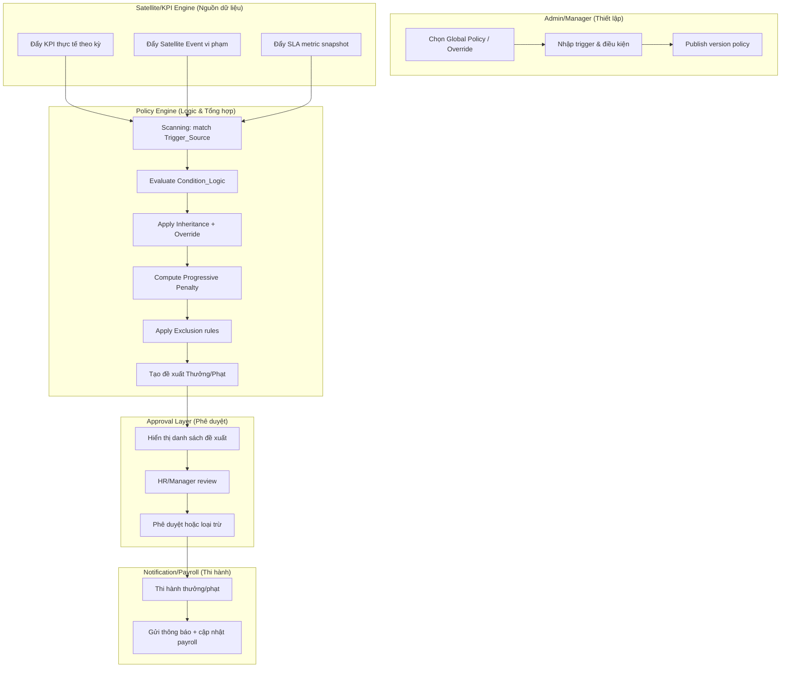

# SRS — Quản trị Chính sách Thưởng/Phạt Đa tầng (Global Policy & Incentive Engine)

## 1. Purpose

Chức năng **Quản trị Chính sách Thưởng/Phạt Đa tầng (Global Policy & Incentive Engine)** giải quyết bài toán **tự động hóa khích lệ (Thưởng) và kỷ luật (Phạt)** dựa trên:
- **Dữ liệu thực tế KPI** (thực tế vs kế hoạch theo kỳ)
- **Sự kiện vi phạm từ vệ tinh** (Satellite Events)
- **Dữ liệu vận hành/SLA** (ví dụ xử lý chậm > X giờ)

Mục tiêu trọng tâm:
- Đảm bảo **tính minh bạch và công bằng toàn tập đoàn**: cùng một dữ liệu đầu vào + cùng một version policy sẽ tạo ra cùng kết quả áp dụng.
- Tự động hóa luồng khuyến khích/kỷ luật trước khi đưa sang **Notification/Payroll**.
- Cho phép mở rộng theo mô hình **Middleware Policy**: Policy Engine đóng vai trò “middleware” giữa nguồn dữ liệu vệ tinh và lớp thi hành ở các kênh khác.

---

## 2. Use Cases

### 2.1 Danh sách tác nhân
- **Admin Tập đoàn**: thiết lập **chính sách khung toàn tập đoàn** (Global Policy).
- **Manager đơn vị**: thực hiện **Override** chính sách cho phù hợp đặc thù đơn vị, hoặc thiết lập chính sách riêng trong phạm vi được phép.
- **System Engine (Scanning)**: tự động quét dữ liệu KPI & sự kiện để đề xuất danh sách Thưởng/Phạt cần thi hành.
- **HR/Manager (Approval)**: phê duyệt danh sách đề xuất trước khi thi hành.
- **Notification/Payroll**: thi hành sau phê duyệt (gửi thông báo, cập nhật payroll hoặc tạo lệnh xử lý).

### 2.2 Use case theo luồng nghiệp vụ
| ID | Use case | Tác nhân chính | Mục tiêu |
|---|---|---|---|
| UC-GP-01 | Thiết lập chính sách khung | Admin Tập đoàn | Tạo Global Policy chuẩn và kiểm soát phạm vi giới hạn |
| UC-GP-02 | Override chính sách | Manager đơn vị | Điều chỉnh điều kiện/giá trị trong vùng cho phép của tập đoàn |
| UC-GP-03 | Scanning & đề xuất | System Engine | Quét KPI/Events/SLA để sinh “đề xuất thưởng/phạt” |
| UC-GP-04 | Phê duyệt danh sách | HR/Manager | Kiểm tra, loại trừ, chốt danh sách áp dụng |
| UC-GP-05 | Thi hành | Notification/Payroll | Gửi thông báo và/hoặc kích hoạt payroll theo kết quả đã phê duyệt |

### 2.3 Luồng thao tác chi tiết theo vai trò
**Admin Tập đoàn**
1. Tạo Policy template khung cho KPI và cho từng loại sự kiện (vi phạm).
2. Cấu hình **Trigger_Source**, **Condition_Logic**, **Incentive_Value/Penalty_Value**, **Evidence_Required**.
3. Thiết lập **Effective_Date_Range** và kiểm soát **Vùng giới hạn** (Limit Zone) nếu có.
4. Publish version policy để các đơn vị đồng bộ.

**Manager đơn vị**
1. Chọn policy version cần override trong phạm vi đơn vị của mình.
2. Thực hiện Override bằng các thao tác:
   - Điều chỉnh giá trị incentive/penalty
   - Điều chỉnh threshold điều kiện
   - Bổ sung miễn trừ (Exclusion) cho trường hợp khách quan
3. Gửi đến HR/Manager phê duyệt override (nếu workflow cấu hình yêu cầu).

**System Engine (Scanning)**
1. Quét dữ liệu theo **kỳ tính** và theo **trigger window**.
2. Sinh danh sách đề xuất thưởng/phạt cho từng đối tượng áp dụng.
3. Đính kèm evidence/metric snapshot tham chiếu (nếu trigger yêu cầu bằng chứng).

**HR/Manager (Approval)**
1. Xem danh sách đề xuất: ai, lý do, căn cứ dữ liệu, mức thưởng/phạt.
2. Thực hiện Exclusion cho các trường hợp hợp lệ (miễn trừ) hoặc cập nhật reason.
3. Phê duyệt danh sách để thi hành.

**Notification/Payroll**
1. Nhận kết quả đã phê duyệt theo contract.
2. Thực thi hành động: gửi thông báo / cập nhật payroll / tạo lệnh xử lý.

---

## 3. Activity Diagram (Mermaid với Swimlanes)

---

## 4. Business Logic

### 4.1 Cơ chế Middleware Policy (Global -> Downstream)

Policy Engine là lớp “middleware”:
- Nhận **dữ liệu KPI thực tế** và **Satellite Events/SLA snapshots**
- Chuẩn hóa dữ liệu và gắn vào ngữ cảnh `tenantId`, `orgScope`, `policyVersion`, `periodCode`
- Áp dụng quy tắc policy để sinh kết quả đề xuất
- Đưa kết quả sang Approval Layer và sau đó chuyển sang Notification/Payroll

Nguyên tắc minh bạch:
- Mọi kết quả thưởng/phạt phải truy vết được tới:
  - Policy version (id/version)
  - Trigger_Source (KPI hoặc event)
  - Metric snapshot/evidence tham chiếu
  - Rule evaluation path (ít nhất ở mức thông tin định danh rule/condition)

### 4.2 Cơ chế Kế thừa (Inheritance)

- **Global Policy** là chính sách khung của Tập đoàn.
- Mặc định:
  - Đơn vị con **sử dụng Global Policy**.
  - Trường hợp không có override ở cấp đơn vị thì kết quả áp dụng theo bản Global.
- Quy tắc override:
  - Khi Manager override chính sách, đơn vị con dùng **chính sách tại cấp override** cho các trường đã cấu hình.
  - Các trường không override vẫn kế thừa từ Global.

### 4.3 Trigger Logic (Nguồn kích hoạt chính)

Policy có thể được kích hoạt theo một trong các `Trigger_Source`:
1. **KPI trigger**: dựa trên `Thực tế vs Kế hoạch` theo kỳ
2. **Satellite Event trigger**: ví dụ `tai nạn = Phạt mức A`
3. **SLA trigger**: ví dụ `xử lý chậm > X giờ`

Trong hệ thống, trigger được đánh giá bằng một cấu hình thống nhất:
- `Condition_Logic` bao gồm:
  - `Operator`: `>`, `<`, `=`, `contains` ...
  - `Condition_Expression`: tham chiếu metric snapshot hoặc evidence metadata

### 4.4 Logic Lũy tiến (Progressive Penalty)

Progressive Penalty áp dụng khi:
- Cùng một `Policy` hoặc cùng một nhóm `vi phạm` liên quan
- Có lịch sử vi phạm trong khoảng kỳ hoặc sliding window theo policy

Quy tắc:
- Lần 1 => mức penalty cơ sở
- Lần 2 => penalty tăng theo `Progression_Step` (tùy cấu hình)
- Lần 3+ => penalty tiếp tục tăng hoặc áp trần theo `Max_Penalty_Cap` (nếu policy có)

Output:
- Penalty_Value cuối cùng sau khi tính lũy tiến
- Ghi nhận “vi phạm lần thứ mấy” để truy vết công bằng

### 4.5 Cơ chế Miễn trừ (Exclusion)

Exclusion cho phép Manager/Hr đánh dấu ngoại lệ khi trường hợp khách quan:
- Tai nạn do yếu tố ngoài phạm vi trách nhiệm trực tiếp
- Sự kiện do điều kiện bất khả kháng
- SLA bị ảnh hưởng bởi sự cố hệ thống không do đơn vị

Quy tắc:
- Exclusion phải gắn với:
  - `evidenceRef` hoặc lý do bắt buộc
  - phạm vi áp dụng (đối tượng, trigger window)
  - thời điểm hiệu lực miễn trừ
- Nếu Exclusion hợp lệ:
  - Policy Engine loại trừ khỏi danh sách đề xuất hoặc giảm mức theo cấu hình policy “exclusion impact”.

### 4.6 Điều kiện kiểm soát tính hợp lệ

Policy con khi override:
- Không được trái với **Vùng giới hạn (Limit Zone)** của tập đoàn (nếu cấu hình có giới hạn).
- Tự động validate theo:
  - ngưỡng tối đa/tối thiểu
  - loại incentive/penalty
  - điều kiện bắt buộc về evidence

### 4.7 Flow Lifecycle Policy
- Draft -> Pending_Approval -> Active -> Inactive (theo version)
- Kết quả scanning dùng **policyVersion Active** theo `Effective_Date_Range`.
- Không cho phép hiệu lực trùng lặp cho cùng “loại policy” đang active.

---

## 5. Data Interaction & Validation Table

### 5.1 Bảng luồng thao tác chi tiết (Step-by-step)
| Step | Lớp | Actor | Input chính | Xử lý hệ thống | Output |
|---|---|---|---|---|---|
| 1 | Admin/Manager | Admin Tập đoàn | Global Policy fields | Validate trigger/condition schema, evidence rule | Draft policy version |
| 2 | Admin/Manager | Admin Tập đoàn | Publish | Bump version + kiểm tra trùng effective | Active policy version |
| 3 | Policy Engine | System Engine | KPI thực tế + KPI kế hoạch | Scan KPI trigger theo kỳ | Candidate incentives |
| 4 | Policy Engine | System Engine | Satellite Events | Match event code + progressive penalty | Candidate penalties |
| 5 | Policy Engine | System Engine | SLA snapshots | Evaluate SLA thresholds | Candidate actions |
| 6 | Policy Engine | Policy Engine | Candidate list | Apply inheritance + override + progressive + exclusion | Đề xuất thưởng/phạt có evidence |
| 7 | Approval Layer | HR/Manager | Candidate list | Review, loại trừ/exclusion, verify evidence | Approved list |
| 8 | Notification/Payroll | Notification/Payroll | Approved list | Thi hành theo contract | Completed |

### 5.2 Đặc tả trường dữ liệu bắt buộc (Policy & Evaluation)

| Field | Mô tả | Kiểu dữ liệu | Validation Rules |
|---|---|---|---|
| `Policy_Name` | Tên hiển thị chính sách | string | Bắt buộc; 3–150 ký tự |
| `Trigger_Source` | Nguồn kích hoạt | enum: `KPI`, `SATELLITE_EVENT`, `SLA` | Bắt buộc; phải map được loại trigger engine |
| `Condition_Logic` | Logic điều kiện | JSON | Bắt buộc; chỉ dùng toán tử cho phép: `>`, `<`, `=`, `contains` ... |
| `Incentive_Value` | Giá trị thưởng | decimal | Bắt buộc nếu trigger là incentive; `>= 0` |
| `Penalty_Value` | Giá trị phạt | decimal | Bắt buộc nếu trigger là penalty; `>= 0` |
| `Effective_Date_Range` | Hiệu lực chính sách | `{from,to}` | Bắt buộc; `from <= to` hoặc `to=null` |
| `Evidence_Required` | Có cần evidence không | boolean | Nếu `true` với trigger event => bắt buộc evidenceRef đính kèm khi đề xuất |
| `Limit_Zone` | Vùng giới hạn override | JSON (tuỳ cấu hình) | Policy con override phải nằm trong vùng giới hạn |
| `Progressive_Config` | Cấu hình lũy tiến | JSON | Nếu bật progressive => phải có rule bước + cap (tuỳ loại) |
| `Exclusion_Rule` | Quy tắc miễn trừ | JSON | Nếu policy có exclusion => phải xác định tác động của exclusion |

### 5.3 Validation Rules (bắt buộc)

1. **Override không vượt vùng giới hạn**
   - Nếu tồn tại `Limit_Zone` ở Global:
     - Policy con override không được vượt các ràng buộc (ngưỡng, cap, loại penalty/incentive).

2. **Không trùng hiệu lực**
   - `Effective_Date_Range` không được trùng với policy cùng `policyType` và `status=Active` (trong cùng phạm vi).
   - Quy tắc “trùng” áp dụng theo:
     - overlap thời gian từ-to
     - cùng tenantId + cùng policyType + cùng org scope (hoặc phạm vi override chuẩn).

3. **Condition_Logic hợp lệ**
   - `Operator` phải nằm trong danh sách cho phép.
   - Metric keys trong `Condition_Logic` phải map được với schema metric snapshot của `Trigger_Source`.
   - `contains` chỉ áp dụng cho kiểu chuỗi; `>` `<` `=` chỉ áp dụng numeric.

4. **Evidence_Required**
   - Nếu policy là phạt sự kiện và `Evidence_Required=true`:
     - candidate đề xuất bắt buộc có `evidenceRef` (hình ảnh/tọa độ/metadata event).

5. **Progressive Penalty**
   - Progressive chỉ chạy khi có lịch sử vi phạm hoặc event correlation đủ dữ liệu.
   - Nếu thiếu lịch sử => chuyển candidate sang trạng thái “Needs Data” và không thi hành.

6. **Dynamic by Default - cấu hình công thức**
   - Policy công thức thưởng/phạt lưu dưới dạng cấu hình:
     - `formulaJson` / `conditionJson`
   - Validation yêu cầu công thức phải:
     - dùng các biến/metric đã định nghĩa
     - không chứa hàm không cho phép
     - tính ra được số hợp lệ (non-NaN, non-infinite)

### 5.4 Error Messages (chuyên nghiệp)

| Error Code | Điều kiện phát sinh | Thông báo lỗi |
|---|---|---|
| `GP-VAL-001` | Policy_Name rỗng/ngoài giới hạn | Tên chính sách không hợp lệ. Vui lòng nhập 3–150 ký tự. |
| `GP-VAL-002` | Trigger_Source không hợp lệ hoặc không map engine | Nguồn kích hoạt không hợp lệ. Vui lòng chọn `KPI`, `SATELLITE_EVENT` hoặc `SLA`. |
| `GP-VAL-003` | Condition_Logic không hợp lệ | Điều kiện không hợp lệ. Vui lòng kiểm tra toán tử và metric tham chiếu. |
| `GP-VAL-004` | Incentive_Value/Penalty_Value < 0 | Giá trị thưởng/phạt phải >= 0. Vui lòng kiểm tra lại dữ liệu. |
| `GP-VAL-005` | Effective_Date_Range chồng lấn policy đang active | Không thể lưu chính sách vì hiệu lực trùng với chính sách cùng loại đang hoạt động. |
| `GP-VAL-006` | Override vượt Limit_Zone | Chính sách override vượt vùng giới hạn của tập đoàn. Vui lòng điều chỉnh trong phạm vi cho phép. |
| `GP-VAL-007` | Evidence_Required=true nhưng thiếu bằng chứng | Chính sách phạt theo sự kiện yêu cầu bằng chứng. Vui lòng đính kèm evidence trước khi phê duyệt. |
| `GP-VAL-008` | Progressive cần lịch sử nhưng không đủ dữ liệu | Không đủ dữ liệu lịch sử để tính lũy tiến. Vui lòng kiểm tra event correlation. |
| `GP-STATE-001` | Gửi duyệt khi candidate chưa đạt validation | Không thể gửi duyệt vì vẫn còn lỗi điều kiện hoặc thiếu evidence bắt buộc. |

---

## 6. Phi chức năng liên quan (rút gọn)
- **Auditability:** Audit trail cho thay đổi policy, override, phê duyệt và kết quả thi hành.
- **Security:** RLS/permission theo `tenantId` và `orgScope`, deny-by-default cho override.
- **Performance:** Scanning theo batch theo kỳ; cache evaluation rule theo `policyVersion`.
- **Consistency:** Transaction đảm bảo candidate đề xuất và phê duyệt tương ứng đúng version policy.

---

## 7. Kết luận

Global Policy & Incentive Engine giúp tập đoàn tự động hóa luồng thưởng/phạt dựa trên KPI và sự kiện vệ tinh với:
- Kế thừa policy mặc định (inheritance)
- Override có kiểm soát theo vùng giới hạn
- Trigger theo KPI/Event/SLA
- Tính lũy tiến (progressive) và miễn trừ (exclusion)
- Phê duyệt minh bạch trước khi thi hành

Thiết kế theo **Dynamic by Default** đảm bảo hệ thống có thể mở rộng công thức thưởng/phạt bằng cấu hình, không phụ thuộc vào thay đổi code thường xuyên.

