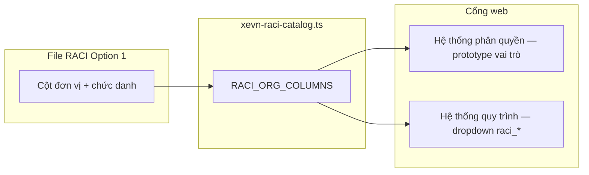

# SRS — Danh mục vai trò RACI, phân quyền X-BOS & quy trình

| Mục | Nội dung |
|-----|-----------|
| Sản phẩm | Cổng X-BOS — Cài đặt hệ thống |
| Phần chức năng | Phân quyền theo module + Định nghĩa quy trình (gán vai trò) |
| Phiên bản tài liệu | 1.0 |
| Ngày cập nhật | 2026-03-29 |
| Nguồn nghiệp vụ | `docs/từ khách hàng/1. PHÂN QUYỀN RACI OPTION 1.xlsx` |

---

## 1. Mục đích

Thống nhất **mô hình RACI** (Responsible, Accountable, Consulted, Informed) của khách hàng với **danh mục cột chức danh** trên ma trận Excel và **hệ thống sản phẩm**: ma trận phân quyền chức năng (Xem/Ghi/Xóa/Duyệt + phạm vi dữ liệu) và **vai trò xử lý bước** trong quy trình (`handlerRoleId`).

**Giá trị nghiệp vụ:** Giảm lệch giữa “vai trò trên giấy” (RACI) và “vai trò trong hệ thống”; làm nền gán người thật / nhóm AD vào `raci_*` hoặc nhóm tổng quát (`dept_head`, …) khi triển khai IAM.

---

## 2. Đối tượng và use case (tóm tắt)

| Actor | Hành vi |
|--------|---------|
| Quản trị hệ thống / Chủ sở hữu quy trình | Xem chuẩn RACI và bảng ánh xạ cột → mã `raci_*`; chỉnh ma trận phân quyền theo từng prototype vai trò; cấu hình quy trình với vai trò khớp RACI. |
| Kiến trúc sư giải pháp | Đối chiếu file Excel gốc với `xevn-raci-catalog.ts` và mở rộng cột khi khách hàng cập nhật Option 2/3. |

---

## 3. Sơ đồ hoạt động (Mermaid)

---

## 4. Quy tắc nghiệp vụ

1. **Cột RACI** trên Excel (hàng tiêu đề 9–10, sheet chính) được mô hình hóa thành phần tử `RaciOrgColumn`: `id`, `orgUnit`, `positionTitle`, `workflowRoleLabel`, `workflowAllowsReject`.
2. **Mã vai trò quy trình** cho từng cột: `raci_{id}` (ví dụ `raci_hcns`, `raci_kho_phan_phoi`), đồng bộ với `WORKFLOW_HANDLER_ROLES` trong `workflow-graph.ts`.
3. **Vai trò tổng quát** (`dept_head`, `division_director`, `bod`, `hr_bp`, `admin`, `staff`) được **giữ** để tương thích quy trình mẫu cũ; khuyến nghị quy trình mới dùng `raci_*` khi đã chốt danh mục khách hàng.
4. **ĐHCĐ** (`raci_dhcd`): `workflowAllowsReject = false` — không dùng nhánh “Từ chối” nghiệp vụ thường trên quy trình vận hành (góc quản trị cổ đông).
5. **Ma trận phân quyền** trên cổng (prototype): tám vai trò mẫu (`RACI_PERMISSION_BOOTSTRAP`) phản ánh HĐQT, CEO, CFO, CHRO, PTGĐ KD, Trưởng kho, Nhân viên thực hiện, Admin HT — **không** thay thế hoàn toàn ma trận RACI đầy đủ trên Excel (chức năng × hàng trăm hoạt động) mà là **lớp ứng dụng** (module X-BOS) tách biệt.
6. **Quy trình prototype RACI** (`getRaciWorkflowPrototypeDefinitions`): thêm vào danh sách mẫu — ví dụ chuỗi Kho → PTGĐ KD → COO; HCNS → PTGĐ Nội chính → CEO.

---

## 5. Bảng dữ liệu & validation (ánh xạ)

| Bước | Thực thể | Trường | Ghi chú |
|------|-----------|--------|---------|
| 1 | Cột Excel | Đơn vị (hàng 9) | Chuẩn hóa chuỗi, giữ tên khách hàng (kể cả “Maketing”). |
| 2 | Cột Excel | Chức danh (hàng 10) | Có thể rỗng (ĐHCĐ). |
| 3 | `RaciOrgColumn` | `id` | snake_case ổn định, không đổi sau khi có dữ liệu sản xuất. |
| 4 | `WorkflowGraphStep` | `handlerRoleId` | Phải tồn tại trong `WORKFLOW_HANDLER_ROLES`. |
| 5 | Phân quyền | `PermissionMatrixRow` | `dataScope` ∈ personal / department / legal_entity / group. |

**Lỗi / ngoại lệ:** `handlerRoleId` không khớp danh mục → từ chối lưu định nghĩa quy trình (khi có API); trên prototype cổng — dropdown chỉ cho phép giá trị hợp lệ.

---

## 6. Triển khai kỹ thuật (tham chiếu mã)

| File | Vai trò |
|------|---------|
| `apps/web-portal/src/data/xevn-raci-catalog.ts` | Danh mục 18 cột + ý nghĩa R/A/C/I + đường dẫn file nguồn. |
| `apps/web-portal/src/data/raci-permission-seeds.ts` | Hạt giống ma trận phân quyền theo 8 vai trò mẫu. |
| `apps/web-portal/src/data/workflow-graph.ts` | Gộp `WORKFLOW_HANDLER_ROLES` legacy + `raci_*`; `getRaciWorkflowPrototypeDefinitions()`. |
| `CommandCenterPage.tsx` | UI phân quyền (bảng tra RACI + tab vai trò); danh sách quy trình gộp prototype. |

---

*Tài liệu bổ sung cho SRS quy trình: `SRS_X_BOS_COMMAND_CENTER_WORKFLOW_DEFINITION.md`.*
