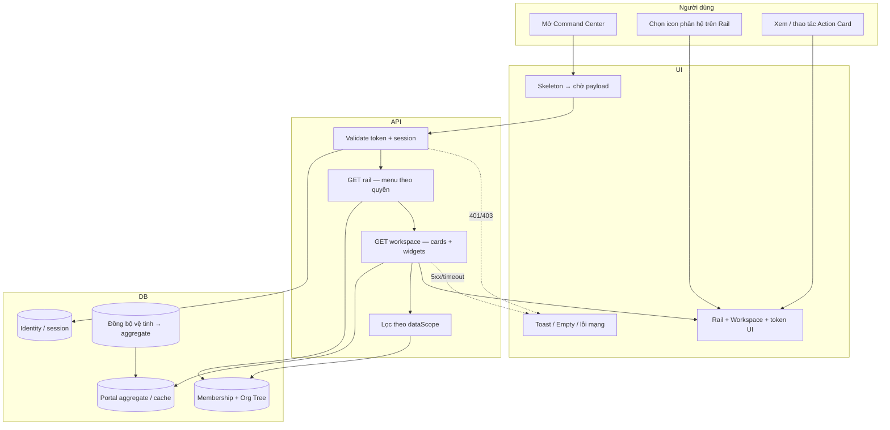

# SRS — X-BOS Unified Portal (Command Center)

*Tài liệu tuân thủ chuẩn dự án trong `.cursorrule` (Documentation Standards + UI/UX Apple Touch).*

## 1. Purpose

**X-BOS Unified Portal (Command Center)** tạo ra một **gateway thông minh** để:

- **Điều hướng** người dùng tới đúng phân hệ nghiệp vụ thông qua **Rail menu** bên trái (bố cục icon theo sơ đồ menu vòng tròn / vòng cung).
- **Giám sát và xử lý công việc** trong cùng một phiên làm việc thông qua **Action Cards** và **widget tổng hợp** ở vùng nội dung bên phải.

Portal không thay thế logic nghiệp vụ sâu của từng vệ tinh; Portal **chuẩn hóa trải nghiệm điều hành** và **hợp nhất tín hiệu vận hành** (việc đang xử lý, KPI tiêu biểu, cảnh báo) sau khi đã áp dụng **phạm vi dữ liệu** theo tổ chức và vai trò.

---

## 2. Use Cases

### 2.1 Tác nhân

- **Người dùng nội bộ tập đoàn** (Chủ tịch/BOD, quản lý, nhân viên) đã xác thực.
- **Org Engine (Phân quyền):** cung cấp membership, vai trò, và **phạm vi tổ chức** (Org Tree / scope).
- **Portal Engine (Hội tụ):** thu thập, chuẩn hóa, tổng hợp dữ liệu từ các nguồn (theo giai đoạn: batch hoặc gần thời thực) để phục vụ UI.
- **Các phân hệ vệ tinh:** là nguồn sinh task, KPI, alert (HRM, X-BOS Core, vận hành, …).

### 2.2 Use case chính

| ID | Use case | Mô tả |
|----|-----------|--------|
| UC-UP-01 | Chọn phân hệ từ Rail bên trái | Người dùng bấm icon phân hệ trên Rail; hệ thống đánh dấu active, có thể mở deep-link tới phân hệ hoặc lọc Action Cards theo domain đã chọn. |
| UC-UP-02 | Xem Action Cards ở vùng làm việc bên phải | Hiển thị danh sách việc cần xử lý (ưu tiên, hạn, nguồn phân hệ); hành động nhanh hoặc điều hướng chi tiết. |
| UC-UP-03 | Xem widget tổng hợp | Task_Counter, KPI_Sparkline, Alert_List được tính theo **phạm vi đã lọc** (theo persona và Org scope). |
| UC-UP-04 | Đăng nhập và kiểm tra quyền trước render | Token/session hợp lệ; quyền truy cập từng mục Rail và từng loại dữ liệu widget được xác nhận trước khi vẽ UI. |

### 2.3 Luồng thao tác (mức người dùng)

1. Người dùng mở Command Center sau khi xác thực.
2. Hệ thống tải **menu Rail** theo quyền; ẩn hoặc vô hiệu hóa phân hệ không có quyền.
3. Hệ thống tải **Action Cards** và **widget** theo phạm vi Org + persona.
4. Người dùng chọn icon phân hệ trên Rail → cập nhật filter/context vùng phải (theo thiết kế sản phẩm: chỉ lọc card hoặc kèm điều hướng).
5. Người dùng xử lý từng card (phê duyệt nhanh, mở chi tiết, đánh dấu đã xem) trong giới hạn quyền.

---

## 3. Activity Diagram (Mermaid — Swimlanes)

Sơ đồ dưới đây tách **Người dùng | UI | API | DB** theo chuẩn SRS trong `.cursorrule`. Luồng nghiệp vụ: xác thực → lấy scope tổ chức → hội tụ dữ liệu Portal → render Command Center.

---

## 4. Business Logic

### 4.0 Luồng thành công (Main flow)

1. Người dùng đã xác thực mở Command Center.
2. API xác nhận token, đọc membership và **Org Tree** → tính **dataScope**.
3. Portal Engine lấy/aggregate **UnifiedTask**, KPI series, Alert → áp filter theo dataScope và persona.
4. UI nhận payload: Rail (danh mục phân hệ được phép), Action Cards, Task_Counter / KPI_Sparkline / Alert_List.
5. Người dùng chọn Rail hoặc xử lý card trong giới hạn quyền; UI cập nhật cục bộ hoặc gọi API hành động (nếu có).

### 4.0.1 Luồng ngoại lệ (Exception flows)

| Tình huống | Hành vi hệ thống | Thông báo / UX |
|------------|------------------|----------------|
| Token hết hạn / không hợp lệ | Không gọi aggregate; chặn workspace | Điều hướng đăng nhập; toast “Phiên đã hết hạn” |
| Lỗi mạng khi tải workspace | Giữ Rail nếu đã cache; widget lỗi riêng | Toast lỗi; nút “Thử lại”; Skeleton → error state |
| Không có quyền phân hệ trên Rail | Ẩn hoặc disabled icon | Tooltip “Không có quyền truy cập” |
| Scope rỗng (chưa gán org) | Chỉ hiển thị Self-Focus tối thiểu hoặc empty | Empty state hướng dẫn liên hệ admin |
| Đồng bộ vệ tinh trễ / lệch | Hiển thị `asOf`; có thể cảnh báo “Dữ liệu đến [thời điểm]” | Banner nhỏ trạng thái **Pending** theo token trạng thái chuẩn |
| Trùng dedupeKey khi aggregate | Ghi nhận bản ghi mới nhất hoặc gộp theo quy tắc | Log nội bộ; không hiển thị số trùng cho user |

### 4.1 Logic phân quyền (Data Scope) — dùng Org Tree để lọc

- Mỗi người dùng gắn với **một hoặc nhiều** mốc trên **cây tổ chức** (tập đoàn → công ty con → khối → phòng → …).
- **Data Scope** xác định **nhánh** dữ liệu được phép đọc:
  - **Ví dụ:** Trưởng phòng Phòng A chỉ thấy **Task** gán cho nhân sự thuộc Phòng A (và đơn vị con trong phạm vi quản lý), không thấy Phòng B.
- **Chủ tịch / Full Visibility:** scope mở rộng theo cấu hình (thường là root hoặc tập con được ủy quyền); widget hiển thị **tổng hợp điều hành**.
- **Nhân viên / Self-Focus:** scope thu về **userId** (và nhóm được giao trực tiếp nếu có quy tắc); Action Cards ưu tiên việc “của tôi”.

**Quy tắc:** Không có scope hợp lệ → không render dữ liệu nhạy cảm; Rail vẫn có thể hiển thị mục public hoặc mục “không cần dữ liệu phân tầng” theo policy.

### 4.2 Logic hội tụ (Aggregation) — đếm “Đang xử lý” đa phân hệ

- Mỗi vệ tinh đẩy hoặc cho phép truy vấn các **work item** ở trạng thái chuẩn (ví dụ: `OPEN`, `IN_PROGRESS`, `PENDING_APPROVAL` — định nghĩa theo từng domain nhưng **map** sang trạng thái Portal).
- **Portal Engine** thực hiện:
  1. **Map** bản ghi nghiệp vụ → `UnifiedTask` (id, sourceSystem, statusNormalized, assignee, orgUnitId, dueAt, priority).
  2. **Lọc** theo Data Scope (Org Tree + quyền cá nhân).
  3. **Đếm** số lượng trạng thái `Đang xử lý` = tập trạng thái đã chuẩn hóa (ví dụ: đang làm + chờ phê duyệt, trừ đã đóng/hủy).
  4. **Tránh trùng lặp:** nếu cùng một nghiệp vụ được đồng bộ hai lần, dùng khóa tự nhiên `(sourceSystem, sourceId)` hoặc `dedupeKey`.

- **Giai đoạn 1:** đồng bộ theo lô hoặc theo chu kỳ ngắn; số có thể là “gần đúng theo thời điểm đồng bộ cuối”.
- **Giai đoạn 2:** cập nhật khi có sự kiện real-time từ vệ tinh → Task_Counter và Action Cards phản ánh nhanh hơn.

---

## 5. Data Interaction & Validation

### 5.0 Luồng tương tác theo bước (Step-by-step)

| Bước | Tác nhân | Input | Xử lý | Output | Lỗi thường gặp |
|------|----------|--------|--------|--------|----------------|
| S1 | Người dùng | Request có `Authorization` | API validate JWT/session | `userId`, `tenantId` | 401 — “Không xác thực được” |
| S2 | API | `userId` | Đọc membership + Org Tree | `dataScope` (nhánh org được phép) | 403 — “Chưa được gán phạm vi tổ chức” |
| S3 | API | `dataScope` | Query/cache aggregate + filter | Payload Rail + workspace | 503 — “Không tải được dữ liệu tổng hợp” |
| S4 | UI | Payload | Render Rail, widgets, Action Cards | Màn Command Center | — |
| S5 | Người dùng | Chọn Rail `moduleCode` | UI lọc card / deep-link theo cấu hình | Danh sách card đã lọc | — |

### 5.1 Đặc tả widget

| Widget | Dữ liệu đầu vào (tóm tắt) | Hành vi hiển thị | Ghi chú |
|--------|---------------------------|------------------|---------|
| **Task_Counter** | Danh sách `UnifiedTask` sau filter scope; tập trạng thái “đang xử lý” | Hiển thị **số đếm** theo domain (tab/stack) hoặc tổng; có thể drill-down tới Action Cards | Cần `asOf` (thời điểm tính) khi không real-time |
| **KPI_Sparkline** | Chuỗi điểm KPI theo kỳ (ngày/tuần/tháng) đã được phép xem | Đường/sparkline ngắn; tooltip giá trị | Dữ liệu theo scope; BOD xem tổng hợp, NV xem KPI cá nhân |
| **Alert_List** | Danh sách cảnh báo (ngưỡng SLA, KPI đỏ, rủi ro vận hành) | Danh sách có mức ưu tiên; bấm mở chi tiết hoặc phân hệ nguồn | Map mức độ (info/warn/critical) thống nhất |

### 5.2 Action Card (vùng làm việc)

| Trường logic | Mô tả |
|--------------|--------|
| identity | `cardId`, `sourceSystem`, `sourceRef` |
| title / subtitle | Mô tả việc cần làm |
| assignee | Người chịu trách nhiệm (có thể là “tôi” hoặc nhóm) |
| dueAt / priority | Sắp xếp mặc định |
| actions | Hành động khả dụng theo quyền (mở, duyệt, giao) |

#### 5.2.1 Validation theo trường (field-level) — UnifiedTask (tối thiểu)

| Field | Kiểu | Bắt buộc | Quy tắc | Thông báo lỗi (gợi ý) |
|-------|------|----------|---------|-------------------------|
| `sourceSystem` | string | Có | Không rỗng, độ dài ≤ 64 | “Thiếu hệ thống nguồn” |
| `sourceId` | string | Có | Không rỗng | “Thiếu mã tham chiếu nguồn” |
| `statusNormalized` | enum | Có | Thuộc tập trạng thái Portal đã định nghĩa | “Trạng thái không hợp lệ” |
| `orgUnitId` | uuid/string | Theo policy | Phải resolve được trên Org Tree khi aggregate | “Không gắn được đơn vị” |
| `assigneeUserId` | uuid | Tùy loại card | UUID hợp lệ nếu có | “Người nhận không hợp lệ” |
| `dueAt` | ISO-8601 | Không | Nếu có thì parse được | “Hạn không đúng định dạng” |
| `dedupeKey` | string | Có | Unique theo cặp `(sourceSystem, sourceId)` | “Trùng bản ghi đồng bộ” (xử lý nội bộ) |

### 5.3 Bảng validation (cổng & hiển thị)

| # | Điểm kiểm tra | Điều kiện pass | Hành vi khi fail | Thông báo |
|---|----------------|----------------|------------------|-----------|
| V1 | **Token / Session** | Phiên còn hiệu lực, chữ ký hợp lệ | Không render Rail/workspace; yêu cầu đăng nhập lại | “Phiên không hợp lệ hoặc đã hết hạn” |
| V2 | **Quyền Rail (menu)** | Role được phép thấy icon phân hệ | Ẩn icon hoặc hiển thị disabled + tooltip | “Bạn không có quyền truy cập phân hệ này” |
| V3 | **Data Scope** | `orgUnitId` của bản ghi nằm trong nhánh được phép | Loại khỏi widget và danh sách card | (Không leak) — chỉ không hiển thị |
| V4 | **Self-Focus (NV)** | Chỉ task/KPI/alert gán cho user hoặc nhóm hợp lệ | Không hiển thị dữ liệu ngang hàng khác phòng | — |
| V5 | **Aggregation** | Không trùng `dedupeKey`; trạng thái đã map | Điều chỉnh đếm hoặc ghi log cảnh báo đồng bộ | Nội bộ / banner “Đang làm mới dữ liệu” |

### 5.4 UI Style Rule (Command Center) — khớp `.cursorrule`

- **Màu & brand:** dùng **design token** (PRIMARY / ACCENT / SURFACE / BACKGROUND); không hardcode hex trong code — tham chiếu bảng token trong hệ thiết kế XEVN (mặc định XEVN Blue trong `.cursorrule`).
- **Trạng thái DNA (hiển thị):** Active, Pending, Error, Frozen — map sang token trạng thái, không gán mã màu trực tiếp trong component.
- **Elevation:** `radius-card` 12px, `shadow-soft` cho card, `shadow-overlay` cho Drawer/Modal; glass: `backdrop-blur-md` + surface bán trong suốt cho vùng sticky/header khi áp dụng.
- **Icon:** Lucide React, size **20px**, **stroke 1.5** (Rail và nút chính).
- **Spacing & type:** bội số **8px**; font Inter / San Francisco; class ngữ nghĩa `.page-title`, `.body-text` khi codebase đã có.
- **UX:** tải workspace dùng **Skeleton**; nút có `active:scale-95`; thêm nhanh phụ trợ (nếu có) ưu tiên **Right Drawer** theo pattern chuẩn dự án.

### 5.5 Phi chức năng (gợi ý triển khai)

- **Hiệu năng:** lazy-load widget; giới hạn số Action Card trên trang đầu; phân trang hoặc “xem thêm”.
- **An toàn:** không lộ dữ liệu qua API aggregate khi scope chưa được tính; audit log truy cập nhạy cảm (tùy policy).
- **Giai đoạn 2:** hàng đợi sự kiện hoặc subscription để làm mới Task_Counter/Alert_List gần thời thực.

---

*Tài liệu SRS này bổ sung cho BRD cùng tên; khi triển khai, chi tiết API và schema `UnifiedTask` nên được đặt trong tài liệu kỹ thuật tích hợp riêng.*
