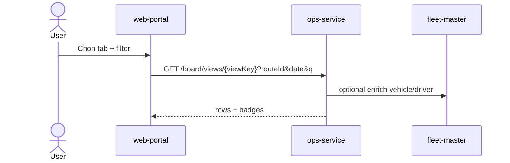
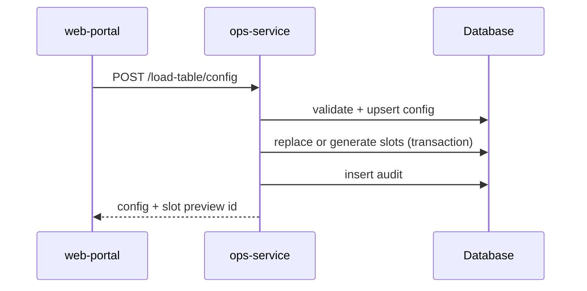
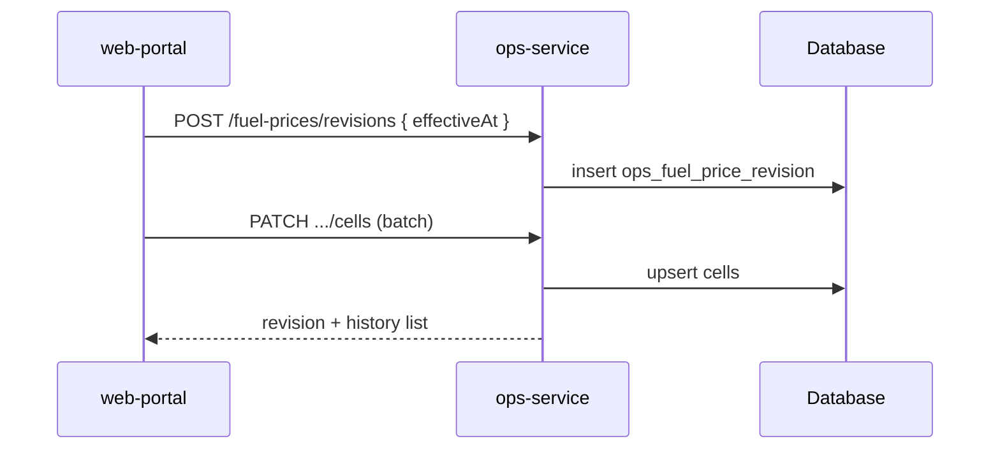
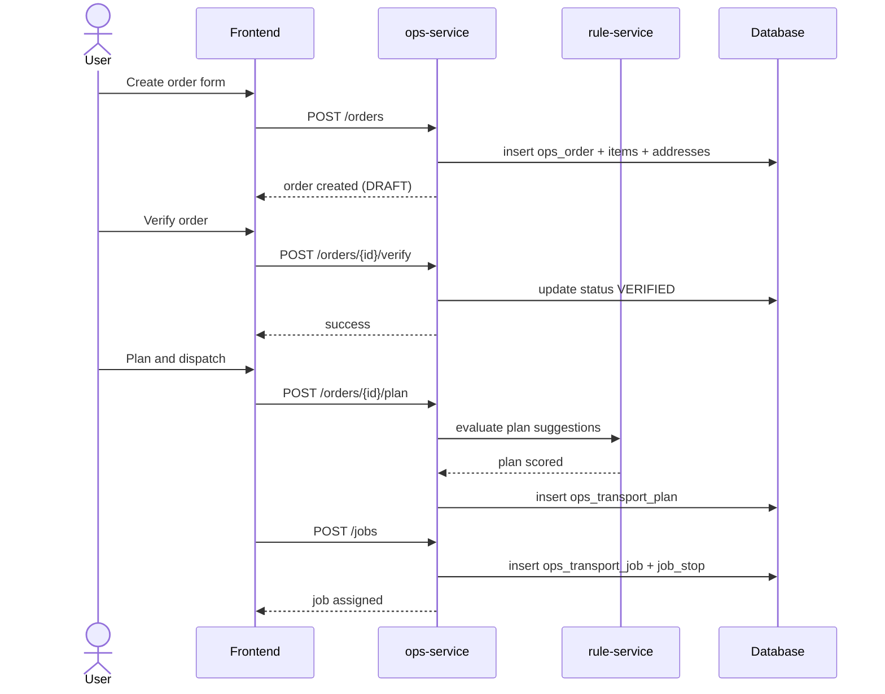

# TechSpec — XeVN Operations Module

| Thuộc tính | Giá trị |
|---|---|
| Sản phẩm | XeVN Operations Module |
| Phiên bản | 1.2 |
| Căn cứ | `docs/BRD_XEVN_OPERATIONS_MODULE.md`, `docs/SRS_XEVN_OPERATIONS_MODULE.md` (v1.6), `UI-STYLE-GUIDE.md` |
| Mục tiêu | Đặc tả kỹ thuật triển khai **baseline UI vận hành** (đến Thiết lập giá nhiên liệu) trong hệ sinh thái hiện tại |

---

## 1. Kiến trúc tổng thể

### 1.1 Phạm vi triển khai (baseline vs mở rộng)

**Baseline (MVP giao diện + API theo SRS v1.6):** Bảng tải; thiết lập bảng tải/băng tải; thiết lập tuyến & điểm đón trả; tài khoản NV (wrapper IAM); phân quyền trong module; nhật ký; lệnh điều xe (tăng cường, tour); lịch & bảng công lái; BDSC + VSNT; **giá nhiên liệu**.

**Ngoài baseline:** Module **Quản lý khách hàng** và mọi màn mockup thuộc luồng đó; **định mức NL theo xe** nếu tách khỏi baseline đã chốt. Luồng **đơn hàng hóa — kho — POD — vendor — SLA** trong BRD = **phase 2** (xem Phụ lục B).

### 1.2 Bối cảnh hệ sinh thái

- **Frontend:** `apps/web-portal` — workspace **Command Center** (rail + `WorkspaceLayout` / `UnifiedShellPage`), không tách SPA vận hành trừ khi có quyết định kiến trúc mới.
- **UI kit:** `@xevn/ui` + token CSS (`xevn-primary`, `xevn-surface`, …) theo `UI-STYLE-GUIDE.md`.
- **Backend (đề xuất):** một **`ops-service`** (modular monolith) hoặc tách nhỏ sau khi có tải; baseline expose REST dưới `/api/v1/ops/...`.
- **Platform:** SSO/IAM, `org_id` scope, `sys_audit_log`, master data xe/lái (fleet) — đồng bộ hoặc read-through.

### 1.2.1 Danh mục: Web Portal gán — `ops-service` tải + dữ liệu riêng vận hành

**Căn cứ nghiệp vụ:** `docs/BRD_XEVN_OPERATIONS_MODULE.md` §3.1.1 và `docs/SRS_XEVN_OPERATIONS_MODULE.md` §1.2.1 (cùng nguyên tắc với HRM và mọi phân hệ vệ tinh).

| Lớp | Trách nhiệm | Ghi chú triển khai |
|---|---|---|
| **Web Portal (cấu hình gán)** | Định nghĩa *danh mục dùng chung nào* áp cho *phân hệ Vận hành* và cho *đối tượng* nào (theo tenant / `org_id`) | Contract cấu hình hoặc API đọc “catalog assignment” do nền tảng cung cấp — **không** hard-code danh mục tập đoàn trong riêng `ops-service` nếu đã thuộc phạm vi Portal. |
| **`ops-service` (tiêu thụ)** | Tại runtime, **tải** snapshot / tham chiếu danh mục đã gán (cache theo phiên bản hoặc ETag nếu có); dùng cho dropdown, validate FK, báo cáo | Đọc qua service MDM / contract đã thống nhất với Portal; filter theo `org_id`. |
| **Vận hành (riêng module)** | Bảng / thực thể **chỉ thuộc nghiệp vụ vận hành** (bảng tải, slot, lịch sử băng tải, phiếu BDSC, …) vẫn do `ops-service` sở hữu | Không dùng để **thay thế** danh mục đã do Portal gán (ví dụ không tạo “tuyến chuẩn” song song với master Portal nếu đã gán cho Ops). |

**Kiểm thử kỹ thuật tối thiểu:** case *thay đổi gán danh mục trên Portal* → UI Ops nhận đúng tập giá trị mới trong phạm vi SLA đã chốt; case *dữ liệu riêng Ops* vẫn hoạt động và không ghi đè master Portal.

### 1.3 Nguyên tắc

- API-first; mutation quan trọng + thay đổi cấu hình → audit.
- Bảng lớn: server-side pagination, filter query params, index theo `(org_id, …)`.
- Deny-by-default RBAC; permission granular theo SRS §10.

---

## 2. Frontend — `web-portal`

### 2.1 Cấu trúc module (gợi ý)

```
apps/web-portal/src/
  pages/command-center/
    ops/
      OpsModuleLayout.tsx      // PageHeader + Tabs hoặc outlet
      routes.tsx               // lazy children
      board/OpsBoardPage.tsx
      load-table/...
      conveyor/...
      settings/routes/...
      settings/stops/...
      settings/accounts/...
      settings/permissions/...
      settings/audit-log/...
      dispatch/...
      driver-schedule/...
      maintenance/...
      fuel-prices/...
```

Đăng ký route dưới prefix thống nhất portal (ví dụ `/command-center/ops/*` hoặc `/ops/*` tùy `App.tsx` hiện tại).

### 2.2 Component mapping (SRS → @xevn/ui)

| Pattern mockup | Component / pattern |
|---|---|
| Khung trang | `PageHeader` (title + actions), `Section` |
| Bảng có lọc | `DataTable` + collapsible filter row |
| Tab cấp 1 | `Tabs` / segmented control đồng bộ URL (`?tab=`) |
| Trạng thái | `Badge` (neutral / success / warning / danger) |
| Form dài | `Card` nhóm field; `InfoBanner` cho cảnh báo nghiệp vụ |
| Chi tiết / chỉnh sửa | Dialog/modal portal; nút Huỷ = secondary outline |
| Empty / loading | `EmptyState`, `Skeleton` |
| Ma trận giá NL | Grid custom trên `Card` + input số; sticky header cột hàng |

### 2.3 Trạng thái & điều hướng

- Giữ **workspace rail** hiện có; mục “Vận hành” trỏ tới `OpsModuleLayout`.
- Deep link: mỗi sub-tab có route riêng (SEO/debug) thay vì chỉ state nội bộ.

---

## 3. Service boundaries

### 3.1 Baseline — module trong `ops-service`

| Module | Trách nhiệm |
|---|---|
| `ops-board` | Aggregate bảng tải (đọc snapshot / join fleet + lịch) |
| `ops-load` | Cấu hình bảng tải, slot; lịch sử băng tải thủ công |
| `ops-route` | CRUD tuyến, leg, stop động |
| `ops-stop` | CRUD điểm đón trả |
| `ops-dispatch` | Lệnh tăng cường, tour |
| `ops-attendance` | Tổng hợp lịch lái, timesheet, mã ngày |
| `ops-maintenance` | BDSC + VSNT |
| `ops-fuel` | Revision giá NL + cell theo vùng/loại |
| `ops-audit` | Ghi/đọc nhật ký cấu hình (có thể delegate `sys_audit_log`) |

**IAM:** `ops-accounts` UI gọi API IAM/Org; `ops-service` chỉ lưu `external_user_id` / mapping nếu cần.

### 3.2 Phase 2 — tách service (Phụ lục B)

Giữ nguyên định hướng `ops-order-service`, `ops-job-service`, `ops-warehouse-service`, … như BRD/TechSpec 1.0; triển khai khi có UI booking/kho.

---

## 4. Logical data model — baseline

### 4.1 Bảng mới (rút gọn DDL ý niệm)

```sql
-- ops_route, ops_route_leg, ops_route_stop (hierarchy tuyến)
-- ops_pickup_point (FK route optional, địa bàn, point_type, pickup_mode, contacts jsonb)
-- ops_load_table_config, ops_load_table_slot
-- ops_conveyor_manual_history
-- ops_dispatch_reinforcement
-- ops_tour_order, ops_tour_pickup (điểm đón động)
-- ops_driver_timesheet, ops_driver_timesheet_day
-- ops_maintenance_schedule, ops_maintenance_job
-- ops_deep_clean_schedule (+ job nếu tách)
-- ops_fuel_price_revision, ops_fuel_price_cell
-- ops_vehicle_ops_snapshot, ops_driver_ops_snapshot (optional materialized)
```

Quy ước: mọi bảng có `org_id`, `created_at`, `created_by`, `updated_at`, `updated_by` (trừ bảng read-only snapshot do job refresh).

### 4.2 Khóa & index gợi ý

- `ops_fuel_price_cell`: `unique(revision_id, region_id, fuel_type)`.
- `ops_load_table_slot`: `index(org_id, route_id, slot_start)`.
- `ops_dispatch_reinforcement`: `index(org_id, vehicle_id, from_at, to_at)` phục vụ conflict check.

---

## 5. API design — baseline

### 5.1 Quy ước

- Base: `/api/v1/ops`.
- Headers: `Authorization`, `X-Org-Id`, `X-Request-Id`.
- Envelope JSON thống nhất (giữ như v1.0).

### 5.2 Endpoint chính

| Method | Path | Mô tả |
|---|---|---|
| GET | `/board/views/{viewKey}` | Bảng tải theo tab |
| GET/POST | `/load-table/config` | Cấu hình bảng tải |
| GET | `/load-table/slots` | Preview/query slot |
| GET/POST/PATCH | `/conveyor/history` | Lịch sử băng tải thủ công |
| CRUD | `/routes`, `/routes/{id}/legs`, `/routes/{id}/stops` | Tuyến |
| CRUD | `/pickup-points` | Điểm đón trả |
| POST | `/dispatch/reinforcement` | Xe tăng cường |
| POST | `/dispatch/tour` | Xe đi tour (+ pickups[]) |
| GET | `/driver-schedule/summary` | Tổng hợp theo tuyến/ngày |
| GET | `/driver-schedule/timesheet` | Bảng công tháng |
| GET | `/driver-schedule/timesheet/{id}/days/{date}` | Chi tiết chấm công (modal) |
| CRUD | `/maintenance/schedules`, `/maintenance/jobs` | BDSC |
| CRUD | `/deep-clean/schedules` | VSNT |
| GET/POST | `/fuel-prices/revisions` | Phiên bản giá |
| GET/PATCH | `/fuel-prices/revisions/{id}/cells` | Ma trận cell |
| GET | `/audit/config-events` | Nhật ký thiết lập (filter) |

**Lỗi nghiệp vụ gợi ý:** `DISPATCH_SCHEDULE_CONFLICT`, `FUEL_REVISION_OVERLAP`, `ROUTE_STOP_INVALID_SEQ`, `LOAD_TABLE_INVALID_WINDOW`.

---

## 6. Sequence flows (Mermaid)

### 6.1 Đọc bảng tải



### 6.2 Lưu cấu hình bảng tải



### 6.3 Tạo revision giá nhiên liệu



---

## 7. Validation matrix — baseline (bổ sung)

| Field / rule | Error code |
|---|---|
| Slot không nằm trong khung giờ tuyến | `LOAD_TABLE_INVALID_WINDOW` |
| Tăng cường trùng lịch xe/lái | `DISPATCH_SCHEDULE_CONFLICT` |
| Tour thiếu KH hoặc khung giờ | `TOUR_ORDER_INVALID` |
| Giá NL ≤ 0 | `FUEL_PRICE_INVALID` |
| Hai revision active cùng vùng (theo policy) | `FUEL_REVISION_OVERLAP` |

---

## 8. RBAC & scope

- Role: `OPS_DISPATCHER`, `OPS_ADMIN`, `OPS_VIEWER` (+ mở rộng sau).
- Permission ví dụ: `ops.board.read`, `ops.load.write`, `ops.route.write`, `ops.dispatch.write`, `ops.fuel.write`, `ops.account.reveal_secret` (chỉ admin).
- Query: luôn `WHERE org_id = :org`.

---

## 9. Events (baseline)

- `ops.load_table.updated`
- `ops.route.updated`
- `ops.pickup_point.updated`
- `ops.dispatch.reinforcement.created`
- `ops.dispatch.tour.created`
- `ops.fuel_price.revision.published`

Publish qua outbox nếu downstream (BI, notification) cần.

---

## 10. NFR

| Nhóm | Chỉ tiêu |
|---|---|
| Performance | GET board p95 < 400ms với page size chuẩn; batch fuel cells < 800ms |
| Observability | TraceId per request; metric counter theo endpoint |
| Security | Không trả credential IAM ra API trừ khi permission explicit + audit |

---

## 11. Rollout & test

1. Schema baseline + read APIs board/routes.
2. Write paths load-table, dispatch, fuel.
3. Maintenance + attendance.
4. E2E theo **screen inventory** SRS §3 (ưu tiên happy path + conflict + audit).

---

## 12. Truy vết SRS (18 UC, khớp §3/§5) → TechSpec

| SRS | API / module |
|---|---|
| UC-OPS-BRD-01 | `GET /board/views/{viewKey}` → `ops-board` |
| UC-OPS-LOD-01 | `POST /load-table/config` → `ops-load` |
| UC-OPS-CNV-01 | `/conveyor/history` → `ops-load` |
| UC-OPS-RTE-01 | `/routes*` → `ops-route` |
| UC-OPS-STP-011 | `POST` / `PUT /pickup-points` → `ops-stop` |
| UC-OPS-STP-012 | `GET /pickup-points` (lọc, phân trang) → `ops-stop` |
| UC-OPS-STP-013 | `GET` / `PUT` / `DELETE /pickup-points/{id}` → `ops-stop` |
| UC-OPS-ACC-01 | IAM API + portal form (không lưu password plain) |
| UC-OPS-RBAC-01 | RBAC API / ma trận quyền portal |
| UC-OPS-AUD-01 | `GET /audit/config-events` → `ops-audit` / `sys_audit_log` |
| UC-OPS-DSP-01 | `POST /dispatch/reinforcement` → `ops-dispatch` |
| UC-OPS-DSP-02 | `POST /dispatch/tour` → `ops-dispatch` |
| UC-OPS-ATT-040 | `GET /driver-schedule/summary` → `ops-attendance` |
| UC-OPS-ATT-041 | `GET /driver-schedule/timesheet` + chi tiết ngày → `ops-attendance` |
| UC-OPS-MNT-050 | `GET /maintenance/schedules` + `GET /maintenance/jobs` → `ops-maintenance` |
| UC-OPS-MNT-051 | `GET` / `PATCH /maintenance/jobs/{id}` → `ops-maintenance` |
| UC-OPS-CLN-01 | `/deep-clean/*` → `ops-maintenance` |
| UC-OPS-FUL-01 | `/fuel-prices/*` → `ops-fuel` |

---

## Phụ lục A — TechSpec v1.0 (luồng hàng hóa / kho / driver POD)

Nội dung **đơn — verify — plan — job — warehouse — vendor — incident — SLA — close-shift** giữ nguyên làm **phase 2**. Tham chiếu bản lưu nội bộ hoặc khôi phục từ git history nếu cần diff đầy đủ; các bảng `ops_order`, `ops_transport_job`, `ops_pod`, … vẫn hợp lệ khi mở rộng và có thể **map** `ops_tour_order` → `ops_order` khi thống nhất domain.

### A.1 API mẫu phase 2 (tóm tắt)

- `POST /orders`, `POST /orders/{id}/verify`, `POST /orders/{id}/plan`
- `POST /jobs`, `POST /driver/jobs/{id}/accept`, `POST /driver/jobs/{id}/deliveries`
- `POST /warehouse/receipts`, `POST /vendor/requests`, `POST /incidents`, `POST /reports/close-shift`

### A.2 Sequence tạo đơn → lệnh (Mermaid)



---

## Phụ lục B — Service boundaries phase 2 (từ BRD)

| Service | Trách nhiệm |
|---|---|
| `ops-order-service` | Order lifecycle |
| `ops-planning-service` | Plan / capacity |
| `ops-job-service` | Job, trip, dispatch |
| `ops-warehouse-service` | Receipt, split, handover |
| `ops-driver-service` | Task, POD |
| `ops-vendor-service` | Vendor flow |
| `ops-incident-service` | Incident |
| `ops-sla-service` | SLA |
| `ops-report-service` | Close-shift snapshot |
