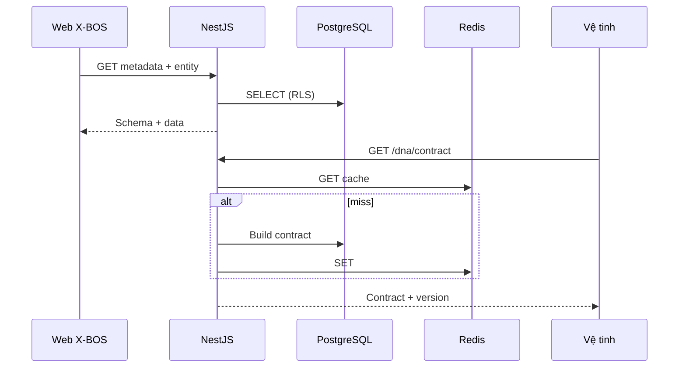

# Đặc tả Kỹ thuật (TechSpec)
## X-BOS Core — Dynamic Engine (Holding DNA)

| Thuộc tính | Giá trị |
|------------|---------|
| Phân hệ | X-BOS Core |
| Stack tham chiếu | PostgreSQL · Prisma · NestJS · Redis · React (Vite) · Tailwind |
| Phiên bản tài liệu | 1.0 |
| Căn cứ BRD | `docs/BRD_X_BOS_CORE_DYNAMIC.md` |

---

## 1. Nguyên tắc kiến trúc

- **Total Dynamic Engine:** Mọi thực thể có phần **chuẩn hóa quan hệ** và phần **mở rộng** qua metadata; không nhúng nghiệp vụ “cứng” vào schema bảng cho từng trường tùy biến.
- **Multi-tenant theo công ty:** Mọi bảng nghiệp vụ mang `tenant_id` (pháp nhân / công ty con); áp dụng **RLS** ở PostgreSQL + kiểm tra tầng ứng dụng.
- **Hợp đồng phiên bản:** API DNA Contract trả về kèm `schemaVersion` để vệ tinh cache và invalidate.

---

## 2. Kiến trúc cơ sở dữ liệu (PostgreSQL + Prisma)

### 2.1 Chiến lược Hybrid

| Thành phần | Cách lưu | Lý do |
|------------|----------|--------|
| Khóa nghiệp vụ, quan hệ, chỉ mục tra cứu | Cột typed (UUID, text, int, timestamptz) | JOIN, RLS, unique constraint rõ ràng |
| Giá trị thuộc tính động theo entity | `JSONB` (một cột trên bảng chính) **hoặc** bảng giá trị EAV tùy tải | Linh hoạt schema; truy vấn theo path GIN khi cần |

**Khuyến nghị triển khai:**  
- **OrgUnit:** cột chuẩn + `custom_attributes JSONB` (denormalized cho đọc nhanh).  
- **Metadata định nghĩa:** bảng quan hệ (`metadata_attribute`, `metadata_attribute_value` hoặc gộp theo mô hình dưới).  
- Đồng bộ: khi số lượng trường động lớn và cần audit từng giá trị, bổ sung bảng `metadata_value` chi tiết; giai đoạn 1 có thể chỉ dùng JSONB + trigger validate.

### 2.2 Organization — Self-reference (1 cha trực tiếp)

```sql
-- Ràng buộc: mỗi nút tối đa một cha trong cùng cây điều hành (application-enforced + partial unique index nếu cần)
CREATE TABLE org_unit (
  id              UUID PRIMARY KEY DEFAULT gen_random_uuid(),
  tenant_id       UUID NOT NULL REFERENCES tenant(id),
  parent_id       UUID REFERENCES org_unit(id) ON DELETE RESTRICT,
  org_type_code   TEXT NOT NULL,  -- holding | subsidiary | division | department | ...
  code            TEXT NOT NULL,
  name            TEXT NOT NULL,
  tax_code        TEXT,
  legal_rep       TEXT,
  address_json    JSONB,
  registered_capital NUMERIC(20,2),
  effective_from  TIMESTAMPTZ NOT NULL DEFAULT now(),
  effective_to    TIMESTAMPTZ,
  status          TEXT NOT NULL DEFAULT 'active',
  custom_attributes JSONB NOT NULL DEFAULT '{}',
  created_at      TIMESTAMPTZ NOT NULL DEFAULT now(),
  updated_at      TIMESTAMPTZ NOT NULL DEFAULT now(),
  UNIQUE (tenant_id, code)
);

CREATE INDEX idx_org_unit_tenant_parent ON org_unit(tenant_id, parent_id);
CREATE INDEX idx_org_unit_custom_gin ON org_unit USING GIN (custom_attributes jsonb_path_ops);
```

### 2.3 Metadata Engine (EAV cải tiến + JSONB)

**Định nghĩa thuộc tính động** (áp theo `entity_type` + phạm vi tenant tùy chọn):

```sql
CREATE TABLE metadata_attribute (
  id              UUID PRIMARY KEY DEFAULT gen_random_uuid(),
  tenant_id       UUID REFERENCES tenant(id), -- NULL = định nghĩa toàn tập đoàn
  entity_type     TEXT NOT NULL,   -- org_unit | category_item | ...
  key             TEXT NOT NULL,   -- snake_case, stable
  label           TEXT NOT NULL,
  data_type       TEXT NOT NULL,   -- text | number | date | boolean | select
  validation_json JSONB NOT NULL DEFAULT '{}', -- min, max, regex, required
  options_json    JSONB,           -- select: [{value, label}]
  sort_order      INT NOT NULL DEFAULT 0,
  is_active       BOOLEAN NOT NULL DEFAULT true,
  created_at      TIMESTAMPTZ NOT NULL DEFAULT now(),
  UNIQUE (COALESCE(tenant_id::text,'GLOBAL'), entity_type, key)
);
```

**Giá trị tách bảng** (khi cần audit / query theo từng field):

```sql
CREATE TABLE metadata_value (
  id            UUID PRIMARY KEY DEFAULT gen_random_uuid(),
  tenant_id     UUID NOT NULL REFERENCES tenant(id),
  entity_type   TEXT NOT NULL,
  entity_id     UUID NOT NULL,
  attribute_id  UUID NOT NULL REFERENCES metadata_attribute(id),
  value_text    TEXT,
  value_num     NUMERIC,
  value_bool    BOOLEAN,
  value_date    TIMESTAMPTZ,
  value_json    JSONB,
  updated_at    TIMESTAMPTZ NOT NULL DEFAULT now(),
  UNIQUE (tenant_id, entity_type, entity_id, attribute_id)
);
```

**DNA Category (rút gọn):**

```sql
CREATE TABLE category_definition (
  id            UUID PRIMARY KEY DEFAULT gen_random_uuid(),
  tenant_scope  TEXT NOT NULL, -- GROUP | TENANT
  tenant_id     UUID REFERENCES tenant(id),
  code          TEXT NOT NULL,
  name          TEXT NOT NULL,
  schema_version INT NOT NULL DEFAULT 1,
  published_at  TIMESTAMPTZ,
  UNIQUE (tenant_scope, COALESCE(tenant_id::text,''), code)
);

CREATE TABLE category_item (
  id              UUID PRIMARY KEY DEFAULT gen_random_uuid(),
  category_id     UUID NOT NULL REFERENCES category_definition(id),
  tenant_id       UUID NOT NULL REFERENCES tenant(id),
  code            TEXT NOT NULL,
  label           TEXT NOT NULL,
  payload_json    JSONB NOT NULL DEFAULT '{}',
  is_active       BOOLEAN NOT NULL DEFAULT true,
  sort_order      INT NOT NULL DEFAULT 0,
  UNIQUE (category_id, tenant_id, code)
);
```

### 2.4 Prisma Schema (mẫu trích)

```prisma
model OrgUnit {
  id                 String   @id @default(dbgenerated("gen_random_uuid()")) @db.Uuid
  tenantId           String   @map("tenant_id") @db.Uuid
  parentId           String?  @map("parent_id") @db.Uuid
  parent             OrgUnit? @relation("OrgTree", fields: [parentId], references: [id])
  children           OrgUnit[] @relation("OrgTree")
  orgTypeCode        String   @map("org_type_code")
  code               String
  name               String
  taxCode            String?  @map("tax_code")
  customAttributes   Json     @default("{}") @map("custom_attributes") @db.JsonB
  // ... các trường chuẩn khác

  @@unique([tenantId, code])
  @@map("org_unit")
}
```

Map bảng `metadata_attribute` / `metadata_value` tương tự; dùng `@db.JsonB` cho các cột JSON.

### 2.5 Row-Level Security (RLS)

Ví dụ policy (mẫu — tên role session do app set sau JWT):

```sql
ALTER TABLE org_unit ENABLE ROW LEVEL SECURITY;

CREATE POLICY org_unit_tenant_isolation ON org_unit
  USING (tenant_id = current_setting('app.tenant_id', true)::uuid);
```

Ứng dụng NestJS: interceptor set `SET LOCAL app.tenant_id = '...'` mỗi transaction (hoặc dùng connection pool theo tenant — cân nhắc quy mô).

---

## 3. API (NestJS)

### 3.1 Quy ước chung

- Prefix: `/api/v1/xbos/...`
- Header: `Authorization: Bearer <JWT>`, `X-Tenant-Id` (nếu không gắn trong token).
- Response lỗi: `{ "code", "message", "details" }`.

### 3.2 Tree-view — Recursive CTE

**GET** `/org-units/tree?tenantId=&rootId=&depth=`

**SQL lõi (mẫu):**

```sql
WITH RECURSIVE t AS (
  SELECT o.*, 1 AS depth, ARRAY[o.id] AS path
  FROM org_unit o
  WHERE o.tenant_id = $1 AND o.parent_id IS NULL
  UNION ALL
  SELECT o.*, t.depth + 1, t.path || o.id
  FROM org_unit o
  JOIN t ON o.parent_id = t.id
  WHERE o.tenant_id = $1 AND t.depth < $2
)
SELECT * FROM t ORDER BY path;
```

Trả JSON cây (nested) bằng cách build trong service hoặc dùng một query materialized path (`ltree` extension nếu bật).

### 3.3 Bulk Upsert — Spreadsheet

**POST** `/category-items/bulk-upsert`

**Body (mẫu):**

```json
{
  "categoryCode": "VEHICLE_TYPE",
  "tenantId": "uuid",
  "rows": [
    { "code": "VT-01", "label": "Xe tải nhẹ", "payload": { "maxLoadTon": 1.5 } },
    { "code": "VT-02", "label": "Xe container", "payload": { "maxLoadTon": 30 } }
  ],
  "options": { "skipDuplicates": false, "continueOnError": true }
}
```

**Hành vi:** transaction một lần; validate từng dòng theo `metadata_attribute` của `category_item`; trả `{ "success": n, "failed": [...] }`.

Tương tự endpoint **POST** `/org-units/bulk-upsert` cho nhập khối đơn vị (ít gặp hơn, có thể giai đoạn 2).

### 3.4 DNA Contract — Metadata Injection

**GET** `/dna/contract?modules=HRM,TRSPORT&tenantId=`

**Response (mẫu):**

```json
{
  "schemaVersion": 17,
  "generatedAt": "2026-03-25T10:00:00Z",
  "categories": [
    {
      "code": "HRM_POSITION",
      "itemsHref": "/api/v1/xbos/categories/HRM_POSITION/items?tenantId=..."
    }
  ],
  "orgSchema": {
    "entityType": "org_unit",
    "attributes": [
      { "key": "headcount_plan", "dataType": "number", "validation": { "min": 0 } }
    ]
  }
}
```

Vệ tinh **không** hard-code danh sách; chỉ cache theo `schemaVersion` + ETag.

---

## 4. Frontend (React / Vite + Tailwind)

### 4.1 Dynamic Form Renderer

1. Gọi `GET /metadata/attributes?entityType=org_unit&tenantId=`.
2. Map `data_type` → component: `text` → `<Input />`, `date` → `<DatePicker />`, `select` → `<Select options={options_json} />`.
3. Merge giá trị: ưu tiên `metadata_value` / API chi tiết; fallback đọc `custom_attributes` trên entity.
4. Submit: `PATCH /org-units/:id` với payload `{ standardFields..., customAttributes: { ... } }` hoặc ghi từng `metadata_value` tùy chính sách.

### 4.2 In-place Creation (Drawer)

- Form chính giữ state trong store (Zustand/React Query cache) — **không unmount** khi mở Drawer.
- Drawer gọi API tạo `category_item` nhanh; onSuccess: **invalidate query** key của select liên quan + `setValue` field hiện tại.
- Khóa scroll body khi Drawer mở; `focus trap` cho a11y.

### 4.3 Org Chart — React Flow

- Node = `OrgUnit`; edge = quan hệ cha–con hiện tại.
- **Drag & drop:** on drop node B lên node A → gọi `PATCH /org-units/:id { parentId: A }` với kiểm tra cycle server-side.
- Tối ưu: virtualize khi số nút lớn; lazy load cây con.

---

## 5. Bảo mật & hiệu năng

### 5.1 Tenant isolation

- JWT chứa `tenant_id` (hoặc danh sách được phép); middleware NestJS từ chối mismatch với `X-Tenant-Id`.
- RLS bắt buộc cho bảng chứa PII / dữ liệu đơn vị.

### 5.2 Redis — cache DNA

| Key | TTL | Nội dung |
|-----|-----|----------|
| `dna:contract:{tenant}:{schemaVersion}` | 5–15 phút | Payload JSON contract đã dựng |
| `cat:{categoryCode}:{tenant}:items` | 1–5 phút | Danh sách item (hoặc chỉ etag) |

Invalidation: khi publish `category_definition` hoặc thay `metadata_attribute` → bump `schemaVersion` + pub/sub channel `dna:invalidate`.

---

## 6. Sơ đồ luồng dữ liệu (tổng quan)



---

## 7. Kiểm thử gợi ý

- Unit: validate JSON schema custom field; phát hiện cycle khi đổi `parent_id`.
- Integration: RLS — user tenant A không đọc được org tenant B.
- Load: bulk-upsert 5k dòng category trong một transaction (giới hạn batch có thể chia lô 500).

---

*Tài liệu này là baseline triển khai; migration cụ thể, index bổ sung và mở rộng KPI/Policy engine được bổ sung ở sprint tương ứng.*
