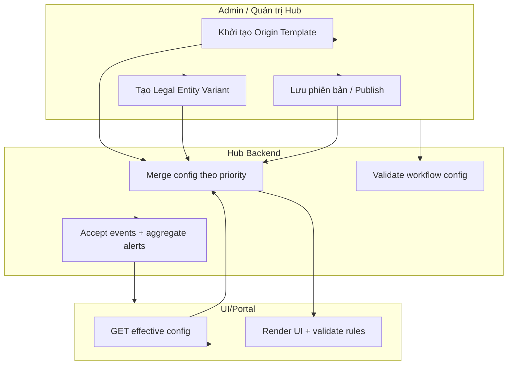

# TechSpec — XeVN OS Master Configuration, Workflow & Alert

| Thuộc tính | Giá trị |
|---|---|
| Loại tài liệu | TechSpec |
| Phiên bản | 1.1 (Full Contract) |
| Ngày cập nhật | 2026-03-30 |
| Phạm vi | Framework cấu hình theo Origin/Variant, Workflow engine theo step-role + transition gating, Alert aggregation hội tụ Hot Point + contract tích hợp các phần đã chốt trong SRS |

---

## 1. Purpose

Thiết kế kỹ thuật mức cao để:
- Cấu hình **Origin Template** trên `Portal (X-BOS Unified Portal)` và biến thể theo **đơn vị thành viên**.
- Tính **effective config** để render UI và validate dữ liệu runtime, tránh lệch schema theo từng phân hệ.
- Thực thi **Workflow engine**: step gắn `handlerRoleId`, transition theo `kind`, và **khóa nghiệp vụ** theo thẩm quyền (ví dụ: vai trò không được cấu hình “Từ chối”).
- Gom sự kiện vi phạm/cảnh báo từ vệ tinh về Hub để hiển thị **Hot Point Alert**.

Lưu ý: Không thay đổi UI/UX hiện tại. UI dùng prototype sẽ gọi API và áp dụng nghiệp vụ từ backend.

---

## 1.1 Scope & chống trùng lặp với SRS

TechSpec này tập trung vào **DB schema + API contract** cho các framework cốt lõi:
- Origin/Variant + effective config merge
- Workflow definition/instance + transition gating theo quyền role step
- Alert ingestion + Hot Point aggregation

Các phần **business logic nghiệp vụ chi tiết** đã có trong SRS sẽ được **tham chiếu** thay vì copy lại:
- `SRS_X_BOS_COMMAND_CENTER_WORKFLOW_DEFINITION.md`
- `SRS_X_BOS_GLOBAL_POLICY_INCENTIVE_ENGINE.md`
- `SRS_X_BOS_UNIFIED_PORTAL_COMMAND_CENTER.md`
- `SRS_X_BOS_CASCADING_ALLOCATION.md`
- `SRS_X_BOS_RACI_ROLE_CATALOG_AND_PERMISSIONS.md`
- `SRS_X_BOS_CORE.md` (TechSpec `TechSpec_X_BOS_CORE.md` có phần DB/API nền tảng)

Nguyên tắc: TechSpec chỉ nêu những contract cần để BE/DB triển khai chạy được, còn validation rule/error semantics bám SRS.

## 2. Usecases (các luồng chính)

### 2.1 Quản trị Origin/Variant
1. Admin Hub khai báo Origin Template theo phân hệ/domain (schema + contract fields + options sourcing).
2. Admin tạo Legal Entity Variant (kế thừa + override).
3. Hệ thống tính effective config theo priority: **Module Variant → Entity Variant → Global Origin**.

### 2.2 Render form theo effective config
1. UI gọi API lấy contract fields + options items theo scope.
2. UI render input/select và validate theo `validationRules`.

### 2.3 Workflow: định nghĩa, wire transition, và gating theo role
1. Quản trị cấu hình workflow definition: steps + transitions.
2. Backend validate:
   - `handlerRoleId` tồn tại trong danh mục role step.
   - Transition “reject” chỉ cho phép khi `workflowHandlerRoleAllowsRejectOutcome(handlerRoleId)=true`.
3. Khi vận hành: instance cập nhật transition theo step outcome.

### 2.4 Alert aggregation hội tụ Hot Point
1. Vệ tinh phát `violation event` (moduleCode/ruleId/severity/entityRef).
2. Hub aggregator dedupe + xếp hạng theo SLA/ngưỡng.
3. Cockpit đọc `hot_points` để hiển thị.

---

## 3. Activity Diagram (Mermaid)



---

## 4. Database Schema (PostgreSQL)

### 4.1 Tổ chức scope (tham chiếu)
> Giả định có sẵn org engine: `tenants`, `legal_entities`, `org_units`. Nếu chưa có, module config dùng tối thiểu `tenant_id`, `legal_entity_id` để phân tách.

### 4.2 Cấu hình Origin/Variant & Field Contracts

#### Table: `config_origins`
| Field | Type | Notes |
|---|---|---|
| id | uuid (PK) |  |
| tenant_id | uuid (FK) |  |
| module_code | text | ví dụ `HRM`, `CRM`, `FNC_*` |
| origin_code | text | định danh template |
| version | int | monotonic |
| schema_json | jsonb | metadata contract root (các group/form) |
| status | text | `draft|published|deprecated` |
| valid_from | timestamptz |  |
| created_at | timestamptz |  |

Indexes:
- `(tenant_id, module_code, origin_code, version DESC)`

#### Table: `config_origin_fields`
| Field | Type | Notes |
|---|---|---|
| id | uuid (PK) |  |
| origin_id | uuid (FK)` |  |
| field_code | text | ổn định |
| label | text | hiển thị |
| data_type | text | `text|number|date|select|phone|email|...` |
| validation_rules | jsonb | required/min/max/pattern... |
| options_source | jsonb | trỏ category id + scope rules |
| display_rules | jsonb | readonly/hidden theo role+scope |
| sort_order | int |  |

Indexes:
- `(origin_id, field_code)`

#### Table: `config_variants`
| Field | Type | Notes |
|---|---|---|
| id | uuid (PK) |  |
| tenant_id | uuid |  |
| origin_id | uuid (FK) |  |
| legal_entity_id | uuid | scope theo đơn vị |
| variant_code | text | định danh biến thể |
| version | int | version của variant |
| status | text |  |
| diff_json | jsonb | override diff (items/options/displayRules...) |
| valid_from | timestamptz |  |
| created_at | timestamptz |  |

Indexes:
- `(tenant_id, legal_entity_id, origin_id, version DESC)`

#### Table: `config_categories`
| Field | Type | Notes |
|---|---|---|
| id | uuid (PK) |  |
| tenant_id | uuid |  |
| module_code | text |  |
| category_code | text | định danh category |
| category_type | text |  |
| schema_json | jsonb | rule validate cho item |
| created_at | timestamptz |  |

Indexes:
- `(tenant_id, module_code, category_code)`

#### Table: `config_category_items`
| Field | Type | Notes |
|---|---|---|
| id | uuid (PK) |  |
| tenant_id | uuid |  |
| category_id | uuid (FK) |  |
| legal_entity_id | uuid NULL | NULL = global origin items |
| item_code | text | ổn định |
| label | text |  |
| is_active | boolean |  |
| sort_order | int |  |

Indexes:
- `(tenant_id, category_id, legal_entity_id, is_active)`

### 4.3 Workflow Engine (Definition + Instance + Transition Gating)

#### Table: `workflow_definitions`
| Field | Type |
|---|---|
| id (PK) | uuid |
| tenant_id | uuid |
| definition_code | text |
| name | text |
| applying_entity_id | uuid NULL |
| trigger_event | text |
| total_sla_hours | int |
| status | text |
| version | int |
| created_at | timestamptz |

Indexes:
- `(tenant_id, trigger_event)`

#### Table: `workflow_steps`
| Field | Type | Notes |
|---|---|---|
| id (PK) | uuid |  |
| workflow_definition_id | uuid (FK) |  |
| step_order | int | unique per definition |
| task_name | text |
| handler_role_id | text | tham chiếu danh mục roles step |
| step_action | text | approve/sign/input |
| sla_hours | int |
| related_module_id | text |

Indexes:
- `(workflow_definition_id, step_order)`

#### Table: `workflow_transitions`
| Field | Type | Notes |
|---|---|---|
| id (PK) | uuid |  |
| workflow_step_id | uuid (FK) |
| kind | text | `approve|reject|exception` |
| destination_id | text | stepId hoặc terminal id |

Constraints:
- unique `(workflow_step_id, kind)`

#### Table: `workflow_handler_roles`
| Field | Type | Notes |
|---|---|---|
| role_id (PK) | text | ví dụ `staff`, `raci_kho_phan_phoi` |
| label | text |
| allows_reject_outcome | boolean |
| raci_org_column_id | text NULL |
| created_at | timestamptz |

#### Table: `workflow_instances`
| Field | Type |
|---|---|
| id | uuid PK |
| tenant_id | uuid |
| definition_id | uuid |
| entity_ref_json | jsonb | tham chiếu hồ sơ/vòng đời |
| current_step_id | uuid |
| status | text | `running|completed|rejected|terminated` |
| created_at | timestamptz |

#### Table: `workflow_instance_transitions`
| Field | Type |
|---|---|
| id | uuid PK |
| instance_id | uuid FK |
| from_step_id | uuid |
| kind | text |
| destination_id | text |
| acted_by_user_id | uuid |
| acted_at | timestamptz |
| evidence_json | jsonb NULL |
| comment | text NULL |

### 4.4 Alert Aggregation (Hot Point)

#### Table: `alert_events`
| Field | Type |
|---|---|
| id | uuid PK |
| tenant_id | uuid |
| module_code | text |
| rule_id | text |
| severity | text | `low|medium|high|critical` |
| occurred_at | timestamptz |
| entity_ref_json | jsonb |
| metric_snapshot_json | jsonb |
| correlation_id | text |
| created_at | timestamptz |

Indexes:
- `(tenant_id, module_code, rule_id, occurred_at DESC)`
- unique constraint `(tenant_id, correlation_id)` nếu có correlation chuẩn.

#### Table: `hot_points`
| Field | Type |
|---|---|
| id | uuid PK |
| tenant_id | uuid |
| hot_point_key | text | dedupe key |
| summary | text |
| severity | text |
| ranking | numeric |
| status | text | `open|ack|resolved` |
| created_at | timestamptz |
| updated_at | timestamptz |

#### Table: `hot_point_items`
| Field | Type |
|---|---|
| id | uuid PK |
| hot_point_id | uuid FK |
| alert_event_id | uuid FK |
| severity | text |
| occurred_at | timestamptz |

---

## 4.5 Unified Portal Aggregate Contract (SRS_X_BOS_UNIFIED_PORTAL_COMMAND_CENTER.md)

> SRS đã chốt business logic “Map → Filter theo Data Scope → Dedupe → Đếm/hiển thị widget”.
> TechSpec này chỉ định nghĩa contract DB để Portal Engine có dữ liệu chuẩn render.

### 4.5.1 Standardized UnifiedTask Projection

#### Table: `unified_tasks`
| Field | Type | Notes |
|---|---|---|
| id | uuid (PK) |  |
| tenant_id | uuid | RLS theo tenant |
| source_system | text | ví dụ `HRM`, `TRSPORT` |
| source_id | text | mã tham chiếu nguồn (entityRef) |
| dedupe_key | text | unique theo `(source_system, source_id)` hoặc do vệ tinh cung cấp |
| status_normalized | text | map từ trạng thái domain → tập trạng thái Portal |
| org_unit_id | uuid/string | tham chiếu nhánh org theo dữ liệu |
| assignee_user_id | uuid/null |  |
| due_at | timestamptz/null |  |
| priority | text | `low/medium/high` |
| title | text |  |
| description | text/null |  |
| payload_json | jsonb | phần mở rộng để deep-link/action |
| created_at | timestamptz |  |
| updated_at | timestamptz |  |

Indexes:
- unique `(tenant_id, dedupe_key)`
- `(tenant_id, status_normalized, due_at)`

### 4.5.2 KPI Sparkline Cache (widget nhanh)

#### Table: `portal_kpi_sparkline_cache`
| Field | Type | Notes |
|---|---|---|
| id | uuid (PK) |  |
| tenant_id | uuid |  |
| kpi_code | text |  |
| period_code | text |  |
| scope_type | text | `org|user|group` |
| scope_ref_json | jsonb | `org_unit_id` hoặc list ids |
| as_of | timestamptz |  |
| series_json | jsonb | mảng điểm (x,y) |
| created_at | timestamptz |  |

Indexes:
- `(tenant_id, kpi_code, period_code, scope_type, as_of DESC)`

### 4.5.3 Alert List Cache (widget cảnh báo)

#### Table: `portal_alert_list_cache`
| Field | Type | Notes |
|---|---|---|
| id | uuid (PK) |  |
| tenant_id | uuid |  |
| scope_type | text | `org|user|group` |
| scope_ref_json | jsonb | org_unitId/userId/group ids |
| as_of | timestamptz |  |
| hot_point_ids | jsonb | danh sách hot_point id |
| created_at | timestamptz |  |

Indexes:
- `(tenant_id, scope_type, as_of DESC)`

---

## 4.6 Global Policy & Incentive Engine Contract (SRS_X_BOS_GLOBAL_POLICY_INCENTIVE_ENGINE.md)

> SRS đã chốt inheritance, override theo Limit Zone, trigger logic (KPI/SATELLITE/SLA), progressive và exclusion, approval trước thi hành.
> TechSpec chỉ định nghĩa contract DB/API để truy vết version policy, evidence và trạng thái workflow thi hành.

### 4.6.1 Storage cho Policy Template & Version

#### Table: `gp_policy_templates`
| Field | Type | Notes |
|---|---|---|
| id | uuid (PK) |  |
| tenant_id | uuid |  |
| policy_code | text |  |
| policy_type | text | `incentive|penalty|mix` |
| title | text |  |
| created_at | timestamptz |  |

Indexes:
- `(tenant_id, policy_code)`

#### Table: `gp_policy_versions`
| Field | Type | Notes |
|---|---|---|
| id | uuid (PK) |  |
| template_id | uuid (FK) |  |
| tenant_id | uuid |  |
| version | int |  |
| status | text | `draft|pending_approval|active|inactive` |
| effective_from | timestamptz |  |
| effective_to | timestamptz/null |  |
| limit_zone_json | jsonb/null |  |
| trigger_config_json | jsonb |  |
| condition_logic_json | jsonb |  |
| incentive_penalty_values_json | jsonb |  |
| evidence_required | boolean |  |
| progressive_json | jsonb/null |  |
| exclusion_json | jsonb/null |  |
| created_at | timestamptz |  |

Indexes:
- `(tenant_id, template_id, status)`
- `(tenant_id, effective_from, effective_to)`

#### Table: `gp_policy_overrides`
| Field | Type | Notes |
|---|---|---|
| id | uuid (PK) |  |
| tenant_id | uuid |  |
| version_id | uuid (FK) |  |
| legal_entity_id | uuid |  |
| override_diff_json | jsonb |  |
| status | text |  |
| created_at | timestamptz |  |

### 4.6.2 Scanning, Candidates, Approval, Execution

#### Table: `gp_scan_runs`
| Field | Type | Notes |
|---|---|---|
| id | uuid (PK) |  |
| tenant_id | uuid |  |
| period_code | text |  |
| trigger_window_json | jsonb |  |
| policy_version_id | uuid (FK) |  |
| status | text | `queued|running|completed|failed` |
| started_at | timestamptz |  |
| completed_at | timestamptz/null |  |
| result_count | int |  |

Indexes:
- `(tenant_id, policy_version_id, status, started_at DESC)`

#### Table: `gp_candidates`
| Field | Type | Notes |
|---|---|---|
| id | uuid (PK) |  |
| tenant_id | uuid |  |
| scan_run_id | uuid (FK) |  |
| policy_version_id | uuid (FK) |  |
| subject_ref_json | jsonb | đối tượng áp dụng |
| snapshot_json | jsonb | metric/event/SLA snapshot |
| candidate_type | text | incentive|penalty |
| proposed_value | decimal |  |
| evidence_refs_json | jsonb/null |  |
| state | text | draft|needs_data|approved|excluded |
| created_at | timestamptz |  |

Indexes:
- `(tenant_id, scan_run_id, state)`

#### Table: `gp_approvals`
| Field | Type | Notes |
|---|---|---|
| id | uuid (PK) |  |
| tenant_id | uuid |  |
| scan_run_id | uuid (FK) |  |
| requested_by_user_id | uuid |  |
| approver_user_id | uuid/null |  |
| status | text | pending|approved|rejected |
| reviewed_items_json | jsonb |  |
| reviewed_at | timestamptz/null |  |

#### Table: `gp_executions`
| Field | Type | Notes |
|---|---|---|
| id | uuid (PK) |  |
| tenant_id | uuid |  |
| approval_id | uuid (FK) |  |
| execution_channel | text | notification|payroll |
| status | text |  |
| executed_at | timestamptz/null |  |
| execution_payload_json | jsonb |  |

---

## 4.7 KPI Waterfall -> Individual Allocation Contract (SRS_X_BOS_CASCADING_ALLOCATION.md)

> SRS đã chốt semantics thác nước, inheritance theo kỳ, logic điều chỉnh giữa kỳ, kiêm nhiệm và khóa dữ liệu Frozen.
> TechSpec chỉ định nghĩa DB contract lưu/duyệt/khóa và trace audit.

### 4.7.1 KPI Definition & Versions

#### Table: `kpi_definitions`
| Field | Type | Notes |
|---|---|---|
| id | uuid (PK) |  |
| tenant_id | uuid |  |
| kpi_code | text |  |
| title | text |  |
| unit | text |  |
| created_at | timestamptz |  |

#### Table: `kpi_versions`
| Field | Type | Notes |
|---|---|---|
| id | uuid (PK) |  |
| kpi_id | uuid (FK) |  |
| tenant_id | uuid |  |
| version | int |  |
| status | text | active|inactive |
| effective_from | timestamptz |  |
| effective_to | timestamptz/null |  |
| payload_json | jsonb | cấu trúc thác nước |

### 4.7.2 Allocation Header & Individual Lines

#### Table: `kpi_allocation_headers`
| Field | Type | Notes |
|---|---|---|
| id | uuid (PK) |  |
| tenant_id | uuid |  |
| kpi_version_id | uuid |  |
| period_code | text |  |
| org_unit_id | uuid | node tổ chức |
| state | text | Draft|Pending_Approval|Approved|Frozen |
| locked_at | timestamptz/null |  |
| frozen_reason | text/null |  |
| created_at | timestamptz |  |
| updated_at | timestamptz |  |

Indexes:
- `(tenant_id, kpi_version_id, period_code, org_unit_id)`

#### Table: `kpi_allocation_lines_individual`
| Field | Type | Notes |
|---|---|---|
| id | uuid (PK) |  |
| allocation_header_id | uuid (FK) |  |
| staff_id | uuid |  |
| parent_kpi_value | decimal/null |  |
| allocation_weight | decimal/null |  |
| impact_weight | decimal/null |  |
| target_value | decimal |  |
| job_role_code | text/null | kiêm nhiệm |
| workload_percent | decimal/null |  |
| effective_date | date/null |  |
| audit_before_json | jsonb/null |  |
| audit_after_json | jsonb/null |  |
| created_at | timestamptz |  |

#### Table: `kpi_allocation_audit_logs`
| Field | Type | Notes |
|---|---|---|
| id | uuid (PK) |  |
| tenant_id | uuid |  |
| allocation_header_id | uuid (FK) |  |
| actor_user_id | uuid |  |
| action | text | submit/approve/freeze/unfreeze |
| reason | text/null |  |
| created_at | timestamptz |  |

---

## 4.8 RACI Role Catalog & Workflow Trigger Event Catalog (SRS_X_BOS_RACI_ROLE_CATALOG_AND_PERMISSIONS.md + SRS_X_BOS_COMMAND_CENTER_WORKFLOW_DEFINITION.md)

> SRS mô tả role catalog RACI (cột chức danh → thẩm quyền nhánh Từ chối) và danh mục sự kiện kích hoạt (hiện tĩnh trong mã, về sau centralize).
> TechSpec chỉ định nghĩa contract lưu catalog này để Portal và Workflow Governance đồng bộ.

#### Table: `workflow_trigger_event_catalog`
| Field | Type | Notes |
|---|---|---|
| id | uuid (PK) |  |
| tenant_id | uuid |  |
| module_code | text | sở hữu event |
| event_code | text | mã sự kiện lưu trong definition |
| label | text | hiển thị |
| description | text/null |  |
| status | text | active/inactive |
| created_at | timestamptz |  |

Indexes:
- `(tenant_id, module_code, event_code)`

---

## 4.9 Infrastructure Config Contract (Origin/Variant/effective)

> Phần này bổ sung cho domain “Hạ tầng cơ sở” đúng bài toán nhiều công ty con có đặc thù khác nhau.
> Contract mô tả **field groups + field codes + options sourcing + validation**; UI có thể dùng trực tiếp hoặc map tạm theo layout prototype hiện tại.

### 4.9.1 Origin Template (Portal) — `infrastructure_origin`

**Blocks (khuyến nghị)**
- `block_general`: `name`, `siteCode`, `facilityType`, `operatingEntityId`, `status`
- `block_capacity`: `capacitySummary`, `areaSqm`, `palletOrVehicleMax`
- `block_location_contact`: `gpsCoords`, `addressDetail`, `hotline`, `directManager`
- `block_legal_lease`: `leaseLegalEndDate`, `ownerLegalEntityId`

**Field contract tối thiểu (mapping tới prototype UI hiện tại)**
- `siteCode` (text, required): regex theo chuẩn nội bộ (khuyến nghị `^[A-Z0-9._-]{3,32}$`)
- `name` (text, required): max 255
- `facilityType` (select, required):
  - `optionsSource.categoryCode = INFRA_FACILITY_TYPE`
  - `optionsSource.scope = legal_entity` (entity subset)
- `status` (select, required):
  - `optionsSource.categoryCode = INFRA_STATUS`
  - `optionsSource.scope = legal_entity` (entity subset)
- `operatingEntityId` (select, required):
  - options lấy từ `legal_entities` theo tenant scope (không phải category items)
- `gpsCoords` (text, optional): validation theo pattern `lat, lon` (khuyến nghị check đơn giản split bởi dấu phẩy)
- `addressDetail` (textarea/text, optional): break-words, không giới hạn cứng nhưng validate max length (ví dụ 4000)
- `hotline` (text, optional): regex lỏng theo số điện thoại/tách bởi khoảng trắng
- `directManager` (text, optional)
- `leaseLegalEndDate` (date, optional): `>= today-?` (không hard-code; validate nếu có)
- `ownerLegalEntityId` (select, optional)
- `areaSqm` (number, optional): `>= 0`
- `palletOrVehicleMax` (text/number, optional): theo cách định nghĩa của contract (prototype đang dùng text)
- `capacitySummary` (text, optional)

### 4.9.2 Legal Entity Variant — `infrastructure_variant`

Variant override cho `legal_entity_id = le-*` gồm:
- `visibilityRules` cho từng `block_*` và từng `fieldCode`:
  - `hidden`/`readonly`/`required`
- `optionsOverrides`:
  - `INFRA_FACILITY_TYPE`: subset allowed items
  - `INFRA_STATUS`: subset allowed items
- `validationOverrides` (nếu contract cho phép):
  - ngưỡng `areaSqm`, quy tắc bắt buộc GPS, … theo từng công ty
- `customAttributesAllowList` (tuỳ chọn):
  - cho phép thêm field mở rộng nhưng vẫn phải thuộc allowed schema contract

### 4.9.3 Effective Config Behavior khi render/edit site record

Khi user thao tác “Hạ tầng cơ sở” trong ngữ cảnh `legal_entity_id`:
1. BE trả `effective config` cho `moduleCode=infrastructure` (hoặc `categoryCode` tương ứng) theo `tenant + legal_entity_id + originCode`.
2. UI render block/field theo `visibilityRules`.
3. UI lấy options select theo `optionsSource` và effective config.
4. Khi lưu `InfrastructureSite`:
   - backend validate payload theo effective field contract
   - runtime record lưu `effectiveConfigVersion` để truy vết.

### 4.9.4 Notes triển khai với prototype UI hiện có

Prototype hiện tại đang hard-code danh sách facility/status. Khi BE/DB triển khai contract:
- bước 1: UI có thể chỉ cần thay `INFRA_FACILITY_OPTIONS/status` bằng gọi effective config (không đổi layout)
- bước 2 (sau): UI refactor để render theo block visibilityRules (đúng contract “dynamic by default”)

---

## 4.10 HR Metadata Config Contract (Origin/Variant/effective)

> Phần này chuẩn hóa “Hồ sơ nhân sự tập đoàn / company_group_hr” theo Origin/Variant/effective config.
> Prototype hiện tại đang lưu cấu hình HR metadata bằng cách upsert vào category `EMPLOYEE_METADATA_FIELD` theo từng `companyId`.

### 4.10.1 Origin Template (Portal) — `hr_employee_metadata_origin`

Origin Template định nghĩa:
- **Tập field contract** (metadata attributes) mà hệ thống cho phép khai báo.
- **Validation contract** theo `dataType`:
  - `text`: giới hạn độ dài (khuyến nghị)
  - `number`: parse được thành number (khuyến nghị min/max theo rule)
  - `date`: ISO date (YYYY-MM-DD)
  - `select`: bắt buộc có `selectConfig` (hoặc options reference)

**Gợi ý mapping prototype UI hiện có**
- Prototype đang dùng chính “dòng metadata” làm config đơn vị.
- Contract coi mỗi dòng là một `fieldDefinition`:
  - `fieldCode` (ổn định): ở prototype có thể tạm dùng `id` của dòng
  - `fieldName` (label)
  - `dataType`
  - `selectConfig` (inline config cho prototype)

### 4.10.2 Legal Entity Variant — `hr_employee_metadata_variant`

Variant override cho `legal_entity_id` gồm:
- `visibilityRules`: bật/tắt/required/readonly cho từng `fieldCode` (tương lai)
- `fieldOverrides`:
  - override `dataType`
  - override `selectConfig` (inline options) hoặc override reference đến category option sets
- `fieldAdditions` (tuỳ contract):
  - thêm field mới trong phạm vi allowed schema của Origin

### 4.10.3 Effective config cho HR Metadata

Khi admin thao tác “Cài đặt hệ thống -> Hồ sơ nhân sự tập đoàn” theo `companyId`:
1. BE lấy effective config `hr_employee_metadata_origin` theo `tenant + companyId`.
2. UI render list các metadata field theo effective config.
3. Khi lưu:
   - validate lại từng `fieldDefinition` theo validation contract.
   - ghi version/effectiveVersion để truy vết.

### 4.10.4 Notes triển khai với prototype UI hiện có

- Prototype đang coi category item payload chính là `fieldDefinition` (fieldName, dataType, selectConfig).
- Lần refactor tới effective config engine nên:
  - chuẩn hóa `fieldCode` thay vì tạm dùng `id/index`
  - tách “inline select options” thành `optionsSource` có thể lấy theo scope (global vs entity-specific)

---

## 5. API Design (Endpoint + Payload mẫu)

### 5.1 Effective config
#### `GET /config/effective?tenantId=...&moduleCode=...&legalEntityId=...&originCode=...`
Response:
```json
{
  "tenantId": "t-1",
  "moduleCode": "HRM",
  "legalEntityId": "le-001",
  "originCode": "hr_staff_profile",
  "effectiveVersion": {
    "originVersion": 5,
    "variantVersion": 3
  },
  "fields": [
    {
      "fieldCode": "staff_position",
      "label": "Chức danh",
      "dataType": "select",
      "validationRules": { "required": true },
      "options": [
        { "itemCode": "CEO", "label": "CEO" }
      ]
    }
  ]
}
```

### 5.2 Origin/Variant Admin
#### `POST /config/origins`
Payload:
```json
{
  "tenantId": "t-1",
  "moduleCode": "HRM",
  "originCode": "hr_staff_profile",
  "schemaJson": { "...": "..." },
  "fields": [
    {
      "fieldCode": "staff_position",
      "dataType": "select",
      "validationRules": { "required": true },
      "optionsSource": { "categoryCode": "staff_positions", "scope": "global" }
    }
  ]
}
```

#### `POST /config/variants`
Payload:
```json
{
  "tenantId": "t-1",
  "originId": "orgn-uuid",
  "legalEntityId": "le-001",
  "variantCode": "le001_override_v3",
  "diffJson": { "fields": { "staff_position": { "optionsSource": { "scope": "entity" } } } }
}
```

### 5.3 Workflow definition governance
#### `POST /governance/workflows`
Backend validate:
- tồn tại `workflow_handler_roles`.
- reject gating theo `allows_reject_outcome`.

### 5.4 Workflow runtime
#### `POST /governance/workflows/{definitionId}/start`
Payload:
```json
{
  "tenantId": "t-1",
  "definitionId": "wf-def-1",
  "entityRefJson": { "applicationId": "app-123" }
}
```

#### `POST /workflow-instances/{instanceId}/transition`
Payload:
```json
{
  "kind": "approve",
  "actedByUserId": "u-1",
  "destinationId": "ws-2",
  "evidenceJson": { "comment": "..." }
}
```

### 5.5 Unified Portal (Command Center) APIs

#### `GET /portal/rail?tenantId=&scope=...`
Trả về danh sách module/feature có quyền để render Rail menu theo dataScope.

#### `GET /portal/workspace?moduleCode=&asOf=...`
Response (contract tối thiểu):
```json
{
  "moduleCode": "hrm",
  "asOf": "2026-03-30T10:00:00Z",
  "taskCounter": { "countOpen": 12, "countPending": 3 },
  "kpiSparkline": { "kpiCode": "KPI_X", "series": [[0,1],[1,2]] },
  "alertList": [{ "hotPointKey": "hp-...", "severity": "high", "summary": "..." }],
  "actions": []
}
```

#### `POST /portal/unified-tasks/upsert`
Dành cho vệ tinh đẩy dữ liệu; backend chuẩn hóa sang `unified_tasks`.
Payload:
```json
{
  "tenantId": "t-1",
  "items": [
    {
      "sourceSystem": "HRM",
      "sourceId": "task-123",
      "dedupeKey": "HRM:task-123",
      "statusNormalized": "IN_PROGRESS",
      "orgUnitId": "org-001",
      "assigneeUserId": "u-12",
      "dueAt": "2026-03-31T00:00:00Z",
      "priority": "high",
      "title": "Trình duyệt ...",
      "payloadJson": { "deepLink": "/hrm/..." }
    }
  ]
}
```

### 5.6 Global Policy & Incentive APIs

#### `POST /gp/policies/templates`
Tạo policy template (global).

#### `POST /gp/policies/versions:publish`
Publish version policy (đặt status active/pending).

#### `POST /gp/policies/overrides`
Tạo override theo legal entity.

#### `POST /gp/scan-runs`
Chạy scanning theo kỳ:
```json
{ "tenantId": "t-1", "periodCode": "Q1-2026", "policyVersionId": "pv-1" }
```

#### `POST /gp/approvals/{approvalId}/review`
Payload:
```json
{ "tenantId": "t-1", "decision": "approve|reject|exclude", "items": [{ "candidateId": "c-1", "reason": "..." }] }
```

#### `POST /gp/executions`
Thi hành kết quả theo contract kênh (Notification/Payroll).

### 5.7 KPI Waterfall -> Individual APIs

#### `GET /kpi/allocations?periodCode=&orgUnitId=&kpiVersionId=`
Trả header + lines individual theo scope.

#### `POST /kpi/allocations/:id/check`
Chạy validation server-side theo contract (quota/unit/workload/frozen).

#### `POST /kpi/allocations/:id/submit`
Chuyển state `Draft -> Pending_Approval`.

#### `POST /kpi/allocations/:id/approve`
Chuyển state `Pending_Approval -> Approved`.

#### `POST /kpi/allocations/:id/freeze`
Chuyển state `Approved -> Frozen` kèm `frozenReason`.

#### `POST /kpi/allocations/:id/unfreeze`
Chỉ allowed cho role có quyền mở khóa.

### 5.8 RACI Role Catalog & Trigger Event Catalog APIs

#### `GET /workflow/handler-roles`
Trả catalog role step (legacy + raci_*), bao gồm `allowsRejectOutcome`.

#### `POST /workflow/handler-roles`
CRUD role catalog (prototype admin).

#### `GET /workflow/trigger-events`
Trả catalog sự kiện kích hoạt (mã + nhãn).

#### `POST /workflow/trigger-events`
CRUD catalog sự kiện kích hoạt (nếu chuyển dần từ tĩnh sang centralize).

---

## 6. Logic Business & Validation (nghiệp vụ cần enforce)

### 6.1 Effective config merge
- Module Variant override theo allowed contract.
- Entity Variant override theo diffJson nhưng không phá field contract.
- Fallback sang Global Origin.
- Khi optionsSource trỏ items theo scope, ưu tiên `legal_entity_id` specific rồi fallback global.

### 6.2 Workflow transition gating
- Nếu `kind == reject` và `allows_reject_outcome=false` của handlerRoleId:
  - UI không hiển thị selector (prototype hiện tại).
  - Backend bắt buộc enforce: reject destination bị ép về terminal reject.

### 6.3 Validation chống chu trình/vòng lặp (khuyến nghị)
- Khi lưu definition: kiểm tra reachable graph và cảnh báo rủi ro vòng lặp.
- Cho phép (flag) nếu tổ chức muốn.

---

## 7. Security (RLS, authn/authz)

### 7.1 Authentication
- SSO tập trung → JWT chứa `tenantId`, `roles`, `scopes`.
- Token truyền qua API Gateway.

### 7.2 Authorization
- Admin config: scope `config:write`.
- Workflow governance: scope `workflow:govern`.
- Workflow runtime: scope `workflow:execute` theo role instance.

### 7.3 Row Level Security (RLS)
Ví dụ policy:
- `config_variants`: chỉ cho phép select khi user có quyền theo `legal_entity_id` scope.
- `workflow_instances`: chỉ select/transition khi user có quyền theo `tenant_id` và được gán vào rule step.
- `alert_events`: chỉ đọc dữ liệu hợp lệ theo cockpit scope.

---

## 8. Performance & Caching

- Caching effective config theo key:
  - `(tenantId,moduleCode,originCode,legalEntityId,effectiveVersion)`
- Invalidate theo:
  - `originVersion` hoặc `variantVersion` thay đổi.
- Categories/items caching theo `category_id` + scope (entity/global).
- Chỉ dùng query agregate cho cockpit từ `hot_points` (không join OLTP events nặng).

---

## 9. Deliverables (đề xuất để hoàn thiện prototype)
- Prototype effective config endpoint.
- Prototype workflow definition validation + reject gating.
- Prototype event ingestion + hot_points query.
- Audit log + correlation-id tracing.

