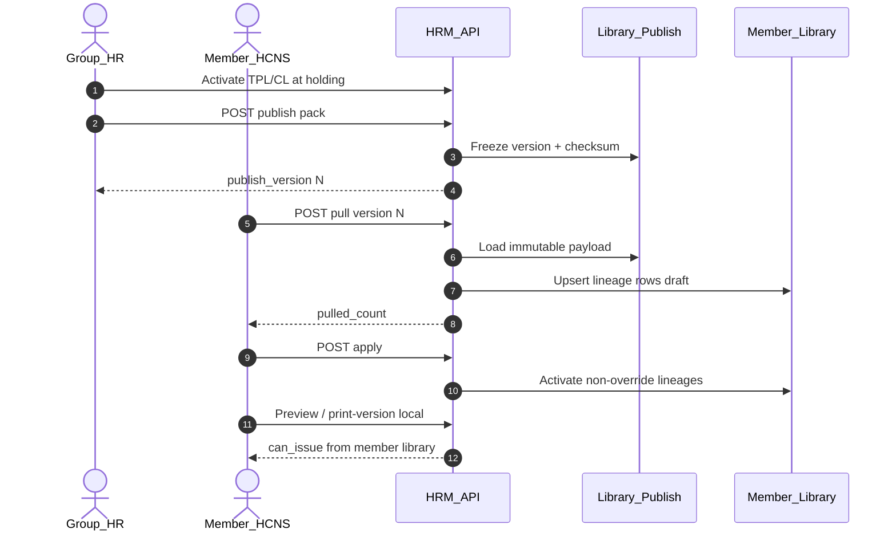

# ADR: HRM contract library — group publish (holding → member)

| Field | Value |
|-------|--------|
| **ADR-ID** | ADR-HRM-CONTRACT-LIBRARY-GROUP-PUBLISH |
| **work_item_id** | `PO-HRM-CONTRACT-LEGAL-PRINT-SA-02` |
| **Status** | **Accepted (SA)** — closes **Q-CTR-01** architecture; ba-data physicalizes before Dev |
| **Date** | 2026-08-07 |
| **Decision owner** | SA |
| **Parent** | `PO-HRM-CONTRACT-LEGAL-PRINT-QC-01` GWC CONDITION **Q-CTR-01** |
| **Related** | [`ADR-GROUP-CEO-MAIN-HOLDING-SCOPE.md`](./ADR-GROUP-CEO-MAIN-HOLDING-SCOPE.md) · [`ADR-HRM-RBAC-SCOPE-LADDER.md`](../decisions/ADR-HRM-RBAC-SCOPE-LADDER.md) · TechSpec [`PO-HRM-CONTRACT-LEGAL-PRINT-TECHSPEC-01.md`](../program/specs/PO-HRM-CONTRACT-LEGAL-PRINT-TECHSPEC-01.md) · DATA [`PO-HRM-CONTRACT-LEGAL-PRINT-DATA-01.md`](../program/specs/PO-HRM-CONTRACT-LEGAL-PRINT-DATA-01.md) · Catalog pattern `catalog-sync` (pull ≠ apply ≠ clone) |
| **Honesty** | `contracts_printable_ready=false` · **no wipe** print-spine GWC |

---

## 1. Decision context

- **Title:** Group-level contract template + clause pack publish (holding → member consume).
- **Requestor:** PM (QC GWC residual Q-CTR-01).
- **Related requirements:** FR-UC-BP-CORE-**09a** (clause library) · CORE-**09** templates · BR-CTR-CL-01..04 · must_keep UF-HRM-02 / print-spine slice GWC.
- **Current state:** Print-spine GWC on **per-company** library (`company_id` on templates/clauses). Group distribution undefined (OPEN-Q).
- **Constraints:** In-HRM domain (not XBOS config-sync L0); soft-delete; scope_parity U19; issued print snapshots immutable; U65 zero-seed; no `apps/**` this seat.
- **Failure if unresolved:** Members invent divergent legal packs; holding cannot freeze a group SoT; QC CONDITION stays forever or Dev invents ad-hoc clone.

---

## 2. Problem to solve

| Need | Risk if wrong |
|------|----------------|
| Holding publishes **version-frozen** template + clause pack | Live cross-read of holding at merge time → scope 409 / silent drift |
| Members **consume** then optionally override | Silent overwrite of issued HĐ snapshots / wipe member local drafts |
| Align with catalog-sync mental model | Confuse pull vs apply vs clone (already a known defect class) |

---

## 3. Options

### Option A — In-HRM publish bundle + member pull/apply (Recommend)

- **Description:** Holding (group legal partition `holding` via ADR main↔holding helpers) authors library with existing TPL/CL APIs. **Publish** freezes an immutable bundle (`publish_version` + checksum + payload). Member **pull** upserts rows into member `company_id` partition with lineage. Member **apply** activates pulled drafts. Merge/preview/print use **local** active rows only.
- **Benefits:** Matches catalog-sync pattern (version/checksum/pull/apply); BR-CTR-CL-01 preserved; scope_parity per partition; offline member independence after pull.
- **Costs:** +1–2 tables (publish registry + optional pull audit); ba-data + BE/FE Settings UX.
- **Risks:** Override conflict on re-pull — mitigate with explicit `origin` + skip/flag rules (§5).

### Option B — Live resolve holding library at preview (no copy)

- **Description:** Member merge reads holding templates/clauses by cross-scope join when local empty.
- **Benefits:** Fast GĐ1.5; no copy rows.
- **Costs / Risks:** Cross-company read helpers proliferate; member CEO scope ladder breaks; F5 Settings empty while print works; hard to version-freeze. **Reject.**

### Option C — XBOS config-sync publishes contract packs

- **Description:** Treat contract library as XBOS catalog key → HRM `synced_catalogs` → materialize.
- **Benefits:** Reuse XBOS publish UI.
- **Costs / Risks:** Wrong bounded context (legal HĐ body ≠ job_titles catalog); dual-write risk; over-architecture for GĐ1.5. **Reject** until sponsor forces platform catalogization.

---

## 4. Trade-off matrix

| Criteria | Weight | A | B | C |
|----------|-------:|:-:|:-:|:-:|
| Business value (group SoT) | 5 | 5 | 3 | 4 |
| Time to deliver | 4 | 3 | 5 | 2 |
| Complexity | 4 | 3 | 2 | 2 |
| Security / scope_parity | 5 | 5 | 2 | 4 |
| Reliability (version freeze) | 5 | 5 | 1 | 4 |
| Maintainability | 4 | 4 | 2 | 3 |

**Selected: Option A.**

---

## 5. Decision (locked)

### 5.1 Publish SoT partition

| Actor | JWT / query | Persist library SoT | Helper |
|-------|-------------|---------------------|--------|
| Group CEO / group HR config | `companyId=main` (JWT) | Templates/clauses/pack_rules under **`holding`** | `resolveHrmPersistCompanyIdText` / settings-catalog company resolve (same ADR §4) |
| Member CEO / HCNS | member tenant or member slug | Local partition only; **pull** from holding publish | `resolveHrmListScope` — **no** silent holding read at merge |

### 5.2 Flow (publish → pull → apply)

```text
HOLDING (author)
  TPL/CL CRUD + activate (F-CORE-CTR-TPL/CL-*)
        │
        ▼
  POST publish  →  hrm_contract_library_publishes  (immutable version N + checksum + payload_json)
        │
        ▼
MEMBER (consume)
  POST pull     →  upsert member templates/clauses (+ optional pack_rules) as draft/synced
                   origin_company_id=holding · origin_publish_version=N · lineage_code=code
        │
        ▼
  POST apply    →  activate pulled set (retire prior active same lineage if not member_override)
        │
        ▼
  Preview / print-version  →  local active only (must_keep print-spine)
```



### 5.3 Version freeze

| Rule | Behavior |
|------|----------|
| Publish | Immutable; never mutate `payload_json` of published version |
| New publish | Monotonic `publish_version` per tenant (master `xevn`) |
| Re-publish after library edit | New version only; old versions remain pullable |
| Print spine | `hrm_contract_print_versions` still snapshots **local** resolved clauses — **must_keep** BR-CTR-CL-01; group publish does **not** rewrite issued HĐ |

### 5.4 Member override rules

| Case | Rule |
|------|------|
| `origin=group` · not edited | Re-pull may upsert body/title/layout from newer publish; keep `lineage_code` |
| Member edits body of group row | Set `origin=member_override`; re-pull **skips** body (flag `pull_skipped_override[]`) unless `force=true` (explicit UI confirm) |
| Member local-only clause (`origin=member`) | Never overwritten by pull; not in holding payload |
| Group `mandatory=true` clause | Member may **retire** locally with audit reason; cannot hard-delete; missing mandatory on apply → `HRM-CTR-PUB-MANDATORY-GAP` warning (apply may still proceed for non-mandatory; issue/print still BR-CTR-CL-02 gate) |
| Template `code` conflict | Same `code` member-local vs pull → 409 `HRM-CTR-PUB-CODE-CONFLICT` unless lineage matches |

### 5.5 scope_parity (U19)

| Cap | List / get / mutate |
|-----|---------------------|
| Publish create/list | Same resolver: group role + holding persist partition; get-by-id assert publish in tenant |
| Pull / apply | Member `company_id` in scope; target partition = requested member slug; **forbidden** pull into foreign member |
| Local TPL/CL after pull | Existing F-CORE-CTR-TPL/CL list↔get same `resolveHrmListScope` / `assertResourceInHrmScope` |
| Preview/print | Unchanged print-spine — local library only (**no** live holding join) |

### 5.6 Relation to catalog-sync

| Pattern | XBOS→HRM catalog-sync | Contract library publish |
|---------|----------------------|--------------------------|
| Version + checksum | Yes | **Reuse concept** |
| Pull | Yes | Yes (in-HRM) |
| Apply | Separate (apply-to-members) | **Explicit apply** after pull (same discipline: pull ≠ apply) |
| Clone | Forbidden as silent SoT | Forbidden |
| Upstream | XBOS config-sync | HRM holding library + publish table |

**Do not** route contract bodies through `synced_catalogs` in GĐ1.5.

### 5.7 Rejected / deferred

| Item | Status |
|------|--------|
| Option B live holding merge | Rejected |
| Option C XBOS catalog key | Rejected GĐ1.5 |
| Q-CTR-02 PDF binary engine | **Unrelated** — remains OPEN CONDITION |
| Print-spine GWC seal | **must_keep** — no wipe / no demote |
| `contracts_printable_ready` | **false** until full module UAT (unchanged) |

---

## 6. Failure modes

| Failure | Detection | Mitigation |
|---------|-----------|------------|
| Pull without apply → empty active | Preview `HRM-CTR-TPL-NONE` | FE CTA «Áp dụng gói tập đoàn» |
| Force re-pull over override | Audit log + confirm | Default skip override |
| Publish empty active set | 400 `HRM-CTR-PUB-EMPTY` | Require ≥1 active template OR ≥1 active clause |
| Scope leak member→member | 403/409 | assert target in caller's list scope |
| Claim printable ready after publish alone | Governance | Honesty lock false |

---

## 7. Implementation & validation plan

1. **ba-data** — physicalize publish + lineage columns (see SA-02 TechSpec ADD / next_dispatch).  
2. **dev-be** — F-CORE-CTR-PUB/PULL/APPLY + scope tests.  
3. **dev-fe** — Settings: Publish (holding) · Pull/Apply (member) · origin badge.  
4. **qa** — U65 browser: holding publish → member pull → apply → local preview; must_keep print-spine GWC + UF-HRM-02.  
5. **Rollback:** Soft-retire publish versions; member can ignore pull; no schema wipe of print_versions.

**Success criteria:** Q-CTR-01 closed in architecture; member consumes frozen version N; issued HĐ snapshots untouched; honesty false.

---

## 8. Completion

| Field | Value |
|-------|--------|
| Closes | **Q-CTR-01** (architecture LOCK — physical DB still ba-data) |
| Does not close | Q-CTR-02 · printable module UAT |
| Evidence | `docs/qa/evidence/po-hrm-contract-legal-print-sa-02.md` |
