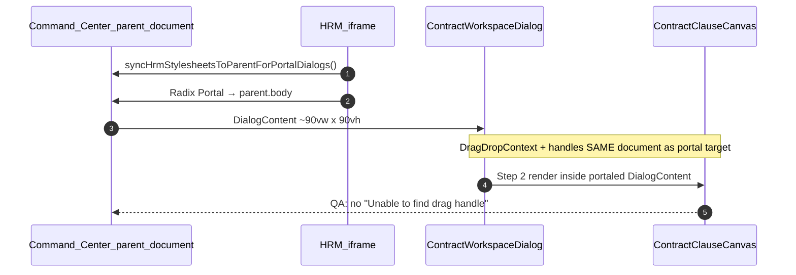

# ADR: HRM Contract Workspace — unified dialog (create · edit · view)

| Field | Value |
|-------|--------|
| **ADR-ID** | ADR-HRM-CONTRACT-WORKSPACE-UNIFIED-01 |
| **work_item_id** | `PO-HRM-CTR-WORKSPACE-WAVE-G2` |
| **Status** | **Accepted (SA)** — unlocks `PO-HRM-CTR-WORKSPACE-WAVE-G3` dev-fe |
| **Date** | 2026-08-11 |
| **Decision owner** | SA |
| **sponsor_confirm** | 2026-08-11 — parallel G1/G3/G4 |
| **Parent** | `PO-HRM-CTR-CREATE-REDESIGN-BA-02` · `PO-HRM-CTR-CREATE-AUDIT-SA-01` Option A LOCK |
| **Related** | [`docs/hrm/TECHSPEC.md`](../hrm/TECHSPEC.md) §14.2 · [`docs/hrm/API_DESIGN_HRM_CONTRACTS_INS.md`](../hrm/API_DESIGN_HRM_CONTRACTS_INS.md) · [`docs/ecosystem/TECHSPEC.md`](../ecosystem/TECHSPEC.md) §4.1 · slice [`PO-HRM-CTR-WORKSPACE-G3.md`](../program/slices/PO-HRM-CTR-WORKSPACE-G3.md) |
| **Honesty** | `contracts_printable_ready=false` · **C-SLICE-≠-MODULE** · cấm flip printable trong wave này |

---

## 1. Decision context

### 1.1 Business intent

Hợp đồng lao động (FR-UC-BP-CORE-09 / FR-HRM-CI-01) hiện có **ba bề mặt UI không đồng nhất**:

| Surface | Path | AS-IS shell | Print spine / DnD | Subject picker |
|---------|------|-------------|-------------------|----------------|
| **CC list create/edit** | `Contracts.tsx` → `ContractCreateWizardDialog` | Parent portal ~90vw×90vh ✓ | 2-step wizard + `ContractCreateStep2ClausePreview` | UV default / NV toggle (BA-02) |
| **CC list view** | `Contracts.tsx` view `DialogContent` | Parent portal ~90vw ✓ | **Không** — read-only grid only | Display-only |
| **Employee profile tab** | `EmployeeContracts.tsx` legacy dialog | `max-w-2xl` iframe-default ✗ | **Không** — flat form | NV locked to `employeeId` |

Hậu quả: QA matrix split (create PASS CC URL vs view thiếu clause/PDF; profile CRUD lệch field manifest); duplicate logic giữa `ContractPrintSpinePanel`, `ContractCreateStep2ClausePreview`, và form sổ trong `EmployeeContracts`.

### 1.2 Normative constraints (locked)

| Lock | Source | Rule |
|------|--------|------|
| Portal geometry | BA-02 Q1-A · SA Option A | Radix mount **parent** CC; bbox ~**90%** viewport w × ~**90vh** h |
| QA URL | BA-02 Q2 | Mutate/DnD evidence trên `…/command-center/hrm/contracts` |
| Subject | BA-02 Q6 · G1 AMEND | **Ứng viên** default trên CC create; **Nhân viên** optional; profile context → NV pre-bound |
| Registry F5 | TECHSPEC §14.2 · BR-CD-F5-01 | Salary **không** trên contract body; C&B read-only card GĐ1 |
| Print honesty | CORE-09 cluster | `contracts_printable_ready=false`; preview ephemeral; không claim module UAT |
| U65 | sponsor lock | Zero-seed; FE mutate → 2xx → F5 |

### 1.3 AS-IS code facts (cite only — no implement this seat)

- `ContractCreateWizardDialog.tsx` — orchestrates step 1 (`ContractCreateStep1GeneralGrid`) + step 2 (`ContractCreateStep2ClausePreview`).
- `ContractPrintSpinePanel.tsx` — full print spine (palette/canvas/preview/VER/PDF) embedded historically; wizard step 2 is a **slim fork** of same concerns.
- `EmployeeContracts.tsx` L912–1100 — legacy `max-w-2xl` dialog; **không** parent portal; **không** clause canvas; parity gap vs BA-02 FIELD/DND ACs.
- `Contracts.tsx` L1674–1821 — view dialog: GET-by-id ✓; **không** bind print spine / clause read-only.

---

## 2. Problem statement

```text
  Contracts.tsx (CC)
       ├── Create/Edit Dialog ──► ContractCreateWizardDialog (2-step)     ──► partial print logic
       └── View Dialog ─────────► static field grid only                   ──► NO clause/PDF parity

  EmployeeProfile.tsx
       └── EmployeeContracts ───► legacy max-w-2xl dialog                  ──► NO wizard, NO portal, NO UV path
```

**Architecture gap:** Không có **một workspace contract** với mode rõ ràng và shared subsystems — vi phạm SRP (3 orchestrators) và Open/Closed (mỗi AC mới phải sửa 2–3 file).

---

## 3. Decision (locked)

### 3.1 Introduce `ContractWorkspaceDialog`

Single orchestrator với **mode** discriminated union:

| Mode | Entry surfaces | Editable registry | Step 2 DnD | Print spine (preview/VER/PDF) | Primary actions |
|------|----------------|-------------------|------------|-------------------------------|-----------------|
| **`create`** | CC «Thêm HĐ» · profile «Thêm HĐ» (NV pre-bound) · REC hire CTA (G1) | Yes | Yes | Preview ephemeral; VER/PDF when `contractId` exists post step-1 save | Quay lại · Tiếp · Lưu |
| **`edit`** | CC row «Sửa» · profile row «Sửa» | Yes | Yes | Same as create + restore template/pack from row | Quay lại · Tiếp · Lưu |
| **`view`** | CC row «Chi tiết» (Eye) | **No** (read-only) | Read-only canvas | Read-only preview + issued PDF list when BE ready | Đóng · (optional) «Sửa» → mode flip |

**Shell invariant (all modes):**

- `DialogContent` parent portal (`data-hrm-dialog-portal="parent"`); **omit** `portalScope="iframe"`.
- Geometry: `w-[min(90vw,96rem)]` · `max-h-[90vh]` · `h-[min(90vh,calc(100vh-2rem))]` — align `Contracts.tsx` create shell L1600–1615.
- Stylesheet sync via `syncHrmStylesheetsToParentForPortalDialogs()` (TECHSPEC §4.1).
- Stepper header **2 bước** retained for create/edit; view mode may collapse to tabs «Thông tin chung» | «Điều khoản & bản in» (same components, `readOnly` prop).

### 3.2 Deprecate `EmployeeContracts` legacy dialog

| Item | Action |
|------|--------|
| `EmployeeContracts.tsx` inline `Dialog` (L912+) | **DEPRECATED** — replace open handler with `ContractWorkspaceDialog` launcher |
| `handleOpenDialog` / `handleSubmit` form in profile | **Route** through workspace; `employeeId` passed as `subjectLock: { type: 'employee', id }` |
| Renew / history-renewal flows | **must_keep** — remain as thin wrappers that **pre-fill** workspace `create` mode (`renewed_from_id`, dates) — không xóa renewal chain |
| Tab Đãi ngộ / Lịch sử | **Unchanged** — compensation SRP stays in `EmployeeCompensationPanel` |

**Deprecation marker:** `@deprecated` JSDoc on legacy dialog block; remove in G3+1 cleanup wave after QA G4 PASS.

### 3.3 Subject model (employee default · candidate optional)

Context-driven defaults — **không** hardcode một default global:

| Launch context | `subjectDefault` | Picker behavior |
|----------------|------------------|-----------------|
| CC `Contracts.tsx` «Thêm HĐ» | `candidate` (BA-02 Q6) | Toggle UV \| NV; search combobox |
| `EmployeeProfile` «Thêm HĐ» | `employee` (G1 NV-first in profile) | NV **locked** to profile `employeeId`; UV toggle hidden or disabled |
| REC hire CTA → HĐ (G1) | `candidate` with `candidateId` pre-selected | Skip picker when CTA carries id |
| Edit / view any | From contract row `subject_type` + ids | Display labels only in view |

**API contract (unchanged this wave — pointer BE G-CTR-SUBJ-01):** `candidate_id` on draft when UV path; `employee_id` when NV path; profile create still requires resolvable NV in scope per BR-CTR-CREATE-07.

---

## 4. SOLID FE boundaries

### 4.1 Component map

```text
ContractWorkspaceDialog (orchestrator — mode + step + submit lifecycle)
    │
    ├── ContractRegistryFields          ← extract from ContractCreateStep1GeneralGrid
    │       props: mode, subjectLock?, catalogs, form slice, readOnly?
    │
    ├── ContractClauseCanvas            ← extract shared DnD UI from Step2 + PrintSpine
    │       props: mode, contractId, templateCode, canvasIds, onCanvasChange, readOnly?
    │       uses: HrmDragDropContext + sameNodeDragBind (parent document)
    │
    └── useContractPrintSpine           ← hook: library load, preview, overlay PUT, VER/PDF
            returns: { preview, versions, issueBlocked, actions, busy }
            consumed by: ContractClauseCanvas footer + view mode read-only panel
```

### 4.2 Responsibility matrix

| Module | Single reason to change | Must NOT |
|--------|-------------------------|----------|
| `ContractWorkspaceDialog` | Shell/mode/step/footer wiring | Invent merge fields; direct `hrmApi` except via hooks |
| `ContractRegistryFields` | Registry field manifest / validation display | DnD; print preview |
| `ContractClauseCanvas` | Palette + canvas + Gỡ + mandatory confirm | POST registry; salary fields |
| `useContractPrintSpine` | Print API state machine | Render JSX; registry form state |
| `Contracts.tsx` | List/filter/pagination/open launcher | Duplicate wizard markup |
| `EmployeeContracts.tsx` | Tab list + renew/history + compensation tabs | Own dialog form (deprecated) |

### 4.3 Extraction source → target

| New artifact | Extract from | Notes |
|--------------|--------------|-------|
| `ContractRegistryFields` | `ContractCreateStep1GeneralGrid.tsx` | Keep `buildActiveContractFormFields` consumer |
| `ContractClauseCanvas` | `ContractCreateStep2ClausePreview.tsx` + canvas portion of `ContractPrintSpinePanel.tsx` | View mode: `readOnly` + no Gỡ |
| `useContractPrintSpine` | Shared `useEffect`/`useCallback` blocks in Step2 + PrintSpinePanel | Wizard create: **cấm** `syncContractTemplateClauseBind` in-dialog (must_keep FE-02) |
| `ContractWorkspaceDialog` | `ContractCreateWizardDialog.tsx` + view body from `Contracts.tsx` | Single export |

**Interim adapters (G3):** `ContractCreateWizardDialog` may re-export/wrap `ContractWorkspaceDialog` mode=`create|edit` until `Contracts.tsx` imports workspace directly — minimize diff blast.

---

## 5. Portal & DnD architecture (Option A — locked)



| Rule | Enforcement |
|------|-------------|
| DnD same-document | Entire `HrmDragDropContext` subtree inside portaled `DialogContent` (Path A — `po-hrm-ctr-create-redesign-fe-04-dnd-parent.md`) |
| Floating layers | Select/Popover in registry fields use `getRadixPortalContainer('parent')` |
| View parity | View mode mounts **same** `ContractClauseCanvas` read-only — closes view-vs-create clause gap for G4 QA |

---

## 6. Mode behavior detail

### 6.1 Create / edit (mutate)

Retains BA-02 manifest:

- Step 1: `ContractRegistryFields` — UV/NV toggle (unless `subjectLock`), signing_date required, work_form + salary_ratio_percent, contract_name read-only derive, abstract, C&B read-only card, DRIVER block, «Chỉ lưu sổ».
- Step 2: `ContractClauseCanvas` — palette/canvas, **Gỡ** + mandatory confirm (AC-CTR-DND-01/02), preview ephemeral, «Đồng bộ thứ tự» → `putContractPrintOverlay`.
- Footer: `Quay lại` | `Tiếp` | `Lưu` (create may POST draft at step-1 boundary — retain `ContractCreateWizardDialog` session contract id pattern).

### 6.2 View (read-only)

- Step 1 fields: `ContractRegistryFields` with `readOnly={true}` — bind GET-by-id display-ready (`candidate_label`, `signing_date`, `contract_abstract`, `work_form_label_vi`, …).
- Step 2: `ContractClauseCanvas` `readOnly` — show clause order + preview snapshot; surface issued print versions / PDF download when CORE-09c APIs return data.
- Optional CTA «Sửa» → `onModeChange('edit')` without closing shell (L2.5 J-HRM-CTR-CREATE-06 parity).

---

## 7. Options considered

| Option | Summary | Verdict |
|--------|---------|---------|
| **A — Unified workspace (this ADR)** | One dialog, three modes, shared extract | **Accept** |
| B — Keep profile legacy dialog | Smaller G3 diff | **Reject** — perpetual AC drift; fails AC-CTR-UX-06 on profile |
| C — View stays separate mini-dialog | Less refactor | **Reject** — G4 requires view clause+PDF parity |
| D — Re-merge `ContractPrintSpinePanel` into list page | Roll back wizard | **Reject** — violates BA-02 stepper + DnD URL matrix |

---

## 8. Trade-off matrix

| Criteria | Weight | A Unified | B Profile legacy | C Split view |
|----------|-------:|----------:|-----------------:|-------------:|
| AC parity (FIELD/DND/UX-06/07) | 5 | 5 | 2 | 3 |
| SOLID / maintainability | 4 | 5 | 2 | 3 |
| G3 implementation cost | 3 | 3 | 5 | 4 |
| Regression risk | 4 | 3 | 4 | 3 |
| J-HRM / L2.5 coverage | 5 | 5 | 2 | 3 |

---

## 9. Impacted systems

| System | Change |
|--------|--------|
| `apps/web/hrm/src/components/contracts/*` | New workspace + extracts; deprecate wizard-only split |
| `apps/web/hrm/src/pages/Contracts.tsx` | Launch workspace create/edit/view; delete duplicate view grid when parity proven |
| `apps/web/hrm/src/components/employee/EmployeeContracts.tsx` | Replace dialog with workspace launcher |
| `apps/web/hrm/src/lib/contractCreateWizardState.ts` | Retain; consumed by `ContractRegistryFields` |
| `apps/web/hrm/src/lib/hrmDialogPortal.ts` | **must_keep** — no geometry change |
| QA G4 | Retest J-HRM-CTR-CREATE-* + profile create + view clause/PDF |
| BE | **No change required G3** if G-CTR-SUBJ-01 already merged; else parallel BE slice |

---

## 10. Rollout plan

| Wave | work_item_id | Owner | Deliverable |
|------|--------------|-------|-------------|
| G1 | `PO-HRM-CTR-WORKSPACE-WAVE-G1` | ba-process | AC AMEND: NV-first profile · hire CTA · view parity criteria |
| **G2** | **`PO-HRM-CTR-WORKSPACE-WAVE-G2`** | **sa** | **This ADR + slice G3 skeleton** |
| G3 | `PO-HRM-CTR-WORKSPACE-WAVE-G3` | dev-fe | Implement extracts + workspace; wire CC + profile |
| G4 | `PO-HRM-CTR-WORKSPACE-WAVE-G4` | qa | U65 CREATE+F5 · DnD CC · view clause+PDF · hire→HĐ |

**Checkpoint gates:**

1. G3 `READY_FOR_QA` — vitest/source tests for workspace modes; no `contracts_printable_ready` flip.
2. G4 PASS — all BA-02 AC-CTR-* retained + G1 view parity AC; profile uses parent portal screenshot.
3. Post-G4 — delete deprecated `EmployeeContracts` dialog block (separate chore WI).

---

## 11. Risks and mitigations

| Risk | Mitigation |
|------|------------|
| Large refactor breaks DnD | Keep `HrmDragDropContext`; copy proven Step2 shell; QA G4 J-CREATE-02 first |
| `ContractPrintSpinePanel` callers orphaned | Panel becomes thin wrapper over `useContractPrintSpine` or deprecated with redirect comment |
| Profile renew pre-fill lost | `renewed_from_id` passed as workspace `initialDraft` prop — test in G4 |
| View mode exposes honesty paragraph | **cấm** — retain AC-CTR-UX-01 source test |
| BE candidate path blocked | G4 BLOCKED + dispatch BE if POST rejects UV-only |

---

## 12. Validation and acceptance evidence

| Evidence | Owner | Pass when |
|----------|-------|-----------|
| `docs/architecture/ADR-HRM-CONTRACT-WORKSPACE-UNIFIED-01.md` | sa | Published (this file) |
| `docs/program/slices/PO-HRM-CTR-WORKSPACE-G3.md` | sa | Skeleton with allowed_paths |
| `docs/qa/evidence/po-hrm-ctr-workspace-fe-g3.md` | dev-fe | Vitest + manual matrix |
| `docs/qa/evidence/po-hrm-ctr-workspace-qa-g4.md` | qa | Browser U65 CC URL + profile + view clause |

**Source tests (G3 minimum):**

- `contractWorkspace.source.test.ts` — modes; no honesty paragraph; parent portal attr; deprecated dialog absent in profile after cutover.
- Retain `contractCreateWizard.source.test.ts` until wizard shim removed.

---

## 13. Completion contract (SA seat)

| Field | Value |
|-------|--------|
| **completion_report** | ADR locks unified `ContractWorkspaceDialog` (create\|edit\|view); deprecates `EmployeeContracts` legacy dialog; defines `ContractRegistryFields`, `ContractClauseCanvas`, `useContractPrintSpine` SOLID boundaries; parent CC ~90% portal + Option A DnD; subject context table (UV default CC · NV lock profile); rollout G1→G4 |
| **residual** | G-CTR-SUBJ-01 BE if UV POST still blocked · `ContractPrintSpinePanel` retirement chore post-G4 · G1 BA AC text not yet in repo (parallel) |
| **next_owner** | **dev-fe** (`PO-HRM-CTR-WORKSPACE-WAVE-G3`) |
| **ack_status** | **PASS_TO_PM** |
| **evidence_path** | `docs/architecture/ADR-HRM-CONTRACT-WORKSPACE-UNIFIED-01.md` · `docs/program/slices/PO-HRM-CTR-WORKSPACE-G3.md` |
| **printable** | **false** |

---

## 14. AMEND — Subject default NV-first (BA-03 · SA-01 · 2026-08-11)

> **Supersedes §1.2 row «Subject» and §3.3 table** for default tab behavior only. Shell geometry, portal Option A, and mode union §3.1 **RETAIN**.

### 14.1 Sponsor lock (G1-1 · G1-2)

| Prior (BA-02 / ADR §3.3 AS-IS) | AMEND (BA-03 CONFIRM) |
|--------------------------------|------------------------|
| CC create default **Ứng viên** (`candidate`) | CC create default **Nhân viên** (`employee`) |
| NV optional toggle | NV **primary** path; UV tab **optional** — offer pre-hire only |
| REC CTA → `candidate` with `candidateId` | REC CTA → **`employee`** with `employee_id` from hire (INT-01) |

### 14.2 Context table (replaces §3.3)

| Launch context | `subjectDefault` | Picker behavior |
|----------------|------------------|-----------------|
| CC `Contracts.tsx` «Thêm HĐ» | **`employee`** | Tab **Nhân viên** active; tab **Ứng viên** optional (`?subject=candidate` deep-link) |
| `EmployeeProfile` «Thêm HĐ» | `employee` | NV **locked** to profile `employeeId`; UV hidden/disabled |
| **REC hire CTA** «Tạo HĐ» (G1-3) | **`employee`** | `subjectLock` to hired `employee_id`; prefill `XEVN_PROBATION_*` template |
| Edit / view any | From row `subject_type` + ids | Labels only in `view` |
| UV offer pre-hire (optional tab) | `candidate` | Only when UV **chưa** `employee_id`; deny save if already hired |

### 14.3 API contract (pointer — no schema change this AMEND)

- **G-CTR-SUBJ-01:** RESOLVED via EXPAND-REGISTRY-01 (`BE-SUBJ-01`) — nullable `employee_id` + `candidate_id` on `employee_contracts`.
- **Default inference AMEND:** When `subject_type` omitted on POST, prefer **`employee`** path; candidate path only when `candidate_id` present without `employee_id`.
- **Full F.1:** `docs/program/specs/PO-HRM-CTR-WORKSPACE-SA-01.md` §4.3–§4.4 · `API_DESIGN_HRM_CONTRACTS_INS.md` §13.

### 14.4 Invariants (ADD)

| ID | Rule |
|----|------|
| **CTR-SUBJECT-NV-01** | CC «Thêm HĐ» opens with tab **Nhân viên** — AC-CTR-SUBJECT-01 |
| **CTR-SUBJECT-NV-02** | REC CTA never opens UV tab with empty `employee_id` — AC-CTR-HIRE-CTA-02 |
| **CTR-SUBJECT-UV-01** | UV path only for candidates **without** `employee_id` — AC-CTR-SUBJECT-03 |

**Evidence:** `docs/program/specs/PO-HRM-CTR-WORKSPACE-SA-01.md` · `PO-HRM-CTR-WORKSPACE-NV-FIRST-BA-03.md` §3.
