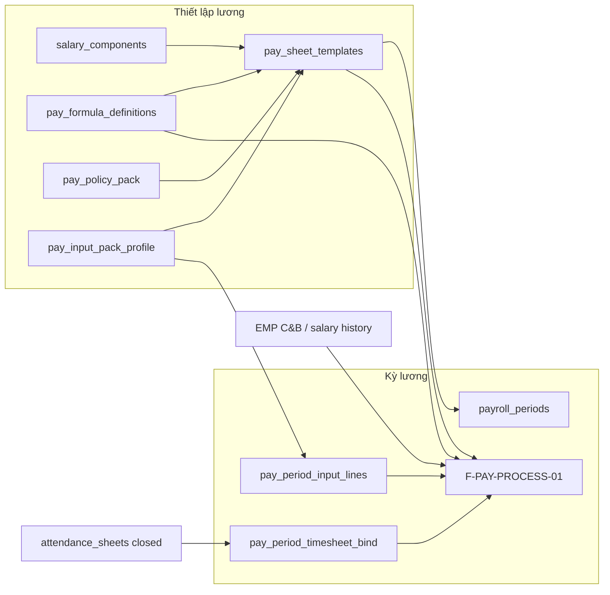

# ADR: XeVN Customer P.CNTT — Payroll setup & six-model payroll architecture

| Field | Value |
|-------|--------|
| **ADR-ID** | ADR-HRM-PAY-XEVN-CUSTOMER-CNTT-01 |
| **work_item_id** | `PO-HRM-PAY-CNTT-SA-01` |
| **Status** | **CONFIRMED** — ADD-only · customer intake governance |
| **Date** | 2026-08-11 |
| **Decision owner** | SA |
| **Program** | [`PO_HRM_PAY_XEVN_CUSTOMER_CNTT_INTAKE_01.md`](../program/PO_HRM_PAY_XEVN_CUSTOMER_CNTT_INTAKE_01.md) |
| **Child ADR** | [`ADR-HRM-PAY-MULTI-TEMPLATE-01.md`](./ADR-HRM-PAY-MULTI-TEMPLATE-01.md) — canonical multi-template + Thiết lập layers |
| **Honesty** | `payroll_e2e_ready=false` · intake ≠ UAT · formula engine eval **HOLD** |
| **Evidence** | `docs/qa/evidence/po-hrm-pay-cntt-sa-01.md` |

---

## 1. Context

Sponsor delivered **Gửi P.CNTT** (67 files): payroll policies and sample sheets for XeVN operating units spanning logistics coordination, call center, time-based office pay, route drivers, truck drivers, and provincial offices — plus group-wide salary scales (QĐ 2A, QĐ 127A).

**Architectural fact:** XeVN payroll is **multi-model by design**. A single `pay_sheet_template` or Nest branch per `company_id` cannot represent customer reality. AMIS parity research (2026-08-07) already locked template + SRC + formula storage; this ADR **instantiates** that architecture for the P.CNTT customer pack without forking product code.

---

## 2. Stakeholders & personas

| Persona | Need from Thiết lập lương |
|---------|----------------------------|
| C&B / Payroll admin (holding) | Maintain group policy refs · approve templates per business line |
| C&B (member OU) | Select applicable template · configure period inputs (KPI, DT, …) |
| Technical publisher | Dual-control publish formula overrides per template column |
| Payroll operator | Create period from template · bind closed ATT · process |
| QA / Sponsor | U65 proof per model — **after** engine LIVE |

---

## 3. Current-state pain (product vs customer pack)

| Pain | Root cause | Architecture response |
|------|------------|----------------------|
| Customer Excel mẫu ≠ runtime columns | No multi-template bind on all OUs | Multi `pay_sheet_template` + period snapshot (LIVE partial) |
| KPI / DT / CPSC not in engine | Input pack shallow; no profile per BP | ADD `pay_input_pack_profile` |
| Policy PDFs per BP not linked | Settings lacks policy pack entity | ADD `pay_policy_pack` |
| Process returns 0₫ | Evaluator HOLD · SRC not wired | Serial gate after `expression_json` schema — **not** bypass with Nest % |
| «Thiết lập» scattered | Components in Settings · mẫu tab · formula panel | Logical hub «Thiết lập lương» (FE route) over L1–L6 |

---

## 4. Future-state capabilities (GĐ1 target)

1. HR defines **≥1 active pay sheet template** per business model with column set + optional formula overrides (published FK).
2. HR attaches **policy pack** (document refs + scalar params) to template or OU.
3. HR selects **input pack profile** defining allowed period input kinds (KPI, revenue, advance, …).
4. Period creation **snapshots** template + profile version; enroll/process uses SRC resolver.
5. **No** hardcoded `if (model === 'LX')` in Nest — all variation in metadata.

**Out of GĐ1:** Full auto-import from customer XLSX; AI formula; payslip ESS sign-off at scale.

---

## 5. Integration boundaries

| Boundary | Rule |
|----------|------|
| ATT → PAY | Closed sheet only (Q-PAY-F-3); bind header ≠ line bag |
| EMP → PAY | Salary history / C&B wins SRC tier 1 — no REC→PAY sync |
| XBOS | OU / `business_lines` for applicability tags — not payroll formula SoT |
| Platform | `salary_components` admin = F-PLT-PAY-COMP-*; consumer invent ban separate |

---

## 6. Data requirements (ADD summary)

See [`ADR-HRM-PAY-MULTI-TEMPLATE-01.md`](./ADR-HRM-PAY-MULTI-TEMPLATE-01.md) §4. Physical DDL owned by **ba-data** `PO-HRM-PAY-CNTT-BA-DATA-01` — SA does not invent columns beyond ADD intent here.

---

## 7. NFR & security

- New APIs: `@xevn/platform-core` patterns · scope parity · observability baseline per `NFR_OBSERVABILITY_SECURITY_BASELINE.md`.
- Policy `policy_doc_refs_json`: store references only — virus scan on upload GĐ2; no secrets in jsonb.
- RLS: **not enabled** until explicit SA sign-off (`PLATFORM_RLS_ENABLED`).

---

## 8. Acceptance hooks (for BA / QA)

| AC id | Statement |
|-------|-----------|
| **AC-CNTT-SETUP-01** | HR creates second active template same company without code deploy |
| **AC-CNTT-SETUP-02** | Template line binds `formula_override_definition_id` only after formula **published** |
| **AC-CNTT-SETUP-03** | Period create with template snapshots `policy_pack_id` + `input_pack_profile_id` when set |
| **AC-CNTT-SETUP-04** | POST input line with `source_kind` not in profile → deterministic 4xx VI |
| **AC-CNTT-MODEL-01..06** | Per-model browser path documented in BA matrix — **UNTESTED** until engine LIVE |

---

## 9. Risks & mitigations

| Risk | Mitigation |
|------|------------|
| Six models hardcoded during import | BA-data uses open `code`; CI grep rejects `CNTT_DPHH` in Nest switch |
| Policy pack = duplicate tax/SI tables | Policy pack **references** existing CFG; scalar overflow only |
| Template LIVE but process 0₫ | Honesty flag; QC blocks UAT claim |
| Formula HOLD blocks override value | Override CRUD allowed; PROCESS using override gated on evaluator |
| Excel import scope creep | GĐ2 — GĐ1 manual FE entry per U65 |

---

## 10. Decision

**Adopt** [`ADR-HRM-PAY-MULTI-TEMPLATE-01.md`](./ADR-HRM-PAY-MULTI-TEMPLATE-01.md) Option B as the architecture for XeVN P.CNTT payroll setup. Proceed to BA-data physical design + API APPEND per unlock list in `PO-HRM-PAY-CNTT-SA-01.md`. **Do not** start evaluator BE until `expression_json` inner schema is CONFIRMED.

**Rejected:** Per-model Nest modules; single-template + switches; inline template expressions.
