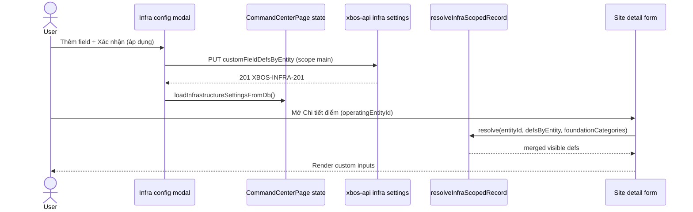

# ADR: Metadata apply → consumer parity (infra · group HR · legal entity)

| Field | Value |
|-------|--------|
| **ADR-ID** | ADR-METADATA-APPLY-CONSUMERS-DELTA-20260620 |
| **work_item_id** | `P1-METADATA-APPLY-SA-01` |
| **Status** | Accepted (governance delta) |
| **Date** | 2026-06-20 |
| **Decision owner** | SA |
| **Trigger** | Sponsor: `PUT /api/xbos/infrastructure/settings` → **200** `XBOS-INFRA-201` nhưng form **Chỉnh sửa pháp nhân** không đổi |
| **Program** | [`P1-METADATA-APPLY-PROPAGATION-PROGRAM.md`](../program/P1-METADATA-APPLY-PROPAGATION-PROGRAM.md) |
| **Related ADRs** | [`ADR-GROUP-CEO-MAIN-HOLDING-SCOPE.md`](ADR-GROUP-CEO-MAIN-HOLDING-SCOPE.md), [`PHASE1_SCOPE_PARITY_AUDIT.md`](PHASE1_SCOPE_PARITY_AUDIT.md) |
| **Evidence** | `docs/qa/evidence/p1-xbos-w2-infra-audit-20260606.md`, `apps/web/web-portal/src/integrations/infrastructureEntityKeyResolver.ts`, `CommandCenterPage.tsx` |

---

## 1. Context

Command Center (XBOS) có **ba pipeline metadata độc lập** trên cùng một trang `CommandCenterPage.tsx`:

| Pipeline | State key (FE) | SoT persist | Modal «Xác nhận (áp dụng)» |
|----------|----------------|-------------|------------------------------|
| **Infra** | `infrastructureCustomFieldDefsByEntity` | `xbos_infrastructure_settings.custom_field_defs_by_entity` | `applyInfrastructureFieldsConfig()` → PUT infra settings |
| **Group HR** | `groupHrCustomFieldDefsByEntity` | HRM `settings-catalogs` (+ session `employeeMetadataByEntity`) | `syncGroupHrFieldsToHrmCatalogs()` → POST extension-items |
| **Legal entity** | `companyForm` (static) | Org-foundation `legal_entities.payload.companyForm` | Không có modal metadata động — form JSX cố định |

Sponsor lock **U65**: nghiệm thu = luồng FE; **HTTP 200 không đủ** nếu màn consumer không re-render field mới (`P1-METADATA-APPLY-PROPAGATION-PROGRAM.md`).

Wave W2 đã bổ sung UX apply (Loader2, toast, `loadInfrastructureSettingsFromDb`, CTA deep-link). SA wave W3 chốt **ranh giới kiến trúc + parity checklist** để dev-fe không lặp lỗi entity-key / consumer drift.

---

## 2. Problem statement

### 2.1 Class lỗi (product gap, không phải API-only)

```text
Config modal save (2xx)  ≠  Consumer screen visible change
```

Nguyên nhân gốc: **không có registry «config producer → consumer screen»** và **resolver entity-key không đồng nhất** giữa modal (ghi) và form (đọc).

### 2.2 Ba mâu thuẫn đã xác minh trong code

| # | Triệu chứng | Root cause (evidence) |
|---|-------------|------------------------|
| **M1** | Modal infra từ `company_member_units` → apply 200, form pháp nhân không có field mới | Infra defs **chỉ bind** consumer **Điểm hạ tầng** (`infraCustomFieldDefsForEntity` ~L5761); form pháp nhân dùng `CompanyFormState` tĩnh (`legalEntityFormMapper.ts`) — **by design tách domain**, sponsor kỳ vọng sai consumer |
| **M2** | Field lưu dưới key `main`, site VISUN không hiện field | Consumer đã có `resolveInfraScopedRecord`; modal list vẫn index trực tiếp `infrastructureCustomFieldDefsByEntity[entityId]` (`infraModalFieldsForSelectedBlock` ~L2435) — **parity lệch modal ↔ consumer** |
| **M3** | Group HR apply sync HRM OK, preview NV cũ | Consumer preview đọc `employeeMetadataByEntity[entityId]`; apply cập nhật state + HRM nhưng **không có shared resolver** giữa `groupHrCustomFieldDefsByEntity` và HRM embed pull scope (`resolveGroupHrHrmCatalogScope`) |

### 2.3 Entity-key planes (ADR-GROUP-CEO)

| Plane | Id ví dụ | Dùng ở |
|-------|----------|--------|
| JWT operating | `main` | `getCommandCenterStorageScope()`, HRM catalog scope |
| UI holding alias | `xbos-group-holding-root` | Checkbox phạm vi danh mục nền, legal entity list |
| Legal entity UUID | `eb3fb3fc-…` | `operatingEntityId` site, member unit row |
| BE normalize | `holding` / `main` | `InfrastructureService.normalizeCompanyId` default `holding` |

Mọi consumer/modal **phải** resolve qua cùng helper — không index thẳng `map[operatingEntityId]`.

---

## 3. Consumer map (authoritative)

### 3.1 Pipeline A — Infrastructure custom fields

| Role | Surface | Route / menu | State / API | Resolver today | Visible change AC |
|------|---------|--------------|-------------|----------------|-------------------|
| **Producer** | Modal «Cấu hình mục thông tin hạ tầng cơ sở» | `company_infrastructure` (foundation detail) · link site detail · *misleading* open from `company_member_units` | `infrastructureCustomFieldDefsByEntity` → PUT `customFieldDefsByEntity` | **Partial** — write keyed by modal `entityId`; read list modal **direct key** | Modal list cập nhật field sau «Thêm field» + PUT |
| **Consumer (in-scope)** | Form **Chi tiết / Thêm điểm hạ tầng** | `?settings=company_infrastructure` → tab **2. Điểm hạ tầng** → detail | `infraForm.customFields` + `infraCustomFieldDefsForEntity` | **Y** — `resolveInfraScopedRecord` + foundation scope | Label/input custom xuất hiện theo block (`general`/`location`/`capacity`/custom) sau apply + mở site cùng `operatingEntityId` |
| **Consumer (out-of-scope)** | Form **Chỉnh sửa pháp nhân** | `company_member_units` → form | `companyForm` static JSX | **N/A** — không đọc infra defs | **Không** claim UF infra trên form pháp nhân; CTA → `infrastructureSiteEntrySettingsUrl()` (`shouldShowInfraConsumerNavHint`) |
| **BE SoT** | Row partition | Query `tenantId` + JWT `companyId=main` | `xbos_infrastructure_settings` | Scope via `resolveScopeContext` | GET round-trip defs under merged keys |

**Journey hook:** J-XBOS-05 Step 4 (`p1-xbos-w2-infra-audit-20260606.md`).

### 3.2 Pipeline B — Group HR employee metadata

| Role | Surface | Route / menu | State / API | Resolver today | Visible change AC |
|------|---------|--------------|-------------|----------------|-------------------|
| **Producer** | Modal «Cấu hình mục thông tin hồ sơ nhân sự» | `company_group_hr` → Cấu hình chi tiết | `groupHrCustomFieldDefsByEntity` | Direct `[groupHrDetailEntityId]` | Field list trong modal |
| **Apply** | «Xác nhận (áp dụng)» | Same modal | `syncGroupHrFieldsToHrmCatalogs` → HRM catalogs | `resolveGroupHrHrmCatalogScope` (main) | Toast + đóng modal; HRM DB có extension-items |
| **Consumer (CC)** | «Xem trước biểu mẫu nhân sự» | `company_group_hr` | `employeeMetadataByEntity[entityId]` | Direct entity id | Preview inputs theo defs sau apply |
| **Consumer (HRM embed)** | Employee profile tabs | HRM `:28001` embed | `settings-catalogs` pull | HRM BE scope | Field mới trên form NV sau pull/F5 |
| **Session bridge** | `toEmployeeMetadataRows(defs)` | On apply success | Updates `employeeMetadataByEntity` | Must mirror defs | Preview đồng bộ ngay |

**Action registry:** `CC-GROUP-HR-CATALOG-SYNC`, `BTN-CC-P0-METADATA-PREVIEW` (`ACTION_BUTTON_INVENTORY.md`).

### 3.3 Pipeline C — Legal entity static form

| Role | Surface | Route / menu | State / API | Dynamic metadata |
|------|---------|--------------|-------------|------------------|
| **Form** | Hồ sơ pháp nhân (ĐKKD blocks) | `company_member_units` → form | `companyForm` / `mapLegalEntityRowToCompanyForm` | **Không** — 20+ field cố định SRS UC-CC-03/04 |
| **Persist** | Lưu thay đổi | Sticky footer | `POST/PUT org-foundation/legal-entities` | `payload.companyForm` nested object |
| **Related metadata** | Employee preview only | Group HR menu | `legalEntityMetadataRows` | HR domain — **không** infra defs |

**SA boundary:** Infra custom fields **không** mở rộng legal entity form trong Phase 1 trừ BA delta UC mới (ví dụ UC-XBOS-LE-CUSTOM-01). Sponsor incident M1 = **wrong consumer expectation**, fix = UX routing + matrix BA (E1), không merge SoT infra vào org-foundation.

---

## 4. Target architecture — single resolver pattern

### 4.1 Decision

**Chấp nhận Option B:** Giữ **ba SoT nghiệp vụ tách biệt** (infra JSONB · HRM catalogs · legal entity payload), nhưng **một module resolver + consumer registry** cho mọi đọc/ghi keyed metadata trên FE.

**Từ chối Option A** (gộp một bảng metadata): overlap schema lớn, lệch SRS infra vs HRM import catalogs vs ĐKKD.

**Từ chối Option C** (chỉ tài liệu): đã có regression D-INFRA-CUSTOM-ENTITY-KEY-01 — cần enforce code.

### 4.2 Pattern (normative)

Tách file mới (dev-fe W3):

`apps/web/web-portal/src/integrations/metadataConsumerResolver.ts`

```typescript
/** Unified read path — all CC metadata consumers MUST use this. */
export type MetadataPipeline = 'infra' | 'group_hr' | 'legal_entity_static';

export type MetadataConsumerContext = {
  pipeline: MetadataPipeline;
  entityId: string;
  foundationCategories?: InfraFoundationScopeRow[];
  tenantId?: string | null;
};

export function resolveMetadataFieldDefs(
  ctx: MetadataConsumerContext,
  defsByEntity: Record<string, MetadataFieldDef[] | undefined>,
): MetadataFieldDef[] {
  switch (ctx.pipeline) {
    case 'infra':
      return resolveInfraScopedRecord(
        ctx.entityId,
        defsByEntity,
        ctx.foundationCategories ?? [],
      );
    case 'group_hr':
      return resolveGroupHrScopedFieldDefs(ctx.entityId, defsByEntity, ctx.tenantId);
    case 'legal_entity_static':
      return []; // static form — no dynamic defs
  }
}
```

**`resolveGroupHrScopedFieldDefs`:** alias holding UUID ↔ UI list id; reuse `resolveGroupHrHrmCatalogScope` for cross-tenant reads (member CEO vs group CEO).

**Consumer registry** (same module or `metadataConsumerRegistry.ts`):

| `pipeline` | `producerModal` | `consumerScreenId` | `deepLink` |
|------------|-----------------|---------------------|------------|
| `infra` | `infrastructureFieldsConfigOpen` | `infra-site-detail` | `commandCenterSettingsDeepLink({ settingsMenu: 'company_infrastructure' })` |
| `group_hr` | `groupHrFieldsConfigOpen` | `hrm-employee-form` + `employee-metadata-preview` | `company_group_hr` + HRM embed route |
| `legal_entity_static` | — | `legal-entity-form` | `company_member_units` form |

Apply success **bắt buộc:** `invalidateMetadataConsumer(pipeline, entityId)` → reload SoT + set state consumer reads (đã partial: `loadInfrastructureSettingsFromDb`).

### 4.3 Sequence (infra — happy path)



---

## 5. Scope parity checklist — dev-fe (blocking W3)

Mỗi PR đụng metadata CC **phải** tick trước `READY_FOR_QA`:

### 5.1 Entity-key parity (P0)

| # | Check | Fail signal |
|---|-------|-------------|
| **K1** | Mọi **read** defs/blocks/titleOverrides dùng `resolveInfraScopedRecord` / `resolveInfraBlockTitleOverrides` — **không** `map[entityId]` trực tiếp trên consumer | Field có trên GET `customFieldDefsByEntity.main` nhưng không render |
| **K2** | Modal infra list/count (`infraModalFieldsForSelectedBlock`, apply success count) dùng **cùng resolver** với site detail | Modal hiện 0 field trong khi site detail có field |
| **K3** | Ghi defs dùng **canonical config key** — document: prefer `resolveInfraEntityConfigKeys(...)[0]` or explicit normalize holding → `main` trước PUT | GET và PUT keys lệch (`main` vs `xbos-group-holding-root`) |
| **K4** | Group HR: sau apply, `employeeMetadataByEntity[entityId]` và `groupHrCustomFieldDefsByEntity[entityId]` cùng nguồn (`toEmployeeMetadataRows`) | Preview stale sau sync 2xx |
| **K5** | Không bind infra defs vào `companyForm` trừ có UC + BA matrix row | False PASS legal entity UF |

### 5.2 Consumer parity (P0 — sponsor)

| # | Check | Pass evidence |
|---|-------|---------------|
| **C1** | Infra apply → user thấy **CTA hoặc auto-nav** tới consumer in-scope (`infrastructureSiteEntrySettingsUrl` khi mở từ `company_member_units`) | Screenshot click path + URL |
| **C2** | Infra apply → mở site detail cùng `operatingEntityId` → **≥1 custom field visible** (hoặc toast nêu rõ cần chọn pháp nhân in foundation scope) | Browser UF + Network PUT/GET |
| **C3** | Group HR apply → preview modal **hoặc** HRM embed hiện field mới sau F5 | UF-HRM / UF-XBOS matrix row |
| **C4** | Legal entity Lưu → chỉ static fields thay đổi; không assert infra custom | Regression |

### 5.3 UX apply contract (W2 — verify không regress)

| # | Check |
|---|-------|
| **U1** | `MutationButton` / `infrastructureFieldsApplyBusy` on «Xác nhận (áp dụng)» |
| **U2** | Success: đóng modal + `infrastructureFieldsConfigFeedback` + `setPublishMessage` |
| **U3** | Error: modal mở, message đỏ, state không mất field local |
| **U4** | `applyInfrastructureFieldsConfig` gọi `loadInfrastructureSettingsFromDb()` sau PUT |

### 5.4 Test gates (jest)

| File | Bắt buộc |
|------|----------|
| `infrastructureEntityKeyResolver.test.ts` | Giữ + mở rộng alias member UUID + foundation inheritance |
| `infrastructureFieldsConfigUx.test.ts` | Consumer hint `company_member_units` |
| **New** `metadataConsumerResolver.test.ts` | Modal vs consumer cùng output cho fixture `main`/holding/member |
| `groupHrCatalogApi.test.ts` | Scope `resolveGroupHrHrmCatalogScope` |

---

## 6. Rollout & ownership

| Wave | work_item_id | Owner | Deliverable |
|------|----------------|-------|-------------|
| W1 | `P1-METADATA-APPLY-BA-MATRIX-01` | ba-process | `METADATA_APPLY_PROPAGATION_MATRIX.md` — map §3 |
| W2 | `P1-METADATA-APPLY-UX-FE-01` | dev-fe | UX apply (done/partial — verify U1–U4) |
| W3 | `P1-METADATA-CONSUMER-PARITY-FE-02` | dev-fe | `metadataConsumerResolver.ts` + refactor modal/site/group HR reads (K1–K4) |
| W4 | `P1-METADATA-APPLY-QA-8088` | qa | Browser UF per matrix; cấm probe-only PASS |
| W5 | `P1-METADATA-APPLY-QC` | qc | GO scoped E4 |

**TM gate:** Không GO infra metadata nếu **K2** hoặc **C2** mở (`scope_parity` class = metadata consumer).

---

## 7. Risks & mitigations

| Risk | Impact | Mitigation |
|------|--------|------------|
| Sponsor tiếp tục kỳ vọng infra field trên form pháp nhân | False defect | BA matrix row «out-of-scope» + CTA copy (đã có `shouldShowInfraConsumerNavHint`) |
| Refactor CommandCenterPage monolith | Regression | Extract resolver trước; jest fixture; không đổi BE schema |
| HRM down on group HR apply | Apply fail silent | Existing message `pnpm dev:hrm-api`; QA L0 |
| Key proliferation trong JSONB | Ops confusion | Document canonical key `main` for group holding defs in TechSpec delta |

---

## 8. Validation & acceptance evidence

| Gate | Command / artifact |
|------|-------------------|
| L0 | `pnpm run qc:dev-stack` |
| Unit | `pnpm --filter web-portal test infrastructureEntityKeyResolver metadataConsumerResolver` |
| L2.5 | J-XBOS-05 Step 4 browser — apply → site detail field visible |
| Matrix | `METADATA_APPLY_PROPAGATION_MATRIX.md` — mọi producer row có consumer + AC |
| QC | `P1-METADATA-APPLY-QC` — no ⬜ consumer in scope |

---

## 9. SA sign-off notes

- **M1 closed as architecture boundary**, not infra API bug: legal entity form remains static until explicit UC.
- **M2 remains dev-fe W3** until modal reads via `resolveInfraScopedRecord`.
- **Pattern reuse:** Extend `infrastructureEntityKeyResolver.ts` — do not fork third alias list.
- Aligns with **PHASE1_SCOPE_PARITY_AUDIT** spirit: list (config map keys) ↔ detail (consumer render) same resolver.

**ack_status:** `PASS_TO_PM` — dispatch `P1-METADATA-CONSUMER-PARITY-FE-02` after BA matrix W1 lands.
