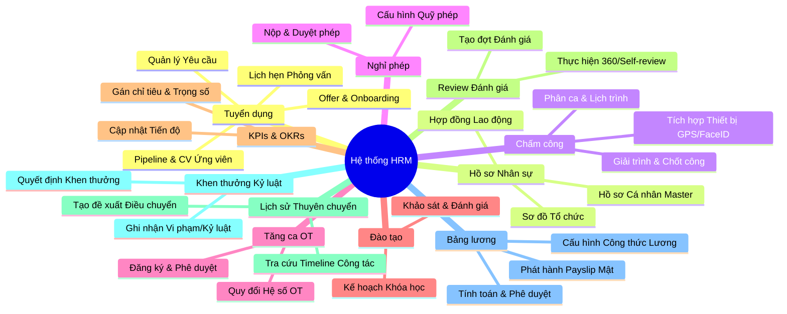

# Mindmap năng lực HRM — nhu cầu khách hàng (sponsor 2026-08-03)

| Mục | Giá trị |
|-----|---------|
| Nguồn | Sponsor bổ sung mong muốn khách · ảnh + text Mermaid |
| Ảnh (màu theo nhánh) | `assets/hrm-capability-mindmap-sponsor-20260803.png` |
| Vai trò | **Nhu cầu mong muốn** — chưa phải phạm vi GĐ1 đã khóa; BA phải map IN / PARTIAL / OUT / GĐ2 |
| Liên kết pack | `BRD_NEW.md` · `SRS_NEW.md` (delta ADD-only sau BA) |

> Màu trên ảnh = nhóm module (không phải mức ưu tiên P0/P1). Không nhét jargon kỹ thuật vào body BRD khách khi promote.

---

## Mermaid (SoT text)

---

## Inventory lá (để BA map)

| Module (màu ảnh) | Năng lực lá |
|------------------|-------------|
| Tuyển dụng | Yêu cầu · Pipeline & CV · Lịch phỏng vấn · Offer & Onboarding |
| Hồ sơ Nhân sự | Sơ đồ tổ chức · Hồ sơ cá nhân master · Hợp đồng LĐ |
| Chấm công | GPS/FaceID · Phân ca & lịch · Giải trình & chốt công |
| Nghỉ phép | Quỹ phép · Nộp & duyệt |
| Tăng ca OT | Đăng ký & phê duyệt · Hệ số OT |
| Đào tạo | Kế hoạch khóa · Khảo sát & đánh giá |
| KPIs & OKRs | Gán chỉ tiêu & trọng số · Cập nhật tiến độ |
| Review Đánh giá | Tạo đợt · 360 / Self-review |
| Thuyên chuyển | Đề xuất điều chuyển · Timeline công tác |
| Khen thưởng / Kỷ luật | Quyết định KT · Ghi nhận vi phạm |
| Bảng lương | Công thức · Tính & phê duyệt · Payslip mật |

---

---

## Gap matrix summary (DOC-ENT-HRM-MMAP-01 · 2026-08-03)

Evidence đầy đủ: `docs/qa/evidence/doc-ent-hrm-mmap-01.md` (27/27 lá).

| Module | IN_GĐ1 | PARTIAL | MISSING | GĐ2 tín hiệu |
|--------|-------:|--------:|--------:|--------------|
| Tuyển dụng | 1 (Yêu cầu) | 3 | 0 | Offer formal · dynamic 13-step |
| Hồ sơ | 2 | 1 (sơ đồ UI) | 0 | Org-chart trực quan |
| Chấm công | 1 (giải trình/chốt) | 2 | 0 | FaceID · roster |
| Nghỉ phép | 1 (nộp/duyệt) | 1 (quỹ) | 0 | Rollover quỹ |
| OT | 0 | 0 | **2** | Cả module → mong muốn/GĐ2 |
| Đào tạo | 0 | 0 | **2** | Cả module → mong muốn/GĐ2 |
| KPIs & OKRs | 0 | 2 | 0 | OKR tiến độ liên tục |
| Review | 1 (tạo đợt) | 1 | 0 | 360 đa rater |
| Thuyên chuyển | 0 | 2 | 0 | WF đề xuất + Timeline FR |
| KT-KL | 0 | 2 | 0 | Log vi phạm tách QSĐ |
| Bảng lương | 2 | 1 (công thức) | 0 | Formula builder |

**BRD promote:** `docs/client-delivery/hrm/BRD_HRM_KHACH.md` mục 10 (v3.1) + phụ lục `BRD_HRM_CAPABILITY_MINDMAP_SLICE.md` — evidence `doc-ent-hrm-mmap-brd-01.md`. **SRS delta** chỉ sau sponsor chốt — `DOC-ENT-HRM-MMAP-SRS-01`.

*File nội bộ đội ngũ — promote sang BRD/SRS chỉ sau BA gap matrix + sponsor confirm phạm vi giai đoạn.*
