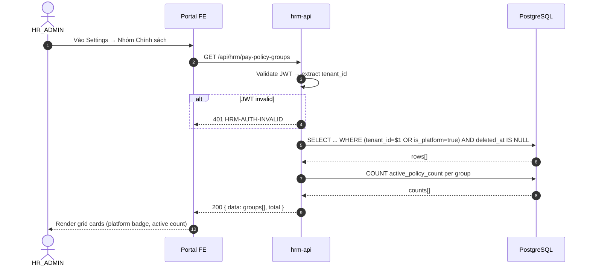
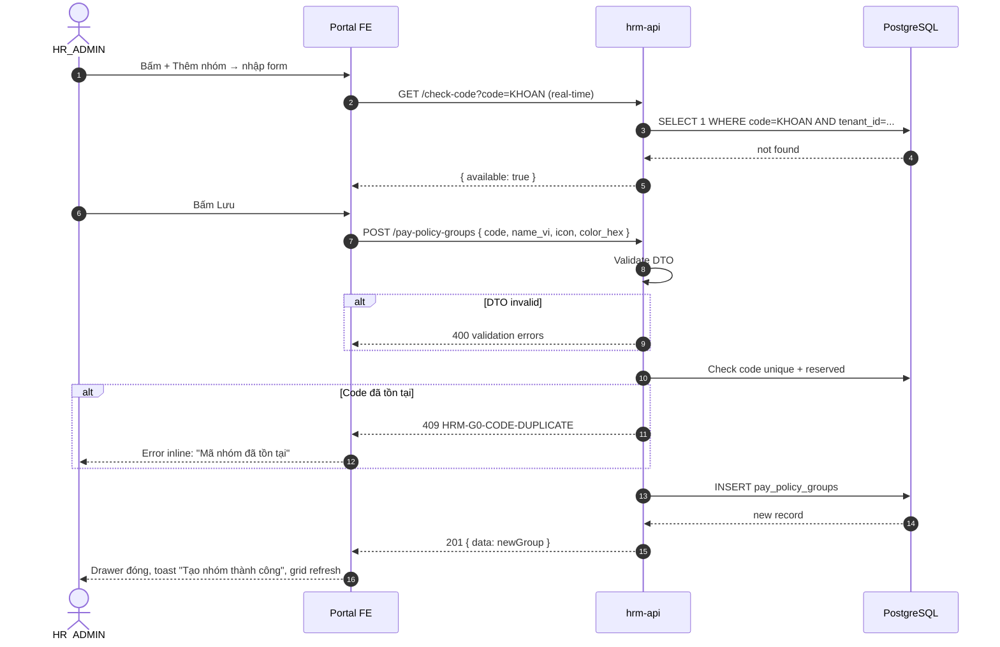

# SRS — G0: Foundation — pay_policy_groups + Catalog Extensions
**Phiên bản:** 1.0 | **Ngày:** 2026-08-27 | **Trạng thái:** DRAFT  
**Tác giả:** BA / PM  
**Tham chiếu:** SRS_HRM_PAYROLL_POLICY_ENGINE_v1 §E0.1 · 13-BRD-SRS-TECHSPEC-QUALITY · AGENTS.md  
**Mã Goal:** G0 | **Phụ thuộc:** Không có

---

## 1. PHẠM VI

G0 xây dựng nền tảng DB + API cho toàn bộ phân hệ Lương:  
1. Bổ sung catalog types còn thiếu (COMPONENT_TYPE, PROVINCE, VEHICLE_TYPE, SHIFT_TYPE, ROUTE_TYPE)  
2. Tạo bảng `pay_policy_groups` — nhóm chính sách động (thay thế `pay_group_code` cứng)  
3. Seed 6 nhóm platform mặc định  
4. Cung cấp CRUD API cho `pay_policy_groups`  

---

## 2. USE CASES

---

### UC-G0-01: Xem danh sách Nhóm Chính sách

**Bảng thuộc tính:**

| Trường | Giá trị |
|--------|---------|
| Mã UC | UC-G0-01 |
| Actor | HR_ADMIN, HR_MANAGER (xem); SYSTEM (internal call) |
| Tiên quyết | Người dùng đã đăng nhập, có JWT tenant_id hợp lệ |
| Độ ưu tiên | P0 |

**Dữ liệu đầu vào:**
- `tenant_id` (từ JWT, bắt buộc)
- Filter tùy chọn: `is_active` (boolean), `page`, `page_size`

**Luồng chính (Main Flow — ≥4 bước):**
1. HR_ADMIN vào màn Settings → Lương → Nhóm Chính sách
2. FE gọi `GET /api/hrm/pay-policy-groups?is_active=true`
3. API kiểm tra JWT → xác định `tenant_id`
4. Query `pay_policy_groups` WHERE `(tenant_id = $1 OR is_platform = true)` AND `deleted_at IS NULL` ORDER BY `sort_order ASC`
5. Trả về danh sách có field: `id, code, name_vi, icon, color_hex, sort_order, is_platform, is_active, active_policy_count`
6. FE render grid cards — platform groups có badge "Hệ thống"

**Quy tắc nghiệp vụ:**
- **BR-G0-01:** Tenant chỉ xem nhóm của mình (`tenant_id` khớp) VÀ nhóm platform (`is_platform = true`)
- **BR-G0-02:** Platform groups luôn xuất hiện đầu tiên (sort_order 10, 20, 30, 40, 50, 60)
- **BR-G0-03:** `active_policy_count` = COUNT(pay_policies WHERE group_id = nhóm này AND status = 'ACTIVE' AND deleted_at IS NULL)

**Fail nghiệp vụ sâu (≥30% diễn biến):**
- JWT không hợp lệ → 401 `HRM-AUTH-INVALID`
- `tenant_id` trong JWT không khớp record nào → trả về array rỗng (không phải 404)
- `page_size > 100` → 400 `HRM-G0-PAGE-SIZE-EXCEEDED`

**Sơ đồ tuần tự:**

**Bảng Diễn biến:**

| # | Tác nhân | Hành động | Hệ thống xử lý | Kết quả |
|---|----------|-----------|----------------|---------|
| 1 | HR_ADMIN | Vào màn Nhóm CS | FE render skeleton | Skeleton loading |
| 2 | FE | GET pay-policy-groups | Validate JWT | Nếu invalid → 401 |
| 3 | API | Extract tenant_id | — | tenant_id xác định |
| 4 | API | Query DB | Filter tenant + platform + not deleted | rows[] |
| 5 | API | JOIN count | COUNT active policies per group | active_policy_count |
| 6 | API | — | Map to response DTO | groups DTO[] |
| 7 | FE | Nhận response | Render cards | Grid hiển thị đúng |
| 8 | FE | Platform group | Disable Edit/Delete btn | Badge "Hệ thống" |
| 9 | HR | Không có nhóm | — | Empty state + CTA |

**Kết quả trả về khi thành công:**
- **Bản ghi:** `pay_policy_groups` đọc (không ghi)
- **Khóa nghiệp vụ trả về:** `id, code, name_vi, icon, color_hex, sort_order, is_platform, is_active, active_policy_count`
- **Người dùng thấy:** Grid cards — mỗi card: icon + màu + tên + số CS active + badge
- **Mở khóa UC kế tiếp:** UC-G0-02 (Tạo nhóm), G4 (Group Hub), G5 (Policy Builder dùng API này để fetch nhóm)

---

### UC-G0-02: Tạo Nhóm Chính sách mới (Tenant)

**Bảng thuộc tính:**

| Trường | Giá trị |
|--------|---------|
| Mã UC | UC-G0-02 |
| Actor | HR_ADMIN |
| Tiên quyết | UC-G0-01 hoàn thành; user có role HR_ADMIN |
| Độ ưu tiên | P0 |

**Dữ liệu đầu vào:**
- `code` (TEXT, bắt buộc): mã nhóm, uppercase, pattern `^[A-Z0-9_]{2,30}$`
- `name_vi` (TEXT, bắt buộc): tên tiếng Việt, ≤100 ký tự
- `icon` (TEXT, optional): emoji hoặc icon key
- `color_hex` (TEXT, optional): hex màu `#RRGGBB`
- `sort_order` (SMALLINT, optional): mặc định = MAX(sort_order)+10
- `description` (TEXT, optional)

**Luồng chính:**
1. HR_ADMIN bấm "+ Thêm nhóm" → Right Drawer mở
2. Điền form: code (uppercase auto), tên, icon, màu, thứ tự
3. Khi blur khỏi ô code → FE gọi `GET /api/hrm/pay-policy-groups/check-code?code=XXX` để unique check real-time
4. Bấm [💾 Lưu] → FE gọi `POST /api/hrm/pay-policy-groups`
5. API validate input (class-validator DTO)
6. API kiểm tra `code` unique trong tenant scope: `SELECT 1 FROM pay_policy_groups WHERE code=$1 AND tenant_id=$2 AND deleted_at IS NULL`
7. API `INSERT INTO pay_policy_groups` với `is_platform=false`, `tenant_id` từ JWT, `created_by` từ JWT
8. Trả về 201 với record vừa tạo
9. FE đóng Drawer, refresh grid, toast "Tạo nhóm thành công"

**Quy tắc nghiệp vụ:**
- **BR-G0-04:** `code` phải unique trong scope (tenant_id hoặc platform). Platform codes LUON, THUONG, GIA, PHAT, BHXH, THUE là reserved — tenant không được dùng.
- **BR-G0-05:** `is_platform = false` cho mọi nhóm do tenant tạo
- **BR-G0-06:** `sort_order` tự động = MAX(sort_order của tenant) + 10 nếu không truyền

**Fail nghiệp vụ sâu:**
- Không có quyền HR_ADMIN → 403 `HRM-AUTH-FORBIDDEN`
- `code` đã tồn tại trong tenant → 409 `HRM-G0-CODE-DUPLICATE` `{"field":"code","message":"Mã nhóm đã tồn tại"}`
- `code` trùng reserved platform code → 409 `HRM-G0-CODE-RESERVED`
- `code` sai format (chứa ký tự đặc biệt, quá ngắn) → 400 `HRM-G0-CODE-INVALID`
- `name_vi` rỗng → 400 `HRM-G0-NAME-REQUIRED`

**Sơ đồ tuần tự:**

**Bảng Diễn biến:**

| # | Tác nhân | Hành động | Hệ thống xử lý | Kết quả |
|---|----------|-----------|----------------|---------|
| 1 | HR_ADMIN | Bấm "+ Thêm nhóm" | FE mở Right Drawer (480px) | Form rỗng |
| 2 | HR | Nhập code "KHOAN" | FE blur → real-time check | API check unique → available |
| 3 | HR | Nhập code "LUON" (reserved) | FE blur → check | API → 409 RESERVED → inline error |
| 4 | HR | Nhập code đã có | FE blur → check | API → 409 DUPLICATE → inline error |
| 5 | HR | Bỏ trống name_vi | FE validate | Error "Tên không được để trống" |
| 6 | HR | Điền đủ, bấm Lưu | FE POST | Validate DTO |
| 7 | API | Validate pass | Check unique DB | Không trùng → INSERT |
| 8 | DB | INSERT thành công | — | Record mới created_at=now() |
| 9 | API | — | Trả 201 + record | FE nhận |
| 10 | FE | Nhận 201 | Đóng Drawer, refresh grid | Card mới xuất hiện cuối grid |
| 11 | FE | — | Toast xanh | "Tạo nhóm thành công" |

**Kết quả trả về khi thành công:**
- **Bản ghi tạo:** 1 row mới trong `pay_policy_groups` (`is_platform=false`, `tenant_id` đúng)
- **Khóa nghiệp vụ:** `id`, `code`, `name_vi`, `sort_order` trả về trong 201
- **Người dùng thấy:** Card mới xuất hiện trong grid Settings, toast thành công
- **Mở khóa UC kế tiếp:** UC-G0-03 (Sửa), UC-G0-04 (Xóa mềm), G3 (FE Settings đầy đủ)

---

### UC-G0-03: Sửa Nhóm Chính sách (Tenant only)

**Bảng thuộc tính:**

| Trường | Giá trị |
|--------|---------|
| Mã UC | UC-G0-03 |
| Actor | HR_ADMIN |
| Tiên quyết | Nhóm tồn tại, `is_platform = false`, user HR_ADMIN |
| Độ ưu tiên | P0 |

**Dữ liệu đầu vào:** `id` (path param) + body: `name_vi`, `icon`, `color_hex`, `sort_order`, `description`, `is_active`

**Luồng chính:**
1. HR_ADMIN bấm ⋮ → Sửa → Right Drawer mở với data hiện tại
2. Sửa các field cho phép (không sửa được `code` sau khi tạo)
3. Bấm [💾 Lưu] → `PUT /api/hrm/pay-policy-groups/:id`
4. API kiểm tra quyền + kiểm tra `is_platform = false` (không sửa platform group)
5. UPDATE record, set `updated_by`, `updated_at`
6. Trả về 200 + record mới

**Quy tắc nghiệp vụ:**
- **BR-G0-07:** Platform groups (`is_platform = true`) **không thể sửa** — 403
- **BR-G0-08:** `code` là immutable sau khi tạo — không có trong PUT body
- **BR-G0-09:** Tenant chỉ sửa nhóm của chính mình (`tenant_id` khớp)

**Fail nghiệp vụ sâu:**
- Sửa platform group → 403 `HRM-G0-PLATFORM-READONLY` "Nhóm hệ thống không thể sửa"
- ID không tồn tại hoặc soft-deleted → 404 `HRM-G0-NOT-FOUND`
- Tenant B cố sửa nhóm của Tenant A → 403 `HRM-AUTH-FORBIDDEN`

**Bảng Diễn biến:**

| # | Tác nhân | Hành động | Hệ thống | Kết quả |
|---|----------|-----------|----------|---------|
| 1 | HR | Bấm ⋮ trên platform card | — | Nút Sửa disabled → không mở drawer |
| 2 | HR | Bấm ⋮ trên tenant card → Sửa | Mở Drawer với data | Form pre-filled |
| 3 | HR | Sửa tên → Lưu | PUT :id | Validate: không có code field |
| 4 | API | Kiểm tra is_platform | True → 403 | Error: Nhóm hệ thống không thể sửa |
| 5 | API | Kiểm tra tenant_id | Không khớp → 403 | Forbidden |
| 6 | API | Tất cả pass | UPDATE DB | 200 + record updated |
| 7 | FE | Nhận 200 | Grid refresh | Card cập nhật tên mới |

**Kết quả trả về khi thành công:**
- **Bản ghi cập nhật:** row `pay_policy_groups` với `updated_at=now()`, `updated_by=userId`
- **Người dùng thấy:** Card cập nhật thông tin mới ngay trên grid, toast "Cập nhật thành công"

---

### UC-G0-04: Xóa mềm Nhóm Chính sách (Tenant only)

**Bảng thuộc tính:**

| Trường | Giá trị |
|--------|---------|
| Mã UC | UC-G0-04 |
| Actor | HR_ADMIN |
| Tiên quyết | Nhóm tồn tại, `is_platform = false` |
| Độ ưu tiên | P0 |

**Dữ liệu đầu vào:** `id` (path param)

**Luồng chính:**
1. HR_ADMIN bấm ⋮ → Xóa
2. FE hiển thị confirm dialog: "Xóa nhóm [Tên]? X chính sách sẽ chuyển về 'Chưa phân nhóm'."
3. Confirm → `DELETE /api/hrm/pay-policy-groups/:id`
4. API kiểm tra: không phải platform group, thuộc tenant, tồn tại
5. API đếm `pay_policies` đang dùng nhóm này
6. Nếu có policies đang ACTIVE → warning nhưng vẫn cho xóa (policies chuyển `group_id = NULL`)
7. `UPDATE pay_policy_groups SET deleted_at = NOW()` (soft-delete)
8. `UPDATE pay_policies SET group_id = NULL WHERE group_id = :id AND deleted_at IS NULL` (cascade null)
9. Trả về 200

**Quy tắc nghiệp vụ:**
- **BR-G0-10:** Soft-delete only — không DELETE vật lý
- **BR-G0-11:** Xóa nhóm không xóa policies — chỉ set `group_id = NULL` (ungroup)
- **BR-G0-12:** Platform groups không thể xóa

**Fail nghiệp vụ sâu:**
- Xóa platform group → 403 `HRM-G0-PLATFORM-READONLY`
- ID không tồn tại hoặc đã deleted → 404 `HRM-G0-NOT-FOUND`
- Tenant B xóa nhóm Tenant A → 403

**Bảng Diễn biến:**

| # | Tác nhân | Hành động | Hệ thống | Kết quả |
|---|----------|-----------|----------|---------|
| 1 | HR | Bấm Xóa trên platform group | — | Nút disabled — không mở dialog |
| 2 | HR | Bấm Xóa trên tenant group | FE mở confirm dialog | Dialog: "Xóa nhóm ABC? 3 CS sẽ ungroup." |
| 3 | HR | Bấm Hủy | — | Dialog đóng, không thay đổi |
| 4 | HR | Bấm Xác nhận | DELETE :id | API validate |
| 5 | API | is_platform check | True → 403 | — (trường hợp bypass FE) |
| 6 | API | tenant_id check | Không khớp → 403 | — |
| 7 | API | UPDATE deleted_at | Soft-delete | Nhóm ẩn khỏi danh sách |
| 8 | API | UPDATE policies | group_id = NULL | Policies ungrouped |
| 9 | FE | Nhận 200 | Xóa card khỏi grid | Toast "Xóa nhóm thành công" |

**Kết quả trả về khi thành công:**
- **Bản ghi cập nhật:** `pay_policy_groups.deleted_at = NOW()`; `pay_policies.group_id = NULL` cho các policy liên quan
- **Người dùng thấy:** Card biến mất khỏi grid, toast "Xóa nhóm thành công"

---

## 3. SEED DATA (Platform Groups)

| code | name_vi | icon | color_hex | sort_order | is_platform |
|------|---------|------|-----------|------------|------------|
| LUONG | Lương | 💰 | #10B981 | 10 | true |
| THUONG | Thưởng | 🏆 | #F59E0B | 20 | true |
| GIA | Phụ cấp & Giá | 🎁 | #3B82F6 | 30 | true |
| PHAT | Phạt & Khấu trừ | ⚠️ | #EF4444 | 40 | true |
| BHXH | BHXH & BHYT | 🏥 | #8B5CF6 | 50 | true |
| THUE | Thuế TNCN | 📊 | #6B7280 | 60 | true |

**Seed strategy:** `INSERT ... ON CONFLICT (code) WHERE is_platform=true DO NOTHING` — idempotent

---

## 4. CẤM (Scope Guard)

- Không sửa schema `pay_policies` trong G0 (thuộc G5)
- Không tạo UI trong G0 (thuộc G3)
- Không seed dữ liệu test để pass QA (U65)
- Không mở lại seals đã có trước đó