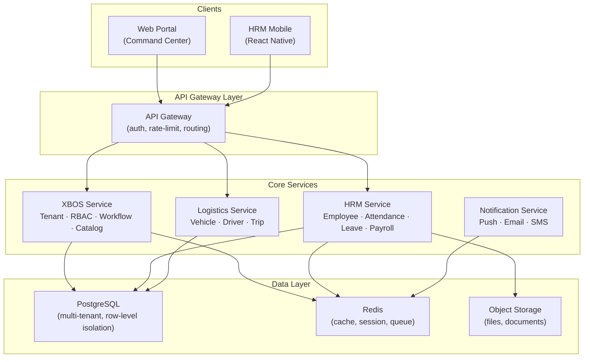
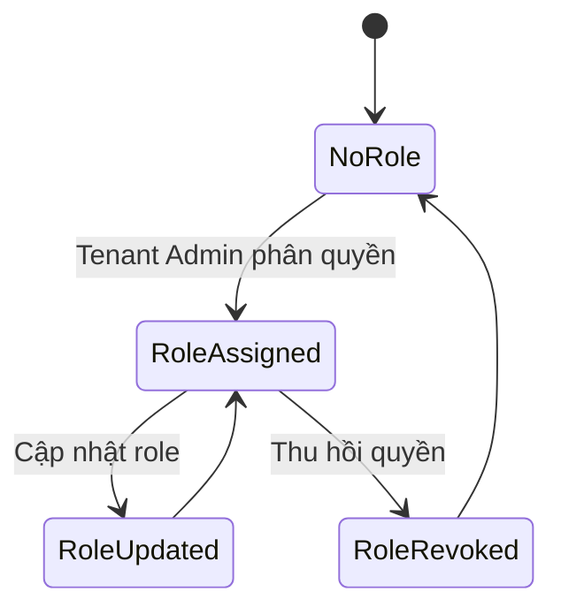
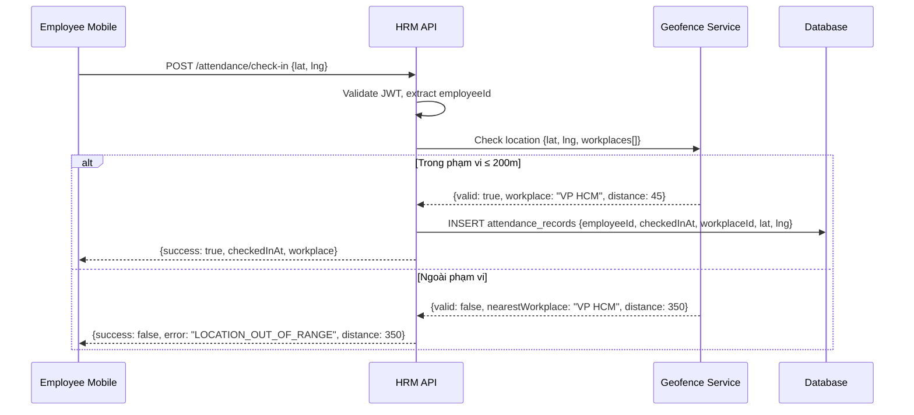
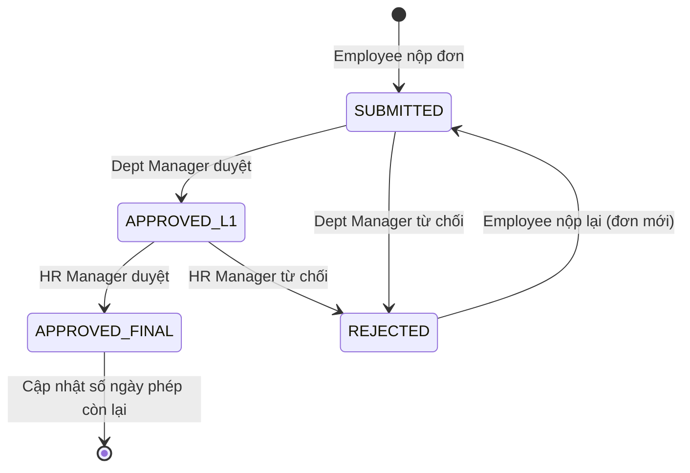
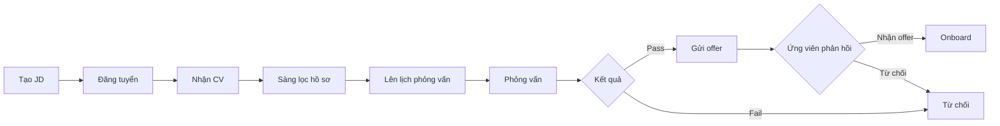
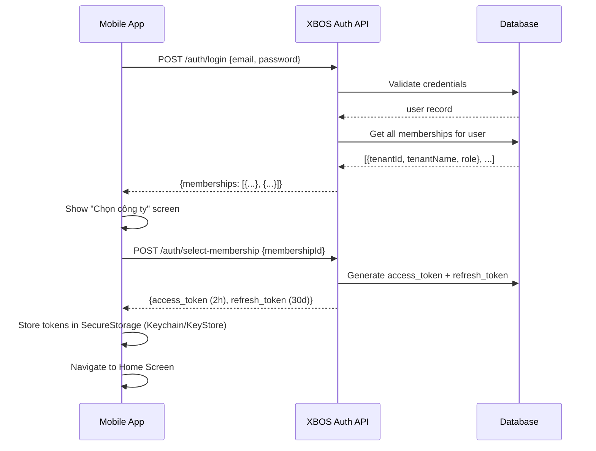
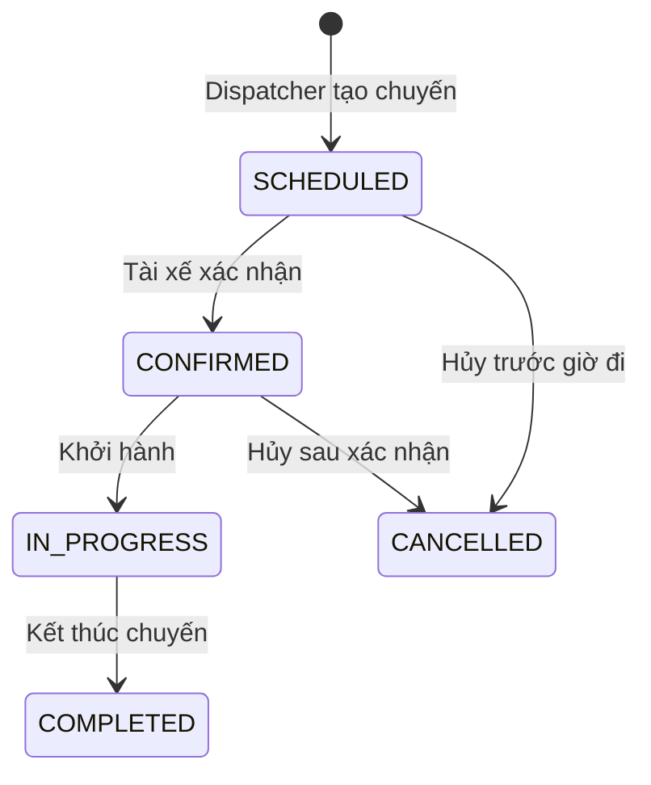

## 1. GIỚI THIỆU TỔNG QUAN

### 1.1. Mục tiêu tài liệu

Tài liệu Yêu cầu Nghiệp vụ (BRD) này mô tả toàn bộ yêu cầu nghiệp vụ của hệ sinh thái phần mềm **XeVN Ecosystem OS** — nền tảng quản trị và vận hành số tập trung, đa pháp nhân, đa nghiệp vụ cho Tập đoàn Xe Việt Nam (XeVN Group).

Tài liệu này phục vụ ba mục đích chính:
- Thống nhất phạm vi và yêu cầu giữa XeVN Group và Unicom Technology Solutions
- Làm nền tảng cho các tài liệu kỹ thuật (SRS, kiến trúc, kế hoạch kiểm thử)
- Đảm bảo mọi phát triển đều bám sát nghiệp vụ thực tế và có thể kiểm chứng

### 1.2. Phạm vi hệ thống

| Phân hệ | Tên đầy đủ | Giai đoạn |
|---|---|---|
| XBOS | X-Business Operating System — Lõi nền tảng đa tenant | Phase 1 |
| HRM Web | Human Resource Management — Web Portal | Phase 1 |
| HRM Mobile | Mobile App cho nhân viên và quản lý | Phase 1 |
| Portal/CC | Web Portal – Command Center & Catalog Governance | Phase 1 |
| Logistics | Quản lý phương tiện, tài xế, lịch trình | Phase 1 (scope hạn chế) |

**Ngoài phạm vi:** CRM, kế toán, ERP tích hợp bên ngoài, AI/ML engine, BI Dashboard nâng cao.

### 1.3. Bối cảnh nghiệp vụ

XeVN Group là tập đoàn hoạt động trong lĩnh vực du lịch, vận tải và dịch vụ với nhiều công ty thành viên (pháp nhân). Hiện tại mỗi công ty vận hành hoàn toàn độc lập, gây ra:

| Vấn đề | Tác động |
|---|---|
| Dữ liệu phân mảnh (Excel, phần mềm khác nhau) | Không nhất quán, báo cáo hợp nhất tốn 3–5 ngày/tháng |
| Quy trình không chuẩn hóa | RACI mờ nhạt, phê duyệt không kiểm soát được |
| Onboarding chậm | Thêm công ty mới mất 2–4 tuần setup |
| Quản lý nhân sự thủ công | Chấm công bằng giấy, lương tính bằng Excel |
| Không có mobile access | Manager không duyệt được ngoài văn phòng |

### 1.4. Nhóm người dùng chính

| Role | Mô tả | Số lượng ước tính |
|---|---|---|
| Super Admin (SA) | Quản trị toàn nền tảng, tạo tenant, quản lý catalog gốc | 2–5 người (Unicom) |
| Tenant Admin (TA) | Quản trị trong phạm vi công ty, tạo phòng ban, phân quyền | 1–3/tenant |
| HR Manager | Quản lý nhân sự, chấm công, lương, tuyển dụng | 1–5/tenant |
| Dept Manager | Quản lý phòng ban, duyệt đơn | 3–20/tenant |
| Employee | Nhân viên thông thường — sử dụng Mobile App | 50–500/tenant |
| Finance Staff | Xem và export bảng lương | 1–3/tenant |
| Recruiter | Quản lý tuyển dụng | 1–5/tenant |
| Fleet Manager | Quản lý phương tiện (Logistics) | 1–3/tenant |
| Dispatcher | Lên lịch chuyến xe | 1–5/tenant |

---

## 2. KIẾN TRÚC TỔNG THỂ

### 2.1. Sơ đồ kiến trúc hệ sinh thái

### 2.2. Nguyên tắc kiến trúc đa tenant

| Nguyên tắc | Cơ chế thực thi |
|---|---|
| Data isolation | Row-level: tất cả bảng đều có cột `tenant_id`, mọi truy vấn tự filter |
| Identity isolation | JWT mang `tenantId + membershipId + roles[]`, không bao giờ cross-tenant |
| Config isolation | Mỗi tenant có catalog riêng (extend từ catalog gốc) |
| Audit trail | Mọi thao tác ghi `{actor, tenantId, action, resource, timestamp}` |
| No hard delete | Tenant chỉ SUSPENDED/ARCHIVED; nhân viên chỉ INACTIVE |

---

## 3. PHÂN HỆ XBOS — X-BUSINESS OPERATING SYSTEM

### 3.1. Luồng B1 — Khởi tạo Tenant mới

**Mục tiêu:** Onboard một pháp nhân mới vào hệ sinh thái XeVN trong thời gian dưới 30 phút.

**Nhóm người dùng:** Super Admin, Tenant Admin mới được tạo

**Điều kiện tiên quyết:**
- SA đã xác thực và giữ vai trò `SUPER_ADMIN`
- Thông tin pháp nhân đã được XeVN Group phê duyệt nội bộ

**Luồng chính (Happy Path):**

1. SA truy cập Command Center → "Tenants" → "Tạo Tenant mới"
2. SA nhập: Tên công ty (Name), Slug, Ngành nghề (Industry), Email Tenant Admin, Tên Tenant Admin
3. Hệ thống validate realtime:
   - Slug check unique khi rời ô nhập
   - Email check domain whitelist khi rời ô nhập
4. SA bấm "Tạo Tenant"
5. Hệ thống tạo tenant record: `{tenantId, name, slug, status: PROVISIONING}`
6. Hệ thống tạo Membership cho TA: `{userId, tenantId, role: TENANT_ADMIN}`
7. Hệ thống gửi email kích hoạt (link 48h) đến adminEmail
8. Tenant status chuyển `ACTIVE`
9. UI thông báo: "Tenant [Tên] đã tạo thành công. Email kích hoạt đã gửi đến [email]."

**Luồng ngoại lệ:**

| Tình huống | Điều kiện | Hành động hệ thống | Hiển thị người dùng |
|---|---|---|---|
| Slug trùng | Slug đã tồn tại | Reject | "Slug này đã được sử dụng. Gợi ý: [xe-du-lich-2]" |
| Email sai domain | Domain không trong whitelist | Reject | "Email phải thuộc @xe.vn hoặc domain đã đăng ký" |
| Mạng gián đoạn | API timeout > 5s | Retry 1 lần, sau đó rollback | "Kết nối gián đoạn. Vui lòng thử lại." |
| Link activation hết hạn | > 48h kể từ khi tạo | Link vô hiệu | SA phải resend qua nút "Gửi lại email" |

**Quy tắc nghiệp vụ:**

| BR-ID | Quy tắc | Mức độ |
|---|---|---|
| BR-B01-01 | Slug: unique toàn hệ thống, chỉ `[a-z0-9-]`, 3–50 ký tự | Bắt buộc |
| BR-B01-02 | Email bắt buộc domain @xe.vn hoặc domain đã đăng ký với XeVN | Bắt buộc |
| BR-B01-03 | Link kích hoạt hết hạn sau 48h; SA cần resend nếu quá hạn | Bắt buộc |
| BR-B01-04 | Tenant không được hard delete — chỉ `SUSPENDED` hoặc `ARCHIVED` | Bắt buộc |
| BR-B01-05 | Mỗi tenant phải có ít nhất 1 Tenant Admin active | Bắt buộc |

**Mã lỗi:**

| Mã lỗi | HTTP | Mô tả | Hành động gợi ý |
|---|---|---|---|
| `TENANT_SLUG_EXISTS` | 409 | Slug đã tồn tại | Thay slug khác |
| `TENANT_EMAIL_INVALID` | 422 | Email sai format | Kiểm tra lại email |
| `TENANT_EMAIL_DOMAIN` | 422 | Domain không hợp lệ | Dùng email @xe.vn |
| `TENANT_ADMIN_EXISTS` | 409 | Email đã là TA của tenant khác | Xác nhận nếu muốn thêm |

**Tiêu chí chấp nhận:**
- SA tạo → TA nhận email → click link → đặt mật khẩu → đăng nhập thành công: **PASS**
- SA nhập slug đã có → lỗi inline ngay: **PASS**
- Link kích hoạt hết hạn 48h → resend thành công: **PASS**
- Không thể xóa cứng tenant đang ACTIVE: **PASS**

---

### 3.2. Luồng B2 — Phân quyền RBAC đa tầng

**Cấu trúc 3 tầng:**

| Tầng | Phạm vi | Role |
|---|---|---|
| Platform | Toàn hệ sinh thái | `SUPER_ADMIN` |
| Tenant | Trong 1 công ty | `TENANT_ADMIN`, `HR_MANAGER`, `DEPT_MANAGER`, `FINANCE_STAFF`, `RECRUITER` |
| Resource | Trên resource cụ thể | Scope: department, payroll-period… |

**Trạng thái workflow phân quyền:**

**Quy tắc:**
- Người dùng có thể thuộc nhiều tenant với role khác nhau trong từng tenant
- Token JWT chỉ mang role của 1 tenant active trong phiên hiện tại
- Truy cập tài nguyên không có quyền → HTTP 403, UI thông báo rõ ràng
- Xóa role đang active → cảnh báo, yêu cầu xác nhận, ghi audit log đầy đủ
- Role `TENANT_ADMIN` chỉ `SUPER_ADMIN` mới được gán

---

### 3.3. Luồng B3 — Workflow Engine và RACI

**Trạng thái workflow:**

| Trạng thái | Mô tả | Transition tiếp theo |
|---|---|---|
| `SUBMITTED` | Vừa nộp | `L1_PENDING` |
| `L1_PENDING` | Chờ cấp 1 duyệt | `L1_APPROVED` / `REJECTED` |
| `L1_APPROVED` | Cấp 1 duyệt xong | `L2_PENDING` |
| `L2_PENDING` | Chờ cấp 2 duyệt | `L2_APPROVED` / `REJECTED` |
| `L2_APPROVED` | Hoàn tất phê duyệt | — |
| `REJECTED` | Bị từ chối | Có thể nộp lại |
| `CANCELLED` | Người dùng hủy trước khi có quyết định | — |

**SLA phê duyệt:**
- Cấp 1 tối đa **24h làm việc**; cấp 2 tối đa **48h**
- Quá SLA → reminder mỗi 4h; quá 2×SLA → escalate lên cấp trên
- Anti-self-approval bắt buộc (người nộp ≠ người duyệt ở bất kỳ cấp nào)

---

### 3.4. Luồng B4 — Catalog Governance

**Catalog phân cấp 2 tầng:**

| Tầng | Chủ sở hữu | Ví dụ | Quyền |
|---|---|---|---|
| Platform catalog | Super Admin | Ngành nghề, Loại hợp đồng cơ bản, Loại nghỉ phép | SA: CRUD |
| Tenant catalog | Tenant Admin | Chức danh riêng, Phụ cấp riêng, Quy tắc lương riêng | TA: extend, không xóa gốc |

**Quy tắc:**
- SA: tạo/sửa/xóa catalog cấp nền tảng
- TA: chỉ được thêm giá trị mới, không xóa giá trị nền tảng
- Thay đổi catalog propagate xuống tất cả tenant (flag cập nhật 7 ngày)
- Giá trị đang được reference không thể hard delete

---

## 4. PHÂN HỆ HRM WEB — QUẢN LÝ NHÂN SỰ

### 4.1. Luồng H1 — Quản lý hồ sơ nhân viên

**Màn hình chức năng:**

| Màn hình | Chức năng chính |
|---|---|
| Danh sách nhân viên | Tìm kiếm, filter theo phòng ban/trạng thái/vị trí, export CSV/Excel |
| Hồ sơ chi tiết | Xem và sửa thông tin cá nhân, hợp đồng, lịch sử nghỉ phép, bảng lương |
| Form tạo mới | 4 tab: Thông tin cá nhân / Vị trí công việc / Hợp đồng & Lương / Tài liệu |
| Lịch sử thay đổi | Audit log: ai sửa gì, khi nào |

**Dữ liệu bắt buộc khi tạo hồ sơ:**

| Trường | Loại | Quy tắc validation |
|---|---|---|
| `fullName` | String | 2–200 ký tự |
| `nationalId` | String | CCCD 12 số hoặc CMND 9 số, unique trong tenant |
| `dateOfBirth` | Date | Tuổi từ 15–70 |
| `email` | Email | Unique trong tenant |
| `departmentId` | UUID | Phải tồn tại trong tenant |
| `positionId` | UUID | Phải tồn tại trong catalog tenant |
| `managerId` | UUID | Phải là nhân viên active trong cùng tenant |
| `contractType` | Enum | `FULL_TIME`, `PROBATION`, `CONTRACT`, `INTERN` |
| `startDate` | Date | Không sớm hơn today − 365 ngày |
| `baseSalary` | Decimal | ≥ lương tối thiểu vùng (configurable per tenant) |

**Quy tắc:**
- CCCD/CMND phải unique trong tenant
- Ngày bắt đầu HĐ không được trước ngày tạo hồ sơ quá 365 ngày
- Lương cơ bản ≥ lương tối thiểu vùng (configurable)
- Mỗi NV bắt buộc có ≥1 phòng ban và 1 người quản lý trực tiếp

**Mã lỗi:**

| Mã lỗi | HTTP | Mô tả |
|---|---|---|
| `EMPLOYEE_NATIONAL_ID_EXISTS` | 409 | CCCD đã tồn tại trong tenant |
| `EMPLOYEE_EMAIL_EXISTS` | 409 | Email đã tồn tại trong tenant |
| `EMPLOYEE_DEPT_NOT_FOUND` | 422 | Phòng ban không tồn tại |
| `EMPLOYEE_SALARY_TOO_LOW` | 422 | Lương thấp hơn tối thiểu vùng |

---

### 4.2. Luồng H2 — Chấm công (Attendance)

**Sequence diagram chấm công GPS:**

**Quy tắc chấm công:**

| Quy tắc | Giá trị | Có thể cấu hình |
|---|---|---|
| Bán kính check-in hợp lệ | ≤ 200m | ✅ Per tenant |
| Số lần check-in/ngày | 1 lần duy nhất | ❌ |
| Check-out sau check-in tối thiểu | 1h | ✅ Per tenant |
| Tự động đóng ca nếu quên check-out | Sau 10h | ✅ Per tenant |
| GPS accuracy tối thiểu | ≤ 50m | ❌ |

**Mã lỗi:**

| Mã lỗi | HTTP | Mô tả |
|---|---|---|
| `ATTENDANCE_LOCATION_OUT_OF_RANGE` | 422 | Ngoài bán kính cho phép |
| `ATTENDANCE_ALREADY_CHECKED_IN` | 409 | Đã check-in hôm nay |
| `ATTENDANCE_GPS_MOCK_DETECTED` | 403 | Phát hiện giả mạo GPS |
| `ATTENDANCE_NO_WORKPLACE` | 422 | Không có địa điểm làm việc được assign |

---

### 4.3. Luồng H3 — Nghỉ phép

**Các loại nghỉ phép tiêu chuẩn:**

| Loại | Ngày phép/năm | Quy tắc đặc biệt |
|---|---|---|
| Phép năm | 12 ngày | Tích lũy theo thâm niên |
| Nghỉ bệnh | Không giới hạn | Cần giấy bác sĩ nếu ≥ 3 ngày liên tiếp |
| Nghỉ thai sản | 6 tháng | Theo Luật Lao động VN |
| Nghỉ không lương | Không giới hạn | Cần TA hoặc HR Manager duyệt |
| Nghỉ hưởng phép bù | Từ giờ làm thêm | Quy đổi theo hệ số |

**Luồng nộp và duyệt:**

**Quy tắc nghỉ phép:**

| Quy tắc | Mô tả |
|---|---|
| Nộp sớm tối thiểu | Phép năm: 3 ngày trước; bệnh: không yêu cầu; sự kiện gia đình: 1 ngày trước |
| Tính ngày nghỉ | Loại trừ ngày lễ (theo lịch tenant) và cuối tuần |
| Số dư phép | Không thể nghỉ quá số dư; ngoại trừ nghỉ không lương |
| Chồng lịch | Hệ thống cảnh báo manager nếu ≥ 30% team nghỉ cùng ngày |

---

### 4.4. Luồng H4 — Tính lương và Phiếu lương

**Công thức tính lương thực nhận:**

> **Lương thực nhận = Lương cơ bản + Phụ cấp cố định − Khấu trừ nghỉ không phép − BHXH (8%) − BHYT (1.5%) − BHTN (1%) − Thuế TNCN lũy tiến**

**Quy trình phát lương:**

| Bước | Thời điểm | Actor | Action |
|---|---|---|---|
| 1. Batch tính lương | Ngày 25 hàng tháng | System | Lấy dữ liệu chấm công + nghỉ phép, tính lương từng NV |
| 2. HR Review | Ngày 25–28 | HR Manager | Kiểm tra, điều chỉnh nếu cần |
| 3. Finance Approve | Ngày 28–30 | Finance Staff | Xem tổng quỹ lương, duyệt |
| 4. TA Confirm | Ngày 30 | Tenant Admin | Ký duyệt chính thức |
| 5. Phát phiếu | Cuối tháng | System | Gửi notification + tạo PDF cho từng NV |
| 6. Lock | Sau khi phát | System | Khóa kỳ lương, không sửa được |

---

### 4.5. Luồng H5 — Tuyển dụng

**Pipeline tuyển dụng:**

**Trạng thái ứng viên:**
`NEW → SCREENING → INTERVIEW_SCHEDULED → INTERVIEWED → OFFER_SENT → HIRED / REJECTED / WITHDREW`

---

## 5. PHÂN HỆ HRM MOBILE

### 5.1. Luồng M1 — Đăng nhập đa tenant (Multi-tenant Login)

**Quy trình xác thực đầy đủ:**

**Quy tắc bảo mật mobile:**

| Quy tắc | Giá trị |
|---|---|
| Password | ≥ 8 ký tự, gồm chữ hoa + chữ thường + số |
| Lockout policy | 5 lần sai → khóa 30 phút, gửi email cảnh báo |
| Access token | TTL: 2h |
| Refresh token | TTL: 30 ngày (rotating refresh) |
| Biometric unlock | Face ID / Fingerprint sau lần đăng nhập đầu tiên |
| Force logout | Từ xa khi phát hiện thiết bị lạ (theo device fingerprint) |

---

### 5.2. Luồng M2 — Check-in GPS

**Trải nghiệm người dùng trên màn hình Check-in:**

| Element | Trạng thái bình thường | Khi ngoài phạm vi |
|---|---|---|
| Map view | Hiển thị vị trí hiện tại + vòng tròn geofence xanh | Geofence hiển thị đỏ |
| Label địa điểm | "Trong phạm vi VP HCM (45m)" | "Ngoài phạm vi — gần nhất: VP HCM (350m)" |
| Nút Check-in | Xanh, enabled | Xám, disabled hoặc "Xin phép check-in từ xa" |
| Đồng hồ | Realtime, font lớn | Realtime |

**Các trường hợp đặc biệt:**

| Tình huống | Xử lý |
|---|---|
| GPS không bắt được | Cảnh báo + nút "Check-in thủ công" (cần manager confirm) |
| Thiết bị mock GPS | Block check-in, ghi cảnh báo bảo mật vào audit log |
| Ngoài tất cả phạm vi | Dropdown chọn địa điểm thủ công |
| Đã check-in hôm nay | Badge "Đã check-in lúc 08:32", không cho check-in lại |
| Offline | Disable nút, hiển thị "Cần kết nối internet để check-in" |

---

### 5.3. Luồng M3 — Nghỉ phép Mobile (Employee + Manager)

**Luồng Employee — Tạo đơn:**

| Bước | Màn hình | Thao tác |
|---|---|---|
| 1 | Leave Type | Chọn loại: Phép năm / Nghỉ bệnh / Nghỉ không lương |
| 2 | Date Picker | Chọn ngày bắt đầu + kết thúc (highlight ngày lễ đỏ, cuối tuần xanh) |
| 3 | Summary | Hiển thị "Bạn sẽ nghỉ N ngày. Phép còn lại sau khi nghỉ: X ngày" |
| 4 | Reason | Nhập lý do (min 10 ký tự); upload file nếu cần |
| 5 | Confirm | Preview toàn bộ đơn + nút "Gửi đơn" |
| 6 | Result | Push notification: "Đơn nghỉ phép đã gửi" |

**Luồng Manager — Duyệt đơn:**

| Bước | Màn hình | Thao tác |
|---|---|---|
| 1 | Push notification | "Đơn nghỉ từ Nguyễn Văn A (2 ngày, 25–26/06)" |
| 2 | Detail screen | Xem: tên NV, loại, ngày, lý do, lịch sử nghỉ cả năm |
| 3 | Team calendar | Xem ai đang nghỉ cùng ngày trong tổ đội |
| 4 | Decision | Bấm "Duyệt" hoặc "Từ chối" (lý do bắt buộc) |
| 5 | Result | NV nhận push notification kết quả trong ≤ 30 giây |

---

### 5.4. Luồng M4 — Phiếu lương Mobile

**Cấu trúc màn hình phiếu lương:**

| Phần | Chi tiết |
|---|---|
| **Header** | Tên NV · Mã NV · Kỳ lương · Badge "Đã thanh toán" |
| **Thu nhập** | Lương cơ bản + Phụ cấp xăng xe + Phụ cấp điện thoại + Bonus |
| **Khấu trừ** | BHXH (8%) + BHYT (1.5%) + BHTN (1%) + Thuế TNCN |
| **Tổng kết** | **Lương thực nhận** (highlight màu xanh, font 24px bold) |
| **Actions** | Nút "Tải PDF" · Nút "Chia sẻ" |

**Bảo mật phiếu lương:**
- Màn hình tự blur khi app xuống nền (background)
- Screenshot được ghi vào audit log (không chặn nhưng có trace)
- File PDF được encrypt khi download, mở cần xác thực lại

---

### 5.5. Offline Mode

**Cache strategy:**

| Dữ liệu | TTL | Cập nhật khi |
|---|---|---|
| Profile nhân viên | 24h | Đăng nhập mới |
| Lịch sử chấm công 30 ngày | 1h | App foreground |
| Phiếu lương 3 tháng gần nhất | 7 ngày | Sau kỳ phát lương |
| Danh sách đơn nghỉ phép | 30 phút | Sau mỗi thay đổi |
| Địa điểm làm việc | 7 ngày | Khi admin cập nhật |

**Hành vi offline:**

| Feature | Offline behavior | Reason |
|---|---|---|
| Check-in GPS | ❌ Không khả dụng | Cần GPS realtime + API validate |
| Xem lịch sử chấm công | ✅ Khả dụng từ cache | Dữ liệu đã cache |
| Xem phiếu lương | ✅ Khả dụng từ cache | Dữ liệu đã cache |
| Tạo đơn nghỉ phép | ⏳ Queue, sync khi có mạng | Offline queue với UUID local |
| Nhận push notification | ❌ Không nhận | Cần internet |

---

## 6. WEB PORTAL / COMMAND CENTER

### 6.1. Command Center Dashboard

**Widgets hiển thị theo role:**

| Widget | Super Admin | Tenant Admin | HR Manager |
|---|---|---|---|
| Số tenant active | ✅ | ❌ | ❌ |
| NV cần duyệt đơn | ❌ | ✅ | ✅ |
| Bảng lương kỳ này | ❌ | ✅ | ✅ |
| Alert hệ thống | ✅ | ❌ | ❌ |
| Tỷ lệ chấm công hôm nay | ❌ | ✅ | ✅ |
| Đơn tuyển dụng đang mở | ❌ | ✅ | ✅ |

### 6.2. Catalog Governance Portal

**Phân quyền theo catalog type:**

| Catalog | SA | TA | Note |
|---|---|---|---|
| Ngành nghề (Industry) | CRUD | Read only | Nền tảng |
| Loại hợp đồng | CRUD | Read only | Nền tảng |
| Loại nghỉ phép | CRUD | Extend | TA có thể thêm loại riêng |
| Chức danh | CRUD | CRUD | TA quản lý chức danh công ty |
| Phụ cấp | CRUD | CRUD | TA quản lý phụ cấp riêng |
| Quy tắc lương | CRUD | CRUD | TA định nghĩa quy tắc cho tenant |

---

## 7. PHÂN HỆ LOGISTICS (GIAI ĐOẠN 1)

### 7.1. Luồng L1 — Quản lý phương tiện và lịch trình

**Dữ liệu phương tiện:**

| Trường | Loại | Quy tắc |
|---|---|---|
| `licensePlate` | String | Format biển số VN, unique trong tenant |
| `vehicleType` | Enum | `BUS`, `MINIBUS`, `CAR` |
| `capacity` | Integer | 1–100 chỗ |
| `registrationExpiry` | Date | Cảnh báo 30 ngày trước hết hạn |
| `insuranceExpiry` | Date | Cảnh báo 30 ngày trước hết hạn |
| `inspectionExpiry` | Date | Cảnh báo 30 ngày trước hết hạn |

**Vòng đời chuyến xe:**

**Cảnh báo tự động:**

| Loại cảnh báo | Ngưỡng | Kênh |
|---|---|---|
| Giấy tờ xe sắp hết hạn | 30 ngày trước | Email + Push cho Fleet Manager |
| Giấy tờ xe sắp hết hạn (nhắc lại) | 7 ngày trước | Email + Push (priority cao) |
| Xe không có bảo dưỡng định kỳ | 6 tháng không bảo dưỡng | Email cho TA |
| Tài xế lái liên tục | > 8h không nghỉ | Push cho Dispatcher |

---

## 8. YÊU CẦU PHI CHỨC NĂNG (NFR)

### 8.1. Hiệu năng

| Chỉ tiêu | Mục tiêu | Đo lường |
|---|---|---|
| API response P95 | < 300ms (CRUD thông thường) | Load test 100 RPS |
| API response P99 | < 800ms | Load test 100 RPS |
| Mobile app cold start | < 3 giây | iOS 14, Android 8 |
| Mobile screen transition | < 500ms | Manual + automation |
| Batch lương tháng (500 NV) | < 30 phút | Staging test |
| Web portal page load | < 2 giây (FCP) | Lighthouse score ≥ 80 |

### 8.2. Bảo mật

| Control | Mô tả |
|---|---|
| Authentication | JWT RS256, access token 2h, refresh token 30 ngày rotating |
| Authorization | RBAC + row-level tenant isolation |
| Transport | HTTPS/TLS 1.3 bắt buộc |
| Password | bcrypt cost ≥ 12 |
| Input validation | Schema validation mọi API endpoint |
| Audit log | Immutable, ghi mọi create/update/delete |
| Secrets | Không hardcode secret; dùng vault/env |
| OWASP Top 10 | Phải pass trước khi go-live |

### 8.3. Độ sẵn sàng

| SLA | Mục tiêu |
|---|---|
| Uptime | ≥ 99.5%/tháng |
| Planned downtime | < 4h/tháng (thông báo trước 48h) |
| Recovery Time Objective (RTO) | < 2h |
| Recovery Point Objective (RPO) | < 1h |
| Backup | Daily snapshot, retain 30 ngày |

### 8.4. Khả năng mở rộng

- Hỗ trợ ≥ 50 tenant với ≤ 10,000 nhân viên mỗi tenant
- Schema hỗ trợ sharding theo `tenant_id` khi scale
- API stateless, horizontal scale dễ dàng
- File storage S3-compatible (MinIO → AWS S3 khi cần)

---

## 9. YÊU CẦU TÍCH HỢP

### 9.1. Tích hợp bên trong hệ sinh thái

| Tích hợp | Direction | Protocol | Ghi chú |
|---|---|---|---|
| XBOS → HRM | Đơn chiều | REST API | Tenant config, catalog, user profile |
| HRM → XBOS | Đơn chiều | Event queue | Workflow instances |
| HRM → Notification | Đơn chiều | Event queue | Push/email triggers |
| Portal → XBOS, HRM | Đọc/ghi | REST API | Admin actions |

### 9.2. Tích hợp bên ngoài

| Hệ thống | Loại | Giai đoạn |
|---|---|---|
| Firebase Cloud Messaging | Push notifications Mobile | Phase 1 |
| SMTP (Gmail/SendGrid) | Email thông báo | Phase 1 |
| Google Maps / Mapbox | Hiển thị bản đồ check-in | Phase 1 |
| Ngân hàng | Chuyển lương (nếu có) | Phase 2 |

---

## 10. TIÊU CHÍ CHẤP NHẬN

### 10.1. XBOS Platform

| # | Tiêu chí | Phương pháp kiểm chứng | Kết quả mong đợi |
|---|---|---|---|
| AC-B01 | Tạo tenant mới thành công trong < 30 phút | Manual test + smoke test | Tenant ACTIVE, email kích hoạt nhận được |
| AC-B02 | Phân quyền đúng — user không thể truy cập tenant khác | API test với cross-tenant token | HTTP 403 |
| AC-B03 | Workflow duyệt đúng cấp, không self-approve | Integration test | Use case thành công |
| AC-B04 | Catalog inheritance đúng — TA không xóa được gốc | API test | HTTP 403 |
| AC-B05 | Audit log đầy đủ cho mọi thao tác | Log review | Log entry đủ fields |

### 10.2. HRM Web

| # | Tiêu chí | Phương pháp | Kết quả |
|---|---|---|---|
| AC-H01 | Tạo hồ sơ NV đầy đủ, validation đúng | Manual + API test | Employee record created |
| AC-H02 | Chấm công GPS, trong phạm vi → thành công; ngoài → từ chối | Device test tại VP | Pass/Fail theo vị trí |
| AC-H03 | Nghỉ phép: duyệt 2 cấp, số dư phép cập nhật đúng | Integration test | Leave balance đúng |
| AC-H04 | Tính lương: công thức đúng, export PDF | Manual verify + formula audit | Số liệu khớp Excel |
| AC-H05 | Bảng lương khóa sau phê duyệt | API test | HTTP 403 khi sửa |

### 10.3. HRM Mobile

| # | Tiêu chí | Phương pháp | Kết quả |
|---|---|---|---|
| AC-M01 | Đăng nhập chọn tenant → token đúng | E2E test | Home screen đúng role |
| AC-M02 | Biometric unlock thành công sau login đầu | Device test | Unlock thành công |
| AC-M03 | Check-in GPS mock → bị block | Security test | HTTP 403 |
| AC-M04 | Offline xem phiếu lương từ cache | Airplane mode test | Hiển thị từ cache |
| AC-M05 | Push notification ≤ 30s sau sự kiện | Latency test | Notification nhận được |

---

## 11. BẢNG TỔNG HỢP USE CASES

| ID | Module | Use Case | Actor chính | Priority |
|---|---|---|---|---|
| UC-B01 | XBOS | Tạo Tenant mới | Super Admin | P0 |
| UC-B02 | XBOS | Kích hoạt Tenant Admin | Tenant Admin | P0 |
| UC-B03 | XBOS | Phân quyền RBAC | Tenant Admin | P0 |
| UC-B04 | XBOS | Workflow Engine — phê duyệt đơn | Employee/Manager | P0 |
| UC-B05 | XBOS | Catalog Governance | Super Admin/TA | P1 |
| UC-B06 | XBOS | Audit Log & Compliance | System | P1 |
| UC-B07 | XBOS | Impersonate Tenant (SA support) | Super Admin | P2 |
| UC-H01 | HRM | Tạo hồ sơ nhân viên | HR Manager | P0 |
| UC-H02 | HRM | Cập nhật hồ sơ, lịch sử hợp đồng | HR Manager | P0 |
| UC-H03 | HRM | Check-in/Check-out GPS | Employee | P0 |
| UC-H04 | HRM | Điều chỉnh chấm công thủ công | HR Manager | P1 |
| UC-H05 | HRM | Nộp đơn nghỉ phép | Employee | P0 |
| UC-H06 | HRM | Duyệt đơn nghỉ phép | Dept/HR Manager | P0 |
| UC-H07 | HRM | Tính lương tháng | System/HR | P0 |
| UC-H08 | HRM | HR review & điều chỉnh lương | HR Manager | P0 |
| UC-H09 | HRM | Phê duyệt và khóa bảng lương | Finance/TA | P0 |
| UC-H10 | HRM | Tạo tin tuyển dụng | Recruiter | P1 |
| UC-H11 | HRM | Pipeline ứng viên | Recruiter | P1 |
| UC-H12 | HRM | Báo cáo nhân sự | HR Manager | P1 |
| UC-M01 | HRM Mobile | Đăng nhập chọn tenant | Employee | P0 |
| UC-M02 | HRM Mobile | Biometric unlock | Employee | P1 |
| UC-M03 | HRM Mobile | Check-in GPS | Employee | P0 |
| UC-M04 | HRM Mobile | Xem & tạo đơn nghỉ phép | Employee | P0 |
| UC-M05 | HRM Mobile | Duyệt đơn nghỉ phép (Manager) | Dept Manager | P0 |
| UC-M06 | HRM Mobile | Xem phiếu lương | Employee | P1 |
| UC-M07 | HRM Mobile | Push Notifications | System | P1 |
| UC-M08 | HRM Mobile | Offline cache & sync | System | P1 |
| UC-P01 | Portal | Command Center Dashboard | SA/TA/HR | P1 |
| UC-P02 | Portal | Catalog Management | SA/TA | P1 |
| UC-P03 | Portal | Tenant Admin Panel | Tenant Admin | P0 |
| UC-L01 | Logistics | Quản lý phương tiện | Fleet Manager | P1 |
| UC-L02 | Logistics | Quản lý tài xế | Fleet Manager | P1 |
| UC-L03 | Logistics | Lên lịch chuyến | Dispatcher | P1 |
| UC-L04 | Logistics | Xác nhận và tracking chuyến | Driver | P2 |

---

## 12. GLOSSARY — THUẬT NGỮ

| Thuật ngữ | Định nghĩa |
|---|---|
| **Tenant** | Một pháp nhân (công ty thành viên) trong hệ sinh thái XeVN |
| **Membership** | Liên kết giữa 1 User và 1 Tenant, kèm role |
| **XBOS** | X-Business Operating System — lõi platform đa tenant |
| **RBAC** | Role-Based Access Control — phân quyền theo vai trò |
| **Workflow Engine** | Module quản lý luồng phê duyệt có thể cấu hình |
| **Catalog** | Bộ dữ liệu danh mục (chức danh, loại phép, phụ cấp…) |
| **JWT** | JSON Web Token — cơ chế xác thực stateless |
| **Geofence** | Vùng địa lý ảo dùng để validate vị trí check-in |
| **Row-level isolation** | Mỗi hàng dữ liệu được phân biệt bởi `tenant_id` |
| **Payslip** | Phiếu lương — bản kê chi tiết thu nhập và khấu trừ |
| **SLA** | Service Level Agreement — cam kết thời gian xử lý |
| **RTO/RPO** | Recovery Time/Point Objective — mục tiêu khôi phục hệ thống |