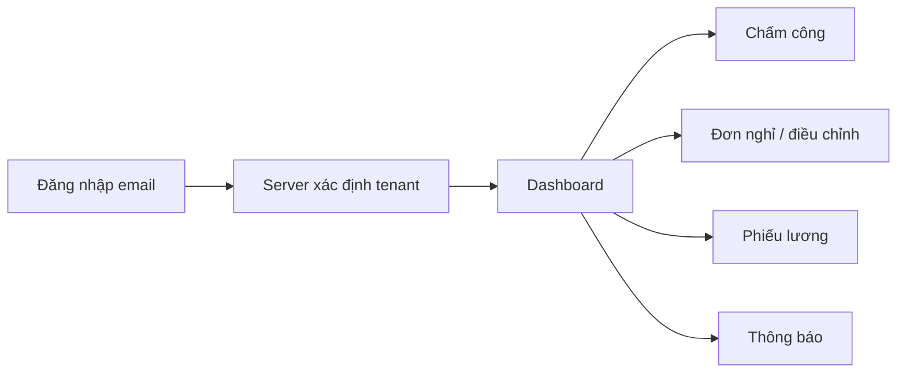
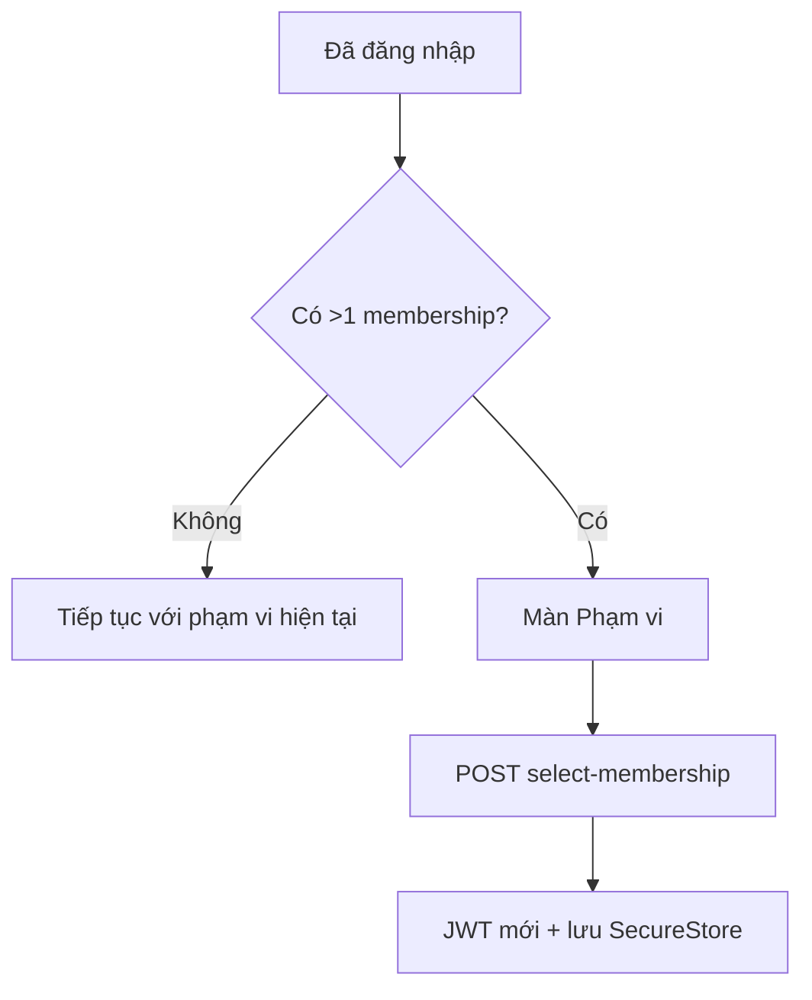
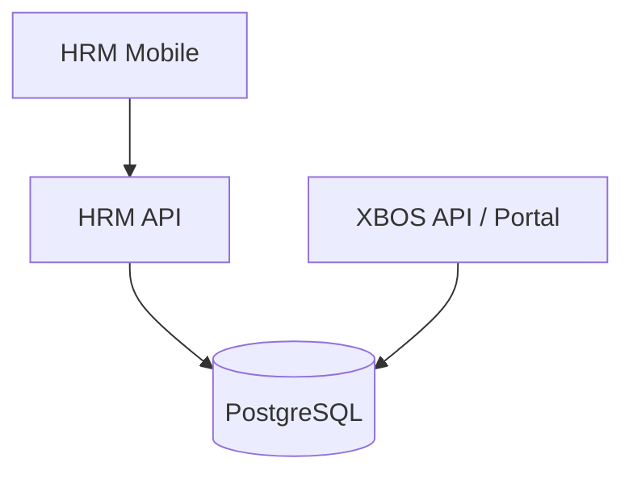
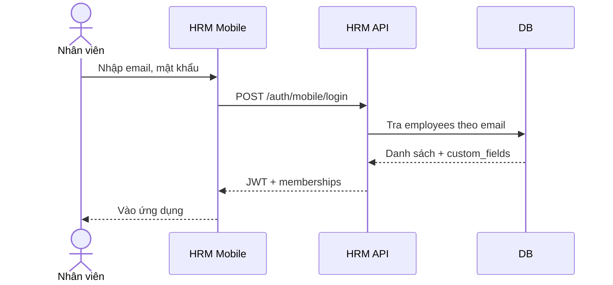

# TÀI LIỆU YÊU CẦU HỆ THỐNG (BRD)

## XeVN Ecosystem — HRM Mobile & nhân sự đa tenant

| Thuộc tính | Giá trị |
|------------|---------|
| **Phiên bản tài liệu** | 1.0 |
| **Ngày cập nhật** | 20/05/2026 |
| **Trạng thái** | Bản gửi khách hàng / pilot |
| **Phạm vi** | Ứng dụng HRM Mobile (iOS/Android), API HRM, liên kết Portal/XBOS đa tenant; chi tiết màn hình thuộc SRS |
| **Tác giả / Đơn vị triển khai** | UNICOM — AI Software Factory |

---

## Mục lục

**[Chương 1. Tổng quan hệ thống và nghiệp vụ](#chương-1-tổng-quan-hệ-thống-và-nghiệp-vụ)**
- [I. Bối cảnh và mục tiêu](#i-bối-cảnh-và-mục-tiêu)
- [II. Yêu cầu nghiệp vụ chính](#ii-yêu-cầu-nghiệp-vụ-chính)
- [III. Đối tượng người dùng và phạm vi vận hành](#iii-đối-tượng-người-dùng-và-phạm-vi-vận-hành)
- [IV. Luồng nghiệp vụ tổng quan](#iv-luồng-nghiệp-vụ-tổng-quan)
- [V. Phạm vi tài liệu](#v-phạm-vi-tài-liệu)

**[Chương 2. Phạm vi use case](#chương-2-phạm-vi-use-case)**
- [I. Danh mục nhóm use case](#i-danh-mục-nhóm-use-case)
- [II. Đóng góp của từng nhóm](#ii-đóng-góp-của-từng-nhóm)
- [III. Mô tả theo khối chức năng](#iii-mô-tả-theo-khối-chức-năng)

**[C. Kiến trúc hệ thống](#c-kiến-trúc-hệ-thống)**
- [I. Tổng quan kiến trúc](#i-tổng-quan-kiến-trúc-c)
- [II. Thành phần hệ thống](#ii-thành-phần-hệ-thống)
- [III. Kiến trúc theo lớp](#iii-kiến-trúc-theo-lớp)
- [IV. Yêu cầu bảo mật](#iv-yêu-cầu-bảo-mật-c)
- [V. Stack công nghệ](#v-stack-công-nghệ)

**[D. Chi tiết use case](#d-chi-tiết-use-case)**

**[Phụ lục](#phụ-lục)**

---

## Chương 1. Tổng quan hệ thống và nghiệp vụ

### I. Bối cảnh và mục tiêu

Tập đoàn và các công ty thành viên cần **một ứng dụng di động thống nhất** để nhân viên xem thông tin cá nhân, chấm công, gửi đơn nghỉ / điều chỉnh chấm công, xem phiếu lương và nhận thông báo — trong khi **phạm vi tenant/công ty** được xác định từ hồ sơ nhân sự trên server, không phụ thuộc cấu hình cố định trên từng máy.

**HRM Mobile (XeVN)** đáp ứng mô hình **đa tenant**: đăng nhập bằng email doanh nghiệp (`@xe.vn`), server trả danh sách phạm vi (`memberships`) và phát hành JWT gắn `tenant_id`, `company_id`, `employee_id`. Người dùng thuộc nhiều công ty có thể đổi phạm vi trong ứng dụng.

### II. Yêu cầu nghiệp vụ chính

| # | Yêu cầu | Phạm vi đáp ứng |
|---|---------|-----------------|
| 1 | Đăng nhập an toàn, đa tenant, không cần nhập tenant thủ công | API `POST /auth/mobile/login`, refresh token, chọn phạm vi |
| 2 | Chấm công có vị trí (GPS) và điểm làm việc cấu hình | Check-in, work site, geofence seed |
| 3 | Đơn nghỉ, đơn điều chỉnh chấm công; trưởng duyệt trên app | Leave / update requests, manager role |
| 4 | Xem tổng hợp lương và phiếu lương theo nhân viên | Payroll API filter theo `employee_id` |
| 5 | Thông báo trong app; đăng ký push (khung) | Inbox, push registration |
| 6 | Hồ sơ cá nhân, cài đặt, đồng bộ offline (khung) | Profile, settings, offline queue |

### III. Đối tượng người dùng và phạm vi vận hành

| Nhóm | Vai trò trong hệ thống |
|------|------------------------|
| Nhân viên | Đăng nhập, chấm công, tạo đơn, xem phiếu lương, thông báo |
| Trưởng / quản lý | Duyệt đơn nghỉ & điều chỉnh chấm công, xem badge việc chờ |
| Nhân sự / quản trị (Portal) | Cấu hình tổ chức, tenant, seed tài khoản (XBOS + HRM) |
| DevOps | Triển khai `hrm-api`, `xbos-api`, cấu hình HTTPS, biến môi trường |

### IV. Luồng nghiệp vụ tổng quan

Luồng **đổi công ty** (nhiều membership):

### V. Phạm vi tài liệu

BRD mô tả **yêu cầu nghiệp vụ và kiến trúc logic**. Đặc tả kỹ thuật API, mã lỗi, validation chi tiết nằm ở **SRS** (`02_Tai_lieu_nghiep_vu_XEVN_HRM_MOBILE.md`).

**Ngoài phạm vi phiên bản pilot:** ký số hợp đồng điện tử, quản lý tuyển dụng đầy đủ, payroll tính toán phức tạp (chỉ đọc dữ liệu đã có).

---

## Chương 2. Phạm vi use case

### I. Danh mục nhóm use case

| STT | Nhóm chức năng | Số UC (gợi ý) | Mức độ |
|-----|-----------------|---------------|--------|
| 1 | Xác thực đa tenant & phiên | 3 | Bắt buộc |
| 2 | Chấm công & lịch sử | 3 | Bắt buộc |
| 3 | Đơn nghỉ / điều chỉnh chấm công | 5 | Bắt buộc |
| 4 | Phê duyệt (manager) | 2 | Bắt buộc |
| 5 | Lương & phiếu lương | 3 | Bắt buộc |
| 6 | Thông báo & hồ sơ | 3 | Khuyến nghị |
| 7 | Cài đặt, offline, sinh trắc học (khung) | 3 | Khuyến nghị |

### II. Đóng góp của từng nhóm

| Nhóm | Hiệu quả vận hành | Kiểm soát |
|------|-------------------|------------|
| Auth đa tenant | Giảm sai phạm vi, đúng công ty | JWT + server-side membership |
| Chấm công + địa điểm | Minh bạch thời gian — địa điểm | Work site, log API |
| Đơn & duyệt | Tuân quy trình nội bộ | Trạng thái đơn, audit API |

### III. Mô tả theo khối chức năng

**1. Nền tảng đăng nhập** — Email + mật khẩu; refresh; chọn `employee_id` khi nhiều hồ sơ.

**2. Vận hành nhân viên** — Chấm công, đơn, lịch sử, lương.

**3. Vận hành quản lý** — Danh sách chờ duyệt, hành động approve/reject.

**4. Trải nghiệm & tin cậy** — Thông báo, push, offline (theo lộ trình).

---

## C. KIẾN TRÚC HỆ THỐNG

### I. Tổng quan kiến trúc (C)

Ứng dụng **Expo / React Native** gọi **HRM API (NestJS)** qua HTTPS. **XBOS API** phục vụ Portal đăng nhập đa tenant và registry pháp nhân; dữ liệu nhân viên HRM lưu PostgreSQL, `custom_fields.tenant_id` liên kết tenant thành viên.

> Sơ đồ dưới dùng Mermaid — hiển thị ổn định trong HTML/PDF khi render.

### II. Thành phần hệ thống

| Thành phần | Vai trò |
|------------|---------|
| HRM Mobile (Expo) | UI: login, dashboard, chấm công, đơn, lương, cài đặt, phạm vi |
| HRM API (NestJS) | Auth mobile, attendance, payroll, employees; JWT nội bộ |
| XBOS API + Portal (React) | Đăng nhập doanh nghiệp, tenant scope, quản trị |
| PostgreSQL | HRM `employees`, `attendance_*`, payroll; XBOS legal entity, membership |
| Push (khung) | FCM / Expo push sau khi đăng ký token |

### III. Kiến trúc theo lớp

### IV. Yêu cầu bảo mật (C)

| # | Hạng mục | Yêu cầu |
|---|----------|---------|
| 1 | Xác thực | JWT access + refresh; không lưu mật khẩu dạng plaintext trên client |
| 2 | Đa tenant | Mọi API nghiệp vụ gửi header `x-tenant-id`, `x-tenant-id` lấy từ JWT sau login |
| 3 | Mật khẩu pilot | Chỉ môi trường dev/UAT; production dùng chính sách riêng |
| 4 | Dữ liệu cá nhân | Không log email/số nhạy cảm; tuân NĐ 13/2023 trong thiết kế triển khai |

### V. Stack công nghệ

| Lớp | Công nghệ chính |
|-----|-----------------|
| Mobile | React Native, Expo, SecureStore, React Navigation |
| HRM API | NestJS, TypeScript, class-validator, JWT |
| Web Portal | React, Vite (Command Center / tenant scope) |
| DB | PostgreSQL |

---

## D. CHI TIẾT USE CASE

*Mỗi UC: Mục đích — Tác nhân — Điều kiện — Luồng chính — Ngoại lệ — Mức độ — Sequence (Mermaid).*

### UC-MOB-01 — Đăng nhập email / mật khẩu (đa tenant)

| Thuộc tính | Nội dung |
|------------|----------|
| Mục đích | Xác thực người dùng và nhận JWT + danh sách phạm vi |
| Tác nhân | Nhân viên |
| Điều kiện | HRM API khả dụng; tài khoản đã seed trong `employees` |
| Luồng chính | 1. Nhập email + mật khẩu → 2. Gọi `POST /api/hrm/auth/mobile/login` → 3. Lưu token và phạm vi active |
| Ngoại lệ | Sai mật khẩu; email không tồn tại; thiếu `tenant_id` trên hồ sơ (member) |
| Mức độ | Bắt buộc |

### UC-MOB-02 — Chọn phạm vi công ty

| Thuộc tính | Nội dung |
|------------|----------|
| Mục đích | Đổi tenant/công ty khi một email có nhiều hồ sơ |
| Tác nhân | Nhân viên |
| Điều kiện | Đã đăng nhập; có ít nhất 2 membership |
| Luồng chính | Cài đặt → Phạm vi → chọn card → `POST /auth/mobile/select-membership` |
| Ngoại lệ | Token hết hạn → yêu cầu đăng nhập lại |
| Mức độ | Bắt buộc |

### UC-MOB-03 — Chấm công tại điểm làm việc

| Thuộc tính | Nội dung |
|------------|----------|
| Mục đích | Ghi nhận check-in với tọa độ và company UUID |
| Tác nhân | Nhân viên |
| Điều kiện | Đã cấp quyền vị trí; work site đã seed |
| Luồng chính | Mở Chấm công → lấy GPS → gửi `POST /attendance/...` (theo contract API) |
| Ngoại lệ | Ngoài geofence; mất mạng → hàng đợi offline (theo lộ trình) |
| Mức độ | Bắt buộc |

### UC-MOB-04 — Tạo và theo dõi đơn nghỉ

| Thuộc tính | Nội dung |
|------------|----------|
| Mục đích | Tạo đơn nghỉ, xem chi tiết, theo dõi trạng thái |
| Tác nhân | Nhân viên |
| Điều kiện | Đã đăng nhập |
| Luồng chính | Tab Đơn → tạo đơn → danh sách / chi tiết |
| Ngoại lệ | Lỗi validation ngày nghỉ |
| Mức độ | Bắt buộc |

### UC-MOB-05 — Phê duyệt (trưởng)

| Thuộc tính | Nội dung |
|------------|----------|
| Mục đích | Trưởng xem đơn pending và thực hiện duyệt |
| Tác nhân | Quản lý (role manager trên JWT) |
| Điều kiện | `job_title_key` / `roles` chứa manager |
| Luồng chính | Tab Thêm → Phê duyệt → lọc theo `manager_employee_id` |
| Ngoại lệ | Không có quyền → ẩn menu |
| Mức độ | Bắt buộc |

### UC-MOB-06 — Xem phiếu lương

| Thuộc tính | Nội dung |
|------------|----------|
| Mục đích | Xem danh sách và chi tiết phiếu lương của chính nhân viên |
| Tác nhân | Nhân viên |
| Điều kiện | API payroll trả dữ liệu theo `employee_id` |
| Luồng chính | Thêm → Phiếu lương → chi tiết |
| Ngoại lệ | Chưa có kỳ lương |
| Mức độ | Bắt buộc |

---

## Phụ lục

### P.1 Bảng thuật ngữ

| Thuật ngữ | Định nghĩa |
|-----------|------------|
| Tenant | Đơn vị tổ chức pháp lý / vận hành (slug: `xevn`, `xe-du-lich`, …) |
| Membership | Một bản ghi nhân viên + tenant + company header + UUID chấm công |
| JWT | Token truy cập API sau đăng nhập |
| Company UUID | Định danh phạm vi chấm công / payroll (UUID) |

### P.2 Stakeholder

| Đối tượng | Kỳ vọng |
|-----------|---------|
| CBCNV | Đăng nhập nhanh, chấm công và đơn giản |
| Trưởng đơn vị | Duyệt trên điện thoại, ít thao tác |
| CNTT / UNICOM | Tài liệu, API ổn định, mở rộng tenant |

### P.3 Tài khoản pilot & HDSD

Xem `docs/hrm/HUONG_DAN_DANG_NHAP_PILOT.md` (email `@xe.vn`, mật khẩu mobile `xevn-pilot`, Portal `Xevn@2026`).

### P.4 Ảnh minh họa (gợi ý chèn khi in ấn)

| STT | Vị trí gợi ý | Nội dung ảnh |
|-----|--------------|---------------|
| 1 | Sau UC-MOB-01 | Màn đăng nhập HRM Mobile (email + mật khẩu) |
| 2 | Sau UC-MOB-02 | Màn Phạm vi — danh sách thẻ công ty |
| 3 | Sau UC-MOB-03 | Màn Chấm công với trạng thái GPS |
| 4 | Sau UC-MOB-05 | Màn Phê duyệt — danh sách pending |

*File HTML kèm theo có khối “Minh họa giao diện” với chú thích tương ứng; ảnh chụp thực tế thay thế khi có bản UAT.*

### P.5 Yêu cầu phi chức năng (tóm tắt)

| # | Hạng mục | Mục tiêu |
|---|----------|----------|
| 1 | Hiệu năng | Phản hồi API < 3s tải thông thường |
| 2 | Sẵn sàng | Theo SLA hạ tầng triển khai |
| 3 | Khả năng sử dụng | Trạng thái loading / lỗi / empty rõ ràng |

### P.6 Lộ trình mở rộng

| Giai đoạn | Nội dung |
|-----------|----------|
| Pilot | Du lịch X.E + holding seed |
| Mở rộng | Thêm tenant; tích hợp push production; offline đầy đủ |

### P.7 Căn cứ pháp lý (tham chiếu)

| Văn bản | Ghi chú |
|---------|---------|
| Nghị định 13/2023/NĐ-CP | Bảo vệ dữ liệu cá nhân |
| Thỏa thuận lao động / nội quy CT | Quy trình nghỉ, chấm công (triển khai theo từng DN) |

---

*Tài liệu do UNICOM soạn thảo cho chương trình XeVN HRM Mobile. Chữ ký số tài liệu điện tử (nếu có) theo quy trình nội bộ khách hàng.*
