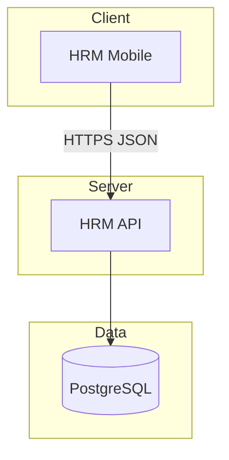

# ĐẶC TẢ YÊU CẦU PHẦN MỀM (SRS)

## XeVN Ecosystem — HRM Mobile (ứng dụng nhân sự đa tenant)

| Thuộc tính | Giá trị |
|-----------|---------|
| **Phiên bản** | 1.0 |
| **Ngày cập nhật** | 20/05/2026 |
| **Trạng thái** | Bản gửi khách hàng / pilot |
| **Dựa trên** | BRD `01_Tai_lieu_thiet_ke_he_thong_XEVN_HRM_MOBILE.md` v1.0 |
| **Tác giả** | UNICOM — AI Software Factory |

---

## Mục lục

**[1. Giới thiệu tài liệu](#1-giới-thiệu-tài-liệu)**  
**[2. Mô tả tổng quan hệ thống](#2-mô-tả-tổng-quan-hệ-thống)**  
**[3. Yêu cầu chức năng](#3-yêu-cầu-chức-năng)**  
**[4. Yêu cầu phi chức năng](#4-yêu-cầu-phi-chức-năng)**  
**[5. Yêu cầu giao diện & tích hợp ngoài](#5-yêu-cầu-giao-diện--tích-hợp-ngoài)**  
**[6. Ràng buộc nghiệp vụ tổng quát](#6-ràng-buộc-nghiệp-vụ-tổng-quát)**  
**[Phụ lục](#phụ-lục-a--ma-trận-traceability)**

---

## 1. Giới thiệu tài liệu

### 1.1 Mục đích

Tài liệu mô tả **yêu cầu chức năng (FR)**, **phi chức năng (NFR)** và **ràng buộc** của ứng dụng **HRM Mobile** trong hệ sinh thái XeVN. Dùng cho thiết kế chi tiết, lập trình, kiểm thử và nghiệm thu.

Độc giả: dev mobile/backend, QA, vận hành, đại diện kỹ thuật khách hàng.

### 1.2 Phạm vi hệ thống

**Trong phạm vi:**

| Nhóm | Mô tả |
|------|--------|
| MOD-AUTH-MOB | Đăng nhập, refresh, chọn membership |
| MOD-ATT | Chấm công, lịch sử, điểm làm việc |
| MOD-LEV | Đơn nghỉ, danh sách, chi tiết |
| MOD-REQ | Đơn điều chỉnh chấm công |
| MOD-MGR | Phê duyệt (manager) |
| MOD-PAY | Tổng hợp lương, danh sách & chi tiết phiếu lương |
| MOD-NOTI | Thông báo trong app |
| MOD-SET | Cài đặt, phạm vi, đăng xuất |
| MOD-OFF | Hàng đợi offline (khung) |

**Ngoài phạm vi:** quản trị master data toàn tập đội qua mobile (dùng Portal); tính công thức lương phức tạp; chữ ký số hợp đồng.

### 1.3 Định nghĩa và viết tắt

| Thuật ngữ | Giải thích |
|-----------|-------------|
| FR | Functional requirement |
| NFR | Non-functional requirement |
| JWT | Access / refresh token sau login |
| `x-tenant-id`, `x-company-id` | Header HTTP bắt buộc cho API nghiệp vụ (suy từ JWT) |
| `company_id` (UUID) | Tham số chấm công / payroll (attendance company) |
| Expo | Nền tảng build React Native |
| SRS / BRD | Đặc tả / yêu cầu nghiệp vụ |

### 1.4 Tài liệu liên quan

- BRD: `01_Tai_lieu_thiet_ke_he_thong_XEVN_HRM_MOBILE.md`
- HDSD pilot: `docs/hrm/HUONG_DAN_DANG_NHAP_PILOT.md`
- TECHSPEC mobile: `docs/hrm/TECHSPEC_MOBILE.md`

---

## 2. Mô tả tổng quan hệ thống

### 2.1 Bối cảnh

Nhân viên truy cập HRM qua điện thoại; hệ thống backend HRM (`hrm-api`) phục vụ nhiều tenant; dữ liệu nhân viên phân biệt theo `company_id` + `custom_fields.tenant_id`.

### 2.2 Đối tượng người dùng

Nhân viên, trưởng (manager), quản trị seed dữ liệu (không dùng app như end-user thường xuyên).

### 2.3 Ràng buộc hệ thống

- Phiên bản API trên server phải chứa route `/api/hrm/auth/mobile/login`.
- Ứng dụng cần `EXPO_PUBLIC_HRM_API_BASE_URL` trỏ đúng host.
- iOS/Android: quyền vị trí khi chấm công (theo policy store).

---

## 3. Yêu cầu chức năng

### 3.1 MOD-AUTH-MOB — Xác thực mobile

| ID | Mô tả | Tiêu chí chấp nhận |
|----|--------|---------------------|
| FR-AUTH-01 | Người dùng đăng nhập bằng email + mật khẩu | `POST /auth/mobile/login` trả `access_token`, `refresh_token`, `employee`, `roles`, `memberships` |
| FR-AUTH-02 | Làm mới token | `POST /auth/mobile/refresh` với `refresh_token` hợp lệ |
| FR-AUTH-03 | Chọn phạm vi khi >1 membership | `POST /auth/mobile/select-membership` với Bearer + `employee_id` |
| FR-AUTH-04 | Lưu phiên an toàn | Token lưu SecureStore; không hiển thị refresh token dạng plain |

**Ảnh minh họa gợi ý:** màn Đăng nhập (full width trong báo cáo HTML).

### 3.2 MOD-ATT — Chấm công

| ID | Mô tả | Tiêu chí chấp nhận |
|----|--------|---------------------|
| FR-ATT-01 | Check-in với vị trí | Gửi tọa độ + `company_id` UUID đúng phạm vi |
| FR-ATT-02 | Xem lịch sử | Danh sách bản ghi theo nhân viên |
| FR-ATT-03 | Work site | Seed có tọa độ bán kính; hiển thị tên điểm (nếu API trả) |

**Ảnh minh họa gợi ý:** màn Chấm công với trạng thái GPS / thành công.

### 3.3 MOD-LEV — Đơn nghỉ

| ID | Mô tả | Tiêu chí chấp nhận |
|----|--------|---------------------|
| FR-LEV-01 | Danh sách đơn nghỉ | Filter `employee_id` |
| FR-LEV-02 | Chi tiết đơn | Hiển thị trạng thái, ngày, lý do |
| FR-LEV-03 | Tạo đơn nghỉ | Form validation; gọi API tạo (theo contract hiện hành) |

### 3.4 MOD-REQ — Đơn điều chỉnh chấm công

| ID | Mô tả | Tiêu chí chấp nhận |
|----|--------|---------------------|
| FR-REQ-01 | Danh sách / chi tiết | Tương tự pattern leave |
| FR-REQ-02 | Tạo yêu cầu | Theo API attendance update-requests |

### 3.5 MOD-MGR — Phê duyệt

| ID | Mô tả | Tiêu chí chấp nhận |
|----|--------|---------------------|
| FR-MGR-01 | Chỉ role manager thấy menu Phê duyệt | Parse `roles` từ JWT hoặc server |
| FR-MGR-02 | Lọc pending theo `manager_employee_id` | Badge tab Thêm cập nhật theo số lượng |

**Ảnh minh họa gợi ý:** màn Phê duyệt với hai danh sách (điều chỉnh / nghỉ).

### 3.6 MOD-PAY — Lương

| ID | Mô tả | Tiêu chí chấp nhận |
|----|--------|---------------------|
| FR-PAY-01 | Tổng hợp lương | Màn tóm tắt theo API |
| FR-PAY-02 | Danh sách phiếu lương | Filter `employee_id` + `company_id` UUID |
| FR-PAY-03 | Chi tiết phiếu | Màn chi tiết đọc được các khoản |

### 3.7 MOD-NOTI — Thông báo

| ID | Mô tả | Tiêu chí chấp nhận |
|----|--------|---------------------|
| FR-NOTI-01 | Danh sách thông báo in-app | Đánh dấu đã đọc khi tap |

### 3.8 MOD-SET — Cài đặt & phạm vi

| ID | Mô tả | Tiêu chí chấp nhận |
|----|--------|---------------------|
| FR-SET-01 | Đăng xuất | Xóa SecureStore liên quan auth |
| FR-SET-02 | Phạm vi | Chọn membership và cập nhật token |

### 3.9 MOD-OFF — Offline (lộ trình)

| ID | Mô tả | Tiêu chí chấp nhận |
|----|--------|---------------------|
| FR-OFF-01 | Hàng đợi ghi khi mất mạng | Theo `offlineQueue` — ưu tiên sau pilot |

---

## 4. Yêu cầu phi chức năng

### 4.1 NFR-SEC — Bảo mật

| ID | Yêu cầu |
|----|---------|
| NFR-SEC-01 | HTTPS cho mọi gọi API production |
| NFR-SEC-02 | Không hardcode mật khẩu trong mã nguồn |
| NFR-SEC-03 | JWT hết hạn — refresh hoặc đăng nhập lại; thông báo rõ |

### 4.2 NFR-PERF — Hiệu năng

| ID | Yêu cầu |
|----|---------|
| NFR-PERF-01 | Timeout request 30s; hiển thị lỗi mạng thân thiện |
| NFR-PERF-02 | Danh sách dài hỗ trợ scroll mượt |

### 4.3 NFR-AVAIL — Khả dụng

| ID | Yêu cầu |
|----|---------|
| NFR-AVAIL-01 | Health check `/` trước khi dev sign-in (chế độ dev) |

### 4.4 NFR-COMPAT — Tương thích

| ID | Yêu cầu |
|----|---------|
| NFR-COMPAT-01 | iOS 15+ / Android theo policy Expo |
| NFR-COMPAT-02 | Font và contrast đọc được ngoài trời (màn hình chấm công) |

### 4.5 NFR-LOG — Ghi nhận lỗi

| ID | Yêu cầu |
|----|---------|
| NFR-LOG-01 | Mã lỗi envelope từ API hiển thị người dùng cuối (không leak stack) |

---

## 5. Yêu cầu giao diện & tích hợp ngoài

### 5.1 Giao diện (UI/UX)

- Luôn có trạng thái: **loading**, **empty**, **error**, **success**.
- Không dùng màu làm tín hiệu duy nhất cho trạng thái quan trọng.
- Màn hình đăng nhập: tối nền, khối nhập rõ ràng (tham chiếu thiết kế hiện tại).

**Khối ảnh minh họa (HTML):** đặt sau mục 5.1 trong file HTML — chèn screenshot khi có bản build UAT.

### 5.2 Push notification (khung)

- Đăng ký token qua Expo / FCM sau login thành công.
- Quyền thông báo theo OS.

### 5.3 Bản đồ / vị trí

- Xin quyền vị trí khi user vào luồng chấm công.
- Giải thích mục đích (App Store / Play policy).

---

## 6. Ràng buộc nghiệp vụ tổng quát

1. **Đa tenant:** Dữ liệu nhân viên phải khớp `tenant_id` trong `custom_fields` (member) hoặc quy tắc master (holding).
2. **Một email — nhiều hồ sơ:** Hệ thống phải trả `memberships` và cho phép chọn.
3. **Pilot:** Mật khẩu `xevn-pilot` chỉ dùng môi trường thử; production thay bằng chính sách DN.

---

## Phụ lục A — Ma trận traceability

| FR ID | UC BRD | Ghi chú kiểm thử |
|-------|--------|------------------|
| FR-AUTH-01 | UC-MOB-01 | Smoke login |
| FR-AUTH-03 | UC-MOB-02 | 2 hồ sơ cùng email |
| FR-ATT-01 | UC-MOB-03 | GPS + đúng company UUID |
| FR-LEV-01 | UC-MOB-04 | List leave |
| FR-MGR-01 | UC-MOB-05 | Role manager |
| FR-PAY-02 | UC-MOB-06 | Payslip list |

---

## Phụ lục B — Sơ đồ luồng dữ liệu (tổng quát)

---

*Tài liệu UNICOM — AI Software Factory. Đối chiếu mã nguồn: `apps/mobile/hrm-mobile`, `apps/api/hrm-api`.*
