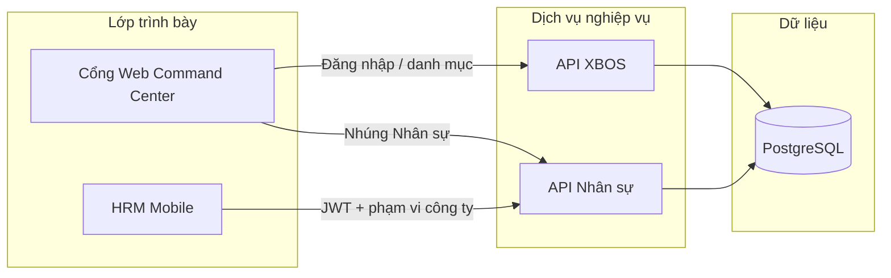

# Hướng dẫn sử dụng và chạy thử — Hệ sinh thái XeVN (Pilot)

| Thuộc tính | Giá trị |
|------------|---------|
| **Mã tài liệu** | HDSD-XEVN-PILOT-01 |
| **Phiên bản** | 1.3 |
| **Ngày** | 05/06/2026 |
| **Trạng thái** | Bản pilot — vận hành & nghiệm thử |
| **Đối tượng** | Ban TGĐ, phòng Nhân sự, IT vận hành pilot |
| **Tác giả** | XeVN Group |

**Mục đích:** Hướng dẫn đội vận hành và nghiệp vụ **chuẩn bị môi trường**, **khởi động dịch vụ**, **đăng nhập thử** và **đi qua các luồng nghiệp vụ chính** trên bản pilot XeVN OS — cùng giọng văn và cấu trúc bộ tài liệu BRD/SRS đã gửi khách.

**Tài liệu liên quan:** BRD tổng hợp (`01_BRD_XeVN_OS.html`) · SRS HRM Mobile (`02_Tai_lieu_nghiep_vu_XEVN_HRM_MOBILE.md`) · **Hướng dẫn đăng nhập pilot** · **Kịch bản tích hợp UAT hệ thống**. (Đường dẫn kỹ thuật trong repo: *Phụ lục IT*.)

---

## Mục lục

1. [Mục đích và đối tượng đọc](#1-mục-đích-và-đối-tượng-đọc)
2. [Tổng quan hệ sinh thái](#2-tổng-quan-hệ-sinh-thái)
3. [Chuẩn bị môi trường (Windows)](#3-chuẩn-bị-môi-trường-windows) — gồm [3.6 Migrate DB](#36-khởi-tạo-cơ-sở-dữ-liệu-migrate)
4. [Chạy thử từng bước](#4-chạy-thử-từng-bước)
5. [Luồng nghiệp vụ thử theo vai](#5-luồng-nghiệp-vụ-thử-theo-vai)
6. [Phân quyền và phạm vi công ty](#6-phân-quyền-và-phạm-vi-công-ty)
7. [Mã lỗi thường gặp và xử lý](#7-mã-lỗi-thường-gặp-và-xử-lý)
8. [Phụ lục](#8-phụ-lục)
9. [Giới hạn bản UAT](#9-giới-hạn-bản-uat)

---

## 1. Mục đích và đối tượng đọc

### 1.1 Mục đích

- Giúp **Ban TGĐ** và **phòng Nhân sự** hình dung cách nhân viên, quản lý và điều hành tương tác với hệ thống trên bản pilot.
- Giúp **IT vận hành** tái lập môi trường thử nghiệm trên máy Windows (hoặc đối chiếu với máy chủ pilot), seed dữ liệu UAT 1.000 nhân sự, chạy kiểm tra tích hợp và xử lý sự cố thường gặp.
- Là căn cứ **chạy thử có kiểm chứng** trước khi mở rộng pilot cho nhiều công ty thành viên.

### 1.2 Đối tượng đọc

| Vai trò | Nội dung nên đọc |
|---------|------------------|
| Ban TGĐ / điều hành | Mục 2, 5 (luồng tổng), 6 (phạm vi đa công ty) |
| Phòng Nhân sự | Mục 4.6–4.7, 5 (nhân viên, quản lý duyệt, phiếu lương) |
| IT vận hành pilot | Toàn bộ; đặc biệt mục 3, 4, 7, Phụ lục A |

### 1.3 Phạm vi tài liệu

| Trong phạm vi | Ngoài phạm vi |
|---------------|---------------|
| Cổng Web Command Center, API Nhân sự (HRM), API nền tảng (XBOS), ứng dụng HRM Mobile | Logistic đầy đủ Giai đoạn 2 |
| Môi trường dev/pilot, tài khoản UAT | Mật khẩu và secret **production** |
| Seed 1.000 nhân sự UAT, suite tích hợp tự động | Triển khai production (xem runbook vận hành riêng) |

---

## 2. Tổng quan hệ sinh thái

XeVN OS là hệ sinh thái **đa công ty** cho tập đoàn vận tải. Trên bản pilot, bốn thành phần sau là điểm chạm chính khi chạy thử:

| Thành phần | Vai trò với người dùng pilot |
|------------|------------------------------|
| **Cổng Web (Portal — Command Center)** | Điều hành: đăng nhập tập đoàn, chọn phạm vi công ty, quản trị danh mục, RACI, nhúng module Nhân sự |
| **API XBOS** | Xác thực cổng web, tổ chức, membership đa tenant, danh mục chuẩn |
| **API Nhân sự (HRM)** | Hồ sơ nhân viên, chấm công, đơn nghỉ, lương, đăng nhập mobile |
| **HRM Mobile** | Ứng dụng nhân viên: chấm công, đơn nghỉ, phê duyệt (quản lý), phiếu lương |

### 2.1 Sơ đồ tương tác (pilot)



**Luồng dữ liệu tóm tắt:** người dùng đăng nhập → hệ thống cấp phiên (token) gắn **công ty được phép** → mọi thao tác đọc/ghi chỉ trong phạm vi đó. Mobile **không** yêu cầu nhập mã công ty thủ công; cổng web có thể yêu cầu **chọn tenant** sau đăng nhập nếu một tài khoản thuộc nhiều công ty.

### 2.2 Môi trường pilot HTTPS (đã triển khai)

Ban TGĐ và phòng Nhân sự có thể **chạy thử trực tiếp** trên máy chủ pilot — không bắt buộc cài đặt local nếu chỉ nghiệm thu nghiệp vụ:

| Mục | Giá trị |
|-----|---------|
| **URL cổng Web** | `https://14-225-217-232.nip.io` |
| **Đăng nhập cổng** | `ceo@xe.vn` / `Xevn@2026` |
| **CEO công ty thành viên (phạm vi)** | `du-lich.ceo@xe.vn` / `Xevn@2026` |
| **HRM Mobile (API pilot)** | `EXPO_PUBLIC_HRM_API_BASE_URL=https://14-225-217-232.nip.io` |
| **Mobile UAT 1.000** | `uat.nv####@xe.vn` / `xevn-uat-2026` |

**Đạt:** mở Command Center, vào tab nhúng Nhân sự, đăng nhập mobile — không lỗi 500/409 phạm vi trên luồng chính.

**Chưa sẵn sàng:** tên miền production `portal.xe.vn` — xem mục **9. Giới hạn bản UAT**.

---

## 3. Chuẩn bị môi trường (Windows)

### 3.1 Phần mềm cần cài

| Thành phần | Phiên bản gợi ý | Ghi chú |
|------------|-----------------|--------|
| Node.js | LTS 20.x trở lên | Dùng cho API và công cụ monorepo |
| pnpm | 9.x (khớp `packageManager` trong repo) | `npm install -g pnpm@9.15.0` |
| Git | Mới nhất | Clone / cập nhật mã nguồn |
| PostgreSQL client | Tùy chọn | Chỉ khi cần kiểm tra DB trực tiếp |

### 3.2 Mã nguồn và thư mục làm việc

1. Clone hoặc cập nhật repository **xevn-ecosystem** về máy Windows.
2. Mở terminal tại **thư mục gốc** monorepo (nơi có `package.json` và thư mục `apps/`).
3. Cài dependency:

```powershell
pnpm install
```

### 3.3 File cấu hình môi trường (không ghi secret vào tài liệu)

Sao chép mẫu cấu hình:

```powershell
Copy-Item deploy\xevn-ecosystem\.env.example deploy\xevn-ecosystem\.env
```

Chỉnh **`deploy/xevn-ecosystem/.env`** trên máy pilot — dùng **placeholder** dưới đây, thay bằng giá trị thật **chỉ trên máy vận hành** (không đưa vào email/tài liệu công khai):

| Biến | Ý nghĩa | Ví dụ placeholder |
|------|---------|-------------------|
| `DB_HOST` | Máy chủ PostgreSQL | `<DB_HOST>` |
| `DB_PORT` | Cổng PostgreSQL | `6432` |
| `DB_USER` | Tài khoản DB | `<DB_USER>` |
| `DB_PASSWORD` | Mật khẩu DB | `<DB_PASSWORD>` |
| `DB_NAME_HRM` | Database Nhân sự | `xevn_hrm` |
| `DB_NAME_XBOS` | Database XBOS | `xevn_xbos` |
| `SERVICE_JWT_SECRET` | Khóa ký JWT (dev/pilot) | `<JWT_SECRET_DEV>` |
| `INTERNAL_API_KEY` | Khóa nội bộ cổng–API | `<INTERNAL_API_KEY>` |
| `HRM_BE_PORT` | Cổng API Nhân sự trên máy bạn | `28001` (xem mục 3.4) |
| `XBOS_BE_PORT` | Cổng API XBOS trên máy bạn | `28002` |

> **Lưu ý bảo mật:** Không commit file `.env` có mật khẩu thật lên kho mã công khai. Tài liệu này **không** chứa mật khẩu database hay khóa production.

### 3.4 Cổng mạng khi bị trùng trên Windows

Nếu cổng mặc định (3001, 3002, 8088…) đã bị chiếm, chạy từ gốc repo:

```powershell
node ./scripts/pick-xevn-host-ports.mjs
```

Dán khối `*_PORT=...` script in ra vào `deploy/xevn-ecosystem/.env`. Ghi nhớ **`HRM_BE_PORT`** và **`XBOS_BE_PORT`** — dùng cho bước kiểm tra sức khỏe ở mục 4.4.

Tham chiếu bảng cổng mạng: *Phụ lục IT* (bảng cổng Docker / local).

### 3.5 Nạp biến môi trường vào phiên PowerShell (một lần mỗi cửa sổ terminal)

```powershell
Get-Content deploy\xevn-ecosystem\.env | ForEach-Object {
  if ($_ -match '^\s*([^#=]+)=(.*)$') {
    $k = $matches[1].Trim()
    $v = $matches[2].Trim().Trim('"')
    [Environment]::SetEnvironmentVariable($k, $v, 'Process')
  }
}
$env:NODE_ENV = 'development'
```

### 3.6 Khởi tạo cơ sở dữ liệu (migrate)

Trước khi seed hoặc khởi động API, áp dụng schema lên PostgreSQL (sau mục 3.3–3.5, biến môi trường đã nạp):

```powershell
pnpm run migrate:hrm:status:with-deploy-env
pnpm run migrate:xbos:status:with-deploy-env
pnpm run migrate:hrm:apply:with-deploy-env
pnpm run migrate:xbos:apply:with-deploy-env
```

**Đạt:** lệnh `status` không báo migration pending/lỗi; lệnh `apply` kết thúc mã thoát **0** cho cả Nhân sự (HRM) và XBOS.

---

## 4. Chạy thử từng bước

Thực hiện **theo thứ tự**. Thay `$HRM` / `$XBOS` bằng giá trị `HRM_BE_PORT` / `XBOS_BE_PORT` trong `.env` (ví dụ `28001` và `28002`).

### 4.1 Seed 1.000 nhân sự UAT

Từ **gốc repo**, sau khi đã nạp biến môi trường (mục 3.5) và **đã migrate** (mục 3.6):

```powershell
pnpm run seed:hrm:1000-uat
```

**Kết quả mong đợi:** script kết thúc không lỗi; trong database có **1.000** bản ghi nhân sự gắn nhãn UAT (`custom_fields.uat_seed = '1000-v1'`), **25** chức danh (`job_title_key`) khác nhau, mỗi người có tenant và mật khẩu mobile UAT.

### 4.2 Khởi động API trên máy local

**Cách 1 — Chế độ phát triển (khuyến nghị khi chỉnh sửa mã):**

Mở **hai** cửa sổ terminal tại gốc repo (đã nạp `.env`):

```powershell
pnpm run dev:hrm-api
```

```powershell
pnpm run dev:xbos-api
```

**Cách 2 — Chạy bản build (ổn định cho demo/UAT):**

```powershell
pnpm run build:platform-core
pnpm --filter hrm-api run build
pnpm --filter xbos-api run build
```

Sau đó, mỗi API một cửa sổ:

```powershell
Set-Location apps\api\hrm-api
node dist\main.js
```

```powershell
Set-Location apps\api\xbos-api
node dist\main.js
```

**Tham chiếu máy chủ pilot (Docker):** nếu chạy trên VPS, làm theo **Ghi chú triển khai máy chủ pilot** (không dừng toàn bộ Docker; chỉ build lại dịch vụ Nhân sự và XBOS). Cổng host VPS thường: HRM **3001**, XBOS **28002**. Chi tiết triển khai: *Phụ lục IT*.

### 4.3 Kiểm tra sức khỏe API

PowerShell (thay cổng nếu khác trong `.env`):

```powershell
$HRM = $env:HRM_BE_PORT; if (-not $HRM) { $HRM = '28001' }
$XBOS = $env:XBOS_BE_PORT; if (-not $XBOS) { $XBOS = '28002' }
Invoke-WebRequest -Uri "http://127.0.0.1:$HRM/api/hrm/" -UseBasicParsing -TimeoutSec 10 | Select-Object StatusCode
Invoke-WebRequest -Uri "http://127.0.0.1:$XBOS/api/xbos/" -UseBasicParsing -TimeoutSec 10 | Select-Object StatusCode
```

Hoặc dùng **curl** (Git Bash / WSL):

```bash
curl -s -o /dev/null -w "HRM %{http_code}\n" "http://127.0.0.1:28001/api/hrm/"
curl -s -o /dev/null -w "XBOS %{http_code}\n" "http://127.0.0.1:28002/api/xbos/"
```

**Đạt:** mã HTTP **200** (hoặc phản hồi JSON mô tả dịch vụ, không timeout).

Kiểm tra bổ sung (quan sát vận hành):

```bash
curl -s "http://127.0.0.1:28001/api/hrm/metrics?format=prometheus" | head -5
curl -s "http://127.0.0.1:28002/api/xbos/metrics?format=prometheus" | head -5
```

Nội dung có chỉ số `http_requests_total` cho thấy lớp giám sát hoạt động.

### 4.4 Chạy kiểm thử tích hợp UAT (tự động)

Đảm bảo hai API đang lắng nghe đúng cổng trong `.env`.

```powershell
pnpm run test:system:uat
```

Gộp seed + chạy một lệnh:

```powershell
pnpm run test:system:uat:seed
```

**Đạt:** console báo `verdict: PASS`, mã thoát **0**. Báo cáo JSON lưu tại thư mục bằng chứng UAT (xem *Phụ lục IT*).

### 4.5 Cổng Web (Command Center)

**Phạm vi pilot:** Nghiệm thu **bắt buộc** trên **HRM Mobile** (mục 4.6, 5.1–5.4) và suite UAT tự động (4.4). Cổng Web **không bắt buộc** để IT chạy API, migrate, seed và UAT trên máy local. Cổng Web **khuyến nghị** và thường **nằm trong checklist nghiệm thu Ban TGĐ** khi kiểm tra phạm vi đa công ty và điều hành — xem mục **5.5**.

1. Sao chép `apps/web/web-portal/.env.example` → `apps/web/web-portal/.env.local`.
2. Đặt `VITE_DEV_PROXY_XBOS_API=http://127.0.0.1:<XBOS_BE_PORT>` (ví dụ `28002`).
3. Khởi động:

```powershell
pnpm run dev:web-only
```

Mở trình duyệt theo URL dev server in ra (thường `http://127.0.0.1:5175`), vào **Command Center**.

### Bảng mật khẩu pilot (đọc trước khi đăng nhập)

| Loại tài khoản | Mật khẩu | Khi nào dùng |
|----------------|----------|--------------|
| Nhân sự UAT 1.000 (`uat.nv####@xe.vn`) | `xevn-uat-2026` | **Chỉ HRM Mobile** sau seed mục 4.1; UAT tự động — **không** dùng trên cổng web |
| Cổng Web — tập đoàn & CEO thành viên (`ceo@xe.vn`, `du-lich.ceo@xe.vn`, `du-lich.hr@xe.vn`, …) | `Xevn@2026` | Đăng nhập Command Center (mục 4.7, 5.5); `du-lich.ceo` **không** dùng `xevn-uat-2026` |
| Pilot Du lịch — mobile (`du-lich.*@xe.vn`, trừ `uat.nv*`) | `xevn-pilot` | HRM Mobile Du lịch; khác mật khẩu cổng web |

### 4.6 Đăng nhập HRM Mobile (tài khoản UAT — không phải production)

| Mục | Giá trị |
|-----|---------|
| Email mẫu | `uat.nv0001@xe.vn` (nhân sự UAT0001 — vai CEO nhóm UAT) |
| Mật khẩu UAT | `xevn-uat-2026` |
| Cảnh báo | **Chỉ** dùng trên môi trường thử; **không** dùng mật khẩu này trên production |

Cấu hình app (`apps/mobile/hrm-mobile/.env`):

```env
EXPO_PUBLIC_HRM_API_BASE_URL=http://127.0.0.1:28001
```

(Thay `28001` bằng `HRM_BE_PORT` thực tế; trên VPS pilot có thể là `http://<HOST_PILOT>:3001`.)

Khởi động app:

```powershell
Set-Location apps\mobile\hrm-mobile
pnpm install
npx expo start
```

**Thao tác:** mở app trên thiết bị/emulator → **Đăng nhập** → nhập email và mật khẩu UAT → vào **Dashboard** (tên công ty do server trả về).

**Bộ tài khoản UAT khác:** sau seed 1.000, email dạng `uat.nv####@xe.vn` (#### 0001–1000), cùng mật khẩu `xevn-uat-2026` — xem **Kịch bản tích hợp UAT hệ thống**.

### 4.7 Đăng nhập Cổng Web (pilot)

| Mục | Giá trị |
|-----|---------|
| Email mẫu | `ceo@xe.vn` |
| Mật khẩu pilot cổng web | `Xevn@2026` (mặc định dev/pilot; xem **Hướng dẫn đăng nhập pilot**) |
| Cảnh báo | Không dùng cho production |

Sau đăng nhập: chọn **tenant** / công ty nếu hệ thống hỏi (ví dụ tập đoàn `xevn` hoặc `xe-du-lich` tùy membership đã seed).

**Tài khoản pilot bổ sung (Du lịch, đa vai):** `du-lich.ceo@xe.vn`, `du-lich.laixe01@xe.vn` — mật khẩu mobile `xevn-pilot`; cổng web vẫn `Xevn@2026`. Chi tiết bảng email: **Hướng dẫn đăng nhập pilot**.

---

## 5. Luồng nghiệp vụ thử theo vai

### 5.1 Nhân viên — chấm công (Mobile)

| Bước | Thao tác trên app | Phía hệ thống | Tham chiếu SRS |
|------|-------------------|---------------|----------------|
| 1 | Đăng nhập UAT (vd. `uat.nv0016@xe.vn` — tài xế) | `POST /api/hrm/auth/mobile/login` | MOD-AUTH · FR-AUTH-01 |
| 2 | Vào **Chấm công**, bật quyền vị trí | App gửi tọa độ + `company_id` (mã UUID công ty chấm công) | MOD-ATT · FR-ATT-01 |
| 3 | Xác nhận check-in thành công | `POST /api/hrm/attendance/records` → lưu bản ghi | FR-ATT-01 |
| 4 | Xem **Lịch sử** | `GET /api/hrm/attendance/records` (lọc theo nhân viên phiên) | FR-ATT-02 |

**Tiêu chí đạt:** có bản ghi mới; không báo lỗi phạm vi công ty (mục 7).

### 5.2 Nhân viên — đơn nghỉ (Mobile)

| Bước | Thao tác | API tương ứng | Tham chiếu SRS |
|------|----------|---------------|----------------|
| 1 | **Đơn nghỉ** → tạo đơn (ngày, loại, lý do) | `POST` tạo leave request | MOD-LEV · FR-LEV-03 |
| 2 | Xem danh sách / chi tiết | `GET` leave requests | FR-LEV-01 · FR-LEV-02 |
| 3 | Trạng thái ban đầu thường là *Chờ duyệt* | Workflow phê duyệt phía server | MOD-LEV |

### 5.3 Quản lý — duyệt nghỉ / điều chỉnh chấm công (Mobile)

| Bước | Thao tác | Ghi chú | Tham chiếu SRS |
|------|----------|---------|----------------|
| 1 | Đăng nhập tài khoản có vai **quản lý** (vd. `uat.nv0001@xe.vn` — CEO UAT) | Menu **Phê duyệt** chỉ hiện khi JWT có role manager | MOD-MGR · FR-MGR-01 |
| 2 | Tab đơn nghỉ / điều chỉnh chấm công đang chờ | Lọc theo `manager_employee_id` | FR-MGR-02 · MOD-REQ |
| 3 | **Duyệt** hoặc **Từ chối** kèm ghi chú | API quyết định (`decide`) cập nhật trạng thái + DB | MOD-MGR · MOD-REQ |

**Đối chiếu UAT tự động:** phase P6 — CEO duyệt đơn tạo ở P5 (**Kịch bản tích hợp UAT hệ thống**).

### 5.4 Nhân viên / Kế toán — xem phiếu lương (Mobile)

| Bước | Thao tác | API tương ứng | Tham chiếu SRS |
|------|----------|---------------|----------------|
| 1 | **Lương** → tổng hợp | GET payroll summary | MOD-PAY · FR-PAY-01 |
| 2 | Danh sách phiếu | GET payslips (`employee_id` + `company_id` UUID) | FR-PAY-02 |
| 3 | Chi tiết một phiếu | GET payslip by id | FR-PAY-03 |

**Lưu ý:** danh sách rỗng vẫn có thể **đạt** kiểm thử tích hợp nếu chưa seed phiếu — quan trọng là API trả về đúng phạm vi, không lỗi 403/409.

### 5.5 Điều hành — Cổng Web (Command Center)

**Checklist pilot:** Mục này **bắt buộc** khi Ban TGĐ / điều hành nghiệm thu phạm vi đa công ty trên cổng; **không** thay thế bắt buộc mobile (5.1–5.4) trong suite UAT tự động.

| Bước | Thao tác | Ghi chú | Tham chiếu |
|------|----------|---------|------------|
| 1 | Đăng nhập `ceo@xe.vn` / mật khẩu `Xevn@2026` | XBOS cấp JWT + danh sách membership | BRD · Cổng Web |
| 2 | Chọn tenant (nếu có) | Phạm vi tenant / công ty trên request tiếp theo | BRD · đa tenant |
| 3 | Duyệt **Command Center**, module Nhân sự nhúng | Không thấy dữ liệu công ty khác | BRD · phạm vi công ty |

---

## 6. Phân quyền và phạm vi công ty

### 6.1 Khái niệm nghiệp vụ

| Khái niệm | Giải thích cho vận hành |
|-----------|-------------------------|
| **Tenant (tập đoàn / công ty trên hệ thống)** | Một “không gian” dữ liệu logic, ví dụ tập đoàn `xevn` hoặc công ty Du lịch `xe-du-lich`. Thường truyền qua header **`x-tenant-id`**. |
| **Công ty / đơn vị (company)** | Đơn vị pháp nhân hoặc khối vận hành trong tenant. Có thể là **mã ngắn** (vd. `holding`, `trsport`) hoặc **mã định danh kỹ thuật dạng UUID** cho chấm công và lương. |
| **Membership** | Một người có thể thuộc nhiều công ty; cổng web cho chọn; mobile chọn tại **Cài đặt → Phạm vi** nếu có nhiều hồ sơ. |

### 6.2 Nguyên tắc sau đăng nhập

- **Đã đăng nhập:** chỉ được xem và thao tác dữ liệu thuộc công ty được phân quyền (khớp BRD phạm vi toàn hệ).
- **Sai phạm vi** (token công ty A nhưng gửi header/body công ty B): hệ thống **từ chối** — không trả dữ liệu công ty khác.
- **Mobile:** người dùng **không nhập** tenant slug; server gắn từ hồ sơ nhân viên sau login.

### 6.3 Slug và mã UUID — cách nhớ

| Tình huống | Dùng gì |
|------------|---------|
| Đăng nhập cổng, chọn công ty trên menu | Mã tenant **dạng chữ** (slug) |
| Chấm công, phiếu lương trên mobile | **Mã UUID** công ty chấm công (`company_uuid` trong phiên) — app tự điền |
| API báo lỗi “xung đột phạm vi” | Thường do lệch slug ↔ UUID hoặc header sai — xem mục 7 |

---

## 7. Mã lỗi thường gặp và xử lý

| Triệu chứng | Mã / HTTP | Nguyên nhân thường gặp | Cách xử lý |
|-------------|-----------|------------------------|------------|
| Không kết nối được dịch vụ / từ chối kết nối | — | API chưa chạy hoặc sai cổng | Kiểm tra mục 4.2–4.3; đúng cổng Nhân sự / XBOS trong `.env` |
| Phiên hết hạn / không được phép | 401 · `HRM-ERR-AUTH-INVALID` | Token hết hạn hoặc chưa đăng nhập | Đăng nhập lại; đồng bộ giờ máy |
| Email hoặc mật khẩu không đúng (mobile) | 401 | Chưa seed UAT hoặc sai mật khẩu | Migrate + seed mục 3.6, 4.1; dùng bảng mật khẩu mục 4.5 |
| Xung đột phạm vi công ty / tenant | 400 / 403 / 409 · `SCOPE_CONTEXT_MISMATCH` | Header tenant/công ty hoặc `company_id` không khớp phiên | Đăng nhập lại; mobile chọn đúng phạm vi; build lại API Nhân sự nếu vừa cập nhật mã |
| Không tìm thấy dữ liệu khi đăng nhập mobile | 404 · `HRM-DATA-404` | API thiếu route đăng nhập mobile | Build/deploy lại API Nhân sự bản có `/auth/mobile/login` |
| Cổng web đăng nhập OK nhưng không chọn được công ty | — | Thiếu membership trên XBOS | `pnpm run seed:tenant-ceos` hoặc seed stack P0 |
| Kiểm thử UAT thất bại ở bước P4 | 400 / 403 / 409 | Test cố ý sai phạm vi — nếu FAIL ngoài P4: kiểm tra scope | Đọc báo cáo JSON UAT (*Phụ lục IT*) |
| Cổng web lỗi 500 khi tải đơn vị | 500 | API XBOS tắt hoặc proxy sai cổng | Bật `pnpm run dev:xbos-api`; cấu hình proxy XBOS đúng cổng trong `.env.local` |

---

## 8. Phụ lục

### Phụ lục A — Bảng lệnh tham chiếu nhanh

| Mục đích | Lệnh (gốc repo) |
|----------|------------------|
| Cài dependency | `pnpm install` |
| Migrate HRM / XBOS | `pnpm run migrate:hrm:apply:with-deploy-env` · `pnpm run migrate:xbos:apply:with-deploy-env` |
| Kiểm tra migrate | `pnpm run migrate:hrm:status:with-deploy-env` · `pnpm run migrate:xbos:status:with-deploy-env` |
| Chọn cổng trống (Windows) | `node ./scripts/pick-xevn-host-ports.mjs` |
| Seed 1.000 UAT | `pnpm run seed:hrm:1000-uat` |
| API dev | `pnpm run dev:hrm-api` · `pnpm run dev:xbos-api` |
| Build platform + API | `pnpm run build:platform-core` · `pnpm --filter hrm-api run build` · `pnpm --filter xbos-api run build` |
| UAT tích hợp | `pnpm run test:system:uat` |
| UAT + seed | `pnpm run test:system:uat:seed` |
| Seed stack pilot đầy đủ hơn | `pnpm run seed:stack:p0` |
| Seed Du lịch mobile (10 người) | `pnpm run seed:tourism:mobile-pilot` |
| Membership CEO cổng | `pnpm run seed:tenant-ceos` |

### Phụ lục IT — Tài liệu và bằng chứng kỹ thuật (kèm mã nguồn)

Phụ lục này dành cho **IT** khi làm việc trong repository; không in riêng cho Ban TGĐ / Nhân sự trừ khi bàn giao kèm mã nguồn.

| Tên tài liệu / artifact | Đường dẫn trong repo |
|-------------------------|----------------------|
| Kịch bản tích hợp UAT hệ thống | `docs/qa/SYSTEM_INTEGRATION_UAT_SCENARIO.md` |
| Báo cáo JSON UAT | `docs/qa/evidence/system-integration-uat-report.json` |
| Hướng dẫn đăng nhập pilot | `docs/hrm/HUONG_DAN_DANG_NHAP_PILOT.md` |
| Ghi chú triển khai máy chủ pilot | `docs/ops/VPS_POST_SCOPE_DEPLOY_NOTE.md` |
| Bảng cổng Docker / local | `deploy/xevn-ecosystem/PORTS.md` |
| Script seed 1.000 UAT | `scripts/seed-hrm-1000-uat-workforce.mjs` |
| Script chạy UAT | `scripts/run-system-integration-uat.mjs` |
| Build HTML BRD/SRS khách | `pnpm run docs:client-delivery:html` |

### Phụ lục C — Định dạng phát hành

- **BRD / SRS HTML:** `01_BRD_XeVN_OS.html`, `02_SRS_XeVN_OS.html` (khi đã phát hành trong bộ tài liệu pilot).
- **HDSD (tài liệu này):** nguồn markdown — xuất **PDF hoặc in** trực tiếp; có thể ghép bìa XeVN cùng bộ BRD/SRS mà không cần build HTML tự động.

---

## 9. Giới hạn bản UAT

Tài liệu này mô tả bản **sẵn sàng chạy thử** Giai đoạn 1 — **không** đồng nghĩa production hoàn tất hoặc đóng 100% chương trình Excellence.

| # | Giới hạn | Ý nghĩa với người dùng |
|---|----------|------------------------|
| G-01 | **Production** `portal.xe.vn` chưa mở | Chỉ truy cập qua `https://14-225-217-232.nip.io` cho đến khi cutover DNS/TLS |
| G-02 | **Đồng bộ mã nguồn** (git parity) | Bản vá trên pilot có thể chưa có trên nhánh phát hành chính — IT cần đối chiếu trước khi tái triển khai |
| G-03 | Tiêu chí **T5** (benchmark mật độ menu HRM) **hoãn** | UAT slice không bị chặn bởi T5; lên lịch wave Excellence sau production |
| G-04 | SRS **373** FR vs Giai đoạn 1 **245** UC | Đặc tả đầy đủ toàn hệ; go-live Giai đoạn 1 chỉ đối chiếu ma trận Phase 1 |
| G-05 | Logistic nghiệp vụ (đơn/chuyến/app lái xe) | Thuộc Giai đoạn 2 — ngoài phạm vi chạy thử hiện tại |

**Kết luận:** Command Center + nhúng HRM + HRM Mobile **đủ điều kiện chạy thử có kiểm chứng** trên pilot HTTPS. Production và Excellence T5 là các mốc kế tiếp.

---

## Kiểm soát thay đổi

| Phiên bản | Ngày | Mô tả |
|-----------|------|--------|
| 1.0 | 22/05/2026 | Phát hành pilot — DOC-HDSD-PILOT-01 |
| 1.1 | 22/05/2026 | Rà soát BA — DOC-HDSD-PILOT-01-REV (migrate, mật khẩu, khách hóa narrative) |
| 1.2 | 04/06/2026 | C-MEMPWD-01 — tách mật khẩu cổng web (`Xevn@2026`, gồm `du-lich.ceo`) vs mobile UAT (`xevn-uat-2026` chỉ `uat.nv####`) |
| 1.3 | 05/06/2026 | P1-HANDOFF-BA-01 — URL pilot `nip.io`, giới hạn UAT (production, git parity, T5 hoãn) |

---

*Bản pilot — XeVN Group. Mật khẩu UAT trong tài liệu chỉ dùng môi trường thử nghiệm.*
