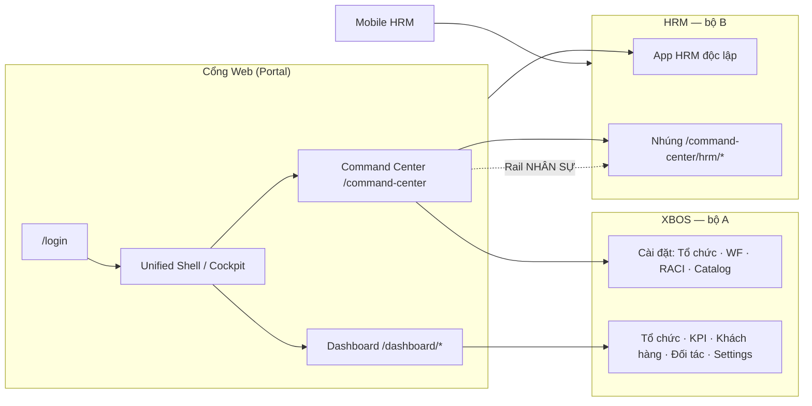

# Hướng dẫn sử dụng — Hệ sinh thái XeVN OS (Mục lục tổng)

| Thuộc tính | Giá trị |
|------------|---------|
| **Mã tài liệu** | XEVN/HDSD-ECO-000 |
| **Phiên bản** | 1.1 |
| **Ngày hiệu lực** | 30/07/2026 |
| **Phạm vi** | Toàn bộ hệ sinh thái — **không** gom HRM vào một phân hệ duy nhất |

---

## Ba bộ tài liệu độc lập

Hệ sinh thái XeVN gồm **hai sản phẩm web chính** + **mobile**, mỗi bộ có HDSD riêng:

| Bộ | Sản phẩm | API | Cổng / URL | Mục lục |
|----|----------|-----|------------|---------|
| **A — XBOS** | Business Operating System — Command Center, tổ chức, workflow, danh mục tập đoàn, KPI, dashboard vận hành | `xbos-api` `:28002` | Cổng Web → `/command-center`, `/dashboard/*`, `/cockpit` | [**HDSD XBOS**](./xbos/HDSD_XBOS_INDEX.md) |
| **B — HRM** | Human Resource Management — nhân sự, HĐ, chấm công, lương, tuyển dụng, … | `hrm-api` `:28001` | **Ứng dụng HRM riêng** (`/employees`, …) **hoặc** nhúng qua `/command-center/hrm/*` | [**HDSD HRM**](./hrm/HDSD_HRM_INDEX.md) |
| **C — Cổng chung** | Đăng nhập, shell, chuyển phân hệ XBOS ↔ HRM | Portal auth | `/login`, Unified Shell | [**Cổng & liên kết**](./ecosystem/HDSD_ECOSYSTEM_CH01_CONG_VA_CHUYEN_PHAN_HE.md) |
| **D — Mobile** | HRM ESS trên điện thoại | `hrm-api` | App Android/iOS | [HRM Ch. Mobile](./hrm/HDSD_XEVN_CH12_MOBILE_HRM.md) |

> **Quan trọng:** Kiểm thử và nghiệm thu phải chạy **đủ cả XBOS và HRM** (và mobile), không chỉ tab HRM nhúng trong Command Center.

---

## Sơ đồ quan hệ (tóm tắt)

---

## Bảng kê màn hình theo sản phẩm

### A — XBOS (11+ nhóm màn — xem chi tiết [XBOS INDEX](./xbos/HDSD_XBOS_INDEX.md))

| STT | Nhóm màn | Route / vào | HDSD |
|-----|----------|-------------|------|
| A1 | Command Center — tổng quan & Action Cards | `/command-center` | XBOS Ch.1 |
| A2 | Cài đặt — Đơn vị / pháp nhân / cổ đông | CC → Cài đặt | XBOS Ch.2 |
| A3 | Phòng ban · RBAC · RACI | CC → Cài đặt | XBOS Ch.2–3 |
| A4 | Workflow inbox & canvas | CC / inbox | XBOS Ch.3 |
| A5 | Danh mục & Catalog governance | CC · `/catalog-governance` | XBOS Ch.3–4 |
| A6 | Cockpit / Executive dashboard | `/cockpit` | XBOS Ch.4 |
| A7 | Tổ chức (dashboard) | `/dashboard/organization` | XBOS Ch.4 |
| A8 | Khách hàng · Đối tác | `/dashboard/customers` · `partners` | XBOS Ch.4 |
| A9 | KPI chính sách · KPI dashboard | `/dashboard/kpi-policy` · `kpi-dashboard` | XBOS Ch.4 |
| A10 | Settings vận hành (chức danh, vùng, xe, NCC, …) | `/dashboard/settings/*` | XBOS Ch.4 |

### B — HRM Web (17 menu — xem [HRM INDEX](./hrm/HDSD_HRM_INDEX.md))

| STT | Menu | Route standalone | Route embed (CC) | HDSD |
|-----|------|------------------|------------------|------|
| B1 | Tổng quan | `/` hoặc dashboard | `…/hrm/dashboard` | HRM Ch.0–1 |
| B2 | Nhân sự | `/employees` | `…/hrm/employees` | HRM Ch.1 |
| B3 | Hợp đồng · Bảo hiểm | `/contracts` · `/insurance` | `…/hrm/contracts` · `insurance` | HRM Ch.2 |
| B4 | Tuyển dụng | `/recruitment` | `…/hrm/recruitment` | HRM Ch.3 |
| B5 | Chấm công | `/attendance` | `…/hrm/attendance` | HRM Ch.4 |
| B6 | Lương | `/payroll` | `…/hrm/payroll` | HRM Ch.5 |
| B7 | Công ty · QĐ · CV · DVC · Fleet · Quy trình | các route tương ứng | `…/hrm/*` | HRM Ch.6 |
| B8 | Cài đặt · Báo cáo · Hướng dẫn | `/settings` · `/reports` · `/guide` | `…/hrm/settings` … | HRM Ch.7 |
| B9 | Đánh giá hiệu suất | `/performance` | `…/hrm/performance` | HRM Ch.6 (tab) |
| B10 | UniAI | `/ai` | `…/hrm/hrm_ai` | HRM Ch.6 — pilot |
| B11 | Công cụ & thiết bị | `/tools-equipment` | `…/hrm/tools_equipment` | **Deferred** — backlog; TC OUT-OF-SCOPE pilot |

**Hai cách vào HRM (bắt buộc test cả hai khi nghiệm thu hệ sinh thái):**

1. **HRM độc lập** — mở app HRM (port riêng hoặc subdomain), menu sidebar đầy đủ.  
2. **HRM nhúng** — từ Command Center, rail **NHÂN SỰ** → iframe `/command-center/hrm/*`.

### D — Mobile HRM

| STT | Màn | HDSD |
|-----|-----|------|
| D1 | Login · Home · Chấm công · Nghỉ · Lương · Duyệt · Hồ sơ | HRM Mobile chương |

---

## Kiểm thử theo hệ sinh thái

| Wave | Bộ | Artifact QA |
|------|-----|-------------|
| W0 | Cổng chung | `ecosystem/HDSD_ECOSYSTEM_CH01` + TC-ECO-* |
| W1 | **XBOS** | `xbos/*` + TC-XBOS-HDSD-* ↔ UF-XBOS-01..15 |
| W2 | **HRM web** (standalone **+** embed) | `hrm/*` + TC-HRM-HDSD-* ↔ UF-HRM-* |
| W3 | **Mobile** | `hrm/HDSD_XEVN_CH12_MOBILE_HRM.md` + TC-MOB-* |
| W4 | Liên thông XBOS→HRM | Catalog sync, headcount công ty, workflow HRM |

- Ma trận: [`docs/qa/HDSD_SRS_TESTCASE_MATRIX.md`](../../qa/HDSD_SRS_TESTCASE_MATRIX.md)  
- Kịch bản: [`docs/qa/HDSD_DRIVEN_UAT_SCENARIO.md`](../../qa/HDSD_DRIVEN_UAT_SCENARIO.md)  
- Program: [`docs/program/HDSD_QA_PROGRAM.md`](../../program/HDSD_QA_PROGRAM.md)

---

## Quy ước trình bày (mọi bộ)

1. Mục đích · persona · quyền  
2. `[Hình XX.Y — mô tả ngắn minh họa màn hình]`  
3. Bảng **Nút & chức năng**  
4. Bảng **Hộp thoại — các trường**  
5. Bảng **Cột danh sách**  
6. Trạng thái nghiệp vụ · lỗi thường gặp  
