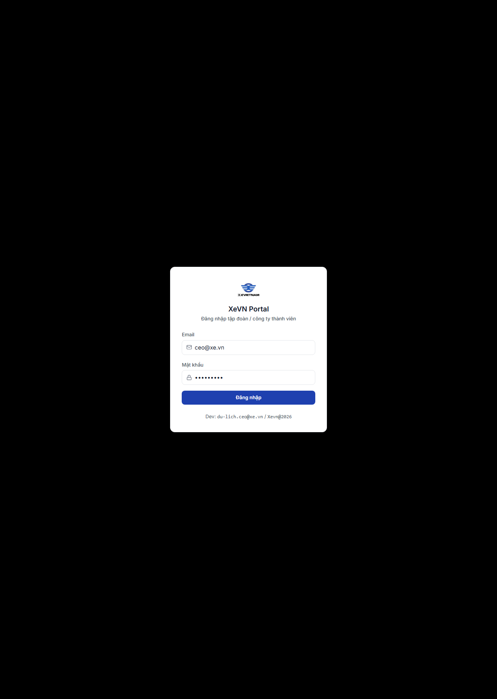
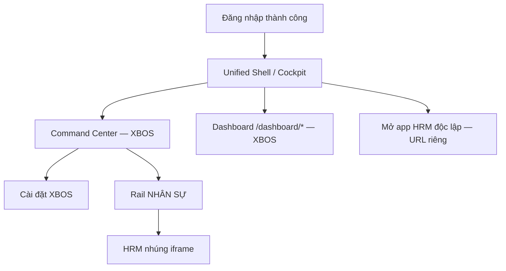

# Cổng Web — Đăng nhập & chuyển phân hệ (XBOS ↔ HRM)

| Thuộc tính | Giá trị |
|------------|---------|
| **Mã chương** | XEVN/HDSD-ECO-001 |
| **Phạm vi** | **Cổng chung** — không thay thế HDSD XBOS hay HRM |

---

## 1. Mục đích

Cổng Web là **điểm vào duy nhất** cho Ban điều hành: sau đăng nhập có thể làm việc với **XBOS** (Command Center, dashboard) hoặc chuyển sang **HRM** (nhúng hoặc app riêng). Tài liệu này mô tả phần **dùng chung**; chi tiết từng sản phẩm xem bộ HDSD tương ứng.

---

## 2. Đăng nhập Cổng

### Cách vào

| Bước | Thao tác |
|------|----------|
| 1 | Mở trình duyệt → địa chỉ Cổng (vd. `:5173` portal). |
| 2 | Hệ thống chuyển **`/login`** nếu chưa có phiên. |
| 3 | Nhập **Email**, **Mật khẩu** → **Đăng nhập**. |
| 4 | Thành công → **Unified Shell** hoặc **Command Center** tùy cấu hình tenant. |

### Bảng Nút & chức năng

| Nút / trường | Chức năng |
|--------------|-----------|
| **Email** | Tài khoản (bắt buộc) |
| **Mật khẩu** | Mật khẩu (bắt buộc) |
| **Đăng nhập** | Xác thực → tạo phiên JWT |

### Persona tham chiếu

| Vai trò | Email | Dùng cho |
|---------|-------|----------|
| CEO tập đoàn | `ceo@xe.vn` | XBOS full + HRM rollup |
| CEO công ty thành viên | `du-lich.ceo@xe.vn` | Scope một công ty |

---

## 3. Sau đăng nhập — chọn sản phẩm

| Mục tiêu | Thao tác | Tài liệu chi tiết |
|----------|----------|-------------------|
| Tổng quan tập đoàn, workflow, tổ chức | Vào **Command Center** | [HDSD XBOS Ch.1](../xbos/HDSD_XBOS_CH01_COMMAND_CENTER.md) |
| KPI, khách hàng, settings vận hành | Menu **Dashboard** `/dashboard/*` | [HDSD XBOS Ch.4](../xbos/HDSD_XBOS_CH04_DASHBOARD_VAN_HANH.md) |
| Nhân sự **trong shell CC** | Rail **NHÂN SỰ** | [HDSD HRM Ch.0](../hrm/HDSD_HRM_CH00_VAO_UNG_DUNG.md) |
| Nhân sự **app riêng** | Mở URL app HRM (bookmark / menu IT) | [HDSD HRM INDEX](../hrm/HDSD_HRM_INDEX.md) |
| Nhân viên trên điện thoại | App Mobile HRM | [HDSD Mobile](../hrm/HDSD_XEVN_CH12_MOBILE_HRM.md) |

---

## 4. Rail phân hệ (Command Center)

| Rail | Nhãn | Đích | Bộ HDSD |
|------|------|------|---------|
| GROUP | Tập đoàn | `/command-center` | **XBOS** |
| NHÂN SỰ | Nhân sự | `/command-center/hrm/dashboard` | **HRM** (nhúng) |
| CÀI ĐẶT HỆ THỐNG | Cài đặt | Sidebar Cài đặt CC | **XBOS** |
| TÀI CHÍNH / KẾ TOÁN / … | (tùy bật) | `/dashboard/...` | **XBOS** |

> Bấm **NHÂN SỰ** **không** làm bạn «ở trong XBOS» — bạn chuyển sang **sản phẩm HRM** (iframe), API `:28001`.

---

## 5. Phiên làm việc & lỗi chung

| Triệu chứng | Phân loại | Xử lý |
|-------------|-----------|--------|
| Banner HRM trên shell CC | **HRM API** | Bật `hrm-api` — xem HDSD HRM |
| 409 scope company | Auth/scope | Đăng nhập lại; đúng membership |
| KPI/CC lỗi | **XBOS API** | Bật `xbos-api` — xem HDSD XBOS |
| `54321` trên console | Sai chế độ API | Dùng Nest proxy, không Supabase trực tiếp |

---

## 6. Kiểm thử (TC-ECO)

| TC ID | Nội dung |
|-------|----------|
| TC-ECO-01 | Login → vào được CC (XBOS) |
| TC-ECO-02 | Login → rail NHÂN SỰ → iframe HRM load |
| TC-ECO-03 | Mở app HRM standalone cùng phiên |
| TC-ECO-04 | CC → dashboard organization (XBOS) |
| TC-ECO-05 | Catalog XBOS publish → HRM settings sync (liên thông) |

*Hết chương Cổng chung — chi tiết nghiệp vụ: bộ XBOS và bộ HRM.*
