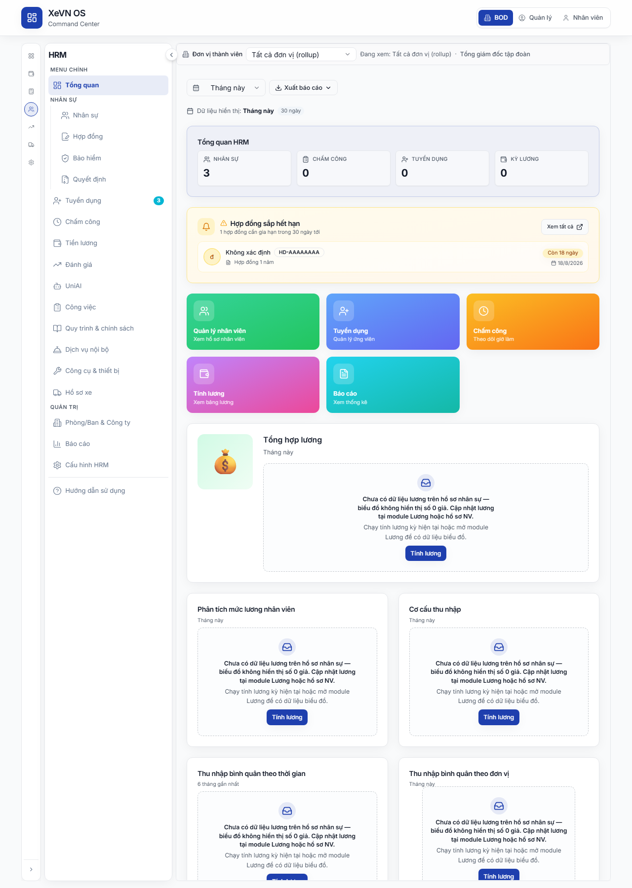

# HRM — Vào ứng dụng (standalone & nhúng Command Center)

| Thuộc tính | Giá trị |
|------------|---------|
| **Mã chương** | XEVN/HDSD-HRM-000 |
| **Sản phẩm** | **HRM** (tách khỏi XBOS) |

---

## 0.1 Hai cách mở HRM Web

| | **HRM độc lập (W2a)** | **HRM nhúng Command Center (W2b)** |
|---|----------------------|-------------------------------------|
| **Khi nào dùng** | HR làm việc hàng ngày; full màn hình; URL bookmark | Ban điều hành vừa xem CC vừa duyệt HR; không rời shell tập đoàn |
| **Shell** | App HRM thuần (sidebar HRM full) | Cổng Web + rail CC + sidebar HRM + iframe |
| **URL mẫu** | `http://127.0.0.1:8080/hr/employees` | `http://127.0.0.1:5173/command-center/hrm/employees` |
| **Base URL** | `http://127.0.0.1:8080/hr/*` (cổ mặc định app HRM) | `http://127.0.0.1:5173/command-center/hrm/*` (cổ portal) |
| **API** | Cùng `hrm-api` `:28001` | Cùng API — proxy qua portal |

### Bảng entry nghiệm thu (W2a / W2b)

| Entry | Wave | Base URL | Ghi chú |
|-------|------|----------|---------|
| **Standalone W2a** | HRM độc lập | `http://127.0.0.1:8080/hr/*` | Route ví dụ: `/hr/employees`, `/hr/attendance`. |
| **Embed W2b** | HRM nhúng CC | `http://127.0.0.1:5173/command-center/hrm/*` | Cần portal `:5173`. Route ví dụ: `…/hrm/employees`. |
| *(tùy chọn)* Standalone thủ công | W2a alt | `http://127.0.0.1:5175/*` | Chỉ khi IT chạy profile dev thủ công (base `/`, không `/hr/`). **Không** thay W2a chuẩn `:8080/hr/`. |

Nghiệm thu **hệ sinh thái**: chạy **cùng testcase nghiệp vụ** trên **cả hai** cách vào (ít nhất 1 menu/màn representative mỗi chương HRM).

---

## 0.2 HRM nhúng — cách vào (W2b)

| Bước | Thao tác |
|------|----------|
| 1 | Mở Cổng Web tại `http://127.0.0.1:5173` → đăng nhập → **Command Center** (XBOS). |
| 2 | Rail trái → icon **NHÂN SỰ** (hoặc lọc Action Cards theo NHÂN SỰ). |
| 3 | URL mặc định: `http://127.0.0.1:5173/command-center/hrm/dashboard`. |
| 4 | Sidebar HRM trái + iframe phải. Chọn menu → URL đổi `http://127.0.0.1:5173/command-center/hrm/<menu>`. |

### Bảng menu sidebar HRM (embed & standalone giống nhau)

| Menu | Route embed (W2b) | Route standalone (W2a) |
|------|-------------------|-------------------------|
| Tổng quan | `…/command-center/hrm/dashboard` | `/hr/` hoặc `/hr/dashboard` |
| Nhân sự | `…/command-center/hrm/employees` | `/hr/employees` |
| Hợp đồng | `…/command-center/hrm/contracts` | `/hr/contracts` |
| Bảo hiểm | `…/command-center/hrm/insurance` | `/hr/insurance` |
| Quyết định | `…/command-center/hrm/decisions` | `/hr/decisions` |
| Tuyển dụng | `…/command-center/hrm/recruitment` | `/hr/recruitment` |
| Chấm công | `…/command-center/hrm/attendance` | `/hr/attendance` |
| Tiền lương | `…/command-center/hrm/payroll` | `/hr/payroll` |
| Đánh giá | `…/command-center/hrm/performance` | `/hr/performance` |
| Công việc | `…/command-center/hrm/tasks` | `/hr/tasks` |
| Quy trình & chính sách | `…/command-center/hrm/processes` | `/hr/processes` |
| Dịch vụ nội bộ | `…/command-center/hrm/internal_services` | `/hr/internal-services` |
| Công cụ & thiết bị | `…/command-center/hrm/tools_equipment` | `/hr/tools-equipment` |
| Hồ sơ xe | `…/command-center/hrm/fleet` | `/hr/fleet` |
| Phòng/Ban & Công ty | `…/command-center/hrm/company` | `/hr/company` |
| Báo cáo | `…/command-center/hrm/reports` | `/hr/reports` |
| Cấu hình HRM | `…/command-center/hrm/settings` | `/hr/settings` |
| Hướng dẫn | `…/command-center/hrm/guide` | `/hr/guide` |

> **Ghi chú URL:** Route embed đầy đủ = `http://127.0.0.1:5173` + cột embed. Route standalone đầy đủ = `http://127.0.0.1:8080` + cột W2a.

### Nút shell (chỉ embed)

| Nút | Chức năng |
|-----|-----------|
| **NHÂN SỰ** (rail CC) | Vào HRM embed |
| **GROUP** (rail CC) | Quay **XBOS** Command Center |
| Thu/Mở sidebar HRM | Thu gọn menu |
| **Mở menu HRM** (mobile) | Overlay menu |

---

## 0.3 HRM standalone — cách vào (W2a)

| Bước | Thao tác |
|------|----------|
| 1 | Mở URL app HRM chuẩn: `http://127.0.0.1:8080/hr/` (IT triển khai có thể dùng hostname tương đương, vẫn giữ base `/hr/`). |
| 2 | Đăng nhập (cùng tài khoản portal hoặc SSO tenant). |
| 3 | Sidebar HRM đầy đủ — **không** có rail XBOS. Ví dụ vào Nhân sự: `http://127.0.0.1:8080/hr/employees`. |

> **Tùy chọn (dev):** Cổ `:5175` (base `/`, không `/hr/`) chỉ dùng khi IT bật profile standalone thủ công — **không** thay URL nghiệm thu W2a `:8080/hr/`.

---

## 0.4 Trạng thái & lỗi (HRM)

| Triệu chứng | Nguyên nhân | Xử lý |
|-------------|-------------|--------|
| **HRM API Sync ERROR** (embed) | `hrm-api` down | IT bật `:28001` |
| Iframe trắng / spinner | Scope chưa resolve | Chọn membership; F5 |
| 409 companyId | Token lệch scope | Đăng nhập lại |
| Menu click không đổi iframe | Race điều hướng | Đợi 2s; bấm lại menu |

Form chi tiết (Thêm NV, nghỉ phép, …) → các chương HRM 1–7.

---

*Chương 0 — Hết. Nghiệp vụ: Chương 1 Nhân sự trở đi.*
