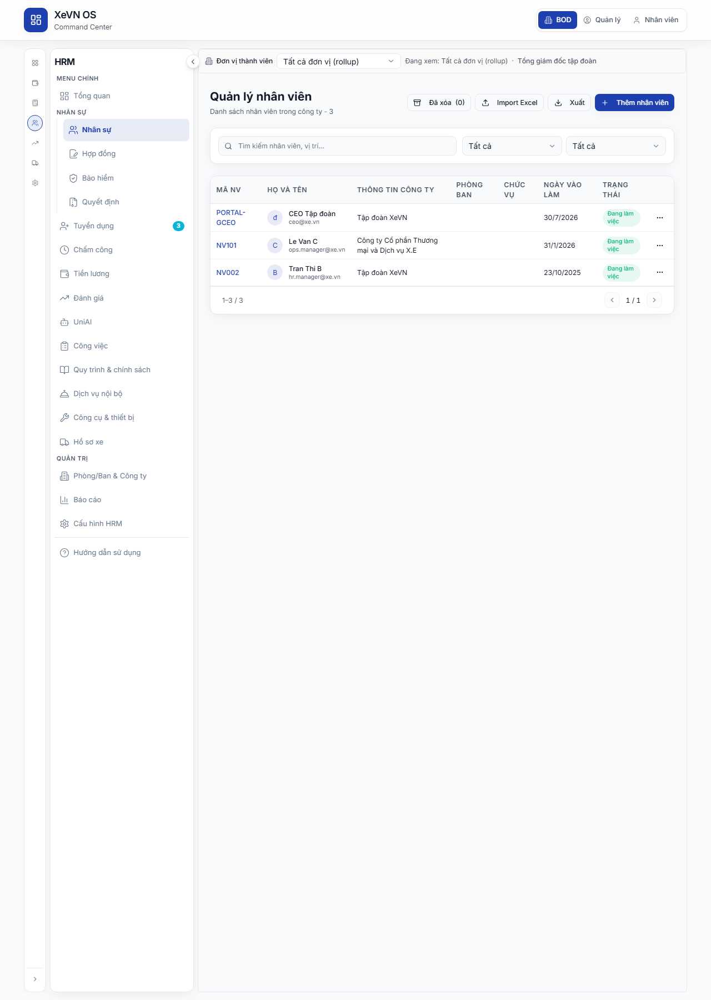

# Chương 5 — Nhân sự (Danh sách & Hồ sơ nhân viên)

| Thuộc tính | Giá trị |
|------------|---------|
| **Mã tài liệu** | XEVN/HDSD-OS-005 |
| **Sản phẩm** | **HRM** |
| **Phiên bản** | 1.0 |
| **Ngày hiệu lực** | 30/07/2026 |
| **Phạm vi** | HRM embed trên Command Center hoặc HRM độc lập |
| **Đối tượng** | HR, Quản lý nhân sự, Ban điều hành (theo phân quyền) |
| **Liên kết nghiệp vụ** | UC-HRM-21 · HRM-EM-02 · HRM-EM-03 · HRM-EM-04 · HRM-EM-05 · UF-HRM-01 · UF-HRM-02 |

---

## Điều hướng — hai cách vào HRM

| Cách | Thao tác | Route mẫu |
|------|----------|-----------|
| **HRM độc lập** | Sidebar HRM → **Nhân viên** | `/employees` |
| **HRM nhúng (embed)** | Cổng → Command Center → rail **NHÂN SỰ** → sidebar **Nhân sự** | `/command-center/hrm/employees` |

Chi tiết shell: [HDSD_HRM_CH00_VAO_UNG_DUNG.md](./HDSD_HRM_CH00_VAO_UNG_DUNG.md).

---

## 5.1 Danh sách nhân viên

### Mục đích

Tra cứu, lọc và quản lý danh sách nhân viên theo phạm vi công ty; mở hồ sơ chi tiết; thêm, sửa, xóa mềm, nhập/xuất Excel.

### Điều hướng

**Embed Command Center**

1. Đăng nhập Cổng Web → rail phân hệ **NHÂN SỰ** (hoặc menu HRM).
2. Sidebar HRM → **Nhân viên**.
3. Route: `/command-center/hrm/employees` (iframe HRM).

**HRM độc lập**

1. Sidebar → **Nhân viên**.
2. Route: `/employees`.

### Tiêu đề trang

| Thành phần | Nội dung |
|------------|----------|
| Tiêu đề | **Quản lý nhân viên** |
| Phụ đề | **Danh sách nhân viên trong công ty -** {tổng số bản ghi} |

### Bảng nút & chức năng (thanh tiêu đề)

| Nút | Quyền | Chức năng |
|-----|-------|-----------|
| **Đã xóa (N)** | Xóa nhân viên | Mở hộp thoại danh sách nhân viên đã xóa mềm; **N** = số đã lưu trữ |
| **Import Excel** | Nhập | Mở hộp thoại import file Excel |
| **Xuất** | Xuất | Mở hộp thoại xuất danh sách theo bộ lọc hiện tại |
| **Thêm nhân viên** | Tạo mới | Mở hộp thoại tạo nhân viên |

### Bộ lọc

| Trường | Kiểu | Giá trị / ghi chú |
|--------|------|-------------------|
| **Tìm kiếm nhân viên, vị trí...** | Ô tìm kiếm | Lọc theo từ khóa (debounce ~300 ms) |
| **Phòng ban** | Dropdown | **Tất cả** + danh sách phòng từ danh mục cài đặt |
| **Trạng thái** | Dropdown | **Tất cả** · **Đang làm việc** · **Thử việc** · **Đã nghỉ việc** |

> **Lưu ý:** Lọc **Phòng ban** áp dụng trên trang hiện tại sau khi API phân trang; đổi phòng ban có thể cần duyệt nhiều trang.

### Bảng cột danh sách

| Cột | Mô tả |
|-----|--------|
| **Mã NV** | Mã nhân viên (liên kết màu primary) |
| **Họ và tên** | Avatar + họ tên + email phụ |
| **Thông tin công ty** | Tên đơn vị / công ty (cột ẩn trên mobile) |
| **Phòng ban** | Phòng ban hiện tại |
| **Chức vụ** | Chức danh đã resolve từ catalog |
| **Ngày vào làm** | Định dạng dd/MM/yyyy |
| **Trạng thái** | Badge: **Đang làm việc** / **Thử việc** / **Đã nghỉ việc** |
| Menu **⋯** | **Xem** · **Chỉnh sửa** · **Xóa** (theo quyền) |

### Hành vi bảng

| Thao tác | Kết quả |
|----------|---------|
| Click một dòng | Mở **Hồ sơ nhân viên** (`/employees/{id}`) |
| Menu **Xem** | Cùng hành vi click dòng |
| Phân trang | `{từ}–{đến} / {tổng}` · nút **←** **→** · `{trang} / {tổng trang}` |

### Trạng thái nghiệp vụ

| Trạng thái NV | Badge |
|---------------|-------|
| active | **Đang làm việc** |
| probation | **Thử việc** |
| inactive | **Đã nghỉ việc** |

| Trạng thái màn hình | Hiển thị |
|---------------------|----------|
| Đang tải | Spinner giữa bảng |
| Có dữ liệu | Bảng + phân trang |
| Không có bản ghi | Bảng trống (empty state) |
| Đang làm mới (fetch) | «…» cạnh phạm vi phân trang |

### Lỗi thường gặp

| Triệu chứng | Cách xử lý |
|-------------|------------|
| Banner **HRM API Sync ERROR** / bảng trống + lỗi 500 | Kiểm tra HRM API đang chạy; làm mới trang sau khi API 200 |
| **Thêm nhân viên** báo «Đã đạt giới hạn nhân viên…» | Nâng cấp gói dịch vụ hoặc liên hệ quản trị |
| Cột **Thông tin công ty** sai tên Khối | Dữ liệu hiển thị theo pháp nhân/ĐVTV — báo HR nếu lệch SoT tổ chức |
| HTTP 409 phạm vi công ty | Đăng nhập đúng persona; chọn đúng công ty trên bộ lọc phạm vi |
| Import thất bại | Xem chi tiết trong hộp thoại Import; sửa file Excel theo mẫu |

---

## 5.2 Hộp thoại Thêm / Chỉnh sửa nhân viên

### Mục đích

Tạo mới hoặc cập nhật thông tin nhân viên theo danh mục cài đặt (phòng ban, chức danh, trạng thái, …).

### Mở hộp thoại

| Cách mở | Tiêu đề hộp thoại |
|---------|-------------------|
| **Thêm nhân viên** | **Thêm nhân viên** |
| **Chỉnh sửa** (danh sách hoặc hồ sơ) | **Chỉnh sửa nhân viên** |

### Tab hộp thoại

| Tab | Hiển thị khi |
|-----|----------------|
| **Thông tin cơ bản** | Luôn có |
| **Cá nhân** | Catalog trường cá nhân có cấu hình |
| **Công việc** | Catalog trường công việc có cấu hình |
| **Tài chính** | Catalog trường tài chính có cấu hình |

### Bảng trường — Tab Thông tin cơ bản

| Trường | Bắt buộc | Ghi chú |
|--------|----------|---------|
| Ảnh đại diện | Không | Upload qua **EmployeeAvatarUpload** |
| **Thông tin công ty** | Có (khi user có nhiều công ty) | Dropdown chọn công ty |
| **Mã NV** | Có | |
| **Họ và tên** | Có | |
| **Email** | Khuyến nghị | Định dạng email |
| **Số điện thoại** | Không | |
| **Phòng ban** | Khuyến nghị | Chọn từ catalog (**Chọn phòng ban**) |
| **Chức vụ** | Khuyến nghị | Chọn từ catalog chức danh (không nhập tự do) |
| **Ngày vào làm** | Không | dd/MM/yyyy |
| **Trạng thái** | Khuyến nghị | **Đang làm việc** / **Thử việc** / **Đã nghỉ việc** |

### Bảng trường — Tab Cá nhân (khi bật)

| Trường | Ghi chú |
|--------|---------|
| **Giới tính** | Nam / Nữ / Khác |
| **Ngày sinh** | dd/MM/yyyy |
| **Số CMND/CCCD** | |
| **Nơi cấp** | |
| **Địa chỉ thường trú** | |
| **Địa chỉ tạm trú** | |
| **Người liên hệ khẩn cấp** | |
| **SĐT khẩn cấp** | |

### Bảng trường — Tab Công việc (khi bật)

| Trường | Ghi chú |
|--------|---------|
| **Loại hình nhân viên** | Toàn thời gian / Bán thời gian / Hợp đồng / Thực tập |
| **Nơi làm việc** | |

### Bảng trường — Tab Tài chính (khi bật)

| Trường | Ghi chú |
|--------|---------|
| **Lương** | Nhập số có nhóm nghìn (vi-VN) |
| **Mã số thuế cá nhân** | |
| **Ngân hàng** | |
| **Số tài khoản** | |
| **Số BHXH** | |
| **Số BHYT** | |

### Nút chân hộp thoại

| Nút | Chức năng |
|-----|-----------|
| **Hủy** | Đóng không lưu |
| **Thêm nhân viên** / **Cập nhật** | Gửi form (hiển thị **Đang lưu...** khi chờ API) |

### Trạng thái

| Trạng thái | Hiển thị |
|------------|----------|
| Validation lỗi | Thông báo dưới trường (mã NV / họ tên bắt buộc, email không hợp lệ) |
| Lưu thành công | Hộp thoại đóng; danh sách cập nhật |
| Catalog phòng/chức danh trống | Picker trống + hướng dẫn đồng bộ danh mục (Cài đặt HRM) |

### Lỗi thường gặp

| Triệu chứng | Cách xử lý |
|-------------|------------|
| Không chọn được **Phòng ban** / **Chức vụ** | Đồng bộ danh mục từ XBOS (Chương 4) hoặc Cài đặt HRM |
| **Cập nhật** không đóng hộp thoại | Xem toast lỗi API; kiểm tra trùng mã NV hoặc phạm vi |
| Thiếu tab **Tài chính** | Catalog trường tài chính chưa bật — cấu hình trong Cài đặt |

---

## 5.3 Xóa mềm nhân viên

### Mục đích

Chuyển nhân viên vào danh sách **Đã xóa** để có thể khôi phục sau.

| Nút / trường | Mô tả |
|--------------|--------|
| Tiêu đề | **Xác nhận xóa nhân viên** |
| Nội dung | Xác nhận tên + mã NV |
| Ghi chú | «Nhân viên sẽ được chuyển vào danh sách đã xóa…» |
| **Lý do xóa (tùy chọn)** | Textarea |
| **Hủy** | Đóng |
| **Xóa nhân viên** | Thực hiện xóa mềm |

Khôi phục: **Đã xóa (N)** → chọn nhân viên → **Khôi phục** (trong `DeletedEmployeesDialog`).

---

## 5.4 Hồ sơ nhân viên (chi tiết)

### Mục đích

Xem và chỉnh sửa toàn bộ thông tin nhân viên theo nhóm tab; truy cập hợp đồng, lương, bảo hiểm, KPI, … trong cùng màn hình.

### Điều hướng

- Từ danh sách: click dòng hoặc **Xem**.
- Route: `/employees/{id}` (embed: `/command-center/hrm/employees/{id}`).

### Header

| Thành phần | Mô tả |
|------------|--------|
| **←** (Quay lại) | Về **Quản lý nhân viên** |
| Họ và tên | Tiêu đề trang |
| Badge mã NV | Mã nhân viên |
| **Chỉnh sửa** | Mở hộp thoại **Chỉnh sửa nhân viên** (theo quyền) |

### Dải tab — Nhóm Cốt lõi (luôn hiển thị)

| Tab | Nội dung chính |
|-----|----------------|
| **Thông tin chung** | Avatar, thông tin cá nhân, công việc, tài chính (nếu có quyền), radar kỹ năng, timeline, thẻ thống kê |
| **Công việc** | Danh sách công việc gán (`EmployeeJobList`) |
| **Hợp đồng** | Hợp đồng lao động của NV |
| **Lương & Phụ cấp** | Chi tiết lương (yêu cầu quyền xem lương) |

### Nhóm tab mở rộng (popover)

| Nút nhóm | Tab con |
|----------|---------|
| **Nhân sự** ▼ | **Bảo hiểm & Phúc lợi** · **Đào tạo** · **Tài sản** · **Khen thưởng & Kỷ luật** |
| **Sự nghiệp** ▼ | **Sơ yếu lý lịch** · **Đánh giá KPI** · **Quá trình công tác** · **Bằng cấp** · **Chứng chỉ** · **Kỹ năng** |
| **Cá nhân** ▼ | **Thông tin gia đình** |

Chọn tab con lần đầu có thể **ghim** tab lên dải chính (kéo thả thứ tự tab ghim; **×** để **Bỏ ghim tab**).

### Tab Thông tin chung — các khối

| Khối | Trường tiêu biểu |
|------|------------------|
| Thẻ avatar | Họ tên, **Chức vụ**, phòng ban, badge trạng thái |
| **Thông tin cá nhân** | **Email**, **Điện thoại**, **Ngày sinh**, **Giới tính**, CMND/CCCD (nếu có quyền) |
| **Địa chỉ** | **Địa chỉ thường trú**, **Địa chỉ tạm trú** |
| **Liên hệ khẩn cấp** | **Người liên hệ**, **Số điện thoại** |
| **Thông tin công việc** | **Phòng ban**, **Chức vụ**, **Địa điểm làm việc**, **Ngày vào làm**, **Ngày kết thúc**, **Loại hợp đồng** |
| **Thông tin tài chính** | **Lương cơ bản**, **Ngân hàng**, **Số tài khoản**, **Mã số thuế** (quyền xem lương) |
| **Bảo hiểm** | **Số BHXH**, **Số BHYT** (quyền xem lương) |
| **Kỹ năng làm việc** | Biểu đồ radar + chú thích **Điểm chuẩn** / **Quản lý** / **Ban giám đốc** |

Giá trị trống hiển thị **—** hoặc **--**; ngày theo **dd/MM/yyyy**; lương định dạng VND.

### Phân quyền xem nhạy cảm

| Vùng | Không đủ quyền `view_salary` |
|------|------------------------------|
| CMND/CCCD trên tab chung | Khối **Không có quyền xem nội dung này** (compact) |
| **Thông tin tài chính** / **Bảo hiểm** | Khối fallback đầy đủ + «Liên hệ HR» |
| Tab **Lương & Phụ cấp** | Toàn tab fallback |

### Trạng thái hồ sơ

| Trạng thái NV | Badge trên thẻ trái |
|---------------|---------------------|
| active | **Đang làm việc** |
| probation | **Thử việc** |
| inactive | **Đã nghỉ việc** |
| suspended | **Tạm nghỉ** |

| Trạng thái màn hình | Hiển thị |
|---------------------|----------|
| Đang tải | Skeleton header + thẻ |
| Không tìm thấy | «Không tìm thấy nhân viên» + **Quay lại danh sách** |
| Tab lazy (ngoài Cốt lõi) | Spinner «…» khi mở lần đầu |

### Lỗi thường gặp

| Triệu chứng | Cách xử lý |
|-------------|------------|
| «Không tìm thấy nhân viên» | Sai id hoặc NV ngoài phạm vi JWT — quay danh sách, chọn lại |
| Hiển thị mã thô thay nhãn (giới tính, loại HĐ, chức vụ) | Báo HR — cần đồng bộ danh mục hiển thị |
| Tab **Lương** trống / bị che | Cấp quyền xem lương cho role |
| Deep link embed mất công ty | Mở lại từ danh sách cùng phạm vi `company_id` |

---

## 5.5 Liên kết dữ liệu & danh mục

Theo ma trình liên kết menu HRM:

| Menu | API chính | Danh mục liên quan |
|------|-----------|-------------------|
| **Nhân viên** | `GET/POST/PATCH /employees` | Chức danh, phòng ban, trường mở rộng NV từ **Cài đặt HRM** / đồng bộ XBOS |

CEO tập đoàn thấy rollup nhiều công ty; CEO công ty thành viên chỉ thấy NV thuộc công ty mình.

---

## Tóm tắt liên kết kiểm thử

| Luồng | Mã tham chiếu |
|-------|----------------|
| Danh sách, lọc, phân trang, CRUD | UC-HRM-21 · HRM-EM-02 · UF-HRM-01 |
| Hộp thoại Thêm/Sửa | HRM-EM-03 · UF-HRM-02 |
| Hồ sơ — tab & phân quyền | HRM-EM-04 · HRM-EM-05 |
| List → profile (J-HRM-02) | `PROGRAM_JOURNEY_MAP` J-HRM-02 |
