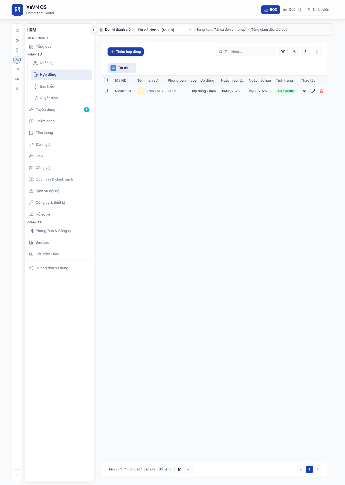
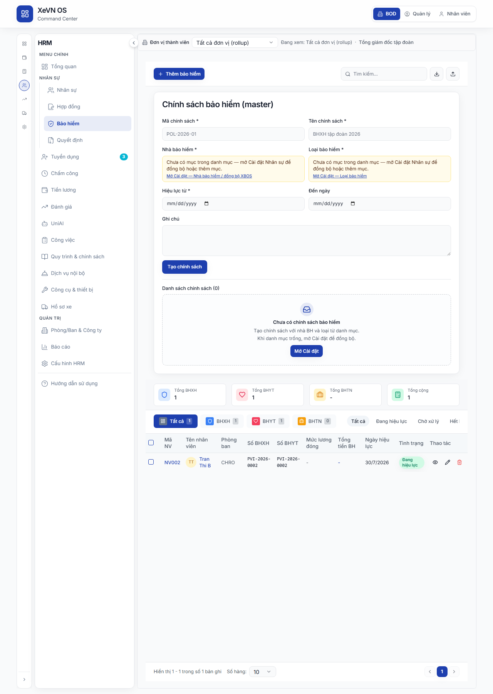

# Chương 6 — Hợp đồng lao động & Bảo hiểm (HRM)

| Thuộc tính | Giá trị |
|------------|---------|
| **Mã tài liệu** | XEVN/HDSD-HRM-006 |
| **Sản phẩm** | **HRM** |
| **Phiên bản** | 1.0 (Markdown — placeholder ảnh) |
| **Ngày hiệu lực** | 30/07/2026 |
| **Đường vào** | Command Center → HRM → **Hợp đồng** / **Bảo hiểm** |
| **Route embed** | `…/hrm/contracts` · `…/hrm/insurance` |
| **Đối tượng** | HRBP, Chuyên viên nhân sự, Kế toán lương |
| **Tham chiếu SRS** | UC-HRM-25 · FR-HRM-CI-01 · FR-HRM-CI-02 · HRM-CI-01 · HRM-CI-02 |

---

## Điều hướng — hai cách vào HRM

| Cách | Thao tác | Route mẫu |
|------|----------|-----------|
| **HRM độc lập** | Sidebar → **Hợp đồng** / **Bảo hiểm** | `/contracts` · `/insurance` |
| **HRM nhúng (embed)** | Command Center → **NHÂN SỰ** → sidebar tương ứng | `/command-center/hrm/contracts` · `…/insurance` |

Chi tiết shell: [HDSD_HRM_CH00_VAO_UNG_DUNG.md](./HDSD_HRM_CH00_VAO_UNG_DUNG.md).

---

## 1. Giới thiệu chương

Chương này hướng dẫn hai phân hệ liên quan trên Cổng HRM:

1. **Hợp đồng lao động** — quản lý danh sách HĐ, lọc theo loại, tạo/sửa/xóa, nhập/xuất Excel, đính kèm file scan.
2. **Bảo hiểm** — quản lý chính sách BH (master), ghi nhận tham gia BH theo nhân viên (BHXH/BHYT/BHTN), cảnh báo sắp hết hạn, tổng hợp mức đóng.

**Quyền tối thiểu:** vai trò có quyền `contracts` / `insurance` tương ứng (xem, tạo, xuất, xóa tùy ma trận phân quyền).

---

## 2. Hợp đồng lao động

### 2.1. Tổng quan màn hình

Màn **Hợp đồng** gồm: thanh công cụ trên, dải lọc nhanh theo **loại hợp đồng**, bảng danh sách, phân trang.

#### Bảng — Nút & chức năng (thanh công cụ)

| Nút / biểu tượng | Vị trí | Chức năng | Ghi chú |
|------------------|--------|-----------|---------|
| **Thêm hợp đồng** (+) | Trái | Mở hộp thoại tạo HĐ mới | Cần quyền `create` |
| **Tìm kiếm** | Phải | Lọc theo mã HĐ, tên NV, phòng ban | Debounce 300 ms |
| **Bộ lọc** (Filter) | Phải | Mở popover lọc nâng cao | Chấm tròn khi đang lọc |
| **Xuất Excel** (Download) | Phải | Xuất danh sách đang lọc ra `.xlsx` | Cần quyền `export` |
| **Nhập** (Upload) | Phải | Mở hộp thoại import HĐ | Cần quyền `create` |
| **Xóa hàng loạt** (Trash) | Phải | Xóa các dòng đã tick | Chỉ bật khi đã chọn ≥1 dòng |
| **Thử lại** | Dưới banner lỗi | Tải lại danh sách | Hiện khi API lỗi |

#### Bảng — Dải loại hợp đồng (chip ngang)

| Chip | Ý nghĩa |
|------|---------|
| **Tất cả** | Mọi loại HĐ trong phạm vi công ty |
| Các chip còn lại | Lọc theo mã loại từ danh mục **Loại HĐ** (Cài đặt → Danh mục) |
| Số trên chip | Số bản ghi theo loại (hoặc «—» khi tải lỗi) |

#### Bảng — Cột danh sách

| Cột | Mô tả |
|-----|--------|
| Ô chọn | Chọn một hoặc tất cả dòng trên trang |
| **Mã HĐ** | Mã hợp đồng; bấm để xem chi tiết |
| **Tên nhân sự** | Avatar + tên; link sang hồ sơ NV nếu có `employee_id` |
| **Phòng ban** | Phòng ban gắn HĐ |
| **Loại hợp đồng** | Nhãn từ danh mục `contract_types` |
| **Ngày hiệu lực** | Định dạng `dd/MM/yyyy` |
| **Ngày hết hạn** | Định dạng `dd/MM/yyyy` hoặc «—» |
| **Tình trạng** | Badge: Chờ duyệt / Có hiệu lực / Hết hạn |
| **Thao tác** | Xem · Sửa · Xóa |

#### Bảng — Phân trang

| Thành phần | Chức năng |
|------------|-----------|
| «Hiển thị X–Y / Z» | Phạm vi bản ghi trên trang |
| **Số dòng/trang** | 10 · 20 · 50 · 100 |
| Nút trang | Chuyển trang; reset chọn khi đổi trang |

### 2.2. Bộ lọc nâng cao

| Trường / nhóm | Kiểu | Mô tả |
|---------------|------|--------|
| **Tình trạng** | Nút bật/tắt | Chọn một hoặc nhiều trạng thái |
| **Ngày hiệu lực** | Từ ngày · Đến ngày | Lịch chọn ngày |
| **Ngày hết hạn** | Từ ngày · Đến ngày | Lịch chọn ngày |
| **Xóa tất cả** | Nút | Xóa mọi điều kiện lọc |
| **Áp dụng bộ lọc** | Nút | Đóng popover, áp dụng lọc |

### 2.3. Hộp thoại — Thêm / Sửa hợp đồng

| Trường | Bắt buộc | Mô tả |
|--------|----------|--------|
| **Chọn nhân viên** | Khi tạo mới | Dropdown NV (mã + họ tên); tự điền tên, avatar, phòng ban |
| **Mã HĐ** | Có (*) | Mã duy nhất trên form |
| **Tên nhân sự** | Có (*) | Họ tên người lao động |
| **Phòng ban** | Tùy cấu hình | Chọn từ danh sách phòng ban |
| **Loại hợp đồng** | Tùy cấu hình | Picker danh mục; bắt buộc chọn từ catalog khi catalog không trống |
| **Ngày hiệu lực** | Tùy cấu hình | Lịch `dd/MM/yyyy` |
| **Ngày hết hạn** | Tùy cấu hình | Lịch `dd/MM/yyyy` |
| **Tình trạng** | Tùy cấu hình | Chờ duyệt / Có hiệu lực / Hết hạn |
| **Ghi chú** | Không | Textarea |
| **File hợp đồng** | Không | PDF, JPG, PNG, WEBP; tối đa 10 MB; kéo-thả hoặc chọn file |

| Nút | Chức năng |
|-----|-----------|
| **Hủy** | Đóng không lưu |
| **Thêm mới** / **Cập nhật** | Validate → gọi API → đóng khi thành công |

> **Lưu ý:** Trường hiển thị trên form phụ thuộc cấu hình danh mục `hrm_contract_form_fields` trong Cài đặt. Mã HĐ và tên NV luôn hiển thị.

### 2.4. Hộp thoại — Xem hợp đồng

Hiển thị read-only: mã HĐ, NV, phòng ban, loại, ngày hiệu/lực/hết hạn, trạng thái, ghi chú. Nếu có file: **Xem file** (tab mới) · **Tải xuống**.

### 2.5. Xóa hợp đồng

| Hành động | Mô tả |
|-----------|--------|
| Xóa một dòng | Nút thùng rác trên dòng → xác nhận mã HĐ + tên NV |
| Xóa hàng loạt | Chọn nhiều dòng → nút thùng rác trên thanh công cụ → xác nhận số lượng |

### 2.6. Trạng thái nghiệp vụ — Hợp đồng

| Trạng thái | Hiển thị | Ý nghĩa vận hành |
|------------|----------|------------------|
| `pending` | Chờ duyệt | HĐ mới tạo, chưa có hiệu lực |
| `active` | Có hiệu lực | HĐ đang áp dụng |
| `expired` | Hết hạn | Quá ngày hết hạn hoặc kết thúc HĐ |
| `terminated` | (nếu có) | Chấm dứt trước hạn |

### 2.7. Lỗi thường gặp — Hợp đồng

| Triệu chứng | Nguyên nhân thường gặp | Cách xử lý |
|-------------|------------------------|------------|
| Banner «Không tải được danh sách» | API HRM lỗi / mất kết nối | **Thử lại**; kiểm tra dịch vụ HRM |
| «Chưa có hợp đồng» khi đang lọc | Bộ lọc/từ khóa quá hẹp | **Xóa bộ lọc** hoặc xóa từ khóa |
| «Danh mục loại HĐ trống» khi lưu | Chưa cấu hình `contract_types` | Cài đặt → Danh mục nghiệp vụ → Loại HĐ |
| Không thấy nút Thêm / Xuất | Thiếu quyền module | Liên hệ quản trị phân quyền |
| Upload file báo lỗi | File >10 MB hoặc sai định dạng | Chọn PDF/ảnh hợp lệ, nén file |

---

## 3. Bảo hiểm

### 3.1. Tổng quan màn hình

Màn **Bảo hiểm** gồm: thanh công cụ, **panel chính sách BH**, banner tải/lỗi, **cảnh báo sắp hết hạn**, **thẻ tổng hợp BHXH/BHYT/BHTN**, dải lọc loại + trạng thái, bảng tham gia BH, phân trang.

#### Bảng — Nút & chức năng (thanh công cụ)

| Nút | Chức năng |
|-----|-----------|
| **Thêm bảo hiểm** (+) | Mở hộp thoại ghi nhận BH cho nhân viên |
| **Xóa (n) bản ghi** | Hiện khi đã chọn dòng; xóa hàng loạt |
| **Tìm kiếm** | Mã NV, tên, phòng ban, số sổ BH |
| **Xuất Excel** | Xuất danh sách đang lọc |
| **Nhập** | Import bản ghi BH |
| **Thử lại** | Tải lại khi API lỗi |
| **Tải thêm** | Khi danh sách bị giới hạn trang đầu (capped) |

### 3.2. Panel — Chính sách bảo hiểm (master)

Quản lý **chính sách BH cấp công ty** (khác với ghi nhận từng nhân viên).

#### Bảng — Trường form chính sách

| Trường | Bắt buộc | Mô tả |
|--------|----------|--------|
| **Mã chính sách** | Có | Mã duy nhất |
| **Tên chính sách** | Có | Tên hiển thị |
| **Nhà bảo hiểm** | Có | Picker danh mục `insurers` |
| **Loại bảo hiểm** | Có | Picker danh mục `insurance_types` |
| **Ngày hiệu lực** | Có | `dd/MM/yyyy` |
| **Ngày hết hạn** | Không | Phải sau ngày hiệu lực |
| **Ghi chú** | Không | Textarea |

#### Bảng — Nút panel chính sách

| Nút | Chức năng |
|-----|-----------|
| **Lưu** / **Cập nhật** | Tạo hoặc sửa chính sách |
| **Hủy chỉnh sửa** | Bỏ form sửa |
| Nút chuyển trạng thái SM | Theo luồng duyệt chính sách (draft → active …) |
| **Xóa** | Xóa chính sách đã chọn |

#### Bảng — Cột danh sách chính sách

| Cột | Mô tả |
|-----|--------|
| Mã · Tên | Định danh chính sách |
| Nhà BH · Loại BH | Nhãn catalog |
| Hiệu lực · Hết hạn | Ngày |
| Trạng thái | Badge trạng thái SM |
| Thao tác | Sửa · Xóa · Chuyển trạng thái |

### 3.3. Cảnh báo & thẻ tổng hợp

| Thành phần | Mô tả |
|------------|--------|
| **ExpiringInsuranceAlert** | Danh sách NV sắp hết hạn BH (mặc định 30 ngày); bấm để xem chi tiết |
| Thẻ **Tổng BHXH** | Tổng tiền + số người (theo bản ghi đã tải) |
| Thẻ **Tổng BHYT** | Tương tự |
| Thẻ **Tổng BHTN** | Tương tự |
| Thẻ **Tổng cộng** | Tổng mức đóng BH |

> Khi hệ thống chỉ tải một phần danh sách, ghi chú «tính trên N bản ghi đã tải» hiển thị dưới thẻ tổng hợp.

### 3.4. Dải lọc loại & trạng thái

| Chip loại | Lọc theo |
|-----------|----------|
| **Tất cả** | Mọi bản ghi |
| **BHXH** | Có số BHXH |
| **BHYT** | Có số BHYT |
| **BHTN** | Có số BHTN |

| Chip trạng thái | Giá trị |
|-----------------|---------|
| Tất cả · Đang hiệu lực · Chờ xử lý · Hết hiệu lực | Lọc server-side theo `status` |

### 3.5. Bảng tham gia bảo hiểm (nhân viên)

#### Bảng — Cột

| Cột | Mô tả |
|-----|--------|
| Ô chọn | Chọn dòng |
| **Mã NV** | Mã nhân viên |
| **Họ tên** | Avatar + link hồ sơ |
| **Phòng ban** | Phòng ban |
| **Số BHXH** | Số sổ BHXH |
| **Số BHYT** | Số thẻ BHYT |
| **Mức lương đóng BH** | VND, nhóm nghìn |
| **Tổng BH** | Tổng mức đóng 3 quỹ (tính theo tỷ lệ) |
| **Ngày hiệu lực** | `dd/MM/yyyy` |
| **Trạng thái** | Badge |
| **Thao tác** | Xem · Sửa · Xóa |

### 3.6. Hộp thoại — Thêm / Sửa bảo hiểm nhân viên

| Trường | Bắt buộc | Mô tả |
|--------|----------|--------|
| **Nhân viên** | Có | Tìm theo tên/mã NV (typeahead) |
| **Số BHXH** | Tùy loại | Số sổ |
| **Số BHYT** | Tùy loại | Số thẻ |
| **Số BHTN** | Tùy loại | Số sổ BHTN |
| **Tỷ lệ BHXH / BHYT / BHTN (%)** | Không | Phần trăm đóng |
| **Mức lương đóng BH** | Không | Nhập số VND (tự nhóm nghìn khi gõ) |
| **Ngày hiệu lực** | Không | Lịch |
| **Ngày hết hạn** | Không | Lịch |
| **Trạng thái** | Không | Chọn trạng thái |
| **Ghi chú** | Không | Textarea |
| **Nhà BH / Loại BH** | Khi liên kết policy | Picker catalog |

| Nút | Chức năng |
|-----|-----------|
| **Hủy** | Đóng |
| **Lưu** | Validate Zod → POST/PATCH participant |

### 3.7. Hộp thoại — Xem bảo hiểm

Read-only: mã/tên NV, phòng ban, 3 số sổ, mức lương đóng, breakdown BHXH/BHYT/BHTN (%), ngày hiệu lực/hết hạn, ghi chú.

### 3.8. Trạng thái nghiệp vụ — Bảo hiểm

| Trạng thái participant | Ý nghĩa |
|------------------------|---------|
| `active` | Đang tham gia, có hiệu lực |
| `pending` | Chờ xử lý / chờ duyệt |
| `expired` | Hết hiệu lực |

### 3.9. Lỗi thường gặp — Bảo hiểm

| Triệu chứng | Cách xử lý |
|-------------|------------|
| «Không tải được danh sách bảo hiểm» | **Thử lại**; kiểm tra phạm vi công ty |
| Xóa báo «cần participant_id» | Bản ghi chưa liên kết đủ — tạo lại qua **Thêm bảo hiểm** |
| Picker nhà BH/loại BH trống | Đồng bộ danh mục Cài đặt → Danh mục (`insurers`, `insurance_types`) |
| Tổng tiền khác kỳ vọng | Kiểm tra mức lương đóng và tỷ lệ % trên từng dòng |

---

## 4. Liên kết kiểm thử

| Artifact | Mục đích |
|----------|----------|
| `docs/qa/HDSD_SRS_TESTCASE_MATRIX.md` | Map HDSD ↔ testcase |
| UF-HRM-08 (Hợp đồng) · UF liên quan BH | Kịch bản nghiệm thu FE |
