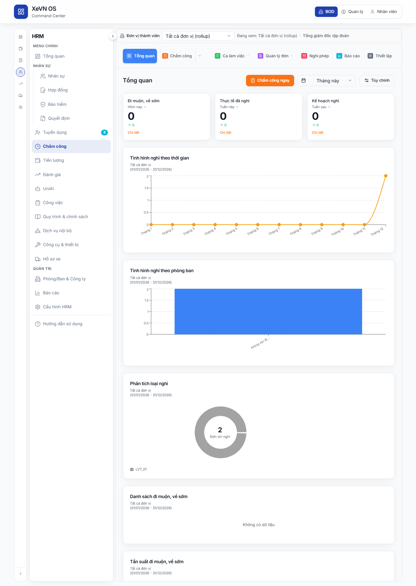

# Chương 8 — Chấm công, ca làm việc & Nghỉ phép (HRM)

| Thuộc tính | Giá trị |
|------------|---------|
| **Mã tài liệu** | XEVN/HDSD-HRM-008 |
| **Sản phẩm** | **HRM** |
| **Phiên bản** | 1.0 (Markdown — placeholder ảnh) |
| **Ngày hiệu lực** | 30/07/2026 |
| **Đối tượng** | HRBP, Quản lý trực tiếp, Chuyên viên HCNS |
| **Tham chiếu SRS** | UC-HRM-23 · UC-HRM-32 · FR-HRM-AT-14 · FR-HRM-AT-10 · HRM-AT-* |

---

## Điều hướng — hai cách vào HRM

| Cách | Thao tác | Route mẫu |
|------|----------|-----------|
| **HRM độc lập** | Sidebar → **Chấm công** | `/attendance` |
| **HRM nhúng (embed)** | Command Center → **NHÂN SỰ** → **Chấm công** | `/command-center/hrm/attendance` |

Chi tiết shell: [HDSD_HRM_CH00_VAO_UNG_DUNG.md](./HDSD_HRM_CH00_VAO_UNG_DUNG.md).

---

## 1. Giới thiệu

Module **Chấm công** gom: tổng quan KPI, chấm công vào/ra, bảng công, ca làm việc, các loại **đơn từ**, nghỉ phép, báo cáo và **thiết lập** quy tắc.

Thanh tab ngang (7 tab; 3 tab có menu con).

#### Bảng — Tab điều hướng

| Tab | Menu con | Mô tả |
|-----|----------|--------|
| **Tổng quan** | — | KPI đi muộn, nghỉ, biểu đồ |
| **Chấm công** | Chấm công vào/ra · Bảng chấm công · Dữ liệu chấm công · Chấm công tuần · Tổng hợp công | Vận hành công hàng ngày |
| **Ca làm việc** | Danh sách ca · Lịch phân ca · Ca làm thêm | Quản lý ca |
| **Quản lý đơn** | 9 loại đơn (xem §6) | Đơn từ & tổng hợp |
| **Nghỉ phép** | — | Màn nghỉ phép tập trung |
| **Báo cáo** | — | AttendanceReportsTab |
| **Thiết lập** | 9 mục sidebar (xem §7) | Cấu hình quy tắc |

> **Lối tắt:** Bấm trực tiếp tab **Chấm công** (phần chính) = mở wizard **Chấm công vào/ra**; mũi tên ▼ = chọn mục con khác.

---

## 2. Tab Tổng quan

#### Bảng — Nút & bộ lọc

| Thành phần | Chức năng |
|------------|-----------|
| **Chấm công ngay** | Mở wizard chấm công (manual) |
| **Chọn kỳ thời gian** | Hôm nay · Hôm qua · Tuần này · Tháng này · Quý · Năm · Tùy chỉnh |
| **Tùy chỉnh** | Cấu hình widget dashboard |

#### Bảng — Thẻ KPI (hàng 1)

| Thẻ | Nội dung |
|-----|----------|
| Đi muộn / Về sớm | Số lượt hôm nay + % thay đổi · link Chi tiết |
| Nghỉ thực tế | Tuần này |
| Nghỉ kế hoạch | Tuần tới |

#### Bảng — Biểu đồ & danh sách (hàng dưới)

| Widget | Mô tả |
|--------|--------|
| Số ngày phép còn lại | Theo NV/phòng (overview API) |
| Ngày nghỉ trong năm | Thống kê |
| Đi muộn/Về sớm theo tháng | Biểu đồ |
| Theo đơn vị / Theo loại nghỉ | Phân tích |
| Danh sách đi muộn/về sớm | Bảng chi tiết |

---

## 3. Tab Chấm công — Chấm công vào/ra

Wizard hỗ trợ phương thức (tùy cấu hình): **Check-in/Check-out** · **QR** · **Face ID** · **GPS**.

| Bước / trường | Mô tả |
|---------------|--------|
| Chọn nhân viên | Tìm mã/tên |
| Giờ vào · Giờ ra | `HH:mm` |
| Ngày công | `dd/MM/yyyy` |
| Ghi chú | Lý do chỉnh sửa (nếu sửa tay) |

| Nút | Chức năng |
|-----|-----------|
| **Lưu** | Ghi bản ghi chấm công |
| **Hủy** | Đóng wizard |

---

## 4. Tab Chấm công — Bảng chấm công

#### Bảng — Nút & lọc

| Nút | Chức năng |
|-----|-----------|
| **Tạo bảng chấm công** (+) | Mở modal thêm bảng |
| **Tìm kiếm** | Lọc tên bảng / phòng ban |
| **Đơn vị** | Lọc theo phòng ban |

#### Bảng — Cột danh sách bảng công

| Cột | Mô tả |
|-----|--------|
| Tên bảng công | Tên kỳ công |
| Phòng ban | Áp dụng |
| Kỳ (từ – đến) | `dd/MM/yyyy` |
| Loại chấm công | Theo giờ / Theo ngày |
| Trạng thái | Nháp / Đang mở / Đã chốt |
| Thao tác | Mở · Sửa · Xóa |

#### Hộp thoại — Tạo bảng chấm công

| Trường | Bắt buộc |
|--------|----------|
| Phòng ban | Có |
| Tên bảng công | Có |
| Từ ngày · Đến ngày | Có |
| Loại chấm công | Có |
| Loại công chuẩn | Tùy chọn |

---

## 5. Tab Chấm công — Dữ liệu / Tuần / Tổng hợp

### 5.1. Dữ liệu chấm công

Bảng log từng lần chấm: NV, ngày, giờ vào/ra, nguồn (app/máy/GPS…), trạng thái.

| Cột | Mô tả |
|-----|--------|
| Mã NV · Họ tên | Nhân viên |
| Ngày | `dd/MM/yyyy` |
| Giờ vào · Giờ ra | `HH:mm` |
| Giờ làm việc | Tổng giờ |
| Trạng thái | Có mặt / Muộn / Vắng / Nghỉ |
| Nguồn | Thiết bị / ứng dụng |
| Thao tác | Sửa · Xóa |

**Hộp thoại Sửa chấm công:** NV, ngày, giờ vào/ra, làm thêm, ghi chú.

### 5.2. Chấm công tuần

Lưới NV × 7 ngày; ô ngày hiển thị mã ca / giờ; bấm ô → **Chi tiết ô ngày** (sửa giờ vào/ra, OT).

| Trường modal ô ngày | Mô tả |
|---------------------|--------|
| Giờ vào · Giờ ra | `HH:mm` |
| Làm thêm | Giờ OT |
| Ghi chú | Text |

### 5.3. Tổng hợp công

Cột tổng hợp (tham khảo cấu hình): Công ngày lễ · OT hưởng lương · OT nghỉ bù · Nghỉ phép · Nghỉ lễ · Công tác · Nghỉ không lương · Công ăn ca · **Tổng công hưởng lương** · **Tổng giờ OT**.

---

## 6. Tab Ca làm việc

### 6.1. Danh sách ca

| Nút | Chức năng |
|-----|-----------|
| **Thêm ca làm việc** (+) | Modal thêm ca |
| **Tìm kiếm** | Mã/tên ca |
| **Văn phòng / Đơn vị** | Lọc |

| Cột | Mô tả |
|-----|--------|
| Mã ca · Tên ca | Định danh |
| Đơn vị | Phòng ban |
| Giờ bắt đầu – kết thúc | `HH:mm` |
| Hệ số · Giờ công | Hệ số lương ca |
| Trạng thái | Active / Inactive |
| Thao tác | Sửa · Xóa |

#### Hộp thoại — Thêm/Sửa ca

| Trường | Bắt buộc |
|--------|----------|
| Mã ca | Có |
| Tên ca | Có |
| Đơn vị | Có |
| Giờ bắt đầu · Giờ kết thúc | Có |
| Hệ số lương | Không |
| Giờ làm việc | Không |
| Trạng thái | Không |

### 6.2. Lịch phân ca

Lưới gán ca cho NV theo tuần/tháng; kéo ca vào ô ngày.

### 6.3. Ca làm thêm

Danh sách ca OT đăng ký/duyệt; liên kết tab **Quản lý đơn → Đăng ký làm thêm**.

---

## 7. Tab Quản lý đơn

Mỗi mục menu con = một màn (**LeaveTab** hoặc component chuyên biệt).

| Mục menu | Component | Mô tả |
|----------|-----------|--------|
| **Đơn xin nghỉ** | LeaveTab | Tạo/duyệt nghỉ phép |
| **Đăng ký đi muộn, về sớm** | LateEarlyRequestTab | Đơn muộn/sớm |
| **Đăng ký làm thêm** | OvertimeRequestTab | OT |
| **Đề nghị đi công tác** | BusinessTripRequestTab | Công tác |
| **Đề nghị cập nhật công** | AttendanceUpdateRequestTab | Sửa công |
| **Đề nghị đổi ca** | ShiftChangeRequestTab | Đổi ca |
| **Bảng tổng hợp nghỉ phép** | LeaveTab | Tổng hợp phép |
| **Bảng tổng hợp nghỉ bù** | LeaveTab | Nghỉ bù |
| **Kế hoạch nghỉ phép** | LeaveTab | Plan nghỉ |

### 7.1. Đơn xin nghỉ (mẫu chung LeaveTab)

#### Bảng — Nút

| Nút | Chức năng |
|-----|-----------|
| **Thêm đơn xin nghỉ** | Modal tạo đơn |
| **Tìm kiếm** | Lọc NV |
| **Duyệt / Từ chối** | Trên dòng chờ duyệt |

#### Bảng — Cột

| Cột | Mô tả |
|-----|--------|
| Nhân viên | Mã + tên |
| Loại nghỉ | Phép năm / Ốm / Không lương… |
| Từ ngày – Đến ngày | `dd/MM/yyyy` |
| Số ngày | Số công nghỉ |
| Trạng thái | Chờ duyệt / Đã duyệt / Từ chối |
| Thao tác | Xem · Sửa · Duyệt |

#### Hộp thoại — Thêm đơn nghỉ

| Trường | Bắt buộc |
|--------|----------|
| Nhân viên | Có |
| Loại nghỉ | Có |
| Từ ngày · Đến ngày | Có |
| Lý do | Không |
| Người nhận bàn giao | Không |

#### Hộp thoại — Duyệt / Từ chối

| Trường | Mô tả |
|--------|--------|
| Ghi chú duyệt | Tùy chọn khi duyệt |
| Lý do từ chối | Khuyến nghị khi từ chối |

---

## 8. Tab Nghỉ phép

Tương tự **LeaveTab** tập trung: lịch nghỉ, số dư phép, danh sách yêu cầu — dùng khi cần màn chỉ nghỉ phép (không lẫn đơn khác).

---

## 9. Tab Báo cáo

Component: **AttendanceReportsTab**.

| Widget / bảng | Mô tả |
|---------------|--------|
| Tổng NV · Ngày công · Tỷ lệ đi làm · Tỷ lệ muộn · Tổng OT | KPI |
| Chấm công theo ngày | Biểu đồ |
| Xu hướng 12 tháng | Trend |
| Theo phòng ban | Bar chart |
| Loại nghỉ phép | Phân bổ |
| Top 10 đi muộn / Top 10 OT | Bảng xếp hạng |
| Chi tiết theo nhân viên | Drill-down |
| **Xuất báo cáo** | Export |

---

## 10. Tab Thiết lập

Layout **sidebar trái + nội dung phải**.

#### Bảng — Menu sidebar

| Mục | Nội dung |
|-----|----------|
| **Nhân viên** | Gán NV vào phạm vi chấm công |
| **Quy định chấm công** | 8 sub-tab quy tắc (Chung · Công chuẩn · Tùy chỉnh bảng công · Máy · App · Tablet · Chấm hộ · Tự động) |
| **Quy định làm thêm** | Ngưỡng OT, hệ số |
| **Quy định nghỉ** | Loại phép, số ngày/năm |
| **Quy định đi muộn – về sớm** | Ngưỡng phút |
| **Quy định làm đơn** | SLA duyệt đơn |
| **Người dùng** | Tài khoản chấm công |
| **Vai trò** | Phân quyền module |
| **Hệ thống** | Múi giờ, làm tròn giờ |

#### Sub-tab Quy định chấm công (ví dụ Công chuẩn)

| Trường | Mô tả |
|--------|--------|
| Số công chuẩn / tháng | Số ngày |
| Làm tròn giờ vào/ra | Quy tắc làm tròn |
| Ngày nghỉ lễ | Danh sách |

---

## 11. Trạng thái nghiệp vụ

| Đối tượng | Trạng thái | Ý nghĩa |
|-----------|------------|---------|
| Bản ghi chấm công | present · late · early · absent · onLeave | Kết quả ngày |
| Bảng chấm công | draft · open · closed | Vòng đời kỳ công |
| Đơn nghỉ/OT/… | pending · approved · rejected | Duyệt đơn |
| Ca làm việc | active · inactive | Sử dụng ca |

---

## 12. Lỗi thường gặp

| Triệu chứng | Cách xử lý |
|-------------|------------|
| Bảng công trống sau tạo kỳ | Mở **Dữ liệu chấm công** — kiểm tra API; F5 sau khi có điểm danh |
| «Không có dữ liệu» + tự reload | Lỗi API — không seed; kiểm tra HRM API :28001 |
| Không duyệt được đơn | Thiếu quyền `approve`; kiểm tra workflow |
| Công chuẩn = 0 dòng | Tạo **Bảng chấm công** cho đúng phòng ban và kỳ |
| Wizard QR/GPS không mở | Bật phương thức tại **Thiết lập → Quy định chấm công → App/Device** |

---

## 13. Liên kết kiểm thử

| Tham chiếu | Nội dung |
|------------|----------|
| UC-HRM-23 | Chấm công tổng quát |
| FR-HRM-AT-14 | Bảng chấm công theo kỳ |
| FR-HRM-AT-10 | Đơn nghỉ phép |
| AC-ATT-SHEET-* | Acceptance bảng công |
