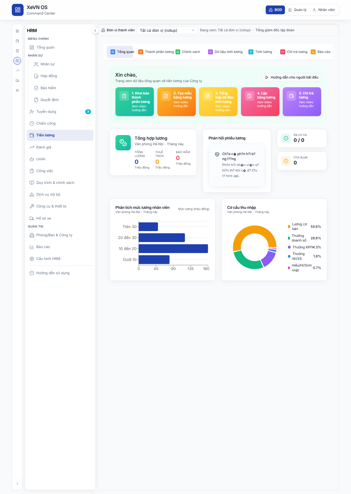
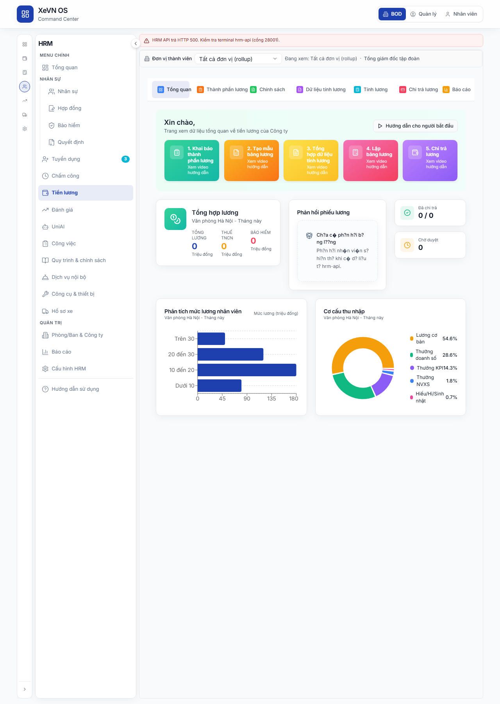

# Chương 9 — Lương & Bảng lương (HRM)

| Thuộc tính | Giá trị |
|------------|---------|
| **Mã tài liệu** | XEVN/HDSD-HRM-009 |
| **Sản phẩm** | **HRM** |
| **Phiên bản** | 1.0 (Markdown — placeholder ảnh) |
| **Ngày hiệu lực** | 30/07/2026 |
| **Đối tượng** | Kế toán lương, HRBP, CFO công ty thành viên |
| **Tham chiếu SRS** | UC-HRM-24 · UC-HRM-28 · FR-HRM-PR-01 · FR-HRM-PR-03 · FR-HRM-PR-04 · FR-HRM-PR-05 · HRM-PR-* |

---

## Điều hướng — hai cách vào HRM

| Cách | Thao tác | Route mẫu |
|------|----------|-----------|
| **HRM độc lập** | Sidebar → **Tiền lương** | `/payroll` |
| **HRM nhúng (embed)** | Command Center → **NHÂN SỰ** → **Tiền lương** | `/command-center/hrm/payroll` |

Chi tiết shell: [HDSD_HRM_CH00_VAO_UNG_DUNG.md](./HDSD_HRM_CH00_VAO_UNG_DUNG.md).

---

## 1. Giới thiệu

Module **Lương** quản lý: thành phần lương, chính sách (thuế/BH/phụ cấp/thưởng), dữ liệu đầu vào, **tạo kỳ lương & tính lương**, phiếu lương, đợt chi trả, tạm ứng, quyết toán thuế và báo cáo.

Thanh tab ngang (7 tab; 3 tab có menu con).

#### Bảng — Tab điều hướng

| Tab | Menu con | Mô tả |
|-----|----------|--------|
| **Tổng quan** | — | Dashboard lương tháng |
| **Thành phần lương** | — | SalaryComponentsTab |
| **Chính sách** | Thuế · BH · Phụ cấp · Thưởng · Tổng hợp doanh số | Payroll policy |
| **Dữ liệu** | Công · Doanh số · KPI · Sản phẩm · Thu nhập khác · Khấu trừ | Input tính lương |
| **Tính lương** | Tạo bảng lương · Danh sách BL · Tạm ứng · Mẫu · Quyết toán thuế | Core payroll run |
| **Chi trả** | — | PaymentBatchesTab |
| **Báo cáo** | — | Báo cáo lương (khi bật) |

---

## 2. Tab Tổng quan

#### Bảng — Thành phần

| Thành phần | Mô tả |
|------------|--------|
| Banner chào + **Hướng dẫn người mới** | Video/guide onboarding |
| Thẻ bước 1–4 (khi chưa có phiếu lương) | Quy trình: Thiết lập → Nhập DL → Tính → Chi trả |
| Link «Xem danh sách» | Chuyển tab **Tính lương → Danh sách BL** khi đã có payslip |
| **Tóm tắt lương tháng** | Tổng quỹ lương, biến động so kỳ trước |
| **Phản hồi / Góp ý** | Widget feedback |
| **Phân tích lương** | Biểu đồ xu hướng |
| **Cơ cấu thu nhập** | Pie/bar thành phần |

---

## 3. Tab Thành phần lương

Component: **SalaryComponentsTab**.

#### Bảng — Nút & lọc

| Nút | Chức năng |
|-----|-----------|
| **Thêm thành phần** | Modal tạo component |
| **Tìm kiếm** | Mã/tên thành phần |
| **Trạng thái** | Tất cả / Active / Inactive |
| **Đơn vị** | Lọc theo pháp nhân |

#### Bảng — Cột

| Cột | Mô tả |
|-----|--------|
| Mã thành phần | Code (vd. `LUONG_CO_BAN`) |
| Tên thành phần | Nhãn hiển thị |
| Loại | Thu nhập / Khấu trừ / BHXH / Thuế… |
| Công thức | Biểu thức (nếu có) |
| Đơn vị áp dụng | Scope |
| Trạng thái | Active |
| Thao tác | Sửa · Xóa |

#### Hộp thoại — Thêm/Sửa thành phần

| Trường | Bắt buộc |
|--------|----------|
| Mã thành phần | Có |
| Tên thành phần | Có |
| Đơn vị áp dụng | Có |
| Loại thành phần | Có |
| Công thức | Không (vd. `=SUM(LUONG_CO_BAN,PHU_CAP)`) |
| Mô tả | Không |

---

## 4. Tab Chính sách

Menu con chọn loại chính sách.

### 4.1. Chính sách thuế

| Trường / bảng | Mô tả |
|---------------|--------|
| Biểu thuế luỹ tiến | Bậc thuế TNCN |
| Giảm trừ bản thân / người phụ thuộc | Số tiền/tháng |
| Hiệu lực | Từ ngày |

### 4.2. Chính sách bảo hiểm

| Trường | Mô tả |
|--------|--------|
| Tỷ lệ BHXH/BHYT/BHTN (NLĐ + DN) | % |
| Trần mức đóng | VND |
| Áp dụng từ | Ngày |

### 4.3. Chính sách phụ cấp · Thưởng · Tổng hợp doanh số

Bảng rule: điều kiện (chức danh/phòng ban/KPI) → số tiền hoặc công thức.

| Nút | Chức năng |
|-----|-----------|
| **Thêm chính sách** | Form rule mới |
| **Lưu** | Áp dụng cấu hình |

---

## 5. Tab Dữ liệu

Mỗi menu con = một bảng nhập liệu phục vụ tính lương.

| Menu con | Mô tả dữ liệu |
|----------|----------------|
| **Dữ liệu công** | Import/ đồng bộ công từ Chấm công |
| **Dữ liệu doanh số** | Doanh thu cá nhân/team |
| **Dữ liệu KPI** | Điểm KPI kỳ |
| **Dữ liệu sản phẩm** | Sản lượng |
| **Thu nhập khác** | Khoản cộng ngoài lương cơ bản |
| **Khấu trừ khác** | Khoản trừ |

#### Bảng — Nút chung

| Nút | Chức năng |
|-----|-----------|
| **Tìm kiếm** | Lọc NV |
| **Đơn vị** | Lọc phòng ban |
| **Nhập Excel** | Import |
| **Xuất Excel** | Export |
| **Thêm dòng** | Thêm bản ghi thủ công |

#### Bảng — Cột (mẫu dữ liệu công)

| Cột | Mô tả |
|-----|--------|
| Mã NV · Họ tên | Nhân viên |
| Kỳ | Tháng/năm |
| Công thực tế · Công chuẩn | Ngày công |
| OT · Nghỉ không lương | Giờ/ngày |
| Trạng thái | Draft / Locked |

---

## 6. Tab Tính lương

### 6.1. Tạo bảng lương (kỳ lương)

**Luồng chính (FR-HRM-PR-01):**

1. Chọn **Tạo bảng lương** trong menu **Tính lương**.
2. Nhập tên kỳ, tháng/năm, từ ngày – đến ngày, đơn vị áp dụng.
3. **Lưu** → kỳ xuất hiện trên danh sách.
4. **F5** — kỳ vẫn còn (kiểm tra persistence).

| Trường | Bắt buộc | Validation |
|--------|----------|------------|
| Tên kỳ lương | Có | Không trùng trong scope |
| Tháng / Năm | Có | — |
| Từ ngày · Đến ngày | Có | Từ ≤ Đến; không chồng kỳ đang mở |
| Đơn vị áp dụng | Có | Phạm vi token công ty |

| Nút | Chức năng |
|-----|-----------|
| **Lưu / Tạo kỳ** | POST kỳ lương |
| **Hủy** | Đóng form |

### 6.2. Danh sách bảng lương & Phiếu lương

**Luồng tính lương (FR-HRM-PR-03):**

1. Chọn kỳ trạng thái **Mở**.
2. Bấm **Tính lương / Xử lý** — hệ thống lấy dữ liệu công, BH, thuế.
3. Sau thành công: danh sách **phiếu lương** hiển thị theo NV.
4. Bấm một dòng → **Xem phiếu lương** (dialog).

#### Bảng — Cột danh sách kỳ

| Cột | Mô tả |
|-----|--------|
| Tên kỳ · Tháng | Định danh kỳ |
| Đơn vị | Scope |
| Số NV | Headcount trong kỳ |
| Tổng quỹ lương | VND |
| Trạng thái | Nháp · Đang xử lý · Đã tính · **Đã chốt** |
| Thao tác | Tính · Xem phiếu · Chốt kỳ · Xóa |

#### Bảng — Cột phiếu lương

| Cột | Mô tả |
|-----|--------|
| Mã NV · Họ tên | Nhân viên |
| Lương cơ bản | VND |
| Phụ cấp · Thưởng | Cộng |
| BHXH · Thuế · Khấu trừ | Trừ |
| **Thực lĩnh** | Net salary |
| Trạng thái | Draft / Paid |
| Thao tác | Xem · In |

#### Hộp thoại — Xem phiếu lương

| Khối | Dòng hiển thị |
|------|----------------|
| Header | Tháng kỳ · Badge trạng thái · Avatar NV |
| **Thu nhập** | Lương cơ bản · Phụ cấp · Thưởng · Tổng thu |
| **Khấu trừ** | Bảo hiểm · Thuế · Khấu trừ khác · Tổng trừ |
| **Thực lĩnh** | Số tiền net (highlight) |

| Nút | Chức năng |
|-----|-----------|
| **In** | In phiếu |
| **Đóng** | Đóng dialog |

**Luồng chốt kỳ (FR-HRM-PR-04):** Khi kỳ **Đã tính**, bấm **Chốt kỳ** → trạng thái **Đã chốt**; không tính lại (trừ waiver).

### 6.3. Tạm ứng lương

| Cột | Mô tả |
|-----|--------|
| Tên đợt tạm ứng | Tên |
| Kỳ lương liên kết | Tháng |
| Số tiền / NV | VND |
| Trạng thái | Chờ duyệt / Đã chi |
| Thao tác | Duyệt · Chi trả |

#### Hộp thoại — Tạo tạm ứng

| Trường | Bắt buộc |
|--------|----------|
| Tên tạm ứng | Có |
| Kỳ lương | Có |
| Danh sách NV + số tiền | Có |
| Mô tả | Không |

### 6.4. Mẫu bảng lương

Lưu cấu hình cột/thành phần để tái sử dụng khi tạo kỳ mới.

### 6.5. Quyết toán thuế

| Trường | Mô tả |
|--------|--------|
| Tên đợt quyết toán | Tên |
| Năm · Tháng | Kỳ QT |
| Đơn vị | Scope |
| Bảng thuế theo tháng | Pick template từng tháng |
| Danh sách NV | Thu nhập tích lũy, thuế đã khấu trừ |

| Nút | Chức năng |
|-----|-----------|
| **Tạo quyết toán** | Lưu đợt QT |
| **Xuất báo cáo** | Export |

---

## 7. Tab Chi trả

Component: **PaymentBatchesTab**.

#### Bảng — Nút

| Nút | Chức năng |
|-----|-----------|
| **Thêm đợt chi trả** | Modal tạo batch |
| **Tìm kiếm** | Lọc |
| **Đơn vị** | Lọc phòng ban |

#### Bảng — Cột

| Cột | Mô tả |
|-----|--------|
| Tên đợt chi trả | Tên batch |
| Bảng lương | Kỳ liên kết |
| Kỳ (tháng) | Tháng/năm |
| Số tiền | Tổng VND |
| Hình thức | Chuyển khoản / Tiền mặt |
| Trạng thái | Chờ · Đang chi · Hoàn tất |
| Thao tác | Xem · Duyệt · Export |

#### Hộp thoại — Thêm đợt chi trả

| Trường | Bắt buộc |
|--------|----------|
| Bảng lương | Có (dropdown kỳ đã tính) |
| Tháng hiển thị | Read-only từ BL |
| Đơn vị áp dụng | Có (multi badge) |
| Tên đợt chi trả | Có |
| Kỳ chi trả | Có |
| Loại chi trả | Có |
| Hình thức thanh toán | Có |
| Tài khoản ngân hàng | Tùy hình thức CK |
| Ngày chi trả dự kiến | Có |

---

## 8. Tab Báo cáo

Báo cáo: quỹ lương theo phòng ban, biến động thu nhập, so sánh kỳ, export Excel/PDF (tùy cấu hình).

---

## 9. Trạng thái nghiệp vụ

| Đối tượng | Trạng thái | Ý nghĩa |
|-----------|------------|---------|
| Kỳ lương | draft · processing · calculated · **closed** | Vòng đời kỳ |
| Phiếu lương | draft · approved · paid | Trạng thái từng NV |
| Đợt chi trả | pending · processing · completed | Chi trả thực tế |
| Tạm ứng | pending · approved · paid | Tạm ứng |
| Thành phần lương | active · inactive | Dùng trong công thức |

---

## 10. Lỗi thường gặp

| Triệu chứng | Cách xử lý |
|-------------|------------|
| Không tạo được kỳ — «chồng kỳ» | Đóng/chốt kỳ cũ trùng tháng |
| Tính lương báo thiếu dữ liệu công | Tab **Dữ liệu → Dữ liệu công** — import/ đồng bộ chấm công |
| Phiếu lương trống sau tính | Kiểm tra NV trong phạm vi kỳ; xem log process |
| Không chốt được kỳ | Kỳ chưa ở trạng thái «Đã tính» |
| Thực lĩnh sai | Rà soát **Thành phần lương** + **Chính sách thuế/BH** |
| 409 phạm vi công ty | Đăng nhập đúng persona; CEO CTY thành viên chỉ scope một công ty |

---

## 11. Liên kết kiểm thử

| Tham chiếu | Nội dung |
|------------|----------|
| UC-HRM-24 | Xem phiếu lương embed |
| FR-HRM-PR-01 | Tạo kỳ lương |
| FR-HRM-PR-03 | Tính lương |
| FR-HRM-PR-04 | Chốt kỳ |
| FR-HRM-PR-05 | Danh sách/chi tiết phiếu lương |
| UF-HRM-* | User flow nghiệm thu browser |
