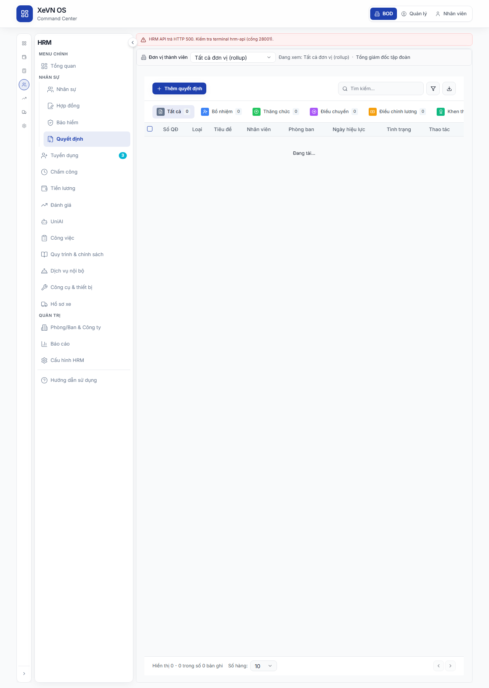
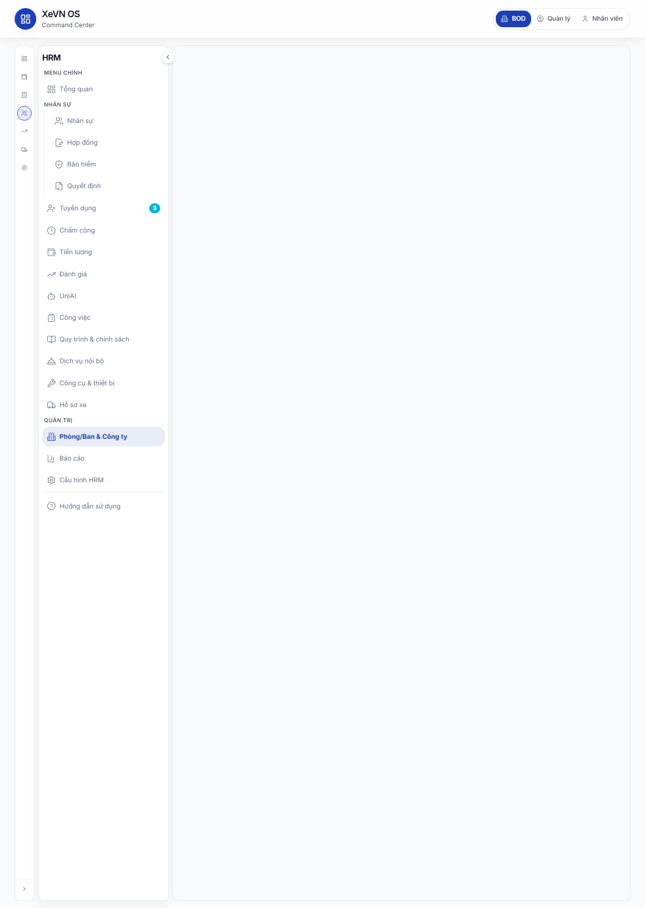
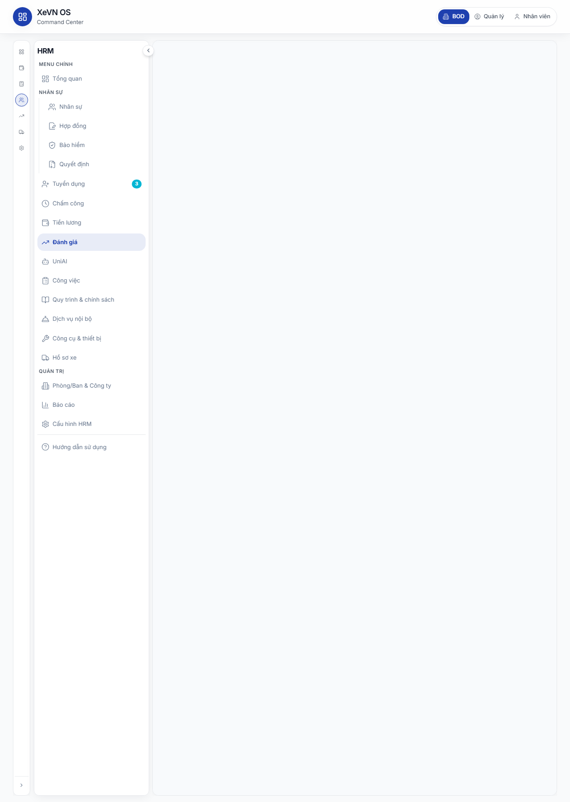

# Chương 10 — Công ty, Quyết định, Công việc, Dịch vụ nội bộ, Quy trình & Đội xe

| Thuộc tính | Giá trị |
|------------|---------|
| **Mã tài liệu** | XEVN/HDSD-OS-010 |
| **Sản phẩm** | **HRM** |
| **Phiên bản** | 1.0 (Markdown — chưa ảnh) |
| **Ngày hiệu lực** | 30/07/2026 |
| **Đối tượng** | HR, Quản trị công ty, Trưởng đơn vị |
| **Tham chiếu SRS** | UC-HRM-CO-01 · UC-HRM-27 · HRM-OP-02 · HRM-SV-02 · AC-PROC · HRM-FL-01 |

---

## Điều hướng — hai cách vào HRM

| Cách | Thao tác | Route mẫu |
|------|----------|-----------|
| **HRM độc lập** | Sidebar → menu chương (Công ty, Quyết định, Công việc, …) | `/company` · `/decisions` · `/tasks` · … |
| **HRM nhúng (embed)** | Command Center → **NHÂN SỰ** → sidebar tương ứng | `/command-center/hrm/company` · `…/decisions` · … |

Chi tiết shell: [HDSD_HRM_CH00_VAO_UNG_DUNG.md](./HDSD_HRM_CH00_VAO_UNG_DUNG.md).

---

## 10.1 Thông tin công ty (Headcount & tổ chức)

**Route:** `…/hrm/company` · **Menu:** Công ty · **UC:** UC-HRM-CO-01

### Mô tả

Màn hình quản lý hồ sơ công ty trong phạm vi đăng nhập: danh sách đơn vị, thành viên quản trị, cây phòng ban và thông tin gói dịch vụ. Số lượng nhân viên hiển thị theo đơn vị vận hành (operating slug), đồng bộ với tổng quan nhân sự.

### Tab trên màn hình

| Tab | Mục đích |
|-----|----------|
| Quản lý công ty | Danh sách / thêm / sửa hồ sơ pháp nhân |
| Thành viên | Gán vai trò quản trị theo công ty |
| Phòng ban | Cây tổ chức nội bộ |
| Gói dịch vụ | Hạn mức và quyền tính năng |

### Bảng Nút & chức năng — Tab Quản lý công ty

| Nút / hành động | Vị trí | Chức năng |
|-----------------|--------|-----------|
| Tìm kiếm | Thanh trên bảng | Lọc theo tên, mã, ngành |
| Thêm công ty | Góc phải | Mở hộp thoại tạo hồ sơ mới |
| Xem (Eye) | Cột thao tác | Xem chi tiết chỉ đọc |
| Sửa (Pencil) | Cột thao tác | Mở hộp thoại chỉnh sửa |
| Xóa (Trash) | Cột thao tác | Xác nhận xóa hồ sơ |
| ⋮ (More) | Cột thao tác | Menu phụ: xem / sửa / xóa |

### Bảng Cột danh sách — Công ty

| Cột | Ý nghĩa |
|-----|---------|
| Logo / Avatar | Ảnh đại diện công ty |
| Tên công ty | Tên hiển thị |
| Mã | Mã định danh nội bộ |
| Ngành | Nhãn ngành nghề (từ danh mục) |
| Số NV | Headcount theo phạm vi JWT |
| Trạng thái | Hoạt động / Ngưng |
| Thao tác | Xem · Sửa · Xóa |

### Bảng Hộp thoại — Thêm / Sửa công ty

| Trường | Bắt buộc | Ghi chú |
|--------|----------|---------|
| Tên công ty | Có | |
| Mã công ty | Có | Không trùng trong phạm vi |
| Ngành | Không | Chọn từ danh mục |
| Mã số thuế | Không | |
| Email | Không | |
| Điện thoại | Không | |
| Website | Không | |
| Địa chỉ | Không | |
| Ngày thành lập | Không | Định dạng dd/MM/yyyy |
| Mô tả | Không | Nhiều dòng |
| Logo | Không | JPG/PNG, tối đa 2 MB |
| Trạng thái | Có | Hoạt động / Ngưng |

| Nút | Hành vi |
|-----|---------|
| Hủy | Đóng không lưu |
| Lưu / Tạo | Ghi API; sau 2xx danh sách cập nhật |

### Tab Thành viên & Phòng ban

| Tab | Nút chính | Ghi chú |
|-----|-----------|---------|
| Thành viên | Thêm thành viên · Gỡ quyền | Gán email + vai trò (Admin / HR / …) |
| Phòng ban | Thêm phòng ban · Sửa · Xóa | Hỗ trợ phòng ban cha–con |

### Tab Gói dịch vụ

| Thành phần | Mô tả |
|------------|-------|
| Gói hiện tại | Tên gói theo vai trò membership |
| Hạn sử dụng | Ngày hết hạn (— nếu chưa cấu hình) |
| Thanh tiến độ NV | Số NV đang dùng / hạn mức (vd. 0 / 100) |
| Danh sách tính năng | Nhân sự · Tuyển dụng · Chấm công · Lương · Báo cáo · Hỗ trợ |
| Upgrade | Liên hệ sales (Enterprise) |

### Lỗi thường gặp

| Triệu chứng | Xử lý |
|-------------|-------|
| Số NV = 0 dù đã có nhân viên | F5; kiểm tra phạm vi công ty khớp token |
| Không thêm được công ty | Kiểm tra quyền Admin; mã trùng |
| Ngày thành lập hiển thị sai | Nhập lại theo lịch dd/MM/yyyy |

---

## 10.2 Quyết định nhân sự

**Route:** `…/hrm/decisions` · **Menu:** Quyết định · **UC:** UC-HRM-27

### Mô tả

Quản lý quyết định bổ nhiệm, thăng chức, điều chuyển, điều chỉnh lương, khen thưởng, kỷ luật, chấm dứt, gia hạn hợp đồng. Hỗ trợ lọc theo loại, trạng thái, xuất Excel và đính kèm văn bản.

### Bảng Nút & chức năng — Thanh công cụ

| Nút | Chức năng |
|-----|-----------|
| Thêm mới (+) | Mở hộp thoại tạo quyết định |
| Xóa đã chọn | Xóa hàng loạt (khi có tick) |
| Tìm kiếm | Mã QĐ · tiêu đề · tên NV · phòng ban |
| Bộ lọc (Filter) | Lọc theo trạng thái (đa chọn) |
| Xuất (Download) | Tải file Excel danh sách đang lọc |

### Tab loại quyết định

| Tab | Ý nghĩa |
|-----|---------|
| Tất cả | Mọi loại |
| Bổ nhiệm | appointment |
| Thăng chức | promotion |
| Điều chuyển | transfer |
| Điều chỉnh lương | salary_adjustment |
| Khen thưởng | reward |
| Kỷ luật | discipline |
| Chấm dứt | termination |
| Gia hạn HĐ | contract_renewal |

Mỗi tab hiển thị số lượng bên cạnh tên.

### Bảng Cột danh sách

| Cột | Ý nghĩa |
|-----|---------|
| ☐ | Chọn hàng |
| Mã quyết định | Mã duy nhất |
| Loại | Nhãn loại QĐ |
| Tiêu đề | Tóm tắt nội dung |
| Nhân viên | Avatar + tên (link sang hồ sơ NV nếu có ID) |
| Phòng ban | Phòng ban tại thời điểm QĐ |
| Ngày hiệu lực | dd/MM/yyyy |
| Trạng thái | Badge trạng thái |
| Thao tác | Xem · Sửa · Xóa |

### Phân trang

| Thành phần | Giá trị |
|------------|---------|
| Số dòng / trang | 10 · 20 · 50 · 100 |
| Điều hướng | Trang trước / số trang / trang sau |

### Bảng Hộp thoại — Thêm / Sửa quyết định

| Trường | Bắt buộc | Ghi chú |
|--------|----------|---------|
| Mã quyết định | Có | |
| Loại quyết định | Có | Picker danh mục (Cài đặt → Loại quyết định) |
| Tiêu đề | Có | |
| Chọn nhân viên | Không | Dropdown — tự điền tên, mã, PB, chức danh |
| Họ tên NV | Có | |
| Mã NV | Không | |
| Phòng ban | Không | Picker danh mục |
| Vị trí / Chức danh | Có | Picker danh mục — không nhập tự do |
| Ngày hiệu lực | Không | Lịch dd/MM/yyyy |
| Ngày hết hạn | Không | Lịch dd/MM/yyyy |
| Người ký | Không | |
| Chức danh người ký | Không | Picker danh mục |
| Ngày ký | Không | Lịch dd/MM/yyyy |
| Trạng thái | Có | Nháp · Chờ ký · Đã ký · Hiệu lực · Hết hạn · Hủy |
| Nội dung | Không | Văn bản dài |
| Ghi chú | Không | |
| Tệp đính kèm | Không | PDF/DOC/DOCX/JPG/PNG, tối đa 10 MB |

| Nút | Hành vi |
|-----|---------|
| Hủy | Đóng form |
| Tạo / Cập nhật | POST/PATCH; sau tạo mới chuyển tab **Tất cả** và xóa bộ lọc để thấy dòng mới |

### Trạng thái nghiệp vụ

| Trạng thái | Ý nghĩa |
|------------|---------|
| Nháp | Chưa ban hành |
| Chờ ký | Đang trình ký |
| Đã ký | Đã có chữ ký |
| Hiệu lực | Đang áp dụng |
| Hết hạn | Quá ngày hết hạn |
| Hủy | Không còn giá trị |

### Lỗi thường gặp

| Triệu chứng | Xử lý |
|-------------|-------|
| «Không có quyết định nào» sau khi Lưu | F5; kiểm tra tab loại và bộ lọc trạng thái |
| Không chọn được chức danh | Vào Cài đặt → Danh mục nghiệp vụ → Chức danh |
| Upload thất bại | Kiểm tra định dạng và dung lượng ≤ 10 MB |

---

## 10.3 Quản lý công việc

**Route:** `…/hrm/tasks` · **Menu:** Công việc · **UC:** HRM-OP-02

### Mô tả

Theo dõi và phân công công việc nội bộ với nhiều chế độ xem: danh sách, Kanban, Gantt, lịch và dashboard thống kê.

### Bảng Nút & chức năng — Header

| Nút | Quyền | Chức năng |
|-----|-------|-----------|
| Nhập (Import) | tasks.create | Nhập hàng loạt từ file |
| Xuất (Export) | Mọi user | Xuất danh sách đang lọc |
| Tạo công việc (+) | tasks.create | Mở form tạo mới |

### Chế độ xem

| Nút | Chế độ |
|-----|--------|
| Danh sách | Bảng có phân trang |
| Kanban | Cột theo trạng thái, kéo thả |
| Gantt | Timeline theo thời gian |
| Lịch | Theo ngày; click ngày → tạo CV |
| Dashboard | Thẻ thống kê tổng hợp |

### Bộ lọc

| Thành phần | Chức năng |
|------------|-----------|
| Tab trạng thái | Tất cả · Chưa làm · Đang làm · Hoàn thành · … (kèm số lượng) |
| Phòng ban | Dropdown tất cả phòng ban |
| Tìm kiếm | Tiêu đề · người phụ trách · phòng ban |

### Bảng Hộp thoại — Tạo / Sửa công việc

| Trường | Bắt buộc | Ghi chú |
|--------|----------|---------|
| Tiêu đề | Có | |
| Mô tả | Không | |
| Người phụ trách | Không | |
| Phòng ban | Không | |
| Trạng thái | Có | Theo TASK_STATUSES |
| Ưu tiên | Không | Thấp / Trung bình / Cao |
| Ngày bắt đầu | Không | |
| Ngày hết hạn | Không | |
| Tiến độ % | Không | 0–100 |

### Trạng thái công việc

Theo cấu hình hệ thống (vd. todo · in_progress · done · cancelled). Đổi trạng thái trực tiếp trên Kanban hoặc form sửa.

### Lỗi thường gặp

| Triệu chứng | Xử lý |
|-------------|-------|
| Không thấy nút Tạo | Kiểm tra quyền module `tasks` |
| Import một phần lỗi | Xem toast tổng hợp số dòng thành công / lỗi |

---

## 10.4 Dịch vụ nội bộ

**Route:** `…/hrm/internal_services` · **Menu:** DVC nội bộ · **UC:** HRM-SV-02

### Mô tả

Đăng ký và duyệt yêu cầu **báo cơm**, **đặt xe công tác** và **văn phòng phẩm** cho nhân viên.

### Tab dịch vụ

| Tab | Icon | Nội dung |
|-----|------|----------|
| Báo cơm | Utensils | Yêu cầu suất ăn |
| Đặt xe | Car | Yêu cầu xe đi công tác |
| Văn phòng phẩm | Package | Yêu cầu vật tư |

### Thẻ thống kê (mỗi tab)

| Thẻ | Ý nghĩa |
|-----|---------|
| Tổng yêu cầu | Số bản ghi |
| Chờ duyệt | status = pending |
| Đã duyệt | status = approved |

### Bảng Nút & chức năng

| Nút | Chức năng |
|-----|-----------|
| Tạo yêu cầu (+) | Mở form theo tab đang chọn |
| Tìm kiếm | Lọc theo tên nhân viên |
| Thử lại | Khi API lỗi — tải lại danh sách |
| Duyệt | Trên dòng pending — chuyển approved |
| Từ chối | Trên dòng pending — chuyển rejected |
| Xem (Eye) | Hộp thoại chi tiết |
| Sửa (Edit) | Mở form chỉnh sửa |
| Xóa (Trash) | Xác nhận xóa |

### Bảng Hộp thoại — Tạo / Sửa (chung)

| Trường | Bắt buộc | Ghi chú |
|--------|----------|---------|
| Nhân viên | Có | Dropdown danh sách NV |
| Ghi chú | Không | |

**Tab Báo cơm**

| Trường | Ghi chú |
|--------|---------|
| Loại bữa | Sáng · Trưa · Tối |
| Ngày | date picker |
| Số lượng | Số nguyên ≥ 1 |

**Tab Đặt xe**

| Trường | Ghi chú |
|--------|---------|
| Điểm đến | |
| Mục đích | |
| Ngày | |
| Giờ đi / Giờ về | time |
| Số người | ≥ 1 |

**Tab Văn phòng phẩm**

| Trường | Ghi chú |
|--------|---------|
| Mức độ | Bình thường · Khẩn cấp |
| Danh sách vật tư | Tên · SL · ĐVT — thêm/xóa dòng |

### Trạng thái yêu cầu

| Trạng thái | Nhãn |
|------------|------|
| pending | Chờ duyệt |
| approved | Đã duyệt |
| rejected | Từ chối |
| completed | Hoàn thành |
| cancelled | Đã hủy |

### Lỗi thường gặp

| Triệu chứng | Xử lý |
|-------------|-------|
| Banner vàng «Không tải được…» | Bấm **Thử lại**; kiểm tra API HRM |
| Danh sách trống sau tạo | F5; kiểm tra tab đúng loại dịch vụ |

---

## 10.5 Quy trình & Quy định (chỉ xem)

**Route:** `…/hrm/processes` · **Menu:** Quy trình · **UC:** AC-PROC · XBOS-DM-HRM-14

### Mô tả

Tra cứu quy trình và quy định đã ban hành từ tập đoàn (XBOS). **Không** tạo / sửa / xóa trên HRM — cấu hình mã quy trình thực hiện trên XBOS.

### Bảng Nút & chức năng

| Nút | Chức năng |
|-----|-----------|
| Tìm kiếm | Lọc theo tên quy trình / quy định |
| Xem (Eye) | Mở hộp thoại chi tiết chỉ đọc |

**Không có** nút Thêm / Sửa / Xóa.

### Tab

| Tab | Nội dung |
|-----|----------|
| Quy trình | type = process |
| Quy định | type = policy |

### Thẻ danh sách (mỗi dòng)

| Thành phần | Mô tả |
|------------|-------|
| Tên | Tiêu đề quy trình |
| Meta | Mã · phiên bản · đơn vị ban hành · phòng ban · danh mục · ngày hiệu lực |
| Mô tả rút gọn | 1 dòng |
| Badge đính kèm | Số file đính kèm |
| Trạng thái | Đang áp dụng · Nháp · Đang xét duyệt · Đã lưu trữ |

### Hộp thoại Xem chi tiết

| Trường | Ghi chú |
|--------|---------|
| Trạng thái · Phiên bản · Mã | Badge |
| Đơn vị ban hành | |
| Mô tả | |
| Nội dung | Văn bản đầy đủ |
| Ngày hiệu lực | |
| Tài liệu đính kèm | Link tải từng file |
| Tạo lúc | dd/MM/yyyy HH:mm |

### Lỗi thường gặp

| Triệu chứng | Xử lý |
|-------------|-------|
| «Chưa có quy trình nào» | Cần publish catalog trên XBOS; không tạo tay trên HRM |
| Thông báo «chỉ xem — cấu hình trên XBOS» | Hành vi đúng — liên hệ quản trị tập đoàn |

---

## 10.6 Hồ sơ xe (Fleet)

**Route:** `…/hrm/fleet` · **Menu:** Fleet · **UC:** HRM-FL-01

### Mô tả

Danh sách hồ sơ xe theo đơn vị — **chỉ xem** (không tạo xe mới tại màn này). Tìm theo biển số hoặc tên xe.

### Bảng Nút & chức năng

| Thành phần | Chức năng |
|------------|-----------|
| Ô tìm kiếm | Tìm biển số / tên xe (tham số `q`) |
| Banner cảnh báo vàng | Hiện khi thiếu danh mục thuộc tính xe |
| Link đồng bộ danh mục | (Khi embed Command Center) Mở đồng bộ HRM |

### Bảng Cột danh sách

| Cột | Ý nghĩa |
|-----|---------|
| BKS | Biển kiểm soát |
| Tên / Model | Tên hiển thị từ danh mục |
| Lái xe | Tên lái xe gán |
| Tuyến | Tuyến vận hành |
| Trạng thái | Badge (vd. Đang hoạt động) |

Footer: **Tổng: N xe**.

### Trạng thái empty

| Loại | Thông báo |
|------|-----------|
| Chưa có xe | Empty trung thực — chưa có bản ghi |
| Thiếu danh mục | Hướng dẫn đồng bộ danh mục trước |
| Lỗi API | «Không tải được danh sách hồ sơ xe» |

### Lỗi thường gặp

| Triệu chứng | Xử lý |
|-------------|-------|
| Bảng trống + banner vàng | Đồng bộ danh mục xe từ Cài đặt / Command Center |
| Tìm không ra xe | Xóa từ khóa; kiểm tra phạm vi công ty |

---

## Liên kết kiểm thử

- Ma trận: [`docs/qa/HDSD_SRS_TESTCASE_MATRIX.md`](../../qa/HDSD_SRS_TESTCASE_MATRIX.md)
- UF liên quan: UF-HRM-10 (một phần Công ty) · quyết định · công việc · DVC
