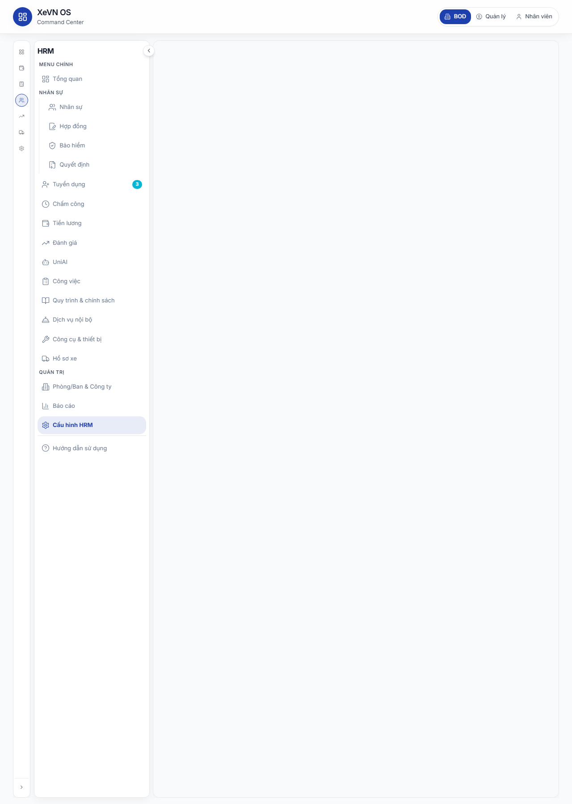
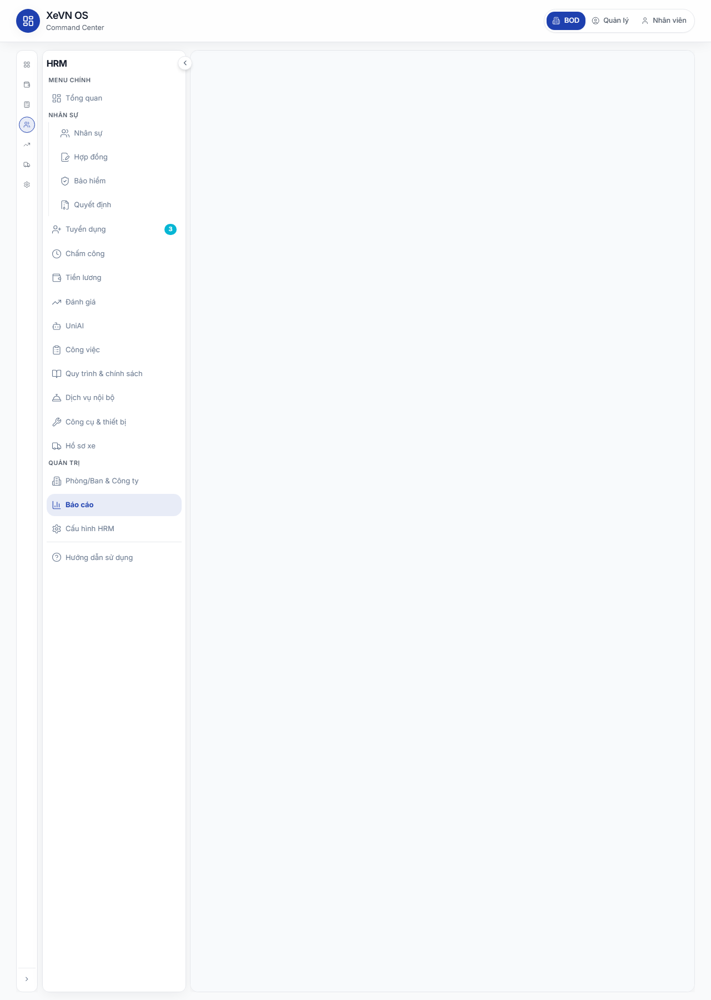

# Chương 11 — Cài đặt HRM, Danh mục, Metadata nhân viên & Báo cáo

| Thuộc tính | Giá trị |
|------------|---------|
| **Mã tài liệu** | XEVN/HDSD-OS-011 |
| **Sản phẩm** | **HRM** |
| **Phiên bản** | 1.0 (Markdown — chưa ảnh) |
| **Ngày hiệu lực** | 30/07/2026 |
| **Đối tượng** | Quản trị HRM, HRBP, Ban điều hành |
| **Tham chiếu SRS** | HRM-SC-01..09 · HRM-PR-06 · UF-HRM-10 |

---

## Điều hướng — hai cách vào HRM

| Cách | Thao tác | Route mẫu |
|------|----------|-----------|
| **HRM độc lập** | Sidebar → **Cài đặt** / **Báo cáo** / **Hướng dẫn** | `/settings` · `/reports` · `/guide` |
| **HRM nhúng (embed)** | Command Center → **NHÂN SỰ** → menu tương ứng | `/command-center/hrm/settings` · `…/reports` · `…/guide` |

Chi tiết shell: [HDSD_HRM_CH00_VAO_UNG_DUNG.md](./HDSD_HRM_CH00_VAO_UNG_DUNG.md).

---

## 11.1 Cài đặt HRM — Tổng quan

**Route:** `…/hrm/settings` · **Menu:** Cài đặt

### Mô tả

Trung tâm cấu hình tài khoản, thương hiệu, thông báo, bảo mật, vai trò, hệ thống, gói dịch vụ, **danh mục đồng bộ XBOS** và **danh mục nghiệp vụ** (master data).

### Tab Cài đặt

| Tab | Icon | Nội dung chính |
|-----|------|----------------|
| Tài khoản | User | Hồ sơ admin đăng nhập |
| Thương hiệu | Image | Logo · màu · tên hiển thị |
| Thông báo | Bell | Bật/tắt email theo module |
| Bảo mật | Shield | Đổi mật khẩu · xác thực 2 lớp SMS |
| Vai trò | Users | Ma trận quyền RBAC |
| Hệ thống | Settings | Ngôn ngữ · múi giờ · định dạng ngày · tiền tệ |
| Gói dịch vụ | DollarSign | SubscriptionManagement |
| Danh mục | Layers | SettingsCatalogsTab — đồng bộ XBOS |
| Danh mục nghiệp vụ | Layers | MasterDataSettingsPanel — CRUD MD |

---

## 11.2 Tab Tài khoản

### Bảng Trường

| Trường | Sửa được | Ghi chú |
|--------|----------|---------|
| Ảnh đại diện | Có | Upload JPG/PNG max 2 MB |
| Họ tên | Có | |
| Email | Có | |
| Số điện thoại | Có | |
| Chức danh | Không | Read-only |

| Nút | Hành vi |
|-----|---------|
| Tải ảnh lên | Chọn file avatar |
| Lưu | Ghi thay đổi hồ sơ |

---

## 11.3 Tab Thông báo

Các công tắc (Switch) — mặc định bật trừ Chấm công:

| Công tắc | Mô tả |
|----------|-------|
| Email tổng quát | Thông báo email chung |
| Nghỉ phép | Khi có đơn nghỉ mới / duyệt |
| Tuyển dụng | Ứng viên · lịch phỏng vấn |
| Lương | Kỳ lương · phiếu lương |
| Chấm công | Cảnh báo chấm công (mặc định tắt) |

---

## 11.4 Tab Bảo mật

### Đổi mật khẩu

| Trường | Bắt buộc |
|--------|----------|
| Mật khẩu hiện tại | Có |
| Mật khẩu mới | Có |
| Xác nhận mật khẩu | Có |

### Xác thực hai lớp

| Công tắc | Phương thức |
|----------|-------------|
| SMS | Bật/tắt xác minh SMS |

---

## 11.5 Tab Hệ thống

| Trường | Tùy chọn |
|--------|----------|
| Ngôn ngữ | Việt · English · 中文 |
| Múi giờ | (UTC+7) Hồ Chí Minh · Bangkok |
| Định dạng ngày | DD/MM/YYYY · MM/DD/YYYY · YYYY-MM-DD |
| Tiền tệ | VND · USD · LAK · MMK |

| Nút | Hành vi |
|-----|---------|
| Lưu | Ghi ngôn ngữ / tiền tệ vào localStorage |

---

## 11.6 Danh mục cài đặt (Đồng bộ XBOS)

**Route:** `…/hrm/settings` tab **Danh mục** hoặc deep link `…/hrm/settings-catalogs` · **UC:** UF-HRM-10 · **FR:** HRM-SC-01..09

### Mô tả

Xem overview các catalog đã đồng bộ từ XBOS; kéo (pull) bản mới; thêm mục mở rộng; gửi yêu cầu xóa trường (cần phê duyệt tập đoàn).

### Bảng Nút & chức năng

| Nút | Chức năng |
|-----|-----------|
| Đồng bộ từ XBOS (RefreshCw) | POST sync — toast số catalog đã kéo |
| Chọn catalog | Dropdown / input mã catalog |
| Thêm mục (+) | Append code + label vào catalog đã chọn |
| Xóa (Trash) trên dòng | Gửi yêu cầu xóa (workflow phê duyệt) |

### Bảng Cột — Danh sách mục catalog

| Cột | Ý nghĩa |
|-----|---------|
| Mã | Code item (mono) |
| Nhãn | Tên hiển thị tiếng Việt |
| Nguồn | XBOS · HRM |
| Trạng thái | Đang dùng · Nháp |
| Thao tác | Yêu cầu xóa |

### Form thêm mục mở rộng

| Trường | Bắt buộc |
|--------|----------|
| Mã catalog | Có | Chọn catalog đích |
| Mã (code) | Có | |
| Nhãn (label) | Có | |

### Metadata hiển thị

| Thông tin | Định dạng |
|-----------|-----------|
| Lần đồng bộ XBOS gần nhất | dd/MM/yyyy HH:mm |
| Phạm vi công ty | Theo JWT scope |

### Lỗi thường gặp

| Triệu chứng | Xử lý |
|-------------|-------|
| Sync lỗi 409 scope | Đăng nhập đúng persona công ty |
| Picker form trống | Chạy **Đồng bộ từ XBOS** trước |
| Yêu cầu xóa treo | Chờ phê duyệt lãnh đạo tập đoàn |

---

## 11.7 Danh mục nghiệp vụ (Master Data)

**Tab:** Cài đặt → **Danh mục nghiệp vụ** · **FR:** FR-HRM-SC-POS-01 · SC-LEAVE-01 · SC-DEC-01 · SC-SET-UI-01

### Mô tả

CRUD trực tiếp các danh mục nghiệp vụ HRM (≥ 14 nhóm). Mỗi nhóm có bảng mã/nhãn/nguồn/trạng thái và form thêm/sửa.

### Các nhóm danh mục (tab con)

| Tab | FR | Mục đích |
|-----|-----|----------|
| Chức danh | FR-HRM-SC-POS-01 | Picker hồ sơ NV · YCTD |
| Phòng ban | FR-HRM-SC-POS-01 | Cây tổ chức |
| Loại nghỉ | FR-HRM-SC-LEAVE-01 | Đơn nghỉ phép |
| Loại quyết định | FR-HRM-SC-DEC-01 | Module Quyết định |
| Loại hợp đồng | — | Hợp đồng LĐ |
| Loại lao động | — | Hồ sơ NV |
| Ca làm việc | — | Chấm công |
| Bậc chức danh | — | Cấp bậc |
| Kênh tuyển dụng | — | Tuyển dụng |
| Loại trả lương | — | Lương |
| Thành phần lương | — | Deep-link Payroll |
| Nhà bảo hiểm | — | BHXH |
| Loại bảo hiểm | — | BHXH |
| Thư viện KPI | — | KPI cá nhân |

### Bảng Nút & chức năng (mỗi tab)

| Nút | Chức năng |
|-----|-----------|
| Đồng bộ XBOS | Kéo catalog tương ứng |
| Tìm trong tab | Lọc theo mã hoặc nhãn |
| Chọn dòng | Click row → điền form sửa |
| Ngưng | Đặt status = draft (soft deactivate) |
| Lưu | POST upsert item — invalidate cache |

### Bảng Cột

| Cột | Ý nghĩa |
|-----|---------|
| Mã | Code (font mono) |
| Tên | Label tiếng Việt |
| Nguồn | Badge XBOS / HRM |
| Trạng thái | Đang dùng · Nháp |
| Thao tác | Ngưng (nếu active) |

### Form thêm / sửa mục

| Trường | Bắt buộc | Placeholder ví dụ |
|--------|----------|---------------------|
| Mã | Có | nv_kd · annual · … |
| Tên | Có | Nhân viên Kinh doanh · Nghỉ phép năm · … |

### Metadata nhân viên (trường động ESS)

Catalog trường hồ sơ nhân viên (employee fields) được **đồng bộ** qua cùng nguồn settings-catalogs. FE mobile/web đọc catalog để render form động (DynamicProfileForm). Quản trị mở rộng trường qua **Danh mục** hoặc **Danh mục nghiệp vụ** tùy loại trường.

### Deep-link liên quan

| Module | Ghi chú |
|--------|---------|
| Mẫu công việc (JT) | Tab stub → link sang Tuyển dụng |
| Thành phần lương | Tab stub → link sang Lương |

### Lỗi thường gặp

| Triệu chứng | Xử lý |
|-------------|-------|
| Form `#md-code-*` không hiện | Chọn tab bucket; đợi scope load |
| Lưu xong picker vẫn cũ | F5 hoặc đợi invalidate cache |
| Loại QĐ MISS trên Quyết định | Kiểm tra alias `hr_decision_types` ∪ `decision_types` |

---

## 11.8 Báo cáo HRM

**Route:** `…/hrm/reports` · **Menu:** Báo cáo · **UC:** HRM-PR-06

### Mô tả

Dashboard báo cáo theo năm với các tab chuyên đề: tổng quan, tuyển dụng, hợp đồng, nghỉ phép, biến động nhân sự, dịch vụ nội bộ, công cụ dụng cụ.

### Bảng Nút & chức năng — Header

| Thành phần | Chức năng |
|------------|-----------|
| Chọn năm | Dropdown: năm hiện tại · n-1 · n-2 |
| Xuất (Export) | Nút outline — xuất dữ liệu tab đang xem |

### Tab báo cáo

| Tab | Nội dung |
|-----|----------|
| Tổng quan | Tổng NV · headcount theo phòng ban · tóm tắt vận hành · đối soát lương |
| Tuyển dụng | KPI pipeline tuyển dụng theo năm |
| Hợp đồng | Thống kê HĐ theo loại / trạng thái |
| Nghỉ phép | Ngày nghỉ theo loại |
| Biến động | Turnover · onboard · offboard |
| Dịch vụ nội bộ | Thống kê yêu cầu DVC |
| Công cụ dụng cụ | Thống kê cấp phát CCDC |

### Tab Tổng quan — thẻ số liệu

| Chỉ số | Nguồn |
|--------|-------|
| Tổng nhân viên | employeeTotal |
| Headcount theo phòng ban | departmentHeadcounts[] |
| Tóm tắt vận hành | operationsSummary |
| Đối soát lương | payrollReconciliation |

### Lỗi thường gặp

| Triệu chứng | Xử lý |
|-------------|-------|
| Biểu đồ trống | Chọn năm có dữ liệu; kiểm tra phạm vi |
| Spinner lâu | API reports aggregate — thử lại sau |

---

## 11.9 Hướng dẫn trong ứng dụng (In-app Guide)

**Route:** `…/hrm/guide` · **Menu:** Hướng dẫn

### Mô tả

Trang quản trị nội dung hướng dẫn sử dụng cho người dùng HRM. Chia theo **section** (chủ đề); mỗi section có nhiều **bước** kèm mô tả và ảnh minh họa.

### Bảng Nút & chức năng

| Nút | Chức năng |
|-----|-----------|
| Chọn section (Accordion) | Mở danh sách section |
| Vào section | Xem các bước hướng dẫn |
| ← Quay lại | Về danh sách section |
| Sửa bước (Pencil) | Mở GuideStepEditor |
| Badge «đã tùy chỉnh» | Số section đã override nội dung |

### Cấu trúc một bước hướng dẫn

| Trường | Mô tả |
|--------|-------|
| Tiêu đề bước | Tiêu đề ngắn |
| Mô tả | Văn bản hướng dẫn |
| Ảnh minh họa | URL hoặc upload (GuideStepEditor) |

### Quyền

Chỉ **quản trị nền tảng / HR admin** có quyền chỉnh sửa. Người dùng thường **chỉ đọc** khi mở menu Hướng dẫn.

---

## Liên kết kiểm thử

- Ma trận: [`docs/qa/HDSD_SRS_TESTCASE_MATRIX.md`](../../qa/HDSD_SRS_TESTCASE_MATRIX.md)
- UF: UF-HRM-10 (Cài đặt danh mục)
