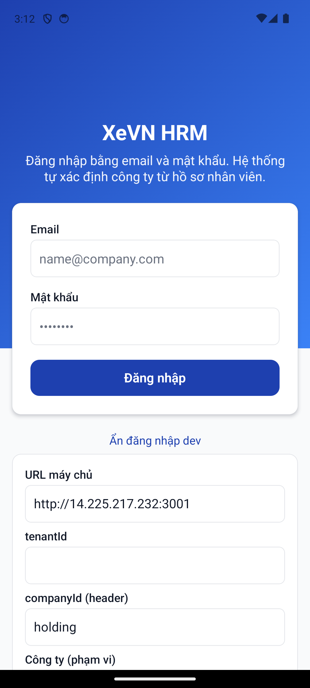
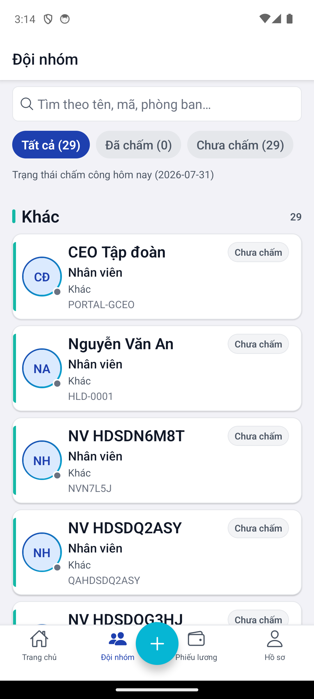
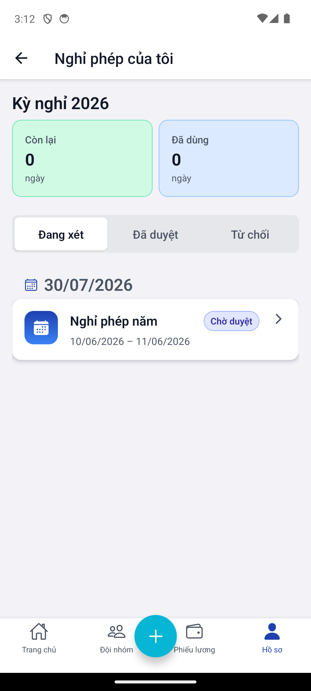
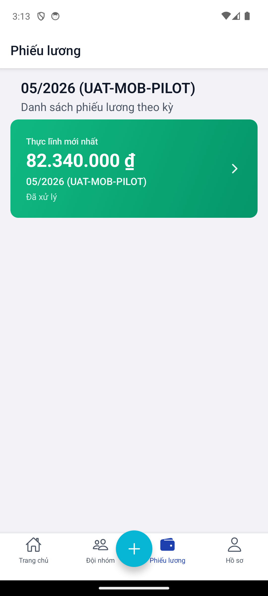
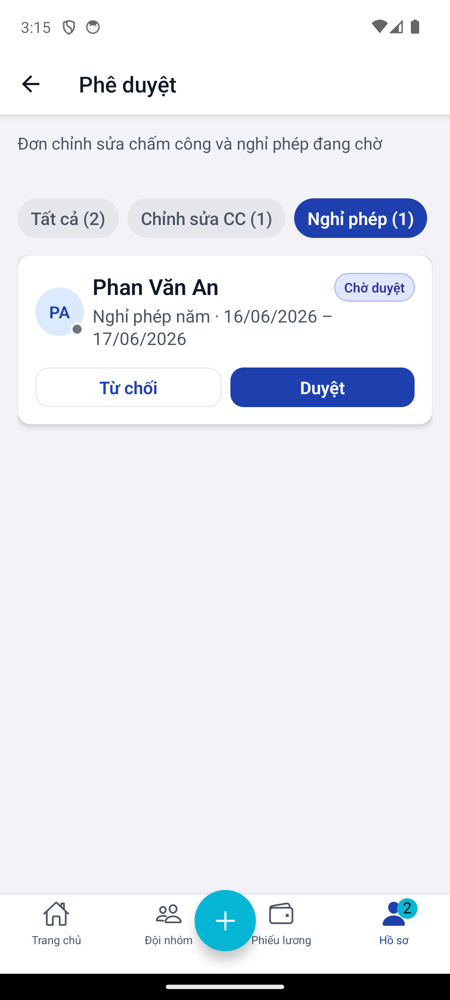
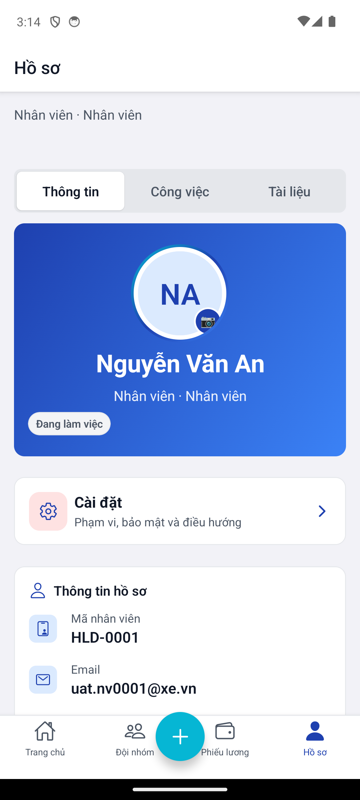
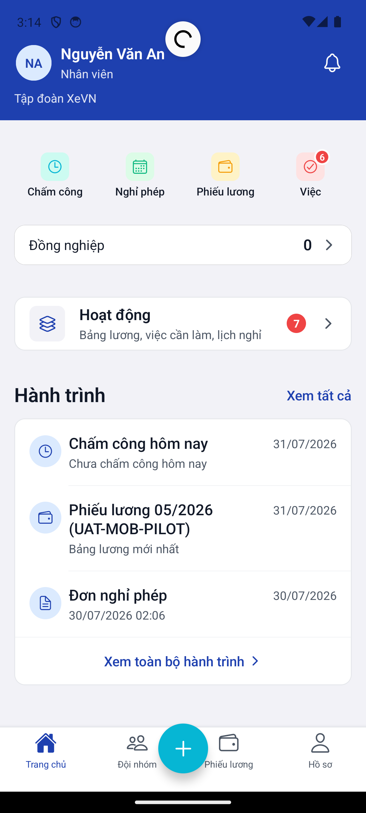

# Chương 12 — Ứng dụng Mobile HRM (ESS)

| Thuộc tính | Giá trị |
|------------|---------|
| **Mã tài liệu** | XEVN/HDSD-OS-012 |
| **Sản phẩm** | **HRM** (Mobile ESS) |
| **Phiên bản** | 1.0 (Markdown — chưa ảnh) |
| **Ngày hiệu lực** | 30/07/2026 |
| **Ứng dụng** | HRM Mobile (Expo / React Native) |
| **Đối tượng** | Nhân viên · Quản lý trực tiếp |
| **Tham chiếu SRS** | UC-HRM-MOB-01 .. UC-HRM-MOB-13 |

---

## Điều hướng — hai cách vào HRM

| Cách | Thao tác | Ghi chú |
|------|----------|---------|
| **HRM Mobile (standalone)** | Cài app HRM Mobile → đăng nhập UAT NV | Route native — không qua Cổng Web |
| **HRM Web (tham chiếu)** | Dùng khi cần đối chiếu cùng nghiệp vụ trên portal | [HDSD_HRM_CH00_VAO_UNG_DUNG.md](./HDSD_HRM_CH00_VAO_UNG_DUNG.md) |

Mobile **không** embed trong Command Center; nghiệm thu J-MOB-* chạy trên thiết bị / emulator.

---

## 12.0 Cấu trúc điều hướng

### Thanh tab dưới (4 tab cố định)

| Tab | Nhãn | Stack con |
|-----|------|-----------|
| TabDashboard | Trang chủ | DashboardScreen |
| TabAttendance | Đội nhóm | TeamDirectory · CheckIn · AttendanceHistory · … |
| TabPayslip | Phiếu lương | PayslipList · PayslipDetail · PayrollSummary |
| TabProfile | Hồ sơ | Profile · Leave · Approvals · Settings · … |

### Nút FAB chấm công

Nút nổi **Chấm công** (CheckInFabOverlay) luôn hiện trên tab chính — trừ khi đang ở màn CheckIn.

### Tài khoản UAT mobile

| Loại | Email mẫu | Mật khẩu |
|------|-----------|----------|
| Nhân viên UAT | `uat.nv####@xe.vn` | `xevn-uat-2026` |

> Mật khẩu portal tập đoàn (`Xevn@2026`) **không** dùng cho mobile UAT.

---

## 12.1 Đăng nhập & chọn phạm vi

**UC:** UC-HRM-MOB-01 · UC-HRM-MOB-02 · **Stack:** Root → Login / Scope

### Màn Đăng nhập

| Trường / Nút | Bắt buộc | Mô tả |
|--------------|----------|-------|
| Email | Có | Địa chỉ email công ty |
| Mật khẩu | Có | Mật khẩu ESS |
| **Đăng nhập** | — | POST `/auth/mobile/login` |
| Logo XeVN | — | Thương hiệu trên hero |
| Gợi ý phạm vi | — | Hệ thống tự xác định công ty từ hồ sơ NV |

### Hành vi sau đăng nhập

| Tình huống | Hệ thống |
|------------|----------|
| Một công ty | Vào thẳng Main tabs |
| Nhiều công ty (multi-membership) | Alert thông báo công ty đang dùng; đổi phạm vi tại Cài đặt → Phạm vi |
| Sai mật khẩu | Alert lỗi tiếng Việt |

### Màn Phạm vi (Scope) — Profile stack

| Trường / Nút | Mô tả |
|--------------|-------|
| Danh sách membership | Chọn công ty + nhân viên tương ứng |
| Lưu | Cập nhật JWT scope local |

### Lỗi thường gặp

| Triệu chứng | Xử lý |
|-------------|-------|
| 401 đăng nhập | Kiểm tra đúng họ mật khẩu mobile UAT |
| «Nhiều phạm vi» | Vào Hồ sơ → Cài đặt → chọn công ty |

---

## 12.2 Trang chủ (Home)

**UC:** UC-HRM-MOB-03 · **Tab:** Trang chủ

### Thanh trên (HomeTopBar)

| Thành phần | Chức năng |
|------------|-----------|
| Lời chào + tên NV | Theo giờ trong ngày |
| Avatar | Tap → Hồ sơ |
| Chuông thông báo | Badge số → Thông báo |
| Chọn ngày (DateBar) | Lọc số liệu theo ngày |

### Lưới truy cập nhanh (QuickAccessGrid)

| Ô (tile) | Nhãn | Đích |
|----------|------|------|
| checkin | Chấm công | CheckIn |
| time_off | Nghỉ phép | Tạo / danh sách nghỉ |
| payroll | Phiếu lương | Tab Phiếu lương |
| approve | Phê duyệt / Việc | ManagerApprovals (manager) |
| team | Đội nhóm | Tab Đội nhóm |
| contracts | Hợp đồng | ContractsScreen |
| operations | Vận hành | OperationsScreen |
| notifications | Thông báo | InAppNotifications |
| journey | Hành trình | JourneyScreen |
| reports | Báo cáo | Stub (sắp có — manager) |

Badge đỏ trên tile khi có việc chờ (vd. phê duyệt).

### Thẻ thống kê & feed

| Thành phần | Mô tả |
|------------|-------|
| AttendanceStatsRow | Công / muộn / vắng hôm nay |
| DashboardStatCards | Thẻ KPI ESS (chấm công · nghỉ · lương · …) |
| HomeFeedSection | Việc cần làm · đơn chờ duyệt |
| JourneyTimelineCard | Mốc hành trình nghề nghiệp |
| HomeCelebrationRow | Sinh nhật / kỷ niệm đồng nghiệp |

### Lỗi thường gặp

| Triệu chứng | Xử lý |
|-------------|-------|
| Shimmer lâu | Kiểm tra mạng; banner Offline |
| Tile «sắp có» | Chức năng Phase 2 — không lỗi |

---

## 12.3 Chấm công & Đội nhóm

**UC:** UC-HRM-MOB-04 · UC-HRM-MOB-05 · **Tab:** Đội nhóm

### 12.3.1 Danh bạ đội nhóm (TeamDirectory)

| Thành phần | Chức năng |
|------------|-----------|
| Ô tìm kiếm | Lọc tên / mã NV |
| Danh sách đồng nghiệp | Tap → Chi tiết đồng nghiệp |
| Pull refresh | Tải lại directory |

**Chi tiết đồng nghiệp:** avatar · họ tên · phòng ban · chức danh · liên hệ (nếu được phép).

### 12.3.2 Chấm công vào (CheckIn)

| Trường / Nút | Mô tả |
|--------------|-------|
| Hero card | Tên · mã NV · avatar |
| Vị trí thiết bị | Trạng thái GPS (sẵn sàng / từ chối / lỗi) |
| **Chấm công vào** (sticky) | POST check-in + tọa độ (nếu có) |
| Làm mới vị trí | Request permission lại |

| Trạng thái vị trí | Ý nghĩa |
|-------------------|---------|
| idle / loading | Đang lấy GPS |
| ready | Có tọa độ |
| denied | User từ chối quyền |
| error | Không đọc được GPS |

**Offline:** ghi hàng đợi — toast «Đã xếp hàng đồng bộ khi có mạng».

### 12.3.3 Lịch sử chấm công (AttendanceHistory)

| Thành phần | Mô tả |
|------------|-------|
| Danh sách theo ngày | Giờ vào · giờ ra · trạng thái |
| Badge timeline | Đúng giờ · muộn · vắng |
| Tap dòng | (Nếu có) chi tiết ca |

---

## 12.4 Nghỉ phép & Yêu cầu cập nhật công

**UC:** UC-HRM-MOB-06 .. UC-HRM-MOB-08

### 12.4.1 Danh sách đơn nghỉ (LeaveRequestsList)

| Tab segmented | Trạng thái API |
|---------------|----------------|
| Đang xét | pending |
| Đã duyệt | approved |
| Từ chối | rejected |

| Thành phần | Chức năng |
|------------|-----------|
| LeaveBalanceHeader | Số ngày phép còn lại |
| Nút **+ Tạo đơn** | → CreateLeaveRequest |
| Swipe trái | Hủy đơn (nếu cho phép) |
| Tap dòng | LeaveRequestDetail |

### 12.4.2 Tạo đơn nghỉ (CreateLeaveRequest) — Wizard 4 bước

| Bước | Trường / Nút | Bắt buộc |
|------|--------------|----------|
| 1 — Loại | Chọn loại nghỉ | Có |
| | LeaveBalanceChip | Hiển thị số dư |
| 2 — Thời gian | Từ ngày · Đến ngày (dd/MM/yyyy) | Có |
| | Đính kèm (ốm/thai sản) | Có khi loại yêu cầu |
| 3 — Lý do | Lý do chi tiết | Không |
| 4 — Xác nhận | Tóm tắt + **Gửi đơn** | — |

| Nút điều hướng | Hành vi |
|----------------|---------|
| Tiếp tục | Validate bước hiện tại |
| Quay lại | Bước trước |
| Gửi đơn | POST leave-requests |

### 12.4.3 Yêu cầu cập nhật công (UpdateRequests)

| Nút | Chức năng |
|-----|-----------|
| + Tạo yêu cầu | CreateUpdateRequest |
| Tap dòng | UpdateRequestDetail — loại chỉnh sửa · ngày · lý do |

### Lỗi thường gặp

| Triệu chứng | Xử lý |
|-------------|-------|
| Chip số dư «—» | HR chưa cấu hình entitlement |
| Không «Tiếp tục» bước 2 | Thiếu file đính kèm bắt buộc |
| Gửi offline | Chặn — cần mạng |

---

## 12.5 Phiếu lương

**UC:** UC-HRM-MOB-09 · **Tab:** Phiếu lương

### Danh sách phiếu lương (PayslipList)

| Thành phần | Mô tả |
|------------|-------|
| PayslipHeroCard | Phiếu kỳ mới nhất — thực lĩnh nổi bật |
| Danh sách lịch sử | Mỗi dòng: kỳ · thực lĩnh · trạng thái |
| Pull refresh | Tải lại GET `/payroll/payslips` |
| Tap dòng | PayslipDetail |

### Chi tiết phiếu lương (PayslipDetail)

| Trường hiển thị | Ghi chú |
|-----------------|---------|
| Kỳ lương | Nhãn tiếng Việt |
| Lương gross / khấu trừ / thực lĩnh | format tiền VND |
| Các khoản chi tiết | Theo payslip lines |
| Trạng thái | Đã khóa · Nháp · … |

### Tổng hợp lương (PayrollSummary)

| Thành phần | Mô tả |
|------------|-------|
| Thẻ tổng theo kỳ | Drill-down từ hero |
| Biểu đồ / metric | Tóm tắt nhiều kỳ |

### Lỗi thường gặp

| Triệu chứng | Xử lý |
|-------------|-------|
| «Cần phạm vi công ty» | Đăng nhập lại / chọn Scope |
| Danh sách trống | Chưa có kỳ lương khóa cho NV |

---

## 12.6 Phê duyệt (Manager)

**UC:** UC-HRM-MOB-11 · **Stack:** Profile → ManagerApprovals

> Chỉ hiện đầy đủ cho **quản lý** (`isManager`). Tab Hồ sơ có badge số việc chờ.

### Bộ lọc chip

| Chip | Nội dung |
|------|----------|
| Tất cả | Cập nhật công + nghỉ |
| Chỉnh sửa CC | update-requests pending |
| Nghỉ phép | leave-requests pending |

### Thẻ yêu cầu

| Loại thẻ | Nút / cử chỉ |
|----------|--------------|
| ManagerAttendanceCard | **Duyệt** · **Từ chối** · swipe |
| ManagerLeaveCard | **Duyệt** · **Từ chối** · swipe |

### Hộp thoại từ chối

| Trường | Bắt buộc |
|--------|----------|
| Lý do từ chối | Có (TextInput) |
| Xác nhận | POST quyết định |
| Hủy | Đóng |

| Hành vi | API |
|---------|-----|
| Duyệt | PATCH approve → 2xx |
| Từ chối | PATCH reject + reason |
| Undo snackbar | Hoàn tác ngắn (nếu bật) |

---

## 12.7 Hồ sơ cá nhân

**UC:** UC-HRM-MOB-10 · UC-HRM-MOB-12 · **Tab:** Hồ sơ → Profile

### Tab segmented hồ sơ

| Tab | Nội dung |
|-----|----------|
| Thông tin | Form động ESS (DynamicProfileForm) |
| Công việc | Chức danh · phòng ban · metric |
| Tài liệu | Hợp đồng · giấy tờ |

### EmployeeHeroCard

| Thành phần | Sửa được |
|------------|----------|
| Avatar | Tap → chọn ảnh · upload |
| Họ tên · mã NV | Read-only |
| Phòng ban · vai trò | Read-only |

### Form Thông tin (catalog-driven)

| Quy tắc | Chi tiết |
|---------|----------|
| Trường từ catalog | Render theo employee-fields catalog |
| Sửa được (ESS) | Vd. số điện thoại — PATCH custom_fields |
| Không sửa | Mã NV · ngày sinh năm · trường HR-only |

| Nút | Hành vi |
|-----|---------|
| **Lưu thay đổi** | PATCH — toast thành công / lỗi |

### ProfileQuickActionGrid

| Ô | Đích |
|----|------|
| Đơn nghỉ | LeaveRequestsList |
| Phê duyệt | ManagerApprovals (manager) |
| Hợp đồng | Contracts |
| … | Theo cấu hình persona |

### Hợp đồng & BHXH (ContractsScreen)

| Cột / trường | Mô tả |
|--------------|-------|
| Số HĐ | |
| Loại HĐ | Nhãn catalog |
| Ngày hiệu lực | dd/MM/yyyy |
| Trạng thái | Đang hiệu lực · Hết hạn |

---

## 12.8 Thông báo

**UC:** UC-HRM-MOB-13 · **Stack:** Profile → Notifications

| Thành phần | Chức năng |
|------------|-----------|
| Danh sách thông báo | GET `/notifications/inbox` |
| Pull refresh | Tải lại |
| Tap dòng | Deep-link: chi tiết đơn nghỉ / cập nhật công / phê duyệt / phiếu lương |
| Empty state | Illustration + «Chưa có thông báo» |

### Loại thông báo (navigation)

| Target | Màn đích |
|--------|----------|
| LeaveRequestDetail | Chi tiết đơn nghỉ |
| UpdateRequestDetail | Chi tiết yêu cầu CC |
| ManagerApprovals | Hộp phê duyệt |
| PayslipList | Tab phiếu lương |
| Operations | Vận hành |

---

## 12.9 Cài đặt Mobile

**Stack:** Profile → Settings · **UC:** UC-HRM-MOB-02 (phạm vi)

| Trường / Nút | Mô tả |
|--------------|-------|
| Công ty đang dùng | Nhãn tiếng Việt (resolveCompanyDisplayVi) |
| Mã nhân viên | Read-only / dev override |
| Vai trò | Nhãn roles |
| Công ty (UUID) | Dev/QA — override local scope |
| Mã nhân viên (override) | Dev/QA |
| **Lưu phạm vi** | SecureStore + updateLocal |
| Sinh trắc học | Bật/tắt mở app bằng vân tay/Face ID |
| **Đăng xuất** | Xóa session |

---

## 12.10 Bảng tổng hợp UC ↔ Màn hình

| UC | Màn hình chính |
|----|----------------|
| UC-HRM-MOB-01 | LoginScreen |
| UC-HRM-MOB-02 | ScopeScreen · SettingsScreen |
| UC-HRM-MOB-03 | DashboardScreen |
| UC-HRM-MOB-04 | CheckInScreen |
| UC-HRM-MOB-05 | AttendanceHistoryScreen |
| UC-HRM-MOB-06 | CreateLeaveRequestScreen |
| UC-HRM-MOB-07 | LeaveRequestsListScreen · LeaveRequestDetailScreen |
| UC-HRM-MOB-08 | UpdateRequestsScreen · CreateUpdateRequestScreen |
| UC-HRM-MOB-09 | PayslipListScreen · PayslipDetailScreen |
| UC-HRM-MOB-10 | ContractsScreen |
| UC-HRM-MOB-11 | ManagerApprovalsScreen |
| UC-HRM-MOB-12 | ProfileScreen |
| UC-HRM-MOB-13 | InAppNotificationsScreen |

---

## Lỗi chung Mobile

| Triệu chứng | Xử lý |
|-------------|-------|
| Banner «Không có mạng» | Thao tác ghi bị chặn — chờ online |
| 409 scope | Đổi phạm vi Cài đặt · đăng nhập lại |
| App crash sau intro | Bấm «Thử lại» trên error boundary |
| Badge phê duyệt không đổi | Đợi ~90s refresh hoặc pull refresh |

---

## Liên kết kiểm thử

- Ma trận: [`docs/qa/HDSD_SRS_TESTCASE_MATRIX.md`](../../qa/HDSD_SRS_TESTCASE_MATRIX.md)
- Journey: J-MOB-* trong [`docs/program/PROGRAM_JOURNEY_MAP.md`](../../program/PROGRAM_JOURNEY_MAP.md)
