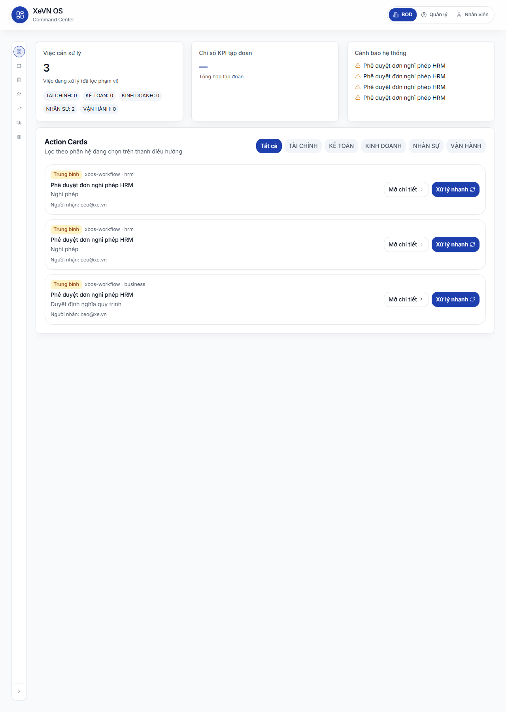

# XBOS — Chương 1: Command Center (Tổng quan tập đoàn)

| Thuộc tính | Giá trị |
|------------|---------|
| **Mã chương** | XEVN/HDSD-XBOS-001 |
| **Sản phẩm** | **XBOS** — Command Center |
| **API** | `xbos-api` `/api/xbos` |

> Đăng nhập Cổng → xem [Cổng chung](../ecosystem/HDSD_ECOSYSTEM_CH01_CONG_VA_CHUYEN_PHAN_HE.md).  
> Rail **NHÂN SỰ** chuyển sang **HRM** (sản phẩm khác) → [HDSD HRM Ch.0](../hrm/HDSD_HRM_CH00_VAO_UNG_DUNG.md).

---

## 1.1 Command Center — Tổng quan (GROUP)

### Mục đích & phân quyền

- **Mục đích:** Bảng điều khiển tập đoàn — theo dõi việc cần xử lý, KPI rollup, cảnh báo và thẻ hành động (Action Cards) theo phân hệ.
- **Persona chính:** Ban điều hành (BOD), quản lý tập đoàn (`ceo@xe.vn`).
- **Quyền:** Phân hệ trên thanh rail bị khóa nếu persona demo không đủ quyền (*Bạn không có quyền truy cập phân hệ này*).

### Cách vào

| Bước | Thao tác |
|------|----------|
| 1 | Đăng nhập thành công → mặc định **`/command-center`**. |
| 2 | Trên **thanh rail trái**, chọn icon **GROUP** (nhãn *GROUP*) — module *Tập đoàn*. |
| 3 | Nội dung chính hiển thị 3 widget trên + khu **Action Cards** bên dưới. |

**Đường dẫn:** `/command-center`

### Bảng Nút & chức năng

| Nút / vùng | Vị trí | Chức năng |
|------------|--------|-----------|
| **BOD** | Header phải | Chọn persona demo Ban điều hành; tải lại CC về tổng quan GROUP. |
| **Quản lý** | Header phải | Persona demo quản lý. |
| **Nhân viên** | Header phải | Persona demo nhân viên; KPI widget có thể hiển thị *KPI cá nhân*. |
| **GROUP** | Rail trái | Về tổng quan Command Center (module tập đoàn). |
| **TÀI CHÍNH** | Rail | Chuyển module (route dashboard khách hàng) — có thể khóa theo persona. |
| **KẾ TOÁN** | Rail | Chuyển module KPI kế toán. |
| **NHÂN SỰ** | Rail | **Chuyển sang HRM embed** — sản phẩm HRM, xem [HDSD HRM Ch.0](../hrm/HDSD_HRM_CH00_VAO_UNG_DUNG.md). |
| **KINH DOANH** | Rail | Module kinh doanh. |
| **VẬN HÀNH** | Rail | Module tổ chức/vận hành. |
| **CÀI ĐẶT HỆ THỐNG** | Rail | Mở workspace **Cài đặt XBOS** ([Chương 3](./HDSD_XEVN_CH03_XBOS_TO_CHUC.md)). |
| Nút thu/mở rail | Dưới cùng rail | Thu gọn rail còn icon hoặc mở rộng nhãn phân hệ. |
| **Tất cả** | Action Cards — bộ lọc | Lọc thẻ việc mọi phân hệ; ở lại CC overview. |
| **TÀI CHÍNH / KẾ TOÁN / KINH DOANH / VẬN HÀNH** | Bộ lọc Action Cards | Lọc thẻ theo phân hệ tương ứng. |
| **NHÂN SỰ** | Bộ lọc Action Cards | Lọc thẻ HRM **và** chuyển sang HRM embed (dashboard). |
| **Mở chi tiết** | Từng Action Card | Mở drawer chi tiết nhiệm vụ hộp thư workflow. |
| **Xử lý nhanh** | Từng Action Card | Hoàn thành nhanh bước workflow (khi hộp thư tải từ engine thật). |

### Bảng Hộp thoại — các trường

**Drawer Chi tiết nhiệm vụ (Workflow Task Detail)**

| Trường / vùng | Mô tả |
|---------------|-------|
| Tiêu đề nhiệm vụ | Tên việc cần xử lý |
| Phân hệ / module | Nguồn hệ thống và mã module |
| Người nhận | Tên người được gán |
| Hạn xử lý | Ngày giờ (định dạng hiển thị theo locale Việt Nam) |
| **Duyệt** / **Từ chối** | Nút hành động trên drawer (khi API workflow sẵn sàng) |
| **Đóng** | Đóng drawer |

### Bảng Cột danh sách

**Widget Việc cần xử lý** — không phải bảng; hiển thị tổng số và chip theo phân hệ: TÀI CHÍNH, KẾ TOÁN, KINH DOANH, NHÂN SỰ, VẬN HÀNH.

**Action Cards (danh sách thẻ)**

| Cột / thành phần | Ý nghĩa |
|------------------|---------|
| Nhãn ưu tiên | Mức ưu tiên (cao / trung bình / thấp — hiển thị bằng màu) |
| Nguồn · Module | Hệ thống phát sinh và mã phân hệ |
| Tiêu đề | Tên việc |
| Phụ đề | Mô tả phụ (nếu có) |
| Người nhận · Hạn | Người được gán và thời hạn |

### Trạng thái nghiệp vụ

| Trạng thái | Ý nghĩa | Hiển thị |
|------------|---------|----------|
| Việc đang xử lý | Task workflow chưa hoàn thành | Đếm trong widget và xuất hiện trong Action Cards |
| Không có việc | Inbox trống trong phạm vi | *Không có việc cần xử lý trong phạm vi hiện tại.* |
| KPI có dữ liệu | API KPI rollup thành công | Phần trăm + biểu đồ sparkline |
| KPI lỗi | API KPI fail | Banner cảnh báo tải KPI |
| Cảnh báo `critical` / `warn` / `info` | Mức độ cảnh báo hệ thống | Icon và màu tương ứng trong widget Cảnh báo |
| Hộp thư chưa tải API | Workflow engine down | Nút **Mở chi tiết** / **Xử lý nhanh** bị chặn kèm lý do |

### Lỗi thường gặp

| Triệu chứng | Nguyên nhân | Cách xử lý |
|-------------|-------------|------------|
| Banner *Không tải được dữ liệu tổng quan* | API workspace meta lỗi | Tải lại trang; kiểm tra API tập đoàn. |
| KPI *—* hoặc banner rollup | CEO thành viên hoặc scope không đủ | Dùng tài khoản tập đoàn; kiểm tra phạm vi công ty. |
| Action Cards trống có gợi ý engine | Chưa có task workflow thật | Tạo luồng duyệt từ FE (Chương 4 WF) hoặc liên hệ quản trị. |
| **Xử lý nhanh** bị khóa | Inbox đang dùng dữ liệu fallback | Bật workflow-engine; không dùng dữ liệu giả lập cho nghiệm thu. |
| Rail phân hệ mờ / không bấm được | Persona demo không đủ quyền | Chọn **BOD** hoặc đăng nhập tài khoản đủ quyền. |

### UF nghiệm thu

| UF | Nội dung |
|----|----------|
| UF-XBOS-01 | Login → CC widgets |
| UF-XBOS-10 | KPI rollup |
| UF-XBOS-11 | Member CEO negative scope |

---

## 1.2 Rail phân hệ (XBOS vs HRM)

| Rail | Sản phẩm | HDSD |
|------|----------|------|
| GROUP, CÀI ĐẶT, TÀI CHÍNH… | **XBOS** | Bộ này |
| NHÂN SỰ | **HRM** | [HRM Ch.0](../hrm/HDSD_HRM_CH00_VAO_UNG_DUNG.md) |

---

*Hết Chương 1 — Command Center XBOS.*
