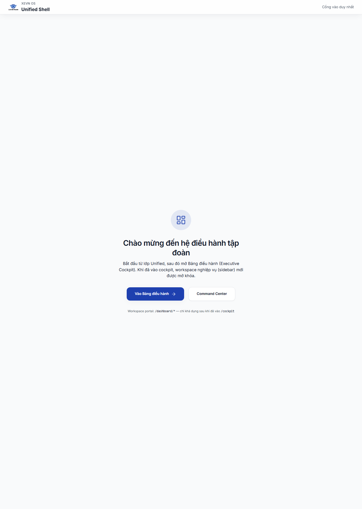
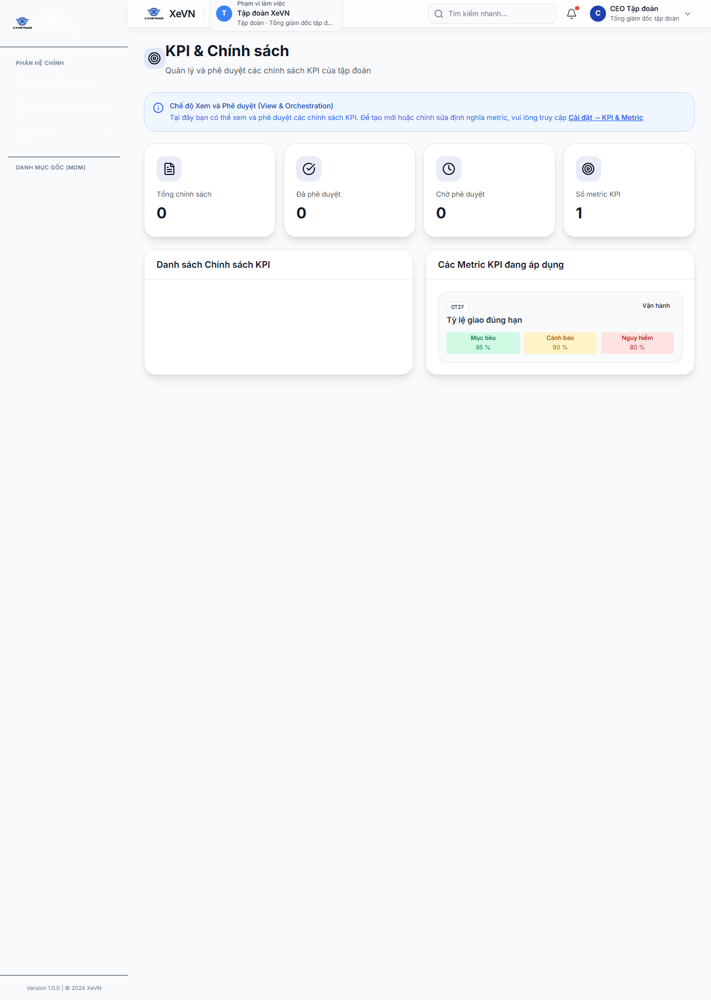
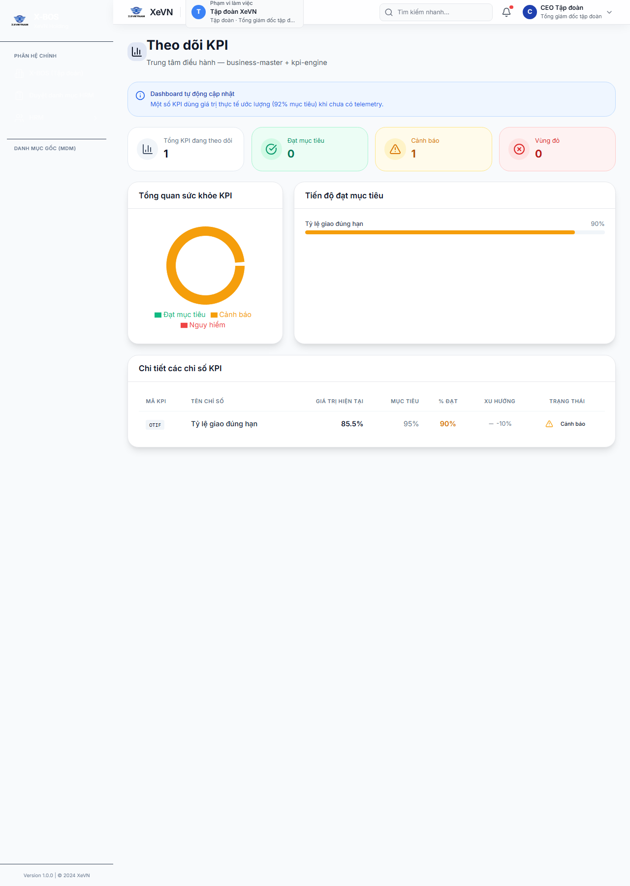

# XBOS — Chương 4: Dashboard vận hành

| Thuộc tính | Giá trị |
|------------|---------|
| **Mã chương** | XEVN/HDSD-XBOS-004 |
| **Sản phẩm** | **XBOS** — routes `/dashboard/*`, `/cockpit`, `/catalog-governance` |
| **Phiên bản** | 1.0 |
| **Ngày hiệu lực** | 30/07/2026 |

> Nghiệp vụ nhân sự chi tiết → [**HDSD HRM**](../hrm/HDSD_HRM_INDEX.md). Màn `/dashboard/hr` chỉ là **cầu nối** sang HRM.

---

## 4.0 Danh mục màn Dashboard vận hành

Bảng dưới liệt kê **16 route** thuộc phạm vi Chương 4 — mỗi dòng một màn; các màn Cài đặt **không** gộp chung.

| STT | Route | Tên màn (menu) | § chi tiết |
|-----|-------|----------------|------------|
| 1 | `/cockpit` | Bảng điều hành (Cockpit) | 4.1 |
| 2 | `/dashboard/organization` | Dashboard Tổ chức | 4.2 |
| 3 | `/dashboard/customers` | Khách hàng | 4.3 |
| 4 | `/dashboard/partners` | Đối tác | 4.3 |
| 5 | `/dashboard/kpi-policy` | Chính sách KPI | 4.4.1 |
| 6 | `/dashboard/kpi-dashboard` | KPI Dashboard | 4.4.2 |
| 7 | `/catalog-governance` | Quản trị danh mục | 4.5 |
| 8 | `/dashboard/settings/positions` | Cài đặt — Chức danh | 4.6 |
| 9 | `/dashboard/settings/departments` | Cài đặt — Phòng ban | 4.6 |
| 10 | `/dashboard/settings/regions` | Cài đặt — Vùng | 4.6 |
| 11 | `/dashboard/settings/vehicles` | Cài đặt — Loại xe | 4.6 |
| 12 | `/dashboard/settings/vendors` | Cài đặt — Nhà cung cấp | 4.6 |
| 13 | `/dashboard/settings/expense-categories` | Cài đặt — Danh mục chi phí | 4.6 |
| 14 | `/dashboard/settings/kpi-metrics` | Cài đặt — Chỉ số KPI | 4.6 |
| 15 | `/dashboard/settings/kpi-formulas` | Cài đặt — Công thức KPI | 4.6 |
| 16 | `/dashboard/hr` | HR Dashboard (cầu nối HRM) | 4.7 |

---

## 4.1 Cockpit — Bảng điều hành (Executive)

### Mục đích & phân quyền

- **Mục đích:** Tổng quan chiến lược — KPI rollup, cảnh báo, module cards theo phân hệ, sparkline xu hướng.
- **Persona:** Ban điều hành (BOD), CEO tập đoàn (`ceo@xe.vn`).
- **Route:** `/cockpit`

### Cách vào

| Bước | Thao tác |
|------|----------|
| 1 | Đăng nhập Cổng Web. |
| 2 | Menu hoặc deep link → **Cockpit** / **Bảng điều hành**. |
| 3 | Quan sát hàng KPI, thẻ module, danh sách cảnh báo. |

### Bảng Nút & chức năng

| Nút / vùng | Chức năng |
|------------|-----------|
| Thẻ **module** (Tổ chức, KPI, Khách hàng, …) | Chuyển sang dashboard con tương ứng |
| Nút **Truy cập** trên thẻ module | Mở dashboard con hoặc phân hệ tương ứng (theo quyền tài khoản) |
| Danh sách **Cảnh báo** | Đọc chi tiết; ưu tiên cao/trung/thấp theo màu |
| Banner API (nếu có) | Thông báo lỗi tải KPI hoặc workflow |

### Trạng thái & lỗi

| Triệu chứng | Cách xử lý |
|-------------|------------|
| KPI trống / mock | Kiểm tra `xbos-api` và kpi-engine; F5 sau khi API 200 |
| Cảnh báo không cập nhật | Kiểm tra portal alerts API |
| Số việc chờ = 0 | Bình thường khi inbox workflow trống |

### UF nghiệm thu

| UF | Nội dung |
|----|----------|
| UF-XBOS-10 | KPI rollup trên cockpit |

---

## 4.2 Dashboard Tổ chức

### Mục đích

Xem cấu trúc tổ chức tập đoàn ở góc dashboard — headcount, đơn vị thành viên, liên kết sang Cài đặt.

- **Route:** `/dashboard/organization`

### Bảng widget tổng hợp

| Widget | Ý nghĩa |
|--------|---------|
| **Tenant** | Tên viết tắt công ty đang chọn trên header |
| **Phòng ban** | Số phòng ban con trong sơ đồ org |
| **Vai trò (tenant)** | Mã vai trò của tài khoản trên tenant hiện tại |
| **Loại** | **Master** (tập đoàn) hoặc **Thành viên** |

### Bảng Sơ đồ cơ cấu (cây)

| Thành phần | Ý nghĩa |
|------------|---------|
| Nút gốc / nút con | Đơn vị tổ chức; mở rộng/thu gọn cây |
| Nhãn nút | Tên pháp nhân hoặc phòng ban |
| Vùng trống | Chưa có dữ liệu org — chọn tenant thành viên hoặc kiểm tra đồng bộ |

### Bảng Nút & chức năng

| Nút | Chức năng |
|-----|-----------|
| **Tải lại** | Làm mới số liệu tổ chức |
| Liên kết **Cài đặt** | Mở workspace Cài đặt hệ thống (Ch.2–3) |
| Thẻ thống kê | Drill-down theo công ty thành viên (theo scope token) |

### Lỗi thường gặp

| Triệu chứng | Cách xử lý |
|-------------|------------|
| 409 scope công ty | Đăng nhập đúng persona tập đoàn `main` |
| Headcount = 0 | Kiểm tra sync HRM; xem HDSD HRM Ch.6 Công ty |

---

## 4.3 Khách hàng & Đối tác

| Màn | Route | Mục đích |
|-----|-------|----------|
| **Khách hàng** | `/dashboard/customers` | Danh sách khách hàng doanh nghiệp, CRM lite |
| **Đối tác** | `/dashboard/partners` | Quản lý đối tác vận hành / logistics |

> Màn **Đối tác** (`/dashboard/partners`) dùng cùng bố cục danh sách và thẻ thống kê; cột bổ sung: **Loại đối tác**, **Người liên hệ**, **Công ty liên quan**.

### Bảng cột danh sách (mẫu — Khách hàng)

| Cột | Ý nghĩa |
|-----|---------|
| Mã | Mã định danh |
| Tên | Tên hiển thị |
| Trạng thái | Active / Pending / Ngưng |
| Cập nhật | Ngày dd/MM/yyyy |

### Nút chung

| Nút | Chức năng |
|-----|-----------|
| **Thêm mới** | Form tạo bản ghi |
| **Tìm kiếm** | Lọc theo tên/mã |
| **Xuất** | Xuất danh sách (khi bật) |

---

## 4.4 KPI — Chính sách & Dashboard

### 4.4.1 Chính sách KPI

- **Route:** `/dashboard/kpi-policy`
- **Mục đích:** Cấu hình chính sách gán KPI theo vai trò / phân hệ.

| Nút | Chức năng |
|-----|-----------|
| **Thêm chính sách** | Tạo policy mới |
| **Lưu** | Ghi cấu hình qua kpi-engine |

### 4.4.2 KPI Dashboard

- **Route:** `/dashboard/kpi-dashboard`
- **Mục đích:** Biểu đồ cột/tròn so sánh KPI theo công ty; bảng chi tiết trạng thái Đạt / Cảnh báo / Nguy hiểm.

| Vùng | Mô tả |
|------|--------|
| Bộ lọc công ty | **Tất cả** hoặc từng công ty thành viên |
| Thẻ tổng hợp | Số KPI đạt / cảnh báo / nguy hiểm |
| Biểu đồ cột | So sánh % hoàn thành theo công ty |
| Bảng chi tiết | Tên KPI · Giá trị · Mục tiêu · Trạng thái |

### Lỗi KPI

| Triệu chứng | Cách xử lý |
|-------------|------------|
| Banner đỏ KPI engine | Bật xbos-api `:28002`; kiểm tra scope `companyId` |
| Mock fallback | Chỉ chấp nhận trên dev — UAT cần API thật |

---

## 4.5 Quản trị danh mục (Catalog Governance)

- **Route:** `/catalog-governance`
- **Mục đích:** Publish / pull danh mục tập đoàn; HRM và các phân hệ **không** tự làm nguồn khung danh mục.

| Nút | Chức năng |
|-----|-----------|
| **Publish** | Phát hành bản catalog mới |
| **Pull / Sync** | Đồng bộ xuống phân hệ con |
| Xem lịch sử | Phiên bản catalog đã publish |

> Chi tiết workflow danh mục trong CC → xem Ch.3 § Danh mục.

---

## 4.6 Settings vận hành (`/dashboard/settings/*`)

Các màn cấu hình danh mục vận hành — dùng chung pattern: tiêu đề trang, ô tìm kiếm, bảng CRUD, **Thêm** / **Sửa** / **Lưu**.

| Route | Màn | Mục đích chính |
|-------|-----|----------------|
| `/dashboard/settings/positions` | Chức danh | Danh mục chức danh tenant |
| `/dashboard/settings/departments` | Phòng ban | Cây phòng ban vận hành |
| `/dashboard/settings/regions` | Vùng | Vùng địa lý / kinh doanh |
| `/dashboard/settings/vehicles` | Loại xe | Phân loại phương tiện |
| `/dashboard/settings/vendors` | Nhà cung cấp | Danh mục NCC |
| `/dashboard/settings/expense-categories` | DM chi phí | Nhóm chi phí |
| `/dashboard/settings/kpi-metrics` | KPI metrics | Chỉ số đo |
| `/dashboard/settings/kpi-formulas` | Công thức KPI | Công thức tính |

### Pattern CRUD (mọi màn settings)

| Thành phần | Mô tả |
|------------|--------|
| **Tiêu đề trang** | Dòng tiêu đề + mô tả ngắn phía trên bảng |
| Ô **Tìm kiếm** | Lọc bảng theo tên/mã |
| **Thêm mới** | Mở form / drawer |
| Bảng | Cột Mã · Tên · Trạng thái · Thao tác |
| **Lưu** / **Hủy** | Ghi hoặc bỏ thay đổi |

### Lỗi settings

| Triệu chứng | Cách xử lý |
|-------------|------------|
| Bảng trống | Kiểm tra catalog sync từ XBOS |
| 403 khi Lưu | Persona không đủ quyền settings |

---

## 4.7 HR Dashboard stub (`/dashboard/hr`)

- **Mục đích:** Liên kết nhanh sang phân hệ **HRM** — **không** thay HDSD HRM.
- **Hành vi:** Nút / thẻ dẫn tới app HRM hoặc embed `/command-center/hrm/*`.

---

## Tóm tắt inventory Ch.4

Danh mục đầy đủ **16 route** — xem **§4.0**.
