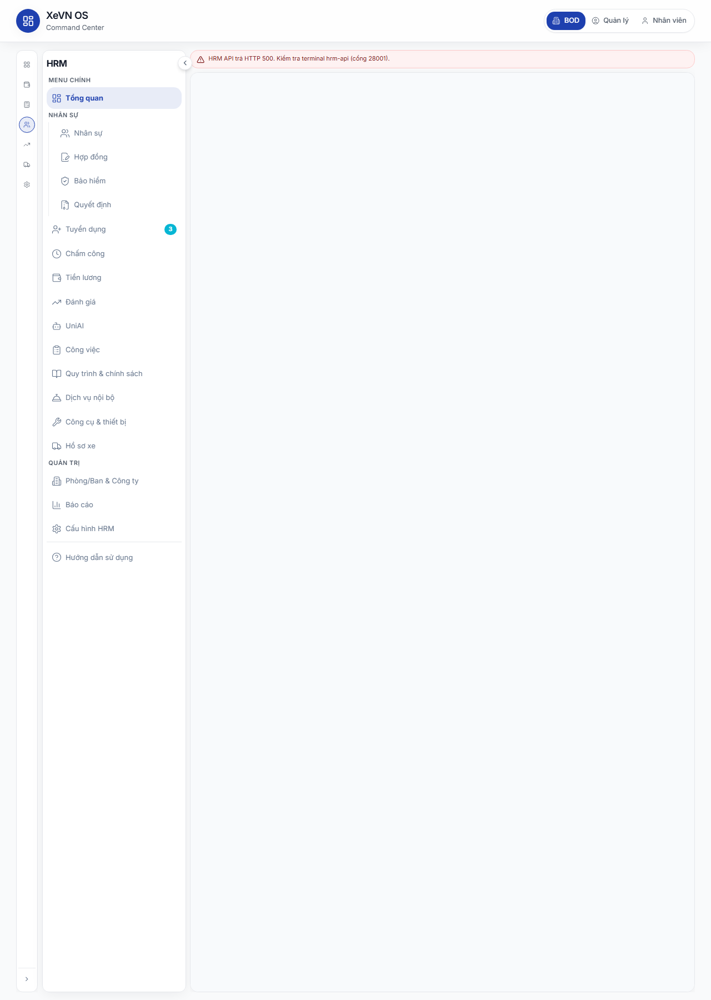

# Chương 2 — Đăng nhập, phiên làm việc & Command Center

| Thuộc tính | Giá trị |
|------------|---------|
| **Mã chương** | XEVN/HDSD-OS-CH02 |
| **Phiên bản** | 1.0 (Markdown — chưa ảnh) |
| **Ngày hiệu lực** | 30/07/2026 |
| **Phạm vi** | Cổng Web — đăng nhập, phiên, Bảng điều khiển Tập đoàn, chuyển sang phân hệ Nhân sự (HRM embed) |

---

## 2.1 Màn hình Đăng nhập Cổng

### Mục đích & phân quyền

- **Mục đích:** Xác thực người dùng trước khi vào Command Center hoặc các route được bảo vệ của Cổng Web.
- **Persona:** Mọi vai trò (Ban điều hành tập đoàn, CEO/HR công ty thành viên, quản lý, nhân viên có tài khoản portal).
- **Quyền:** Không cần đăng nhập trước; sau đăng nhập thành công, phạm vi dữ liệu phụ thuộc tài khoản và membership được cấp.

### Cách vào

| Bước | Thao tác |
|------|----------|
| 1 | Mở trình duyệt, truy cập địa chỉ Cổng Web (ví dụ môi trường nghiệm thu). |
| 2 | Hệ thống tự chuyển tới **`/login`** nếu chưa có phiên hợp lệ. |
| 3 | Nhập **Email** và **Mật khẩu**, bấm **Đăng nhập**. |
| 4 | Sau khi thành công, tự chuyển tới **`/command-center`** (hoặc trang đích nếu trước đó bị chặn và có tham số quay lại). |

**Tài khoản tham chiếu nghiệm thu**

| Vai trò | Email | Mật khẩu | Ghi chú |
|---------|-------|----------|---------|
| CEO tập đoàn | `ceo@xe.vn` | `Xevn@2026` | Xem rollup toàn tập đoàn, đủ menu Cài đặt XBOS |
| CEO công ty thành viên | `du-lich.ceo@xe.vn` | `Xevn@2026` | Phạm vi một công ty; một số widget rollup tập đoàn có thể bị giới hạn |

[Hình 2.1 — Màn Đăng nhập Cổng: logo XeVN, trường Email/Mật khẩu, nút Đăng nhập]

### Bảng Nút & chức năng

| Nút / vùng | Vị trí | Chức năng |
|------------|--------|-----------|
| **Email** | Form đăng nhập | Nhập địa chỉ email tài khoản (bắt buộc, định dạng email). |
| **Mật khẩu** | Form đăng nhập | Nhập mật khẩu (bắt buộc, ẩn ký tự). |
| **Đăng nhập** | Cuối form | Gửi xác thực; trong lúc xử lý hiển thị *Đang đăng nhập…* và nút bị khóa tạm thời. |
| Thông báo lỗi (banner đỏ) | Dưới form | Hiện khi sai thông tin hoặc lỗi kết nối; mô tả ngắn bằng tiếng Việt. |

### Bảng Hộp thoại — các trường

| Trường | Bắt buộc | Kiểu | Quy tắc / gợi ý |
|--------|----------|------|-----------------|
| Email | Có | Email | Không dấu cách đầu/cuối; hệ thống chuẩn hóa chữ thường khi gửi. |
| Mật khẩu | Có | Mật khẩu | Phân biệt hoa/thường. |

*Màn hình đăng nhập không có hộp thoại popup riêng — toàn bộ nhập liệu trên form chính.*

### Bảng Cột danh sách

Không áp dụng (màn form đăng nhập, không có bảng danh sách).

### Trạng thái nghiệp vụ

| Trạng thái | Ý nghĩa | Hiển thị |
|------------|---------|----------|
| Chưa đăng nhập | Chưa có phiên | Form trống hoặc giá trị mặc định dev; nút **Đăng nhập** sẵn sàng. |
| Đang xử lý | Gọi API xác thực | Nút **Đang đăng nhập…**, không gửi lại được. |
| Đã đăng nhập | Phiên hợp lệ | Tự chuyển hướng khỏi `/login` tới Command Center hoặc trang đích. |
| Lỗi xác thực | Sai email/mật khẩu hoặc lỗi hệ thống | Banner đỏ dưới form; vẫn ở màn đăng nhập. |

### Lỗi thường gặp

| Triệu chứng | Nguyên nhân thường gặp | Cách xử lý |
|-------------|------------------------|------------|
| Banner *Đăng nhập thất bại* | Sai email hoặc mật khẩu | Kiểm tra Caps Lock; dùng đúng tài khoản vai trò. |
| Trang trắng / không tải | Cổng Web chưa chạy | Liên hệ IT bật dịch vụ Cổng; thử tải lại trang. |
| Vào `/login` lặp lại sau khi vào CC | Phiên hết hạn hoặc bị từ chối | Đăng nhập lại; nếu lặp lại ngay, kiểm tra đồng hồ máy và cookie trình duyệt. |
| Không chuyển tới trang mong muốn | Tham số quay lại không hợp lệ | Hệ thống mặc định đưa về Command Center. |

---

## 2.2 Phiên làm việc & bảo vệ route

### Mục đích & phân quyền

- **Mục đích:** Duy trì phiên đăng nhập an toàn; chỉ người đã xác thực mới mở được Command Center, HRM embed và các màn `/dashboard/*`.
- **Persona:** Mọi user đã đăng nhập.
- **Quyền:** Route `/command-center`, `/command-center/hrm/*`, `/dashboard/*` yêu cầu phiên hợp lệ; hết phiên → quay lại **Đăng nhập** kèm đường dẫn quay lại (nếu có).

### Cách vào

| Tình huống | Hành vi hệ thống |
|------------|------------------|
| Mở URL Command Center khi chưa đăng nhập | Chuyển tới `/login?redirect=…` |
| Đang tải phiên | Màn giữa *Đang tải phiên…* |
| Phiên còn hiệu lực | Vào thẳng nội dung yêu cầu |
| Mở HRM embed từ bookmark `/command-center/hrm/employees` | Cùng luồng bảo vệ; sau login quay lại route HRM |

[Hình 2.2 — Màn chờ *Đang tải phiên…* khi khôi phục phiên]

### Bảng Nút & chức năng

| Nút / vùng | Vị trí | Chức năng |
|------------|--------|-----------|
| *(Không có nút trên màn chờ)* | Toàn màn hình | Hệ thống tự kiểm tra token; user chờ hoặc bị chuyển login. |

*Đăng xuất:* trên layout **Dashboard** (sidebar chính), mở menu hồ sơ góc phải → **Đăng xuất** (kết thúc phiên và về `/login`). Command Center dùng header riêng; khi cần kết thúc phiên, quay lại màn đăng nhập qua menu hồ sơ trên các layout có **TopHeader** hoặc xóa phiên trình duyệt theo quy trình IT.

### Bảng Hộp thoại — các trường

Không áp dụng.

### Bảng Cột danh sách

Không áp dụng.

### Trạng thái nghiệp vụ

| Trạng thái | Ý nghĩa |
|------------|---------|
| `loading` | Đang đọc phiên lưu |
| `authenticated` | Cho phép render Command Center / Dashboard |
| `unauthenticated` | Chuyển hướng login |

### Lỗi thường gặp

| Triệu chứng | Nguyên nhân | Cách xử lý |
|-------------|-------------|------------|
| *Đang tải phiên…* kéo dài | API xác thực không phản hồi | Kiểm tra API tập đoàn; tải lại trang. |
| Bị đẩy về login khi F5 | Token hết hạn | Đăng nhập lại. |
| Vào được nhưng dữ liệu trống / 403 | Membership không khớp scope | Dùng đúng tài khoản vai trò; CEO thành viên không dùng tài khoản tập đoàn cho thao tác công ty khác. |

---

## 2.3 Command Center — Tổng quan (GROUP)

### Mục đích & phân quyền

- **Mục đích:** Bảng điều khiển tập đoàn — theo dõi việc cần xử lý, KPI rollup, cảnh báo và thẻ hành động (Action Cards) theo phân hệ.
- **Persona chính:** Ban điều hành (BOD), quản lý tập đoàn (`ceo@xe.vn`).
- **Quyền:** Phân hệ trên thanh rail bị khóa nếu persona demo không đủ quyền (*Bạn không có quyền truy cập phân hệ này*).

### Cách vào

| Bước | Thao tác |
|------|----------|
| 1 | Đăng nhập thành công → mặc định **`/command-center`**. |
| 2 | Trên **thanh rail trái**, chọn icon **GROUP** (nhãn *GROUP*) — module *Tập đoàn*. |
| 3 | Nội dung chính hiển thị 3 widget trên + khu **Action Cards** bên dưới. |

**Đường dẫn:** `/command-center`

[Hình 2.3 — Command Center: header XeVN OS, chọn persona BOD/Quản lý/Nhân viên, rail phân hệ, 3 widget và Action Cards]

### Bảng Nút & chức năng

| Nút / vùng | Vị trí | Chức năng |
|------------|--------|-----------|
| **BOD** | Header phải | Chọn persona demo Ban điều hành; tải lại CC về tổng quan GROUP. |
| **Quản lý** | Header phải | Persona demo quản lý. |
| **Nhân viên** | Header phải | Persona demo nhân viên; KPI widget có thể hiển thị *KPI cá nhân*. |
| **GROUP** | Rail trái | Về tổng quan Command Center (module tập đoàn). |
| **TÀI CHÍNH** | Rail | Chuyển module (route dashboard khách hàng) — có thể khóa theo persona. |
| **KẾ TOÁN** | Rail | Chuyển module KPI kế toán. |
| **NHÂN SỰ** | Rail | **Chuyển sang HRM embed** (mục 2.5). |
| **KINH DOANH** | Rail | Module kinh doanh. |
| **VẬN HÀNH** | Rail | Module tổ chức/vận hành. |
| **CÀI ĐẶT HỆ THỐNG** | Rail | Mở workspace **Cài đặt XBOS** (Chương 3). |
| Nút thu/mở rail | Dưới cùng rail | Thu gọn rail còn icon hoặc mở rộng nhãn phân hệ. |
| **Tất cả** | Action Cards — bộ lọc | Lọc thẻ việc mọi phân hệ; ở lại CC overview. |
| **TÀI CHÍNH / KẾ TOÁN / KINH DOANH / VẬN HÀNH** | Bộ lọc Action Cards | Lọc thẻ theo phân hệ tương ứng. |
| **NHÂN SỰ** | Bộ lọc Action Cards | Lọc thẻ HRM **và** chuyển sang HRM embed (dashboard). |
| **Mở chi tiết** | Từng Action Card | Mở drawer chi tiết nhiệm vụ hộp thư workflow. |
| **Xử lý nhanh** | Từng Action Card | Hoàn thành nhanh bước workflow (khi hộp thư tải từ engine thật). |

### Bảng Hộp thoại — các trường

**Drawer Chi tiết nhiệm vụ (Workflow Task Detail)**

| Trường / vùng | Mô tả |
|---------------|-------|
| Tiêu đề nhiệm vụ | Tên việc cần xử lý |
| Phân hệ / module | Nguồn hệ thống và mã module |
| Người nhận | Tên người được gán |
| Hạn xử lý | Ngày giờ (định dạng hiển thị theo locale Việt Nam) |
| **Duyệt** / **Từ chối** | Nút hành động trên drawer (khi API workflow sẵn sàng) |
| **Đóng** | Đóng drawer |

### Bảng Cột danh sách

**Widget Việc cần xử lý** — không phải bảng; hiển thị tổng số và chip theo phân hệ: TÀI CHÍNH, KẾ TOÁN, KINH DOANH, NHÂN SỰ, VẬN HÀNH.

**Action Cards (danh sách thẻ)**

| Cột / thành phần | Ý nghĩa |
|------------------|---------|
| Nhãn ưu tiên | Mức ưu tiên (cao / trung bình / thấp — hiển thị bằng màu) |
| Nguồn · Module | Hệ thống phát sinh và mã phân hệ |
| Tiêu đề | Tên việc |
| Phụ đề | Mô tả phụ (nếu có) |
| Người nhận · Hạn | Người được gán và thời hạn |

### Trạng thái nghiệp vụ

| Trạng thái | Ý nghĩa | Hiển thị |
|------------|---------|----------|
| Việc đang xử lý | Task workflow chưa hoàn thành | Đếm trong widget và xuất hiện trong Action Cards |
| Không có việc | Inbox trống trong phạm vi | *Không có việc cần xử lý trong phạm vi hiện tại.* |
| KPI có dữ liệu | API KPI rollup thành công | Phần trăm + biểu đồ sparkline |
| KPI lỗi | API KPI fail | Banner cảnh báo tải KPI |
| Cảnh báo `critical` / `warn` / `info` | Mức độ cảnh báo hệ thống | Icon và màu tương ứng trong widget Cảnh báo |
| Hộp thư chưa tải API | Workflow engine down | Nút **Mở chi tiết** / **Xử lý nhanh** bị chặn kèm lý do |

### Lỗi thường gặp

| Triệu chứng | Nguyên nhân | Cách xử lý |
|-------------|-------------|------------|
| Banner *Không tải được dữ liệu tổng quan* | API workspace meta lỗi | Tải lại trang; kiểm tra API tập đoàn. |
| KPI *—* hoặc banner rollup | CEO thành viên hoặc scope không đủ | Dùng tài khoản tập đoàn; kiểm tra phạm vi công ty. |
| Action Cards trống có gợi ý engine | Chưa có task workflow thật | Tạo luồng duyệt từ FE (Chương 4) hoặc liên hệ quản trị. |
| **Xử lý nhanh** bị khóa | Inbox đang dùng dữ liệu fallback | Bật workflow-engine; không dùng dữ liệu giả lập cho nghiệm thu. |
| Rail phân hệ mờ / không bấm được | Persona demo không đủ quyền | Chọn **BOD** hoặc đăng nhập tài khoản đủ quyền. |

---

## 2.4 Chuyển phân hệ trên rail (tóm tắt)

| Rail | Nhãn | Kết quả |
|------|------|---------|
| GROUP | GROUP | `/command-center` — tổng quan |
| NHÂN SỰ | NHÂN SỰ | `/command-center/hrm/dashboard` — HRM embed |
| CÀI ĐẶT HỆ THỐNG | CÀI ĐẶT HỆ THỐNG | Command Center — sidebar Cài đặt (Chương 3) |
| Khác | TÀI CHÍNH, KẾ TOÁN, … | Route dashboard tương ứng (`/dashboard/...`) |

[Hình 2.4 — Thanh rail phân hệ: icon GROUP, NHÂN SỰ, CÀI ĐẶT HỆ THỐNG]

---

## 2.5 Nhúng HRM — chuyển tab & menu

### Mục đích & phân quyền

- **Mục đích:** Làm việc với phân hệ Nhân sự (danh sách nhân viên, chấm công, lương, …) ngay trong Command Center qua iframe HRM, không rời shell tập đoàn.
- **Persona:** CEO tập đoàn, HRBP, HCNS — theo phạm vi membership và ma trận quyền (Chương 3).
- **Quyền:** Rail **NHÂN SỰ** có thể bị khóa với persona **Nhân viên** demo.

### Cách vào

| Bước | Thao tác |
|------|----------|
| 1 | Tại Command Center, bấm icon **NHÂN SỰ** trên rail trái **hoặc** bấm **NHÂN SỰ** trong bộ lọc Action Cards. |
| 2 | URL chuyển dạng **`/command-center/hrm/<menu>`** — mặc định **`/command-center/hrm/dashboard`**. |
| 3 | Bên trái xuất hiện **menu sidebar HRM**; vùng phải là **iframe** ứng dụng HRM. |
| 4 | Bấm mục menu (vd. **Nhân sự**, **Chấm công**) để đổi tab — URL portal cập nhật tương ứng. |

**Ví dụ route embed**

| Menu sidebar | Route portal |
|--------------|--------------|
| Tổng quan | `/command-center/hrm/dashboard` |
| Nhân sự | `/command-center/hrm/employees` |
| Hợp đồng | `/command-center/hrm/contracts` |
| Chấm công | `/command-center/hrm/attendance` |
| Tiền lương | `/command-center/hrm/payroll` |
| Cấu hình HRM | `/command-center/hrm/settings` |

[Hình 2.5 — Layout HRM embed: sidebar menu HRM, iframe nội dung, banner đồng bộ API HRM nếu lỗi]

### Bảng Nút & chức năng

| Nút / vùng | Vị trí | Chức năng |
|------------|--------|-----------|
| **NHÂN SỰ** (rail) | Rail Command Center | Vào HRM embed — dashboard. |
| **Thu gọn menu HRM** / **Mở menu HRM** | Cạnh sidebar HRM | Thu sidebar còn icon hoặc mở rộng nhãn. |
| **Mở menu HRM** (mobile) | Trên cùng vùng embed | Overlay menu trên màn nhỏ. |
| **Tổng quan** | Sidebar HRM | Tab dashboard HRM. |
| **Nhân sự** | Sidebar | Danh sách nhân viên. |
| **Hợp đồng** | Sidebar | Hợp đồng lao động. |
| **Bảo hiểm** | Sidebar | Bảo hiểm xã hội. |
| **Quyết định** | Sidebar | Quyết định nhân sự. |
| **Tuyển dụng** | Sidebar | Module tuyển dụng (có thể có badge số). |
| **Chấm công** | Sidebar | Chấm công & nghỉ phép. |
| **Tiền lương** | Sidebar | Bảng lương. |
| **Đánh giá** | Sidebar | Hiệu suất. |
| **UniAI** | Sidebar | Trợ lý AI (nếu bật). |
| **Công việc** | Sidebar | Quản lý công việc. |
| **Quy trình & chính sách** | Sidebar | Thư viện quy trình. |
| **Dịch vụ nội bộ** | Sidebar | DVC nội bộ. |
| **Công cụ & thiết bị** | Sidebar | CCDC. |
| **Hồ sơ xe** | Sidebar | Fleet. |
| **Phòng/Ban & Công ty** | Sidebar (Admin) | Thông tin công ty / headcount. |
| **Báo cáo** | Sidebar | Báo cáo HRM. |
| **Cấu hình HRM** | Sidebar | Danh mục HRM. |
| **Hướng dẫn** | Sidebar | Hướng dẫn in-app. |
| **GROUP** (rail) | Rail | Quay lại tổng quan CC. |

### Bảng Hộp thoại — các trường

Các form chi tiết (thêm/sửa nhân viên, phiếu nghỉ, …) nằm **bên trong iframe HRM** — mô tả đầy đủ tại các chương HRM (5–11). Ở chương này chỉ ghi nhận: mọi hộp thoại tuân validation và định dạng ngày **dd/MM/yyyy**, số tiền có nhóm nghìn khi nhập.

### Bảng Cột danh sách

Phụ thuộc từng màn HRM trong iframe (xem chương tương ứng). Khi chuyển tab sidebar, iframe tải lại hoặc điều hướng mềm tùy menu — sau thao tác **Lưu** trên iframe nên **F5** hoặc mở lại tab để xác nhận dữ liệu còn.

### Trạng thái nghiệp vụ

| Trạng thái | Ý nghĩa |
|------------|---------|
| Iframe đang tải | Overlay *Đang tải…* trên vùng embed |
| Iframe lỗi / API HRM down | Banner **HRM API Sync ERROR** hoặc tương đương trên shell |
| Scope sẵn sàng | Menu HRM tải đúng công ty theo membership |
| Scope lỗi | Thông báo không xác định được phạm vi — không render iframe |

### Lỗi thường gặp

| Triệu chứng | Nguyên nhân | Cách xử lý |
|-------------|-------------|------------|
| Banner đồng bộ HRM / danh sách 0 NV | API HRM không chạy | IT bật dịch vụ HRM; tải lại trang. |
| Click **Tuyển dụng** nhưng iframe vẫn ở Chấm công | Điều hướng mềm chậm | Đợi vài giây; F5; thử bấm lại menu. |
| HTTP 409 phạm vi công ty | Token scope lệch công ty | Chọn đúng membership; đăng nhập lại. |
| Menu HRM trống / 404 | Route embed sai | Dùng menu sidebar, không gõ URL tay lệch chuẩn. |

---

## 2.6 Liên kết kịch bản nghiệm thu

| Mã kịch bản | Nội dung liên quan chương 2 |
|-------------|----------------------------|
| UF-XBOS-01 | Đăng nhập → vào Command Center; widget Việc cần xử lý & KPI |
| UF-XBOS-10 | KPI dashboard rollup trên CC |
| UF-XBOS-11 | CEO thành viên — giới hạn rollup (kịch bản âm) |
| UF-HRM-* | Các tab HRM embed (chương 5–11) |

---

*Hết Chương 2 — Phase 1 Markdown, placeholder ảnh Phase 2.*
