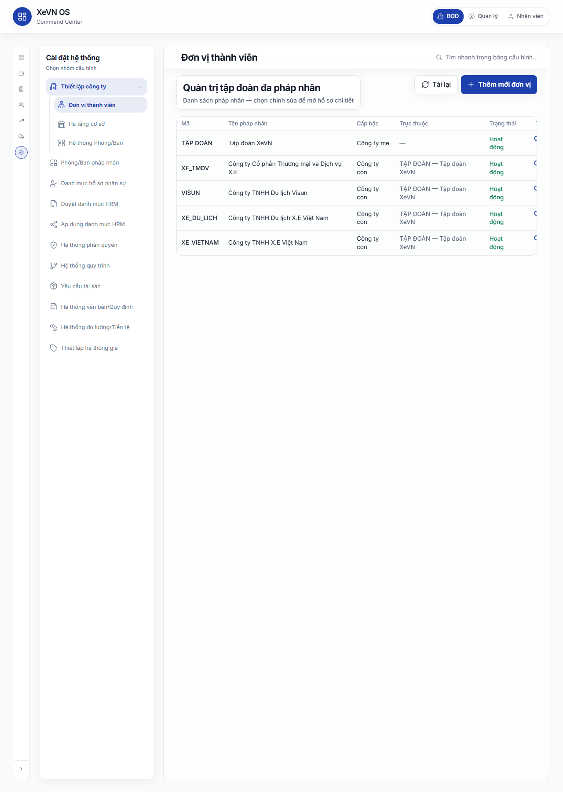
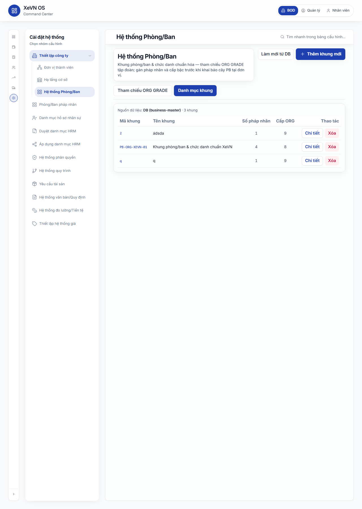
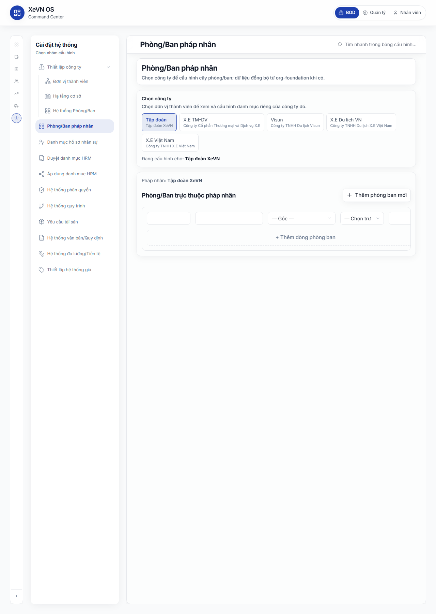
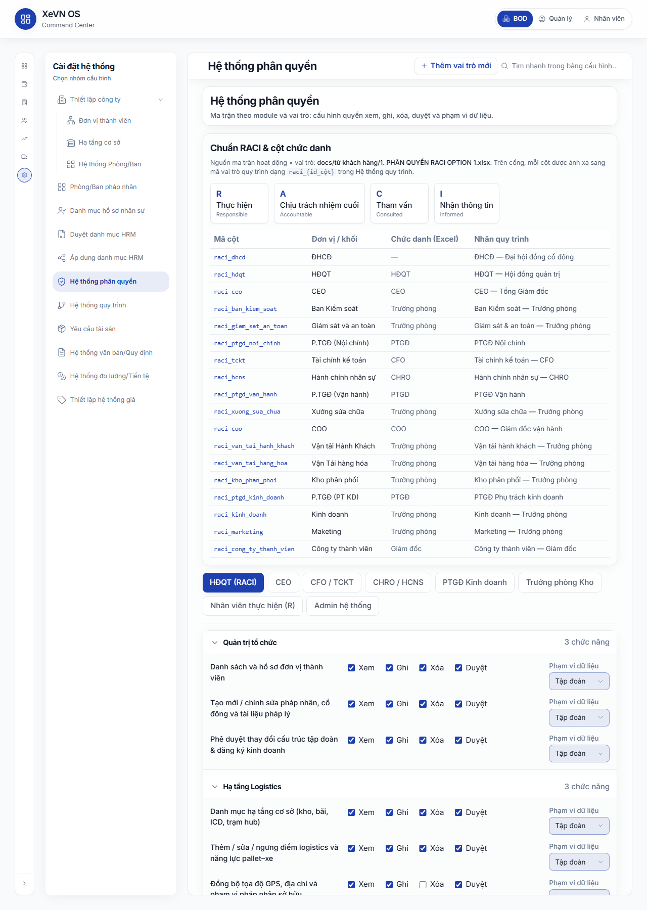
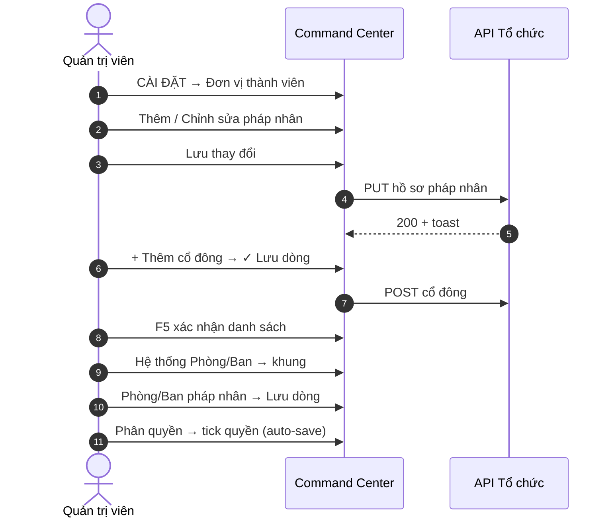

# Chương 3 — Cài đặt tập đoàn: Tổ chức & pháp nhân (XBOS)

| Thuộc tính | Giá trị |
|------------|---------|
| **Mã chương** | XEVN/HDSD-OS-CH03 |
| **Phiên bản** | 1.0 (Markdown — chưa ảnh) |
| **Ngày hiệu lực** | 30/07/2026 |
| **Phạm vi** | Command Center → **Cài đặt hệ thống** — đơn vị thành viên, hồ sơ pháp nhân, cổ đông, phòng ban, phân quyền |

---

## 3.0 Khung Cài đặt hệ thống (shell chung)

### Mục đích & phân quyền

- **Mục đích:** Cấu hình tổ chức đa pháp nhân, khung phòng ban, ma trận quyền và các danh mục nền tập đoàn.
- **Persona:** CEO tập đoàn, Quản trị hệ thống, HCNS cấp tập đoàn (`ceo@xe.vn`).
- **Quyền:** CEO công ty thành viên thường **không** sửa rollup tập đoàn; thao tác trong phạm vi công ty mình (có thể bị 403/409 trên API rollup).

### Cách vào

| Bước | Thao tác |
|------|----------|
| 1 | Đăng nhập → Command Center. |
| 2 | Trên **rail trái**, bấm icon **CÀI ĐẶT HỆ THỐNG** (bánh răng). |
| 3 | **Sidebar trái** hiện nhóm **Cài đặt hệ thống** — chọn mục con (Đơn vị thành viên, Phòng/Ban, Phân quyền, …). |
| 4 | Nội dung cấu hình hiển thị vùng phải; thanh trên có **Tìm nhanh trong bảng cấu hình…** |

**Đường dẫn gốc:** `/command-center` (module Cài đặt — không đổi path URL khi đổi menu con; deep link có thể dùng query `?settings=…`).

### Bảng Nút & chức năng (shell)

| Nút / vùng | Vị trí | Chức năng |
|------------|--------|-----------|
| **CÀI ĐẶT HỆ THỐNG** | Rail CC | Mở workspace cài đặt. |
| **Thiết lập công ty** (nhóm) | Sidebar | Mở/đóng nhóm con: Đơn vị thành viên, Hạ tầng, Hệ thống Phòng/Ban. |
| **Đơn vị thành viên** | Sidebar con | Mục 3.1–3.3 |
| **Hệ thống Phòng/Ban** | Sidebar con | Mục 3.4 |
| **Phòng/Ban pháp nhân** | Sidebar | Mục 3.5 |
| **Hệ thống phân quyền** | Sidebar | Mục 3.6 |
| **Tìm nhanh trong bảng cấu hình…** | Header workspace | Lọc nhanh trong bảng đang mở (focus ô tìm). |
| **Thêm vai trò mới** | Header (khi mở Phân quyền) | Thêm tab vai trò RBAC. |
| **Quay lại danh sách pháp nhân** | Header (khi sửa pháp nhân) | Về list đơn vị. |

### Bảng Hộp thoại — các trường

Shell không có dialog riêng — dialog thuộc từng màn con (mục dưới).

### Bảng Cột danh sách

Theo từng menu con.

### Trạng thái nghiệp vụ

| Trạng thái | Ý nghĩa |
|------------|---------|
| Đang tải cấu hình | Overlay *Đang tải cấu hình…* khi chuyển menu |
| Banner API | Cảnh báo health API XBOS/HRM trên vùng làm việc |
| Thông báo publish (xám/xanh) | Phản hồi sau Lưu / đồng bộ |

### Lỗi thường gặp

| Triệu chứng | Cách xử lý |
|-------------|------------|
| Bảng trống *Chưa có dữ liệu — kiểm tra XBOS API* | Bật API tập đoàn; tải lại; kiểm tra quyền token `main`. |
| Banner vàng trên menu | Đọc nội dung — thường là chưa lưu bước trước. |

---

## 3.1 Danh sách đơn vị thành viên

### Mục đích & phân quyền

- **Mục đích:** Xem và quản trị danh sách pháp nhân trong tập đoàn (công ty mẹ, công ty con, liên kết).
- **Persona:** CEO tập đoàn, pháp chế tập đoàn.
- **Quyền:** Xem danh sách; **Chỉnh sửa** mở hồ sơ chi tiết; **Thêm mới đơn vị** tạo pháp nhân mới.

### Cách vào

**Command Center** → **CÀI ĐẶT HỆ THỐNG** → **Thiết lập công ty** → **Đơn vị thành viên**

### Bảng Nút & chức năng

| Nút | Chức năng |
|-----|-----------|
| **Tải lại** | Gọi lại API danh sách đơn vị thành viên. |
| **Thêm mới đơn vị** | Mở form **Thêm pháp nhân mới**. |
| **Chỉnh sửa** (từng dòng) | Mở hồ sơ pháp nhân của dòng đó. |

### Bảng Hộp thoại — các trường

Không có dialog — thao tác chuyển sang màn form (3.2).

### Bảng Cột danh sách

| Cột | Ý nghĩa |
|-----|---------|
| **Mã** | Mã pháp nhân (hiển thị dạng số/mã nội bộ) |
| **Tên pháp nhân** | Tên đầy đủ |
| **Cấp bậc** | Công ty mẹ / Công ty con / Công ty liên kết |
| **Trực thuộc** | Pháp nhân cấp trên (nếu có) |
| **Trạng thái** | **Hoạt động** hoặc **Ngừng** |
| **Thao tác** | Liên kết **Chỉnh sửa** |

### Trạng thái nghiệp vụ

| Giá trị cột Trạng thái | Ý nghĩa |
|------------------------|---------|
| Hoạt động (`active`) | Pháp nhân đang vận hành |
| Ngừng (khác active) | Ngừng sử dụng trên danh mục |

### Lỗi thường gặp

| Triệu chứng | Cách xử lý |
|-------------|------------|
| *Đang tải đơn vị thành viên…* kéo dài | Kiểm tra API XBOS; bấm **Tải lại**. |
| Danh sách trống | Xác nhận dữ liệu tổ chức đã khởi tạo trên môi trường. |
| Không thấy **Chỉnh sửa** | Kiểm tra quyền ma trận *Danh sách và hồ sơ đơn vị thành viên* (3.6). |

**Kịch bản nghiệm thu:** UF-XBOS-02 (chọn / xem đơn vị thành viên).

---

## 3.2 Hồ sơ pháp nhân — form chi tiết

### Mục đích & phân quyền

- **Mục đích:** Khai báo và cập nhật hồ sơ pháp nhân theo Giấy chứng nhận ĐKKD; quản lý cổ đông và tài liệu pháp lý trên cùng màn.
- **Persona:** CEO tập đoàn, pháp chế.
- **Quyền:** Sửa trường hồ sơ; **Lưu thay đổi** ghi API; tab **Nhiệm vụ & RACI** sau khi đã lưu pháp nhân.

### Cách vào

Từ **3.1** → **Chỉnh sửa** hoặc **Thêm mới đơn vị**.

Tab trên form:

| Tab | Nội dung |
|-----|----------|
| **Hồ sơ pháp nhân** | Form + cổ đông + tài liệu |
| **Nhiệm vụ & RACI** | Ma trận RACI đơn vị (sau khi lưu) |

### Bảng Nút & chức năng

| Nút | Vị trí | Chức năng |
|-----|--------|-----------|
| **Quay lại danh sách pháp nhân** | Header | Về list 3.1 |
| **Thêm mới đơn vị** | Góc form | Tạo pháp nhân khác (không rời workspace) |
| Tab **Hồ sơ pháp nhân** | Tab | Form chính |
| Tab **Nhiệm vụ & RACI** | Tab | RACI (cần đã lưu) |
| **Cấu hình khối & trường hạ tầng** | Thanh dưới | Mở modal cấu hình hạ tầng (sau khi có ID pháp nhân) |
| **Lưu thay đổi** | Thanh dưới (primary) | Ghi toàn bộ hồ sơ pháp nhân |
| **+ Thêm cổ đông** | Khối Cổ đông | Thêm dòng cổ đông |
| **Xóa đã chọn (n)** | Khối Cổ đông | Xóa các dòng đã tick checkbox |
| **✓ Lưu cổ đông** (icon) | Từng dòng cổ đông | Lưu một cổ đông |
| **Xóa cổ đông** (icon) | Từng dòng | Xóa một cổ đông |
| **+ Thêm tài liệu** | Khối Tài liệu | Thêm dòng tài liệu pháp lý |
| **Upload** (icon) | Cột File | Chọn file (.pdf, .doc, .xls, …) |
| **Xem file** (icon) | Cột File | Mở/xem file đã upload |
| **✓ Lưu tài liệu** | Từng dòng tài liệu | Lưu metadata + file |
| **Xóa tài liệu** | Từng dòng | Xóa dòng tài liệu |

### Bảng Hộp thoại — các trường

**Khối Cấu trúc & Phân cấp**

| Trường | Bắt buộc | Ghi chú |
|--------|----------|---------|
| Cấp bậc thực thể | Có | Công ty mẹ / Công ty con / Công ty liên kết |
| Đơn vị trực thuộc | Khi không phải công ty mẹ | Tìm theo mã hoặc tên; chọn từ gợi ý |

**Khối Định danh & Trụ sở**

| Trường | Bắt buộc | Ghi chú |
|--------|----------|---------|
| Tên tiếng Việt | Có | Tên trên ĐKKD |
| Tên tiếng nước ngoài | Không | |
| Tên viết tắt | Có | VD: XEVN |
| Mã số doanh nghiệp | Có | Chỉ chữ số |
| Vốn điều lệ (VNĐ) | Có | Nhập có nhóm nghìn (vd. 500.000.000.000) |
| Nơi cấp | Không | |
| Loại hình doanh nghiệp | Có | Cổ phần / TNHH / DNNN … |
| Ngày cấp lần đầu | Không | dd/MM/yyyy |
| Mã số thuế (MST) | Có | Chỉ chữ số |
| Địa chỉ trụ sở | Không | |
| Quốc gia / Khu vực | Không | Mặc định Việt Nam |

**Khối Người đại diện**

| Trường | Ghi chú |
|--------|---------|
| Họ tên người đại diện | |
| Số định danh (CCCD) | Chỉ số |
| Chức danh | Select: Chủ tịch HĐQT, Tổng Giám đốc, … |
| Địa chỉ thường trú | |
| Số điện thoại liên hệ | Chỉ số |

**Khối Liên hệ**

| Trường | Ghi chú |
|--------|---------|
| Hotline | |
| Email công ty | |
| Website | URL |

**Dòng cổ đông (inline)**

| Trường | Ghi chú |
|--------|---------|
| Họ tên/Tên tổ chức | |
| Mã định danh | CCCD/MST tổ chức |
| Tỷ lệ (%) | Số |
| Giá trị góp vốn | VNĐ, nhóm nghìn khi nhập |

**Dòng tài liệu pháp lý**

| Trường | Ghi chú |
|--------|---------|
| Tên tài liệu | |
| Mã số | |
| Ngày cấp | dd/MM/yyyy |
| Ngày hết hạn | Đỏ nếu đã hết hạn |
| File | Upload / tên file |

### Bảng Cột danh sách

**Danh sách Cổ đông**

| Cột | Ý nghĩa |
|-----|---------|
| Checkbox | Chọn nhiều để xóa |
| Họ tên/Tên tổ chức | |
| Mã định danh | |
| Tỷ lệ (%) | |
| Giá trị góp vốn | |
| Action | Lưu / Xóa từng dòng |

**Tài liệu đính kèm**

| Cột | Ý nghĩa |
|-----|---------|
| Tên tài liệu | |
| Mã số | |
| Ngày cấp | |
| Ngày hết hạn | |
| File | Trạng thái upload / tên file |
| Action | Lưu / Xóa |

### Trạng thái nghiệp vụ

| Trạng thái | Ý nghĩa |
|------------|---------|
| Pháp nhân mới (`new`) | Chưa có ID — phải **Lưu thay đổi** trước khi upload file / RACI |
| Đã lưu | Banner xanh; có thể thêm cổ đông POST và F5 thấy dòng mới |
| Cổ đông pending | Icon ✓ đang quay khi đang lưu dòng |
| Tài liệu hết hạn | Ô ngày hết hạn viền đỏ |
| Tab RACI khóa | Thông báo *Lưu pháp nhân … trước khi cấu hình RACI* |

### Lỗi thường gặp

| Triệu chứng | Cách xử lý |
|-------------|------------|
| Viền đỏ trường + chữ lỗi nhỏ | Sửa theo validation (tên, MST, vốn điều lệ…) |
| *Chưa lưu hồ sơ pháp nhân — hãy bấm Lưu thay đổi trước khi upload* | **Lưu thay đổi** trước |
| Cổ đông không lưu được trên **TẬP ĐOÀN** | Lưu pháp nhân holding trước; F5; thử lại **✓** dòng |
| Upload *Đang tải lên…* treo | Kiểm tra kích thước/định dạng file; API lưu trữ |
| **Xem file** mờ | Chưa upload — upload và **Lưu tài liệu** trước |

**Kịch bản nghiệm thu:** UF-XBOS-03 (sửa hồ sơ + Lưu), UF-XBOS-04 / UF-XBOS-05 (thêm cổ đông đơn vị / holding), UF-XBOS-06 (tài liệu + xem file).

---

## 3.3 Tab Nhiệm vụ & RACI (trên hồ sơ pháp nhân)

### Mục đích & phân quyền

- **Mục đích:** Gán vai trò RACI (Responsible, Accountable, Consulted, Informed) theo chức danh cho từng pháp nhân.
- **Persona:** CEO tập đoàn, HCNS tập đoàn.
- **Quyền:** Chỉ sau khi pháp nhân đã lưu; sửa ô ma trận và lưu (API matrix).

### Cách vào

**3.2** → tab **Nhiệm vụ & RACI** (pháp nhân đã tồn tại).

### Bảng Nút & chức năng

| Nút / thao tác | Chức năng |
|----------------|-----------|
| Chuyển tab **Nhiệm vụ & RACI** | Mở panel RACI |
| Click ô ma trận | Đổi giá trị RACI (chu kỳ R→A→C→I→—) |
| *(Lưu tự động qua API khi đổi ô)* | Cập nhật matrix/cell |

### Bảng Hộp thoại — các trường

Không có dialog — chỉnh trực tiếp trên lưới.

### Bảng Cột danh sách

| Thành phần | Ý nghĩa |
|------------|---------|
| Hàng | Mã nhiệm vụ / mô tả nhiệm vụ RACI |
| Cột | Chức danh (HĐQT, BDH, …) |
| Ô | Giá trị R / A / C / I / trống |

### Trạng thái nghiệp vụ

| Ký hiệu | Ý nghĩa |
|---------|---------|
| R | Thực hiện |
| A | Chịu trách nhiệm |
| C | Tham vấn |
| I | Thông báo |
| — | Không gán |

### Lỗi thường gặp

| Triệu chứng | Cách xử lý |
|-------------|------------|
| Tab chỉ hiện text *Lưu pháp nhân trước…* | Quay tab **Hồ sơ** → **Lưu thay đổi** |
| Đổi ô nhưng F5 mất | Kiểm tra API matrix; quyền ghi tổ chức |
| HTTP 409 scope | Dùng tài khoản tập đoàn `main` |

**Kịch bản nghiệm thu:** UF-XBOS-07.

---

## 3.4 Hệ thống Phòng/Ban (khung tập đoàn)

### Mục đích & phân quyền

- **Mục đích:** Định nghĩa **khung phòng/ban mẫu** theo cấp ORG GRADE tập đoàn; làm nền trước khi khai báo cây phòng ban từng pháp nhân (3.5).
- **Persona:** HCNS tập đoàn, quản trị tổ chức.
- **Quyền:** Xem tham chiếu ORG GRADE; tạo/sửa/xóa khung trong **Danh mục khung**.

### Cách vào

**CÀI ĐẶT HỆ THỐNG** → **Thiết lập công ty** → **Hệ thống Phòng/Ban**

Tab:

| Tab | Nội dung |
|-----|----------|
| **Tham chiếu ORG GRADE** | Xem khung đã lưu + sơ đồ chuẩn read-only |
| **Danh mục khung** | Bảng khung — **Chi tiết** / **Xóa** |

### Bảng Nút & chức năng

| Nút | Chức năng |
|-----|-----------|
| **Làm mới từ DB** | Tải lại danh mục khung từ business-master |
| **Thêm khung mới** | Mở màn chi tiết khung trống |
| Tab **Tham chiếu ORG GRADE** | Xem sơ đồ |
| Tab **Danh mục khung** | Bảng khung |
| **Chọn khung xem trước** | Select khung đã lưu trên tab Tham chiếu |
| **Chi tiết** (từng dòng) | Sửa khung: cấp ORG, sơ đồ kéo thả chức danh |
| **Xóa** (từng dòng) | Xóa khung (confirm) |
| **Quay lại** | Từ chi tiết → danh mục |
| **Lưu khung phòng/ban** | Ghi khung + `gradeTitleLayout` |
| Checkbox **Cấp n** | Bật/tắt cấp ORG GRADE trên khung |
| **OrgGradeOrgChartEditor** | Kéo thả / CRUD chức danh theo cấp |

### Bảng Hộp thoại — các trường

**Màn Chi tiết khung**

| Trường / vùng | Ghi chú |
|---------------|---------|
| Mã khung | Mã định danh khung |
| Tên khung (Tiếng Việt) | |
| Cấp ORG GRADE bật | Checkbox cấp 1…6 |
| Sơ đồ khung | Chỉnh chức danh từng cấp |
| Pháp nhân áp dụng | Danh sách gán (khi có) |

### Bảng Cột danh sách — Danh mục khung

| Cột | Ý nghĩa |
|-----|---------|
| **Mã khung** | Mã nội bộ |
| **Tên khung** | Tên hiển thị |
| **Số pháp nhân** | Số đơn vị đang áp dụng khung |
| **Cấp ORG** | Số cấp ORG GRADE kích hoạt |
| **Thao tác** | Chi tiết · Xóa |

### Trạng thái nghiệp vụ

| Trạng thái | Ý nghĩa |
|------------|---------|
| Khung draft | Chưa **Lưu khung phòng/ban** |
| Khung đã lưu | Xuất hiện ở tab Tham chiếu — chọn xem trước |
| Nguồn DB / mock / trống | Dòng chú thích nguồn dữ liệu đầu bảng |

### Lỗi thường gặp

| Triệu chứng | Cách xử lý |
|-------------|------------|
| *Chưa có khung nào* | **Thêm khung mới** hoặc **Làm mới từ DB** |
| *Lưu pháp nhân trước khi ghi phòng ban lên org-foundation* | Hoàn tất 3.2 trước khi publish cây PB |
| Xóa khung đang được pháp nhân dùng | Kiểm tra **Số pháp nhân** > 0 — gỡ gán trước |

---

## 3.5 Phòng/Ban pháp nhân (cây theo công ty)

### Mục đích & phân quyền

- **Mục đích:** Khai báo **cây phòng ban thực tế** cho từng pháp nhân (mã PB, tên, cấp trên, trưởng bộ phận, chức năng).
- **Persona:** HR công ty / HCNS tập đoàn (theo scope).
- **Quyền:** Chọn pháp nhân trên thanh scope; thêm/sửa/xóa dòng; lưu từng dòng.

### Cách vào

**CÀI ĐẶT HỆ THỐNG** → **Phòng/Ban pháp nhân**

### Bảng Nút & chức năng

| Nút | Chức năng |
|-----|-----------|
| **Thanh chọn pháp nhân** (TenantConfigScopeBar) | Chọn công ty cần cấu hình |
| **Thêm phòng ban mới** | Thêm block dòng trống |
| **+ Thêm dòng phòng ban** | Thêm dòng ở cuối danh sách |
| **✓ Lưu dòng** | Lưu một phòng ban (API org-foundation) |
| **Xóa dòng** | Xóa phòng ban |

### Bảng Hộp thoại — các trường

Mỗi **dòng phòng ban** (inline, không popup):

| Trường | Ghi chú |
|--------|---------|
| Mã phòng ban | Mã PB |
| Tên phòng ban | Thụt lề nếu có cấp trên |
| Phòng ban cấp trên | Select — **— Gốc —** hoặc PB khác |
| Trưởng bộ phận | Select NV — *— Chọn trưởng bộ phận —* |
| Chức năng phòng ban | Mô tả ngắn |

### Bảng Cột danh sách

Layout dạng **lưới 12 cột** trên từng dòng (không phải bảng HTML cố định):

| Vùng | Ý nghĩa |
|------|---------|
| Cột 1 | Mã |
| Cột 2 | Tên (indent nếu con) |
| Cột 3 | Cấp trên |
| Cột 4 | Trưởng bộ phận |
| Cột 5 | Chức năng |
| Cột Action | Lưu / Xóa |

### Trạng thái nghiệp vụ

| Trạng thái | Ý nghĩa |
|------------|---------|
| Chưa chọn pháp nhân | Chỉ hiện scope bar — chưa có lưới |
| Đang tải NV cho Trưởng bộ phận | Khóa select trưởng |
| Dòng mới | Chưa **Lưu dòng** — chưa có trên org-foundation |
| Đã lưu | F5 vẫn còn dòng |

### Lỗi thường gặp

| Triệu chứng | Cách xử lý |
|-------------|------------|
| *Trưởng bộ phận: … — chọn trưởng bộ phận tạm thời bị khóa* | Kiểm tra API nhân viên phạm vi công ty |
| Không lưu được dòng | **Lưu pháp nhân** (3.2) trước; kiểm tra mã PB trùng |
| Cây lệch sau F5 | Lưu lại từng dòng; kiểm tra **Phòng ban cấp trên** không tạo vòng |

---

## 3.6 Hệ thống phân quyền (RBAC)

### Mục đích & phân quyền

- **Mục đích:** Cấu hình ma trận quyền **Xem / Ghi / Xóa / Duyệt** và **Phạm vi dữ liệu** theo **vai trò** và **nhóm chức năng** (Quản trị tổ chức, Logistics, Nhân sự, Hệ thống).
- **Persona:** Quản trị hệ thống tập đoàn.
- **Quyền:** Thêm vai trò; sửa checkbox và select — hệ thống **tự lưu** sau khoảng ~0,6 giây (debounce).

### Cách vào

**CÀI ĐẶT HỆ THỐNG** → **Hệ thống phân quyền**

### Bảng Nút & chức năng

| Nút / vùng | Chức năng |
|------------|-----------|
| **Thêm vai trò mới** | Thêm tab vai trò (header) |
| Tab **{Tên vai trò}** | Chọn vai trò đang sửa |
| Accordion **Quản trị tổ chức** | Mở/đóng nhóm chức năng org |
| Accordion **Hạ tầng Logistics** | Nhóm logistics |
| Accordion **Hồ sơ Nhân sự** | Nhóm HR |
| Accordion **Cấu hình hệ thống** | Nhóm system |
| Checkbox **Xem / Ghi / Xóa / Duyệt** | Bật quyền trên từng dòng chức năng |
| Select **Phạm vi dữ liệu** | Cá nhân / Phòng ban / Pháp nhân / Tập đoàn |

### Bảng Hộp thoại — các trường

Không dùng dialog — chỉnh trực tiếp trên ma trận.

**Bảng tham chiếu RACI → vai trò quy trình** (read-only phía trên):

| Cột | Ý nghĩa |
|-----|---------|
| Mã cột | Mã `raci_{id}` |
| Đơn vị / khối | Khối tổ chức |
| Chức danh (Excel) | Tên chức danh gốc |
| Nhãn quy trình | Nhãn hiển thị trên workflow |

### Bảng Cột danh sách — Ma trận quyền

Mỗi **dòng chức năng** trong accordion:

| Thành phần | Ý nghĩa |
|------------|---------|
| Tên chức năng | Mô tả nghiệp vụ (vd. *Danh sách và hồ sơ đơn vị thành viên*) |
| Xem | Quyền đọc |
| Ghi | Quyền tạo/sửa |
| Xóa | Quyền xóa |
| Duyệt | Quyền phê duyệt workflow |
| Phạm vi dữ liệu | Giới hạn phạm vi record |

**Danh sách chức năng chính (trích)**

| Nhóm | Chức năng |
|------|-----------|
| Quản trị tổ chức | Danh sách & hồ sơ đơn vị thành viên; Tạo/sửa pháp nhân, cổ đông, tài liệu; Phê duyệt thay đổi cấu trúc |
| Logistics | Danh mục hạ tầng; Sửa điểm logistics; Đồng bộ GPS/địa chỉ |
| Nhân sự | Xem hồ sơ xuyên pháp nhân; Cấu hình trường HS & xem trước biểu mẫu |
| Hệ thống | Ma trận phân quyền; Đơn vị đo & tiền tệ; Quy trình & văn bản |

### Trạng thái nghiệp vụ — Phạm vi dữ liệu

| Giá trị | Ý nghĩa |
|---------|---------|
| Cá nhân | Chỉ bản ghi gắn user |
| Phòng ban | Trong phòng ban được gán |
| Pháp nhân | Trong một công ty |
| Tập đoàn | Rollup toàn tập đoàn |

### Lỗi thường gặp

| Triệu chứng | Cách xử lý |
|-------------|------------|
| *Không lưu được ma trận phân quyền* (banner xám) | Kiểm tra API position-rbac; quyền admin |
| User không thấy menu Cài đặt | Cấp **Xem/Ghi** nhóm *Quản trị tổ chức* / *Hệ thống* |
| CEO thành viên thấy rollup KPI | Phạm vi phải **Pháp nhân** — không **Tập đoàn** |
| Đổi quyền F5 không giữ | Xem lỗi mạng tab DevTools; thử lại từng checkbox |

---

## 3.7 Tóm tắt luồng nghiệp vụ khuyến nghị

---

## 3.8 Liên kết kịch bản nghiệm thu

| Mã | Nội dung |
|----|----------|
| UF-XBOS-02 | Danh sách đơn vị thành viên |
| UF-XBOS-03 | Sửa hồ sơ pháp nhân + Lưu |
| UF-XBOS-04 | Thêm cổ đông đơn vị thành viên |
| UF-XBOS-05 | Thêm cổ đông Tập đoàn (holding) |
| UF-XBOS-06 | Tài liệu pháp lý + upload + Xem file |
| UF-XBOS-07 | Ma trận RACI member unit |
| UF-XBOS-12 | Phòng ban — thêm/sửa/xóa (org-units) |
| UF-XBOS-13 | Ma trận phân quyền Settings |

---

*Hết Chương 3 — Phase 1 Markdown, placeholder ảnh Phase 2.*
