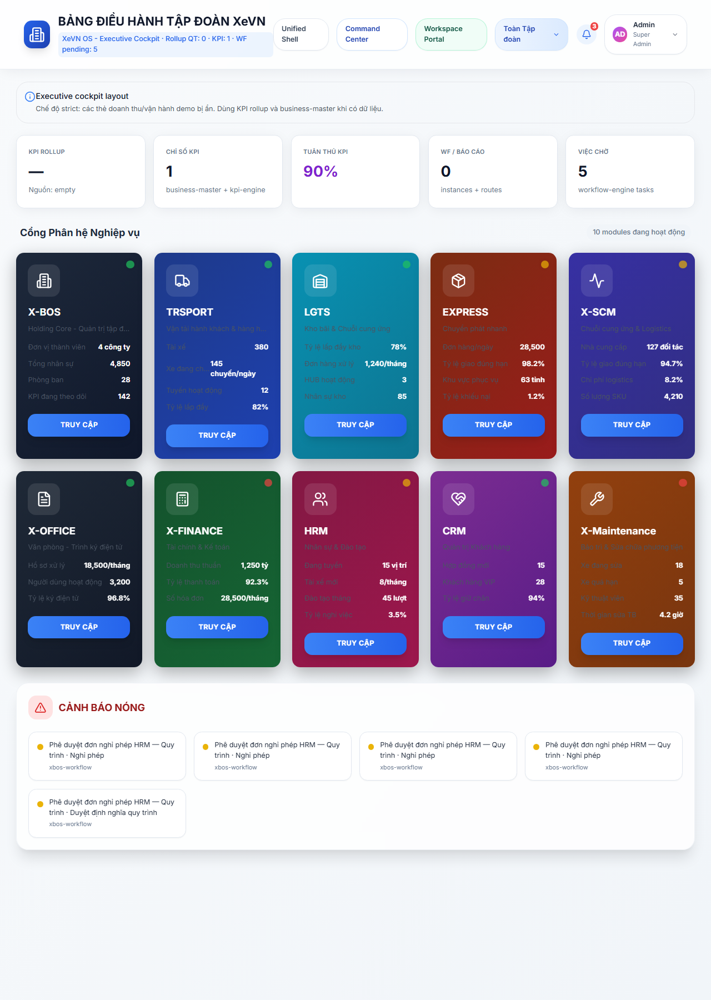
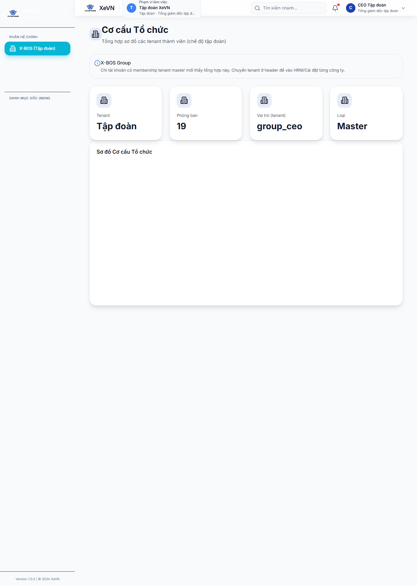
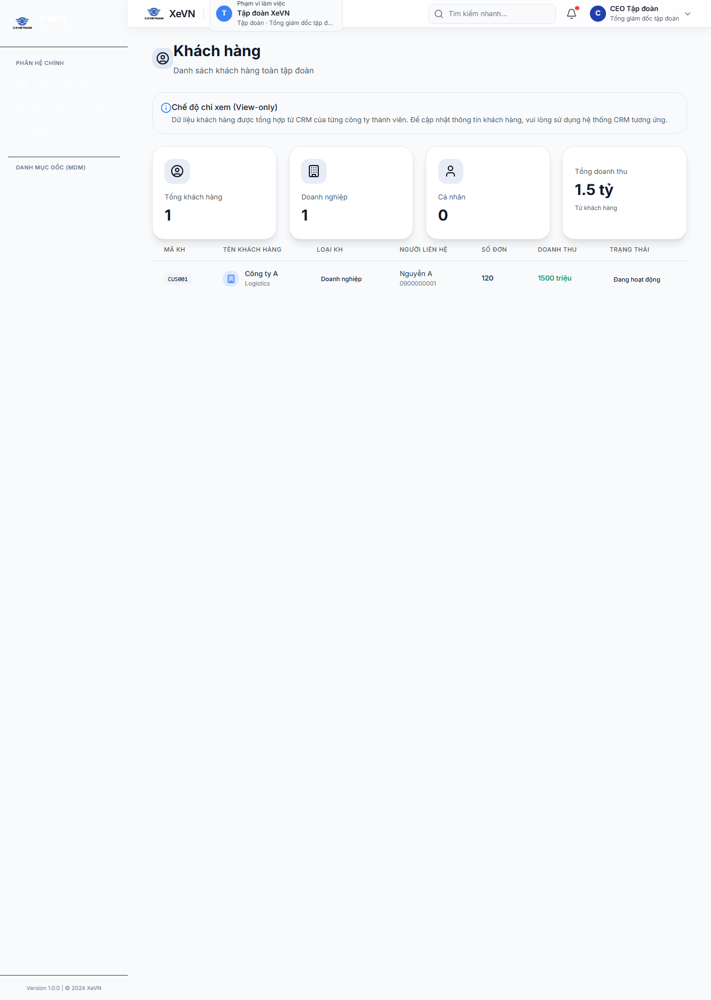
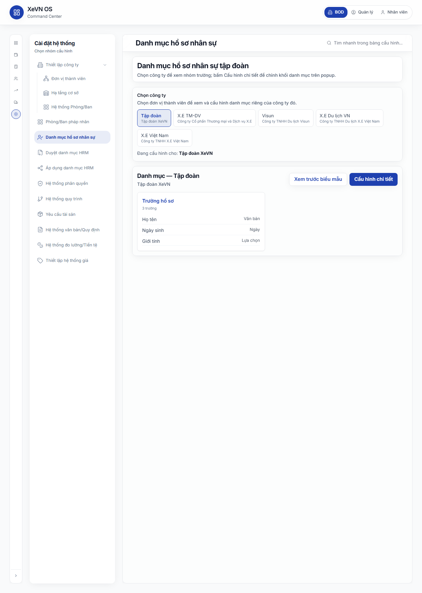
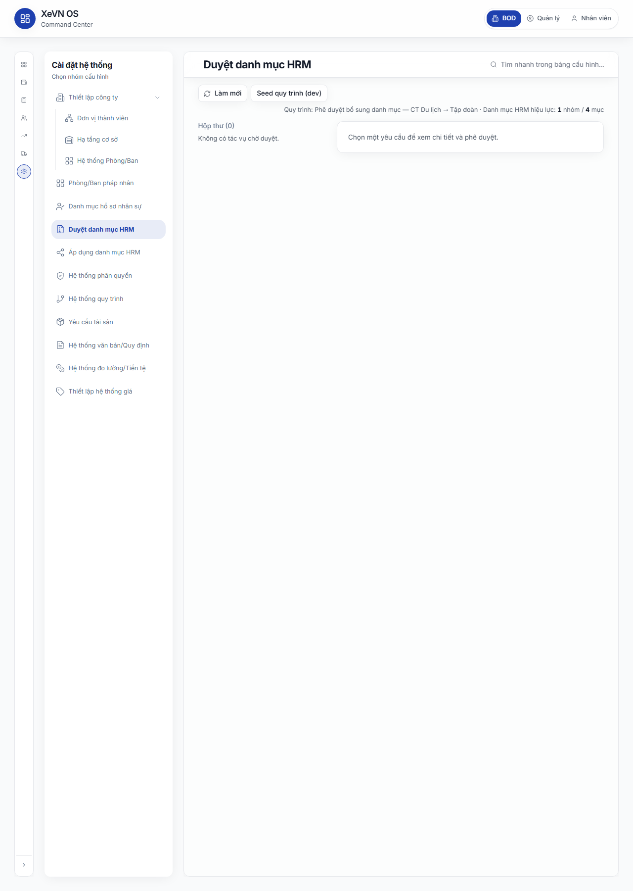
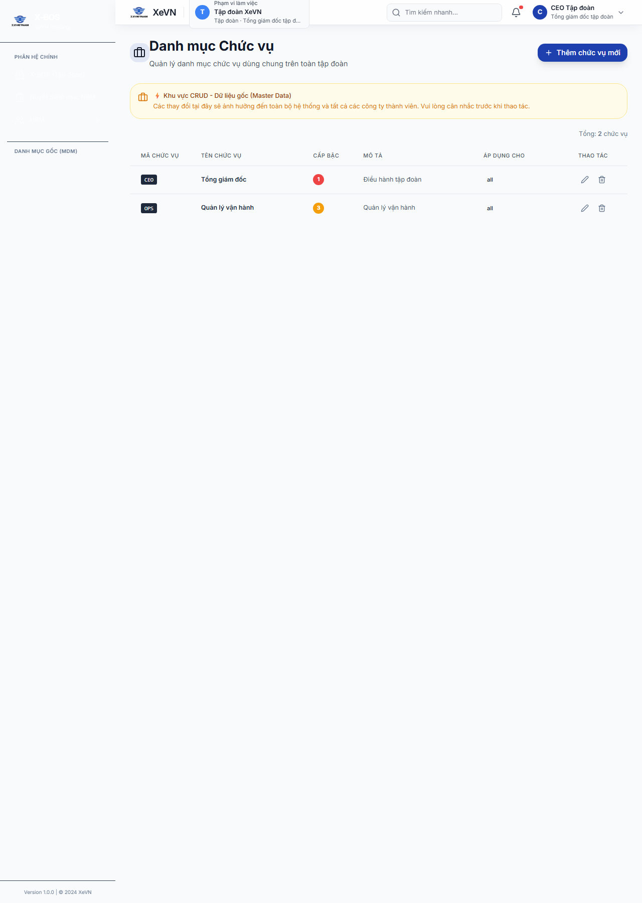
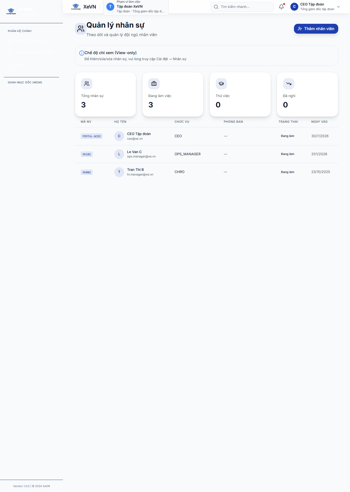

# Chương 4 — Workflow, RACI, Danh mục & KPI

| Thuộc tính | Giá trị |
|------------|---------|
| **Mã tài liệu** | XEVN/HDSD-OS-004 |
| **Phiên bản** | 1.0 |
| **Ngày hiệu lực** | 30/07/2026 |
| **Phạm vi** | Cổng Web — Command Center (XBOS) |
| **Đối tượng** | Ban điều hành tập đoàn, HR tập đoàn, Quản trị hệ thống |
| **Liên kết nghiệp vụ** | UF-XBOS-09 · UF-XBOS-10 · UF-XBOS-11 · UF-XBOS-12 |

---

## 4.1 Hộp thư Workflow (Action Cards)

### Mục đích

Tập trung các nhiệm vụ chờ xử lý từ workflow-engine (phê duyệt tuyển dụng, danh mục, đầu tư, …) trên Bảng điều khiển Tập đoàn. Người duyệt mở chi tiết, **Hoàn thành** hoặc **Từ chối** mà không cần vào từng phân hệ.

### Điều hướng

1. Đăng nhập Cổng Web bằng tài khoản tập đoàn (ví dụ CEO tập đoàn).
2. Menu trái → chọn phân hệ **Tập đoàn** (mặc định sau đăng nhập).
3. Route: `/command-center` — khu vực **Action Cards** (Hộp thư).
4. Lọc nhanh theo phân hệ: **Tất cả** · **TÀI CHÍNH** · **KẾ TOÁN** · **KINH DOANH** · **NHÂN SỰ** · **VẬN HÀNH**.

### Bảng nút & chức năng

| Nút / vùng | Vị trí | Chức năng |
|------------|--------|-----------|
| **Tất cả** / **TÀI CHÍNH** / **KẾ TOÁN** / **KINH DOANH** / **NHÂN SỰ** / **VẬN HÀNH** | Thanh lọc Action Cards | Giới hạn thẻ việc theo phân hệ; chọn **NHÂN SỰ** chuyển sang embed HRM |
| **Mở chi tiết** | Từng thẻ nhiệm vụ | Mở panel phải **Chi tiết nhiệm vụ** (drawer) |
| **Xử lý nhanh** | Từng thẻ nhiệm vụ | Phê duyệt/hoàn thành bước hiện tại không mở drawer (khi API sẵn sàng) |
| **Đóng** / vùng nền mờ | Panel chi tiết | Đóng drawer |
| **Từ chối** | Chân panel chi tiết | Từ chối nhiệm vụ (hộp thoại xác nhận trước khi gửi) |
| **Hoàn thành** | Chân panel chi tiết | Duyệt/hoàn thành bước workflow đang mở |

### Bảng cột / thông tin trên thẻ

| Trường hiển thị | Ý nghĩa |
|-----------------|---------|
| Nhãn ưu tiên | Mức độ (cao / trung bình / thấp) |
| Hệ thống · Mã phân hệ | Nguồn phát sinh (ví dụ workflow · hrm) |
| Tiêu đề | Tên nhiệm vụ |
| Phụ đề | Mô tả ngắn (nếu có) |
| Người nhận | Người được gán xử lý |
| Hạn | Thời hạn xử lý (nếu có) |

### Panel Chi tiết nhiệm vụ

| Trường | Mô tả |
|--------|--------|
| **Chi tiết nhiệm vụ** (tiêu đề) | Tên nhiệm vụ đang chọn |
| **Instance** | Mã phiên workflow |
| **Trạng thái** | Trạng thái instance (đang chạy, hoàn thành, …) |
| **Người nhận** | Người được gán; «Chưa gán» nếu trống |
| Danh sách **Các bước workflow** | Từng bước + trạng thái + người gán (nếu có) |

### Trạng thái nghiệp vụ

| Trạng thái | Hiển thị | Ý nghĩa |
|------------|----------|---------|
| Chờ xử lý | Thẻ còn trong Action Cards | Người dùng có quyền cần **Hoàn thành** hoặc **Từ chối** |
| Đang xử lý… | Nút **Xử lý nhanh** | Hệ thống đang gọi API quyết định |
| Hoàn thành | Thẻ biến mất sau refresh | Bước/instances đã đóng |
| Từ chối | Thông báo «Đã từ chối: …» | Luồng quay về theo cấu hình quy trình |
| Hộp thư trống | «Không có việc cần xử lý trong phạm vi hiện tại.» | Không còn task actionable |

### Lỗi thường gặp

| Triệu chứng | Nguyên nhân thường gặp | Cách xử lý |
|-------------|------------------------|------------|
| Banner «Hộp thư (UC-CC-P0-09)» đỏ | Workflow-engine hoặc XBOS API không phản hồi | Kiểm tra dịch vụ XBOS API; đăng nhập lại |
| «Hộp thư chưa tải từ workflow-engine…» khi bấm nút | Inbox chưa lấy dữ liệu API | Chờ tải xong; không dùng dữ liệu mô phỏng trên môi trường nghiệm thu |
| **Mở chi tiết** / **Xử lý nhanh** bị khóa | Task chưa có mã nhiệm vụ hợp lệ | Mở lại từ deep link hoặc làm mới trang |
| «Không tải được chi tiết từ GET …/instances/:id/detail» | Instance không tồn tại hoặc lỗi API | Kiểm tra mã instance; thử lại sau khi API ổn định |
| «Chỉ phê duyệt nhiệm vụ thật từ workflow-engine…» | Đang ở chế độ mock | Bật kết nối workflow-engine trên môi trường UAT |

---

## 4.2 Thiết kế quy trình (Canvas Workflow)

### Mục đích

Định nghĩa và duy trì quy trình đa pháp nhân: mã quy trình, đơn vị áp dụng, sự kiện kích hoạt, SLA, từng bước phê duyệt và sơ đồ luồng trực quan (canvas).

### Điều hướng

1. Command Center → **Cài đặt hệ thống** (biểu tượng bánh răng trên rail phân hệ).
2. Menu cài đặt → **Hệ thống quy trình** (`activeSettingsMenu = workflow`).
3. **Danh sách quy trình** → bấm **Chỉnh sửa** hoặc **Thêm quy trình mới** để vào canvas chi tiết.

### Bảng nút & chức năng — Danh sách

| Nút | Chức năng |
|-----|-----------|
| **Thêm quy trình mới** | Tạo định nghĩa quy trình trống và mở canvas |
| **Chỉnh sửa** (từng dòng) | Mở canvas quy trình đã có |
| Thẻ **Mẫu QT tuyển dụng HRM (bridge)** | Tạo hoặc mở mẫu chuẩn cho HRM Gửi duyệt / Bắt đầu QT |

### Bảng cột — Danh sách quy trình

| Cột | Mô tả |
|-----|--------|
| **Mã quy trình** | Mã định danh (code) |
| **Tên quy trình** | Tên hiển thị |
| **Đơn vị áp dụng** | Pháp nhân áp dụng hoặc «Toàn tập đoàn» |
| **Số bước** | Số bước trong định nghĩa |
| **SLA tổng (giờ)** | Thời hạn xử lý toàn quy trình |
| **Thao tác** | Liên kết **Chỉnh sửa** |

### Bảng nút & chức năng — Canvas chi tiết

| Nút / vùng | Chức năng |
|------------|-----------|
| **Quay lại** | Về danh sách quy trình |
| **Lưu quy trình** | Ghi định nghĩa (mã, tên, bước, chuyển tiếp) lên server |
| Nút **Bắt đầu** / **Kết thúc** / thẻ bước | Chọn bước trên canvas để cấu hình chi tiết |
| Panel cấu hình bước (drawer) | Sửa tên bước, vai trò xử lý, hành động (**Phê duyệt** / **Ký duyệt** / **Nhập liệu**), SLA, luồng **Đồng ý** / **Từ chối** / **BOD** |

### Trường cấu hình quy trình (form chi tiết)

| Trường | Bắt buộc | Ghi chú |
|--------|----------|---------|
| Mã quy trình | Có | Duy nhất trong phạm vi tenant |
| Tên quy trình | Có | Hiển thị trên danh sách và inbox |
| Đơn vị áp dụng | Khuyến nghị | Pháp nhân hoặc toàn tập đoàn |
| Sự kiện kích hoạt | Có | Ví dụ: «Yêu cầu tuyển dụng được gửi duyệt» |
| SLA tổng (giờ) | Có | Tổng thời hạn |
| Tên bước / Vai trò xử lý / Hành động bước | Có | Mỗi bước trên canvas |
| Phân hệ liên quan | Khuyến nghị | Nhân sự (HRM), Tài chính, Logistics, … |
| Luồng đi tiếp (Đồng ý / Từ chối / BOD) | Có | Gán nút đích trên sơ đồ |

### Trạng thái nghiệp vụ

| Trạng thái | Ý nghĩa |
|------------|---------|
| Quy trình mới (chưa lưu) | Chỉ tồn tại trên trình duyệt |
| Đã lưu | Sau **Lưu quy trình** + F5 vẫn còn dữ liệu |
| Instance đang chạy | Sinh task trên Hộp thư khi sự kiện kích hoạt |
| Bước «Từ chối» vô hiệu | Vai trò xử lý không có quyền từ chối — cảnh báo trên form |

### Lỗi thường gặp

| Triệu chứng | Cách xử lý |
|-------------|------------|
| Banner «Canvas quy trình» — không tải được định nghĩa | Kiểm tra XBOS API; làm mới trang |
| Danh sách quy trình trống trên UAT | Tạo bằng **Thêm quy trình mới** hoặc mẫu HRM bridge |
| **Lưu quy trình** không giữ dữ liệu sau F5 | Xem thông báo lỗi lưu; kiểm tra mã trùng hoặc validation |
| Không cấu hình được **Từ chối** cho bước | Chọn vai trò xử lý có thẩm quyền phê duyệt |

---

## 4.3 Ma trận RACI

### Mục đích

Gắn trách nhiệm **R** (Thực hiện), **A** (Chịu trách nhiệm), **C** (Tư vấn), **I** (Thông báo) cho từng hoạt động nghiệp vụ tập đoàn theo cột tổ chức (Ban TGĐ, Khối, …) và ánh xạ sang phân hệ phần mềm.

### Điều hướng

1. Command Center → **Cài đặt hệ thống**.
2. Chọn pháp nhân trên thanh phạm vi (nếu cần).
3. Menu → **Nhiệm vụ & RACI** (panel `CompanyRaciPanel`).

### Bảng tab con

| Tab | Chức năng |
|-----|-----------|
| **Danh mục hoạt động** | Xem catalog hoạt động chuẩn theo khối nghiệp vụ |
| **Ma trận RACI** | Nhập/chỉnh chữ RACI từng ô |
| **Ánh xạ phân hệ** | Liên kết hoạt động ↔ phân hệ / chức năng |
| **Gán chức danh** | Gán mẫu phòng ban cho cột ma trận |

### Bảng nút & chức năng

| Nút | Chức năng |
|-----|-----------|
| **Tải lại** | Tải lại catalog, ma trận, thống kê coverage |
| **Khối nghiệp vụ** (dropdown) | Lọc hoạt động theo domain |
| **Tìm hoạt động** | Lọc theo mã hoặc tên |
| Ô nhập RACI (từng cột) | Gõ tối đa 4 ký tự; tự lưu sau khi rời ô |

### Bảng cột — Danh mục hoạt động

| Cột | Mô tả |
|-----|--------|
| **STT** | Thứ tự |
| **Mã** | Mã hoạt động |
| **Khối** | Khối nghiệp vụ |
| **Tên hoạt động** | Tên đầy đủ |

### Bảng cột — Ma trận RACI

| Cột | Mô tả |
|-----|--------|
| **Hoạt động** | Mã + tên hoạt động (cột cố định trái) |
| Cột tổ chức (Ban TGĐ, Khối HCNS, …) | Ô nhập chữ **R** / **A** / **C** / **I** (kết hợp tối đa 4 ký tự) |

### Thẻ thống kê (khi tải thành công)

| Chỉ số | Ý nghĩa |
|--------|---------|
| **Hoạt động** | Tổng số hoạt động trong catalog |
| **Có chữ RACI** | Số hoạt động đã gán ít nhất một chữ |
| **Đã gắn phân hệ** | Số hoạt động đã map capability |
| **Tỷ lệ gắn phân hệ** | Phần trăm coverage |

### Trạng thái nghiệp vụ

| Trạng thái | Hiển thị |
|------------|----------|
| Đang tải | Icon **Tải lại** quay; bảng trống |
| Ô đang lưu | Viền ô ma trận highlighted (`aria-busy`) |
| Đã ghi đè (override) | Ô đã lưu thành công lên server |
| Catalog trống | «Không có hoạt động trong khối đã chọn.» |

### Lỗi thường gặp

| Triệu chứng | Cách xử lý |
|-------------|------------|
| «Không tải catalog/ma trận từ /api/xbos/raci-governance…» | Kiểm tra xbos-api (cổng 28002) và phiên đăng nhập |
| «Lưu ô ma trận thất bại» | Thử lại; kiểm tra quyền và phạm vi pháp nhân |
| Ma trận trống | Chọn **Khối nghiệp vụ** khác hoặc **Tải lại** |
| HTTP 409 phạm vi | CEO công ty thành viên chỉ sửa RACI pháp nhân mình |

---

## 4.4 Danh mục tập đoàn & đồng bộ

Phần này gồm hai luồng: **Áp dụng danh mục HRM sang đơn vị thành viên** (push tập đoàn → ĐVTV) và **Phê duyệt bổ sung danh mục** (pull từ công ty thành viên → tập đoàn → HRM).

### 4.4.1 Áp dụng danh mục HRM sang ĐVTV

#### Mục đích

Sao chép snapshot danh mục chuẩn tập đoàn (chức danh, phòng ban, loại nghỉ, …) sang một hoặc nhiều đơn vị thành viên đã chọn.

#### Điều hướng

Command Center → **Cài đặt hệ thống** → **Áp dụng danh mục HRM (ĐVTV)**.

#### Bảng nút & chức năng

| Nút | Chức năng |
|-----|-----------|
| **Danh mục nguồn (allow-list)** (dropdown) | Chọn loại danh mục nguồn |
| **Tải lại nguồn tập đoàn** | Đọc snapshot catalog tập đoàn |
| **Làm mới ĐVTV** | Tải lại danh sách đơn vị thành viên |
| **Chọn tất cả** / **Bỏ chọn** | Chọn/bỏ chọn hàng loạt ĐVTV đích |
| **Áp dụng cho N ĐVTV** | Xác nhận và POST áp dụng catalog |

#### Giá trị dropdown **Danh mục nguồn**

| Nhãn hiển thị |
|----------------|
| Chức danh |
| Nguồn ứng viên |
| Ngạch bậc chức danh |
| Phòng ban |
| Loại nghỉ phép |
| Loại hợp đồng |
| Loại hình lao động |
| Bản chất / loại TP lương |
| Ca làm việc |
| Loại quyết định |

#### Trường tóm tắt nguồn

| Trường | Mô tả |
|--------|--------|
| **Nguồn tập đoàn** | Phạm vi «tập đoàn» · version · số mục |
| **checksum** | Mã kiểm tra snapshot |

#### Trạng thái sau áp dụng

| Trạng thái | Hiển thị |
|------------|----------|
| Thành công | «Đã áp dụng … appliedCount=…» + khối **Kết quả** |
| Chưa chọn ĐVTV | «Chọn ít nhất một đơn vị thành viên.» |
| Chưa có nguồn | «Chưa tải được catalog nguồn tập đoàn — bấm «Tải lại nguồn tập đoàn».» |

#### Lỗi thường gặp

| Triệu chứng | Cách xử lý |
|-------------|------------|
| «Không tải được danh mục nguồn tập đoàn» | **Tải lại nguồn tập đoàn**; kiểm tra quyền Group CEO |
| «Không có đơn vị thành viên để áp dụng» | Kiểm tra danh sách pháp nhân trên Command Center |
| «Áp dụng danh mục thất bại» | Đọc thông báo chi tiết; thử lại với ít ĐVTV hơn |
| Khối **Lưu ý phạm vi Group CEO** | CEO công ty thành viên không áp dụng catalog tập đoàn |

---

### 4.4.2 Phê duyệt bổ sung danh mục (Governance)

#### Mục đích

Tập đoàn duyệt hoặc từ chối yêu cầu bổ sung danh mục từ công ty thành viên; sau **Phê duyệt**, danh mục được ghi vào HRM.

#### Điều hướng

Command Center → **Cài đặt hệ thống** → **Phê duyệt danh mục** (chỉ khi tenant = **Tập đoàn (xevn)**).

#### Bảng nút & chức năng

| Nút | Chức năng |
|-----|-----------|
| **Làm mới** | Tải lại hộp thư duyệt |
| Thẻ yêu cầu (trái) | Chọn yêu cầu trong **Hộp thư (N)** |
| **Phê duyệt** | Duyệt lô danh mục (xác nhận trước) |
| **Từ chối** | Từ chối yêu cầu (xác nhận trước) |

#### Bảng cột — Chi tiết yêu cầu

| Cột | Mô tả |
|-----|--------|
| **Danh mục** | Loại danh mục (nhãn tiếng Việt) |
| **Mã** | Mã mục danh mục |
| **Nhãn** | Tên hiển thị |

#### Trường nhập

| Trường | Mô tả |
|--------|--------|
| **Ghi chú duyệt** | Ý kiến khi phê duyệt hoặc từ chối |

#### Trạng thái

| Trạng thái | Hiển thị |
|------------|----------|
| Không phải tenant tập đoàn | «Chuyển tenant sang **Tập đoàn (xevn)** để duyệt…» |
| Hộp thư trống | «Không có tác vụ chờ duyệt.» |
| Đã phê duyệt | «Đã phê duyệt — danh mục được ghi vào HRM.» |
| Đã từ chối | «Đã từ chối yêu cầu.» |

#### Lỗi thường gặp

| Triệu chứng | Cách xử lý |
|-------------|------------|
| «Không tải được hộp thư duyệt» | **Làm mới**; kiểm tra kết nối governance API |
| «Thao tác thất bại» | Ghi chú / quyền duyệt; thử lại |

---

## 4.5 Chỉ số KPI trên Bảng điều khiển

### Mục đích

Hiển thị nhanh xu hướng KPI tập đoàn (hoặc KPI cá nhân với persona nhân viên) bằng số phần trăm và biểu đồ sparkline trên Command Center.

### Vị trí

Khu vực widget cạnh **Action Cards** — tiêu đề **Chỉ số KPI tập đoàn**.

### Thành phần hiển thị

| Thành phần | Mô tả |
|------------|--------|
| **Chỉ số KPI tập đoàn** | Tiêu đề widget |
| Giá trị **%** lớn | Giá trị kỳ gần nhất từ rollup |
| **Tổng hợp tập đoàn** / **KPI cá nhân** | Nhãn theo persona đăng nhập |
| Sparkline | Biểu đồ xu hướng các kỳ |

### Trạng thái

| Trạng thái | Hiển thị |
|------------|----------|
| Đang tải | Widget trống hoặc spinner ngắn |
| Có dữ liệu rollup | Số **%** + sparkline |
| Không có dữ liệu | «—» thay cho phần trăm |
| Lỗi tải (strict) | Banner «Không tải KPI rollup (…)» |

### Lỗi thường gặp

| Triệu chứng | Cách xử lý |
|-------------|------------|
| Banner KPI đỏ | Kiểm tra dịch vụ KPI engine và phạm vi tenant/công ty |
| Luôn hiển thị «—» | Chưa có dữ liệu rollup — bình thường trên môi trường mới |
| Số liệu mock (môi trường dev) | Chỉ dùng để demo; UAT cần nguồn API thật |

---

## Tóm tắt liên kết kiểm thử

| Màn / luồng | Mã tham chiếu |
|-------------|----------------|
| Hộp thư Action Cards | UF-XBOS-09 |
| Canvas & danh sách quy trình | UF-XBOS-10 |
| RACI | UF-XBOS-11 |
| Áp dụng catalog & phê duyệt danh mục | UF-XBOS-12 |
| Widget KPI Command Center | UF-XBOS-12 (rollup dashboard) |
