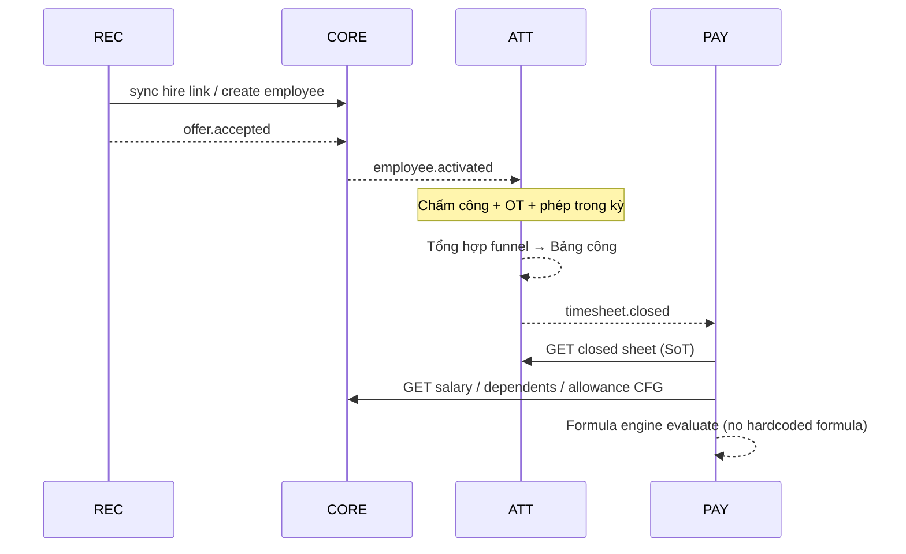
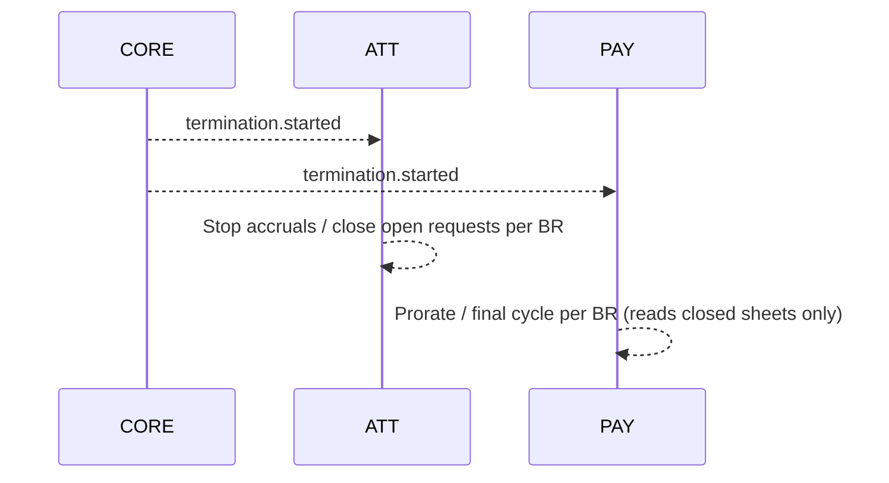

# API Boundary Map — HRM 4 Pillars (REC / CORE / ATT / PAY)

| Field | Value |
|-------|--------|
| **Doc ID** | API-BOUNDARY-HRM-4P |
| **work_item_id** | `PO-HRM-BP-ARCH-API-BOUNDARY-01` |
| **ADR** | [`ADR-HRM-4-PILLAR-API-BOUNDARY.md`](./ADR-HRM-4-PILLAR-API-BOUNDARY.md) |
| **Status** | Draft governance — HOLD implement |
| **Date** | 2026-08-04 |
| **PPT** | Slides 3, 10, 11, 14 |

> **Legend:** ✅ Allowed sync (HTTP/service) · ⚡ Event/async preferred · ❌ Forbidden · ⬜ N/A (same pillar)

---

## 1. Sync call matrix (caller → callee)

Rows = **caller** pillar. Columns = **callee** pillar.

| Caller ↓ \\ Callee → | **REC** | **CORE** | **ATT** | **PAY** |
|----------------------|:-------:|:--------:|:-------:|:-------:|
| **REC** | ⬜ | ✅ / ⚡ | ❌ | ❌ |
| **CORE** | ✅ read* | ⬜ | ⚡ / ✅ limited | ⚡ notify |
| **ATT** | ❌ | ✅ read | ⬜ | ⚡ |
| **PAY** | ❌ | ✅ read | ✅ read **closed sheet only** | ⬜ |

\*CORE→REC read: optional lookup candidate id for audit / reverse link — không mutate pipeline từ CORE trừ admin tooling có UC riêng.

### 1.1 Forbidden (P0 — Gateway + module fence)

| From | To | Why (PPT) | Typical anti-pattern |
|------|-----|-----------|----------------------|
| **REC** | **PAY** | Slide 14 — không giao tiếp trực tiếp | Tạo salary structure / payslip khi `stage=hired` |
| **PAY** | **REC** | Không có SoT ứng viên trong lương | Join `candidates` trong payroll run |
| **PAY** | **ATT Leave API** | Slide 10 | `GET leave-requests` để trừ công trong PAY |
| **PAY** | **ATT OT API** | Slide 10 | `GET overtime-requests` để nhân 150/200 trong PAY |
| **REC** | **ATT** | Chưa có employee active ổn định | Gán ca / mở phép từ candidate id |
| **ATT** | **REC** | Sai SoT | Đọc campaign để chấm công |

### 1.2 Allowed sync (whitelist — mở rộng sau SRS)

| From | To | Operation class | Contract note (logical) |
|------|-----|-----------------|-------------------------|
| **REC → CORE** | Create/link employee on hire | Soft link `employee_id`; CORE owns row | Align FR-HRM-INT-01 / hire-employee-link |
| **REC → CORE** | Read org/position/headcount refs | Picker / định biên | Catalog vẫn XBOS→HRM pull |
| **CORE → REC** | Read candidate by id (audit) | Optional | No stage machine drive from CORE |
| **ATT → CORE** | Resolve employee, contract active, manager | Scope + eligibility | Same `resolveHrmListScope` |
| **PAY → CORE** | Base salary, allowance CFG, dependents (gia cảnh) | Read models for formula vars | Slide 11 blocks 2 & 4 |
| **PAY → ATT** | **Only** finalized timesheet aggregate | `GET …/attendance-sheets/{id}` where `status=closed` (+ lines) | Slide 10 — unit «giờ công tính lương» |
| **CORE → ATT** | Enroll leave balance / calendar after activate | Prefer ⚡; sync OK if same TX saga documented | |
| **CORE → PAY** | Signal compensation baseline changed | Prefer ⚡ `compensation.updated` | PAY không lấy từ REC |

### 1.3 PAY → ATT detail rule

| ATT surface | PAY access |
|-------------|------------|
| Attendance sheet **`closed`** (+ immutable lines: standard / OT weighted / paid leave / unpaid / late) | ✅ Required SoT |
| Attendance sheet `draft` / `open` / `submitted` | ❌ Reject run (`HRM-PAY-ATT-412` proposed) |
| `leave-requests`, `overtime-requests`, raw `attendance-records` punches | ❌ |
| Work shifts catalog (coefficient already applied into closed lines) | ❌ direct for calc; optional display-only outside run |

---

## 2. Domain events (async handoff — recommended)

Events là **hợp đồng liên trụ** khi không cần sync request/response. Payload tối thiểu; versioned (`v1`).

| Event | Emitter | Consumers | Purpose | Suggested payload keys |
|-------|---------|-----------|---------|------------------------|
| **`offer.accepted`** | REC | CORE (primary) | Ứng viên nhận offer → mở hồ sơ / chờ onboard | `tenant_id`, `company_id`, `candidate_id`, `offer_id`, `position_id`, `accepted_at` |
| **`employee.activated`** | CORE | ATT, (optional) PAY CFG | NV chính thức → mở phép/ca; PAY biết có subject | `employee_id`, `company_id`, `effective_date`, `contract_id` |
| **`timesheet.closed`** | ATT | PAY | Kỳ công đã ký chốt — PAY được phép tính | `sheet_id`, `company_id`, `period_from`, `period_to`, `closed_at`, `closed_by`, `checksum` |
| **`termination.started`** | CORE | ATT, PAY | Ngừng phát sinh công/lương theo policy | `employee_id`, `company_id`, `last_working_date`, `reason_code` |

### 2.1 Event rules

1. **At-least-once** delivery; consumer idempotent theo `(event_name, aggregate_id, occurrence_id)`.
2. Consumer **không** gọi ngược sync vào emitter để «lấy thêm» dữ liệu cấm (vd. PAY không nhân event rồi gọi Leave).
3. Snapshot lớn (chi tiết giờ công) **không** nhồi full vào event — PAY **kéo** sheet closed qua API whitelist sau khi nhận `timesheet.closed`.
4. Không dùng event để vượt I-2 (REC không publish event «tạo payslip»).

### 2.2 Sequence (happy path hire → first payroll)

### 2.3 Sequence (termination)

---

## 3. Gateway / edge policy (GĐ1 logical)

| Policy ID | Rule | Enforcement (target) |
|-----------|------|----------------------|
| **GW-HRM-01** | Deny Bearer session calling PAY write APIs with body referencing `candidate_id` as subject | Gateway + PAY DTO validation |
| **GW-HRM-02** | Deny service mesh / internal token from REC module to PAY controllers | Nest module import fence + CI |
| **GW-HRM-03** | PAY calculate endpoint requires `timesheet_sheet_id` + server-side status=`closed` | ATT facade |
| **GW-HRM-04** | No public route that aggregates leave+OT+payroll in one handler outside ATT close job | Code review |

> GĐ1 implementation vehicle: Nest guards + `API_BOUNDARY` checklist in TechSpec — không bắt buộc mua API Gateway vendor.

---

## 4. Formula engine boundary (slide 11)

| Layer | Owner | Allowed inputs | Forbidden |
|-------|-------|----------------|-----------|
| Variable catalog | PAY CFG (+ CORE attributes as **sourced vars**) | `paid_hours`, `ot_hours_weighted`, `base_salary`, `allowance_*`, `dependents_count`, … | Raw leave request rows |
| Evaluator | PAY runtime | Expression/AST from CFG | `if (companyId==='trsport')` hardcode |
| ATT close job | ATT | Apply OT multipliers **before** close | Expect PAY to re-apply 150/200 |

---

## 5. Traceability for BA / QA

| Invariant | BA artifact | QA idea |
|-----------|-------------|---------|
| I-2 REC↛PAY | UC hire không có bước «tạo phiếu lương» | Attempt API/contract test forbidden |
| I-3 PAY←closed only | BR chốt công trước chạy lương | Run payroll on open sheet → fail |
| I-5 no hardcode | BR formula versioned | Change CFG coefficient → payslip changes without deploy |
| Events | UC async handoff | Idempotent re-delivery test |

---

## 6. Out of scope (this map)

- Chi tiết OpenAPI path/DTO (chờ SRS confirm → API_DESIGN).
- XBOS WF inbox routing (giữ bridge hiện có; không mở REC→PAY).
- Mobile ESS clock — thuộc ATT; không đổi boundary.
