# Đặc tả yêu cầu phần mềm — HRM doanh nghiệp (bốn trụ)

| Mục | Nội dung |
|-----|----------|
| Phiên bản | **0.41** — **DOC-DELTA danh mục hình thức bồi thường tăng ca (catalog mở):** EXPAND FR-UC-BP-PLT-01 → FR-UC-BP-ATT-06 — SoT Nest danh mục hình thức bồi thường tăng ca (Cài đặt = tham chiếu hợp nhất chỉ đọc); quản trị mở mã N+1 / hình thức thứ ba trở lên; hai hình thức khởi tạo (trả lương / nghỉ bù) chỉ là ví dụ ≠ trần; nộp đơn tăng ca chọn hình thức từ danh mục khi có hình thức hiệu lực (gõ / tự chế hình thức lạ → từ chối ở mức nghiệp vụ); nhãn / hệ số hiển thị = gợi ý ≠ công thức lương tăng ca; ngừng dùng = ẩn mềm; empty CTA; trực giao danh mục loại tăng ca (khác: khi nào tính tăng ca vs tăng ca được bồi thường ra sao) — không gộp; picker đơn tăng ca đang bàn giao giao diện (chưa claim đã xong); AC-PLT-ATT-COMP-01*. Giữ **0.40** danh mục loại tăng ca — **0.39** danh mục mẫu HĐ — **0.38** điều khoản — **0.37** quỹ phép — CORE-09* — PLT-01. **Không** claim nghiệm thu module chấm công / bảng lương / hợp đồng / bản in / nhân sự |
| Phân hệ | Quản lý nhân sự doanh nghiệp — Tuyển dụng · Nhân sự · Chấm công & Phép · Tiền lương |
| Mục đích tài liệu | Khách **chốt logic nghiệp vụ trên giấy** trước khi mở đặc tả kỹ thuật và phát triển |
| Inventory khóa | **60** use case — **16** FR ưu tiên + các UC EXPAND đủ 7 mục; ADD CORE-01a · CORE-09a·09b·09c·09d · **PLT-01** · REC-00a·00b·00c · REC-05a · REC-06a · REC-06b · ATT-03d·ATT-05b · **PROC-01**; REC-03·CORE-04·thẻ QR OUT; ATT-03 đa nguồn = GĐ2; Face mobile MVP |
| Giai đoạn kỹ thuật | **HOLD** — đặc tả kỹ thuật / thiết kế dữ liệu vật lý / hợp đồng tích hợp **chưa mở** đến khi khách xác nhận tài liệu này (tạm dừng code/demo theo phạm vi giấy) |
| Xác nhận khách | Tài liệu phản ánh thống nhất họp review bốn trụ — **chưa** khẳng định khách đã ký nghiệm thu bản này |

---

## 1. Giới thiệu

### 1.1. Mục đích

Chuẩn hóa vòng đời nhân sự từ định biên → tuyển → hồ sơ → chấm công/phép → bảng công chốt → lương, với các quy tắc ngoại lệ (phép xuyên nghỉ, gộp giữa tháng, tách dữ liệu C&B, một nguồn giờ công cho lương) thống nhất giữa các đơn vị.

### 1.2. Phạm vi

**Trong phạm vi (logic giấy):**

- Bốn khối độc lập: Tuyển dụng (REC), Nhân sự (CORE), Chấm công & Nghỉ phép (ATT), Tiền lương (PAY) — **đã họp xong toàn bộ bốn trụ** trên giấy; phát triển mã tạm dừng đến khi khách xác nhận tài liệu này.
- Ranh giới liên kết: Offer → hồ sơ; hồ sơ Hoạt động → phép/ca; **bảng công tổng hợp đã chốt → đầu vào tính lương**; không gọi chéo Tuyển ↔ Lương.
- **MVP Tuyển dụng (bốn phần):** (1) thư viện mô tả công việc (master) — gồm cấu hình trường theo pháp nhân, kéo bố cục, form thêm/sửa động và màn xem phân tầng; vẫn là **một nguồn mô tả** cho YCTD, (2) yêu cầu / đề xuất tuyển dụng (YCTD), (3) ứng viên gắn bắt buộc với YCTD + trạng thái pipeline (tạo/cập nhật hồ sơ theo FR-UC-BP-REC-05a; xếp / hủy / đổi lịch phỏng vấn với tối đa một lịch đang hiệu lực theo FR-UC-BP-REC-06a; thư mời và đánh giá theo FR-UC-BP-REC-06; so sánh đánh giá theo YCTD theo FR-UC-BP-REC-06b), (4) báo cáo / bảng điều khiển. Lịch phỏng vấn và đánh giá nằm **trong** pipeline ứng viên — không menu chiến dịch / tin đăng rời khi chưa có đối tác đồng bộ.
- Định biên: từng phòng ban **trình và duyệt**; HCNS **tổng hợp**; lưới tháng chỉ theo dõi số **cần tuyển** (không cặp cột kế hoạch/đề xuất trùng). Màn hình vận hành có thể ghi nhãn «Kế hoạch tuyển» — **đồng nghĩa nghiệp vụ** với định biên (FR-UC-BP-REC-01), không phải thực thể song song. Trường **trong/ngoài định biên** và lý do **tuyển mới / thay thế** trên YCTD điều kiện hóa ma trận duyệt.
- Nhân sự: hồ sơ công khai là bảng tổng hợp; người phụ thuộc; **lương / ngân hàng / MST / bảo hiểm** nằm ở module hợp đồng–bảo hiểm (vòng C&B), không trên form/màn hồ sơ công khai; bảo hiểm có timeline mức đóng + tạm dừng + action đóng/ngừng/tạm hoãn; **loại bảo hiểm** cấu hình theo đơn vị (danh mục mở — quản trị được thêm mã mới; khi còn phần tử hiệu lực thì chính sách / gắn người chỉ **chọn** từ danh mục, không chữ tự do làm nguồn sự thật); KT/KL có trạng thái đã thi hành → kỳ lương; tài sản kèm biên bản; nghỉ việc tự nguyện vs buộc thôi việc; quyết định bổ nhiệm/thuyên chuyển **đã hiệu lực** ghi lịch sử công tác (chọn nhân viên bắt buộc; chức danh từ danh mục — không chữ tự do); sau nhận việc phải có hồ sơ + hợp đồng hiệu lực cùng pháp nhân trước khi vào kỳ lương.
- Chấm công: quy tắc giờ/phạt bám **ca và lịch làm việc** bộ phận; cấp quỹ phép + giữ chỗ; bảng công chốt đủ thành phần nguồn lương.
- **Loại phép cấu hình (tối thiểu):** phép năm · phép thâm niên · phép bù OT · phép chuyển kỳ (mang sang) · ứng phép. **Nghỉ ốm:** xét chế độ bảo hiểm + hỗ trợ thêm của công ty (nếu có) — không áp hai nhánh cùng lúc không quy tắc.
- **Năm tài chính phép & mọi cấu hình liên quan:** CRUD theo từng pháp nhân — **cấm** hardcode tháng bắt đầu FY cố định cho mọi tenant.
- **Ký chốt bảng công:** bắt buộc nhân viên + quản lý trực tiếp + HCNS; thứ tự / song song = quy trình cấu hình từ XBOS theo tenant.
- **Chấm khuôn mặt (Face):** MVP **chỉ trên ứng dụng di động** (cùng ưu tiên GPS / vân tay trên mobile).
- **Điểm GPS (ATT-03d) + panel quỹ phép khi nộp đơn (ATT-05b):** trong MVP giấy.
- FR đầy đủ: định biên, tự sinh YCTD, YCTD trong/ngoài định biên, dashboard tuyển, vòng công khai/C&B, KT/KL→lương, phạt muộn, trừ phép, giữ chỗ quỹ, bảng công chốt, công thức (form GĐ1 + 2 bước phát hành), gộp lương giữa kỳ, các UC EXPAND sheet 03.
- Các quyết định Q-* / R-* từ phiếu chốt 2026-08-05 đã phản ánh vào FR (PAY 2 bước + form GĐ1; leave FY CRUD; sign XBOS; Face mobile; …). Tham số chi tiết từng tenant vẫn cấu hình trong phần mềm — **không** khẳng định khách đã ký nghiệm thu bản này; **không** khẳng định product LIVE.
- **Tiền lương (đã chốt trên giấy):** hai bước soạn→phát hành; GĐ1 biểu mẫu cấu hình; kéo-thả GĐ2; nguồn giờ = bảng công chốt; biến C&B từ hợp đồng–bảo hiểm; KT/KL đã thi hành → kỳ lương.
- **Quy trình & quy định (chỉ đọc trên Nhân sự):** màn xem mã quy trình / nhóm phê duyệt đã đồng bộ từ nền tảng (chỉnh sửa chấm công, nghỉ phép, duyệt mở rộng danh mục, duyệt thay đổi hồ sơ…). **Không** tạo / sửa / xóa định nghĩa quy trình trên Nhân sự — quản trị mã trên Command Center. Danh sách trống **chỉ** khi sau đồng bộ danh mục thật sự không có phần tử; trạng thái trống phải có **nút hoặc liên kết** mở được sang quản trị trên Command Center (không chỉ đoạn chữ).

**Ngoài phạm vi / GĐ2 / OUT (không thuộc MVP giấy lần này):**

- **OUT — Chiến dịch tuyển dụng / hub đa kênh** (`UC-BP-REC-03`): không làm MVP; trạng thái pipeline gắn trên **YCTD**.
- **OUT — Đọc giấy tờ tự động / OCR** (`UC-BP-CORE-04`): không MVP; nếu mở lại sau thì xem xét GĐ2.
- **OUT — Thẻ QR nhân viên** (đề xuất ATT-03e / bề mặt S15–S16): không MVP.
- **GĐ2 — Điểm danh đa nguồn đầy đủ** (`UC-BP-ATT-03`): gom App/IP/máy/GPS thành một UC đa nguồn hoàn chỉnh ở GĐ2; MVP dùng các nguồn đã chốt riêng (GPS điểm ATT-03d, Face mobile, …).
- **GĐ2 — Kéo-thả công thức lương:** GĐ1 soạn công thức bằng **biểu mẫu cấu hình** + hai bước soạn→phát hành; kéo-thả trực quan = GĐ2 (cùng engine).
- Quản lý công việc / dự án / giao việc (module riêng ngoài hành chính nhân sự).
- Đặc tả kỹ thuật chi tiết, thiết kế bảng dữ liệu vật lý, hợp đồng tích hợp — **HOLD** đến khi mở TechSpec; **demo giấy ≠ product GO**.
- Khẳng định phần mềm đã nghiệm thu hay đã triển khai xong theo blueprint.

### 1.3. Thuật ngữ

| Thuật ngữ | Định nghĩa |
|-----------|------------|
| Định biên | Lưới nhu cầu nhân sự theo vị trí × tháng; ô kích hoạt tuyển = **Cần tuyển** (kèm số lượng). Không dùng cặp cột kế hoạch/đề xuất trùng nghĩa |
| Kế hoạch tuyển (nhãn màn hình) | **Đồng nghĩa** với **định biên** (FR-UC-BP-REC-01) khi nói về lưới vị trí × tháng và số **Cần tuyển**. Không phải thực thể «kế hoạch» song song làm nguồn sự thật riêng |
| Vị trí ứng tuyển | Chức danh gắn với YCTD đã chọn — lấy từ danh mục / YCTD; **không** nhập chữ tự do làm nguồn sự thật |
| So sánh ứng viên | Chọn một YCTD → đối chiếu điểm đánh giá của các ứng viên đã gắn YCTD đó (FR-UC-BP-REC-06b); không lọc theo tin đăng / chiến dịch ở MVP |
| Lịch phỏng vấn đang hiệu lực | Bản ghi lịch ở trạng thái đã xếp hoặc đã xác nhận — chưa hủy / chưa hoàn tất / chưa ghi không đến. Mỗi ứng viên trong một pháp nhân chỉ được có tối đa một lịch đang hiệu lực (FR-UC-BP-REC-06a) |
| JD master | Thư viện mô tả công việc — đầu vào chuẩn cho YCTD (mã, trạng thái Nháp/Hiệu lực/Ngừng) |
| Catalog trường JD | Tập trường mô tả công việc cấu hình theo pháp nhân (mã, nhãn, kiểu nhập, bắt buộc, thứ tự, hiệu lực/ngừng) |
| Bố cục JD | Thứ tự và nhóm các trường hiệu lực dùng khi thêm/sửa và xem JD; mỗi pháp nhân có bố cục mặc định; khi lưu bản JD hệ thống giữ ảnh bố cục kèm giá trị đã nhập |
| YCTD | Yêu cầu / đề xuất tuyển dụng gắn vị trí, tháng đích, trong/ngoài định biên, lý do tuyển mới/thay thế; mang trạng thái pipeline tuyển |
| Ứng tuyển | Liên kết ứng viên ↔ YCTD (một ứng viên có thể gắn nhiều YCTD) |
| Vòng C&B | Lớp dữ liệu mật: lương, phụ cấp tiền, MST, ngân hàng, sổ BHXH — không nằm trên hồ sơ công khai |
| Lịch sử công tác | Dòng thời gian chức danh / bộ phận trên hồ sơ — nguồn chính từ quyết định bổ nhiệm / thuyên chuyển đã hiệu lực; chức danh và phòng ban chọn từ danh mục đã đồng bộ / cấu hình, không nhập chữ tự do làm nguồn sự thật |
| Quyết định gắn người | Loại quyết định bổ nhiệm, thuyên chuyển (và loại cấu hình tenant tương đương) — bắt buộc chọn nhân viên trong phạm vi trước khi lưu hiệu lực |
| Hợp đồng hiệu lực | Bản hợp đồng lao động ở trạng thái đang có hiệu lực cùng pháp nhân với hồ sơ — điều kiện vào bước tính lương sau nhận việc |
| Bảng công chốt | Bản tổng hợp giờ công kỳ đã đủ xác nhận (chấm + phép + OT + phạt…) — **nguồn gốc duy nhất** để tính lương |
| Loại phép cấu hình | Danh mục quỹ/nghỉ cấu hình theo pháp nhân: phép năm · thâm niên · bù OT · chuyển kỳ · ứng phép (và các loại mở rộng nếu chính sách bật) |
| Nghỉ ốm | Đơn nghỉ gắn nhánh **chế độ bảo hiểm** và/hoặc **hỗ trợ công ty** theo chính sách — không trừ kép hai nhánh không quy tắc |
| Split-month | Đổi lương/bậc giữa kỳ → tính hai đoạn → gộp một phiếu net |
| Ngày làm việc (trừ phép) | Ngày trong khoảng nghỉ **không** phải T7, CN, ngày lễ theo lịch đơn vị |
| Q-PAY-FORMULA | Đã chốt: hai bước soạn→phát hành; form GĐ1; kéo-thả GĐ2; SoT bảng công chốt |
| Mã quy trình (tham chiếu) | Mã loại đơn / luồng phê duyệt do nền tảng định nghĩa và gán; Nhân sự **chỉ xem** sau đồng bộ — không sở hữu kho định nghĩa trên menu Quy trình |
| Command Center (quản trị mã) | Nơi tạo / sửa / gán mã quy trình; màn Nhân sự dẫn người dùng tới đây bằng nút hoặc liên kết kích hoạt được |

### 1.4. Tài liệu tham chiếu (cùng gói)

| Tài liệu | Vai trò |
|----------|---------|
| Bảng công việc (WBS) | Hạng mục → tình huống → quy tắc → câu hỏi cần chốt |
| Danh mục use case | Khóa 44 mã tình huống |
| Ma trận quy tắc sâu | Tiêu chí đạt / không đạt và ngoại lệ |
| Ma trận sở hữu dữ liệu | Ai sở hữu từng nhóm dữ liệu chính |
| Ranh giới kỹ thuật (outline) | Chỉ khung — chi tiết kỹ thuật tạm dừng đến khi chốt SRS |

---

## 2. Mô tả tổng quan

### 2.1. Bối cảnh

Tổ chức đa pháp nhân cần HRM trả lời câu hỏi quản trị (bao giờ có người, hồ sơ đủ chưa, giờ công/phép đúng chưa, lương một nguồn số) thay vì chỉ lưu bảng tĩnh. Mỗi khối phát triển và kiểm thử độc lập; liên kết qua ranh giới dữ liệu đã thống nhất.

### 2.2. Tác nhân

| Tác nhân | Vai trò chính |
|----------|----------------|
| Quản lý / Trưởng bộ phận | **Trình và duyệt** định biên phòng ban; đề xuất YCTD; duyệt phép cấp 1; xác nhận bảng công |
| HCNS / Tổng hợp định biên | Tổng hợp lưới định biên đã duyệt các phòng; không nhập hộ toàn bộ nhu cầu phòng ban |
| HRBP / Tuyển dụng | JD master, YCTD, kho CV, pipeline PV/đánh giá trên ứng viên, offer, checklist giấy tờ |
| C&B / Payroll | Vòng mật hồ sơ, cấu hình lương/BH/thuế, công thức, chạy kỳ, phiếu lương |
| Nhân viên | Chấm công, nộp phép, ký bàn giao / xác nhận bảng công |
| Lãnh đạo (BGĐ / BOD) | Duyệt định biên / ngoại lệ ngoài định biên (theo chính sách chốt) |
| Hệ thống | Accrual phép, trừ ngày làm, OCR, thu hồi tài sản, gộp split-month |

### 2.3. Xương sống end-to-end

**MVP (GĐ1):**

```text
Định biên (phòng ban trình → duyệt → HCNS tổng hợp)
  → (JD master) → Auto / tạo YCTD theo tháng «Cần tuyển»
  → YCTD trong/ngoài ĐB (cờ + lý do tuyển mới/thay thế → ma trận duyệt)
  → Trạng thái pipeline trên YCTD (đã đăng tin / có CV / PV / offer…)
  → Kho CV + ứng viên gắn YCTD (PV & đánh giá trong pipeline) → Offer / onboard
  → Hồ sơ nhân sự (cùng pháp nhân) + hợp đồng hiệu lực (+ BH theo chính sách)
  → Hồ sơ chờ → Checklist → Hoạt động → Ca + phép (cấp quỹ)
  → (Trong vận hành) Quyết định bổ nhiệm/thuyên chuyển hiệu lực → lịch sử công tác
  → Chấm theo ca·lịch / Đơn phép (hold; loại phép cấu hình) → Bảng công tổng hợp → Chốt
  → Công thức lương (khung FR PAY; Q-PAY-FORMULA = cách lắp engine)
  → (Split-month) → Phiếu lương / KT-KL đã thi hành / Tất toán nghỉ việc
```

**GĐ2 (ngoài MVP):** Chiến dịch 1–n YCTD + hub đăng tin đa kênh khi có API đối tác.

### 2.4. Ràng buộc tổng quát (trước FR)

1. Module lương **chỉ** đọc bảng công đã chốt — không lấy giờ từ đơn OT/phép để tính lương.
2. Tuyển dụng **không** tạo cấu trúc lương / phiếu lương trực tiếp.
3. Vai trò không thuộc C&B không xem / sửa vòng mật trên form tạo–sửa hồ sơ công khai hay tab công khai; biến C&B chỉ qua màn hợp đồng–bảo hiểm / vòng C&B.
4. Công thức lương cấu hình được — **đã chốt** trên giấy: hai bước soạn→phát hành (**Q-PAY-FORMULA**); GĐ1 soạn bằng **biểu mẫu cấu hình**; kéo-thả trực quan = GĐ2 (**R-PAY-DD-01**); nguồn giờ chỉ từ bảng công chốt. Tham số chi tiết theo từng pháp nhân vẫn cấu hình trong phần mềm; đặc tả kỹ thuật sâu vẫn **HOLD**.
5. Độ sâu TechSpec / DB / API = **HOLD**; tạm dừng code/demo đến xác nhận SRS.
6. Chiến dịch / tin đa kênh **không** thuộc MVP — trạng thái đăng tin thuộc YCTD cho đến khi có đối tác API.
7. Quản lý công việc / dự án **không** nằm trong module hành chính nhân sự.
8. Kết thúc funnel tuyển tại **onboard**; KPI giữ người / hết thử việc là chính sách sau tuyển — không khóa cứng trong phễu tuyển.

---

## 3. Yêu cầu chức năng

> **16 FR ưu tiên:** đủ 7 phần (thông tin chung · dữ liệu đầu vào · luồng chính · quy tắc · trường hợp đặc biệt · sơ đồ · diễn biến) — đã UPGRADE theo họp review, không wipe thân FR.  
> **UC bổ sung (§3.A):** đủ 7 mục — gồm JD master + catalog/bố cục/form động (MVP) và đánh dấu chiến dịch **GĐ2**.

### Mục lục FR ưu tiên đợt này

| # | Mã FR | Tên ngắn | Đủ 7 mục / Stub |
|---|-------|----------|-----------------|
| 1 | FR-UC-BP-REC-01 | Định biên 12 tháng | Đủ 7 mục |
| 2 | FR-UC-BP-REC-01b | Auto sinh YCTD theo tháng | Đủ 7 mục |
| 3 | FR-UC-BP-REC-02 | YCTD trong định biên | Đủ 7 mục |
| 4 | FR-UC-BP-REC-02b | YCTD ngoài định biên | Đủ 7 mục |
| 5 | FR-UC-BP-REC-08 | Dashboard tuyển | Đủ 7 mục |
| 6 | FR-UC-BP-CORE-01 | Hồ sơ vòng công khai | Đủ 7 mục |
| 6a | FR-UC-BP-CORE-01a | QSĐ hiệu lực → lịch sử công tác | Đủ 7 mục (§3.A) |
| 7 | FR-UC-BP-CORE-02 | Hồ sơ vòng C&B | Đủ 7 mục |
| 8 | FR-UC-BP-CORE-08 | KT/KL → bảng lương | Đủ 7 mục |
| 9 | FR-UC-BP-ATT-02 | Phạt muộn TIME-002 | Đủ 7 mục |
| 10 | FR-UC-BP-ATT-08 | Trừ phép xuyên T7–CN–Lễ | Đủ 7 mục |
| 11 | FR-UC-BP-ATT-09 | Hold quỹ phép khi nộp đơn | Đủ 7 mục |
| 12 | FR-UC-BP-ATT-10 | Tổng hợp bảng công | Đủ 7 mục |
| 13 | FR-UC-BP-ATT-11 | Ký chốt bảng công | Đủ 7 mục |
| 14 | FR-UC-BP-PAY-01 | Lương chỉ đọc bảng công chốt | Đủ 7 mục |
| 15 | FR-UC-BP-PAY-02 | Động cơ công thức lương | Đủ 7 mục |
| 16 | FR-UC-BP-PAY-04 | Gộp lương giữa kỳ | Đủ 7 mục |

### Mục lục UC bổ sung (§3.A)

Các tình huống còn lại trong inventory (kèm JD master · REC-00a/b/c · REC-05a · REC-06b; chiến dịch = GĐ2) — xem bảng mở đầu mục **3.A**.

---

### FR-UC-BP-REC-01 — Quản trị định biên vị trí × 12 tháng

#### Thông tin chung

| Mục | Nội dung |
|-----|----------|
| Tác nhân | Trưởng bộ phận (trình), Lãnh đạo duyệt phòng, HCNS (tổng hợp) |
| Ưu tiên | Cao |
| Tiên quyết | Có danh mục vị trí / đơn vị; quyền lập hoặc duyệt định biên **theo phòng ban** |
| Hậu điều kiện | Lưới 12 tháng được lưu; tháng «Cần tuyển» đã duyệt sẵn sàng cho YCTD; HCNS có bản tổng hợp |
| Liên hệ phần mềm hiện tại | Có hướng kế hoạch/yêu cầu tuyển; chưa tách rõ phòng ban trình vs HCNS nhập hộ. Nhãn UI «Kế hoạch tuyển» phải map về định biên / Cần tuyển — không tạo SoT song song |
| BR | BR-BP-HC-01 |
| partner_req_id | REQ_REC_003; REQ_REC_005 |

> **Ánh xạ nhãn giao diện:** Tab hoặc màn mang tên «Kế hoạch tuyển dụng» / tương đương = **định biên vị trí × 12 tháng** của FR này. Cột số theo tháng chỉ theo dõi **Cần tuyển** (đã duyệt). Vị trí / đơn vị chọn từ danh mục — không nhập tên tự do làm nguồn sự thật. Khuyến nghị đổi nhãn UI thành «Định biên» hoặc chú thích đồng nghĩa trên màn hình.

#### Dữ liệu đầu vào

| Trường | Bắt buộc | Quy tắc |
|--------|----------|---------|
| Đơn vị / phòng ban | Có | Thuộc phạm vi người lập — **không** để HCNS nhập hộ toàn bộ nhu cầu các phòng; chọn từ danh mục đơn vị |
| Vị trí (chức danh) | Có | Trong danh mục chức danh pháp nhân — **không** ô chữ tự do làm nguồn sự thật |
| Năm kế hoạch | Có | Năm dương lịch |
| Trạng thái từng tháng (1…12) | Có | Đúng một trong: Hiện tại / Cần tuyển / Dự kiến |
| Số lượng cần tuyển (nếu Cần tuyển) | Có khi Cần tuyển | Số nguyên ≥ 1 — **đây là ô số duy nhất theo tháng** (không cặp cột «kế hoạch» / «đề xuất» trùng nghĩa) |
| Ghi chú vượt định biên | Không | Bắt buộc nếu chính sách cho spawn kèm cảnh báo |

#### Luồng chính

1. **Trưởng bộ phận** mở lưới định biên phòng mình × năm (không phải HCNS nhập hộ toàn công ty).
2. Gán trạng thái từng ô tháng; với «Cần tuyển» nhập **số cần tuyển** tháng đó. Hệ thống kiểm tra mỗi ô đúng một trạng thái; **không** bắt buộc hai cột số kế hoạch/đề xuất song song.
3. Gửi đề xuất duyệt trong phòng / theo cấu hình; người duyệt xem «tháng nào cần tuyển».
4. Duyệt thành công → các ô Cần tuyển khóa chỉnh tay (trừ quyền override có lý do).
5. **HCNS tổng hợp** các lưới phòng đã duyệt thành báo cáo / đầu vào tuyển toàn đơn vị.
6. Hệ thống cho phép tạo YCTD từ ô Cần tuyển đã duyệt (UC-BP-REC-02 / auto REC-01b).

#### Quy tắc nghiệp vụ

- BR-BP-HC-01: «Cần tuyển» chỉ ở tháng kích hoạt tuyển — không đánh dấu cả năm khi chỉ một tháng cần.
- Cùng vị trí cần tuyển tháng 3 và tháng 8 = hai nhu cầu độc lập, không gộp một YCTD.
- **Actor:** từng phòng ban trình + duyệt; HCNS tổng hợp — không bắt HCNS tự đi hỏi rồi nhập hộ toàn bộ.
- Lưới tháng: chỉ theo dõi số **cần tuyển**; không cố suy ra «số nhân sự hiện có đúng tháng đó» từ đầu năm làm cột bắt buộc (số hiện hữu vận hành phát sinh theo tuyển/nghỉ).
- Vượt định biên: theo chính sách chốt (cảnh báo cho qua **hoặc** chặn) — Decision Q-REC-HEADCOUNT.
- Trong định biên đã duyệt đầu năm vs ngoài định biên / phát sinh / thay thế: luồng duyệt có thể khác (BOD) — cần chốt Q-REC-HEADCOUNT.

#### Trường hợp đặc biệt

| Tình huống | Hệ thống xử lý |
|------------|----------------|
| Lưu lưới chỉ có tổng năm, không theo tháng | Từ chối — bắt buộc 12 ô tháng |
| UI có hai cột số kế hoạch + đề xuất trùng nghĩa | Không đạt — gộp thành một số «cần tuyển» |
| HCNS tạo định biên thay mọi phòng không ủy quyền | Từ chối hoặc cảnh báo ngoài quy trình — phòng ban phải trình |
| Sửa ô đã duyệt không có quyền | Từ chối + thông báo |
| Tạo YCTD từ tháng «Dự kiến» | Từ chối (BR-BP-HC-02) |
| Hai pháp nhân cùng vị trí | Định biên tách theo đơn vị — không trộn |

#### Sơ đồ tương tác

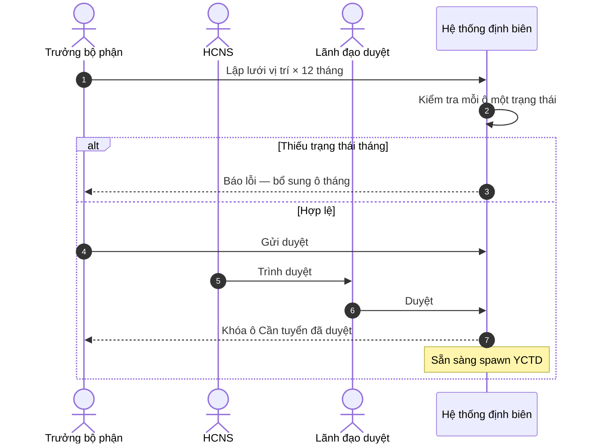
```mermaid
sequenceDiagram
  autonumber
  actor TP as Trưởng bộ phận
  actor HR as HCNS
  actor LD as Lãnh đạo duyệt
  participant HT as Hệ thống định biên

  TP->>HT: Lập lưới vị trí × 12 tháng
  HT->>HT: Kiểm tra mỗi ô một trạng thái
  alt Thiếu trạng thái tháng
    HT-->>TP: Báo lỗi — bổ sung ô tháng
  else Hợp lệ
    TP->>HT: Gửi duyệt
    HR->>LD: Trình duyệt
    LD->>HT: Duyệt
    HT-->>TP: Khóa ô Cần tuyển đã duyệt
    Note over HT: Sẵn sàng spawn YCTD
  end
```

#### Diễn biến nghiệp vụ

| # | Tương tác | Điều kiện / quy tắc | Kết quả hoặc lỗi |
|---|-----------|---------------------|------------------|
| 1 | Mở lưới định biên | Có quyền lập | Hiển thị 12 tháng trống hoặc bản nháp |
| 2 | Gán trạng thái ô | Mỗi ô một trạng thái | Lưới cập nhật |
| 3 | Gửi duyệt | Có ít nhất một thay đổi hợp lệ | Trạng thái chờ duyệt |
| 4 | Duyệt | Đúng cấp duyệt (theo chính sách) | Ô Cần tuyển khóa; sẵn sàng YCTD |
| 5 | Từ chối duyệt | Có lý do | Trả về chỉnh sửa |
| 6 | Sửa sau duyệt | Không có override | Lỗi quyền |
| Thành công | — | — | Người dùng thấy lưới đã duyệt; bản ghi định biên có tháng Cần tuyển; khóa mang = mã định biên + vị trí + tháng; UC kế = tạo YCTD / auto YCTD |

---

### FR-UC-BP-REC-01b — Auto sinh yêu cầu tuyển theo tháng định biên

#### Thông tin chung

| Mục | Nội dung |
|-----|----------|
| Tác nhân | Hệ thống, HCNS |
| Ưu tiên | Cao |
| Tiên quyết | Định biên đã duyệt; có ô «Cần tuyển» theo tháng kèm số lượng |
| Hậu điều kiện | Mỗi ô đủ điều kiện có đúng một YCTD gắn tháng kế hoạch + vị trí + số lượng |
| Liên hệ phần mềm hiện tại | Có tạo yêu cầu tuyển thủ công; chưa đủ tự sinh theo tháng đã duyệt |
| BR | BR-BP-HC-04 |
| partner_req_id | REQ_REC_003 |

#### Dữ liệu đầu vào

| Trường | Bắt buộc | Quy tắc |
|--------|----------|---------|
| Mã định biên đã duyệt | Có | Phiên bản đã khóa sau duyệt |
| Ô tháng «Cần tuyển» | Có | Kèm số lượng ≥ 1 |
| Tháng kế hoạch | Có | Tháng gắn với ô kích hoạt |
| Lịch kích hoạt tự sinh | Có | Theo cấu hình pháp nhân (sau duyệt hoặc đúng tháng kích hoạt) |

#### Luồng chính

1. Sau khi định biên được duyệt, hệ thống quét các ô «Cần tuyển» đã duyệt.
2. Theo lịch kích hoạt của pháp nhân, hệ thống sinh đúng **một** YCTD cho mỗi ô: vị trí, tháng kế hoạch, số lượng; gắn thư viện mô tả công việc (JD master) khi đã chọn.
3. HCNS mở danh sách YCTD đã sinh để cập nhật trạng thái pipeline / nhận hồ sơ ứng viên (theo FR trong định biên hoặc ngoài định biên) — **không** bắt buộc gắn chiến dịch ở MVP.
4. Mở lại cùng phiên bản định biên đã sinh → hệ thống **không** sinh trùng.
5. Nếu đổi số lượng ô sau khi đã sinh → cập nhật / tạo phiên bản YCTD hoặc cảnh báo lệch — không im lặng.

#### Quy tắc nghiệp vụ

- BR-BP-HC-04: chỉ tự sinh sau định biên đã duyệt; mỗi ô «Cần tuyển» approved → đúng một YCTD.
- Không tự sinh từ ô «Dự kiến» hoặc «Hiện tại».
- Cùng vị trí tháng 3 và tháng 8 = hai YCTD độc lập (khớp FR định biên).

#### Trường hợp đặc biệt

| Tình huống | Hệ thống xử lý |
|------------|----------------|
| Định biên chưa duyệt | Không tự sinh |
| Ô đổi khỏi «Cần tuyển» trước mốc kích hoạt | Hủy lịch sinh / không tạo |
| Đã sinh rồi mở lại cùng phiên bản | Không tạo bản thứ hai |
| Đổi số lượng sau khi đã sinh | Cập nhật/version hoặc cảnh báo lệch số lượng |
| Thiếu cấu hình lịch kích hoạt | Chặn tự sinh + thông báo cấu hình — chờ chốt lịch kích hoạt pháp nhân |

#### Sơ đồ tương tác

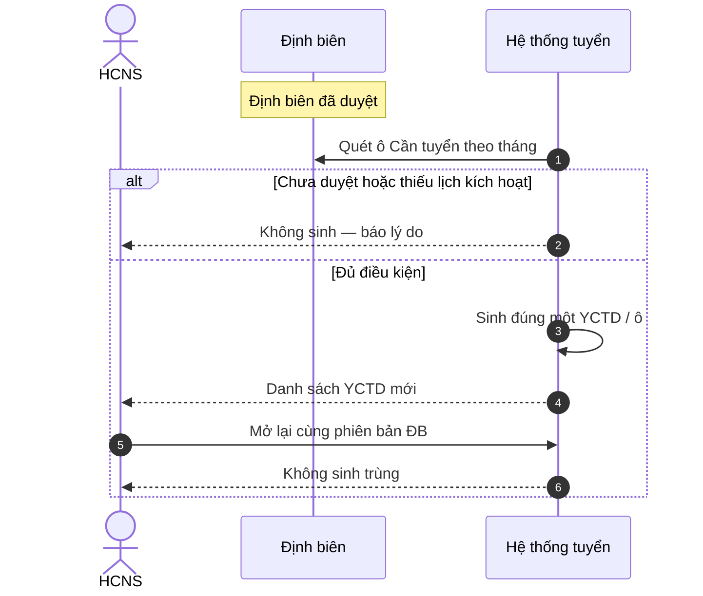
```mermaid
sequenceDiagram
  autonumber
  actor HR as HCNS
  participant DB as Định biên
  participant HT as Hệ thống tuyển

  Note over DB: Định biên đã duyệt
  HT->>DB: Quét ô Cần tuyển theo tháng
  alt Chưa duyệt hoặc thiếu lịch kích hoạt
    HT-->>HR: Không sinh — báo lý do
  else Đủ điều kiện
    HT->>HT: Sinh đúng một YCTD / ô
    HT-->>HR: Danh sách YCTD mới
    HR->>HT: Mở lại cùng phiên bản ĐB
    HT-->>HR: Không sinh trùng
  end
```

#### Diễn biến nghiệp vụ

| # | Tương tác | Điều kiện / quy tắc | Kết quả hoặc lỗi |
|---|-----------|---------------------|------------------|
| 1 | Duyệt định biên xong | Có ô Cần tuyển | Hệ thống ghi nhận lịch sinh |
| 2 | Đến mốc kích hoạt | BR-BP-HC-04 | Sinh đúng một YCTD / ô |
| 3 | HCNS xem YCTD | Có quyền tuyển | Thấy tháng + vị trí + SL |
| 4 | Mở lại cùng phiên bản | Đã sinh trước đó | Không tạo trùng |
| 5 | Đổi SL ô sau sinh | Có quyền chỉnh có kiểm soát | Version/cảnh báo lệch |
| 6 | Định biên chưa duyệt | — | Không tự sinh |
| Thành công | — | — | Mỗi ô Cần tuyển có đúng một YCTD; khóa mang = định biên + vị trí + tháng; UC kế = YCTD trong/ngoài ĐB / nhận ứng viên |


---

### FR-UC-BP-REC-02 — Yêu cầu tuyển trong định biên

#### Thông tin chung

| Mục | Nội dung |
|-----|----------|
| Tác nhân | HCNS, Trưởng bộ phận |
| Ưu tiên | Cao |
| Tiên quyết | Định biên năm đã duyệt; ô tháng «Cần tuyển» còn hiệu lực; có JD master khi vị trí yêu cầu mô tả |
| Hậu điều kiện | YCTD trong kế hoạch ở trạng thái đã duyệt / từ chối theo luồng rút gọn; sẵn sàng nhận ứng viên và cập nhật trạng thái pipeline |
| Liên hệ phần mềm hiện tại | Có yêu cầu tuyển; chưa tách rõ nhánh trong/ngoài định biên |
| BR | BR-BP-HC-05 · BR-BP-JD-01 · BR-YCTD-JD-REF-01 · BR-YCTD-JD-REF-02 |
| partner_req_id | REQ_REC_001 |
| Decision | Q-REC-HEADCOUNT = **Cho ngoài ĐB + duyệt BOD**; workflow XBOS theo tenant (đã chốt) |

#### Dữ liệu đầu vào

| Trường | Bắt buộc | Quy tắc |
|--------|----------|---------|
| Ô định biên nguồn | Có | Trạng thái «Cần tuyển» đã duyệt |
| Vị trí / số lượng | Có | Khớp hoặc không vượt ô (thay thế đúng vị trí vẫn trong kế hoạch) |
| Tham chiếu JD master | Có khi vị trí có mô tả chuẩn | Chọn từ **Thư viện JD** (chỉ bản **Hiệu lực** đúng pháp nhân); gắn mã JD; xem trước tiêu đề và mô tả từ bản đã chọn trước khi gửi |
| Chế độ headcount | Có | **Trong định biên** |
| Lý do tuyển | Có | **Tuyển mới** hoặc **Thay thế** (và thông tin vị trí/người thay thế khi Thay thế) |
| Trạng thái pipeline YCTD | Hệ thống | Ví dụ: mới / đã đăng tin / đã có CV / đang PV / offer / đủ người — **không** tách menu tin đăng ở MVP |
| Ma trận duyệt | Hệ thống | Rút gọn theo cấu hình pháp nhân + điều kiện trong ĐB / lý do tuyển |

#### Luồng chính

1. Người tạo chọn ô «Cần tuyển» đã duyệt và lập YCTD gắn ô đó; mở danh sách JD **Hiệu lực** từ Thư viện JD cùng pháp nhân; chọn một JD; xem trước tiêu đề và mô tả từ bản đã chọn; khai báo trong định biên + lý do tuyển mới/thay thế.
2. Hệ thống gắn mã JD trên YCTD (không bắt nhập lại toàn bộ trường mô tả động của thư viện); gắn cờ trong kế hoạch và chọn ma trận duyệt **rút gọn** (không bắt buộc Ban giám đốc nếu chính sách pháp nhân cho phép — **Q-REC-HEADCOUNT đã chốt**: ngoài ĐB + BOD; workflow XBOS theo tenant). Trường trong/ngoài định biên và lý do tuyển là **điều kiện** của ma trận — không bắt buộc hai quy trình rời.
3. Trưởng bộ phận / HCNS duyệt tối thiểu theo cấu hình.
4. Sau duyệt → YCTD sẵn sàng nhận hồ sơ ứng viên; cập nhật trạng thái pipeline trên YCTD (đã đăng tin, có CV, …); danh sách hiển thị tham chiếu JD đã gắn; tải lại màn hình vẫn còn mã/tiêu đề JD.
5. Từ chối → trả về chỉnh sửa; không mở nhận hồ sơ; mã JD đã chọn (nếu có) giữ trên bản nháp để chỉnh.

#### Quy tắc nghiệp vụ

- BR-BP-HC-05: trong định biên đã duyệt → không dùng luồng ngoài định biên.
- BR-BP-JD-01: tạo/sửa YCTD mới cần mô tả chuẩn → chỉ cho chọn JD **Hiệu lực**; JD **Ngừng** không chọn được cho YCTD mới; YCTD lịch sử vẫn xem được JD đã gắn.
- BR-YCTD-JD-REF-01: khi vị trí có mô tả chuẩn trên pháp nhân → bắt buộc **Tham chiếu JD master** trước khi gửi duyệt; thiếu → từ chối và giữ form.
- BR-YCTD-JD-REF-02: sau khi chọn JD, cho chỉnh bản chép mô tả ngắn trên YCTD **không** đổi nội dung gốc trong Thư viện JD; mã tham chiếu vẫn trỏ đúng JD đã chọn.
- Thay thế đúng vị trí không vượt số lượng ô vẫn coi là trong kế hoạch.
- Nếu cấu hình pháp nhân vẫn yêu cầu Ban giám đốc dù trong định biên → áp dụng cấu hình đó (Q-REC-HEADCOUNT đã chốt — theo workflow tenant) — không bịa một nhánh khóa cho mọi đơn vị.
- MVP: không bắt buộc entity chiến dịch / tin đăng đa kênh; trạng thái đăng tin nằm trên YCTD. Nguồn mô tả chuẩn chỉ từ Thư viện JD — không lấy mô tả từ menu tin đăng rời.

#### Trường hợp đặc biệt

| Tình huống | Hệ thống xử lý |
|------------|----------------|
| Ô tháng không «Cần tuyển» | Từ chối tạo |
| Thiếu cờ trong/ngoài định biên hoặc lý do tuyển | Từ chối gửi duyệt |
| Thư viện JD trống (không có bản Hiệu lực) | Hiển thị trạng thái trống rõ ràng và hướng mở Thư viện JD; **không** cho lưu/gửi khi tham chiếu JD bắt buộc |
| Chọn hoặc gửi kèm JD Ngừng / ngoài phạm vi pháp nhân | Chặn chọn hoặc từ chối gửi; thông báo cần JD Hiệu lực |
| Thiếu tham chiếu JD khi vị trí bắt buộc mô tả chuẩn | Từ chối gửi duyệt; giữ form |
| Sau lưu/gửi thành công | Danh sách YCTD cập nhật kèm mã/tiêu đề JD; tải lại màn hình vẫn còn tham chiếu |
| Vượt số lượng ô | Chuyển sang nhánh ngoài định biên (FR-UC-BP-REC-02b) hoặc từ chối theo cấu hình |
| Policy vẫn yêu cầu BGĐ dù trong ĐB | Áp dụng cấu hình pháp nhân (Q-REC-HEADCOUNT đã chốt) |
| Định biên chưa duyệt | Từ chối tạo YCTD trong kế hoạch |

#### Sơ đồ tương tác

```mermaid
sequenceDiagram
  autonumber
  actor TP as Trưởng bộ phận
  actor HR as HCNS
  participant YCTD as Form YCTD
  participant Lib as Thư viện JD

  TP->>YCTD: Mở tạo YCTD từ ô Cần tuyển
  YCTD->>Lib: Tải danh sách JD Hiệu lực đúng pháp nhân
  alt Thư viện trống
    Lib-->>YCTD: Danh sách rỗng
    YCTD-->>TP: Trạng thái trống và hướng mở Thư viện JD — không cho lưu thiếu tham chiếu
  else Có JD Hiệu lực
    TP->>YCTD: Chọn một JD Hiệu lực
    YCTD-->>TP: Xem trước tiêu đề và mô tả từ bản JD đã chọn
    alt Chọn JD Ngừng hoặc ngoài phạm vi
      YCTD-->>TP: Chặn chọn — yêu cầu JD Hiệu lực
    else Ô không hợp lệ / vượt ô
      YCTD-->>TP: Từ chối hoặc chuyển nhánh ngoài định biên
    else Hợp lệ để gửi
      TP->>YCTD: Điền số lượng · lý do tuyển · Gửi duyệt
      alt Thiếu JD khi vị trí bắt buộc mô tả chuẩn
        YCTD-->>TP: Từ chối gửi — giữ form
      else Đủ điều kiện
        YCTD->>HR: Chờ duyệt tối thiểu
        HR->>YCTD: Duyệt
        YCTD-->>TP: Thành công — danh sách cập nhật; tải lại vẫn còn mã JD gắn YCTD
      end
    end
  end
```

#### Diễn biến nghiệp vụ

| # | Tương tác | Điều kiện / quy tắc | Kết quả hoặc lỗi |
|---|-----------|---------------------|------------------|
| 1 | Chọn ô Cần tuyển | Định biên đã duyệt | Form YCTD trong kế hoạch |
| 1a | Mở danh sách JD | Đúng pháp nhân | Chỉ liệt kê JD **Hiệu lực** |
| 1b | Thư viện trống | Chưa có JD Hiệu lực | Trạng thái trống + hướng mở Thư viện JD; **không** lưu/gửi khi thiếu tham chiếu bắt buộc |
| 1c | Chọn JD | JD Hiệu lực | Gắn mã JD; hiện xem trước mô tả từ bản đã chọn (không bắt nhập lại toàn bộ trường động của thư viện) |
| 1d | Thử chọn JD Ngừng | BR-BP-JD-01 | Chặn; thông báo rõ |
| 2 | Gửi duyệt | BR-BP-HC-05; đủ cờ trong ĐB + lý do tuyển + JD khi bắt buộc (BR-YCTD-JD-REF-01) | Ma trận rút gọn theo cấu hình |
| 3 | Duyệt tối thiểu | Đúng cấp cấu hình | YCTD đã duyệt; mang mã JD |
| 4 | Từ chối | Có lý do | Trả về chỉnh sửa; mã JD giữ trên bản nháp nếu đã chọn |
| 5 | Policy bắt BGĐ | Q-REC-HEADCOUNT đã chốt | Áp cấu hình pháp nhân / XBOS — không khóa cứng «luôn bỏ BGĐ» |
| Thành công | — | — | Người dùng thấy YCTD trên danh sách kèm tham chiếu JD; tải lại vẫn còn; sẵn sàng nhận hồ sơ; UC kế = kho CV / pipeline ứng viên |


---

### FR-UC-BP-REC-02b — Yêu cầu tuyển ngoài định biên

#### Thông tin chung

| Mục | Nội dung |
|-----|----------|
| Tác nhân | HCNS, Trưởng bộ phận, Ban giám đốc |
| Ưu tiên | Cao |
| Tiên quyết | Xác định phát sinh / vượt kế hoạch / thay thế ngoài ô định biên |
| Hậu điều kiện | YCTD ngoài kế hoạch đã duyệt đủ cấp (kể Ban giám đốc khi cấu hình yêu cầu) hoặc từ chối |
| Liên hệ phần mềm hiện tại | Chưa đủ nhánh duyệt dài riêng cho ngoài định biên |
| BR | BR-BP-HC-06 · BR-BP-JD-01 · BR-YCTD-JD-REF-01 · BR-YCTD-JD-REF-02 |
| partner_req_id | REQ_REC_001 |
| Decision | Q-REC-HEADCOUNT = **Cho ngoài ĐB + duyệt BOD**; workflow XBOS theo tenant (đã chốt) |

#### Dữ liệu đầu vào

| Trường | Bắt buộc | Quy tắc |
|--------|----------|---------|
| Chế độ headcount | Có | **Ngoài định biên** |
| Lý do ngoài kế hoạch | Có | Phát sinh / vượt headcount / mở rộng team |
| Lý do tuyển | Có | **Tuyển mới** hoặc **Thay thế** (kèm thông tin thay thế khi áp dụng) |
| Vị trí / số lượng | Có | Số nguyên ≥ 1 |
| Tham chiếu JD master | Có khi vị trí có mô tả chuẩn | Chọn từ **Thư viện JD** (chỉ bản **Hiệu lực** đúng pháp nhân); gắn mã JD; xem trước tiêu đề và mô tả từ bản đã chọn trước khi gửi — cùng quy tắc với FR-UC-BP-REC-02 |
| Trạng thái pipeline YCTD | Hệ thống | Cùng tập trạng thái MVP như trong định biên |
| Cấp duyệt dài | Hệ thống | Có Ban giám đốc khi cấu hình yêu cầu — điều kiện hóa bởi cờ ngoài ĐB + lý do tuyển |

#### Luồng chính

1. Người tạo lập YCTD với cờ **ngoài định biên**, lý do ngoài kế hoạch và lý do tuyển mới/thay thế; mở danh sách JD **Hiệu lực** từ Thư viện JD cùng pháp nhân; chọn một JD; xem trước tiêu đề và mô tả từ bản đã chọn.
2. Hệ thống gắn mã JD trên YCTD (không bắt nhập lại toàn bộ trường mô tả động của thư viện); bắt buộc nhánh duyệt **dài hơn** so với trong định biên khi cấu hình yêu cầu (có Ban giám đốc). Cờ ngoài định biên là **điều kiện ma trận**, không bắt buộc hai quy trình sản phẩm tách rời nếu cấu hình gộp.
3. Thiếu cấp Ban giám đốc khi bắt buộc → **không** mở nhận hồ sơ.
4. Đề xuất mặc định đến khi khách chốt Q-REC-HEADCOUNT: **chặn** nhận hồ sơ đến khi duyệt xong.
5. Ban giám đốc duyệt → sẵn sàng nhận hồ sơ / cập nhật pipeline trên YCTD; danh sách hiển thị tham chiếu JD đã gắn; tải lại màn hình vẫn còn mã/tiêu đề JD; từ chối → đóng YCTD ngoài kế hoạch (mã JD giữ trên bản đã lưu nếu đã chọn trước đó).

#### Quy tắc nghiệp vụ

- BR-BP-HC-06: ngoài định biên **không** dùng ma trận rút gọn của trong định biên.
- BR-BP-JD-01 · BR-YCTD-JD-REF-01 · BR-YCTD-JD-REF-02: cùng quy tắc tham chiếu Thư viện JD như FR-UC-BP-REC-02 (chỉ JD Hiệu lực; bắt buộc khi vị trí có mô tả chuẩn; chỉnh bản chép trên YCTD không đổi gốc thư viện).
- Vượt headcount / ngoài định biên: theo Q-REC-HEADCOUNT đã chốt — có BOD + workflow XBOS; đề xuất vận hành: chặn đến khi duyệt.
- MVP: không bắt buộc chiến dịch / hub đa kênh. Nguồn mô tả chuẩn chỉ từ Thư viện JD — không lấy mô tả từ menu tin đăng rời.
- Không khẳng định một phương án đã được khách ký.

#### Trường hợp đặc biệt

| Tình huống | Hệ thống xử lý |
|------------|----------------|
| Ban giám đốc từ chối | YCTD = Từ chối; không mở nhận hồ sơ |
| Bỏ qua cấp Ban giám đốc khi cấu hình bắt buộc | Không đạt kiểm soát — chặn mở nhận hồ sơ |
| Khách chốt «cảnh báo cho qua» | Cho mở kèm cảnh báo vượt — chỉ sau khi Decision đóng |
| Nhầm gắn trong kế hoạch | Hệ thống từ chối nếu vượt ô / không có ô nguồn |
| Thiếu lý do tuyển mới/thay thế | Từ chối gửi duyệt |
| Thư viện JD trống (không có bản Hiệu lực) | Hiển thị trạng thái trống rõ ràng và hướng mở Thư viện JD; **không** cho lưu/gửi khi tham chiếu JD bắt buộc |
| Chọn hoặc gửi kèm JD Ngừng / ngoài phạm vi pháp nhân | Chặn chọn hoặc từ chối gửi; thông báo cần JD Hiệu lực |
| Thiếu tham chiếu JD khi vị trí bắt buộc mô tả chuẩn | Từ chối gửi duyệt; giữ form |
| Sau lưu/gửi thành công | Danh sách YCTD cập nhật kèm mã/tiêu đề JD; tải lại màn hình vẫn còn tham chiếu |

#### Sơ đồ tương tác

```mermaid
sequenceDiagram
  autonumber
  actor TP as Trưởng bộ phận
  actor HR as HCNS
  actor BG as Ban giám đốc
  participant YCTD as Form YCTD
  participant Lib as Thư viện JD

  TP->>YCTD: Tạo YCTD ngoài định biên
  YCTD->>Lib: Tải danh sách JD Hiệu lực đúng pháp nhân
  alt Thư viện trống
    Lib-->>YCTD: Danh sách rỗng
    YCTD-->>TP: Trạng thái trống và hướng mở Thư viện JD — không cho lưu thiếu tham chiếu
  else Có JD Hiệu lực
    TP->>YCTD: Chọn một JD Hiệu lực
    YCTD-->>TP: Xem trước tiêu đề và mô tả từ bản JD đã chọn
    alt Chọn JD Ngừng hoặc ngoài phạm vi
      YCTD-->>TP: Chặn chọn — yêu cầu JD Hiệu lực
    else Thiếu JD khi vị trí bắt buộc mô tả chuẩn
      YCTD-->>TP: Từ chối gửi — giữ form
    else Đủ điều kiện gửi duyệt dài
      YCTD->>YCTD: Gắn ngoài kế hoạch + ma trận dài
      alt Thiếu cấp BGĐ bắt buộc
        YCTD-->>TP: Chặn mở nhận hồ sơ
      else Đủ cấp
        HR->>BG: Trình duyệt
        alt Từ chối
          BG->>YCTD: Từ chối
          YCTD-->>TP: Không mở nhận hồ sơ
        else Duyệt
          BG->>YCTD: Duyệt
          YCTD-->>TP: Thành công — danh sách cập nhật; tải lại vẫn còn mã JD gắn YCTD
        end
      end
    end
  end
```

#### Diễn biến nghiệp vụ

| # | Tương tác | Điều kiện / quy tắc | Kết quả hoặc lỗi |
|---|-----------|---------------------|------------------|
| 1 | Tạo YCTD ngoài ĐB | Có lý do vượt / phát sinh + lý do tuyển | Cờ ngoài kế hoạch; mở form chọn JD |
| 1a | Mở danh sách JD | Đúng pháp nhân | Chỉ liệt kê JD **Hiệu lực** |
| 1b | Thư viện trống | Chưa có JD Hiệu lực | Trạng thái trống + hướng mở Thư viện JD; **không** lưu/gửi khi thiếu tham chiếu bắt buộc |
| 1c | Chọn JD | JD Hiệu lực | Gắn mã JD; hiện xem trước mô tả từ bản đã chọn |
| 1d | Thử chọn JD Ngừng | BR-BP-JD-01 | Chặn; thông báo rõ |
| 2 | Gửi duyệt dài | BR-BP-HC-06; đủ JD khi bắt buộc (BR-YCTD-JD-REF-01) | Chờ đủ cấp (có BGĐ nếu cấu hình) |
| 3 | Thiếu BGĐ bắt buộc | Q-REC-HEADCOUNT: chặn đến khi BOD duyệt | Không mở nhận hồ sơ |
| 4 | BGĐ duyệt | Đủ quyền | Sẵn sàng nhận hồ sơ; mang mã JD |
| 5 | BGĐ từ chối | Có lý do | YCTD đóng |
| Thành công | — | — | Ngoài kế hoạch được kiểm soát trước khi nhận hồ sơ; danh sách kèm tham chiếu JD; tải lại vẫn còn; UC kế = kho CV / pipeline ứng viên |


---

### FR-UC-BP-REC-08 — Báo cáo & bảng điều khiển tuyển dụng

#### Thông tin chung

| Mục | Nội dung |
|-----|----------|
| Tác nhân | Trưởng tuyển dụng, BGĐ, Trưởng bộ phận |
| Ưu tiên | Cao |
| Tiên quyết | Có dữ liệu định biên / YCTD / ứng viên trong phạm vi xem |
| Hậu điều kiện | Người xem trả lời được «Khi nào có người / đủ người?» theo thời gian × phòng ban × cấp |
| Liên hệ phần mềm hiện tại | Báo cáo tuyển chưa đủ funnel và KH vs thực tế như yêu cầu đối tác |
| partner_req_id | REQ_REC_005 |

#### Dữ liệu đầu vào

| Trường | Bắt buộc | Quy tắc |
|--------|----------|---------|
| Kỳ xem (tháng / khoảng) | Có | Trong năm định biên |
| Phạm vi đơn vị | Có | Theo quyền |
| Bộ lọc vị trí / YCTD | Không | Trong danh mục — MVP **không** bắt buộc lọc chiến dịch |

#### Luồng chính

1. Người dùng mở bảng điều khiển tuyển.
2. Hệ thống tổng hợp: kế hoạch (định biên Cần tuyển) vs thực tế (đã nhận việc / đang pipeline trên từng YCTD).
3. Hiển thị funnel CV → phỏng vấn → offer → onboard theo tháng × phòng ban; % hoàn thành chỉ tiêu tuyển.
4. Người dùng đọc chỉ số tiến độ và câu trả lời «bao giờ có / đủ người». Kết thúc đo lường tuyển tại **onboard** (giữ người / hết thử việc = chính sách sau — không khóa cứng phễu).

#### Quy tắc nghiệp vụ

- Số liệu KH lấy từ định biên đã duyệt; TT lấy từ trạng thái ứng viên / onboard gắn YCTD — không nhập tay trùng trên dashboard.
- Không trộn dữ liệu hai pháp nhân trên một hàng tổng khi người xem không có quyền tập đoàn.
- Dashboard **không** hiển thị lương offer vòng C&B cho vai trò không đủ quyền.
- Khoan xuống chi tiết theo **YCTD / pipeline ứng viên** ở MVP; khoan chiến dịch chỉ khi GĐ2 bật.

#### Trường hợp đặc biệt

| Tình huống | Hệ thống xử lý |
|------------|----------------|
| Chưa có định biên duyệt | Hiển thị trống có hướng dẫn — không bịa số |
| Funnel không có giai đoạn | Vẫn hiện các đoạn = 0 |
| Lọc ngoài phạm vi quyền | Ẩn hoặc từ chối truy cập |
| Ứng viên onboard rồi nghỉ thử việc | Ghi nhận trạng thái nhân sự sau tuyển — **không** tự trừ KPI tuyển trừ khi chính sách pháp nhân cấu hình riêng |

#### Sơ đồ tương tác

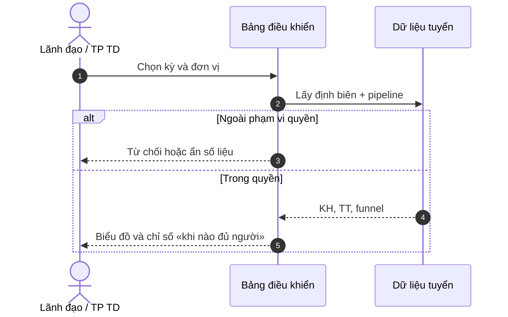
```mermaid
sequenceDiagram
  autonumber
  actor LD as Lãnh đạo / TP TD
  participant DB as Bảng điều khiển
  participant REC as Dữ liệu tuyển

  LD->>DB: Chọn kỳ và đơn vị
  DB->>REC: Lấy định biên + pipeline
  alt Ngoài phạm vi quyền
    DB-->>LD: Từ chối hoặc ẩn số liệu
  else Trong quyền
    REC-->>DB: KH, TT, funnel
    DB-->>LD: Biểu đồ và chỉ số «khi nào đủ người»
  end
```

#### Diễn biến nghiệp vụ

| # | Tương tác | Điều kiện / quy tắc | Kết quả hoặc lỗi |
|---|-----------|---------------------|------------------|
| 1 | Chọn kỳ / đơn vị | Trong quyền | Bộ lọc áp dụng |
| 2 | Tải chỉ số | Có hoặc không có dữ liệu | KH vs TT + funnel |
| 3 | Khoan xuống YCTD / pipeline | Có quyền | Chi tiết tiến độ từng yêu cầu |
| Thành công | — | — | Người dùng thấy tiến độ tuyển; không lộ C&B; UC kế = điều chỉnh định biên hoặc đẩy YCTD |

---

### FR-UC-BP-CORE-01 — Hồ sơ vòng công khai

#### Thông tin chung

| Mục | Nội dung |
|-----|----------|
| Tác nhân | HCNS, quản lý, nhân viên (xem hồ sơ được phép) |
| Ưu tiên | Cao |
| Tiên quyết | Đã có hồ sơ nhân sự (sau offer hoặc tạo nội bộ) |
| Hậu điều kiện | Hồ sơ chung không lộ lương / MST / ngân hàng / sổ BHXH; hiển thị tổng hợp từ các module nguồn |
| Liên hệ phần mềm hiện tại | Có hồ sơ cơ bản; tách vòng chưa đủ như họp |
| BR | BR-BP-SEC-01 |
| partner_req_id | REQ_HR_001, HR-001 |

#### Dữ liệu đầu vào

| Trường | Bắt buộc | Quy tắc |
|--------|----------|---------|
| Họ tên, mã nhân sự | Có | Định dạng hợp lệ |
| Thông tin công việc | Có | Bộ phận, chức vụ, email làm việc, ĐT làm việc — không gồm phụ cấp tiền |
| Thông tin cá nhân | Có theo checklist | Ngày sinh, CCCD, địa chỉ, liên hệ khẩn cấp |
| Người phụ thuộc | Không | Quan hệ, năm sinh — phục vụ thống kê quà 1/6 và GTCG (đồng bộ C&B khi đủ quyền) |
| Lịch sử công tác (đọc) | Hệ thống | Tổng hợp từ quyết định bổ nhiệm / thuyên chuyển — **không** chỉ form ghi nhận rời |
| Trạng thái hồ sơ | Hệ thống | Chờ hoàn thiện / Hoạt động / … |

#### Luồng chính

1. Người dùng mở hồ sơ nhân sự (vai trò không C&B hoặc chế độ xem chung) — hồ sơ là **bảng tổng hợp** (dashboard đọc).
2. Hệ thống chỉ trả / hiển thị trường vòng công khai; dữ liệu skill / lịch sử công tác / thuyên chuyển lấy từ module nguồn tương ứng khi đã có.
3. Cập nhật thông tin hành chính / cá nhân / người phụ thuộc được phép → lưu trên SoT nhóm đó.
4. Lọc điều kiện quà thiếu nhi dùng năm sinh người phụ thuộc / cờ đủ điều kiện — không mở vòng C&B.
5. Lương, phụ cấp tiền, MST, ngân hàng, bảo hiểm chi tiết → chỉ qua FR-UC-BP-CORE-02 / hợp đồng–BH.

#### Quy tắc nghiệp vụ

- BR-BP-SEC-01: Hồ sơ chung **không** trả lương cơ bản, phụ cấp tiền, MST, ngân hàng, số sổ BHXH, tỷ lệ đóng.
- **Field cấm** trên form tạo / sửa hồ sơ công khai và tab công khai của hồ sơ: lương cơ bản, phụ cấp tiền, tài khoản ngân hàng, mã số thuế, số sổ / số bảo hiểm chi tiết (mức đóng, tỷ lệ). Các field này chỉ thuộc FR-UC-BP-CORE-02 / hợp đồng–bảo hiểm.
- Tab hoặc khối mang nhãn lương / thu nhập trên hồ sơ phải **ẩn với vai trò không C&B**, hoặc chuyển hướng rõ sang màn hợp đồng–bảo hiểm / vòng C&B — không để sửa mật trên cùng form hành chính.
- «Có thông tin gia đình / người phụ thuộc» ≠ được xem lương.
- Quản lý công việc / dự án / giao việc **không** nằm trong hồ sơ HCNS.
- Kiêm nhiệm: phạm vi đơn vị theo thành viên đang chọn.
- Quyết định bổ nhiệm / thuyên chuyển đã hiệu lực phải phản ánh trên lịch sử công tác của hồ sơ (chi tiết FR-UC-BP-CORE-01a).

#### Trường hợp đặc biệt

| Tình huống | Hệ thống xử lý |
|------------|----------------|
| API/UI cố tình bind lương lên profile chung | Coi là lỗi thiết kế — phải chặn |
| User không C&B mở tạo/sửa hồ sơ | Không hiện / không lưu được field mật; tải lại trang vẫn không lộ |
| User C&B mở đúng màn C&B | Chuyển FR-UC-BP-CORE-02 |
| Thiếu dữ liệu người phụ thuộc khi chạy quà 1/6 | Báo thiếu điều kiện — không suy luận từ vòng C&B |
| Nhét module giao việc vào hồ sơ | Ngoài phạm vi — từ chối thiết kế |

#### Sơ đồ tương tác

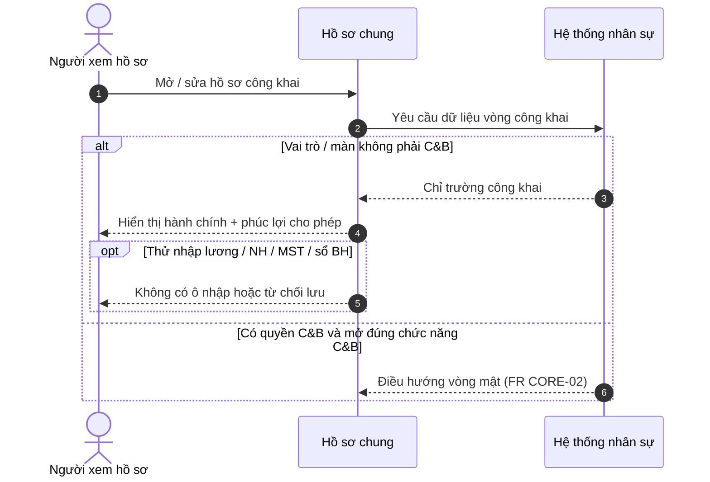
```mermaid
sequenceDiagram
  autonumber
  actor NV as Người xem hồ sơ
  participant UI as Hồ sơ chung
  participant HT as Hệ thống nhân sự

  NV->>UI: Mở / sửa hồ sơ công khai
  UI->>HT: Yêu cầu dữ liệu vòng công khai
  alt Vai trò / màn không phải C&B
    HT-->>UI: Chỉ trường công khai
    UI-->>NV: Hiển thị hành chính + phúc lợi cho phép
    opt Thử nhập lương / NH / MST / sổ BH
      UI-->>NV: Không có ô nhập hoặc từ chối lưu
    end
  else Có quyền C&B và mở đúng chức năng C&B
    HT-->>UI: Điều hướng vòng mật (FR CORE-02)
  end
```

#### Diễn biến nghiệp vụ

| # | Tương tác | Điều kiện / quy tắc | Kết quả hoặc lỗi |
|---|-----------|---------------------|------------------|
| 1 | Mở hồ sơ chung | Đã đăng nhập, trong phạm vi | Form công khai |
| 2 | Lưu thay đổi hành chính | Field hợp lệ; không gồm field mật | Bản ghi cập nhật |
| 3 | Thử xem / sửa lương·NH·MST·sổ BH trên màn chung | Không quyền C&B trên màn này | Không có dữ liệu / ô nhập mật |
| 4 | Tải lại trang sau lưu hành chính | Đã lưu 2xx | Field mật vẫn không lộ trên hồ sơ công khai |
| Thành công | — | — | Hồ sơ công khai đúng lớp; quà 1/6 dùng người phụ thuộc; UC kế = checklist / hợp đồng / C&B / CORE-01a |

**Tiêu chí chấp nhận (bổ sung):**

| Mã | Đạt khi | Không đạt khi |
|----|---------|----------------|
| AC-CORE-PUB-01 | Vai trò không C&B không thấy và không sửa lương cơ bản, phụ cấp tiền, ngân hàng, MST, số sổ BH chi tiết trên tạo/sửa hồ sơ công khai và tab công khai | Field mật hiện hoặc lưu được trên form công khai |
| AC-CORE-PUB-02 | Sau lưu hành chính thành công và tải lại trang, hồ sơ công khai vẫn không lộ field mật | Tải lại trang lộ lương / NH / MST / sổ BH |
| AC-CORE-CB-MAP-01 | Khối mang nhãn lương / thu nhập trên hồ sơ hoặc ẩn với không-C&B, hoặc chuyển rõ sang màn hợp đồng–bảo hiểm / vòng C&B | Cùng form hành chính vừa sửa hành chính vừa sửa lương |

---

### FR-UC-BP-CORE-01a — Quyết định hiệu lực → lịch sử công tác

#### Thông tin chung

| Mục | Nội dung |
|-----|----------|
| Tác nhân | HCNS · Lãnh đạo (theo quyền duyệt) |
| Ưu tiên | Cao — MVP |
| Tiên quyết | Có hồ sơ nhân sự trong phạm vi; loại quyết định bổ nhiệm / thuyên chuyển (hoặc loại cấu hình theo đơn vị trên danh mục mở) đã sẵn sàng |
| Hậu điều kiện | Quyết định gắn người đã hiệu lực tạo / cập nhật dòng lịch sử công tác; hồ sơ sau tải lại vẫn thấy dòng; chức danh lấy từ danh mục |
| Liên hệ phần mềm hiện tại | Có danh sách quyết định và lịch sử công tác; liên kết tự động và bắt buộc chọn nhân viên chưa đủ như họp |
| BR | BR-BP-WH-01 · BR-BP-DEC-EMP-01 |

**Mục đích:** Khi quyết định bổ nhiệm / thuyên chuyển có hiệu lực, lịch sử công tác trên hồ sơ phản ánh đúng chức danh và bộ phận — không chỉ ghi tên nhân viên bằng chữ, không để người dùng gõ chức danh tự do làm nguồn sự thật.

#### Dữ liệu đầu vào

| Trường | Bắt buộc | Quy tắc |
|--------|----------|---------|
| Loại quyết định | Có | Chọn từ danh mục loại quyết định của đơn vị (catalog mở — mã mới sau cấu hình vẫn chọn được); thuộc nhóm gắn người khi cấu hình yêu cầu (bổ nhiệm, thuyên chuyển, …) |
| Nhân viên | Có | Chọn từ danh sách hồ sơ trong phạm vi pháp nhân — **không** chỉ nhập tên chữ |
| Chức danh | Có | Chọn từ danh mục chức danh đã đồng bộ / cấu hình; mã chức danh là nguồn sự thật |
| Bộ phận | Có khi nghiệp vụ yêu cầu | Chọn từ danh mục phòng ban đã đồng bộ / cấu hình (Cài đặt / khung tập đoàn); mã phòng ban là nguồn sự thật — không chữ tự do |
| Ngày hiệu lực | Có | dd/MM/yyyy; quyết định phải ở trạng thái hiệu lực mới ghi lịch sử |
| Tham chiếu quyết định | Hệ thống | Mỗi dòng lịch sử tự động gắn mã quyết định nguồn |

#### Luồng chính

1. HCNS mở tạo / sửa quyết định loại gắn người → **chọn nhân viên** trong phạm vi (bắt buộc).
2. Chọn loại, chức danh (danh mục), bộ phận, ngày hiệu lực → Lưu.
3. Khi quyết định chuyển / đã ở trạng thái **hiệu lực** → hệ thống tạo hoặc cập nhật dòng lịch sử công tác (chức danh, bộ phận, ngày hiệu lực, tham chiếu quyết định).
4. Mở hồ sơ nhân viên → tab lịch sử công tác → thấy dòng mới; tải lại trang vẫn còn.
5. Tạo / sửa dòng lịch sử thủ công (nếu được phép): chức danh và bộ phận vẫn phải chọn từ danh mục — cấm ô chữ tự do làm nguồn sự thật.

#### Quy tắc nghiệp vụ

- BR-BP-DEC-EMP-01: Với loại quyết định gắn người, **bắt buộc** chọn nhân viên trước khi lưu hiệu lực; không chấp nhận chỉ có tên chữ mà thiếu chọn hồ sơ.
- BR-BP-WH-01: Dòng lịch sử sinh từ quyết định mang tham chiếu quyết định; chức danh và phòng ban = mã danh mục tương ứng — không free-text SoT.
- Khi đơn vị đã có danh mục loại quyết định: tạo / sửa quyết định chỉ nhận mã thuộc danh mục đang hiệu lực; loại đã nghỉ vẫn hiển thị trên phiếu cũ nhưng không còn trên bộ chọn mới.
- Sửa / hủy quyết định theo quy tắc tenant: cập nhật hoặc đánh dấu dòng lịch sử tương ứng — không xóa im lặng lịch sử đã dùng cho báo cáo.
- Loại quyết định **không gắn người** (nếu cấu hình có) giữ quy tắc riêng — không bắt buộc nhân viên.

#### Trường hợp đặc biệt

| Tình huống | Hệ thống xử lý |
|------------|----------------|
| Lưu quyết định gắn người mà chưa chọn nhân viên | Chặn lưu; thông báo cần chọn nhân viên |
| Mã loại quyết định không thuộc danh mục đang hiệu lực (khi đơn vị đã có danh mục) | Chặn lưu; yêu cầu chọn lại từ danh mục |
| Danh mục chức danh trống | Chặn chọn / lưu; hướng dẫn cấu hình danh mục — không cho gõ chữ thay thế |
| Quyết định chưa hiệu lực | Chưa ghi dòng lịch sử tự động |
| Nhân viên ngoài phạm vi pháp nhân | Từ chối gắn |

#### Sơ đồ tương tác

```mermaid
sequenceDiagram
  autonumber
  actor HR as HCNS
  participant QD as Quyết định
  participant HS as Hồ sơ / lịch sử công tác
  participant DM as Danh mục chức danh

  HR->>QD: Tạo quyết định gắn người
  alt Chưa chọn nhân viên
    QD-->>HR: Chặn lưu — bắt buộc chọn hồ sơ
  else Đã chọn nhân viên + chức danh danh mục
    HR->>DM: Chọn chức danh
    HR->>QD: Lưu / hiệu lực
    QD->>HS: Tạo hoặc cập nhật dòng lịch sử
    HS-->>HR: Hồ sơ hiển thị dòng; tải lại vẫn còn
  end
```

#### Diễn biến nghiệp vụ

| # | Tương tác | Điều kiện / quy tắc | Kết quả hoặc lỗi |
|---|-----------|---------------------|------------------|
| 1 | Mở form quyết định gắn người | Có quyền HCNS | Form yêu cầu chọn nhân viên |
| 2 | Chọn nhân viên + chức danh danh mục | Trong phạm vi; danh mục có dữ liệu | Sẵn sàng lưu |
| 3 | Lưu khi thiếu chọn nhân viên | Loại gắn người | Chặn — không tạo bản ghi hiệu lực |
| 4 | Quyết định hiệu lực | Đủ field | Dòng lịch sử có tham chiếu quyết định + mã chức danh |
| 5 | Mở hồ sơ → lịch sử + tải lại | Sau bước 4 | Thấy dòng; không chỉ tên chữ không hồ sơ |
| 6 | Sửa lịch sử thủ công | Được phép | Chức danh / bộ phận = chọn danh mục; từ chối chữ tự do SoT |
| Thành công | — | — | Lịch sử khớp quyết định; UC kế = hồ sơ công khai / tổ chức |

**Tiêu chí chấp nhận:**

| Mã | Đạt khi | Không đạt khi |
|----|---------|----------------|
| AC-DEC-WH-01 | Loại gắn người: không lưu được khi chưa chọn nhân viên trong phạm vi | Lưu chỉ với tên chữ, thiếu chọn hồ sơ |
| AC-DEC-WH-02 | Sau hiệu lực: hồ sơ có dòng lịch sử gắn tham chiếu quyết định | Không có dòng hoặc không gắn quyết định nguồn |
| AC-DEC-WH-03 | Chức danh trên dòng tự động = mã danh mục; không ô chữ tự do SoT | Gõ tay chức danh làm nguồn sự thật |
| AC-DEC-WH-04 | Tải lại hồ sơ vẫn thấy dòng; hủy/sửa quyết định cập nhật theo quy tắc, không mất im lặng | Mất dòng sau tải lại / xóa im lặng |
| AC-WH-PICK-01 | Mọi tạo/sửa lịch sử công tác: chức danh chọn từ danh mục có tìm kiếm | Ô nhập chữ tự do lưu DB |
| AC-WH-PICK-02 | Bộ phận (khi bắt buộc) = mã danh mục | Lưu tên bộ phận chữ tự do làm SoT |
| AC-WH-PICK-03 | Danh mục trống → chặn lưu + hướng dẫn cấu hình; không cho thoát bằng chữ tay | Vẫn lưu được chữ tay khi danh mục trống |

---

### FR-UC-BP-CORE-02 — Hồ sơ vòng C&B

#### Thông tin chung

| Mục | Nội dung |
|-----|----------|
| Tác nhân | C&B / Payroll (đủ quyền) |
| Ưu tiên | Cao |
| Tiên quyết | Membership có quyền C&B đúng đơn vị |
| Hậu điều kiện | Mọi đọc/sửa vòng mật có nhật ký truy cập; PAY đọc được biến lương/GTCG khi tính kỳ |
| Liên hệ phần mềm hiện tại | Phân quyền có một phần; tách vòng + audit cần chốt đủ |
| BR | BR-BP-SEC-02 |
| partner_req_id | HR-001 |

#### Dữ liệu đầu vào

| Trường | Bắt buộc | Quy tắc |
|--------|----------|---------|
| Lương cơ bản / phụ cấp tiền | Theo nghiệp vụ | Version theo ngày hiệu lực — **không** lưu trên hồ sơ công khai |
| MST, tài khoản ngân hàng | Theo checklist pháp lý | Che một phần khi chỉ xem |
| Số sổ BHXH / số BH (= CCCD khi áp dụng), tỷ lệ, mức đóng NV/CTY theo kỳ | Theo chính sách | Timeline theo kỳ; không đưa ra API hồ sơ chung |
| Loại bảo hiểm (khi tạo chính sách / gắn người) | Khi danh mục hiệu lực còn phần tử | Chọn từ danh mục loại BH chuẩn (FR-UC-BP-CORE-10) — không chữ tự do làm nguồn sự thật |
| Nhà bảo hiểm (khi tạo / sửa chính sách) | Khi danh mục nhà BH hiệu lực còn phần tử | Chọn từ danh mục nhà BH chuẩn (FR-UC-BP-CORE-10) — **không** gộp với ô loại BH |
| Người phụ thuộc (GTCG) | Không | Đồng bộ từ hồ sơ công khai / SoT phụ thuộc — không nhập trùng trên payroll |

#### Luồng chính

1. User C&B mở chức năng vòng mật đúng nhân sự + đơn vị.
2. Hệ thống kiểm tra quyền membership; ghi nhận truy cập.
3. Xem / sửa theo ngày hiệu lực → lưu phiên bản.
4. Module lương (kỳ mở) đọc biến từ phiên bản hiệu lực — không từ hồ sơ công khai.

#### Quy tắc nghiệp vụ

- BR-BP-SEC-02: Chỉ membership C&B đọc/ghi vòng mật; CEO đơn vị **không** C&B thì không xem lương trên profile.
- Lương cơ bản, phụ cấp tiền, ngân hàng, MST, mức BH theo timeline thuộc **module hợp đồng–bảo hiểm / vòng C&B** — không lưu trên hồ sơ công khai (FR-UC-BP-CORE-01).
- Kiêm nhiệm: C&B công ty A không đọc vòng mật công ty B.
- Không ghi đè lịch sử kỳ lương đã trả bằng cách xóa version cũ im lặng.

#### Trường hợp đặc biệt

| Tình huống | Hệ thống xử lý |
|------------|----------------|
| Không đủ quyền | Từ chối truy cập |
| Sửa lương kỳ đã khóa phiếu | Chặn hoặc chỉ tạo version kỳ sau |
| Đồng bộ NPT | Một nguồn trên hồ sơ C&B |

#### Sơ đồ tương tác

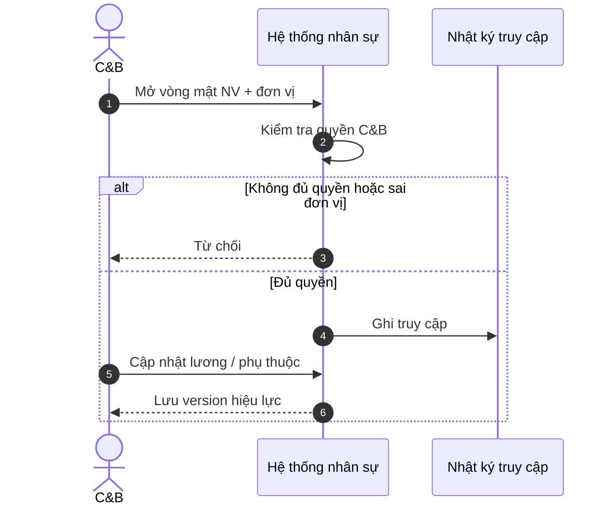
```mermaid
sequenceDiagram
  autonumber
  actor CB as C&B
  participant HT as Hệ thống nhân sự
  participant LG as Nhật ký truy cập

  CB->>HT: Mở vòng mật NV + đơn vị
  HT->>HT: Kiểm tra quyền C&B
  alt Không đủ quyền hoặc sai đơn vị
    HT-->>CB: Từ chối
  else Đủ quyền
    HT->>LG: Ghi truy cập
    CB->>HT: Cập nhật lương / phụ thuộc
    HT-->>CB: Lưu version hiệu lực
  end
```

#### Diễn biến nghiệp vụ

| # | Tương tác | Điều kiện / quy tắc | Kết quả hoặc lỗi |
|---|-----------|---------------------|------------------|
| 1 | Mở vòng mật | Quyền C&B đúng CT | Form mật + audit |
| 2 | Lưu thay đổi | Ngày hiệu lực hợp lệ | Version mới |
| 3 | Sai đơn vị kiêm nhiệm | — | Từ chối |
| 4 | Đọc lại hồ sơ công khai sau khi sửa C&B | Vai trò không C&B / màn công khai | Không thấy lương·NH·MST·sổ BH vừa sửa |
| Thành công | — | — | Vòng mật cập nhật; PAY có biến đọc; không lộ qua hồ sơ chung |

**Tiêu chí chấp nhận (bổ sung):**

| Mã | Đạt khi | Không đạt khi |
|----|---------|----------------|
| AC-CORE-CB-01 | Biến mật (lương, phụ cấp tiền, NH, MST, mức BH chi tiết) chỉ đọc/sửa trên màn hợp đồng–bảo hiểm / vòng C&B đủ quyền | Nhập được trên form hồ sơ công khai |
| AC-CORE-CB-02 | Sau lưu C&B thành công và tải lại: hồ sơ công khai (FR-UC-BP-CORE-01) vẫn không lộ biến mật | Tải lại hồ sơ chung lộ field vừa lưu ở C&B |

---

### FR-UC-BP-CORE-08 — Khen thưởng & kỷ luật đẩy vào bảng lương

#### Thông tin chung

| Mục | Nội dung |
|-----|----------|
| Tác nhân | HCNS, C&B, Kế toán lương |
| Ưu tiên | Cao |
| Tiên quyết | Hồ sơ nhân viên Hoạt động; có quyền ghi khen thưởng / kỷ luật |
| Hậu điều kiện | Bản ghi có trạng thái thi hành; số tiền xuất hiện đúng kỳ lương đích khi Đang/Đã thi hành |
| Liên hệ phần mềm hiện tại | Thường ghi chú nhân sự — thiếu liên kết biến kỳ lương |
| BR | BR-BP-RD-01 |
| partner_req_id | HR-005 |

#### Dữ liệu đầu vào

| Trường | Bắt buộc | Quy tắc |
|--------|----------|---------|
| Nhân viên | Có | Hồ sơ Hoạt động trong phạm vi |
| Tiêu đề | Có | Hiển thị **trước** các trường chi tiết trên form |
| Loại (thưởng / kỷ luật) | Có | Trong danh mục |
| Số tiền | Có khi ảnh hưởng lương | ≥ 0 — nếu có tiền thì bắt buộc gắn kỳ lương đích |
| Kỳ lương đích | Có khi có số tiền | Kỳ chưa khóa hoặc kỳ điều chỉnh có quyền |
| Trạng thái thi hành | Có | Chờ / Đang / **Đã thi hành** / Hủy |
| Lý do / quyết định kèm | Có | Văn bản hoặc mã quyết định nội bộ |

#### Luồng chính

1. HCNS tạo bản ghi khen thưởng / kỷ luật: nhập **tiêu đề** trước, rồi loại, số tiền (nếu có) và kỳ lương đích.
2. Chuyển trạng thái thi hành theo quy trình duyệt nội bộ (Chờ → Đang/Đã thi hành).
3. Khi Đang hoặc **Đã thi hành** → hệ thống đẩy biến thưởng/phạt vào bảng lương kỳ đích (qua động cơ thành phần — không ghi cứng ngoài cấu hình lương). Chỉ ghi chú không gắn kỳ → **không** lên phiếu.
4. C&B / kế toán lương kiểm tra biến trên kỳ mở trước khi chốt phiếu.
5. Hủy thi hành trên kỳ chưa khóa → biến không còn trên kỳ đó.

#### Quy tắc nghiệp vụ

- BR-BP-RD-01: bản ghi Đang/Đã thi hành xuất hiện đúng kỳ đích dưới thành phần thưởng/phạt.
- Hủy thi hành → không vào kỳ chưa chốt.
- Sau khi kỳ đã khóa → không sửa phiếu đã khóa; điều chỉnh kỳ sau có nhật ký.
- Một khoản không được vào hai kỳ cùng lúc.

#### Trường hợp đặc biệt

| Tình huống | Hệ thống xử lý |
|------------|----------------|
| Chỉ ghi chú không gắn kỳ | Không lên phiếu lương |
| Cùng khoản gắn hai kỳ | Từ chối hoặc cảnh báo trùng |
| Đổi thi hành sau chốt kỳ | Không sửa phiếu đã khóa; mở điều chỉnh kỳ sau |
| Nhân viên không Hoạt động | Từ chối tạo hoặc chặn thi hành vào kỳ |

#### Sơ đồ tương tác

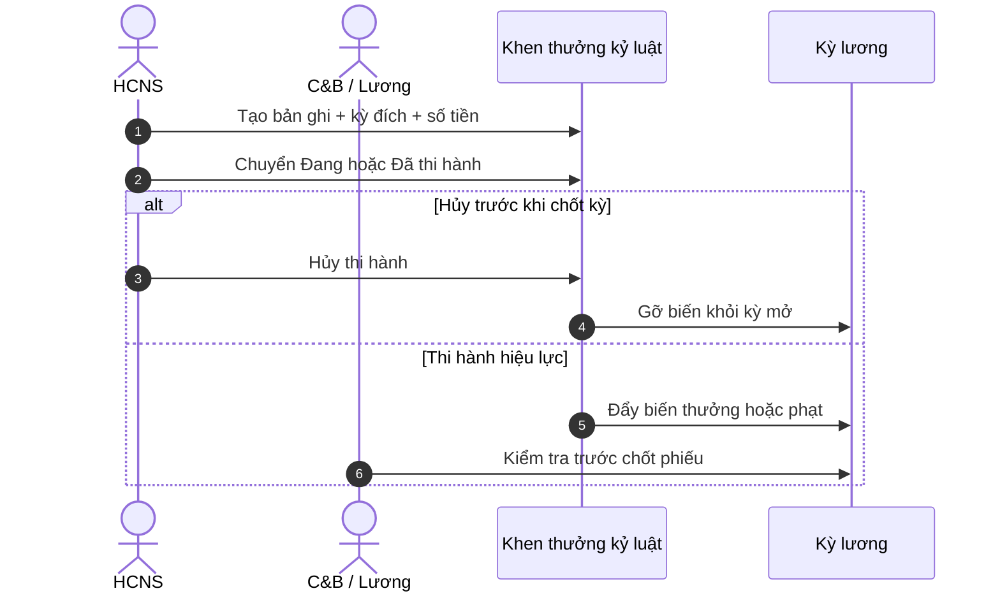
```mermaid
sequenceDiagram
  autonumber
  actor HR as HCNS
  actor CB as C&B / Lương
  participant KT as Khen thưởng kỷ luật
  participant PAY as Kỳ lương

  HR->>KT: Tạo bản ghi + kỳ đích + số tiền
  HR->>KT: Chuyển Đang hoặc Đã thi hành
  alt Hủy trước khi chốt kỳ
    HR->>KT: Hủy thi hành
    KT->>PAY: Gỡ biến khỏi kỳ mở
  else Thi hành hiệu lực
    KT->>PAY: Đẩy biến thưởng hoặc phạt
    CB->>PAY: Kiểm tra trước chốt phiếu
  end
```

#### Diễn biến nghiệp vụ

| # | Tương tác | Điều kiện / quy tắc | Kết quả hoặc lỗi |
|---|-----------|---------------------|------------------|
| 1 | Tạo bản ghi KT/KL | Hồ sơ Hoạt động | Bản ghi Chờ |
| 2 | Chuyển thi hành | Có quyền | Đang/Đã thi hành |
| 3 | Đẩy vào kỳ lương | BR-BP-RD-01 | Biến thưởng/phạt trên kỳ đích |
| 4 | Hủy thi hành | Kỳ chưa khóa | Không còn trên kỳ mở |
| 5 | Sửa sau chốt kỳ | Kỳ đã khóa | Từ chối — điều chỉnh kỳ sau |
| Thành công | — | — | Phiếu lương kỳ đích phản ánh đúng khoản đang thi hành; không ghi chú suông |


---

### FR-UC-BP-ATT-02 — Phạt muộn / về sớm đa chế độ

#### Thông tin chung

| Mục | Nội dung |
|-----|----------|
| Tác nhân | HCNS, C&B, Nhân viên (chấm công) |
| Ưu tiên | Cao |
| Tiên quyết | Có **định nghĩa ca** + **phân ca / lịch làm việc** đang gán; cấu hình chế độ phạt theo bộ phận / ca / lịch |
| Hậu điều kiện | Cùng thời điểm chấm → giờ công thô + mức phạt khớp **một** chế độ cấu hình và ca·lịch đang áp dụng |
| Liên hệ phần mềm hiện tại | Có chấm công; chưa đủ tách phút / block / bậc + nguồn hợp lệ |
| BR | BR-BP-SHF-02 |
| partner_req_id | TIME-002 |

#### Dữ liệu đầu vào

| Trường | Bắt buộc | Quy tắc |
|--------|----------|---------|
| Đơn vị / bộ phận / ca / lịch tuần | Có | Phạm vi cấu hình — **không** một rule giờ cứng cho cả công ty bỏ qua ca |
| Chế độ phạt | Có | Đúng một: theo phút **hoặc** theo block **hoặc** theo khoảng/bậc |
| Bảng mức phạt | Có khi bật phạt | Khớp chế độ đã chọn |
| Nguồn chấm hợp lệ | Có | Ứng dụng / mạng nội bộ / tọa độ / máy — theo danh sách đơn vị |
| Cờ tắt phạt | Không | Tắt → số phạt = 0 |

#### Luồng chính

1. C&B chọn đúng **một** chế độ phạt gắn bộ phận/ca (và lịch làm việc tuần nếu khác nhau) rồi nhập bảng mức.
2. Nhân viên chấm bằng nguồn trong danh sách hợp lệ (kênh mobile hoặc tương đương khi đơn vị dùng app).
3. Hệ thống đối chiếu giờ vào/ra với **ca và lịch đang gán** (không đối chiếu một khung giờ cố định toàn công ty) → tính phút muộn / về sớm.
4. Áp mức phạt theo chế độ đã cấu hình; đưa số phạt vào phễu bảng công kỳ.
5. Nếu tắt phạt trên cấu hình → ghi nhận giờ nhưng số phạt = 0.

#### Quy tắc nghiệp vụ

- BR-BP-SHF-02: không lẫn nhiều chế độ cùng lúc trên một bộ phận/ca không có nguồn sự thật duy nhất.
- Phân ca / lịch làm việc **khác** định nghĩa ca: định nghĩa ca = khung giờ·hệ số; phân ca = gán NV/tuần — quy tắc giờ và phạt bám cả hai.
- Nguồn ngoài danh sách hợp lệ → từ chối ghi nhận hoặc 0 công (theo chính sách đơn vị đã cấu hình).
- Phạt chỉ tính khi có thời điểm chấm hợp lệ khớp ca·lịch đang gán.

#### Trường hợp đặc biệt

| Tình huống | Hệ thống xử lý |
|------------|----------------|
| Chấm ngoài vùng tọa độ khi bắt buộc | Từ chối hoặc bắt giải trình |
| Cấu hình lẫn phút + bậc cùng lúc | Từ chối lưu cấu hình |
| Tắt phạt | Số phạt = 0; vẫn lưu giờ nếu nguồn hợp lệ |
| Không có ca gán | Cảnh báo — không tự bịa ca để phạt |

#### Sơ đồ tương tác

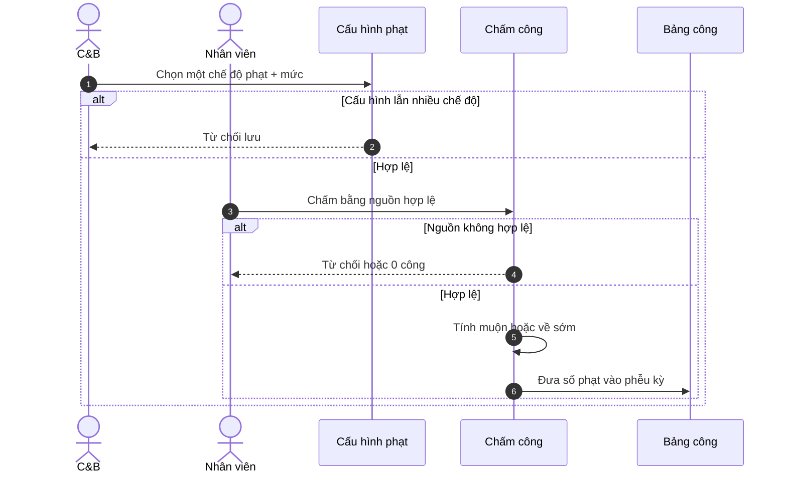
```mermaid
sequenceDiagram
  autonumber
  actor CB as C&B
  actor NV as Nhân viên
  participant CFG as Cấu hình phạt
  participant CC as Chấm công
  participant BC as Bảng công

  CB->>CFG: Chọn một chế độ phạt + mức
  alt Cấu hình lẫn nhiều chế độ
    CFG-->>CB: Từ chối lưu
  else Hợp lệ
    NV->>CC: Chấm bằng nguồn hợp lệ
    alt Nguồn không hợp lệ
      CC-->>NV: Từ chối hoặc 0 công
    else Hợp lệ
      CC->>CC: Tính muộn hoặc về sớm
      CC->>BC: Đưa số phạt vào phễu kỳ
    end
  end
```

#### Diễn biến nghiệp vụ

| # | Tương tác | Điều kiện / quy tắc | Kết quả hoặc lỗi |
|---|-----------|---------------------|------------------|
| 1 | Cấu hình chế độ | Đúng một mode | Lưu cấu hình |
| 2 | Chấm công | Nguồn trong danh sách | Thời điểm hợp lệ |
| 3 | Tính phạt | BR-BP-SHF-02 | Phút/block/bậc khớp |
| 4 | Nguồn ngoài danh sách | Chính sách đơn vị | Từ chối hoặc 0 công |
| 5 | Tắt phạt | Cờ tắt | Phạt = 0 |
| Thành công | — | — | Cùng lần chấm → giờ + phạt nhất quán; số phạt vào bảng công kỳ |


---

### FR-UC-BP-ATT-08 — Tính ngày trừ phép xuyên cuối tuần và lễ

#### Thông tin chung

| Mục | Nội dung |
|-----|----------|
| Tác nhân | Nhân viên (nộp), Quản lý (duyệt), Hệ thống (tính ngày) |
| Ưu tiên | Cao — edge P0 |
| Tiên quyết | Có lịch làm việc / ngày lễ đơn vị; loại phép trừ quỹ |
| Hậu điều kiện | Số ngày trừ quỹ = số ngày làm việc trong khoảng; T7/CN/Lễ = 0 |
| Liên hệ phần mềm hiện tại | Cần chốt lại so với thuật toán hiện tại |
| BR | **BR-BP-LV-05** (kèm BR-BP-LV-06 khi duyệt) |
| partner_req_id | REQ_NP_006 |

#### Dữ liệu đầu vào

| Trường | Bắt buộc | Quy tắc |
|--------|----------|---------|
| Từ ngày — đến ngày | Có | Đến ≥ Từ |
| Loại phép | Có | Có trừ quỹ |
| Lịch lễ / nghỉ đơn vị | Hệ thống | Theo pháp nhân |
| Đơn vị tối thiểu | Cấu hình | Nửa ngày hoặc 1 giờ — Q-LEAVE-UNIT |

#### Luồng chính

1. Nhân viên chọn khoảng nghỉ (ví dụ thứ Sáu → thứ Hai).
2. Hệ thống liệt kê từng ngày calendar trong khoảng.
3. Loại bỏ thứ Bảy, Chủ nhật, ngày lễ theo lịch đơn vị.
4. Hiển thị **số ngày trừ quỹ** (ví dụ chuẩn = 2) trước khi gửi.
5. Sau duyệt (UC-BP-ATT-09): quỹ giảm đúng số ngày trừ — không theo số ngày calendar.

#### Quy tắc nghiệp vụ

- **BR-BP-LV-05:** Ví dụ chuẩn T6→T2 = **2** ngày trừ quỹ (T6 và T2); T7/CN/Lễ = 0.
- Chuỗi dài nhiều lễ xen kẽ: chỉ đếm ngày làm việc.
- Lịch nghỉ trên giao diện có thể hiện đủ khoảng calendar; cột «ngày trừ» = ngày làm việc.
- Không trừ calendar day rồi điều chỉnh tay sau — SoT là engine ngày làm việc.

#### Trường hợp đặc biệt

| Tình huống | Hệ thống xử lý |
|------------|----------------|
| Toàn bộ khoảng là lễ/T7/CN | Số trừ = 0 — cảnh báo trước khi gửi |
| Thiếu lịch lễ năm | Chặn nộp hoặc dùng lịch nháp có cảnh báo (chốt chính sách) |
| Nửa ngày đầu/cuối | Theo Q-LEAVE-UNIT đã cấu hình |
| Hai đơn chồng khoảng | Chặn hoặc gộp theo rule cấu hình |

#### Sơ đồ tương tác

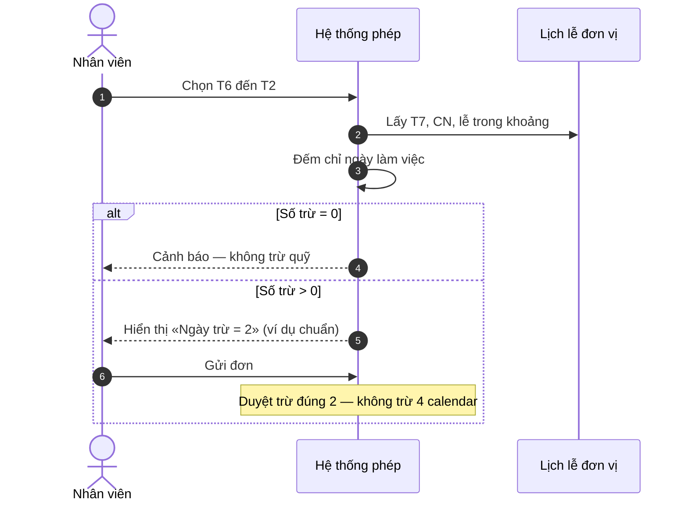
```mermaid
sequenceDiagram
  autonumber
  actor NV as Nhân viên
  participant HT as Hệ thống phép
  participant Lich as Lịch lễ đơn vị

  NV->>HT: Chọn T6 đến T2
  HT->>Lich: Lấy T7, CN, lễ trong khoảng
  HT->>HT: Đếm chỉ ngày làm việc
  alt Số trừ = 0
    HT-->>NV: Cảnh báo — không trừ quỹ
  else Số trừ > 0
    HT-->>NV: Hiển thị «Ngày trừ = 2» (ví dụ chuẩn)
    NV->>HT: Gửi đơn
    Note over HT: Duyệt trừ đúng 2 — không trừ 4 calendar
  end
```

#### Diễn biến nghiệp vụ

| # | Tương tác | Điều kiện / quy tắc | Kết quả hoặc lỗi |
|---|-----------|---------------------|------------------|
| 1 | Chọn khoảng nghỉ | Loại phép trừ quỹ | Preview calendar |
| 2 | Tính ngày trừ | BR-BP-LV-05 | Số ngày làm việc |
| 3 | Gửi đơn | Số trừ ≥ đơn vị tối thiểu hoặc = 0 có xác nhận | Đơn chờ duyệt / cảnh báo |
| 4 | Duyệt | BR-BP-LV-06 | Quỹ giảm đúng ngày trừ |
| FAIL | Trừ 4 calendar cho T6–T2 | — | **Không đạt** AC |
| Thành công | — | — | NV thấy ngày trừ đúng; quỹ khớp; lịch sử có cột ngày trừ |

---

### FR-UC-BP-ATT-09 — Giữ chỗ quỹ phép khi nộp và duyệt đơn

#### Thông tin chung

| Mục | Nội dung |
|-----|----------|
| Tác nhân | Nhân viên, Quản lý duyệt, Hệ thống quỹ phép |
| Ưu tiên | Cao |
| Tiên quyết | Có số dư / ứng phép theo cấu hình; khoảng nghỉ đã tính ngày trừ (FR-UC-BP-ATT-08) |
| Hậu điều kiện | Sau gửi: số khả dụng giảm theo giữ chỗ; sau duyệt: giữ chỗ → đã trừ; sau từ chối: hoàn giữ chỗ 100% |
| Liên hệ phần mềm hiện tại | Cần đối chiếu giữ chỗ ngay khi gửi — ưu tiên đối tác |
| BR | BR-BP-LV-06 · BR-BP-LV-05 |
| partner_req_id | REQ_NP_003; REQ_NP_006 |
| Decision | Q-LEAVE-UNIT = **Cả hai theo loại phép** (đã chốt) |

#### Dữ liệu đầu vào

| Trường | Bắt buộc | Quy tắc |
|--------|----------|---------|
| Loại phép | Có | Khi danh mục loại phép hiệu lực còn phần tử: **chọn từ danh mục** (tối thiểu khởi tạo: phép năm · thâm niên · bù OT · chuyển kỳ · ứng phép — **không** là trần; loại mở rộng đã bật trên quản trị cũng chọn được); trừ đúng quỹ loại đó khi loại yêu cầu trừ |
| Từ ngày — đến ngày | Có | Đến ≥ Từ |
| Số ngày trừ dự kiến | Hệ thống | Ngày làm việc theo FR trừ phép; đơn vị nửa ngày hoặc 1 giờ theo loại phép — Q-LEAVE-UNIT đã chốt «cả hai» |
| Số dư khả dụng | Hệ thống | Đủ cho giữ chỗ trên **đúng quỹ loại phép** (trừ khi cấu hình ứng phép cho phép) |

#### Luồng chính

1. Nhân viên chọn khoảng nghỉ; hệ thống hiển thị số ngày trừ (ngày làm việc — không trừ thứ Bảy, Chủ nhật, lễ).
2. Nhân viên gửi đơn → hệ thống **giữ chỗ** quỹ ngay (giảm khả dụng), không chờ duyệt mới giảm.
3. Quản lý duyệt → chuyển giữ chỗ thành đã trừ đúng số ngày trừ.
4. Từ chối → hoàn giữ chỗ 100% về khả dụng.
5. Đổi loại nghỉ khi đang giữ chỗ → tính lại số giữ chỗ; hai đơn chồng ngày → chặn đơn sau.

#### Quy tắc nghiệp vụ

- BR-BP-LV-06: gửi đơn không giữ chỗ → không chấp nhận (tránh đặt kép quỹ).
- BR-BP-LV-05: số trừ theo ngày làm việc (ví dụ chuẩn T6→T2 = 2).
- Chỉ nộp khi đã có quỹ theo chính sách cấp (ATT-04 / Q-LEAVE-ACCRUAL) hoặc được phép ứng phép (ATT-04b) trên **đúng loại phép** đã chọn.
- **BR-BP-LV-TYPE-01:** Đơn phải chọn loại phép thuộc **danh mục loại phép hiệu lực** của pháp nhân khi danh mục còn phần tử. Loại tắt / đã ngừng theo dõi → không chọn được trên đơn mới. Quản trị danh mục vẫn được **thêm mã mới** (không áp quy tắc «chỉ chọn mã đã có» lên màn quản trị).
- Danh mục mở rộng trên Cấu hình hệ thống (nếu có) **không** thay thế danh mục loại phép chuẩn khi chọn loại trên form nộp đơn.
- Đơn vị tối thiểu nửa ngày **hoặc** 1 giờ theo loại phép/ca — **Q-LEAVE-UNIT đã chốt**: cả hai theo loại phép (CRUD tenant), không khóa một đơn vị cho mọi loại.
- Hai đơn chồng khoảng ngày làm việc → chặn.
- **Phê duyệt giai đoạn 1:** Sau khi gửi và giữ chỗ, **một** quản lý trực tiếp duyệt hoặc từ chối là đủ để đơn kết thúc (đã duyệt / từ chối) và cập nhật quỹ. **Không** yêu cầu thêm cấp duyệt theo số ngày nghỉ trong giai đoạn 1.
- **Giai đoạn sau (chưa nghiệm thu giai đoạn 1):** Có thể mở rộng thang duyệt thêm cấp theo số ngày nghỉ, với ngưỡng do từng pháp nhân **cấu hình** — tài liệu này **không** khóa cứng một số ngày cắt cấp. Báo trước phép năm và giấy tờ nghỉ ốm là quy tắc **khi gửi đơn**, không phải ngưỡng phân cấp duyệt.

#### Trường hợp đặc biệt

| Tình huống | Hệ thống xử lý |
|------------|----------------|
| Từ chối sau giữ chỗ | Khả dụng hoàn đủ |
| Đổi loại phép khi đang giữ chỗ | Giải / giữ lại theo số mới |
| Chồng ngày với đơn khác | Từ chối gửi đơn thứ hai |
| Số trừ = 0 (toàn lễ/T7/CN) | Cảnh báo; giữ chỗ 0 hoặc chặn gửi theo cấu hình |
| Thiếu số dư và tắt ứng phép | Từ chối gửi |
| Loại phép không thuộc danh mục hiệu lực (khi còn phần tử) | Từ chối gửi **trước** giữ chỗ; sau tải lại không giữ mã lạ |
| Danh mục hiệu lực trống | Ô chọn trống + hướng dẫn tạo trên quản trị; không bịa dữ liệu mẫu |
| Kỳ vọng «hai cấp duyệt theo số ngày» trong giai đoạn 1 | **Chưa áp dụng** — chỉ quản lý trực tiếp; mở rộng thang duyệt = giai đoạn sau |

#### Sơ đồ tương tác

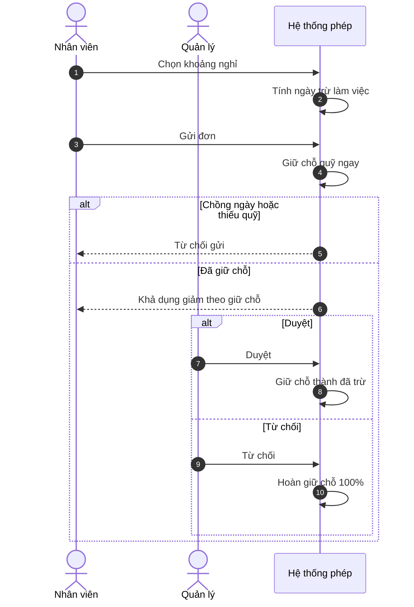
```mermaid
sequenceDiagram
  autonumber
  actor NV as Nhân viên
  actor QL as Quản lý
  participant HT as Hệ thống phép

  NV->>HT: Chọn khoảng nghỉ
  HT->>HT: Tính ngày trừ làm việc
  NV->>HT: Gửi đơn
  HT->>HT: Giữ chỗ quỹ ngay
  alt Chồng ngày hoặc thiếu quỹ
    HT-->>NV: Từ chối gửi
  else Đã giữ chỗ
    HT-->>NV: Khả dụng giảm theo giữ chỗ
    alt Duyệt
      QL->>HT: Duyệt
      HT->>HT: Giữ chỗ thành đã trừ
    else Từ chối
      QL->>HT: Từ chối
      HT->>HT: Hoàn giữ chỗ 100%
    end
  end
```

#### Diễn biến nghiệp vụ

| # | Tương tác | Điều kiện / quy tắc | Kết quả hoặc lỗi |
|---|-----------|---------------------|------------------|
| 0a | Chọn loại phép ∈ danh mục hiệu lực | BR-BP-LV-TYPE-01 · danh mục còn phần tử | Loại hợp lệ trên form |
| 0b | Gửi với loại ngoài danh mục | Danh mục còn phần tử | Từ chối **trước** giữ chỗ; không giữ mã lạ |
| 1 | Preview ngày trừ | BR-BP-LV-05 | Số ngày làm việc |
| 2 | Gửi đơn | BR-BP-LV-06 · loại ∈ danh mục | Giữ chỗ = số trừ dự kiến |
| 3 | Duyệt | Đúng cấp | Đã trừ; giữ chỗ giải |
| 4 | Từ chối | Có lý do | Hoàn giữ chỗ 100% |
| 5 | Chồng ngày | — | Chặn đơn sau |
| 6 | Đơn vị 0,5n / 1 giờ | Q-LEAVE-UNIT đã chốt | Theo cấu hình loại phép — không bịa một đơn vị khóa |
| Thành công | — | — | Không đặt kép quỹ; quỹ khớp duyệt/từ chối; UC kế = bảng công / báo cáo phép — **không** claim nghiệm thu toàn module nghỉ phép |


---

### FR-UC-BP-ATT-10 — Tổng hợp bảng công (phễu giờ công tính lương)

#### Thông tin chung

| Mục | Nội dung |
|-----|----------|
| Tác nhân | HCNS chấm công, Hệ thống tổng hợp |
| Ưu tiên | Cao |
| Tiên quyết | Có punch/giải trình; OT đã duyệt; phép đã duyệt trong kỳ |
| Hậu điều kiện | Một kỳ một bảng công tổng hợp với đơn vị «giờ công tính lương» |
| Liên hệ phần mềm hiện tại | Có bảng chấm công; cần khóa phễu đủ thành phần |
| BR | BR-BP-TS-01 |
| partner_req_id | REQ_L_001 |

#### Dữ liệu đầu vào

| Thành phần phễu (SoT bảng công chốt) | Nguồn | Ghi chú |
|-------------------------------------|-------|---------|
| Công chuẩn | Rule ca + lịch bộ phận | Kỳ |
| Công chấm / giờ công thực tế | Punch hợp lệ | Sau làm tròn theo cấu hình |
| Công nghỉ phép | Phép đã duyệt | Theo loại |
| Công lễ / ngày nghỉ chung | Lịch lễ đơn vị | |
| Phạt đi muộn / về sớm | ATT-02 | Theo phút / block / khoảng đã cấu hình |
| Ăn ca (nếu đơn vị dùng) | Rule / ghi nhận | Theo chính sách |
| OT đã × hệ số | Đơn OT đã duyệt | Đưa vào phễu **đã** nhân hệ số — payroll không nhân lại |
| Trừ không lương / khác | Rule ca + đơn | |

#### Luồng chính

1. Chọn kỳ và phạm vi đơn vị.
2. Hệ thống gom đủ thành phần phễu trên → dòng bảng công theo nhân sự (kết quả cuối của chấm + phép + OT + phạt…).
3. HCNS rà soát lệch; chỉnh qua giải trình / mở lại dòng (trước chốt) có lịch sử.
4. Chuyển sang trạng thái chờ ký chốt (UC-BP-ATT-11) — bản chốt là nguồn duy nhất cho lương.

#### Quy tắc nghiệp vụ

- BR-BP-TS-01: Một kỳ một bảng; OT vào phễu đã nhân hệ số — payroll **không** nhân lại.
- Bảng công tổng hợp **bắt buộc** có đủ nhóm trường SoT ở bảng trên (thiếu nhóm → cảnh báo / có thể chặn chốt theo cấu hình).
- Giải trình sau chốt: chỉ qua điều chỉnh kỳ hoặc mở lại có audit (không sửa im lặng).
- **Ký hiệu công (day-code):** mở danh mục mã trên Cài đặt **không** tự viết lại luật đếm / phân nhóm công chuẩn trong giai đoạn này — nhãn và cờ trên danh mục chỉ mô tả; cách đếm giờ công trên bảng giữ nguyên cho đến khi có đợt cấu hình đếm riêng.

#### Trường hợp đặc biệt

| Tình huống | Hệ thống xử lý |
|------------|----------------|
| Thiếu punch bắt buộc | Cảnh báo dòng — có thể chặn chốt |
| OT raw chưa hệ số lẫn vào | Từ chối đưa vào «giờ công tính lương» |

#### Sơ đồ tương tác

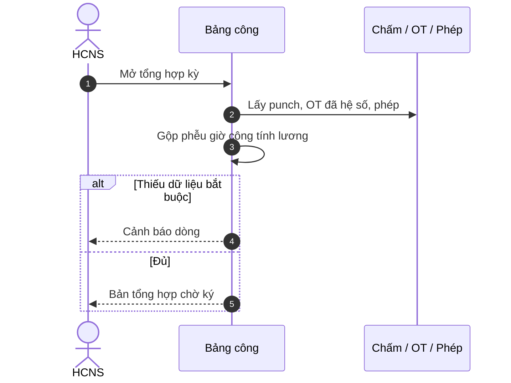
```mermaid
sequenceDiagram
  autonumber
  actor HR as HCNS
  participant TS as Bảng công
  participant ATT as Chấm / OT / Phép

  HR->>TS: Mở tổng hợp kỳ
  TS->>ATT: Lấy punch, OT đã hệ số, phép
  TS->>TS: Gộp phễu giờ công tính lương
  alt Thiếu dữ liệu bắt buộc
    TS-->>HR: Cảnh báo dòng
  else Đủ
    TS-->>HR: Bản tổng hợp chờ ký
  end
```

#### Diễn biến nghiệp vụ

| # | Tương tác | Điều kiện / quy tắc | Kết quả hoặc lỗi |
|---|-----------|---------------------|------------------|
| 1 | Chọn kỳ | Trong quyền | Khung bảng công |
| 2 | Chạy gộp | BR-BP-TS-01 | Dòng giờ công tính lương |
| 3 | Rà soát | Có lịch sử chỉnh | Sẵn sàng ký |
| Thành công | — | — | Có bảng tổng hợp kỳ; UC kế = ký chốt |

---

### FR-UC-BP-ATT-11 — Ký chốt bảng công

#### Thông tin chung

| Mục | Nội dung |
|-----|----------|
| Tác nhân | Nhân viên · Quản lý trực tiếp · HCNS (đủ ba bên); thứ tự theo quy trình XBOS |
| Ưu tiên | Cao |
| Tiên quyết | Bảng công tổng hợp đủ điều kiện |
| Hậu điều kiện | Trạng thái chốt → mở quyền chạy lương; bản chốt bất biến trừ mở lại có quyền |
| BR | BR-BP-TS-02 |
| partner_req_id | REQ_L_001 |

#### Dữ liệu đầu vào

| Trường | Bắt buộc | Quy tắc |
|--------|----------|---------|
| Mã bảng công kỳ | Có | Trạng thái chờ chốt |
| Chữ ký / xác nhận các bên | Có | Bắt buộc NV + quản lý trực tiếp + HR; thứ tự/song song = workflow cấu hình từ XBOS theo tenant |
| Lý do hủy chốt | Khi hủy | Bắt buộc + quyền |

#### Luồng chính

1. Các bên xem bảng tổng hợp.
2. Nhân viên, quản lý trực tiếp và HCNS xác nhận / ký theo **quy trình cấu hình từ XBOS** (thứ tự hoặc song song tùy tenant).
3. Hệ thống chuyển **đã chốt** chỉ khi đủ bước workflow; phát tín hiệu cho lương được phép tính.
4. Hủy chốt (nếu cần): lý do + quyền → trạng thái mở lại có audit.

#### Quy tắc nghiệp vụ

- BR-BP-TS-02: Chưa đủ chữ ký bắt buộc theo workflow → không mở lệnh tính lương.
- Một bên từ chối → không vào payroll.
- **R-SIGN-01 (đã chốt):** cấu hình workflow XBOS — không hardcode một thứ tự duy nhất cho mọi pháp nhân; vẫn bắt buộc đủ ba phía NV + QL + HR.

#### Trường hợp đặc biệt

| Tình huống | Hệ thống xử lý |
|------------|----------------|
| Chạy lương khi còn nháp | Từ chối (khớp FR PAY-01) |
| Mở lại sau khi đã trả lương | Quy trình điều chỉnh kỳ — không xóa phiếu im lặng |

#### Sơ đồ tương tác

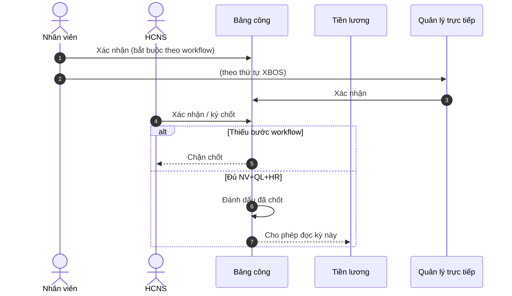
```mermaid
sequenceDiagram
  autonumber
  actor NV as Nhân viên
  actor HR as HCNS
  participant TS as Bảng công
  participant PAY as Tiền lương

  NV->>TS: Xác nhận (bắt buộc theo workflow)
  participant QL as Quản lý trực tiếp
  NV->>QL: (theo thứ tự XBOS)
  QL->>TS: Xác nhận
  HR->>TS: Xác nhận / ký chốt
  alt Thiếu bước workflow
    TS-->>HR: Chặn chốt
  else Đủ NV+QL+HR
    TS->>TS: Đánh dấu đã chốt
    TS-->>PAY: Cho phép đọc kỳ này
  end
```

#### Diễn biến nghiệp vụ

| # | Tương tác | Điều kiện / quy tắc | Kết quả hoặc lỗi |
|---|-----------|---------------------|------------------|
| 1 | Xem bảng chờ chốt | Có quyền | Số liệu khóa chỉnh tay thường |
| 2 | Ký chốt | Đủ bên | Trạng thái đã chốt |
| 3 | Hủy chốt | Có quyền + lý do | Mở lại + audit |
| Thành công | — | — | Bảng công chốt; PAY được đọc; UC kế = chạy lương |

---

### FR-UC-BP-PAY-01 — Ranh giới: lương chỉ đọc bảng công đã chốt

#### Thông tin chung

| Mục | Nội dung |
|-----|----------|
| Tác nhân | C&B / Payroll, Hệ thống tính lương |
| Ưu tiên | Cao — edge P0 kiến trúc nghiệp vụ |
| Tiên quyết | Có bảng công trạng thái đã chốt |
| Hậu điều kiện | Mọi giờ đưa vào công thức kỳ lấy từ bảng công chốt |
| Liên hệ phần mềm hiện tại | Cần xác nhận không còn đọc chéo OT/phép khi tính lương |
| BR | **BR-BP-TS-03** |
| partner_req_id | REQ_L_001 |

#### Dữ liệu đầu vào

| Trường | Bắt buộc | Quy tắc |
|--------|----------|---------|
| Kỳ lương | Có | Khớp kỳ bảng công |
| Tham chiếu bảng công chốt | Có | Trạng thái = đã chốt |
| Biến C&B (lương CB, PC, GTCG, NH, MST, mức BH) | Có | Đọc từ vòng hợp đồng–bảo hiểm / C&B đủ quyền — **không** từ hồ sơ công khai |

#### Luồng chính

1. C&B chọn kỳ và phạm vi tính lương.
2. Hệ thống kiểm tra tồn tại bảng công **đã chốt** cho kỳ (SoT giờ = chấm + phép + OT đã vào phễu).
3. Nạp giờ công tính lương từ bảng chốt + biến C&B từ hợp đồng–bảo hiểm; nạp KT/KL đã thi hành đúng kỳ đích.
4. Từ chối nếu thiếu chốt hoặc cố lấy giờ từ đơn OT/phép.

#### Quy tắc nghiệp vụ

- **BR-BP-TS-03:** Module lương **không** gọi OT/Phép để tính lương; mọi giờ từ bảng công chốt.
- Biến tiền / BH / thuế lấy từ vòng C&B (hợp đồng–bảo hiểm) — không từ hồ sơ công khai.
- KT/KL có số tiền và trạng thái Đang/Đã thi hành → biến kỳ lương đích (FR-UC-BP-CORE-08); chưa thi hành → không vào kỳ.
- Điều chỉnh phép sau chốt **không** đổi lương đã khóa trừ khi mở lại bảng công / điều chỉnh kỳ có quy trình.
- Tuyển dụng không tham gia bước này.
- **Khóa đủ điều kiện đưa NV vào kỳ / chạy đợt (PAY-06):** Khi chính sách giai đoạn 1 bắt buộc bảng công, NV chỉ đủ điều kiện tạo phiếu sau khi tồn tại bảng công **đã chốt** đúng kỳ và pháp nhân — không dùng bản nháp / chờ ký làm nguồn giờ.
- Họp nghiệp vụ trụ tiền lương **đã xong** trên giấy: **Q-PAY-FORMULA** = hai bước soạn→phát hành (**Đã chốt**); **R-PAY-DD-01** = biểu mẫu cấu hình GĐ1 + kéo-thả GĐ2 (**Đã chốt**). Tham số chi tiết theo pháp nhân vẫn cấu hình trong phần mềm; đặc tả kỹ thuật sâu vẫn **HOLD**.

#### Trường hợp đặc biệt

| Tình huống | Hệ thống xử lý |
|------------|----------------|
| Bảng công nháp / chờ ký | Từ chối chạy lương — thông báo rõ |
| Phát hiện phụ thuộc OT/phép trong lần chạy | Coi là lỗi thiết kế — dừng kỳ |
| Một phần NV chưa chốt | Chỉ tính NV đã chốt **hoặc** chặn cả kỳ (theo chính sách chốt) |
| Đưa NV / chạy đợt khi chưa có bảng công chốt (MVP bắt buộc) | Từ chối hoặc danh sách phiếu trống có lý do — khớp AC-PAY-HIRE-01 trên FR-UC-BP-PAY-06 |

#### Sơ đồ tương tác

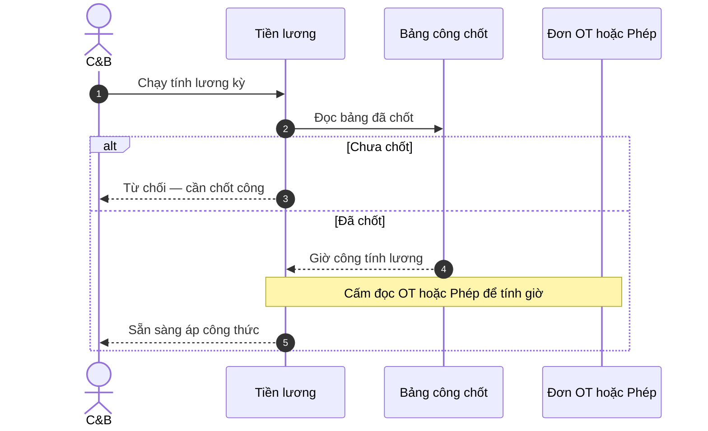
```mermaid
sequenceDiagram
  autonumber
  actor CB as C&B
  participant PAY as Tiền lương
  participant TS as Bảng công chốt
  participant OT as Đơn OT hoặc Phép

  CB->>PAY: Chạy tính lương kỳ
  PAY->>TS: Đọc bảng đã chốt
  alt Chưa chốt
    PAY-->>CB: Từ chối — cần chốt công
  else Đã chốt
    TS-->>PAY: Giờ công tính lương
    Note over PAY,OT: Cấm đọc OT hoặc Phép để tính giờ
    PAY-->>CB: Sẵn sàng áp công thức
  end
```

#### Diễn biến nghiệp vụ

| # | Tương tác | Điều kiện / quy tắc | Kết quả hoặc lỗi |
|---|-----------|---------------------|------------------|
| 1 | Chọn kỳ chạy lương | Quyền C&B | Khung kỳ |
| 2 | Kiểm tra SoT công | BR-BP-TS-03 | Pass / từ chối |
| 3 | Nạp giờ + biến C&B + KT/KL | Bảng chốt + HĐ/BH + bản ghi đã thi hành | Bộ biến công thức |
| FAIL | Đọc leave/OT song song hoặc C&B từ hồ sơ công khai | — | **Không đạt** AC |
| Thành công | — | — | Kỳ sẵn sàng tính; một nguồn giờ; UC kế = công thức / phiếu |

---

### FR-UC-BP-PAY-02 — Động cơ công thức lương

#### Thông tin chung

| Mục | Nội dung |
|-----|----------|
| Tác nhân | C&B (lắp biến), IT hỗ trợ hạ tầng (không hardcode mỗi kỳ) |
| Ưu tiên | Cao |
| Tiên quyết | Có biến từ bảng công chốt + CORE; quyết định hai bước soạn→phát hành đã chốt; GĐ1 soạn bằng biểu mẫu |
| Hậu điều kiện | Công thức publish được dùng cho kỳ; không cần deploy mã để đổi công thức thường |
| Liên hệ phần mềm hiện tại | Có cơ cấu lương; engine kéo-thả chưa đủ |
| BR | BR-BP-PAY-01 |
| partner_req_id | REQ_L_002, PAY-001 |
| Decision | **Q-PAY-FORMULA** = Đồng ý 2 bước · **R-PAY-DD-01** = Form GĐ1 + kéo-thả GĐ2 · **Q-PAY-F-3** = chỉ bảng công chốt |

#### Dữ liệu đầu vào

| Nhóm biến | Ví dụ | Ghi chú |
|-----------|-------|---------|
| Từ bảng công chốt | Giờ chuẩn, OT đã hệ số, phép, phạt | Bắt buộc SoT ATT — không đọc OT/phép trực tiếp |
| Từ CORE C&B | Lương CB, PC cố định / theo ngày | Version hiệu lực |
| Thuế / BH / GTCG | Mức, trần, số NPT | GTCG từ hồ sơ |
| Cờ PC | Chịu TNCN? Đóng BH? | Cấu hình tenant (CRUD) |

#### Luồng chính

1. C&B mở **biểu mẫu** cấu hình công thức kỳ / mẫu đơn vị (GĐ1 — không bắt buộc kéo-thả).
2. Lắp biến trên form — không sửa mã nguồn.
3. Người có quyền **phát hành** duyệt (bước 2 — kiểm soát phát hành).
4. Chạy thử trên kỳ mẫu → phát hành → dùng cho lần tính chính thức.
5. GĐ2: cùng engine, giao diện **kéo-thả** trực quan (không đổi cách tính phía sau).

#### Quy tắc nghiệp vụ

- BR-BP-PAY-01: Không hardcode công thức trong bản phát hành cho từng công ty thành viên.
- **Khóa hai lớp danh mục thành phần lương (dual SoT):** (1) **Danh mục thành phần chuẩn** trên Tiền lương (tab Thành phần lương của pháp nhân / tập đoàn) là nguồn sự thật cho **mã** thành phần khi gắn vào mẫu phiếu, kỳ, gói đãi ngộ; (2) **Danh mục bản chất / loại** thành phần (thu nhập, khấu trừ, …) là nguồn sự thật cho **loại** trên form. Danh mục mở rộng trên Cấu hình hệ thống (nếu có) **không** thay thế danh mục chuẩn ở (1) khi chọn mã trên form nghiệp vụ.
- **Tách quản trị danh mục và gắn mã trên form:** Màn **quản trị danh mục** cho phép thêm mã thành phần mới hợp lệ (sau Lưu và tải lại vẫn còn trên danh sách). Các màn **gắn mã** (mẫu phiếu / kỳ / đãi ngộ) khi danh mục chuẩn còn phần tử hiệu lực **chỉ chọn từ danh mục** — không dùng ô chữ tự do làm nguồn sự thật mã.
- **AC-PAY-COMP-01:** Khi danh mục thành phần chuẩn còn phần tử hiệu lực, tạo dòng thành phần trên form bắt buộc chọn mã từ danh mục; mã không thuộc danh mục → hệ thống từ chối lưu; sau tải lại không phát sinh mã lạ.
- **Khi danh mục chuẩn trống:** Form gắn mã hiển thị trống trung thực và hướng dẫn tạo trên màn quản trị danh mục; **không** bịa dữ liệu mẫu chỉ để «có gì chọn». Quản trị danh mục vẫn thêm được mã mới.
- **Tham chiếu chéo FR-UC-BP-PAY-06:** Kỳ / phiếu sau bước đưa NV hoặc chạy đợt dùng công thức đã phát hành; dòng thành phần trên mẫu / kỳ vẫn tuân khóa dual SoT và AC-PAY-COMP-01 — không tạo mã thành phần tự do trên đường nhận việc → kỳ → phiếu.
- **Đã chốt:** hai bước soạn → phát hành; GĐ1 = form authoring; kéo-thả = GĐ2; SoT giờ = bảng công đã chốt. Tài liệu này **không** khẳng định động cơ công thức đã chạy thật trên môi trường nghiệm thu.
- Phụ cấp cố định tháng vs theo ngày công: toggle đúng kết quả trên dữ liệu mẫu.

#### Trường hợp đặc biệt

| Tình huống | Hệ thống xử lý |
|------------|----------------|
| Publish khi thiếu biến bắt buộc | Chặn |
| Sửa công thức kỳ đã trả lương | Chỉ áp kỳ mở / tạo version mới |
| IT sửa thẳng «cho nhanh» ngoài engine | Ngoài quy trình — không được coi là chuẩn vận hành |
| Gắn mã không thuộc danh mục chuẩn (khi danh mục còn phần tử hiệu lực) | Từ chối lưu; thông báo rõ; sau tải lại không giữ mã lạ |
| Áp «chỉ chọn mã đã có» lên màn quản trị danh mục | Không đúng — quản trị vẫn thêm mã mới hợp lệ |
| Mở thêm quy tắc quỹ mới (N+1) trên quản trị quy tắc quỹ | Lưu thành công; danh sách còn quy tắc sau tải lại; cấp quỹ chọn được quy tắc mới |
| Nhập tay tham số quỹ ngoài quy tắc đã phát hành khi cấp / điều chỉnh | Từ chối trên trường / cảnh báo; không lưu tham số lạ; số dư bám quy tắc |
| Ngừng theo dõi một quy tắc quỹ | Ẩn mềm khỏi chọn mặc định; số dư và lịch sử đã cấp vẫn còn |
| Danh mục chuẩn trống trên form gắn mã | Hiển thị trống + hướng dẫn tạo danh mục; không bịa dòng mẫu |

#### Sơ đồ tương tác

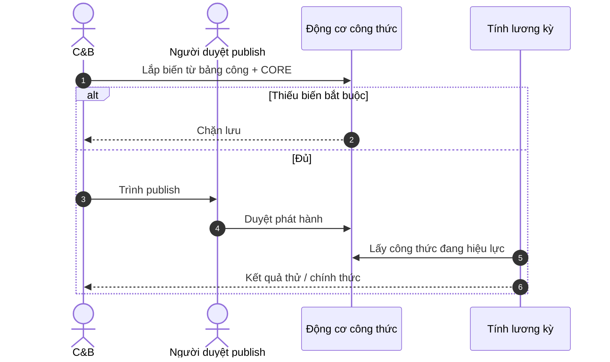
```mermaid
sequenceDiagram
  autonumber
  actor CB as C&B
  actor CTL as Người duyệt publish
  participant ENG as Động cơ công thức
  participant PAY as Tính lương kỳ

  CB->>ENG: Lắp biến từ bảng công + CORE
  alt Thiếu biến bắt buộc
    ENG-->>CB: Chặn lưu
  else Đủ
    CB->>CTL: Trình publish
    CTL->>ENG: Duyệt phát hành
    PAY->>ENG: Lấy công thức đang hiệu lực
    PAY-->>CB: Kết quả thử / chính thức
  end
```

#### Diễn biến nghiệp vụ

| # | Tương tác | Điều kiện / quy tắc | Kết quả hoặc lỗi |
|---|-----------|---------------------|------------------|
| 0a | Quản trị thêm mã thành phần mới | Mã hợp lệ · loại thuộc danh mục bản chất | Lưu thành công; danh sách còn mã sau tải lại |
| 0b | Gắn mã trên mẫu / đãi ngộ | Danh mục chuẩn còn phần tử hiệu lực → chọn từ danh mục | Lưu thành công; mã thuộc danh mục sau tải lại |
| 0c | Gắn mã ngoài danh mục | AC-PAY-COMP-01 | Từ chối lưu; không phát sinh mã lạ sau tải lại |
| 1 | Lắp biến | BR-BP-PAY-01 | Bản nháp công thức |
| 2 | Phát hành | Hai bước kiểm soát (đã chốt) | Version hiệu lực |
| 3 | Chạy lương | Có bảng công chốt | Net / gross theo công thức |
| Thành công | — | — | Công thức hiệu lực dùng được không cần triển khai lại mã; bước kế = chạy kỳ / phiếu — **không** đồng nghĩa đã nghiệm thu chạy thật toàn module lương |

---

### FR-UC-BP-PAY-04 — Gộp lương khi đổi điều kiện giữa kỳ (split-month)

#### Thông tin chung

| Mục | Nội dung |
|-----|----------|
| Tác nhân | C&B / Hệ thống tính lương |
| Ưu tiên | Cao — edge P0 |
| Tiên quyết | Có ngày hiệu lực đổi lương/bậc/HĐ; bảng công chốt kỳ; công thức hiệu lực |
| Hậu điều kiện | **Một** phiếu net; GTCG / giảm trừ bản thân / trần BH không trừ hai lần |
| Liên hệ phần mềm hiện tại | Thuật toán gộp chống trừ kép chưa đủ |
| BR | **BR-BP-SPL-01** (kèm BR-BP-SPL-02 trần BH) |
| partner_req_id | REQ_L_004 |

#### Dữ liệu đầu vào

| Trường | Bắt buộc | Quy tắc |
|--------|----------|---------|
| Ngày hiệu lực đổi | Có | Từ CORE / phụ lục HĐ — không hardcode ngày 15 trừ khi cấu hình kỳ |
| Đoạn 1 / đoạn 2 lương CB | Hệ thống | Theo ngày hiệu lực |
| Biến cộng dồn | Hệ thống | Giờ công, gross đoạn, PC theo ngày — **cộng** hai đoạn |
| Biến tĩnh tháng | Hệ thống | TNCN tháng, GTCG, trần BH — tính **một lần** trên tổng hợp |

#### Luồng chính

1. Nhận diện NV có đổi điều kiện trong kỳ.
2. Tách hai đoạn theo ngày hiệu lực.
3. Tính thu nhập từng đoạn (biến thời gian).
4. Gộp: cộng biến cộng dồn; áp biến tĩnh một lần → một phiếu net.
5. Hiển thị cho C&B preview trước khóa phiếu.

#### Quy tắc nghiệp vụ

- **BR-BP-SPL-01:** Cấm hai phiếu net cho cùng NV cùng kỳ chỉ vì đổi giữa tháng; cấm GTCG 11tr / phụ thuộc trừ hai lần.
- BR-BP-SPL-02: Trần BH trên tổng thu nhập hợp nhất kỳ.
- Mốc cắt: ưu tiên ngày hiệu lực HR (câu hỏi mở nếu khách muốn mốc kỳ cố định).

#### Trường hợp đặc biệt

| Tình huống | Hệ thống xử lý |
|------------|----------------|
| Hai phiếu net | **Không đạt** AC |
| Vào giữa tháng (hire) | Pro-rate / split theo chính sách đã chốt |
| Đổi nhiều lần trong tháng | Nhiều đoạn thời gian — vẫn một net + biến tĩnh một lần |

#### Sơ đồ tương tác

```mermaid
sequenceDiagram
  autonumber
  actor CB as C&B
  participant PAY as Tiền lương
  participant CORE as Hồ sơ hoặc HĐ

  CB->>PAY: Tính kỳ có đổi lương giữa tháng
  PAY->>CORE: Ngày hiệu lực đổi
  PAY->>PAY: Tính đoạn 1 và đoạn 2
  PAY->>PAY: Cộng biến thời gian; biến tĩnh một lần
  alt Phát hiện trừ GTCG hai lần
    PAY-->>CB: Lỗi nghiệp vụ — dừng
  else Hợp lệ
    PAY-->>CB: Một phiếu Net preview
  end
```

#### Diễn biến nghiệp vụ

| # | Tương tác | Điều kiện / quy tắc | Kết quả hoặc lỗi |
|---|-----------|---------------------|------------------|
| 1 | Nhận diện split | Có ngày hiệu lực trong kỳ | Cờ split-month |
| 2 | Tính hai đoạn | BR-BP-SPL-01 | Gross từng đoạn |
| 3 | Gộp biến tĩnh | Một lần / kỳ | Net duy nhất |
| FAIL | GTCG hoặc trần BH nhân đôi | — | **Không đạt** AC |
| Thành công | — | — | Một phiếu net; audit hai đoạn; UC kế = xác nhận phiếu / thanh toán |

---

### 3.A. Use case bổ sung (đã EXPAND đủ 7 mục theo phiếu chốt — trừ OUT/GĐ2)

Các tình huống dưới đây khóa trong inventory **60** UC (thêm CORE-01a · CORE-09a · CORE-09b · CORE-09c · CORE-09d · **PLT-01** · REC-00a · REC-00b · REC-00c · REC-05a · REC-06a · REC-06b · ATT-03d · ATT-05b · **PROC-01**). Mười sáu FR ưu tiên ở trên giữ nguyên. Các dòng **EXPAND** / **ADD** đã viết đủ 7 mục. Dòng **OUT** / **GĐ2** giữ khung + stamp phạm vi.

| # | Mã | Tên ngắn | Phạm vi |
|---|-----|----------|---------|
| 0 | UC-BP-REC-00 | Thư viện mô tả công việc (JD master) | EXPAND · MVP |
| 0a | UC-BP-REC-00a | Cấu hình catalog trường JD | **ADD** · MVP |
| 0b | UC-BP-REC-00b | Kéo trường vào bố cục JD | **ADD** · MVP |
| 0c | UC-BP-REC-00c | Form thêm·sửa JD động + xem phân tầng | **ADD** · MVP |
| 1 | UC-BP-REC-03 | Gom yêu cầu vào chiến dịch / hub đa kênh | **OUT** |
| 2 | UC-BP-REC-04 | Quét kho ứng viên nội bộ trước kênh ngoài | EXPAND · MVP |
| 3 | UC-BP-REC-05 | Lịch sử trạng thái ứng viên | EXPAND · MVP |
| 3a | UC-BP-REC-05a | Thêm / cập nhật ứng viên gắn YCTD | **ADD** · MVP |
| 4 | UC-BP-REC-06 | Thư tuyển + đánh giá phỏng vấn | EXPAND · MVP |
| 4a | UC-BP-REC-06a | Xếp / hủy / đổi lịch PV (một lịch đang hiệu lực) | **ADD** · MVP |
| 4b | UC-BP-REC-06b | So sánh ứng viên theo YCTD | **ADD** · MVP |
| 5 | UC-BP-REC-07 | Offer → hồ sơ nhân sự | EXPAND · MVP |
| 5a | UC-BP-CORE-01a | QSĐ hiệu lực → lịch sử công tác | **ADD** · MVP |
| 6 | UC-BP-CORE-02b | Cấu hình nhóm thông tin hồ sơ | EXPAND · MVP |
| 7 | UC-BP-CORE-03 | Checklist giấy tờ động | EXPAND · MVP |
| 8 | UC-BP-CORE-04 | Đọc giấy tờ tự động (OCR) | **OUT** |
| 9 | UC-BP-CORE-05 | Cấp phát tài sản + biên bản | EXPAND · MVP |
| 10 | UC-BP-CORE-06 | Thu hồi tài sản khi nghỉ | EXPAND · MVP |
| 11 | UC-BP-CORE-07 | Kích hoạt hồ sơ Hoạt động | EXPAND · MVP |
| 12 | UC-BP-CORE-09 | Hợp đồng LĐ — mẫu điền sẵn | EXPAND · MVP |
| 12a | UC-BP-CORE-09a | Thư viện điều khoản HĐ (Cài đặt) | **ADD** · MVP |
| 12b | UC-BP-CORE-09b | Chọn gói nghề và xem trước HĐLĐ | **ADD** · MVP |
| 12c | UC-BP-CORE-09c | Lưu phiên bản và in / PDF | **ADD** · MVP |
| 12d | UC-BP-CORE-09d | Chọn mẫu HĐ theo catalog mở (ví dụ khởi tạo loại × khối) | **ADD** · MVP |
| 12e | UC-BP-PLT-01 | Nền tảng cấu hình động (danh mục · schema · trường trộn) | **ADD** · MVP |
| 13 | UC-BP-CORE-10 | BHXH vòng đời | EXPAND · MVP |
| 14 | UC-BP-ATT-01 | Quy tắc ca theo bộ phận | EXPAND · MVP |
| 15 | UC-BP-ATT-03 | Điểm danh đa nguồn | **GĐ2** |
| 16 | UC-BP-ATT-03b | Lịch lễ / Tết | EXPAND · MVP |
| 16b | UC-BP-ATT-03d | Điểm GPS chấm công | **ADD** · MVP |
| 17 | UC-BP-ATT-04 | Cấp phát phép + 5 loại | EXPAND · MVP |
| 18 | UC-BP-ATT-04b | Ứng phép / không lương | EXPAND · MVP |
| 19 | UC-BP-ATT-05 | Phép chuyển kỳ | EXPAND · MVP |
| 19b | UC-BP-ATT-05b | Panel quỹ phép khi nộp đơn | **ADD** · MVP |
| 20 | UC-BP-ATT-06 | Phép bù tăng ca | EXPAND · MVP |
| 21 | UC-BP-ATT-07 | Nghỉ ốm BH / CTY | EXPAND · MVP |
| 22 | UC-BP-ATT-12 | Mở quỹ + ca khi Hoạt động | EXPAND · MVP |
| 23 | UC-BP-PAY-03 | Giảm trừ gia cảnh | EXPAND · MVP |
| 24 | UC-BP-PAY-05 | Trần bảo hiểm kỳ | EXPAND · MVP |
| 25 | UC-BP-PAY-06 | Tính lương kỳ | EXPAND · MVP |
| 26 | UC-BP-PAY-07 | Tất toán nghỉ việc | EXPAND · MVP |
| 27 | UC-BP-PAY-08 | Phiếu lương | EXPAND · MVP |
| 28 | UC-BP-PAY-09 | Phân nhóm bảng lương | EXPAND · MVP |
| 29 | UC-BP-PROC-01 | Xem mã quy trình đã đồng bộ (chỉ đọc) | **ADD** · MVP |

### FR-UC-BP-REC-00 — Thư viện mô tả công việc (JD master)

#### Thông tin chung

| Mục | Nội dung |
|-----|----------|
| Tác nhân | Nhân sự tuyển dụng · Trưởng bộ phận · HCNS |
| Ưu tiên | Cao — MVP |
| Tiên quyết | Đã chọn đúng pháp nhân; có quyền quản trị thư viện mô tả |
| Hậu điều kiện | Có bản mô tả hiệu lực; YCTD có thể tham chiếu mã JD |
| Liên hệ phần mềm hiện tại | Logic giấy đã chốt; triển khai mã theo giai đoạn — không khẳng định đã nghiệm thu vận hành |
| BR | BR-BP-JD-01 |

**Mục đích:** Quản lý mô tả công việc chuẩn làm đầu vào cho yêu cầu tuyển — một nguồn mô tả, không nhập lại mỗi lần. Cách cấu hình trường, bố cục và hình thức nhập/xem được mở rộng ở FR-UC-BP-REC-00a · 00b · 00c; **không** thay vai trò master hay quan hệ với YCTD.

#### Dữ liệu đầu vào

| Trường | Bắt buộc | Quy tắc |
|--------|----------|---------|
| Tiêu đề / mã JD | Có | Theo pháp nhân; không trùng mã đang hiệu lực; tiêu đề luôn là trường đầu trên form thêm/sửa |
| Mô tả · yêu cầu kỹ năng · cấp bậc (và các trường khác trên bố cục) | Có theo cấu hình | «Đủ trường bắt buộc» = các trường đánh dấu bắt buộc trên catalog và đang nằm trong bố cục hiệu lực (xem FR-UC-BP-REC-00a · 00b) — không cố định cứng một bộ ba trường duy nhất |
| Trạng thái | Có | Nháp / Hiệu lực / Ngừng |

#### Luồng chính

1. Mở thư viện JD theo pháp nhân.
2. Tạo hoặc cập nhật nội dung theo bố cục đã cấu hình (tiêu đề, mô tả, kỹ năng, cấp bậc và các trường khác trên canvas).
3. Đưa bản nháp sang hiệu lực (có quyền).
4. Khi tạo YCTD: chọn JD còn hiệu lực — hệ thống gắn mã, không bắt copy toàn bộ mô tả.

#### Quy tắc nghiệp vụ

- JD master là đầu vào YCTD; không thay thế YCTD hay pipeline ứng viên.
- Ngừng JD không xóa lịch sử YCTD đã tham chiếu.
- Catalog trường, bố cục và giá trị instance không trộn giữa hai pháp nhân.
- YCTD chỉ chọn JD còn hiệu lực; mang mã JD — không bắt sao chép toàn bộ nội dung động.

#### Trường hợp đặc biệt

| Tình huống | Hệ thống xử lý |
|------------|----------------|
| YCTD tham chiếu JD đã ngừng | Cho xem lịch sử; chặn chọn JD ngừng cho YCTD mới |
| Hai pháp nhân cùng chức danh | Không trộn thư viện giữa pháp nhân |

#### Sơ đồ tương tác

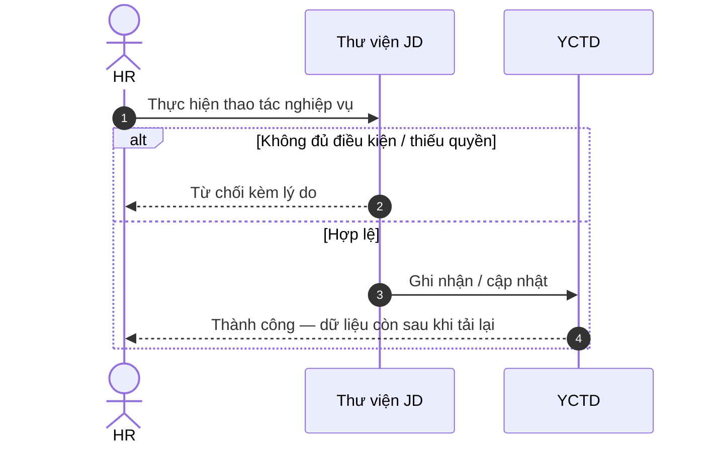
```mermaid
sequenceDiagram
  autonumber
  actor A as HR
  participant B as Thư viện JD
  participant C as YCTD
  A->>B: Thực hiện thao tác nghiệp vụ
  alt Không đủ điều kiện / thiếu quyền
    B-->>A: Từ chối kèm lý do
  else Hợp lệ
    B->>C: Ghi nhận / cập nhật
    C-->>A: Thành công — dữ liệu còn sau khi tải lại
  end
```

#### Diễn biến nghiệp vụ

| # | Tương tác | Điều kiện / quy tắc | Kết quả hoặc lỗi |
|---|-----------|---------------------|------------------|
| 1 | Mở thư viện | Đúng phạm vi | Danh sách JD |
| 2 | Lưu / phát hành | Đủ trường bắt buộc trên bố cục | JD hiệu lực |
| 3 | YCTD chọn JD | JD còn hiệu lực | YCTD gắn mã JD |
| Thành công | — | — | Một nguồn mô tả; sẵn sàng tạo YCTD |

---

### FR-UC-BP-REC-00a — Cấu hình catalog trường mô tả công việc

#### Thông tin chung

| Mục | Nội dung |
|-----|----------|
| Tác nhân | HCNS · Quản trị cấu hình nhân sự |
| Ưu tiên | Cao — MVP |
| Tiên quyết | Đã chọn đúng pháp nhân; có quyền cấu hình tuyển dụng / mô tả công việc |
| Hậu điều kiện | Có catalog trường hiệu lực theo pháp nhân; khi soạn JD chỉ kéo được trường đang hiệu lực |
| Liên hệ phần mềm hiện tại | Logic giấy đã chốt; triển khai mã theo giai đoạn — không khẳng định đã nghiệm thu vận hành |
| BR | BR-BP-JD-DYN-01 · BR-BP-JD-DYN-07 · BR-BP-JD-DYN-08 |

**Mục đích:** Quản lý tập trường mô tả công việc theo từng pháp nhân — không áp một bộ trường cố định cho mọi công ty. Catalog nằm ở khu vực Cài đặt; không gộp với nhóm trường hồ sơ nhân viên.

#### Dữ liệu đầu vào

| Trường | Bắt buộc | Quy tắc |
|--------|----------|---------|
| Mã trường | Có | Không trùng trong cùng pháp nhân; sau khi đã có JD dùng mã này thì không đổi mã — chỉ được ngừng |
| Nhãn hiển thị | Có | Tiếng Việt; dùng trên form và màn xem |
| Kiểu nhập | Có | Văn bản ngắn · Văn bản dài · Danh sách chọn (khi có nguồn) · Số · Ngày (định dạng ngày tháng năm Việt Nam) |
| Bắt buộc khi nhập JD | Có | Có / Không — chỉ áp khi trường nằm trên bố cục hiệu lực |
| Thứ tự trong catalog | Có | Số nguyên ≥ 0 |
| Trạng thái | Có | Hiệu lực / Ngừng |
| Nhóm hiển thị gợi ý | Không | Ví dụ: Thông tin chung · Mô tả · Yêu cầu · Phúc lợi — phục vụ màn xem phân tầng |

#### Luồng chính

1. Mở Cài đặt → khu vực cấu hình trường mô tả công việc (đúng pháp nhân).
2. Thêm hoặc sửa nhãn, kiểu, bắt buộc, thứ tự; hoặc ngừng trường không còn dùng.
3. Lưu → hệ thống xác nhận thành công; danh sách cập nhật ngay trên màn.
4. Tải lại trang: catalog còn đúng; trường đã ngừng không còn trong bảng chọn khi soạn JD mới.

#### Quy tắc nghiệp vụ

- Mọi trường cấu hình theo pháp nhân; ngừng mềm — không xóa cứng khi đã có giá trị trên bản JD.
- Catalog trống: hiển thị trạng thái trống rõ ràng kèm hướng dẫn thêm trường; không quay vòng tải tự động vô hạn.
- Hai pháp nhân: catalog độc lập, không trộn.

#### Trường hợp đặc biệt

| Tình huống | Hệ thống xử lý |
|------------|----------------|
| Thiếu mã hoặc nhãn khi Lưu | Không lưu thành công; báo thiếu bắt buộc; giữ dữ liệu đã nhập |
| Trùng mã đang hiệu lực | Từ chối; không tạo bản ghi thứ hai |
| Ngừng trường đang nằm trên bố cục đã lưu | Cho ngừng; bản JD cũ vẫn xem được giá trị lịch sử; bảng chọn soạn JD mới không còn trường đó |
| Lỗi tải danh sách | Banner lỗi nghiệp vụ; nút Thử lại thủ công — không báo «không có dữ liệu» che lỗi hệ thống |

#### Sơ đồ tương tác

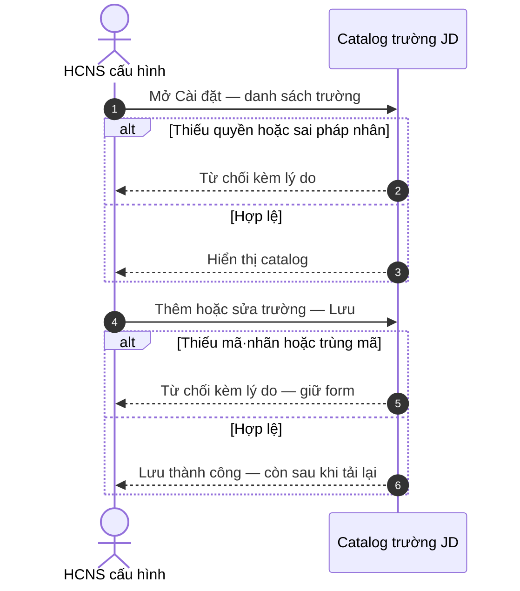
```mermaid
sequenceDiagram
  autonumber
  actor HCNS as HCNS cấu hình
  participant CD as Catalog trường JD
  HCNS->>CD: Mở Cài đặt — danh sách trường
  alt Thiếu quyền hoặc sai pháp nhân
    CD-->>HCNS: Từ chối kèm lý do
  else Hợp lệ
    CD-->>HCNS: Hiển thị catalog
  end
  HCNS->>CD: Thêm hoặc sửa trường — Lưu
  alt Thiếu mã·nhãn hoặc trùng mã
    CD-->>HCNS: Từ chối kèm lý do — giữ form
  else Hợp lệ
    CD-->>HCNS: Lưu thành công — còn sau khi tải lại
  end
```

#### Diễn biến nghiệp vụ

| # | Tương tác | Điều kiện / quy tắc | Kết quả hoặc lỗi |
|---|-----------|---------------------|------------------|
| 0 | Đăng nhập · chọn pháp nhân · mở Cài đặt trường JD | Đúng quyền | Màn catalog tải được · thiếu quyền → từ chối rõ |
| 1 | Thêm trường thiếu mã hoặc nhãn → Lưu | Kiểm tra bắt buộc | Không lưu thành công; báo thiếu; giữ dữ liệu đã nhập |
| 2 | Thêm mã trùng đang hiệu lực → Lưu | Duy nhất trong pháp nhân | Từ chối trùng mã |
| 3 | Ngừng trường đã dùng trên bố cục | Ngừng mềm | JD cũ xem được lịch sử; soạn mới không còn trường đó |
| 4 | Lưu hợp lệ | Đủ trường | Danh sách cập nhật ngay; thông báo thành công |
| T | Tải lại sau bước 4 | — | Catalog giữ nguyên |
| Thành công | — | — | Catalog sẵn sàng cho FR-UC-BP-REC-00b |

---

### FR-UC-BP-REC-00b — Kéo trường vào bố cục mô tả công việc

#### Thông tin chung

| Mục | Nội dung |
|-----|----------|
| Tác nhân | Nhân sự tuyển dụng · HCNS |
| Ưu tiên | Cao — MVP |
| Tiên quyết | Catalog có ít nhất một trường hiệu lực (khuyến nghị có trường tiêu đề hệ thống); đúng pháp nhân |
| Hậu điều kiện | Bố cục mặc định của pháp nhân (thứ tự + danh sách trường) đã lưu; dùng cho form thêm/sửa và làm gốc khi lưu bản JD |
| Liên hệ phần mềm hiện tại | Logic giấy đã chốt; triển khai mã theo giai đoạn — không khẳng định đã nghiệm thu vận hành |
| BR | BR-BP-JD-DYN-02 · BR-BP-JD-DYN-03 · BR-BP-JD-DYN-07 |

**Mục đích:** Người dùng chọn và sắp xếp các trường sẽ xuất hiện trên form thêm JD và màn xem — bằng kéo-thả trên Thư viện JD, không sửa mã kỹ thuật. Catalog trường cấu hình ở Cài đặt; thao tác kéo bố cục thực hiện tại Thư viện JD (có thể kèm bố cục mặc định ở Cài đặt khi đơn vị bật).

#### Dữ liệu đầu vào

| Trường | Bắt buộc | Quy tắc |
|--------|----------|---------|
| Tập trường kéo vào vùng soạn | Có (≥ 1) | Chỉ trường đang Hiệu lực trong catalog |
| Thứ tự trên vùng soạn | Có | Thứ tự kéo = thứ tự form (sau khi hệ thống đặt tiêu đề lên vị trí đầu) |
| Nhóm phần (nếu giao diện hỗ trợ) | Không | Khớp nhóm gợi ý catalog hoặc gán tay trên vùng soạn |

#### Luồng chính

1. Mở Thư viện JD → Thêm JD (hoặc «Sửa bố cục» nếu tách bước).
2. Bảng chọn liệt kê trường catalog đang hiệu lực.
3. Kéo trường vào vùng form; sắp xếp lại thứ tự.
4. Lưu bố cục mặc định pháp nhân (hoặc tiếp tục nhập giá trị rồi Lưu JD trong cùng phiên).

#### Quy tắc nghiệp vụ

- Chỉ trường hiệu lực được gắn vào bố cục; trường đã ngừng bị từ chối nếu còn lộ do bộ nhớ tạm.
- Catalog hoặc bố cục trống: trạng thái trống + hướng dẫn; không cho Lưu nội dung JD khi bố cục chưa có trường.
- Khi mở form thêm/sửa, tiêu đề luôn ở vị trí đầu dù thứ tự kéo khác.

#### Trường hợp đặc biệt

| Tình huống | Hệ thống xử lý |
|------------|----------------|
| Catalog trống | Không cho Lưu nội dung JD; empty + hướng dẫn sang Cài đặt trường |
| Kéo trường đã ngừng | Từ chối gắn; thông báo trường không còn hiệu lực |
| Hai pháp nhân | Bố cục theo pháp nhân đang chọn — không trộn |

#### Sơ đồ tương tác

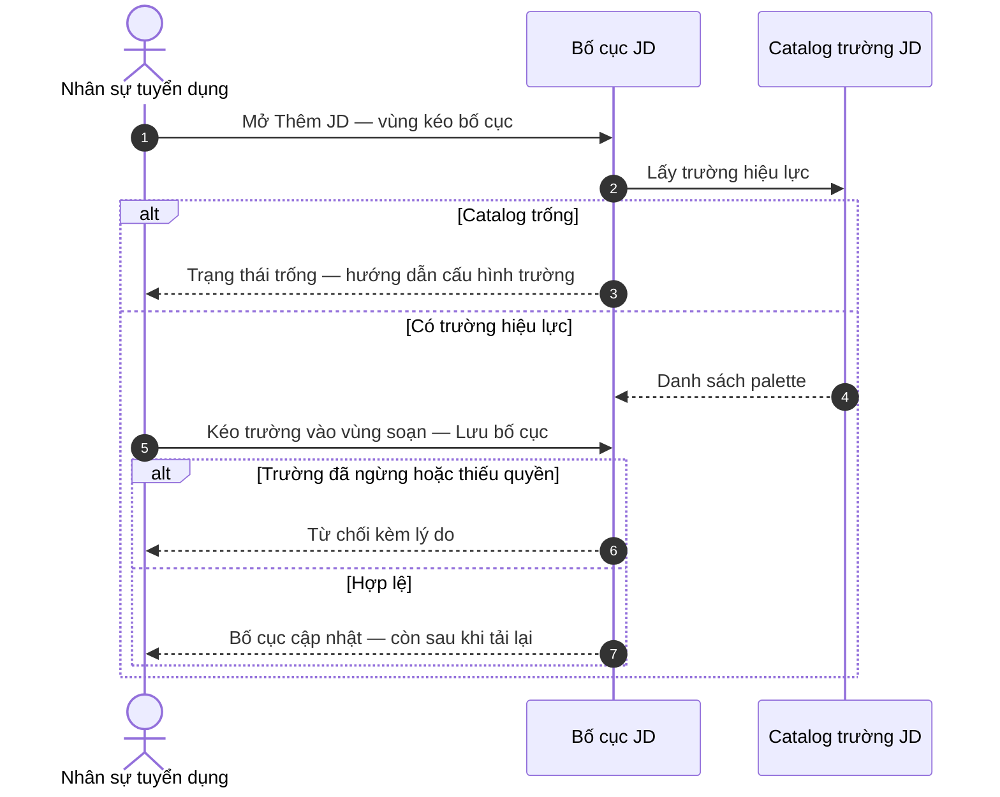
```mermaid
sequenceDiagram
  autonumber
  actor HR as Nhân sự tuyển dụng
  participant LO as Bố cục JD
  participant CD as Catalog trường JD
  HR->>LO: Mở Thêm JD — vùng kéo bố cục
  LO->>CD: Lấy trường hiệu lực
  alt Catalog trống
    LO-->>HR: Trạng thái trống — hướng dẫn cấu hình trường
  else Có trường hiệu lực
    CD-->>LO: Danh sách palette
    HR->>LO: Kéo trường vào vùng soạn — Lưu bố cục
    alt Trường đã ngừng hoặc thiếu quyền
      LO-->>HR: Từ chối kèm lý do
    else Hợp lệ
      LO-->>HR: Bố cục cập nhật — còn sau khi tải lại
    end
  end
```

#### Diễn biến nghiệp vụ

| # | Tương tác | Điều kiện / quy tắc | Kết quả hoặc lỗi |
|---|-----------|---------------------|------------------|
| 0 | Mở Thêm JD / sửa bố cục | Đúng pháp nhân | Thấy bảng chọn + vùng soạn |
| 1 | Catalog trống | Empty hợp lệ | Không Lưu nội dung JD; CTA về Cài đặt trường |
| 2 | Kéo trường đã ngừng | Chỉ hiệu lực | Từ chối gắn |
| 3 | Kéo ≥ 1 trường (có tiêu đề) | Hợp lệ | Vùng soạn phản ánh thứ tự ngay |
| 4 | Lưu bố cục / tiếp tục nhập | — | Lưu thành công — bố cục dùng cho form động |
| T | Tải lại | — | Bố cục còn; bảng chọn khớp catalog |
| Thành công | — | — | Bố cục mặc định pháp nhân sẵn sàng cho FR-UC-BP-REC-00c |

---

### FR-UC-BP-REC-00c — Form thêm·sửa JD động và xem phân tầng

#### Thông tin chung

| Mục | Nội dung |
|-----|----------|
| Tác nhân | Nhân sự tuyển dụng · Trưởng bộ phận · HCNS |
| Ưu tiên | Cao — MVP |
| Tiên quyết | Có bố cục (≥ 1 trường, gồm tiêu đề); quyền thư viện JD |
| Hậu điều kiện | Bản JD Nháp hoặc Hiệu lực; khi Hiệu lực thì YCTD có thể tham chiếu mã; bản ghi giữ ảnh bố cục tại thời điểm lưu kèm giá trị đã nhập |
| Liên hệ phần mềm hiện tại | Logic giấy đã chốt; triển khai mã theo giai đoạn — không khẳng định đã nghiệm thu vận hành |
| BR | BR-BP-JD-01 · BR-BP-JD-DYN-02 · BR-BP-JD-DYN-03 · BR-BP-JD-DYN-04 · BR-BP-JD-DYN-05 · BR-BP-JD-DYN-06 |

**Mục đích:** Nhập và xem nội dung JD theo bố cục đã kéo; trải nghiệm xem phân tầng hiện đại (tiêu đề nổi bật → khối nội dung → yêu cầu/kỹ năng); giữ một nguồn mô tả cho tuyển dụng và liên kết YCTD như FR-UC-BP-REC-00.

#### Dữ liệu đầu vào

| Trường | Bắt buộc | Quy tắc |
|--------|----------|---------|
| Mã JD | Có | Không trùng theo pháp nhân khi ở trạng thái Hiệu lực |
| Giá trị từng trường trên bố cục | Theo cờ bắt buộc của trường | Kiểm tra tại Lưu |
| Trạng thái | Có | Nháp / Hiệu lực / Ngừng |
| Chức danh / liên kết danh mục vị trí (nếu đã có) | Theo cấu hình hiện hữu | Không phá quy tắc vị trí đã chốt |

#### Luồng chính

1. Mở hộp thoại Thêm (hoặc Sửa) JD trên Thư viện JD.
2. Form hiển thị động theo bố cục mặc định pháp nhân; **ô tiêu đề là trường đầu tiên**.
3. Nhập giá trị → Lưu (Nháp hoặc phát hành Hiệu lực theo quyền); hệ thống lưu giá trị kèm ảnh bố cục tại thời điểm đó.
4. Danh sách thư viện cập nhật; tải lại vẫn còn.
5. Từ danh sách: mở Xem JD — màn phân tầng (tiêu đề trước, các khối nội dung theo nhóm); không dùng một bảng cứng hàng–cột cho toàn bộ mô tả dài.
6. Khi tạo YCTD: chọn JD còn hiệu lực — gắn mã; không bắt copy lại toàn bộ trường động.

#### Quy tắc nghiệp vụ

- Form và kiểm tra chỉ áp các trường hiệu lực đang nằm trên bố cục; trường bắt buộc trống → chặn Lưu.
- Tiêu đề luôn vị trí đầu trên form thêm/sửa.
- Màn xem: phân tầng rõ; dùng bộ nhận diện giao diện XeVN — không tự tạo bảng màu thương hiệu lạ.
- YCTD chỉ chọn JD Hiệu lực; JD Ngừng không chọn cho YCTD mới; lịch sử YCTD cũ vẫn xem được.
- Bố cục rỗng: empty trên hộp thoại; vô hiệu Lưu nội dung đến khi có ít nhất một trường.

#### Trường hợp đặc biệt

| Tình huống | Hệ thống xử lý |
|------------|----------------|
| Thiếu trường bắt buộc trên bố cục → Lưu | Không thành công; làm nổi trường lỗi; giữ hộp thoại |
| Trùng mã JD hiệu lực | Từ chối rõ; không tạo bản ghi |
| Phát hành Hiệu lực khi thiếu tiêu đề | Chặn; yêu cầu tiêu đề |
| Không tìm thấy bản ghi / ngoài phạm vi pháp nhân | Thông báo rõ — không trang trắng |
| Lỗi tải xem | Banner lỗi + Thử lại; không che bằng empty «không có dữ liệu» |
| Xem JD nháp | Cho xem nội dung; trạng thái Nháp hiển thị rõ |

#### Sơ đồ tương tác

```mermaid
sequenceDiagram
  autonumber
  actor HR as Nhân sự tuyển dụng
  participant Form as Form thêm JD
  participant View as Xem JD
  participant YCTD as Yêu cầu tuyển dụng

  HR->>Form: Mở thêm hoặc sửa JD
  Note over Form: Tiêu đề luôn là trường đầu tiên
  alt Thiếu bắt buộc hoặc trùng mã
    Form-->>HR: Giữ form — không báo thành công giả
  else Hợp lệ
    Form-->>HR: Lưu thành công — danh sách cập nhật
    HR->>View: Mở xem JD
    View-->>HR: Hiển thị phân tầng hiện đại
  end

  HR->>YCTD: Chọn JD còn hiệu lực
  alt JD ngừng hoặc sai pháp nhân
    YCTD-->>HR: Chặn chọn
  else Hợp lệ
    YCTD-->>HR: Gắn mã JD — không copy toàn bộ mô tả
  end
```

#### Diễn biến nghiệp vụ

| # | Tương tác | Điều kiện / quy tắc | Kết quả hoặc lỗi |
|---|-----------|---------------------|------------------|
| 0 | Mở Thêm JD | Phiên hợp lệ · đúng pháp nhân | Hộp thoại mở; form động theo bố cục |
| 1 | Bỏ trống trường bắt buộc → Lưu | Kiểm tra bố cục | Không thành công; làm nổi trường; giữ hộp thoại |
| 2 | Trùng mã JD hiệu lực → Lưu | Duy nhất | Từ chối rõ |
| 3 | Phát hành Hiệu lực thiếu tiêu đề | Tiêu đề bắt buộc | Chặn |
| 4 | Lưu Nháp đủ trường bắt buộc | Hợp lệ | Thành công; hàng mới/cập nhật trên danh sách |
| 5 | Mở Xem JD vừa lưu | Có quyền | View phân tầng; đủ giá trị đã nhập |
| 6 | YCTD chọn JD | JD Hiệu lực | Gắn mã JD (FR-UC-BP-REC-00); JD Ngừng không chọn cho YCTD mới |
| T | Tải lại danh sách và màn xem | — | Dữ liệu và bố cục còn |
| Thành công | — | — | Một nguồn JD; sẵn sàng YCTD; giao diện xem không phải bảng cứng toàn trang |

---

### FR-UC-BP-REC-03 — Gom yêu cầu vào chiến dịch và nhận hồ sơ

> **Phạm vi:** **OUT** — không thuộc MVP giấy lần này. Chiến dịch / hub đa kênh không thuộc MVP. Pipeline gắn trên yêu cầu tuyển.


> **Phạm vi giai đoạn:** **GĐ2 / ngoài MVP.** Chỉ triển khai khi đã có đối tác sẵn sàng mở API đồng bộ đăng tin đa kênh. Ở MVP, trạng thái «đã đăng tin / có CV / PV…» gắn trên **YCTD** (xem FR-UC-BP-REC-02 / 02b / 08) — không bắt buộc menu chiến dịch trùng YCTD.

#### Mục đích

Gộp nhiều nhu cầu tuyển cùng nhóm kỹ năng thành một chiến dịch; theo dõi từ nhận hồ sơ đến chốt người; đồng bộ kênh đăng tin khi có hub đối tác.

#### Tác nhân

Trưởng bộ phận · Nhân sự tuyển dụng · Ban giám đốc (khi ngoài kế hoạch) · Hệ thống (tự tạo yêu cầu)

#### Luồng chính / diễn biến

| # | Ai | Thao tác / hệ thống | Điều kiện | Kết quả hoặc lỗi |
|---|----|---------------------|-----------|------------------|
| 0 | Trưởng bộ phận · Nhân sự tuyển dụng · Ban giám đốc (khi ngoài kế hoạch) · Hệ thống (tự tạo yêu cầu) | Trước khi làm «Gom yêu cầu vào chiến dịch và nhận hồ sơ»: đăng nhập đúng vai trò, chọn đúng công ty/pháp nhân trong phạm vi được phép. Đọc mục đích: Gom nhiều yêu cầu tuyển dụng cùng nhóm kỹ năng vào một chiến dịch; p… | Đã đăng nhập; đúng phạm vi công ty | Màn hình tình huống mở được, không báo lỗi tải · Nếu lỗi: Sai phạm vi / hết phiên → không vào được hoặc không thấy dữ liệu người khác |
| 1 | Trưởng bộ phận · Nhân sự tuyển dụng · Ban giám đốc (khi ngoài kế hoạch) · Hệ thống (tự tạo yêu cầu) | Thực hiện luồng chính của tình huống «Gom yêu cầu vào chiến dịch và nhận hồ sơ». Nhập hoặc chọn đủ trường bắt buộc theo quy tắc BR-BP-HC-03. Không bỏ trống trường hệ thống đánh dấu bắt buộc. / Hiển thị form/danh sách … | Gom nhiều yêu cầu tuyển dụng cùng nhóm kỹ năng vào một chiến dịch; phễu theo dõi hồ sơ ứng viên→phỏng vấn→chốt | Form nhận dữ liệu; nút Lưu/Gửi/Duyệt sẵn sàng khi đủ trường · Nếu lỗi: Thiếu trường bắt buộc → không cho sang bước xác nhận |
| 2 | Hệ thống (+ người dùng đọc thông báo) | Đọc thông báo / xem trước kết quả trước khi xác nhận cuối. / Áp dụng quy tắc BR-BP-HC-03. Tiêu chí đạt: Chiến dịch liệt kê đủ yêu cầu tuyển dụng nguồn; đóng không xóa lịch sử hồ sơ ứng viên; báo cáo KH vs thanh toán t… | Quy tắc BR-BP-HC-03 | Chiến dịch liệt kê đủ yêu cầu tuyển dụng nguồn; đóng không xóa lịch sử hồ sơ ứng viên; báo cáo KH vs thanh toán theo tháng × phòng ban · Nếu lỗi: Mỗi yêu cầu tuyển dụng = một chiến dịch bắt buộc |
| 3 | Trưởng bộ phận · Nhân sự tuyển dụng · Ban giám đốc (khi ngoài kế hoạch) · Hệ thống (tự tạo yêu cầu) | Bấm Lưu hoặc Gửi (hoặc thao tác tương đương trên màn hình). Chờ phản hồi thành công rồi mới rời màn. / Ghi nhận bản ghi/trạng thái mới; trả về thông báo thành công; danh sách hoặc chi tiết cập nhật ngay trên màn hình. | Đã qua kiểm tra bước 2 | Thấy bản ghi/trạng thái mới; tải lại trang vẫn còn (không mất dữ liệu) · Nếu lỗi: Lỗi hệ thống hoặc nghiệp vụ → giữ form, không báo thành công giả |
| 4 | Trưởng bộ phận · Nhân sự tuyển dụng · Ban giám đốc (khi ngoài kế hoạch) · Hệ thống (tự tạo yêu cầu) / Hệ thống | Thử tình huống đặc biệt: Hai pháp nhân cùng vị trí — không trộn / Xử lý nhánh ngoại lệ có thông báo; không để dữ liệu lệch im lặng. | Hai pháp nhân cùng vị trí — không trộn | Hành vi khớp mô tả đặc biệt; không phá dữ liệu gốc · Nếu lỗi: Im lặng sai số / sai trạng thái → FAIL |
| T | / người nghiệp vụ chốt | Đối chiếu thành công: Chiến dịch liệt kê đủ yêu cầu tuyển dụng nguồn; đóng không xóa lịch sử hồ sơ ứng viên; báo cáo KH vs thanh toán theo tháng × phòng ban. Ghi rõ dữ liệu mang sang bước/tình huống sau (mã bản ghi, t… | Happy path + ít nhất một nhánh FAIL đã kiểm | Chiến dịch liệt kê đủ yêu cầu tuyển dụng nguồn; đóng không xóa lịch sử hồ sơ ứng viên; báo cáo KH vs thanh toán theo tháng × phòng ban · Nếu lỗi: — |

#### Quy tắc nghiệp vụ

- BR-BP-HC-03: Chiến dịch liệt kê đủ yêu cầu nguồn; đóng chiến dịch không xóa lịch sử hồ sơ; không trộn dữ liệu giữa hai pháp nhân.
- Quan hệ chiến dịch ↔ YCTD = **một–nhiều** khi GĐ2 bật.
- Trường hợp đặc biệt: Hai pháp nhân cùng vị trí — không trộn
- **MVP:** bỏ qua UC này; dùng trạng thái pipeline trên YCTD.

#### Đạt / không đạt

| | Nội dung |
|--|----------|--------|
| Đạt khi (GĐ2) | Chiến dịch liệt kê đủ yêu cầu tuyển dụng nguồn; đóng không xóa lịch sử hồ sơ ứng viên; đồng bộ kênh khi có API |
| Không đạt khi | Ép mỗi YCTD = một chiến dịch bắt buộc ở MVP; hoặc làm chiến dịch không API trùng hoàn toàn YCTD |
| Rủi ro nếu hiểu sai | Gộp xuyên công ty → lộ hồ sơ ứng viên / sai báo cáo |

---

### FR-UC-BP-REC-04 — Quét kho ứng viên nội bộ trước kênh ngoài

#### Thông tin chung

| Mục | Nội dung |
|-----|----------|
| Tác nhân | Nhân sự tuyển dụng · Trưởng bộ phận |
| Ưu tiên | Cao — MVP |
| Tiên quyết | Có YCTD đã duyệt; kho ứng viên nội bộ theo pháp nhân |
| Hậu điều kiện | Đã quét (hoặc bỏ qua có lý do + quyền); kết quả gắn YCTD |
| Liên hệ phần mềm hiện tại | Logic giấy đã chốt; triển khai mã theo giai đoạn — không khẳng định đã nghiệm thu vận hành |
| BR | BR-BP-CV-01 |

**Mục đích:** Trước khi mở kênh ngoài, tìm trong kho nội bộ theo chức danh và kỹ năng; giữ lịch sử nguồn.

#### Dữ liệu đầu vào

| Trường | Bắt buộc | Quy tắc |
|--------|----------|---------|
| YCTD | Có | Đã duyệt, đúng pháp nhân |
| Tiêu chí kỹ năng / chức danh | Có | Không chỉ lọc hành chính |
| Lý do bỏ qua quét | Khi skip | Bắt buộc + quyền |

#### Luồng chính

1. Mở YCTD → bước Quét kho nội bộ.
2. Nhập tiêu chí → xem danh sách khớp.
3. Gắn ứng viên phù hợp vào pipeline YCTD hoặc ghi bỏ qua có lý do.
4. Chỉ sau bước này (hoặc skip hợp lệ) mới mở kênh ngoài (khi GĐ2 bật).

#### Quy tắc nghiệp vụ

- Bước quét nội bộ bắt buộc trước đăng ngoài, trừ khi skip có lý do và quyền.
- Trạng thái ứng viên luôn gắn YCTD (quan hệ nhiều–nhiều).

#### Trường hợp đặc biệt

| Tình huống | Hệ thống xử lý |
|------------|----------------|
| Không có ứng viên khớp | Cho tiếp tục với log «đã quét — 0 kết quả» |
| Skip không lý do | Chặn |

#### Sơ đồ tương tác

```mermaid
sequenceDiagram
  autonumber
  actor A as HR
  participant B as Kho CV
  participant C as YCTD
  A->>B: Thực hiện thao tác nghiệp vụ
  alt Không đủ điều kiện / thiếu quyền
    B-->>A: Từ chối kèm lý do
  else Hợp lệ
    B->>C: Ghi nhận / cập nhật
    C-->>A: Thành công — dữ liệu còn sau khi tải lại
  end
```

#### Diễn biến nghiệp vụ

| # | Tương tác | Điều kiện / quy tắc | Kết quả hoặc lỗi |
|---|-----------|---------------------|------------------|
| 1 | Quét kho | Có YCTD duyệt | Danh sách khớp |
| 2 | Gắn / skip | Quyền + lý do nếu skip | Pipeline cập nhật |
| Thành công | — | — | Có vết quét; sẵn sàng nhận hồ sơ ngoài nếu cần |
### FR-UC-BP-REC-05 — Lịch sử trạng thái ứng viên gắn yêu cầu tuyển

#### Thông tin chung

| Mục | Nội dung |
|-----|----------|
| Tác nhân | Nhân sự tuyển dụng · Người phỏng vấn · Hệ thống |
| Ưu tiên | Cao — MVP |
| Tiên quyết | Ứng viên đã gắn ít nhất một YCTD (tạo/gắn theo FR-UC-BP-REC-05a) |
| Hậu điều kiện | Mọi đổi trạng thái có thời điểm, người thực hiện, lý do khi từ chối |
| Liên hệ phần mềm hiện tại | Logic giấy đã chốt; triển khai mã theo giai đoạn — không khẳng định đã nghiệm thu vận hành |
| BR | BR-BP-CV-02 |

**Mục đích:** Theo dõi pipeline ứng viên trên từng YCTD (đã nhận CV → PV → offer…) với lịch sử đầy đủ. Việc **tạo hồ sơ và gắn YCTD lần đầu** được mô tả ở FR-UC-BP-REC-05a.

#### Dữ liệu đầu vào

| Trường | Bắt buộc | Quy tắc |
|--------|----------|---------|
| Ứng viên · YCTD | Có | Liên kết N–N |
| Trạng thái mới | Có | Khi danh mục giai đoạn pipeline hiệu lực còn phần tử: **chọn từ danh mục** (mã do quản trị mở trên đơn vị — **không** là trần sáu mã khởi tạo); khi danh mục trống: ô chọn trống trung thực + hướng dẫn tạo trên quản trị · không bịa dữ liệu mẫu |
| Ghi chú / lý do | Khi từ chối | Bắt buộc |

#### Luồng chính

1. Mở hồ sơ ứng viên theo YCTD.
2. Đổi trạng thái pipeline bằng **ô chọn** từ danh mục giai đoạn hiệu lực (khi còn phần tử); hệ thống ghi lịch sử.
3. Lịch phỏng vấn và đánh giá nằm trong cùng pipeline — không menu chiến dịch tách.
4. Xem timeline theo YCTD hoặc theo ứng viên.
5. (Tuỳ chọn) Trên bảng Kanban: cột giai đoạn phản ánh danh mục hiệu lực khi còn phần tử — không chỉ sáu mã khởi tạo làm nguồn sự thật duy nhất.

#### Quy tắc nghiệp vụ

- Không xóa lịch sử khi đóng YCTD.
- Cùng ứng viên trên nhiều YCTD: trạng thái theo từng liên kết.
- **Tách quản trị danh mục và đổi trạng thái trên hồ sơ / Kanban:** Màn **quản trị danh mục giai đoạn** (Cài đặt) cho phép thêm mã giai đoạn mới hợp lệ (sau Lưu và tải lại vẫn còn). Màn **đổi trạng thái / kéo cột** khi danh mục hiệu lực còn phần tử **chỉ chọn từ danh mục** — không dùng ô chữ tự do hoặc chỉ sáu mã khởi tạo làm nguồn sự thật mã.
- Danh mục mở rộng trên Cấu hình hệ thống (nếu có) **không** thay thế danh mục giai đoạn chuẩn khi chọn trạng thái / cột Kanban.
- Khi danh mục hiệu lực trống: ô chọn / cột trống trung thực hoặc nhãn khởi tạo chỉ để hiển thị + hướng dẫn tạo trên quản trị; **không** bịa dữ liệu mẫu chỉ để «có gì chọn».

#### Trường hợp đặc biệt

| Tình huống | Hệ thống xử lý |
|------------|----------------|
| Đổi trạng thái ngược | Cho nếu cấu hình cho phép + audit |
| Hai pháp nhân | Không xem chéo hồ sơ |
| Gắn mã giai đoạn không thuộc danh mục (khi còn phần tử hiệu lực) | Từ chối lưu; thông báo rõ; sau tải lại không giữ mã lạ |
| Danh mục trống | Empty / nhãn khởi tạo hiển thị + hướng quản trị; vẫn được thêm mã mới trên quản trị |

#### Sơ đồ tương tác

```mermaid
sequenceDiagram
  autonumber
  actor A as HR
  participant Cat as Danh mục giai đoạn
  participant B as Pipeline
  participant C as Lịch sử
  A->>Cat: Tải danh mục hiệu lực (khi còn phần tử)
  alt Danh mục trống
    Cat-->>A: Empty / hướng quản trị — không bịa mã
  else Có danh mục
    A->>B: Chọn trạng thái thuộc danh mục
    alt Mã không thuộc danh mục
      B-->>A: Từ chối kèm lý do — không lưu mã lạ
    else Hợp lệ
      B->>C: Ghi nhận / cập nhật
      C-->>A: Thành công — dữ liệu còn sau khi tải lại
    end
  end
```

#### Diễn biến nghiệp vụ

| # | Tương tác | Điều kiện / quy tắc | Kết quả hoặc lỗi |
|---|-----------|---------------------|------------------|
| 0a | Quản trị thêm mã giai đoạn mới | Mã hợp lệ · quyền cấu hình | Danh sách có mã; còn sau tải lại |
| 0b | Đổi trạng thái / kéo cột | Danh mục hiệu lực còn phần tử → chọn từ danh mục | Lưu thành công; mã thuộc danh mục sau tải lại |
| 0c | Gắn mã ngoài danh mục | Khi còn phần tử hiệu lực | Từ chối; không giữ mã lạ sau tải lại |
| 1 | Đổi trạng thái | Đúng YCTD · mã thuộc danh mục (khi có) | Bản ghi lịch sử mới |
| 2 | Xem timeline | Có quyền | Đủ vết không mất |
| Thành công | — | — | Pipeline truy vết được; UC kế = thư/PV hoặc offer |

---

### FR-UC-BP-REC-05a — Thêm / cập nhật ứng viên gắn yêu cầu tuyển

#### Thông tin chung

| Mục | Nội dung |
|-----|----------|
| Tác nhân | Nhân sự tuyển dụng · HCNS |
| Ưu tiên | Cao — MVP |
| Tiên quyết | Có ít nhất một YCTD đúng pháp nhân ở trạng thái được nhận hồ sơ; danh mục chức danh pháp nhân |
| Hậu điều kiện | Hồ sơ ứng viên tồn tại; liên kết ứng viên–YCTD đã lưu; vị trí hiển thị khớp YCTD/danh mục; sẵn sàng pipeline (FR-UC-BP-REC-05) |
| Liên hệ phần mềm hiện tại | Logic giấy đã chốt; triển khai mã theo giai đoạn — không khẳng định đã nghiệm thu vận hành |
| BR | BR-BP-CV-01 · BR-BP-CV-03 |

**Mục đích:** Tạo hoặc cập nhật hồ sơ ứng viên trong kho và **bắt buộc** gắn một YCTD thuộc pháp nhân. Vị trí hiển thị lấy từ YCTD hoặc danh mục khớp YCTD — **không** nhập chữ tự do làm nguồn sự thật của vị trí.

#### Dữ liệu đầu vào

| Trường | Bắt buộc | Quy tắc |
|--------|----------|---------|
| YCTD | Có | Chọn từ danh sách YCTD đúng pháp nhân, trạng thái được nhận hồ sơ |
| Vị trí hiển thị | Hệ thống / đồng bộ | Derived từ YCTD (mã/tên chức danh đã gắn); cho phép chọn lại từ danh mục **chỉ khi khớp** YCTD — **cấm** ô chữ tự do làm nguồn sự thật |
| Họ tên | Có | Không để trống |
| Liên hệ (điện thoại / email) | Có theo chính sách | Ít nhất một kênh theo cấu hình pháp nhân |
| Nguồn hồ sơ | Có | Theo danh mục nguồn |
| Giai đoạn pipeline ban đầu | Có | Gắn trên **liên kết** ứng viên–YCTD; khi danh mục giai đoạn hiệu lực còn phần tử: **chọn từ danh mục** — không chữ tự do làm nguồn sự thật |

#### Luồng chính

1. Mở Thêm ứng viên (hoặc mở từ ngữ cảnh một YCTD).
2. Hệ thống tải danh sách YCTD được nhận hồ sơ đúng pháp nhân.
3. Người dùng chọn YCTD; hệ thống điền vị trí hiển thị từ YCTD / danh mục khớp.
4. Nhập họ tên, liên hệ, nguồn; xác nhận giai đoạn ban đầu trên liên kết YCTD.
5. Lưu → danh sách cập nhật; tải lại trang vẫn thấy ứng viên và YCTD đã gắn.
6. Mở chi tiết → thấy liên kết YCTD và vị trí derived; sẵn sàng đổi trạng thái (FR-UC-BP-REC-05).

#### Quy tắc nghiệp vụ

- BR-BP-CV-03: Không lưu hồ sơ ứng viên MVP khi thiếu YCTD hợp lệ.
- Vị trí ứng tuyển **không** là nguồn sự thật dạng chữ tự do; nguồn sự thật = YCTD + mã chức danh danh mục.
- Tạo từ ngữ cảnh YCTD: YCTD được chọn sẵn; người dùng chỉ đổi khi có chủ đích.
- Cùng ứng viên có thể gắn thêm YCTD khác sau này (quan hệ nhiều–nhiều); mỗi liên kết có pipeline riêng (FR-UC-BP-REC-05).
- Không dùng tin đăng / chiến dịch (FR-UC-BP-REC-03 — ngoài MVP) làm điều kiện bắt buộc để tạo ứng viên.
- Giai đoạn ban đầu khi danh mục hiệu lực còn phần tử phải thuộc danh mục (cùng quy tắc FR-UC-BP-REC-05); quản trị vẫn được thêm mã mới trên Cài đặt — **không** áp «chỉ chọn mã đã có» lên màn quản trị.

#### Trường hợp đặc biệt

| Tình huống | Hệ thống xử lý |
|------------|----------------|
| Không có YCTD được nhận hồ sơ | Empty rõ + hướng tạo/duyệt YCTD; **không** cho Lưu thiếu YCTD |
| Lưu thiếu YCTD | Từ chối; giữ form; thông báo bắt buộc chọn YCTD |
| Thử nhập vị trí chữ tự do / lệch YCTD | Chặn hoặc bỏ qua — không lưu làm nguồn sự thật |
| Giai đoạn ban đầu ngoài danh mục (khi còn phần tử hiệu lực) | Từ chối lưu; sau tải lại không giữ mã lạ |
| Mở từ ngữ cảnh YCTD | YCTD pre-selected; vị trí derived sẵn |
| Trùng liên hệ trong cùng pháp nhân (theo chính sách) | Cảnh báo hoặc chặn theo cấu hình — không ghi đè im lặng |
| Sai pháp nhân / hết phiên | Không thấy YCTD ngoài phạm vi; không lưu |

#### Sơ đồ tương tác

```mermaid
sequenceDiagram
  autonumber
  actor HR as Nhân sự tuyển dụng
  participant Form as Form thêm ứng viên
  participant YCTD as Danh sách YCTD
  participant Cat as Danh mục vị trí

  HR->>Form: Mở Thêm ứng viên
  Form->>YCTD: Tải YCTD được nhận hồ sơ
  alt Không có YCTD
    YCTD-->>Form: Rỗng
    Form-->>HR: Empty rõ — hướng tạo hoặc duyệt YCTD; không cho Lưu thiếu YCTD
  else Có YCTD
    HR->>Form: Chọn YCTD
    Form->>Cat: Lấy vị trí từ YCTD hoặc danh mục khớp
    Form-->>HR: Vị trí hiển thị (chỉ đọc hoặc chọn khớp)
    alt Thiếu họ tên hoặc thiếu YCTD
      Form-->>HR: Từ chối lưu — giữ form
    else Đủ dữ liệu bắt buộc
      HR->>Form: Lưu
      Form-->>HR: Thành công — danh sách có ứng viên; tải lại vẫn còn; chi tiết thấy YCTD gắn
    end
  end
```

#### Diễn biến nghiệp vụ

| # | Tương tác | Điều kiện / quy tắc | Kết quả hoặc lỗi |
|---|-----------|---------------------|------------------|
| 1 | Mở Thêm ứng viên | Có quyền tuyển · đúng pháp nhân | Form mở; bắt buộc chọn YCTD |
| 2 | Danh sách YCTD rỗng | Chưa có YCTD nhận hồ sơ | Empty + hướng YCTD; **không** Lưu |
| 3 | Chọn YCTD | Đúng pháp nhân · được nhận hồ sơ | Gắn liên kết; vị trí derived |
| 4 | Vị trí hiển thị | Khớp YCTD / danh mục | Không free-text nguồn sự thật |
| 5 | Lưu thiếu YCTD hoặc thiếu họ tên | — | Từ chối; giữ form |
| 6 | Lưu đủ | BR-BP-CV-03 | Bản ghi + liên kết YCTD |
| Thành công | — | — | Ứng viên trên danh sách; liên kết YCTD còn sau tải lại; vị trí khớp YCTD; UC kế = pipeline FR-UC-BP-REC-05 / đánh giá FR-UC-BP-REC-06 |

**Tiêu chí đạt (đo được):**

| Mã | Đạt khi | Không đạt khi |
|----|---------|---------------|
| AC-REC-UV-01 | Không chọn YCTD → không tạo thành công | Cho lưu thiếu YCTD |
| AC-REC-UV-02 | Sau lưu thành công và tải lại, danh sách/chi tiết vẫn thấy YCTD + vị trí derived | Chỉ còn chuỗi gõ tay, mất liên kết YCTD |
| AC-REC-UV-03 | Không có ô chữ tự do «Vị trí ứng tuyển» làm nguồn sự thật thay mã chức danh / YCTD | Lưu vị trí free-text làm SoT |
| AC-REC-UV-04 | Tạo từ ngữ cảnh YCTD → YCTD đã chọn sẵn | Bắt chọn lại bắt buộc dù đã mở từ YCTD |

---

### FR-UC-BP-REC-06 — Gửi thư tuyển theo mẫu và đánh giá phỏng vấn

#### Thông tin chung

| Mục | Nội dung |
|-----|----------|
| Tác nhân | Nhân sự tuyển dụng · Người phỏng vấn |
| Ưu tiên | Cao — MVP |
| Tiên quyết | Ứng viên ở bước cần mời PV hoặc đánh giá; có mẫu thư theo pháp nhân |
| Hậu điều kiện | Thư đã gửi (hoặc xếp hàng); đánh giá Pass/Fail lưu trên liên kết YCTD |
| Liên hệ phần mềm hiện tại | Logic giấy đã chốt; triển khai mã theo giai đoạn — không khẳng định đã nghiệm thu vận hành |
| BR | BR-BP-REC-MAIL-01 |

**Mục đích:** Gửi thư mời theo mẫu; thu thập đánh giá phỏng vấn trong pipeline ứng viên. Xếp / hủy / đổi lịch với tối đa một lịch đang hiệu lực xem FR-UC-BP-REC-06a. Đối chiếu nhiều ứng viên trên cùng YCTD xem FR-UC-BP-REC-06b.

#### Dữ liệu đầu vào

| Trường | Bắt buộc | Quy tắc |
|--------|----------|---------|
| Mẫu thư | Có | CRUD theo tenant — không hardcode nội dung |
| Người nhận / CC người PV | Có | Theo cấu hình |
| Kết quả đánh giá | Khi chốt PV | Pass / Fail + nhận xét |

#### Luồng chính

1. Chọn ứng viên trên YCTD → Gửi thư theo mẫu.
2. Hệ thống ghi đã gửi + thời điểm.
3. Người PV nhập đánh giá Pass/Fail.
4. Cập nhật trạng thái pipeline theo kết quả.

#### Quy tắc nghiệp vụ

- Mẫu thư và quy trình thuộc cấu hình tenant (đồng bộ từ XBOS khi có).
- Đánh giá gắn đúng liên kết ứng viên–YCTD — điểm này là đầu vào so sánh (FR-UC-BP-REC-06b).
- Vòng phỏng vấn mới chỉ sau khi lịch đang hiệu lực đã kết thúc theo FR-UC-BP-REC-06a — không song song hai lịch đang hiệu lực.

#### Trường hợp đặc biệt

| Tình huống | Hệ thống xử lý |
|------------|----------------|
| Gửi thất bại | Giữ bản nháp; báo lỗi; không đổi trạng thái giả |
| Nhiều vòng PV | Mỗi vòng một bản đánh giá; lịch vòng sau chỉ sau khi vòng trước đã hủy / hoàn tất / ghi không đến (FR-UC-BP-REC-06a) |

#### Sơ đồ tương tác

```mermaid
sequenceDiagram
  autonumber
  actor A as HR
  participant B as Thư mẫu
  participant C as Người PV
  A->>B: Thực hiện thao tác nghiệp vụ
  alt Không đủ điều kiện / thiếu quyền
    B-->>A: Từ chối kèm lý do
  else Hợp lệ
    B->>C: Ghi nhận / cập nhật
    C-->>A: Thành công — dữ liệu còn sau khi tải lại
  end
```

#### Diễn biến nghiệp vụ

| # | Tương tác | Điều kiện / quy tắc | Kết quả hoặc lỗi |
|---|-----------|---------------------|------------------|
| 1 | Gửi thư | Mẫu hiệu lực | Đã gửi + log |
| 2 | Nhập đánh giá | Đúng vòng PV | Pass/Fail lưu |
| Thành công | — | — | Pipeline cập nhật; sẵn sàng offer hoặc loại; điểm đánh giá dùng được cho so sánh FR-UC-BP-REC-06b |

---

### FR-UC-BP-REC-06a — Xếp / hủy / đổi lịch phỏng vấn (một lịch đang hiệu lực)

#### Thông tin chung

| Mục | Nội dung |
|-----|----------|
| Tác nhân | Nhân sự tuyển dụng |
| Ưu tiên | Cao — MVP |
| Tiên quyết | Ứng viên thuộc đúng pháp nhân; đã gắn YCTD khi chính sách giai đoạn 1 yêu cầu (FR-UC-BP-REC-05a); người dùng có quyền xếp lịch |
| Hậu điều kiện | Mỗi ứng viên trong một pháp nhân có tối đa một lịch đang hiệu lực; danh sách ứng viên phản ánh lịch đó; lịch sử hủy / hoàn tất truy vết được |
| Liên hệ phần mềm hiện tại | Logic giấy đã bổ sung; triển khai mã theo giai đoạn — không khẳng định đã nghiệm thu vận hành |
| BR | BR-BP-REC-IV-01 · BR-BP-REC-IV-02 · BR-BP-REC-IV-03 · BR-BP-REC-IV-04 · BR-BP-REC-IV-05 · BR-BP-REC-IV-06 |

**Mục đích:** Xếp lịch phỏng vấn trong pipeline ứng viên với quy tắc **một lịch đang hiệu lực**; hủy hoặc hoàn tất trước khi xếp vòng sau; danh sách ứng viên hiển thị trạng thái đã có lịch và ngày giờ ngắn. Không thuộc menu chiến dịch / tin đăng (ngoài phạm vi MVP).

#### Dữ liệu đầu vào

| Trường | Bắt buộc | Quy tắc |
|--------|----------|---------|
| Ứng viên | Có | Đúng pháp nhân đang thao tác |
| Ngày · giờ | Có | Hiển thị và nhập theo `dd/MM/yyyy` và giờ; không quá khứ theo chính sách pháp nhân |
| Hình thức | Có | Trực tiếp / trực tuyến / điện thoại (theo danh mục cấu hình) |
| Người phỏng vấn | Có theo chính sách | Chọn trong phạm vi được phép |
| Thao tác hủy / hoàn tất | Khi đóng lịch đang hiệu lực | Lý do hủy khi cấu hình bắt buộc |

#### Luồng chính

1. Từ danh sách hoặc hồ sơ ứng viên → mở xếp lịch khi chưa có lịch đang hiệu lực.
2. Hệ thống kiểm tra số lịch đang hiệu lực → cho tạo bản ghi trạng thái đã xếp lịch.
3. (Tuỳ chọn) Xác nhận lịch → trạng thái đã xác nhận (vẫn đang hiệu lực — không mở thêm lịch mới).
4. Hủy lịch → trạng thái đã hủy; hoặc hoàn tất đánh giá / ghi không đến → trạng thái kết thúc vòng.
5. Đổi lịch: cập nhật ngày giờ trên cùng bản ghi đang hiệu lực, hoặc đóng bản ghi cũ và tạo bản ghi mới trong cùng một thao tác nghiệp vụ — luôn còn tối đa một lịch đang hiệu lực.
6. Danh sách ứng viên hiển thị dấu hiệu «Đã có lịch» kèm ngày giờ ngắn khi còn lịch đang hiệu lực; sau tải lại vẫn còn.

#### Quy tắc nghiệp vụ

- **BR-BP-REC-IV-01:** Ứng viên đã có lịch đang hiệu lực (đã xếp hoặc đã xác nhận) trong cùng pháp nhân → từ chối tạo lịch mới; thông báo nêu ngày giờ lịch hiện có và hướng dẫn hủy hoặc đổi lịch.
- **BR-BP-REC-IV-02:** Sau khi lịch chuyển sang đã hủy / đã hoàn tất / không đến → cho phép tạo lịch mới (đúng một lịch đang hiệu lực).
- **BR-BP-REC-IV-03:** Đổi lịch không được để lại hai lịch đang hiệu lực cùng lúc trên một ứng viên × pháp nhân.
- **BR-BP-REC-IV-04:** Danh sách ứng viên có lịch đang hiệu lực phải hiện dấu hiệu / cột ngày giờ ngắn `dd/MM/yyyy HH:mm`; không có lịch → ô trống hoặc «—», không lỗi giao diện.
- **BR-BP-REC-IV-05:** Nhiều vòng phỏng vấn (FR-UC-BP-REC-06) = tuần tự sau khi vòng trước đã kết thúc — không song song hai lịch đang hiệu lực; mỗi vòng một bản đánh giá.
- **BR-BP-REC-IV-06:** Đóng lịch bằng hủy có dấu vết — không xóa cứng để «né» quy tắc một lịch đang hiệu lực.
- Lịch và đánh giá nằm trong pipeline ứng viên — **không** mở chiến dịch / tin đăng đa kênh ở MVP (FR-UC-BP-REC-03 ngoài phạm vi).
- **Cờ giai đoạn cho phép lịch:** Khi giai đoạn hiện tại của ứng viên được cấu hình **không** cho xếp lịch, hệ thống **không** mở / không lưu lịch mới (thông báo rõ). Quy tắc **một lịch đang hiệu lực** vẫn giữ nguyên — đây là lớp kiểm tra bổ sung theo danh mục giai đoạn, không thay thế quy tắc một lịch.

#### Trường hợp đặc biệt

| Tình huống | Hệ thống xử lý |
|------------|----------------|
| Hai thao tác tạo cùng lúc | Chỉ một bản ghi thành công; bản thứ hai bị từ chối kèm lý do đã có lịch đang hiệu lực |
| Chưa có lịch đang hiệu lực | Cho tạo; danh sách hiển thị «—» ở cột lịch |
| Sai phạm vi pháp nhân | Từ chối — không lộ lịch của đơn vị khác |
| Gửi thư mời thất bại (FR-UC-BP-REC-06) | Không tự tạo thêm lịch thứ hai |
| Đã có lịch đang hiệu lực mà mở tạo mới | Không mở form tạo (hoặc form khóa); hướng dẫn hủy / đổi lịch |
| Giai đoạn hiện tại không cho phép xếp lịch | Không mở / không lưu lịch; thông báo rõ — **khác** thông báo đã có lịch đang hiệu lực |

#### Sơ đồ tương tác

```mermaid
sequenceDiagram
  autonumber
  actor HR as Nhân sự tuyển dụng
  participant List as Danh sách ứng viên
  participant Sys as Hệ thống lịch phỏng vấn

  HR->>List: Mở xếp lịch cho ứng viên
  List->>Sys: Kiểm tra lịch đang hiệu lực theo ứng viên và pháp nhân
  alt Đã có lịch đang hiệu lực
    Sys-->>List: Từ chối tạo mới — nêu ngày giờ hiện có
    List-->>HR: Không mở form tạo — hướng dẫn hủy hoặc đổi lịch
  else Chưa có lịch đang hiệu lực
    HR->>List: Nhập ngày giờ · hình thức · người phỏng vấn · Lưu
    List->>Sys: Tạo lịch trạng thái đã xếp
    alt Vẫn hợp lệ (không đua tạo)
      Sys-->>List: Thành công
      List-->>HR: Dấu hiệu «Đã có lịch» + ngày giờ; còn sau khi tải lại
    else Đã xuất hiện lịch đang hiệu lực
      Sys-->>List: Từ chối kèm lý do
      List-->>HR: Thông báo rõ — không tạo bản thứ hai
    end
  end
```

#### Diễn biến nghiệp vụ

| # | Tương tác | Điều kiện / quy tắc | Kết quả hoặc lỗi |
|---|-----------|---------------------|------------------|
| 1 | Mở xếp lịch | Có quyền · đúng ứng viên | Form mở chỉ khi chưa có lịch đang hiệu lực |
| 2 | Đã có lịch đang hiệu lực | BR-BP-REC-IV-01 | Chặn; hiện ngày giờ lịch hiện có |
| 3 | Lưu lịch mới | Chưa có lịch đang hiệu lực | Tạo trạng thái đã xếp; dấu hiệu trên danh sách; còn sau tải lại |
| 4 | Xác nhận lịch | Đang hiệu lực | Đã xác nhận; vẫn chặn tạo mới |
| 5 | Hủy lịch | Đang hiệu lực → đã hủy | Không còn lịch đang hiệu lực; cho tạo mới |
| 6 | Hoàn tất / không đến | Kết thúc vòng | Cho xếp lịch vòng sau |
| 7 | Đổi lịch | BR-BP-REC-IV-03 | Luôn ≤ một lịch đang hiệu lực; dấu hiệu danh sách cập nhật |
| Thành công | — | — | Đúng một lịch đang hiệu lực hoặc không còn; UC kế = đánh giá / thư mời FR-UC-BP-REC-06 |

**Tiêu chí đạt (đo được):**

| Mã | Đạt khi | Không đạt khi |
|----|---------|---------------|
| AC-REC-IV-01 | Ứng viên chưa có lịch đang hiệu lực → lưu lịch thành công → danh sách có dấu hiệu + ngày giờ `dd/MM/yyyy HH:mm` → tải lại vẫn còn | Tạo được nhưng danh sách không hiện; hoặc chỉ kiểm tra phía máy chủ mà bỏ qua giao diện |
| AC-REC-IV-02 | Đã có lịch đang hiệu lực → thử tạo mới → không tạo thành công bản thứ hai; giao diện báo đã có lịch | Chỉ chặn một phía (giao diện hoặc máy chủ) |
| AC-REC-IV-03 | Hủy lịch đang hiệu lực → tạo lịch mới → đúng một lịch đang hiệu lực trên danh sách | Hủy xong vẫn chặn tạo; hoặc còn hai lịch đang hiệu lực |
| AC-REC-IV-04 | Hoàn tất vòng một → tạo lịch vòng hai thành công | Lịch đã hoàn tất vẫn bị tính là đang hiệu lực |
| AC-REC-IV-05 | Đổi lịch → luôn ≤ một lịch đang hiệu lực; ngày giờ mới hiện trên danh sách | Hai lịch đã xếp cùng ứng viên |
| AC-REC-IV-06 | Từ dấu hiệu / danh sách → mở đúng lịch đang hiệu lực | Dấu hiệu chỉ trang trí, không dẫn tới lịch |
| AC-REC-IV-07 | Giai đoạn hiện tại không cho phép lịch → không tạo lịch thành công; thông báo khác với «đã có lịch đang hiệu lực» | Cho xếp lịch khi cờ giai đoạn tắt; hoặc nhầm thông báo với một lịch đang hiệu lực |

---

### FR-UC-BP-REC-06b — So sánh ứng viên theo yêu cầu tuyển

#### Thông tin chung

| Mục | Nội dung |
|-----|----------|
| Tác nhân | Nhân sự tuyển dụng · Trưởng bộ phận |
| Ưu tiên | Cao — MVP |
| Tiên quyết | Có quyền xem pipeline tuyển; YCTD thuộc pháp nhân (có thể 0 YCTD — empty trung thực) |
| Hậu điều kiện | Người dùng thấy ma trận / biểu đồ so sánh theo tiêu chí đánh giá đã lưu trên liên kết ứng viên–YCTD; hoặc empty đúng ngữ cảnh |
| Liên hệ phần mềm hiện tại | Logic giấy đã chốt; triển khai mã theo giai đoạn — không khẳng định đã nghiệm thu vận hành |
| BR | BR-BP-REC-CMP-01 |

**Mục đích:** Chọn **một YCTD** → xem ứng viên đã gắn và điểm đánh giá (FR-UC-BP-REC-06) → chọn tối đa N ứng viên → hiển thị ma trận / radar theo tiêu chí đã lưu. Nguồn lọc = **YCTD**, không phải tin đăng hay chiến dịch (ngoài MVP).

#### Dữ liệu đầu vào

| Trường | Bắt buộc | Quy tắc |
|--------|----------|---------|
| YCTD | Có để so sánh | Một YCTD đúng pháp nhân |
| Ứng viên so sánh | Có khi có dữ liệu | Tối đa N (ví dụ 4) trên cùng YCTD đã chọn |
| Tiêu chí / điểm | Từ đánh giá đã lưu | Lấy trên liên kết ứng viên–YCTD; thiếu điểm → hiển thị «chưa đánh giá» |

#### Luồng chính

1. Mở So sánh ứng viên.
2. Hệ thống tải danh sách YCTD pháp nhân vào bộ chọn (nhãn **Yêu cầu tuyển** / YCTD — không nhãn tin đăng).
3. Người dùng chọn một YCTD → hệ thống tải ứng viên đã gắn và điểm đánh giá.
4. Chọn tối đa N ứng viên → xem ma trận / radar theo tiêu chí đã lưu.
5. Tải lại (hoặc mở lại theo liên kết sâu nếu có) vẫn giữ ngữ cảnh YCTD đã chọn khi hỗ trợ deep-link.

#### Quy tắc nghiệp vụ

- BR-BP-REC-CMP-01: So sánh chỉ trong phạm vi **một YCTD**; không trộn ứng viên hai YCTD khác nhau trên một ma trận.
- Empty khi 0 YCTD hoặc 0 ứng viên gắn YCTD đã chọn — thông báo trung thực, không giả dữ liệu, không vòng tải vô hạn.
- Vượt N ứng viên → chặn + thông báo rõ.
- Không phụ thuộc tin đăng / chiến dịch (FR-UC-BP-REC-03 ngoài MVP) để có danh sách so sánh.

#### Trường hợp đặc biệt

| Tình huống | Hệ thống xử lý |
|------------|----------------|
| 0 YCTD đúng pháp nhân | Empty + hướng mở / tạo YCTD; không spinner giả |
| Có YCTD nhưng 0 ứng viên gắn | Empty theo ngữ cảnh — chưa có ứng viên trên yêu cầu này |
| Ứng viên chưa có đánh giá | Hiện «chưa đánh giá»; vẫn cho chọn nếu chính sách cho |
| Chọn quá N ứng viên | Chặn + thông báo giới hạn N |
| Sai pháp nhân | Không thấy YCTD ngoài phạm vi |

#### Sơ đồ tương tác

```mermaid
sequenceDiagram
  autonumber
  actor HR as Nhân sự tuyển dụng
  participant Cmp as Màn so sánh
  participant Y as YCTD
  participant Ev as Đánh giá phỏng vấn

  HR->>Cmp: Mở So sánh ứng viên
  Cmp->>Y: Tải YCTD pháp nhân
  alt 0 YCTD
    Y-->>Cmp: Rỗng
    Cmp-->>HR: Empty trung thực — chưa có yêu cầu tuyển; hướng mở YCTD
  else Có YCTD
    HR->>Cmp: Chọn một YCTD
    Cmp->>Ev: Lấy ứng viên gắn YCTD và điểm đánh giá
    alt 0 ứng viên
      Cmp-->>HR: Empty theo ngữ cảnh — không giả dữ liệu
    else Có ứng viên
      HR->>Cmp: Chọn tối đa N ứng viên
      alt Vượt N
        Cmp-->>HR: Chặn — thông báo giới hạn
      else Trong hạn mức
        Cmp-->>HR: Ma trận / radar theo tiêu chí đã lưu
      end
    end
  end
```

#### Diễn biến nghiệp vụ

| # | Tương tác | Điều kiện / quy tắc | Kết quả hoặc lỗi |
|---|-----------|---------------------|------------------|
| 1 | Mở so sánh | Có quyền | Bộ chọn **YCTD** (không «tin tuyển dụng») |
| 2 | 0 YCTD | — | Empty + hướng YCTD; không giả danh sách |
| 3 | Chọn YCTD | Đúng pháp nhân | Danh sách ứng viên của YCTD đó |
| 4 | 0 ứng viên trên YCTD | — | Empty ngữ cảnh |
| 5 | Chọn ≤ N ứng viên | N cấu hình (ví dụ 4) | Vượt N → chặn + thông báo |
| 6 | Thiếu đánh giá | Chưa có điểm FR-UC-BP-REC-06 | Hiện «chưa đánh giá» |
| Thành công | — | — | Ma trận hiển thị điểm theo tiêu chí đã lưu; tải lại giữ YCTD đã chọn nếu có deep-link |

**Tiêu chí đạt (đo được):**

| Mã | Đạt khi | Không đạt khi |
|----|---------|---------------|
| AC-REC-CMP-01 | Bộ chọn nguồn = YCTD | Lọc theo tin đăng / chiến dịch ở MVP |
| AC-REC-CMP-02 | 0 YCTD → empty trung thực + hướng xử lý | Danh sách giả / spinner không hết |
| AC-REC-CMP-03 | 0 ứng viên trên YCTD đã chọn → empty ngữ cảnh | Báo lỗi kỹ thuật thay empty nghiệp vụ |
| AC-REC-CMP-04 | Chọn quá N → chặn rõ | Cho chọn không giới hạn im lặng |
| AC-REC-CMP-05 | Điểm lấy từ đánh giá trên liên kết ứng viên–YCTD | Điểm không neo YCTD hoặc dữ liệu giả |

---

### FR-UC-BP-REC-07 — Chấp nhận đề nghị nhận việc → tạo hồ sơ nhân sự

#### Thông tin chung

| Mục | Nội dung |
|-----|----------|
| Tác nhân | Nhân sự tuyển dụng · HCNS · Ứng viên (xác nhận) |
| Ưu tiên | Cao — MVP |
| Tiên quyết | Offer đã được chấp nhận trên YCTD |
| Hậu điều kiện | Hồ sơ nhân sự mới ở trạng thái chờ hoàn thiện; không nhập lại field đã có từ tuyển |
| Liên hệ phần mềm hiện tại | Logic giấy đã chốt; triển khai mã theo giai đoạn — không khẳng định đã nghiệm thu vận hành |
| BR | BR-BP-ONB-01 |

**Mục đích:** Từ offer chấp nhận tạo hồ sơ nhân sự, mang sang thông tin đã thu thập.

#### Dữ liệu đầu vào

| Trường | Bắt buộc | Quy tắc |
|--------|----------|---------|
| Offer đã accept | Có | Trên đúng YCTD |
| Pháp nhân / bộ phận / vị trí | Có | Từ YCTD + offer |
| Ngày dự kiến vào | Có | dd/MM/yyyy |

#### Luồng chính

1. Xác nhận chấp nhận offer.
2. Hệ thống tạo hồ sơ nhân sự, điền sẵn field từ ứng viên/YCTD (cùng pháp nhân với offer / YCTD).
3. HCNS bổ sung phần còn thiếu (không bắt nhập lại phần đã có).
4. Tạo / gắn **hợp đồng hiệu lực** cùng pháp nhân với hồ sơ (trước khi vào kỳ lương).
5. Gắn bảo hiểm / người tham gia theo chính sách bắt buộc trước lương (nếu cấu hình yêu cầu).
6. Chuyển sang checklist giấy tờ (UC CORE-03) và các bước hoàn thiện hồ sơ.

#### Quy tắc nghiệp vụ

- Cấm tạo hồ sơ trùng khi cùng offer đã tạo.
- Tuyển không gọi thẳng sang lương.
- **Bước sau nhận việc (trước lương):** phải có hồ sơ nhân sự + hợp đồng ở trạng thái hiệu lực **cùng pháp nhân**; thiếu hợp đồng → chặn / đánh dấu chưa sẵn sàng tính lương — không giả dữ liệu để vượt bước.
- CEO / người dùng chỉ thấy dữ liệu trong phạm vi pháp nhân được phép; không thấy hồ sơ / hợp đồng ngoài phạm vi.
- Đích nhận việc trên pipeline phải thuộc mã giai đoạn được đánh dấu kết quả nhận việc trong danh mục hiệu lực (khi danh mục còn phần tử) — cùng quy tắc chọn mã FR-UC-BP-REC-05.

#### Trường hợp đặc biệt

| Tình huống | Hệ thống xử lý |
|------------|----------------|
| Offer hủy sau accept | Không tạo hồ sơ mới; đánh dấu hủy có lý do |
| Thiếu field bắt buộc hồ sơ | Tạo ở trạng thái chờ; chặn Hoạt động đến khi đủ |
| Đã có hồ sơ nhưng chưa có hợp đồng hiệu lực | Cho mở hồ sơ; **chặn** sang tính lương kỳ với thông báo rõ — không seed hợp đồng giả |
| Hợp đồng khác pháp nhân với hồ sơ | Không tính là đủ điều kiện vào lương |
| Đích nhận việc ngoài danh mục giai đoạn (khi còn phần tử) | Từ chối; không tạo hồ sơ với mã lạ |

#### Sơ đồ tương tác

```mermaid
sequenceDiagram
  autonumber
  actor A as HR
  participant B as Offer
  participant C as Hồ sơ NS
  participant D as Hợp đồng
  participant E as Tính lương
  A->>B: Xác nhận chấp nhận offer
  alt Offer không hợp lệ / trùng hồ sơ
    B-->>A: Từ chối kèm lý do
  else Hợp lệ
    B->>C: Tạo hồ sơ cùng pháp nhân
    A->>D: Tạo hoặc gắn hợp đồng hiệu lực
    alt Thiếu hợp đồng hiệu lực cùng pháp nhân
      E-->>A: Chưa sẵn sàng tính lương — thông báo rõ
    else Đủ hồ sơ + HĐ hiệu lực
      C-->>A: Tải lại vẫn thấy hồ sơ và HĐ
      A->>E: Được mở bước tính lương
    end
  end
```

#### Diễn biến nghiệp vụ

| # | Tương tác | Điều kiện / quy tắc | Kết quả hoặc lỗi |
|---|-----------|---------------------|------------------|
| 1 | Accept offer | Offer hợp lệ | Tín hiệu onboard |
| 2 | Tạo hồ sơ | Không trùng; cùng pháp nhân | Hồ sơ chờ + field mang sang |
| 3 | Tạo / gắn hợp đồng hiệu lực | Cùng pháp nhân với hồ sơ | Hợp đồng hiệu lực gắn hồ sơ |
| 4 | Thử vào tính lương khi thiếu HĐ hiệu lực | — | Chặn / trạng thái chưa sẵn sàng — thông báo rõ |
| 5 | Tải lại hồ sơ sau bước 2–3 | Trong phạm vi | Hồ sơ + HĐ vẫn còn |
| Thành công | — | — | Đủ điều kiện sang checklist / hoàn thiện; UC kế = CORE-03/07 rồi lương khi đủ HĐ |

**Tiêu chí chấp nhận — bước sau nhận việc:**

| Mã | Đạt khi | Không đạt khi |
|----|---------|----------------|
| AC-HTP-05-01 | Sau nhận việc: mở được hồ sơ đúng pháp nhân; tồn tại hợp đồng hiệu lực cùng pháp nhân (hoặc trạng thái tương đương đã chốt) | Chỉ có hồ sơ, không có HĐ hiệu lực mà vẫn coi xong bước |
| AC-HTP-05-02 | Tải lại trang: hồ sơ và hợp đồng vẫn còn; người dùng ngoài phạm vi pháp nhân không thấy bản ghi | Mất dữ liệu sau tải lại / lộ ngoài phạm vi |
| AC-HTP-05-03 | Thiếu hợp đồng hiệu lực → bước tính lương bị chặn hoặc báo chưa sẵn sàng rõ ràng; không tạo dữ liệu giả để vượt | Vào lương im lặng khi thiếu HĐ |

### FR-UC-BP-CORE-02b — Cấu hình nhóm thông tin trên hồ sơ

#### Thông tin chung

| Mục | Nội dung |
|-----|----------|
| Tác nhân | HCNS · Quản trị danh mục (XBOS/HRM) |
| Ưu tiên | Cao — MVP |
| Tiên quyết | Danh mục gốc từ XBOS đã đồng bộ (nếu có); quyền cấu hình tenant |
| Hậu điều kiện | Nhóm field hồ sơ hiệu lực theo pháp nhân; HR có thể bổ sung và đồng bộ về XBOS theo chính sách |
| Liên hệ phần mềm hiện tại | Logic giấy đã chốt; triển khai mã theo giai đoạn — không khẳng định đã nghiệm thu vận hành |
| BR | BR-BP-MD-01 |

**Mục đích:** CRUD cấu hình nhóm/trường hồ sơ theo tenant — XBOS là gốc danh mục khung; HRM bổ sung đặc thù qua **mục mở rộng trên Cài đặt** (nhóm thông tin cơ bản / cá nhân / công việc / tài chính) và đồng bộ ngược theo chính sách. **Tách rõ:** quản trị được **thêm mã trường mới**; khi còn mục mở rộng hiệu lực thì màn hồ sơ **không** được bịa mã mở rộng ngoài danh mục.

#### Dữ liệu đầu vào

| Trường | Bắt buộc | Quy tắc |
|--------|----------|---------|
| Nhóm field · mã · nhãn | Có | Theo pháp nhân; mã mở rộng = slug hợp lệ |
| Bắt buộc / tùy chọn · vòng công khai hay C&B | Có | Không lộ C&B ra vòng công khai |
| Thứ tự hiển thị | Có | CRUD — không hardcode |
| Mã trường mở rộng trên hồ sơ | Khi còn mục hiệu lực | **Chọn / gắn từ mục mở rộng Cài đặt** — không chữ tự do làm nguồn sự thật |

#### Luồng chính

1. Mở cấu hình hồ sơ / Cài đặt nhóm trường NS theo pháp nhân.
2. Thêm / sửa / ngừng nhóm và **mục mở rộng** (mã mới được phép).
3. Lưu hiệu lực → hệ thống đăng ký / làm mới **trường trộn** tương ứng (khi mục đang hiệu lực); hồ sơ mới/đang mở áp dụng theo cấu hình.
4. Trên hồ sơ nhân sự: gắn giá trị theo mã mở rộng thuộc danh mục hiệu lực (khi danh mục không rỗng).
5. Đồng bộ về XBOS khi tenant bổ sung đặc thù (theo quy tắc hybrid).

#### Quy tắc nghiệp vụ

- Mọi cấu hình = CRUD theo tenant; cấm hardcode bộ field cố định cho mọi công ty.
- Field vòng C&B không hiện trên hồ sơ công khai.
- Nguồn sự thật định nghĩa trường mở rộng NS = **mục mở rộng trên Cài đặt** (các nhóm trường NS đã nêu) — **không** coi trang mô tả tổng quan Cài đặt không có CRUD mục mở rộng là nguồn đủ; **không** mở bảng định nghĩa trường riêng ngoài mục mở rộng đó.
- Quản trị thêm mã mới **khác** với bịa mã trên hồ sơ: chỉ hồ sơ / tự cập nhật bị chặn khi còn mục hiệu lực.
- Chỉ sửa giá trị trên hồ sơ **không** tự tạo trường trộn mới.
- Ngừng dùng mục mở rộng = ẩn khỏi chọn; giá trị lịch sử trên hồ sơ có thể còn mã đã ngừng; **không** xóa cứng bắt buộc.
- Khi **không** còn mục mở rộng hiệu lực: hướng dẫn cấu hình trên Cài đặt; **không** giả lập dữ liệu mẫu để «có trường».

#### Trường hợp đặc biệt

| Tình huống | Hệ thống xử lý |
|------------|----------------|
| Xóa / ngừng field đang có dữ liệu | Chỉ ngừng dùng; không xóa cứng dữ liệu lịch sử |
| Xung đột với catalog XBOS | Ưu tiên quy tắc đồng bộ đã cấu hình; báo lệch |
| Còn mục mở rộng hiệu lực mà lưu hồ sơ với mã mở rộng lạ | Từ chối lưu; sau tải lại không giữ mã lạ |
| Danh mục mục mở rộng trống | Bỏ qua chặn bịa mã; hướng dẫn thêm trên Cài đặt; quản trị vẫn thêm được mã mới |
| Cố áp «cấm mã lạ» lên màn thêm mục mở rộng Cài đặt | Không đạt — quản trị được thêm mã mới |

#### Sơ đồ tương tác

```mermaid
sequenceDiagram
  autonumber
  actor A as Admin
  participant B as Cấu hình HS
  participant T as Trường trộn
  participant C as Hồ sơ
  A->>B: Thêm mục mở rộng mã mới
  alt Không đủ điều kiện / thiếu quyền / mã sai định dạng
    B-->>A: Từ chối kèm lý do
  else Hợp lệ
    B->>T: Đăng ký hoặc làm mới trường trộn
    B-->>A: Thành công — tải lại còn mục và trường trộn
  end
  A->>C: Lưu hồ sơ với mã mở rộng
  alt Còn mục hiệu lực và mã không thuộc danh mục
    C-->>A: Từ chối — không lưu mã lạ
  else Hợp lệ hoặc danh mục trống theo quy tắc
    C-->>A: Thành công — dữ liệu còn sau khi tải lại
  end
```

#### Diễn biến nghiệp vụ

| # | Tương tác | Điều kiện / quy tắc | Kết quả hoặc lỗi |
|---|-----------|---------------------|------------------|
| 1 | CRUD nhóm / mục mở rộng | Có quyền · mã hợp lệ | Bản cấu hình hiệu lực; tải lại còn |
| 2 | Đăng ký trường trộn | Mục đang hiệu lực | Trường trộn xuất hiện / cập nhật sau tải lại |
| 3 | Áp dụng lên form hồ sơ | Phiên bản hiệu lực | Form đúng nhóm; chọn mã mở rộng từ danh mục khi còn phần tử |
| 4 | Lưu hồ sơ mã mở rộng lạ | Còn mục hiệu lực | Từ chối; không giữ mã lạ sau tải lại |
| Thành công | — | — | Metadata theo tenant; sẵn sàng nhập hồ sơ đúng danh mục |

**Tiêu chí chấp nhận (trường mở rộng NS):**

| Mã | Đạt khi | Không đạt khi |
|----|---------|----------------|
| AC-PLT-EMP-CUSTOM-01 | Cài đặt thêm mục mở rộng mã mới → lưu thành công → tải lại còn trên cấu hình / form | Chặn «chỉ mã khởi tạo» · coi trang mô tả không CRUD là đủ |
| AC-PLT-EMP-CUSTOM-01b | Cùng lần lưu → danh sách trường trộn có trường tương ứng | Trường không xuất hiện · phải chờ phát hành phần mềm |
| AC-PLT-EMP-CUSTOM-01c | Còn mục hiệu lực → lưu hồ sơ mã mở rộng lạ → từ chối; tải lại không giữ mã lạ | Chấp nhận mã lạ · im lặng thành công |
| AC-PLT-EMP-CUSTOM-01d | Không còn mục hiệu lực → hướng dẫn Cài đặt; không giả lập dữ liệu mẫu | Seed / bịa mục mặc định để «có trường» |
| AC-PLT-EMP-CUSTOM-01e | Ngừng mục → ẩn khỏi chọn; lịch sử giá trị còn | Xóa cứng bắt buộc · xóa giá trị lịch sử |
### FR-UC-BP-CORE-03 — Danh mục giấy tờ động (bắt buộc / tùy chọn)

#### Thông tin chung

| Mục | Nội dung |
|-----|----------|
| Tác nhân | HCNS · Nhân viên (nộp) |
| Ưu tiên | Cao — MVP |
| Tiên quyết | Có hồ sơ nhân sự; checklist theo vị trí/loại HĐ đã cấu hình |
| Hậu điều kiện | Trạng thái đủ/thiếu giấy tờ cập nhật; chặn Hoạt động nếu thiếu bắt buộc |
| Liên hệ phần mềm hiện tại | Logic giấy đã chốt; triển khai mã theo giai đoạn — không khẳng định đã nghiệm thu vận hành |
| BR | BR-BP-DOC-01 |

**Mục đích:** Checklist giấy tờ cấu hình theo tenant — bắt buộc/tùy chọn; theo dõi nộp và xác nhận.

> **Bổ sung cấu hình:** CRUD danh mục loại giấy tờ theo đơn vị trên Cấu hình HRM (danh mục mở — mã mới sau khi lưu vẫn chọn được trên checklist). Loại hình thuê là danh mục mở cùng lớp cấu hình; vị trí / phòng ban lấy từ catalog tập đoàn, không nhập chữ tự do làm nguồn sự thật. **Sau khi lưu** loại giấy tờ / loại hình thuê đang hiệu lực, hệ thống **đăng ký hoặc làm mới trường trộn** tương ứng trên danh sách trường trộn dùng chung (xem trước / điền mẫu) — tải lại vẫn còn; ngừng dùng danh mục → ẩn khỏi chọn trường trộn nhưng **không** đổi bản đã ban hành.

#### Dữ liệu đầu vào

| Trường | Bắt buộc | Quy tắc |
|--------|----------|---------|
| Mục giấy tờ | Có | CRUD danh mục theo tenant |
| Bắt buộc? | Có | Theo vị trí / loại hợp đồng |
| Tệp đính kèm · ngày hết hạn | Khi nộp | Định dạng cho phép |

#### Luồng chính

1. HCNS mở checklist trên hồ sơ.
2. Nhân viên / HCNS nộp từng mục.
3. HCNS xác nhận hợp lệ hoặc yêu cầu nộp lại.
4. Khi đủ bắt buộc → mở điều kiện kích hoạt Hoạt động (CORE-07).

#### Quy tắc nghiệp vụ

- Thiếu mục bắt buộc → không chuyển Hoạt động.
- OCR tự điền (CORE-04) ngoài phạm vi MVP.

#### Trường hợp đặc biệt

| Tình huống | Hệ thống xử lý |
|------------|----------------|
| Giấy tờ hết hạn | Cảnh báo; có thể cấu hình chặn hoặc cho gia hạn |
| Đổi checklist giữa chừng | Mục mới bắt buộc áp cho hồ sơ chưa Hoạt động |

#### Sơ đồ tương tác

```mermaid
sequenceDiagram
  autonumber
  actor A as NV
  participant B as Checklist
  participant C as HCNS
  A->>B: Thực hiện thao tác nghiệp vụ
  alt Không đủ điều kiện / thiếu quyền
    B-->>A: Từ chối kèm lý do
  else Hợp lệ
    B->>C: Ghi nhận / cập nhật
    C-->>A: Thành công — dữ liệu còn sau khi tải lại
  end
```

#### Diễn biến nghiệp vụ

| # | Tương tác | Điều kiện / quy tắc | Kết quả hoặc lỗi |
|---|-----------|---------------------|------------------|
| 1 | Nộp giấy tờ | Đúng mục | Trạng thái đã nộp |
| 2 | Xác nhận | Hợp lệ | Đủ / thiếu cập nhật |
| Thành công | — | — | Đủ điều kiện CORE-07 khi hết thiếu bắt buộc |
### FR-UC-BP-CORE-04 — Đọc giấy tờ tự động — điền sẵn, không nhập lại

> **Phạm vi:** **OUT** — không thuộc MVP giấy lần này. OCR không thuộc MVP. Nếu mở lại sau này, xem xét giai đoạn 2.


#### Mục đích

Theo dõi giấy tờ bắt buộc theo vị trí; hỗ trợ lấy sẵn thông tin từ bản quét để không nhập lại.

#### Tác nhân

Nhân sự hành chính · Chuyên viên lương thưởng & phúc lợi · Nhân viên · Quản lý trực tiếp

#### Luồng chính / diễn biến

| # | Ai | Thao tác / hệ thống | Điều kiện | Kết quả hoặc lỗi |
|---|----|---------------------|-----------|------------------|
| 0 | Nhân sự hành chính · Chuyên viên lương thưởng & phúc lợi · Nhân viên · Quản lý trực tiếp | Trước khi làm «Đọc giấy tờ tự động — điền sẵn, không nhập lại»: đăng nhập đúng vai trò, chọn đúng công ty/pháp nhân trong phạm vi được phép. Đọc mục đích: Upload bản quét / tệp tài liệu → trích field → user xác nhận. … | Đã đăng nhập; đúng phạm vi công ty | Màn hình tình huống mở được, không báo lỗi tải · Nếu lỗi: Sai phạm vi / hết phiên → không vào được hoặc không thấy dữ liệu người khác |
| 1 | Nhân sự hành chính · Chuyên viên lương thưởng & phúc lợi · Nhân viên · Quản lý trực tiếp | Thực hiện luồng chính của tình huống «Đọc giấy tờ tự động — điền sẵn, không nhập lại». Nhập hoặc chọn đủ trường bắt buộc theo quy tắc BR-BP-OCR-01. Không bỏ trống trường hệ thống đánh dấu bắt buộc. / Hiển thị form/dan… | Upload bản quét / tệp tài liệu → trích field → user xác nhận | Form nhận dữ liệu; nút Lưu/Gửi/Duyệt sẵn sàng khi đủ trường · Nếu lỗi: Thiếu trường bắt buộc → không cho sang bước xác nhận |
| 2 | Hệ thống (+ người dùng đọc thông báo) | Đọc thông báo / xem trước kết quả trước khi xác nhận cuối. / Áp dụng quy tắc BR-BP-OCR-01. Tiêu chí đạt: Field đã đọc chữ từ bản quét không bắt nhập lại; cho sửa từng field lệch. Tiêu chí không đạt: Bắt nhập lại toàn bộ. | Quy tắc BR-BP-OCR-01 | Field đã đọc chữ từ bản quét không bắt nhập lại; cho sửa từng field lệch · Nếu lỗi: Bắt nhập lại toàn bộ |
| 3 | Nhân sự hành chính · Chuyên viên lương thưởng & phúc lợi · Nhân viên · Quản lý trực tiếp | Bấm Lưu hoặc Gửi (hoặc thao tác tương đương trên màn hình). Chờ phản hồi thành công rồi mới rời màn. / Ghi nhận bản ghi/trạng thái mới; trả về thông báo thành công; danh sách hoặc chi tiết cập nhật ngay trên màn hình. | Đã qua kiểm tra bước 2 | Thấy bản ghi/trạng thái mới; tải lại trang vẫn còn (không mất dữ liệu) · Nếu lỗi: Lỗi hệ thống hoặc nghiệp vụ → giữ form, không báo thành công giả |
| 4 | Nhân sự hành chính · Chuyên viên lương thưởng & phúc lợi · Nhân viên · Quản lý trực tiếp / Hệ thống | Thử tình huống đặc biệt: đọc chữ từ bản quét lệch 1 field — không hủy cả bộ / Xử lý nhánh ngoại lệ có thông báo; không để dữ liệu lệch im lặng. | đọc chữ từ bản quét lệch 1 field — không hủy cả bộ | Hành vi khớp mô tả đặc biệt; không phá dữ liệu gốc · Nếu lỗi: Im lặng sai số / sai trạng thái → FAIL |
| T | / người nghiệp vụ chốt | Đối chiếu thành công: Field đã đọc chữ từ bản quét không bắt nhập lại; cho sửa từng field lệch. Ghi rõ dữ liệu mang sang bước/tình huống sau (mã bản ghi, trạng thái, tháng/kỳ…). / Trạng thái ổn định; sẵn sàng cho tình… | Happy path + ít nhất một nhánh FAIL đã kiểm | Field đã đọc chữ từ bản quét không bắt nhập lại; cho sửa từng field lệch · Nếu lỗi: — |

#### Quy tắc nghiệp vụ

- BR-BP-OCR-01: Trường đã đọc từ bản quét không bắt nhập lại; được sửa từng trường lệch.
- Trường hợp đặc biệt: đọc chữ từ bản quét lệch 1 field — không hủy cả bộ

#### Đạt / không đạt

| | Nội dung |
|--|----------|--------|
| Đạt khi | Field đã đọc chữ từ bản quét không bắt nhập lại; cho sửa từng field lệch |
| Không đạt khi | Bắt nhập lại toàn bộ |
| Rủi ro nếu hiểu sai | đọc chữ từ bản quét sai im lặng → CCCD/mã số thuế sai |

---

### FR-UC-BP-CORE-05 — Cấp phát tài sản và biên bản bàn giao

#### Thông tin chung

| Mục | Nội dung |
|-----|----------|
| Tác nhân | HCNS · Nhân viên · Quản lý tài sản |
| Ưu tiên | Cao — MVP (CRUD) |
| Tiên quyết | Hồ sơ đã có; danh mục tài sản / mã serial theo tenant |
| Hậu điều kiện | Bản ghi cấp phát + biên bản; tài sản gắn nhân viên |
| Liên hệ phần mềm hiện tại | Logic giấy đã chốt; triển khai mã theo giai đoạn — không khẳng định đã nghiệm thu vận hành |
| BR | BR-BP-AST-01 |

**Mục đích:** CRUD cấp phát tài sản kèm biên bản bàn giao trong giai đoạn MVP.

#### Dữ liệu đầu vào

| Trường | Bắt buộc | Quy tắc |
|--------|----------|---------|
| Mã / serial · loại tài sản | Có | Theo danh mục |
| Ngày bàn giao · người nhận | Có | dd/MM/yyyy |
| Biên bản (ký nội bộ) | Có | Theo cấu hình |

#### Luồng chính

1. Chọn nhân viên → thêm tài sản cấp phát.
2. Nhập mã/serial, ngày, ghi chú.
3. Lưu biên bản bàn giao.
4. Danh sách tài sản đang giữ cập nhật trên hồ sơ.

#### Quy tắc nghiệp vụ

- MVP = CRUD mã/serial + biên bản + thu hồi khi nghỉ (CORE-06).
- Không bắt module tài sản kế toán đầy đủ trong MVP.

#### Trường hợp đặc biệt

| Tình huống | Hệ thống xử lý |
|------------|----------------|
| Serial trùng đang cấp | Chặn hoặc cảnh báo theo cấu hình |
| Cấp khi hồ sơ chưa Hoạt động | Cho nếu chính sách cho phép |

#### Sơ đồ tương tác

```mermaid
sequenceDiagram
  autonumber
  actor A as HCNS
  participant B as Tài sản
  participant C as NV
  A->>B: Thực hiện thao tác nghiệp vụ
  alt Không đủ điều kiện / thiếu quyền
    B-->>A: Từ chối kèm lý do
  else Hợp lệ
    B->>C: Ghi nhận / cập nhật
    C-->>A: Thành công — dữ liệu còn sau khi tải lại
  end
```

#### Diễn biến nghiệp vụ

| # | Tương tác | Điều kiện / quy tắc | Kết quả hoặc lỗi |
|---|-----------|---------------------|------------------|
| 1 | Tạo cấp phát | Serial hợp lệ | Bản ghi + BB |
| 2 | Xác nhận nhận | Có chữ ký/xác nhận | Tài sản đang giữ |
| Thành công | — | — | Có vết cấp phát; UC kế thu hồi khi nghỉ |
### FR-UC-BP-CORE-06 — Thu hồi tài sản khi nghỉ việc

#### Thông tin chung

| Mục | Nội dung |
|-----|----------|
| Tác nhân | HCNS · Nhân viên · Quản lý tài sản |
| Ưu tiên | Cao — MVP |
| Tiên quyết | Đã có lệnh nghỉ việc hoặc checklist nghỉ; còn tài sản đang giữ |
| Hậu điều kiện | Tài sản thu hồi đủ hoặc ghi nợ/mất có lý do; mở điều kiện tất toán |
| Liên hệ phần mềm hiện tại | Logic giấy đã chốt; triển khai mã theo giai đoạn — không khẳng định đã nghiệm thu vận hành |
| BR | BR-BP-AST-02 |

**Mục đích:** Checklist thu hồi tài sản khi kích hoạt nghỉ việc — không bỏ sót serial.

#### Dữ liệu đầu vào

| Trường | Bắt buộc | Quy tắc |
|--------|----------|---------|
| Danh sách tài sản đang giữ | Hệ thống | Từ CORE-05 |
| Trạng thái thu hồi | Có | Đã thu / mất / thỏa thuận |
| Ngày thu hồi | Có | dd/MM/yyyy |

#### Luồng chính

1. Mở checklist thu hồi từ lệnh nghỉ.
2. Xác nhận từng tài sản đã thu hoặc ghi ngoại lệ.
3. Đủ điều kiện → đánh dấu thu hồi xong.
4. PAY-07 đọc tín hiệu thu hồi khi tất toán.

#### Quy tắc nghiệp vụ

- Chưa thu hồi đủ (theo cấu hình bắt buộc) → cảnh báo / chặn tất toán.
- Giữ lịch sử cấp–thu; không xóa cứng.

#### Trường hợp đặc biệt

| Tình huống | Hệ thống xử lý |
|------------|----------------|
| Tài sản mất | Ghi lý do + giá trị bồi thường nếu cấu hình |
| Nghỉ ngay trong ngày | Cho thu hồi một phần + theo dõi phần còn |

#### Sơ đồ tương tác

```mermaid
sequenceDiagram
  autonumber
  actor A as HCNS
  participant B as Checklist thu hồi
  participant C as PAY
  A->>B: Thực hiện thao tác nghiệp vụ
  alt Không đủ điều kiện / thiếu quyền
    B-->>A: Từ chối kèm lý do
  else Hợp lệ
    B->>C: Ghi nhận / cập nhật
    C-->>A: Thành công — dữ liệu còn sau khi tải lại
  end
```

#### Diễn biến nghiệp vụ

| # | Tương tác | Điều kiện / quy tắc | Kết quả hoặc lỗi |
|---|-----------|---------------------|------------------|
| 1 | Rà soát tài sản | Có lệnh nghỉ | Checklist |
| 2 | Xác nhận thu | Đủ mục bắt buộc | Cờ thu hồi xong |
| Thành công | — | — | Sẵn sàng tất toán kỳ cuối |
### FR-UC-BP-CORE-07 — Chuyển hồ sơ sang Hoạt động khi đủ giấy tờ

#### Thông tin chung

| Mục | Nội dung |
|-----|----------|
| Tác nhân | HCNS · Hệ thống |
| Ưu tiên | Cao — MVP |
| Tiên quyết | Checklist bắt buộc đủ; dữ liệu C&B tối thiểu theo cấu hình |
| Hậu điều kiện | Trạng thái Hoạt động; mở quỹ phép và ca mặc định (ATT-12) |
| Liên hệ phần mềm hiện tại | Logic giấy đã chốt; triển khai mã theo giai đoạn — không khẳng định đã nghiệm thu vận hành |
| BR | BR-BP-LC-01 |

**Mục đích:** Kích hoạt hồ sơ Hoạt động chỉ khi đủ điều kiện giấy tờ và cấu hình.

#### Dữ liệu đầu vào

| Trường | Bắt buộc | Quy tắc |
|--------|----------|---------|
| Ngày hiệu lực Hoạt động | Có | dd/MM/yyyy |
| Xác nhận checklist | Hệ thống | CORE-03 đủ bắt buộc |

#### Luồng chính

1. HCNS kiểm tra đủ điều kiện.
2. Bấm kích hoạt Hoạt động + ngày hiệu lực.
3. Hệ thống đổi trạng thái; phát sự kiện mở phép/ca (ATT-12).
4. Chặn chấm công lương thường nếu còn chờ (theo cấu hình).

#### Quy tắc nghiệp vụ

- Thiếu giấy tờ bắt buộc → chặn kích hoạt.
- Hoạt động cuối tháng: cấp phép nửa tháng theo ATT-04.

#### Trường hợp đặc biệt

| Tình huống | Hệ thống xử lý |
|------------|----------------|
| Kích hoạt nhầm | Đảo trạng thái chỉ với quyền + audit; không xóa quỹ đã cấp im lặng |

#### Sơ đồ tương tác

```mermaid
sequenceDiagram
  autonumber
  actor A as HCNS
  participant B as Hồ sơ
  participant C as ATT
  A->>B: Thực hiện thao tác nghiệp vụ
  alt Không đủ điều kiện / thiếu quyền
    B-->>A: Từ chối kèm lý do
  else Hợp lệ
    B->>C: Ghi nhận / cập nhật
    C-->>A: Thành công — dữ liệu còn sau khi tải lại
  end
```

#### Diễn biến nghiệp vụ

| # | Tương tác | Điều kiện / quy tắc | Kết quả hoặc lỗi |
|---|-----------|---------------------|------------------|
| 1 | Kiểm tra đủ | Checklist OK | Nút kích hoạt mở |
| 2 | Kích hoạt | Ngày hợp lệ | Hoạt động + tín hiệu ATT-12 |
| Thành công | — | — | NV sẵn sàng chấm/phép |
### FR-UC-BP-CORE-09 — Hợp đồng lao động — mẫu in điền sẵn thông tin

#### Thông tin chung

| Mục | Nội dung |
|-----|----------|
| Tác nhân | HCNS · C&B |
| Ưu tiên | Cao — MVP |
| Tiên quyết | Có hồ sơ; mẫu hợp đồng theo tenant; dữ liệu C&B cần thiết |
| Hậu điều kiện | Bản hợp đồng đã điền từ hồ sơ/C&B; có phiên bản lưu |
| Liên hệ phần mềm hiện tại | Logic giấy đã chốt; triển khai mã theo giai đoạn — không khẳng định đã nghiệm thu vận hành |
| BR | BR-BP-CTR-01 |

**Mục đích:** Sinh hợp đồng từ mẫu (điền từ khóa) — không nhập lại thông tin đã có trên hồ sơ. **Giữ** sổ đăng ký hợp đồng (mã · loại · nhân viên · hiệu lực · trạng thái). Mở rộng nội dung điều khoản theo nghề, bản xem trước đủ khung pháp lý công bố, in/PDF và chọn mẫu theo catalog mở (kèm mẫu khởi tạo loại × khối) nằm ở FR-UC-BP-CORE-09a · 09b · 09c · 09d; nguyên tắc danh mục · schema · trường trộn chung HR ở FR-UC-BP-PLT-01 — **không** thay vai trò mẫu điền sẵn / sổ đăng ký của FR này.

#### Dữ liệu đầu vào

| Trường | Bắt buộc | Quy tắc |
|--------|----------|---------|
| Mẫu HĐ | Có | CRUD mẫu theo tenant |
| Ngày hiệu lực · loại HĐ | Có | Từ phụ lục / form |
| Field điền sẵn | Hệ thống | Từ hồ sơ công khai + vòng C&B đủ quyền |

#### Luồng chính

1. Mở chức năng hợp đồng từ mẫu — nếu **chưa có mẫu** hiệu lực thì chỉ hiện hướng dẫn cấu hình mẫu; **không** cho lưu phiên bản giả.
2. Chọn mẫu và loại hợp đồng + nhân viên / hồ sơ nguồn.
3. Xem trước bản điền sẵn từ hồ sơ công khai và vòng C&B (đủ quyền); sửa field cho phép.
4. Lưu phiên bản / xuất bản in khi đủ field bắt buộc của mẫu.
5. Gắn vào hồ sơ; cập nhật hiệu lực C&B nếu có; tải lại vẫn thấy phiên bản.

#### Quy tắc nghiệp vụ

- Mẫu và từ khóa = cấu hình tenant — không hardcode một mẫu cho mọi công ty.
- Lương/MST chỉ hiện với đủ quyền C&B trên bản xem trước / phiên bản.
- Không lưu phiên bản hợp đồng «rỗng» khi chưa chọn mẫu hoặc thiếu field bắt buộc của mẫu.

#### Trường hợp đặc biệt

| Tình huống | Hệ thống xử lý |
|------------|----------------|
| Chưa có mẫu nào (0 mẫu) | Chỉ CTA cấu hình mẫu; chặn lưu phiên bản |
| Thiếu field bắt buộc mẫu | Chặn xuất / lưu; liệt kê field thiếu |
| Không đủ quyền C&B | Ẩn hoặc che field mật trên xem trước |
| Phụ lục giữa kỳ | Tạo phiên bản mới; không ghi đè bản cũ |

#### Sơ đồ tương tác

```mermaid
sequenceDiagram
  autonumber
  actor A as HCNS
  participant B as Mẫu HĐ
  participant C as Hồ sơ
  A->>B: Mở sinh hợp đồng từ mẫu
  alt Chưa có mẫu hiệu lực
    B-->>A: Hướng dẫn cấu hình mẫu — chặn lưu phiên bản
  else Có mẫu
    A->>B: Chọn mẫu + xem trước điền sẵn
    alt Thiếu field bắt buộc / thiếu quyền C&B cho field mật
      B-->>A: Chặn lưu — liệt kê thiếu hoặc che field mật
    else Đủ điều kiện
      B->>C: Lưu phiên bản gắn hồ sơ
      C-->>A: Thành công — tải lại vẫn còn
    end
  end
```

#### Diễn biến nghiệp vụ

| # | Tương tác | Điều kiện / quy tắc | Kết quả hoặc lỗi |
|---|-----------|---------------------|------------------|
| 1 | Mở sinh HĐ từ mẫu | 0 mẫu hiệu lực | CTA cấu hình; không lưu phiên bản giả |
| 2 | Chọn mẫu | Mẫu hiệu lực | Bản xem trước điền từ hồ sơ / C&B |
| 3 | Lưu / xuất | Đủ field bắt buộc mẫu | Phiên bản HĐ gắn hồ sơ |
| 4 | Tải lại hồ sơ / danh sách HĐ | Sau bước 3 | Phiên bản vẫn còn |
| Thành công | — | — | HĐ sẵn sàng; C&B cập nhật nếu cần |

**Tiêu chí chấp nhận:**

| Mã | Đạt khi | Không đạt khi |
|----|---------|----------------|
| AC-CTR-TPL-01 | 0 mẫu → chỉ hướng dẫn cấu hình; không lưu được phiên bản giả | Lưu được HĐ «từ mẫu» khi chưa có mẫu |
| AC-CTR-TPL-02 | Có mẫu → xem trước điền sẵn từ hồ sơ (+ C&B đủ quyền) | Mọi field trống bắt nhập lại toàn bộ |
| AC-CTR-TPL-03 | Thiếu field bắt buộc mẫu → chặn + liệt kê thiếu | Lưu im lặng thiếu field |
| AC-CTR-TPL-04 | Field mật trên xem trước chỉ với đủ quyền C&B | Lộ lương/MST cho vai trò không C&B |
| AC-CTR-TPL-05 | Sau lưu thành công và tải lại: phiên bản còn trên hồ sơ | Mất phiên bản sau tải lại |

### FR-UC-BP-CORE-09a — Thư viện điều khoản hợp đồng (Cài đặt)

#### Thông tin chung

| Mục | Nội dung |
|-----|----------|
| Tác nhân | Quản trị cấu hình · HCNS |
| Ưu tiên | Cao — MVP |
| Tiên quyết | Pháp nhân trong phạm vi; quyền cấu hình mẫu / điều khoản |
| Hậu điều kiện | Điều khoản hiệu lực sẵn sàng gắn mẫu và gói nghề; bản đã gắn hợp đồng cũ không đổi nội dung khi sửa thư viện |
| Liên hệ phần mềm hiện tại | Logic giấy đã chốt; triển khai mã theo giai đoạn — không khẳng định đã nghiệm thu bản in hợp đồng |
| BR | BR-CTR-CL-01 · BR-CTR-CL-02 · BR-CTR-CL-03 · BR-CTR-CL-04 |

**Mục đích:** Quản lý điều khoản tiếng Việt theo mã, phiên bản và gói nghề — **nguồn nội dung điều khoản** là **thư viện điều khoản có phiên bản** của hệ thống nhân sự (quản trị tại Cài đặt), không phụ thuộc văn bản cứng trên màn tạo hợp đồng. Bản nháp / chưa gắn bản phát hành: sửa nội dung tại chỗ. Điều khoản đã gắn hợp đồng đã phát hành: sửa nội dung phải **tăng phiên bản**; hợp đồng cũ giữ **ảnh chụp** nội dung tại thời điểm phát hành. Chỗ điền sẵn trong nội dung dùng dạng `{{tên_trường}}`. **Không** khẳng định bản in hợp đồng đã nghiệm thu vận hành.

#### Dữ liệu đầu vào

| Trường | Bắt buộc | Quy tắc |
|--------|----------|---------|
| Mã điều khoản | Có | Ổn định trong pháp nhân; không trùng nghĩa với bản hiệu lực khác |
| Tiêu đề tiếng Việt | Có | Tiêu đề điều / mục trên văn bản |
| Nội dung tiếng Việt | Có | Nguồn sự thật nội dung điều khoản (có số phiên bản); chỗ điền sẵn dạng `{{tên_trường}}` — một kiểu chỗ điền / mẫu; **không** hardcode toàn bộ văn bản luật trên màn nghiệp vụ; **không** dùng tệp DOCX làm nguồn nội dung giai đoạn 1 |
| Nhóm điều khoản | Có | Thuộc nhóm chuẩn (bên A/B, công việc, thời hạn, lương, nâng bậc, giờ làm, bảo hộ, BHXH, đào tạo, bảo mật, thiết bị CNTT, xe/GPLX, chấm dứt, giải quyết tranh chấp, …) |
| Gói nghề áp dụng | Có | Chung · IT/văn phòng · Lái xe · (tùy chọn) Kho vận · hoặc mọi gói |
| Thứ tự | Có | Thứ tự trong nhóm / toàn văn |
| Bắt buộc khi gắn gói | Có | Có / Không |
| Trạng thái | Có | Nháp / Hiệu lực / Ngừng dùng |

#### Luồng chính

1. Mở Cài đặt — thư viện điều khoản hợp đồng theo đúng pháp nhân.
2. Tạo hoặc sửa điều khoản: đủ mã, tiêu đề, nội dung, nhóm, gói áp dụng, thứ tự, cờ bắt buộc.
3. Đưa sang **hiệu lực** — chỉ bản hiệu lực được đưa vào bản xem trước / in.
4. Khi sửa nội dung điều khoản đã từng gắn hợp đồng đã ban hành → tạo **phiên bản mới**; hợp đồng cũ giữ ảnh chụp nội dung cũ.
5. Ngừng dùng: đánh dấu ngừng; hợp đồng đã lưu không đổi nội dung.

#### Quy tắc nghiệp vụ

- BR-CTR-CL-01: Sửa nội dung điều khoản đã gắn hợp đồng đã phát hành / phụ lục đã lưu → **không ghi đè im lặng**; bắt buộc **tăng phiên bản / kích hoạt lại**; hợp đồng cũ giữ **ảnh chụp** nội dung cũ.
- BR-CTR-CL-02: Gói nghề thiếu điều khoản đánh dấu bắt buộc → chặn lưu phiên bản in và liệt kê thiếu (chi tiết FR-UC-BP-CORE-09b · 09c).
- BR-CTR-CL-03: Màn nghiệp vụ / xem trước / in chỉ **lấy** nội dung từ thư viện hoặc ảnh chụp — **cấm** nhúng sẵn (hardcode) văn bản luật dài trên giao diện làm nguồn sự thật.
- BR-CTR-CL-04: Chưa có mẫu hiệu lực → chỉ hướng dẫn cấu hình; không lưu phiên bản «từ mẫu» giả (khớp AC mẫu FR-UC-BP-CORE-09).
- **Phiên bản & ảnh chụp:** bản nháp / chưa gắn bản phát hành được sửa nội dung tại chỗ; sau phát hành, ảnh chụp bộ điều khoản **không** bị sửa theo thay đổi thư viện về sau.
- **Chỗ điền sẵn:** trong nội dung điều khoản dùng `{{tên_trường}}`; **không** trộn nhiều kiểu ký hiệu chỗ điền khác nhau trên cùng một mẫu.
- **Ngoài phạm vi FR này:** kéo-thả sắp xếp thứ tự điều khoản trên mẫu (bố cục) và tải / dựng tệp **DOCX** = giai đoạn sau hoặc FR cấu hình mẫu riêng — **không** thay thế thư viện nội dung.

#### Trường hợp đặc biệt

| Tình huống | Hệ thống xử lý |
|------------|----------------|
| Thiếu mã hoặc nội dung | Chặn lưu; nêu trường thiếu |
| Trùng mã đang hiệu lực lệch nghĩa | Chặn hoặc yêu cầu ngừng bản cũ trước |
| Sửa nội dung điều khoản đã gắn bản phát hành mà chưa tăng phiên bản | Chặn ghi đè; yêu cầu tăng phiên bản / kích hoạt lại; hợp đồng đã phát hành giữ ảnh chụp cũ |
| Sau phát hành, sửa thư viện rồi mở lại bản đã phát hành | Nội dung bản đã phát hành **không đổi** (ảnh chụp bất biến) |
| Ngừng dùng khi còn hợp đồng cũ | Cho phép ngừng (ẩn mềm); hợp đồng cũ giữ ảnh chụp |
| Thư viện trống / thiếu điều khoản bắt buộc | Trạng thái trống hoặc liệt kê thiếu; hướng dẫn cấu hình — không bịa nội dung |
| Không đủ quyền cấu hình | Từ chối mở / lưu |

#### Sơ đồ tương tác

```mermaid
sequenceDiagram
  autonumber
  actor Q as Quản trị cấu hình
  participant C as Cài đặt điều khoản
  participant H as Hợp đồng
  Q->>C: Tạo hoặc sửa điều khoản
  alt Thiếu mã hoặc nội dung hoặc thiếu quyền
    C-->>Q: Chặn lưu — nêu trường thiếu hoặc từ chối
  else Đủ
    C-->>Q: Đã lưu bản nháp hoặc hiệu lực
    Q->>C: Đưa sang hiệu lực / tăng phiên bản nếu đã ban hành
    C->>H: Sẵn sàng gắn gói nghề khi xem trước
    H-->>Q: Điều khoản hiệu lực xuất hiện theo gói
  end
```

#### Diễn biến nghiệp vụ

| # | Tương tác | Điều kiện / quy tắc | Kết quả hoặc lỗi |
|---|-----------|---------------------|------------------|
| 1 | Mở Cài đặt — điều khoản HĐ | Đúng pháp nhân; có quyền | Danh sách theo nhóm |
| 2 | Tạo / sửa clause | Đủ mã · tiêu đề · nội dung · gói áp dụng | Bản nháp hoặc hiệu lực |
| 3 | Đưa sang hiệu lực | Không trùng mã active lệch nghĩa | Hiệu lực; tăng phiên bản nếu đã từng ban hành |
| 4 | Ngừng dùng | Có hợp đồng cũ gắn ảnh chụp | Ngừng; hợp đồng cũ không đổi nội dung |
| 5 | Thiếu mã / nội dung / quyền | — | Chặn — liệt kê thiếu hoặc từ chối |
| Thành công | — | — | Điều khoản sẵn sàng cho mẫu in và gói nghề |

**Tiêu chí chấp nhận:**

| Mã | Đạt khi | Không đạt khi |
|----|---------|----------------|
| AC-CTR-CL-01 | Tạo điều khoản → đưa hiệu lực → xuất hiện khi chọn gói nghề tương ứng | Nội dung chỉ hardcode trên màn hợp đồng, không có thư viện |
| AC-CTR-CL-02 | Sửa nội dung đã gắn HĐ ban hành → phiên bản mới; HĐ cũ giữ nội dung cũ | Ghi đè im lặng làm lệch hợp đồng đã lưu |
| AC-CTR-CL-03 | Ngừng dùng không xóa ảnh chụp trên HĐ cũ | Mất nội dung HĐ cũ sau ngừng thư viện |
| AC-PLT-CTR-CL-01 | Sửa nội dung bản nháp / chưa gắn bản phát hành → Lưu → tải lại còn nội dung mới; xem trước nháp dùng nội dung mới | Lưu thành công nhưng tải lại vẫn câu cũ; chỉ kiểm API không kiểm giao diện |
| AC-PLT-CTR-CL-02 | Sửa nội dung đã gắn bản phát hành → hệ thống chặn ghi đè → tăng phiên bản; HĐ đã phát hành giữ ảnh chụp cũ | Đổi hồi tố nội dung HĐ đã phát hành |
| AC-PLT-CTR-CL-03 | Phát hành → sau đó sửa thư viện → mở lại bản đã phát hành: nội dung không đổi | Ảnh chụp bị sửa theo thư viện |
| AC-PLT-CTR-CL-04 | Thêm điều khoản mới (mã tự do, có `{{tên_trường}}` trong nội dung) gắn gói → Lưu → tải lại còn dòng | Danh sách điều khoản đóng cứng; từ chối thêm mã mới hợp lệ |
| AC-PLT-CTR-CL-05 | Xem trước / in lấy nội dung từ thư viện hoặc ảnh chụp — không hardcode văn bản luật dài trên màn nghiệp vụ | Giao diện nhúng sẵn đoạn luật dài làm nguồn sự thật |
| AC-PLT-CTR-CL-06 | Ngừng dùng → ẩn khỏi chọn mới; HĐ / ảnh chụp cũ vẫn đọc được | Xóa cứng làm mất nội dung HĐ cũ |

### FR-UC-BP-CORE-09b — Chọn gói nghề và sinh bản xem trước hợp đồng

#### Thông tin chung

| Mục | Nội dung |
|-----|----------|
| Tác nhân | HCNS · C&B |
| Ưu tiên | Cao — MVP |
| Tiên quyết | Có hồ sơ nhân viên; có mẫu và/hoặc điều khoản hiệu lực theo gói (FR-UC-BP-CORE-09 · 09a); giữ được tạo/sửa sổ đăng ký hợp đồng như luồng hiện có |
| Hậu điều kiện | Bản xem trước dạng văn bản hợp đồng (bên A/B · công việc · thời hạn · điều khoản theo gói); sẵn sàng lưu / in |
| Liên hệ phần mềm hiện tại | Logic giấy đã chốt; triển khai mã theo giai đoạn — không khẳng định đã nghiệm thu bản in hợp đồng |
| BR | BR-CTR-CL-02 · BR-CTR-CL-04 · nội dung chủ yếu theo khung pháp lý công bố (Bộ luật Lao động — nội dung chủ yếu của hợp đồng lao động) |

**Mục đích:** Từ hợp đồng nháp hoặc tạo mới, chọn **gói nghề** (và mẫu), hệ thống điền sẵn trường lõi từ hồ sơ / pháp nhân / vòng C&B (đủ quyền) và gắn điều khoản hiệu lực — ra bản xem trước giống văn bản hợp đồng, không chỉ bảng đăng ký.

**Gói nghề (MVP):**

| Gói | Khi nào dùng | Khác biệt chính |
|-----|--------------|-----------------|
| Chung | Mọi vị trí (mặc định) | Đủ nội dung chủ yếu chung |
| IT / văn phòng | Nghề IT, văn phòng, kỹ thuật phần mềm | Mô tả công việc bàn/hybrid; bảo mật; thiết bị CNTT; sản phẩm công việc |
| Lái xe | Tài xế / vận tải | GPLX; phương tiện; tuyến/điểm; giờ lái; bảo hộ; an toàn / rượu bia; trách nhiệm |
| Kho vận | Tùy chọn giai đoạn sau | Kho + giao nhận (gần gói Lái xe) |

#### Dữ liệu đầu vào

| Trường | Bắt buộc | Quy tắc |
|--------|----------|---------|
| Nhân viên / hồ sơ nguồn | Có | Trong phạm vi pháp nhân |
| Mẫu hợp đồng | Có khi sinh từ mẫu | Mẫu hiệu lực (FR-UC-BP-CORE-09) |
| Gói nghề | Có | Chung · IT/văn phòng · Lái xe · (tùy chọn) Kho vận; hệ thống gợi ý theo họ nghề / chức danh — HCNS được đổi trước ban hành |
| Công việc · địa điểm làm việc | Có | Chi tiết theo gói; chức danh lấy danh mục — không chữ tự do làm nguồn sự thật |
| Thời hạn · thử việc (nếu có) | Có theo loại | Xác định / không xác định / theo cấu hình |
| Trường bên A / bên B | Hệ thống điền sẵn | Pháp nhân + người giao kết; hồ sơ NLĐ (họ tên, ngày sinh, giới tính, cư trú, giấy tờ tùy thân…) |
| Lương · hình thức · kỳ · phụ cấp | Theo quyền C&B | Điền sẵn từ vòng C&B khi đủ quyền; che khi thiếu quyền |
| Trường gói Lái xe (GPLX, biển số…) | Bắt buộc khi gói Lái xe | Theo cấu hình gói |
| Điều khoản theo gói | Hệ thống | Chỉ bản hiệu lực; thiếu bắt buộc → chặn |

#### Luồng chính

1. Mở tạo hợp đồng hoặc mở bản nháp — giữ được nhập sổ đăng ký (mã, loại, hiệu lực, trạng thái).
2. Chọn mẫu hoặc gói nghề (và/hoặc mã mẫu từ catalog mở / ma trận loại × khối — FR-UC-BP-CORE-09d); hệ thống gợi ý gói từ họ nghề / chức danh hoặc từ mã mẫu; HCNS chọn hoặc đổi gói và mẫu.
3. Hệ thống điền sẵn trường lõi từ hồ sơ, pháp nhân và vòng C&B (đủ quyền); lấy điều khoản hiệu lực theo gói.
4. Xem trước bố cục văn bản: quốc hiệu / tiêu đề · bên A/B · điều khoản · chỗ chữ ký.
5. Nếu thiếu trường bắt buộc hoặc thiếu điều khoản bắt buộc → chặn lưu/in và liệt kê thiếu; nếu đủ → sẵn sàng lưu / in (FR-UC-BP-CORE-09c).

#### Quy tắc nghiệp vụ

- Đổi gói IT ↔ Lái xe phải đổi nhóm điều khoản đúng bảng gói — không cùng một thân điều khoản cho mọi nghề.
- Lương / mã số thuế và field mật chỉ hiện khi đủ quyền C&B trên bản xem trước.
- Không lưu / in khi thiếu nội dung chủ yếu bắt buộc hoặc thiếu điều khoản bắt buộc của gói.
- Sổ đăng ký hợp đồng (tạo / sửa / tải lại) **không** bị thay thế bởi bước xem trước.

#### Trường hợp đặc biệt

| Tình huống | Hệ thống xử lý |
|------------|----------------|
| 0 mẫu hiệu lực | Chỉ hướng dẫn cấu hình; không sinh bản «giả» |
| Thiếu điều khoản bắt buộc của gói | Chặn — liệt kê mã / tiêu đề thiếu |
| Không đủ quyền C&B | Che lương / field mật trên xem trước |
| Gợi ý gói sai | HCNS đổi gói trước ban hành; ảnh chụp gói khi lưu |
| Gói Lái xe thiếu GPLX / biển số | Chặn theo cấu hình gói |

#### Sơ đồ tương tác

```mermaid
sequenceDiagram
  autonumber
  actor HCNS as HCNS
  participant UI as Màn Hợp đồng
  participant ST as Cài đặt mẫu và điều khoản
  participant CB as Vòng C và B
  HCNS->>UI: Mở tạo hoặc sửa hợp đồng
  UI-->>HCNS: Form lõi và gợi ý gói nghề
  HCNS->>UI: Chọn mẫu hoặc gói nghề
  UI->>ST: Lấy điều khoản hiệu lực theo gói
  ST-->>UI: Danh sách điều khoản
  UI->>CB: Lấy lương và phụ cấp nếu đủ quyền
  alt Thiếu trường bắt buộc hoặc thiếu điều khoản bắt buộc
    UI-->>HCNS: Chặn — liệt kê thiếu
  else Đủ điều kiện
    UI-->>HCNS: Bản xem trước văn bản hợp đồng
  end
```

#### Diễn biến nghiệp vụ

| # | Tương tác | Điều kiện / quy tắc | Kết quả hoặc lỗi |
|---|-----------|---------------------|------------------|
| 1 | Mở HĐ nháp / tạo mới | Có hồ sơ NV | Form lõi + gợi ý gói nghề |
| 2 | Chọn mẫu / gói | Mẫu hiệu lực (nếu dùng mẫu) | Merge field + điều khoản |
| 3 | Xem trước | Đủ quyền xem C&B nếu có lương | Bản văn bản HĐLĐ |
| 4 | Thiếu bắt buộc | Field chủ yếu hoặc điều khoản bắt buộc | Chặn — liệt kê thiếu |
| 5 | Đổi gói nghề | Trước ban hành | Nhóm điều khoản đổi đúng gói |
| Thành công | — | — | Bản xem trước sẵn sàng lưu / in |

**Tiêu chí chấp nhận:**

| Mã | Đạt khi | Không đạt khi |
|----|---------|----------------|
| AC-CTR-PRINT-01 | 0 mẫu active → chỉ hướng dẫn cấu hình; không in được bản «giả» | In được khi chưa có mẫu |
| AC-CTR-PRINT-02 | Có mẫu + đủ trường chủ yếu → xem trước có bên A/B, công việc, thời hạn, khối lương (đủ quyền), ≥1 điều khoản | Xem trước = form đăng ký thuần |
| AC-CTR-PRINT-03 | Đổi gói IT ↔ Lái xe → nhóm điều khoản đổi đúng | Cùng thân điều khoản mọi nghề |
| AC-CTR-PRINT-06 | Thiếu field / điều khoản bắt buộc → chặn + liệt kê | Lưu/in im lặng thiếu |
| AC-CTR-PRINT-07 | Vai trò không C&B: che lương / MST trên xem trước | Lộ field mật |
| AC-CTR-PRINT-08 | Tạo / sửa / tải lại sổ đăng ký hợp đồng cũ vẫn hoạt động | Vỡ sổ đăng ký khi thêm xem trước |

### FR-UC-BP-CORE-09c — Lưu phiên bản và in / PDF hợp đồng

#### Thông tin chung

| Mục | Nội dung |
|-----|----------|
| Tác nhân | HCNS · C&B |
| Ưu tiên | Cao — MVP |
| Tiên quyết | Bản xem trước đã đủ điều kiện (FR-UC-BP-CORE-09b) hoặc đủ field bắt buộc của mẫu (FR-UC-BP-CORE-09) |
| Hậu điều kiện | Phiên bản hợp đồng gắn hồ sơ kèm ảnh chụp nội dung và gói nghề; in hoặc tải PDF khớp xem trước; tải lại trang vẫn còn |
| Liên hệ phần mềm hiện tại | Logic giấy đã chốt; triển khai mã theo giai đoạn — không khẳng định đã nghiệm thu bản in hợp đồng |
| BR | BR-CTR-CL-01 · BR-CTR-CL-02 · BR-CTR-CL-04 |

**Mục đích:** Lưu phiên bản hợp đồng (ảnh chụp nội dung tại thời điểm ban hành) và xuất bản in / PDF để ký giấy hoặc lưu hồ sơ — nội dung khớp bản xem trước.

#### Dữ liệu đầu vào

| Trường | Bắt buộc | Quy tắc |
|--------|----------|---------|
| Phiên bản xem trước đủ điều kiện | Có | Đã qua kiểm tra trường / điều khoản bắt buộc |
| Gói nghề · mã mẫu · phiên bản điều khoản | Hệ thống | Gắn vào ảnh chụp khi lưu |
| Thao tác In / Tải PDF | Khi xuất | Chỉ khi đã lưu phiên bản hoặc đủ điều kiện xuất theo cấu hình |

#### Luồng chính

1. Từ bản xem trước đủ điều kiện → **Lưu phiên bản** → hệ thống gắn hồ sơ, lưu ảnh chụp nội dung + gói nghề + phiên bản điều khoản.
2. Danh sách / chi tiết hợp đồng cập nhật ngay sau lưu thành công.
3. **In** hoặc **Tải PDF** — nội dung khớp bản xem trước đã lưu.
4. Tải lại trang: cùng phiên bản, gói nghề và nội dung vẫn còn.
5. Phụ lục / sửa sau ban hành → phiên bản mới (không ghi đè im lặng bản cũ).

#### Quy tắc nghiệp vụ

- Lưu thành công chỉ khi đủ điều kiện bắt buộc; không lưu phiên bản rỗng «từ mẫu» khi chưa có mẫu.
- PDF / bản in phải khớp field và điều khoản trên xem trước tại phiên bản đó.
- Tải lên tệp đính kèm tùy chọn (nếu có) **không** thay cho sinh bản in từ mẫu / điều khoản.
- Sổ đăng ký (mã, loại, trạng thái, hiệu lực) tiếp tục cập nhật như luồng hiện có.

#### Trường hợp đặc biệt

| Tình huống | Hệ thống xử lý |
|------------|----------------|
| Lưu khi còn thiếu bắt buộc | Chặn; liệt kê thiếu |
| In khi chưa lưu / chưa đủ điều kiện xuất | Chặn hoặc yêu cầu lưu trước (theo cấu hình) |
| Mất phiên bản sau tải lại | **Không đạt** — phải còn |
| PDF lệch xem trước | **Không đạt** |

#### Sơ đồ tương tác

```mermaid
sequenceDiagram
  autonumber
  actor HCNS as HCNS
  participant UI as Màn Hợp đồng
  participant API as Dịch vụ hợp đồng
  HCNS->>UI: Lưu phiên bản từ bản xem trước đủ điều kiện
  alt Thiếu bắt buộc
    UI-->>HCNS: Chặn — liệt kê thiếu
  else Đủ
    UI->>API: Lưu hợp đồng kèm ảnh chụp nội dung
    API-->>UI: Thành công
    UI-->>HCNS: Danh sách hoặc chi tiết cập nhật
    HCNS->>UI: In hoặc tải PDF
    UI->>API: Xuất bản in
    API-->>UI: Tệp hoặc hộp thoại in
    HCNS->>UI: Tải lại trang
    UI-->>HCNS: Phiên bản và nội dung vẫn còn
  end
```

#### Diễn biến nghiệp vụ

| # | Tương tác | Điều kiện / quy tắc | Kết quả hoặc lỗi |
|---|-----------|---------------------|------------------|
| 1 | Lưu phiên bản | Xem trước đã đủ bắt buộc | Thành công; gắn hồ sơ; ảnh chụp |
| 2 | In hoặc tải PDF | Phiên bản đã lưu hoặc đủ điều kiện xuất | Tệp / hộp thoại in khớp xem trước |
| 3 | Tải lại trang | Sau bước 1–2 | Cùng phiên bản · gói · nội dung |
| 4 | Thiếu bắt buộc khi lưu/in | — | Chặn — liệt kê thiếu |
| Thành công | — | — | Hợp đồng dùng được để ký giấy / lưu hồ sơ |

**Tiêu chí chấp nhận:**

| Mã | Đạt khi | Không đạt khi |
|----|---------|----------------|
| AC-CTR-PRINT-04 | Lưu phiên bản thành công → danh sách/chi tiết hiện gói + phiên bản; tải lại vẫn còn | Mất sau tải lại |
| AC-CTR-PRINT-05 | In/PDF thành công → nội dung khớp xem trước | PDF trống / lệch field |
| AC-CTR-TPL-01 | 0 mẫu → không lưu được phiên bản giả từ mẫu | Lưu «từ mẫu» khi chưa có mẫu |
| AC-CTR-PRINT-08 | Sổ đăng ký tạo/sửa/tải lại không bị phá | Vỡ đăng ký khi thêm in |

### FR-UC-BP-CORE-09d — Chọn mẫu hợp đồng theo catalog mở (ma trận loại × khối)

#### Thông tin chung

| Mục | Nội dung |
|-----|----------|
| Tác nhân | HCNS · C&B · Quản trị cấu hình |
| Ưu tiên | Cao — MVP |
| Tiên quyết | Có hồ sơ nhân viên trong phạm vi; danh mục mẫu hiệu lực (catalog mở); giữ được tạo/sửa sổ đăng ký hợp đồng như luồng hiện có |
| Hậu điều kiện | Bản xem trước / phiên bản in phản ánh đúng mã mẫu đã chọn; danh sách hiện mã mẫu; tải lại trang vẫn còn |
| Liên hệ phần mềm hiện tại | Logic giấy đã chốt; triển khai mã theo giai đoạn — không khẳng định đã nghiệm thu bản in hợp đồng |
| BR | BR-CTR-TPL-01 · BR-CTR-TPL-02 · BR-CTR-TPL-03 · BR-CTR-TPL-04 · BR-CTR-TPL-05 · BR-CTR-TPL-06 · BR-CTR-TPL-07 · BR-CTR-TPL-DYN-01 · BR-CTR-TPL-DYN-02 · BR-CTR-TPL-DYN-03 · BR-CTR-TPL-DYN-04 · BR-PLT-02 · BR-PLT-03 · BR-PLT-04 · BR-PLT-05 · BR-CTR-CL-02 · BR-CTR-CL-03 · BR-CTR-CL-04 · FR-UC-BP-PLT-01 |

**Mục đích:** Khi tạo hoặc sửa hợp đồng, chọn **một mẫu đang hiệu lực** từ **danh mục mẫu mở** (Cài đặt). Hệ thống gợi ý gói nghề, nhãn loại, khoảng thời hạn mặc định và khung điều khoản theo cấu hình của mẫu đó. **Tám mã** theo loại hợp đồng × khối nghề (bảng dưới) là **ví dụ khởi tạo** — **không** phải danh sách đóng hay trần số lượng: HCNS được **thêm mẫu thứ chín trở lên** (mã + gói + metadata) mà không chờ phát hành phần mềm. **Không** thay sổ đăng ký hợp đồng và **không** nhúng sẵn toàn bộ văn bản điều khoản dài trên màn nghiệp vụ (nội dung điều khoản lấy từ thư viện / ảnh chụp — FR-UC-BP-CORE-09a). Nguyên tắc danh mục / schema / trường trộn chung: FR-UC-BP-PLT-01.

**Bổ sung catalog mở (quản trị vs soạn HĐ):** (1) **Quản trị Cài đặt** mở mẫu mới (N+1) — đây là thao tác tạo mã trên danh mục. (2) **Soạn / xem trước / lưu phiên bản in** chỉ **chọn** mẫu đang hiệu lực; khi còn mẫu hiệu lực thì **không** nhập chữ tự do làm mã mẫu thay danh mục. (3) Sau **lưu phiên bản in**, mã mẫu và khung đã gắn **đóng băng** — sửa danh mục sau không đổi hồi tố bản đã lưu. (4) **Kéo-thả** sắp xếp thứ tự điều khoản trên mẫu và **DOCX** làm nguồn/mẫu chính = ngoài phạm vi FR này / giai đoạn sau (xem AC-PLT-CTR-03 khi cấu hình bố cục). **Không** khẳng định bản in hợp đồng đã nghiệm thu vận hành.

**Ví dụ khởi tạo (tám mã — không khóa trần; catalog cho phép thêm mã khác):**

| Mã mẫu | Loại hợp đồng (nghiệp vụ) | Khối / gói nghề | Thời hạn mặc định (gợi ý) | Tiêu đề in (logic) |
|--------|--------------------------|-----------------|---------------------------|---------------------|
| `XEVN_PROBATION_OFFICE` | Hợp đồng thử việc | IT / văn phòng | Khoảng 60 ngày; không tự cộng 12/24 tháng | HỢP ĐỒNG THỬ VIỆC |
| `XEVN_FT_12M_OFFICE` | HĐLĐ xác định thời hạn 12 tháng | IT / văn phòng | Cộng 12 tháng từ ngày bắt đầu | HỢP ĐỒNG LAO ĐỘNG |
| `XEVN_FT_24M_OFFICE` | HĐLĐ xác định thời hạn 24 tháng | IT / văn phòng | Cộng 24 tháng từ ngày bắt đầu | HỢP ĐỒNG LAO ĐỘNG |
| `XEVN_INDEF_OFFICE` | HĐLĐ không xác định thời hạn | IT / văn phòng | Chỉ ngày bắt đầu; không bắt buộc ngày kết thúc | HỢP ĐỒNG LAO ĐỘNG |
| `XEVN_PROBATION_DRIVER` | Hợp đồng thử việc | Lái xe | Khoảng 60 ngày | HỢP ĐỒNG THỬ VIỆC |
| `XEVN_FT_12M_DRIVER` | HĐLĐ xác định thời hạn 12 tháng | Lái xe | Cộng 12 tháng | HỢP ĐỒNG LAO ĐỘNG |
| `XEVN_FT_24M_DRIVER` | HĐLĐ xác định thời hạn 24 tháng | Lái xe | Cộng 24 tháng | HỢP ĐỒNG LAO ĐỘNG |
| `XEVN_INDEF_DRIVER` | HĐLĐ không xác định thời hạn | Lái xe | Chỉ ngày bắt đầu | HỢP ĐỒNG LAO ĐỘNG |

**Khối khung văn bản (chỉ tiêu đề / nhóm — nội dung điều khoản ở thư viện):**

| # | Khối trên bản xem trước | Nhóm điều khoản (logic) | Văn phòng | Lái xe |
|---|-------------------------|-------------------------|-----------|--------|
| 0 | Quốc hiệu · tiêu đề · số hợp đồng · đơn vị | Bố cục + phần bên | Có | Có |
| 1 | Bên A (người sử dụng lao động) / Bên B (người lao động) | Bên | Có | Có + khối giấy phép lái xe |
| 2 | Điều 1 — Thời hạn và công việc | Thời hạn / thử việc · công việc | Nhãn loại theo mẫu | + chức danh lái / địa điểm phân công |
| 3 | Điều 2 — Chế độ làm việc | Giờ làm (+ bảo hộ mỏng) | Văn phòng | + phương tiện / giao thông đường bộ |
| 4 | Điều 3 — Nghĩa vụ và quyền lợi người lao động | Lương · nâng bậc · BHXH · đào tạo · bảo mật · … | Bảo mật mặc định theo gói văn phòng | + xe/GPLX · an toàn/rượu bia · trách nhiệm · thông báo hết hạn bằng lái |
| 5 | Điều 4 — Nghĩa vụ và quyền hạn người sử dụng lao động | Nghĩa vụ NSDLĐ (hoặc nhóm tương đương) | Có | Có |
| 6 | Điều 5 — Điều khoản thi hành (khi mẫu có) | Tranh chấp / thi hành | Theo mẫu | Theo mẫu |
| 7 | Chữ ký hai bên | Bố cục | Có | Có |

#### Dữ liệu đầu vào

| Trường | Bắt buộc | Quy tắc |
|--------|----------|---------|
| Nhân viên / hồ sơ nguồn | Có | Trong phạm vi pháp nhân |
| Mã mẫu | Có khi sinh từ mẫu in | Chỉ mẫu đang hiệu lực trên catalog mở; mã hợp lệ (định dạng + duy nhất theo pháp nhân); **không** giới hạn cứng «chỉ tám mã khởi tạo» |
| Gói nghề | Hệ thống gợi ý từ mẫu | Phải thuộc gói đã cấu hình; HCNS được đổi trước ban hành nếu sai họ nghề — **không** lưu mã mẫu lệch gói |
| Loại hợp đồng trên sổ đăng ký | Có | Vẫn chọn/ghi như sổ hiện có; một loại có thể gắn nhiều mã mẫu (12 tháng vs 24 tháng) |
| Ngày bắt đầu · ngày kết thúc | Theo loại thời hạn | Xác định / thử việc: đủ hai ngày hợp lệ; không xác định: không bắt buộc ngày kết thúc |
| Đơn vị / pháp nhân trên header | Có | Khớp phạm vi đăng nhập; đổi đơn vị → ghép lại Bên A và gợi ý dạng số hợp đồng |
| Số hợp đồng | Có khi ban hành | Gợi ý theo cấu hình pháp nhân/đơn vị; người dùng được sửa trước ban hành |
| Giấy phép lái xe (số · hạng · ngày/nơi cấp) | Bắt buộc khi mẫu Lái xe | Không bắt buộc với mẫu văn phòng |
| Điều khoản theo gói / mẫu | Hệ thống | Chỉ bản hiệu lực; thiếu bắt buộc → chặn |

#### Luồng chính

1. Mở tạo hợp đồng hoặc mở bản nháp — giữ được nhập sổ đăng ký (mã, loại, hiệu lực, trạng thái) **không** bắt buộc chọn mẫu in.
2. Chọn mã mẫu trong **danh sách mẫu hiệu lực** (catalog mở — có thể gồm tám mã khởi tạo và các mã HR đã thêm) → hệ thống gợi ý gói nghề, nhãn loại hợp đồng và khoảng thời hạn mặc định.
3. Hệ thống ghép hồ sơ, pháp nhân/đơn vị, vòng C&B (đủ quyền) và điều khoản hiệu lực theo gói; mẫu Lái xe kèm khối giấy phép lái xe.
4. Xem trước: tiêu đề / nhãn loại đúng mẫu; văn phòng **không** hiện khối GPLX; lái xe **có** GPLX và nhóm điều khoản đặc thù.
5. Thiếu trường bắt buộc (khung pháp lý / GPLX với mẫu lái xe / điều khoản bắt buộc) → chặn lưu phiên bản in và liệt kê thiếu.
6. Đủ điều kiện → lưu phiên bản (FR-UC-BP-CORE-09c); danh sách hiện mã mẫu; tải lại trang vẫn còn đúng mẫu và ảnh chụp.
7. (Cấu hình) Cài đặt → **Tạo mẫu** mới (mã thứ chín trở lên) → lưu thành công → tải lại → mẫu xuất hiện trên chọn mẫu hợp đồng / xem trước.

#### Quy tắc nghiệp vụ

- BR-CTR-TPL-DYN-01: Danh mục mẫu là **catalog mở** — thêm / sửa / ngừng dùng theo cấu hình; không khóa trần số lượng bằng danh sách tám mã khởi tạo.
- BR-CTR-TPL-DYN-02: Tám mã khởi tạo (bảng trên) là **ví dụ** — có thể có sau khởi tạo; **không** phải số lượng tối đa.
- BR-CTR-TPL-DYN-03: Tạo mã mẫu mới → kiểm tra định dạng / duy nhất theo pháp nhân và gói thuộc gói đã cấu hình — **không** từ chối vì «không thuộc tám mã khởi tạo».
- BR-CTR-TPL-DYN-04: Gói nghề của mẫu phải thuộc gói đã cấu hình (Chung / văn phòng / lái xe ± mở rộng tenant).
- BR-CTR-TPL-01: Một loại hợp đồng trên sổ có thể gắn nhiều mã mẫu (ví dụ 12 tháng và 24 tháng). Nguồn sự thật khi in là **mã mẫu**, không chỉ loại trên sổ.
- BR-CTR-TPL-02: Đổi mã mẫu trên bản nháp → tính lại gói nghề, nhãn loại và thời hạn mặc định; ảnh chụp chưa ban hành được thay; đã ban hành → phụ lục / phiên bản mới.
- BR-CTR-TPL-03: Loại không xác định thời hạn → không yêu cầu ngày kết thúc để đủ điều kiện lưu phiên bản in; loại xác định / thử việc → đủ hai ngày hợp lệ.
- BR-CTR-TPL-04: Mẫu văn phòng không bắt buộc GPLX; mẫu lái xe thiếu GPLX → chặn xem trước ban hành / in và liệt kê thiếu.
- BR-CTR-TPL-05: Hậu tố số hợp đồng theo cấu hình pháp nhân/đơn vị — không khóa cứng tên đơn vị trên giao diện nghiệp vụ.
- BR-CTR-TPL-06: Header «Đơn vị» và tên pháp nhân Bên A phải khớp phạm vi đang làm việc (tập đoàn được chọn thành viên; công ty thành viên chỉ đơn vị mình).
- BR-CTR-TPL-07: Đổi đơn vị trên bản nháp → ghép lại Bên A và gợi ý dạng số; không đổi ảnh chụp đã ban hành.
- BR-PLT-05 / BR-CTR-TPL-DYN-02: Tám mã khởi tạo (nếu có) là ví dụ — cảnh báo mềm thiếu khởi tạo **không** chặn thêm mẫu.
- BR-PLT-02: Khi còn mẫu hiệu lực, màn soạn HĐ / xem trước chỉ chọn từ danh mục — cấm chữ tự do làm nguồn sự thật thay mã mẫu; tạo mã mới chỉ ở Cài đặt. Lỗi từ chối mã không thuộc danh mục thuộc **lớp từ chối gắn mã không hợp lệ** (khác lớp «không tìm thấy mẫu theo định danh» và «chưa có mẫu hiệu lực»).
- BR-PLT-03 / BR-CTR-TPL-DYN-06: Lưu phiên bản in → đóng băng mã mẫu + khung/cấu trúc; sửa mẫu sau không đổi bản đã lưu.
- BR-PLT-04: Ngừng dùng mẫu = ẩn mềm khỏi chọn mặc định; lịch sử / phiên bản in đã lưu vẫn đọc được.
- Kéo-thả đổi thứ tự điều khoản trên mẫu (AC-PLT-CTR-03) và DOCX làm nguồn/mẫu chính = **ngoài phạm vi** FR này / giai đoạn sau.
- Không lưu mã mẫu văn phòng kèm gói Lái xe (và ngược lại) — chặn và thông báo.
- Sổ đăng ký hợp đồng (tạo / sửa / tải lại) **không** bị thay thế bởi bước chọn mẫu in.

#### Trường hợp đặc biệt

| Tình huống | Hệ thống xử lý |
|------------|----------------|
| Chưa có mẫu hiệu lực nào | Chỉ hướng dẫn cấu hình; không sinh bản «giả» |
| Chỉ có tám mã khởi tạo | Được phép; vẫn được thêm mẫu mới |
| Chọn mẫu thử việc vs mẫu 12 tháng | Tiêu đề / nhãn loại khác nhau trên xem trước |
| Chọn mẫu 12 tháng vs 24 tháng | Khoảng ngày mặc định khác (12 vs 24 tháng) sau chọn ngày bắt đầu |
| Chọn mẫu không xác định thời hạn | Nhãn tương ứng; không bắt buộc ngày kết thúc để lưu phiên bản in |
| Cùng nhân viên: mẫu văn phòng vs mẫu lái xe | Xem trước khác rõ (có/không GPLX và nhóm điều khoản lái xe) |
| Đổi đơn vị pháp nhân trong phạm vi | Bên A và gợi ý số đổi; tải lại vẫn còn mã mẫu |
| Thiếu GPLX trên mẫu lái xe | Chặn in/PDF — liệt kê thiếu |
| Alias biến thể trùng loại không xác định (lái xe) | Không tự nhân đôi mã khởi tạo trùng nghiệp vụ; HR vẫn được tạo mã khác hợp lệ |
| Từ chối tạo mẫu thứ chín vì «không thuộc tám» | **Cấm** — báo lỗi định dạng / trùng mã / gói không hợp lệ nếu có |
| Cảnh báo mềm thiếu mã khởi tạo | Vẫn được thêm mẫu mới; không tắt nút Tạo mẫu |
| Gắn mã mẫu không thuộc danh mục khi còn mẫu hiệu lực | Chặn — lớp từ chối gắn mã không hợp lệ; không ép sang mã khởi tạo |
| Không tìm thấy mẫu theo định danh (trong phạm vi) | Thông báo không tìm thấy — **khác** lớp từ chối gắn mã không hợp lệ |
| Lưu phiên bản in rồi sửa mẫu trên Cài đặt | Phiên bản đã lưu giữ mã + khung; bản nháp / phiên bản mới theo mẫu hiện hành |
| Ngừng dùng mẫu | Ẩn khỏi chọn mặc định; lịch sử / phiên bản in cũ vẫn đọc được |
| Muốn kéo-thả thứ tự điều khoản / tải DOCX làm mẫu | Ngoài phạm vi FR này / giai đoạn sau |

#### Sơ đồ tương tác

```mermaid
sequenceDiagram
  autonumber
  actor H as HCNS
  participant UI as Màn Hợp đồng
  participant M as Catalog mẫu
  participant API as Dịch vụ hợp đồng
  H->>UI: Tạo hoặc sửa hợp đồng và chọn mẫu
  UI->>M: Lấy mẫu hiệu lực (catalog mở)
  M-->>UI: Loại thời hạn và gói nghề
  UI->>API: Ghép hồ sơ và điều khoản
  alt Thiếu giấy phép lái xe với mẫu lái xe hoặc thiếu trường bắt buộc
    UI-->>H: Chặn lưu in và liệt kê thiếu
  else Đủ điều kiện
    H->>UI: Lưu phiên bản và xem trước
    UI->>API: Lưu ảnh chụp theo mẫu
    API-->>UI: Thành công
    UI-->>H: Danh sách cập nhật; tải lại trang vẫn còn mẫu
  end
  opt Tạo mẫu mới trên Cài đặt
    H->>M: Lưu mẫu mã thứ chín trở lên
    M-->>H: Thành công — tải lại còn trên chọn mẫu
  end
```

#### Diễn biến nghiệp vụ

| # | Tương tác | Điều kiện / quy tắc | Kết quả hoặc lỗi |
|---|-----------|---------------------|------------------|
| 1 | Mở tạo / sửa hợp đồng | Đúng pháp nhân | Form lõi + danh sách mẫu hiệu lực (catalog mở) |
| 2 | Chọn mã mẫu | Mẫu đang hiệu lực | Gợi ý gói · loại · khoảng ngày |
| 3 | Hệ thống ghép hồ sơ | Đủ master / C&B tùy quyền | Bản xem trước theo mẫu |
| 4 | Văn phòng so với lái xe | Gói từ mẫu | Có hoặc không GPLX + điều khoản lái xe |
| 5 | Thiếu bắt buộc | Trường khung / GPLX lái xe / điều khoản bắt buộc | Chặn — liệt kê |
| 6 | Lưu phiên bản in | Đủ điều kiện | Thành công · danh sách hiện mã mẫu |
| 7 | Tải lại trang | Sau bước 6 | Còn đúng mẫu + ảnh chụp |
| 8 | Cài đặt → tạo mẫu mới | Định dạng + gói hợp lệ; không trần tám mã | Mẫu thứ chín+ trên list và chọn HĐ |
| 9 | Soạn HĐ gắn mã không thuộc danh mục (còn mẫu hiệu lực) | BR-PLT-02 | Chặn — lớp từ chối gắn mã không hợp lệ |
| 10 | Lưu phiên bản in rồi sửa mẫu | BR-PLT-03 | Phiên bản cũ giữ mã + khung |
| 11 | Ngừng dùng mẫu | BR-PLT-04 | Ẩn khỏi chọn; lịch sử OK |
| Thành công | — | — | Bản xem trước / PDF đúng loại hợp đồng đã chọn; catalog mở N+1 |

**Tiêu chí chấp nhận:**

| Mã | Đạt khi | Không đạt khi |
|----|---------|----------------|
| AC-CTR-XEVN-01 | Danh sách mẫu lấy từ catalog mở; tám mã khởi tạo **có thể** hiện sau khởi tạo; **được** có nhiều hơn tám sau khi thêm | Danh sách khóa cứng tám mã · chặn thêm · nhân đôi alias khởi tạo |
| AC-CTR-XEVN-02 | Chọn mẫu 12 tháng văn phòng → xem trước: tiêu đề HĐLĐ · nhãn xác định thời hạn · có ngày kết thúc · **không** khối GPLX | Xem trước = form sổ đăng ký thuần; có GPLX trên văn phòng |
| AC-CTR-XEVN-03 | Cùng nhân viên, chọn mẫu 12 tháng lái xe → xem trước **có** GPLX/hạng + điều khoản giao thông; khác rõ so với AC-CTR-XEVN-02 | Văn phòng ≡ lái xe |
| AC-CTR-XEVN-04 | Mẫu thử việc văn phòng so với mẫu 12 tháng văn phòng: tiêu đề / nhãn loại **khác** | Cùng tiêu đề |
| AC-CTR-XEVN-05 | Mẫu 12 tháng so với 24 tháng: khoảng ngày mặc định **12 vs 24** tháng (sau chọn ngày bắt đầu) | Cùng khoảng |
| AC-CTR-XEVN-06 | Mẫu không xác định thời hạn: nhãn tương ứng · **không** bắt buộc ngày kết thúc để lưu phiên bản in | Bắt ngày kết thúc như xác định thời hạn |
| AC-CTR-XEVN-07 | Đổi đơn vị pháp nhân (trong phạm vi) → Bên A + gợi ý dạng số đổi; phản hồi thành công; tải lại còn mã mẫu | Header lệch phạm vi / mất sau tải lại |
| AC-CTR-XEVN-08 | Tạo/sửa sổ đăng ký hợp đồng **không** chọn mẫu in vẫn lưu được và tải lại còn | Vỡ sổ đăng ký |
| AC-CTR-XEVN-09 | Mẫu lái xe thiếu GPLX → chặn In/PDF + liệt kê | In được khi thiếu GPLX |
| AC-CTR-XEVN-10 | Không tự sinh mã khởi tạo riêng cho biến thể trùng loại không xác định (lái xe) | Auto-nhân đôi alias = hai mã khởi tạo trùng |
| AC-CTR-XEVN-11 | Cài đặt → **Tạo mẫu** thứ chín (mã HR đặt + gói hợp lệ) → lưu thành công → list có row → tải lại còn → trên tạo HĐ / xem trước **chọn được** mã đó | Từ chối vì «không thuộc tám» · mất sau tải lại · chọn mẫu chỉ tám cứng |
| AC-PLT-CTR-01 | Cùng AC-CTR-XEVN-11 (catalog mở / mẫu thứ chín) | Giống cột Không đạt AC-CTR-XEVN-11 |
| AC-PLT-CTR-02 | Cài đặt → sửa nội dung điều khoản (đổi câu ngắn) → lưu thành công → tải lại còn; xem trước bản nháp dùng nội dung mới | Nội dung khóa cứng trên màn · tải lại mất · chỉ API thành công |
| AC-PLT-CTR-03 | Trên mẫu: kéo thả đổi thứ tự cấu trúc điều khoản → lưu thành công → tải lại → mở mẫu thấy thứ tự mới; xem trước bản nháp theo cấu trúc mới | Thứ tự không đổi · xem trước vẫn cấu trúc cũ trên bản nháp |
| AC-PLT-CTR-04 | Lưu phiên bản in trên HĐ gắn mẫu → sau đó đổi cấu trúc mẫu → tải lại **phiên bản đã lưu** giữ cấu trúc lúc ban hành; bản nháp mới theo cấu trúc mới | Phiên bản đã ban hành đổi theo sửa mẫu |
| AC-PLT-CTR-05 | Cài đặt thêm trường mở rộng dùng trên trộn HĐ → lưu thành công → tải lại → danh sách trường trộn **có** trường mới → gắn vào điều khoản / bản đồ từ khóa → xem trước hiện giá trị khi có dữ liệu | Trường không xuất hiện · phải chờ phát hành phần mềm · danh sách trường cứng |
| AC-PLT-CTR-06 | Tám mã khởi tạo (nếu có) **có thể** hiện; sau AC-CTR-XEVN-11 catalog **>8**; cảnh báo mềm thiếu khởi tạo **không** chặn thêm mẫu | Cảnh báo / giao diện chặn thêm vì khác tám |
| AC-PLT-CTR-TPL-01 | Cài đặt → Tạo mẫu thứ chín (mã HR + gói hợp lệ) → lưu thành công → list có dòng → tải lại còn → trên HĐ / xem trước **chọn được** mã đó (khớp AC-CTR-XEVN-11 / AC-PLT-CTR-01) | Từ chối vì «không thuộc tám» · mất sau tải lại · chọn mẫu chỉ tám cứng |
| AC-PLT-CTR-TPL-02 | Tám mã khởi tạo (nếu có) ≠ trần; sau TPL-01 catalog **>8**; cảnh báo mềm thiếu khởi tạo **không** chặn thêm (khớp AC-PLT-CTR-06) | Cảnh báo / giao diện / hệ thống chặn thêm vì «phải đủ tám» |
| AC-PLT-CTR-TPL-03 | Lưu phiên bản in trên HĐ gắn mẫu → sửa metadata/khung mẫu → tải lại **phiên bản đã lưu** giữ mã mẫu + khung; bản nháp mới theo mẫu hiện hành (khớp AC-PLT-CTR-04) | Phiên bản đã lưu đổi theo sửa mẫu |
| AC-PLT-CTR-TPL-04 | Khi còn mẫu hiệu lực: gắn mã không thuộc danh mục → từ chối theo **lớp gắn mã không hợp lệ** (khác «không tìm thấy theo định danh» và «chưa có mẫu»); không ép sang mã khởi tạo | Chữ tự do được nhận làm nguồn sự thật · ép im lặng sang mã khởi tạo |
| AC-PLT-CTR-TPL-05 | Ngừng dùng mẫu → ẩn khỏi chọn mặc định; lịch sử / phiên bản in cũ vẫn đọc được; tải lại giữ trạng thái ngừng | Xóa cứng làm mất lịch sử / phiên bản đã lưu |
| AC-PLT-CTR-TPL-06 | Tạo / sửa sổ đăng ký HĐ **không** chọn mẫu in vẫn lưu được và tải lại còn (khớp AC-CTR-XEVN-08) | Bắt buộc chọn mẫu mọi lần lưu sổ |
| AC-PLT-CTR-TPL-07 | Danh sách mẫu / chi tiết mẫu / tạo mẫu / xem trước trong **cùng** phạm vi pháp nhân đang làm việc | Lệch phạm vi danh sách ↔ chi tiết |
| AC-PLT-CTR-TPL-H | Tài liệu / nghiệm thu lát cắt catalog **không** đồng nghĩa module hợp đồng / bản in đã sẵn sàng; kéo-thả bố cục và DOCX ngoài phạm vi FR này | Claim nghiệm thu toàn module / bản in chỉ vì mở được catalog |

### FR-UC-BP-PLT-01 — Nền tảng cấu hình động (danh mục · schema · trường trộn)

#### Thông tin chung

| Mục | Nội dung |
|-----|----------|
| Tác nhân | Quản trị cấu hình · HCNS các phân hệ |
| Ưu tiên | Cao — MVP (nguyên tắc chung) |
| Tiên quyết | Pháp nhân trong phạm vi; quyền Cài đặt theo phân hệ |
| Hậu điều kiện | Cấu hình hướng người dùng là dữ liệu (catalog / schema / trường trộn); consumer đọc từ danh mục hiệu lực; tải lại vẫn còn |
| Liên hệ phần mềm hiện tại | Logic giấy đã chốt; triển khai theo giai đoạn — không khẳng định đã nghiệm thu toàn hệ |
| BR | BR-PLT-01 · BR-PLT-02 · BR-PLT-03 · BR-PLT-04 · BR-PLT-05 · BR-PLT-06 |

**Mục đích:** Khóa **ba lớp cấu hình chung** cho Nhân sự: (1) **Danh mục** — dòng cấu hình mở (mã · nhãn · trạng thái · phạm vi); (2) **Schema** — metadata form / bố cục / thứ tự trường hoặc điều khoản; (3) **Trường trộn** — đăng ký tên trường điền sẵn cho xem trước / in / xuất. Mỗi phân hệ có giao diện chuyên biệt nhưng cùng nguyên tắc. **Luồng dọc đầu tiên:** hợp đồng (FR-UC-BP-CORE-09 · 09a · 09b · 09c · 09d). Thư viện mô tả công việc động (FR-UC-BP-REC-00a · 00b · 00c) là mẫu schema đã có. **Không** thay sổ đăng ký hợp đồng; **không** mở mọi mã trạng thái vòng đời thành CRUD.

#### Dữ liệu đầu vào

| Trường | Bắt buộc | Quy tắc |
|--------|----------|---------|
| Dòng danh mục (mã · nhãn · trạng thái) | Có khi tạo | Duy nhất theo phạm vi; ngừng dùng = ẩn khỏi chọn, giữ lịch sử |
| Schema / bố cục | Khi cấu hình form hoặc mẫu | Thứ tự · bắt buộc · kiểu; lưu thành cấu hình — không khóa cứng trên màn nghiệp vụ |
| Trường trộn | Hệ thống + mở rộng | Trường hệ thống + trường mở rộng sau khi lưu Cài đặt |
| Phạm vi pháp nhân | Có | Khớp đơn vị đang làm việc; danh sách và chi tiết cùng phạm vi |

#### Luồng chính

1. Quản trị mở Cài đặt phân hệ → thêm / sửa dòng **danh mục** (ví dụ mẫu HĐ, loại nghỉ, thành phần lương, trường JD, loại giấy tờ, loại hình thuê).
2. Cấu hình **schema** (kéo bố cục / thứ tự / bắt buộc) và lưu — tải lại vẫn còn.
3. Thêm **trường mở rộng** (khi phân hệ hỗ trợ) **hoặc** lưu dòng danh mục giấy tờ / loại hình thuê đang hiệu lực → hệ thống **đăng ký / làm mới trường trộn** tương ứng → danh sách trường trộn cập nhật sau tải lại.
4. Màn nghiệp vụ chọn từ danh mục hiệu lực (không nhập chữ tự do làm nguồn sự thật khi danh mục đã có dòng). **Với trường mở rộng NS:** khi còn mục mở rộng hiệu lực thì mã gắn trên hồ sơ phải thuộc danh mục — quản trị Cài đặt vẫn được thêm mã mới. **Với trạng thái nhân sự và lý do trạng thái:** nguồn sự thật là danh mục trạng thái / lý do theo đơn vị (phân vùng Cài đặt chỉ là tham chiếu hợp nhất chỉ đọc); còn mã hiệu lực thì `status` trên hồ sơ phải thuộc danh mục, lý do bắt buộc phải chọn từ danh mục lý do — quản trị vẫn mở được mã mới. Đồ thị chuyển trạng thái hợp lệ vẫn do phần mềm kiểm soát; mở **danh sách mã** không có nghĩa mở mọi luật chuyển trạng thái thành CRUD. **Với chức danh / vị trí:** nguồn sự thật là danh mục Cài đặt / khung tập đoàn đã đồng bộ (`job_titles`); còn mã hiệu lực thì chức danh trên hồ sơ / lịch sử công tác / quyết định phải chọn từ danh mục — quản trị vẫn thêm hoặc đồng bộ mã mới; **không** dùng bảng chức danh Nest riêng làm nguồn sự thật thay danh mục đã đồng bộ. **Với phòng ban / bộ phận:** nguồn sự thật là danh mục Cài đặt / khung tập đoàn đã đồng bộ (`departments`); còn mã hiệu lực thì phòng ban trên hồ sơ / lịch sử công tác / quyết định phải chọn từ danh mục — quản trị vẫn thêm hoặc đồng bộ mã mới; **không** dùng bảng phòng ban Nest riêng hay cây tổ chức Nest một mình làm nguồn sự thật invent thay danh mục đã đồng bộ. **Với ký hiệu công / day-code:** nguồn sự thật là danh mục Nest theo đơn vị (phân vùng Cài đặt chỉ là tham chiếu hợp nhất chỉ đọc); còn mã hiệu lực thì `status` trên bảng ghi công phải chọn từ danh mục — quản trị vẫn mở được mã mới; **không** dùng danh sách khóa cứng bốn mã hay nhãn trên màn làm nguồn sự thật khi danh mục Nest còn phần tử; **không** gộp ký hiệu công vào loại phép / điểm GPS / ca làm việc; luật đếm giờ công trên bảng công tổng hợp giữ nguyên ở giai đoạn này. **Với ca làm việc (instance):** nguồn sự thật là danh mục Nest theo đơn vị (`work_shifts`); phân vùng Cài đặt / khung tập đoàn `shifts` chỉ là **tham chiếu hợp nhất chỉ đọc** — **không** thay Nest làm SoT vận hành; còn ca hiệu lực thì mã ca trên đơn **Đổi ca** phải chọn từ danh mục Nest — quản trị vẫn mở được ca mới (mã · tên · giờ · hệ số); **không** dùng danh sách khóa cứng năm mã trên màn làm nguồn sự thật khi Nest còn ca hiệu lực; **không** gộp ca vào ký hiệu công / loại phép / điểm GPS; lưới phân ca đầy đủ là giai đoạn sau. **Với loại tăng ca (OT type):** nguồn sự thật là danh mục Nest theo đơn vị (phân vùng Cài đặt chỉ là tham chiếu hợp nhất chỉ đọc); khi còn loại tăng ca hiệu lực thì đơn tăng ca phải chọn loại từ danh mục — quản trị vẫn mở được loại mới (mã — tên — hệ số hiển thị); ba loại khởi tạo (ngày thường / cuối tuần / ngày lễ) chỉ là ví dụ, không phải trần; hệ số hiển thị chỉ để gợi ý, **không** phải công thức tính lương tăng ca / nghỉ bù đang chạy; ngừng dùng = ẩn mềm giữ lịch sử đơn; **không** gộp loại tăng ca vào ký hiệu công / ca làm việc / loại phép / điểm GPS.
5. Ban hành / lưu phiên bản in / công bố thư viện → **đóng băng** ảnh chụp cấu hình + giá trị đã ghép; sửa cấu hình sau **không** đổi bản đã ban hành.

#### Quy tắc nghiệp vụ

- BR-PLT-01: Lưu trường mở rộng **hoặc** dòng danh mục giấy tờ / loại hình thuê đang hiệu lực → tự đăng ký / làm mới trường trộn tương ứng.
- BR-PLT-02: Khi danh mục còn dòng hiệu lực → form nghiệp vụ lấy nguồn sự thật từ chọn danh mục — cấm chữ tự do thay danh mục.
- BR-PLT-03: Ban hành / lưu phiên bản in / công bố → đóng băng ảnh chụp; tải lại bản đã ban hành không đổi theo sửa cấu hình sau.
- BR-PLT-04: Ngừng dùng cấu hình = đánh dấu ngừng (không xóa cứng) — lịch sử tham chiếu còn.
- BR-PLT-05: Dòng khởi tạo / ví dụ mẫu **không** phải trần số lượng.
- BR-PLT-06: Danh mục khung tập đoàn đồng bộ xuống công ty theo quy tắc công bố — không khóa cứng danh sách trên màn thay nguồn đồng bộ.

#### Trường hợp đặc biệt

| Tình huống | Hệ thống xử lý |
|------------|----------------|
| Danh mục trống | Hướng dẫn cấu hình; chặn lưu nghiệp vụ phụ thuộc danh mục (theo từng FR) |
| Sửa cấu hình sau khi đã ban hành | Chỉ ảnh hưởng bản nháp / lần sau; bản đã ban hành giữ ảnh chụp |
| Thiếu quyền Cài đặt | Chỉ xem hoặc từ chối lưu cấu hình |
| Cố khóa cứng danh sách mã trên màn nghiệp vụ | Không đạt nguyên tắc catalog mở |
| Vòng đời trạng thái (vd. duyệt / từ chối) | Giữ quy tắc phần mềm — **không** biến mọi mã trạng thái thành CRUD danh mục |

#### Sơ đồ tương tác

```mermaid
sequenceDiagram
  autonumber
  actor Q as Quản trị cấu hình
  participant S as Cài đặt
  participant C as Catalog và schema
  participant N as Màn nghiệp vụ
  Q->>S: Thêm hoặc sửa dòng danh mục / schema / trường mở rộng
  S->>C: Lưu cấu hình
  alt Không đủ quyền hoặc mã trùng / không hợp lệ
    C-->>Q: Chặn và nêu lý do
  else Thành công
    C-->>Q: Đã lưu — tải lại còn
    C->>C: Đăng ký hoặc làm mới trường trộn (khi có trường mở rộng)
    N->>C: Đọc danh mục hiệu lực và trường trộn
    C-->>N: Dữ liệu cấu hình
  end
```

#### Diễn biến nghiệp vụ

| # | Tương tác | Điều kiện / quy tắc | Kết quả hoặc lỗi |
|---|-----------|---------------------|------------------|
| 1 | Mở Cài đặt phân hệ | Đủ quyền | Danh sách cấu hình theo phạm vi |
| 2 | Thêm / sửa danh mục hoặc schema | Mã hợp lệ · duy nhất | Lưu thành công — tải lại còn |
| 3 | Thêm trường mở rộng hoặc Lưu danh mục giấy tờ / loại hình thuê | Phân hệ hỗ trợ · mã hợp lệ | Trường trộn xuất hiện sau tải lại |
| 4 | Màn nghiệp vụ chọn từ catalog | Có dòng hiệu lực | Không dùng chữ tự do làm SoT |
| 5 | Ban hành / lưu phiên bản | Đủ điều kiện FR dọc | Ảnh chụp đóng băng |
| Thành công | — | — | Cấu hình dùng chung; FR dọc (HĐ / JD / …) bám cùng nguyên tắc |

**Tiêu chí chấp nhận (nguyên tắc — chi tiết HĐ ở FR-UC-BP-CORE-09d):**

| Mã | Đạt khi | Không đạt khi |
|----|---------|----------------|
| AC-PLT-SET-01 | Đổi khóa cấu hình pháp nhân liên quan số HĐ trên Cài đặt → lưu thành công → tải lại → xem trước số HĐ dùng giá trị mới | Hằng số khóa cứng trên màn |
| AC-PLT-CAT-01 | Ô chọn danh mục tải từ dòng cấu hình / đồng bộ — không danh sách cố định trên màn thay nguồn | Khóa cứng danh mục tập đoàn trên giao diện |
| AC-PLT-REC-01 | Giữ luồng JD động: thêm trường catalog → kéo bố cục → form JD động → tải lại còn (FR-UC-BP-REC-00a·00b·00c) | Xóa / đè thư viện JD đã chốt |
| AC-PLT-PAY-01 | Khi danh mục thành phần lương còn dòng: tạo thành phần phải chọn mã danh mục (không nhập mã tự do làm SoT) | Chữ tự do là SoT khi danh mục không rỗng |
| AC-PLT-EMP-01 | Tạo / sửa lịch sử công tác hoặc gắn chức danh trên hồ sơ: chức danh = chọn từ danh mục Cài đặt / khung tập đoàn đã đồng bộ; từ chối chữ tự do làm nguồn sự thật | Ô nhập chức danh tự do làm nguồn sự thật · bảng chức danh Nest riêng thay danh mục đã đồng bộ |
| AC-PLT-EMP-01b | Còn mã chức danh hiệu lực → lưu hồ sơ / lịch sử với mã chức danh lạ → từ chối; tải lại không giữ mã lạ | Chấp nhận mã lạ · im lặng thành công · áp chặn này lên màn thêm mã Cài đặt / đồng bộ |
| AC-PLT-EMP-01c | Không còn mã hiệu lực → hướng dẫn Cài đặt; chặn chữ tự do; **không** giả lập dữ liệu mẫu | Seed / bịa mã mặc định để «có chức danh» |
| AC-PLT-EMP-01d | Cài đặt thêm hoặc đồng bộ mã chức danh mới (N+1) → lưu / đồng bộ thành công → tải lại còn → form chọn được mã mới | Chặn «chỉ mã khởi tạo» · danh sách đóng · từ chối mã thứ N+1 |
| AC-PLT-EMP-01e | Ngừng mã chức danh → ẩn khỏi chọn; lịch sử công tác / hợp đồng vẫn đọc được mã cũ | Xóa cứng · mất lịch sử · picker vẫn hiện mã đã ngừng |
| AC-PLT-EMP-DEPT-01 | Tạo / sửa lịch sử công tác hoặc gắn phòng ban trên hồ sơ: phòng ban = chọn từ danh mục Cài đặt / khung tập đoàn đã đồng bộ; từ chối chữ tự do làm nguồn sự thật | Ô nhập phòng ban tự do làm nguồn sự thật · bảng phòng ban Nest riêng / cây tổ chức Nest một mình thay danh mục đã đồng bộ |
| AC-PLT-EMP-DEPT-01b | Còn mã phòng ban hiệu lực → lưu hồ sơ / lịch sử với mã phòng ban lạ → từ chối; tải lại không giữ mã lạ | Chấp nhận mã lạ · im lặng thành công · áp chặn này lên màn thêm mã Cài đặt / đồng bộ |
| AC-PLT-EMP-DEPT-01c | Không còn mã hiệu lực → hướng dẫn Cài đặt; chặn chữ tự do; **không** giả lập dữ liệu mẫu | Seed / bịa mã mặc định để «có phòng ban» |
| AC-PLT-EMP-DEPT-01d | Cài đặt thêm hoặc đồng bộ mã phòng ban mới (N+1) → lưu / đồng bộ thành công → tải lại còn → form chọn được mã mới | Chặn «chỉ mã khởi tạo» · danh sách đóng · từ chối mã thứ N+1 |
| AC-PLT-EMP-DEPT-01e | Ngừng mã phòng ban → ẩn khỏi chọn; lịch sử công tác / hợp đồng / quyết định vẫn đọc được mã cũ | Xóa cứng · mất lịch sử · picker vẫn hiện mã đã ngừng |
| AC-PLT-EMP-TOK-01 | Cài đặt thêm loại giấy tờ đang hiệu lực → lưu thành công → tải lại → danh sách trường trộn **có** trường tương ứng loại giấy tờ | Trường không xuất hiện · phải chờ phát hành phần mềm · danh sách trường cứng |
| AC-PLT-EMP-TOK-02 | Thêm / ngừng loại hình thuê → trường trộn loại hình thuê cập nhật / ẩn khỏi chọn; bản đã ban hành không đổi theo ngừng sau | Bản đã ban hành bị đổi · trường vẫn hiện sau ngừng |
| AC-PLT-EMP-TOK-03 | Xem trước / danh sách trường trộn miền nhân sự hiện nhãn từ danh mục hiệu lực khi đã gắn ngữ cảnh | Nhãn khóa cứng cố định · bịa nhãn khi thiếu danh mục |
| AC-PLT-EMP-CUSTOM-01 | Cài đặt thêm **mục mở rộng** trường NS (mã mới) trên nhóm trường NS → lưu thành công → tải lại còn | Chặn mã mới · coi trang mô tả không CRUD là đủ · bảng định nghĩa trường riêng ngoài mục mở rộng |
| AC-PLT-EMP-CUSTOM-01b | Cùng lần lưu mục mở rộng → trường trộn tương ứng xuất hiện (giữ nguyên AC-PLT-EMP-TOK khi đã kiểm) | Trường trộn thiếu · đường đăng ký thứ hai |
| AC-PLT-EMP-CUSTOM-01c | Khi còn mục mở rộng hiệu lực: lưu hồ sơ với mã mở rộng lạ → từ chối; tải lại không giữ mã lạ | Chấp nhận mã lạ · áp chặn này lên màn thêm mục Cài đặt |
| AC-PLT-EMP-CUSTOM-01d | Không còn mục hiệu lực → hướng dẫn Cài đặt; không giả lập dữ liệu mẫu | Seed / bịa mục mặc định |
| AC-PLT-EMP-CUSTOM-01e | Ngừng mục mở rộng → ẩn khỏi chọn; lịch sử giá trị còn | Xóa cứng bắt buộc |
| AC-PLT-EMP-STATUS-01 | Còn mã trạng thái NS hiệu lực → form hồ sơ **chọn** mã từ danh mục trạng thái; lưu thành công → tải lại còn nhãn đúng | Ô nhập tự do làm nguồn sự thật · chỉ lấy Cài đặt/khóa cứng khi danh mục nền tảng còn mã |
| AC-PLT-EMP-STATUS-01b | Còn mã hiệu lực → lưu hồ sơ với mã trạng thái lạ → từ chối; tải lại không giữ mã lạ. Khi trạng thái bắt buộc lý do / còn lý do hiệu lực → bịa lý do lạ → từ chối | Chấp nhận mã / lý do lạ · im lặng thành công · gộp lỗi trạng thái với lỗi lý do |
| AC-PLT-EMP-STATUS-01c | Không còn mã hiệu lực → hướng dẫn Cài đặt; bỏ qua bắt mã; **không** giả lập dữ liệu mẫu | Seed / bịa mã mặc định để «có trạng thái» · coi bản đồ nhãn khóa cứng là nguồn sự thật khi danh mục còn mã |
| AC-PLT-EMP-STATUS-01d | Cài đặt thêm mã trạng thái / lý do mới (N+1) → lưu thành công → tải lại còn → form hồ sơ chọn được mã mới | Chặn «chỉ mã khởi tạo» · ràng buộc đóng danh sách trạng thái · từ chối mã thứ N+1 |
| AC-PLT-EMP-STATUS-01e | Ngừng mã trạng thái / lý do → ẩn khỏi chọn; hồ sơ lịch sử vẫn đọc được mã cũ | Xóa cứng · mất lịch sử · picker vẫn hiện mã đã ngừng |
| AC-PLT-ATT-CODE-01 | Còn mã ký hiệu công hiệu lực → bảng ghi công **chọn** mã từ danh mục hiệu lực; lưu thành công → tải lại còn nhãn / ký hiệu đúng | Ô nhập tự do làm nguồn sự thật · chỉ lấy Cài đặt/khóa cứng khi danh mục Nest còn mã · gộp vào loại phép / điểm GPS |
| AC-PLT-ATT-CODE-01b | Còn mã hiệu lực → lưu bản ghi với mã ký hiệu lạ → từ chối; tải lại không giữ mã lạ | Chấp nhận mã lạ · im lặng thành công · áp chặn này lên màn thêm mã Cài đặt · nhầm với từ chối loại phép |
| AC-PLT-ATT-CODE-01c | Không còn mã hiệu lực → hướng dẫn Cài đặt; bỏ qua bắt mã; **không** giả lập dữ liệu mẫu | Seed / bịa mã mặc định · coi bản đồ nhãn khóa cứng là nguồn sự thật khi danh mục Nest còn mã |
| AC-PLT-ATT-CODE-01d | Cài đặt thêm mã ký hiệu mới (N+1) kèm cờ / ký hiệu → lưu thành công → tải lại còn → bảng ghi công chọn được mã mới | Chặn «chỉ bốn mã khởi tạo» · danh sách đóng · từ chối mã thứ N+1 |
| AC-PLT-ATT-CODE-01e | Ngừng mã ký hiệu → ẩn khỏi chọn; bản ghi lịch sử vẫn đọc được mã cũ | Xóa cứng · mất lịch sử · picker vẫn hiện mã đã ngừng |
| AC-PLT-ATT-CODE-01f | Khi còn mã hiệu lực: nhãn / ký hiệu trên danh sách lấy từ danh mục; không giữ mã lệch giao diện làm nguồn chọn duy nhất | Nhãn tự nghĩ trên màn khi hệ thống đã cung cấp · khóa cứng sole SoT khi danh mục còn mã |
| AC-PLT-ATT-SHIFT-01 | Còn ca Nest hiệu lực → đơn **Đổi ca** **chọn** ca từ danh mục Nest; lưu thành công → tải lại còn mã / nhãn giờ đúng | Ô nhập tự do / khóa cứng năm mã làm nguồn sự thật khi Nest còn ca · chỉ lấy Cài đặt `shifts` khi Nest còn ca |
| AC-PLT-ATT-SHIFT-01b | Còn ca hiệu lực → lưu đổi ca với mã ca lạ → từ chối; tải lại không giữ mã lạ | Chấp nhận mã lạ · im lặng thành công · áp chặn này lên màn thêm ca Cài đặt · nhầm với từ chối ký hiệu công / loại phép |
| AC-PLT-ATT-SHIFT-01c | Không còn ca hiệu lực → hướng dẫn Cài đặt / tab Ca; bỏ qua bắt mã; danh sách khóa cứng chỉ tạm khi trống; **không** giả lập dữ liệu mẫu | Seed / bịa ca mặc định · coi khóa cứng là SoT khi Nest còn ca |
| AC-PLT-ATT-SHIFT-01d | Tab Ca thêm ca mới (N+1) kèm mã / tên / giờ / hệ số → lưu thành công → tải lại còn → đổi ca chọn được ca mới | Chặn «chỉ năm mã khởi tạo» · danh sách đóng · từ chối ca thứ N+1 · áp invent-ban lên quản trị |
| AC-PLT-ATT-SHIFT-01e | Ngừng ca (`status` ngừng) → ẩn khỏi chọn mặc định; đơn đổi ca lịch sử vẫn đọc được mã cũ | Xóa cứng bắt buộc · mất lịch sử · picker vẫn hiện ca đã ngừng |
| AC-PLT-ATT-OT-01 | Còn loại tăng ca Nest hiệu lực → đơn **Tăng ca** **chọn** loại từ danh mục Nest; lưu thành công → tải lại còn mã / hệ số gợi ý đúng | ⊘ nhập tự do / hardcode ba loại làm nguồn sự thật khi Nest còn loại — chỉ lấy Cài đặt khi Nest còn loại |
| AC-PLT-ATT-OT-01b | Còn loại hiệu lực → lưu đơn tăng ca với loại lạ (ngoài danh mục) → từ chối; tải lại không giữ loại lạ | Chấp nhận loại lạ · im lặng thành công · áp chặn này lên màn thêm loại Cài đặt · nhầm với từ chối ký hiệu công / ca / loại phép |
| AC-PLT-ATT-OT-01c | Không còn loại hiệu lực → hướng dẫn Cài đặt; bỏ qua bắt loại; hardcode ba loại chỉ tạm khi danh mục trống; **không** giả lập dữ liệu mẫu | Seed / bịa loại mặc định · coi ba loại hardcode là nguồn sự thật khi Nest còn loại |
| AC-PLT-ATT-OT-01d | Cài đặt thêm loại tăng ca mới (N+1) kèm mã / tên / hệ số hiển thị → lưu thành công → tải lại còn → đơn tăng ca chọn được loại mới | Chọn "chỉ ba loại khởi tạo" · trần danh sách đúng ba · từ chối loại thứ N+1 · áp invent-ban lên quản trị |
| AC-PLT-ATT-OT-01e | Ngừng loại tăng ca → ẩn khỏi chọn mặc định; đơn tăng ca lịch sử vẫn đọc được loại / hệ số cũ | Xóa cứng → mất lịch sử · picker vẫn hiện loại đã ngừng |
| AC-PLT-ATT-OT-01f | Hệ số hiển thị của loại = gợi ý trên đơn (điều chỉnh được); danh sách / chi tiết lấy tên / hệ số từ danh mục | Coi hệ số hiển thị là công thức lương tăng ca / nghỉ bù đã chạy · FE bịa nhãn khi hệ thống đã cung cấp |
| AC-PLT-ATT-OT-01H | Giữ trung thực: danh mục loại tăng ca là một lát cắt cấu hình — chấm công / bảng lương / bản in **chưa** nghiệm thu; hệ số hiển thị **chưa** phải công thức lương đang chạy | Claim module chấm công / bảng lương UAT · Phase 1 xong · bản in sẵn sàng · công thức lương LIVE · lật cờ sẵn sàng từ lát cắt này |
| AC-PLT-CTR-01..06 | Theo bảng tiêu chí trên FR-UC-BP-CORE-09d | Theo FR-09d |

### FR-UC-BP-CORE-10 — Bảo hiểm xã hội theo vòng đời (đóng / ngừng / tạm hoãn)

#### Thông tin chung

| Mục | Nội dung |
|-----|----------|
| Tác nhân | HCNS · C&B |
| Ưu tiên | Cao — MVP |
| Tiên quyết | Hồ sơ Hoạt động hoặc đang xử lý nghỉ; mức đóng theo timeline; khi gắn loại BH / nhà BH trên chính sách / timeline — danh mục loại và danh mục nhà BH hiệu lực (nếu đã có phần tử) |
| Hậu điều kiện | Trạng thái BH và mức đóng có hiệu lực theo kỳ; lịch sử giữ nguyên; mã loại / mã nhà BH thuộc danh mục tương ứng khi danh mục còn phần tử |
| Liên hệ phần mềm hiện tại | Logic giấy đã chốt; triển khai mã theo giai đoạn — không khẳng định đã nghiệm thu vận hành |
| BR | BR-BP-SI-01 |

**Mục đích:** Quản lý vòng đời BHXH trong HRM: đóng, ngừng, tạm hoãn — action nghiệp vụ trên timeline. **Đồng thời** khóa cách chọn **loại bảo hiểm** và **nhà bảo hiểm**: quản trị từng danh mục được thêm mã mới; màn chính sách / gắn người khi còn phần tử hiệu lực chỉ chọn từ đúng danh mục — **hai danh mục riêng, không gộp**.

#### Dữ liệu đầu vào

| Trường | Bắt buộc | Quy tắc |
|--------|----------|---------|
| Loại bảo hiểm (khi tạo/sửa chính sách hoặc dòng gắn người) | Khi danh mục loại hiệu lực còn phần tử | **Chọn từ danh mục loại** — không chữ tự do làm nguồn sự thật |
| Nhà bảo hiểm (khi tạo/sửa chính sách; bản ghi mềm tùy chọn khi gửi mã) | Khi danh mục nhà BH hiệu lực còn phần tử | **Chọn từ danh mục nhà BH** — không chữ tự do · **không** nhầm với ô loại BH |
| Trạng thái BH | Có | Đóng / Ngừng / Tạm hoãn |
| Mức đóng NV/CTY · ngày hiệu lực | Có | Timeline kỳ |
| Căn cứ tạm hoãn | Khi tạm hoãn | Theo cấu hình |

#### Luồng chính

0a. (Quản trị loại) Cài đặt → tab **Loại BH** (hoặc nhãn tương đương): thêm mã loại mới hợp lệ → Lưu → danh sách có dòng → tải lại vẫn còn — **không** bị chặn «chỉ chọn mã đã có».
0b. (Vận hành loại) Khi danh mục loại hiệu lực còn phần tử: mở **chính sách bảo hiểm** hoặc **timeline gắn người** → ô chọn loại lấy từ danh mục loại chuẩn → chọn mã → Lưu.
0c. Khi danh mục loại hiệu lực **trống**: ô chọn loại trống trung thực + hướng dẫn tạo trên quản trị loại; **không** bịa dữ liệu mẫu chỉ để «có gì chọn».
0d. (Quản trị nhà BH) Cài đặt → tab **Nhà BH** (hoặc nhãn tương đương): thêm mã nhà BH mới hợp lệ → Lưu → danh sách có dòng → tải lại vẫn còn — **không** bị chặn «chỉ chọn mã đã có» · **không** gộp vào tab Loại BH.
0e. (Vận hành nhà BH) Khi danh mục nhà BH hiệu lực còn phần tử: mở **chính sách** (và bản ghi mềm khi gửi mã nhà BH) → ô chọn nhà BH lấy từ danh mục nhà BH chuẩn → chọn mã → Lưu.
0f. Khi danh mục nhà BH hiệu lực **trống**: ô chọn nhà BH trống trung thực + hướng dẫn tạo trên quản trị nhà BH; **không** bịa dữ liệu mẫu.
1. Mở timeline bảo hiểm trên hồ sơ / màn bảo hiểm (vòng C&B).
2. Chọn action nghiệp vụ: **Đóng** · **Ngừng** · **Tạm hoãn** và/hoặc **đổi mức** kèm ngày hiệu lực.
3. Nhập căn cứ tạm hoãn khi action = tạm hoãn (theo cấu hình).
4. Hệ thống ghi **dòng lịch sử mới** — không ghi đè im lặng dòng cũ; kỳ lương đọc mức / trạng thái hiệu lực theo ngày.
5. Nghỉ việc: cắt / ngừng theo quy tắc tất toán (PAY-07).

#### Quy tắc nghiệp vụ

- **Tách quản trị danh mục và chọn loại trên nghiệp vụ:** Màn **quản trị danh mục loại BH** cho phép thêm mã mới hợp lệ (sau Lưu và tải lại vẫn còn). Form **chính sách** / **gắn người trên timeline** khi danh mục loại hiệu lực còn phần tử **chỉ chọn từ danh mục loại** — không dùng ô chữ tự do làm nguồn sự thật mã loại.
- **Tách quản trị và chọn nhà bảo hiểm:** Màn **quản trị danh mục nhà BH** cho phép thêm mã mới hợp lệ. Form **chính sách** (và bản ghi mềm khi gửi mã) khi danh mục nhà BH hiệu lực còn phần tử **chỉ chọn từ danh mục nhà BH** — không dùng ô chữ tự do làm nguồn sự thật mã nhà BH.
- **Hai danh mục riêng:** Loại BH ≠ Nhà BH — không gộp một danh mục / một ô chọn / một mã lỗi.
- Danh mục mở rộng trên Cấu hình hệ thống (nếu có) **không** thay thế danh mục loại BH / nhà BH chuẩn khi chọn trên chính sách / timeline.
- Tạm dừng / đổi mức / đóng / ngừng = **hành động có ngày hiệu lực** trong HRM — không chỉ sửa tay hàng loạt im lặng.
- Mọi thay đổi tạo dòng timeline; lịch sử trước đó giữ nguyên để đối chiếu; mã loại / nhà BH đã gắn trước khi ngừng theo dõi vẫn đọc được trên lịch sử.
- Cấu hình tham số theo tenant (CRUD).
- Kỳ lương chỉ đọc mức đang hiệu lực tại ngày kỳ (chi tiết đọc lương = ràng buộc phân hệ lương).

#### Trường hợp đặc biệt

| Tình huống | Hệ thống xử lý |
|------------|----------------|
| Cố nhập / gửi mã loại **không** thuộc danh mục loại khi còn phần tử hiệu lực | Từ chối lưu; thông báo rõ; sau tải lại **không** giữ mã lạ |
| Cố nhập / gửi mã nhà BH **không** thuộc danh mục nhà BH khi còn phần tử hiệu lực | Từ chối lưu; thông báo rõ (**khác** thông báo lỗi loại); sau tải lại **không** giữ mã lạ |
| Danh mục loại hiệu lực trống | Ô chọn loại trống + hướng dẫn quản trị loại; vẫn được thêm mã trên màn quản trị loại |
| Danh mục nhà BH hiệu lực trống | Ô chọn nhà BH trống + hướng dẫn quản trị nhà BH; vẫn được thêm mã trên màn quản trị nhà BH |
| Tạm hoãn không đủ căn cứ bắt buộc | Chặn hoặc cảnh báo theo rule — không ghi action giả |
| Đổi mức giữa kỳ | Áp theo ngày hiệu lực trên kỳ mở |
| Không đủ quyền C&B | Từ chối action |
| Thử xóa / ghi đè lịch sử cũ im lặng | Cấm — chỉ thêm dòng hoặc đánh dấu theo quy tắc |
| Nhầm nhà BH với loại BH | Hai ô / hai danh mục — hệ thống từ chối nếu gửi sai trường / sai danh mục |

#### Sơ đồ tương tác

```mermaid
sequenceDiagram
  autonumber
  actor Adm as HCNS quản trị
  actor A as C&B
  participant Typ as Danh mục loại BH
  participant Ins as Danh mục nhà BH
  participant B as Timeline / chính sách BH
  participant C as Kỳ lương
  Adm->>Typ: Thêm mã loại mới (mở)
  alt Sai định dạng / trùng mã loại
    Typ-->>Adm: Từ chối kèm lý do
  else Hợp lệ
    Typ-->>Adm: Lưu thành công — tải lại vẫn còn
  end
  Adm->>Ins: Thêm mã nhà BH mới (mở)
  alt Sai định dạng / trùng mã nhà BH
    Ins-->>Adm: Từ chối kèm lý do
  else Hợp lệ
    Ins-->>Adm: Lưu thành công — tải lại vẫn còn
  end
  A->>Typ: Lấy danh sách loại hiệu lực
  A->>Ins: Lấy danh sách nhà BH hiệu lực
  alt Danh mục loại hoặc nhà BH trống
    Typ-->>A: Trống + hướng dẫn quản trị (nếu trống)
    Ins-->>A: Trống + hướng dẫn quản trị (nếu trống)
  else Còn phần tử
    A->>B: Chọn loại ∈ danh mục loại; chọn nhà BH ∈ danh mục nhà BH; Đóng / Ngừng / Tạm hoãn / Đổi mức
    alt Mã loại / nhà BH ngoài danh mục / thiếu quyền / thiếu căn cứ
      B-->>A: Từ chối kèm lý do (phân biệt loại vs nhà BH)
    else Hợp lệ
      B->>B: Ghi dòng lịch sử mới (giữ dòng cũ)
      B->>C: Mức / trạng thái hiệu lực theo ngày
      C-->>A: Thành công — tải lại vẫn thấy dòng mới
    end
  end
```

#### Diễn biến nghiệp vụ

| # | Tương tác | Điều kiện / quy tắc | Kết quả hoặc lỗi |
|---|-----------|---------------------|------------------|
| 0a | Thêm mã loại trên quản trị | Mã hợp lệ · không trùng | Dòng mới; tải lại còn |
| 0b | Chọn loại trên chính sách / timeline | Danh mục loại hiệu lực còn phần tử | Chỉ chọn từ danh mục loại |
| 0c | Danh mục loại trống | — | Ô trống + CTA quản trị loại; không bịa dữ liệu |
| 0d | Thêm mã nhà BH trên quản trị | Mã hợp lệ · không trùng · không gộp tab loại | Dòng mới; tải lại còn |
| 0e | Chọn nhà BH trên chính sách / bản ghi mềm | Danh mục nhà BH hiệu lực còn phần tử | Chỉ chọn từ danh mục nhà BH |
| 0f | Danh mục nhà BH trống | — | Ô trống + CTA quản trị nhà BH; không bịa dữ liệu |
| 1 | Mở timeline BH | Quyền C&B / HCNS đúng phạm vi | Thấy lịch sử + nút action |
| 2 | Action Đóng / Ngừng / Tạm hoãn / Đổi mức | Ngày hiệu lực (+ căn cứ nếu tạm hoãn) | Dòng timeline mới |
| 3 | Thiếu ngày / căn cứ / quyền / mã loại hoặc nhà BH ngoài danh mục | — | Chặn — không ghi |
| 4 | Tải lại màn BH | Sau bước 2 | Dòng mới còn; dòng cũ không mất im lặng |
| 5 | Kỳ lương đọc | Ngày trong kỳ | Mức / trạng thái đúng hiệu lực |
| Thành công | — | — | Lịch sử BH đầy đủ; loại / nhà BH thuộc đúng danh mục khi có danh mục; sẵn sàng tính lương theo mức hiệu lực |

**Tiêu chí chấp nhận:**

| Mã | Đạt khi | Không đạt khi |
|----|---------|----------------|
| AC-SI-TL-01 | Có action Đóng trên UI timeline (đủ quyền) | Chỉ gắn người tham gia / chính sách, không action vòng đời |
| AC-SI-TL-02 | Có action Ngừng + ngày hiệu lực | Ngừng chỉ bằng xóa bản ghi im lặng |
| AC-SI-TL-03 | Có action Tạm hoãn + căn cứ theo cấu hình | Tạm hoãn không ghi nhận hoặc thiếu căn cứ bắt buộc vẫn lưu |
| AC-SI-TL-04 | Đổi mức tạo dòng mới theo ngày hiệu lực | Ghi đè mức cũ im lặng mất lịch sử |
| AC-SI-TL-05 | Tải lại trang: đủ dòng lịch sử trước và sau action | Mất lịch sử sau tải lại |
| AC-SI-TL-06 | Kỳ mở đọc đúng mức hiệu lực theo ngày (đối chiếu phân hệ lương) | Kỳ lương đọc mức sai / mức đã ngừng |
| AC-SI-CAT-01 | Quản trị thêm mã loại mới → Lưu thành công → tải lại còn | Bị chặn «chỉ chọn mã đã có» trên quản trị loại |
| AC-SI-CAT-02 | Khi danh mục loại còn phần tử: chính sách / gắn người chỉ chọn từ danh mục loại; mã ngoài → từ chối; tải lại không giữ mã lạ | Ô chữ tự do làm nguồn sự thật · lưu được mã ngoài danh mục loại |
| AC-SI-CAT-03 | Danh mục loại trống → ô chọn trống trung thực + hướng dẫn quản trị loại | Bịa dữ liệu mẫu chỉ để «có gì chọn» |
| AC-SI-INR-01 | Quản trị thêm mã nhà BH mới → Lưu thành công → tải lại còn | Bị chặn «chỉ chọn mã đã có» trên quản trị nhà BH · gộp vào tab loại |
| AC-SI-INR-02 | Khi danh mục nhà BH còn phần tử: chính sách (và bản ghi mềm khi gửi mã) chỉ chọn từ danh mục nhà BH; mã ngoài → từ chối; tải lại không giữ mã lạ | Ô chữ tự do · lưu được mã ngoài · nhầm lỗi với loại BH |
| AC-SI-INR-03 | Danh mục nhà BH trống → ô chọn trống trung thực + hướng dẫn quản trị nhà BH | Bịa dữ liệu mẫu chỉ để «có gì chọn» |

### FR-UC-BP-ATT-01 — Thiết lập quy tắc ca theo bộ phận / nhóm

#### Thông tin chung

| Mục | Nội dung |
|-----|----------|
| Tác nhân | Nhân sự chấm công · Quản lý bộ phận |
| Ưu tiên | Cao — MVP |
| Tiên quyết | Danh mục ca Nest theo đơn vị đã có (hoặc trống kèm hướng dẫn tạo); khung `shifts` tập đoàn chỉ tham chiếu |
| Hậu điều kiện | Mỗi bộ phận/nhóm có ca và lịch phân ca hiệu lực; phạt/giờ bám ca đang gán; đơn đổi ca chọn từ Nest khi còn ca hiệu lực |
| Liên hệ phần mềm hiện tại | Logic giấy đã chốt; triển khai mã theo giai đoạn — không khẳng định đã nghiệm thu vận hành |
| BR | BR-BP-SHF-01 · BR-PLT-02 · BR-PLT-04 · BR-PLT-05 · BR-PLT-06 |

**Mục đích:** CRUD quy tắc ca theo bộ phận — không một rule cứng cả công ty. **Đồng thời** khóa danh mục **ca làm việc (instance):** nguồn sự thật = Nest; Cài đặt / khung `shifts` = tham chiếu chỉ đọc; quản trị mở ca mới ≠ bịa mã trên đơn đổi ca.

#### Dữ liệu đầu vào

| Trường | Bắt buộc | Quy tắc |
|--------|----------|---------|
| Bộ phận / nhóm | Có | Đúng pháp nhân |
| Giờ vào/ra · ân hạn · hệ số công | Có | Theo ca Nest |
| Lịch phân ca tuần/tháng | Có | CRUD (lưới đầy đủ có thể giai đoạn sau) |
| Mã / tên ca (danh mục) | Khi tạo ca | Duy nhất theo phạm vi; ngừng = ẩn khỏi chọn |

#### Luồng chính

1. Mở danh mục **Ca** → thêm / sửa ca Nest (mã · tên · giờ · hệ số) khi cần — lưu → tải lại còn.
2. Chọn bộ phận → mở quy tắc / phân ca theo ca Nest.
3. Nhập giờ, ân hạn, hệ số; gán lịch phân ca (theo giai đoạn).
4. Lưu hiệu lực.
5. Điểm danh và phạt đọc ca đang gán thực tế; đơn **Đổi ca** chọn từ Nest khi còn ca hiệu lực.

#### Quy tắc nghiệp vụ

- Công tính theo ca đang gán — không rule chung ghi đè mọi đơn vị.
- Kiêm nhiệm: rule theo đơn vị đang chấm.
- SoT ca instance = Nest; Cài đặt `shifts` không thay Nest.
- Quản trị mở ca N+1; consumer đổi ca không bịa mã khi còn ca hiệu lực.
- Ngừng ca = ẩn khỏi chọn mặc định; lịch sử còn.

#### Trường hợp đặc biệt

| Tình huống | Hệ thống xử lý |
|------------|----------------|
| Đổi ca giữa kỳ | Bản ghi chấm trước giữ ca cũ; sau ngày hiệu lực dùng ca mới |
| Danh mục ca trống | Hướng dẫn tạo trên tab Ca; không giả lập ca mẫu; khóa cứng năm mã chỉ tạm khi trống |
| Bịa mã ca trên đổi ca khi còn ca Nest | Từ chối; không giữ mã lạ sau tải lại |
| Ô chọn đổi ca chưa gắn đầy đủ Nest | Không coi danh sách khóa cứng là SoT khi Nest còn ca; hoàn thiện giao diện theo giai đoạn |

#### Sơ đồ tương tác

```mermaid
sequenceDiagram
  autonumber
  actor A as HR CC
  participant B as Quy tắc ca
  participant C as Điểm danh
  A->>B: Thực hiện thao tác nghiệp vụ
  alt Không đủ điều kiện / thiếu quyền
    B-->>A: Từ chối kèm lý do
  else Hợp lệ
    B->>C: Ghi nhận / cập nhật
    C-->>A: Thành công — dữ liệu còn sau khi tải lại
  end
```

#### Diễn biến nghiệp vụ

| # | Tương tác | Điều kiện / quy tắc | Kết quả hoặc lỗi |
|---|-----------|---------------------|------------------|
| 1 | Cấu hình ca | Có quyền | Ca hiệu lực theo bộ phận |
| 2 | Chấm / phạt | Ca đang gán | Giờ/phạt đúng rule A/B |
| Thành công | — | — | Sẵn sàng điểm danh theo ca |
### FR-UC-BP-ATT-03 — Thu nhận điểm danh nhiều nguồn → giờ công thô

> **Phạm vi:** **GĐ2** — chưa triển khai MVP. Điểm danh đa nguồn đầy đủ ở giai đoạn 2. MVP dùng GPS điểm (ATT-03d), **Face chỉ mobile**, và các nguồn đã chốt riêng.
>
> **Face ID:** MVP **chỉ ứng dụng di động** (không bắt buộc web).


#### Mục đích

Ứng dụng, địa chỉ mạng, vị trí, máy chấm → cùng một quy tắc ca → một kết quả giờ công thô; giải trình sau duyệt cập nhật công.

#### Tác nhân

Nhân viên · Quản lý trực tiếp · Nhân sự chấm công · Hệ thống (giữ chỗ quỹ phép, tính ngày làm)

#### Luồng chính / diễn biến

| # | Ai | Thao tác / hệ thống | Điều kiện | Kết quả hoặc lỗi |
|---|----|---------------------|-----------|------------------|
| 0 | Nhân viên · Quản lý trực tiếp · Nhân sự chấm công · Hệ thống (giữ chỗ quỹ phép, tính ngày làm) | Trước khi làm «Thu nhận điểm danh nhiều nguồn → giờ công thô»: đăng nhập đúng vai trò, chọn đúng công ty/pháp nhân trong phạm vi được phép. Đọc mục đích: Ghi nhận App vị trí/địa chỉ mạng nội bộ/máy → chuỗi xử lý rule … | Đã đăng nhập; đúng phạm vi công ty | Màn hình tình huống mở được, không báo lỗi tải · Nếu lỗi: Sai phạm vi / hết phiên → không vào được hoặc không thấy dữ liệu người khác |
| 1 | Nhân viên · Quản lý trực tiếp · Nhân sự chấm công · Hệ thống (giữ chỗ quỹ phép, tính ngày làm) | Thực hiện luồng chính của tình huống «Thu nhận điểm danh nhiều nguồn → giờ công thô». Nhập hoặc chọn đủ trường bắt buộc theo quy tắc BR-BP-ATT-01. Không bỏ trống trường hệ thống đánh dấu bắt buộc. / Hiển thị form/danh… | Ghi nhận App vị trí/địa chỉ mạng nội bộ/máy → chuỗi xử lý rule ca → giờ công thô; giải trình sau duyệt cập nhật công + lịch sử | Form nhận dữ liệu; nút Lưu/Gửi/Duyệt sẵn sàng khi đủ trường · Nếu lỗi: Thiếu trường bắt buộc → không cho sang bước xác nhận |
| 2 | Hệ thống (+ người dùng đọc thông báo) | Đọc thông báo / xem trước kết quả trước khi xác nhận cuối. / Áp dụng quy tắc BR-BP-ATT-01. Tiêu chí đạt: Bản ghi có nguồn + tọa độ/địa chỉ mạng nội bộ khi rule bắt buộc; sau duyệt giải trình: công cập nhật + lưu vết t… | Quy tắc BR-BP-ATT-01 | Bản ghi có nguồn + tọa độ/địa chỉ mạng nội bộ khi rule bắt buộc; sau duyệt giải trình: công cập nhật + lưu vết trail · Nếu lỗi: vị trí màn hình không lưu tọa độ khi bắt buộc vị trí; giải trình duyệt không đổi công |
| 3 | Nhân viên · Quản lý trực tiếp · Nhân sự chấm công · Hệ thống (giữ chỗ quỹ phép, tính ngày làm) | Bấm Lưu hoặc Gửi (hoặc thao tác tương đương trên màn hình). Chờ phản hồi thành công rồi mới rời màn. / Ghi nhận bản ghi/trạng thái mới; trả về thông báo thành công; danh sách hoặc chi tiết cập nhật ngay trên màn hình. | Đã qua kiểm tra bước 2 | Thấy bản ghi/trạng thái mới; tải lại trang vẫn còn (không mất dữ liệu) · Nếu lỗi: Lỗi hệ thống hoặc nghiệp vụ → giữ form, không báo thành công giả |
| 4 | Nhân viên · Quản lý trực tiếp · Nhân sự chấm công · Hệ thống (giữ chỗ quỹ phép, tính ngày làm) / Hệ thống | Thử tình huống đặc biệt: Ngoài vùng vị trí cho phép → từ chối hoặc giải trình / Xử lý nhánh ngoại lệ có thông báo; không để dữ liệu lệch im lặng. | Ngoài vùng vị trí cho phép → từ chối hoặc giải trình | Hành vi khớp mô tả đặc biệt; không phá dữ liệu gốc · Nếu lỗi: Im lặng sai số / sai trạng thái → FAIL |
| T | / người nghiệp vụ chốt | Đối chiếu thành công: Bản ghi có nguồn + tọa độ/địa chỉ mạng nội bộ khi rule bắt buộc; sau duyệt giải trình: công cập nhật + lưu vết trail. Ghi rõ dữ liệu mang sang bước/tình huống sau (mã bản ghi, trạng thái, tháng/k… | Happy path + ít nhất một nhánh FAIL đã kiểm | Bản ghi có nguồn + tọa độ/địa chỉ mạng nội bộ khi rule bắt buộc; sau duyệt giải trình: công cập nhật + lưu vết trail · Nếu lỗi: — |

#### Quy tắc nghiệp vụ

- BR-BP-ATT-01: Bản ghi điểm danh có nguồn và vị trí/địa chỉ mạng khi bắt buộc; sau duyệt giải trình thì công cập nhật kèm lưu vết.
- Trường hợp đặc biệt: Ngoài vùng vị trí cho phép → từ chối hoặc giải trình

#### Đạt / không đạt

| | Nội dung |
|--|----------|--------|
| Đạt khi | Bản ghi có nguồn + tọa độ/địa chỉ mạng nội bộ khi rule bắt buộc; sau duyệt giải trình: công cập nhật + lưu vết trail |
| Không đạt khi | vị trí màn hình không lưu tọa độ khi bắt buộc vị trí; giải trình duyệt không đổi công |
| Rủi ro nếu hiểu sai | «Đã chấm» thiếu tọa độ → phá quy tắc vị trí |

---

### FR-UC-BP-ATT-03b — Lịch lễ / Tết (dương và âm cấu hình theo năm)

#### Thông tin chung

| Mục | Nội dung |
|-----|----------|
| Tác nhân | HCNS · Quản trị XBOS (giai đoạn đầu) · HR tenant (vận hành) |
| Ưu tiên | Cao — MVP |
| Tiên quyết | Năm lịch cần cấu hình; quyền sửa lịch pháp nhân |
| Hậu điều kiện | Bộ lịch năm hiệu lực dùng chung cho phép và bảng công |
| Liên hệ phần mềm hiện tại | Logic giấy đã chốt; triển khai mã theo giai đoạn — không khẳng định đã nghiệm thu vận hành |
| BR | BR-BP-HOL-01 |

**Mục đích:** CRUD lịch nghỉ lễ dương + ngày âm theo năm/pháp nhân — XBOS khai đầu, tenant tự cập nhật đặc thù.

#### Dữ liệu đầu vào

| Trường | Bắt buộc | Quy tắc |
|--------|----------|---------|
| Năm lịch | Có | Theo pháp nhân |
| Ngày lễ dương / âm | Có | CRUD — không hardcode cố định mọi tenant |
| Loại ngày (nghỉ / trực…) | Có | Theo cấu hình |

#### Luồng chính

1. Mở lịch năm (HRM và/hoặc sau đồng bộ XBOS).
2. Thêm/sửa ngày lễ dương và âm.
3. Phát hành phiên bản lịch.
4. Phép và bảng công đọc cùng lịch hiệu lực.

#### Quy tắc nghiệp vụ

- Cấm chỉ cố định cứng dương lịch quốc gia không cho cấu hình âm/tenant.
- Đổi lịch giữa năm: đơn chưa duyệt tính lại theo phiên bản mới.

#### Trường hợp đặc biệt

| Tình huống | Hệ thống xử lý |
|------------|----------------|
| Hai công ty lịch khác nhau | Mỗi tenant bộ lịch riêng |

#### Sơ đồ tương tác

```mermaid
sequenceDiagram
  autonumber
  actor A as Admin
  participant B as Lịch năm
  participant C as Phép/Công
  A->>B: Thực hiện thao tác nghiệp vụ
  alt Không đủ điều kiện / thiếu quyền
    B-->>A: Từ chối kèm lý do
  else Hợp lệ
    B->>C: Ghi nhận / cập nhật
    C-->>A: Thành công — dữ liệu còn sau khi tải lại
  end
```

#### Diễn biến nghiệp vụ

| # | Tương tác | Điều kiện / quy tắc | Kết quả hoặc lỗi |
|---|-----------|---------------------|------------------|
| 1 | CRUD lịch | Đúng năm/pháp nhân | Bản nháp/hiệu lực |
| 2 | Phép/công đọc | Phiên bản hiệu lực | Ngày làm đúng lịch |
| Thành công | — | — | Một nguồn lịch cho trừ phép và bảng công |
### FR-UC-BP-ATT-03d — Danh mục điểm GPS chấm công (vùng hợp lệ)

#### Thông tin chung

| Mục | Nội dung |
|-----|----------|
| Tác nhân | HCNS · Quản trị chấm công · Nhân viên (web / mobile khi bật GPS) |
| Ưu tiên | Cao — MVP (web cấu hình + chấm GPS theo vùng) |
| Tiên quyết | Pháp nhân bật chấm GPS; quyền CRUD điểm |
| Hậu điều kiện | Có danh sách điểm hiệu lực (tên, tọa độ, bán kính); khi còn điểm active thì chấm GPS chỉ hợp lệ trong vùng; điểm ngừng không còn trong vùng kiểm tra |
| Liên hệ phần mềm hiện tại | Logic giấy đã chốt; triển khai mã theo giai đoạn — không khẳng định đã nghiệm thu vận hành toàn module chấm công |
| BR | BR-BP-GPS-01 |

**Mục đích:** CRUD điểm/vùng GPS để chấm công hợp lệ — cấu hình trên web; chấm GPS trên web hoặc ứng dụng di động phải nằm trong vùng khi đã bật kiểm tra.

#### Dữ liệu đầu vào

| Trường | Bắt buộc | Quy tắc |
|--------|----------|---------|
| Tên điểm | Có | Theo pháp nhân — quản trị được thêm điểm mới |
| Vĩ độ · kinh độ · bán kính (m) | Có (khi tạo/sửa điểm) | Số hợp lệ |
| Trạng thái hiệu lực | Có | Ngừng theo dõi → ẩn khỏi vùng kiểm tra mặc định |
| Vĩ độ · kinh độ lúc chấm GPS | Có khi phương thức GPS và còn điểm active | Phải thuộc ≥1 điểm hiệu lực |

#### Luồng chính

1. Mở danh sách điểm GPS theo pháp nhân (Cài đặt chấm công / quy tắc GPS).
2. Thêm/sửa điểm: tên, tọa độ, bán kính — **được thêm điểm mới** (không bị chặn «chỉ chọn điểm đã có»).
3. Lưu hiệu lực; tải lại vẫn thấy điểm.
4. Nhân viên chấm GPS: hệ thống kiểm tra tọa độ trong bán kính điểm đang hiệu lực.
5. Ngoài vùng → từ chối rõ; trong vùng → ghi nhận; tải lại bản ghi còn.

#### Quy tắc nghiệp vụ

- **Tách quản trị danh mục và chấm GPS:** Màn **quản trị điểm** cho phép thêm điểm mới hợp lệ. Luồng **chấm GPS** khi còn điểm hiệu lực **không** được tự nghĩ tọa độ ngoài vùng rồi vẫn đủ công.
- Nguồn sự thật danh sách điểm = danh mục điểm chuẩn của pháp nhân — danh sách tọa độ cấu hình cũ / Cấu hình hệ thống (nếu còn) **không** thay thế làm nguồn duy nhất khi danh mục điểm chuẩn đã có phần tử.
- **Ngừng theo dõi** điểm → điểm không còn trong tập vùng kiểm tra mặc định; lịch sử chấm cũ không bị xóa vì lý do ngừng.
- Khi **chưa có** điểm hiệu lực: không bắt buộc kiểm vùng; quản trị vẫn thêm điểm được — **không** tự tạo điểm giả để «có vùng».
- Chấm theo phương thức GPS khi đã enforce mà **thiếu** tọa độ → từ chối (không im lặng thành công).
- Chấm tay chỉ ghi địa điểm chữ (không GPS) không dùng làm bằng chứng «đã kiểm vùng GPS».

#### Trường hợp đặc biệt

| Tình huống | Hệ thống xử lý |
|------------|----------------|
| Thêm điểm mới trên quản trị | Lưu thành công; danh sách còn sau tải lại; chấm trong bán kính điểm mới được chấp nhận |
| Áp «chỉ chọn điểm đã có» lên màn quản trị | Không đúng — quản trị vẫn thêm điểm mới hợp lệ |
| Chấm GPS ngoài mọi bán kính khi còn điểm active | Từ chối — không ghi nhận đủ công vùng |
| Thiếu tọa độ trên phương thức GPS khi đã enforce | Từ chối — không im lặng thành công |
| Danh sách điểm active trống | Bỏ qua kiểm vùng; hướng dẫn thêm điểm trên quản trị; không tự tạo điểm |
| Ngừng điểm | Điểm ẩn khỏi vùng kiểm tra; chấm tại tọa độ cũ không còn khớp điểm đã ngừng |
| Trùng / chồng vùng | Cảnh báo chồng vùng (nếu cấu hình); không chặn tạo điểm hợp lệ chỉ vì gần nhau |
| Tắt GPS trên thiết bị | Chặn chấm GPS; gợi ý nguồn khác nếu cấu hình cho phép |
| Gắn mã điểm trên phiếu chấm (chưa có trên màn) | Tạm giữ — chưa mở luồng chọn mã điểm trên consumer |

#### Sơ đồ tương tác

```mermaid
sequenceDiagram
  autonumber
  actor A as HCNS quản trị điểm
  participant B as Danh mục điểm GPS
  actor C as NV chấm GPS
  A->>B: Thêm / sửa / ngừng điểm
  alt Thiếu quyền / tọa độ không hợp lệ
    B-->>A: Từ chối kèm lý do
  else Hợp lệ
    B-->>A: Lưu thành công — còn sau tải lại
  end
  C->>B: Chấm GPS kèm tọa độ
  alt Không còn điểm hiệu lực
    B-->>C: Bỏ qua kiểm vùng — không tự tạo điểm
  else Còn điểm và thiếu tọa độ
    B-->>C: Từ chối — thiếu vị trí
  else Còn điểm và ngoài vùng
    B-->>C: Từ chối — ngoài vùng cho phép
  else Trong vùng
    B-->>C: Ghi nhận — còn sau tải lại
  end
```

#### Diễn biến nghiệp vụ

| # | Tương tác | Điều kiện / quy tắc | Kết quả hoặc lỗi |
|---|-----------|---------------------|------------------|
| 1 | Quản trị thêm điểm mới | Tên · tọa độ · bán kính hợp lệ | Lưu thành công; danh sách còn sau tải lại |
| 2 | Quản trị ngừng điểm | Soft ngừng theo dõi | Ẩn khỏi vùng kiểm tra mặc định |
| 3 | Chấm GPS trong vùng | Còn điểm active · GPS bật · tọa độ ∈ bán kính | Bản ghi hợp lệ; còn sau tải lại |
| 4 | Chấm GPS ngoài vùng | Còn điểm active · tọa độ ngoài mọi bán kính | Từ chối — không ghi nhận |
| 5 | Chấm GPS thiếu tọa độ | Phương thức GPS · đã enforce | Từ chối — không im lặng thành công |
| 6 | Chưa có điểm active | Danh sách trống | Bỏ qua kiểm vùng; CTA thêm điểm — không tự tạo |
| Thành công | — | — | Vùng GPS dùng được cho chấm — **không** đồng nghĩa đã nghiệm thu toàn module chấm công |

### FR-UC-BP-ATT-04 — Cấp phát phép năm theo thành phần cấu hình

#### Thông tin chung

| Mục | Nội dung |
|-----|----------|
| Tác nhân | HCNS · C&B · Hệ thống cấp quỹ |
| Ưu tiên | Cao — MVP |
| Tiên quyết | Đã cấu hình năm tài chính phép, đơn vị ngày/giờ, thành phần cấp theo tenant (CRUD) |
| Hậu điều kiện | Số dư các loại phép cập nhật theo chính sách; có dòng thành phần tách |
| Liên hệ phần mềm hiện tại | Logic giấy đã chốt; triển khai mã theo giai đoạn — không khẳng định đã nghiệm thu vận hành |
| BR | BR-BP-LV-01 · BR-BP-LV-TYPE-01 |

**Mục đích:** Cấp quỹ phép theo năm tài chính cấu hình được — năm · thâm niên · bù OT · chuyển kỳ · ứng phép; cấm hardcode tháng FY cố định.

#### Dữ liệu đầu vào

| Trường | Bắt buộc | Quy tắc |
|--------|----------|---------|
| Năm tài chính phép (tháng bắt đầu) | Có | CRUD theo tenant — mỗi công ty khác nhau |
| Thành phần cấp (tháng / thâm niên / chức vụ…) | Có | CRUD — học hỏi tham số thị trường, không khóa một số cứng |
| Đơn vị trừ (ngày / giờ) theo loại | Có | Cả hai theo loại phép |

#### Luồng chính

1. Mở menu cấu hình phép theo pháp nhân (năm FY, thành phần, loại phép).
2. Lưu chính sách; chạy cấp quỹ theo chu kỳ đã cấu hình.
3. Xem số dư tách theo loại phép.
4. Nộp đơn (ATT-09) trừ đúng loại.

#### Quy tắc nghiệp vụ

- Năm tài chính và mọi tham số cấp = CRUD theo tenant — cấm fix tháng bắt đầu chung.
- Tối thiểu 5 loại khởi tạo: phép năm · thâm niên · bù OT · chuyển kỳ · ứng phép — **không** là trần; HCNS được **thêm mã loại phép mới** trên màn quản trị danh mục loại phép của pháp nhân.
- **Tách quản trị danh mục và chọn loại trên đơn:** Màn **quản trị danh mục loại phép** cho phép thêm mã mới hợp lệ (sau Lưu và tải lại vẫn còn). Form **nộp đơn nghỉ** khi danh mục hiệu lực còn phần tử **chỉ chọn từ danh mục** — không dùng ô chữ tự do làm nguồn sự thật mã.
- Danh mục mở rộng trên Cấu hình hệ thống (nếu có) **không** thay thế danh mục loại phép chuẩn khi chọn loại trên form nộp đơn.
- Phải có quỹ theo chính sách trước khi dùng (thời điểm cấp cấu hình được).
- **Quy tắc quỹ phép (chính sách tích lũy)** là danh mục chuẩn của hệ thống nhân sự: có **phiên bản theo thời điểm hiệu lực**, gắn với **loại phép** đang hiệu lực. HCNS được **mở thêm quy tắc mới (N+1)** trên màn quản trị; **cấp / điều chỉnh quỹ** chỉ **chọn tham số từ quy tắc đã phát hành** khi loại phép còn quy tắc hiệu lực — **không** nhập tay chế độ tích lũy / số ngày tự do làm nguồn sự thật. **Ngừng theo dõi** một quy tắc = **ẩn mềm** (không xóa cứng khi còn số dư / lịch sử). Cấu hình hệ thống và quy tắc chấm công–GPS **không** thay thế làm nguồn quy tắc quỹ. Việc **tự động tích lũy / cấp phát** theo quy tắc là **giai đoạn sau** — **không** khẳng định đã nghiệm thu vận hành.

#### Trường hợp đặc biệt

| Tình huống | Hệ thống xử lý |
|------------|----------------|
| Đổi phương thức giữa năm | Chốt chuyển số dư theo quy tắc đã cấu hình |
| Nửa tháng vào/nghỉ | Cấp gốc theo cấu hình (ví dụ 0,5 ngày) |
| Thêm mã loại phép mới trên quản trị | Lưu thành công; danh sách còn mã sau tải lại; form nộp đơn chọn được mã mới |
| Áp «chỉ chọn mã đã có» lên màn quản trị danh mục | Không đúng — quản trị vẫn thêm mã mới hợp lệ |
| Mở thêm quy tắc quỹ mới (N+1) trên quản trị quy tắc quỹ | Lưu thành công; danh sách còn quy tắc sau tải lại; cấp quỹ chọn được quy tắc mới |
| Nhập tay tham số quỹ ngoài quy tắc đã phát hành khi cấp / điều chỉnh | Từ chối trên trường / cảnh báo; không lưu tham số lạ; số dư bám quy tắc |
| Ngừng theo dõi một quy tắc quỹ | Ẩn mềm khỏi chọn mặc định; số dư và lịch sử đã cấp vẫn còn |

#### Sơ đồ tương tác

```mermaid
sequenceDiagram
  autonumber
  actor A as HCNS
  participant B as Cấu hình phép
  participant C as Quỹ NV
  A->>B: Thực hiện thao tác nghiệp vụ
  alt Không đủ điều kiện / thiếu quyền
    B-->>A: Từ chối kèm lý do
  else Hợp lệ
    B->>C: Ghi nhận / cập nhật
    C-->>A: Thành công — dữ liệu còn sau khi tải lại
  end
```

#### Diễn biến nghiệp vụ

| # | Tương tác | Điều kiện / quy tắc | Kết quả hoặc lỗi |
|---|-----------|---------------------|------------------|
| 0a | Quản trị thêm mã loại phép mới | Mã hợp lệ · đúng định dạng | Lưu thành công; danh sách còn mã sau tải lại |
| 1 | CRUD chính sách FY/cấp | Có quyền | Chính sách hiệu lực |
| 2 | Cấp quỹ | Theo chu kỳ cấu hình | Số dư tách loại |
| Thành công | — | — | Sẵn sàng nộp đơn; panel quỹ ATT-05b — **không** đồng nghĩa đã nghiệm thu toàn module chấm công / nghỉ phép |
### FR-UC-BP-ATT-04b — Ứng phép và nghỉ không lương rồi bù trừ

#### Thông tin chung

| Mục | Nội dung |
|-----|----------|
| Tác nhân | Nhân viên · Quản lý · HCNS |
| Ưu tiên | Cao — MVP |
| Tiên quyết | Loại ứng phép bật; trần và quy tắc trừ kỳ sau đã cấu hình (CRUD) |
| Hậu điều kiện | Đơn ứng hoặc không lương ghi đúng quỹ; bù trừ khi có quỹ mới theo cấu hình |
| Liên hệ phần mềm hiện tại | Logic giấy đã chốt; triển khai mã theo giai đoạn — không khẳng định đã nghiệm thu vận hành |
| BR | BR-BP-LV-07 |

**Mục đích:** Cho ứng phép trong trần cấu hình; hết phép có thể nghỉ không lương rồi bù trừ — mọi tham số CRUD theo tenant.

#### Dữ liệu đầu vào

| Trường | Bắt buộc | Quy tắc |
|--------|----------|---------|
| Trần ứng (% quỹ / số ngày) | Có | CRUD — không hardcode |
| Cách trừ kỳ sau | Có | Cấu hình được (trừ ngay quỹ tương lai hoặc khi cấp năm mới) |
| Loại nghỉ không lương | Khi hết phép | Tách loại + vẫn check còn phép |

#### Luồng chính

1. Cấu hình trần ứng và cách trừ.
2. NV nộp đơn vượt số dư → hệ thống đề xuất ứng hoặc không lương theo rule.
3. Duyệt đặc biệt nếu cấu hình yêu cầu.
4. Khi cấp quỹ mới: bù trừ theo cấu hình.

#### Quy tắc nghiệp vụ

- Tắt ứng → chặn đơn vượt số dư.
- Hết phép → nghỉ không lương (có cấu hình); vẫn kiểm tra còn phép trước.

#### Trường hợp đặc biệt

| Tình huống | Hệ thống xử lý |
|------------|----------------|
| Vượt trần ứng | Chặn |
| Cấp 6 tháng/lần | Đơn giữa kỳ chỉ dùng số đã cấp |

#### Sơ đồ tương tác

```mermaid
sequenceDiagram
  autonumber
  actor A as NV
  participant B as Đơn phép
  participant C as Quỹ
  A->>B: Thực hiện thao tác nghiệp vụ
  alt Không đủ điều kiện / thiếu quyền
    B-->>A: Từ chối kèm lý do
  else Hợp lệ
    B->>C: Ghi nhận / cập nhật
    C-->>A: Thành công — dữ liệu còn sau khi tải lại
  end
```

#### Diễn biến nghiệp vụ

| # | Tương tác | Điều kiện / quy tắc | Kết quả hoặc lỗi |
|---|-----------|---------------------|------------------|
| 1 | Nộp vượt số dư | Ứng ON + trong trần | Hold ứng / không lương |
| 2 | Bù trừ khi cấp | Theo cấu hình | Quỹ cập nhật |
| Thành công | — | — | Không âm quỹ im lặng |
### FR-UC-BP-ATT-05 — Phép chuyển kỳ (bảo lưu)

#### Thông tin chung

| Mục | Nội dung |
|-----|----------|
| Tác nhân | HCNS · Hệ thống |
| Ưu tiên | Cao — MVP |
| Tiên quyết | Chính sách mang sang và mốc cắt theo năm FY tenant (CRUD) |
| Hậu điều kiện | Quỹ chuyển kỳ tách theo dõi; cắt đúng mốc cấu hình; nghỉ việc trả tiền theo chính sách |
| Liên hệ phần mềm hiện tại | Logic giấy đã chốt; triển khai mã theo giai đoạn — không khẳng định đã nghiệm thu vận hành |
| BR | BR-BP-LV-02 |

**Mục đích:** Quản lý phép mang sang (chuyển kỳ) — mốc cắt và đơn giá trả gắn năm tài chính cấu hình, không hardcode 01/04 cho mọi tenant.

#### Dữ liệu đầu vào

| Trường | Bắt buộc | Quy tắc |
|--------|----------|---------|
| Số ngày mang sang | Hệ thống | Từ phép năm cũ còn |
| Mốc cắt bảo lưu | Có | CRUD theo FY tenant |
| Đơn giá trả khi nghỉ | Khi nghỉ | Lương cơ bản đóng BH theo chính sách |

#### Luồng chính

1. Cuối năm FY: chuyển số còn sang quỹ chuyển kỳ (nếu bật).
2. Trong thời hạn bảo lưu: trừ ưu tiên theo thứ tự cấu hình.
3. Đến mốc cắt: hủy số còn theo rule.
4. Nghỉ việc: trả tiền phép còn theo đơn giá chính sách.

#### Quy tắc nghiệp vụ

- Quỹ chuyển kỳ tách audit — không trộn im lặng vào phép năm.
- Mốc cắt = cấu hình theo tenant/FY — không fix một ngày lịch cho mọi công ty.

#### Trường hợp đặc biệt

| Tình huống | Hệ thống xử lý |
|------------|----------------|
| Dùng đồng thời phép mới và mang sang | Thứ tự trừ theo cấu hình một nguồn gốc chuẩn |

#### Sơ đồ tương tác

```mermaid
sequenceDiagram
  autonumber
  actor A as Hệ thống
  participant B as Quỹ chuyển kỳ
  participant C as NV
  A->>B: Thực hiện thao tác nghiệp vụ
  alt Không đủ điều kiện / thiếu quyền
    B-->>A: Từ chối kèm lý do
  else Hợp lệ
    B->>C: Ghi nhận / cập nhật
    C-->>A: Thành công — dữ liệu còn sau khi tải lại
  end
```

#### Diễn biến nghiệp vụ

| # | Tương tác | Điều kiện / quy tắc | Kết quả hoặc lỗi |
|---|-----------|---------------------|------------------|
| 1 | Mang sang | Chính sách bật | Quỹ chuyển kỳ |
| 2 | Cắt / trả tiền | Mốc cấu hình / nghỉ việc | Số dư hoặc chi trả đúng |
| Thành công | — | — | Không mất mang sang sai mốc |
### FR-UC-BP-ATT-05b — Panel quỹ phép khi nộp đơn (số dư theo loại)

#### Thông tin chung

| Mục | Nội dung |
|-----|----------|
| Tác nhân | Nhân viên · Quản lý · HCNS |
| Ưu tiên | Cao — MVP |
| Tiên quyết | NV có quỹ các loại phép; đang mở form đơn nghỉ |
| Hậu điều kiện | Thấy số dư theo từng loại phép trước khi gửi; hold sau gửi khớp panel |
| Liên hệ phần mềm hiện tại | Logic giấy đã chốt; triển khai mã theo giai đoạn — không khẳng định đã nghiệm thu vận hành |
| BR | BR-BP-LV-PANEL-01 |

**Mục đích:** Hiển thị panel số dư theo loại phép (năm · thâm niên · bù · chuyển kỳ · ứng…) khi nộp đơn — tránh gửi vượt quỹ.

#### Dữ liệu đầu vào

| Trường | Bắt buộc | Quy tắc |
|--------|----------|---------|
| Loại phép chọn | Có | Khi danh mục hiệu lực còn phần tử: **chọn từ danh mục** (không chữ tự do làm nguồn sự thật) |
| Số dư khả dụng · đang hold | Hệ thống | Theo ATT-04…07 · theo loại đã chọn |
| Số ngày/giờ xin | Có | Theo đơn vị loại phép |

#### Luồng chính

1. Mở form đơn nghỉ.
2. Chọn loại phép từ danh mục hiệu lực → panel hiện số dư / hold / còn lại dự kiến.
3. Nhập khoảng nghỉ → panel cập nhật ngày trừ dự kiến (ngày làm).
4. Gửi đơn → hold quỹ (ATT-09); panel phản ánh hold.

#### Quy tắc nghiệp vụ

- Panel chỉ đọc quỹ — không tự sửa số dư tay; **không** lấy loại phép từ ô chữ tự do làm nguồn sự thật panel.
- Khi danh mục hiệu lực còn phần tử: loại trên form = mã thuộc danh mục; đổi loại → panel tính lại theo loại mới.
- Khi danh mục hiệu lực trống: ô chọn trống trung thực + hướng dẫn tạo trên quản trị danh mục loại phép; **không** bịa dữ liệu mẫu chỉ để «có gì chọn».
- Hết phép → gợi ý không lương / ứng theo cấu hình ATT-04b.

#### Trường hợp đặc biệt

| Tình huống | Hệ thống xử lý |
|------------|----------------|
| Đổi loại phép trên form | Tính lại panel và hold dự kiến |
| Hai đơn chồng ngày | Chặn; panel báo xung đột |
| Danh mục hiệu lực trống | Ô chọn trống + hướng dẫn quản trị; không bịa dòng mẫu |
| Cố gắn loại không thuộc danh mục (khi còn phần tử hiệu lực) | Từ chối; panel không dùng mã lạ làm nguồn sự thật |

#### Sơ đồ tương tác

```mermaid
sequenceDiagram
  autonumber
  actor A as NV
  participant B as Form đơn
  participant C as Quỹ
  A->>B: Thực hiện thao tác nghiệp vụ
  alt Không đủ điều kiện / thiếu quyền
    B-->>A: Từ chối kèm lý do
  else Hợp lệ
    B->>C: Ghi nhận / cập nhật
    C-->>A: Thành công — dữ liệu còn sau khi tải lại
  end
```

#### Diễn biến nghiệp vụ

| # | Tương tác | Điều kiện / quy tắc | Kết quả hoặc lỗi |
|---|-----------|---------------------|------------------|
| 0a | Mở form · tải danh mục hiệu lực | Còn phần tử → ô chọn từ danh mục | Picker sẵn sàng |
| 0b | Danh mục trống | Không bịa mẫu | Ô trống + hướng dẫn quản trị |
| 1 | Chọn loại phép ∈ danh mục | Có quỹ theo loại | Panel số dư |
| 2 | Gửi đơn | Đủ số dư / ứng hợp lệ · loại ∈ danh mục | Hold + panel cập nhật |
| Thành công | — | — | NV thấy đủ quỹ trước khi gửi — **không** claim nghiệm thu toàn module nghỉ phép |

### FR-UC-BP-ATT-06 — Phép nghỉ bù từ tăng ca (khi công ty bật)

#### Thông tin chung

| Mục | Nội dung |
|-----|----------|
| Tác nhân | HCNS · Quản lý duyệt OT · Hệ thống |
| Ưu tiên | Cao — MVP |
| Tiên quyết | Chế độ bù OT bật; tỷ lệ giờ→ngày cấu hình; OT đã duyệt |
| Hậu điều kiện | Quỹ phép bù OT tăng đúng; đơn nghỉ bù trừ đúng loại |
| Liên hệ phần mềm hiện tại | Logic giấy đã chốt; triển khai mã theo giai đoạn — không khẳng định đã nghiệm thu vận hành |
| BR | BR-BP-LV-03 |

**Mục đích:** Quy đổi tăng ca đã duyệt thành quỹ nghỉ bù khi công ty bật — không nhân hệ số lần nữa ở lương.

#### Dữ liệu đầu vào

| Trường | Bắt buộc | Quy tắc |
|--------|----------|---------|
| OT đã duyệt | Có | Từ bảng công / đề nghị OT |
| Tỷ lệ giờ→ngày | Có | CRUD tenant |
| Toggle chế độ bù | Có | Bật/tắt theo pháp nhân |

#### Luồng chính

1. Duyệt OT → nếu chế độ bật, cộng quỹ bù OT.
2. NV nộp đơn loại nghỉ bù → trừ quỹ bù.
3. Tắt chế độ: OT chỉ vào bảng công, không cộng phép.

#### Quy tắc nghiệp vụ

- Không cộng từ OT bản nháp.
- PAY không nhân hệ số OT lần nữa khi đã quy đổi phép.

#### Trường hợp đặc biệt

| Tình huống | Hệ thống xử lý |
|------------|----------------|
| Tắt chế độ giữa năm | Ngừng cộng mới; quỹ đã có vẫn dùng đến hết hạn cấu hình |

#### Sơ đồ tương tác

```mermaid
sequenceDiagram
  autonumber
  actor A as QL
  participant B as OT
  participant C as Quỹ bù
  A->>B: Thực hiện thao tác nghiệp vụ
  alt Không đủ điều kiện / thiếu quyền
    B-->>A: Từ chối kèm lý do
  else Hợp lệ
    B->>C: Ghi nhận / cập nhật
    C-->>A: Thành công — dữ liệu còn sau khi tải lại
  end
```

#### Diễn biến nghiệp vụ

| # | Tương tác | Điều kiện / quy tắc | Kết quả hoặc lỗi |
|---|-----------|---------------------|------------------|
| 1 | Duyệt OT | Chế độ ON | Cộng quỹ bù |
| 2 | Đơn nghỉ bù | Đủ quỹ | Trừ đúng loại |
| Thành công | — | — | Không double convert OT |
### FR-UC-BP-ATT-07 — Nghỉ ốm — bảo hiểm hoặc công ty hỗ trợ

#### Thông tin chung

| Mục | Nội dung |
|-----|----------|
| Tác nhân | Nhân viên · Quản lý · HCNS |
| Ưu tiên | Cao — MVP |
| Tiên quyết | Chính sách nhánh BH / hỗ trợ CTY / không lương và thứ tự trừ đã cấu hình |
| Hậu điều kiện | Mỗi ngày nghỉ gắn đúng một nhánh theo thứ tự cấu hình; công/lương khớp |
| Liên hệ phần mềm hiện tại | Logic giấy đã chốt; triển khai mã theo giai đoạn — không khẳng định đã nghiệm thu vận hành |
| BR | BR-BP-LV-04 |

**Mục đích:** Xử lý nghỉ ốm theo chuỗi quỹ cấu hình được (phép · BH · CTY · không lương) — cấm trừ kép không rule.

#### Dữ liệu đầu vào

| Trường | Bắt buộc | Quy tắc |
|--------|----------|---------|
| Loại đơn nghỉ ốm | Có | Thuộc danh mục loại phép hiệu lực (cờ/nhãn ốm theo cấu hình loại) — không chữ tự do làm nguồn sự thật khi danh mục còn phần tử |
| Thứ tự trừ quỹ | Có | Cấu hình thứ tự — CRUD tenant |
| Chứng từ BH (nếu cần) | Theo rule | Checklist theo loại / số ngày |

#### Luồng chính

1. NV chọn loại nghỉ ốm từ danh mục hiệu lực và nộp đơn.
2. Hệ thống áp thứ tự trừ đã cấu hình.
3. Hết nhánh BH → sang hỗ trợ CTY hoặc không lương.
4. Bảng công nhận đúng mã ngày.

#### Quy tắc nghiệp vụ

- Thứ tự trừ = cấu hình được (không khóa một chuỗi cứng cho mọi tenant).
- Cấm vừa BH vừa hỗ trợ CTY 100% cùng ngày không rule.
- Khi danh mục hiệu lực còn phần tử: loại ốm phải thuộc danh mục; mã ngoài danh mục → từ chối lưu (không nhầm với lỗi thiếu chứng từ đính kèm).

#### Trường hợp đặc biệt

| Tình huống | Hệ thống xử lý |
|------------|----------------|
| Vượt ngày BH | Nhánh CTY hoặc không lương theo cấu hình |
| Còn phép năm | Có thể trừ phép trước nếu cấu hình đặt vậy |
| Loại ốm không thuộc danh mục (khi còn phần tử hiệu lực) | Từ chối lưu; không giữ mã lạ sau tải lại |
| Thiếu chứng từ bắt buộc | Từ chối theo quy tắc đính kèm — khác lỗi «mã loại không thuộc danh mục» |

#### Sơ đồ tương tác

```mermaid
sequenceDiagram
  autonumber
  actor A as NV
  participant B as Đơn ốm
  participant C as Bảng công
  A->>B: Thực hiện thao tác nghiệp vụ
  alt Không đủ điều kiện / thiếu quyền
    B-->>A: Từ chối kèm lý do
  else Hợp lệ
    B->>C: Ghi nhận / cập nhật
    C-->>A: Thành công — dữ liệu còn sau khi tải lại
  end
```

#### Diễn biến nghiệp vụ

| # | Tương tác | Điều kiện / quy tắc | Kết quả hoặc lỗi |
|---|-----------|---------------------|------------------|
| 1 | Nộp đơn ốm | Đủ chứng từ nếu bắt buộc | Hold theo nhánh |
| 2 | Áp thứ tự quỹ | Cấu hình tenant | Công/lương đúng nhánh |
| Thành công | — | — | Không trừ kép; sẵn sàng chốt công |
### FR-UC-BP-ATT-12 — Mở quỹ phép và ca mặc định khi hồ sơ Hoạt động

#### Thông tin chung

| Mục | Nội dung |
|-----|----------|
| Tác nhân | Hệ thống · HCNS (rà soát) |
| Ưu tiên | Cao — MVP |
| Tiên quyết | Hồ sơ vừa chuyển Hoạt động (CORE-07); chính sách cấp và ca mặc định đã cấu hình |
| Hậu điều kiện | Có số dư khởi tạo theo loại phép + ca mặc định — không bắt gán tay mới đi làm |
| Liên hệ phần mềm hiện tại | Logic giấy đã chốt; triển khai mã theo giai đoạn — không khẳng định đã nghiệm thu vận hành |
| BR | BR-BP-LC-03 |

**Mục đích:** Tự mở quỹ phép và map ca khi kích hoạt Hoạt động.

#### Dữ liệu đầu vào

| Trường | Bắt buộc | Quy tắc |
|--------|----------|---------|
| Ngày Hoạt động | Có | Từ CORE-07 |
| Chính sách cấp / ca mặc định bộ phận | Có | ATT-04 · ATT-01 |

#### Luồng chính

1. Nhận sự kiện Hoạt động.
2. Cấp quỹ theo chính sách (kể cả nửa tháng).
3. Gán ca mặc định bộ phận.
4. HCNS xem xác nhận trên hồ sơ.

#### Quy tắc nghiệp vụ

- Không bắt gán tay mới được chấm ngày đầu (trừ khi cấu hình tắt tự động).

#### Trường hợp đặc biệt

| Tình huống | Hệ thống xử lý |
|------------|----------------|
| Hoạt động cuối tháng | Cấp dần nửa tháng theo cấu hình |

#### Sơ đồ tương tác

```mermaid
sequenceDiagram
  autonumber
  actor A as CORE
  participant B as Hệ thống
  participant C as ATT
  A->>B: Thực hiện thao tác nghiệp vụ
  alt Không đủ điều kiện / thiếu quyền
    B-->>A: Từ chối kèm lý do
  else Hợp lệ
    B->>C: Ghi nhận / cập nhật
    C-->>A: Thành công — dữ liệu còn sau khi tải lại
  end
```

#### Diễn biến nghiệp vụ

| # | Tương tác | Điều kiện / quy tắc | Kết quả hoặc lỗi |
|---|-----------|---------------------|------------------|
| 1 | Sự kiện Hoạt động | CORE-07 OK | Job mở quỹ/ca |
| 2 | Gán ca + số dư | Chính sách | NV chấm được |
| Thành công | — | — | Sẵn sàng điểm danh / đơn phép |
### FR-UC-BP-PAY-03 — Giảm trừ gia cảnh từ hồ sơ (đủ quyền)

#### Thông tin chung

| Mục | Nội dung |
|-----|----------|
| Tác nhân | C&B · Hệ thống tính lương |
| Ưu tiên | Cao — MVP |
| Tiên quyết | Hồ sơ có người phụ thuộc / GTCG; người chạy lương đủ quyền C&B |
| Hậu điều kiện | Kỳ mở dùng mức GTCG mới; không nhập tay trùng trên bảng lương |
| Liên hệ phần mềm hiện tại | Logic giấy đã chốt; triển khai mã theo giai đoạn — không khẳng định đã nghiệm thu vận hành |
| BR | BR-BP-PAY-02 |

**Mục đích:** Lấy giảm trừ gia cảnh từ hồ sơ đủ quyền — một nguồn cho thuế.

#### Dữ liệu đầu vào

| Trường | Bắt buộc | Quy tắc |
|--------|----------|---------|
| Người phụ thuộc · mức GTCG | Có | Từ hồ sơ C&B |
| Ngày hiệu lực thay đổi | Khi đổi | dd/MM/yyyy |

#### Luồng chính

1. Cập nhật người phụ thuộc trên hồ sơ.
2. Chạy lương kỳ mở đọc mức hiệu lực.
3. Không cho nhập GTCG trùng trên màn lương.

#### Quy tắc nghiệp vụ

- Đổi hợp lệ → kỳ mở dùng mức mới.
- Split-month: GTCG tính một lần trên tổng hợp (PAY-04).

#### Trường hợp đặc biệt

| Tình huống | Hệ thống xử lý |
|------------|----------------|
| Con đủ tuổi giữa năm | Cắt giảm trừ từ ngày hiệu lực |

#### Sơ đồ tương tác

```mermaid
sequenceDiagram
  autonumber
  actor A as C&B
  participant B as Hồ sơ
  participant C as Tính lương
  A->>B: Thực hiện thao tác nghiệp vụ
  alt Không đủ điều kiện / thiếu quyền
    B-->>A: Từ chối kèm lý do
  else Hợp lệ
    B->>C: Ghi nhận / cập nhật
    C-->>A: Thành công — dữ liệu còn sau khi tải lại
  end
```

#### Diễn biến nghiệp vụ

| # | Tương tác | Điều kiện / quy tắc | Kết quả hoặc lỗi |
|---|-----------|---------------------|------------------|
| 1 | Cập nhật NPT | Đủ quyền | Mức mới |
| 2 | Tính lương | Kỳ mở | GTCG đúng nguồn hồ sơ |
| Thành công | — | — | Không double nguồn GTCG |
### FR-UC-BP-PAY-05 — Trần bảo hiểm trên tổng hợp kỳ

#### Thông tin chung

| Mục | Nội dung |
|-----|----------|
| Tác nhân | C&B · Hệ thống tính lương |
| Ưu tiên | Cao — MVP |
| Tiên quyết | Có tổng thu nhập hợp nhất kỳ (kể cả split-month); trần BH cấu hình |
| Hậu điều kiện | Trần áp một lần trên kỳ — không nhân đôi từng đoạn |
| Liên hệ phần mềm hiện tại | Logic giấy đã chốt; triển khai mã theo giai đoạn — không khẳng định đã nghiệm thu vận hành |
| BR | BR-BP-SPL-02 |

**Mục đích:** Áp trần bảo hiểm trên tổng hợp kỳ, kể cả khi gộp giữa tháng.

#### Dữ liệu đầu vào

| Trường | Bắt buộc | Quy tắc |
|--------|----------|---------|
| Tổng thu nhập hợp nhất kỳ | Hệ thống | Sau gộp đoạn nếu có |
| Mức trần BH | Có | Theo cấu hình / pháp luật + tenant |

#### Luồng chính

1. Tính thu nhập các đoạn (nếu split).
2. Gộp biến cộng dồn.
3. Áp trần BH một lần trên tổng.

#### Quy tắc nghiệp vụ

- Cấm mỗi đoạn tự áp trần rồi cộng.

#### Trường hợp đặc biệt

| Tình huống | Hệ thống xử lý |
|------------|----------------|
| Vào giữa tháng | Tỷ lệ ngày + trần theo quy tắc đã cấu hình |

#### Sơ đồ tương tác

```mermaid
sequenceDiagram
  autonumber
  actor A as PAY
  participant B as Gộp kỳ
  participant C as BH
  A->>B: Thực hiện thao tác nghiệp vụ
  alt Không đủ điều kiện / thiếu quyền
    B-->>A: Từ chối kèm lý do
  else Hợp lệ
    B->>C: Ghi nhận / cập nhật
    C-->>A: Thành công — dữ liệu còn sau khi tải lại
  end
```

#### Diễn biến nghiệp vụ

| # | Tương tác | Điều kiện / quy tắc | Kết quả hoặc lỗi |
|---|-----------|---------------------|------------------|
| 1 | Gộp thu nhập | Có split hoặc không | Tổng kỳ |
| 2 | Áp trần | Một lần | Mức BH đúng |
| Thành công | — | — | Không áp trần hai lần |
### FR-UC-BP-PAY-06 — Tính lương kỳ khi đã Hoạt động và bảng công chốt

#### Thông tin chung

| Mục | Nội dung |
|-----|----------|
| Tác nhân | C&B · Hệ thống |
| Ưu tiên | Cao — MVP |
| Tiên quyết | Bảng công kỳ đã chốt; NV Hoạt động trong kỳ (đúng pháp nhân); công thức đã phát hành |
| Hậu điều kiện | Phiếu lương kỳ (nháp/chính thức) theo công thức + SoT bảng công; danh sách phiếu phản ánh NV đủ điều kiện sau bước chạy đợt / đưa vào kỳ; tải lại trang vẫn còn phiếu |
| Liên hệ phần mềm hiện tại | Logic giấy đã chốt; triển khai mã theo giai đoạn — không khẳng định đã nghiệm thu vận hành |
| BR | BR-BP-LC-04 · BR-BP-TS-03 |

**Mục đích:** Sau khi nhân viên **Hoạt động** (và đủ điều kiện hợp đồng / chính sách), C&B trên màn **Lương** tạo hoặc chọn kỳ → kiểm tra tiên quyết → đưa nhân viên vào kỳ hoặc chạy đợt theo quy tắc → danh sách phiếu phản ánh ngay sau thao tác thành công → tải lại trang vẫn còn phiếu → xem trước / khóa kỳ. Danh sách phiếu phải có nhân viên đó, hoặc từ chối / trạng thái trống kèm lý do nghiệp vụ đo được (không im lặng trống mãi).

#### Dữ liệu đầu vào

| Trường | Bắt buộc | Quy tắc |
|--------|----------|---------|
| Kỳ lương | Có | Đúng pháp nhân; không chồng kỳ (theo chính sách đơn vị) |
| Bảng công chốt | Có (khi MVP bắt buộc) | SoT giờ (PAY-01) — không đọc OT/phép trực tiếp |
| Công thức hiệu lực | Có | Đã phát hành (PAY-02); thành phần trên mẫu / kỳ tuân dual SoT · AC-PAY-COMP-01 |
| Tập NV đủ điều kiện | Hệ thống / thao tác C&B | Chỉ NV Hoạt động đúng pháp nhân trong khoảng kỳ; hire giữa tháng theo PAY-04 |

#### Luồng chính

1. Đăng nhập C&B → mở menu **Lương** → chọn hoặc tạo kỳ (nháp) đúng pháp nhân.
2. Hệ thống kiểm tra tiên quyết: bảng công chốt (khi bắt buộc — PAY-01) · NV Hoạt động trong khoảng kỳ · công thức đã phát hành (PAY-02).
3. Trên cùng màn: chọn **đưa nhân viên vào kỳ** hoặc **chạy đợt** theo quy tắc đủ điều kiện (không tự tính net phía giao diện).
4. Sau thao tác lưu thành công: danh sách phiếu / dòng kỳ cập nhật — có mã nhân viên vừa đủ điều kiện **hoặc** trạng thái trống nêu lý do.
5. Nạp biến từ bảng công + C&B + KT/KL đã thi hành; chạy công thức đã phát hành (phía hệ thống).
6. Xem trước phiếu (PAY-08) → khóa kỳ theo trạng thái nháp → đã xử lý → đã khóa; tải lại trang: phiếu và kỳ vẫn đúng.

#### Quy tắc nghiệp vụ

- Chưa Hoạt động → không phiếu lương thường.
- Hai bước soạn→phát hành công thức đã khóa; SoT giờ = bảng công chốt (PAY-01).
- Thành phần trên mẫu / kỳ tham chiếu danh mục dual SoT (PAY-02 · AC-PAY-COMP-01) — không nhập mã chữ tự do làm nguồn sự thật trên đường đưa NV vào kỳ.
- Khóa mang sau nhận việc / hồ sơ: mã nhân viên + pháp nhân + trạng thái Hoạt động phải nối được sang kỳ và phiếu sau bước chạy đợt / đưa vào kỳ hợp lệ.
- Không báo thành công thao tác đưa NV / chạy đợt khi dữ liệu chưa được lưu bền.
- Sau lưu thành công: giao diện danh sách phải phản ánh kết quả **trước khi** bắt buộc tải lại; tải lại trang không được mất phiếu vừa tạo.
- Kỳ đã khóa từ chối sửa tính toán; kỳ không được chồng khoảng thời gian trái chính sách đơn vị.

#### Tiêu chí chấp nhận (đo được)

| Mã | Pass | Fail |
|----|------|------|
| AC-PAY-HIRE-01 | Sau nhận việc → NV Hoạt động cùng pháp nhân với kỳ → sau bước chạy đợt / đưa vào kỳ hợp lệ → danh sách phiếu chứa mã nhân viên đó **hoặc** trạng thái trống nêu rõ lý do nghiệp vụ (thiếu bảng công / thiếu công thức / chưa đủ điều kiện) | Trống im lặng dù NV đủ điều kiện và đã chạy đợt |
| AC-PAY-HIRE-02 | Nút đưa NV / chạy đợt không báo thành công khi thao tác không lưu được | Thông báo thành công giả khi chưa có phiếu / dòng kỳ |
| AC-PAY-HIRE-03 | Kỳ không chồng khoảng (theo chính sách); kỳ đã khóa từ chối sửa | Cho sửa sau khóa hoặc tạo kỳ chồng trái phép |
| AC-PAY-HIRE-04 | Sau thao tác đưa NV / chạy đợt thành công: danh sách phiếu (hoặc dòng kỳ) trên màn Lương cập nhật ngay — thấy mã nhân viên hoặc empty có lý do; không spinner vô hạn / không bảng trắng giả lỗi | Màn không đổi sau thao tác thành công; chỉ «sạch console» mà lưới trống mãi |
| AC-PAY-HIRE-05 | Tải lại trang (hoặc mở lại menu Lương → cùng kỳ): phiếu / dòng kỳ vừa tạo còn; mở chi tiết phiếu đúng nhân viên | Phiếu biến mất sau tải lại; phải thao tác lại mới thấy |

#### Trường hợp đặc biệt

| Tình huống | Hệ thống xử lý |
|------------|----------------|
| Hire giữa tháng | Tính tỷ lệ / split theo PAY-04 |
| Thiếu bảng công chốt / thiếu CT | Từ chối hoặc empty có lý do — không tạo phiếu ẩn |
| Kỳ đã khóa | Từ chối mọi thay đổi tính toán |
| Danh mục thành phần còn phần tử hiệu lực | Chọn mã từ danh mục (PAY-02) — không mã tự do trên đường kỳ→phiếu |

#### Sơ đồ tương tác

```mermaid
sequenceDiagram
  autonumber
  actor CB as C&B
  participant UI as Màn Lương
  participant Pay as HRM Lương
  participant Emp as NV Hoạt động
  participant Per as Kỳ lương
  participant Slip as Phiếu lương

  CB->>UI: Mở menu Lương · chọn hoặc tạo kỳ
  UI->>Pay: Lưu kỳ nháp
  Pay->>Per: Kỳ nháp đúng pháp nhân
  CB->>UI: Đưa nhân viên vào kỳ hoặc chạy đợt
  UI->>Pay: Lưu thao tác đưa vào kỳ / chạy đợt
  Pay->>Emp: Lọc Hoạt động đúng pháp nhân + tiên quyết PAY-01 · PAY-02
  alt Không đủ điều kiện
    Pay-->>UI: Từ chối kèm lý do / trống có giải thích
    UI-->>CB: Không báo thành công giả
  else Hợp lệ
    Pay->>Slip: Tạo hoặc cập nhật phiếu theo nhân viên
    Pay-->>UI: Kết quả đã lưu
    UI-->>CB: Danh sách phiếu cập nhật ngay
    CB->>UI: Tải lại trang
    UI-->>CB: Phiếu còn · mở chi tiết đúng nhân viên
    CB->>Pay: Khóa kỳ
    Pay-->>UI: Kỳ đã khóa · sửa sau khóa bị từ chối
  end
```

#### Diễn biến nghiệp vụ

| # | Tương tác | Điều kiện / quy tắc | Kết quả hoặc lỗi |
|---|-----------|---------------------|------------------|
| 1 | Đăng nhập C&B · mở menu Lương | Quyền C&B · đúng pháp nhân đang chọn | Màn Lương hiển thị |
| 2 | Chọn hoặc tạo kỳ trên màn | Không chồng kỳ (AC-PAY-HIRE-03) | Kỳ nháp gắn pháp nhân |
| 3 | Kiểm tra tiên quyết (hệ thống) | Bảng công chốt (PAY-01) nếu MVP bắt buộc; NV Hoạt động trong khoảng kỳ; CT đã phát hành (PAY-02); thành phần dual SoT | Pass / từ chối kèm lý do tiếng Việt |
| 4 | Bấm đưa NV vào kỳ hoặc chạy đợt | Chỉ NV đủ điều kiện; hire giữa tháng → PAY-04; không tự tính net trên giao diện | Yêu cầu lưu gửi hệ thống |
| 5 | Phản hồi sau lưu thành công | AC-PAY-HIRE-02 · AC-PAY-HIRE-04 | Danh sách phiếu / dòng kỳ có mã nhân viên **hoặc** empty có lý do — cập nhật trên màn |
| 6 | Tải lại trang / mở lại cùng kỳ | AC-PAY-HIRE-05 | Phiếu còn; chi tiết đúng nhân viên |
| 7 | Xem trước phiếu · khóa kỳ | PAY-08 · nháp → đã xử lý → đã khóa | Sửa sau khóa bị từ chối |
| FAIL | Báo thành công khi chưa lưu | — | Vi phạm AC-PAY-HIRE-02 |
| FAIL | Lưới trống im lặng sau thao tác hợp lệ | — | Vi phạm AC-PAY-HIRE-01 / 04 |
| Thành công | — | — | NV Hoạt động nối được kỳ và phiếu; tải lại vẫn còn |

### FR-UC-BP-PAY-07 — Tất toán nghỉ việc — BH, phép, tài sản, thưởng/phạt kỳ cuối

#### Thông tin chung

| Mục | Nội dung |
|-----|----------|
| Tác nhân | HCNS · C&B |
| Ưu tiên | Cao — MVP |
| Tiên quyết | Lệnh nghỉ; checklist thu hồi; quỹ phép còn; KT/KL kỳ cuối |
| Hậu điều kiện | Kỳ cuối có dòng tất toán; BH cắt/ngừng; phép trả/đối trừ theo chính sách |
| Liên hệ phần mềm hiện tại | Logic giấy đã chốt; triển khai mã theo giai đoạn — không khẳng định đã nghiệm thu vận hành |
| BR | BR-BP-TERM-01 |

**Mục đích:** Gom cắt BH, tất toán phép, thu hồi tài sản, KT/KL vào kỳ lương cuối.

#### Dữ liệu đầu vào

| Trường | Bắt buộc | Quy tắc |
|--------|----------|---------|
| Ngày nghỉ · loại nghỉ | Có | Tự nguyện / buộc thôi việc |
| Tín hiệu thu hồi tài sản | Có | CORE-06 |
| Phép còn · đơn giá | Hệ thống | ATT-05 / chính sách |

#### Luồng chính

1. Mở lệnh nghỉ → checklist liên quan.
2. Cắt/ngừng BH; tính trả phép; xác nhận thu hồi.
3. Đưa biến vào kỳ lương cuối (cần bảng công chốt nếu còn ngày công).
4. Khóa tất toán có audit.

#### Quy tắc nghiệp vụ

- Không bỏ sót tài sản bắt buộc thu hồi theo cấu hình.
- Công thức tất toán nằm trong khung PAY đã phát hành — không hardcode ngoài engine.

#### Trường hợp đặc biệt

| Tình huống | Hệ thống xử lý |
|------------|----------------|
| Nghỉ giữa kỳ | Tính đoạn đến ngày chịu trách nhiệm + tất toán |

#### Sơ đồ tương tác

```mermaid
sequenceDiagram
  autonumber
  actor A as HCNS
  participant B as Tất toán
  participant C as PAY
  A->>B: Thực hiện thao tác nghiệp vụ
  alt Không đủ điều kiện / thiếu quyền
    B-->>A: Từ chối kèm lý do
  else Hợp lệ
    B->>C: Ghi nhận / cập nhật
    C-->>A: Thành công — dữ liệu còn sau khi tải lại
  end
```

#### Diễn biến nghiệp vụ

| # | Tương tác | Điều kiện / quy tắc | Kết quả hoặc lỗi |
|---|-----------|---------------------|------------------|
| 1 | Rà checklist nghỉ | CORE-06 + BH + phép | Đủ điều kiện |
| 2 | Vào kỳ cuối | CT hiệu lực | Dòng tất toán |
| Thành công | — | — | Kỳ cuối khóa được |
### FR-UC-BP-PAY-08 — Phiếu lương — xem trước, bảo mật, trạng thái thanh toán

#### Thông tin chung

| Mục | Nội dung |
|-----|----------|
| Tác nhân | C&B · Nhân viên (xem của mình) · Kế toán (trạng thái TT) |
| Ưu tiên | Cao — MVP |
| Tiên quyết | Đã có kết quả tính lương kỳ |
| Hậu điều kiện | NV xem đúng phiếu mình; C&B xem theo quyền; trạng thái thanh toán cập nhật |
| Liên hệ phần mềm hiện tại | Logic giấy đã chốt; triển khai mã theo giai đoạn — không khẳng định đã nghiệm thu vận hành |
| BR | BR-BP-SLIP-01 |

**Mục đích:** Phát hành phiếu lương có xem trước, phân quyền và trạng thái thanh toán.

#### Dữ liệu đầu vào

| Trường | Bắt buộc | Quy tắc |
|--------|----------|---------|
| Phiếu kỳ · NV | Có | Đúng pháp nhân |
| Trạng thái TT | Có | Chưa TT / Đã TT / … |

#### Luồng chính

1. C&B xem trước bảng / phiếu.
2. Phát hành cho NV xem.
3. Cập nhật trạng thái thanh toán.
4. NV chỉ mở phiếu của mình.

#### Quy tắc nghiệp vụ

- Cấm NV xem phiếu người khác.
- Sửa sau phát hành = phiên bản / điều chỉnh có audit.

#### Trường hợp đặc biệt

| Tình huống | Hệ thống xử lý |
|------------|----------------|
| Điều chỉnh sau đã TT | Tạo phiếu điều chỉnh — không xóa im lặng |

#### Sơ đồ tương tác

```mermaid
sequenceDiagram
  autonumber
  actor A as C&B
  participant B as Phiếu lương
  participant C as NV
  A->>B: Thực hiện thao tác nghiệp vụ
  alt Không đủ điều kiện / thiếu quyền
    B-->>A: Từ chối kèm lý do
  else Hợp lệ
    B->>C: Ghi nhận / cập nhật
    C-->>A: Thành công — dữ liệu còn sau khi tải lại
  end
```

#### Diễn biến nghiệp vụ

| # | Tương tác | Điều kiện / quy tắc | Kết quả hoặc lỗi |
|---|-----------|---------------------|------------------|
| 1 | Xem trước / phát hành | Có quyền | Phiếu mở cho NV |
| 2 | Cập nhật TT | Đúng trạng thái | Audit |
| Thành công | — | — | Bảo mật đúng; trạng thái rõ |
### FR-UC-BP-PAY-09 — Phân nhóm bảng lương (văn phòng / kinh doanh / tài xế / vận hành)

#### Thông tin chung

| Mục | Nội dung |
|-----|----------|
| Tác nhân | C&B · Ban lãnh đạo (chính sách nhóm) |
| Ưu tiên | Cao — MVP |
| Tiên quyết | Danh mục nhóm lương CRUD theo tenant; NV được gán nhóm |
| Hậu điều kiện | Chạy / lọc / báo cáo theo nhóm; công thức có thể khác nhóm nếu cấu hình |
| Liên hệ phần mềm hiện tại | Logic giấy đã chốt; triển khai mã theo giai đoạn — không khẳng định đã nghiệm thu vận hành |
| BR | BR-BP-PAY-GRP-01 |

**Mục đích:** Phân nhóm bảng lương để áp chính sách và báo cáo theo khối nghiệp vụ.

#### Dữ liệu đầu vào

| Trường | Bắt buộc | Quy tắc |
|--------|----------|---------|
| Mã nhóm · tên | Có | CRUD tenant |
| Gán NV / bộ phận | Có | Theo hiệu lực |

#### Luồng chính

1. Cấu hình danh mục nhóm.
2. Gán nhân viên hoặc rule bộ phận.
3. Chạy lương / xuất báo cáo theo nhóm.

#### Quy tắc nghiệp vụ

- Nhóm = cấu hình — không hardcode bốn nhóm cố định nếu tenant đổi tên/bổ sung.

#### Trường hợp đặc biệt

| Tình huống | Hệ thống xử lý |
|------------|----------------|
| NV đổi nhóm giữa kỳ | Theo ngày hiệu lực / split nếu ảnh hưởng công thức |

#### Sơ đồ tương tác

```mermaid
sequenceDiagram
  autonumber
  actor A as C&B
  participant B as Nhóm lương
  participant C as Báo cáo
  A->>B: Thực hiện thao tác nghiệp vụ
  alt Không đủ điều kiện / thiếu quyền
    B-->>A: Từ chối kèm lý do
  else Hợp lệ
    B->>C: Ghi nhận / cập nhật
    C-->>A: Thành công — dữ liệu còn sau khi tải lại
  end
```

#### Diễn biến nghiệp vụ

| # | Tương tác | Điều kiện / quy tắc | Kết quả hoặc lỗi |
|---|-----------|---------------------|------------------|
| 1 | CRUD nhóm | Có quyền | Danh mục hiệu lực |
| 2 | Chạy / lọc | NV đã gán | Đúng nhóm |
| Thành công | — | — | Báo cáo phân nhóm đúng |

### FR-UC-BP-PROC-01 — Xem mã quy trình đã đồng bộ (chỉ đọc)

#### Thông tin chung

| Mục | Nội dung |
|-----|----------|
| Tác nhân | HCNS · Lãnh đạo đơn vị (xem) · Quản trị nền tảng (tạo/sửa mã trên Command Center) |
| Ưu tiên | Cao — MVP |
| Tiên quyết | Đã chọn đúng pháp nhân; khung danh mục quy trình đã phát hành từ nền tảng (hoặc chưa — khi đó empty trung thực) |
| Hậu điều kiện | Người dùng thấy danh sách mã đã đồng bộ (chỉ đọc) **hoặc** trạng thái trống có nút/liên kết mở được sang quản trị trên Command Center; không tạo/sửa/xóa định nghĩa trên Nhân sự |
| Liên hệ phần mềm hiện tại | Logic giấy đã chốt; triển khai mã theo giai đoạn — không khẳng định đã nghiệm thu vận hành |
| BR | BR-BP-PROC-01 · BR-BP-PROC-02 · BR-BP-PROC-03 |

**Mục đích:** Cho HCNS / lãnh đạo **xem** các mã quy trình và nhóm phê duyệt đã đồng bộ từ nền tảng (ví dụ: chỉnh sửa chấm công, nghỉ phép, duyệt mở rộng danh mục, duyệt thay đổi hồ sơ) — **không** quản trị định nghĩa quy trình trên phân hệ Nhân sự. Khi danh mục sau đồng bộ không có phần tử, màn hình trống trung thực và **bắt buộc** có nút hoặc liên kết kích hoạt được tới Command Center để quản trị mã.

#### Dữ liệu đầu vào

| Trường | Bắt buộc | Quy tắc |
|--------|----------|---------|
| Pháp nhân / phạm vi xem | Có | Theo quyền đăng nhập — không trộn đơn vị |
| Tập mã sau đồng bộ | Hệ thống | Đọc từ khung danh mục nền tảng đã kéo vào Nhân sự; gồm các nhóm mã quy trình nghiệp vụ nhân sự đã phát hành |
| Từ khóa tìm (nếu có) | Không | Chỉ lọc trên tập đã đồng bộ — không tạo mã mới |

#### Luồng chính

1. Mở menu **Quy trình & quy định** trên Nhân sự (đúng pháp nhân).
2. Hệ thống nạp danh sách mã / nhóm đã đồng bộ từ khung danh mục nền tảng.
3. Nếu có phần tử: hiển thị bảng hoặc danh sách **chỉ đọc**; cho phép xem chi tiết (không sửa).
4. Nếu không có phần tử: hiển thị «Chưa có quy trình/quy định» (hoặc tương đương) kèm **nút hoặc liên kết** «Quản trị mã quy trình trên Command Center» — bấm được, dẫn tới màn quản trị mã / quy trình trên Command Center.
5. Người dùng tìm Thêm / Sửa / Xóa trên màn này: **không có** điều khiển đó; không báo thành công giả.

#### Quy tắc nghiệp vụ

- **BR-BP-PROC-01:** Nguồn sự thật định nghĩa và gán mã quy trình = nền tảng (Command Center). Nhân sự chỉ tham chiếu sau đồng bộ.
- **BR-BP-PROC-02:** Cấm nút Thêm / Sửa / Xóa (hoặc tương đương) trên menu Quy trình của Nhân sự; cấm thông báo thành công khi không có thao tác lưu.
- **BR-BP-PROC-03:** Trạng thái danh sách trống **chỉ** hợp lệ khi sau đồng bộ danh mục thật sự không còn phần tử hiệu lực — không được để danh sách luôn trống khi danh mục đã có mã.
- Empty (hoặc vùng trợ giúp) **phải** có nút/liên kết kích hoạt được tới Command Center — không chỉ đoạn chữ tĩnh.
- Hộp thư duyệt đơn nghỉ / tuyển dụng là bề mặt khác — không thay menu Quy trình này bằng kho CRUD chính sách.

#### Tiêu chí chấp nhận (đo được)

| Mã | Pass | Fail |
|----|------|------|
| AC-PROC-01 | Mở màn không banner lỗi đồng bộ giả; không gọi thao tác tạo/sửa/xóa quy trình trên Nhân sự | Lỗi đỏ giả / hàng giả che trống |
| AC-PROC-02 | Không có Thêm / Sửa / Xóa hoạt động; xem chi tiết chỉ đọc | Có stub báo «đã thêm/sửa/xóa» |
| AC-PROC-03 | Khi danh mục sau đồng bộ = 0 phần tử → copy trống rõ ràng (không «chưa triển khai») | Điền dữ liệu giả để che trống |
| AC-PROC-04 | Quản trị mã chỉ trên Command Center; Nhân sự không sở hữu kho định nghĩa | Form tạo quy trình mới trên Nhân sự |
| **AC-PROC-05** | Trạng thái trống (hoặc vùng trợ giúp luôn hiện) có **nút hoặc liên kết** bấm được → mở Command Center (quản trị mã / quy trình); kiểm chứng: con trỏ/bàn phím kích hoạt được điều hướng | Chỉ chữ; không điều hướng được |
| **AC-PROC-06** | Sau khi nền tảng đã phát hành mã nghiệp vụ nhân sự và Nhân sự đã đồng bộ — danh sách **có** ít nhất một dòng từ danh mục; empty **chỉ** khi đồng bộ trả về 0 phần tử | Danh sách luôn trống dù danh mục đã có mã |

#### Trường hợp đặc biệt

| Tình huống | Hệ thống xử lý |
|------------|----------------|
| Đồng bộ lỗi / không đọc được danh mục | Banner lỗi rõ; **không** điền danh sách giả |
| Danh mục có mã nhưng người dùng không đủ quyền xem | Thông báo thiếu quyền — không giả empty «chưa có quy trình» nếu đó là lý do quyền |
| Người dùng cần tạo/sửa mã | Dẫn sang Command Center qua nút/liên kết — không mở hộp thoại CRUD trên Nhân sự |

#### Sơ đồ tương tác

```mermaid
sequenceDiagram
  autonumber
  actor User as HCNS hoặc lãnh đạo
  participant HRM as Nhân sự — Quy trình
  participant Cat as Danh mục đã đồng bộ
  participant CC as Command Center

  User->>HRM: Mở Quy trình và quy định
  HRM->>Cat: Nạp mã đã đồng bộ
  alt Có phần tử
    Cat-->>HRM: Danh sách mã
    HRM-->>User: Bảng chỉ đọc + xem chi tiết
  else Không có phần tử
    Cat-->>HRM: Trống thật
    HRM-->>User: Trống + nút hoặc liên kết Command Center
    User->>CC: Bấm quản trị mã quy trình
    CC-->>User: Màn quản trị mã / quy trình
  end
  Note over User,CC: Tạo hoặc sửa mã = Command Center — không qua CRUD Nhân sự
```

#### Diễn biến nghiệp vụ

| # | Tương tác | Điều kiện / quy tắc | Kết quả hoặc lỗi |
|---|-----------|---------------------|------------------|
| 1 | Mở Quy trình & quy định | Đúng pháp nhân · có quyền xem | Màn tải |
| 2 | Nạp danh mục đã đồng bộ | Khung mã quy trình nghiệp vụ nhân sự | Tập phần tử hoặc 0 |
| 3 | Có phần tử | BR-BP-PROC-01 | Danh sách chỉ đọc; xem chi tiết không sửa (AC-PROC-01/02/06) |
| 4 | 0 phần tử | BR-BP-PROC-03 | Empty trung thực + **nút/liên kết** Command Center (AC-PROC-03/05) |
| 5 | Bấm nút/liên kết quản trị | AC-PROC-05 | Mở được Command Center — không dừng ở chữ |
| 6 | Tìm Thêm / Sửa / Xóa | BR-BP-PROC-02 | Không có điều khiển; không báo thành công giả |
| FAIL | Danh mục đã có mã mà màn luôn trống | — | Vi phạm AC-PROC-06 |
| Thành công | — | — | Xem đúng mã đã đồng bộ **hoặc** empty thật + deep-link đo được; tải lại giữ hành vi |

## 4. Yêu cầu phi chức năng (mức nghiệp vụ)

| Nhóm | Yêu cầu |
|------|---------|
| Bảo mật | Tách vòng C&B; nhật ký truy cập vòng mật; phiếu lương chỉ xem của mình |
| Tái lập số liệu | Lương kỳ tái lập được từ bảng công chốt + version công thức + version lương CB |
| Đa đơn vị | Không trộn dữ liệu pháp nhân khi không đủ quyền |
| Kiểm thử trên giấy | Edge P0 có ví dụ số: phép 2 ngày; split không trừ kép; lương không đọc OT/phép |
| Hiệu năng (định hướng) | Dashboard tuyển và chạy lương kỳ lớn — chi tiết kỹ thuật HOLD |

---

## 5. Giao diện ngoài (mức nghiệp vụ)

| Hệ / khối | Hướng | Nội dung trao đổi (logic) | Cấm |
|-----------|-------|---------------------------|-----|
| Tuyển → Nhân sự | Thuê / nhận việc | Ứng viên accept → hồ sơ mới | Tuyển → Lương trực tiếp |
| Nhân sự → Chấm/Phép | Kích hoạt | Mở quỹ phép + ca mặc định | Chấm khi còn chờ hoàn thiện (mặc định) |
| Chấm/Phép → Lương | Sau chốt | Bảng công chốt (giờ công tính lương) | Lương đọc đơn OT/phép |
| Nhân sự → Lương | Đọc | Lương CB, PC, GTCG, tín hiệu nghỉ việc | — |
| Catalog tập đoàn (khung danh mục) | Kéo vào HRM | Loại ca / thành phần khung | HRM không thành SoT catalog nhóm |
| Command Center ↔ Nhân sự (mã quy trình) | Đồng bộ rồi xem | Nhân sự đọc mã đã đồng bộ; quản trị mã / gán loại đơn trên Command Center; deep-link bắt buộc khi trống | CRUD định nghĩa quy trình trên menu Nhân sự |
| Chữ ký số biên bản tài sản | Tùy giai đoạn | Nhà cung cấp nội bộ hoặc tích hợp sau | — |

Chi tiết hợp đồng kỹ thuật API / sự kiện: **HOLD** — xem outline ranh giới trong cùng gói; không thay cho xác nhận SRS.

---

## 6. Ràng buộc nghiệp vụ tổng quát

1. Duyệt **100% logic ưu tiên trên giấy** trước khi mở đặc tả kỹ thuật sâu và viết mã theo blueprint.
2. Đặc tả kỹ thuật sâu / thiết kế dữ liệu vật lý / hợp đồng tích hợp chi tiết — tạm dừng đến khi khách xác nhận SRS (và các quyết định tối thiểu: công thức lương, trong/ngoài định biên, đơn vị nửa ngày phép).
3. Bốn trụ độc lập; bảng công chốt = SoT giờ cho lương; REC ↛ PAY.
4. Thay đổi BR/AC chỉ qua phiên bản tài liệu mới sau xác nhận.
5. Tài liệu **không** khẳng định đã triển khai xong hay đã nghiệm thu vận hành theo blueprint.

### 6.1. Việc khách cần chốt (tóm tắt)

| ID | Nội dung | Trạng thái sau phiếu chốt 05/08/2026 |
|----|----------|-------------------------------------|
| Q-REC-HEADCOUNT | Ngoài ĐB + duyệt BOD; quy trình XBOS theo tenant | **Đã chốt** |
| Q-PAY-FORMULA | Hai bước soạn→phát hành | **Đã chốt** |
| R-PAY-DD-01 | Form GĐ1 + kéo-thả GĐ2 | **Đã chốt** (ghi đè «GĐ1 kéo-thả» phiếu FILL) |
| Q-PAY-F-3 | Chỉ bảng công chốt | **Đã chốt** |
| Q-LEAVE-UNIT | Cả hai theo loại phép | **Đã chốt** |
| Q-LEAVE-ACCRUAL / R-FY-01 | Năm tài chính + CRUD cấu hình — cấm fix tháng | **Đã chốt hướng** |
| R-SIGN-01 | Workflow ký bảng công từ XBOS (NV+QL+HR) | **Đã chốt** |
| Q-ATT-FACE / R-FACE-01 | Face MVP **mobile only** | **Đã chốt** |
| R-PROP-03d / 05b | GPS points + panel quỹ — IN MVP | **Đã chốt** |
| R-PROP-03e | Thẻ QR | **OUT** |
| R-CAMPAIGN-01 / REC-03 | Chiến dịch đa kênh | **OUT** |
| R-OCR-01 / CORE-04 | OCR giấy tờ | **OUT** (mở lại sau = GĐ2) |
| ATT-03 | Điểm danh đa nguồn | **GĐ2** |
| Q-ASSET-MODULE | CRUD MVP | **Đã chốt** |
| Q-SI-SUSPEND | Trong HRM | **Đã chốt** |
| Q-XBOT-PROFILE | Hybrid XBOS master + HRM bổ sung đồng bộ | **Đã chốt** |
| R-DEMO-01 | Demo = toàn bộ UC giấy cũ+mới | **Đã chốt** — **không** = product GO |
| R-PDF-01 | PDF luồng đủ (có thể bổ sung sau) | **Đã chốt** |

---

### 6.2. Nhật ký phiên bản SRS

| Ver | Ngày | Thay đổi |
|-----|------|----------|
| 0.5 | 2026-08-04 | 16 FR đủ 7 mục + 28 UC khung |
| 0.6 | 2026-08-04 | ADD/UPGRADE theo họp review: MVP tuyển 4 phần; chiến dịch = GĐ2; định biên phòng ban trình + lưới «cần tuyển»; khóa CORE/ATT; giữ Q-* mở |
| **0.7** | **2026-08-04** | CORRECTION bốn trụ đã họp xong (baseline trước phiếu chốt) |
| **0.8** | **2026-08-05** | **DOC-DELTA chốt** SPONSOR_CHOT_FILL + SPONSOR_CHOT_REMAINING: EXPAND UC Lịch đủ 7 mục; ADD ATT-03d·ATT-05b; OUT REC-03·CORE-04·QR; GĐ2 ATT-03; PAY form GĐ1 + kéo-thả GĐ2; FY/CRUD leave; sign XBOS; Face mobile; demo ≠ product GO |
| **0.9** | **2026-08-05** | **DOC-DELTA:** ADD FR-UC-BP-REC-00a·00b·00c (catalog trường JD · kéo bố cục · form/xem động); giữ FR-UC-BP-REC-00 và liên kết YCTD |
| **0.10** | **2026-08-06** | **DOC-DELTA:** Bổ sung Diễn biến / sơ đồ / quy tắc YCTD tham chiếu Thư viện JD trên FR-UC-BP-REC-02 · 02b (thư viện trống · chặn JD Ngừng · xem trước mô tả · phản hồi sau lưu thành công); không mở chiến dịch / tin đăng đa kênh (FR-UC-BP-REC-03 vẫn OUT) |
| **0.11** | **2026-08-06** | **DOC-DELTA:** ADD FR-UC-BP-REC-05a (Thêm/cập nhật UV gắn YCTD — vị trí derived, cấm free-text SoT) · FR-UC-BP-REC-06b (So sánh UV theo YCTD + empty-state); thuật ngữ «Kế hoạch tuyển» ↔ định biên / Cần tuyển trên FR-UC-BP-REC-01 và §1.3; inventory **52**; REC-03 vẫn OUT |
| **0.12** | **2026-08-06** | **DOC-DELTA Nhân sự liên kết:** EXPAND FR-UC-BP-CORE-01/02 (AC-CORE-PUB/CB) · **ADD** FR-UC-BP-CORE-01a (AC-DEC-WH · AC-WH-PICK) · EXPAND CORE-09 (AC-CTR-TPL) · CORE-10 (AC-SI-TL) · EXPAND REC-07 (AC-HTP-05); inventory **53**; không claim nghiệm thu vận hành nhân sự |
| **0.13** | **2026-08-06** | **DOC-DELTA Tiền lương liên kết:** EXPAND FR-UC-BP-PAY-06 Diễn biến Hire→kỳ→phiếu + AC-PAY-HIRE-01..03; ADD khóa dual SoT thành phần lương + AC-PAY-COMP-01 trên FR-UC-BP-PAY-02; không claim nghiệm thu vận hành lương |
| **0.14** | **2026-08-06** | **DOC-DELTA Nghỉ phép GĐ1:** FR-UC-BP-ATT-09 — phê duyệt đơn nghỉ giai đoạn 1 = một cấp quản lý trực tiếp; thang duyệt thêm cấp theo số ngày = giai đoạn sau; không claim nghiệm thu vận hành nghỉ phép |
| **0.15** | **2026-08-06** | **DOC-DELTA Lịch PV một ACTIVE:** ADD FR-UC-BP-REC-06a (xếp / hủy / đổi lịch · một lịch đang hiệu lực · badge danh sách · AC-REC-IV-01..06); cross-ref REC-06; inventory **54**; REC-03 vẫn OUT; chờ khách xác nhận trước khi mở đặc tả kỹ thuật vật lý |
| **0.16** | **2026-08-06** | **DOC-DELTA Đưa NV vào kỳ (màn hình):** EXPAND FR-UC-BP-PAY-06 Diễn biến menu Lương · NV Hoạt động → kỳ → phiếu + AC-PAY-HIRE-04/05 (phản hồi sau lưu / tải lại); khóa đủ điều kiện PAY-01 + tham chiếu dual SoT PAY-02; không claim nghiệm thu vận hành lương |
| **0.17** | **2026-08-06** | **DOC-DELTA Quy trình chỉ đọc:** ADD FR-UC-BP-PROC-01 (AC-PROC-01..06 — deep-link Command Center bắt buộc; empty chỉ khi danh mục trống; cấm CRUD Nhân sự); inventory **55**; không claim nghiệm thu vận hành menu Quy trình |
| **0.18** | **2026-08-06** | **DOC-DELTA HĐLĐ điều khoản · gói nghề · in:** ADD FR-UC-BP-CORE-09a (thư viện điều khoản · AC-CTR-CL) · 09b (gói Chung/IT/Lái xe · xem trước · AC-CTR-PRINT) · 09c (lưu phiên bản + in/PDF); cross-ref CORE-09 giữ sổ đăng ký / mẫu điền sẵn; inventory **58**; không claim nghiệm thu bản in hợp đồng |
| **0.19** | **2026-08-07** | **DOC-DELTA ma trận mẫu HĐ loại × khối:** ADD FR-UC-BP-CORE-09d (tám mã mẫu · AC-CTR-XEVN); giữ 09 · 09a · 09b · 09c và sổ đăng ký; inventory **59**; không claim nghiệm thu bản in hợp đồng |
| **0.20** | **2026-08-07** | **DOC-DELTA nền tảng cấu hình động:** ADD FR-UC-BP-PLT-01 (danh mục · schema · trường trộn); EXPAND FR-UC-BP-CORE-09d (catalog mở + mẫu khởi tạo tám mã · AC-CTR-XEVN-11 · AC-PLT-CTR-01..06); giữ 09 · 09a · 09b · 09c · 09d; inventory **60**; không claim nghiệm thu bản in hợp đồng |
| **0.21** | **2026-08-07** | **DOC-DELTA xác nhận catalog mẫu HĐ mở:** FR-UC-BP-CORE-09d — tám mã = **ví dụ khởi tạo** (không trần / không danh sách đóng) · catalog mở · AC-CTR-XEVN-11; inventory row 12d làm rõ; giữ PLT-01 · 09 · 09a · 09b · 09c · 09d; không claim nghiệm thu bản in hợp đồng |
| **0.22** | **2026-08-07** | **DOC-DELTA công thức lương giấy đã chốt:** FR-UC-BP-PAY-02 — bỏ wording «đề xuất / chờ chốt» trên Diễn biến; khẳng định hai bước soạn→phát hành + Form GĐ1 (kéo-thả = GĐ2); đặc tả kỹ thuật sâu vẫn tạm dừng đến khi có đủ thiết kế dữ liệu/hợp đồng tích hợp; **không** claim nghiệm thu vận hành lương |
| **0.23** | **2026-08-07** | **DOC-DELTA danh mục loại quyết định mở:** EXPAND FR-UC-BP-CORE-01a — loại QSĐ từ danh mục cấu hình theo đơn vị (catalog mở · nghỉ mềm · kiểm tra mã khi đã có danh mục); giữ PLT-01 · CORE-09* · PAY-02; **không** claim nghiệm thu quyết định / nhân sự / bản in HĐ |
| **0.24** | **2026-08-07** | **DOC-DELTA trường trộn nhân sự:** EXPAND FR-UC-BP-PLT-01 + ghi chú FR-UC-BP-CORE-03 — Lưu loại giấy tờ / loại hình thuê (và trường mở rộng khi có) → đăng ký trường trộn · AC-PLT-EMP-TOK-01..03; giữ PLT-01 · CORE-09* · CORE-01a; **không** claim nghiệm thu nhân sự / bản in HĐ · **không** mở in/merge quyết định |
| **0.25** | **2026-08-07** | **DOC-DELTA danh mục thành phần lương:** FR-UC-BP-PAY-02 — tách quản trị danh mục (được thêm mã mới) và màn gắn mã trên mẫu / đãi ngộ (phải chọn từ danh mục khi còn phần tử hiệu lực); **không** claim nghiệm thu module lương / công thức chạy thật |
| **0.26** | **2026-08-08** | **DOC-DELTA danh mục loại phép:** EXPAND FR-UC-BP-ATT-04 · 05b · 07 · 09 — tách quản trị danh mục loại phép (mở mã mới) và form nộp đơn / panel / nghỉ ốm (chọn từ danh mục hiệu lực khi còn phần tử); **không** claim nghiệm thu module chấm công / nghỉ phép |
| **0.27** | **2026-08-08** | **DOC-DELTA danh mục giai đoạn tuyển:** EXPAND FR-UC-BP-REC-05 · 05a · 06a · 07 — tách quản trị danh mục giai đoạn (mở mã mới) và đổi trạng thái / Kanban / tạo UV / xếp lịch / nhận việc (chọn từ danh mục hiệu lực khi còn phần tử; cờ giai đoạn chặn lịch); **không** claim nghiệm thu module tuyển dụng / JD động |
| **0.28** | **2026-08-08** | **DOC-DELTA danh mục loại bảo hiểm:** EXPAND FR-UC-BP-CORE-10 — tách quản trị danh mục loại BH (mở mã mới) và chính sách / timeline gắn người (chọn từ danh mục hiệu lực khi còn phần tử); giữ AC-SI-TL-01..06; **không** claim nghiệm thu module bảo hiểm / hợp đồng / nhân sự / bản in HĐ |
| **0.29** | **2026-08-08** | **DOC-DELTA danh mục nhà bảo hiểm:** EXPAND FR-UC-BP-CORE-10 (+ CORE-02 input) — tách quản trị danh mục nhà BH (mở mã mới) và chính sách / bản ghi mềm (chọn từ danh mục hiệu lực khi còn phần tử); KEY nhà BH **khác** KEY loại BH; giữ AC-SI-TL · AC-SI-CAT; ADD AC-SI-INR-01..03; **không** claim nghiệm thu module bảo hiểm / hợp đồng / nhân sự / bản in HĐ |
| **0.30** | **2026-08-08** | **DOC-DELTA danh mục điểm GPS:** EXPAND FR-UC-BP-ATT-03d — tách quản trị điểm làm việc (mở điểm mới) và chấm GPS (trong vùng khi còn điểm active; soft-retire ẩn; thiếu tọa độ từ chối); **không** claim nghiệm thu module chấm công / nghỉ phép |
| **0.31** | **2026-08-08** | **DOC-DELTA trường mở rộng NS:** EXPAND FR-UC-BP-CORE-02b · FR-UC-BP-PLT-01 — SoT mục mở rộng Cài đặt; quản trị thêm mã mới ≠ bịa mã trên hồ sơ; đăng ký trường trộn khi lưu mục; AC-PLT-EMP-CUSTOM-01*; **không** claim nghiệm thu module nhân sự / bản in HĐ |
| **0.32** | **2026-08-08** | **DOC-DELTA trạng thái / lý do NS:** EXPAND FR-UC-BP-PLT-01 — SoT danh mục trạng thái `emp_employment_status` + lý do `emp_status_reason` theo đơn vị (Cài đặt = tham chiếu hợp nhất chỉ đọc); quản trị mở mã N+1 ≠ bịa mã hồ sơ; còn mã hiệu lực thì `status`/lý do phải ∈ danh mục; bỏ ràng buộc đóng `chk_employees_status`; đồ thị chuyển trạng thái giữ ở tầng mã; AC-PLT-EMP-STATUS-01*; giữ AC-PLT-EMP-CUSTOM-01* · EMP-TOK · CORE-09*; **không** claim nghiệm thu module nhân sự / bản in HĐ |
| **0.33** | **2026-08-08** | **DOC-DELTA chức danh / vị trí:** EXPAND FR-UC-BP-PLT-01 · CORE-01a — SoT = danh mục Cài đặt / XBOS `job_titles` (không bảng Nest `emp_position`); quản trị mở / đồng bộ N+1 ≠ bịa mã trên hồ sơ; AC-PLT-EMP-01*; **không** claim nghiệm thu module nhân sự |
| **0.34** | **2026-08-08** | **DOC-DELTA phòng ban / bộ phận:** EXPAND FR-UC-BP-PLT-01 · CORE-01a — SoT = danh mục Cài đặt / XBOS `departments` (không bảng Nest `emp_department`); quản trị mở / đồng bộ N+1 ≠ bịa mã; AC-PLT-EMP-DEPT-01*; **không** claim nghiệm thu module nhân sự |
| **0.35** | **2026-08-08** | **DOC-DELTA ký hiệu công:** EXPAND FR-UC-BP-PLT-01 — SoT Nest `att_attendance_code` (Cài đặt = tham chiếu hợp nhất chỉ đọc); quản trị mở N+1 ≠ bịa mã trên bảng ghi công; bỏ trần đóng bốn mã; nhãn/`symbol` từ danh mục; đếm bảng công GĐ1 giữ nguyên; ≠ loại phép / điểm GPS / ca; AC-PLT-ATT-CODE-01*; **không** claim nghiệm thu module chấm công |
| **0.36** | **2026-08-08** | **DOC-DELTA ca làm việc:** EXPAND FR-UC-BP-PLT-01 · FR-UC-BP-ATT-01 — SoT Nest `work_shifts` (Cài đặt `shifts` = tham chiếu hợp nhất chỉ đọc); quản trị mở ca N+1 ≠ bịa mã trên đơn đổi ca; soft-retire ẩn; AC-PLT-ATT-SHIFT-01*; ghi chú ô chọn đổi ca có thể đang hoàn thiện — **không** coi khóa cứng làm SoT khi Nest còn ca; ≠ ký hiệu công / loại phép / điểm GPS; **không** claim nghiệm thu module chấm công |
| **0.37** | **2026-08-08** | **DOC-DELTA quy tắc quỹ phép (chính sách tích lũy):** EXPAND FR-UC-BP-ATT-04 · 04b · 05 · 09 — quy tắc quỹ / chính sách tích lũy phép là danh mục chuẩn của hệ thống nhân sự, có phiên bản theo thời điểm hiệu lực, gắn loại phép đang hiệu lực; quản trị mở quy tắc N+1 ≠ nhập tay tham số quỹ trên nghiệp vụ (cấp / điều chỉnh chọn từ quy tắc đã phát hành khi còn quy tắc hiệu lực); ngừng theo dõi = ẩn mềm, giữ số dư / lịch sử; Cấu hình hệ thống & quy tắc chấm công–GPS ≠ nguồn quy tắc quỹ; tự động tích lũy / cấp phát theo quy tắc = giai đoạn sau; ≠ loại phép / ký hiệu công / ca / điểm GPS; **không** claim nghiệm thu module chấm công / nghỉ phép / tự động tích lũy |
| **0.38** | **2026-08-08** | **DOC-DELTA nội dung điều khoản HĐ (body có phiên bản):** EXPAND FR-UC-BP-CORE-09a — nguồn nội dung = thư viện điều khoản hệ thống nhân sự có phiên bản; sửa nháp tại chỗ · đã gắn bản phát hành thì tăng phiên bản; ảnh chụp khi phát hành bất biến; chỗ điền `{{tên}}`; cấm hardcode văn bản luật dài trên màn nghiệp vụ; kéo-thả bố cục / DOCX = giai đoạn sau hoặc FR mẫu riêng; AC-PLT-CTR-CL*; giữ 09 · 09b · 09c · 09d · ATT quỹ phép · **không** claim nghiệm thu module hợp đồng / bản in |
| **0.39** | **2026-08-08** | **DOC-DELTA danh mục mẫu HĐ (catalog mở):** EXPAND FR-UC-BP-CORE-09d — quản trị mở mẫu N+1 / mã thứ chín trở lên; tám mã khởi tạo ≠ trần; soạn HĐ chọn từ danh sách (≠ tạo mã bằng chữ tự do); đóng băng mã mẫu khi lưu phiên bản in; ngừng dùng = ẩn mềm; phân biệt lớp từ chối gắn mã / không tìm thấy / catalog trống; kéo-thả bố cục / DOCX = ngoài phạm vi; AC-PLT-CTR-TPL-01..07+H; giữ 09a điều khoản · ATT quỹ phép · **không** claim nghiệm thu module hợp đồng / bản in |
| **0.40** | **2026-08-08** | **DOC-DELTA danh mục loại tăng ca:** EXPAND FR-UC-BP-PLT-01 → FR-UC-BP-ATT-06 — SoT Nest danh mục loại tăng ca (Cài đặt = tham chiếu hợp nhất chỉ đọc); quản trị mã loại N+1 ↔ ba loại khởi tạo (ngày thường / cuối tuần / ngày lễ) ≠ trần; nộp đơn tăng ca chọn từ danh mục khi còn loại hiệu lực; hệ số hiển thị = gợi ý ≠ công thức lương; ngừng dùng ẩn mềm; empty CTA; ⊘ ký hiệu công / ca / loại phép / điểm GPS; AC-PLT-ATT-OT-01*; giữ 0.39 mẫu HĐ — ATT quỹ phép; **không** claim nghiệm thu module chấm công / bảng lương |
| **0.41** | **2026-08-08** | **DOC-DELTA danh mục hình thức bồi thường tăng ca:** EXPAND FR-UC-BP-PLT-01 → FR-UC-BP-ATT-06 — SoT Nest hình thức bồi thường tăng ca (Cài đặt tham chiếu hợp nhất chỉ đọc); mở N+1 (trả lương / nghỉ bù chỉ là ví dụ khởi tạo — thêm giờ tích lũy / kết hợp trả lương và nghỉ bù...); nộp đơn tăng ca chọn từ danh mục khi có hiệu lực; gõ hình thức lạ → từ chối ở mức nghiệp vụ; nhãn / hệ số hiển thị = gợi ý ≠ công thức lương; ngừng dùng ẩn mềm; empty CTA không seed; trực giao danh mục loại tăng ca (0.40) không gộp; picker đơn tăng ca đang bàn giao FE; AC-PLT-ATT-COMP-01*. Giữ 0.40 loại tăng ca — 0.39 mẫu HĐ — ATT quỹ phép; **không** claim nghiệm thu module chấm công / bảng lương / hợp đồng / bản in / nhân sự |
| **0.42** | **2026-08-11** | **DOC-DELTA Thiết lập lương (pack P.CNTT):** ADD **12 FR** `FR-UC-BP-PAY-STP-01..12` (module Thiết lập — policy CHUNG/RIÊNG · catalog TP · mẫu đa OU · input pack typed · nhóm lương setup); BR-PAY-STP-01..08; AC-PAY-STP-01..05 + AC-PAY-STP-GLOBAL-01..03 (FE sau 2xx + F5); **không** REPLACE FR-UC-BP-PAY-01..09; body đầy đủ 7 mục: `docs/program/deltas/PO-HRM-PAY-CNTT-STP-SRS-DELTA-01.md` · pointer `docs/hrm/SRS.md` §16.9; **không** claim nghiệm thu vận hành lương · `payroll_e2e_ready=false` |

### 3.B Thiết lập lương — FR ADD (v0.42)

| # | Mã FR | Tên ngắn | Đủ 7 mục |
|---|-------|----------|----------|
| STP-1 | FR-UC-BP-PAY-STP-01 | Policy pack CHUNG | Đủ — delta |
| STP-2 | FR-UC-BP-PAY-STP-02 | Bind policy RIÊNG OU/BP | Đủ — delta |
| STP-3 | FR-UC-BP-PAY-STP-03 | Tham số KPI / PCCV | Đủ — delta |
| STP-4 | FR-UC-BP-PAY-STP-04 | Ngày công chuẩn OU | Đủ — delta |
| STP-5 | FR-UC-BP-PAY-STP-05 | Policy địa bàn / tuyến | Đủ — delta |
| STP-6 | FR-UC-BP-PAY-STP-06 | Trợ lương & CP VP | Đủ — delta |
| STP-7 | FR-UC-BP-PAY-STP-07 | Danh mục thành phần lương | Đủ — delta |
| STP-8 | FR-UC-BP-PAY-STP-08 | Sinh TP từ fragment | Đủ — delta |
| STP-9 | FR-UC-BP-PAY-STP-09 | Nhóm lương (Thiết lập UI) | Đủ — delta |
| STP-10 | FR-UC-BP-PAY-STP-10 | Mẫu bảng đa OU | Đủ — delta |
| STP-11 | FR-UC-BP-PAY-STP-11 | Nhiều mẫu / BP | Đủ — delta |
| STP-12 | FR-UC-BP-PAY-STP-12 | Loại input pack | Đủ — delta |

> Thân FR: `docs/program/deltas/PO-HRM-PAY-CNTT-STP-SRS-DELTA-01.md` · merge `docs/hrm/SRS.md` §16.9.

---

*Hết bản SRS v0.42 — FR-UC-BP-PLT-01 ⇒ FR-UC-BP-ATT-06 phản ánh **danh mục hình thức bồi thường tăng ca mở** (N+1 / hình thức thứ ba trở lên — hai hình thức khởi tạo (trả lương / nghỉ bù) ≠ trần — nộp đơn tăng ca chọn từ danh mục — nhãn/hệ số hiển thị = gợi ý ≠ công thức lương — ngừng dùng ẩn mềm — trực giao danh mục loại tăng ca 0.40 không gộp — picker đơn tăng ca đang bàn giao giao diện, chưa claim đã xong); giữ 0.40 danh mục loại tăng ca — CORE-09d danh mục mẫu HĐ — CORE-09a điều khoản — PLT-01 — ATT quỹ phép — CORE-09* — **không** đồng nghĩa module chấm công / bảng lương / hợp đồng / bản in / nghỉ phép / bảo hiểm / tuyển dụng / lương / nhân sự đã nghiệm thu vận hành.*
