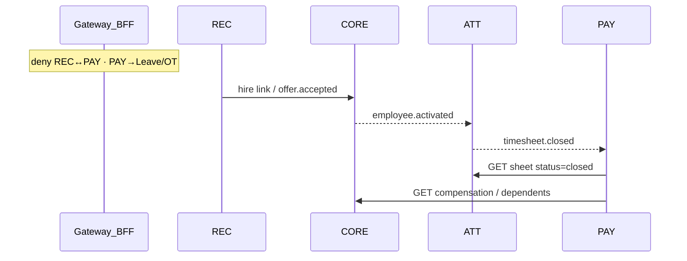
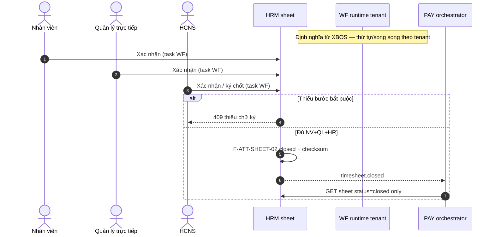
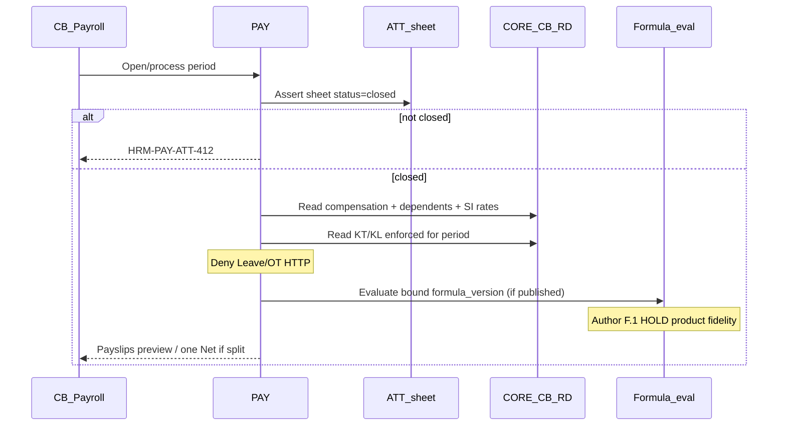

# TechSpec — HRM Enterprise Blueprint (4 Pillars)

| Field | Value |
|-------|--------|
| **Doc ID** | TECHSPEC-HRM-ENT |
| **Version** | **0.3.0-DRAFT** |
| **work_item_id** | `PO-HRM-BP-MEET-TECH-API-01` · DOC-DELTA `PO-HRM-BP-SYNTH-PAY-TECH-01` · **DOC-DELTA** `PO-HRM-BP-SYNTH-PAY-API-01` (§11 residual only) · **DOC-DELTA** `PO-HRM-BP-ATT-SIGN-TS-01` (§6.4 ký chốt) · **DOC-DELTA** `PO-HRM-BP-ATT-SIGN-DB-API-01` (§6.4.3–6.4.4 db_api closure) · **DOC-DELTA** `PO-HRM-JD-YCTD-REF-TECHSPEC-01` (YCTD↔JD soft FK · F-YCTD-JD-01..05 — cite program spec; **không** wipe stub REC) · **DOC-DELTA** `PO-HRM-REC-UV-YCTD-TECH-01` (UV↔YCTD · F-REC-UV-YCTD-01..05 · F-REC-CMP-01..02 — cite program spec; **không** wipe stub F-REC-APP-*) · **DOC-DELTA** `PO-HRM-E2E-LINK-EMP-SA-01` (CORE-01a QSĐ→WH · CORE-10 SI actions · HTP-05 · WH picker — cite program spec; **không** wipe F-CORE-EMP-03 / F-CORE-SI-01) · **DOC-DELTA** `PO-HRM-CONTRACT-LEGAL-PRINT-TECH-01` (CORE-09/09a/09b/09c template+clause+print · F-CORE-CTR-* — cite program TechSpec; **không** wipe F-CORE-CTR-01 stub) · **DOC-DELTA** `PO-HRM-PAYROLL-FORMULA-RUN-GAP-DOCS-01` (§7.4 / §7.6 / §11 — Q-PAY-FORMULA **ANSWERED**; F-PAY-FORMULA-* HOLD = product fidelity) |
| **Status** | **DRAFT (meeting-unlocked — four pillars)** — REC / CORE / ATT / **PAY P1–P6** depth từ họp 2026-08-04 + SYNTHESIS §2.4; **Q-PAY-FORMULA / R-PAY-DD-01 = ANSWERED** (Option A · Form GĐ1 + DnD GĐ2); **F-PAY-FORMULA-* authoring HOLD** đến DATA + API F.1 (product fidelity — **không** = chờ workshop); **không** customer-signed (D7); **không** claim formula LIVE / `payroll_e2e_ready` |
| **Date** | 2026-08-04 |
| **ref_srs** | [`SRS_HRM_ENTERPRISE.md`](./SRS_HRM_ENTERPRISE.md) (FR-UC-BP-* · Diễn biến) |
| **ref_adr** | [`ADR-HRM-4-PILLAR-API-BOUNDARY.md`](./ADR-HRM-4-PILLAR-API-BOUNDARY.md) (§6 I-1…I-7 · §10 Q-PAY-FORMULA · §11 Q-ASSET-MODULE) |
| **ref_boundary** | [`API_BOUNDARY_MAP.md`](./API_BOUNDARY_MAP.md) · GW-HRM-01..04 |
| **ref_data** | [`DATA_OWNERSHIP_MATRIX.md`](./DATA_OWNERSHIP_MATRIX.md) · [`DB_DESIGN_HRM_ENTERPRISE.md`](./DB_DESIGN_HRM_ENTERPRISE.md) **v0.3.0** · API_DESIGN §7 field map |
| **ref_api** | [`API_DESIGN_HRM_ENTERPRISE.md`](./API_DESIGN_HRM_ENTERPRISE.md) **v0.3.1** |
| **ref_synthesis** | [`SYNTHESIS_MASTER_HRM_ENTERPRISE.md`](./SYNTHESIS_MASTER_HRM_ENTERPRISE.md) §1 D8 · §2.4 P1–P6 |
| **ref_meeting** | [`MEETING_20260804_CUSTOMER_WANTS.md`](./MEETING_20260804_CUSTOMER_WANTS.md) R1–R8 · C1–C9 · A1–A6 · **PAY họp đã xong** |
| **Preserve** | Không đè `docs/hrm/TECHSPEC.md` / Phase 1 TechSpec khách |

> **Mandate (slide 14):** Approve logic on paper → DB_DESIGN + API_DESIGN → then code. Wave này = paper depth + logical API; **cấm** `apps/**`.

---

## 1. Mục tiêu & phạm vi GĐ

### 1.1 IN (GĐ1 — meeting-locked)

| Pillar | Capability (từ họp + SRS) | Meeting # |
|--------|---------------------------|-----------|
| **REC** | JD master · Định biên 12 tháng · YCTD trong/ngoài ĐB · Ứng viên + application FK YCTD (N–N) · PV/eval trong pipeline · Dashboard KH vs TT · Mail template · Hire → CORE | R2–R8 |
| **CORE** | Profile read-model · Public vs C&B ring · HĐ + checklist giấy tờ · BH timeline · KT/KL · Asset stub · Employment history · Termination tự nghỉ / đuổi | C1–C9 |
| **ATT** | Ca + phân ca bộ phận · Holiday calendar · Phạt muộn config · Accrual + hold phép · Closed timesheet SoT · Mobile punch channel | A1–A6 |
| **PAY** | Run preconditions (closed sheet) · đọc C&B · KT/KL enforced · kỳ · phiếu · split-month pointer (FR PAY-01/02/04/07 · SYNTHESIS P1–P6); **author UI công thức** = Form GĐ1 (R-PAY-DD-01) sau unlock F.1 | P1–P6 **đã chốt họp**; **Q-PAY-FORMULA ANSWERED**; formula **product depth** HOLD (DATA+API) |

### 1.2 OUT / GĐ2

| Item | Gate | Meeting |
|------|------|---------|
| **Campaign hub / tin đăng đa kênh** (Facebook, LinkedIn, …) | **GĐ2** — chỉ khi đối tác mở API đồng bộ; GĐ1 trạng thái tin/CV/PV nằm trên **YCTD** | R1 |
| UI kéo-thả formula designer | **GĐ2** — cùng metadata ADR §10 Option A (**ANSWERED**); GĐ1 = **form** author (R-PAY-DD-01) — **cấm** invent DnD GĐ1 | R-PAY-DD-01 |
| Full Asset SoT (kho/CCDC) | Phase sau stub CORE | Q-ASSET-MODULE |
| Module Work / dự án trong HCNS | OUT CORE | C3 |
| Microservice split 4 deployables | Sponsor NFR | ADR Option B |

### 1.3 Explicit non-claims

- Không claim khách đã confirm / ký TechSpec / API / DB (D7).
- Không ghi «họp lương chưa xong» — họp PAY **đã xong**; **Q-PAY-FORMULA / R-PAY-DD-01 = ANSWERED** (Decision packet + FILL). Residual = **product fidelity** (TechSpec/DB/API depth + Dev/QA) — **không** = chờ workshop lại.
- Không invent drag-drop formula designer làm GĐ1; không hardcode công thức tenant (I-5).
- Không claim formula LIVE / `payroll_e2e_ready=true` từ paper ANSWERED.
- Không unlock Dev Nest migration formula authoring trước DATA + API F.1 CONFIRMED.

---

## 2. Kiến trúc logic 4 trụ + Gateway

**Deploy:** Option A — modular monolith `hrm-api` + portal BFF (ADR §5).

**Bounded contexts:** REC · CORE · ATT · PAY — mỗi trụ SoT riêng; sync chỉ whitelist; handoff bất đồng bộ qua events.



**Invariants (locked):** I-1…I-7 — xem ADR §6. Scope parity list↔get↔mutate (I-7 / U19).

---

## 3. Mat trận biên giới API / event

SoT: [`API_BOUNDARY_MAP.md`](./API_BOUNDARY_MAP.md). TechSpec **không** nhân bản deny-list — mọi function trong API_DESIGN phải pass checklist:

| Check | Rule |
|-------|------|
| GW-HRM-01 | Bearer + body không dùng `candidate_id` làm subject PAY write |
| GW-HRM-02 | REC module không import/call PAY controllers |
| GW-HRM-03 | PAY calculate yêu cầu `timesheet_sheet_id` + server `status=closed` |
| GW-HRM-04 | Không public handler gộp leave+OT+payroll ngoài ATT close job |

**Events (v1):** `offer.accepted` · `employee.activated` · `timesheet.closed` · `termination.started` · `compensation.updated` (optional CORE→PAY).

---

## 4. REC — thành phần & tích hợp CORE (DRAFT depth)

### 4.1 Logical components

| Component | Responsibility | Meeting |
|-----------|----------------|---------|
| **Job Description master** | Mẫu JD tái sử dụng; YCTD tham chiếu | R2 |
| **Headcount plan** | Lưới phòng × vị trí × 12 tháng: Hiện tại / **Cần tuyển** / Dự kiến; bỏ cột kế hoạch/đề xuất trùng | R4 |
| **Recruitment request (YCTD)** | Cờ trong/ngoài ĐB; lý do tuyển mới / thay thế; ma trận duyệt khác nhau; actor **phòng ban trình** → duyệt → HCNS rollup | R3, R5 |
| **Candidate + application** | UV master; `candidate_application` N–N với YCTD (cùng vị trí, khác phòng/dự án/offer) | R8 |
| **Interview / eval** | Nằm **trong** pipeline application — không menu rời; template động Pass/Fail + đề xuất lương | R2, R7 |
| **Mail outbox** | Template theo giai đoạn (fail CV, mời PV + CC interviewer, offer) | R7 |
| **Dashboard REC** | KH (định biên Cần tuyển) vs TT (pipeline/onboard) theo thời gian × phòng × cấp; % chỉ tiêu | R6 |
| **Campaign hub** | **GĐ2** — 1–n YCTD + kênh ngoài; GĐ1: trạng thái «đã đăng / có CV / PV» trên YCTD | R1 |

### 4.2 Integration

| Direction | Contract | Forbidden |
|-----------|----------|-----------|
| REC → CORE | Hire: create/link employee + `offer.accepted` | REC → PAY; REC → ATT (assign shift/leave) |
| CORE → REC | Optional read candidate id (audit) | CORE drive stage machine |

### 4.3 State machines (logical)

**YCTD:** `draft → submitted → approved|rejected → (open_for_hire) → fulfilled|cancelled`  
- Trong ĐB: ma trận rút gọn (FR-UC-BP-REC-02).  
- Ngoài ĐB: ma trận dài + BOD khi cấu hình (FR-UC-BP-REC-02b).  
- Q-REC-HEADCOUNT còn mở cho «cảnh báo vs chặn vượt».

**Application:** `applied → screening → interview → offer → hired|rejected|withdrawn`  
- Stage gắn **application** (theo YCTD), không chỉ candidate global.

**Campaign (GĐ2 only):** `draft → published → closed` — không implement GĐ1.

### 4.4 FR map (ref_srs)

| FR | Tech depth |
|----|------------|
| FR-UC-BP-REC-01 / 01b / 02 / 02b / 08 | **DRAFT API** — API_DESIGN F-REC-* |
| FR-UC-BP-REC-03 | **GĐ2 Campaign hub** — stub note only; GĐ1 receive CV on YCTD |
| FR-UC-BP-REC-04…07 | Logical API sketched (pipeline / hire) — align ba-docs FR lịch |

---

## 5. CORE — hồ sơ, HĐ, bảo mật, lifecycle (DRAFT depth)

### 5.1 Profile model

| Layer | Content | Meeting |
|-------|---------|---------|
| **Read-model dashboard** | Tổng hợp từ module SoT (HĐ, skill/review, thuyên chuyển…) — không ghi đè write path | C1 |
| **Public ring** | Cơ bản / công việc (email, ĐT làm việc) / người phụ thuộc (quà 1/6) | C2 |
| **C&B ring** | Tài chính · lương · NH · MST · BH — chỉ role C&B; không bind API public | C2 |
| **OUT** | Quản lý công việc / dự án | C3 |

### 5.2 Subsystems

| Subsystem | SoT tables (logical) | Notes |
|-----------|----------------------|-------|
| Contract | `employee_contracts` / logical `hrm_contract` | Registry CRUD (must_keep UF-HRM-02) + **DOC-DELTA print spine:** template · clause library · pack · print_version snapshot — chi tiết [`PO-HRM-CONTRACT-LEGAL-PRINT-TECHSPEC-01.md`](../../program/specs/PO-HRM-CONTRACT-LEGAL-PRINT-TECHSPEC-01.md); checklist giấy tờ trên hồ sơ (C4) | C4 · CORE-09/09a/b/c |
| Insurance enrollment | `insurance_enrollment` + `insurance_rate_period` | Số BH (= CCCD hiện nay); loại BH; timeline mức NV/CTY; tạm dừng giữ data; action đổi mức/tạm dừng; **feed trừ BH vào lương** qua PAY đọc CORE/PAY CFG — không PAY ghi enrollment | C5 · Q-SI-SUSPEND |
| Rewards / discipline | `reward_discipline_cases` | Tiêu đề trước; nếu có tiền → link kỳ lương + `enforced` | C6 |
| Asset stub | `employee_asset_assignments` | BB bàn giao + e-sign nội bộ; nghỉ → checklist thu hồi; **không** full Asset SoT | C7 · ADR §11 |
| Employment history | `employment_history` | Bổ nhiệm/thuyên chuyển ghi lịch sử — không chỉ form rời | C8 |
| Termination | `termination_cases` | **tự nghỉ** vs **đuổi** — flow/reason khác; emit `termination.started` | C9 |

### 5.3 Events emitted / consumed

| Event | Role |
|-------|------|
| Consume `offer.accepted` | Mở hồ sơ chờ hoàn thiện |
| Emit `employee.activated` | Checklist đủ → ATT enroll |
| Emit `termination.started` | ATT/PAY stop accrual / final cycle |
| Emit `compensation.updated` | PAY biết baseline đổi (prefer async) |

### 5.4 FR map

| FR | Tech depth |
|----|------------|
| FR-UC-BP-CORE-01 / 02 / 08 | **DRAFT API** |
| FR-UC-BP-CORE-03…07, 10 | Logical components + API sketched; FR lịch ba-docs |
| **FR-UC-BP-CORE-09 / 09a / 09b / 09c** | **DOC-DELTA** F-CORE-CTR-01 overlay + **F-CORE-CTR-TPL/CL/PACK/PREV/VER/PDF-*** — program TechSpec; ba-data DB/API physical còn mở; `contracts_printable_ready=false` |

---

## 6. ATT — ca, lễ, phép, OT, đóng bảng công (DRAFT depth)

### 6.1 Design rules (meeting)

| Rule | Implication |
|------|-------------|
| A1 | Phạt / giờ làm **bám ca & lịch bộ phận** — không một rule cứng cả công ty. **Phân ca ≠ định nghĩa ca** |
| A2 | Holiday calendar công bố hàng năm |
| A3 | Phạt muộn: phút / block / khoảng (TIME-002) |
| A4 | **Cấp quỹ trước khi dùng**; hold khi submit; reject → trả quỹ (Q-LEAVE-ACCRUAL / Q-LEAVE-UNIT mở) |
| A5 | Closed timesheet = SoT giờ công tính lương (ONE source for PAY) |
| A6 | Mobile / kênh tương đương cho punch (NFR) |

### 6.2 Funnel → closed sheet (I-6)

```text
Ca + assignment + holiday
  → Punch / OT request (ATT) / Leave (hold→approve)
  → Close job: giờ chuẩn + OT đã hệ số + phép có lương − không lương/muộn/phạt + ăn ca…
  → attendance_sheets.status = closed (+ immutable lines)
  → emit timesheet.closed
```

**PAY consumers:** chỉ `GET …/attendance-sheets/{id}` khi `status=closed`.  
**Forbidden for PAY:** leave-requests, overtime-requests, raw punches.

### 6.3 FR map

| FR | Tech depth |
|----|------------|
| FR-UC-BP-ATT-02 / 08 / 09 / 10 | **DRAFT API** — `API_DESIGN` F-ATT-* |
| **FR-UC-BP-ATT-11** | **§6.4** (workflow ký chốt · R-SIGN-01) + F-ATT-SHEET-02/03 terminal |
| FR-UC-BP-ATT-01, 03, 03b, 04… | Logical API + Q-* HOLD where noted |

### 6.4 FR-UC-BP-ATT-11 — Ký chốt bảng công (workflow XBOS · Manifest `PO-HRM-BP-ATT-SIGN-TS-01`)

| Meta | Giá trị |
|------|---------|
| **ref_srs** | [`SRS_HRM_ENTERPRISE.md`](./SRS_HRM_ENTERPRISE.md) **FR-UC-BP-ATT-11** · Diễn biến **#1–#3** · sequence NV/QL/HR |
| **BR** | **BR-BP-TS-02** (SRS SoT) — Manifest `BR-ATT-SIGN-01` = alias compiler (cùng quy tắc: đủ chữ ký theo WF mới mở PAY) |
| **Quyết định** | **R-SIGN-01 CLOSED** — thứ tự/song song = workflow **cấu hình trên XBOS** theo tenant; **cấm** hard-code một ladder duy nhất toàn tập đoàn |
| **must_keep** | NV xác nhận **bắt buộc** trước khi coi đủ bước; đủ NV + QL trực tiếp + HCNS; chỉ `status=closed` mới vào phễu PAY (A5 · I-3/I-6) |

#### 6.4.1 Trạng thái & phễu (logical)

```text
aggregate (F-ATT-SHEET-01)
  → header.status = submitted  (chờ ký)
  → workflow_runtime: pending | in_progress (theo WF XBOS đồng bộ tenant)
  → đủ task ký bắt buộc (NV, QL, HR) theo định nghĩa WF
  → F-ATT-SHEET-02 close: closed + checksum + emit timesheet.closed
  → PAY: F-PAY-ATT-CLOSED-01 precheck (412 nếu ≠ closed)
```

| Trạng thái header | PAY đọc? | Mutate punch/leave ảnh hưởng kỳ? |
|-------------------|----------|----------------------------------|
| open / submitted | **Không** | Có (theo V-07 chưa closed) |
| closed | **Có** (read-only lines) | **Không** — `HRM-ATT-SHEET-LOCKED` |
| reopened (F-ATT-SHEET-03) | **Không** until close lại | Có audit + lý do |

#### 6.4.2 Tích hợp XBOS workflow (không invent UC mới)

| Khía cạnh | Thiết kế |
|-----------|----------|
| **SoT định nghĩa WF** | XBOS catalog / workflow master — publish theo tenant |
| **Runtime HRM** | Tenant nhận bản sync; map `workflow_definition_id` + bước → role/persona (NV, QL trực tiếp, HCNS) |
| **Inbox / task** | Mỗi bước ký = task tương ứng persona; **không** giả lập duyệt bằng một nút «Chốt» che thiếu bước |
| **Từ chối** | Một bên từ chối → sheet **không** `closed`; PAY blocked (khớp SRS FR-UC-BP-ATT-11) |
| **Boundary** | ATT **không** sở hữu engine WF — chỉ consumer + ghi nhận chữ ký/audit trên sheet |



#### 6.4.3 Map API logic (hiện có + delta `db_api`)

| F-id | Vai trò trong UC-BP-ATT-11 | Ghi chú |
|------|----------------------------|---------|
| **F-ATT-SHEET-01** | Tiền đề — tạo `submitted` | FR-UC-BP-ATT-10 |
| **F-ATT-WF-SIGN-01** *(delta)* | `POST …/attendance-sheets/{id}/signatures` — ghi bước ký (role, user, at, outcome) | F.1 **PASS** — `API_DESIGN` · `PO-HRM-BP-ATT-SIGN-DB-API-01` |
| **F-ATT-WF-SIGN-02** *(delta)* | `GET …/attendance-sheets/{id}/signatures` — UI trạng thái từng bên | F.1 PASS · scope plan SA-01 · TR-CM-16 jest = Dev |
| **F-ATT-SHEET-02** | Terminal close sau WF đủ | Giữ BR verify; không bypass WF |
| **F-ATT-SHEET-03** | Hủy chốt + audit | FR Diễn biến #3 |
| **F-ATT-SHEET-04** | GET sheet (PAY whitelist) | `status=closed` |

#### 6.4.4 Map DB logic (`PO-HRM-BP-ATT-SIGN-DB-API-01`)

| Thực thể | Mục đích |
|----------|----------|
| `att_timesheet_header` | Giữ `status`, `closed_*`, `checksum` (§4.6 DB_DESIGN) |
| **`att_timesheet_sign_step`** | SoT logical **§4.6.1** — 1 row active / bước WF: `header_id`, `step_code`, `persona_role`, `signer_user_id`, `signed_at`, `outcome` |
| **Rule** | `closed` chỉ khi policy evaluator (WF + BR-BP-TS-02) PASS — **không** chỉ `closed_by` đơn lẻ |

#### 6.4.5 Acceptance hooks (Manifest)

| AC id | TechSpec / evidence |
|-------|---------------------|
| AC-ATT-SIGN-01 | §6.4 + path doc này — **không** HOLD mù |
| AC-ATT-SIGN-02 | §6.4.2 XBOS sync — no hard-code ladder |
| AC-ATT-SIGN-03 | Wave docs-only — `forbidden_paths` |
| AC-ATT-SIGN-04 | Product: `UF-HRM-ATT-SIGN` · `J-HRM-06b` kế — browser U65 |

> **Không claim:** Attendance CLOSED · D7 customer-signed · Dev unlock · Face LIVE.

---

## 7. PAY — meeting-locked depth (P1–P6) + Q-PAY-FORMULA **ANSWERED**

> **CORRECTION `PO-HRM-BP-SYNTH-PAY-TECH-01`:** Họp tiền lương **đã xong**. Depth mở theo SYNTHESIS §2.4 P1–P6 + D8 + FR PAY hiện có. **Không** đồng nghĩa khách đã ký giấy (D7).
>
> **DOC-DELTA `PO-HRM-PAYROLL-FORMULA-RUN-GAP-DOCS-01`:** **Q-PAY-FORMULA / R-PAY-DD-01 = ANSWERED** (Decision packet + FILL · ADR §10 Option A LOCKED). Residual = **product fidelity** (DB expression schema · API F.1 · Dev/QA) — **không** = «chờ confirm workshop». **F-PAY-FORMULA-* authoring vẫn HOLD** đến DATA + API F.1 CONFIRMED. **Cấm** claim formula LIVE / `payroll_e2e_ready`.

### 7.1 Meeting-locked capabilities (IN — DRAFT paper)

| ID | Capability | Spec / invariant | API F-id (logical) |
|----|------------|------------------|--------------------|
| **P1** | Nguồn giờ duy nhất = bảng công tổng hợp **đã chốt** (chấm + phép + OT đã gom vào sheet) | FR-UC-BP-PAY-01 · BR-BP-TS-03 · I-3 · D8 | `F-PAY-ATT-CLOSED-01` · `F-PAY-PROCESS-01` precheck |
| **P2** | Đọc C&B (lương nền, NH, MST, mức BH timeline) từ vòng HĐ/BH — **không** từ hồ sơ công khai | D5 · FR PAY-01 Diễn biến #3 · CORE C&B ring | `F-PAY-CB-READ-01` |
| **P3** | KT/KL có tiền → chỉ vào kỳ khi **đã thi hành** (`payroll_link_status` / enforced) | FR-UC-BP-CORE-08 · meeting C6 | `F-PAY-RD-APPLY-01` (read CORE; write payslip lines) |
| **P4** | Công thức / engine: runtime evaluate metadata; **authoring UX** = Form GĐ1 (R-PAY-DD-01) · DnD = GĐ2 | ADR §10 Option A (**ANSWERED**) · FR-UC-BP-PAY-02 | Runtime bind in `F-PAY-PROCESS-01`; **author/publish F.1 = HOLD** (product depth — DATA+API) |
| **P5** | Module PAY tách biên giới — deny REC↔PAY · PAY↛Leave/OT | GW-HRM-01..04 · API_BOUNDARY | §3 + API §5 |
| **P6** | Split-month / tất toán nghỉ: siết AC theo P1–P3; pointer FR hiện có | FR-UC-BP-PAY-04 · FR-UC-BP-PAY-07 | `F-PAY-SPLIT-01` (pointer) · `F-PAY-TERM-SETTLE-01` (orchestrate reads) |

### 7.2 Runtime flow (GĐ1 paper)



### 7.3 GĐ1 vs GĐ2 (PAY)

| Phase | IN scope | OUT |
|-------|----------|-----|
| **GĐ1 (sau D7 ký giấy + DATA/API formula unlock)** | Period · closed-sheet precheck · C&B read · KT/KL apply · process run · payslip ESS · split-month **rules** trong evaluator · dual-control **CFG API** author/publish Form GĐ1 (ADR §10 A · R-PAY-DD-01) | Drag-drop designer UI |
| **GĐ2** | Drag-drop formula designer trên **cùng** `expression_json` metadata | Không đổi runtime SoT |

### 7.4 Formula authoring — HOLD = product fidelity (Q-PAY-FORMULA ANSWERED)

| Item | Status | Reason (đúng) |
|------|--------|----------------|
| ADR §10 Option A dual-control metadata engine | **ANSWERED / LOCKED** | Decision packet + FILL · **R-PAY-DD-01** Form GĐ1 + DnD GĐ2 · **Q-PAY-F-3** chỉ bảng công chốt — **cấm** re-workshop |
| Paper residual `R-BP-FORMULA-CONFIRM` | **PAPER_CLOSED** | Sponsor ANSWERED supersedes «chờ confirm» |
| API F.1 `F-PAY-FORMULA-AUTHOR/PUBLISH/EVAL` đầy đủ | **HOLD authoring depth** | **Product fidelity** — chờ DATA (`expression_json` inner) + API F.1 CONFIRMED — **không** vì Q unsigned |
| Drag-drop UI GĐ1 | **Rejected as GĐ1** (R-PAY-DD-01) | GĐ2 on same metadata; **cấm** invent GĐ1 DnD |
| Hardcode tenant formula in calculate path | **Forbidden** (I-5) | Locked |
| Claim formula LIVE / `payroll_e2e_ready` | **Forbidden** từ paper | Honesty flag stays false until U65 + QC |

### 7.5 Logical data (DB v0.3.0 + API §7 synced)

| Logical / DB_DESIGN | Role in P1–P6 |
|---------------------|---------------|
| `att_timesheet_header` / `_line` | P1 SoT hours — PAY read-only when `closed` |
| `pay_period_timesheet_bind` | P1 kỳ ↔ sheet closed |
| `hrm_employee_compensation` · insurance periods · dependents | P2 variable bag |
| `hrm_reward_discipline` (+ optional `pay_reward_link`) | P3 enforced → period |
| `pay_payroll_period` · `pay_payroll_group` · `pay_insurance_rate_cfg` | Kỳ / nhóm / rate CFG |
| `pay_payslip` · `pay_payslip_line` · `pay_payslip_split_segment` | Phiếu; header `timesheet_header_id` NOT NULL; P6 segments |
| `pay_formula_definition` | Versioned metadata — `expression_json` **inner schema** = ba-data product depth (paper Q **ANSWERED**) |
| `pay_termination_settlement` · `hrm_termination` | P6 / PAY-07 settlement |

> **CLOSED:** column PAY expand = `SYNTH-PAY-DB-01` + API sync `SYNTH-PAY-API-01`. SA không invent formula DDL / drag-drop.

### 7.6 Open questions (do not close)

- ~~**Q-PAY-FORMULA** — confirm Option A~~ → **ANSWERED** (Decision packet · ADR §10 · R-PAY-DD-01) — residual = product depth only  
- Policy «một phần NV chưa chốt» khi chạy kỳ (FR PAY-01 đặc biệt)  
- Chi tiết phụ cấp 2 kiểu tính trên HĐ (meeting C4) khi map biến PAY  
- Công thức tất toán phép / phụ cấp nghỉ (PAY-07) — khung AC có; expression chi tiết = DATA/API wave (không = chờ Q-PAY-FORMULA lại)  

---

## 8. Cross-cutting

| Concern | SoT (không rewrite) |
|---------|---------------------|
| Group scope `main` / holding | ADR-GROUP-CEO-MAIN-HOLDING-SCOPE |
| RBAC ladder | ADR-HRM-RBAC-SCOPE-LADDER |
| Catalog | XBOS publish → HRM pull; HRM không SoT khung danh mục tập đoàn |
| Soft-delete | Platform convention |
| C&B ring | Separate serializer / resource; `HRM-CORE-CB-403` |
| scope_parity | Same resolver list ↔ get-by-id ↔ mutate per module |

---

## 9. NFR (draft targets)

| NFR | Target |
|-----|--------|
| Closed sheet immutability | No in-place mutate lines after `closed`; correction = adjustment / reopen UC |
| Event idempotency | Upsert by `(event_name, aggregate_id, occurrence_id)` |
| PAY without ATT live | Calculate uses persisted closed snapshot only |
| Observability | Metric `payroll_run_rejected_open_timesheet_total`; JSON logs per NFR baseline |
| Security | Least privilege: PAY role cannot call REC write; GW deny-list |
| Mobile punch | Touch-friendly ESS; offline-first **GĐ2 candidate** unless ATT NFR wave |
| Idempotent hire | REC hire link không tạo payslip |

---

## 10. Ma trận FR ↔ module ↔ API ↔ DB (logical)

> Cột DB = logical name — **align** `DB_DESIGN_HRM_ENTERPRISE.md` khi ba-data publish. Không claim DDL vật lý đã khóa.

| FR/UC | Pillar | API function id | Logical tables | AC sketch |
|-------|--------|-----------------|----------------|-----------|
| FR-UC-BP-REC-01 | REC | F-REC-HC-01..04 | `headcount_plans`, `headcount_plan_cells` | Duyệt → ô Cần tuyển khóa |
| FR-UC-BP-REC-01b | REC | F-REC-HC-05 | + `recruitment_requests` | 1 ô → 1 YCTD |
| FR-UC-BP-REC-02/02b | REC | F-REC-YCTD-01..04 · **F-YCTD-JD-01..05** (DOC-DELTA) | `recruitment_requests` / physical `job_requisitions` + soft FK `job_template_id` | Trong/ngoài ĐB matrix + tham chiếu JD Hiệu lực (SRS v0.10 Diễn biến **1a–1d**) — chi tiết [`PO-HRM-JD-YCTD-REF-TECHSPEC-01.md`](../../program/specs/PO-HRM-JD-YCTD-REF-TECHSPEC-01.md) |
| FR-UC-BP-REC-08 | REC | F-REC-DASH-01 | read models | KH vs TT |
| FR-UC-BP-REC-05/06/07 | REC | F-REC-APP-*, F-REC-HIRE-01 | `candidates`, `candidate_applications`, `interview_evals`, `mail_outbox` | N–N app; hire→CORE |
| FR-UC-BP-REC-05a | REC | **F-REC-UV-YCTD-01..05** (DOC-DELTA overlay F-REC-APP-01) | `rec_candidate` + `rec_candidate_application` soft FK YCTD (`requisition_id` alias) · `position_key` derived | Thêm/cập nhật UV — YCTD bắt buộc; cấm free-text position SoT — chi tiết [`PO-HRM-REC-UV-YCTD-TECH-01.md`](../../program/specs/PO-HRM-REC-UV-YCTD-TECH-01.md) |
| FR-UC-BP-REC-06b | REC | **F-REC-CMP-01..02** (DOC-DELTA) | applications + `interview_evals` theo YCTD | So sánh theo **một** YCTD; empty 0 YCTD/0 UV; max N; **FORBIDDEN** `job_postings` — cùng file TechSpec UV-YCTD |
| FR-UC-BP-CORE-01/02 | CORE | F-CORE-EMP-01..03 | `employees`, `employee_dependents`, `employee_compensation` | Ring split |
| FR-UC-BP-CORE-01a | CORE | **F-CORE-DEC-01/02** · **F-CORE-WH-01/02** (DOC-DELTA overlay F-CORE-EMP-03) | `hr_decisions` + `employee_work_timeline` (`decision_id` soft FK) · catalog `position_key` | QSĐ hiệu lực → WH; picker keys — chi tiết [`PO-HRM-E2E-LINK-EMP-SA-01.md`](../../program/specs/PO-HRM-E2E-LINK-EMP-SA-01.md) |
| FR-UC-BP-CORE-10 | CORE | **F-CORE-SI-02/03** (DOC-DELTA deepen F-CORE-SI-01) | enrollment + rate_period append actions | Đóng/Ngừng/Tạm hoãn/Đổi mức — cùng file EMP-SA-01 |
| FR-UC-BP-REC-07 (AC-HTP-05) | REC→CORE | **F-CORE-HTP-05** | `employees` + `employee_contracts` active same `company_id` | Hire-to-Pay bước 5 readiness — EMP-SA-01 |
| FR-UC-BP-CORE-08 | CORE | F-CORE-RD-01 | `reward_discipline_cases` | enforced → PAY read |
| **FR-UC-BP-CORE-09 / 09a / 09b / 09c** | CORE | **F-CORE-CTR-01** overlay · **F-CORE-CTR-TPL-01..02** · **CL-01..04** · **PACK-01** · **PREV-01** · **VER-01..02** · **PDF-01** (DOC-DELTA) | `employee_contracts` + ADD template/clause/print_version | Mẫu · thư viện điều khoản · gói nghề · preview · snapshot · PDF — [`PO-HRM-CONTRACT-LEGAL-PRINT-TECHSPEC-01.md`](../../program/specs/PO-HRM-CONTRACT-LEGAL-PRINT-TECHSPEC-01.md); must_keep F5 salary off-body |
| **FR-UC-BP-CORE-09d** | CORE | F-CORE-CTR-TPL/PREV/VER/CFG + **CORR-01 open catalog** (DOC-DELTA) | `hrm_contract_templates.code` open + starter 8 examples | **SUPERSEDE** closed enum 8 / FORBIDDEN 9th — [`CORR-01`](../../program/specs/PO-HRM-CONTRACT-LEGAL-PRINT-XEVN-TPL-CORR-01.md) · [`XEVN-TPL-TECHSPEC-01`](../../program/specs/PO-HRM-CONTRACT-LEGAL-PRINT-XEVN-TPL-TECHSPEC-01.md) `@CHANGE`; platform [`PO-HRM-DYNAMIC-CONFIG-PLATFORM-01`](../../program/PO_HRM_DYNAMIC_CONFIG_PLATFORM_01.md); `contracts_printable_ready=false` |
| FR-UC-BP-CORE-05/06 | CORE | F-CORE-AST-01..02 | `employee_asset_assignments` | Stub + thu hồi |
| FR-UC-BP-ATT-02 | ATT | F-ATT-RULE-01 | `attendance_rules`, `work_shifts` | Phạt theo ca bộ phận |
| FR-UC-BP-ATT-08/09 | ATT | F-ATT-LEAVE-01..03 | `leave_requests`, `leave_balances`, `holiday_calendar` | Hold/release |
| FR-UC-BP-ATT-10/11 | ATT | F-ATT-SHEET-01..03 | `attendance_sheets`, `attendance_sheet_lines` | Close + event |
| FR-UC-BP-PAY-01 | PAY | F-PAY-ATT-CLOSED-01 · F-PAY-PROCESS-01 | `att_timesheet_*` read · `pay_payroll_period` | 412 if not closed |
| FR-UC-BP-PAY-02 | PAY | F-PAY-PROCESS-01 (eval bind); **FORMULA author HOLD** (product fidelity) | `pay_formula_definition` stub | Q-PAY-FORMULA **ANSWERED** · unlock after DATA+API |
| FR-UC-BP-PAY-04 | PAY | F-PAY-SPLIT-01 | payslip + CORE effective dates | One Net; no double GTCG |
| FR-UC-BP-PAY-07 | PAY | F-PAY-TERM-SETTLE-01 | termination + RD + payslip | Settle after closed sheet |
| FR-UC-BP-PAY-08 (pointer) | PAY | F-PAY-PAYSLIP-01 | `pay_payslip` | ESS self-only |

---

## 11. Residual / GĐ2

| ID | Item | Owner | Gate |
|----|------|-------|------|
| R-BP-CAMPAIGN-GĐ2 | Campaign hub + đa kênh | PM/ba-docs | Đối tác API — **giữ OUT**; YCTD↔JD **không** mở tin đăng |
| R-BP-YCTD-JD-REF-DB | Confirm soft FK alias `job_description_id` ↔ `job_template_id` (DB_DESIGN delta) | ba-data | `PO-HRM-JD-YCTD-REF-DB-01` — trước Dev |
| R-BP-YCTD-JD-REF-API | Delta F-REC-YCTD-01/02 F.1 + mã `HRM-JD-YCTD-*` (API_DESIGN) | sa | `PO-HRM-JD-YCTD-REF-API-01` — sau DB confirm; **cấm apps/** đến khi đóng |
| R-BP-REC-UV-YCTD-DB | Confirm ONE physical soft FK application→YCTD (`requisition_id` ↔ `recruitment_request_id`); deprecate free-text position SoT | ba-data | `PO-HRM-REC-UV-YCTD-DB-01` — trước API/Dev |
| R-BP-REC-UV-YCTD-API | Delta F-REC-APP-01 + ADD F-REC-UV-YCTD / F-REC-CMP F.1 + mã `HRM-REC-UV-*` / `HRM-REC-CMP-*` | sa | `PO-HRM-REC-UV-YCTD-API-01` — sau DB confirm; **cấm apps/** đến khi đóng |
| R-BP-REC-UV-YCTD-HOLD | Dev UV/compare FE+BE | pm | HOLD đến DB-01+API-01; honesty `recruitment_uat_ready=false` · REC-03 OUT |
| ~~R-BP-FORMULA-CONFIRM~~ | ~~Confirm Q-PAY-FORMULA Option A (authoring)~~ | — | **PAPER_CLOSED** — ANSWERED (Decision packet + FILL · ADR §10 · R-PAY-DD-01); residual = product fidelity (DATA→API→Dev→QA) |
| R-BP-FORMULA-PRODUCT | Lift `F-PAY-FORMULA-*` HOLD: expression schema + F.1 AUTHOR/PUBLISH/EVAL + open catalog | ba-data → sa → Dev | Trước Dev formula; **cấm** claim LIVE / `payroll_e2e_ready` |
| ~~R-BP-PAY-MEETING~~ | ~~Họp lương buổi sau~~ | — | **SUPERSEDED** — họp PAY xong (SYNTHESIS v1.0) |
| R-BP-LEAVE-ACCRUAL | Q-LEAVE-ACCRUAL / UNIT | ba-process | ATT accrual detail |
| ~~R-BP-SI-SUSPEND~~ | ~~Q-SI-SUSPEND actions~~ | — | **SUPERSEDED GĐ1** — action vocabulary locked AC-SI-TL-01..04 / F-CORE-SI-03 (`PO-HRM-E2E-LINK-EMP-SA-01`); AC-SI-TL-06 PAY read vẫn residual PAY |
| R-BP-EMP-E2E-DB | Confirm `decision_id` on WH + ONE insurance enrollment SoT + period timeline | ba-data | `PO-HRM-E2E-LINK-EMP-DB-01` — trước Dev |
| R-BP-EMP-E2E-HOLD | Dev BE/FE DEC→WH · SI actions · HTP-05 · WH picker | pm | HOLD đến DB-01; honesty `hrm_personnel_uat_ready=false` |
| R-BP-REC-HEADCOUNT | Q-REC-HEADCOUNT | ba-process | Vượt ĐB warn/block |
| ~~R-BP-PAY-DB-DEPTH~~ | ~~ba-data PAY column expand vs API §4~~ | — | **CLOSED** — DB v0.3 (`SYNTH-PAY-DB-01`) + API §4/§7 sync (`SYNTH-PAY-API-01`) |
| ~~R-BP-DB-ALIGN~~ | ~~Alias map API↔DB; column-level spot-check còn~~ | — | **CLOSED** — evidence `docs/qa/evidence/po-hrm-bp-meet-db-align-01.md` (+ PAY delta `po-hrm-bp-synth-pay-api-01.md`) |
| R-BP-ASSET-SOT | Full Asset SoT | PM | Sau stub |
| R-BP-CUSTOMER-SIGN | Sponsor gửi gói + khách chốt (D7) | PM | Trước claim signed |
| R-BP-CTR-PRINT-DB | Physicalize template + clause + print_version + alias `hrm_contract`↔`employee_contracts` | ba-data | `PO-HRM-CONTRACT-LEGAL-PRINT-DATA-01` — trước Dev |
| R-BP-CTR-PRINT-HOLD | Dev BE/FE print spine | pm | HOLD đến DATA-01 + API F.1; honesty `contracts_printable_ready=false` |

> **DOC-DELTA `PO-HRM-BP-SYNTH-PAY-API-01`:** §11 only — mark **R-BP-DB-ALIGN CLOSED** (pointer `po-hrm-bp-meet-db-align-01.md`); **R-BP-PAY-DB-DEPTH CLOSED**. No full TechSpec rewrite. Broad TechSpec expand remains under program **UC-GAP** HOLD until W3.

> **DOC-DELTA `PO-HRM-CONTRACT-LEGAL-PRINT-TECH-01`:** §5.2 / §5.4 / §10 / §11 — pointer program TechSpec CORE-09 print spine; **không** wipe F-CORE-CTR-01; Dev HOLD.

---

## 12. Unlock criteria (Dev — future)

Dev coding **chỉ** khi:

1. Khách/sponsor **confirm** SRS scope liên quan (D7 — không chỉ draft TechSpec).  
2. `DB_DESIGN_HRM_ENTERPRISE.md` có cột/FK cho spine UC (gồm PAY period/payslip).  
3. API_DESIGN F.1 ổn định cho UC wave.  
4. PAY **formula authoring**: **Q-PAY-FORMULA ANSWERED** — unlock Dev **chỉ** sau DATA (`expression_json` inner) + API F.1 AUTHOR/PUBLISH/EVAL CONFIRMED — **không** yêu cầu «họp lương / workshop Q lại».

**Wave hiện tại:** docs-only · `ack` governance · **không** production-ready · **không** formula LIVE.

> **DOC-DELTA `PO-HRM-PAYROLL-FORMULA-RUN-GAP-DOCS-01` (2026-08-07):** §1 / §7.4 / §7.6 / §11 / §12 — supersede stale «chờ confirm Q-PAY-FORMULA»; KEEP P1–P6; KEEP F-PAY-FORMULA-* HOLD = product fidelity; honesty `payroll_e2e_ready=false`.
