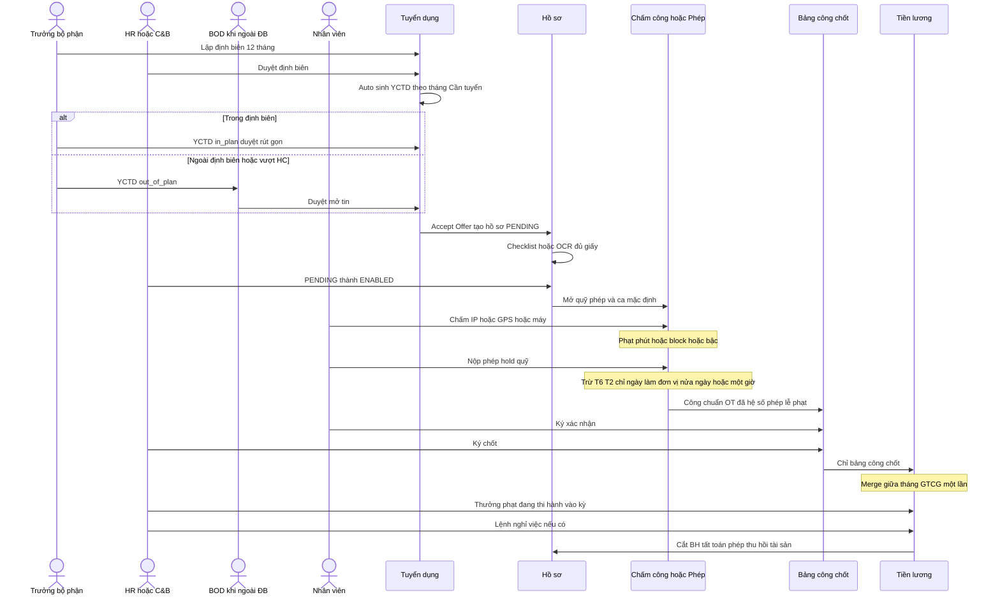

# Ma trận UC / BR / AC — độ sâu edge-case (HRM Enterprise Blueprint)

| Mục | Giá trị |
|-----|---------|
| Phiên bản | **1.1** (bổ sung yêu cầu đối tác 2026-08-04) |
| Nguồn nghiệp vụ | Blueprint trình bày 14 trang · mind map 4 trụ REC / CORE / ATT / PAY · **Danh mục 30 yêu cầu đối tác** (`PARTNER_REQ_CATALOG_20260804.md`) |
| Mục đích | Khách **chốt logic trên giấy** trước khi phát triển theo blueprint |
| Phạm vi tài liệu | Quy tắc nghiệp vụ đo được · nhánh ngoại lệ · rủi ro hiểu sai · ánh xạ `partner_req_id` |
| Không thuộc tài liệu này | Thiết kế tích hợp/dữ liệu chi tiết · mã nguồn · nghiệm thu vận hành |

**Quy ước cột**

| Cột | Ý nghĩa |
|-----|---------|
| **partner_req_id** | Mã REQ từ Excel đối tác (có thể nhiều mã, phân cách `;`) |
| **PPT** | Slide neo trong inventory chương trình (§3) |
| **Gap** | AS-IS so TO-BE blueprint + góp ý đối tác |

**Quy ước trạng thái AS-IS ↔ TO-BE**

| Mã | Ý nghĩa |
|----|---------|
| **PARTIAL** | Hệ hiện tại / SRS nội bộ đã có hướng hoặc một phần luồng; **thiếu** nhánh edge-case hoặc AC đo đủ theo blueprint / đối tác |
| **MISSING** | Blueprint hoặc đối tác yêu cầu rõ; chưa có UC/FR/luồng đủ để nghiệm thu |
| **CONFLICT** | Hành vi hoặc kiến trúc hiện tại **mâu thuẫn** với nguyên tắc blueprint / đối tác (cần chốt Decision Q-* trước khi code) |
| **DECISION** | Hai nguồn (PPT vs Excel đối tác) chưa thống nhất — xem §8 |

---

## 1. Mục tiêu quy trình & tác nhân

**Mục tiêu:** Chuẩn hóa vòng đời nhân sự từ định biên → tuyển → hồ sơ → chấm công/phép → bảng công chốt → lương, với các quy tắc edge-case đối tác (trong/ngoài định biên, hold phép, nửa ngày/1 giờ, merge không GTCG kép, phạt đa chế độ) thống nhất giữa các đơn vị.

| Tác nhân | Vai trò chính trong ma trận này |
|----------|----------------------------------|
| QL / Trưởng bộ phận | Đề xuất định biên, duyệt phép/OT cấp 1, xác nhận bảng công |
| HRBP / Tuyển dụng | Yêu cầu tuyển (trong/ngoài ĐB), kho CV, lịch PV, offer, checklist giấy tờ |
| C&B / Payroll | Vòng mật hồ sơ, cấu hình lương/BH/thuế, công thức, chạy kỳ, phiếu lương, thưởng/phạt kỳ |
| Nhân viên | Chấm công (IP/GPS/máy), nộp phép, ký bàn giao / xác nhận bảng công |
| BOD / BGĐ | Duyệt ngoài định biên / phát sinh / thay thế (theo Decision Q-REC-HEADCOUNT) |
| Hệ thống | Accrual phép, hold quỹ khi submit, trừ ngày làm việc, auto YCTD theo tháng, thu hồi tài sản, gộp split-month |

---

## 2. Ma trận UC · BR · AC (độ sâu)

Cột **Task WBS** bám mind map chương trình §2 (L2). Cột **Gap** = AS-IS so với TO-BE blueprint + REQ đối tác.

### 2.1 Định biên 12 tháng & luồng tuyển (PPT slide 4 · REQ_REC_001…005)

| UC-id | Module | Task WBS | partner_req_id | PPT | Diễn biến ngắn | BR-id | AC PASS | AC FAIL | Edge-case (đối tác ưu tiên) | Rủi ro nếu hiểu sai | Gap |
|-------|--------|----------|----------------|-----|----------------|-------|---------|---------|-----------------------------|---------------------|-----|
| UC-BP-REC-01 | REC | Phê duyệt định biên | REQ_REC_003; REQ_REC_005 | 4 | Lập lưới vị trí × 12 tháng: Hiện tại / Dự kiến / Cần tuyển → gửi duyệt; sau duyệt khóa tháng kích hoạt | BR-BP-HC-01 | Mỗi ô tháng đúng một trạng thái; «Cần tuyển» chỉ ở tháng kích hoạt; sau duyệt khóa chỉnh tay không override; dashboard trả lời «Khi nào có đủ người?» theo tháng × PB | Lưới chỉ tổng năm; hoặc mọi tháng «Cần tuyển» khi chỉ 1 tháng cần | Cùng vị trí cần tuyển T3 và T8 — hai nhu cầu độc lập, không gộp 1 YCTD | Coi định biên = headcount hiện tại → mất dự báo | PARTIAL |
| UC-BP-REC-01b | REC | Định biên · auto sinh YCTD | REQ_REC_003 | 4 | Sau duyệt định biên: hệ **tự sinh YCTD** theo mốc tháng «Cần tuyển» (lịch kích hoạt theo cấu hình) | BR-BP-HC-04 | Mỗi ô «Cần tuyển» đã approved sinh đúng **một** YCTD gắn `plan_month` + vị trí + SL; không sinh trùng khi re-open cùng phiên bản ĐB | YCTD chỉ tạo tay; hoặc auto-sinh trước khi ĐB approved | Đổi SL ô sau khi đã sinh YCTD — cập nhật/version YCTD hoặc cảnh báo (không im lặng lệch) | Quên auto → thiếu tin tuyển đúng tháng | **MISSING** |
| UC-BP-REC-02 | REC | Yêu cầu tuyển · trong ĐB | REQ_REC_001 | 4 | YCTD **trong định biên** đã duyệt đầu năm: luồng rút gọn — không bắt BOD lại nếu policy cho phép | BR-BP-HC-05 | Cờ `headcount_mode=in_plan` + ĐB approved → ma trận duyệt **không** bắt buộc BOD (theo cấu hình legal entity); vẫn qua TPB/HCNS tối thiểu | Trong ĐB vẫn đi full BOD mỗi lần như ngoài ĐB | Thay thế đúng vị trí trong ĐB vs tăng SL — vẫn `in_plan` nếu không vượt ô | Bắt BOD lại mọi YCTD → nghẽn tuyển trong kế hoạch | PARTIAL |
| UC-BP-REC-02b | REC | Yêu cầu tuyển · ngoài ĐB | REQ_REC_001 | 4 | YCTD **ngoài định biên** / phát sinh / thay thế vượt kế hoạch → luồng duyệt riêng (có BOD) | BR-BP-HC-06 | `headcount_mode=out_of_plan` bắt buộc nhánh duyệt dài hơn; thiếu cấp BOD (khi cấu hình yêu cầu) → không chuyển sang mở tin | Ngoài ĐB duyệt giống trong ĐB / bypass BOD | Vượt ĐB vẫn spawn kèm **cảnh báo** nếu khách chốt «cảnh báo cho qua» (Q-REC-HEADCOUNT) — mặc định đề xuất: chặn mở tin đến khi BOD duyệt | Auto-reject cứng hoặc bỏ BOD → sai kiểm soát HC | **MISSING** (edge P0 đối tác) |
| UC-BP-REC-03 | REC | Tin / chiến dịch | REQ_REC_002; REQ_REC_005 | 4 | Gom nhiều YCTD cùng nhóm kỹ năng vào một chiến dịch; funnel CV→PV→chốt | BR-BP-HC-03 | Chiến dịch liệt kê đủ YCTD nguồn; đóng không xóa lịch sử CV; báo cáo KH vs TT theo tháng × PB | Mỗi YCTD = một chiến dịch bắt buộc | Hai pháp nhân cùng vị trí — không trộn `company_id` | Gộp xuyên công ty → lộ CV / sai báo cáo | PARTIAL |

### 2.2 Quét CV nội bộ & mail phỏng vấn (PPT slide 5 · REQ_REC_002, 004)

| UC-id | Module | Task WBS | partner_req_id | PPT | Diễn biến ngắn | BR-id | AC PASS | AC FAIL | Edge-case (đối tác ưu tiên) | Rủi ro nếu hiểu sai | Gap |
|-------|--------|----------|----------------|-----|----------------|-------|---------|---------|-----------------------------|---------------------|-----|
| UC-BP-REC-04 | REC | Kho CV · Tìm kiếm thông minh | REQ_REC_002 | 5 | Trước mở tin ngoài: quét kho nội bộ theo chức danh + kỹ năng/kinh nghiệm (không chỉ hành chính) | BR-BP-CV-01 | Bước «Quét nội bộ» bắt buộc trước đăng ngoài (hoặc skip có lý do + quyền); kết quả khớp skill/title | Bỏ qua kho, đăng ngoài không log | UV «Dev Junior» 2 năm trước → gợi ý tin «Mid» cùng skill family; trạng thái UV gắn YCTD (đã PV / offer / onboard) | Chỉ match exact title → bỏ sót nội bộ | MISSING |
| UC-BP-REC-05 | REC | Kho CV · Lịch sử trạng thái | REQ_REC_002 | 5 | Mỗi UV lưu nguồn, offer từ chối, mức lương mong muốn theo thời gian | BR-BP-CV-02 | Timeline ≥ nguồn / từ chối offer / desired salary; không ghi đè mất lịch sử | Chỉ giữ trạng thái hiện tại | Multi-source qua nhiều năm — giữ multi-source | Mất lịch sử từ chối → lặp offer sai | PARTIAL |
| UC-BP-REC-06 | REC | Phỏng vấn · Mail + đánh giá | REQ_REC_004 | 5 | Template mail: Fail / lịch PV (CC interviewer) / Offer; mẫu đánh giá động Pass/Fail + đề xuất lương; danh sách sắp onboard → chuẩn bị CSVC | BR-BP-MAIL-01 | Mail lịch PV **bắt buộc CC** interviewer; mọi lần gửi log; form đánh giá Pass/Fail lưu được; onboard list đẩy task CSVC (chỗ ngồi/thiết bị) | Mail không CC; đánh giá chỉ ghi chú tự do không Pass/Fail | Nhiều interviewer — tất cả CC; thiếu email → chặn gửi | Interviewer không nhận lịch → no-show | MISSING |

### 2.3 Public vs C&B · hợp đồng · BH · thưởng/phạt · tài sản (PPT slide 6–7 · HR-* / REQ_HR_001)

| UC-id | Module | Task WBS | partner_req_id | PPT | Diễn biến ngắn | BR-id | AC PASS | AC FAIL | Edge-case (đối tác ưu tiên) | Rủi ro nếu hiểu sai | Gap |
|-------|--------|----------|----------------|-----|----------------|-------|---------|---------|-----------------------------|---------------------|-----|
| UC-BP-CORE-01 | CORE | Hồ sơ · vòng public | HR-001; REQ_HR_001 | 6 | Role không C&B xem: họ tên, SĐT, email nội bộ, bộ phận, chức vụ, thông tin gia đình phục vụ phúc lợi | BR-BP-SEC-01 | API/UI hồ sơ chung **không** trả lương CB, PC tiền, MST, NH, số sổ BHXH, tỷ lệ đóng | Field lương/MST trên profile chung | Lọc tuổi con quà 1/6: chỉ cờ/đủ điều kiện — không lộ toàn bộ hồ sơ phụ thuộc | Nhầm «có field gia đình» = xem lương | PARTIAL |
| UC-BP-CORE-02 | CORE | Hồ sơ · vòng C&B | HR-001; PAY-001 | 6 | Role C&B mở vòng mật: lương, PC (cố định/ngày), MST, NH, BHXH; lịch sử hiệu lực theo ngày | BR-BP-SEC-02 | Chỉ membership C&B đọc/ghi vòng mật; audit mọi truy cập/sửa; phiên bản theo ngày hiệu lực | CEO đơn vị không C&B vẫn xem lương trên profile | Kiêm nhiệm: C&B CT A không đọc vòng mật CT B | Scope sai → lộ lương xuyên CT | PARTIAL |
| UC-BP-CORE-02b | CORE | Cấu hình nhóm hồ sơ | REQ_HR_001 | 6 | Nhóm field: cơ bản / cá nhân / công việc / tài chính — cấu hình linh hoạt (metadata) | BR-BP-SEC-03 | Admin cấu hình nhóm field theo legal entity không deploy; public vs mật vẫn tuân BR-BP-SEC-01/02 | Hardcode nhóm field trong release | **Q-XBOT-PROFILE**: «Xbot» = catalog/metadata XBOS hay hệ riêng — chốt trước SRS FR | Hiểu Xbot = module ngoài → lệch kiến trúc | **DECISION** |
| UC-BP-CORE-03 | CORE | Checklist giấy tờ | HR-003 | 7 | Checklist động theo vị trí/PB: bắt buộc vs tùy chọn → upload PDF → HR duyệt | BR-BP-DOC-01 | Thiếu giấy bắt buộc → không Hoàn thiện; banner thiếu rõ từng loại; ưu tiên PDF scan | Active khi còn thiếu giấy bắt buộc | Checklist khác theo vị trí/loại HĐ | Bỏ checklist → Active sớm | MISSING |
| UC-BP-CORE-04 | CORE | Checklist · OCR | HR-003; REQ_REC_004 | 7 | Upload PDF → trích field → user xác nhận | BR-BP-OCR-01 | Field đã OCR không bắt nhập lại; cho sửa từng field lệch | Bắt nhập lại toàn bộ | OCR lệch 1 field — không hủy cả bộ | OCR sai im lặng → CCCD/MST sai | MISSING |
| UC-BP-CORE-05 | CORE | Tài sản · cấp phát | HR-006 | 7 | Gán tài sản (mã, serial) + BB bàn giao số (HR ↔ NV ký); tham chiếu module Tài sản | BR-BP-AST-01 | «Đang sử dụng» gắn `employee_id`; BB có chữ ký hai bên; lưu mã/serial tham chiếu | Gán không BB vẫn «Đang sử dụng» | **Q-ASSET-MODULE**: stub ref vs full Asset SoT theo phase | Mất truy vết khi mất mát | MISSING |
| UC-BP-CORE-06 | CORE | Tài sản · thu hồi | HR-006 | 7 · 13 | Khi nghỉ việc: mọi tài sản Đang sử dụng → Cần thu hồi | BR-BP-AST-02 | Lệnh nghỉ tạo checklist thu hồi 100% đang gán; chặn tất toán cuối nếu còn item bắt buộc chưa thu | Nghỉ xong tài sản vẫn Đang sử dụng không task | Một phần đã trả trước — chỉ phần còn lại vào thu hồi | Mất tài sản khi offboard | MISSING |
| UC-BP-CORE-08 | CORE | Khen thưởng & Kỷ luật | HR-005 | 7 · 11 | Thêm bản ghi KT/KL có **Trạng thái thi hành**; số tiền thưởng/phạt **đẩy vào bảng lương tháng** (qua biến kỳ, không hardcode ngoài PAY) | BR-BP-RD-01 | Bản ghi đã «Đang/Đã thi hành» xuất hiện đúng kỳ lương đích dưới thành phần thưởng/phạt; hủy thi hành → không vào kỳ chưa chốt | Tiền thưởng/phạt chỉ ghi note HR, không vào payslip; hoặc vào 2 kỳ | Đổi trạng thái thi hành sau chốt kỳ — không sửa payslip đã khóa; điều chỉnh kỳ sau có audit | Quên link payroll → sai Net / tranh chấp | **MISSING** |
| UC-BP-CORE-09 | CORE | Hợp đồng LĐ · in ấn | HR-002 | — | Mã ký, hiệu lực, lương, vị trí; Word template + **keyword fill** in ấn | BR-BP-CTR-01 | Generate HĐ từ template: keyword map đủ field HĐ/lương/vị trí; bản in khớp master | In tay copy-paste lệch master | Phụ lục đổi lương giữa kỳ → version HĐ + feed split-month | Template lệch → rủi ro pháp lý | PARTIAL |
| UC-BP-CORE-10 | CORE | BHXH lifecycle | HR-004; Q-SI-SUSPEND | — | % + số tiền NV/CTY; trạng thái Hoạt động / Ngừng / **Tạm hoãn**; đổi hàng loạt | BR-BP-SI-01 | Đổi trạng thái BH phản ánh kỳ lương/BH đúng; tạm hoãn khi ốm dài map ATT→PAY theo policy | Tạm hoãn không cắt/đóng đúng căn cứ | Đổi hàng loạt có preview + audit | Sai tạm hoãn → khiếu nại BH | PARTIAL |

### 2.4 Quy tắc ca & phạt & dữ liệu chấm (PPT slide 8 · TIME-* · REQ_CC_*)

| UC-id | Module | Task WBS | partner_req_id | PPT | Diễn biến ngắn | BR-id | AC PASS | AC FAIL | Edge-case (đối tác ưu tiên) | Rủi ro nếu hiểu sai | Gap |
|-------|--------|----------|----------------|-----|----------------|-------|---------|---------|-----------------------------|---------------------|-----|
| UC-BP-ATT-01 | ATT | Thiết lập ca & phân ca | TIME-001 | 8 | Giờ vào/ra, hệ số công, grace; phân ca tuần/tháng theo bộ phận (VP, tài xế); công theo ca gán thực tế | BR-BP-SHF-01 | NV bộ phận A áp rule A; B khác giờ/OT; công tính theo ca đang gán | Một bộ rule global ghi đè mọi OU | NV kiêm nhiệm hai OU — rule theo OU chấm đang active | Rule chung → công tài xế/VP sai | PARTIAL |
| UC-BP-ATT-02 | ATT | Phạt muộn / về sớm | TIME-002 | 8 | Phạt theo **phút** / **block** / **bậc**; chỉ áp khi nguồn chấm **hợp lệ** | BR-BP-SHF-02 | Cùng timestamp → giờ công thô + tiền/phút phạt khớp mode cấu hình (phút XOR block XOR bậc); tắt phạt → 0 phạt | Mode lẫn (vừa phút vừa bậc) không có SoT; hoặc phạt khi nguồn không hợp lệ | Nguồn hợp lệ: **IP** và/hoặc **GPS** và/hoặc **máy chấm** theo cấu hình OU — nguồn ngoài danh sách → từ chối hoặc 0 công (theo policy) | Mỗi kênh tự phạt → lệch bảng công / lương | PARTIAL |
| UC-BP-ATT-03 | ATT | Dữ liệu chấm công | TIME-002; REQ_CC_002 | 8 | Ghi nhận App GPS/IP/máy → pipeline rule ca → giờ công thô; giải trình sau duyệt cập nhật công + lịch sử | BR-BP-ATT-01 | Bản ghi có nguồn + tọa độ/IP khi rule bắt buộc; sau duyệt giải trình: công cập nhật + audit trail | GPS UI không lưu tọa độ khi bắt buộc geo; giải trình duyệt không đổi công | Ngoài geofence → từ chối hoặc giải trình | «Đã chấm» thiếu tọa độ → phá GEO | PARTIAL |
| UC-BP-ATT-03b | ATT | Lịch lễ · Tết | REQ_CC_001 | 8 · 9 | Lễ dương cố định + **âm lịch cấu hình hàng năm** theo pháp nhân | BR-BP-HOL-01 | Bộ lịch năm có đủ lễ dương + ngày âm đã cấu hình; phép/công dùng cùng lịch | Chỉ hardcode dương lịch VN cố định không cấu hình âm | Đổi lịch giữa năm — ảnh hưởng đơn chưa duyệt theo version lịch | Sai lịch → trừ phép/lễ sai | PARTIAL |

### 2.5 Hệ sinh thái phép (PPT slide 9 · REQ_NP_001…006)

| UC-id | Module | Task WBS | partner_req_id | PPT | Diễn biến ngắn | BR-id | AC PASS | AC FAIL | Edge-case (đối tác ưu tiên) | Rủi ro nếu hiểu sai | Gap |
|-------|--------|----------|----------------|-----|----------------|-------|---------|---------|-----------------------------|---------------------|-----|
| UC-BP-ATT-04 | ATT | Cấp phép năm · thành phần | REQ_NP_001; Q-LEAVE-ACCRUAL | 9 | Accrual: **1 ngày/tháng** (0.5 nếu nửa tháng vào/nghỉ) + thâm niên (vd +1 tại mốc 3/5 năm) + chức vụ (vd TP +4) | BR-BP-LV-01 | Số dư = tổng thành phần cấu hình theo LE; nửa tháng đầu/cuối = 0.5 ngày base; thâm niên/chức vụ ghi tách dòng audit | Hardcode 12 ngày; hoặc cộng thâm niên trùng mỗi lần mở form | Đổi phương thức giữa năm — chốt chuyển số dư (khách) | Sai quỹ theo CT | PARTIAL |
| UC-BP-ATT-04b | ATT | Ứng phép & thời điểm cấp | REQ_NP_002 | 9 | Cho/không ứng trước; cấp đầu năm / theo tháng / 6 tháng; nghỉ khi chưa có phép → không lương rồi bù trừ khi có quỹ | BR-BP-LV-07 | Toggle ứng trước OFF → chặn đơn vượt số dư; ON → cho đến trần; nghỉ không lương gắn loại riêng rồi bù trừ khi accrual về | Ứng trước khi toggle OFF; hoặc không có nhánh không lương | Cấp 6 tháng một lần — đơn giữa kỳ chỉ dùng số đã cấp | NV nghỉ âm quỹ im lặng → tranh chấp | **MISSING** |
| UC-BP-ATT-05 | ATT | Bảo lưu & hoàn trả | REQ_NP_005 | 9 | Phép cũ bảo lưu thường hết **Q1** năm sau; nghỉ việc: trả tiền phép còn lại trên **lương CB đóng BH** | BR-BP-LV-02 | 01/04 cắt carry đúng số còn; terminate: payout = ngày còn × đơn giá CB-BH theo policy | Carry mất 01/01; payout trên lương gross không phải CB-BH | Vừa dùng phép mới vừa carry — thứ tự trừ một SoT | Bỏ carry / sai đơn giá payout | PARTIAL |
| UC-BP-ATT-06 | ATT | Phép OT (nghỉ bù) | REQ_NP_004 | 9 | OT đã duyệt quy đổi cộng quỹ phép nếu CTY bật chế độ | BR-BP-LV-03 | Chỉ tăng phép OT khi OT approved & policy bật; tỷ lệ giờ→ngày cấu hình | Cộng phép từ OT draft; hoặc nhân hệ số lần nữa ở PAY | Tắt chế độ → OT chỉ vào bảng công, không cộng phép | Double convert OT→phép + OT tiền | PARTIAL |
| UC-BP-ATT-07 | ATT | Nghỉ ốm · lương | (liên quan HR-004) | 9 | Hưởng BHXH **hoặc** công ty hỗ trợ 100% | BR-BP-LV-04 | Đơn ốm gắn đúng policy; công/lương đúng nhánh | Vừa trừ CTY 100% vừa BHXH cùng kỳ không rule | Vượt ngày BHXH → nhánh CTY hoặc không lương | Sai nhánh → khiếu nại | MISSING |
| UC-BP-ATT-08 | ATT | Trừ ngày nghỉ · T7/CN/Lễ | REQ_NP_006 | 9 | Đơn T6→T2: **tự loại** T7, CN, lễ theo lịch làm việc; đơn vị tối thiểu **nửa ngày** hoặc **1 giờ** (Q-LEAVE-UNIT) | BR-BP-LV-05 | Ví dụ chuẩn: T6+T2 = **2** ngày trừ quỹ; nửa ngày = 0.5; đơn 1 giờ khi unit=hour khớp ca; T7/CN/Lễ = 0 trừ | Trừ 4 calendar day; hoặc không hỗ trợ 0.5/1h khi cấu hình bật | Chuỗi dài nhiều lễ — chỉ đếm ngày làm việc; đổi unit giữa loại phép | Trừ calendar → quỹ âm oan | **MISSING** (edge P0) |
| UC-BP-ATT-09 | ATT | Nộp & duyệt · hold quỹ | REQ_NP_003; REQ_NP_006 | 9 | Submit = **hold** số ngày trừ dự kiến; duyệt → trừ thật; từ chối → hoàn hold; đổi loại nghỉ recalculate | BR-BP-LV-06 | Sau submit: available giảm (hold); reject → hold hoàn 100%; approve → hold chuyển deducted đúng working-day | Submit không hold → hai đơn overlapping cùng ngày; reject không hoàn | Overlapping hai đơn — chặn; đổi loại phép giữ/giải hold theo số mới | Double-book quỹ → âm giả | **MISSING** (edge P0 đối tác) |

### 2.6 Phễu bảng công = SoT lương (PPT slide 10 · REQ_L_001)

| UC-id | Module | Task WBS | partner_req_id | PPT | Diễn biến ngắn | BR-id | AC PASS | AC FAIL | Edge-case (đối tác ưu tiên) | Rủi ro nếu hiểu sai | Gap |
|-------|--------|----------|----------------|-----|----------------|-------|---------|---------|-----------------------------|---------------------|-----|
| UC-BP-ATT-10 | ATT | Bảng công tính lương | REQ_L_001 | 10 | Gom chấm + phép + OT → công chuẩn / thực tế / phép / lễ / phạt; giờ × hệ số OT (vd 150%) → **Công tính lương** | BR-BP-TS-01 | Một kỳ một bảng chốt; đơn vị «giờ công tính lương»; OT vào phễu **đã** nhân hệ số | Payroll lấy OT raw × hệ số lần nữa | Giải trình sau chốt — chỉ điều chỉnh kỳ / mở lại có audit | OT nhân hai lần | PARTIAL |
| UC-BP-ATT-11 | ATT | Chốt bảng công | REQ_L_001 | 10 | NV và HR ký/xác nhận trước chạy lương | BR-BP-TS-02 | Chốt đủ chữ ký bắt buộc → mới mở lệnh tính lương; hủy chốt có lý do + quyền | Chạy lương khi draft | Một bên từ chối ký → không vào payroll | Bỏ ký → tranh chấp sau phát lương | PARTIAL |
| UC-BP-PAY-01 | PAY | Ranh giới SoT | REQ_L_001 | 10 · 3 | Module Lương **chỉ** đọc bảng công đã chốt — **không** gọi API OT/Phép để tính lương | BR-BP-TS-03 | Payroll run không dependency trực tiếp leave/OT APIs; mọi giờ từ timesheet chốt | Payroll cộng giờ từ leave/OT song song bảng công | Điều chỉnh phép sau chốt → không đổi lương đã khóa trừ mở lại bảng công | Hai nguồn số → lệch phiếu | **CONFLICT** nếu AS-IS còn đọc chéo |

### 2.7 Động cơ lương · merge · phiếu · nhóm (PPT slide 11–12 · REQ_L_* · PAY-001)

| UC-id | Module | Task WBS | partner_req_id | PPT | Diễn biến ngắn | BR-id | AC PASS | AC FAIL | Edge-case (đối tác ưu tiên) | Rủi ro nếu hiểu sai | Gap |
|-------|--------|----------|----------------|-----|----------------|-------|---------|---------|-----------------------------|---------------------|-----|
| UC-BP-PAY-02 | PAY | Thành phần & công thức | REQ_L_002; PAY-001 | 11 | Thành phần (chính, PC, KPI); engine cấu hình biến số. **PPT:** HR kéo-thả. **Excel đối tác:** IT thiết lập trên DB → **Q-PAY-FORMULA** | BR-BP-PAY-01 | Sau chốt Decision: công thức versioned + publish có dual-control; không hardcode mỗi kỳ trong code path; PC: chịu TNCN? đóng BH? theo ngày công hay trọn gói — toggle đúng | Công thức chỉ sửa bằng deploy; hoặc IT hardcode mỗi CT mỗi kỳ | Dual-control: soạn vs publish tách quyền | Fork code theo CT | **DECISION** / MISSING |
| UC-BP-PAY-03 | PAY | GTCG & BH căn cứ TNCN | REQ_L_003 | 11 | GTCG (vd bản thân 11tr, PT 4tr) + mức đóng BH làm căn cứ TNCN từ hồ sơ C&B | BR-BP-PAY-02 | Đổi NPT hợp lệ → kỳ mở dùng mức mới; không nhập tay trùng trên payroll | NPT tách khỏi hồ sơ không đồng bộ | Con đủ tuổi mất GTCG giữa năm | Double master NPT → sai thuế | PARTIAL |
| UC-BP-PAY-04 | PAY | Merge bảng lương giữa tháng | REQ_L_004 | 12 | 2 đoạn/tháng (đổi lương / thử việc→CT): cộng thu nhập; **GTCG/giảm trừ bản thân chỉ 1 lần** | BR-BP-SPL-01 | Biến cộng dồn (giờ, gross, PC ngày) cộng hai đoạn; biến tĩnh (TNCN, GTCG, trần BH) **một lần** trên tổng hợp; **một** phiếu Net | Hai phiếu Net; hoặc GTCG trừ **hai lần** | Mốc cắt = ngày hiệu lực HR (không hardcode 15 trừ khi cấu hình kỳ) | Khấu trừ kép → rủi ro thuế | **MISSING** (edge P0) |
| UC-BP-PAY-05 | PAY | Bảo hiểm · trần split | REQ_L_003; REQ_L_004 | 12 | Trần BH trên tổng thu nhập hợp nhất kỳ split | BR-BP-SPL-02 | Trần không áp hai lần từng đoạn | Mỗi đoạn tự áp trần | Vào giữa tháng — pro-rate + trần theo quy tắc đã cấu hình | Áp trần hai lần → sai sổ BH | MISSING |
| UC-BP-PAY-08 | PAY | Phiếu lương | REQ_L_005 | 11 | Preview + xác nhận; chỉ xem của mình; trạng thái thanh toán + công nợ NS | BR-BP-PAY-03 | NV chỉ mở phiếu của mình; trạng thái TT/công nợ hiển thị đúng; preview trước chốt gửi | NV xem phiếu người khác; hoặc không có trạng thái TT | Phiếu sau điều chỉnh kỳ — version rõ | Lộ lương / tranh chấp TT | PARTIAL |
| UC-BP-PAY-09 | PAY | Phân nhóm bảng lương | REQ_L_006 | 11 | Nhóm VP / KD / tài xế / vận hành theo PB, chức vụ hoặc danh sách đặc thù | BR-BP-PAY-04 | Kỳ lương chạy theo nhóm cấu hình; NV thuộc đúng một nhóm active / hoặc rule ưu tiên rõ | Một NV vào hai nhóm cùng kỳ không rule | Danh sách đặc thù override PB | Sai nhóm → sai công thức/PC | PARTIAL |

### 2.8 Lifecycle Offer → Active → Terminate (PPT slide 13 · 2)

| UC-id | Module | Task WBS | partner_req_id | PPT | Diễn biến ngắn | BR-id | AC PASS | AC FAIL | Edge-case (đối tác ưu tiên) | Rủi ro nếu hiểu sai | Gap |
|-------|--------|----------|----------------|-----|----------------|-------|---------|---------|-----------------------------|---------------------|-----|
| UC-BP-REC-07 | REC | Offer · tiếp nhận | REQ_REC_004 | 13 | Chấp nhận Offer → hồ sơ NV mới **không nhập lại** data ứng viên | BR-BP-LC-01 | PENDING có sẵn data từ candidate | Form trống bắt gõ lại | Đổi SĐT giữa offer và accept — lấy bản Accept mới nhất | Nhập lại → lệch CCCD/mail | PARTIAL |
| UC-BP-CORE-07 | CORE | Kích hoạt Active | HR-003 | 13 | Checklist đủ → HR Active: PENDING → ENABLED | BR-BP-LC-02 | Không Enabled khi checklist bắt buộc chưa xong (trừ override + lý do) | Enabled ngay khi Accept bỏ checklist | Override khẩn — vẫn mở task giấy tờ | Active sớm → mở chấm/phép/lương sớm | PARTIAL |
| UC-BP-ATT-12 | ATT | Mở phép & ca mặc định | REQ_NP_001; TIME-001 | 13 | Khi ACTIVE: cấp quỹ phép (BR-BP-LV-*) + map ca mặc định | BR-BP-LC-03 | Ngày Active: có số dư khởi tạo + ca mặc định | Phải gán tay mới đi làm | Active cuối tháng — accrual nửa tháng 0.5 | Quên map ca → không chấm ngày đầu | PARTIAL |
| UC-BP-PAY-06 | PAY | Sẵn sàng lương | REQ_L_001 | 13 | Công chảy vào mốc lương khi Active + có bảng công | BR-BP-LC-04 | NV Active trong kỳ đúng pháp nhân; chưa Active không payslip thường | Sinh payslip cho PENDING | Hire giữa tháng — split/pro-rate | Payslip cho chưa nhận việc | PARTIAL |
| UC-BP-PAY-07 | PAY | Lệnh nghỉ việc | REQ_NP_005; HR-006; HR-004 | 13 | TERMINATION: cắt BH + tất toán phép (CB-BH) + thu hồi tài sản + thưởng/phạt đang thi hành | BR-BP-LC-05 | Một lệnh: cutoff BH, payout phép, checklist tài sản, đưa KT/KL thi hành vào kỳ cuối; split nếu cần | Chỉ đổi status NV | Nghỉ giữa tháng + OT/phép — thứ tự: chốt công → tất toán → lương cuối | Thiếu tất toán → nợ phép / mất TS | PARTIAL |

---

## 3. Bảng quy tắc nghiệp vụ (condition → action → outcome)

| BR-id | partner_req_id | Điều kiện | Hành động hệ thống | Kết quả |
|-------|----------------|-----------|--------------------|---------|
| BR-BP-HC-01 | REQ_REC_003 | Ô tháng = Cần tuyển & ĐB approved | Cho phép / kích hoạt YCTD | Nhu cầu tuyển có nguồn ĐB |
| BR-BP-HC-04 | REQ_REC_003 | ĐB approved có ô Cần tuyển theo tháng | Auto-sinh YCTD theo mốc | Đúng tháng có tin/YCTD |
| BR-BP-HC-05 | REQ_REC_001 | `in_plan` + ĐB năm đã duyệt | Luồng duyệt rút gọn (không BOD nếu policy) | Tuyển trong kế hoạch thông suốt |
| BR-BP-HC-06 | REQ_REC_001 | `out_of_plan` / vượt HC / phát sinh | Luồng duyệt có BOD (theo cấu hình) | Kiểm soát ngoài ĐB |
| BR-BP-CV-01 | REQ_REC_002 | Mở tin ngoài chưa quét nội bộ | Chặn hoặc bắt skip có lý do | Ưu tiên tái sử dụng CV |
| BR-BP-MAIL-01 | REQ_REC_004 | Gửi lịch PV | CC interviewer + log + đánh giá Pass/Fail | Đồng bộ lịch / kết quả |
| BR-BP-SEC-01 | HR-001 | Role không C&B | Ẩn/cấm vòng mật | Không lộ lương/BH/thuế |
| BR-BP-SEC-02 | HR-001 | Role C&B đúng scope LE | Mở vòng mật + audit | C&B ring đúng PPT slide 6 |
| BR-BP-DOC-01 | HR-003 | Thiếu giấy bắt buộc | Không Hoàn thiện / không Enabled | Tuân thủ hồ sơ |
| BR-BP-AST-02 | HR-006 | Kích hoạt nghỉ việc | Tài sản Đang dùng → Cần thu hồi | Thu hồi trước tất toán |
| BR-BP-RD-01 | HR-005 | KT/KL trạng thái thi hành + có số tiền | Đẩy biến thưởng/phạt vào kỳ lương đích | Payslip phản ánh đúng |
| BR-BP-SHF-01 | TIME-001 | NV thuộc OU có rule riêng | Áp rule OU / ca gán | Giờ công đúng ca |
| BR-BP-SHF-02 | TIME-002 | Muộn/sớm + nguồn hợp lệ (IP/GPS/máy) | Phạt theo mode phút/block/bậc | Phạt nhất quán đa kênh |
| BR-BP-HOL-01 | REQ_CC_001 | Năm dương lịch + cấu hình âm | Working calendar dùng chung phép/công | Lễ/Tết đúng |
| BR-BP-LV-01 | REQ_NP_001 | Accrual theo tháng + thâm niên + chức vụ | Cộng thành phần tách dòng | Quỹ audit được |
| BR-BP-LV-07 | REQ_NP_002 | Ứng trước OFF hoặc hết số dư | Chặn hoặc chuyển không lương | Không âm quỹ im lặng |
| BR-BP-LV-06 | REQ_NP_003 | Submit đơn phép | Hold quỹ; reject hoàn; approve trừ | Không double-book |
| BR-BP-LV-03 | REQ_NP_004 | OT approved + policy nghỉ bù ON | Cộng phép OT | Bù giờ đúng |
| BR-BP-LV-02 | REQ_NP_005 | Hết Q1 / terminate | Cắt carry / payout CB-BH | Bảo lưu có hạn; tất toán đúng |
| BR-BP-LV-05 | REQ_NP_006 | Khoảng nghỉ có T7/CN/Lễ | Chỉ trừ ngày làm; unit 0.5 ngày hoặc 1h | Quỹ đúng thực tế |
| BR-BP-TS-03 | REQ_L_001 | Chạy payroll | Chỉ đọc bảng công chốt | Một SoT giờ công |
| BR-BP-PAY-01 | REQ_L_002 | Publish công thức | Engine versioned (theo Q-PAY-FORMULA) | Không hardcode kỳ |
| BR-BP-SPL-01 | REQ_L_004 | Đổi lương CB trong kỳ | Cộng dồn biến thời gian; GTCG/tĩnh một lần | Một Net, không khấu trừ kép |
| BR-BP-LC-05 | REQ_NP_005; HR-006 | Lệnh terminate | Cutoff BH + payout phép + recall asset + KT/KL kỳ cuối | Offboard đủ bước |

---

## 4. Phủ 30 REQ đối tác (coverage)

| partner_req_id | UC neo (chính) | BR neo | Độ sâu edge | Gap |
|----------------|----------------|--------|-------------|-----|
| REQ_REC_001 | UC-BP-REC-02 / 02b | BR-BP-HC-05/06 | Trong ĐB vs ngoài ĐB fork | PARTIAL / MISSING |
| REQ_REC_002 | UC-BP-REC-04 / 05 | BR-BP-CV-* | Pool skill + trạng thái↔YCTD | PARTIAL / MISSING |
| REQ_REC_003 | UC-BP-REC-01 / 01b | BR-BP-HC-01/04 | Duyệt ĐB → auto YCTD theo tháng | PARTIAL / MISSING |
| REQ_REC_004 | UC-BP-REC-06 / 07 | BR-BP-MAIL-01 / LC-01 | Đánh giá PV + onboard CSVC | MISSING |
| REQ_REC_005 | UC-BP-REC-01 / 03 | BR-BP-HC-01/03 | Dashboard «Khi nào đủ người» | PARTIAL |
| REQ_HR_001 | UC-BP-CORE-02b | BR-BP-SEC-03 | Nhóm field / Xbot | DECISION |
| HR-001 | UC-BP-CORE-01 / 02 | BR-BP-SEC-01/02 | C&B ring | PARTIAL |
| HR-002 | UC-BP-CORE-09 | BR-BP-CTR-01 | Keyword fill HĐ | PARTIAL |
| HR-003 | UC-BP-CORE-03 / 04 | BR-BP-DOC/OCR | Checklist PDF | MISSING |
| HR-004 | UC-BP-CORE-10 | BR-BP-SI-01 | Tạm hoãn BH | PARTIAL |
| HR-005 | UC-BP-CORE-08 | BR-BP-RD-01 | Thi hành → payroll | MISSING |
| HR-006 | UC-BP-CORE-05 / 06 | BR-BP-AST-* | Recall khi nghỉ | MISSING |
| TIME-001 | UC-BP-ATT-01 | BR-BP-SHF-01 | Phân ca theo bộ phận | PARTIAL |
| TIME-002 | UC-BP-ATT-02 / 03 | BR-BP-SHF-02 / ATT-01 | Phạt phút/block/bậc + IP/GPS/máy | PARTIAL |
| REQ_CC_001 | UC-BP-ATT-03b | BR-BP-HOL-01 | Lễ âm cấu hình năm | PARTIAL |
| REQ_CC_002 | UC-BP-ATT-03 | BR-BP-ATT-01 | Giải trình → cập nhật công + lịch sử | PARTIAL |
| REQ_NP_001 | UC-BP-ATT-04 | BR-BP-LV-01 | 1n/th + 0.5 nửa th + thâm niên + chức vụ | PARTIAL |
| REQ_NP_002 | UC-BP-ATT-04b | BR-BP-LV-07 | Ứng phép / thời điểm cấp / không lương | MISSING |
| REQ_NP_003 | UC-BP-ATT-09 | BR-BP-LV-06 | Hold khi submit | MISSING |
| REQ_NP_004 | UC-BP-ATT-06 | BR-BP-LV-03 | OT → phép bù | PARTIAL |
| REQ_NP_005 | UC-BP-ATT-05 · PAY-07 | BR-BP-LV-02 / LC-05 | Carry Q1 + payout CB-BH | PARTIAL |
| REQ_NP_006 | UC-BP-ATT-08 / 09 | BR-BP-LV-05 | Trừ lễ/T7CN + unit 0.5d/1h | MISSING |
| PAY-001 | UC-BP-CORE-02 · PAY-02 | BR-BP-SEC-02 / PAY-01 | Lịch sử lương & PC theo ngày | PARTIAL |
| REQ_L_001 | UC-BP-ATT-10/11 · PAY-01 | BR-BP-TS-* | Bảng công = SoT lương | PARTIAL / CONFLICT |
| REQ_L_002 | UC-BP-PAY-02 | BR-BP-PAY-01 | Formula PPT vs IT-DB | DECISION |
| REQ_L_003 | UC-BP-PAY-03 / 05 | BR-BP-PAY-02 / SPL-02 | GTCG + căn cứ BH | PARTIAL |
| REQ_L_004 | UC-BP-PAY-04 | BR-BP-SPL-01 | Merge không GTCG kép | MISSING |
| REQ_L_005 | UC-BP-PAY-08 | BR-BP-PAY-03 | Phiếu + TT/công nợ | PARTIAL |
| REQ_L_006 | UC-BP-PAY-09 | BR-BP-PAY-04 | Nhóm VP/KD/tài xế | PARTIAL |

**Đếm phủ:** 30/30 REQ có ≥1 dòng UC neo trong §2–§4.

---

## 5. AS-IS vs TO-BE — gap class (tham chiếu nội bộ)

| Nhóm | UC neo | Gap | Ghi chú |
|------|--------|-----|---------|
| Trong ĐB vs ngoài ĐB duyệt | UC-BP-REC-02 / 02b | PARTIAL / MISSING | Edge P0 đối tác — cần Q-REC-HEADCOUNT |
| Auto YCTD theo tháng | UC-BP-REC-01b | MISSING | REQ_REC_003 |
| C&B ring + lịch sử PC | UC-BP-CORE-01/02 | PARTIAL | HR-001 · PAY-001 |
| KT/KL → payroll | UC-BP-CORE-08 | MISSING | HR-005 |
| Asset recall | UC-BP-CORE-05/06 | MISSING | HR-006 · Q-ASSET-MODULE |
| Phạt đa mode + nguồn | UC-BP-ATT-02 | PARTIAL | TIME-002 |
| Accrual / ứng / hold / unit | UC-BP-ATT-04…09 | PARTIAL→MISSING | REQ_NP_001…006 |
| Phép T6–T2 + 0.5d/1h | UC-BP-ATT-08 | MISSING | REQ_NP_006 · Q-LEAVE-UNIT |
| Bảng công SoT | UC-BP-ATT-10…PAY-01 | PARTIAL / CONFLICT | REQ_L_001 |
| Formula engine | UC-BP-PAY-02 | DECISION | REQ_L_002 vs PPT slide 11 · Q-PAY-FORMULA |
| Split-month no double GTCG | UC-BP-PAY-04 | MISSING | REQ_L_004 |

### 5.1 Việc khách cần chốt trước SRS đầy đủ

1. **Q-REC-HEADCOUNT** — Trong ĐB đã duyệt: ai bypass BOD? Ngoài ĐB: bắt buộc BOD? Vượt HC: cảnh báo hay chặn.  
2. **Q-PAY-FORMULA** — IT cấu hình DB vs HR kéo-thả: đề xuất engine cấu hình + dual-control publish.  
3. **Q-LEAVE-UNIT** — Nửa ngày vs 1 giờ theo loại phép / ca.  
4. **Q-LEAVE-ACCRUAL** — Thông số 1n/tháng + thâm niên + chức vụ theo legal entity.  
5. **Q-XBOT-PROFILE** — Xbot = XBOS metadata hay hệ riêng.  
6. **Q-ASSET-MODULE** — Stub tham chiếu vs full Asset SoT theo phase.  
7. **Q-SI-SUSPEND** — Tạm hoãn BH khi ốm dài: map ATT→PAY.  
8. Phép xuyên T7–CN–Lễ: chỉ ngày làm việc (khuyến nghị slide 9 + REQ_NP_006).  
9. Split-month: mốc cắt ngày hiệu lực HR.  
10. Dual-sign bảng công: mọi kỳ hay chỉ kỳ có OT/điều chỉnh.

---

## 6. Luồng quyết định (tóm tắt nhánh — bổ sung fork đối tác)

---

## 7. Ánh xạ sang gói SRS / WBS / kiến trúc

| Nhận | Cần lấy từ ma trận này |
|------|------------------------|
| Soạn SRS | Mã UC + BR + tiêu chí đạt/không đạt + **partner_req_id** → FR/Diễn biến; gắn cột đối tác vào mọi Task WBS |
| Sở hữu dữ liệu | Trường vòng công khai/C&B; giữ chỗ phép; đơn vị 0,5 ngày / 1 giờ; bảng công vs OT/phép; giảm trừ gia cảnh một lần; khen thưởng–kỷ luật → biến kỳ lương |
| Kiến trúc | BR-BP-TS-03; **Q-PAY-FORMULA** vào quyết định kiến trúc; Q-ASSET-MODULE; nhánh tuyển trong/ngoài định biên |
| Kiểm thử (sau xác nhận) | Edge: HC-05/06 · LV-05 (2 ngày T6–T2) · LV-06 giữ chỗ · SPL-01 không trừ gia cảnh kép · SHF-02 chế độ phạt · TS-03 không đọc OT/phép trực tiếp |

**Phủ tối thiểu đã đóng trong §2 (v1.1):** định biên + auto YCTD · fork trong/ngoài ĐB · quét CV · mail/đánh giá PV · C&B ring · checklist OCR · asset recall · KT/KL→payroll · shift + phạt TIME-002 · NP-001…006 · timesheet SoT L-001 · formula Decision · split L-004 · lifecycle terminate.

---

## 8. Decision backlog (Q-*) — chốt với khách / đối tác

| ID | Xung đột / mở | Nguồn | Phương án gợi ý | Ảnh hưởng UC/BR | Trạng thái |
|----|---------------|-------|-----------------|-----------------|------------|
| **Q-REC-HEADCOUNT** | Trong ĐB đã duyệt vs ngoài ĐB — ai bypass BOD? Vượt HC cảnh báo hay chặn? | REQ_REC_001 | Khóa ma trận role theo LE trong SRS FR định biên; mặc định ngoài ĐB bắt BOD; vượt HC = chặn mở tin đến khi duyệt | UC-BP-REC-02 / 02b · BR-BP-HC-05/06 | MỞ |
| **Q-PAY-FORMULA** | Excel: IT cấu hình công thức DB · PPT slide 11: HR kéo-thả engine | REQ_L_002 vs PPT | **SA Recommended Option A** — dual-control C&B author + technical publish; runtime metadata engine; cấm hardcode kỳ; UI kéo-thả = GĐ2. ADR §10 | UC-BP-PAY-02 · BR-BP-PAY-01 · ADR I-5 | **SA-REC** (chờ khách confirm) |
| **Q-XBOT-PROFILE** | REQ_HR_001 nêu cấu hình qua Xbot | REQ_HR_001 | Xbot = lớp metadata/catalog XBOS (khuyến nghị) hoặc hệ riêng — ghi rõ phạm vi phase | UC-BP-CORE-02b | MỞ |
| **Q-ASSET-MODULE** | HR-006 tham chiếu module Tài sản | HR-006 | **SA Recommended** — GĐ1 stub ref mã/serial + BB + thu hồi; full Asset SoT phase sau. ADR §11 | UC-BP-CORE-05/06 | **SA-REC** (chờ confirm phase) |
| **Q-LEAVE-ACCRUAL** | 1 ngày/tháng + thâm niên + chức vụ | REQ_NP_001 | Thông số cấu hình theo legal entity; thành phần tách dòng audit | UC-BP-ATT-04 · BR-BP-LV-01 | MỞ |
| **Q-LEAVE-UNIT** | Nửa ngày vs 1 giờ | REQ_NP_006 | Cấu hình theo loại phép / ca; một đơn vị SoT trên loại | UC-BP-ATT-08 · BR-BP-LV-05 | MỞ |
| **Q-SI-SUSPEND** | Tạm hoãn BH khi ốm dài | HR-004 | Map lifecycle ATT nghỉ dài → PAY/BH suspend có ngày hiệu lực | UC-BP-CORE-10 · BR-BP-SI-01 | MỞ |

---

## 9. Giả định · phụ thuộc · câu hỏi mở còn lại

| Loại | Nội dung |
|------|----------|
| Giả định | Lịch lễ/Tết theo pháp nhân; working-day engine dùng chung phép + công |
| Giả định | Hard boundary giữ: REQ_L_001 bảng công chốt = SoT trước công thức; REC ↛ PAY |
| Phụ thuộc | Catalog loại nghỉ / ca / thành phần lương từ XBOS publish khi vận hành tập đoàn |
| Phụ thuộc | Ký số biên bản tài sản — nhà cung cấp chữ ký nội bộ hoặc tích hợp sau |
| Mở | Có bắt buộc dual-sign bảng công mọi kỳ hay chỉ kỳ có OT/điều chỉnh |
| Mở | Phép OT quy đổi: tỷ lệ giờ→ngày do C&B hay ATT sở hữu cấu hình |
| Mở | OCR CCCD: lưu ảnh gốc bao lâu / chính sách bảo mật |
| Mở | Dashboard TD (REQ_REC_005): chỉ số bắt buộc trên slide khách vs báo cáo nội bộ |

---

## 10. Nhật ký phiên bản

| Ver | Ngày | Thay đổi |
|-----|------|----------|
| 1.0 | 2026-08 | Ma trận depth từ PPT 14 slide + mind map 4 trụ |
| **1.1** | **2026-08-04** | Gộp **30** yêu cầu đối tác: cột `partner_req_id` · nhánh tuyển trong/ngoài ĐB & tự sinh YCTD · NP-001…006 · L-001/002/004 · HR-001/005/006 · TIME-002 · Decision §8 Q-* · phủ §4 30/30 |
| **1.1.1** | **2026-08-04** | §11 đối chiếu edge với WBS v0.3 — **không thêm UC/BR mới** (đã đủ); gắn Decision Q-* vào UC bị chặn |

---

## 11. Đối chiếu edge với WBS v0.3

| Mục | Nội dung |
|-----|----------|
| Kết luận | Ma trận v1.1 **đã phủ** các edge ưu tiên; WBS v0.3 dùng **cùng** `UC-BP-*` — không cần viết lại §2. Chỉ xác nhận + gắn Decision |

### 11.1 Spot-check edge bắt buộc

| partner_req_id | UC neo ma trận | UC / WBS v0.3 | Edge AC còn hiệu lực? | Decision chặn FR kỹ thuật | Gap giữ |
|----------------|----------------|---------------|----------------------|---------------------------|---------|
| REQ_REC_001 | UC-BP-REC-02 / 02b · BR-BP-HC-05/06 | WBS-REC-02 / 02b | **OK** — fork trong/ngoài ĐB | **Q-REC-HEADCOUNT** | PARTIAL / MISSING |
| REQ_REC_003 | UC-BP-REC-01 / 01b · BR-BP-HC-01/04 | WBS-REC-01 / 01b | **OK** — auto YCTD | — | PARTIAL / MISSING |
| REQ_NP_001 | UC-BP-ATT-04 · BR-BP-LV-01 | WBS-ATT-04 | **OK** — accrual thành phần | **Q-LEAVE-ACCRUAL** | PARTIAL |
| REQ_NP_002 | UC-BP-ATT-04b · BR-BP-LV-07 | WBS-ATT-04 | **OK** — ứng phép | — | MISSING |
| REQ_NP_003 | UC-BP-ATT-09 · BR-BP-LV-06 | WBS-ATT-05 | **OK** — hold submit | — | MISSING |
| REQ_NP_004 | UC-BP-ATT-06 · BR-BP-LV-03 | WBS-ATT-04 | **OK** — phép OT | — | PARTIAL |
| REQ_NP_005 | UC-BP-ATT-05 · PAY-07 · BR-BP-LV-02/LC-05 | WBS-ATT-04 · PAY-04 | **OK** — carry Q1 + payout | — | PARTIAL |
| REQ_NP_006 | UC-BP-ATT-08 / 09 · BR-BP-LV-05 | WBS-ATT-05 | **OK** — T6–T2 + unit | **Q-LEAVE-UNIT** | MISSING |
| REQ_L_001 | UC-BP-ATT-10/11 · PAY-01 · BR-BP-TS-* | WBS-ATT-06 | **OK** — SoT bảng công | — | PARTIAL / CONFLICT |
| REQ_L_002 | UC-BP-PAY-02 · BR-BP-PAY-01 | WBS-PAY-01 | **OK** — formula fork | **Q-PAY-FORMULA** | DECISION |
| REQ_L_004 | UC-BP-PAY-04 · BR-BP-SPL-01 | WBS-PAY-03 | **OK** — không GTCG kép | — | MISSING |
| TIME-002 | UC-BP-ATT-02 · BR-BP-SHF-02 | WBS-ATT-01 | **OK** — phạt đa mode + nguồn | — | PARTIAL |
| REQ_CC_001 | UC-BP-ATT-03b · BR-BP-HOL-01 | WBS-ATT-03 | **OK** — lễ âm cấu hình | — | PARTIAL |
| REQ_REC_004 (mail) | UC-BP-REC-06 · BR-BP-MAIL-01 | WBS-REC-04 | **OK** — CC interviewer | — | MISSING |

### 11.2 UC bị chặn Decision (không bịa nhánh FR)

| Decision | UC bị chặn khóa kỹ thuật | Hành vi FR đến khi khách chốt |
|----------|--------------------------|-------------------------------|
| Q-REC-HEADCOUNT | UC-BP-REC-02, UC-BP-REC-02b | FR stub ghi hai nhánh + «chờ chốt»; mặc định đề xuất ngoài ĐB = chặn đến BOD |
| Q-PAY-FORMULA | UC-BP-PAY-02 | Giữ FR đủ 7 mục hiện có; cờ Decision trong quy tắc — không hardcode engine |
| Q-LEAVE-UNIT | UC-BP-ATT-08, UC-BP-ATT-09 | FR ATT-08 đã có; ATT-09 stub nêu 0,5d XOR 1h theo cấu hình |
| Q-LEAVE-ACCRUAL | UC-BP-ATT-04 | Tham số theo pháp nhân — không gắn cứng 12 ngày |
| Q-XBOT-PROFILE | UC-BP-CORE-02b | Metadata tập đoàn khuyến nghị |
| Q-ASSET-MODULE | UC-BP-CORE-05/06 | Stub ref giai đoạn 1 |
| Q-SI-SUSPEND | UC-BP-CORE-10 | Map ATT nghỉ dài → BH tạm hoãn |

### 11.3 Không bổ sung thêm (đã đủ trong v1.1)

- Không tạo mã UC mới ngoài bộ WBS v0.3 / inventory 44.
- Không đổi tiêu chí đạt/không đạt đã ghi §2 trừ khi khách yêu cầu thay đổi.
- Crosswalk SoT: `UC_ID_CROSSWALK.md`.

---

*Tài liệu phục vụ khách đánh giá và chốt logic. Thay đổi BR/AC chỉ qua phiên bản mới sau xác nhận.*
)