# SRS — Phân hệ Nhân sự (HRM)

| Mục | Giá trị |
|-----|---------|
| Tên tài liệu | Yêu cầu phần mềm — Phân hệ Nhân sự |
| Phiên bản | 3.1-W2e |
| Trạng thái | Chính thức (W1 + W2a + W2b + W2c + W2d + bổ sung W2e Cài đặt danh mục) |
| Tham chiếu BRD | BRD — Phân hệ Nhân sự phiên bản 3.0 |
| Bổ sung W2e | SRS Nhân sự — Bổ sung Cài đặt danh mục & nhãn đơn vị (delta 3.1-W2e) |

---

## 1. Giới thiệu

### 1.1 Mục đích

Đặc tả yêu cầu phần mềm phân hệ Nhân sự theo khung sáu chương, đủ để thiết kế kỹ thuật và kiểm thử nghiệp vụ. Tài liệu dùng tiếng Việt nghiệp vụ; không thay thế catalog đầy đủ 120 use case — đợt này khóa **W1 + W2a + W2b + W2c + W2d + W2e** (W2e: Cài đặt CRUD danh mục chức danh / mẫu tin / loại nghỉ / loại quyết định / thành phần lương, ô chọn có tìm kiếm, nhãn cột công ty, cầu nối đơn nghỉ với quy trình duyệt — thân đủ trong tài liệu bổ sung delta kèm theo).

### 1.2 Phạm vi

Trong phạm vi đã đặc tả FR: hồ sơ, hợp đồng, bảo hiểm, chấm công / nghỉ / bảng kỳ, kỳ lương (tạo–tính–chốt–xem phiếu), tuyển dụng (YCTD–ứng viên–lịch PV), chu kỳ đánh giá, danh mục, **phạm vi đa đơn vị**, quản trị nền tảng/doanh nghiệp, mời NV, thông tin nhạy cảm, đồng bộ/liệt kê danh mục, hộp thư, gửi đổi metadata, xem trước import.

Trong phạm vi W2c bổ sung: liên kết chéo tuyển–hồ sơ–hợp đồng–lương; yêu cầu dịch vụ nội bộ; nhúng tổng quan / danh sách / chấm công; đăng nhập–chấm–đơn–duyệt trên di động.

Trong phạm vi W2d bổ sung: công việc vận hành (tạo–danh sách–cập nhật trạng thái–báo cáo); xem hồ sơ xe; quyết định nhân sự trên cổng điều hành; kiểm tra sẵn sàng dịch vụ; khởi tạo đơn vị theo cấu hình (không gắn cứng một đơn vị trong phần mềm).

Trong phạm vi W2e bổ sung (ADD-only): quản trị danh mục trên Cài đặt (chức danh–phòng ban, mẫu tin tuyển dụng, loại nghỉ, loại quyết định, thành phần lương); quy tắc ô chọn có tìm kiếm; khóa nhãn cột «Thông tin công ty»; cầu nối đơn nghỉ với quy trình duyệt tập trung; gói lương căn cứ — chi tiết thân FR trong tài liệu bổ sung delta. Leftover inventory còn lại trên delta: bổ sung thân 7 mục đợt sau — **không** rút FR / AC đã khóa (kể cả AC bảng công). **Không** tuyên bố đóng toàn bộ catalog 120 use case / Phase 1.

### 1.3 Định nghĩa và thuật ngữ

| Thuật ngữ | Nghĩa |
|-----------|--------|
| Đơn vị | Công ty / pháp nhân người dùng đang làm việc trong phiên |
| Phạm vi dữ liệu | Tập bản ghi người dùng được phép xem/sửa theo quyền và đơn vị |
| Bảng chấm công | Hồ sơ kỳ công (từ ngày–đến ngày, đơn vị lọc) dùng để xem lưới và đối soát |
| Empty trung thực | Không có dữ liệu hợp lệ; giao diện nói rõ «chưa có», không báo lỗi hệ thống |
| Danh mục dùng chung | Phòng ban, chức danh, loại nghỉ… do điều hành tập đoàn phát hành |
| Nhãn hiển thị | Chữ tiếng Việt người dùng đọc trên màn hình cho trạng thái, loại hình, danh mục; thiếu giá trị hoặc chưa có nhãn → «—» |

### 1.4 Tài liệu tham chiếu

| Tài liệu | Nội dung |
|----------|----------|
| BRD — Phân hệ Nhân sự | Yêu cầu-N và Quy tắc |
| Bảng tổng hợp use case HRM | 120 mã UC |
| Quy tắc phạm vi dữ liệu toàn hệ | Áp dụng chung; không viết lại tại đây |
| SRS Nhân sự — Bổ sung Cài đặt danh mục & nhãn đơn vị | Thân FR W2e (SC-POS / SC-JT / SC-LEAVE / SC-DEC / SC-PAY, EMP-COL, AT-WF, CI-PKG + inventory leftover) |

---

## 2. Mô tả tổng quan

### 2.1 Bối cảnh sản phẩm

Người dùng đăng nhập hệ sinh thái, mở phân hệ Nhân sự (cổng điều hành hoặc ứng dụng Nhân sự). Hệ thống chỉ trả dữ liệu trong phạm vi đơn vị được cấp. Danh mục chuẩn lấy từ bản đã đồng bộ; nghiệp vụ hồ sơ–hợp đồng–công–lương nối bằng khóa hồ sơ / kỳ / bảng công.

### 2.2 Tác nhân

| Tác nhân | Mô tả |
|----------|--------|
| HCNS / người vận hành HR | Nhập hồ sơ, hợp đồng, BH, bảng công, xem lương, tạo yêu cầu TD |
| Quản lý đơn vị | Duyệt đơn nghỉ / chỉnh sửa chấm (khi được ủy quyền) |
| Người lao động | Tạo đơn nghỉ / chỉnh sửa chấm của mình |
| Hệ thống | Kiểm phạm vi, ghi nhận, thông báo |
| Điều hành tập đoàn (ngoài) | Phát hành danh mục dùng chung |

### 2.3 Ràng buộc

- Mọi thao tác đọc/ghi trong phạm vi đơn vị được cấp.
- Không bịa dữ liệu nghiệp vụ khi kết quả rỗng hợp lệ.
- Ngày trên giao diện: dạng ngày/tháng/năm; số tiền: nhóm nghìn theo chuẩn Việt Nam.

### 2.4 Xương sống E2E (trước catalog FR)

Luồng chủ đạo bắt đầu khi **đơn vị cần vận hành nhân sự trong kỳ**, không bắt đầu bằng đăng nhập (đăng nhập là điều kiện kỹ thuật).

#### 2.4.1 Luồng chính theo ngày / kỳ

| Bước | Việc tại điểm phục vụ | Khi nào | Kết quả |
|------|----------------------|---------|---------|
| 1 | Tạo / cập nhật hồ sơ nhân viên | Có người lao động mới hoặc đổi thông tin | Có mã hồ sơ trong đơn vị |
| 2 | Lập hợp đồng lao động | Hồ sơ đã tồn tại, cần quan hệ LĐ | Hợp đồng gắn hồ sơ |
| 3 | Ghi nhận bảo hiểm | Hồ sơ (và thường đã có hợp đồng) | Bản ghi BH gắn hồ sơ |
| 4 | Mở bảng chấm công theo kỳ | Bắt đầu kỳ công | Có bảng kỳ trên danh sách |
| 5 | Ghi điểm danh / đơn nghỉ trong kỳ | Trong kỳ bảng đang mở | Bản ghi chấm hoặc đơn nghỉ |
| 6 | Xem phiếu lương | Kỳ lương đã xử lý | Phiếu theo nhân viên / kỳ |
| 7 | (Song song) Tạo yêu cầu tuyển dụng | Cần bổ sung headcount | Yêu cầu TD có mã |
| 8 | (Nền) Xem danh mục cấu hình đã đồng bộ | Trước hoặc trong nhập liệu | Dropdown / form đúng chuẩn |

#### 2.4.2 Phụ thuộc dữ liệu (khóa nối)

| Thực thể | Sinh khi nào | Phụ thuộc |
|----------|--------------|-----------|
| Hồ sơ nhân viên | Bước 1 | Phạm vi đơn vị |
| Hợp đồng | Bước 2 | Mã hồ sơ |
| Bảo hiểm | Bước 3 | Mã hồ sơ (± hợp đồng) |
| Bảng chấm công | Bước 4 | Đơn vị + kỳ ngày |
| Bản ghi chấm / đơn nghỉ | Bước 5 | Hồ sơ + kỳ / bảng |
| Phiếu lương | Bước 6 | Kỳ lương + hồ sơ (± bảng công đối soát) |
| Yêu cầu tuyển dụng | Bước 7 | Đơn vị + vị trí / định biên |
| Giá trị danh mục | Bước 8 | Bản đồng bộ còn hiệu lực |

#### 2.4.3 Việc phát sinh (không thay luồng chủ đạo)

| Việc | Xuất phát từ | Ghi chú |
|------|--------------|---------|
| Đơn chỉnh sửa chấm | Bản ghi chấm sai | Duyệt → cập nhật bản ghi |
| Cảnh báo HĐ / BH hết hạn | Hợp đồng / BH đã lưu | Nhắc vận hành |
| Thông báo hộp thư | Tạo / duyệt đơn | Người liên quan nhận tin |
| Import hàng loạt | Nhiều hồ sơ | Batch sau W1 |

#### 2.4.4 Thứ tự chương FR W1 (đúng nghiệp vụ)

| # | Nhóm | Vai trò trên E2E | Mã UC |
|---|------|------------------|-------|
| 1 | Hồ sơ nhân viên | Luồng chủ đạo bước 1 | HRM-EM-01 |
| 2 | Hợp đồng lao động | Bước 2 | HRM-CI-01 |
| 3 | Bảo hiểm | Bước 3 | HRM-CI-02 |
| 4 | Bảng chấm công | Bước 4 | HRM-AT-14 |
| 5 | Đơn nghỉ phép | Bước 5 (nhánh nghỉ) | HRM-AT-10 |
| 6 | Phiếu lương | Bước 6 | HRM-PR-05 |
| 7 | Yêu cầu tuyển dụng | Song song | HRM-RC-01 |
| 8 | Danh mục cấu hình | Nền | HRM-SC-01 |

#### 2.4.5 Bổ sung FR W2a (cùng xương sống — không thay W1)

| # | Nhóm | Vai trò trên E2E | Mã UC |
|---|------|------------------|-------|
| 9 | Bản ghi chấm công | Bước 5 (điểm danh) | HRM-AT-01 · AT-02 · AT-03 |
| 10 | Đơn chỉnh sửa chấm | Việc phát sinh | UC-HRM-09 |
| 11 | Duyệt / từ chối nghỉ | Sau tạo đơn nghỉ | HRM-AT-12 · AT-13 |
| 12 | Kỳ lương / tính / chốt | Trước xem phiếu | HRM-PR-01 · PR-03 · PR-04 |
| 13 | Ứng viên / phỏng vấn | Sau yêu cầu TD | HRM-RC-03 · RC-05 |
| 14 | Chu kỳ đánh giá | Song song vận hành | HRM-PF-01 |

#### 2.4.6 Bổ sung FR W2b (nền tảng phạm vi / quản trị / danh mục / hộp thư / metadata / import)

| # | Nhóm | Vai trò trên E2E | Mã UC |
|---|------|------------------|-------|
| 15 | Phạm vi đa đơn vị | Trước mọi đọc/ghi danh sách | UC-HRM-SCOPE-01 · 02 · 03 |
| 16 | Quản trị nền tảng / doanh nghiệp | Nền tảng vận hành | UC-HRM-02 · 03 |
| 17 | Mời NV / thông tin nhạy cảm | Onboarding tài khoản | UC-HRM-04 · 05 |
| 18 | Đồng bộ / liệt kê danh mục | Nền dropdown (bổ sung SC-01) | UC-HRM-06 · 08 |
| 19 | Hộp thư thông báo | Sau tạo / duyệt đơn | UC-HRM-12 |
| 20 | Đổi metadata hồ sơ | Việc phát sinh trên hồ sơ | HRM-MD-01 |
| 21 | Xem trước import | Việc phát sinh hàng loạt | HRM-IM-01 |

#### 2.4.7 Bổ sung FR W2c (liên kết chéo / dịch vụ / nhúng / di động)

| # | Nhóm | Vai trò trên E2E | Mã UC |
|---|------|------------------|-------|
| 22 | Liên kết chéo INT | Khóa nối tuyển → hồ sơ → HĐ → lương | UC-HRM-INT-01 · 02 · 03 · 04 |
| 23 | Yêu cầu dịch vụ nội bộ | Việc phát sinh vận hành + thông báo | UC-HRM-11 |
| 24 | Nhúng cổng điều hành | Cùng phiên — xem nhanh HRM | UC-HRM-20 · 21 · 23 |
| 25 | Ứng dụng di động | Điểm danh / đơn từ tại hiện trường | UC-HRM-MOB-01 · 04 · 06 · 08 |

#### 2.4.8 Bổ sung FR W2d (vận hành / đội xe / quyết định / sẵn sàng dịch vụ / khởi tạo đơn vị)

| # | Nhóm | Vai trò trên E2E | Mã UC |
|---|------|------------------|-------|
| 26 | Công việc vận hành | Việc phát sinh — giao việc / theo dõi / báo cáo | HRM-OP-01 · 02 · 03 · 04 |
| 27 | Hồ sơ xe (du lịch) | Song song vận hành đơn vị du lịch | HRM-FL-01 |
| 28 | Quyết định nhân sự nhúng | Cùng phiên cổng điều hành — QSĐ | UC-HRM-27 |
| 29 | Kiểm tra sẵn sàng dịch vụ | Nền — trước vận hành hàng ngày | UC-HRM-01 |
| 30 | Khởi tạo đơn vị theo cấu hình | Nền triển khai — không gắn cứng đơn vị | BR-HRM-08 |

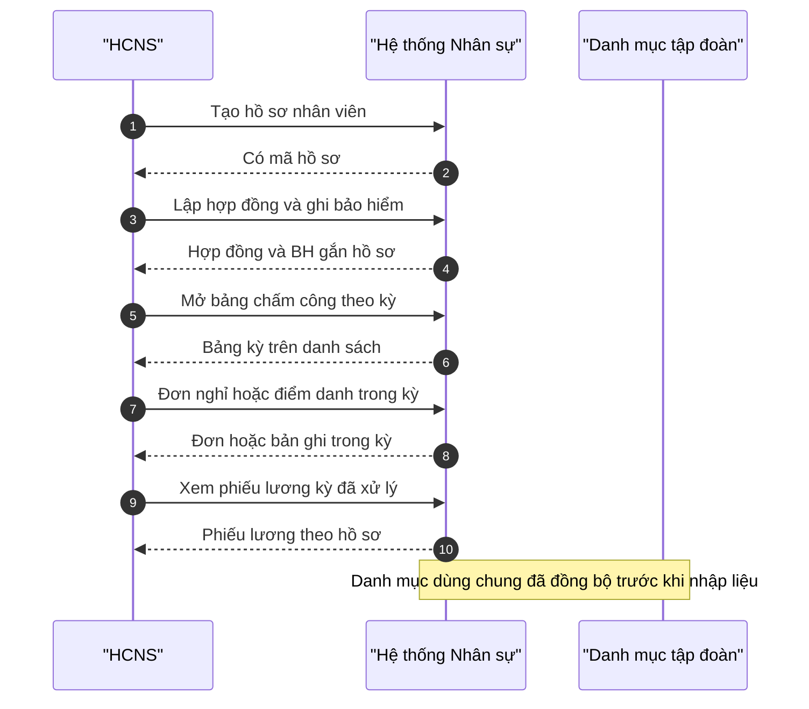
```mermaid
sequenceDiagram
  autonumber
  participant HR as "HCNS"
  participant SYS as "Hệ thống Nhân sự"
  participant CAT as "Danh mục tập đoàn"
  HR->>SYS: Tạo hồ sơ nhân viên
  SYS-->>HR: Có mã hồ sơ
  HR->>SYS: Lập hợp đồng và ghi bảo hiểm
  SYS-->>HR: Hợp đồng và BH gắn hồ sơ
  HR->>SYS: Mở bảng chấm công theo kỳ
  SYS-->>HR: Bảng kỳ trên danh sách
  HR->>SYS: Đơn nghỉ hoặc điểm danh trong kỳ
  SYS-->>HR: Đơn hoặc bản ghi trong kỳ
  HR->>SYS: Xem phiếu lương kỳ đã xử lý
  SYS-->>HR: Phiếu lương theo hồ sơ
  Note over CAT,SYS: Danh mục dùng chung đã đồng bộ trước khi nhập liệu
```

---

## 3. Yêu cầu chức năng

> Mỗi mục dưới đây là một **FR** (đủ 7 khối + Kết quả trả về). W1: §3.1–3.8. W2a: §3.9–3.20. W2b: §3.21–3.32. W2c: §3.33–3.44. W2d: §3.45–3.52. Catalog còn lại bổ sung ở đợt sau — **không** rút FR / AC đã khóa.

### 3.1 FR-HRM-EM-01 — Tạo hồ sơ nhân viên

| Thuộc tính | Mô tả |
|------------|--------|
| Actor | HCNS / người vận hành HR |
| Ưu tiên | Cao |
| Điều kiện tiên quyết | Đã đăng nhập; có quyền tạo hồ sơ trong đơn vị; danh mục phòng ban / chức danh đã có giá trị hiệu lực khi bắt buộc |
| Điều kiện hậu | Hồ sơ mới thuộc đơn vị đang làm việc; sẵn sàng gắn hợp đồng / BH / công |
| Mã UC | HRM-EM-01 |
| Liên hệ phần mềm hiện tại | Đã có — màn danh sách / form nhân viên |

**Dữ liệu đầu vào**

| Trường | Bắt buộc | Ràng buộc / kiểm tra |
|--------|----------|----------------------|
| Họ và tên | Có | Không rỗng sau chuẩn hoá |
| Mã nhân viên (nếu nhập tay) | Không | Không trùng trong cùng đơn vị khi đã dùng |
| Ngày vào làm | Có | Định dạng ngày/tháng/năm hợp lệ |
| Phòng ban / chức danh | Có (khi danh mục bắt buộc) | Phải thuộc danh mục hiệu lực của đơn vị |
| Số điện thoại / email | Theo cấu hình | Định dạng hợp lệ nếu có nhập |
| Trạng thái làm việc | Có | Theo danh mục (đang làm, thử việc…) |

**Luồng chính**

1. Người dùng mở danh sách nhân sự → chọn thêm hồ sơ.
2. Hệ thống mở biểu mẫu; nạp danh mục phòng ban / chức danh trong phạm vi.
3. Người dùng nhập thông tin bắt buộc → Lưu.
4. Hệ thống kiểm tra trùng mã / thiếu trường → ghi hồ sơ mới.
5. Giao diện hiện hồ sơ trên danh sách (hoặc chi tiết vừa tạo); người dùng mở lại / tải lại trang vẫn còn hồ sơ.

**Quy tắc nghiệp vụ**

- Quy tắc-1: Chỉ tạo trong đơn vị được cấp.
- Quy tắc-2: Phòng ban / chức danh lấy từ danh mục đã đồng bộ.
- Nếu thiếu trường bắt buộc → không lưu; thông báo rõ trường thiếu.
- Nếu trùng mã nhân viên trong đơn vị → từ chối; không ghi đè im lặng.

**Sơ đồ tương tác**

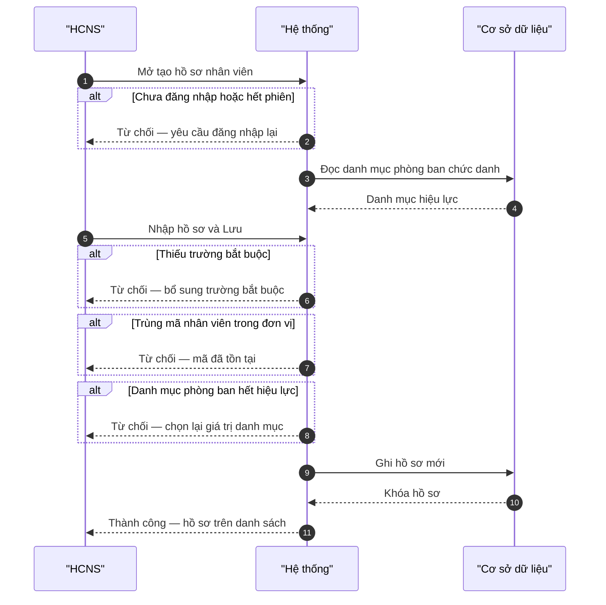
```mermaid
sequenceDiagram
  autonumber
  participant U as "HCNS"
  participant SYS as "Hệ thống"
  participant DB as "Cơ sở dữ liệu"
  U->>SYS: Mở tạo hồ sơ nhân viên
  alt Chưa đăng nhập hoặc hết phiên
    SYS-->>U: Từ chối — yêu cầu đăng nhập lại
  end
  SYS->>DB: Đọc danh mục phòng ban chức danh
  DB-->>SYS: Danh mục hiệu lực
  U->>SYS: Nhập hồ sơ và Lưu
  alt Thiếu trường bắt buộc
    SYS-->>U: Từ chối — bổ sung trường bắt buộc
  end
  alt Trùng mã nhân viên trong đơn vị
    SYS-->>U: Từ chối — mã đã tồn tại
  end
  alt Danh mục phòng ban hết hiệu lực
    SYS-->>U: Từ chối — chọn lại giá trị danh mục
  end
  SYS->>DB: Ghi hồ sơ mới
  DB-->>SYS: Khóa hồ sơ
  SYS-->>U: Thành công — hồ sơ trên danh sách
```

**Diễn biến nghiệp vụ**

| # | Tương tác | Điều kiện / quy tắc | Kết quả hoặc lỗi |
|---|-----------|---------------------|------------------|
| 1 | (Auth gom) | Hết phiên / ngoài phạm vi | Từ chối — đăng nhập hoặc không đủ quyền |
| 2 | Mở form tạo | Có quyền tạo hồ sơ | Form + danh mục |
| 3 | Chọn phòng ban / chức danh | Quy tắc-2 | Giá trị hợp lệ |
| 4 | Nhập thiếu bắt buộc | Thiếu họ tên / ngày vào… | Từ chối — nêu trường thiếu |
| 5 | Trùng mã NV | Mã đã dùng trong đơn vị | Từ chối — mã trùng |
| 6 | Danh mục hết hiệu lực | Giá trị không còn dùng | Từ chối — chọn lại |
| 7 | Lưu thành công | Đủ điều kiện | Hồ sơ mới trên danh sách |
| 8 | Tải lại trang | Cùng đơn vị | Hồ sơ vẫn còn |
| 9 | Thành công cuối | Đủ khóa nghiệp vụ | Xem Kết quả trả về |

**Kết quả trả về khi thành công**

| Ý | Nội dung |
|---|----------|
| Người dùng thấy | Thông báo lưu thành công; dòng hồ sơ mới (họ tên, mã) trên danh sách hoặc màn chi tiết |
| Bản ghi tạo / cập nhật | Hồ sơ nhân viên mới trong đơn vị |
| Khóa mang sang bước sau | Mã / định danh hồ sơ; đơn vị đang làm việc |
| Trạng thái sau | Đang hiệu lực theo trạng thái làm việc đã chọn |
| Việc được mở khóa tiếp | FR hợp đồng (HRM-CI-01), bảo hiểm (HRM-CI-02), chấm công / nghỉ |

---

### 3.2 FR-HRM-CI-01 — Tạo hợp đồng lao động

| Thuộc tính | Mô tả |
|------------|--------|
| Actor | HCNS |
| Ưu tiên | Cao |
| Điều kiện tiên quyết | Hồ sơ nhân viên đã tồn tại trong phạm vi; có quyền quản lý hợp đồng |
| Điều kiện hậu | Hợp đồng gắn đúng hồ sơ; sẵn sàng cảnh báo hết hạn / gắn BH |
| Mã UC | HRM-CI-01 |
| Liên hệ phần mềm hiện tại | Đã có — hợp đồng trên hồ sơ / menu hợp đồng |

**Dữ liệu đầu vào**

| Trường | Bắt buộc | Ràng buộc / kiểm tra |
|--------|----------|----------------------|
| Nhân viên (hồ sơ) | Có | Phải tồn tại trong đơn vị |
| Loại hợp đồng | Có | Theo danh mục |
| Ngày bắt đầu | Có | Ngày/tháng/năm hợp lệ |
| Ngày kết thúc | Theo loại | Nếu có: ≥ ngày bắt đầu |
| Mức lương căn cứ (nếu nhập) | Không | Số ≥ 0; hiển thị nhóm nghìn |

**Luồng chính**

1. Người dùng chọn hồ sơ hoặc mở mục hợp đồng → Thêm hợp đồng.
2. Hệ thống nạp danh sách nhân viên trong phạm vi và loại hợp đồng.
3. Người dùng nhập loại, thời hạn, thông tin kèm → Lưu.
4. Hệ thống kiểm tra hồ sơ / ngày → ghi hợp đồng.
5. Danh sách hợp đồng hiện dòng mới; mở lại vẫn còn.

**Quy tắc nghiệp vụ**

- Không tạo hợp đồng khi hồ sơ không thuộc phạm vi.
- Ngày kết thúc trước ngày bắt đầu → từ chối.
- Loại hợp đồng không thuộc danh mục → từ chối.
- Quy tắc cảnh báo hết hạn (Yêu cầu-15) áp dụng sau khi có ngày kết thúc.

**Sơ đồ tương tác**

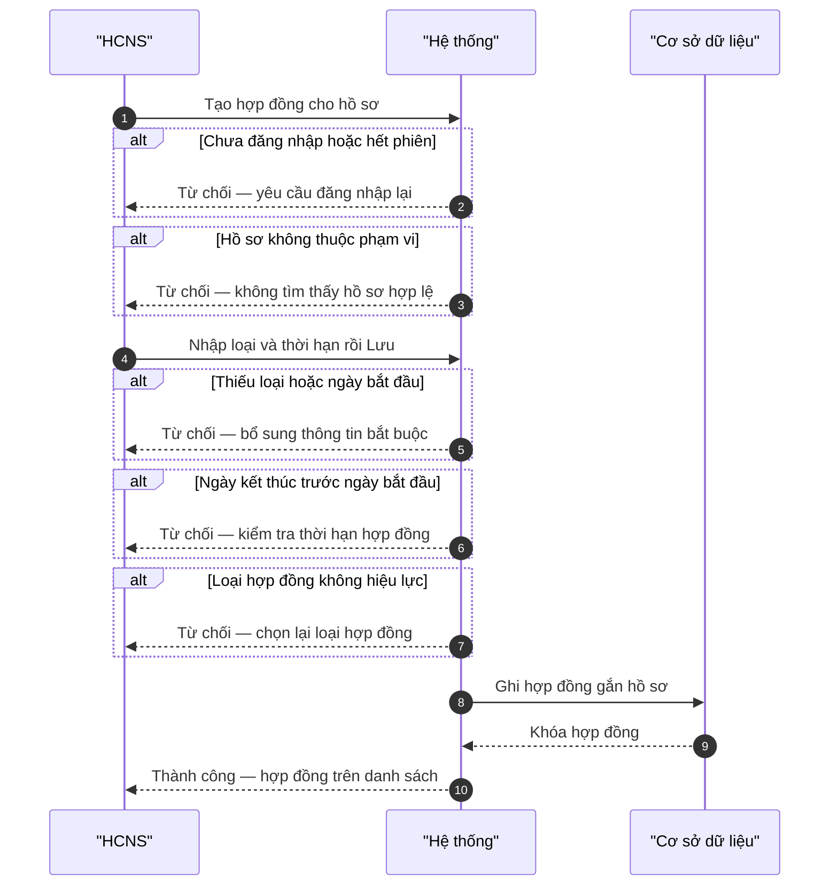
```mermaid
sequenceDiagram
  autonumber
  participant U as "HCNS"
  participant SYS as "Hệ thống"
  participant DB as "Cơ sở dữ liệu"
  U->>SYS: Tạo hợp đồng cho hồ sơ
  alt Chưa đăng nhập hoặc hết phiên
    SYS-->>U: Từ chối — yêu cầu đăng nhập lại
  end
  alt Hồ sơ không thuộc phạm vi
    SYS-->>U: Từ chối — không tìm thấy hồ sơ hợp lệ
  end
  U->>SYS: Nhập loại và thời hạn rồi Lưu
  alt Thiếu loại hoặc ngày bắt đầu
    SYS-->>U: Từ chối — bổ sung thông tin bắt buộc
  end
  alt Ngày kết thúc trước ngày bắt đầu
    SYS-->>U: Từ chối — kiểm tra thời hạn hợp đồng
  end
  alt Loại hợp đồng không hiệu lực
    SYS-->>U: Từ chối — chọn lại loại hợp đồng
  end
  SYS->>DB: Ghi hợp đồng gắn hồ sơ
  DB-->>SYS: Khóa hợp đồng
  SYS-->>U: Thành công — hợp đồng trên danh sách
```

**Diễn biến nghiệp vụ**

| # | Tương tác | Điều kiện / quy tắc | Kết quả hoặc lỗi |
|---|-----------|---------------------|------------------|
| 1 | (Auth gom) | Hết phiên / ngoài phạm vi | Từ chối |
| 2 | Chọn hồ sơ | Hồ sơ tồn tại trong đơn vị | Form hợp đồng |
| 3 | Hồ sơ ngoài phạm vi | Không thuộc đơn vị | Từ chối — không tìm thấy |
| 4 | Nhập thiếu loại / ngày | Bắt buộc | Từ chối — bổ sung |
| 5 | Thời hạn sai | Kết thúc trước bắt đầu | Từ chối — thời hạn |
| 6 | Loại HĐ hết hiệu lực | Danh mục | Từ chối — chọn lại |
| 7 | Lưu thành công | Đủ điều kiện | Dòng HĐ mới |
| 8 | Tải lại trang | Cùng đơn vị | HĐ còn |
| 9 | Thành công cuối | Khóa HĐ | Kết quả trả về |

**Kết quả trả về khi thành công**

| Ý | Nội dung |
|---|----------|
| Người dùng thấy | Thông báo thành công; dòng hợp đồng (loại, thời hạn) gắn nhân viên |
| Bản ghi tạo / cập nhật | Hợp đồng lao động mới |
| Khóa mang sang bước sau | Mã hợp đồng; mã hồ sơ; ngày hiệu lực |
| Trạng thái sau | Đang hiệu lực (hoặc theo trạng thái đã chọn) |
| Việc được mở khóa tiếp | Ghi nhận BH (HRM-CI-02); cảnh báo hết hạn; đối chiếu lương |

---

### 3.3 FR-HRM-CI-02 — Ghi nhận bảo hiểm nhân viên

| Thuộc tính | Mô tả |
|------------|--------|
| Actor | HCNS |
| Ưu tiên | Cao |
| Điều kiện tiên quyết | Hồ sơ tồn tại trong phạm vi; có quyền ghi BH |
| Điều kiện hậu | Bản ghi BH gắn hồ sơ; có thể cảnh báo hết hạn |
| Mã UC | HRM-CI-02 |
| Liên hệ phần mềm hiện tại | Đã có — tab / mục bảo hiểm |

**Dữ liệu đầu vào**

| Trường | Bắt buộc | Ràng buộc / kiểm tra |
|--------|----------|----------------------|
| Nhân viên | Có | Trong phạm vi đơn vị |
| Loại bảo hiểm | Có | Theo danh mục |
| Số sổ / mã BH | Theo loại | Không rỗng nếu bắt buộc |
| Ngày hiệu lực | Có | Ngày/tháng/năm hợp lệ |
| Ngày hết hạn | Không | Nếu có: ≥ ngày hiệu lực |
| Mức đóng (nếu nhập) | Không | Số ≥ 0 |

**Luồng chính**

1. Người dùng mở hồ sơ hoặc mục bảo hiểm → Thêm.
2. Chọn loại, thời hạn, số liệu → Lưu.
3. Hệ thống kiểm tra hồ sơ / ngày / trùng sổ (nếu cấm) → ghi nhận.
4. Danh sách BH hiện dòng mới; tải lại trang vẫn còn.

**Quy tắc nghiệp vụ**

- Không ghi BH cho hồ sơ ngoài phạm vi.
- Ngày hết hạn trước ngày hiệu lực → từ chối.
- Trùng số sổ cùng loại đang hiệu lực (nếu nghiệp vụ cấm) → từ chối.
- Empty danh sách BH khi chưa có bản ghi = trung thực, không lỗi hệ thống.

**Sơ đồ tương tác**

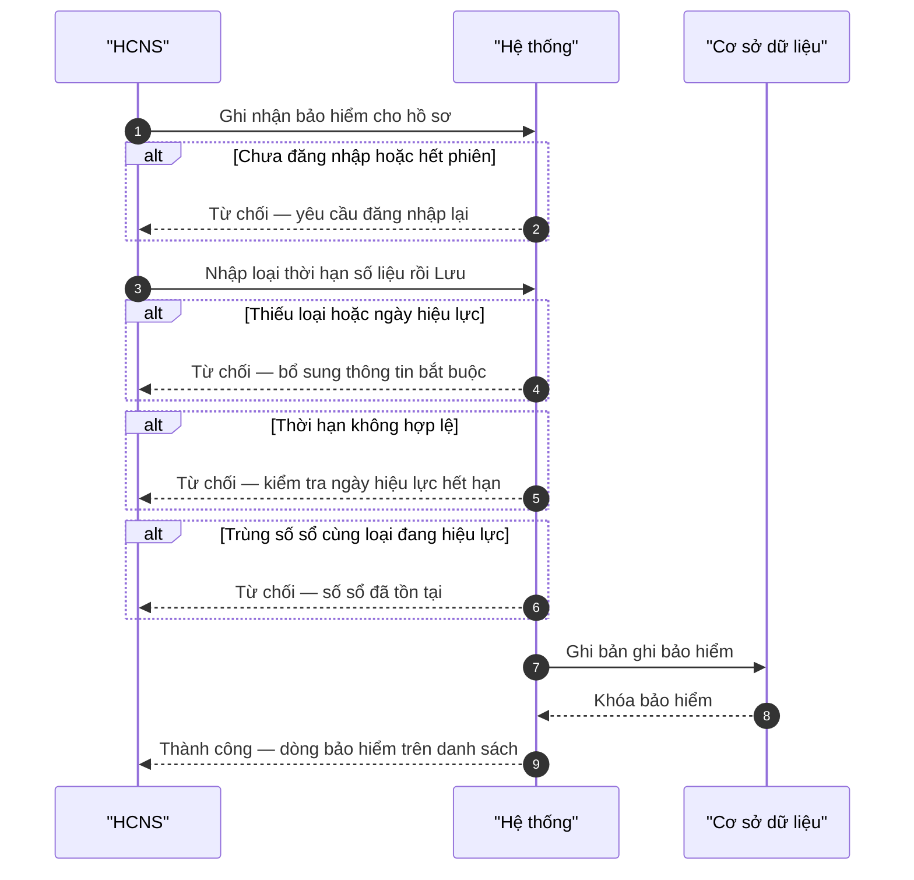
```mermaid
sequenceDiagram
  autonumber
  participant U as "HCNS"
  participant SYS as "Hệ thống"
  participant DB as "Cơ sở dữ liệu"
  U->>SYS: Ghi nhận bảo hiểm cho hồ sơ
  alt Chưa đăng nhập hoặc hết phiên
    SYS-->>U: Từ chối — yêu cầu đăng nhập lại
  end
  U->>SYS: Nhập loại thời hạn số liệu rồi Lưu
  alt Thiếu loại hoặc ngày hiệu lực
    SYS-->>U: Từ chối — bổ sung thông tin bắt buộc
  end
  alt Thời hạn không hợp lệ
    SYS-->>U: Từ chối — kiểm tra ngày hiệu lực hết hạn
  end
  alt Trùng số sổ cùng loại đang hiệu lực
    SYS-->>U: Từ chối — số sổ đã tồn tại
  end
  SYS->>DB: Ghi bản ghi bảo hiểm
  DB-->>SYS: Khóa bảo hiểm
  SYS-->>U: Thành công — dòng bảo hiểm trên danh sách
```

**Diễn biến nghiệp vụ**

| # | Tương tác | Điều kiện / quy tắc | Kết quả hoặc lỗi |
|---|-----------|---------------------|------------------|
| 1 | (Auth gom) | Hết phiên / ngoài phạm vi | Từ chối |
| 2 | Chọn hồ sơ | Trong đơn vị | Form BH |
| 3 | Thiếu loại / ngày | Bắt buộc | Từ chối — bổ sung |
| 4 | Thời hạn sai | Hết hạn trước hiệu lực | Từ chối — ngày |
| 5 | Trùng sổ (nếu cấm) | Cùng loại đang hiệu lực | Từ chối — trùng sổ |
| 6 | Lưu thành công | Đủ điều kiện | Dòng BH mới |
| 7 | Danh sách rỗng trước đó | Chưa có BH | Empty trung thực rồi có dòng sau lưu |
| 8 | Tải lại trang | Cùng đơn vị | BH còn |
| 9 | Thành công cuối | Khóa BH | Kết quả trả về |

**Kết quả trả về khi thành công**

| Ý | Nội dung |
|---|----------|
| Người dùng thấy | Thông báo thành công; dòng BH (loại, hiệu lực) trên hồ sơ / danh sách |
| Bản ghi tạo / cập nhật | Bản ghi bảo hiểm nhân viên |
| Khóa mang sang bước sau | Mã BH; mã hồ sơ; loại; thời hạn |
| Trạng thái sau | Đang hiệu lực (hoặc theo trạng thái đã chọn) |
| Việc được mở khóa tiếp | Cảnh báo hết hạn; đối chiếu hồ sơ / lương khi cần |

---

### 3.4 FR-HRM-AT-14 — Tạo và xem bảng chấm công theo kỳ

| Thuộc tính | Mô tả |
|------------|--------|
| Actor | HCNS / quản lý đơn vị |
| Ưu tiên | Cao |
| Điều kiện tiên quyết | Đã đăng nhập; phạm vi đơn vị hợp lệ |
| Điều kiện hậu | Có bảng chấm công trong phạm vi **hoặc** empty trung thực; lưới gắn đúng kỳ bảng đang chọn |
| Mã UC | HRM-AT-14 (liên kết UC-HRM-23 / UC-HRM-32 trên bề mặt vận hành) |
| Liên hệ phần mềm hiện tại | Đã có — mục Chấm công / Bảng chấm công |

**Dữ liệu đầu vào**

| Trường | Bắt buộc | Ràng buộc / kiểm tra |
|--------|----------|----------------------|
| Tên bảng | Có (hoặc hệ thống gợi ý theo kỳ) | Không rỗng sau chuẩn hoá |
| Ngày bắt đầu / kết thúc | Có | Ngày/tháng/năm; bắt đầu ≤ kết thúc |
| Loại chấm / chuẩn | Không | Theo danh mục vận hành |
| Đơn vị / chức danh lọc | Không | «Tất cả» = không lọc; giá trị trong phạm vi |

**Luồng chính**

1. Người dùng mở Chấm công → danh sách **Bảng chấm công**.
2. Hệ thống tải danh sách bảng theo đơn vị **một lần ổn định** (không tải lặp vô hạn khi giao diện làm mới nhỏ).
3. Người dùng tạo bảng → nhập kỳ / tên / lọc → Lưu.
4. Hệ thống ghi bảng; danh sách cập nhật ngay; mở bảng → lưới tuần hoặc empty trung thực trong kỳ.
5. Người dùng tải lại trang / mở lại menu → bảng vừa tạo vẫn còn.

**Quy tắc nghiệp vụ**

- **Quy tắc-4 / BR-ATT-SHEET-01:** Tạo thành công → thấy dòng bảng trên danh sách **trước** khi tải lại trang.
- **BR-ATT-SHEET-02:** Không storm tải danh sách bảng chỉ vì làm mới giao diện nhỏ.
- **Quy tắc-5 / BR-ATT-SHEET-03:** `chưa có bảng` hoặc lưới chưa có điểm danh = empty trung thực, không báo lỗi hệ thống, không dữ liệu giả.
- **Quy tắc-6 / BR-ATT-SHEET-04:** Kỳ sai hoặc trùng bị cấm → từ chối lưu.
- **Quy tắc-7 / BR-ATT-SHEET-05:** Lưới chỉ trong kỳ và phạm vi đơn vị của bảng.
- **BR-ATT-SHEET-06:** Tạo header bảng **không** bắt buộc sinh sẵn mọi bản ghi ngày; lưới trống khi chưa điểm danh là hợp lệ.
- **BR-ATT-SHEET-07:** Sau khi giao diện ổn định ngắn, không tải lại cùng danh sách / lưới quá dày gây giật hoặc từ chối tốc độ.

**Tiêu chí chấp nhận đã khóa (giữ nguyên — không rút gọn)**

| Mã AC | Đạt khi | Không đạt khi |
|-------|---------|---------------|
| AC-ATT-SHEET-01 | Sau Lưu thành công, danh sách hiện dòng bảng đúng kỳ đã nhập **không cần** tải lại trang | Lưu im lặng; danh sách không đổi; phải dùng dữ liệu giả để «có bảng» |
| AC-ATT-SHEET-02 | Mở bảng: lưới có dữ liệu **hoặc** empty ổn định có lý do; không xoay tải vô hạn | Trắng / giật tải lại; empty kèm báo lỗi giả khi hệ thống đã trả kết quả rỗng hợp lệ |
| AC-ATT-SHEET-03 | Chưa có bảng: empty «Chưa có bảng…»; không banner lỗi hệ thống | Che lỗi thật bằng empty; hoặc empty khi thao tác thất bại |
| AC-ATT-SHEET-04 | Sau ổn định ngắn trên danh sách: không tự tải lặp liên tục cùng danh sách | Tải liên tục / giao diện tự reload không dừng |
| AC-ATT-SHEET-05 | Tải lại trang sau tạo: bảng còn; mở lại đúng kỳ | Bảng biến mất; trạng thái về trống sai |
| AC-ATT-SHEET-06 | Mở lưới tuần: tải bản ghi kỳ kết thúc; empty hoặc dữ liệu ổn định | Xoay tải không dừng; storm tải bản ghi |

**Sơ đồ tương tác**

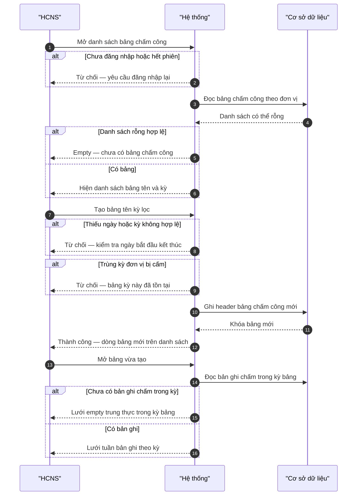
```mermaid
sequenceDiagram
  autonumber
  participant U as "HCNS"
  participant SYS as "Hệ thống"
  participant DB as "Cơ sở dữ liệu"
  U->>SYS: Mở danh sách bảng chấm công
  alt Chưa đăng nhập hoặc hết phiên
    SYS-->>U: Từ chối — yêu cầu đăng nhập lại
  end
  SYS->>DB: Đọc bảng chấm công theo đơn vị
  DB-->>SYS: Danh sách có thể rỗng
  alt Danh sách rỗng hợp lệ
    SYS-->>U: Empty — chưa có bảng chấm công
  else Có bảng
    SYS-->>U: Hiện danh sách bảng tên và kỳ
  end
  U->>SYS: Tạo bảng tên kỳ lọc
  alt Thiếu ngày hoặc kỳ không hợp lệ
    SYS-->>U: Từ chối — kiểm tra ngày bắt đầu kết thúc
  end
  alt Trùng kỳ đơn vị bị cấm
    SYS-->>U: Từ chối — bảng kỳ này đã tồn tại
  end
  SYS->>DB: Ghi header bảng chấm công mới
  DB-->>SYS: Khóa bảng mới
  SYS-->>U: Thành công — dòng bảng mới trên danh sách
  U->>SYS: Mở bảng vừa tạo
  SYS->>DB: Đọc bản ghi chấm trong kỳ bảng
  alt Chưa có bản ghi chấm trong kỳ
    SYS-->>U: Lưới empty trung thực trong kỳ bảng
  else Có bản ghi
    SYS-->>U: Lưới tuần bản ghi theo kỳ
  end
```

**Diễn biến nghiệp vụ**

| # | Tương tác | Điều kiện / quy tắc | Kết quả hoặc lỗi |
|---|-----------|---------------------|------------------|
| 1 | Mở danh sách bảng | Phiên hợp lệ; đúng đơn vị | Danh sách hoặc empty |
| 2 | (Auth gom) | Hết phiên / ngoài phạm vi | Từ chối |
| 3 | Tải danh sách | BR-ATT-SHEET-02 | Một lần ổn định; không storm |
| 4 | Empty danh sách | Chưa có bảng, thành công | Empty trung thực |
| 5 | Nhập tạo bảng | Đủ tên + kỳ | Form sẵn sàng Lưu |
| 6 | Lưu — kỳ sai | BR-ATT-SHEET-04 | Từ chối — ngày/kỳ |
| 7 | Lưu — trùng kỳ (nếu cấm) | BR-ATT-SHEET-04 | Từ chối — đã tồn tại |
| 8 | Lưu thành công | BR-ATT-SHEET-01 | Dòng bảng mới ngay |
| 9 | Mở bảng → lưới | BR-ATT-SHEET-05 | Lưới theo kỳ/đơn vị |
| 10 | Lưới chưa điểm danh | BR-ATT-SHEET-06 | Empty lưới trung thực |
| 11 | Tải lại trang sau tạo | AC-ATT-SHEET-05 | Bảng vẫn còn |
| 12 | Thành công cuối | Đủ khóa | Kết quả trả về |

**Kết quả trả về khi thành công**

| Ý | Nội dung |
|---|----------|
| Người dùng thấy | Thông báo tạo thành công; dòng bảng mới (tên, từ–đến) trên danh sách; khi mở — lưới hoặc empty trung thực trong kỳ |
| Bản ghi tạo / cập nhật | Header bảng chấm công (kỳ, lọc đơn vị, loại); không tự bịa bản ghi ngày nếu chưa điểm danh |
| Khóa mang sang bước sau | Định danh bảng; ngày bắt đầu–kết thúc; đơn vị đang làm việc |
| Trạng thái sau | Bảng đang mở vận hành; sẵn sàng xem lưới / ghi điểm danh trong kỳ |
| Việc được mở khóa tiếp | Ghi/xem bản ghi chấm; đơn nghỉ trong kỳ; đối soát lương theo bảng công |

---

### 3.5 FR-HRM-AT-10 — Tạo đơn nghỉ phép

| Thuộc tính | Mô tả |
|------------|--------|
| Actor | Người lao động hoặc HCNS hộ |
| Ưu tiên | Cao |
| Điều kiện tiên quyết | Hồ sơ tồn tại; loại nghỉ trong danh mục; còn quyền gửi đơn |
| Điều kiện hậu | Đơn ở trạng thái chờ duyệt (hoặc tương đương); người duyệt nhận thông báo khi cấu hình bật |
| Mã UC | HRM-AT-10 |
| Liên hệ phần mềm hiện tại | Đã có — đơn nghỉ phép |

**Dữ liệu đầu vào**

| Trường | Bắt buộc | Ràng buộc / kiểm tra |
|--------|----------|----------------------|
| Nhân viên | Có | Trong phạm vi; đúng người được tạo hộ |
| Loại nghỉ | Có | Danh mục hiệu lực — chọn bằng ô lọc có tìm kiếm (AC-HRM-PICKER-01; FR-HRM-SC-LEAVE-01) |
| Từ ngày / đến ngày | Có | Bắt đầu ≤ kết thúc |
| Lý do | Theo cấu hình | Độ dài tối thiểu nếu bắt buộc |
| Đính kèm | Không | Định dạng / dung lượng theo quy định |

**Luồng chính**

1. Người dùng mở Nghỉ phép → Tạo đơn.
2. Chọn loại (ô lọc có tìm kiếm), khoảng ngày, lý do (± đính kèm) → Gửi.
3. Hệ thống kiểm tra chồng ngày / số ngày phép / danh mục → ghi đơn chờ duyệt.
4. Khi cấu hình quy trình duyệt tập trung bật: hệ thống mở việc duyệt tương ứng (FR-HRM-AT-WF-01 trên tài liệu bổ sung); thiếu cấu hình → báo lỗi hoặc escalate rõ.
5. Người gửi thấy đơn trên danh sách; người có quyền duyệt nhận thông báo / việc duyệt (khi bật).

**Quy tắc nghiệp vụ**

- Quy tắc-8: Sau tạo thành công → thông báo người liên quan.
- Khoảng ngày không hợp lệ → từ chối.
- Chồng đơn nghỉ đã duyệt / chờ duyệt cùng ngày (nếu cấm) → từ chối.
- Hết phép theo loại (nếu hệ thống theo dõi số dư) → từ chối kèm số dư.
- Loại nghỉ hết hiệu lực → từ chối.
- **W2e ADD:** Loại nghỉ ∈ catalog Cài đặt (FR-HRM-SC-LEAVE-01); cấm lưu loại ngoài danh mục.
- **W2e ADD:** Chuỗi duyệt cuối khớp FR-HRM-AT-WF-01 — không «ảo» duyệt khi bước quy trình thất bại.

**Sơ đồ tương tác**

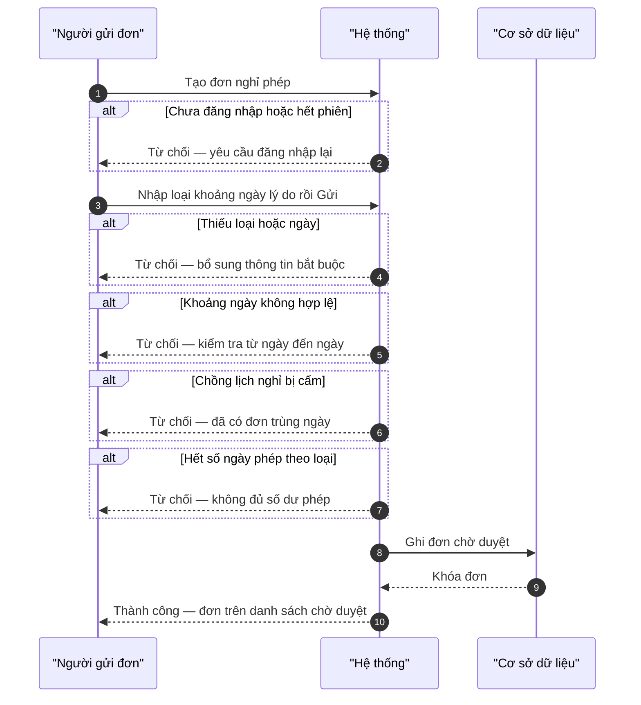
```mermaid
sequenceDiagram
  autonumber
  participant U as "Người gửi đơn"
  participant SYS as "Hệ thống"
  participant DB as "Cơ sở dữ liệu"
  U->>SYS: Tạo đơn nghỉ phép
  alt Chưa đăng nhập hoặc hết phiên
    SYS-->>U: Từ chối — yêu cầu đăng nhập lại
  end
  U->>SYS: Nhập loại khoảng ngày lý do rồi Gửi
  alt Thiếu loại hoặc ngày
    SYS-->>U: Từ chối — bổ sung thông tin bắt buộc
  end
  alt Khoảng ngày không hợp lệ
    SYS-->>U: Từ chối — kiểm tra từ ngày đến ngày
  end
  alt Chồng lịch nghỉ bị cấm
    SYS-->>U: Từ chối — đã có đơn trùng ngày
  end
  alt Hết số ngày phép theo loại
    SYS-->>U: Từ chối — không đủ số dư phép
  end
  SYS->>DB: Ghi đơn chờ duyệt
  DB-->>SYS: Khóa đơn
  SYS-->>U: Thành công — đơn trên danh sách chờ duyệt
```

**Diễn biến nghiệp vụ**

| # | Tương tác | Điều kiện / quy tắc | Kết quả hoặc lỗi |
|---|-----------|---------------------|------------------|
| 1 | (Auth gom) | Hết phiên / ngoài phạm vi | Từ chối |
| 2 | Mở form tạo đơn | Có quyền gửi | Form + loại nghỉ |
| 3 | Thiếu loại / ngày | Bắt buộc | Từ chối — bổ sung |
| 4 | Ngày sai thứ tự | Đến ngày trước từ ngày | Từ chối — khoảng ngày |
| 5 | Chồng lịch | Đơn trùng ngày bị cấm | Từ chối — trùng |
| 6 | Hết phép | Số dư không đủ | Từ chối — số dư |
| 7 | Gửi thành công | Đủ điều kiện | Đơn chờ duyệt trên danh sách |
| 8 | Mở việc duyệt (khi bật QT) | FR-HRM-AT-WF-01 | Việc trên hộp hoặc lỗi cấu hình rõ |
| 9 | Thông báo duyệt | Quy tắc-8 | Người duyệt nhận tin (nếu bật) |
| 10 | Thành công cuối | Khóa đơn | Kết quả trả về |

**Kết quả trả về khi thành công**

| Ý | Nội dung |
|---|----------|
| Người dùng thấy | Thông báo gửi thành công; dòng đơn (loại, từ–đến, chờ duyệt) |
| Bản ghi tạo / cập nhật | Đơn nghỉ phép mới |
| Khóa mang sang bước sau | Mã đơn; mã hồ sơ; khoảng ngày; loại nghỉ |
| Trạng thái sau | Chờ duyệt |
| Việc được mở khóa tiếp | Phê duyệt / từ chối đơn; phản ánh trên lưới công kỳ |

---

### 3.6 FR-HRM-PR-05 — Xem phiếu lương

| Thuộc tính | Mô tả |
|------------|--------|
| Actor | HCNS / quản lý (theo quyền); người lao động xem phiếu của mình khi được phép |
| Ưu tiên | Cao |
| Điều kiện tiên quyết | Kỳ lương đã được xử lý ở mức cho phép xem phiếu; phạm vi đơn vị hợp lệ |
| Điều kiện hậu | Người dùng xem được phiếu đúng người / đúng kỳ trong phạm vi |
| Mã UC | HRM-PR-05 |
| Liên hệ phần mềm hiện tại | Đã có — phiếu lương / lương embed |

**Dữ liệu đầu vào**

| Trường | Bắt buộc | Ràng buộc / kiểm tra |
|--------|----------|----------------------|
| Kỳ lương | Có | Kỳ đã tồn tại / đã xử lý tùy quyền xem |
| Nhân viên (lọc) | Không | Trong phạm vi; người lao động chỉ thấy mình |
| Đơn vị lọc | Không | Trong phạm vi được cấp |

**Luồng chính**

1. Người dùng mở Lương → Phiếu lương.
2. Chọn kỳ (± lọc nhân viên) → Xem.
3. Hệ thống trả danh sách / chi tiết phiếu trong phạm vi.
4. Nếu kỳ chưa có phiếu: empty trung thực; không số giả.

**Quy tắc nghiệp vụ**

- Quy tắc-9: Không bịa số lương.
- Ngoài phạm vi đơn vị / không phải phiếu của mình (khi vai trò tự xem) → từ chối hoặc không hiện.
- Kỳ chưa xử lý / không có phiếu → empty hoặc thông báo «chưa có phiếu», không lỗi hệ thống giả.
- Số tiền hiển thị nhóm nghìn.

**Sơ đồ tương tác**

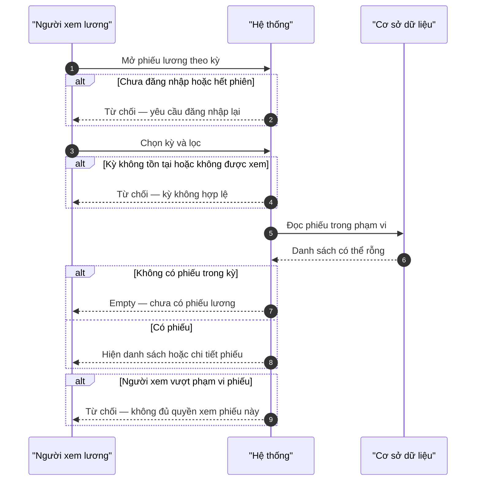
```mermaid
sequenceDiagram
  autonumber
  participant U as "Người xem lương"
  participant SYS as "Hệ thống"
  participant DB as "Cơ sở dữ liệu"
  U->>SYS: Mở phiếu lương theo kỳ
  alt Chưa đăng nhập hoặc hết phiên
    SYS-->>U: Từ chối — yêu cầu đăng nhập lại
  end
  U->>SYS: Chọn kỳ và lọc
  alt Kỳ không tồn tại hoặc không được xem
    SYS-->>U: Từ chối — kỳ không hợp lệ
  end
  SYS->>DB: Đọc phiếu trong phạm vi
  DB-->>SYS: Danh sách có thể rỗng
  alt Không có phiếu trong kỳ
    SYS-->>U: Empty — chưa có phiếu lương
  else Có phiếu
    SYS-->>U: Hiện danh sách hoặc chi tiết phiếu
  end
  alt Người xem vượt phạm vi phiếu
    SYS-->>U: Từ chối — không đủ quyền xem phiếu này
  end
```

**Diễn biến nghiệp vụ**

| # | Tương tác | Điều kiện / quy tắc | Kết quả hoặc lỗi |
|---|-----------|---------------------|------------------|
| 1 | (Auth gom) | Hết phiên / ngoài phạm vi | Từ chối |
| 2 | Chọn kỳ lương | Kỳ hợp lệ | Sẵn sàng xem |
| 3 | Kỳ không xem được | Chưa xử lý / không tồn tại | Từ chối hoặc empty có lý do |
| 4 | Tải phiếu | Trong phạm vi | Danh sách / chi tiết |
| 5 | Empty hợp lệ | Chưa có phiếu | Empty trung thực |
| 6 | Vượt phạm vi phiếu | Xem hộ trái phép | Từ chối — quyền |
| 7 | Xem chi tiết một phiếu | Có quyền | Số liệu kỳ; nhóm nghìn |
| 8 | Thành công cuối | Đã xem đúng phiếu | Kết quả trả về |

**Kết quả trả về khi thành công**

| Ý | Nội dung |
|---|----------|
| Người dùng thấy | Danh sách hoặc chi tiết phiếu (nhân viên, kỳ, thành phần lương hiển thị theo quyền) |
| Bản ghi tạo / cập nhật | Không bắt buộc tạo mới — đọc phiếu đã có |
| Khóa mang sang bước sau | Mã kỳ; mã hồ sơ / mã phiếu |
| Trạng thái sau | Đã mở xem; dữ liệu khớp kỳ đã chọn |
| Việc được mở khóa tiếp | Đối soát / báo cáo lương (batch sau); khiếu nại nội bộ ngoài hệ thống |

---

### 3.7 FR-HRM-RC-01 — Tạo yêu cầu tuyển dụng

| Thuộc tính | Mô tả |
|------------|--------|
| Actor | HCNS / quản lý có quyền đề xuất |
| Ưu tiên | Cao |
| Điều kiện tiên quyết | Đơn vị hợp lệ; danh mục vị trí / phòng ban khi bắt buộc |
| Điều kiện hậu | Yêu cầu tuyển dụng có mã; trạng thái khởi tạo (nháp hoặc chờ duyệt theo cấu hình) |
| Mã UC | HRM-RC-01 |
| Liên hệ phần mềm hiện tại | Đã có — yêu cầu tuyển dụng |

**Dữ liệu đầu vào**

| Trường | Bắt buộc | Ràng buộc / kiểm tra |
|--------|----------|----------------------|
| Tiêu đề / vị trí | Có | Không rỗng |
| Phòng ban | Có (khi bắt buộc) | Danh mục hiệu lực |
| Số lượng cần tuyển | Có | Số nguyên lớn hơn 0 |
| Ngày cần có mặt | Không | ≥ hôm nay nếu cấu hình ràng |
| Mô tả công việc | Theo cấu hình | Độ dài tối thiểu nếu bắt buộc |

**Luồng chính**

1. Người dùng mở Tuyển dụng → Yêu cầu → Thêm.
2. Nhập vị trí, số lượng, thông tin kèm → Lưu / Gửi.
3. Hệ thống kiểm tra → ghi yêu cầu.
4. Danh sách hiện dòng mới; tải lại trang vẫn còn.

**Quy tắc nghiệp vụ**

- Số lượng ≤ 0 → từ chối.
- Phòng ban / vị trí hết hiệu lực → từ chối.
- Ngoài phạm vi đơn vị → từ chối.
- Trùng yêu cầu cùng vị trí đang mở (nếu cấm) → từ chối hoặc cảnh báo theo cấu hình.

**Sơ đồ tương tác**

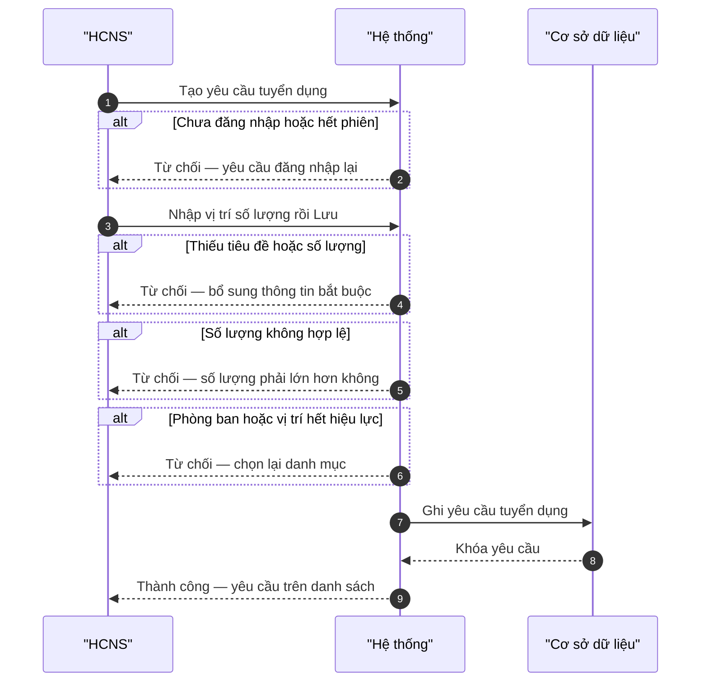
```mermaid
sequenceDiagram
  autonumber
  participant U as "HCNS"
  participant SYS as "Hệ thống"
  participant DB as "Cơ sở dữ liệu"
  U->>SYS: Tạo yêu cầu tuyển dụng
  alt Chưa đăng nhập hoặc hết phiên
    SYS-->>U: Từ chối — yêu cầu đăng nhập lại
  end
  U->>SYS: Nhập vị trí số lượng rồi Lưu
  alt Thiếu tiêu đề hoặc số lượng
    SYS-->>U: Từ chối — bổ sung thông tin bắt buộc
  end
  alt Số lượng không hợp lệ
    SYS-->>U: Từ chối — số lượng phải lớn hơn không
  end
  alt Phòng ban hoặc vị trí hết hiệu lực
    SYS-->>U: Từ chối — chọn lại danh mục
  end
  SYS->>DB: Ghi yêu cầu tuyển dụng
  DB-->>SYS: Khóa yêu cầu
  SYS-->>U: Thành công — yêu cầu trên danh sách
```

**Diễn biến nghiệp vụ**

| # | Tương tác | Điều kiện / quy tắc | Kết quả hoặc lỗi |
|---|-----------|---------------------|------------------|
| 1 | (Auth gom) | Hết phiên / ngoài phạm vi | Từ chối |
| 2 | Mở form | Có quyền tạo | Form + danh mục |
| 3 | Thiếu tiêu đề / SL | Bắt buộc | Từ chối — bổ sung |
| 4 | Số lượng ≤ 0 | Ràng buộc | Từ chối — số lượng |
| 5 | Danh mục hết hiệu lực | Phòng ban / vị trí | Từ chối — chọn lại |
| 6 | Lưu thành công | Đủ điều kiện | Dòng yêu cầu mới |
| 7 | Tải lại trang | Cùng đơn vị | Yêu cầu còn |
| 8 | Thành công cuối | Khóa YCTD | Kết quả trả về |

**Kết quả trả về khi thành công**

| Ý | Nội dung |
|---|----------|
| Người dùng thấy | Thông báo thành công; dòng yêu cầu (vị trí, số lượng, trạng thái) |
| Bản ghi tạo / cập nhật | Yêu cầu tuyển dụng mới |
| Khóa mang sang bước sau | Mã yêu cầu; đơn vị; vị trí |
| Trạng thái sau | Nháp hoặc chờ duyệt (theo cấu hình) |
| Việc được mở khóa tiếp | Ứng viên / lịch phỏng vấn (batch sau); gắn quy trình duyệt khi có |

---

### 3.8 FR-HRM-SC-01 — Xem tổng quan danh mục cấu hình Nhân sự

| Thuộc tính | Mô tả |
|------------|--------|
| Actor | HCNS / quản trị cấu hình |
| Ưu tiên | Cao |
| Điều kiện tiên quyết | Đã đăng nhập; có quyền xem cấu hình danh mục |
| Điều kiện hậu | Người dùng nắm được nhóm danh mục và trạng thái đồng bộ / hiệu lực để dùng khi nhập liệu |
| Mã UC | HRM-SC-01 |
| Liên hệ phần mềm hiện tại | Đã có — Cài đặt / danh mục HRM |

**Dữ liệu đầu vào**

| Trường | Bắt buộc | Ràng buộc / kiểm tra |
|--------|----------|----------------------|
| Đơn vị đang làm việc | Có (ngầm từ phiên) | Trong phạm vi |
| Nhóm danh mục (lọc) | Không | Theo nhóm hệ thống cung cấp |

**Luồng chính**

1. Người dùng mở Cài đặt / Danh mục Nhân sự.
2. Hệ thống hiện tổng quan nhóm danh mục (phòng ban, chức danh, loại nghỉ…).
3. Người dùng chọn nhóm → xem giá trị hiệu lực / cần đồng bộ.
4. Nếu chưa đồng bộ: empty hoặc trạng thái «chưa có dữ liệu đồng bộ» trung thực — hướng dẫn đồng bộ (UC đồng bộ liên quan), không dữ liệu giả.

**Quy tắc nghiệp vụ**

- Quy tắc-2: Nguồn chuẩn là bản điều hành tập đoàn đã đồng bộ.
- Không cho sửa master tập đoàn tại đây nếu chính sách cấm (chỉ xem / yêu cầu mở rộng theo UC khác).
- Empty khi chưa kéo danh mục = trung thực.
- Ngoài phạm vi → không hiện danh mục đơn vị khác.
- **W2e ADD:** Các nhóm chức danh / phòng ban, mẫu tin tuyển dụng, loại nghỉ, loại quyết định, thành phần lương có CRUD (hoặc đồng bộ + mở rộng đơn vị) theo FR-HRM-SC-POS-01 · SC-JT-01 · SC-LEAVE-01 · SC-DEC-01 · SC-PAY-01 trên tài liệu bổ sung Cài đặt danh mục.
- **W2e ADD:** Mọi ô chọn danh mục trên form hồ sơ / đơn từ / tuyển dụng / quyết định / phiếu lương tuân quy tắc BR-HRM-MD-01 và AC-HRM-PICKER-01 (ô lọc có tìm kiếm; cấm lưu chuỗi ngoài danh mục làm nguồn sự thật).

**Sơ đồ tương tác**

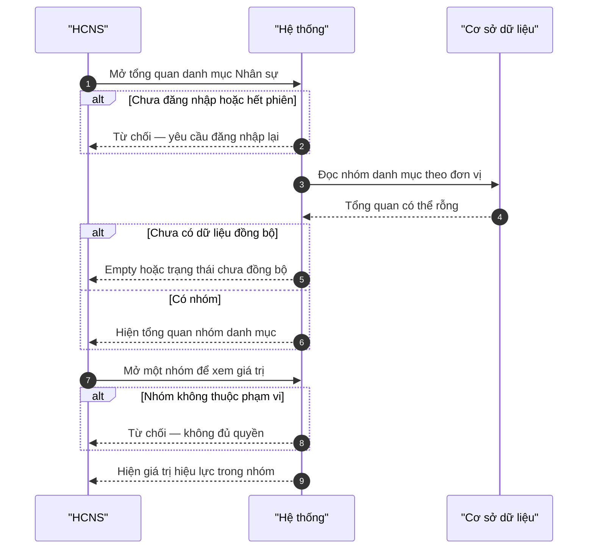
```mermaid
sequenceDiagram
  autonumber
  participant U as "HCNS"
  participant SYS as "Hệ thống"
  participant DB as "Cơ sở dữ liệu"
  U->>SYS: Mở tổng quan danh mục Nhân sự
  alt Chưa đăng nhập hoặc hết phiên
    SYS-->>U: Từ chối — yêu cầu đăng nhập lại
  end
  SYS->>DB: Đọc nhóm danh mục theo đơn vị
  DB-->>SYS: Tổng quan có thể rỗng
  alt Chưa có dữ liệu đồng bộ
    SYS-->>U: Empty hoặc trạng thái chưa đồng bộ
  else Có nhóm
    SYS-->>U: Hiện tổng quan nhóm danh mục
  end
  U->>SYS: Mở một nhóm để xem giá trị
  alt Nhóm không thuộc phạm vi
    SYS-->>U: Từ chối — không đủ quyền
  end
  SYS-->>U: Hiện giá trị hiệu lực trong nhóm
```

**Diễn biến nghiệp vụ**

| # | Tương tác | Điều kiện / quy tắc | Kết quả hoặc lỗi |
|---|-----------|---------------------|------------------|
| 1 | (Auth gom) | Hết phiên / ngoài phạm vi | Từ chối |
| 2 | Mở tổng quan | Có quyền xem | Màn tổng quan |
| 3 | Chưa đồng bộ | Chưa có bản danh mục | Empty / trạng thái chưa đồng bộ |
| 4 | Có nhóm danh mục | Đã đồng bộ | Danh sách nhóm |
| 5 | Mở một nhóm | Trong phạm vi | Giá trị hiệu lực |
| 6 | Ngoài phạm vi nhóm | Sai đơn vị | Từ chối — quyền |
| 7 | Thành công cuối | Đã nắm trạng thái danh mục | Kết quả trả về |

**Kết quả trả về khi thành công**

| Ý | Nội dung |
|---|----------|
| Người dùng thấy | Tổng quan nhóm danh mục và/hoặc giá trị hiệu lực; hoặc empty «chưa đồng bộ» rõ ràng |
| Bản ghi tạo / cập nhật | Không bắt buộc — đọc cấu hình |
| Khóa mang sang bước sau | Tên nhóm danh mục; đơn vị; trạng thái đồng bộ |
| Trạng thái sau | Đã xem; sẵn sàng dùng giá trị khi nhập hồ sơ / đơn từ |
| Việc được mở khóa tiếp | Đồng bộ danh mục (UC-HRM-06 / HRM-SC-02); CRUD nhóm W2e (FR-HRM-SC-POS/JT/LEAVE/DEC/PAY trên tài liệu bổ sung); tạo hồ sơ / đơn dùng dropdown đúng |

---

### 3.9 FR-HRM-AT-01 — Ghi nhận bản ghi chấm công

| Thuộc tính | Mô tả |
|------------|--------|
| Actor | HCNS / người vận hành HR; thiết bị / kênh điểm danh khi được cấu hình |
| Ưu tiên | Cao |
| Điều kiện tiên quyết | Hồ sơ nhân viên tồn tại trong đơn vị; ngày thuộc kỳ đang mở hoặc được phép ghi ngoài kỳ theo quy định; có quyền ghi công |
| Điều kiện hậu | Bản ghi chấm gắn hồ sơ và ngày; sẵn sàng xem danh sách / đối soát bảng công |
| Mã UC | HRM-AT-01 |
| Liên hệ phần mềm hiện tại | Đã có — bản ghi chấm công |

**Dữ liệu đầu vào**

| Trường | Bắt buộc | Ràng buộc / kiểm tra |
|--------|----------|----------------------|
| Nhân viên | Có | Trong phạm vi đơn vị; hồ sơ đang hiệu lực |
| Ngày công | Có | Định dạng ngày/tháng/năm; không ngày vô lý |
| Giờ vào / giờ ra | Theo cấu hình | Ra ≥ vào khi cả hai có giá trị |
| Loại ngày / ca | Theo cấu hình | Thuộc danh mục hiệu lực |
| Ghi chú | Không | Độ dài tối đa theo quy định |

**Luồng chính**

1. Người dùng mở Chấm công → Bản ghi → Thêm / ghi nhận.
2. Chọn nhân viên, ngày, giờ (± loại ca) → Lưu.
3. Hệ thống kiểm phạm vi, hồ sơ, trùng ngày (nếu cấm) → ghi bản ghi.
4. Giao diện hiện bản ghi trên danh sách / lưới ngày; tải lại trang vẫn còn.

**Quy tắc nghiệp vụ**

- Chỉ ghi trong đơn vị được cấp.
- Hồ sơ nghỉ việc / lưu trữ → từ chối ghi mới (trừ khi cấu hình cho phép hiệu chỉnh lịch sử có kiểm soát).
- Trùng bản ghi cùng nhân viên–ngày khi cấm → từ chối; không ghi đè im lặng.
- Ngày ngoài kỳ bảng đang mở → từ chối hoặc yêu cầu mở bảng kỳ phù hợp (theo cấu hình).

**Sơ đồ tương tác**

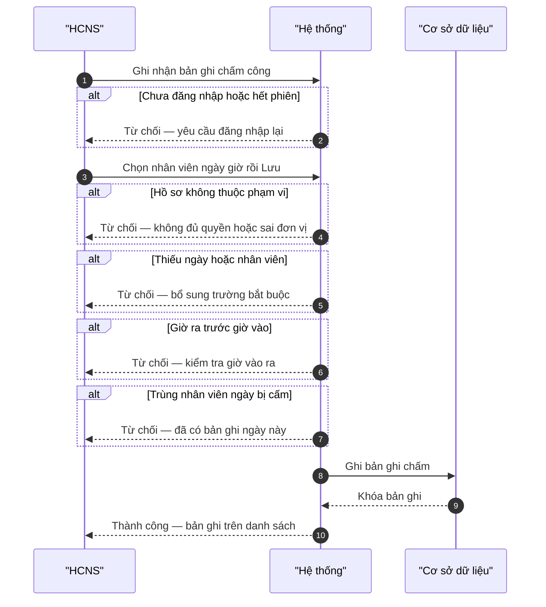
```mermaid
sequenceDiagram
  autonumber
  participant U as "HCNS"
  participant SYS as "Hệ thống"
  participant DB as "Cơ sở dữ liệu"
  U->>SYS: Ghi nhận bản ghi chấm công
  alt Chưa đăng nhập hoặc hết phiên
    SYS-->>U: Từ chối — yêu cầu đăng nhập lại
  end
  U->>SYS: Chọn nhân viên ngày giờ rồi Lưu
  alt Hồ sơ không thuộc phạm vi
    SYS-->>U: Từ chối — không đủ quyền hoặc sai đơn vị
  end
  alt Thiếu ngày hoặc nhân viên
    SYS-->>U: Từ chối — bổ sung trường bắt buộc
  end
  alt Giờ ra trước giờ vào
    SYS-->>U: Từ chối — kiểm tra giờ vào ra
  end
  alt Trùng nhân viên ngày bị cấm
    SYS-->>U: Từ chối — đã có bản ghi ngày này
  end
  SYS->>DB: Ghi bản ghi chấm
  DB-->>SYS: Khóa bản ghi
  SYS-->>U: Thành công — bản ghi trên danh sách
```

**Diễn biến nghiệp vụ**

| # | Tương tác | Điều kiện / quy tắc | Kết quả hoặc lỗi |
|---|-----------|---------------------|------------------|
| 1 | (Auth gom) | Hết phiên / ngoài phạm vi | Từ chối |
| 2 | Mở form ghi công | Có quyền ghi | Form + danh sách NV trong phạm vi |
| 3 | Thiếu nhân viên / ngày | Bắt buộc | Từ chối — bổ sung |
| 4 | Giờ không hợp lệ | Ra trước vào | Từ chối — giờ |
| 5 | Hồ sơ ngoài phạm vi / nghỉ việc | Không được ghi | Từ chối — hồ sơ |
| 6 | Trùng ngày bị cấm | Đã có bản ghi | Từ chối — trùng |
| 7 | Lưu thành công | Đủ điều kiện | Bản ghi trên danh sách |
| 8 | Tải lại trang | Cùng đơn vị | Bản ghi vẫn còn |
| 9 | Thành công cuối | Đủ khóa | Kết quả trả về |

**Kết quả trả về khi thành công**

| Ý | Nội dung |
|---|----------|
| Người dùng thấy | Thông báo lưu thành công; dòng bản ghi (nhân viên, ngày, giờ) |
| Bản ghi tạo / cập nhật | Bản ghi chấm công mới |
| Khóa mang sang bước sau | Mã bản ghi; mã hồ sơ; ngày công |
| Trạng thái sau | Đã ghi nhận (trạng thái mặc định theo cấu hình) |
| Việc được mở khóa tiếp | Xem danh sách bản ghi; cập nhật trạng thái; đơn chỉnh sửa nếu sai |

---

### 3.10 FR-HRM-AT-02 — Xem danh sách bản ghi chấm công

| Thuộc tính | Mô tả |
|------------|--------|
| Actor | HCNS / quản lý (theo quyền) |
| Ưu tiên | Cao |
| Điều kiện tiên quyết | Đã đăng nhập; có quyền xem công trong đơn vị |
| Điều kiện hậu | Người dùng thấy danh sách đúng phạm vi; empty trung thực nếu chưa có bản ghi |
| Mã UC | HRM-AT-02 |
| Liên hệ phần mềm hiện tại | Đã có — danh sách bản ghi chấm |

**Dữ liệu đầu vào**

| Trường | Bắt buộc | Ràng buộc / kiểm tra |
|--------|----------|----------------------|
| Từ ngày / đến ngày | Không | Bắt đầu ≤ kết thúc nếu cả hai có |
| Nhân viên / phòng ban | Không | Trong phạm vi |
| Trạng thái bản ghi | Không | Theo danh mục trạng thái |

**Luồng chính**

1. Người dùng mở Chấm công → Bản ghi.
2. Chọn lọc kỳ / nhân viên → Tải danh sách.
3. Hệ thống trả các bản ghi trong phạm vi; không có thì empty rõ ràng.
4. Người dùng mở một dòng (nếu có) để xem chi tiết.

**Quy tắc nghiệp vụ**

- Không bịa bản ghi khi rỗng.
- Ngoài phạm vi đơn vị → không hiện hoặc từ chối.
- Khoảng ngày sai thứ tự → từ chối lọc hoặc thông báo sửa khoảng.

**Sơ đồ tương tác**

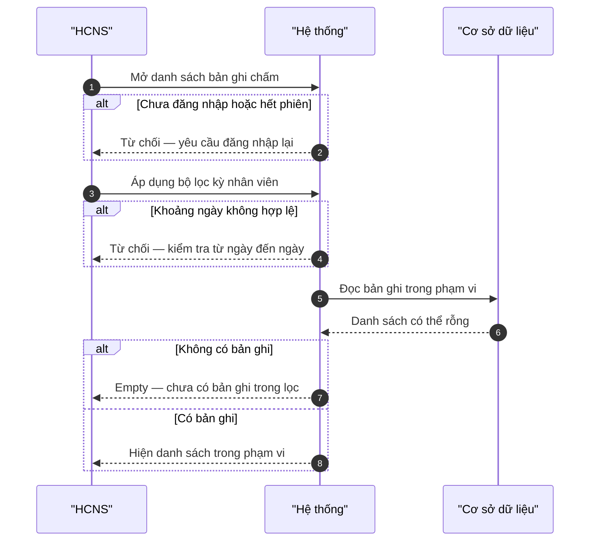
```mermaid
sequenceDiagram
  autonumber
  participant U as "HCNS"
  participant SYS as "Hệ thống"
  participant DB as "Cơ sở dữ liệu"
  U->>SYS: Mở danh sách bản ghi chấm
  alt Chưa đăng nhập hoặc hết phiên
    SYS-->>U: Từ chối — yêu cầu đăng nhập lại
  end
  U->>SYS: Áp dụng bộ lọc kỳ nhân viên
  alt Khoảng ngày không hợp lệ
    SYS-->>U: Từ chối — kiểm tra từ ngày đến ngày
  end
  SYS->>DB: Đọc bản ghi trong phạm vi
  DB-->>SYS: Danh sách có thể rỗng
  alt Không có bản ghi
    SYS-->>U: Empty — chưa có bản ghi trong lọc
  else Có bản ghi
    SYS-->>U: Hiện danh sách trong phạm vi
  end
```

**Diễn biến nghiệp vụ**

| # | Tương tác | Điều kiện / quy tắc | Kết quả hoặc lỗi |
|---|-----------|---------------------|------------------|
| 1 | (Auth gom) | Hết phiên / ngoài phạm vi | Từ chối |
| 2 | Mở danh sách | Có quyền xem | Màn danh sách |
| 3 | Lọc khoảng ngày sai | Đến trước từ | Từ chối — khoảng ngày |
| 4 | Tải danh sách | Trong phạm vi | Các dòng đúng đơn vị |
| 5 | Empty hợp lệ | Chưa có bản ghi | Empty trung thực |
| 6 | Mở chi tiết một dòng | Có quyền | Chi tiết bản ghi |
| 7 | Vượt phạm vi | Xem đơn vị khác | Từ chối hoặc không hiện |
| 8 | Thành công cuối | Đã xem đúng phạm vi | Kết quả trả về |

**Kết quả trả về khi thành công**

| Ý | Nội dung |
|---|----------|
| Người dùng thấy | Bảng danh sách (hoặc empty) khớp bộ lọc |
| Bản ghi tạo / cập nhật | Không — chỉ đọc |
| Khóa mang sang bước sau | Mã bản ghi khi chọn dòng; khoảng lọc đang dùng |
| Trạng thái sau | Đã tải danh sách |
| Việc được mở khóa tiếp | Ghi mới; cập nhật trạng thái; tạo đơn chỉnh sửa từ bản ghi sai |

---

### 3.11 FR-HRM-AT-03 — Cập nhật trạng thái bản ghi chấm công

| Thuộc tính | Mô tả |
|------------|--------|
| Actor | HCNS / quản lý có quyền duyệt công |
| Ưu tiên | Cao |
| Điều kiện tiên quyết | Bản ghi tồn tại trong phạm vi; trạng thái đích thuộc danh mục cho phép |
| Điều kiện hậu | Bản ghi mang trạng thái mới; lịch sử đủ để truy vết |
| Mã UC | HRM-AT-03 |
| Liên hệ phần mềm hiện tại | Đã có — cập nhật trạng thái bản ghi chấm |

**Dữ liệu đầu vào**

| Trường | Bắt buộc | Ràng buộc / kiểm tra |
|--------|----------|----------------------|
| Bản ghi chấm | Có | Tồn tại; trong phạm vi |
| Trạng thái mới | Có | Thuộc danh mục; chuyển hợp lệ từ trạng thái hiện tại |
| Lý do đổi | Theo cấu hình | Bắt buộc khi từ chối / hủy |

**Luồng chính**

1. Người dùng mở chi tiết bản ghi → chọn cập nhật trạng thái.
2. Chọn trạng thái mới (± lý do) → Lưu.
3. Hệ thống kiểm chuyển trạng thái hợp lệ → ghi.
4. Giao diện hiện trạng thái mới; danh sách phản ánh sau tải lại.

**Quy tắc nghiệp vụ**

- Không nhảy trạng thái bị cấm (ví dụ đã khóa kỳ → không mở lại bằng thao tác thường).
- Bản ghi ngoài phạm vi → từ chối.
- Thiếu lý do khi bắt buộc → từ chối.
- Kỳ lương / bảng công đã chốt phụ thuộc bản ghi → từ chối hoặc chỉ cho phép quy trình hiệu chỉnh riêng.

**Sơ đồ tương tác**

```mermaid
sequenceDiagram
  autonumber
  participant U as "HCNS"
  participant SYS as "Hệ thống"
  participant DB as "Cơ sở dữ liệu"
  U->>SYS: Cập nhật trạng thái bản ghi chấm
  alt Chưa đăng nhập hoặc hết phiên
    SYS-->>U: Từ chối — yêu cầu đăng nhập lại
  end
  U->>SYS: Chọn trạng thái mới rồi Lưu
  alt Bản ghi không tồn tại hoặc ngoài phạm vi
    SYS-->>U: Từ chối — không tìm thấy hoặc không đủ quyền
  end
  alt Chuyển trạng thái bị cấm
    SYS-->>U: Từ chối — không được chuyển trạng thái này
  end
  alt Thiếu lý do khi bắt buộc
    SYS-->>U: Từ chối — nhập lý do
  end
  alt Kỳ đã chốt khóa bản ghi
    SYS-->>U: Từ chối — kỳ đã khóa; dùng quy trình hiệu chỉnh
  end
  SYS->>DB: Ghi trạng thái mới
  DB-->>SYS: Đã cập nhật
  SYS-->>U: Thành công — trạng thái mới trên màn hình
```

**Diễn biến nghiệp vụ**

| # | Tương tác | Điều kiện / quy tắc | Kết quả hoặc lỗi |
|---|-----------|---------------------|------------------|
| 1 | (Auth gom) | Hết phiên / ngoài phạm vi | Từ chối |
| 2 | Mở bản ghi | Có quyền | Chi tiết + trạng thái hiện tại |
| 3 | Bản ghi không còn | Đã xóa / sai khóa | Từ chối — không tìm thấy |
| 4 | Chuyển trạng thái cấm | Quy tắc chuyển | Từ chối — trạng thái |
| 5 | Thiếu lý do | Cấu hình bắt buộc | Từ chối — lý do |
| 6 | Kỳ đã chốt | Khóa vận hành | Từ chối — kỳ khóa |
| 7 | Lưu thành công | Chuyển hợp lệ | Trạng thái mới hiển thị |
| 8 | Tải lại | Cùng phạm vi | Trạng thái vẫn đúng |
| 9 | Thành công cuối | Đã cập nhật | Kết quả trả về |

**Kết quả trả về khi thành công**

| Ý | Nội dung |
|---|----------|
| Người dùng thấy | Trạng thái mới trên chi tiết / danh sách |
| Bản ghi tạo / cập nhật | Bản ghi chấm — trường trạng thái (± lý do) |
| Khóa mang sang bước sau | Mã bản ghi; trạng thái sau đổi |
| Trạng thái sau | Đúng giá trị vừa chọn |
| Việc được mở khóa tiếp | Đối soát bảng công; đơn chỉnh sửa nếu cần sửa giờ |

---

### 3.12 FR-HRM-09 — Vòng đời đơn chỉnh sửa chấm công

| Thuộc tính | Mô tả |
|------------|--------|
| Actor | Người lao động (tạo đơn của mình); quản lý / HCNS (duyệt hoặc từ chối) |
| Ưu tiên | Cao |
| Điều kiện tiên quyết | Có bản ghi hoặc ngày công cần hiệu chỉnh; người gửi có quyền tạo đơn; người duyệt có quyền quyết định |
| Điều kiện hậu | Đơn ở trạng thái chờ duyệt sau tạo; sau duyệt/từ chối — trạng thái cuối + thông báo người liên quan (khi bật) |
| Mã UC | UC-HRM-09 |
| Liên hệ phần mềm hiện tại | Đã có — đơn chỉnh sửa chấm công + hộp thư |

**Dữ liệu đầu vào**

| Trường | Bắt buộc | Ràng buộc / kiểm tra |
|--------|----------|----------------------|
| Nhân viên / bản ghi gốc | Có | Trong phạm vi; đúng người được tạo hộ |
| Ngày công cần sửa | Có | Ngày hợp lệ |
| Giá trị đề xuất (giờ / loại) | Có | Khác giá trị hiện tại khi bắt buộc; giờ hợp lệ |
| Lý do đề xuất | Có | Không rỗng |
| Quyết định duyệt | Khi duyệt/từ chối | Duyệt hoặc từ chối; lý do từ chối khi bắt buộc |

**Luồng chính**

1. Người gửi mở Đơn chỉnh sửa chấm → Tạo → nhập ngày, giá trị đề xuất, lý do → Gửi.
2. Hệ thống ghi đơn chờ duyệt; thông báo người duyệt (khi bật).
3. Người duyệt mở đơn → Duyệt hoặc Từ chối (± lý do).
4. Nếu duyệt: hệ thống cập nhật bản ghi chấm theo đề xuất (hoặc tạo bản ghi nếu cấu hình cho phép); thông báo người gửi.
5. Nếu từ chối: giữ bản ghi gốc; đơn ở trạng thái từ chối; thông báo người gửi.

**Quy tắc nghiệp vụ**

- Sau tạo / duyệt / từ chối thành công → phát tín hiệu hộp thư cho người liên quan (khi cấu hình bật).
- Không duyệt đơn đã kết thúc hoặc ngoài phạm vi.
- Kỳ đã chốt phụ thuộc ngày công → từ chối duyệt thường; yêu cầu mở khóa kỳ hoặc quy trình riêng.
- Người lao động chỉ tạo / xem đơn của mình trừ khi được ủy quyền tạo hộ.

**Sơ đồ tương tác**

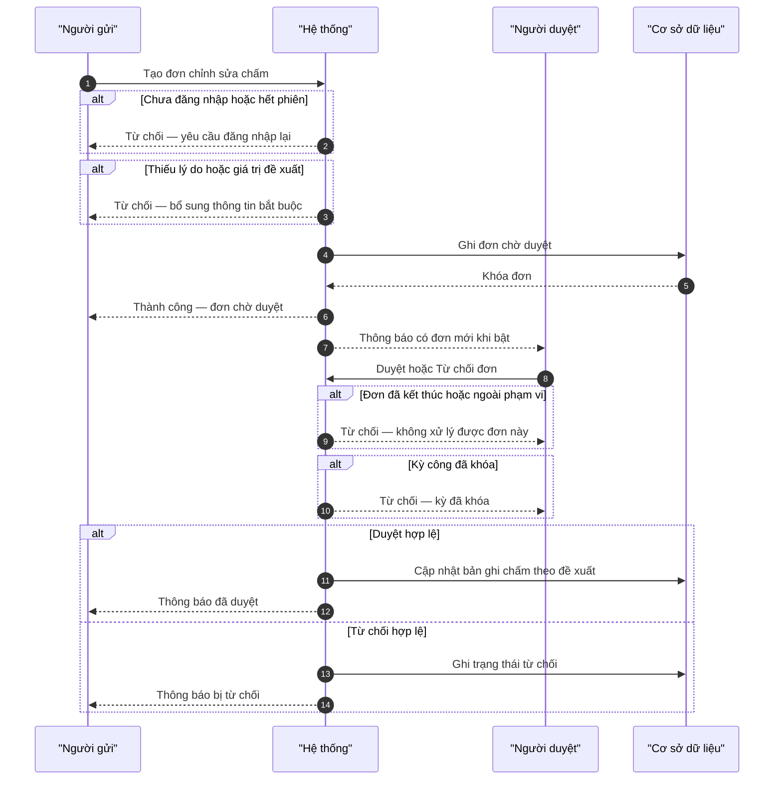
```mermaid
sequenceDiagram
  autonumber
  participant NV as "Người gửi"
  participant SYS as "Hệ thống"
  participant QL as "Người duyệt"
  participant DB as "Cơ sở dữ liệu"
  NV->>SYS: Tạo đơn chỉnh sửa chấm
  alt Chưa đăng nhập hoặc hết phiên
    SYS-->>NV: Từ chối — yêu cầu đăng nhập lại
  end
  alt Thiếu lý do hoặc giá trị đề xuất
    SYS-->>NV: Từ chối — bổ sung thông tin bắt buộc
  end
  SYS->>DB: Ghi đơn chờ duyệt
  DB-->>SYS: Khóa đơn
  SYS-->>NV: Thành công — đơn chờ duyệt
  SYS-->>QL: Thông báo có đơn mới khi bật
  QL->>SYS: Duyệt hoặc Từ chối đơn
  alt Đơn đã kết thúc hoặc ngoài phạm vi
    SYS-->>QL: Từ chối — không xử lý được đơn này
  end
  alt Kỳ công đã khóa
    SYS-->>QL: Từ chối — kỳ đã khóa
  end
  alt Duyệt hợp lệ
    SYS->>DB: Cập nhật bản ghi chấm theo đề xuất
    SYS-->>NV: Thông báo đã duyệt
  else Từ chối hợp lệ
    SYS->>DB: Ghi trạng thái từ chối
    SYS-->>NV: Thông báo bị từ chối
  end
```

**Diễn biến nghiệp vụ**

| # | Tương tác | Điều kiện / quy tắc | Kết quả hoặc lỗi |
|---|-----------|---------------------|------------------|
| 1 | (Auth gom) | Hết phiên / ngoài phạm vi | Từ chối |
| 2 | Tạo đơn | Có quyền gửi | Form tạo |
| 3 | Thiếu lý do / đề xuất | Bắt buộc | Từ chối — bổ sung |
| 4 | Gửi thành công | Đủ điều kiện | Đơn chờ duyệt + thông báo duyệt |
| 5 | Duyệt khi đơn đã xong | Trạng thái cuối | Từ chối — không xử lý |
| 6 | Duyệt khi kỳ khóa | Kỳ đã chốt | Từ chối — kỳ khóa |
| 7 | Duyệt thành công | Hợp lệ | Bản ghi chấm cập nhật; thông báo gửi |
| 8 | Từ chối thành công | Có lý do nếu bắt buộc | Đơn từ chối; bản ghi gốc giữ |
| 9 | Thành công cuối | Khóa đơn + trạng thái | Kết quả trả về |

**Kết quả trả về khi thành công**

| Ý | Nội dung |
|---|----------|
| Người dùng thấy | Sau tạo: đơn chờ duyệt trên danh sách; sau quyết định: trạng thái duyệt/từ chối + thông báo (nếu bật) |
| Bản ghi tạo / cập nhật | Đơn chỉnh sửa; khi duyệt — bản ghi chấm theo đề xuất |
| Khóa mang sang bước sau | Mã đơn; mã hồ sơ; ngày công |
| Trạng thái sau | Chờ duyệt → Đã duyệt hoặc Từ chối |
| Việc được mở khóa tiếp | Xem lại danh sách bản ghi; đối soát bảng công kỳ |

---

### 3.13 FR-HRM-AT-12 — Phê duyệt đơn nghỉ phép

| Thuộc tính | Mô tả |
|------------|--------|
| Actor | Quản lý / HCNS có quyền duyệt nghỉ |
| Ưu tiên | Cao |
| Điều kiện tiên quyết | Đơn nghỉ ở trạng thái chờ duyệt; người duyệt trong phạm vi và đúng cấp |
| Điều kiện hậu | Đơn ở trạng thái đã duyệt; phản ánh trên lưới công / số dư (khi theo dõi); thông báo người gửi (khi bật) |
| Mã UC | HRM-AT-12 |
| Liên hệ phần mềm hiện tại | Đã có — phê duyệt đơn nghỉ |

**Dữ liệu đầu vào**

| Trường | Bắt buộc | Ràng buộc / kiểm tra |
|--------|----------|----------------------|
| Mã đơn nghỉ | Có | Tồn tại; chờ duyệt; trong phạm vi |
| Ghi chú duyệt | Không | Độ dài tối đa |

**Luồng chính**

1. Người duyệt mở danh sách đơn nghỉ → chọn đơn chờ duyệt.
2. Xem loại, khoảng ngày, số dư (nếu có) → Phê duyệt.
3. Hệ thống kiểm trạng thái / phạm vi / chồng lịch → cập nhật đã duyệt.
4. Người gửi nhận thông báo (khi bật); danh sách / lưới công phản ánh.

**Quy tắc nghiệp vụ**

- Chỉ duyệt đơn chờ duyệt trong phạm vi.
- Đơn đã duyệt / từ chối / hủy → từ chối thao tác lặp.
- Sau duyệt → thông báo người gửi (khi bật).
- Chồng lịch với đơn đã duyệt khác (nếu phát hiện muộn) → từ chối duyệt.

**Sơ đồ tương tác**

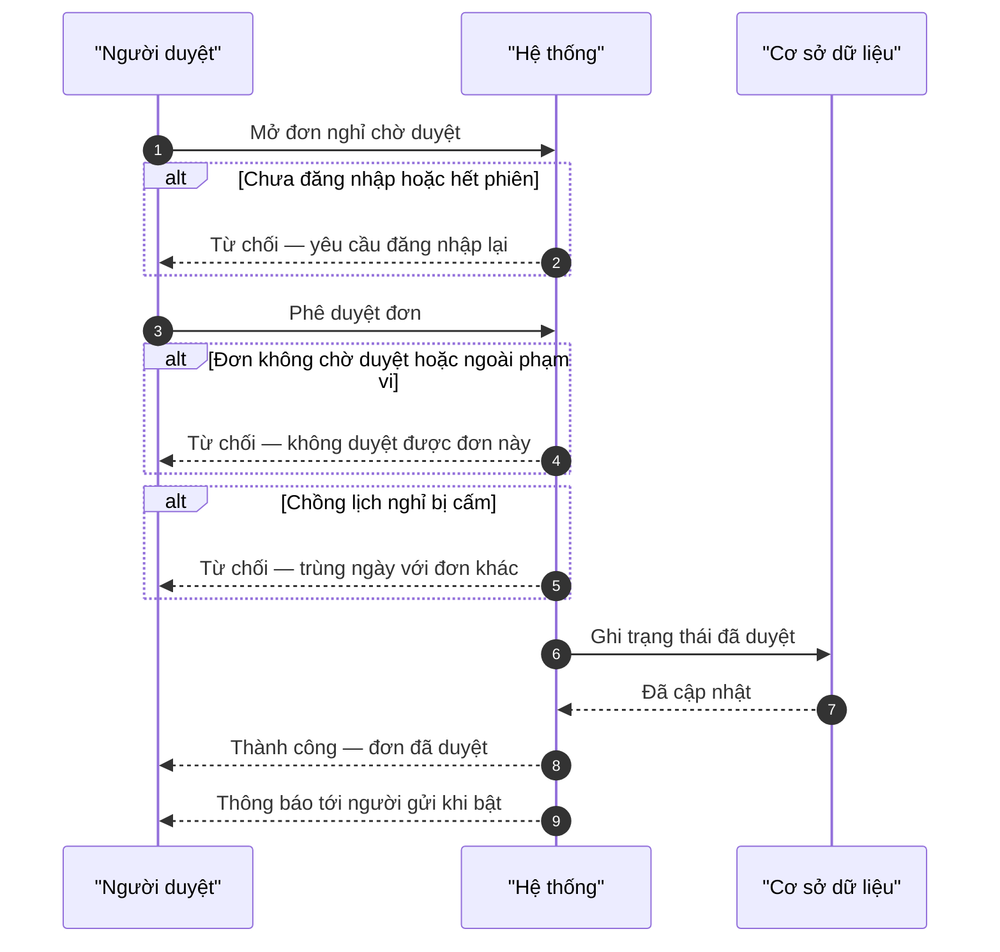
```mermaid
sequenceDiagram
  autonumber
  participant QL as "Người duyệt"
  participant SYS as "Hệ thống"
  participant DB as "Cơ sở dữ liệu"
  QL->>SYS: Mở đơn nghỉ chờ duyệt
  alt Chưa đăng nhập hoặc hết phiên
    SYS-->>QL: Từ chối — yêu cầu đăng nhập lại
  end
  QL->>SYS: Phê duyệt đơn
  alt Đơn không chờ duyệt hoặc ngoài phạm vi
    SYS-->>QL: Từ chối — không duyệt được đơn này
  end
  alt Chồng lịch nghỉ bị cấm
    SYS-->>QL: Từ chối — trùng ngày với đơn khác
  end
  SYS->>DB: Ghi trạng thái đã duyệt
  DB-->>SYS: Đã cập nhật
  SYS-->>QL: Thành công — đơn đã duyệt
  SYS-->>QL: Thông báo tới người gửi khi bật
```

**Diễn biến nghiệp vụ**

| # | Tương tác | Điều kiện / quy tắc | Kết quả hoặc lỗi |
|---|-----------|---------------------|------------------|
| 1 | (Auth gom) | Hết phiên / ngoài phạm vi | Từ chối |
| 2 | Mở đơn chờ duyệt | Có quyền duyệt | Chi tiết đơn |
| 3 | Đơn không còn chờ | Đã xử lý | Từ chối — trạng thái |
| 4 | Ngoài phạm vi đơn | Sai đơn vị / cấp | Từ chối — quyền |
| 5 | Chồng lịch | Đơn trùng ngày | Từ chối — trùng |
| 6 | Duyệt thành công | Hợp lệ | Đã duyệt trên danh sách |
| 7 | Thông báo gửi | Cấu hình bật | Người gửi nhận tin |
| 8 | Phản ánh công / phép | Theo cấu hình | Lưới hoặc số dư cập nhật |
| 9 | Thành công cuối | Khóa quyết định | Kết quả trả về |

**Kết quả trả về khi thành công**

| Ý | Nội dung |
|---|----------|
| Người dùng thấy | Đơn chuyển «đã duyệt»; thông báo gửi (nếu bật) |
| Bản ghi tạo / cập nhật | Đơn nghỉ — trạng thái đã duyệt |
| Khóa mang sang bước sau | Mã đơn; khoảng ngày; mã hồ sơ |
| Trạng thái sau | Đã duyệt |
| Việc được mở khóa tiếp | Xem lưới công kỳ; đối soát lương theo ngày nghỉ |

---

### 3.14 FR-HRM-AT-13 — Từ chối đơn nghỉ phép

| Thuộc tính | Mô tả |
|------------|--------|
| Actor | Quản lý / HCNS có quyền duyệt nghỉ |
| Ưu tiên | Cao |
| Điều kiện tiên quyết | Đơn nghỉ ở trạng thái chờ duyệt; người xử lý đúng phạm vi |
| Điều kiện hậu | Đơn ở trạng thái từ chối; số dư phép không trừ (nếu chỉ trừ khi duyệt); thông báo người gửi (khi bật) |
| Mã UC | HRM-AT-13 |
| Liên hệ phần mềm hiện tại | Đã có — từ chối đơn nghỉ |

**Dữ liệu đầu vào**

| Trường | Bắt buộc | Ràng buộc / kiểm tra |
|--------|----------|----------------------|
| Mã đơn nghỉ | Có | Tồn tại; chờ duyệt; trong phạm vi |
| Lý do từ chối | Có | Không rỗng khi cấu hình bắt buộc |

**Luồng chính**

1. Người duyệt mở đơn chờ duyệt → chọn Từ chối.
2. Nhập lý do → Xác nhận.
3. Hệ thống cập nhật từ chối; không ghi nhận ngày nghỉ trên lưới như đã duyệt.
4. Người gửi thấy trạng thái từ chối + thông báo (khi bật).

**Quy tắc nghiệp vụ**

- Không từ chối đơn đã kết thúc.
- Lý do từ chối bắt buộc theo cấu hình.
- Sau từ chối → thông báo người gửi (khi bật).
- Không trừ số dư phép khi từ chối (trừ khi chính sách đã trừ tạm lúc gửi — khi đó hoàn số dư).

**Sơ đồ tương tác**

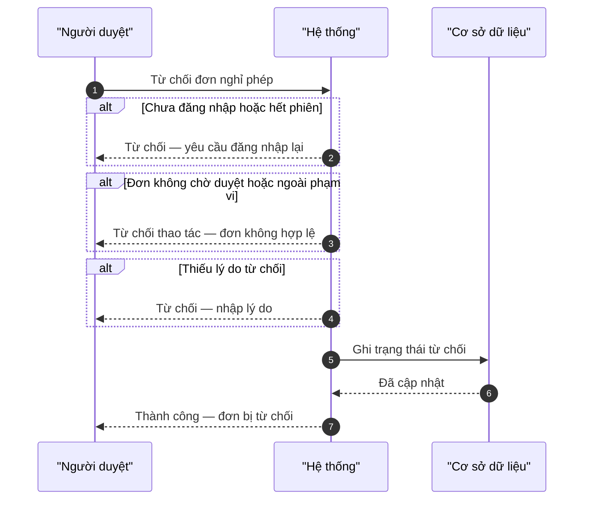
```mermaid
sequenceDiagram
  autonumber
  participant QL as "Người duyệt"
  participant SYS as "Hệ thống"
  participant DB as "Cơ sở dữ liệu"
  QL->>SYS: Từ chối đơn nghỉ phép
  alt Chưa đăng nhập hoặc hết phiên
    SYS-->>QL: Từ chối — yêu cầu đăng nhập lại
  end
  alt Đơn không chờ duyệt hoặc ngoài phạm vi
    SYS-->>QL: Từ chối thao tác — đơn không hợp lệ
  end
  alt Thiếu lý do từ chối
    SYS-->>QL: Từ chối — nhập lý do
  end
  SYS->>DB: Ghi trạng thái từ chối
  DB-->>SYS: Đã cập nhật
  SYS-->>QL: Thành công — đơn bị từ chối
```

**Diễn biến nghiệp vụ**

| # | Tương tác | Điều kiện / quy tắc | Kết quả hoặc lỗi |
|---|-----------|---------------------|------------------|
| 1 | (Auth gom) | Hết phiên / ngoài phạm vi | Từ chối |
| 2 | Mở đơn chờ | Có quyền | Chi tiết đơn |
| 3 | Đơn đã xử lý | Không còn chờ | Từ chối thao tác — trạng thái |
| 4 | Ngoài phạm vi | Sai đơn vị | Từ chối — quyền |
| 5 | Thiếu lý do | Bắt buộc | Từ chối — nhập lý do |
| 6 | Xác nhận từ chối | Hợp lệ | Đơn «từ chối» trên danh sách |
| 7 | Số dư phép | Chính sách hoàn / không trừ | Số dư đúng quy tắc |
| 8 | Thông báo gửi | Cấu hình bật | Người gửi nhận tin |
| 9 | Thành công cuối | Khóa quyết định | Kết quả trả về |

**Kết quả trả về khi thành công**

| Ý | Nội dung |
|---|----------|
| Người dùng thấy | Đơn «từ chối» + lý do; thông báo gửi (nếu bật) |
| Bản ghi tạo / cập nhật | Đơn nghỉ — trạng thái từ chối + lý do |
| Khóa mang sang bước sau | Mã đơn; mã hồ sơ |
| Trạng thái sau | Từ chối |
| Việc được mở khóa tiếp | Người gửi tạo đơn mới (nếu cần); không phản ánh nghỉ đã duyệt trên lưới |

---

### 3.15 FR-HRM-PR-01 — Tạo kỳ lương

| Thuộc tính | Mô tả |
|------------|--------|
| Actor | HCNS / người vận hành lương |
| Ưu tiên | Cao |
| Điều kiện tiên quyết | Có quyền tạo kỳ trong đơn vị; khoảng kỳ không chồng kỳ đang mở (khi cấm) |
| Điều kiện hậu | Kỳ lương có mã; trạng thái khởi tạo (nháp / mở); sẵn sàng nạp dữ liệu tính |
| Mã UC | HRM-PR-01 |
| Liên hệ phần mềm hiện tại | Đã có — kỳ lương |

**Dữ liệu đầu vào**

| Trường | Bắt buộc | Ràng buộc / kiểm tra |
|--------|----------|----------------------|
| Tên kỳ / mã kỳ | Có | Không trùng trong đơn vị khi mã dùng lại |
| Từ ngày / đến ngày | Có | Bắt đầu ≤ kết thúc |
| Đơn vị áp dụng | Có | Trong phạm vi được cấp |
| Ghi chú | Không | Độ dài tối đa |

**Luồng chính**

1. Người dùng mở Lương → Kỳ lương → Tạo kỳ.
2. Nhập tên, khoảng ngày, đơn vị → Lưu.
3. Hệ thống kiểm trùng / chồng kỳ → ghi kỳ mới.
4. Kỳ xuất hiện trên danh sách; sẵn sàng xử lý tính lương.

**Quy tắc nghiệp vụ**

- Chỉ tạo trong đơn vị được cấp.
- Khoảng ngày không hợp lệ → từ chối.
- Chồng hoàn toàn với kỳ đang mở cùng đơn vị (khi cấm) → từ chối.
- Không bịa nhân viên / số tiền khi mới tạo kỳ.

**Sơ đồ tương tác**

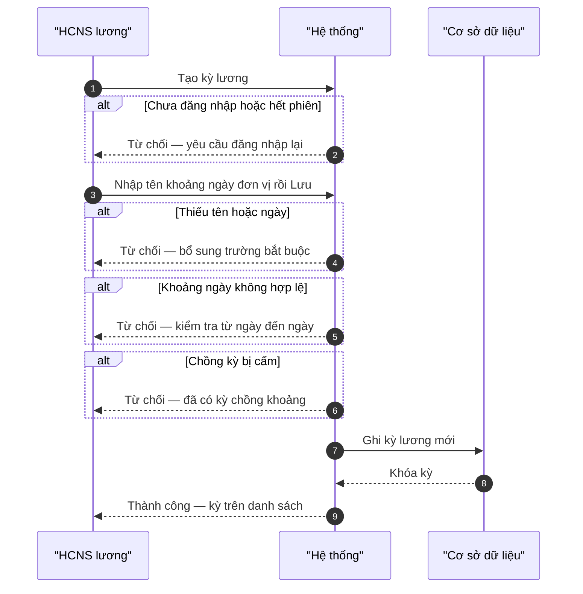
```mermaid
sequenceDiagram
  autonumber
  participant U as "HCNS lương"
  participant SYS as "Hệ thống"
  participant DB as "Cơ sở dữ liệu"
  U->>SYS: Tạo kỳ lương
  alt Chưa đăng nhập hoặc hết phiên
    SYS-->>U: Từ chối — yêu cầu đăng nhập lại
  end
  U->>SYS: Nhập tên khoảng ngày đơn vị rồi Lưu
  alt Thiếu tên hoặc ngày
    SYS-->>U: Từ chối — bổ sung trường bắt buộc
  end
  alt Khoảng ngày không hợp lệ
    SYS-->>U: Từ chối — kiểm tra từ ngày đến ngày
  end
  alt Chồng kỳ bị cấm
    SYS-->>U: Từ chối — đã có kỳ chồng khoảng
  end
  SYS->>DB: Ghi kỳ lương mới
  DB-->>SYS: Khóa kỳ
  SYS-->>U: Thành công — kỳ trên danh sách
```

**Diễn biến nghiệp vụ**

| # | Tương tác | Điều kiện / quy tắc | Kết quả hoặc lỗi |
|---|-----------|---------------------|------------------|
| 1 | (Auth gom) | Hết phiên / ngoài phạm vi | Từ chối |
| 2 | Mở form tạo kỳ | Có quyền | Form tạo |
| 3 | Thiếu tên / ngày | Bắt buộc | Từ chối — bổ sung |
| 4 | Ngày sai thứ tự | Đến trước từ | Từ chối — khoảng ngày |
| 5 | Chồng kỳ | Cấm chồng | Từ chối — chồng kỳ |
| 6 | Ngoài phạm vi đơn vị | Sai đơn vị | Từ chối — quyền |
| 7 | Lưu thành công | Đủ điều kiện | Kỳ trên danh sách |
| 8 | Tải lại | Cùng đơn vị | Kỳ vẫn còn |
| 9 | Thành công cuối | Khóa kỳ | Kết quả trả về |

**Kết quả trả về khi thành công**

| Ý | Nội dung |
|---|----------|
| Người dùng thấy | Thông báo tạo thành công; dòng kỳ (tên, từ–đến, trạng thái) |
| Bản ghi tạo / cập nhật | Kỳ lương mới |
| Khóa mang sang bước sau | Mã kỳ; khoảng ngày; đơn vị |
| Trạng thái sau | Nháp / mở theo cấu hình |
| Việc được mở khóa tiếp | Xử lý tính lương (HRM-PR-03); xem danh sách kỳ |

---

### 3.16 FR-HRM-PR-03 — Xử lý tính lương theo kỳ

| Thuộc tính | Mô tả |
|------------|--------|
| Actor | HCNS / người vận hành lương |
| Ưu tiên | Cao |
| Điều kiện tiên quyết | Kỳ lương tồn tại và chưa chốt; có quyền xử lý; nguồn công / thành phần lương sẵn sàng theo cấu hình |
| Điều kiện hậu | Phiếu / dòng lương kỳ được tạo hoặc cập nhật theo công thức; sẵn sàng xem phiếu và chốt |
| Mã UC | HRM-PR-03 |
| Liên hệ phần mềm hiện tại | Đã có — xử lý tính lương |

**Dữ liệu đầu vào**

| Trường | Bắt buộc | Ràng buộc / kiểm tra |
|--------|----------|----------------------|
| Mã kỳ lương | Có | Tồn tại; chưa chốt; trong phạm vi |
| Phạm vi nhân viên (lọc) | Không | Trong đơn vị kỳ |
| Xác nhận chạy lại | Khi đã có kết quả cũ | Người dùng xác nhận ghi đè có kiểm soát |

**Luồng chính**

1. Người dùng mở kỳ lương → chọn Xử lý / Tính lương.
2. Hệ thống kiểm kỳ chưa chốt → chạy tính theo cấu hình (công, thành phần, khấu trừ…).
3. Kết quả: số phiếu / dòng thành công; báo lỗi từng người nếu có (không bịa số).
4. Người dùng mở phiếu lương kỳ để kiểm tra.

**Quy tắc nghiệp vụ**

- Kỳ đã chốt → từ chối tính lại bằng thao tác thường.
- Không bịa số khi thiếu nguồn; đánh dấu thiếu dữ liệu / bỏ qua có lý do.
- Ngoài phạm vi kỳ → từ chối.
- Chạy lại khi đã có phiếu → yêu cầu xác nhận; ghi nhận lần chạy.

**Sơ đồ tương tác**

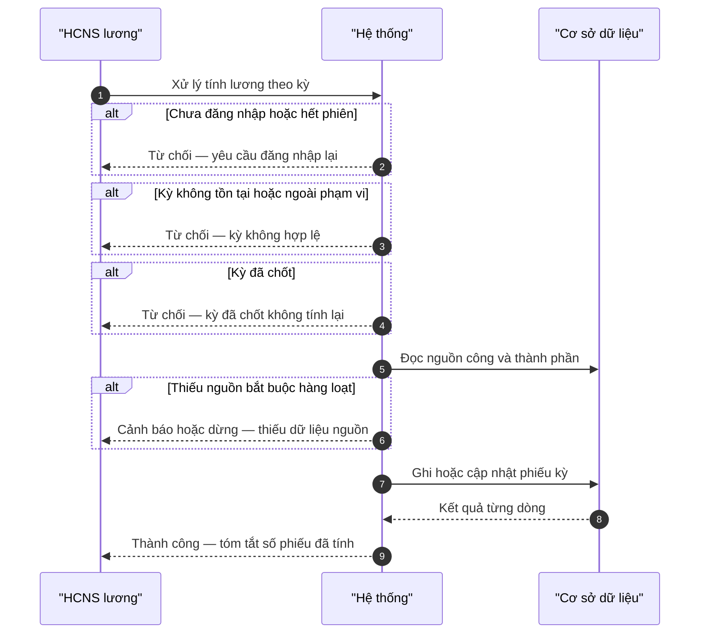
```mermaid
sequenceDiagram
  autonumber
  participant U as "HCNS lương"
  participant SYS as "Hệ thống"
  participant DB as "Cơ sở dữ liệu"
  U->>SYS: Xử lý tính lương theo kỳ
  alt Chưa đăng nhập hoặc hết phiên
    SYS-->>U: Từ chối — yêu cầu đăng nhập lại
  end
  alt Kỳ không tồn tại hoặc ngoài phạm vi
    SYS-->>U: Từ chối — kỳ không hợp lệ
  end
  alt Kỳ đã chốt
    SYS-->>U: Từ chối — kỳ đã chốt không tính lại
  end
  SYS->>DB: Đọc nguồn công và thành phần
  alt Thiếu nguồn bắt buộc hàng loạt
    SYS-->>U: Cảnh báo hoặc dừng — thiếu dữ liệu nguồn
  end
  SYS->>DB: Ghi hoặc cập nhật phiếu kỳ
  DB-->>SYS: Kết quả từng dòng
  SYS-->>U: Thành công — tóm tắt số phiếu đã tính
```

**Diễn biến nghiệp vụ**

| # | Tương tác | Điều kiện / quy tắc | Kết quả hoặc lỗi |
|---|-----------|---------------------|------------------|
| 1 | (Auth gom) | Hết phiên / ngoài phạm vi | Từ chối |
| 2 | Chọn kỳ | Kỳ mở | Sẵn sàng tính |
| 3 | Kỳ đã chốt | Khóa | Từ chối — đã chốt |
| 4 | Kỳ ngoài phạm vi | Sai đơn vị | Từ chối — quyền |
| 5 | Thiếu nguồn công / thành phần | Bắt buộc | Cảnh báo / dừng có lý do |
| 6 | Chạy tính | Hợp lệ | Phiếu / dòng được ghi |
| 7 | Một số NV lỗi | Lỗi từng dòng | Báo cáo lỗi; dòng OK giữ |
| 8 | Xem phiếu sau tính | Có quyền | FR-HRM-PR-05 |
| 9 | Thành công cuối | Đã có kết quả kỳ | Kết quả trả về |

**Kết quả trả về khi thành công**

| Ý | Nội dung |
|---|----------|
| Người dùng thấy | Tóm tắt số phiếu thành công / lỗi; danh sách phiếu kỳ có số liệu thật |
| Bản ghi tạo / cập nhật | Phiếu / dòng lương theo kỳ |
| Khóa mang sang bước sau | Mã kỳ; danh sách mã phiếu |
| Trạng thái sau | Kỳ đã xử lý (chưa chốt) |
| Việc được mở khóa tiếp | Xem phiếu (HRM-PR-05); chốt kỳ (HRM-PR-04) |

---

### 3.17 FR-HRM-PR-04 — Chốt kỳ lương

| Thuộc tính | Mô tả |
|------------|--------|
| Actor | HCNS / người có quyền chốt lương |
| Ưu tiên | Cao |
| Điều kiện tiên quyết | Kỳ đã xử lý tính ít nhất một lần hợp lệ (hoặc đủ điều kiện chốt theo cấu hình); chưa chốt |
| Điều kiện hậu | Kỳ ở trạng thái đã chốt; không tính lại / sửa phiếu bằng thao tác thường |
| Mã UC | HRM-PR-04 |
| Liên hệ phần mềm hiện tại | Đã có — chốt kỳ lương |

**Dữ liệu đầu vào**

| Trường | Bắt buộc | Ràng buộc / kiểm tra |
|--------|----------|----------------------|
| Mã kỳ lương | Có | Tồn tại; chưa chốt; trong phạm vi |
| Xác nhận chốt | Có | Người dùng xác nhận rõ ràng |

**Luồng chính**

1. Người dùng mở kỳ đã tính → chọn Chốt kỳ.
2. Hệ thống kiểm còn lỗi chặn / chưa tính → cảnh báo hoặc từ chối.
3. Người dùng xác nhận → hệ thống khóa kỳ.
4. Danh sách kỳ hiện «đã chốt»; xem phiếu vẫn được theo quyền.

**Quy tắc nghiệp vụ**

- Không chốt kỳ ngoài phạm vi hoặc đã chốt.
- Còn lỗi tính bắt buộc chưa xử lý → từ chối chốt.
- Sau chốt: cấm tính lại / sửa phiếu thường; mở khóa chỉ theo quy trình riêng (ngoài FR này nếu có).
- Chốt không được bịa thêm phiếu.

**Sơ đồ tương tác**

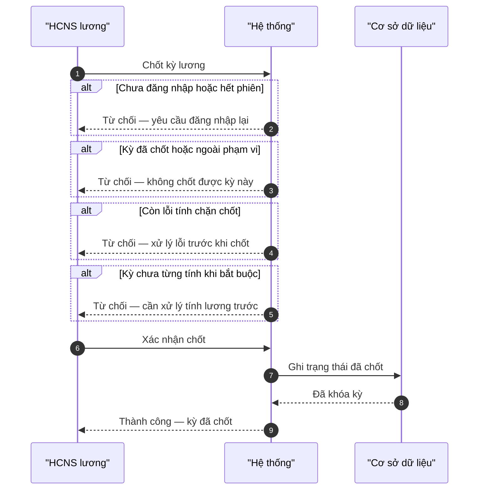
```mermaid
sequenceDiagram
  autonumber
  participant U as "HCNS lương"
  participant SYS as "Hệ thống"
  participant DB as "Cơ sở dữ liệu"
  U->>SYS: Chốt kỳ lương
  alt Chưa đăng nhập hoặc hết phiên
    SYS-->>U: Từ chối — yêu cầu đăng nhập lại
  end
  alt Kỳ đã chốt hoặc ngoài phạm vi
    SYS-->>U: Từ chối — không chốt được kỳ này
  end
  alt Còn lỗi tính chặn chốt
    SYS-->>U: Từ chối — xử lý lỗi trước khi chốt
  end
  alt Kỳ chưa từng tính khi bắt buộc
    SYS-->>U: Từ chối — cần xử lý tính lương trước
  end
  U->>SYS: Xác nhận chốt
  SYS->>DB: Ghi trạng thái đã chốt
  DB-->>SYS: Đã khóa kỳ
  SYS-->>U: Thành công — kỳ đã chốt
```

**Diễn biến nghiệp vụ**

| # | Tương tác | Điều kiện / quy tắc | Kết quả hoặc lỗi |
|---|-----------|---------------------|------------------|
| 1 | (Auth gom) | Hết phiên / ngoài phạm vi | Từ chối |
| 2 | Mở kỳ | Có quyền chốt | Chi tiết kỳ |
| 3 | Kỳ đã chốt | Trùng thao tác | Từ chối — đã chốt |
| 4 | Ngoài phạm vi | Sai đơn vị | Từ chối — quyền |
| 5 | Lỗi tính còn mở | Chặn chốt | Từ chối — xử lý lỗi |
| 6 | Chưa tính khi bắt buộc | Thiếu bước PR-03 | Từ chối — cần tính trước |
| 7 | Xác nhận chốt | Người dùng đồng ý | Kỳ khóa |
| 8 | Xem phiếu sau chốt | Có quyền đọc | Vẫn xem được; không sửa thường |
| 9 | Thành công cuối | Kỳ đã chốt | Kết quả trả về |

**Kết quả trả về khi thành công**

| Ý | Nội dung |
|---|----------|
| Người dùng thấy | Kỳ «đã chốt» trên danh sách; thao tác tính/sửa thường bị khóa |
| Bản ghi tạo / cập nhật | Kỳ lương — trạng thái đã chốt |
| Khóa mang sang bước sau | Mã kỳ đã chốt |
| Trạng thái sau | Đã chốt |
| Việc được mở khóa tiếp | Xem phiếu / báo cáo đối soát; không tính lại thường |

---

### 3.18 FR-HRM-RC-03 — Tạo hồ sơ ứng viên

| Thuộc tính | Mô tả |
|------------|--------|
| Actor | HCNS / người phụ trách tuyển dụng |
| Ưu tiên | Cao |
| Điều kiện tiên quyết | Có quyền tạo ứng viên trong đơn vị; (±) đã có yêu cầu tuyển dụng khi bắt buộc gắn |
| Điều kiện hậu | Hồ sơ ứng viên có mã; sẵn sàng lên lịch phỏng vấn / chuyển trạng thái pipeline |
| Mã UC | HRM-RC-03 |
| Liên hệ phần mềm hiện tại | Đã có — hồ sơ ứng viên |

**Dữ liệu đầu vào**

| Trường | Bắt buộc | Ràng buộc / kiểm tra |
|--------|----------|----------------------|
| Họ và tên | Có | Không rỗng |
| Số điện thoại / email | Ít nhất một theo cấu hình | Định dạng hợp lệ |
| Vị trí ứng tuyển | Có | Danh mục / gắn yêu cầu TD hiệu lực |
| Yêu cầu tuyển dụng | Theo cấu hình | Tồn tại; trong phạm vi |
| Nguồn ứng viên | Không | Danh mục hiệu lực |
| CV / đính kèm | Không | Định dạng / dung lượng theo quy định |

**Luồng chính**

1. Người dùng mở Tuyển dụng → Ứng viên → Thêm.
2. Nhập họ tên, liên hệ, vị trí (± gắn yêu cầu TD, CV) → Lưu.
3. Hệ thống kiểm trùng liên hệ (khi bật) / thiếu bắt buộc → ghi hồ sơ.
4. Ứng viên xuất hiện trên danh sách; sẵn sàng lên lịch phỏng vấn.

**Quy tắc nghiệp vụ**

- Chỉ tạo trong đơn vị được cấp.
- Thiếu họ tên / liên hệ bắt buộc → từ chối.
- Trùng email/SĐT trong pipeline đang mở (khi cấm) → cảnh báo hoặc từ chối theo cấu hình.
- Yêu cầu TD hết hiệu lực khi bắt buộc gắn → từ chối.

**Sơ đồ tương tác**

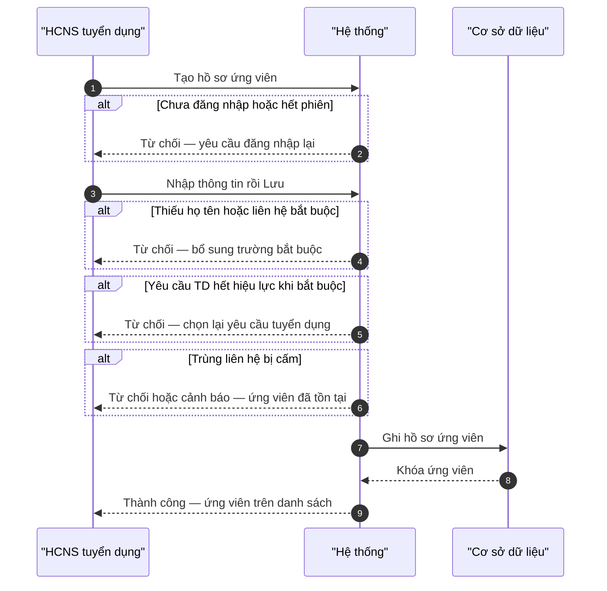
```mermaid
sequenceDiagram
  autonumber
  participant U as "HCNS tuyển dụng"
  participant SYS as "Hệ thống"
  participant DB as "Cơ sở dữ liệu"
  U->>SYS: Tạo hồ sơ ứng viên
  alt Chưa đăng nhập hoặc hết phiên
    SYS-->>U: Từ chối — yêu cầu đăng nhập lại
  end
  U->>SYS: Nhập thông tin rồi Lưu
  alt Thiếu họ tên hoặc liên hệ bắt buộc
    SYS-->>U: Từ chối — bổ sung trường bắt buộc
  end
  alt Yêu cầu TD hết hiệu lực khi bắt buộc
    SYS-->>U: Từ chối — chọn lại yêu cầu tuyển dụng
  end
  alt Trùng liên hệ bị cấm
    SYS-->>U: Từ chối hoặc cảnh báo — ứng viên đã tồn tại
  end
  SYS->>DB: Ghi hồ sơ ứng viên
  DB-->>SYS: Khóa ứng viên
  SYS-->>U: Thành công — ứng viên trên danh sách
```

**Diễn biến nghiệp vụ**

| # | Tương tác | Điều kiện / quy tắc | Kết quả hoặc lỗi |
|---|-----------|---------------------|------------------|
| 1 | (Auth gom) | Hết phiên / ngoài phạm vi | Từ chối |
| 2 | Mở form tạo | Có quyền | Form + vị trí / YCTD |
| 3 | Thiếu bắt buộc | Họ tên / liên hệ | Từ chối — bổ sung |
| 4 | YCTD hết hiệu lực | Bắt buộc gắn | Từ chối — chọn lại |
| 5 | Trùng liên hệ | Cấu hình cấm | Từ chối / cảnh báo |
| 6 | Đính kèm sai định dạng | Quy định file | Từ chối — tệp |
| 7 | Lưu thành công | Đủ điều kiện | Ứng viên trên danh sách |
| 8 | Tải lại | Cùng đơn vị | Hồ sơ vẫn còn |
| 9 | Thành công cuối | Khóa ứng viên | Kết quả trả về |

**Kết quả trả về khi thành công**

| Ý | Nội dung |
|---|----------|
| Người dùng thấy | Thông báo tạo thành công; dòng ứng viên (họ tên, vị trí, trạng thái) |
| Bản ghi tạo / cập nhật | Hồ sơ ứng viên mới |
| Khóa mang sang bước sau | Mã ứng viên; (±) mã yêu cầu TD |
| Trạng thái sau | Mới / đang xử lý theo pipeline |
| Việc được mở khóa tiếp | Lên lịch phỏng vấn (HRM-RC-05); cập nhật kết quả |

---

### 3.19 FR-HRM-RC-05 — Lên lịch phỏng vấn

| Thuộc tính | Mô tả |
|------------|--------|
| Actor | HCNS / người phụ trách tuyển dụng |
| Ưu tiên | Cao |
| Điều kiện tiên quyết | Hồ sơ ứng viên tồn tại trong phạm vi; trạng thái cho phép lên lịch |
| Điều kiện hậu | Có lịch phỏng vấn gắn ứng viên; người tham gia nhận thông báo khi cấu hình bật |
| Mã UC | HRM-RC-05 |
| Liên hệ phần mềm hiện tại | Đã có — lịch phỏng vấn |

**Dữ liệu đầu vào**

| Trường | Bắt buộc | Ràng buộc / kiểm tra |
|--------|----------|----------------------|
| Ứng viên | Có | Trong phạm vi; trạng thái hợp lệ |
| Thời điểm | Có | Ngày/giờ hợp lệ; không quá khứ quá ngưỡng cấm (theo cấu hình) |
| Hình thức / địa điểm | Theo cấu hình | Trực tiếp / trực tuyến; địa điểm hoặc liên kết |
| Người phỏng vấn | Có | Trong phạm vi; có quyền được gán |
| Ghi chú | Không | Độ dài tối đa |

**Luồng chính**

1. Người dùng mở ứng viên → Lên lịch phỏng vấn.
2. Chọn thời điểm, hình thức, người phỏng vấn → Lưu.
3. Hệ thống ghi lịch; (±) thông báo người phỏng vấn.
4. Lịch hiện trên hồ sơ ứng viên / danh sách lịch.

**Quy tắc nghiệp vụ**

- Không lên lịch cho ứng viên đã loại / đã nhận việc (khi cấm).
- Thời điểm không hợp lệ → từ chối.
- Thiếu người phỏng vấn → từ chối.
- Trùng lịch cùng người phỏng vấn–khung giờ (khi phát hiện) → cảnh báo hoặc từ chối theo cấu hình.

**Sơ đồ tương tác**

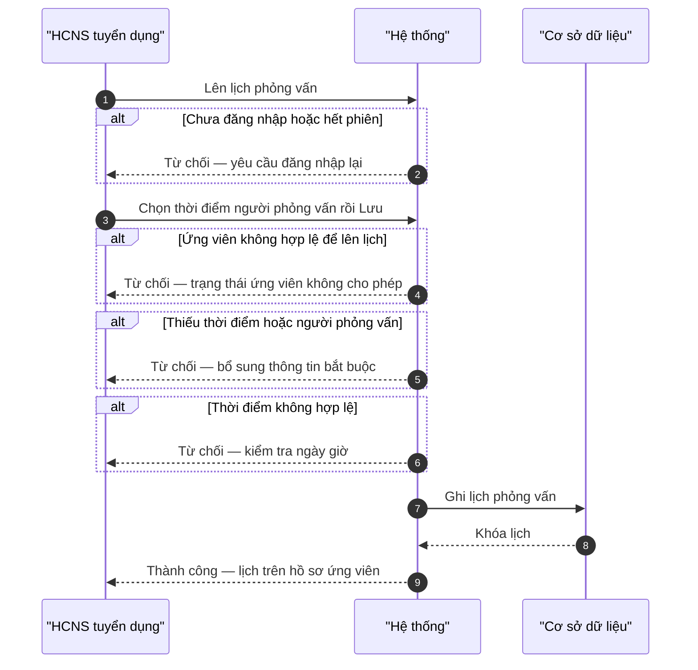
```mermaid
sequenceDiagram
  autonumber
  participant U as "HCNS tuyển dụng"
  participant SYS as "Hệ thống"
  participant DB as "Cơ sở dữ liệu"
  U->>SYS: Lên lịch phỏng vấn
  alt Chưa đăng nhập hoặc hết phiên
    SYS-->>U: Từ chối — yêu cầu đăng nhập lại
  end
  U->>SYS: Chọn thời điểm người phỏng vấn rồi Lưu
  alt Ứng viên không hợp lệ để lên lịch
    SYS-->>U: Từ chối — trạng thái ứng viên không cho phép
  end
  alt Thiếu thời điểm hoặc người phỏng vấn
    SYS-->>U: Từ chối — bổ sung thông tin bắt buộc
  end
  alt Thời điểm không hợp lệ
    SYS-->>U: Từ chối — kiểm tra ngày giờ
  end
  SYS->>DB: Ghi lịch phỏng vấn
  DB-->>SYS: Khóa lịch
  SYS-->>U: Thành công — lịch trên hồ sơ ứng viên
```

**Diễn biến nghiệp vụ**

| # | Tương tác | Điều kiện / quy tắc | Kết quả hoặc lỗi |
|---|-----------|---------------------|------------------|
| 1 | (Auth gom) | Hết phiên / ngoài phạm vi | Từ chối |
| 2 | Mở form lịch | Có quyền | Form gắn ứng viên |
| 3 | Ứng viên đã loại | Cấm lên lịch | Từ chối — trạng thái |
| 4 | Thiếu thời điểm / PV | Bắt buộc | Từ chối — bổ sung |
| 5 | Thời điểm sai | Quá khứ cấm / sai định dạng | Từ chối — ngày giờ |
| 6 | Trùng lịch PV | Cấu hình cấm | Từ chối / cảnh báo |
| 7 | Lưu thành công | Hợp lệ | Lịch trên hồ sơ |
| 8 | Thông báo PV | Cấu hình bật | Người phỏng vấn nhận tin |
| 9 | Thành công cuối | Khóa lịch | Kết quả trả về |

**Kết quả trả về khi thành công**

| Ý | Nội dung |
|---|----------|
| Người dùng thấy | Lịch (thời điểm, người PV) trên hồ sơ ứng viên |
| Bản ghi tạo / cập nhật | Lịch phỏng vấn mới |
| Khóa mang sang bước sau | Mã lịch; mã ứng viên |
| Trạng thái sau | Đã lên lịch / chờ phỏng vấn |
| Việc được mở khóa tiếp | Cập nhật kết quả phỏng vấn (HRM-RC-06) |

---

### 3.20 FR-HRM-PF-01 — Tạo chu kỳ đánh giá hiệu suất

| Thuộc tính | Mô tả |
|------------|--------|
| Actor | HCNS / quản lý hiệu suất có quyền |
| Ưu tiên | Trung bình |
| Điều kiện tiên quyết | Có quyền tạo chu kỳ trong đơn vị; khoảng thời gian hợp lệ |
| Điều kiện hậu | Chu kỳ đánh giá có mã; trạng thái mở / nháp; sẵn sàng tạo phiếu đánh giá |
| Mã UC | HRM-PF-01 |
| Liên hệ phần mềm hiện tại | Đã có / đang hoàn thiện — chu kỳ đánh giá |

**Dữ liệu đầu vào**

| Trường | Bắt buộc | Ràng buộc / kiểm tra |
|--------|----------|----------------------|
| Tên chu kỳ | Có | Không rỗng |
| Từ ngày / đến ngày | Có | Bắt đầu ≤ kết thúc |
| Đơn vị / phạm vi áp dụng | Có | Trong phạm vi được cấp |
| Mẫu tiêu chí (nếu có) | Theo cấu hình | Mẫu hiệu lực |
| Ghi chú | Không | Độ dài tối đa |

**Luồng chính**

1. Người dùng mở Đánh giá hiệu suất → Chu kỳ → Tạo.
2. Nhập tên, khoảng thời gian, phạm vi (± mẫu tiêu chí) → Lưu.
3. Hệ thống kiểm chồng chu kỳ (khi cấm) → ghi chu kỳ.
4. Chu kỳ hiện trên danh sách; sẵn sàng tạo phiếu đánh giá.

**Quy tắc nghiệp vụ**

- Chỉ tạo trong đơn vị được cấp.
- Khoảng ngày không hợp lệ → từ chối.
- Chồng hoàn toàn chu kỳ đang mở cùng phạm vi (khi cấm) → từ chối.
- Không tự tạo phiếu đánh giá hàng loạt khi chỉ tạo chu kỳ (trừ khi người dùng chọn bước kế).

**Sơ đồ tương tác**

```mermaid
sequenceDiagram
  autonumber
  participant U as "HCNS hiệu suất"
  participant SYS as "Hệ thống"
  participant DB as "Cơ sở dữ liệu"
  U->>SYS: Tạo chu kỳ đánh giá hiệu suất
  alt Chưa đăng nhập hoặc hết phiên
    SYS-->>U: Từ chối — yêu cầu đăng nhập lại
  end
  U->>SYS: Nhập tên khoảng ngày phạm vi rồi Lưu
  alt Thiếu tên hoặc ngày
    SYS-->>U: Từ chối — bổ sung trường bắt buộc
  end
  alt Khoảng ngày không hợp lệ
    SYS-->>U: Từ chối — kiểm tra từ ngày đến ngày
  end
  alt Chồng chu kỳ bị cấm
    SYS-->>U: Từ chối — đã có chu kỳ chồng khoảng
  end
  SYS->>DB: Ghi chu kỳ đánh giá
  DB-->>SYS: Khóa chu kỳ
  SYS-->>U: Thành công — chu kỳ trên danh sách
```

**Diễn biến nghiệp vụ**

| # | Tương tác | Điều kiện / quy tắc | Kết quả hoặc lỗi |
|---|-----------|---------------------|------------------|
| 1 | (Auth gom) | Hết phiên / ngoài phạm vi | Từ chối |
| 2 | Mở form tạo chu kỳ | Có quyền | Form tạo |
| 3 | Thiếu tên / ngày | Bắt buộc | Từ chối — bổ sung |
| 4 | Ngày sai thứ tự | Đến trước từ | Từ chối — khoảng ngày |
| 5 | Chồng chu kỳ | Cấm chồng | Từ chối — chồng kỳ |
| 6 | Ngoài phạm vi | Sai đơn vị | Từ chối — quyền |
| 7 | Mẫu tiêu chí hết hiệu lực | Khi bắt buộc | Từ chối — chọn lại mẫu |
| 8 | Lưu thành công | Đủ điều kiện | Chu kỳ trên danh sách |
| 9 | Thành công cuối | Khóa chu kỳ | Kết quả trả về |

**Kết quả trả về khi thành công**

| Ý | Nội dung |
|---|----------|
| Người dùng thấy | Thông báo tạo thành công; dòng chu kỳ (tên, từ–đến, trạng thái) |
| Bản ghi tạo / cập nhật | Chu kỳ đánh giá mới |
| Khóa mang sang bước sau | Mã chu kỳ; khoảng ngày; đơn vị |
| Trạng thái sau | Nháp / mở theo cấu hình |
| Việc được mở khóa tiếp | Xem danh sách chu kỳ (HRM-PF-02); tạo phiếu đánh giá (HRM-PF-03) |

---

### 3.21 FR-HRM-SCOPE-01 — Xem dữ liệu Nhân sự theo phạm vi tập đoàn

| Thuộc tính | Mô tả |
|------------|--------|
| Actor | Lãnh đạo tập đoàn / người có quyền xem toàn nhóm |
| Ưu tiên | Cao |
| Điều kiện tiên quyết | Đã đăng nhập; phiên thuộc phạm vi tập đoàn; có quyền xem danh sách nhân sự |
| Điều kiện hậu | Danh sách / tổng hợp phản ánh đúng các đơn vị thành viên được phép; không lộ dữ liệu ngoài phạm vi |
| Mã UC | UC-HRM-SCOPE-01 |
| Liên hệ phần mềm hiện tại | Đã có — danh sách nhân sự / tab nhúng khi chọn toàn tập đoàn |

**Dữ liệu đầu vào**

| Trường | Bắt buộc | Ràng buộc / kiểm tra |
|--------|----------|----------------------|
| Đơn vị đang làm việc | Có | Phải là phạm vi tập đoàn hợp lệ |
| Bộ lọc đơn vị (Tất cả / tổng hợp) | Có | Chỉ khi được phép xem toàn nhóm |
| Bộ lọc tìm kiếm / trang | Không | Trong phạm vi kết quả được cấp |

**Luồng chính**

1. Người dùng mở danh sách nhân sự (hoặc tab Nhân sự trên cổng điều hành) với phạm vi tập đoàn.
2. Hệ thống xác định phiên thuộc tập đoàn và quyền xem tổng hợp.
3. Hệ thống trả danh sách / tổng hợp trên các đơn vị thành viên được phép.
4. Người dùng mở chi tiết một hồ sơ trong kết quả → vẫn trong cùng phạm vi tổng hợp.
5. Tải lại trang: kết quả vẫn đúng phạm vi; không hiện dữ liệu đơn vị ngoài quyền.

**Quy tắc nghiệp vụ**

- Chỉ trả bản ghi thuộc các đơn vị thành viên được phép trong phạm vi tập đoàn.
- Hồ sơ ngoài phạm vi tổng hợp → không hiện hoặc báo không tìm thấy (không lộ dữ liệu đơn vị khác).
- Empty hợp lệ khi chưa có nhân sự → thông báo chưa có dữ liệu, không báo lỗi hệ thống.
- Đổi sang lọc một đơn vị thành viên → chuyển sang hành vi bộ lọc đơn vị (FR-HRM-SCOPE-03).

**Sơ đồ tương tác**

```mermaid
sequenceDiagram
  autonumber
  participant U as "Lãnh đạo tập đoàn"
  participant SYS as "Hệ thống"
  participant DB as "Cơ sở dữ liệu"
  U->>SYS: Mở danh sách nhân sự phạm vi tập đoàn
  alt Chưa đăng nhập hoặc hết phiên
    SYS-->>U: Từ chối — yêu cầu đăng nhập lại
  end
  alt Không đủ quyền xem tổng hợp
    SYS-->>U: Từ chối — không đủ quyền
  end
  SYS->>DB: Đọc hồ sơ các đơn vị thành viên được phép
  DB-->>SYS: Tập bản ghi trong phạm vi
  alt Kết quả rỗng hợp lệ
    SYS-->>U: Thông báo chưa có dữ liệu
  end
  SYS-->>U: Danh sách hoặc tổng hợp theo phạm vi
  U->>SYS: Mở chi tiết một hồ sơ trong kết quả
  alt Hồ sơ ngoài phạm vi
    SYS-->>U: Không tìm thấy hoặc không đủ quyền
  end
  SYS-->>U: Chi tiết hồ sơ trong phạm vi
```

**Diễn biến nghiệp vụ**

| # | Tương tác | Điều kiện / quy tắc | Kết quả hoặc lỗi |
|---|-----------|---------------------|------------------|
| 1 | (Auth gom) | Hết phiên / ngoài quyền | Từ chối |
| 2 | Mở danh sách tập đoàn | Có quyền tổng hợp | Yêu cầu dữ liệu |
| 3 | Phạm vi sai | Không phải tập đoàn | Từ chối — phạm vi |
| 4 | Empty hợp lệ | Chưa có NV | Thông báo chưa có |
| 5 | Có dữ liệu | Trong các ĐVTV | Danh sách / tổng hợp |
| 6 | Mở chi tiết ngoài phạm vi | Hồ sơ không thuộc | Không tìm thấy |
| 7 | Mở chi tiết trong phạm vi | Hồ sơ thuộc | Chi tiết đúng |
| 8 | Tải lại trang | Cùng phiên | Kết quả ổn định |
| 9 | Thành công cuối | Đủ khóa phạm vi | Kết quả trả về |

**Kết quả trả về khi thành công**

| Ý | Nội dung |
|---|----------|
| Người dùng thấy | Danh sách / tổng hợp nhân sự các đơn vị thành viên được phép (hoặc empty trung thực) |
| Bản ghi tạo / cập nhật | Không tạo mới — chỉ đọc trong phạm vi |
| Khóa mang sang bước sau | Phạm vi tập đoàn; mã hồ sơ đã mở (nếu có) |
| Trạng thái sau | Đang xem tổng hợp tập đoàn |
| Việc được mở khóa tiếp | Lọc một đơn vị (FR-HRM-SCOPE-03); thao tác nghiệp vụ trên hồ sơ trong phạm vi |

---

### 3.22 FR-HRM-SCOPE-02 — Xem dữ liệu Nhân sự theo phạm vi công ty thành viên

| Thuộc tính | Mô tả |
|------------|--------|
| Actor | Lãnh đạo / HCNS công ty thành viên |
| Ưu tiên | Cao |
| Điều kiện tiên quyết | Đã đăng nhập; phiên thuộc một công ty thành viên; có quyền xem nhân sự đơn vị mình |
| Điều kiện hậu | Chỉ thấy dữ liệu đơn vị mình; không thấy rollup tập đoàn |
| Mã UC | UC-HRM-SCOPE-02 |
| Liên hệ phần mềm hiện tại | Đã có — danh sách / nhúng theo tenant thành viên |

**Dữ liệu đầu vào**

| Trường | Bắt buộc | Ràng buộc / kiểm tra |
|--------|----------|----------------------|
| Đơn vị phiên | Có | Phải khớp công ty thành viên của người dùng |
| Bộ lọc tìm kiếm / trang | Không | Chỉ trong đơn vị mình |

**Luồng chính**

1. Người dùng công ty thành viên mở danh sách nhân sự.
2. Hệ thống khóa phạm vi đúng đơn vị của phiên.
3. Hệ thống trả danh sách chỉ thuộc đơn vị đó.
4. Người dùng thử mở hồ sơ / báo cáo ngoài đơn vị → bị từ chối hoặc không tìm thấy.
5. Tải lại trang: vẫn chỉ dữ liệu đơn vị mình.

**Quy tắc nghiệp vụ**

- Không hiện dữ liệu tập đoàn / đơn vị thành viên khác.
- Không mở được chức năng tổng hợp tập đoàn dành riêng lãnh đạo nhóm.
- Empty hợp lệ trong đơn vị mình → thông báo chưa có, không báo lỗi hệ thống.
- Mọi thao tác ghi (nếu có quyền) cũng chỉ trong đơn vị mình.

**Sơ đồ tương tác**

```mermaid
sequenceDiagram
  autonumber
  participant U as "Lãnh đạo thành viên"
  participant SYS as "Hệ thống"
  participant DB as "Cơ sở dữ liệu"
  U->>SYS: Mở danh sách nhân sự đơn vị mình
  alt Chưa đăng nhập hoặc hết phiên
    SYS-->>U: Từ chối — yêu cầu đăng nhập lại
  end
  SYS->>DB: Đọc hồ sơ trong đơn vị phiên
  DB-->>SYS: Tập bản ghi đơn vị
  alt Kết quả rỗng hợp lệ
    SYS-->>U: Thông báo chưa có dữ liệu
  end
  SYS-->>U: Danh sách đơn vị mình
  U->>SYS: Thử xem dữ liệu ngoài đơn vị
  alt Ngoài phạm vi thành viên
    SYS-->>U: Từ chối hoặc không tìm thấy
  end
```

**Diễn biến nghiệp vụ**

| # | Tương tác | Điều kiện / quy tắc | Kết quả hoặc lỗi |
|---|-----------|---------------------|------------------|
| 1 | (Auth gom) | Hết phiên | Từ chối |
| 2 | Mở danh sách | Phiên thành viên | Khóa đơn vị |
| 3 | Empty hợp lệ | Chưa có NV | Thông báo chưa có |
| 4 | Có dữ liệu | Trong đơn vị | Danh sách đúng |
| 5 | Xem ngoài đơn vị | Hồ sơ khác ĐV | Từ chối / không tìm thấy |
| 6 | Gọi chức năng rollup | Không đủ quyền nhóm | Từ chối — quyền |
| 7 | Tải lại trang | Cùng phiên | Vẫn chỉ đơn vị mình |
| 8 | Thành công cuối | Phạm vi khóa | Kết quả trả về |

**Kết quả trả về khi thành công**

| Ý | Nội dung |
|---|----------|
| Người dùng thấy | Danh sách nhân sự chỉ của công ty thành viên mình |
| Bản ghi tạo / cập nhật | Không tạo mới — chỉ đọc trong phạm vi |
| Khóa mang sang bước sau | Mã đơn vị phiên; mã hồ sơ trong đơn vị |
| Trạng thái sau | Đang xem phạm vi thành viên |
| Việc được mở khóa tiếp | Thao tác nghiệp vụ trong đơn vị (hồ sơ, công, lương…) |

---

### 3.23 FR-HRM-SCOPE-03 — Lọc đơn vị khi xem Nhân sự trên cổng điều hành

| Thuộc tính | Mô tả |
|------------|--------|
| Actor | Lãnh đạo tập đoàn trên cổng điều hành (nhúng Nhân sự) |
| Ưu tiên | Cao |
| Điều kiện tiên quyết | Đã đăng nhập phạm vi tập đoàn; đang mở phân hệ Nhân sự nhúng; có bộ chọn đơn vị |
| Điều kiện hậu | Dữ liệu trên màn khớp đơn vị đã chọn; đổi lọc thì tải lại đúng |
| Mã UC | UC-HRM-SCOPE-03 |
| Liên hệ phần mềm hiện tại | Đã có — bộ lọc đơn vị trên nhúng |

**Dữ liệu đầu vào**

| Trường | Bắt buộc | Ràng buộc / kiểm tra |
|--------|----------|----------------------|
| Đơn vị lọc | Có | Một đơn vị thành viên hoặc «Tất cả» |
| Màn / tab đang mở | Có | Thuộc Nhân sự nhúng |

**Luồng chính**

1. Người dùng mở Nhân sự trên cổng điều hành với phạm vi tập đoàn.
2. Người dùng chọn một đơn vị thành viên trên bộ lọc.
3. Hệ thống tải lại dữ liệu màn hiện tại theo đơn vị đã chọn (không đổi sai phiên đăng nhập).
4. Người dùng chọn «Tất cả» → trở lại tổng hợp tập đoàn (FR-HRM-SCOPE-01).
5. Đổi lọc mà không thấy dữ liệu cũ lẫn → đạt; nếu lẫn dữ liệu cũ là lỗi nghiệp vụ.

**Quy tắc nghiệp vụ**

- Đổi đơn vị lọc bắt buộc làm mới dữ liệu màn đang mở.
- Người dùng công ty thành viên không thấy bộ lọc đa đơn vị (hoặc chỉ một lựa chọn đơn vị mình).
- «Tất cả» = hành vi tổng hợp tập đoàn khi đủ quyền.
- Không giữ dữ liệu đơn vị A khi đã chuyển sang đơn vị B.

**Sơ đồ tương tác**

```mermaid
sequenceDiagram
  autonumber
  participant U as "Lãnh đạo tập đoàn"
  participant SYS as "Hệ thống"
  participant DB as "Cơ sở dữ liệu"
  U->>SYS: Mở Nhân sự nhúng
  alt Chưa đăng nhập hoặc hết phiên
    SYS-->>U: Từ chối — yêu cầu đăng nhập lại
  end
  U->>SYS: Chọn một đơn vị thành viên
  SYS->>DB: Đọc dữ liệu theo đơn vị đã chọn
  DB-->>SYS: Tập bản ghi đơn vị
  SYS-->>U: Màn hình theo đơn vị lọc
  U->>SYS: Chọn Tất cả
  SYS->>DB: Đọc tổng hợp các đơn vị được phép
  DB-->>SYS: Tập tổng hợp
  SYS-->>U: Màn hình tổng hợp tập đoàn
```

**Diễn biến nghiệp vụ**

| # | Tương tác | Điều kiện / quy tắc | Kết quả hoặc lỗi |
|---|-----------|---------------------|------------------|
| 1 | (Auth gom) | Hết phiên | Từ chối |
| 2 | Mở nhúng | Có quyền tập đoàn | Hiện bộ lọc |
| 3 | Thành viên mở nhúng | Không đủ quyền nhóm | Ẩn / khóa bộ lọc đa ĐV |
| 4 | Chọn ĐVTV | Đơn vị hợp lệ | Tải lại theo ĐV |
| 5 | Dữ liệu stale | Không tải lại sau đổi lọc | Lỗi nghiệp vụ — phải làm mới |
| 6 | Chọn Tất cả | Đủ quyền | Tổng hợp SCOPE-01 |
| 7 | Empty sau lọc | ĐV chưa có NV | Empty trung thực |
| 8 | Thành công cuối | Lọc khớp dữ liệu | Kết quả trả về |

**Kết quả trả về khi thành công**

| Ý | Nội dung |
|---|----------|
| Người dùng thấy | Dữ liệu màn khớp đơn vị vừa chọn (hoặc tổng hợp khi Tất cả) |
| Bản ghi tạo / cập nhật | Không tạo mới — chỉ đổi phạm vi xem |
| Khóa mang sang bước sau | Đơn vị lọc hiện tại |
| Trạng thái sau | Đang lọc theo đơn vị đã chọn |
| Việc được mở khóa tiếp | Thao tác nghiệp vụ đúng đơn vị đang lọc |

---

### 3.24 FR-HRM-02 — Tạo quản trị nền tảng

| Thuộc tính | Mô tả |
|------------|--------|
| Actor | Quản trị nền tảng được ủy quyền |
| Ưu tiên | Cao |
| Điều kiện tiên quyết | Đã đăng nhập; có quyền tạo quản trị nền tảng |
| Điều kiện hậu | Tài khoản quản trị nền tảng được tạo hoặc quyền nền tảng được làm mới; sẵn sàng vận hành cấu hình cấp nền tảng |
| Mã UC | UC-HRM-02 |
| Liên hệ phần mềm hiện tại | Đã có / đang hoàn thiện — quản trị nền tảng |

**Dữ liệu đầu vào**

| Trường | Bắt buộc | Ràng buộc / kiểm tra |
|--------|----------|----------------------|
| Họ tên / định danh người dùng | Có | Không rỗng |
| Email đăng nhập | Có | Định dạng hợp lệ; nếu đã có quyền nền tảng thì hệ thống **cập nhật quyền** (không từ chối xung đột theo mặc định) |
| Vai trò nền tảng | Có | Thuộc danh mục vai trò được phép gán |
| Trạng thái kích hoạt | Có | Theo danh mục (đang dùng / tạm khóa) |

**Luồng chính**

1. Người dùng mở Quản trị → Quản trị nền tảng → Tạo.
2. Nhập thông tin bắt buộc và vai trò → Lưu.
3. Hệ thống kiểm tra quyền; nếu email chưa có thì tạo tài khoản, nếu đã có thì làm mới quyền nền tảng → ghi dữ liệu.
4. Tài khoản hiện trên danh sách; có thể đăng nhập theo quy trình cấp mật khẩu của hệ thống.

**Quy tắc nghiệp vụ**

- Chỉ người có quyền nền tảng mới tạo được.
- Email đã có quyền nền tảng → **cập nhật quyền** (không ghi đè im lặng sang người khác; không báo xung đột theo mặc định).
- Không tự nâng quyền vượt danh mục được phép.
- Tạo hoặc cập nhật quyền thành công không đồng nghĩa bỏ qua bước cấp mật khẩu an toàn.

**Sơ đồ tương tác**

```mermaid
sequenceDiagram
  autonumber
  participant U as "Quản trị nền tảng"
  participant SYS as "Hệ thống"
  participant DB as "Cơ sở dữ liệu"
  U->>SYS: Mở tạo quản trị nền tảng
  alt Chưa đăng nhập hoặc hết phiên
    SYS-->>U: Từ chối — yêu cầu đăng nhập lại
  end
  alt Không đủ quyền
    SYS-->>U: Từ chối — không đủ quyền
  end
  U->>SYS: Nhập thông tin và Lưu
  alt Thiếu trường bắt buộc
    SYS-->>U: Từ chối — bổ sung trường bắt buộc
  end
  alt Email đã có quyền nền tảng
    SYS->>DB: Cập nhật quyền nền tảng
    DB-->>SYS: Khóa tài khoản
    SYS-->>U: Thành công — quyền đã làm mới
  end
  alt Vai trò không hợp lệ
    SYS-->>U: Từ chối — chọn lại vai trò
  end
  SYS->>DB: Ghi tài khoản quản trị nền tảng
  DB-->>SYS: Khóa tài khoản
  SYS-->>U: Thành công — hiện trên danh sách
```

**Diễn biến nghiệp vụ**

| # | Tương tác | Điều kiện / quy tắc | Kết quả hoặc lỗi |
|---|-----------|---------------------|------------------|
| 1 | (Auth gom) | Hết phiên / ngoài quyền | Từ chối |
| 2 | Mở form tạo | Có quyền | Form tạo |
| 3 | Thiếu bắt buộc | Email / họ tên trống | Từ chối — bổ sung |
| 4 | Email đã có quyền nền tảng | Quy tắc công bố: cập nhật quyền | Thành công — quyền làm mới (không từ chối xung đột) |
| 5 | Vai trò sai | Ngoài danh mục | Từ chối — vai trò |
| 6 | Lưu thành công | Đủ điều kiện | Dòng trên danh sách (mới hoặc đã cập nhật) |
| 7 | Tải lại trang | Cùng phạm vi | Bản ghi còn |
| 8 | Thành công cuối | Khóa tài khoản | Kết quả trả về |

**Kết quả trả về khi thành công**

| Ý | Nội dung |
|---|----------|
| Người dùng thấy | Thông báo thành công; dòng quản trị nền tảng trên danh sách |
| Bản ghi tạo / cập nhật | Tài khoản quản trị nền tảng mới hoặc quyền đã làm mới |
| Khóa mang sang bước sau | Định danh tài khoản; vai trò đã gán |
| Trạng thái sau | Đang dùng / chờ kích hoạt theo cấu hình |
| Việc được mở khóa tiếp | Tạo quản trị doanh nghiệp (UC-HRM-03); vận hành cấu hình nền tảng |

---

### 3.25 FR-HRM-03 — Tạo hoặc cập nhật quản trị doanh nghiệp

| Thuộc tính | Mô tả |
|------------|--------|
| Actor | Quản trị nền tảng (hoặc quyền nền tảng được ủy quyền) |
| Ưu tiên | Cao |
| Điều kiện tiên quyết | Đã đăng nhập; có quyền quản trị nền tảng; đơn vị đích tồn tại |
| Điều kiện hậu | Quản trị doanh nghiệp được tạo hoặc cập nhật đúng đơn vị |
| Mã UC | UC-HRM-03 |
| Liên hệ phần mềm hiện tại | Đã có / đang hoàn thiện — quản trị theo công ty |

**Dữ liệu đầu vào**

| Trường | Bắt buộc | Ràng buộc / kiểm tra |
|--------|----------|----------------------|
| Đơn vị đích | Có | Đơn vị hiệu lực; người gọi có quyền nền tảng được phép gán |
| Người dùng / email | Có | Định dạng hợp lệ |
| Vai trò quản trị đơn vị | Có | Thuộc danh mục được phép |
| Trạng thái | Có | Theo danh mục |

**Luồng chính**

1. Người dùng mở Quản trị doanh nghiệp → Tạo hoặc chọn bản ghi để sửa.
2. Chọn đơn vị, người dùng, vai trò → Lưu.
3. Hệ thống kiểm tra quyền nền tảng và đơn vị → ghi mới hoặc cập nhật.
4. Bản ghi hiện đúng đơn vị trên danh sách; tải lại trang vẫn còn.

**Quy tắc nghiệp vụ**

- Chỉ người có quyền quản trị nền tảng (hoặc ủy quyền nền tảng tương đương) được gán quản trị doanh nghiệp.
- Người không đủ quyền nền tảng → từ chối (không đủ quyền).
- Với người đã có quyền nền tảng, mọi đơn vị đích hợp lệ trong hệ thống đều thuộc phạm vi gán của chức năng này.
- Cập nhật không được im lặng đổi sang đơn vị khác nếu không đủ quyền.
- Trùng người dùng + đơn vị + vai trò → cập nhật theo quy tắc đã công bố (ghi đè quyền đang dùng).
- Gỡ quyền phải có trạng thái rõ (không xóa «mất dấu»).

**Sơ đồ tương tác**

```mermaid
sequenceDiagram
  autonumber
  participant U as "Quản trị nền tảng"
  participant SYS as "Hệ thống"
  participant DB as "Cơ sở dữ liệu"
  U->>SYS: Tạo hoặc cập nhật quản trị doanh nghiệp
  alt Chưa đăng nhập hoặc hết phiên
    SYS-->>U: Từ chối — yêu cầu đăng nhập lại
  end
  alt Không đủ quyền nền tảng
    SYS-->>U: Từ chối — không đủ quyền
  end
  U->>SYS: Nhập đơn vị người dùng vai trò rồi Lưu
  alt Thiếu trường bắt buộc
    SYS-->>U: Từ chối — bổ sung trường bắt buộc
  end
  SYS->>DB: Ghi hoặc cập nhật quản trị doanh nghiệp
  DB-->>SYS: Khóa bản ghi
  SYS-->>U: Thành công — hiện trên danh sách
```

**Diễn biến nghiệp vụ**

| # | Tương tác | Điều kiện / quy tắc | Kết quả hoặc lỗi |
|---|-----------|---------------------|------------------|
| 1 | (Auth gom) | Hết phiên / ngoài quyền | Từ chối |
| 2 | Chọn đơn vị | Đơn vị hợp lệ | Đơn vị được chọn |
| 3 | Không đủ quyền nền tảng | Người gọi ngoài quyền nền tảng | Từ chối — không đủ quyền |
| 4 | Thiếu bắt buộc | Email / vai trò trống | Từ chối — bổ sung |
| 5 | Trùng gán | Đã có quyền đơn vị | Cập nhật quyền theo quy tắc công bố |
| 6 | Lưu thành công | Đủ điều kiện | Bản ghi trên danh sách |
| 7 | Tải lại trang | Cùng đơn vị | Bản ghi còn |
| 8 | Thành công cuối | Khóa bản ghi | Kết quả trả về |

**Kết quả trả về khi thành công**

| Ý | Nội dung |
|---|----------|
| Người dùng thấy | Thông báo lưu thành công; dòng quản trị theo đơn vị |
| Bản ghi tạo / cập nhật | Quản trị doanh nghiệp mới hoặc đã cập nhật |
| Khóa mang sang bước sau | Định danh người dùng; mã đơn vị; vai trò |
| Trạng thái sau | Đang dùng theo trạng thái đã chọn |
| Việc được mở khóa tiếp | Mời nhân viên hàng loạt (UC-HRM-04); vận hành HR đơn vị |

---

### 3.26 FR-HRM-04 — Mời nhân viên hàng loạt

| Thuộc tính | Mô tả |
|------------|--------|
| Actor | Quản trị nền tảng hoặc kênh hệ thống nội bộ đã cấu hình |
| Ưu tiên | Cao |
| Điều kiện tiên quyết | Đã đăng nhập và có quyền mời theo chính sách nền tảng (hoặc kênh hệ thống nội bộ); có danh sách người cần mời |
| Điều kiện hậu | Mỗi dòng mời có kết quả rõ (thành công / lỗi); người được mời nhận lời mời theo kênh đã cấu hình |
| Mã UC | UC-HRM-04 |
| Liên hệ phần mềm hiện tại | Đã có / đang hoàn thiện — mời nhân viên hàng loạt |

**Dữ liệu đầu vào**

| Trường | Bắt buộc | Ràng buộc / kiểm tra |
|--------|----------|----------------------|
| Đơn vị | Có | Trong phạm vi được cấp |
| Danh sách email / mã hồ sơ | Có | Ít nhất một dòng hợp lệ |
| Vai trò / quyền gán kèm | Theo cấu hình | Thuộc danh mục |
| Ghi chú lô | Không | Độ dài tối đa |

**Luồng chính**

1. Người dùng mở Mời nhân viên → chọn đơn vị → nhập hoặc tải danh sách.
2. Người dùng xác nhận gửi lời mời.
3. Hệ thống xử lý từng dòng: hợp lệ thì gửi / tạo lời mời; lỗi thì ghi lý do từng dòng.
4. Người dùng xem bảng kết quả lô (thành công / thất bại); tải lại vẫn tra được kết quả phiên vừa chạy (khi hệ thống lưu).

**Quy tắc nghiệp vụ**

- Kết quả phải theo từng bản ghi — không «thành công cả lô» khi còn dòng lỗi.
- Email sai định dạng / trùng đã là thành viên → dòng đó thất bại, các dòng khác vẫn xử lý.
- Ngoài phạm vi đơn vị → từ chối cả thao tác hoặc từng dòng ngoài phạm vi.
- Không tạo hồ sơ nhân viên giả khi chỉ mời tài khoản (trừ khi cấu hình gắn hồ sơ sẵn có).

**Sơ đồ tương tác**

```mermaid
sequenceDiagram
  autonumber
  participant U as "HCNS"
  participant SYS as "Hệ thống"
  participant DB as "Cơ sở dữ liệu"
  U->>SYS: Gửi lô mời nhân viên
  alt Chưa đăng nhập hoặc hết phiên
    SYS-->>U: Từ chối — yêu cầu đăng nhập lại
  end
  alt Không đủ quyền đơn vị
    SYS-->>U: Từ chối — không đủ quyền
  end
  U->>SYS: Xác nhận danh sách mời
  alt Danh sách rỗng
    SYS-->>U: Từ chối — chưa có dòng hợp lệ
  end
  loop Từng dòng mời
    alt Dòng không hợp lệ
      SYS-->>U: Ghi lỗi từng dòng
    else Dòng hợp lệ
      SYS->>DB: Ghi lời mời
      DB-->>SYS: Khóa lời mời
    end
  end
  SYS-->>U: Bảng kết quả theo từng dòng
```

**Diễn biến nghiệp vụ**

| # | Tương tác | Điều kiện / quy tắc | Kết quả hoặc lỗi |
|---|-----------|---------------------|------------------|
| 1 | (Auth gom) | Hết phiên / ngoài quyền | Từ chối |
| 2 | Nhập danh sách | Có quyền đơn vị | Form lô |
| 3 | Danh sách rỗng | Không có dòng | Từ chối — bổ sung |
| 4 | Email sai định dạng | Dòng lỗi | Lỗi từng dòng |
| 5 | Đã là thành viên | Trùng | Lỗi từng dòng — đã tồn tại |
| 6 | Dòng hợp lệ | Đủ điều kiện | Lời mời được ghi |
| 7 | Xem kết quả lô | Sau xử lý | Bảng thành công / lỗi |
| 8 | Thành công cuối | Có ≥1 dòng OK hoặc báo cáo đủ | Kết quả trả về |

**Kết quả trả về khi thành công**

| Ý | Nội dung |
|---|----------|
| Người dùng thấy | Bảng kết quả từng dòng (thành công / lý do lỗi) |
| Bản ghi tạo / cập nhật | Các lời mời thành công trong lô |
| Khóa mang sang bước sau | Mã lô / mã lời mời; đơn vị |
| Trạng thái sau | Đã gửi / chờ người nhận chấp nhận theo cấu hình |
| Việc được mở khóa tiếp | Người được mời kích hoạt tài khoản; HCNS theo dõi trạng thái |

---

### 3.27 FR-HRM-05 — Cập nhật thông tin nhạy cảm tài khoản

| Thuộc tính | Mô tả |
|------------|--------|
| Actor | Quản trị nền tảng có quyền cập nhật thông tin nhạy cảm |
| Ưu tiên | Cao |
| Điều kiện tiên quyết | Đã đăng nhập; có quyền nền tảng trên chức năng cập nhật thông tin nhạy cảm; tài khoản đích tồn tại |
| Điều kiện hậu | Thông tin nhạy cảm được cập nhật; phiên cũ có thể bị vô hiệu theo chính sách |
| Mã UC | UC-HRM-05 |
| Liên hệ phần mềm hiện tại | Đã có / đang hoàn thiện — đặt lại mật khẩu / thông tin nhạy cảm |

**Dữ liệu đầu vào**

| Trường | Bắt buộc | Ràng buộc / kiểm tra |
|--------|----------|----------------------|
| Tài khoản đích | Có | Thuộc phạm vi được cấp |
| Loại cập nhật | Có | Đặt lại mật khẩu / khóa tạm… theo danh mục |
| Giá trị mới (nếu nhập) | Theo loại | Độ mạnh / định dạng theo chính sách |
| Lý do (nếu bắt buộc) | Theo cấu hình | Không rỗng khi bắt buộc |

**Luồng chính**

1. Người dùng mở Quản trị tài khoản → chọn người dùng → Cập nhật thông tin nhạy cảm.
2. Chọn loại cập nhật, nhập giá trị / xác nhận → Lưu.
3. Hệ thống kiểm tra quyền và chính sách → ghi nhận thay đổi.
4. Giao diện xác nhận thành công; người dùng đích phải dùng thông tin mới ở lần đăng nhập kế (khi là mật khẩu).

**Quy tắc nghiệp vụ**

- Không cập nhật khi người gọi thiếu quyền nền tảng.
- Không hiện mật khẩu cũ; không ghi log plaintext mật khẩu.
- Thiếu lý do khi bắt buộc → từ chối.
- Đặt lại mật khẩu thành công có thể yêu cầu đổi lại ở lần đăng nhập đầu (theo chính sách).

**Sơ đồ tương tác**

```mermaid
sequenceDiagram
  autonumber
  participant U as "Quản trị"
  participant SYS as "Hệ thống"
  participant DB as "Cơ sở dữ liệu"
  U->>SYS: Cập nhật thông tin nhạy cảm tài khoản
  alt Chưa đăng nhập hoặc hết phiên
    SYS-->>U: Từ chối — yêu cầu đăng nhập lại
  end
  alt Không đủ quyền nền tảng
    SYS-->>U: Từ chối — không đủ quyền
  end
  U->>SYS: Chọn loại cập nhật và xác nhận
  alt Thiếu lý do bắt buộc
    SYS-->>U: Từ chối — bổ sung lý do
  end
  alt Vi phạm chính sách mật khẩu
    SYS-->>U: Từ chối — không đạt độ mạnh
  end
  SYS->>DB: Ghi thay đổi nhạy cảm
  DB-->>SYS: Xác nhận đã lưu
  SYS-->>U: Thành công — thông báo rõ loại đã đổi
```

**Diễn biến nghiệp vụ**

| # | Tương tác | Điều kiện / quy tắc | Kết quả hoặc lỗi |
|---|-----------|---------------------|------------------|
| 1 | (Auth gom) | Hết phiên / ngoài quyền | Từ chối |
| 2 | Chọn tài khoản | Tài khoản tồn tại | Form cập nhật |
| 3 | Không đủ quyền nền tảng | Người gọi ngoài quyền nền tảng | Từ chối — quyền |
| 4 | Thiếu lý do | Khi bắt buộc | Từ chối — bổ sung |
| 5 | Mật khẩu yếu | Vi phạm chính sách | Từ chối — độ mạnh |
| 6 | Lưu thành công | Đủ điều kiện | Thông báo đã cập nhật |
| 7 | Đăng nhập sau đổi | Mật khẩu mới | Dùng thông tin mới |
| 8 | Thành công cuối | Đã ghi nhận | Kết quả trả về |

**Kết quả trả về khi thành công**

| Ý | Nội dung |
|---|----------|
| Người dùng thấy | Thông báo cập nhật thành công (không hiện bí mật) |
| Bản ghi tạo / cập nhật | Thông tin xác thực / trạng thái tài khoản đã đổi |
| Khóa mang sang bước sau | Định danh tài khoản đã cập nhật |
| Trạng thái sau | Đã đổi mật khẩu / đã khóa tạm… theo loại |
| Việc được mở khóa tiếp | Người dùng đích đăng nhập lại; quản trị kiểm tra nhật ký (nếu có) |

---

### 3.28 FR-HRM-06 — Đồng bộ danh mục dùng chung từ điều hành tập đoàn

| Thuộc tính | Mô tả |
|------------|--------|
| Actor | HCNS / quản trị có quyền đồng bộ danh mục |
| Ưu tiên | Cao |
| Điều kiện tiên quyết | Đã đăng nhập; có quyền kéo danh mục; điều hành tập đoàn đã phát hành bản danh mục |
| Điều kiện hậu | Bản danh mục dùng chung trên Nhân sự được cập nhật; form nghiệp vụ dùng được giá trị mới |
| Mã UC | UC-HRM-06 |
| Liên hệ phần mềm hiện tại | Đã có — đồng bộ danh mục / cấu hình |

**Dữ liệu đầu vào**

| Trường | Bắt buộc | Ràng buộc / kiểm tra |
|--------|----------|----------------------|
| Khóa danh mục (hoặc «đồng bộ nhóm») | Có | Thuộc danh sách khóa được phép |
| Đơn vị / phạm vi áp dụng | Có | Trong phạm vi được cấp |
| Xác nhận đồng bộ | Có | Người dùng chủ động xác nhận |

**Luồng chính**

1. Người dùng mở Cấu hình / Danh mục → chọn Đồng bộ từ điều hành tập đoàn.
2. Chọn khóa danh mục (hoặc nhóm) → xác nhận.
3. Hệ thống kéo bản phát hành → ghi ảnh chụp danh mục trên Nhân sự.
4. Người dùng thấy thời điểm đồng bộ và số mục (hoặc thông báo không có thay đổi); mở lại form nghiệp vụ thấy giá trị mới.

**Quy tắc nghiệp vụ**

- Nhân sự không tự đặt danh mục tập đoàn làm nguồn sự thật lệch chuẩn.
- Đồng bộ thất bại (mất kết nối / không có bản phát hành) → báo lỗi rõ; giữ bản cũ đang dùng.
- Empty sau đồng bộ hợp lệ (danh mục trống) → empty trung thực, không bịa giá trị.
- Giá trị cũ đã lưu trên hồ sơ vẫn đọc được; khi sửa phải chọn lại nếu hết hiệu lực (NFR tương thích danh mục).

**Sơ đồ tương tác**

```mermaid
sequenceDiagram
  autonumber
  participant U as "HCNS"
  participant SYS as "Hệ thống Nhân sự"
  participant XB as "Điều hành tập đoàn"
  U->>SYS: Yêu cầu đồng bộ danh mục
  alt Chưa đăng nhập hoặc hết phiên
    SYS-->>U: Từ chối — yêu cầu đăng nhập lại
  end
  alt Không đủ quyền
    SYS-->>U: Từ chối — không đủ quyền
  end
  U->>SYS: Chọn khóa danh mục và xác nhận
  SYS->>XB: Lấy bản danh mục đã phát hành
  alt Không kết nối hoặc không có bản
    XB-->>SYS: Lỗi hoặc trống
    SYS-->>U: Từ chối — giữ bản cũ và báo lỗi
  end
  XB-->>SYS: Bản danh mục
  SYS-->>U: Thành công — thời điểm đồng bộ và số mục
```

**Diễn biến nghiệp vụ**

| # | Tương tác | Điều kiện / quy tắc | Kết quả hoặc lỗi |
|---|-----------|---------------------|------------------|
| 1 | (Auth gom) | Hết phiên / ngoài quyền | Từ chối |
| 2 | Chọn khóa danh mục | Khóa hợp lệ | Sẵn sàng kéo |
| 3 | Khóa không hợp lệ | Ngoài danh sách | Từ chối — chọn lại |
| 4 | Mất kết nối | Ngoài không trả | Lỗi — giữ bản cũ |
| 5 | Không có bản phát hành | Trống nguồn | Lỗi hoặc empty có giải thích |
| 6 | Đồng bộ thành công | Có bản | Ảnh chụp cập nhật |
| 7 | Mở form nghiệp vụ | Sau đồng bộ | Dropdown đúng bản mới |
| 8 | Thành công cuối | Có dấu thời gian | Kết quả trả về |

**Kết quả trả về khi thành công**

| Ý | Nội dung |
|---|----------|
| Người dùng thấy | Thông báo đồng bộ thành công; thời điểm / số mục (hoặc «không có thay đổi») |
| Bản ghi tạo / cập nhật | Ảnh chụp danh mục trên Nhân sự |
| Khóa mang sang bước sau | Khóa danh mục; phiên bản / thời điểm đồng bộ |
| Trạng thái sau | Đã đồng bộ |
| Việc được mở khóa tiếp | Liệt kê / xem danh mục (UC-HRM-08); nhập hồ sơ dùng dropdown |

---

### 3.29 FR-HRM-08 — Liệt kê danh mục dùng chung đã đồng bộ

| Thuộc tính | Mô tả |
|------------|--------|
| Actor | HCNS / người vận hành cần xem danh mục |
| Ưu tiên | Cao |
| Điều kiện tiên quyết | Đã đăng nhập; có quyền xem cấu hình danh mục; đã có lần đồng bộ hoặc empty hợp lệ |
| Điều kiện hậu | Người dùng thấy danh sách khóa / mục danh mục theo phân hệ đích |
| Mã UC | UC-HRM-08 |
| Liên hệ phần mềm hiện tại | Đã có — tổng quan / danh sách danh mục cấu hình |

**Dữ liệu đầu vào**

| Trường | Bắt buộc | Ràng buộc / kiểm tra |
|--------|----------|----------------------|
| Phân hệ đích (nếu lọc) | Không | Thuộc danh mục đích hỗ trợ |
| Từ khóa tìm | Không | Độ dài tối đa |

**Luồng chính**

1. Người dùng mở Cấu hình danh mục Nhân sự.
2. Hệ thống liệt kê các khóa danh mục đã đồng bộ (và trạng thái / thời điểm nếu có).
3. Người dùng chọn một khóa để xem chi tiết mục (khi có FR lấy theo khóa).
4. Empty khi chưa đồng bộ → hướng dẫn đồng bộ (UC-HRM-06), không báo lỗi hệ thống.

**Quy tắc nghiệp vụ**

- Chỉ hiện danh mục thuộc phạm vi / phân hệ được phép xem.
- Không bịa mục danh mục khi chưa đồng bộ.
- Giá trị hết hiệu lực đánh dấu rõ khi xem chi tiết (nếu có).
- Liệt kê không thay thế bước đồng bộ kéo từ tập đoàn.

**Sơ đồ tương tác**

```mermaid
sequenceDiagram
  autonumber
  participant U as "HCNS"
  participant SYS as "Hệ thống"
  participant DB as "Cơ sở dữ liệu"
  U->>SYS: Mở liệt kê danh mục đã đồng bộ
  alt Chưa đăng nhập hoặc hết phiên
    SYS-->>U: Từ chối — yêu cầu đăng nhập lại
  end
  SYS->>DB: Đọc ảnh chụp danh mục
  DB-->>SYS: Danh sách khóa hoặc rỗng
  alt Chưa đồng bộ
    SYS-->>U: Empty — hướng dẫn đồng bộ
  end
  SYS-->>U: Danh sách khóa danh mục
```

**Diễn biến nghiệp vụ**

| # | Tương tác | Điều kiện / quy tắc | Kết quả hoặc lỗi |
|---|-----------|---------------------|------------------|
| 1 | (Auth gom) | Hết phiên | Từ chối |
| 2 | Mở màn danh mục | Có quyền xem | Yêu cầu liệt kê |
| 3 | Chưa đồng bộ | Empty hợp lệ | Hướng dẫn đồng bộ |
| 4 | Có dữ liệu | Đã đồng bộ | Danh sách khóa |
| 5 | Lọc phân hệ | Đích hợp lệ | Tập con đúng |
| 6 | Ngoài quyền xem | Khóa ẩn | Không hiện khóa đó |
| 7 | Mở chi tiết khóa | Có quyền | Mục trong khóa |
| 8 | Thành công cuối | Danh sách ổn định | Kết quả trả về |

**Kết quả trả về khi thành công**

| Ý | Nội dung |
|---|----------|
| Người dùng thấy | Danh sách khóa danh mục (tên, thời điểm đồng bộ nếu có) hoặc empty trung thực |
| Bản ghi tạo / cập nhật | Không tạo mới — chỉ đọc |
| Khóa mang sang bước sau | Khóa danh mục đã chọn |
| Trạng thái sau | Đang xem danh mục đã đồng bộ |
| Việc được mở khóa tiếp | Đồng bộ lại (UC-HRM-06); dùng giá trị trên form hồ sơ / cấu hình |

---

### 3.30 FR-HRM-12 — Đọc hộp thư thông báo nghiệp vụ

| Thuộc tính | Mô tả |
|------------|--------|
| Actor | Người dùng Nhân sự trong phạm vi đơn vị |
| Ưu tiên | Cao |
| Điều kiện tiên quyết | Đã đăng nhập; có hộp thư gắn người dùng / hồ sơ trong đơn vị |
| Điều kiện hậu | Người dùng đọc được thông báo; có thể đánh dấu đã đọc |
| Mã UC | UC-HRM-12 |
| Liên hệ phần mềm hiện tại | Đã có / đang hoàn thiện — hộp thư thông báo |

**Dữ liệu đầu vào**

| Trường | Bắt buộc | Ràng buộc / kiểm tra |
|--------|----------|----------------------|
| Đơn vị / hồ sơ gắn hộp thư | Có | Trong phạm vi phiên |
| Bộ lọc đã đọc / chưa đọc | Không | Theo trạng thái |
| Mã thông báo (khi đánh dấu đọc) | Khi thao tác | Thuộc hộp thư của người dùng |

**Luồng chính**

1. Người dùng mở Hộp thư thông báo Nhân sự.
2. Hệ thống liệt kê thông báo trong phạm vi (mới nhất trước, nếu có sắp xếp).
3. Người dùng mở một thông báo → nội dung hiện; có thể đánh dấu đã đọc.
4. Empty khi chưa có thông báo → thông báo chưa có tin, không báo lỗi hệ thống.
5. Tải lại trang: trạng thái đã đọc vẫn giữ.

**Quy tắc nghiệp vụ**

- Chỉ thấy thông báo thuộc phạm vi đơn vị / người dùng được cấp.
- Không dùng dữ liệu giả để «có tin» khi hộp thư trống.
- Đánh dấu đã đọc chỉ áp dụng thông báo của chính người dùng.
- Thông báo nghiệp vụ phát sinh từ tạo / duyệt đơn (khi pipeline bật) — không yêu cầu seed giả.

**Sơ đồ tương tác**

```mermaid
sequenceDiagram
  autonumber
  participant U as "Người dùng"
  participant SYS as "Hệ thống"
  participant DB as "Cơ sở dữ liệu"
  U->>SYS: Mở hộp thư thông báo
  alt Chưa đăng nhập hoặc hết phiên
    SYS-->>U: Từ chối — yêu cầu đăng nhập lại
  end
  SYS->>DB: Đọc thông báo trong phạm vi
  DB-->>SYS: Danh sách hoặc rỗng
  alt Chưa có thông báo
    SYS-->>U: Empty — chưa có tin
  end
  SYS-->>U: Danh sách thông báo
  U->>SYS: Mở và đánh dấu đã đọc
  alt Thông báo không thuộc người dùng
    SYS-->>U: Từ chối — không đủ quyền
  end
  SYS->>DB: Cập nhật trạng thái đã đọc
  DB-->>SYS: Đã lưu
  SYS-->>U: Trạng thái đã đọc
```

**Diễn biến nghiệp vụ**

| # | Tương tác | Điều kiện / quy tắc | Kết quả hoặc lỗi |
|---|-----------|---------------------|------------------|
| 1 | (Auth gom) | Hết phiên | Từ chối |
| 2 | Mở hộp thư | Có quyền | Danh sách / empty |
| 3 | Empty hợp lệ | Chưa có tin | Thông báo chưa có |
| 4 | Có tin | Trong phạm vi | Danh sách hiện |
| 5 | Mở tin ngoài phạm vi | Không thuộc | Từ chối / không tìm thấy |
| 6 | Đánh dấu đã đọc | Tin của mình | Trạng thái đã đọc |
| 7 | Tải lại trang | Cùng phiên | Trạng thái giữ |
| 8 | Thành công cuối | Đã đọc / đã liệt kê | Kết quả trả về |

**Kết quả trả về khi thành công**

| Ý | Nội dung |
|---|----------|
| Người dùng thấy | Danh sách thông báo hoặc empty trung thực; chi tiết tin đã mở |
| Bản ghi tạo / cập nhật | Trạng thái đã đọc (khi đánh dấu) |
| Khóa mang sang bước sau | Mã thông báo; liên kết nghiệp vụ (đơn / hồ sơ) nếu có |
| Trạng thái sau | Đã đọc / chưa đọc theo thao tác |
| Việc được mở khóa tiếp | Điều hướng tới nghiệp vụ nguồn (đơn nghỉ, chỉnh sửa chấm…) khi có liên kết |

---

### 3.31 FR-HRM-MD-01 — Gửi yêu cầu thay đổi metadata hồ sơ

| Thuộc tính | Mô tả |
|------------|--------|
| Actor | Nhân viên / HCNS được phép gửi yêu cầu đổi trường hồ sơ |
| Ưu tiên | Cao |
| Điều kiện tiên quyết | Đã đăng nhập; hồ sơ đích trong phạm vi; trường thuộc danh mục được phép đổi qua yêu cầu |
| Điều kiện hậu | Yêu cầu đổi metadata có mã; vào hàng chờ duyệt (khi cần duyệt) |
| Mã UC | HRM-MD-01 |
| Liên hệ phần mềm hiện tại | Đã có / đang hoàn thiện — yêu cầu đổi metadata hồ sơ |

**Dữ liệu đầu vào**

| Trường | Bắt buộc | Ràng buộc / kiểm tra |
|--------|----------|----------------------|
| Hồ sơ nhân viên | Có | Trong phạm vi được cấp |
| Trường / nhóm trường đổi | Có | Thuộc danh mục được phép |
| Giá trị đề xuất | Có | Đúng kiểu / danh mục hiệu lực |
| Lý do đổi | Theo cấu hình | Không rỗng khi bắt buộc |
| Tài liệu đính kèm | Theo trường | Định dạng / dung lượng cho phép |

**Luồng chính**

1. Người dùng mở hồ sơ → Yêu cầu thay đổi thông tin (metadata).
2. Chọn trường, nhập giá trị đề xuất (± lý do / đính kèm) → Gửi.
3. Hệ thống kiểm tra quyền và hiệu lực danh mục → ghi yêu cầu.
4. Yêu cầu hiện trên hàng chờ (HRM-MD-02); người gửi thấy trạng thái chờ duyệt.

**Quy tắc nghiệp vụ**

- Không sửa trực tiếp trường bắt buộc duyệt nếu cấu hình yêu cầu qua hàng chờ.
- Giá trị danh mục hết hiệu lực → từ chối; chọn lại.
- Hồ sơ ngoài phạm vi → từ chối.
- Gửi thành công không đồng nghĩa đã áp lên hồ sơ — phải chờ duyệt (HRM-MD-03) trừ cấu hình tự áp.

**Sơ đồ tương tác**

```mermaid
sequenceDiagram
  autonumber
  participant U as "Người gửi yêu cầu"
  participant SYS as "Hệ thống"
  participant DB as "Cơ sở dữ liệu"
  U->>SYS: Gửi yêu cầu đổi metadata hồ sơ
  alt Chưa đăng nhập hoặc hết phiên
    SYS-->>U: Từ chối — yêu cầu đăng nhập lại
  end
  alt Hồ sơ ngoài phạm vi
    SYS-->>U: Từ chối — không đủ quyền
  end
  U->>SYS: Chọn trường và giá trị đề xuất rồi Gửi
  alt Thiếu trường bắt buộc hoặc lý do
    SYS-->>U: Từ chối — bổ sung thông tin
  end
  alt Giá trị danh mục hết hiệu lực
    SYS-->>U: Từ chối — chọn lại giá trị
  end
  SYS->>DB: Ghi yêu cầu đổi metadata
  DB-->>SYS: Khóa yêu cầu
  SYS-->>U: Thành công — trạng thái chờ duyệt
```

**Diễn biến nghiệp vụ**

| # | Tương tác | Điều kiện / quy tắc | Kết quả hoặc lỗi |
|---|-----------|---------------------|------------------|
| 1 | (Auth gom) | Hết phiên / ngoài quyền | Từ chối |
| 2 | Chọn hồ sơ / trường | Trong phạm vi | Form yêu cầu |
| 3 | Thiếu bắt buộc | Giá trị / lý do trống | Từ chối — bổ sung |
| 4 | Danh mục hết hiệu lực | Giá trị không còn dùng | Từ chối — chọn lại |
| 5 | Trường không được đổi qua YC | Cấm | Từ chối — không hỗ trợ |
| 6 | Gửi thành công | Đủ điều kiện | Yêu cầu chờ duyệt |
| 7 | Xem lại trạng thái | Có mã YC | Chờ / đã gửi |
| 8 | Thành công cuối | Khóa yêu cầu | Kết quả trả về |

**Kết quả trả về khi thành công**

| Ý | Nội dung |
|---|----------|
| Người dùng thấy | Thông báo gửi thành công; trạng thái chờ duyệt |
| Bản ghi tạo / cập nhật | Yêu cầu thay đổi metadata mới |
| Khóa mang sang bước sau | Mã yêu cầu; mã hồ sơ; trường đổi |
| Trạng thái sau | Chờ duyệt |
| Việc được mở khóa tiếp | Xem hàng chờ (HRM-MD-02); duyệt / từ chối (HRM-MD-03 / MD-04) |

---

### 3.32 FR-HRM-IM-01 — Xem trước import nhân sự từ tệp

| Thuộc tính | Mô tả |
|------------|--------|
| Actor | HCNS có quyền import nhân sự |
| Ưu tiên | Cao |
| Điều kiện tiên quyết | Đã đăng nhập; có quyền import trong đơn vị; có tệp theo mẫu; danh mục nền đã sẵn (khi bắt buộc) |
| Điều kiện hậu | Người dùng thấy bảng xem trước (hợp lệ / lỗi từng dòng) trước khi xác nhận import |
| Mã UC | HRM-IM-01 |
| Liên hệ phần mềm hiện tại | Đã có / đang hoàn thiện — xem trước import nhân sự |

**Dữ liệu đầu vào**

| Trường | Bắt buộc | Ràng buộc / kiểm tra |
|--------|----------|----------------------|
| Đơn vị đích | Có | Trong phạm vi được cấp |
| Tệp import | Có | Đúng mẫu / định dạng cho phép |
| Ánh xạ cột (nếu có) | Theo mẫu | Khớp trường bắt buộc |

**Luồng chính**

1. Người dùng mở Import nhân sự → chọn đơn vị → tải tệp.
2. Hệ thống phân tích tệp → hiện bảng xem trước: dòng hợp lệ / dòng lỗi kèm lý do.
3. Người dùng sửa tệp và tải lại nếu còn lỗi, hoặc chuyển bước xác nhận import (HRM-IM-02) khi chấp nhận.
4. Chưa xác nhận thì chưa tạo hồ sơ hàng loạt trên hệ thống.

**Quy tắc nghiệp vụ**

- Xem trước không ghi đè hồ sơ thật cho đến bước xác nhận.
- Thiếu danh mục bắt buộc (phòng ban / chức danh) → dòng lỗi hoặc chặn cả lô với hướng dẫn đồng bộ danh mục.
- Trùng mã nhân viên / thiếu họ tên → lỗi từng dòng rõ ràng.
- Empty tệp hoặc sai mẫu → từ chối sớm, không bịa dòng.

**Sơ đồ tương tác**

```mermaid
sequenceDiagram
  autonumber
  participant U as "HCNS"
  participant SYS as "Hệ thống"
  participant DB as "Cơ sở dữ liệu"
  U->>SYS: Tải tệp xem trước import
  alt Chưa đăng nhập hoặc hết phiên
    SYS-->>U: Từ chối — yêu cầu đăng nhập lại
  end
  alt Không đủ quyền đơn vị
    SYS-->>U: Từ chối — không đủ quyền
  end
  alt Sai mẫu hoặc tệp rỗng
    SYS-->>U: Từ chối — kiểm tra mẫu tệp
  end
  SYS->>DB: Đối chiếu danh mục và trùng mã
  DB-->>SYS: Kết quả kiểm tra
  SYS-->>U: Bảng xem trước hợp lệ và lỗi từng dòng
```

**Diễn biến nghiệp vụ**

| # | Tương tác | Điều kiện / quy tắc | Kết quả hoặc lỗi |
|---|-----------|---------------------|------------------|
| 1 | (Auth gom) | Hết phiên / ngoài quyền | Từ chối |
| 2 | Chọn đơn vị / tệp | Có quyền | Sẵn sàng phân tích |
| 3 | Sai mẫu / rỗng | Không đúng mẫu | Từ chối — mẫu tệp |
| 4 | Thiếu danh mục nền | Chưa đồng bộ | Lỗi dòng hoặc chặn lô |
| 5 | Trùng mã / thiếu họ tên | Dòng lỗi | Hiện lý do từng dòng |
| 6 | Dòng hợp lệ | Đủ điều kiện | Đánh dấu sẵn import |
| 7 | Chưa xác nhận | Chỉ xem trước | Chưa tạo hồ sơ thật |
| 8 | Thành công cuối | Có bảng xem trước | Kết quả trả về |

**Kết quả trả về khi thành công**

| Ý | Nội dung |
|---|----------|
| Người dùng thấy | Bảng xem trước: số dòng hợp lệ / lỗi và lý do |
| Bản ghi tạo / cập nhật | Bản nháp / phiên xem trước (không phải hồ sơ chính thức) |
| Khóa mang sang bước sau | Mã phiên xem trước; đơn vị đích |
| Trạng thái sau | Đã xem trước — chờ xác nhận |
| Việc được mở khóa tiếp | Xác nhận import (HRM-IM-02); tải mẫu (HRM-IM-04); đồng bộ danh mục nếu thiếu |

---

### 3.33 FR-HRM-INT-01 — Chốt tuyển dụng thành công gắn hồ sơ nhân viên

| Thuộc tính | Mô tả |
|------------|--------|
| Actor | HCNS / người vận hành tuyển dụng |
| Ưu tiên | Cao |
| Điều kiện tiên quyết | Đã đăng nhập; có yêu cầu tuyển dụng đang mở; đã có ứng viên được chọn; hồ sơ nhân viên đích thuộc đúng đơn vị |
| Điều kiện hậu | Yêu cầu tuyển dụng chuyển trạng thái đã tuyển; gắn mã hồ sơ nhân viên; các bước sau dùng cùng khóa hồ sơ |
| Mã UC | UC-HRM-INT-01 |
| Liên hệ phần mềm hiện tại | Đã có / đang hoàn thiện — liên kết tuyển dụng với hồ sơ |

**Dữ liệu đầu vào**

| Trường | Bắt buộc | Ràng buộc / kiểm tra |
|--------|----------|----------------------|
| Mã yêu cầu tuyển dụng | Có | Thuộc đơn vị đang làm việc; chưa đóng sai trạng thái |
| Mã hồ sơ nhân viên | Có | Cùng đơn vị với yêu cầu; hồ sơ còn hiệu lực |
| Ngày chốt tuyển | Có | Ngày/tháng/năm hợp lệ |

**Luồng chính**

1. Người dùng mở yêu cầu tuyển dụng còn hiệu lực → chọn «Tuyển thành công».
2. Người dùng chọn hoặc xác nhận hồ sơ nhân viên đích (đã tạo trước hoặc vừa tạo).
3. Hệ thống kiểm tra cùng đơn vị giữa yêu cầu và hồ sơ → ghi nhận trạng thái đã tuyển và khóa hồ sơ.
4. Người dùng mở lại yêu cầu → thấy mã hồ sơ gắn kèm; mở hồ sơ → thấy liên kết ngược tới yêu cầu (nếu có trên giao diện).

**Quy tắc nghiệp vụ**

- Không cho chốt tuyển khi hồ sơ và yêu cầu khác đơn vị.
- Đã tuyển bắt buộc có mã hồ sơ; không để trạng thái đã tuyển mà thiếu khóa hồ sơ.
- Không ghi đè hồ sơ sang đơn vị khác khi chốt.
- Empty ứng viên / chưa có hồ sơ → hướng dẫn tạo hồ sơ trước, không bịa liên kết.

**Sơ đồ tương tác**

```mermaid
sequenceDiagram
  autonumber
  participant U as "HCNS"
  participant SYS as "Hệ thống"
  participant DB as "Cơ sở dữ liệu"
  U->>SYS: Chốt tuyển thành công
  alt Chưa đăng nhập hoặc hết phiên
    SYS-->>U: Từ chối — yêu cầu đăng nhập lại
  end
  alt Hồ sơ và yêu cầu khác đơn vị
    SYS-->>U: Từ chối — không cùng đơn vị
  end
  alt Thiếu mã hồ sơ
    SYS-->>U: Từ chối — cần gắn hồ sơ nhân viên
  end
  SYS->>DB: Cập nhật yêu cầu và khóa hồ sơ
  DB-->>SYS: Đã lưu
  SYS-->>U: Yêu cầu đã tuyển kèm mã hồ sơ
```

**Diễn biến nghiệp vụ**

| # | Tương tác | Điều kiện / quy tắc | Kết quả hoặc lỗi |
|---|-----------|---------------------|------------------|
| 1 | (Auth gom) | Hết phiên / ngoài quyền | Từ chối |
| 2 | Mở yêu cầu | Còn hiệu lực | Sẵn sàng chốt |
| 3 | Chọn hồ sơ | Cùng đơn vị | Khóa hồ sơ hợp lệ |
| 4 | Khác đơn vị | Lệch phạm vi | Từ chối — không cùng đơn vị |
| 5 | Thiếu hồ sơ | Chưa tạo / chưa chọn | Từ chối — cần gắn hồ sơ |
| 6 | Yêu cầu đã đóng | Không cho chốt lại | Từ chối hoặc chỉ xem |
| 7 | Lưu thành công | Đủ khóa | Trạng thái đã tuyển |
| 8 | Thành công cuối | Có mã hồ sơ gắn | Kết quả trả về |

**Kết quả trả về khi thành công**

| Ý | Nội dung |
|---|----------|
| Người dùng thấy | Yêu cầu ở trạng thái đã tuyển; hiện mã hồ sơ gắn |
| Bản ghi tạo / cập nhật | Yêu cầu tuyển dụng đã cập nhật; liên kết hồ sơ |
| Khóa mang sang bước sau | Mã hồ sơ nhân viên; mã yêu cầu |
| Trạng thái sau | Đã tuyển thành công |
| Việc được mở khóa tiếp | Lập hợp đồng (INT-02); các bước onboarding theo hồ sơ |

---

### 3.34 FR-HRM-INT-02 — Liên kết hồ sơ nhân viên với hợp đồng lao động

| Thuộc tính | Mô tả |
|------------|--------|
| Actor | HCNS |
| Ưu tiên | Cao |
| Điều kiện tiên quyết | Đã đăng nhập; hồ sơ nhân viên đã tồn tại trong đơn vị |
| Điều kiện hậu | Hợp đồng gắn đúng mã hồ sơ và cùng đơn vị; mở hồ sơ thấy hợp đồng liên quan |
| Mã UC | UC-HRM-INT-02 |
| Liên hệ phần mềm hiện tại | Đã có — hợp đồng gắn hồ sơ |

**Dữ liệu đầu vào**

| Trường | Bắt buộc | Ràng buộc / kiểm tra |
|--------|----------|----------------------|
| Mã hồ sơ nhân viên | Có | Trong phạm vi đơn vị |
| Thông tin hợp đồng | Có | Theo FR-HRM-CI-01 (loại, ngày hiệu lực…) |

**Luồng chính**

1. Người dùng mở hồ sơ nhân viên → chọn tạo / gắn hợp đồng.
2. Hệ thống chỉ cho chọn hồ sơ trong đơn vị hiện tại.
3. Sau khi lưu, hợp đồng mang mã hồ sơ; danh sách hợp đồng lọc theo hồ sơ không lệch đơn vị.
4. Từ hồ sơ → xem hợp đồng liên quan; từ hợp đồng → quay lại đúng hồ sơ.

**Quy tắc nghiệp vụ**

- Mọi hợp đồng bắt buộc gắn một mã hồ sơ cùng đơn vị.
- List → chi tiết hợp đồng / hồ sơ phải cùng phạm vi đơn vị (không mở được bản ghi ngoài phạm vi).
- Không cho đổi gắn sang hồ sơ đơn vị khác sau khi đã lưu (hoặc phải qua quy trình điều chỉnh có kiểm soát).
- Hồ sơ chưa có hợp đồng → empty trung thực trên tab hợp đồng.

**Sơ đồ tương tác**

```mermaid
sequenceDiagram
  autonumber
  participant U as "HCNS"
  participant SYS as "Hệ thống"
  participant DB as "Cơ sở dữ liệu"
  U->>SYS: Tạo hợp đồng gắn hồ sơ
  alt Chưa đăng nhập hoặc hết phiên
    SYS-->>U: Từ chối — yêu cầu đăng nhập lại
  end
  alt Hồ sơ ngoài phạm vi
    SYS-->>U: Từ chối — không thấy hồ sơ
  end
  SYS->>DB: Lưu hợp đồng với mã hồ sơ
  DB-->>SYS: Đã lưu
  SYS-->>U: Hợp đồng gắn hồ sơ
  U->>SYS: Mở lại từ hồ sơ
  SYS->>DB: Đọc hợp đồng theo mã hồ sơ
  DB-->>SYS: Danh sách hợp đồng
  SYS-->>U: Tab hợp đồng đúng hồ sơ
```

**Diễn biến nghiệp vụ**

| # | Tương tác | Điều kiện / quy tắc | Kết quả hoặc lỗi |
|---|-----------|---------------------|------------------|
| 1 | (Auth gom) | Hết phiên / ngoài quyền | Từ chối |
| 2 | Chọn hồ sơ | Trong đơn vị | Sẵn sàng lập HĐ |
| 3 | Hồ sơ ngoài phạm vi | Sai đơn vị | Từ chối / không thấy |
| 4 | Thiếu trường HĐ | Validation | Từ chối — bổ sung |
| 5 | Lưu HĐ | Cùng đơn vị | Có mã HĐ + mã hồ sơ |
| 6 | List → chi tiết | Cùng phạm vi | Mở đúng bản ghi |
| 7 | Empty HĐ | Chưa lập | Empty trung thực |
| 8 | Thành công cuối | Khóa nối giữ | Kết quả trả về |

**Kết quả trả về khi thành công**

| Ý | Nội dung |
|---|----------|
| Người dùng thấy | Hợp đồng trên hồ sơ đúng người; ngược lại mở đúng hồ sơ |
| Bản ghi tạo / cập nhật | Hợp đồng gắn mã hồ sơ |
| Khóa mang sang bước sau | Mã hồ sơ; mã hợp đồng |
| Trạng thái sau | Hồ sơ có ít nhất một hợp đồng liên kết |
| Việc được mở khóa tiếp | Ghi bảo hiểm; tính lương theo hồ sơ (INT-03) |

---

### 3.35 FR-HRM-INT-03 — Liên kết hồ sơ nhân viên với phiếu lương

| Thuộc tính | Mô tả |
|------------|--------|
| Actor | HCNS / kế toán lương (khi được ủy quyền) |
| Ưu tiên | Cao |
| Điều kiện tiên quyết | Đã đăng nhập; hồ sơ tồn tại; kỳ lương thuộc cùng đơn vị đã xử lý đủ để có phiếu |
| Điều kiện hậu | Phiếu lương gắn mã hồ sơ và kỳ; xem phiếu từ hồ sơ / kỳ không lệch đơn vị |
| Mã UC | UC-HRM-INT-03 |
| Liên hệ phần mềm hiện tại | Đã có — phiếu lương theo hồ sơ / kỳ |

**Dữ liệu đầu vào**

| Trường | Bắt buộc | Ràng buộc / kiểm tra |
|--------|----------|----------------------|
| Mã hồ sơ nhân viên | Có | Trong phạm vi đơn vị |
| Kỳ lương | Có | Cùng đơn vị với hồ sơ |
| Bộ lọc xem phiếu | Theo màn | Ngày/tháng/năm kỳ đúng định dạng |

**Luồng chính**

1. Người dùng chọn kỳ lương và hồ sơ (hoặc mở từ hồ sơ → tab lương).
2. Hệ thống chỉ trả phiếu thuộc cùng đơn vị với hồ sơ và kỳ.
3. Người dùng mở chi tiết phiếu → thấy đúng người và kỳ; quay lại danh sách không lẫn đơn vị khác.
4. Chưa có phiếu (kỳ chưa tính / chưa chốt) → empty trung thực, không báo lỗi hệ thống giả.

**Quy tắc nghiệp vụ**

- Phiếu lương bắt buộc gắn mã hồ sơ và kỳ cùng đơn vị.
- Không hiển thị phiếu của đơn vị khác dù trùng họ tên.
- List → chi tiết phiếu cùng bộ lọc phạm vi với danh sách.
- Kỳ trống / chưa có phiếu → empty rõ ràng.

**Sơ đồ tương tác**

```mermaid
sequenceDiagram
  autonumber
  participant U as "HCNS"
  participant SYS as "Hệ thống"
  participant DB as "Cơ sở dữ liệu"
  U->>SYS: Xem phiếu lương theo hồ sơ và kỳ
  alt Chưa đăng nhập hoặc hết phiên
    SYS-->>U: Từ chối — yêu cầu đăng nhập lại
  end
  alt Kỳ hoặc hồ sơ ngoài phạm vi
    SYS-->>U: Từ chối — không thuộc đơn vị
  end
  SYS->>DB: Đọc phiếu theo hồ sơ và kỳ
  DB-->>SYS: Phiếu hoặc rỗng
  alt Chưa có phiếu
    SYS-->>U: Empty trung thực — chưa có phiếu
  else Có phiếu
    SYS-->>U: Phiếu đúng hồ sơ và kỳ
  end
```

**Diễn biến nghiệp vụ**

| # | Tương tác | Điều kiện / quy tắc | Kết quả hoặc lỗi |
|---|-----------|---------------------|------------------|
| 1 | (Auth gom) | Hết phiên / ngoài quyền | Từ chối |
| 2 | Chọn kỳ + hồ sơ | Cùng đơn vị | Sẵn sàng xem |
| 3 | Lệch đơn vị | Kỳ / hồ sơ khác ĐV | Từ chối hoặc không thấy |
| 4 | Kỳ chưa tính | Chưa có phiếu | Empty trung thực |
| 5 | Có phiếu | Khóa khớp | Hiện đúng người / kỳ |
| 6 | Mở chi tiết | Cùng phạm vi list | Chi tiết khớp |
| 7 | F5 / mở lại | Cùng lọc | Dữ liệu ổn định |
| 8 | Thành công cuối | Đã xem đúng phiếu | Kết quả trả về |

**Kết quả trả về khi thành công**

| Ý | Nội dung |
|---|----------|
| Người dùng thấy | Phiếu lương đúng hồ sơ và kỳ trong đơn vị |
| Bản ghi tạo / cập nhật | Không bắt buộc tạo mới ở bước xem; phiếu đã có từ kỳ lương |
| Khóa mang sang bước sau | Mã hồ sơ; mã kỳ; mã phiếu (nếu có) |
| Trạng thái sau | Đã đối chiếu được phiếu với hồ sơ |
| Việc được mở khóa tiếp | Đối soát công–lương; truy vết E2E (INT-04) |

---

### 3.36 FR-HRM-INT-04 — Theo dõi xuyên suốt tuyển dụng đến lương theo một hồ sơ

| Thuộc tính | Mô tả |
|------------|--------|
| Actor | HCNS / lãnh đạo đơn vị (xem) |
| Ưu tiên | Cao |
| Điều kiện tiên quyết | Đã đăng nhập; đã có chuỗi tối thiểu: hồ sơ (± tuyển thành công) → hợp đồng → phiếu lương trong cùng đơn vị |
| Điều kiện hậu | Người dùng đi list → chi tiết giữa các module vẫn cùng một mã hồ sơ và cùng phạm vi đơn vị |
| Mã UC | UC-HRM-INT-04 |
| Liên hệ phần mềm hiện tại | Đã có / đang hoàn thiện — hành trình liên kết chéo |

**Dữ liệu đầu vào**

| Trường | Bắt buộc | Ràng buộc / kiểm tra |
|--------|----------|----------------------|
| Mã hồ sơ nhân viên | Có | Trong phạm vi đơn vị đang làm việc |
| Điểm vào (tuyển / hồ sơ / HĐ / lương) | Có | Thuộc phân hệ Nhân sự |

**Luồng chính**

1. Người dùng bắt đầu từ yêu cầu đã tuyển (hoặc hồ sơ) → mở hồ sơ theo mã khóa.
2. Từ hồ sơ mở hợp đồng liên quan → xác nhận cùng mã hồ sơ.
3. Từ hồ sơ hoặc kỳ lương mở phiếu → xác nhận cùng mã hồ sơ.
4. Đổi đơn vị lọc / phạm vi → không còn thấy chuỗi của đơn vị cũ lẫn vào; quay lại đúng phạm vi thì chuỗi còn nguyên.

**Quy tắc nghiệp vụ**

- Một mã hồ sơ xuyên suốt các bước; không đổi mã giữa chừng.
- List → chi tiết mọi bước dùng cùng quy tắc phạm vi đơn vị.
- Thiếu mắt xích (chưa HĐ / chưa phiếu) → empty đúng chỗ, không bịa bản ghi nối.
- Không cho nhảy sang hồ sơ khác đơn vị qua liên kết chéo.

**Sơ đồ tương tác**

```mermaid
sequenceDiagram
  autonumber
  participant U as "HCNS"
  participant SYS as "Hệ thống"
  participant DB as "Cơ sở dữ liệu"
  U->>SYS: Mở hồ sơ từ yêu cầu đã tuyển
  SYS->>DB: Đọc hồ sơ theo mã
  DB-->>SYS: Hồ sơ
  SYS-->>U: Hồ sơ đúng khóa
  U->>SYS: Mở hợp đồng từ hồ sơ
  SYS->>DB: Đọc hợp đồng theo mã hồ sơ
  DB-->>SYS: Hợp đồng hoặc rỗng
  SYS-->>U: Tab hợp đồng
  U->>SYS: Mở phiếu lương từ hồ sơ
  SYS->>DB: Đọc phiếu theo mã hồ sơ
  DB-->>SYS: Phiếu hoặc rỗng
  SYS-->>U: Phiếu hoặc empty trung thực
```

**Diễn biến nghiệp vụ**

| # | Tương tác | Điều kiện / quy tắc | Kết quả hoặc lỗi |
|---|-----------|---------------------|------------------|
| 1 | (Auth gom) | Hết phiên | Từ chối |
| 2 | Vào từ tuyển / hồ sơ | Có mã hồ sơ | Đúng khóa |
| 3 | Mở HĐ | Cùng mã hồ sơ | Thấy HĐ hoặc empty |
| 4 | Mở phiếu | Cùng mã hồ sơ | Thấy phiếu hoặc empty |
| 5 | Chi tiết ngoài phạm vi | Sai đơn vị | Không mở / báo không có quyền |
| 6 | Đổi đơn vị lọc | Phạm vi mới | Không lẫn dữ liệu cũ |
| 7 | Thiếu mắt xích | Chưa lập HĐ / phiếu | Empty đúng chỗ |
| 8 | Thành công cuối | Chuỗi khóa giữ | Kết quả trả về |

**Kết quả trả về khi thành công**

| Ý | Nội dung |
|---|----------|
| Người dùng thấy | Cùng một người xuyên tuyển → hồ sơ → HĐ → lương trong đơn vị |
| Bản ghi tạo / cập nhật | Không bắt buộc tạo mới — xác nhận liên kết hiện có |
| Khóa mang sang bước sau | Mã hồ sơ thống nhất |
| Trạng thái sau | Đã kiểm tra xuyên suốt trong phạm vi |
| Việc được mở khóa tiếp | Bổ sung mắt xích thiếu; báo cáo / đối soát kỳ |

---

### 3.37 FR-HRM-11 — Vòng đời yêu cầu dịch vụ nội bộ và thông báo

| Thuộc tính | Mô tả |
|------------|--------|
| Actor | Người lao động (tạo); quản lý / HCNS (duyệt); hệ thống (thông báo) |
| Ưu tiên | Cao |
| Điều kiện tiên quyết | Đã đăng nhập; có quyền tạo hoặc duyệt yêu cầu dịch vụ trong đơn vị |
| Điều kiện hậu | Yêu cầu được tạo / duyệt / từ chối; người liên quan nhận thông báo nghiệp vụ (hộp thư) |
| Mã UC | UC-HRM-11 |
| Liên hệ phần mềm hiện tại | Đã có / đang hoàn thiện — yêu cầu dịch vụ nội bộ |

**Dữ liệu đầu vào**

| Trường | Bắt buộc | Ràng buộc / kiểm tra |
|--------|----------|----------------------|
| Loại yêu cầu dịch vụ | Có | Thuộc danh mục cho phép |
| Nội dung / mô tả | Có | Không rỗng |
| Người / đơn vị liên quan | Theo loại | Trong phạm vi đơn vị |
| Quyết định duyệt | Khi duyệt | Duyệt hoặc từ chối; lý do khi từ chối (nếu bắt buộc) |

**Luồng chính**

1. Người dùng tạo yêu cầu dịch vụ → gửi trong đơn vị hiện tại.
2. Hệ thống lưu trạng thái chờ xử lý → gửi thông báo tới người nhận liên quan / kênh đơn vị.
3. Người duyệt mở yêu cầu → duyệt hoặc từ chối kèm lý do khi cần.
4. Người tạo / người liên quan thấy trạng thái mới trên danh sách và hộp thư (FR-HRM-12).

**Quy tắc nghiệp vụ**

- Tạo / duyệt chỉ trong phạm vi đơn vị được cấp.
- Mỗi lần tạo hoặc quyết định phải sinh thông báo nghiệp vụ tương ứng (không im lặng).
- Từ chối khi thiếu lý do bắt buộc → không đổi trạng thái.
- Yêu cầu không gắn hồ sơ nhân viên cụ thể vẫn có thể thông báo theo đơn vị (broadcast) khi nghiệp vụ cho phép.

**Sơ đồ tương tác**

```mermaid
sequenceDiagram
  autonumber
  participant U as "Người tạo"
  participant SYS as "Hệ thống"
  participant APR as "Người duyệt"
  participant DB as "Cơ sở dữ liệu"
  U->>SYS: Gửi yêu cầu dịch vụ
  alt Chưa đăng nhập hoặc hết phiên
    SYS-->>U: Từ chối — yêu cầu đăng nhập lại
  end
  alt Thiếu nội dung bắt buộc
    SYS-->>U: Từ chối — bổ sung thông tin
  end
  SYS->>DB: Lưu yêu cầu chờ xử lý
  DB-->>SYS: Đã lưu
  SYS-->>U: Đã gửi — chờ duyệt
  SYS-->>APR: Thông báo có yêu cầu mới
  APR->>SYS: Duyệt hoặc từ chối
  alt Từ chối thiếu lý do bắt buộc
    SYS-->>APR: Từ chối thao tác — cần lý do
  end
  SYS->>DB: Cập nhật trạng thái
  DB-->>SYS: Đã cập nhật
  SYS-->>U: Thông báo kết quả
```

**Diễn biến nghiệp vụ**

| # | Tương tác | Điều kiện / quy tắc | Kết quả hoặc lỗi |
|---|-----------|---------------------|------------------|
| 1 | (Auth gom) | Hết phiên / ngoài quyền | Từ chối |
| 2 | Tạo yêu cầu | Đủ trường | Trạng thái chờ |
| 3 | Thiếu mô tả | Validation | Từ chối — bổ sung |
| 4 | Ngoài đơn vị | Sai phạm vi | Từ chối |
| 5 | Thông báo tạo | Sau lưu OK | Người nhận thấy tin |
| 6 | Duyệt | Đủ quyền | Trạng thái đã duyệt |
| 7 | Từ chối thiếu lý do | Bắt buộc lý do | Không đổi trạng thái |
| 8 | Thành công cuối | Có khóa yêu cầu + tin | Kết quả trả về |

**Kết quả trả về khi thành công**

| Ý | Nội dung |
|---|----------|
| Người dùng thấy | Yêu cầu trên danh sách đúng trạng thái; tin trên hộp thư (khi có) |
| Bản ghi tạo / cập nhật | Yêu cầu dịch vụ; bản ghi thông báo liên quan |
| Khóa mang sang bước sau | Mã yêu cầu dịch vụ |
| Trạng thái sau | Chờ xử lý / đã duyệt / đã từ chối |
| Việc được mở khóa tiếp | Đọc hộp thư (FR-HRM-12); theo dõi xử lý vận hành |

---

### 3.38 FR-HRM-20 — Xem tổng quan Nhân sự trên cổng điều hành

| Thuộc tính | Mô tả |
|------------|--------|
| Actor | Lãnh đạo / HCNS trên cổng điều hành |
| Ưu tiên | Cao |
| Điều kiện tiên quyết | Đã đăng nhập cùng phiên cổng điều hành; có quyền xem Nhân sự nhúng |
| Điều kiện hậu | Thấy các chỉ số / khối tổng quan trong phạm vi đơn vị đang chọn; empty trung thực khi chưa có dữ liệu |
| Mã UC | UC-HRM-20 |
| Liên hệ phần mềm hiện tại | Đã có — tổng quan Nhân sự nhúng |

**Dữ liệu đầu vào**

| Trường | Bắt buộc | Ràng buộc / kiểm tra |
|--------|----------|----------------------|
| Phạm vi đơn vị đang chọn | Có | Theo FR-HRM-SCOPE-* |
| Kỳ xem (nếu có) | Theo widget | Ngày/tháng/năm hợp lệ |

**Luồng chính**

1. Người dùng mở mục Nhân sự trên cổng điều hành → vào Tổng quan.
2. Hệ thống tải các khối tổng hợp theo phạm vi đơn vị hiện tại.
3. Người dùng đổi đơn vị lọc (nếu có) → các khối làm mới đúng đơn vị.
4. Không có dữ liệu → empty rõ trên từng khối; không báo lỗi hệ thống giả.

**Quy tắc nghiệp vụ**

- Tổng quan chỉ phản ánh dữ liệu trong phạm vi được cấp.
- Đổi lọc đơn vị bắt buộc làm mới toàn bộ khối đang mở.
- Empty hợp lệ ≠ lỗi kết nối.
- Không hiện số liệu đơn vị khác lẫn vào.

**Sơ đồ tương tác**

```mermaid
sequenceDiagram
  autonumber
  participant U as "Lãnh đạo"
  participant SYS as "Hệ thống"
  participant DB as "Cơ sở dữ liệu"
  U->>SYS: Mở tổng quan Nhân sự nhúng
  alt Chưa đăng nhập hoặc hết phiên
    SYS-->>U: Từ chối — yêu cầu đăng nhập lại
  end
  SYS->>DB: Đọc tổng hợp theo phạm vi
  DB-->>SYS: Số liệu hoặc rỗng
  alt Không có dữ liệu
    SYS-->>U: Empty trung thực trên các khối
  else Có dữ liệu
    SYS-->>U: Các khối tổng quan theo đơn vị
  end
```

**Diễn biến nghiệp vụ**

| # | Tương tác | Điều kiện / quy tắc | Kết quả hoặc lỗi |
|---|-----------|---------------------|------------------|
| 1 | (Auth gom) | Hết phiên | Từ chối |
| 2 | Mở Tổng quan | Có quyền nhúng | Hiện khung màn |
| 3 | Ngoài quyền | Không được xem HR | Từ chối / ẩn mục |
| 4 | Tải số liệu | Đúng phạm vi | Khối có số hoặc empty |
| 5 | Đổi đơn vị lọc | Có bộ lọc | Làm mới đúng ĐV |
| 6 | Stale sau đổi lọc | Không làm mới | Lỗi nghiệp vụ |
| 7 | Empty hợp lệ | Chưa có NV / kỳ | Empty trung thực |
| 8 | Thành công cuối | Tổng quan ổn định | Kết quả trả về |

**Kết quả trả về khi thành công**

| Ý | Nội dung |
|---|----------|
| Người dùng thấy | Các khối tổng quan theo đơn vị đang chọn |
| Bản ghi tạo / cập nhật | Không tạo mới — chỉ đọc tổng hợp |
| Khóa mang sang bước sau | Đơn vị đang lọc; ngữ cảnh nhúng |
| Trạng thái sau | Đã xem tổng quan trong phiên |
| Việc được mở khóa tiếp | Chuyển tab danh sách / chấm công / lương nhúng |

---

### 3.39 FR-HRM-21 — Xem danh sách nhân sự trên cổng điều hành

| Thuộc tính | Mô tả |
|------------|--------|
| Actor | Lãnh đạo / HCNS trên cổng điều hành |
| Ưu tiên | Cao |
| Điều kiện tiên quyết | Đã đăng nhập; có quyền xem danh sách nhân sự nhúng |
| Điều kiện hậu | Bảng danh sách theo phạm vi; mở chi tiết đúng hồ sơ trong phạm vi |
| Mã UC | UC-HRM-21 |
| Liên hệ phần mềm hiện tại | Đã có — danh sách nhân sự nhúng |

**Dữ liệu đầu vào**

| Trường | Bắt buộc | Ràng buộc / kiểm tra |
|--------|----------|----------------------|
| Đơn vị lọc | Có | Theo phạm vi phiên |
| Từ khóa tìm (nếu có) | Không | Không vượt phạm vi đơn vị |

**Luồng chính**

1. Người dùng mở tab Danh sách nhân sự trên Nhân sự nhúng.
2. Hệ thống hiện bảng hồ sơ trong phạm vi; không có dữ liệu → empty trung thực.
3. Người dùng chọn một dòng → xem chi tiết đúng hồ sơ; quay lại danh sách giữ lọc.
4. Đổi đơn vị lọc → danh sách làm mới; không lẫn dòng đơn vị cũ.

**Quy tắc nghiệp vụ**

- List và chi tiết cùng quy tắc phạm vi đơn vị.
- Empty hợp lệ khi đơn vị chưa có nhân viên.
- Không mở được chi tiết hồ sơ ngoài phạm vi qua đường dẫn sâu.
- Tìm kiếm không làm lộ hồ sơ ngoài đơn vị được cấp.
- **W2e ADD (FR-HRM-EMP-COL-01):** Cột / bộ lọc mang tiêu đề «công ty» hoặc «Thông tin công ty» hiển thị tên pháp nhân hoặc đơn vị thành viên — **cấm** nhãn khối vận hành. Thiếu liên kết tên → «—».

**Sơ đồ tương tác**

```mermaid
sequenceDiagram
  autonumber
  participant U as "HCNS"
  participant SYS as "Hệ thống"
  participant DB as "Cơ sở dữ liệu"
  U->>SYS: Mở danh sách nhân sự nhúng
  alt Chưa đăng nhập hoặc hết phiên
    SYS-->>U: Từ chối — yêu cầu đăng nhập lại
  end
  SYS->>DB: Đọc hồ sơ theo phạm vi
  DB-->>SYS: Danh sách hoặc rỗng
  alt Rỗng hợp lệ
    SYS-->>U: Empty trung thực
  else Có dữ liệu
    SYS-->>U: Bảng danh sách — cột công ty = tên pháp nhân
  end
  U->>SYS: Mở một hồ sơ
  alt Hồ sơ ngoài phạm vi
    SYS-->>U: Không mở được — ngoài phạm vi
  else Trong phạm vi
    SYS-->>U: Chi tiết hồ sơ
  end
```

**Diễn biến nghiệp vụ**

| # | Tương tác | Điều kiện / quy tắc | Kết quả hoặc lỗi |
|---|-----------|---------------------|------------------|
| 1 | (Auth gom) | Hết phiên | Từ chối |
| 2 | Mở danh sách | Có quyền | Hiện bảng hoặc empty |
| 3 | Empty | Chưa có NV | Empty trung thực |
| 4 | Cột thông tin công ty | FR-HRM-EMP-COL-01 | Tên pháp nhân / ĐVTV hoặc «—» |
| 5 | Nhãn khối trên cột công ty | Cấm | Không đạt |
| 6 | Tìm kiếm | Trong ĐV | Chỉ kết quả trong ĐV |
| 7 | Mở chi tiết | Trong phạm vi | Đúng hồ sơ |
| 8 | Chi tiết ngoài phạm vi | Sai ĐV | Không mở |
| 9 | Đổi lọc ĐV | Có bộ lọc | Danh sách mới — cùng nguồn tên |
| 10 | Thành công cuối | List–detail khớp | Kết quả trả về |

**Kết quả trả về khi thành công**

| Ý | Nội dung |
|---|----------|
| Người dùng thấy | Bảng nhân sự đúng đơn vị; chi tiết khớp dòng đã chọn |
| Bản ghi tạo / cập nhật | Không tạo mới — đọc danh sách / chi tiết |
| Khóa mang sang bước sau | Mã hồ sơ; đơn vị lọc |
| Trạng thái sau | Đang xem danh sách / chi tiết trong nhúng |
| Việc được mở khóa tiếp | Tab nhúng khác; thao tác sâu trên ứng dụng Nhân sự đầy đủ |

---

### 3.40 FR-HRM-23 — Xem chấm công trên cổng điều hành

| Thuộc tính | Mô tả |
|------------|--------|
| Actor | Lãnh đạo / HCNS trên cổng điều hành |
| Ưu tiên | Cao |
| Điều kiện tiên quyết | Đã đăng nhập; có quyền xem chấm công nhúng |
| Điều kiện hậu | Thấy bản ghi chấm / bảng kỳ theo phạm vi; empty trung thực khi chưa có dữ liệu kỳ |
| Mã UC | UC-HRM-23 |
| Liên hệ phần mềm hiện tại | Đã có — chấm công nhúng (liên hệ FR-HRM-AT-14 khi tạo bảng kỳ) |

**Dữ liệu đầu vào**

| Trường | Bắt buộc | Ràng buộc / kiểm tra |
|--------|----------|----------------------|
| Đơn vị lọc | Có | Theo phạm vi phiên |
| Kỳ / khoảng ngày | Theo màn | Ngày/tháng/năm hợp lệ |

**Luồng chính**

1. Người dùng mở tab Chấm công trên Nhân sự nhúng.
2. Hệ thống tải danh sách bản ghi hoặc bảng kỳ theo đơn vị và kỳ đang chọn.
3. Kỳ chưa có dữ liệu → empty trung thực (không tự tải lặp gây nhiễu).
4. Người dùng có thể chuyển sang luồng tạo / xem bảng kỳ đầy đủ (FR-HRM-AT-14) khi được phép.

**Quy tắc nghiệp vụ**

- Dữ liệu chấm chỉ trong phạm vi đơn vị đang lọc.
- Empty kỳ hợp lệ ≠ lỗi hệ thống; không storm tải lại tự động.
- AC bảng công đã khóa ở FR-HRM-AT-14 vẫn hiệu lực khi tạo bảng từ nhúng hoặc ứng dụng đầy đủ.
- Đổi kỳ / đơn vị → làm mới đúng bộ lọc mới.

**Sơ đồ tương tác**

```mermaid
sequenceDiagram
  autonumber
  participant U as "HCNS"
  participant SYS as "Hệ thống"
  participant DB as "Cơ sở dữ liệu"
  U->>SYS: Mở chấm công nhúng
  alt Chưa đăng nhập hoặc hết phiên
    SYS-->>U: Từ chối — yêu cầu đăng nhập lại
  end
  SYS->>DB: Đọc chấm hoặc bảng kỳ theo lọc
  DB-->>SYS: Dữ liệu hoặc rỗng
  alt Kỳ trống hợp lệ
    SYS-->>U: Empty trung thực — chưa có dữ liệu kỳ
  else Có dữ liệu
    SYS-->>U: Danh sách hoặc lưới kỳ
  end
```

**Diễn biến nghiệp vụ**

| # | Tương tác | Điều kiện / quy tắc | Kết quả hoặc lỗi |
|---|-----------|---------------------|------------------|
| 1 | (Auth gom) | Hết phiên | Từ chối |
| 2 | Mở tab Chấm công | Có quyền | Hiện khung |
| 3 | Lọc kỳ / ĐV | Hợp lệ | Tải theo lọc |
| 4 | Kỳ trống | Chưa có bảng / bản ghi | Empty trung thực |
| 5 | Tự tải lặp | Storm | Không đạt — phải ổn định |
| 6 | Ngoài phạm vi | Sai ĐV | Không thấy dữ liệu ĐV khác |
| 7 | Sang tạo bảng kỳ | Có quyền | Theo FR-HRM-AT-14 |
| 8 | Thành công cuối | Đã xem đúng phạm vi | Kết quả trả về |

**Kết quả trả về khi thành công**

| Ý | Nội dung |
|---|----------|
| Người dùng thấy | Bản ghi / bảng kỳ đúng đơn vị và kỳ; hoặc empty rõ |
| Bản ghi tạo / cập nhật | Không bắt buộc ở bước chỉ xem |
| Khóa mang sang bước sau | Đơn vị; kỳ; mã bảng (nếu có) |
| Trạng thái sau | Đã xem chấm công nhúng |
| Việc được mở khóa tiếp | Tạo bảng kỳ (AT-14); duyệt đơn nghỉ / chỉnh sửa |

---

### 3.41 FR-HRM-MOB-01 — Đăng nhập và thiết lập phiên trên ứng dụng di động

| Thuộc tính | Mô tả |
|------------|--------|
| Actor | Người lao động / quản lý dùng ứng dụng di động Nhân sự |
| Ưu tiên | Cao |
| Điều kiện tiên quyết | Có tài khoản được cấp; thiết bị cài ứng dụng Nhân sự |
| Điều kiện hậu | Phiên làm việc hợp lệ; sẵn sàng chọn đơn vị (nếu cần) và vào các chức năng di động |
| Mã UC | UC-HRM-MOB-01 |
| Liên hệ phần mềm hiện tại | Đã có — đăng nhập di động |

**Dữ liệu đầu vào**

| Trường | Bắt buộc | Ràng buộc / kiểm tra |
|--------|----------|----------------------|
| Định danh đăng nhập | Có | Theo nhà cung cấp xác thực hiện hành |
| Mật khẩu / yếu tố xác thực | Có | Đúng quy định bảo mật |

**Luồng chính**

1. Người dùng mở ứng dụng → nhập thông tin đăng nhập.
2. Hệ thống xác thực → thiết lập phiên an toàn trên thiết bị.
3. Người dùng vào màn hình chính hoặc bước chọn đơn vị (khi có nhiều đơn vị).
4. Hết phiên / đăng nhập sai → yêu cầu đăng nhập lại; không vào được dữ liệu nghiệp vụ.

**Quy tắc nghiệp vụ**

- Mọi chức năng di động sau đó yêu cầu phiên còn hiệu lực.
- Sai thông tin đăng nhập → báo rõ; không lộ chi tiết nội bộ.
- Không giữ phiên sau đăng xuất (MOB-15 — đợt sau nếu chưa đặc tả đầy đủ).
- Phiên hết hạn giữa chừng → chặn thao tác ghi và yêu cầu đăng nhập lại.

**Sơ đồ tương tác**

```mermaid
sequenceDiagram
  autonumber
  participant U as "Người dùng mobile"
  participant APP as "Ứng dụng di động"
  participant SYS as "Hệ thống"
  U->>APP: Nhập thông tin đăng nhập
  APP->>SYS: Xác thực
  alt Sai thông tin hoặc tài khoản khóa
    SYS-->>APP: Từ chối
    APP-->>U: Báo đăng nhập không thành công
  end
  SYS-->>APP: Phiên hợp lệ
  APP-->>U: Vào màn hình sau đăng nhập
```

**Diễn biến nghiệp vụ**

| # | Tương tác | Điều kiện / quy tắc | Kết quả hoặc lỗi |
|---|-----------|---------------------|------------------|
| 1 | Mở ứng dụng | Đã cài | Màn đăng nhập |
| 2 | Nhập sai | Validation / auth | Báo không thành công |
| 3 | Tài khoản khóa | Chính sách bảo mật | Từ chối |
| 4 | Đăng nhập đúng | Hợp lệ | Có phiên |
| 5 | Vào chức năng | Có phiên | Được phép |
| 6 | Hết phiên giữa chừng | Timeout | Yêu cầu đăng nhập lại |
| 7 | Không mạng | Offline đăng nhập | Báo không kết nối (không vào giả) |
| 8 | Thành công cuối | Phiên sẵn sàng | Kết quả trả về |

**Kết quả trả về khi thành công**

| Ý | Nội dung |
|---|----------|
| Người dùng thấy | Màn hình sau đăng nhập (trang chủ hoặc chọn đơn vị) |
| Bản ghi tạo / cập nhật | Phiên làm việc trên thiết bị |
| Khóa mang sang bước sau | Phiên đăng nhập; ngữ cảnh người dùng |
| Trạng thái sau | Đã đăng nhập |
| Việc được mở khóa tiếp | Chấm công (MOB-04); tạo đơn (MOB-06); duyệt đơn (MOB-08) |

---

### 3.42 FR-HRM-MOB-04 — Ghi nhận chấm công trên ứng dụng di động

| Thuộc tính | Mô tả |
|------------|--------|
| Actor | Người lao động |
| Ưu tiên | Cao |
| Điều kiện tiên quyết | Đã đăng nhập; đã xác định đơn vị làm việc; có quyền điểm danh |
| Điều kiện hậu | Có bản ghi chấm công trong ngày / ca theo quy định đơn vị |
| Mã UC | UC-HRM-MOB-04 |
| Liên hệ phần mềm hiện tại | Đã có — điểm danh di động |

**Dữ liệu đầu vào**

| Trường | Bắt buộc | Ràng buộc / kiểm tra |
|--------|----------|----------------------|
| Thời điểm chấm | Có | Do hệ thống ghi nhận theo đồng hồ phiên |
| Loại sự kiện (vào / ra…) | Theo cấu hình | Thuộc loại cho phép |
| Vị trí / điều kiện bổ sung | Theo chính sách đơn vị | Nếu bắt buộc mà thiếu → từ chối |

**Luồng chính**

1. Người dùng mở Chấm công → bấm ghi nhận (vào / ra theo cấu hình).
2. Hệ thống kiểm tra phiên, đơn vị, điều kiện bổ sung → lưu bản ghi.
3. Người dùng thấy xác nhận thành công và bản ghi xuất hiện trên lịch sử gần nhất.
4. Điều kiện không đạt (ngoài giờ / thiếu vị trí khi bắt buộc) → từ chối rõ lý do.

**Quy tắc nghiệp vụ**

- Chỉ ghi nhận trong phạm vi đơn vị của phiên.
- Không cho chấm hộ người khác trừ khi có vai trò được cấp riêng (ngoài FR này).
- Trùng sự kiện không hợp lệ trong cùng khoảng → từ chối hoặc cảnh báo theo quy tắc đơn vị.
- Mất phiên giữa chừng → không ghi nhận giả.

**Sơ đồ tương tác**

```mermaid
sequenceDiagram
  autonumber
  participant U as "Người lao động"
  participant APP as "Ứng dụng di động"
  participant SYS as "Hệ thống"
  U->>APP: Bấm ghi nhận chấm công
  APP->>SYS: Gửi sự kiện chấm
  alt Hết phiên
    SYS-->>APP: Từ chối — đăng nhập lại
  end
  alt Thiếu điều kiện bắt buộc
    SYS-->>APP: Từ chối — thiếu điều kiện
  end
  SYS-->>APP: Đã ghi nhận
  APP-->>U: Xác nhận thành công
```

**Diễn biến nghiệp vụ**

| # | Tương tác | Điều kiện / quy tắc | Kết quả hoặc lỗi |
|---|-----------|---------------------|------------------|
| 1 | (Auth gom) | Hết phiên | Từ chối — đăng nhập lại |
| 2 | Mở Chấm công | Có quyền | Hiện nút ghi nhận |
| 3 | Thiếu vị trí bắt buộc | Chính sách ĐV | Từ chối — thiếu điều kiện |
| 4 | Ngoài khung giờ | Nếu cấu hình chặn | Từ chối rõ lý do |
| 5 | Trùng sự kiện | Không hợp lệ | Từ chối / cảnh báo |
| 6 | Ghi nhận OK | Đủ điều kiện | Có bản ghi |
| 7 | Xem lại ngay | Cùng phiên | Thấy trên lịch sử gần |
| 8 | Thành công cuối | Khóa bản ghi chấm | Kết quả trả về |

**Kết quả trả về khi thành công**

| Ý | Nội dung |
|---|----------|
| Người dùng thấy | Thông báo đã chấm; dòng trên lịch sử gần nhất |
| Bản ghi tạo / cập nhật | Bản ghi chấm công |
| Khóa mang sang bước sau | Mã bản ghi chấm; ngày chấm |
| Trạng thái sau | Đã ghi nhận sự kiện |
| Việc được mở khóa tiếp | Xem lịch sử (MOB-05); tạo đơn chỉnh sửa nếu sai (MOB-06) |

---

### 3.43 FR-HRM-MOB-06 — Tạo đơn nghỉ hoặc chỉnh sửa chấm trên ứng dụng di động

| Thuộc tính | Mô tả |
|------------|--------|
| Actor | Người lao động |
| Ưu tiên | Cao |
| Điều kiện tiên quyết | Đã đăng nhập; có quyền tạo đơn nghỉ hoặc đơn chỉnh sửa chấm của mình |
| Điều kiện hậu | Đơn ở trạng thái chờ duyệt; người duyệt nhận thông báo / thấy trên danh sách chờ |
| Mã UC | UC-HRM-MOB-06 |
| Liên hệ phần mềm hiện tại | Đã có — đơn từ di động |

**Dữ liệu đầu vào**

| Trường | Bắt buộc | Ràng buộc / kiểm tra |
|--------|----------|----------------------|
| Loại đơn | Có | Nghỉ phép hoặc chỉnh sửa chấm |
| Khoảng ngày / bản ghi liên quan | Có | Ngày/tháng/năm hợp lệ; thuộc phạm vi của người tạo |
| Lý do | Theo loại | Không rỗng khi bắt buộc |
| Đính kèm | Theo chính sách | Định dạng / dung lượng cho phép |

**Luồng chính**

1. Người dùng chọn tạo đơn nghỉ hoặc đơn chỉnh sửa chấm → điền form.
2. Hệ thống kiểm tra ngày, loại, số dư / ràng buộc (nếu có) → lưu đơn chờ duyệt.
3. Người dùng thấy đơn trên danh sách của mình với trạng thái chờ.
4. Thiếu trường bắt buộc hoặc ngày không hợp lệ → từ chối lưu, giữ nguyên form để sửa.

**Quy tắc nghiệp vụ**

- Chỉ tạo đơn cho chính mình (trừ vai trò được cấp tạo hộ — ngoài slice này).
- Đơn thuộc đơn vị của phiên hiện tại.
- Sau khi gửi thành công phải có trạng thái chờ rõ; không «mất đơn».
- Liên hệ web: cùng họ nghiệp vụ với FR-HRM-AT-10 / FR-HRM-09.

**Sơ đồ tương tác**

```mermaid
sequenceDiagram
  autonumber
  participant U as "Người lao động"
  participant APP as "Ứng dụng di động"
  participant SYS as "Hệ thống"
  U->>APP: Gửi đơn nghỉ hoặc chỉnh sửa chấm
  APP->>SYS: Tạo đơn
  alt Hết phiên
    SYS-->>APP: Từ chối — đăng nhập lại
  end
  alt Thiếu trường hoặc ngày không hợp lệ
    SYS-->>APP: Từ chối — kiểm tra lại form
  end
  SYS-->>APP: Đã tạo — chờ duyệt
  APP-->>U: Đơn trên danh sách chờ
```

**Diễn biến nghiệp vụ**

| # | Tương tác | Điều kiện / quy tắc | Kết quả hoặc lỗi |
|---|-----------|---------------------|------------------|
| 1 | (Auth gom) | Hết phiên | Từ chối |
| 2 | Chọn loại đơn | Có quyền | Mở form |
| 3 | Thiếu lý do / ngày | Validation | Từ chối — sửa form |
| 4 | Ngày chồng / vượt quỹ | Quy tắc nghỉ | Từ chối rõ lý do |
| 5 | Gửi OK | Đủ điều kiện | Đơn chờ duyệt |
| 6 | Xem lại list | Cùng người tạo | Thấy đơn vừa gửi |
| 7 | Mất đơn sau 2xx | Lỗi nghiệp vụ | Không đạt |
| 8 | Thành công cuối | Có mã đơn | Kết quả trả về |

**Kết quả trả về khi thành công**

| Ý | Nội dung |
|---|----------|
| Người dùng thấy | Đơn trên danh sách với trạng thái chờ duyệt |
| Bản ghi tạo / cập nhật | Đơn nghỉ hoặc đơn chỉnh sửa chấm |
| Khóa mang sang bước sau | Mã đơn |
| Trạng thái sau | Chờ duyệt |
| Việc được mở khóa tiếp | Theo dõi trạng thái (MOB-07); người duyệt xử lý (MOB-08) |

---

### 3.44 FR-HRM-MOB-08 — Phê duyệt hoặc từ chối đơn trên ứng dụng di động

| Thuộc tính | Mô tả |
|------------|--------|
| Actor | Quản lý / người được ủy quyền duyệt |
| Ưu tiên | Cao |
| Điều kiện tiên quyết | Đã đăng nhập; có quyền duyệt đơn nghỉ hoặc đơn chỉnh sửa chấm trong phạm vi |
| Điều kiện hậu | Đơn chuyển đã duyệt hoặc đã từ chối; người tạo nhận kết quả; dữ liệu chấm / nghỉ cập nhật khi duyệt |
| Mã UC | UC-HRM-MOB-08 |
| Liên hệ phần mềm hiện tại | Đã có — duyệt đơn di động |

**Dữ liệu đầu vào**

| Trường | Bắt buộc | Ràng buộc / kiểm tra |
|--------|----------|----------------------|
| Mã đơn | Có | Đơn đang chờ; trong phạm vi duyệt |
| Quyết định | Có | Duyệt hoặc từ chối |
| Lý do từ chối | Khi từ chối | Bắt buộc nếu chính sách yêu cầu |

**Luồng chính**

1. Người duyệt mở danh sách đơn chờ trên di động.
2. Người duyệt chọn một đơn → duyệt hoặc từ chối.
3. Hệ thống cập nhật trạng thái → phản ánh trên danh sách người tạo và người duyệt.
4. Đơn đã quyết định không cho duyệt lại; thiếu lý do từ chối bắt buộc → không đổi trạng thái.

**Quy tắc nghiệp vụ**

- Chỉ duyệt đơn trong phạm vi ủy quyền / đơn vị.
- Duyệt nghỉ / chỉnh sửa chấm cập nhật đúng nghiệp vụ web tương ứng (AT-12/13, UC-HRM-09).
- Từ chối thiếu lý do bắt buộc → giữ chờ duyệt.
- Empty danh sách chờ → empty trung thực, không báo lỗi giả.

**Sơ đồ tương tác**

```mermaid
sequenceDiagram
  autonumber
  participant M as "Người duyệt"
  participant APP as "Ứng dụng di động"
  participant SYS as "Hệ thống"
  M->>APP: Mở đơn chờ
  APP->>SYS: Tải danh sách chờ
  SYS-->>APP: Danh sách hoặc rỗng
  M->>APP: Duyệt hoặc từ chối
  APP->>SYS: Gửi quyết định
  alt Không đủ quyền hoặc ngoài phạm vi
    SYS-->>APP: Từ chối thao tác
  end
  alt Từ chối thiếu lý do bắt buộc
    SYS-->>APP: Yêu cầu nhập lý do
  end
  SYS-->>APP: Đã cập nhật trạng thái
  APP-->>M: Đơn ra khỏi danh sách chờ
```

**Diễn biến nghiệp vụ**

| # | Tương tác | Điều kiện / quy tắc | Kết quả hoặc lỗi |
|---|-----------|---------------------|------------------|
| 1 | (Auth gom) | Hết phiên | Từ chối |
| 2 | Mở list chờ | Có quyền duyệt | List hoặc empty |
| 3 | Empty chờ | Không có đơn | Empty trung thực |
| 4 | Ngoài phạm vi | Đơn ĐV khác | Không thấy / từ chối |
| 5 | Duyệt OK | Đủ quyền | Trạng thái đã duyệt |
| 6 | Từ chối thiếu lý do | Bắt buộc lý do | Không đổi trạng thái |
| 7 | Đơn đã quyết định | Không duyệt lại | Từ chối thao tác |
| 8 | Thành công cuối | Khóa quyết định | Kết quả trả về |

**Kết quả trả về khi thành công**

| Ý | Nội dung |
|---|----------|
| Người dùng thấy | Đơn đã duyệt / từ chối; list chờ cập nhật |
| Bản ghi tạo / cập nhật | Trạng thái đơn; dữ liệu chấm / nghỉ khi duyệt |
| Khóa mang sang bước sau | Mã đơn; trạng thái quyết định |
| Trạng thái sau | Đã duyệt hoặc đã từ chối |
| Việc được mở khóa tiếp | Người tạo xem kết quả; đối soát bảng công / quỹ nghỉ |

---

### 3.45 FR-HRM-OP-01 — Tạo công việc vận hành

| Thuộc tính | Mô tả |
|------------|--------|
| Actor | HCNS / người vận hành HR |
| Ưu tiên | Trung bình |
| Điều kiện tiên quyết | Đã đăng nhập; có quyền tạo công việc trong đơn vị |
| Điều kiện hậu | Có bản ghi công việc mới trên danh sách đơn vị; người được giao (nếu có) thấy việc cần xử lý |
| Mã UC | HRM-OP-01 |
| Liên hệ phần mềm hiện tại | Đã có / đang hoàn thiện — công việc vận hành |

**Dữ liệu đầu vào**

| Trường | Bắt buộc | Ràng buộc / kiểm tra |
|--------|----------|----------------------|
| Tiêu đề công việc | Có | Không rỗng |
| Loại / nhóm việc | Theo danh mục | Thuộc loại cho phép của đơn vị |
| Mô tả | Không | Độ dài hợp lệ |
| Người được giao | Không | Thuộc phạm vi đơn vị khi có |
| Hạn xử lý | Không | Ngày/tháng/năm hợp lệ nếu nhập |

**Luồng chính**

1. Người dùng mở mục Công việc → chọn tạo mới.
2. Điền tiêu đề và các trường liên quan → Lưu.
3. Hệ thống lưu trong phạm vi đơn vị → hiện dòng mới trên danh sách (không bắt tải lại trang).
4. Thiếu tiêu đề hoặc ngoài quyền → từ chối lưu, giữ form để sửa.

**Quy tắc nghiệp vụ**

- Chỉ tạo trong đơn vị đang làm việc.
- Sau Lưu thành công phải thấy dòng mới trên danh sách cùng phiên.
- Không gắn cứng một đơn vị ngoài phạm vi phiên.
- Empty danh sách trước khi tạo là hợp lệ.

**Sơ đồ tương tác**

```mermaid
sequenceDiagram
  autonumber
  participant U as "Người vận hành"
  participant SYS as "Hệ thống"
  participant DB as "Cơ sở dữ liệu"
  U->>SYS: Lưu công việc mới
  alt Chưa đăng nhập hoặc hết phiên
    SYS-->>U: Từ chối — yêu cầu đăng nhập lại
  end
  alt Thiếu tiêu đề
    SYS-->>U: Từ chối — bổ sung tiêu đề
  end
  SYS->>DB: Lưu công việc theo đơn vị
  DB-->>SYS: Đã lưu
  SYS-->>U: Dòng mới trên danh sách
```

**Diễn biến nghiệp vụ**

| # | Tương tác | Điều kiện / quy tắc | Kết quả hoặc lỗi |
|---|-----------|---------------------|------------------|
| 1 | (Auth gom) | Hết phiên | Từ chối |
| 2 | Mở form tạo | Có quyền | Hiện form |
| 3 | Thiếu tiêu đề | Validation | Từ chối — bổ sung |
| 4 | Ngoài quyền ĐV | Sai phạm vi | Từ chối |
| 5 | Lưu OK | Đủ trường | Có mã công việc |
| 6 | List sau Lưu | Cùng phiên | Thấy dòng mới |
| 7 | Người được giao ngoài ĐV | Không thuộc phạm vi | Từ chối gán |
| 8 | Thành công cuối | Có khóa việc | Kết quả trả về |

**Kết quả trả về khi thành công**

| Ý | Nội dung |
|---|----------|
| Người dùng thấy | Dòng công việc mới trên danh sách đúng đơn vị |
| Bản ghi tạo / cập nhật | Công việc vận hành mới |
| Khóa mang sang bước sau | Mã công việc |
| Trạng thái sau | Mới tạo / chờ xử lý (theo cấu hình) |
| Việc được mở khóa tiếp | Xem danh sách (OP-02); cập nhật trạng thái (OP-03) |

---

### 3.46 FR-HRM-OP-02 — Xem danh sách công việc vận hành

| Thuộc tính | Mô tả |
|------------|--------|
| Actor | HCNS / quản lý / người được giao |
| Ưu tiên | Trung bình |
| Điều kiện tiên quyết | Đã đăng nhập; có quyền xem công việc trong đơn vị |
| Điều kiện hậu | Bảng danh sách theo phạm vi; mở chi tiết đúng việc; empty trung thực khi chưa có việc |
| Mã UC | HRM-OP-02 |
| Liên hệ phần mềm hiện tại | Đã có / đang hoàn thiện — danh sách công việc |

**Dữ liệu đầu vào**

| Trường | Bắt buộc | Ràng buộc / kiểm tra |
|--------|----------|----------------------|
| Đơn vị / phạm vi phiên | Có | Theo quyền |
| Bộ lọc trạng thái / loại | Không | Thuộc tập cho phép |
| Từ khóa tìm | Không | Không vượt phạm vi đơn vị |

**Luồng chính**

1. Người dùng mở mục Công việc → xem danh sách.
2. Hệ thống tải việc trong phạm vi; chưa có → empty trung thực.
3. Người dùng chọn một dòng → xem chi tiết đúng việc; quay lại giữ lọc.
4. Đổi lọc trạng thái / đơn vị → danh sách làm mới đúng bộ lọc.

**Quy tắc nghiệp vụ**

- List và chi tiết cùng quy tắc phạm vi đơn vị.
- Empty hợp lệ ≠ lỗi hệ thống.
- Không mở được việc ngoài phạm vi qua đường dẫn sâu.
- Tìm kiếm không lộ việc đơn vị khác.

**Sơ đồ tương tác**

```mermaid
sequenceDiagram
  autonumber
  participant U as "Người dùng"
  participant SYS as "Hệ thống"
  participant DB as "Cơ sở dữ liệu"
  U->>SYS: Mở danh sách công việc
  alt Chưa đăng nhập hoặc hết phiên
    SYS-->>U: Từ chối — yêu cầu đăng nhập lại
  end
  SYS->>DB: Đọc việc theo phạm vi
  DB-->>SYS: Danh sách hoặc rỗng
  alt Rỗng hợp lệ
    SYS-->>U: Empty trung thực
  else Có dữ liệu
    SYS-->>U: Bảng danh sách
  end
  U->>SYS: Mở một công việc
  alt Ngoài phạm vi
    SYS-->>U: Không mở được
  else Trong phạm vi
    SYS-->>U: Chi tiết công việc
  end
```

**Diễn biến nghiệp vụ**

| # | Tương tác | Điều kiện / quy tắc | Kết quả hoặc lỗi |
|---|-----------|---------------------|------------------|
| 1 | (Auth gom) | Hết phiên | Từ chối |
| 2 | Mở danh sách | Có quyền | Bảng hoặc empty |
| 3 | Empty | Chưa có việc | Empty trung thực |
| 4 | Lọc trạng thái | Hợp lệ | Chỉ việc khớp lọc |
| 5 | Mở chi tiết | Trong phạm vi | Đúng việc |
| 6 | Chi tiết ngoài phạm vi | Sai ĐV | Không mở |
| 7 | Đổi lọc | Có bộ lọc | Danh sách mới |
| 8 | Thành công cuối | List–detail khớp | Kết quả trả về |

**Kết quả trả về khi thành công**

| Ý | Nội dung |
|---|----------|
| Người dùng thấy | Danh sách hoặc empty rõ; chi tiết khớp dòng đã chọn |
| Bản ghi tạo / cập nhật | Không tạo mới — chỉ đọc |
| Khóa mang sang bước sau | Mã công việc; bộ lọc đang dùng |
| Trạng thái sau | Đang xem danh sách / chi tiết |
| Việc được mở khóa tiếp | Cập nhật trạng thái (OP-03); tạo thêm (OP-01) |

---

### 3.47 FR-HRM-OP-03 — Cập nhật trạng thái công việc vận hành

| Thuộc tính | Mô tả |
|------------|--------|
| Actor | Người được giao / HCNS có quyền cập nhật |
| Ưu tiên | Trung bình |
| Điều kiện tiên quyết | Đã đăng nhập; công việc tồn tại trong phạm vi; có quyền đổi trạng thái |
| Điều kiện hậu | Trạng thái mới phản ánh trên danh sách và chi tiết; lịch sử đổi (nếu có) ghi nhận |
| Mã UC | HRM-OP-03 |
| Liên hệ phần mềm hiện tại | Đã có / đang hoàn thiện — cập nhật trạng thái việc |

**Dữ liệu đầu vào**

| Trường | Bắt buộc | Ràng buộc / kiểm tra |
|--------|----------|----------------------|
| Mã công việc | Có | Thuộc phạm vi; đang tồn tại |
| Trạng thái mới | Có | Thuộc tập trạng thái cho phép từ trạng thái hiện tại |
| Ghi chú | Theo chính sách | Không rỗng khi bắt buộc |

**Luồng chính**

1. Người dùng mở công việc → chọn cập nhật trạng thái.
2. Chọn trạng thái mới → Lưu.
3. Hệ thống kiểm chuyển trạng thái hợp lệ → cập nhật; danh sách phản ánh ngay.
4. Chuyển không hợp lệ / thiếu ghi chú bắt buộc → từ chối, giữ trạng thái cũ.

**Quy tắc nghiệp vụ**

- Chỉ cập nhật việc trong phạm vi đơn vị.
- Không nhảy trạng thái ngoài máy trạng thái cho phép.
- Việc đã đóng / hủy theo chính sách không cho mở lại tùy tiện.
- Sau Lưu thành công, F5 vẫn giữ trạng thái mới.

**Sơ đồ tương tác**

```mermaid
sequenceDiagram
  autonumber
  participant U as "Người xử lý"
  participant SYS as "Hệ thống"
  participant DB as "Cơ sở dữ liệu"
  U->>SYS: Lưu trạng thái mới
  alt Hết phiên hoặc ngoài quyền
    SYS-->>U: Từ chối thao tác
  end
  alt Chuyển trạng thái không hợp lệ
    SYS-->>U: Từ chối — không cho chuyển
  end
  SYS->>DB: Cập nhật trạng thái
  DB-->>SYS: Đã cập nhật
  SYS-->>U: Danh sách / chi tiết phản ánh trạng thái mới
```

**Diễn biến nghiệp vụ**

| # | Tương tác | Điều kiện / quy tắc | Kết quả hoặc lỗi |
|---|-----------|---------------------|------------------|
| 1 | (Auth gom) | Hết phiên / ngoài quyền | Từ chối |
| 2 | Mở việc | Trong phạm vi | Hiện trạng thái hiện tại |
| 3 | Chọn trạng thái mới | Thuộc tập cho phép | Form hợp lệ |
| 4 | Chuyển cấm | Máy trạng thái | Từ chối — giữ cũ |
| 5 | Thiếu ghi chú bắt buộc | Validation | Từ chối |
| 6 | Lưu OK | Hợp lệ | Trạng thái mới |
| 7 | F5 sau Lưu | Cùng việc | Vẫn trạng thái mới |
| 8 | Thành công cuối | Khóa trạng thái | Kết quả trả về |

**Kết quả trả về khi thành công**

| Ý | Nội dung |
|---|----------|
| Người dùng thấy | Trạng thái mới trên chi tiết và danh sách |
| Bản ghi tạo / cập nhật | Công việc đã cập nhật trạng thái |
| Khóa mang sang bước sau | Mã công việc; trạng thái hiện tại |
| Trạng thái sau | Đã chuyển theo lựa chọn hợp lệ |
| Việc được mở khóa tiếp | Báo cáo tổng hợp (OP-04); tiếp tục xử lý việc khác |

---

### 3.48 FR-HRM-OP-04 — Báo cáo tổng hợp công việc vận hành

| Thuộc tính | Mô tả |
|------------|--------|
| Actor | Lãnh đạo / HCNS |
| Ưu tiên | Trung bình |
| Điều kiện tiên quyết | Đã đăng nhập; có quyền xem báo cáo vận hành trong phạm vi |
| Điều kiện hậu | Thấy chỉ số / bảng tổng hợp theo đơn vị và bộ lọc kỳ; empty trung thực khi chưa có việc |
| Mã UC | HRM-OP-04 |
| Liên hệ phần mềm hiện tại | Đã có / đang hoàn thiện — báo cáo công việc |

**Dữ liệu đầu vào**

| Trường | Bắt buộc | Ràng buộc / kiểm tra |
|--------|----------|----------------------|
| Phạm vi đơn vị | Có | Theo quyền phiên |
| Kỳ / khoảng ngày | Theo màn | Ngày/tháng/năm hợp lệ |
| Nhóm theo trạng thái / loại | Không | Thuộc tập cho phép |

**Luồng chính**

1. Người dùng mở báo cáo công việc vận hành.
2. Chọn kỳ / đơn vị → hệ thống tổng hợp số liệu từ công việc trong phạm vi.
3. Có dữ liệu → hiện chỉ số / bảng; không có → empty trung thực.
4. Đổi bộ lọc → làm mới đúng lọc mới; không lẫn số liệu đơn vị khác.

**Quy tắc nghiệp vụ**

- Báo cáo chỉ phản ánh việc trong phạm vi được cấp.
- Empty kỳ hợp lệ ≠ lỗi kết nối.
- Số liệu khớp nguồn danh sách công việc cùng kỳ / đơn vị.
- Không hiện số liệu đơn vị ngoài phạm vi.

**Sơ đồ tương tác**

```mermaid
sequenceDiagram
  autonumber
  participant U as "Lãnh đạo"
  participant SYS as "Hệ thống"
  participant DB as "Cơ sở dữ liệu"
  U->>SYS: Mở báo cáo công việc
  alt Hết phiên
    SYS-->>U: Từ chối — đăng nhập lại
  end
  SYS->>DB: Tổng hợp theo phạm vi và kỳ
  DB-->>SYS: Số liệu hoặc rỗng
  alt Rỗng hợp lệ
    SYS-->>U: Empty trung thực
  else Có dữ liệu
    SYS-->>U: Chỉ số / bảng tổng hợp
  end
```

**Diễn biến nghiệp vụ**

| # | Tương tác | Điều kiện / quy tắc | Kết quả hoặc lỗi |
|---|-----------|---------------------|------------------|
| 1 | (Auth gom) | Hết phiên | Từ chối |
| 2 | Mở báo cáo | Có quyền | Hiện khung |
| 3 | Kỳ không hợp lệ | Validation | Từ chối lọc |
| 4 | Tổng hợp | Đúng phạm vi | Chỉ số hoặc empty |
| 5 | Empty kỳ | Chưa có việc | Empty trung thực |
| 6 | Đổi đơn vị lọc | Có bộ lọc | Làm mới đúng ĐV |
| 7 | Lẫn số ĐV khác | Lỗi phạm vi | Không đạt |
| 8 | Thành công cuối | Báo cáo ổn định | Kết quả trả về |

**Kết quả trả về khi thành công**

| Ý | Nội dung |
|---|----------|
| Người dùng thấy | Chỉ số / bảng theo đơn vị và kỳ; hoặc empty rõ |
| Bản ghi tạo / cập nhật | Không tạo mới — đọc tổng hợp |
| Khóa mang sang bước sau | Đơn vị; kỳ báo cáo |
| Trạng thái sau | Đã xem báo cáo vận hành |
| Việc được mở khóa tiếp | Khoan sâu danh sách việc (OP-02); xử lý việc tồn |

---

### 3.49 FR-HRM-FL-01 — Xem danh sách hồ sơ xe

| Thuộc tính | Mô tả |
|------------|--------|
| Actor | HCNS / vận hành đơn vị du lịch |
| Ưu tiên | Thấp hơn |
| Điều kiện tiên quyết | Đã đăng nhập; đơn vị có quyền dùng phân hệ hồ sơ xe; đã đồng bộ danh mục xe (khi nghiệp vụ yêu cầu) |
| Điều kiện hậu | Danh sách hồ sơ xe trong phạm vi đơn vị; empty trung thực khi chưa có xe |
| Mã UC | HRM-FL-01 |
| Liên hệ phần mềm hiện tại | Đã có / đang hoàn thiện — hồ sơ xe |

**Dữ liệu đầu vào**

| Trường | Bắt buộc | Ràng buộc / kiểm tra |
|--------|----------|----------------------|
| Phạm vi đơn vị | Có | Theo quyền phiên |
| Từ khóa biển số / tên | Không | Không vượt phạm vi |
| Trạng thái xe (nếu có) | Không | Thuộc tập cho phép |

**Luồng chính**

1. Người dùng mở mục Hồ sơ xe.
2. Hệ thống tải danh sách xe thuộc đơn vị; chưa có → empty trung thực.
3. Người dùng tìm theo biển số / tên → chỉ kết quả trong đơn vị.
4. Chọn một dòng (nếu có chi tiết) → xem đúng hồ sơ xe trong phạm vi.

**Quy tắc nghiệp vụ**

- Chỉ xem xe của đơn vị được cấp.
- Empty hợp lệ khi đơn vị chưa khai xe.
- Danh mục loại xe / thuộc tính lấy từ bản đã đồng bộ khi có.
- Không lộ hồ sơ xe đơn vị khác.

**Sơ đồ tương tác**

```mermaid
sequenceDiagram
  autonumber
  participant U as "Vận hành"
  participant SYS as "Hệ thống"
  participant DB as "Cơ sở dữ liệu"
  U->>SYS: Mở danh sách hồ sơ xe
  alt Hết phiên hoặc ngoài quyền
    SYS-->>U: Từ chối thao tác
  end
  SYS->>DB: Đọc xe theo đơn vị
  DB-->>SYS: Danh sách hoặc rỗng
  alt Rỗng hợp lệ
    SYS-->>U: Empty trung thực — chưa có xe
  else Có dữ liệu
    SYS-->>U: Bảng hồ sơ xe
  end
```

**Diễn biến nghiệp vụ**

| # | Tương tác | Điều kiện / quy tắc | Kết quả hoặc lỗi |
|---|-----------|---------------------|------------------|
| 1 | (Auth gom) | Hết phiên / ngoài quyền | Từ chối |
| 2 | Mở Hồ sơ xe | Có quyền module | Hiện khung |
| 3 | Empty | Chưa khai xe | Empty trung thực |
| 4 | Tìm biển số | Trong ĐV | Chỉ kết quả trong ĐV |
| 5 | Mở chi tiết | Trong phạm vi | Đúng hồ sơ xe |
| 6 | Xe ngoài ĐV | Sai phạm vi | Không mở / không thấy |
| 7 | Thiếu danh mục bắt buộc | Chưa đồng bộ | Báo cần cấu hình (không giả dòng) |
| 8 | Thành công cuối | Danh sách ổn định | Kết quả trả về |

**Kết quả trả về khi thành công**

| Ý | Nội dung |
|---|----------|
| Người dùng thấy | Bảng xe đúng đơn vị hoặc empty rõ |
| Bản ghi tạo / cập nhật | Không tạo mới ở bước chỉ xem |
| Khóa mang sang bước sau | Mã hồ sơ xe (nếu chọn); đơn vị |
| Trạng thái sau | Đã xem danh sách xe |
| Việc được mở khóa tiếp | Gắn tài xế / lịch sử vận hành (đợt sau nếu có) |

---

### 3.50 FR-HRM-27 — Quyết định nhân sự trên cổng điều hành

| Thuộc tính | Mô tả |
|------------|--------|
| Actor | Lãnh đạo / HCNS trên cổng điều hành |
| Ưu tiên | Trung bình |
| Điều kiện tiên quyết | Đã đăng nhập cùng phiên cổng điều hành; có quyền xem / tạo quyết định nhân sự trong phạm vi |
| Điều kiện hậu | Danh sách quyết định theo đơn vị; empty trung thực khi chưa có; sau tạo thành công thấy dòng mới và còn sau tải lại trang |
| Mã UC | UC-HRM-27 |
| Liên hệ phần mềm hiện tại | Đã có — quyết định nhân sự nhúng (độ dày dữ liệu vận hành có thể còn mở) |

**Dữ liệu đầu vào**

| Trường | Bắt buộc | Ràng buộc / kiểm tra |
|--------|----------|----------------------|
| Phạm vi đơn vị | Có | Theo FR-HRM-SCOPE-* |
| Loại quyết định | Khi tạo | Thuộc danh mục loại QSĐ đã đồng bộ hoặc CRUD Cài đặt (FR-HRM-SC-DEC-01); chọn bằng ô lọc nếu danh sách dài |
| Tiêu đề / nội dung ngắn | Khi tạo | Không rỗng |
| Nhân viên liên quan | Không | Trong phạm vi đơn vị nếu chọn |
| Ngày hiệu lực | Theo form | Ngày/tháng/năm hợp lệ nếu nhập |

**Luồng chính**

1. Người dùng mở mục Quyết định nhân sự trên Nhân sự nhúng.
2. Hệ thống tải danh sách theo đơn vị; chưa có → empty «Không có quyết định nào» (hoặc tương đương rõ ràng) — **không** báo «chưa có phần mềm».
3. Người dùng tạo mới (khi được phép) → Lưu → dòng xuất hiện trên danh sách cùng phiên.
4. Tải lại trang → dòng còn; mở chi tiết đúng quyết định trong phạm vi.

**Quy tắc nghiệp vụ**

- List / tạo / sửa / xóa chỉ trong phạm vi đơn vị được cấp.
- Empty hợp lệ khi chưa có quyết định — không điền dữ liệu giả.
- Sau Lưu tạo thành công: FE phản ánh ngay; F5 vẫn còn.
- Không claim «đủ mật độ vận hành» chỉ vì màn hình mở được khi danh sách đang trống toàn tập đoàn.
- **W2e ADD:** Loại quyết định ∈ FR-HRM-SC-DEC-01 — cấm lưu loại tự do ngoài danh mục.

**Sơ đồ tương tác**

```mermaid
sequenceDiagram
  autonumber
  participant U as "Lãnh đạo"
  participant SYS as "Hệ thống"
  participant DB as "Cơ sở dữ liệu"
  U->>SYS: Mở quyết định nhân sự nhúng
  alt Hết phiên
    SYS-->>U: Từ chối — đăng nhập lại
  end
  SYS->>DB: Đọc QSĐ theo phạm vi
  DB-->>SYS: Danh sách hoặc rỗng
  alt Rỗng hợp lệ
    SYS-->>U: Empty trung thực — chưa có quyết định
  else Có dữ liệu
    SYS-->>U: Bảng quyết định
  end
  opt Tạo mới khi được phép
    U->>SYS: Lưu quyết định mới
    alt Thiếu loại hoặc tiêu đề
      SYS-->>U: Từ chối — bổ sung
    end
    SYS->>DB: Lưu QSĐ
    DB-->>SYS: Đã lưu
    SYS-->>U: Dòng mới trên danh sách
  end
```

**Diễn biến nghiệp vụ**

| # | Tương tác | Điều kiện / quy tắc | Kết quả hoặc lỗi |
|---|-----------|---------------------|------------------|
| 1 | (Auth gom) | Hết phiên | Từ chối |
| 2 | Mở Quyết định | Có quyền nhúng | Hiện khung |
| 3 | Empty | Chưa có QSĐ | Empty trung thực |
| 4 | Fake «chưa triển khai» | Copy sai | Không đạt |
| 5 | Tạo thiếu trường | Validation | Từ chối — bổ sung |
| 6 | Lưu OK | Đủ trường + phạm vi | Có mã QSĐ; list cập nhật |
| 7 | F5 sau tạo | Cùng ĐV | Dòng còn |
| 8 | Chi tiết ngoài phạm vi | Sai ĐV | Không mở |
| 9 | Thành công cuối | List / tạo khớp | Kết quả trả về |

**Kết quả trả về khi thành công**

| Ý | Nội dung |
|---|----------|
| Người dùng thấy | Danh sách QSĐ hoặc empty rõ; sau tạo thấy dòng mới |
| Bản ghi tạo / cập nhật | Quyết định nhân sự (khi tạo) |
| Khóa mang sang bước sau | Mã quyết định; đơn vị lọc |
| Trạng thái sau | Đã xem / đã tạo trong phạm vi |
| Việc được mở khóa tiếp | Sửa / xóa khi được phép; đối soát hồ sơ nhân viên liên quan |

---

### 3.51 FR-HRM-01 — Kiểm tra sẵn sàng dịch vụ Nhân sự

| Thuộc tính | Mô tả |
|------------|--------|
| Actor | Hệ thống / quản trị vận hành (quan sát trạng thái) |
| Ưu tiên | Trung bình |
| Điều kiện tiên quyết | Phân hệ Nhân sự đã được triển khai trên môi trường đang dùng |
| Điều kiện hậu | Biết dịch vụ sẵn sàng hoặc không sẵn sàng; không để người dùng nghiệp vụ thao tác trên dịch vụ chết mà không báo |
| Mã UC | UC-HRM-01 |
| Liên hệ phần mềm hiện tại | Đã có — kiểm tra sẵn sàng dịch vụ |

**Dữ liệu đầu vào**

| Trường | Bắt buộc | Ràng buộc / kiểm tra |
|--------|----------|----------------------|
| (Không bắt buộc nhập tay) | — | Hệ thống tự kiểm theo chu kỳ hoặc khi mở cổng |

**Luồng chính**

1. Hệ thống (hoặc công cụ giám sát) gọi kiểm tra sẵn sàng phân hệ Nhân sự.
2. Dịch vụ sống → trả trạng thái sẵn sàng; cổng / ứng dụng cho phép vào nghiệp vụ.
3. Dịch vụ không phản hồi / lỗi nền → trạng thái không sẵn sàng; giao diện báo rõ, không giả danh sách nghiệp vụ.
4. Khi dịch vụ hồi phục → trạng thái sẵn sàng trở lại; người dùng có thể tiếp tục thao tác.

**Quy tắc nghiệp vụ**

- Trạng thái sẵn sàng là tín hiệu vận hành, không thay cho quyền đơn vị.
- Khi không sẵn sàng: không điền dữ liệu giả để «che» lỗi.
- Báo lỗi kết nối phải phân biệt với empty nghiệp vụ hợp lệ.
- Kiểm tra sẵn sàng không ghi đè dữ liệu nghiệp vụ.

**Sơ đồ tương tác**

```mermaid
sequenceDiagram
  autonumber
  participant OPS as "Giám sát / cổng"
  participant SYS as "Dịch vụ Nhân sự"
  OPS->>SYS: Kiểm tra sẵn sàng
  alt Dịch vụ không phản hồi
    SYS-->>OPS: Không sẵn sàng
    OPS-->>OPS: Báo lỗi kết nối — không giả dữ liệu
  else Dịch vụ sống
    SYS-->>OPS: Sẵn sàng
    OPS-->>OPS: Cho phép vào nghiệp vụ
  end
```

**Diễn biến nghiệp vụ**

| # | Tương tác | Điều kiện / quy tắc | Kết quả hoặc lỗi |
|---|-----------|---------------------|------------------|
| 1 | Gọi kiểm tra | Môi trường đã triển khai | Có phản hồi hoặc timeout |
| 2 | Sẵn sàng | Dịch vụ sống | Cho vào nghiệp vụ |
| 3 | Không sẵn sàng | Timeout / lỗi nền | Báo rõ — không giả list |
| 4 | Nhầm empty ↔ down | UX sai | Không đạt |
| 5 | Hồi phục | Dịch vụ sống lại | Trạng thái sẵn sàng |
| 6 | Kiểm tra không ghi dữ liệu | Chỉ đọc trạng thái | Không đổi hồ sơ / bảng công |
| 7 | Ngoài môi trường | Chưa triển khai | Báo cấu hình — không claim sẵn sàng |
| 8 | Thành công cuối | Trạng thái rõ | Kết quả trả về |

**Kết quả trả về khi thành công**

| Ý | Nội dung |
|---|----------|
| Người dùng / vận hành thấy | Trạng thái sẵn sàng hoặc không sẵn sàng rõ ràng |
| Bản ghi tạo / cập nhật | Không — chỉ tín hiệu vận hành |
| Khóa mang sang bước sau | Cờ sẵn sàng dịch vụ |
| Trạng thái sau | Đã xác nhận sức khỏe phân hệ |
| Việc được mở khóa tiếp | Vào các FR nghiệp vụ khi sẵn sàng |

---

### 3.52 FR-HRM-BOOT-01 — Khởi tạo đơn vị theo cấu hình (không gắn cứng)

| Thuộc tính | Mô tả |
|------------|--------|
| Actor | Quản trị triển khai / quản trị nền tảng |
| Ưu tiên | Trung bình |
| Điều kiện tiên quyết | Có quyền cấu hình triển khai; đã xác định đơn vị / tập đoàn cần mở |
| Điều kiện hậu | Phân hệ Nhân sự nhận diện đúng đơn vị theo cấu hình môi trường; không phụ thuộc một mã đơn vị gắn cứng trong mã nguồn gửi khách |
| Mã UC | BR-HRM-08 |
| Liên hệ phần mềm hiện tại | Đã có hướng — bootstrap đơn vị theo cấu hình |

**Dữ liệu đầu vào**

| Trường | Bắt buộc | Ràng buộc / kiểm tra |
|--------|----------|----------------------|
| Định danh đơn vị / tập đoàn triển khai | Có | Theo cấu hình được duyệt; không để trống |
| Tham số môi trường liên quan | Có | Khớp môi trường đích (dev / UAT / production-like) |
| Phạm vi mặc định phiên (nếu có) | Theo chính sách | Phải thuộc tập đơn vị đã cấu hình |

**Luồng chính**

1. Quản trị chuẩn bị cấu hình đơn vị cho môi trường đích (không sửa cứng một đơn vị trong phần mềm).
2. Khởi động / mở phân hệ → hệ thống đọc cấu hình → gắn ngữ cảnh đơn vị đúng.
3. Người dùng đăng nhập → phạm vi dữ liệu theo đơn vị đã cấu hình và quyền (FR-HRM-SCOPE-*).
4. Thiếu / sai cấu hình → từ chối hoặc báo rõ cần cấu hình; không im lặng dùng một đơn vị «mẫu» gắn cứng.

**Quy tắc nghiệp vụ**

- Không gắn cứng một mã đơn vị duy nhất trong phần mềm gửi đối tác.
- Đổi môi trường / đơn vị triển khai phải làm được bằng cấu hình, không đòi sửa mã nguồn nghiệp vụ.
- Phạm vi đọc/ghi sau bootstrap vẫn tuân FR-HRM-SCOPE-*.
- Sai cấu hình không được «fallback» sang đơn vị khác ngoài ý đồ vận hành.

**Sơ đồ tương tác**

```mermaid
sequenceDiagram
  autonumber
  participant ADM as "Quản trị triển khai"
  participant SYS as "Hệ thống Nhân sự"
  participant CFG as "Cấu hình môi trường"
  ADM->>CFG: Khai báo đơn vị triển khai
  ADM->>SYS: Khởi động phân hệ
  SYS->>CFG: Đọc cấu hình đơn vị
  alt Thiếu hoặc sai cấu hình
    CFG-->>SYS: Không hợp lệ
    SYS-->>ADM: Báo cần cấu hình — không gắn cứng mẫu
  else Cấu hình hợp lệ
    CFG-->>SYS: Định danh đơn vị
    SYS-->>ADM: Ngữ cảnh đơn vị sẵn sàng
  end
```

**Diễn biến nghiệp vụ**

| # | Tương tác | Điều kiện / quy tắc | Kết quả hoặc lỗi |
|---|-----------|---------------------|------------------|
| 1 | Chuẩn bị cấu hình | Có quyền triển khai | Có bộ tham số |
| 2 | Thiếu định danh ĐV | Validation | Báo cần cấu hình |
| 3 | Đọc cấu hình OK | Hợp lệ | Ngữ cảnh ĐV đúng |
| 4 | Gắn cứng mã ĐV trong phần mềm | Cấm | Không đạt |
| 5 | Đăng nhập sau bootstrap | Có phiên | SCOPE theo ĐV cấu hình |
| 6 | Fallback ĐV lạ | Sai cấu hình | Không được im lặng |
| 7 | Đổi môi trường bằng cấu hình | Cùng bản phần mềm | Nhận ĐV mới |
| 8 | Thành công cuối | ĐV theo cấu hình | Kết quả trả về |

**Kết quả trả về khi thành công**

| Ý | Nội dung |
|---|----------|
| Người dùng / vận hành thấy | Phân hệ mở đúng đơn vị đã cấu hình |
| Bản ghi tạo / cập nhật | Ngữ cảnh triển khai (không tạo hồ sơ nghiệp vụ) |
| Khóa mang sang bước sau | Định danh đơn vị đang triển khai |
| Trạng thái sau | Sẵn sàng vận hành theo cấu hình |
| Việc được mở khóa tiếp | SCOPE (FR-HRM-SCOPE-*); nghiệp vụ HR trong ĐV đúng |

## 4. Yêu cầu phi chức năng

| Mã | Nhóm | Yêu cầu |
|----|------|---------|
| NFR-HRM-01 | Bảo mật | Mọi thao tác nghiệp vụ yêu cầu phiên hợp lệ và đúng phạm vi đơn vị |
| NFR-HRM-02 | Trung thực dữ liệu | Empty hợp lệ không bị thay bằng dữ liệu giả |
| NFR-HRM-03 | Hiệu năng cảm nhận | Danh sách bảng chấm công / lưới kỳ không tự tải lặp gây giật (BR-ATT-SHEET-07) |
| NFR-HRM-04 | Nhật ký | Thao tác tạo/sửa đơn từ và hồ sơ đủ để truy vết sự cố |
| NFR-HRM-05 | Ngôn ngữ giao diện | Tiếng Việt; ngày ngày/tháng/năm; số tiền nhóm nghìn |
| NFR-HRM-06 | Tương thích danh mục | Đổi phiên bản danh mục tập đoàn không làm hỏng màn hình đang dùng giá trị cũ đã lưu trên hồ sơ (hiển thị rõ nếu giá trị hết hiệu lực khi sửa) |
| NFR-HRM-07 | Nhãn hiển thị | Trên giao diện người dùng, trạng thái / loại hình / giá trị danh mục phải hiện nhãn tiếng Việt đã định nghĩa; thiếu giá trị hoặc chưa có nhãn → «—». Không thay nhãn bằng mã kỹ thuật |

---

## 5. Giao diện ngoài

| Hệ thống ngoài | Hướng | Mục đích nghiệp vụ |
|----------------|-------|-------------------|
| Điều hành tập đoàn (danh mục / tổ chức) | Nhân sự ← nhận | Đồng bộ phòng ban, chức danh, trường hồ sơ, mã quy trình tham chiếu |
| Động cơ quy trình tập trung | Nhân sự → tham chiếu mã; ngoài chạy duyệt | Duyệt đơn theo định nghĩa đã gắn |
| Cổng điều hành (nhúng) | Người dùng ↔ Nhân sự | Mở các mục Nhân sự trong cùng phiên đăng nhập |
| Thông báo (hộp thư / đẩy) | Hệ thống → người dùng | Báo tạo / duyệt đơn |

---

## 6. Ràng buộc nghiệp vụ tổng quát

1. **Phạm vi đơn vị** bắt buộc trên mọi FR đọc/ghi.
2. **Danh mục chuẩn** lấy từ bản đã đồng bộ; không tự ý coi danh mục lệch chuẩn là nguồn sự thật.
3. **Empty ≠ lỗi** khi kết quả rỗng hợp lệ (chưa có bảng công, chưa có phiếu, chưa đồng bộ danh mục).
4. **Khóa nối E2E** (mã hồ sơ → HĐ/BH → bảng công / đơn nghỉ → phiếu lương) phải giữ được giữa các bước.
5. **Không giảm** các tiêu chí AC-ATT-SHEET-01..06 đã khóa ở FR-HRM-AT-14.
6. Catalog đầy đủ **120** use case vẫn hiệu lực; W1 + W2a + W2b + W2c + W2d đặc tả đồng nhất **52** FR trên bản khách spine; **W2e** bổ sung thân FR Cài đặt / nhãn / cầu nối nghỉ trên tài liệu delta kèm theo (inventory leftover chưa đủ thân 7 mục) — **không** tuyên bố đóng Phase 1 / toàn catalog.
7. **W2e:** Mọi ô chọn danh mục trên form nghiệp vụ tuân BR-HRM-MD-01 và AC-HRM-PICKER-01 (tài liệu bổ sung Cài đặt danh mục).
8. **Nhãn hiển thị (NFR-HRM-07):** Mọi trường trạng thái / loại hình / danh mục trên màn hình người dùng dùng nhãn tiếng Việt hoặc «—» — không hiện mã kỹ thuật thay nhãn.

---

## Đối chiếu dual-doc (bản khách ↔ đội ngũ)

| Bản | Vai trò |
|-----|---------|
| SRS — Phân hệ Nhân sự (file này) | Gốc gửi đối tác — spine FR + con trỏ W2e |
| SRS Nhân sự — Bổ sung Cài đặt danh mục & nhãn đơn vị | Thân FR W2e đủ 7 mục + inventory leftover |
| SRS đội ngũ phân hệ Nhân sự — mục khóa Orphan | Nội bộ: cùng mã FR; chi tiết triển khai |

SoT gửi đối tác = bản khách + delta W2e. Bản đội ngũ đồng bộ mã FR, không thay nội dung khách.

---

## Phụ lục A — Bản đồ FR khách (nội bộ đội ngũ)

| Yêu cầu-N (freeze) | FR / UC | Ghi chú |
|--------------------|---------|---------|
| Yêu cầu-01 | FR-HRM-SCOPE-01 · 02 · 03 | Phạm vi đa đơn vị (W2b) |
| Yêu cầu-02 | FR-HRM-02 · FR-HRM-03 | Quản trị nền tảng / doanh nghiệp (W2b) |
| Yêu cầu-03 | FR-HRM-04 | Mời nhân viên hàng loạt (W2b) |
| Yêu cầu-04 | FR-HRM-05 | Thông tin nhạy cảm tài khoản (W2b) |
| Yêu cầu-05 | FR-HRM-06 · FR-HRM-08 | Đồng bộ + liệt kê danh mục (W2b) |
| Yêu cầu-06 | FR-HRM-EM-01 | Slice tạo hồ sơ (W1) |
| Yêu cầu-07 | FR-HRM-AT-01 · AT-02 · AT-03 | Bản ghi chấm (W2a) |
| Yêu cầu-08 | FR-HRM-09 (UC-HRM-09) | Đơn chỉnh sửa chấm (W2a) |
| Yêu cầu-09 | FR-HRM-AT-10 · AT-12 · AT-13 | Tạo + duyệt/từ chối nghỉ |
| Yêu cầu-10 | FR-HRM-AT-14 | Giữ AC-ATT-SHEET-01..06 |
| Yêu cầu-11 | FR-HRM-11 | Yêu cầu dịch vụ nội bộ (W2c) |
| Yêu cầu-12 | FR-HRM-12 | Hộp thư thông báo (W2b) |
| Yêu cầu-13 | FR-HRM-PR-01 · PR-03 · PR-04 · PR-05 | Kỳ → tính → chốt → xem phiếu |
| Yêu cầu-14 | FR-HRM-RC-01 · RC-03 · RC-05 | YCTD → ứng viên → lịch PV |
| Yêu cầu-15 | FR-HRM-CI-01 · FR-HRM-CI-02 | HĐ + BH (W1) |
| Yêu cầu-16 | FR-HRM-MD-01 | Gửi đổi metadata (W2b) |
| Yêu cầu-17 | FR-HRM-SC-01 (+ W2e SC-POS · SC-JT · SC-LEAVE · SC-DEC · SC-PAY) | Tổng quan + CRUD danh mục (delta W2e) |
| Yêu cầu-18 | FR-HRM-IM-01 | Xem trước import (W2b) |
| Yêu cầu-19 | FR-HRM-OP-01 · 02 · 03 · 04 | Công việc vận hành (W2d) |
| Yêu cầu-20 | FR-HRM-PF-01 | Chu kỳ đánh giá (W2a) |
| Yêu cầu-21 | FR-HRM-FL-01 | Hồ sơ xe (W2d) |
| Yêu cầu-22 | FR-HRM-20 · 21 · 23 · 27 (+ EMP-COL-01 · SC-DEC-01) | Nhúng CC + nhãn công ty + loại QSĐ |
| Yêu cầu-23 | FR-HRM-MOB-01 · 04 · 06 · 08 | Mobile slice (W2c; leftover MOB khác) |
| Yêu cầu-24 | FR-HRM-INT-01 · 02 · 03 · 04 | Liên kết chéo (W2c) |
| Yêu cầu-25 | FR-HRM-27 | Quyết định nhân sự nhúng (W2d) |
| Yêu cầu-26 | FR-HRM-01 | Kiểm tra sẵn sàng dịch vụ (W2d) |
| Yêu cầu-28 | FR-HRM-11 (+ FR-09/10/12 đã có) | Pipeline thông báo — residual UC-11 đóng (W2c) |
| Yêu cầu-30 | FR-HRM-BOOT-01 (BR-HRM-08) | Bootstrap đơn vị theo cấu hình (W2d) |
| W2e (bổ sung) | FR-HRM-EMP-COL-01 · SC-POS/JT/LEAVE/DEC/PAY · AT-WF-01 · CI-PKG-01 + leftover inventory | Tài liệu delta Cài đặt danh mục |

> Phụ lục A có thể lược khi xuất HTML khách; giữ trong bản markdown nguồn để đối chiếu inventory.
