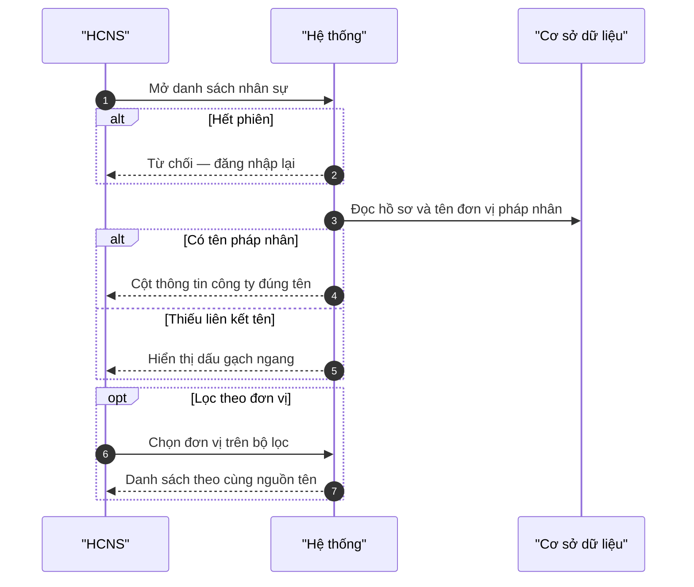
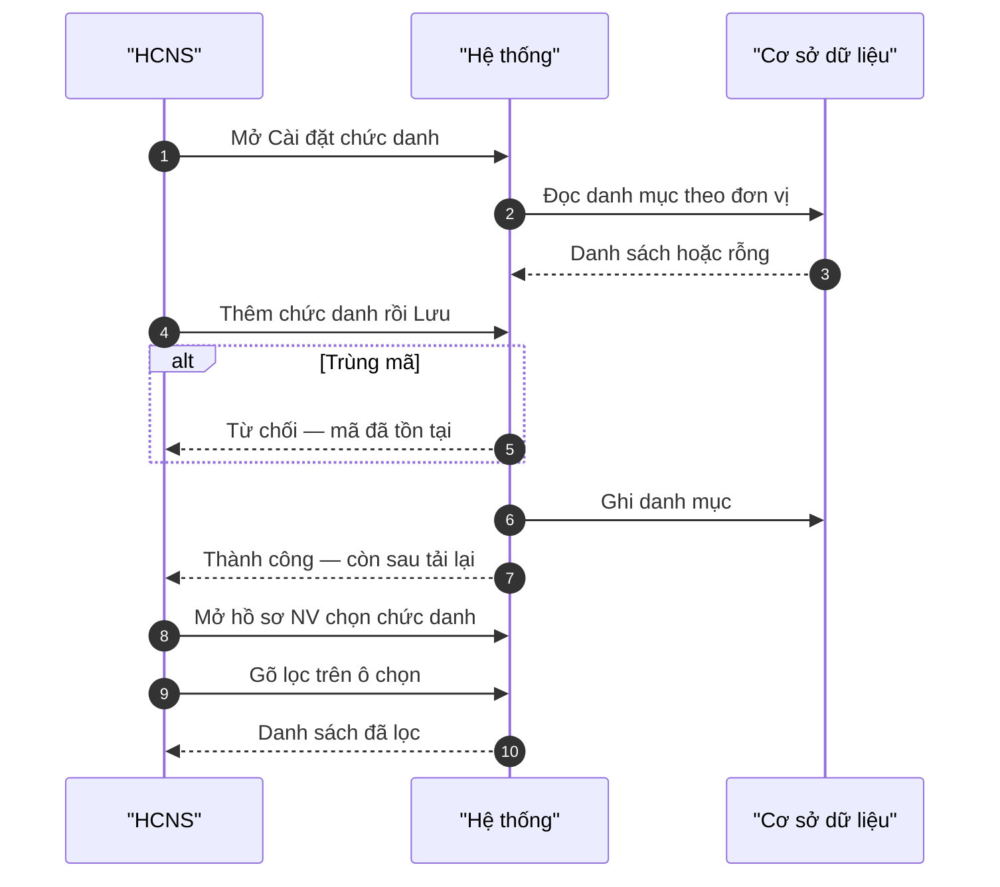
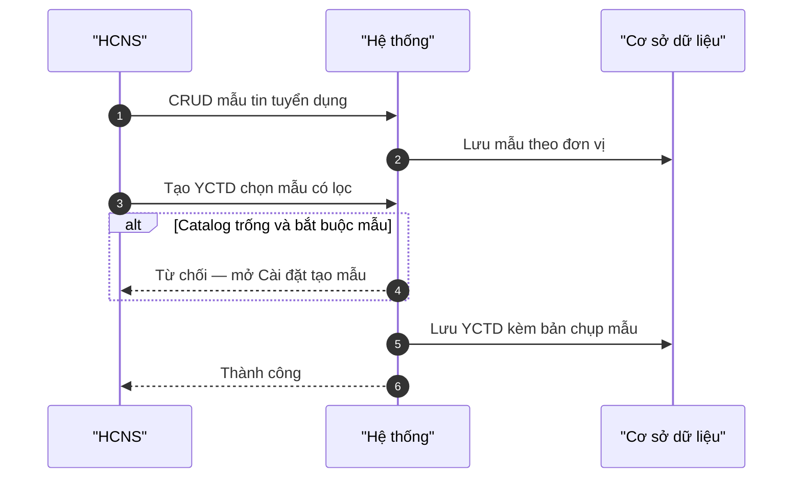
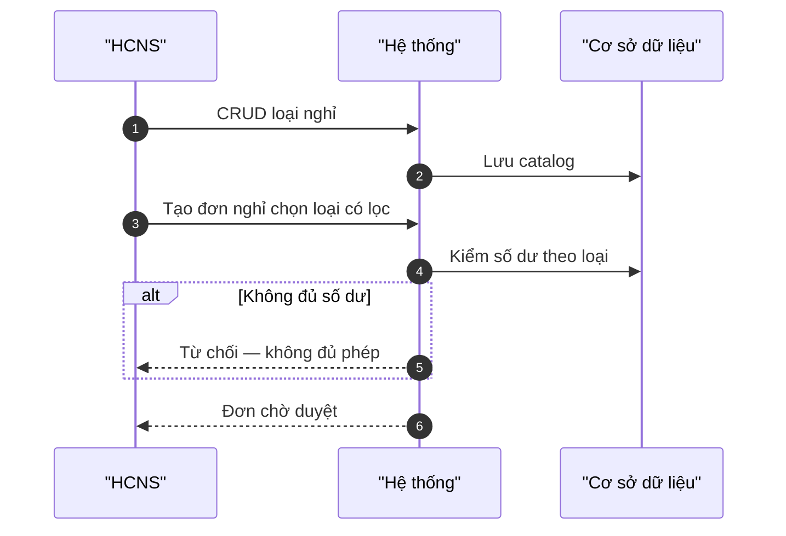
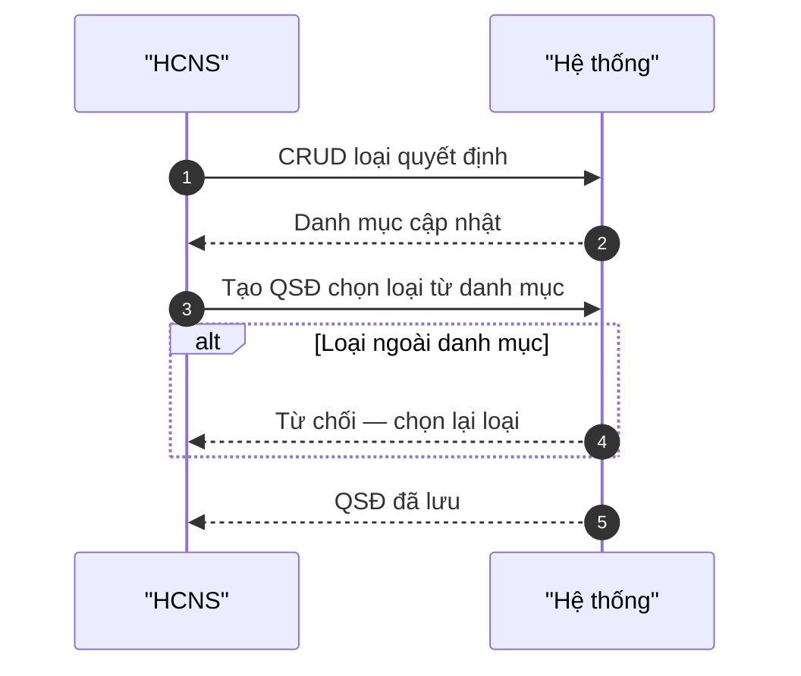
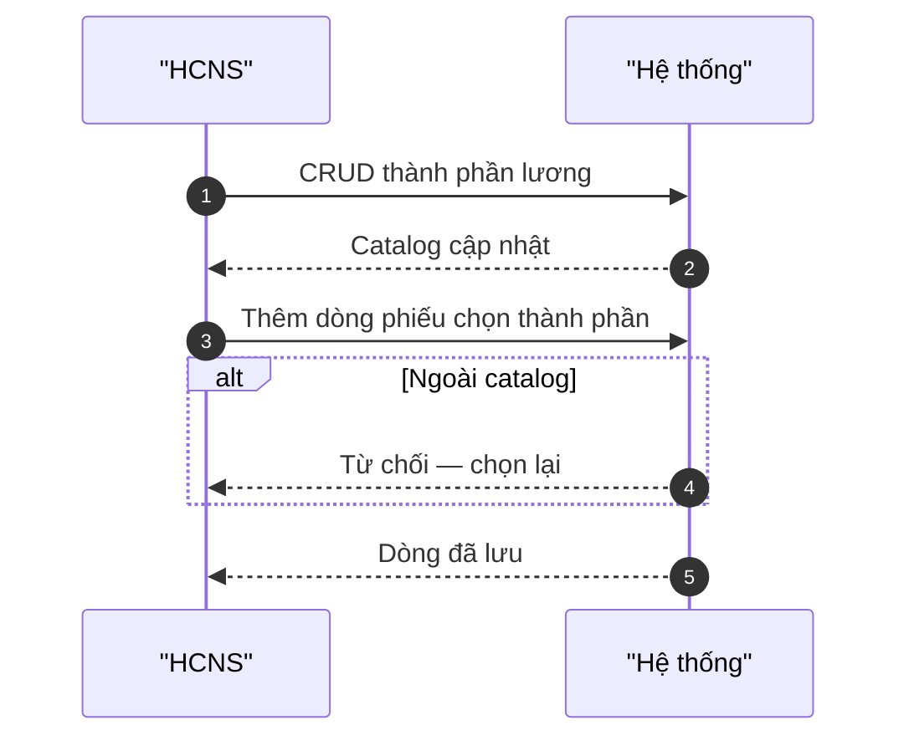
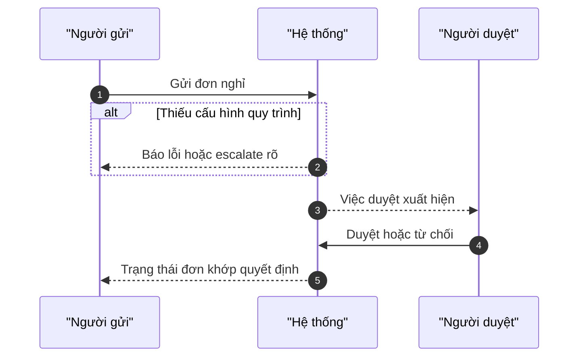
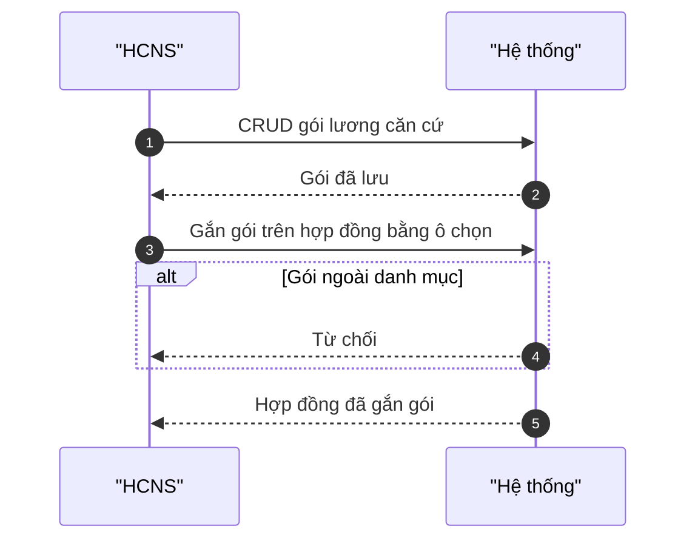

# SRS Nhân sự — Bổ sung Cài đặt danh mục & nhãn đơn vị (bản khách)

| Mục | Giá trị |
|-----|---------|
| Tên tài liệu | Bổ sung yêu cầu phần mềm — Cài đặt danh mục Nhân sự và nhãn đơn vị |
| Phiên bản | 3.1-W2e-delta |
| Trạng thái | Chính thức (bổ sung ADD — không thay FR đã khóa) |
| Gắn với | SRS — Phân hệ Nhân sự (bản khách) phiên bản 3.0-W2d trở lên |
| Tham chiếu BRD | BRD — Phân hệ Nhân sự phiên bản 3.0 |

> Tài liệu này **bổ sung** thân FR cho các yêu cầu Cài đặt (CRUD danh mục), ô chọn có tìm kiếm, nhãn cột công ty, và các chức năng còn thiếu trên bản khách trước đó. Không rút / đè các FR đã khóa trên SRS Nhân sự bản khách.

---

## 0. Bản đồ FR bổ sung (inventory nghiệm thu)

| Nhóm | Mã FR | Tóm tắt | Thân FR trong tài liệu này |
|------|-------|---------|----------------------------|
| Nhãn đơn vị | **FR-HRM-EMP-COL-01** | Cột «Thông tin công ty» = tên pháp nhân / đơn vị thành viên | Đủ 7 mục |
| Cài đặt | **FR-HRM-SC-POS-01** | CRUD chức danh / phòng ban theo đơn vị | Đủ 7 mục |
| Cài đặt | **FR-HRM-SC-JT-01** | CRUD mẫu tin tuyển dụng (JD) | Đủ 7 mục |
| Cài đặt | **FR-HRM-SC-LEAVE-01** | CRUD loại nghỉ + số dư theo loại | Đủ 7 mục |
| Cài đặt | **FR-HRM-SC-DEC-01** | CRUD loại quyết định nhân sự | Đủ 7 mục |
| Cài đặt | **FR-HRM-SC-PAY-01** | CRUD thành phần lương | Đủ 7 mục |
| Cầu nối duyệt | **FR-HRM-AT-WF-01** | Đơn nghỉ gắn quy trình duyệt tập trung | Đủ 7 mục |
| Hợp đồng / lương | **FR-HRM-CI-PKG-01** | Gói lương căn cứ | Đủ 7 mục |
| Leftover | FR-HRM-MOB-OU-01 · ADV-01 · OT-01 · EA-01 · FL-02 · IM-02 · IM-03 · 20-CHART-01 · 20-BAND-01 · OP-STATUS-01 · RC-IV-01 · MOB-HUB-01 · SCOPE-UUID-01 · SC-WF-GATE-01 · SC-EXT-01 | Mục tiêu + tiêu chí chấp nhận | Inventory §8 (đủ nghiệm thu đợt; thân 7 mục đợt sau) |

**Quy tắc áp dụng mọi ô chọn danh mục:** BR-HRM-MD-01 · AC-HRM-PICKER-01 (mục 0.1).

**Không** tuyên bố toàn bộ catalog 120 use case / Phase 1 đã đóng — chỉ khóa bổ sung W2e-delta.

---

## 0.1 Quy tắc chung — nguồn danh mục và ô chọn

### BR-HRM-MD-01 — Nguồn sự thật danh mục

| Điều kiện | Hành động | Kết quả |
|-----------|-----------|---------|
| Trường là chức danh, vị trí–mẫu tin tuyển dụng, loại nghỉ, loại quyết định, thành phần lương, hoặc trường chọn từ danh mục | Giá trị phải thuộc danh mục Cài đặt Nhân sự (đã đồng bộ hoặc đã tạo tại đơn vị theo FR Cài đặt) | Không lưu chuỗi tự gõ ngoài danh mục làm nguồn sự thật |
| Danh mục trống | Form hiện empty + hướng dẫn mở Cài đặt / đồng bộ | Không cho Lưu với giá trị tự tạo ngoài danh mục |
| Người dùng gõ trên ô chọn | Danh sách lọc theo mã hoặc tên | Không thay bằng ô nhập chữ thuần khi danh sách dài |

### AC-HRM-PICKER-01 — Ô chọn có tìm kiếm

| Đạt | Không đạt |
|-----|-----------|
| Mở danh sách → gõ ít nhất một ký tự → danh sách lọc theo mã/tên; chọn mục → lưu mã hoặc khóa danh mục | Lưu chuỗi không thuộc danh mục; ô không lọc khi danh sách trên mười mục |

---

## 1. FR-HRM-EMP-COL-01 — Nhãn cột «Thông tin công ty» trên danh sách nhân sự

| Thuộc tính | Mô tả |
|------------|--------|
| Actor | Lãnh đạo tập đoàn / HCNS xem danh sách nhân sự nhúng |
| Ưu tiên | Cao |
| Điều kiện tiên quyết | Đã đăng nhập; có quyền xem danh sách nhân sự; FR-HRM-21 đang dùng |
| Điều kiện hậu | Cột và bộ lọc mang tiêu đề công ty / thông tin công ty hiển thị **tên pháp nhân hoặc đơn vị thành viên** — không nhầm với nhãn khối vận hành |
| Mã UC | Mở rộng UC-HRM-21 / FR-HRM-21 |
| Liên hệ phần mềm hiện tại | Đã có danh sách nhúng — bổ sung khóa nhãn |

**Dữ liệu đầu vào**

| Trường | Bắt buộc | Ràng buộc / kiểm tra |
|--------|----------|----------------------|
| Phạm vi phiên | Có | Theo FR-HRM-SCOPE-* |
| Bộ lọc đơn vị (nếu có) | Không | Cùng nguồn tên với cột công ty |

**Luồng chính**

1. Người dùng mở danh sách nhân sự trên cổng điều hành.
2. Hệ thống hiện cột «Thông tin công ty» (hoặc tiêu đề tương đương) với tên pháp nhân / đơn vị thành viên.
3. Người dùng lọc theo đơn vị → tùy chọn lọc dùng cùng nguồn tên.
4. Thiếu liên kết tên pháp nhân → ô hiển thị dấu gạch ngang trung thực; không thay bằng nhãn khối vận hành.

**Quy tắc nghiệp vụ**

- BR-EMP-COL-01: Tiêu đề «công ty / thông tin công ty» chỉ gắn tên pháp nhân hoặc đơn vị thành viên.
- BR-EMP-COL-02: Không có liên kết tên → hiển thị «—»; cấm che bằng nhãn khối.
- BR-EMP-COL-03: Biểu đồ hoặc bộ lọc theo đơn vị vận hành (nếu có) phải dùng nhãn tách biệt, không ghi đè cột công ty.

**Sơ đồ tương tác**

**Diễn biến nghiệp vụ**

| # | Tương tác | Điều kiện / quy tắc | Kết quả hoặc lỗi |
|---|-----------|---------------------|------------------|
| 1 | Mở danh sách | Có quyền | Bảng hiện cột công ty |
| 2 | Resolve tên | Có liên kết pháp nhân | Tên đúng đơn vị thành viên |
| 3 | Thiếu liên kết | Không map được | «—» — không nhãn khối |
| 4 | Lọc đơn vị | Tập đoàn | Tùy chọn cùng nguồn tên |
| 5 | Thành công | List và lọc khớp | Kết quả trả về |

**Kết quả trả về khi thành công**

| Ý | Nội dung |
|---|----------|
| Người dùng thấy | Cột / lọc công ty đúng tên pháp nhân hoặc ĐVTV |
| Bản ghi tạo / cập nhật | Không — chỉ hiển thị |
| Khóa mang sang bước sau | Đơn vị đang lọc |
| Trạng thái sau | Đang xem danh sách đúng nhãn |
| Việc được mở khóa tiếp | Chi tiết hồ sơ; thao tác sâu trên ứng dụng Nhân sự |

**Tiêu chí chấp nhận:** AC-EMP-COL-01..07 (đã khóa trên đợt nhãn cột công ty) — cột và lọc không hiện nhãn khối khi tiêu đề nói «công ty».

---

## 2. FR-HRM-SC-POS-01 — Quản trị chức danh và phòng ban theo đơn vị

| Thuộc tính | Mô tả |
|------------|--------|
| Actor | HCNS / quản trị cấu hình |
| Ưu tiên | Cao |
| Điều kiện tiên quyết | Đã đăng nhập; có quyền Cài đặt danh mục; đơn vị đang làm việc xác định |
| Điều kiện hậu | Danh mục chức danh / phòng ban hiệu lực theo đơn vị; form hồ sơ và tuyển dụng chọn bằng ô lọc có tìm kiếm |
| Mã UC | HRM-SC-POS (bổ sung HRM-SC-01) |
| Liên hệ phần mềm hiện tại | Một phần đồng bộ danh mục — bổ sung CRUD / mở rộng theo đơn vị |

**Dữ liệu đầu vào**

| Trường | Bắt buộc | Ràng buộc / kiểm tra |
|--------|----------|----------------------|
| Đơn vị | Có | Trong phạm vi phiên |
| Mã chức danh / phòng ban | Có (khi tạo) | Duy nhất trong đơn vị |
| Tên tiếng Việt | Có | Không rỗng |
| Trạng thái hiệu lực | Có | Đang dùng / ngưng |

**Luồng chính**

1. Người dùng mở Cài đặt → Chức danh hoặc Phòng ban.
2. Thêm / sửa / ngưng hiệu lực theo đơn vị → Lưu → tải lại trang vẫn còn.
3. Đồng bộ từ điều hành tập đoàn (khi có) → bản đơn vị không được đè master bị cấm chính sách.
4. Trên hồ sơ nhân viên / yêu cầu tuyển dụng: mở ô Chức danh → gõ lọc → chọn mã danh mục.

**Quy tắc nghiệp vụ**

- BR-HRM-MD-01 + AC-HRM-PICKER-01.
- Trùng mã trong cùng đơn vị → từ chối.
- Đang gắn nhân viên → ưu tiên ngưng dùng, không xóa cứng làm mất lịch sử.
- Ngoài phạm vi đơn vị → không xem / sửa danh mục đơn vị khác.

**Sơ đồ tương tác**

**Diễn biến nghiệp vụ**

| # | Tương tác | Điều kiện / quy tắc | Kết quả hoặc lỗi |
|---|-----------|---------------------|------------------|
| 1 | Mở Cài đặt | Có quyền | List theo đơn vị hoặc empty |
| 2 | Thêm / sửa | Mã duy nhất | Lưu thành công |
| 3 | Trùng mã | Cùng đơn vị | Từ chối |
| 4 | Ngưng khi đang gắn | Có NV | Ngưng dùng — không xóa cứng |
| 5 | Picker hồ sơ | AC-HRM-PICKER-01 | Chọn mã danh mục |
| 6 | Danh mục rỗng | Chưa cấu hình | Chặn hoặc empty + hướng dẫn Cài đặt |
| 7 | Thành công | F5 còn | Kết quả trả về |

**Kết quả trả về khi thành công**

| Ý | Nội dung |
|---|----------|
| Người dùng thấy | Danh mục chức danh / phòng ban đúng đơn vị; ô chọn trên form lọc được |
| Bản ghi tạo / cập nhật | Dòng danh mục theo đơn vị |
| Khóa mang sang bước sau | Mã chức danh / phòng ban |
| Trạng thái sau | Danh mục sẵn sàng cho hồ sơ và tuyển dụng |
| Việc được mở khóa tiếp | FR-HRM-EM-01 · FR-HRM-RC-01 · FR-HRM-SC-JT-01 |

**Tiêu chí chấp nhận**

| ID | Đạt | Không đạt |
|----|-----|-----------|
| AC-SC-POS-01 | CRUD Cài đặt + tải lại còn | Chỉ danh sách cứng không quản trị được |
| AC-SC-POS-02 | Form hồ sơ chọn bằng ô lọc | Ô chữ tự do lưu ngoài danh mục |
| AC-SC-POS-03 | Đổi đơn vị → danh mục đúng partition | Lộ danh mục đơn vị khác |

---

## 3. FR-HRM-SC-JT-01 — Quản trị mẫu tin tuyển dụng

| Thuộc tính | Mô tả |
|------------|--------|
| Actor | HCNS tuyển dụng / quản trị cấu hình |
| Ưu tiên | Cao |
| Điều kiện tiên quyết | Có quyền thư viện mẫu tin; đơn vị xác định |
| Điều kiện hậu | Mẫu JD theo đơn vị; tạo yêu cầu tuyển dụng chọn mẫu bằng ô lọc; sửa mẫu sau không đổi bản đã gắn trên yêu cầu cũ |
| Mã UC | UC-HRM-RC-07 (thư viện JD) |
| Liên hệ phần mềm hiện tại | Bổ sung — thư viện mẫu theo đơn vị |

**Dữ liệu đầu vào**

| Trường | Bắt buộc | Ràng buộc / kiểm tra |
|--------|----------|----------------------|
| Mã mẫu | Có | Duy nhất trong đơn vị |
| Tiêu đề | Có | Không rỗng |
| Mô tả / nội dung JD | Theo form | Độ dài hợp lệ |
| Chức danh gắn (nếu có) | Không | Thuộc FR-HRM-SC-POS-01 |

**Luồng chính**

1. Mở Cài đặt hoặc thư viện tuyển dụng → CRUD mẫu.
2. Tạo yêu cầu tuyển dụng → chọn mẫu bằng ô lọc có tìm kiếm.
3. Hệ thống chụp nội dung mẫu vào yêu cầu tại thời điểm chọn.
4. Sửa mẫu trên Cài đặt sau đó → yêu cầu đã tạo giữ bản đã chụp.

**Quy tắc nghiệp vụ**

- Ownership theo đơn vị (CRUD local) — không tự ý coi bản tự gõ trên form yêu cầu là nguồn sự thật thay mẫu.
- Xóa mẫu không làm mất snapshot trên yêu cầu đã gắn.
- Empty «Chưa có mẫu» trung thực khi chưa tạo.

**Sơ đồ tương tác**

**Diễn biến nghiệp vụ**

| # | Tương tác | Điều kiện / quy tắc | Kết quả hoặc lỗi |
|---|-----------|---------------------|------------------|
| 1 | CRUD mẫu | Trong đơn vị | Persist |
| 2 | Chọn mẫu trên YCTD | AC-HRM-PICKER-01 | Snapshot vào yêu cầu |
| 3 | Sửa mẫu sau | Đã có YCTD gắn | YCTD cũ không đổi nội dung đã chụp |
| 4 | Empty bắt buộc | Policy bắt buộc | Chặn + hướng dẫn |
| 5 | Thành công | F5 còn | Kết quả trả về |

**Kết quả trả về khi thành công**

| Ý | Nội dung |
|---|----------|
| Người dùng thấy | Mẫu trong thư viện; YCTD có nội dung từ mẫu đã chọn |
| Bản ghi tạo / cập nhật | Mẫu JD; (khi dùng) yêu cầu tuyển dụng |
| Khóa mang sang bước sau | Mã mẫu; mã yêu cầu |
| Trạng thái sau | Thư viện sẵn sàng |
| Việc được mở khóa tiếp | FR-HRM-RC-01 · vòng đời ứng viên |

**Tiêu chí chấp nhận:** AC-SC-JT-01 (CRUD) · AC-HRM-PICKER-01 trên form YCTD · snapshot không retroactive.

---

## 4. FR-HRM-SC-LEAVE-01 — Quản trị loại nghỉ và số dư theo loại

| Thuộc tính | Mô tả |
|------------|--------|
| Actor | HCNS / quản trị cấu hình |
| Ưu tiên | Cao |
| Điều kiện tiên quyết | Có quyền Cài đặt loại nghỉ |
| Điều kiện hậu | Loại nghỉ hiệu lực; đơn nghỉ chọn loại bằng ô lọc; số dư theo loại và năm (khi theo dõi) |
| Mã UC | Mở rộng HRM-AT-10 |
| Liên hệ phần mềm hiện tại | Đã có đơn nghỉ — bổ sung catalog loại + số dư |

**Dữ liệu đầu vào**

| Trường | Bắt buộc | Ràng buộc / kiểm tra |
|--------|----------|----------------------|
| Mã loại nghỉ | Có | Duy nhất trong phạm vi cấu hình |
| Tên tiếng Việt | Có | Không rỗng |
| Màu / nhãn biểu đồ (nếu có) | Không | Theo cấu hình hiển thị |
| Cho phép âm dư | Theo chính sách | Có / không |

**Luồng chính**

1. Cài đặt → CRUD loại nghỉ → Lưu.
2. Tạo đơn nghỉ → chọn loại bằng ô lọc có tìm kiếm.
3. Xem số dư theo loại và nhân viên (khi hệ thống theo dõi).
4. Loại ngưng hiệu lực → không chọn được trên đơn mới.

**Quy tắc nghiệp vụ**

- BR-HRM-MD-01 + AC-HRM-PICKER-01 trên form đơn nghỉ.
- Không mặc định ẩn một loại nghỉ không có trong danh mục Cài đặt.
- Số dư không gộp sai giữa các loại.

**Sơ đồ tương tác**

**Diễn biến nghiệp vụ**

| # | Tương tác | Điều kiện / quy tắc | Kết quả hoặc lỗi |
|---|-----------|---------------------|------------------|
| 1 | CRUD loại | Có quyền | Persist |
| 2 | Picker đơn nghỉ | AC-HRM-PICKER-01 | Chọn mã loại |
| 3 | Xem số dư | Theo dõi bật | Đúng loại + năm |
| 4 | Loại ngưng | Form mới | Không chọn được |
| 5 | Thành công | F5 còn | Kết quả trả về |

**Kết quả trả về khi thành công**

| Ý | Nội dung |
|---|----------|
| Người dùng thấy | Loại nghỉ trên Cài đặt và trên form đơn |
| Bản ghi tạo / cập nhật | Dòng loại nghỉ; (khi gửi đơn) đơn nghỉ |
| Khóa mang sang bước sau | Mã loại nghỉ |
| Trạng thái sau | Catalog sẵn sàng |
| Việc được mở khóa tiếp | FR-HRM-AT-10 · FR-HRM-AT-WF-01 |

**Tiêu chí chấp nhận:** AC-SC-LEAVE-01..03.

---

## 5. FR-HRM-SC-DEC-01 — Quản trị loại quyết định nhân sự

| Thuộc tính | Mô tả |
|------------|--------|
| Actor | HCNS / quản trị cấu hình |
| Ưu tiên | Cao |
| Điều kiện tiên quyết | Có quyền Cài đặt loại quyết định |
| Điều kiện hậu | Loại QSĐ thuộc danh mục; form tạo và tab lọc chỉ dùng mã danh mục |
| Mã UC | Mở rộng UC-HRM-27 / FR-HRM-27 |
| Liên hệ phần mềm hiện tại | Đã có QSĐ nhúng — bổ sung catalog loại |

**Dữ liệu đầu vào**

| Trường | Bắt buộc | Ràng buộc / kiểm tra |
|--------|----------|----------------------|
| Mã loại | Có | Duy nhất trong phạm vi |
| Tên tiếng Việt | Có | Ví dụ bổ nhiệm, thuyên chuyển, kỷ luật, thôi việc… |
| Hiệu lực | Có | Đang dùng / ngưng |

**Luồng chính**

1. Cài đặt → CRUD loại quyết định.
2. Tạo QSĐ → chọn loại từ danh mục (ô lọc nếu danh sách dài).
3. Tab / bộ lọc danh sách QSĐ khớp mã catalog.

**Quy tắc nghiệp vụ**

- Cấm lưu loại tự do ngoài danh mục.
- Cấm mặc định một loại không có trong Cài đặt.

**Sơ đồ tương tác**

**Diễn biến nghiệp vụ**

| # | Tương tác | Điều kiện / quy tắc | Kết quả hoặc lỗi |
|---|-----------|---------------------|------------------|
| 1 | CRUD loại | Có quyền | Persist |
| 2 | Tạo QSĐ | Chọn từ catalog | Lưu mã loại |
| 3 | Loại lạ | Ngoài danh mục | Từ chối |
| 4 | Lọc tab | Khớp mã | Đúng nhóm |
| 5 | Thành công | F5 còn | Kết quả trả về |

**Kết quả trả về khi thành công**

| Ý | Nội dung |
|---|----------|
| Người dùng thấy | Loại trên Cài đặt và trên form QSĐ |
| Bản ghi tạo / cập nhật | Dòng loại; (khi tạo) quyết định |
| Khóa mang sang bước sau | Mã loại quyết định |
| Trạng thái sau | Catalog sẵn sàng |
| Việc được mở khóa tiếp | FR-HRM-27 |

**Tiêu chí chấp nhận:** AC-SC-DEC-01..03.

---

## 6. FR-HRM-SC-PAY-01 — Quản trị thành phần lương

| Thuộc tính | Mô tả |
|------------|--------|
| Actor | HCNS lương / quản trị cấu hình |
| Ưu tiên | Cao |
| Điều kiện tiên quyết | Có quyền Cài đặt thành phần lương |
| Điều kiện hậu | Thành phần (lương / phụ cấp / khấu trừ…) thuộc danh mục; phiếu / cơ cấu chọn bằng ô lọc |
| Mã UC | Bổ sung UC-HRM-28 / phiếu lương |
| Liên hệ phần mềm hiện tại | Bổ sung catalog thành phần |

**Dữ liệu đầu vào**

| Trường | Bắt buộc | Ràng buộc / kiểm tra |
|--------|----------|----------------------|
| Mã thành phần | Có | Duy nhất trong phạm vi |
| Tên tiếng Việt | Có | Không rỗng |
| Nhóm tính chất | Có | Lương / phụ cấp / khấu trừ… theo danh mục chuẩn |

**Luồng chính**

1. Cài đặt → CRUD thành phần lương.
2. Trên cơ cấu / phiếu lương → chọn thành phần bằng ô lọc.
3. Thành phần không thuộc danh mục → từ chối dòng.

**Quy tắc nghiệp vụ**

- BR-HRM-MD-01 + AC-HRM-PICKER-01.
- Không mặc định ẩn một tên thành phần không có trong Cài đặt.

**Sơ đồ tương tác**

**Diễn biến nghiệp vụ**

| # | Tương tác | Điều kiện / quy tắc | Kết quả hoặc lỗi |
|---|-----------|---------------------|------------------|
| 1 | CRUD | Có quyền | Persist |
| 2 | Picker phiếu | AC-HRM-PICKER-01 | Lưu mã thành phần |
| 3 | Ngoài catalog | Validation | Từ chối rõ |
| 4 | Thành công | F5 còn | Kết quả trả về |

**Kết quả trả về khi thành công**

| Ý | Nội dung |
|---|----------|
| Người dùng thấy | Thành phần trên Cài đặt và trên phiếu / cơ cấu |
| Bản ghi tạo / cập nhật | Dòng thành phần; dòng phiếu khi dùng |
| Khóa mang sang bước sau | Mã thành phần |
| Trạng thái sau | Catalog sẵn sàng |
| Việc được mở khóa tiếp | FR-HRM-PR-05 · cơ cấu lương |

**Tiêu chí chấp nhận:** AC-SC-PAY-01..03.

---

## 7. FR-HRM-AT-WF-01 — Cầu nối đơn nghỉ với quy trình duyệt tập trung

| Thuộc tính | Mô tả |
|------------|--------|
| Actor | Người gửi đơn; người duyệt trên hộp việc / Nhân sự |
| Ưu tiên | Cao |
| Điều kiện tiên quyết | FR-HRM-AT-10; quy trình nghỉ đã cấu hình hiệu lực cho đơn vị (khi bắt buộc duyệt theo quy trình) |
| Điều kiện hậu | Sau gửi đơn có việc duyệt tương ứng (hoặc thông báo lỗi rõ nếu thiếu cấu hình); duyệt / từ chối cuối cập nhật trạng thái đơn nghỉ khớp |
| Mã UC | Mở rộng HRM-AT-10 / AT-12 / AT-13 |
| Liên hệ phần mềm hiện tại | Đã có tạo / duyệt đơn — bổ sung bước cầu nối quy trình |

**Dữ liệu đầu vào**

| Trường | Bắt buộc | Ràng buộc / kiểm tra |
|--------|----------|----------------------|
| Đơn nghỉ hợp lệ | Có | Theo FR-HRM-AT-10 |
| Đơn vị của hồ sơ | Có | Để chọn đúng định nghĩa quy trình |

**Luồng chính**

1. Người dùng gửi đơn nghỉ thành công trên giao diện.
2. Hệ thống mở việc duyệt theo quy trình nghỉ của đơn vị (khi cấu hình bật).
3. Người duyệt phê duyệt hoặc từ chối trên hộp việc / màn Nhân sự.
4. Trạng thái đơn nghỉ cập nhật khớp quyết định cuối; người gửi được thông báo (khi bật).

**Quy tắc nghiệp vụ**

- Không coi «đã duyệt» trên đơn nghỉ nếu bước quy trình cuối chưa thành công.
- Thiếu định nghĩa quy trình / không resolve được người duyệt → báo lỗi hoặc escalate rõ — không im lặng.
- Từ chối quy trình → đơn nghỉ từ chối + thông báo.

**Sơ đồ tương tác**

**Diễn biến nghiệp vụ**

| # | Tương tác | Điều kiện / quy tắc | Kết quả hoặc lỗi |
|---|-----------|---------------------|------------------|
| 1 | Gửi đơn | FR-HRM-AT-10 OK | Đơn tạo |
| 2 | Mở việc duyệt | Quy trình hiệu lực | Có việc trên hộp |
| 3 | Thiếu cấu hình | Resolve rỗng | Lỗi / escalate rõ |
| 4 | Duyệt cuối | Hợp lệ | Đơn đã duyệt + phản ánh công |
| 5 | Từ chối | Hợp lệ | Đơn từ chối + thông báo |
| 6 | Thành công | Tải lại còn | Kết quả trả về |

**Kết quả trả về khi thành công**

| Ý | Nội dung |
|---|----------|
| Người dùng thấy | Đơn và việc duyệt cùng chuỗi; trạng thái khớp |
| Bản ghi tạo / cập nhật | Đơn nghỉ; instance / việc duyệt |
| Khóa mang sang bước sau | Mã đơn; mã việc duyệt |
| Trạng thái sau | Chờ duyệt / đã duyệt / từ chối |
| Việc được mở khóa tiếp | Lưới công; số dư phép |

**Tiêu chí chấp nhận:** AC-AT-WF-01..03.

---

## 8. FR-HRM-CI-PKG-01 — Quản trị gói lương căn cứ

| Thuộc tính | Mô tả |
|------------|--------|
| Actor | HCNS hợp đồng / lương |
| Ưu tiên | Trung bình |
| Điều kiện tiên quyết | Có quyền quản trị gói lương theo đơn vị |
| Điều kiện hậu | Gói lương căn cứ tách khỏi mức ghi trên hợp đồng; gắn hồ sơ / hợp đồng bằng ô chọn danh mục |
| Mã UC | Bổ sung hợp đồng / hồ sơ lương |
| Liên hệ phần mềm hiện tại | Bổ sung |

**Dữ liệu đầu vào**

| Trường | Bắt buộc | Ràng buộc / kiểm tra |
|--------|----------|----------------------|
| Mã gói | Có | Duy nhất trong đơn vị |
| Tên gói | Có | Không rỗng |
| Thành phần / mức (theo form) | Theo cấu hình | Số tiền nhóm nghìn |

**Luồng chính**

1. CRUD gói trên Cài đặt / module hợp đồng–lương.
2. Form hợp đồng hoặc hồ sơ chọn gói bằng ô lọc.
3. Trùng mã → từ chối; xóa gói đang gắn → chặn hoặc gỡ gắn rõ ràng.

**Quy tắc nghiệp vụ**

- Cấm free-text tên gói làm nguồn sự thật.
- AC-HRM-PICKER-01 khi gắn.

**Sơ đồ tương tác**

**Diễn biến nghiệp vụ**

| # | Tương tác | Điều kiện / quy tắc | Kết quả hoặc lỗi |
|---|-----------|---------------------|------------------|
| 1 | CRUD gói | Trong đơn vị | Persist |
| 2 | Gắn picker | AC-HRM-PICKER-01 | Lưu khóa gói |
| 3 | Trùng mã | Cùng đơn vị | Từ chối |
| 4 | Xóa đang gắn | Policy | Chặn hoặc detach rõ |
| 5 | Thành công | F5 còn | Kết quả trả về |

**Kết quả trả về khi thành công**

| Ý | Nội dung |
|---|----------|
| Người dùng thấy | Gói trên Cài đặt; gắn trên HĐ / hồ sơ |
| Bản ghi tạo / cập nhật | Gói; liên kết hồ sơ/HĐ |
| Khóa mang sang bước sau | Mã gói |
| Trạng thái sau | Gói sẵn sàng |
| Việc được mở khóa tiếp | FR-HRM-CI-01 · phiếu lương |

**Tiêu chí chấp nhận:** AC-CI-PKG-01..02.

---

## 9. Inventory leftover (đủ nghiệm thu đợt — thân 7 mục đợt sau)

| Mã FR | Mục tiêu nghiệp vụ | Tiêu chí chấp nhận (tóm tắt) |
|-------|--------------------|------------------------------|
| **FR-HRM-MOB-OU-01** | Bộ lọc đơn vị trên di động: nhãn «công ty» khớp pháp nhân; tách rõ nếu lọc theo đơn vị vận hành | AC-MOB-OU-01..02 |
| **FR-HRM-ADV-01** | Đơn tạm ứng gắn nhân viên / đơn vị; loại chi phí từ danh mục | AC-ADV-01 — tạo từ giao diện + tải lại còn |
| **FR-HRM-OT-01** | Yêu cầu OT / công tác / đi muộn / đổi ca — duyệt/từ chối có nhánh | AC-OT-01 |
| **FR-HRM-EA-01** | Tài sản nhân viên; loại từ danh mục | AC-EA-01 |
| **FR-HRM-FL-02** | Bộ trường hồ sơ xe quản trị trên Cài đặt / đồng bộ — không chỉ nhãn cứng | AC-FL-02-01..02 |
| **FR-HRM-IM-02** | Cột tệp import khớp bảng trường danh mục | AC-IM-02-01..02 |
| **FR-HRM-IM-03** | Alias tiêu đề cột tiếng Việt trên mẫu import/export | AC-IM-03-01..02 |
| **FR-HRM-20-CHART-01** | Biểu đồ nghỉ lấy nhãn/màu từ loại nghỉ Cài đặt; tháng theo ngày/tháng/năm Việt | AC-20-CHART-01..02 |
| **FR-HRM-20-BAND-01** | Ngưỡng band lương trên tổng hợp là cấu hình — không bí mật trong mã | AC-20-BAND-01..02 |
| **FR-HRM-OP-STATUS-01** | Trạng thái và độ ưu tiên công việc vận hành khóa trong FR + nhãn Việt | AC-OP-01..02 (bổ sung FR-HRM-OP-01..03 đã có) |
| **FR-HRM-RC-IV-01** | Máy trạng thái phỏng vấn: đã lên lịch → đạt / không đạt / hủy | AC-RC-IV-01..03 |
| **FR-HRM-MOB-HUB-01** | Trang chủ di động: sinh nhật / đang nghỉ / giới hạn dòng / múi giờ mặc định Việt Nam | AC-MOB-HUB-01..03 |
| **FR-HRM-SCOPE-UUID-01** | Định danh đơn vị vận hành khớp bản tổ chức điều hành — không phụ thuộc mã gắn cứng gửi khách | AC-SCOPE-UUID-01..02 |
| **FR-HRM-SC-WF-GATE-01** | Cấu hình đơn vị nào được tự mở quy trình khi đổi danh mục | AC-SC-WF-GATE-01..02 |
| **FR-HRM-SC-EXT-01** | Yêu cầu mở rộng danh mục → duyệt → hiệu lực trên Cài đặt | AC-SC-EXT-01..03 |

---

## 10. Đối chiếu bản đội ngũ ↔ bản khách (dual-doc)

| Bản | Vai trò | Nội dung liên quan |
|-----|---------|-------------------|
| **SRS — Phân hệ Nhân sự (bản khách)** | Gốc gửi đối tác | Spine FR W1–W2d + con trỏ W2e-delta |
| **Tài liệu này (delta khách)** | Bổ sung thân FR Cài đặt / nhãn / cầu nối nghỉ | Mục 0–9 |
| **SRS đội ngũ phân hệ Nhân sự — mục Orphan lock** | Nội bộ triển khai | Khóa FR cùng mã; chi tiết kỹ thuật / AC evidence |

Chỉnh bản khách (tài liệu này + SRS Nhân sự bản khách) trước; bản đội ngũ chỉ đồng bộ mã FR và con trỏ — không đảo SoT.

---

## 11. Ràng buộc đợt bổ sung

1. ADD-only: không giảm AC đã khóa (kể cả bảng chấm công).
2. Mọi ô chọn danh mục trên form nghiệp vụ tuân AC-HRM-PICKER-01.
3. Leftover §9 đủ để lập kế hoạch kiểm thử / thiết kế kỹ thuật; chưa đủ tuyên bố đóng catalog 120 use case.
4. HTML toàn bộ thân FR đợt này: tùy chọn khi generator phân hệ sẵn — nghiệm thu đợt lấy **markdown khách** làm nguồn.
