# SRS — Phân hệ điều hành tập đoàn (XBOS / Command Center)

| Mục | Giá trị |
|-----|---------|
| Tên tài liệu | Yêu cầu phần mềm — Điều hành tập đoàn |
| Phiên bản | 1.0-W2-CATALOG |
| Trạng thái | Chính thức (W1 spine 12 FR + W2 batch 4 FR) |
| Tham chiếu BRD | BRD — Điều hành tập đoàn phiên bản 1.0-W2 |

---

## 1. Giới thiệu

### 1.1 Mục đích

Đặc tả yêu cầu phần mềm phân hệ điều hành tập đoàn theo khung sáu chương, đủ để thiết kế kỹ thuật và kiểm thử nghiệp vụ cho **xương sống W1** và **batch W2**: RACI theo pháp nhân, ma trận phân quyền Settings, catalog văn bản/đo lường/giá, KPI rollup tập đoàn. Tài liệu dùng tiếng Việt nghiệp vụ; không thay thế catalog đầy đủ use case nền tảng — đợt này khóa **16 FR** (12 W1 + 4 W2).

### 1.2 Phạm vi

Trong phạm vi đã đặc tả FR: đăng nhập cổng; chọn tư cách đơn vị; phạm vi dữ liệu; danh sách đơn vị thành viên; hồ sơ pháp nhân và tài liệu; cổ đông; phòng ban; ma trận RACI theo pháp nhân; ma trận phân quyền Settings; catalog Command Center (văn bản / đo lường / giá) autosave; KPI rollup trên bảng điều hành; lưu sơ đồ quy trình; khởi tạo phiên; hoàn thành bước duyệt; khởi chạy và phê duyệt mở rộng danh mục Nhân sự.

Ngoài phạm vi đợt này: từ chối bước quy trình / danh mục; CAT phụ (mẫu, hộp thư chi tiết); WF phiên bản / chi tiết; toàn bộ danh mục logistics; ánh xạ RACI–phân hệ đầy đủ — bổ sung đợt sau; **không** rút FR / luồng nghiệm thu đã khóa.

### 1.3 Định nghĩa và thuật ngữ

| Thuật ngữ | Nghĩa |
|-----------|--------|
| Đơn vị / pháp nhân | Công ty hoặc pháp nhân người dùng đang làm việc trong phiên |
| Tư cách đơn vị | Quan hệ người dùng–đơn vị (vai trò / quyền) sau đăng nhập |
| Phạm vi dữ liệu | Tập bản ghi được phép xem/sửa theo tư cách và quyền |
| Phiên quy trình | Một lần chạy sơ đồ quy trình đã lưu, có các bước chờ duyệt |
| Danh mục dùng chung | Giá trị chuẩn (ví dụ chức danh) do điều hành tập đoàn phát hành xuống phân hệ |

### 1.4 Tài liệu tham chiếu

| Tài liệu | Nội dung |
|----------|----------|
| BRD — Điều hành tập đoàn | Yêu cầu-N và Quy tắc |
| Bảng tổng hợp use case XBOS | Catalog nền tảng |
| Quy tắc phạm vi dữ liệu toàn hệ | Áp dụng chung; không viết lại đầy đủ tại đây |

---

## 2. Mô tả tổng quan

### 2.1 Bối cảnh sản phẩm

Người dùng đăng nhập cổng điều hành, chọn tư cách đơn vị (nếu có nhiều), rồi quản trị tổ chức, quy trình và danh mục trong phạm vi được cấp. Phân hệ Nhân sự và phân hệ khác tiêu thụ danh mục / cấu hình đã phát hành — không tự làm chủ chuẩn tập đoàn.

### 2.2 Tác nhân

| Tác nhân | Mô tả |
|----------|--------|
| Lãnh đạo tập đoàn | Xem nhiều đơn vị theo quyền; duyệt quy trình / danh mục |
| Quản trị cấu hình | Sửa pháp nhân, cổ đông, phòng ban; thiết kế quy trình |
| Lãnh đạo đơn vị thành viên | Chỉ đơn vị mình; không rollup tập đoàn khi không được cấp |
| Hệ thống | Kiểm phiên, phạm vi, ghi nhận, cập nhật hộp thư |
| Phân hệ Nhân sự (ngoài) | Tiêu thụ danh mục sau duyệt / phát hành |

### 2.3 Ràng buộc

- Mọi thao tác đọc/ghi trong phạm vi tư cách đơn vị được cấp.
- Không bịa dữ liệu khi danh sách rỗng hợp lệ.
- Ngày trên giao diện: dạng ngày/tháng/năm; số tiền / vốn: nhóm nghìn theo chuẩn Việt Nam khi nhập số lớn.

### 2.4 Xương sống E2E (trước catalog FR)

Luồng chủ đạo bắt đầu khi **cần vận hành cấu hình tập đoàn / đơn vị trong ngày**, không bắt đầu bằng mô tả kỹ thuật token.

#### 2.4.1 Luồng chính theo ngày

| Bước | Việc tại điểm phục vụ | Khi nào | Kết quả |
|------|----------------------|---------|---------|
| 1 | Đăng nhập cổng | Bắt đầu ca làm việc | Vào không gian điều hành (hoặc màn chọn tư cách) |
| 2 | Chọn tư cách đơn vị | Có nhiều đơn vị / vai trò | Phiên gắn đúng đơn vị đang làm việc |
| 3 | Áp dụng phạm vi dữ liệu | Sau bước 2 | Chỉ thấy dữ liệu được phép |
| 4 | Xem danh sách đơn vị thành viên | Cần chọn pháp nhân | Có danh sách / cây trong phạm vi |
| 5 | Sửa hồ sơ pháp nhân / tài liệu | Cần cập nhật pháp lý | Hồ sơ đã lưu; tải lại còn |
| 6 | Thêm / sửa cổ đông | Cần cập nhật vốn góp | Dòng cổ đông trên danh sách |
| 7 | Thêm / sửa phòng ban | Cần cấu trúc tổ chức | Node phòng ban đã lưu |
| 7b | Sửa ô RACI theo pháp nhân | Cần phân vai trò R/A/C/I | Ô đã lưu; tải lại còn |
| 7c | Sửa ma trận phân quyền Settings | Cần quyền theo chức danh | Checkbox đã lưu; tải lại còn |
| 7d | Sửa catalog văn bản / đo lường / giá | Cần chuẩn CC | Ô autosave; tải lại còn |
| 7e | Xem KPI rollup tập đoàn | Cần chỉ số điều hành | Widget / bảng KPI trong phạm vi |
| 8 | Lưu sơ đồ quy trình | Cần chuẩn duyệt | Có phiên bản sơ đồ dùng được |
| 9 | Khởi tạo phiên + duyệt trên hộp thư | Có việc cần phê duyệt | Bước hoàn thành; trạng thái cập nhật |
| 10 | Khởi chạy & duyệt mở rộng danh mục | Cần chuẩn chức danh / DM HRM | Sau duyệt — sẵn sàng dùng ở Nhân sự |

#### 2.4.2 Phụ thuộc dữ liệu (khóa nối)

| Thực thể | Sinh khi nào | Phụ thuộc |
|----------|--------------|-----------|
| Phiên đăng nhập | Bước 1 | Tài khoản hợp lệ |
| Tư cách đơn vị đang chọn | Bước 2 | Danh sách tư cách của người dùng |
| Phạm vi lọc dữ liệu | Bước 3 | Tư cách + quyền |
| Pháp nhân / đơn vị | Bước 4–5 | Phạm vi tập đoàn hoặc đơn vị |
| Cổ đông / tài liệu | Bước 5–6 | Mã pháp nhân |
| Phòng ban | Bước 7 | Pháp nhân / đơn vị cha |
| Ô RACI / override pháp nhân | Bước 7b | Pháp nhân + catalog hoạt động |
| Ô phân quyền chức danh | Bước 7c | Tư cách + quyền Settings |
| Dòng catalog CC | Bước 7d | Phạm vi tập đoàn / đơn vị được cấp |
| Chỉ số KPI rollup | Bước 7e | Tư cách tập đoàn (member: không rollup ngoài quyền) |
| Sơ đồ quy trình | Bước 8 | Quyền thiết kế |
| Phiên chạy / bước duyệt | Bước 9 | Sơ đồ đã lưu + người được gán |
| Yêu cầu danh mục / bước duyệt DM | Bước 10 | Quyền governance + (thường) sơ đồ duyệt |

#### 2.4.3 Việc phát sinh (không thay luồng chủ đạo)

| Việc | Xuất phát từ | Ghi chú |
|------|--------------|---------|
| Từ chối bước duyệt | Bước đang chờ | Đợt sau |
| Ánh xạ RACI–phân hệ / gán chức danh đầy đủ | Tab RACI | Đợt sau (sau FR ma trận ô) |
| CAT / WF phụ (mẫu, phiên bản, từ chối) | Hộp thư / canvas | Đợt sau |
| Member không xem rollup | Bước 3 · 7e | Nhánh phủ định — FR phạm vi + FR KPI |

#### 2.4.4 Thứ tự chương FR (W1 + W2 batch — đúng nghiệp vụ)

| # | Nhóm | Vai trò trên E2E | Mã UC |
|---|------|------------------|-------|
| 1 | Đăng nhập | Bước 1 | UC-XBOS-AUTH-01 |
| 2 | Tư cách đơn vị | Bước 2 | UC-XBOS-TENANT-01 |
| 3 | Phạm vi dữ liệu | Bước 3 | UC-ECO-SCOPE-02 |
| 4 | Danh sách đơn vị | Bước 4 | UC-XBOS-ORG-01 |
| 5 | Hồ sơ pháp nhân | Bước 5 | UC-XBOS-ORG-03 |
| 6 | Cổ đông | Bước 6 | UC-CC-P0-01 |
| 7 | Phòng ban | Bước 7 | UC-XBOS-ORG-02 |
| 8 | Ma trận RACI pháp nhân | Bước 7b | UC-RACI-02 |
| 9 | Ma trận phân quyền Settings | Bước 7c | UC-CC-P0-04 |
| 10 | Catalog CC autosave | Bước 7d | UC-CC-P0-05 |
| 11 | KPI rollup tập đoàn | Bước 7e | UC-XBOS-KPI-03 |
| 12 | Canvas quy trình | Bước 8 | UC-XBOS-WF-01 |
| 13 | Khởi tạo phiên | Bước 9a | UC-XBOS-WF-03 |
| 14 | Duyệt bước | Bước 9b | UC-XBOS-WF-04 |
| 15 | Khởi chạy duyệt danh mục | Bước 10a | UC-XBOS-CAT-02 |
| 16 | Phê duyệt danh mục | Bước 10b | UC-XBOS-CAT-05 |

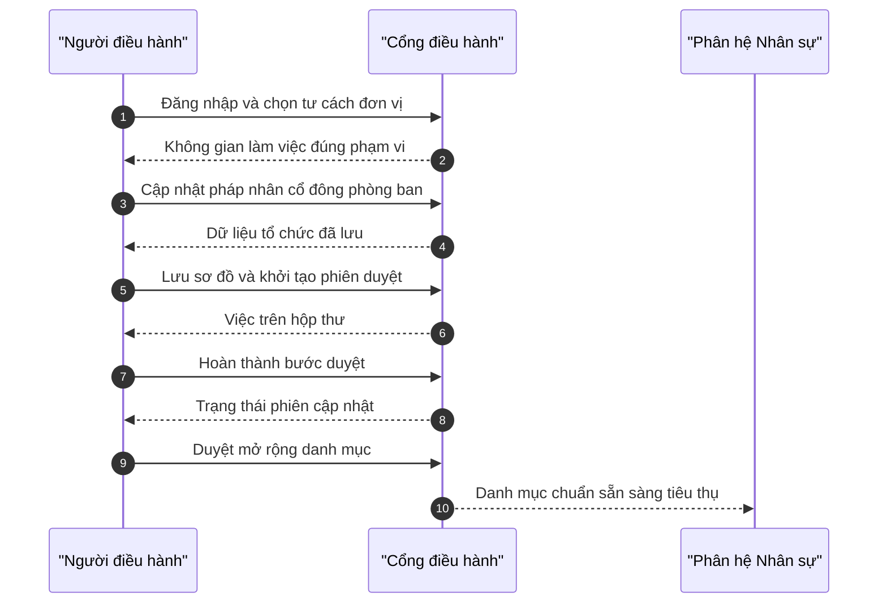
```mermaid
sequenceDiagram
  autonumber
  participant U as "Người điều hành"
  participant SYS as "Cổng điều hành"
  participant HR as "Phân hệ Nhân sự"
  U->>SYS: Đăng nhập và chọn tư cách đơn vị
  SYS-->>U: Không gian làm việc đúng phạm vi
  U->>SYS: Cập nhật pháp nhân cổ đông phòng ban
  SYS-->>U: Dữ liệu tổ chức đã lưu
  U->>SYS: Lưu sơ đồ và khởi tạo phiên duyệt
  SYS-->>U: Việc trên hộp thư
  U->>SYS: Hoàn thành bước duyệt
  SYS-->>U: Trạng thái phiên cập nhật
  U->>SYS: Duyệt mở rộng danh mục
  SYS-->>HR: Danh mục chuẩn sẵn sàng tiêu thụ
```

---

## 3. Yêu cầu chức năng

> Mỗi mục dưới đây là một **FR** (đủ 7 khối + Kết quả trả về). W1: §3.1–3.12. W2 batch: §3.13–3.16. Catalog còn lại bổ sung ở đợt sau — **không** rút FR / luồng nghiệm thu đã khóa.

### 3.1 FR-XBOS-AUTH-01 — Đăng nhập cổng điều hành

| Thuộc tính | Mô tả |
|------------|--------|
| Actor | Lãnh đạo / quản trị cấu hình / lãnh đạo đơn vị |
| Ưu tiên | Cao |
| Điều kiện tiên quyết | Có tài khoản được cấp; cổng đang hoạt động |
| Điều kiện hậu | Có phiên làm việc; sẵn sàng chọn tư cách hoặc vào không gian mặc định |
| Mã UC | UC-XBOS-AUTH-01 |
| Liên hệ phần mềm hiện tại | Đã có — màn đăng nhập cổng |

**Dữ liệu đầu vào**

| Trường | Bắt buộc | Ràng buộc / kiểm tra |
|--------|----------|----------------------|
| Email / tên đăng nhập | Có | Không rỗng sau chuẩn hoá |
| Mật khẩu | Có | Không rỗng |
| Ghi nhớ phiên (nếu có) | Không | Theo chính sách bảo mật |

**Luồng chính**

1. Người dùng mở cổng → nhập thông tin đăng nhập → xác nhận.
2. Hệ thống kiểm tra tài khoản và mật khẩu.
3. Nếu hợp lệ → tạo phiên và chuyển vào không gian điều hành (hoặc màn chọn tư cách).
4. Người dùng thấy menu / khu vực làm việc tương ứng quyền.

**Quy tắc nghiệp vụ**

- Sai thông tin đăng nhập → từ chối; không tiết lộ chi tiết nội bộ ngoài thông báo chung.
- Tài khoản bị khóa / hết hiệu lực → từ chối rõ ràng.
- Hết phiên giữa chừng → yêu cầu đăng nhập lại trước thao tác ghi.

**Sơ đồ tương tác**

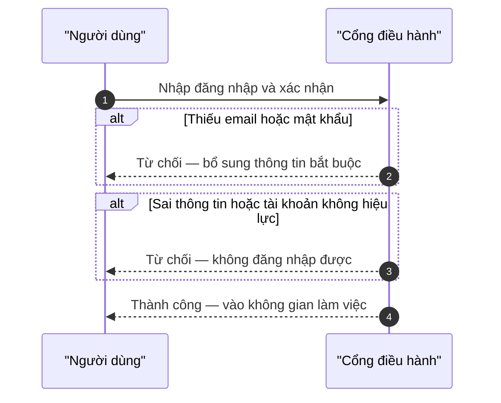
```mermaid
sequenceDiagram
  autonumber
  participant U as "Người dùng"
  participant SYS as "Cổng điều hành"
  U->>SYS: Nhập đăng nhập và xác nhận
  alt Thiếu email hoặc mật khẩu
    SYS-->>U: Từ chối — bổ sung thông tin bắt buộc
  end
  alt Sai thông tin hoặc tài khoản không hiệu lực
    SYS-->>U: Từ chối — không đăng nhập được
  end
  SYS-->>U: Thành công — vào không gian làm việc
```

**Diễn biến nghiệp vụ**

| # | Tương tác | Điều kiện / quy tắc | Kết quả hoặc lỗi |
|---|-----------|---------------------|------------------|
| 1 | Mở màn đăng nhập | Cổng hoạt động | Form đăng nhập |
| 2 | Bỏ trống bắt buộc | Thiếu trường | Từ chối — nêu trường thiếu |
| 3 | Sai mật khẩu / tài khoản | Không khớp | Từ chối — đăng nhập thất bại |
| 4 | Tài khoản khóa | Hết hiệu lực | Từ chối — liên hệ quản trị |
| 5 | Đăng nhập đúng | Tài khoản hợp lệ | Có phiên làm việc |
| 6 | Vào không gian | Có quyền tối thiểu | Menu điều hành |
| 7 | Hết phiên sau đó | Timeout | Yêu cầu đăng nhập lại |
| 8 | Thành công cuối | Đủ khóa phiên | Xem Kết quả trả về |

**Kết quả trả về khi thành công**

| Ý | Nội dung |
|---|----------|
| Người dùng thấy | Không gian cổng sau đăng nhập (hoặc màn chọn tư cách) |
| Bản ghi tạo / cập nhật | Phiên đăng nhập hiệu lực |
| Khóa mang sang bước sau | Định danh người dùng; sẵn sàng gắn tư cách đơn vị |
| Trạng thái sau | Đã xác thực |
| Việc được mở khóa tiếp | FR-XBOS-TENANT-01 · FR-ECO-SCOPE-02 |

---

### 3.2 FR-XBOS-TENANT-01 — Liệt kê và chọn tư cách đơn vị

| Thuộc tính | Mô tả |
|------------|--------|
| Actor | Người dùng có từ một tư cách đơn vị trở lên |
| Ưu tiên | Cao |
| Điều kiện tiên quyết | Đã đăng nhập |
| Điều kiện hậu | Phiên gắn đúng đơn vị / vai trò đang chọn |
| Mã UC | UC-XBOS-TENANT-01 |
| Liên hệ phần mềm hiện tại | Đã có — chọn membership / đơn vị |

**Dữ liệu đầu vào**

| Trường | Bắt buộc | Ràng buộc / kiểm tra |
|--------|----------|----------------------|
| Tư cách đơn vị (dòng chọn) | Có khi có ≥2 tư cách | Phải thuộc danh sách được cấp cho người dùng |
| Xác nhận chọn | Có | Một tư cách tại một thời điểm làm việc |

**Luồng chính**

1. Hệ thống hiển thị danh sách tư cách đơn vị của người dùng.
2. Người dùng chọn một tư cách → xác nhận.
3. Hệ thống gắn đơn vị đang làm việc vào phiên.
4. Giao diện nạp lại dữ liệu theo tư cách mới.

**Quy tắc nghiệp vụ**

- Không hiện tư cách ngoài danh sách được cấp.
- Chỉ một tư cách đang active cho phiên làm việc hiện tại.
- Đổi tư cách → phạm vi dữ liệu đổi theo (FR phạm vi).

**Sơ đồ tương tác**

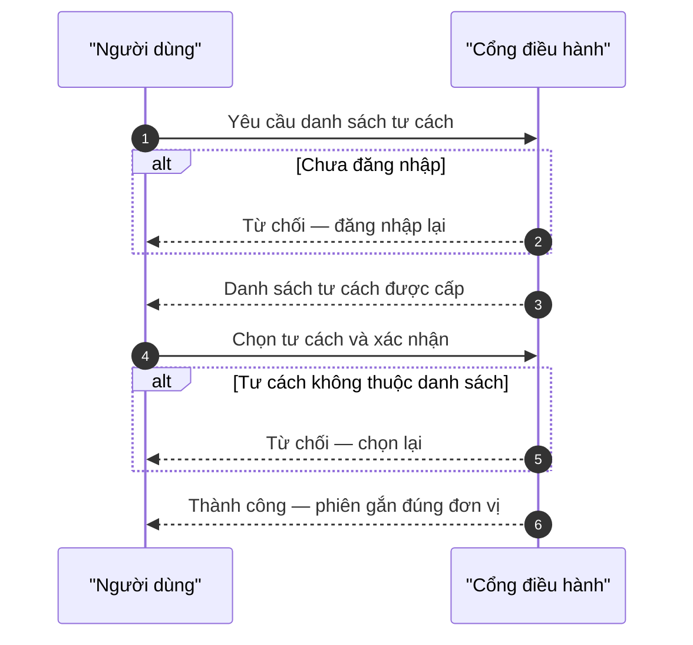
```mermaid
sequenceDiagram
  autonumber
  participant U as "Người dùng"
  participant SYS as "Cổng điều hành"
  U->>SYS: Yêu cầu danh sách tư cách
  alt Chưa đăng nhập
    SYS-->>U: Từ chối — đăng nhập lại
  end
  SYS-->>U: Danh sách tư cách được cấp
  U->>SYS: Chọn tư cách và xác nhận
  alt Tư cách không thuộc danh sách
    SYS-->>U: Từ chối — chọn lại
  end
  SYS-->>U: Thành công — phiên gắn đúng đơn vị
```

**Diễn biến nghiệp vụ**

| # | Tương tác | Điều kiện / quy tắc | Kết quả hoặc lỗi |
|---|-----------|---------------------|------------------|
| 1 | (Auth gom) | Hết phiên | Từ chối — đăng nhập lại |
| 2 | Xem danh sách | Đã đăng nhập | Các tư cách được cấp |
| 3 | Danh sách rỗng | Chưa được gán đơn vị | Empty trung thực — liên hệ quản trị |
| 4 | Chọn tư cách lạ | Không thuộc danh sách | Từ chối |
| 5 | Xác nhận hợp lệ | Trong danh sách | Phiên gắn đơn vị |
| 6 | Đổi tư cách | Có ≥2 tư cách | Phạm vi nạp lại |
| 7 | Thành công cuối | Đủ khóa đơn vị | Xem Kết quả trả về |

**Kết quả trả về khi thành công**

| Ý | Nội dung |
|---|----------|
| Người dùng thấy | Đơn vị / vai trò đang làm việc trên giao diện |
| Bản ghi tạo / cập nhật | Ngữ cảnh phiên gắn tư cách |
| Khóa mang sang bước sau | Định danh đơn vị đang chọn |
| Trạng thái sau | Đang làm việc tại đơn vị đã chọn |
| Việc được mở khóa tiếp | FR-ECO-SCOPE-02 và các FR tổ chức / duyệt |

---

### 3.3 FR-ECO-SCOPE-02 — Phạm vi dữ liệu khi đã đăng nhập

| Thuộc tính | Mô tả |
|------------|--------|
| Actor | Mọi người dùng đã có tư cách đơn vị |
| Ưu tiên | Cao |
| Điều kiện tiên quyết | Đã đăng nhập; đã gắn tư cách (nếu hệ thống yêu cầu) |
| Điều kiện hậu | Mọi danh sách / chi tiết chỉ trong phạm vi được phép |
| Mã UC | UC-ECO-SCOPE-02 |
| Liên hệ phần mềm hiện tại | Đã có — kiểm phạm vi trên cổng và API |

**Dữ liệu đầu vào**

| Trường | Bắt buộc | Ràng buộc / kiểm tra |
|--------|----------|----------------------|
| Ngữ cảnh đơn vị phiên | Có (hệ thống) | Khớp tư cách đang chọn |
| Yêu cầu xem / sửa dữ liệu | Có | Phải thuộc phạm vi |

**Luồng chính**

1. Người dùng mở danh sách hoặc chi tiết nghiệp vụ.
2. Hệ thống lọc theo phạm vi tư cách và quyền.
3. Nếu yêu cầu ngoài phạm vi → từ chối rõ ràng trên giao diện.
4. Nếu trong phạm vi → hiển thị dữ liệu; rỗng hợp lệ thì empty trung thực.

**Quy tắc nghiệp vụ**

- Quy tắc-1 / Quy tắc-2 BRD: không lộ chéo đơn vị; lãnh đạo thành viên không xem rollup tập đoàn khi không được cấp.
- Không đổi im lặng sang đơn vị khác khi lỗi phạm vi.
- Empty trong phạm vi ≠ lỗi hệ thống.

**Sơ đồ tương tác**

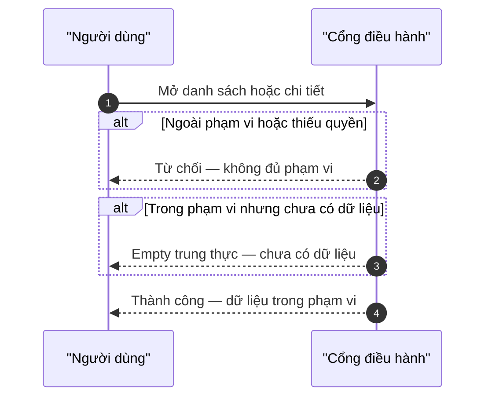
```mermaid
sequenceDiagram
  autonumber
  participant U as "Người dùng"
  participant SYS as "Cổng điều hành"
  U->>SYS: Mở danh sách hoặc chi tiết
  alt Ngoài phạm vi hoặc thiếu quyền
    SYS-->>U: Từ chối — không đủ phạm vi
  end
  alt Trong phạm vi nhưng chưa có dữ liệu
    SYS-->>U: Empty trung thực — chưa có dữ liệu
  end
  SYS-->>U: Thành công — dữ liệu trong phạm vi
```

**Diễn biến nghiệp vụ**

| # | Tương tác | Điều kiện / quy tắc | Kết quả hoặc lỗi |
|---|-----------|---------------------|------------------|
| 1 | (Auth gom) | Hết phiên | Từ chối — đăng nhập lại |
| 2 | Mở danh sách | Có tư cách | Áp dụng bộ lọc phạm vi |
| 3 | Thành viên xin rollup tập đoàn | Không được cấp | Từ chối — không đủ phạm vi |
| 4 | Sửa pháp nhân ngoài đơn vị | Ngoài phạm vi | Từ chối |
| 5 | Trong phạm vi, có dữ liệu | Đủ quyền | Danh sách / chi tiết |
| 6 | Trong phạm vi, không dữ liệu | Hợp lệ | Empty trung thực |
| 7 | Thành công cuối | Phạm vi ổn định | Xem Kết quả trả về |

**Kết quả trả về khi thành công**

| Ý | Nội dung |
|---|----------|
| Người dùng thấy | Đúng dữ liệu đơn vị được phép; hoặc empty rõ ràng |
| Bản ghi tạo / cập nhật | Không bắt buộc tạo mới — ngữ cảnh phạm vi được áp dụng |
| Khóa mang sang bước sau | Bộ lọc phạm vi cho mọi thao tác tiếp |
| Trạng thái sau | Đang làm việc trong phạm vi hợp lệ |
| Việc được mở khóa tiếp | FR tổ chức · quy trình · danh mục trong phạm vi |

---

### 3.4 FR-XBOS-ORG-01 — Xem danh sách / cây đơn vị thành viên

| Thuộc tính | Mô tả |
|------------|--------|
| Actor | Lãnh đạo tập đoàn / quản trị cấu hình (theo quyền) |
| Ưu tiên | Cao |
| Điều kiện tiên quyết | Đã đăng nhập; trong phạm vi xem danh sách đơn vị |
| Điều kiện hậu | Có danh sách hoặc cây đơn vị để mở chi tiết |
| Mã UC | UC-XBOS-ORG-01 |
| Liên hệ phần mềm hiện tại | Đã có — danh sách đơn vị thành viên |

**Dữ liệu đầu vào**

| Trường | Bắt buộc | Ràng buộc / kiểm tra |
|--------|----------|----------------------|
| Từ khóa tìm (nếu có) | Không | Lọc trong phạm vi |
| Chọn dòng đơn vị | Có khi vào chi tiết | Phải thuộc danh sách trả về |

**Luồng chính**

1. Người dùng mở mục đơn vị thành viên.
2. Hệ thống tải danh sách / cây trong phạm vi.
3. Người dùng chọn một đơn vị → mở chi tiết.
4. Tải lại trang vẫn thấy cùng tập đơn vị (trong phạm vi).

**Quy tắc nghiệp vụ**

- Không hiện đơn vị ngoài phạm vi.
- Empty hợp lệ khi chưa có thành viên trong phạm vi xem.
- Chọn đơn vị → khóa pháp nhân cho FR hồ sơ / cổ đông / phòng ban.

**Sơ đồ tương tác**

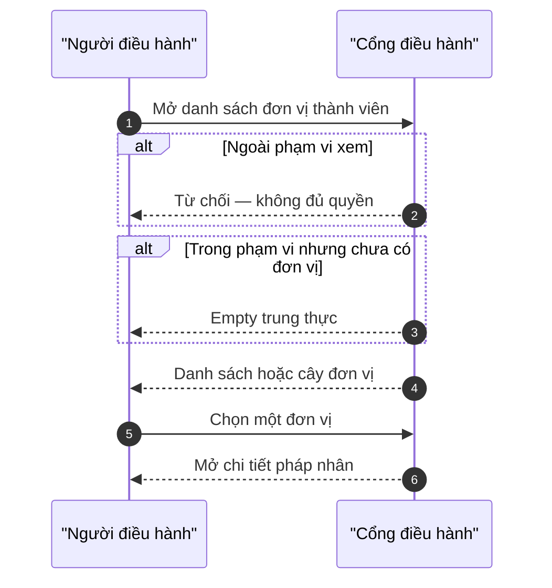
```mermaid
sequenceDiagram
  autonumber
  participant U as "Người điều hành"
  participant SYS as "Cổng điều hành"
  U->>SYS: Mở danh sách đơn vị thành viên
  alt Ngoài phạm vi xem
    SYS-->>U: Từ chối — không đủ quyền
  end
  alt Trong phạm vi nhưng chưa có đơn vị
    SYS-->>U: Empty trung thực
  end
  SYS-->>U: Danh sách hoặc cây đơn vị
  U->>SYS: Chọn một đơn vị
  SYS-->>U: Mở chi tiết pháp nhân
```

**Diễn biến nghiệp vụ**

| # | Tương tác | Điều kiện / quy tắc | Kết quả hoặc lỗi |
|---|-----------|---------------------|------------------|
| 1 | (Auth/phạm vi gom) | Hết phiên / ngoài quyền | Từ chối |
| 2 | Mở danh sách | Có quyền xem | Tải dữ liệu |
| 3 | Empty | Chưa có thành viên | Empty trung thực |
| 4 | Lọc từ khóa | Trong phạm vi | Danh sách thu hẹp |
| 5 | Chọn đơn vị | Thuộc danh sách | Mở chi tiết |
| 6 | Chọn id lạ | Ngoài danh sách | Từ chối |
| 7 | Tải lại trang | Cùng phiên | Danh sách còn đúng phạm vi |
| 8 | Thành công cuối | Có khóa pháp nhân | Xem Kết quả trả về |

**Kết quả trả về khi thành công**

| Ý | Nội dung |
|---|----------|
| Người dùng thấy | Danh sách / cây đơn vị; hoặc empty |
| Bản ghi tạo / cập nhật | Không bắt buộc — đọc danh sách |
| Khóa mang sang bước sau | Định danh pháp nhân / đơn vị đã chọn |
| Trạng thái sau | Đang xem tổ chức trong phạm vi |
| Việc được mở khóa tiếp | FR-XBOS-ORG-03 · FR-CC-P0-01 · FR-XBOS-ORG-02 |

---

### 3.5 FR-XBOS-ORG-03 — Lưu hồ sơ pháp nhân và tài liệu pháp lý

| Thuộc tính | Mô tả |
|------------|--------|
| Actor | Quản trị cấu hình / lãnh đạo có quyền sửa pháp nhân |
| Ưu tiên | Cao |
| Điều kiện tiên quyết | Đã chọn pháp nhân trong phạm vi; có quyền sửa |
| Điều kiện hậu | Hồ sơ (và tài liệu nếu đính kèm) đã lưu; tải lại còn |
| Mã UC | UC-XBOS-ORG-03 |
| Liên hệ phần mềm hiện tại | Đã có — hồ sơ pháp nhân + tài liệu |

**Dữ liệu đầu vào**

| Trường | Bắt buộc | Ràng buộc / kiểm tra |
|--------|----------|----------------------|
| Tên pháp nhân | Có | Không rỗng |
| Mã số thuế | Theo chính sách | Định dạng hợp lệ nếu bắt buộc |
| Người đại diện / địa chỉ | Theo form | Không vượt độ dài cho phép |
| Tài liệu (metadata) | Không | Loại / tên rõ ràng khi thêm |
| Tệp đính kèm | Khi upload | Định dạng và dung lượng theo chính sách |

**Luồng chính**

1. Người dùng mở chi tiết pháp nhân → sửa trường → Lưu.
2. Hệ thống kiểm phạm vi và hợp lệ → ghi hồ sơ.
3. (Tuỳ chọn) Thêm tài liệu → tải tệp → xem lại được.
4. Tải lại trang: thông tin và tài liệu vẫn còn.

**Quy tắc nghiệp vụ**

- Ngoài phạm vi → không lưu.
- Thiếu trường bắt buộc → không lưu; nêu trường.
- Upload thất bại → giữ metadata đã có; thông báo rõ; không báo thành công giả.
- Số vốn / số lớn: nhập nhóm nghìn theo chuẩn Việt Nam khi áp dụng.

**Sơ đồ tương tác**

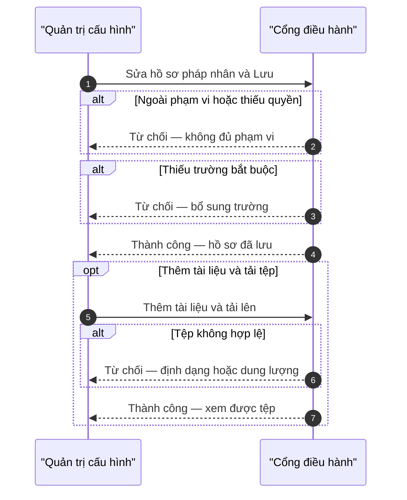
```mermaid
sequenceDiagram
  autonumber
  participant U as "Quản trị cấu hình"
  participant SYS as "Cổng điều hành"
  U->>SYS: Sửa hồ sơ pháp nhân và Lưu
  alt Ngoài phạm vi hoặc thiếu quyền
    SYS-->>U: Từ chối — không đủ phạm vi
  end
  alt Thiếu trường bắt buộc
    SYS-->>U: Từ chối — bổ sung trường
  end
  SYS-->>U: Thành công — hồ sơ đã lưu
  opt Thêm tài liệu và tải tệp
    U->>SYS: Thêm tài liệu và tải lên
    alt Tệp không hợp lệ
      SYS-->>U: Từ chối — định dạng hoặc dung lượng
    end
    SYS-->>U: Thành công — xem được tệp
  end
```

**Diễn biến nghiệp vụ**

| # | Tương tác | Điều kiện / quy tắc | Kết quả hoặc lỗi |
|---|-----------|---------------------|------------------|
| 1 | (Auth/phạm vi) | Hết phiên / ngoài đơn vị | Từ chối |
| 2 | Mở form hồ sơ | Có quyền sửa | Form có dữ liệu hiện có |
| 3 | Thiếu bắt buộc | Tên / MST… | Từ chối — nêu trường |
| 4 | Lưu hồ sơ | Đủ điều kiện | Hồ sơ cập nhật trên màn |
| 5 | Thêm tài liệu | Metadata hợp lệ | Dòng tài liệu mới |
| 6 | Upload tệp lỗi | Sai định dạng / quá dung lượng | Từ chối — không giả thành công |
| 7 | Xem tệp | Đã tải thành công | Xem được nội dung |
| 8 | Tải lại trang | Cùng phạm vi | Hồ sơ / tài liệu còn |
| 9 | Thành công cuối | Đủ khóa pháp nhân | Xem Kết quả trả về |

**Kết quả trả về khi thành công**

| Ý | Nội dung |
|---|----------|
| Người dùng thấy | Thông báo lưu thành công; form / danh sách phản ánh giá trị mới |
| Bản ghi tạo / cập nhật | Hồ sơ pháp nhân; (nếu có) bản ghi tài liệu + tệp |
| Khóa mang sang bước sau | Định danh pháp nhân; (nếu có) định danh tài liệu |
| Trạng thái sau | Hồ sơ đã cập nhật trong phạm vi |
| Việc được mở khóa tiếp | FR-CC-P0-01 (cổ đông); dùng pháp nhân cho phòng ban |

---

### 3.6 FR-CC-P0-01 — Thêm hoặc sửa cổ đông theo pháp nhân

| Thuộc tính | Mô tả |
|------------|--------|
| Actor | Quản trị cấu hình / lãnh đạo có quyền |
| Ưu tiên | Cao |
| Điều kiện tiên quyết | Pháp nhân đang mở thuộc phạm vi (thành viên hoặc tập đoàn theo quyền) |
| Điều kiện hậu | Dòng cổ đông trên danh sách; tải lại còn |
| Mã UC | UC-CC-P0-01 |
| Liên hệ phần mềm hiện tại | Đã có — danh sách cổ đông pháp nhân |

**Dữ liệu đầu vào**

| Trường | Bắt buộc | Ràng buộc / kiểm tra |
|--------|----------|----------------------|
| Pháp nhân | Có | Đang mở / thuộc phạm vi |
| Tên cổ đông | Có | Không rỗng |
| Tỷ lệ / giá trị góp | Theo form | Số ≥ 0; hiển thị nhóm nghìn khi là tiền |
| Loại cổ đông | Theo danh mục | Giá trị hiệu lực nếu bắt buộc |

**Luồng chính**

1. Người dùng mở mục cổ đông của pháp nhân → Thêm (hoặc sửa dòng).
2. Nhập thông tin → Lưu / xác nhận dòng.
3. Hệ thống kiểm phạm vi và hợp lệ → ghi.
4. Danh sách hiện dòng mới/cập nhật; tải lại trang vẫn còn.

**Quy tắc nghiệp vụ**

- Không ghi cổ đông cho pháp nhân ngoài phạm vi.
- Thiếu tên → từ chối.
- Số âm / không hợp lệ → từ chối.
- Tập đoàn và thành viên: cùng quy tắc lưu; khác nhau ở pháp nhân đang chọn trong phạm vi.

**Sơ đồ tương tác**

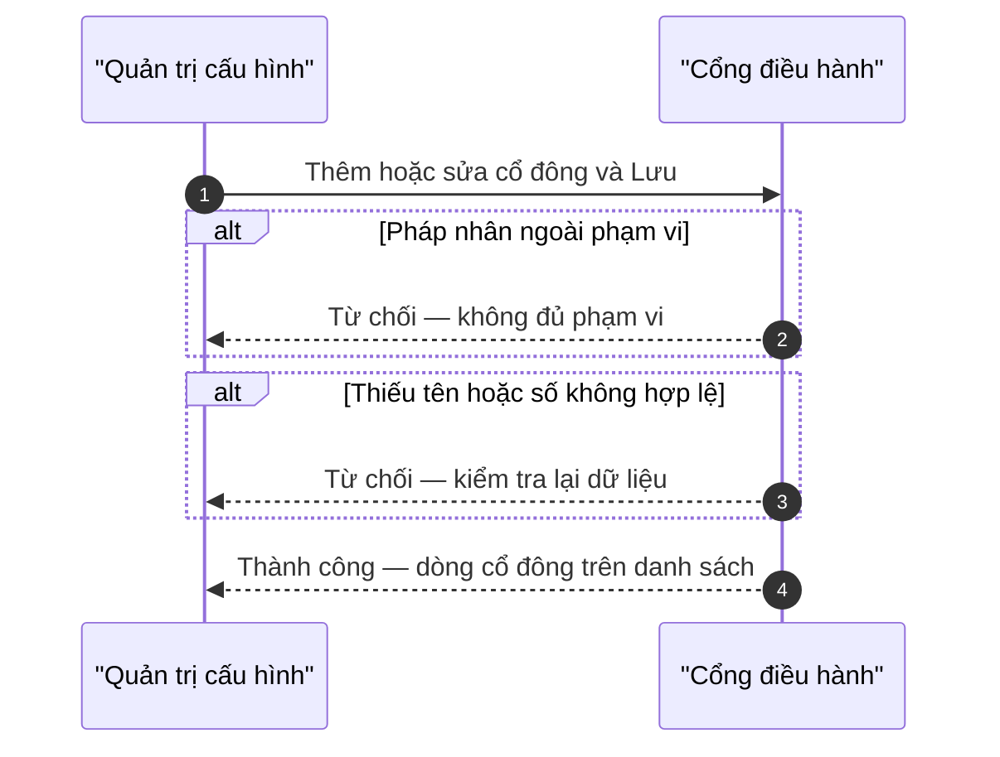
```mermaid
sequenceDiagram
  autonumber
  participant U as "Quản trị cấu hình"
  participant SYS as "Cổng điều hành"
  U->>SYS: Thêm hoặc sửa cổ đông và Lưu
  alt Pháp nhân ngoài phạm vi
    SYS-->>U: Từ chối — không đủ phạm vi
  end
  alt Thiếu tên hoặc số không hợp lệ
    SYS-->>U: Từ chối — kiểm tra lại dữ liệu
  end
  SYS-->>U: Thành công — dòng cổ đông trên danh sách
```

**Diễn biến nghiệp vụ**

| # | Tương tác | Điều kiện / quy tắc | Kết quả hoặc lỗi |
|---|-----------|---------------------|------------------|
| 1 | (Auth/phạm vi) | Hết phiên / sai pháp nhân | Từ chối |
| 2 | Mở danh sách cổ đông | Có quyền | Danh sách hiện có hoặc empty |
| 3 | Thiếu tên | Bắt buộc | Từ chối |
| 4 | Số không hợp lệ | Âm hoặc sai định dạng | Từ chối |
| 5 | Lưu thành công | Đủ điều kiện | Dòng mới / cập nhật |
| 6 | Tải lại trang | Cùng pháp nhân | Dòng còn |
| 7 | Thành công cuối | Có khóa cổ đông | Xem Kết quả trả về |

**Kết quả trả về khi thành công**

| Ý | Nội dung |
|---|----------|
| Người dùng thấy | Dòng cổ đông trên bảng; thông báo lưu thành công |
| Bản ghi tạo / cập nhật | Bản ghi cổ đông gắn pháp nhân |
| Khóa mang sang bước sau | Định danh cổ đông; định danh pháp nhân |
| Trạng thái sau | Danh sách cổ đông đã cập nhật |
| Việc được mở khóa tiếp | Tiếp tục chỉnh tổ chức / báo cáo vốn (ngoài W1 chi tiết) |

---

### 3.7 FR-XBOS-ORG-02 — Thêm / sửa / xóa phòng ban

| Thuộc tính | Mô tả |
|------------|--------|
| Actor | Quản trị cấu hình |
| Ưu tiên | Cao |
| Điều kiện tiên quyết | Đơn vị / pháp nhân trong phạm vi; có quyền quản lý phòng ban |
| Điều kiện hậu | Cây / danh sách phòng ban phản ánh thay đổi; tải lại còn |
| Mã UC | UC-XBOS-ORG-02 |
| Liên hệ phần mềm hiện tại | Đã có — phòng ban / đơn vị tổ chức |

**Dữ liệu đầu vào**

| Trường | Bắt buộc | Ràng buộc / kiểm tra |
|--------|----------|----------------------|
| Tên phòng ban | Có (khi thêm/sửa) | Không rỗng |
| Đơn vị cha | Theo cấu trúc | Phải thuộc cùng phạm vi |
| Xác nhận xóa | Có khi xóa | Có bước xác nhận |

**Luồng chính**

1. Người dùng mở mục phòng ban → Thêm / Sửa / Xóa.
2. Hệ thống kiểm phạm vi và ràng buộc cấu trúc.
3. Ghi nhận thay đổi → giao diện cập nhật ngay.
4. Tải lại trang: cấu trúc còn đúng.

**Quy tắc nghiệp vụ**

- Ngoài phạm vi → từ chối.
- Xóa khi còn ràng buộc nghiệp vụ (nếu hệ thống phát hiện) → từ chối rõ lý do.
- Không tạo phòng ban “mồ côi” ngoài đơn vị đang quản lý.

**Sơ đồ tương tác**

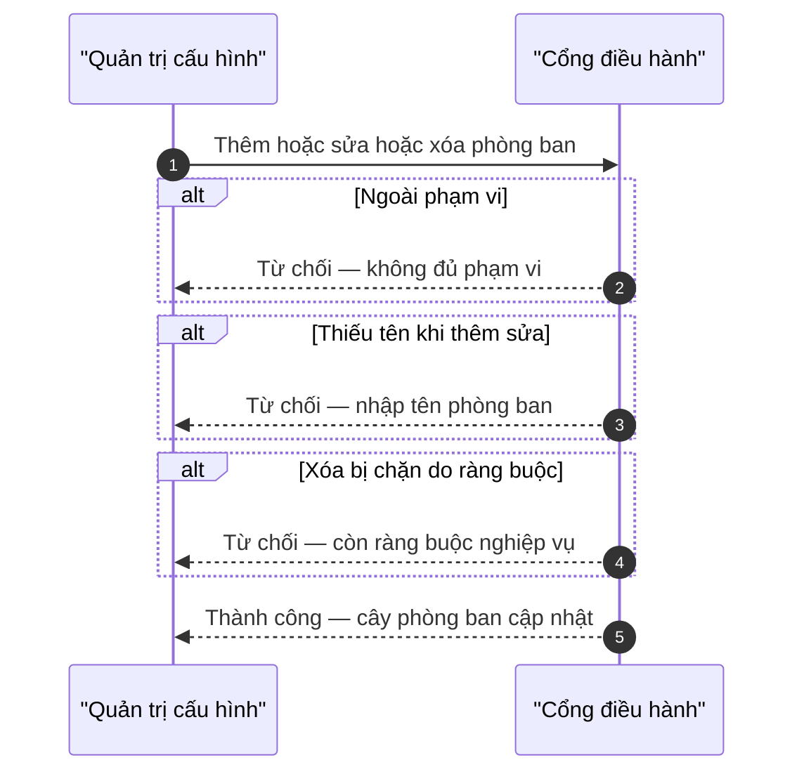
```mermaid
sequenceDiagram
  autonumber
  participant U as "Quản trị cấu hình"
  participant SYS as "Cổng điều hành"
  U->>SYS: Thêm hoặc sửa hoặc xóa phòng ban
  alt Ngoài phạm vi
    SYS-->>U: Từ chối — không đủ phạm vi
  end
  alt Thiếu tên khi thêm sửa
    SYS-->>U: Từ chối — nhập tên phòng ban
  end
  alt Xóa bị chặn do ràng buộc
    SYS-->>U: Từ chối — còn ràng buộc nghiệp vụ
  end
  SYS-->>U: Thành công — cây phòng ban cập nhật
```

**Diễn biến nghiệp vụ**

| # | Tương tác | Điều kiện / quy tắc | Kết quả hoặc lỗi |
|---|-----------|---------------------|------------------|
| 1 | (Auth/phạm vi) | Hết phiên / ngoài đơn vị | Từ chối |
| 2 | Thêm thiếu tên | Bắt buộc | Từ chối |
| 3 | Thêm / sửa hợp lệ | Trong phạm vi | Node cập nhật |
| 4 | Xóa có xác nhận | Không bị chặn | Node biến mất khỏi cây |
| 5 | Xóa bị ràng buộc | Còn phụ thuộc | Từ chối — nêu lý do |
| 6 | Tải lại trang | Cùng đơn vị | Cấu trúc còn |
| 7 | Thành công cuối | Có khóa phòng ban | Xem Kết quả trả về |

**Kết quả trả về khi thành công**

| Ý | Nội dung |
|---|----------|
| Người dùng thấy | Cây / danh sách phòng ban đã đổi |
| Bản ghi tạo / cập nhật / xóa | Bản ghi đơn vị tổ chức tương ứng |
| Khóa mang sang bước sau | Định danh phòng ban (khi thêm/sửa) |
| Trạng thái sau | Cấu trúc tổ chức đã cập nhật |
| Việc được mở khóa tiếp | Nhân sự / phân quyền dùng phòng ban (tiêu thụ) |

---

### 3.8 FR-XBOS-WF-01 — Lưu sơ đồ quy trình trên canvas

| Thuộc tính | Mô tả |
|------------|--------|
| Actor | Quản trị cấu hình quy trình |
| Ưu tiên | Cao |
| Điều kiện tiên quyết | Đã đăng nhập; có quyền thiết kế quy trình |
| Điều kiện hậu | Có sơ đồ / phiên bản dùng để khởi tạo phiên |
| Mã UC | UC-XBOS-WF-01 |
| Liên hệ phần mềm hiện tại | Đã có — canvas quy trình |

**Dữ liệu đầu vào**

| Trường | Bắt buộc | Ràng buộc / kiểm tra |
|--------|----------|----------------------|
| Tên quy trình | Có | Không rỗng |
| Các bước / nối | Có tối thiểu theo mẫu | Phải có điểm bắt đầu và ít nhất một bước duyệt khi dùng để phê duyệt |
| Phạm vi áp dụng | Theo cấu hình | Trong đơn vị / tập đoàn được cấp |

**Luồng chính**

1. Người dùng mở canvas → bố trí bước → Lưu.
2. Hệ thống kiểm cấu trúc tối thiểu → ghi sơ đồ.
3. Sơ đồ xuất hiện trong danh sách dùng được để khởi tạo phiên.

**Quy tắc nghiệp vụ**

- Sơ đồ thiếu bước bắt buộc → từ chối lưu dùng cho chạy thật.
- Ngoài quyền thiết kế → từ chối.
- Lưu thành công tạo khóa sơ đồ cho FR khởi tạo phiên.

**Sơ đồ tương tác**

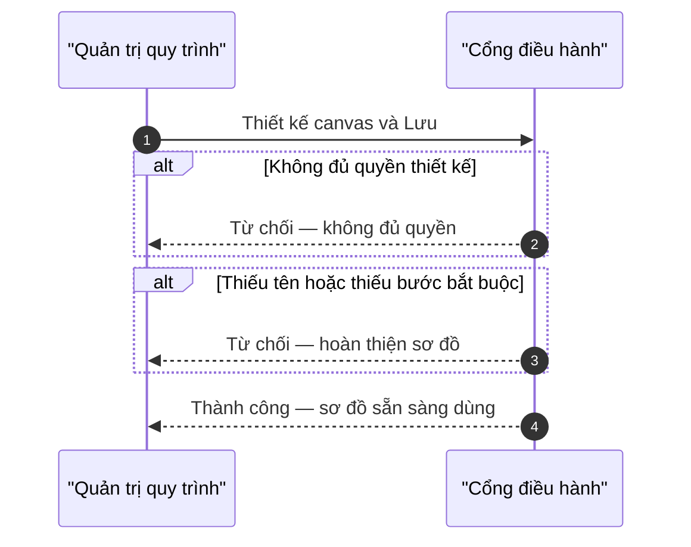
```mermaid
sequenceDiagram
  autonumber
  participant U as "Quản trị quy trình"
  participant SYS as "Cổng điều hành"
  U->>SYS: Thiết kế canvas và Lưu
  alt Không đủ quyền thiết kế
    SYS-->>U: Từ chối — không đủ quyền
  end
  alt Thiếu tên hoặc thiếu bước bắt buộc
    SYS-->>U: Từ chối — hoàn thiện sơ đồ
  end
  SYS-->>U: Thành công — sơ đồ sẵn sàng dùng
```

**Diễn biến nghiệp vụ**

| # | Tương tác | Điều kiện / quy tắc | Kết quả hoặc lỗi |
|---|-----------|---------------------|------------------|
| 1 | (Auth) | Hết phiên | Từ chối |
| 2 | Mở canvas | Có quyền | Canvas trống hoặc bản đang sửa |
| 3 | Thiếu tên | Bắt buộc | Từ chối |
| 4 | Thiếu bước duyệt | Không đủ cấu trúc | Từ chối |
| 5 | Lưu hợp lệ | Đủ cấu trúc | Sơ đồ đã lưu |
| 6 | Mở lại danh sách | Cùng phạm vi | Thấy sơ đồ |
| 7 | Thành công cuối | Có khóa sơ đồ | Xem Kết quả trả về |

**Kết quả trả về khi thành công**

| Ý | Nội dung |
|---|----------|
| Người dùng thấy | Sơ đồ đã lưu trên canvas / danh sách |
| Bản ghi tạo / cập nhật | Định nghĩa quy trình (phiên bản hiện hành) |
| Khóa mang sang bước sau | Định danh sơ đồ / phiên bản |
| Trạng thái sau | Sẵn sàng khởi tạo phiên |
| Việc được mở khóa tiếp | FR-XBOS-WF-03 |

---

### 3.9 FR-XBOS-WF-03 — Khởi tạo phiên chạy quy trình

| Thuộc tính | Mô tả |
|------------|--------|
| Actor | Người có quyền khởi tạo theo loại việc |
| Ưu tiên | Cao |
| Điều kiện tiên quyết | Có sơ đồ đã lưu; trong phạm vi |
| Điều kiện hậu | Có phiên chạy; bước chờ xuất hiện trên hộp thư người được gán |
| Mã UC | UC-XBOS-WF-03 |
| Liên hệ phần mềm hiện tại | Đã có — tạo instance quy trình |

**Dữ liệu đầu vào**

| Trường | Bắt buộc | Ràng buộc / kiểm tra |
|--------|----------|----------------------|
| Sơ đồ / loại quy trình | Có | Phải là bản đã lưu hiệu lực |
| Ngữ cảnh nghiệp vụ (nếu có) | Theo loại | Khóa gắn việc nguồn khi bắt buộc |
| Ghi chú khởi tạo | Không | Độ dài hợp lệ |

**Luồng chính**

1. Người dùng chọn sơ đồ → Khởi tạo phiên.
2. Hệ thống tạo phiên và các bước chờ theo sơ đồ.
3. Người được gán thấy việc trên hộp thư.
4. Người khởi tạo thấy phiên ở trạng thái đang chạy / chờ duyệt.

**Quy tắc nghiệp vụ**

- Sơ đồ không hiệu lực → từ chối.
- Ngoài phạm vi → từ chối.
- Khởi tạo thành công phải sinh được ít nhất một bước chờ (khi sơ đồ có duyệt).

**Sơ đồ tương tác**

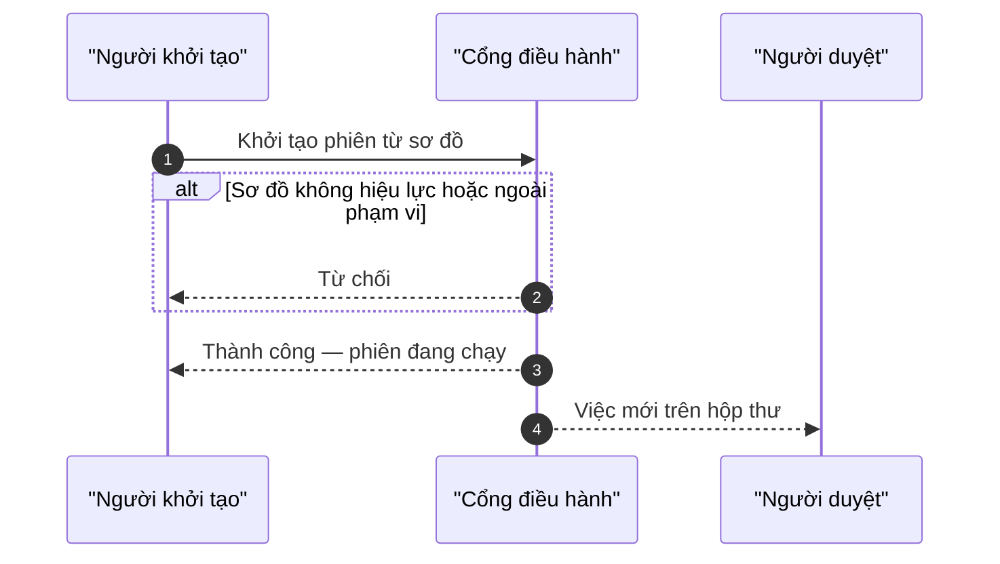
```mermaid
sequenceDiagram
  autonumber
  participant U as "Người khởi tạo"
  participant SYS as "Cổng điều hành"
  participant A as "Người duyệt"
  U->>SYS: Khởi tạo phiên từ sơ đồ
  alt Sơ đồ không hiệu lực hoặc ngoài phạm vi
    SYS-->>U: Từ chối
  end
  SYS-->>U: Thành công — phiên đang chạy
  SYS-->>A: Việc mới trên hộp thư
```

**Diễn biến nghiệp vụ**

| # | Tương tác | Điều kiện / quy tắc | Kết quả hoặc lỗi |
|---|-----------|---------------------|------------------|
| 1 | (Auth/phạm vi) | Hết phiên / ngoài quyền | Từ chối |
| 2 | Chọn sơ đồ hết hiệu lực | Không dùng được | Từ chối |
| 3 | Khởi tạo hợp lệ | Sơ đồ OK | Có phiên chạy |
| 4 | Hộp thư người duyệt | Có bước gán | Thấy việc chờ |
| 5 | Hộp thư trống sau tạo | Lỗi gán bước | Thất bại nghiệp vụ — không coi PASS |
| 6 | Thành công cuối | Có khóa phiên / bước | Xem Kết quả trả về |

**Kết quả trả về khi thành công**

| Ý | Nội dung |
|---|----------|
| Người dùng thấy | Phiên đang chạy; (phía duyệt) việc trên hộp thư |
| Bản ghi tạo / cập nhật | Phiên quy trình + bước chờ |
| Khóa mang sang bước sau | Định danh phiên; định danh bước / việc |
| Trạng thái sau | Đang chờ duyệt |
| Việc được mở khóa tiếp | FR-XBOS-WF-04 |

---

### 3.10 FR-XBOS-WF-04 — Hoàn thành bước phê duyệt trong phiên

| Thuộc tính | Mô tả |
|------------|--------|
| Actor | Người được gán bước duyệt |
| Ưu tiên | Cao |
| Điều kiện tiên quyết | Có việc chờ trên hộp thư thuộc phạm vi người duyệt |
| Điều kiện hậu | Bước hoàn thành; trạng thái phiên / hộp thư cập nhật; tải lại còn đúng |
| Mã UC | UC-XBOS-WF-04 |
| Liên hệ phần mềm hiện tại | Đã có — duyệt việc hộp thư |

**Dữ liệu đầu vào**

| Trường | Bắt buộc | Ràng buộc / kiểm tra |
|--------|----------|----------------------|
| Việc / bước chờ | Có | Phải thuộc người duyệt và còn chờ |
| Quyết định duyệt | Có | Đồng ý hoàn thành bước (nhánh từ chối: đợt sau) |
| Ghi chú duyệt | Không | Độ dài hợp lệ |

**Luồng chính**

1. Người duyệt mở hộp thư → mở việc → Duyệt / hoàn thành bước.
2. Hệ thống kiểm đúng người được gán và trạng thái chờ.
3. Ghi nhận hoàn thành → cập nhật phiên và hộp thư.
4. Tải lại: việc không còn ở trạng thái chờ của bước đó (hoặc chuyển bước kế).

**Quy tắc nghiệp vụ**

- Không duyệt việc của người khác / đã xử lý.
- Ngoài phạm vi → từ chối.
- Sau duyệt thành công, giao diện phải phản ánh trạng thái mới (không chỉ im lặng).

**Sơ đồ tương tác**

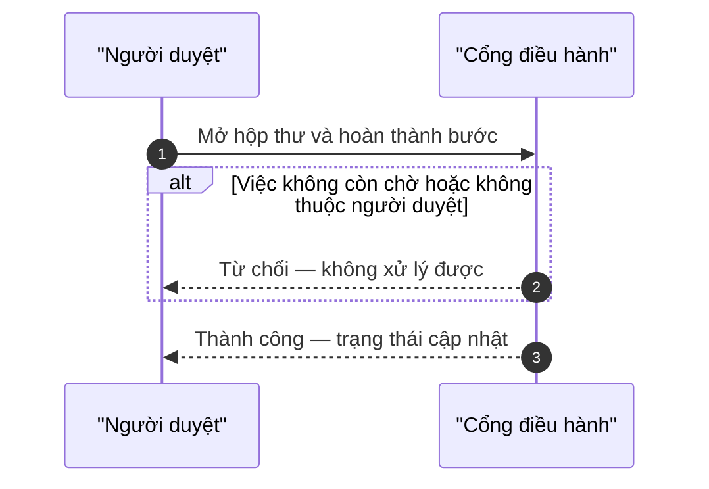
```mermaid
sequenceDiagram
  autonumber
  participant A as "Người duyệt"
  participant SYS as "Cổng điều hành"
  A->>SYS: Mở hộp thư và hoàn thành bước
  alt Việc không còn chờ hoặc không thuộc người duyệt
    SYS-->>A: Từ chối — không xử lý được
  end
  SYS-->>A: Thành công — trạng thái cập nhật
```

**Diễn biến nghiệp vụ**

| # | Tương tác | Điều kiện / quy tắc | Kết quả hoặc lỗi |
|---|-----------|---------------------|------------------|
| 1 | (Auth) | Hết phiên | Từ chối |
| 2 | Mở hộp thư | Có quyền | Danh sách việc chờ hoặc empty |
| 3 | Duyệt việc đã xử lý | Không còn chờ | Từ chối |
| 4 | Duyệt việc người khác | Sai người gán | Từ chối |
| 5 | Duyệt hợp lệ | Đúng bước chờ | Bước hoàn thành |
| 6 | Tải lại trang | Cùng người | Trạng thái còn đúng |
| 7 | Thành công cuối | Phiên tiến triển | Xem Kết quả trả về |

**Kết quả trả về khi thành công**

| Ý | Nội dung |
|---|----------|
| Người dùng thấy | Việc rời trạng thái chờ hiện tại; phiên cập nhật |
| Bản ghi tạo / cập nhật | Kết quả bước duyệt; trạng thái phiên |
| Khóa mang sang bước sau | Định danh phiên (bước kế nếu còn) |
| Trạng thái sau | Đã duyệt bước / chờ bước tiếp / hoàn tất phiên |
| Việc được mở khóa tiếp | Bước kế hoặc kết thúc nghiệp vụ nguồn |

---

### 3.11 FR-XBOS-CAT-02 — Khởi chạy phê duyệt mở rộng danh mục Nhân sự

| Thuộc tính | Mô tả |
|------------|--------|
| Actor | Quản trị danh mục / lãnh đạo có quyền governance |
| Ưu tiên | Cao |
| Điều kiện tiên quyết | Đã đăng nhập; có quyền tạo yêu cầu mở rộng danh mục; (thường) có quy trình duyệt danh mục |
| Điều kiện hậu | Có yêu cầu / phiên duyệt danh mục; việc chờ trên hộp thư duyệt |
| Mã UC | UC-XBOS-CAT-02 |
| Liên hệ phần mềm hiện tại | Đã có — catalog governance tạo / khởi chạy duyệt |

**Dữ liệu đầu vào**

| Trường | Bắt buộc | Ràng buộc / kiểm tra |
|--------|----------|----------------------|
| Loại danh mục / phân hệ đích | Có | Nhân sự hoặc khóa danh mục được phép |
| Giá trị / nhãn đề xuất | Có | Không rỗng; không trùng khi chính sách cấm trùng |
| Đơn vị áp dụng | Theo cấu hình | Trong phạm vi |
| Ghi chú | Không | Độ dài hợp lệ |

**Luồng chính**

1. Người dùng tạo yêu cầu mở rộng danh mục → gửi / khởi chạy duyệt.
2. Hệ thống kiểm hợp lệ và phạm vi → tạo phiên duyệt danh mục.
3. Người duyệt thấy việc trên hộp thư danh mục.
4. Người tạo thấy yêu cầu ở trạng thái chờ duyệt.

**Quy tắc nghiệp vụ**

- Thiếu nhãn / loại → từ chối.
- Trùng giá trị khi cấm trùng → từ chối.
- Không khởi chạy khi thiếu cấu hình duyệt bắt buộc (thông báo rõ).

**Sơ đồ tương tác**

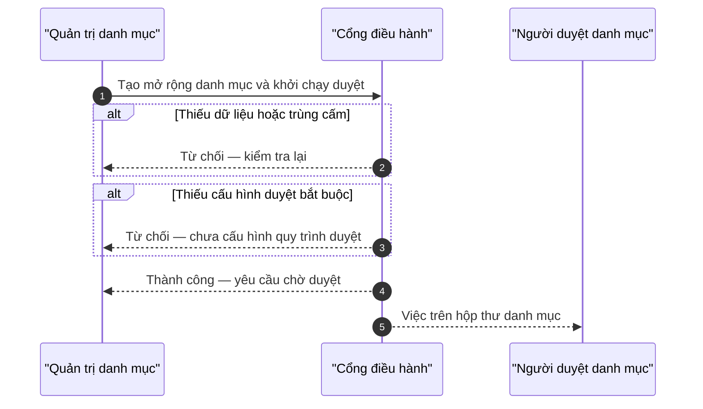
```mermaid
sequenceDiagram
  autonumber
  participant U as "Quản trị danh mục"
  participant SYS as "Cổng điều hành"
  participant A as "Người duyệt danh mục"
  U->>SYS: Tạo mở rộng danh mục và khởi chạy duyệt
  alt Thiếu dữ liệu hoặc trùng cấm
    SYS-->>U: Từ chối — kiểm tra lại
  end
  alt Thiếu cấu hình duyệt bắt buộc
    SYS-->>U: Từ chối — chưa cấu hình quy trình duyệt
  end
  SYS-->>U: Thành công — yêu cầu chờ duyệt
  SYS-->>A: Việc trên hộp thư danh mục
```

**Diễn biến nghiệp vụ**

| # | Tương tác | Điều kiện / quy tắc | Kết quả hoặc lỗi |
|---|-----------|---------------------|------------------|
| 1 | (Auth/phạm vi) | Hết phiên / ngoài quyền | Từ chối |
| 2 | Thiếu nhãn / loại | Bắt buộc | Từ chối |
| 3 | Trùng giá trị | Chính sách cấm trùng | Từ chối |
| 4 | Thiếu quy trình duyệt | Bắt buộc có | Từ chối — cấu hình trước |
| 5 | Khởi chạy OK | Đủ điều kiện | Yêu cầu chờ duyệt |
| 6 | Hộp thư duyệt | Có gán bước | Thấy việc |
| 7 | Thành công cuối | Có khóa yêu cầu / phiên | Xem Kết quả trả về |

**Kết quả trả về khi thành công**

| Ý | Nội dung |
|---|----------|
| Người dùng thấy | Yêu cầu ở trạng thái chờ duyệt |
| Bản ghi tạo / cập nhật | Yêu cầu mở rộng + phiên / bước duyệt danh mục |
| Khóa mang sang bước sau | Định danh yêu cầu / phiên duyệt |
| Trạng thái sau | Chờ phê duyệt |
| Việc được mở khóa tiếp | FR-XBOS-CAT-05 |

---

### 3.12 FR-XBOS-CAT-05 — Phê duyệt bước duyệt danh mục

| Thuộc tính | Mô tả |
|------------|--------|
| Actor | Người được gán duyệt danh mục |
| Ưu tiên | Cao |
| Điều kiện tiên quyết | Có việc duyệt danh mục đang chờ thuộc người duyệt |
| Điều kiện hậu | Bước duyệt xong; khi hoàn tất chuỗi — giá trị sẵn sàng dùng ở phân hệ đích; tải lại còn đúng |
| Mã UC | UC-XBOS-CAT-05 |
| Liên hệ phần mềm hiện tại | Đã có — approve catalog governance |

**Dữ liệu đầu vào**

| Trường | Bắt buộc | Ràng buộc / kiểm tra |
|--------|----------|----------------------|
| Việc duyệt danh mục | Có | Còn chờ và đúng người |
| Quyết định phê duyệt | Có | Đồng ý bước (từ chối: đợt sau) |
| Ghi chú | Không | Độ dài hợp lệ |

**Luồng chính**

1. Người duyệt mở hộp thư danh mục → mở chi tiết → Phê duyệt.
2. Hệ thống kiểm trạng thái chờ và người gán.
3. Ghi nhận duyệt → cập nhật yêu cầu / phiên.
4. Khi chuỗi duyệt hoàn tất: giá trị danh mục dùng được ở Nhân sự; tải lại nhãn / trạng thái còn đúng.

**Quy tắc nghiệp vụ**

- Không duyệt việc đã xử lý / sai người.
- Sau duyệt cuối: phân hệ đích phải dùng được giá trị (không chỉ đổi số đếm hộp thư).
- Empty hộp thư khi chưa có yêu cầu từ giao diện = trạng thái hợp lệ; không bịa việc để nghiệm thu.

**Sơ đồ tương tác**

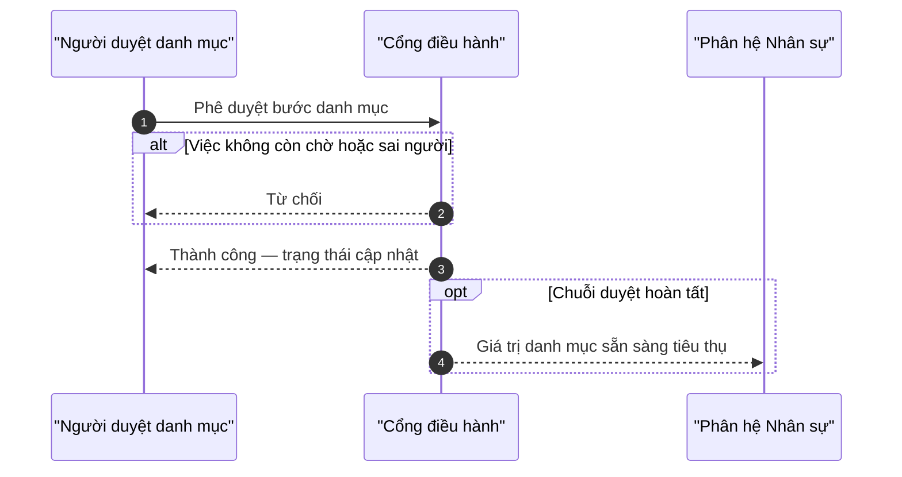
```mermaid
sequenceDiagram
  autonumber
  participant A as "Người duyệt danh mục"
  participant SYS as "Cổng điều hành"
  participant HR as "Phân hệ Nhân sự"
  A->>SYS: Phê duyệt bước danh mục
  alt Việc không còn chờ hoặc sai người
    SYS-->>A: Từ chối
  end
  SYS-->>A: Thành công — trạng thái cập nhật
  opt Chuỗi duyệt hoàn tất
    SYS-->>HR: Giá trị danh mục sẵn sàng tiêu thụ
  end
```

**Diễn biến nghiệp vụ**

| # | Tương tác | Điều kiện / quy tắc | Kết quả hoặc lỗi |
|---|-----------|---------------------|------------------|
| 1 | (Auth) | Hết phiên | Từ chối |
| 2 | Mở hộp thư | Có quyền | Việc chờ hoặc empty |
| 3 | Duyệt việc đã xong | Không còn chờ | Từ chối |
| 4 | Sai người gán | Không đủ quyền bước | Từ chối |
| 5 | Duyệt hợp lệ | Đúng bước | Cập nhật trạng thái |
| 6 | Hoàn tất chuỗi | Bước cuối | Danh mục sẵn sàng ở Nhân sự |
| 7 | Tải lại | Cùng phạm vi | Nhãn / trạng thái còn |
| 8 | Thành công cuối | Có khóa giá trị DM | Xem Kết quả trả về |

**Kết quả trả về khi thành công**

| Ý | Nội dung |
|---|----------|
| Người dùng thấy | Việc rời chờ; (nếu cuối) nhãn / trạng thái đã duyệt |
| Bản ghi tạo / cập nhật | Kết quả bước; giá trị danh mục hiệu lực khi hoàn tất |
| Khóa mang sang bước sau | Định danh giá trị danh mục (khi đã hiệu lực) |
| Trạng thái sau | Đã duyệt bước / đã phát hành dùng |
| Việc được mở khóa tiếp | Nhân sự dùng danh mục chuẩn trên form |

---

### 3.13 FR-XBOS-RACI-02 — Xem và chỉnh ma trận RACI theo pháp nhân

| Thuộc tính | Mô tả |
|------------|--------|
| Actor | Lãnh đạo tập đoàn / quản trị cấu hình |
| Ưu tiên | Cao |
| Điều kiện tiên quyết | Đã đăng nhập; đã chọn tư cách; đang ở chi tiết một pháp nhân trong phạm vi |
| Điều kiện hậu | Ô R/A/C/I đã lưu theo pháp nhân; tải lại trang vẫn giữ; không làm đổi ma trận pháp nhân khác |
| Mã UC | UC-RACI-02 |
| Liên hệ phần mềm hiện tại | Đã có — tab Nhiệm vụ và RACI tại chi tiết pháp nhân |

**Dữ liệu đầu vào**

| Trường | Bắt buộc | Ràng buộc / kiểm tra |
|--------|----------|----------------------|
| Pháp nhân đang mở | Có | Trong phạm vi tư cách |
| Hoạt động trên catalog RACI | Có | Thuộc catalog hiệu lực |
| Cột vai trò tổ chức | Có | Một trong các cột chuẩn tập đoàn |
| Giá trị RACI | Có khi lưu ô | Chỉ chữ cái vai trò hợp lệ (R, A, C, I hoặc tổ hợp chuẩn); ô trống = bỏ ghi đè, dùng mẫu tập đoàn |

**Luồng chính**

1. Người dùng mở chi tiết pháp nhân → tab Nhiệm vụ và RACI → xem ma trận.
2. Hệ thống hiển thị ma trận kế thừa mẫu tập đoàn kèm ghi đè của pháp nhân (nếu có).
3. Người dùng sửa một ô (ví dụ đổi I thành R) → xác nhận lưu.
4. Hệ thống ghi nhận ô theo pháp nhân → tải lại vẫn thấy giá trị mới; pháp nhân khác không bị đổi theo.

**Quy tắc nghiệp vụ**

- Chỉ sửa pháp nhân trong phạm vi; ngoài phạm vi → từ chối rõ.
- Giá trị ô phải thuộc bộ chữ cái RACI đã chuẩn hóa; ký tự lạ → từ chối lưu.
- Ô trống hợp lệ: bỏ ghi đè pháp nhân, trở lại mẫu tập đoàn.
- Ghi đè của pháp nhân A không lan sang pháp nhân B.

**Sơ đồ tương tác**

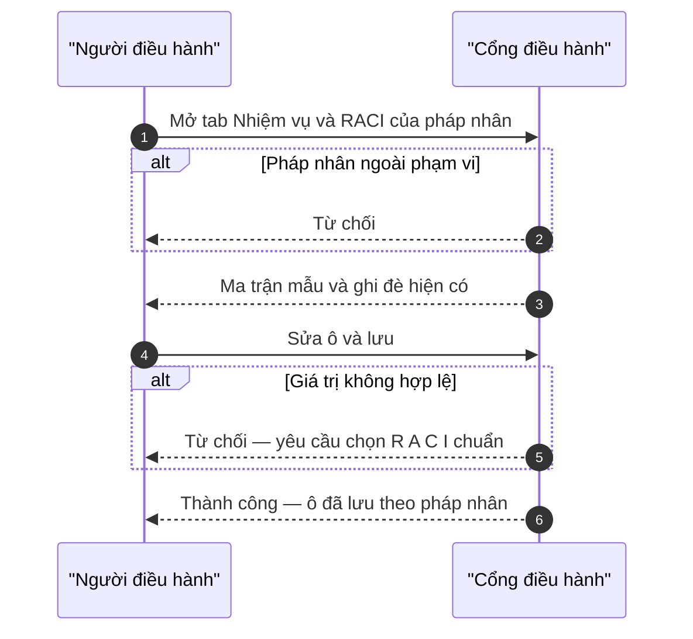
```mermaid
sequenceDiagram
  autonumber
  participant U as "Người điều hành"
  participant SYS as "Cổng điều hành"
  U->>SYS: Mở tab Nhiệm vụ và RACI của pháp nhân
  alt Pháp nhân ngoài phạm vi
    SYS-->>U: Từ chối
  end
  SYS-->>U: Ma trận mẫu và ghi đè hiện có
  U->>SYS: Sửa ô và lưu
  alt Giá trị không hợp lệ
    SYS-->>U: Từ chối — yêu cầu chọn R A C I chuẩn
  end
  SYS-->>U: Thành công — ô đã lưu theo pháp nhân
```

**Diễn biến nghiệp vụ**

| # | Tương tác | Điều kiện / quy tắc | Kết quả hoặc lỗi |
|---|-----------|---------------------|------------------|
| 1 | (Auth) | Hết phiên | Từ chối |
| 2 | Mở tab RACI | Pháp nhân trong phạm vi | Hiện ma trận |
| 3 | Mở pháp nhân ngoài phạm vi | Không đủ quyền | Từ chối |
| 4 | Sửa ô ký tự lạ | Ngoài bộ RACI chuẩn | Từ chối |
| 5 | Lưu ô hợp lệ | Đúng pháp nhân + hoạt động + cột | Ghi đè đã lưu |
| 6 | Xóa giá trị ô | Ô trống có chủ đích | Bỏ ghi đè — dùng mẫu tập đoàn |
| 7 | Tải lại | Cùng pháp nhân | Ô còn đúng |
| 8 | Thành công cuối | Có khóa ô RACI | Xem Kết quả trả về |

**Kết quả trả về khi thành công**

| Ý | Nội dung |
|---|----------|
| Người dùng thấy | Ô vừa sửa hiển thị giá trị mới trên ma trận |
| Bản ghi tạo / cập nhật | Ghi đè RACI theo pháp nhân (hoặc đã xóa ghi đè nếu ô trống) |
| Khóa mang sang bước sau | Định danh pháp nhân + hoạt động + cột vai trò |
| Trạng thái sau | Ma trận pháp nhân đã cập nhật |
| Việc được mở khóa tiếp | Tiếp tục cấu hình tổ chức / phân quyền (FR-CC-P0-04) |

---

### 3.14 FR-CC-P0-04 — Lưu ma trận phân quyền Settings

| Thuộc tính | Mô tả |
|------------|--------|
| Actor | Lãnh đạo tập đoàn / quản trị cấu hình |
| Ưu tiên | Cao |
| Điều kiện tiên quyết | Đã đăng nhập; có quyền mở Settings phân quyền; đã chọn tư cách đơn vị |
| Điều kiện hậu | Checkbox xem / ghi / xóa / duyệt (và phạm vi dữ liệu nếu có) đã lưu theo chức danh; tải lại còn đúng |
| Mã UC | UC-CC-P0-04 |
| Liên hệ phần mềm hiện tại | Đã có — ma trận phân quyền theo chức danh trên Settings |

**Dữ liệu đầu vào**

| Trường | Bắt buộc | Ràng buộc / kiểm tra |
|--------|----------|----------------------|
| Chức danh / vai trò đang chỉnh | Có | Thuộc danh mục chức danh được phép cấu hình |
| Quyền xem / ghi / xóa / duyệt | Có khi đổi | Checkbox theo từng chức năng |
| Phạm vi dữ liệu gắn quyền | Không | Chỉ trong tập phạm vi hệ thống cho phép |

**Luồng chính**

1. Người dùng mở Settings → ma trận phân quyền → chọn chức danh.
2. Hệ thống tải ma trận hiện có (checkbox theo chức năng).
3. Người dùng đổi một hoặc nhiều ô → lưu (có thể lưu gộp sau khi chỉnh).
4. Hệ thống ghi nhận → tải lại trang: ô giữ nguyên; người không đủ quyền không mở được ma trận.

**Quy tắc nghiệp vụ**

- Chỉ người có quyền cấu hình phân quyền mới sửa được; thiếu quyền → từ chối / ẩn thao tác lưu.
- Lưu phải theo đúng chức danh đang chọn; không ghi đè nhầm chức danh khác.
- Sau lưu thành công, tải lại phải khớp — không mất trạng thái checkbox.
- Thay đổi phân quyền không được mở lộ dữ liệu ngoài phạm vi tư cách đơn vị.

**Sơ đồ tương tác**

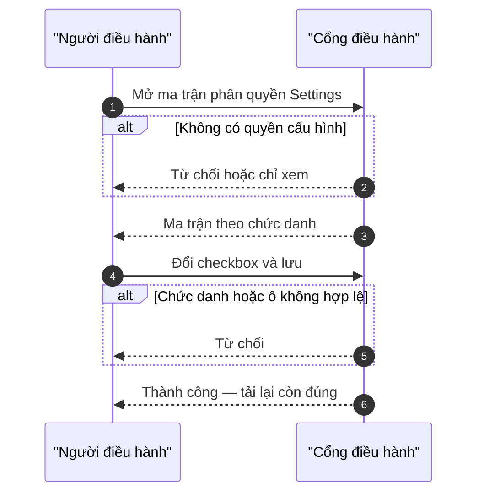
```mermaid
sequenceDiagram
  autonumber
  participant U as "Người điều hành"
  participant SYS as "Cổng điều hành"
  U->>SYS: Mở ma trận phân quyền Settings
  alt Không có quyền cấu hình
    SYS-->>U: Từ chối hoặc chỉ xem
  end
  SYS-->>U: Ma trận theo chức danh
  U->>SYS: Đổi checkbox và lưu
  alt Chức danh hoặc ô không hợp lệ
    SYS-->>U: Từ chối
  end
  SYS-->>U: Thành công — tải lại còn đúng
```

**Diễn biến nghiệp vụ**

| # | Tương tác | Điều kiện / quy tắc | Kết quả hoặc lỗi |
|---|-----------|---------------------|------------------|
| 1 | (Auth) | Hết phiên | Từ chối |
| 2 | Mở Settings phân quyền | Có quyền | Hiện ma trận |
| 3 | Không đủ quyền cấu hình | Thiếu quyền | Từ chối / không lưu |
| 4 | Đổi checkbox | Chức danh hợp lệ | Trạng thái chờ lưu |
| 5 | Lưu | Ô hợp lệ | Ma trận đã cập nhật |
| 6 | Tải lại | Cùng chức danh | Checkbox còn đúng |
| 7 | Thành công cuối | Có khóa ma trận chức danh | Xem Kết quả trả về |

**Kết quả trả về khi thành công**

| Ý | Nội dung |
|---|----------|
| Người dùng thấy | Ô checkbox vừa đổi giữ đúng sau lưu và sau tải lại |
| Bản ghi tạo / cập nhật | Ma trận quyền theo chức danh |
| Khóa mang sang bước sau | Định danh chức danh đã cấu hình |
| Trạng thái sau | Phân quyền đã áp dụng cho phiên làm việc tiếp theo theo chính sách hệ thống |
| Việc được mở khóa tiếp | Người dùng thuộc chức danh đó thao tác đúng quyền trên các màn liên quan |

---

### 3.15 FR-CC-P0-05 — Autosave catalog văn bản / đo lường / giá

| Thuộc tính | Mô tả |
|------------|--------|
| Actor | Quản trị cấu hình / lãnh đạo tập đoàn |
| Ưu tiên | Cao |
| Điều kiện tiên quyết | Đã đăng nhập; mở được màn catalog Command Center trong phạm vi |
| Điều kiện hậu | Giá trị ô đã lưu tự động; tải lại còn đúng phiên bản / nội dung vừa sửa |
| Mã UC | UC-CC-P0-05 |
| Liên hệ phần mềm hiện tại | Đã có — catalog văn bản, đo lường, giá trên Command Center |

**Dữ liệu đầu vào**

| Trường | Bắt buộc | Ràng buộc / kiểm tra |
|--------|----------|----------------------|
| Nhóm catalog (văn bản / đo lường / giá) | Có | Một trong các nhóm được hỗ trợ |
| Dòng / ô cần sửa | Có | Thuộc danh sách đang hiển thị |
| Giá trị mới | Có khi đổi | Độ dài / định dạng phù hợp loại ô (văn bản, số đo, số tiền) |
| Số tiền / đơn giá (nếu có) | Không | Nhóm nghìn khi nhập; lưu số thuần |

**Luồng chính**

1. Người dùng mở catalog Command Center (văn bản / đo lường / giá).
2. Hệ thống tải danh sách hiện hành trong phạm vi.
3. Người dùng sửa một ô → hệ thống tự lưu (không bắt buộc nút phát hành phiên bản song song cho thao tác này).
4. Tải lại trang → giá trị và nhãn phiên bản / đồng bộ (nếu có) còn đúng.

**Quy tắc nghiệp vụ**

- Chỉ lưu qua luồng catalog Command Center đã định nghĩa; không dùng thao tác phát hành phiên bản hợp đồng dữ liệu thay cho autosave ô.
- Ngoài phạm vi hoặc hết phiên → từ chối; không giữ bản nháp giả.
- Empty danh sách khi chưa có dòng = hợp lệ; không bịa dòng nghiệm thu.
- Số tiền / đơn giá: hiển thị nhóm nghìn; lưu đúng giá trị số.

**Sơ đồ tương tác**

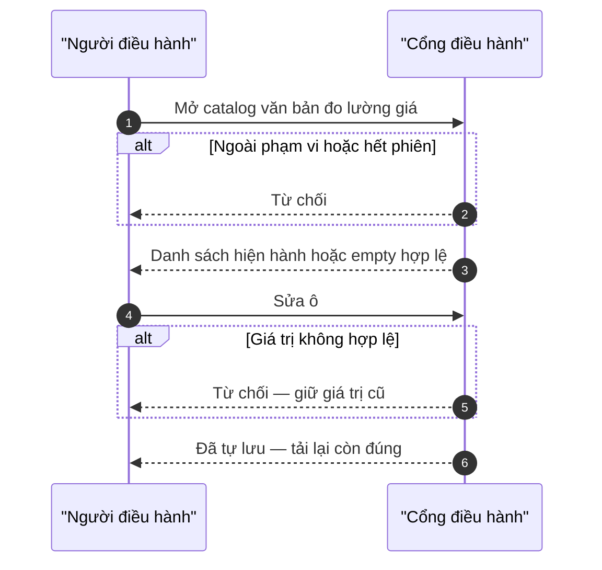
```mermaid
sequenceDiagram
  autonumber
  participant U as "Người điều hành"
  participant SYS as "Cổng điều hành"
  U->>SYS: Mở catalog văn bản đo lường giá
  alt Ngoài phạm vi hoặc hết phiên
    SYS-->>U: Từ chối
  end
  SYS-->>U: Danh sách hiện hành hoặc empty hợp lệ
  U->>SYS: Sửa ô
  alt Giá trị không hợp lệ
    SYS-->>U: Từ chối — giữ giá trị cũ
  end
  SYS-->>U: Đã tự lưu — tải lại còn đúng
```

**Diễn biến nghiệp vụ**

| # | Tương tác | Điều kiện / quy tắc | Kết quả hoặc lỗi |
|---|-----------|---------------------|------------------|
| 1 | (Auth) | Hết phiên | Từ chối |
| 2 | Mở catalog | Trong phạm vi | Danh sách hoặc empty |
| 3 | Ngoài phạm vi | Không đủ quyền | Từ chối |
| 4 | Sửa ô sai định dạng | Vi phạm ràng buộc | Từ chối — giữ cũ |
| 5 | Sửa ô hợp lệ | Autosave | Giá trị mới đã lưu |
| 6 | Tải lại | Cùng nhóm catalog | Ô / phiên bản còn đúng |
| 7 | Thành công cuối | Có khóa dòng catalog | Xem Kết quả trả về |

**Kết quả trả về khi thành công**

| Ý | Nội dung |
|---|----------|
| Người dùng thấy | Ô vừa sửa giữ giá trị mới; không banner lỗi giả |
| Bản ghi tạo / cập nhật | Dòng catalog Command Center (văn bản / đo lường / giá) |
| Khóa mang sang bước sau | Định danh dòng / nhóm catalog đã lưu |
| Trạng thái sau | Catalog đã đồng bộ cho phiên làm việc |
| Việc được mở khóa tiếp | Dùng chuẩn trên các màn cấu hình / báo cáo phụ thuộc catalog |

---

### 3.16 FR-XBOS-KPI-03 — Xem tổng hợp KPI đa cấp (rollup)

| Thuộc tính | Mô tả |
|------------|--------|
| Actor | Lãnh đạo tập đoàn (member: chỉ phạm vi được cấp) |
| Ưu tiên | Cao |
| Điều kiện tiên quyết | Đã đăng nhập; đã chọn tư cách; mở bảng điều hành / khu vực chỉ số |
| Điều kiện hậu | Widget / bảng KPI hiển thị đúng phạm vi; không lộ rollup tập đoàn khi không được cấp; không banner lỗi khi dữ liệu rỗng hợp lệ |
| Mã UC | UC-XBOS-KPI-03 |
| Liên hệ phần mềm hiện tại | Đã có — chỉ số KPI / việc cần xử lý trên Command Center |

**Dữ liệu đầu vào**

| Trường | Bắt buộc | Ràng buộc / kiểm tra |
|--------|----------|----------------------|
| Tư cách đơn vị đang chọn | Có | Khớp phiên |
| Kỳ / bộ lọc thời gian (nếu có) | Không | Trong khoảng hệ thống cho phép |
| Đơn vị lọc (nếu có) | Không | Phải thuộc phạm vi được cấp |

**Luồng chính**

1. Người dùng vào bảng điều hành tập đoàn (hoặc khu vực chỉ số KPI).
2. Hệ thống tổng hợp chỉ số theo phạm vi tư cách (rollup đa cấp khi được cấp).
3. Người dùng xem widget / bảng bằng nhãn tiếng Việt nghiệp vụ.
4. Nếu đổi tư cách sang đơn vị thành viên không được rollup: hệ thống không hiện chỉ số ngoài quyền; thông báo từ chối rõ ràng khi cố xem dữ liệu tập đoàn.

**Quy tắc nghiệp vụ**

- Lãnh đạo tập đoàn: được xem rollup trong phạm vi được cấp.
- Lãnh đạo đơn vị thành viên: không xem rollup / danh sách ngoài quyền (khớp FR phạm vi dữ liệu).
- Rỗng hợp lệ → empty trung thực; không spinner vô hạn; không bịa số.
- Nhãn giao diện dùng tiếng Việt nghiệp vụ (không hiện khóa kỹ thuật thô).

**Sơ đồ tương tác**

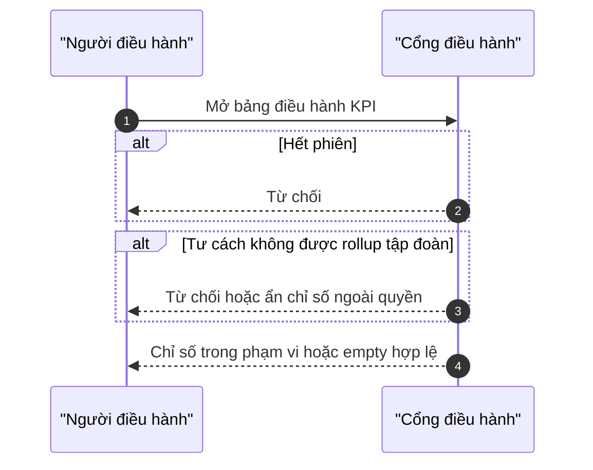
```mermaid
sequenceDiagram
  autonumber
  participant U as "Người điều hành"
  participant SYS as "Cổng điều hành"
  U->>SYS: Mở bảng điều hành KPI
  alt Hết phiên
    SYS-->>U: Từ chối
  end
  alt Tư cách không được rollup tập đoàn
    SYS-->>U: Từ chối hoặc ẩn chỉ số ngoài quyền
  end
  SYS-->>U: Chỉ số trong phạm vi hoặc empty hợp lệ
```

**Diễn biến nghiệp vụ**

| # | Tương tác | Điều kiện / quy tắc | Kết quả hoặc lỗi |
|---|-----------|---------------------|------------------|
| 1 | (Auth) | Hết phiên | Từ chối |
| 2 | Mở KPI | Tư cách tập đoàn hợp lệ | Hiện rollup trong phạm vi |
| 3 | Member xem rollup tập đoàn | Không được cấp | Từ chối / không lộ số |
| 4 | Lọc đơn vị ngoài phạm vi | Vi phạm phạm vi | Từ chối |
| 5 | Không có chỉ số kỳ này | Rỗng hợp lệ | Empty trung thực |
| 6 | Tải lại | Cùng tư cách | Chỉ số / empty còn đúng |
| 7 | Thành công cuối | Có khóa bộ chỉ số trong phạm vi | Xem Kết quả trả về |

**Kết quả trả về khi thành công**

| Ý | Nội dung |
|---|----------|
| Người dùng thấy | Widget / bảng KPI tiếng Việt trong đúng phạm vi (hoặc empty hợp lệ) |
| Bản ghi tạo / cập nhật | Không bắt buộc tạo bản ghi mới — bộ chỉ số tổng hợp theo kỳ / phạm vi |
| Khóa mang sang bước sau | Kỳ / phạm vi đang xem (để đào sâu chi tiết nếu có màn sau) |
| Trạng thái sau | Bảng điều hành đã tải xong trong phạm vi |
| Việc được mở khóa tiếp | Đào sâu đơn vị / việc cần xử lý liên quan (ngoài chi tiết đợt này) |

---

## 4. Yêu cầu phi chức năng

| Mã | Nhóm | Yêu cầu | Đo lường chấp nhận |
|----|------|---------|-------------------|
| NFR-01 | Bảo mật | Chỉ dữ liệu trong phạm vi tư cách | Thử ngoài phạm vi → từ chối rõ |
| NFR-02 | Tin cậy | Lưu tổ chức / duyệt xong tải lại còn | F5 sau thao tác thành công |
| NFR-03 | Usability | Empty trung thực; lỗi nêu hành động | Không spinner vô hạn / không lỗi giả khi rỗng |
| NFR-04 | Nhật ký | Thay đổi pháp nhân / duyệt có truy vết nội bộ | Có bản ghi kiểm toán theo chính sách vận hành |
| NFR-05 | Tương thích | Ngày dd/MM/yyyy; số lớn nhóm nghìn (vi-VN) | Khớp chuẩn giao diện tập đoàn |

---

## 5. Giao diện ngoài

| Hệ thống / phân hệ | Hướng | Nội dung trao đổi | Ghi chú |
|--------------------|-------|-------------------|---------|
| Phân hệ Nhân sự | XBOS → HRM | Danh mục chuẩn sau duyệt / phát hành | Tiêu thụ; không làm SoT danh mục tập đoàn |
| Dịch vụ xác thực cổng | Hai chiều | Phiên đăng nhập, tư cách đơn vị | Điều kiện mọi FR |
| Phân hệ nghiệp vụ khác | XBOS → | Cấu hình / danh mục khi được gắn | Ngoài chi tiết đợt này |

---

## 6. Ràng buộc nghiệp vụ tổng quát

1. Không lộ dữ liệu ngoài phạm vi tư cách đơn vị.
2. Không nghiệm thu duyệt hộp thư bằng dữ liệu giả không đi từ giao diện tạo nguồn.
3. Catalog đầy đủ use case nền tảng bổ sung ở đợt sau; **không** rút 16 FR (W1 + W2 batch) và không đè luồng nghiệm thu đã khóa.
4. Ranh giới: điều hành tập đoàn sở hữu chuẩn tổ chức / quy trình / danh mục phát hành; Nhân sự tiêu thụ trong đơn vị.
