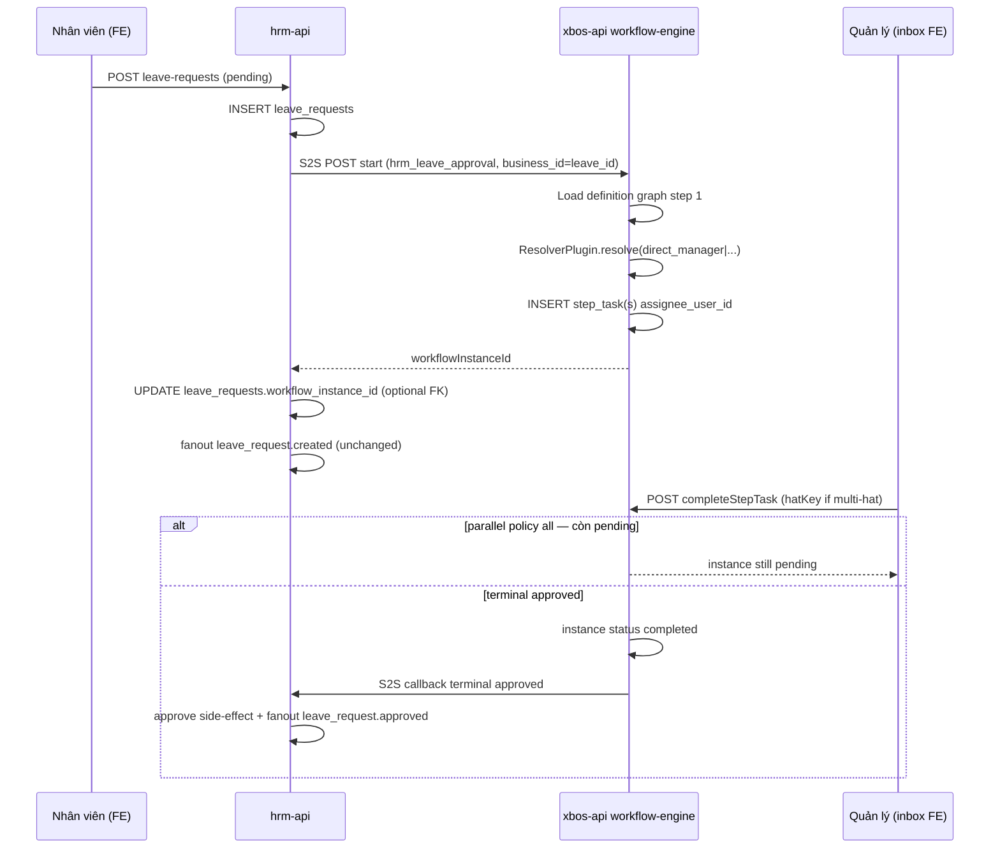

# ADR: XBOS Workflow — Dynamic assignee resolver (pilot: HRM leave)

| Field | Value |
|-------|--------|
| **ADR-ID** | ADR-WORKFLOW-RESOLVER-DYNAMIC-20260620 |
| **work_item_id** | `CD-FB-07-WF-DYNAMIC` |
| **Program** | `P1-CUSTOMER-DEMO-HRM-FEEDBACK-PROGRAM` · delta F4 |
| **Status** | **Accepted** |
| **Date** | 2026-06-20 |
| **Decision owner** | SA |
| **Consumers** | Dev-BE (xbos-api workflow-engine, hrm-api bridge), Dev-FE (inbox + leave UX), QA (AC-CD-F4-*), BA (SRS §16.2 promote) |
| **Related ADRs** | `ADR-HRM-RBAC-SCOPE-LADDER.md`, `ADR-XBOS-M01-OPENAPI-BOUNDARIES.md` |
| **Source delta** | `docs/program/deltas/CUSTOMER_DEMO_HRM_DELTA_20260620.md` §4 |
| **Evidence (as-is)** | `apps/api/xbos-api/src/workflow-engine/workflow-engine.service.ts` (`resolveHandlerInboxTarget` → `GROUP_APPROVER_USER`), `apps/api/hrm-api/src/attendance/leave-requests.service.ts` (direct approve/reject), `apps/api/hrm-api/src/settings-catalogs/xbos-catalog-workflow.bridge.ts` (S2S spawn pattern) |

---

## 1. Context

### 1.1 Business driver

Sau demo HRM (2026-06-20), khách yêu cầu workflow phê duyệt **linh hoạt** (chức danh, cấp trên, song song) tương đương mức automation benchmark (Luxury/Bay.vn) — **không** sao chép UI/data model ngoài. Consumer pilot: **đơn nghỉ phép** (maps `UC-HRM-10` → `UC-HRM-WF-01..04`).

### 1.2 As-is (code truth)

| Layer | Hiện trạng | Gap |
|-------|------------|-----|
| XBOS engine | `resolveHandlerInboxTarget()` gán mọi bước → `ceo@xe.vn` (`GROUP_APPROVER_USER`) | Không đọc org graph / position |
| Definition graph | Step có `handlerRoleId`, `hatKey`, optional `assigneeUserId` | Thiếu `resolver_type`, `resolver_config` normative |
| HRM leave | `POST leave-requests` → fanout; `approve`/`reject` trực tiếp HRM API | Không spawn XBOS instance; inbox không gắn resolver |
| Bridge pattern | `XbosCatalogWorkflowBridge` — HRM gọi XBOS S2S khi catalog extension | Mẫu tích hợp consumer ↔ engine đã có |

### 1.3 In-scope / out-of-scope

| In-scope (pilot) | Out-of-scope (wave này) |
|------------------|-------------------------|
| `workflow_code = hrm_leave_approval` | Generic automation rules (số tiền, phòng ban điều kiện) — UC-XBOS-13 conditions JSON only persist |
| 5 `resolver_type` normative + escalation | Import workflow từ Excel |
| Parallel policy `all` / `any` trên `parallel_group` | Thay thế toàn bộ catalog governance WF |
| HRM terminal callback (approved/rejected) | Mobile leave parity (follow-on wave) |

---

## 2. Problem statement

Hardcoded assignee breaks:

1. **AC-CD-F4-01** — manager đúng người trên inbox, không `GROUP_APPROVER_USER`.
2. **BR-CD-F4-02..04** — org graph + position assignment + escalation khi resolve rỗng.
3. **BR-XBOS-MULTI-HAT-01** — user đa vai phải duyệt từng `hat_key`, không gộp một click.
4. **UC-HRM-10 fanout** — terminal workflow phải đồng bộ `leave_requests.status` + notification pipeline hiện có.

---

## 3. Target architecture

### 3.1 Ownership boundary (normative)

```text
┌─────────────────────────────────────────────────────────────────┐
│ HRM (hrm-api) — domain SoT                                       │
│  leave_requests row · UC-HRM-10 fanout · scope (company UUID)   │
│  Spawn: sau INSERT leave pending → S2S start instance           │
│  Consume: terminal instance → approve/reject side-effect ONLY   │
└────────────────────────────┬────────────────────────────────────┘
                             │ S2S (service JWT, x-tenant-id, x-company-id)
                             ▼
┌─────────────────────────────────────────────────────────────────┐
│ XBOS (xbos-api) — workflow runtime SoT                           │
│  definition graph · instance · step_task · unified inbox          │
│  Resolver plugin at instance start + per-step advance             │
│  Inbox: GET workflow-engine/tasks?assigneeUserId=               │
└────────────────────────────┬────────────────────────────────────┘
                             │ read org graph
                             ▼
┌─────────────────────────────────────────────────────────────────┐
│ Shared resolution inputs                                         │
│  HRM: employees.manager_id (same company_id slug scope)         │
│  XBOS: xbos_position_assignment + position_template.code        │
│  Auth: xbos_user_tenant_membership (role_code resolver)           │
└─────────────────────────────────────────────────────────────────┘
```

**Invariant:** Inbox assignee resolution **chỉ** trong XBOS engine. HRM **không** tự tính approver cho inbox; HRM chỉ truyền `submitter` context khi spawn.

**Invariant:** `POST /api/hrm/attendance/leave-requests/:id/approve|reject` direct từ UI pilot **deprecated path** — inbox action gọi `workflow-engine` complete/reject; HRM API nhận callback khi instance terminal (BR-CD-F4-06).

### 3.2 Sequence (happy path — leave pilot)



---

## 4. Decision: Resolver plugin in XBOS engine

**Selected:** Option B — **pluggable resolver registry** inside `workflow-engine` service, invoked at **instance start** and **step advance** (not in HRM, not in FE).

| Option | Mô tả | Verdict |
|--------|--------|---------|
| A | HRM pre-computes assignee list, passes `steps[]` to XBOS | Rejected — duplicates org logic; breaks UC-XBOS-13 single definition |
| **B** | XBOS reads `resolver_type` from definition step payload; plugin registry | **Accepted** |
| C | External resolver microservice | Rejected — pilot latency/ops; overkill for T8 demo |

---

## 5. `resolver_type` enum (normative)

Stored on each workflow graph step (UC-XBOS-13 extension):

```json
{
  "stepKey": "manager_approval",
  "order": 1,
  "resolver_type": "direct_manager",
  "resolver_config": { },
  "allowsReject": true
}
```

### 5.1 Enum values

| `resolver_type` | `resolver_config` (required keys) | Resolve logic | Empty-set behavior |
|-----------------|-----------------------------------|---------------|------------------|
| `fixed_user` | `user_id` (email or stable user key) | Assign trực tiếp | **422** `XBOS-WF-422` inactive user — no spawn |
| `position_template` | `position_code`, `company_id` (operating slug, default `main`) | Active `xbos_position_assignment` WHERE template code match + scope | **Escalate** §6 |
| `direct_manager` | _(optional)_ `fallback_role_code` default `hrbp` | `employees.manager_id` → linked user account, same `company_id` as submitter | Fallback role_code; else **Escalate** §6 |
| `role_code` | `role_code`, `tenant_id` | `xbos_user_tenant_membership` match | **422** if zero active users |
| `parallel_group` | `resolver_types[]`, `resolver_configs[]`, `parallel_policy` | Expand each child resolver → N tasks same `step_key` | Per-child escalation; group fails closed if zero tasks after escalation |

**Validation (definition save):** Zod/class-validator at XBOS API — unknown `resolver_type` → `XBOS-WF-400`. `parallel_group` requires `parallel_policy` ∈ `all` \| `any`.

**Deprecation:** `assigneeUserId` / `handlerRoleId` alone on active definitions — engine treats as **`fixed_user`** shim only when `resolver_type` absent (transition); new pilot definition **must** set `resolver_type` explicitly.

### 5.2 Runtime context object (passed to every resolver)

```typescript
type ResolverRuntimeContext = {
  tenantId: string;
  companyId: string;           // XBOS instance company_id (holding normalized per existing WF rules)
  submitter: {
    userId: string;
    employeeId: string;
    companyId: string;         // HRM operating company UUID scope
  };
  businessType: 'hrm_leave';
  businessId: string;          // leave_requests.id
  stepKey: string;
};
```

### 5.3 Resolver output

```typescript
type ResolvedAssignee = {
  assigneeUserId: string;
  hatKey: string;              // from position_code / role_code / explicit config
  assignmentId?: string;       // xbos_position_assignment.id when applicable
  resolvedVia: resolver_type;
  escalated: boolean;
  escalationReason?: string;
};
```

---

## 6. Escalation policy — BR-CD-F4-04

When a resolver returns **zero** assignees (except `fixed_user` hard 422):

### 6.1 Escalation chain (ordered)

1. **Primary:** `position_template` with `position_code = CHRO` (or config `escalation_position_code`, default `CHRO`) within submitter `company_id` slug.
2. **Secondary:** `role_code = group_ceo` with `tenant_id` = master tenant (`xevn`).
3. **Tertiary:** `fixed_user` = platform catalog `GROUP_APPROVER_USER` (`ceo@xe.vn`) with `hatKey = group_ceo`.

### 6.2 Observability (mandatory)

| Field | Value |
|-------|--------|
| Log code | `WF-ERR-RESOLVE-ESCALATE` |
| Payload | `tenantId`, `instanceId`, `stepKey`, `resolver_type`, `original_config`, `escalation_tier` |
| Metrics | Counter `xbos_workflow_resolver_escalation_total{resolver_type,business_type}` |

**Invariant:** Escalation **still spawns** task — không để instance orphan without inbox row (BR-CD-F4-04 delta).

**Risk R-CD-01:** Org graph thiếu `manager_id` / assignment → escalation tần suất cao; QA pilot phải có NV→manager edge từ **FE org setup** (U65), không seed cheat.

---

## 7. Parallel completion policy — BR-CD-F4-03

Applies only when parent step `resolver_type = parallel_group`.

| `parallel_policy` | Advance rule | Inbox UX |
|-------------------|--------------|----------|
| `all` | Instance advances to next sequential step only when **every** child task `status = completed` | Mỗi approver thấy task riêng; AC-CD-F4-04 |
| `any` | First `completed` → auto `skipped` remaining pending child tasks same `step_key` → advance | First approval wins |

**Storage:** Child tasks share `step_key` + `parallel_group_id` (UUID in task `payload.parallelGroupId`) for engine grouping.

**Reject on parallel step:** Any child `rejectStepTask` → instance `rejected`; skip all pending siblings (existing engine behavior extended).

---

## 8. Self-approve & multi-hat — BR-CD-F4-05, BR-CD-F4-07

### 8.1 Self-approve (BR-CD-F4-05)

If resolved `assigneeUserId === submitter.userId`:

1. Auto-complete task with `payload.autoSkipped = true`, reason `self_approve_guard`.
2. Re-run resolver with **escalation tier +1** (manager's manager via `direct_manager` on manager employee, or `position_template` parent step).
3. If still self after max 2 hops → escalate §6.

### 8.2 Multi-hat (BR-XBOS-MULTI-HAT-01) vs parallel_group

| Concept | Meaning | Engine behavior |
|---------|---------|-----------------|
| **multi-hat** | **Same user**, multiple `hat_key` / assignments | **Separate tasks** (existing `completeStepTask` requires `hatKey` when pending siblings same user) — BR-CD-F4-07 |
| **parallel_group** | **Different users**, same approval step | N tasks; policy `all`/`any` §7 |

**SA rule:** Không dùng `parallel_group` để mô phỏng multi-hat một user — dùng multiple assignments → engine tự tách task theo `hat_key`.

---

## 9. HRM leave consumer contract — BR-CD-F4-01, BR-CD-F4-06

### 9.1 Spawn (BR-CD-F4-01)

| Field | Value |
|-------|--------|
| Trigger | `LeaveRequestsService.createLeaveRequest` after INSERT `status=pending` |
| `workflow_code` | `hrm_leave_approval` |
| `business_type` | `hrm_leave` |
| `business_id` | `leave_requests.id` |
| S2S endpoint | `POST /api/xbos/workflow-engine/instances/start` (new or extend existing) |
| Auth | Same pattern as `XbosCatalogWorkflowBridge` — service JWT + scope headers |

Definition lookup: `findActiveDefinitionByCode(tenantId, 'hrm_leave_approval')`. Missing definition → leave stays `pending`; log `HRM-WF-SPAWN-MISSING`; **no** silent approve.

### 9.2 Terminal consumer (BR-CD-F4-06)

| Instance status | HRM side-effect | Fanout |
|-----------------|-----------------|--------|
| `completed` | Internal call `approveLeaveRequest` với `reviewer_*` từ task payload | `leave_request.approved` |
| `rejected` | Internal call `rejectLeaveRequest` + `rejected_reason` | `leave_request.rejected` |

**Idempotency:** Callback handler checks `leave_requests.status = pending` before mutate; duplicate terminal event → 200 no-op.

**Boundary:** HRM **does not** expose workflow task IDs to mobile push routing in pilot — inbox remains Command Center / portal unified inbox (`UC-CC-P0-06`).

### 9.3 Reject / recall — UC-HRM-WF-04

| Actor | Action | Owner |
|-------|--------|-------|
| Approver | `rejectStepTask` | XBOS |
| Submitter recall (if enabled in definition) | `POST instances/:id/cancel` (new) → HRM `status=cancelled` | Wave 2; pilot: reject only |

Pilot minimum: reject path + fanout (AC-CD-F4-05).

---

## 10. Definition schema extension (UC-XBOS-13)

Persist in `xbos_workflow_definition.graph.steps[]`:

```json
{
  "stepKey": "dept_head",
  "order": 1,
  "name": "Trưởng phòng duyệt",
  "resolver_type": "position_template",
  "resolver_config": {
    "position_code": "TRUONG_PHONG",
    "company_id": "main"
  },
  "allowsReject": true
},
{
  "stepKey": "parallel_exec",
  "order": 2,
  "resolver_type": "parallel_group",
  "resolver_config": {
    "parallel_policy": "all",
    "resolver_types": ["direct_manager", "position_template"],
    "resolver_configs": [
      {},
      { "position_code": "HCNS", "company_id": "main" }
    ]
  }
}
```

Canvas FE (UC-XBOS-13): edit `resolver_type` + config panel; AC-CD-F4-06 persist after reload.

---

## 11. Error taxonomy

| Code | HTTP | When |
|------|------|------|
| `XBOS-WF-400` | 400 | Invalid resolver_config shape |
| `XBOS-WF-422` | 422 | `fixed_user` / `role_code` zero assignees (no escalation) |
| `XBOS-WF-422` | 422 | Multi-hat complete without `hatKey` (existing) |
| `WF-ERR-RESOLVE-ESCALATE` | — | Log/metric only; task still created |
| `HRM-WF-SPAWN-MISSING` | — | No active definition; leave pending without instance |
| `HRM-WF-CALLBACK-SKIP` | — | Terminal callback on non-pending leave |

---

## 12. Security & scope

- Resolvers **must** filter by `tenantId` + operating `company_id` per `ADR-HRM-RBAC-SCOPE-LADDER` — no cross-tenant assignee.
- `direct_manager` reads HRM `employees` via **internal read API or shared DB view** — document in TechSpec §11 delta; S2S only, no FE direct graph read.
- Callback HRM ← XBOS: shared secret / service JWT; reject unsigned callbacks.

---

## 13. Implementation & validation plan

### 13.1 Dev-BE waves (ordered)

1. **xbos-api:** `ResolverRegistry` + unit matrix jest (AC-CD-F4-02,03,04).
2. **xbos-api:** Replace `resolveHandlerInboxTarget` usage in instance spawn path; keep shim for legacy definitions.
3. **xbos-api:** Parallel group advance logic in `completeStepTask`.
4. **hrm-api:** `LeaveWorkflowBridge` (mirror catalog bridge) spawn + terminal webhook/callback.
5. **Seed governance:** Active definition `hrm_leave_approval` via admin canvas (U65 FE path) — **not** seed script for UAT evidence.

### 13.2 Dev-FE

- Inbox leave task detail → `completeStepTask` / `rejectStepTask` (not direct HRM approve).
- Workflow canvas: resolver config fields (AC-CD-F4-06).

### 13.3 QA exit (U65 browser)

| AC | Evidence |
|----|----------|
| AC-CD-F4-01 | UF-HRM leave FE → manager inbox |
| AC-CD-F4-02..05 | Network + `xbos_workflow_step_task` assignee |
| AC-CD-F4-07 | Demo ≥3 resolver types |

### 13.4 Rollback

Feature flag `WORKFLOW_DYNAMIC_RESOLVER_ENABLED=false` → legacy `fixed_user` = `GROUP_APPROVER_USER` for pilot code only; HRM bridge no-op spawn.

---

## 14. Risks & mitigations

| ID | Risk | Mitigation |
|----|------|------------|
| R-CD-01 | Empty manager graph | Escalation §6 + FE org setup before demo |
| R-WF-01 | HRM/XBOS company_id slug mismatch (`main` vs UUID) | Resolver context uses both; document in bridge DTO |
| R-WF-02 | Double approve (direct API + callback) | Deprecate direct approve from inbox UI; idempotent callback |
| R-WF-03 | Multi-hat UX confusion | Require `hatKey` label in inbox (existing 422 guard) |

---

## 15. Traceability

| UC / BR | ADR section |
|---------|-------------|
| UC-HRM-WF-01 | §9.1 |
| UC-HRM-WF-02 | §5 |
| UC-HRM-WF-03 | §7 |
| UC-HRM-WF-04 | §9.3 |
| BR-CD-F4-01..07 | §6, §7, §8, §9 |
| UC-XBOS-13/14 | §5, §8.2, §10 |
| UC-HRM-10 fanout | §9.2 |

**SRS promote:** Merge §4 delta → `docs/hrm/SRS.md` §16.2 (BA governance wave; not blocking BE start).

---

## 16. Decision sign-off

| Role | Status | Date |
|------|--------|------|
| SA | **Accepted** | 2026-06-20 |
| PM | Pending intake | — |
| TM/QC | Review at READY_FOR_QA | — |

**Residual (explicit):**

- SRS §16.2 formal merge (BA).
- `instances/cancel` recall submitter (UC-HRM-WF-04 full) — defer post-pilot.
- OpenAPI delta for `resolver_config` on workflow definition endpoints.
- Mobile inbox parity — separate work_item.

---

## 17. Completion contract

**completion_report:** ADR accepted — dynamic resolver plugin in XBOS engine; normative `resolver_type` enum (5 values); parallel policy `all`/`any`; escalation chain BR-CD-F4-04 with `WF-ERR-RESOLVE-ESCALATE`; HRM leave spawn/terminal boundary; multi-hat vs parallel_group clarified. No `apps/**` edits.

**next_owner:** pm

**next_dispatch_prompt:**

```text
work_item_id: CD-FB-07-WF-DYNAMIC-BE
from_role: pm
to_role: dev-be
entry_criteria: ADR docs/decisions/ADR-WORKFLOW-RESOLVER-DYNAMIC-20260620.md Accepted — §5 resolver registry, §6 escalation, §7 parallel, §9 HRM bridge
exit_criteria: (1) xbos-api ResolverRegistry + jest matrix AC-CD-F4-02..04; (2) hrm-api LeaveWorkflowBridge spawn on create + terminal callback; (3) active definition hrm_leave_approval via canvas/U65 path; (4) evidence docs/qa/evidence/cd-fb-07-wf-dynamic-be-YYYYMMDD.md; ack_status READY_FOR_QA
spec_ref: delta §4 · ADR-WORKFLOW-RESOLVER-DYNAMIC-20260620 §5-9 · UC-HRM-WF-01..04 · BR-CD-F4-01..07
allowed_paths: apps/api/xbos-api/src/workflow-engine/**, apps/api/hrm-api/src/attendance/**, apps/api/hrm-api/src/**/leave-workflow*
forbidden_paths: apps/web/** (dispatch dev-fe parallel after BE contract frozen)
cấm: pnpm seed:* for UAT evidence (U65)
```

**evidence_path:** `docs/decisions/ADR-WORKFLOW-RESOLVER-DYNAMIC-20260620.md`

**ack_status:** **PASS_TO_PM**
